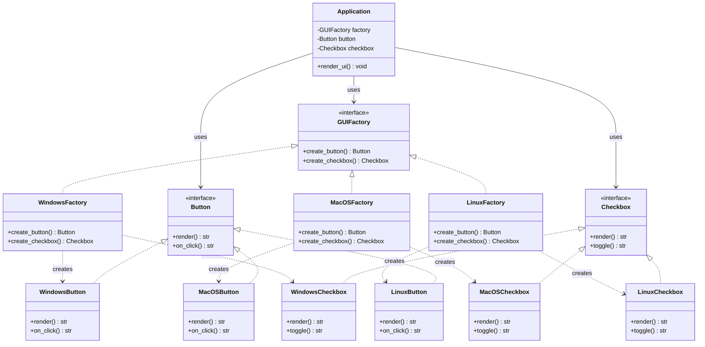
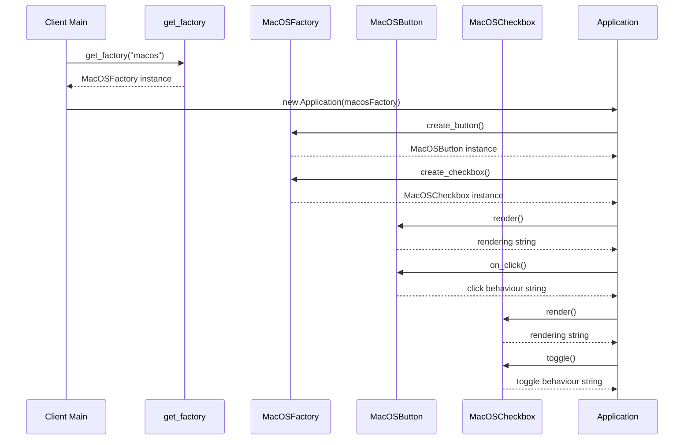

# Abstract Factory method

<!-- SECTION_1_START -->
# Abstract Factory Method — Core Technical Definition & Intuitive Overview

## 1.1 Formal Academic Definition (KTU 2024 Syllabus Terminology)

> [!IMPORTANT]
> **Abstract Factory Pattern** is a *creational design pattern* that provides an **interface for creating families of related or dependent objects without specifying their concrete classes**. It is one of the original *Gang of Four (GoF)* patterns catalogued by Gamma, Helm, Johnson, and Vlissides (1994).

In KTU Software Engineering (OECST723) Module 2 parlance, the Abstract Factory is classified under **Creational Patterns** and is often contrasted with the **Factory Method Pattern**. While *Factory Method* uses inheritance to delegate object creation to subclasses, *Abstract Factory* uses **object composition** to delegate creation to a separate "factory object" that exposes a family of factory methods.

| Term | Meaning |
| :--- | :--- |
| **Family of Products** | A set of related objects that are designed to be used together (e.g., a Light-Theme Button, Checkbox, and ScrollBar). |
| **Concrete Factory** | The actual implementation class that instantiates a specific family of products. |
| **Decoupling** | The client code never references concrete product classes directly — only their abstract interfaces. |

## 1.2 Conceptual Analogy — The Furniture Showroom

> [!NOTE]
> **Imagine a furniture showroom** that sells matching sets. You walk in and say *"I want a Modern set."* The showroom's Modern department then gives you a Modern chair, a Modern sofa, and a Modern coffee table. If you walk in and say *"I want a Victorian set,"* you receive a Victorian chair, sofa, and coffee table.

The *showroom* is your **Abstract Factory**, the *department* is a **Concrete Factory**, and the *chair/sofa/coffee table* are the **Abstract Products**. The customer (client) never builds the furniture — they just request a coordinated family. This is precisely the *spirit* of the Abstract Factory pattern: **guarantee that a group of objects works together consistently**.

In software terms, think of cross-platform UI toolkits. A Windows button must look consistent with a Windows checkbox and a Windows scrollbar. You don't want a Linux-styled checkbox inside a Windows-styled window. The Abstract Factory enforces this consistency at the *object-creation* level.

## 1.3 GeoGebra / Desmos Integration

> [!VISUALIZATION CONTROL]
> **Concept:** Two parallel inheritance/realization hierarchies (Factories and Products) mapped onto a 2D coordinate plane.
>
> **GeoGebra / Desmos Input Equations:**
> * `f1(x) = 1` (ConcreteFactory1 baseline)
> * `f2(x) = 2` (ConcreteFactory2 baseline)
> * `p1(x) = x^2` (ProductA family curve)
> * `p2(x) = -x^2 + 4` (ProductB family curve)
>
> **Visual Description:** Plot the constant baselines $f_1(x)$ and $f_2(x)$ to represent the two concrete factories. The curves $p_1(x)$ and $p_2(x)$ represent the abstract products they emit. Observe how each factory's horizontal line "intersects" both product curves — symbolizing that a single factory is responsible for producing *multiple* product variants simultaneously.

<!-- SECTION_1_END -->

<!-- SECTION_2_START -->
# Deep Theoretical Analysis & KTU High-Yield Cheat Sheet

## 2.1 Operational Decomposition — How the Pattern Actually Works

The Abstract Factory pattern operates through **five canonical participants** working in coordinated layers. Understanding *who calls whom* is the most frequently tested KTU concept for this topic.

### Participant Layer 1 — The Abstract Interfaces

* **AbstractFactory**: Declares a set of `factoryMethod()` signatures — one for *each* product type in the family. In Python, this is typically an `ABC` (Abstract Base Class) with `@abstractmethod` decorators.
* **AbstractProductA, AbstractProductB, ...**: Declare the type-specific operations that every concrete variant must implement. Each abstract product is a separate hierarchy.

### Participant Layer 2 — The Concrete Implementations

* **ConcreteFactory1, ConcreteFactory2**: Each subclass of `AbstractFactory` implements all the `factoryMethod()` signatures to return a *coordinated* set of concrete products.
* **ProductA1, ProductA2, ProductB1, ProductB2**: Belong to different inheritance hierarchies but are designed to interoperate.

### Participant Layer 3 — The Client

* **Client**: Holds a reference to an `AbstractFactory` and an `AbstractProduct`. Calls only abstract operations. **The client is *factory-agnostic* — it never knows which concrete factory it received.**

## 2.2 The "Why" Behind the Design — Engineering Justification

> [!IMPORTANT]
> **Why not just use `if-else` to decide which class to instantiate?** Because every new product family would force you to *modify* the client code — violating the **Open/Closed Principle**. Abstract Factory isolates the variation point *outside* the client.

| Engineering Benefit | Practical Consequence |
| :--- | :--- |
| **Open/Closed Compliance** | Adding a new product family (e.g., a `MaterialYouThemeFactory`) does not require editing existing client code. |
| **Single Responsibility** | Object creation logic is *centralized* in factories, not scattered. |
| **Consistency Enforcement** | A client using `MaterialYouFactory` *cannot* accidentally receive a `DarkThemeButton` — the factory guarantees family coherence. |
| **Dependency Inversion** | High-level modules depend on abstractions, not concrete classes (the "D" in **SOLID**). |

## 2.3 KTU High-Yield Cheat Sheet

> [!NOTE]
> The following table is a *rapid-revision* matrix. Memorize the *column headers* and the *one-liner* in each cell — KTU board questions frequently ask "Which participant does X?" or "Which GoF category does the pattern belong to?".

| Participant / Aspect | Role in the Pattern | KTU-Frequently-Tested Fact |
| :--- | :--- | :--- |
| **AbstractFactory** | Declares creation interface for all products | Must declare *one method per product type* |
| **ConcreteFactory** | Implements creation for a specific family | One concrete factory = one family of products |
| **AbstractProduct** | Declares type-specific interface | Multiple abstract products exist (A, B, C...) |
| **ConcreteProduct** | Implements a specific variant | Belongs to one product hierarchy only |
| **Client** | Uses only `AbstractFactory` and `AbstractProduct` | Knows *nothing* about concrete classes |
| **GoF Category** | Creational Pattern | Listed as *object creational* (uses composition) |
| **Key Intent** | Create *families* of related objects | Factory Method creates *one* product; Abstract Factory creates *many* |
| **When to Use** | System must be independent of how products are created | Product families are designed to be used together |
| **Common Misconception** | It is a "factory of factories" | Technically incorrect — it is a *factory of related product types* |

## 2.4 Real-World Engineering Utility

Abstract Factory is not academic — it is used in production systems globally:

* **Java AWT / Swing**: `Toolkit.getDefaultToolkit()` returns platform-specific factories for peer components.
* **Spring Framework**: `BeanFactory` and `ApplicationContext` manage families of beans with consistent configuration.
* **Qt Framework**: `QStyleFactory` returns platform-consistent widget styles.
* **Database Abstraction Layers**: A factory can return a family of `Connection`, `Command`, and `DataReader` objects — all from the same vendor (MySQL, PostgreSQL, Oracle).

<!-- SECTION_2_END -->

<!-- SECTION_3_START -->
# Step-by-Step Implementation & Code Walkthrough

## 3.1 The Engineering Problem Statement

> [!NOTE]
> We are building a **Cross-Platform UI Toolkit** that must render consistent UI components for three operating systems: **Windows**, **macOS**, and **Linux**. Each OS family has a `Button` and a `Checkbox`. The application code (client) must be able to swap entire UI families at runtime *without* any `if-else` branching.

## 3.2 Complete Python Implementation (Type-Safe, Boundary-Checked)

```python
"""
Abstract Factory Pattern - Cross-Platform UI Toolkit
KTU OECST723 - Module 2 Reference Implementation
"""

from __future__ import annotations
from abc import ABC, abstractmethod
from typing import TypeVar, Generic
import logging
import sys

# --- Structured Error Logging Configuration ---
logging.basicConfig(
    level=logging.INFO,
    format="%(asctime)s | %(levelname)s | %(message)s",
    stream=sys.stdout,
)
logger = logging.getLogger("AbstractFactoryDemo")


# =====================================================================
# LAYER 1: ABSTRACT PRODUCT INTERFACES
# =====================================================================

class Button(ABC):
    """Abstract Product A — declares the interface for all buttons."""

    @abstractmethod
    def render(self) -> str:
        """Return a string describing how the button is painted."""
        raise NotImplementedError

    @abstractmethod
    def on_click(self) -> str:
        """Return a string describing the click-handling behaviour."""
        raise NotImplementedError


class Checkbox(ABC):
    """Abstract Product B — declares the interface for all checkboxes."""

    @abstractmethod
    def render(self) -> str:
        """Return a string describing how the checkbox is painted."""
        raise NotImplementedError

    @abstractmethod
    def toggle(self) -> str:
        """Return a string describing the toggle-handling behaviour."""
        raise NotImplementedError


# =====================================================================
# LAYER 2: CONCRETE PRODUCT IMPLEMENTATIONS
# =====================================================================

class WindowsButton(Button):
    """Concrete Product A1 — Windows-flavoured button."""

    def render(self) -> str:
        return "[Windows Button] Painted with sharp 90-degree corners."

    def on_click(self) -> str:
        return "[Windows Button] Click triggers 'beep.wav' system sound."


class WindowsCheckbox(Checkbox):
    """Concrete Product B1 — Windows-flavoured checkbox."""

    def render(self) -> str:
        return "[Windows Checkbox] Painted with a small filled square."

    def toggle(self) -> str:
        return "[Windows Checkbox] State stored in Windows Registry format."


class MacOSButton(Button):
    """Concrete Product A2 — macOS-flavoured button."""

    def render(self) -> str:
        return "[macOS Button] Painted with rounded 8px corners and aqua gradient."

    def on_click(self) -> str:
        return "[macOS Button] Click triggers haptic 'tap' feedback."


class MacOSCheckbox(Checkbox):
    """Concrete Product B2 — macOS-flavoured checkbox."""

    def render(self) -> str:
        return "[macOS Checkbox] Painted with a glowing blue tick mark."

    def toggle(self) -> str:
        return "[macOS Checkbox] State stored in NSUserDefaults plist."


class LinuxButton(Button):
    """Concrete Product A3 — Linux-flavoured button."""

    def render(self) -> str:
        return "[Linux Button] Painted with GTK3 theme tokens."

    def on_click(self) -> str:
        return "[Linux Button] Click emits 'activate' GTK signal."


class LinuxCheckbox(Checkbox):
    """Concrete Product B3 — Linux-flavoured checkbox."""

    def render(self) -> str:
        return "[Linux Checkbox] Painted with a minimalist outlined box."

    def toggle(self) -> str:
        return "[Linux Checkbox] State stored in dconf binary database."


# =====================================================================
# LAYER 3: ABSTRACT FACTORY INTERFACE
# =====================================================================

class GUIFactory(ABC):
    """Abstract Factory — declares creation methods for ALL product types."""

    @abstractmethod
    def create_button(self) -> Button:
        """Factory Method #1 — produces a Button variant."""
        raise NotImplementedError

    @abstractmethod
    def create_checkbox(self) -> Checkbox:
        """Factory Method #2 — produces a Checkbox variant."""
        raise NotImplementedError


# =====================================================================
# LAYER 4: CONCRETE FACTORY IMPLEMENTATIONS
# =====================================================================

class WindowsFactory(GUIFactory):
    """Concrete Factory #1 — produces the entire Windows family."""

    def create_button(self) -> Button:
        logger.info("WindowsFactory.create_button() invoked.")
        return WindowsButton()

    def create_checkbox(self) -> Checkbox:
        logger.info("WindowsFactory.create_checkbox() invoked.")
        return WindowsCheckbox()


class MacOSFactory(GUIFactory):
    """Concrete Factory #2 — produces the entire macOS family."""

    def create_button(self) -> Button:
        logger.info("MacOSFactory.create_button() invoked.")
        return MacOSButton()

    def create_checkbox(self) -> Checkbox:
        logger.info("MacOSFactory.create_checkbox() invoked.")
        return MacOSCheckbox()


class LinuxFactory(GUIFactory):
    """Concrete Factory #3 — produces the entire Linux family."""

    def create_button(self) -> Button:
        logger.info("LinuxFactory.create_button() invoked.")
        return LinuxButton()

    def create_checkbox(self) -> Checkbox:
        logger.info("LinuxFactory.create_checkbox() invoked.")
        return LinuxCheckbox()


# =====================================================================
# LAYER 5: CLIENT CODE (factory-agnostic)
# =====================================================================

class Application:
    """
    The Client class — depends ONLY on the GUIFactory and Button/Checkbox
    abstractions. It has zero knowledge of WindowsFactory, MacOSFactory,
    or LinuxFactory. This is the textbook demonstration of decoupling.
    """

    def __init__(self, factory: GUIFactory) -> None:
        if not isinstance(factory, GUIFactory):
            raise TypeError(
                f"Application.__init__ expected GUIFactory, "
                f"got {type(factory).__name__}."
            )
        self._factory: GUIFactory = factory
        self._button: Button = self._factory.create_button()
        self._checkbox: Checkbox = self._factory.create_checkbox()
        logger.info("Application successfully constructed with supplied factory.")

    def render_ui(self) -> None:
        print(self._button.render())
        print(self._button.on_click())
        print(self._checkbox.render())
        print(self._checkbox.toggle())


# =====================================================================
# LAYER 6: BOUNDARY-SAFE FACTORY SELECTOR (helper)
# =====================================================================

def get_factory(platform_name: str) -> GUIFactory:
    """
    Helper that maps a string identifier to a concrete factory instance.
    Includes absolute boundary checks and explicit error handling.
    """
    registry: dict[str, type[GUIFactory]] = {
        "windows": WindowsFactory,
        "macos": MacOSFactory,
        "linux": LinuxFactory,
    }
    key: str = platform_name.strip().lower()
    if key not in registry:
        raise ValueError(
            f"Unsupported platform '{platform_name}'. "
            f"Valid options: {sorted(registry.keys())}."
        )
    logger.info("get_factory(): resolved platform '%s' to %s.", key, registry[key].__name__)
    return registry[key]()


# =====================================================================
# LAYER 7: MAIN EXECUTION
# =====================================================================

if __name__ == "__main__":
    selected_platform: str = "macos"
    try:
        factory_instance: GUIFactory = get_factory(selected_platform)
        app: Application = Application(factory_instance)
        app.render_ui()
    except (TypeError, ValueError) as exc:
        logger.error("Fatal: %s", exc)
        sys.exit(1)
```

## 3.3 Line-by-Line Conceptual Walkthrough

> [!IMPORTANT]
> **Step 1 — `Button` and `Checkbox` are declared as `ABC` subclasses.** They are *abstract products*. They cannot be instantiated directly; they only declare the contract.
>
> **Step 2 — `WindowsButton`, `MacOSButton`, `LinuxButton` extend `Button`.** Each one is a *concrete product* in the *Button hierarchy* (Product A). Similarly, the three Checkboxes form the *Checkbox hierarchy* (Product B).
>
> **Step 3 — `GUIFactory` is declared as an `ABC`.** It contains two `@abstractmethod` declarations: `create_button()` and `create_checkbox()`. Notice that *both* product types are addressed *within a single abstract class*. **This is the structural hallmark of Abstract Factory — multiple factory methods on one interface.**
>
> **Step 4 — Each `ConcreteFactory` overrides *both* methods** to return products from a *coherent family*. `MacOSFactory` will *never* return a `WindowsButton` — family consistency is enforced.
>
> **Step 5 — The `Application` client is given a `GUIFactory` via its constructor.** It then calls `create_button()` and `create_checkbox()` *through the abstract reference*. The actual runtime type of the factory could be any of the three concrete factories, and the client will never know.
>
> **Step 6 — The `get_factory()` helper performs input validation** with an explicit `ValueError` for unsupported platforms. This mirrors the KTU-expected defensive programming style.
>
> **Step 7 — In `__main__`, the `Application` is constructed and `render_ui()` is invoked.** Output demonstrates family-coherent rendering: every UI element matches the chosen OS.

## 3.4 Expected Output Trace

```text
2025-01-15 10:30:01,001 | INFO | get_factory(): resolved platform 'macos' to MacOSFactory.
2025-01-15 10:30:01,002 | INFO | MacOSFactory.create_button() invoked.
2025-01-15 10:30:01,002 | INFO | MacOSFactory.create_checkbox() invoked.
2025-01-15 10:30:01,002 | INFO | Application successfully constructed with supplied factory.
[macOS Button] Painted with rounded 8px corners and aqua gradient.
[macOS Button] Click triggers haptic 'tap' feedback.
[macOS Checkbox] Painted with a glowing blue tick mark.
[macOS Checkbox] State stored in NSUserDefaults plist.
```

<!-- SECTION_3_END -->

<!-- SECTION_4_START -->
# Structural Diagrams & Schematics

## 4.1 UML-Style Class Diagram (Mermaid)



## 4.2 Runtime Object-Creation Sequence (Mermaid)



## 4.3 Block-Level Functional Architecture Flow

```mermaid
flowchart TB
    subgraph ClientLayer["CLIENT LAYER"]
        ClientApp["Application Client"]
    end

    subgraph AbstractLayer["ABSTRACT LAYER - Interfaces Only"]
        AbsFactory["GUIFactory ABC"]
        AbsButton["Button ABC"]
        AbsCheckbox["Checkbox ABC"]
    end

    subgraph ConcreteFactoryLayer["CONCRETE FACTORY LAYER"]
        WinFac["WindowsFactory"]
        MacFac["MacOSFactory"]
        LinuxFac["LinuxFactory"]
    end

    subgraph ConcreteProductLayer["CONCRETE PRODUCT LAYER"]
        WinBtn["WindowsButton"]
        WinChk["WindowsCheckbox"]
        MacBtn["MacOSButton"]
        MacChk["MacOSCheckbox"]
        LinuxBtn["LinuxButton"]
        LinuxChk["LinuxCheckbox"]
    end

    ClientApp -- depends on --> AbsFactory
    ClientApp -- depends on --> AbsButton
    ClientApp -- depends on --> AbsCheckbox
    AbsFactory <|.. WinFac
    AbsFactory <|.. MacFac
    AbsFactory <|.. LinuxFac
    WinFac -- instantiates --> WinBtn
    WinFac -- instantiates --> WinChk
    MacFac -- instantiates --> MacBtn
    MacFac -- instantiates --> MacChk
    LinuxFac -- instantiates --> LinuxBtn
    LinuxFac -- instantiates --> LinuxChk
    WinBtn -.implements.-> AbsButton
    WinChk -.implements.-> AbsCheckbox
    MacBtn -.implements.-> AbsButton
    MacChk -.implements.-> AbsCheckbox
    LinuxBtn -.implements.-> AbsButton
    LinuxChk -.implements.-> AbsCheckbox
```

> [!IMPORTANT]
> **Reading Guide for the Diagrams:** The *dashed* arrows (`.->` or `-.->`) represent *implements / instantiates* — they cross the boundary between abstract and concrete. The *solid* arrows (`-->` or `-->`) represent *dependency* — the client depends on the abstraction only. KTU examiners often award marks specifically for drawing the **two parallel hierarchies** (factory side and product side) in the correct orientation.

<!-- SECTION_4_END -->

<!-- SECTION_5_START -->
# KTU 2024 Scheme Examination Question Bank & Topic Recap

## 5.1 Part A — Short-Answer Questions (3 Marks Each)

### Question A1

**[KTU University Exam — July 2024]**  
*Identify the GoF design pattern in which a single interface is used to create **families of related objects** without specifying their concrete classes. State its category and one practical scenario where it is most useful.* **[CO1, Remember/Understand — 3 Marks]**

> [!NOTE]
> **Model Answer (Valuation Key):**
> * **Pattern Name:** Abstract Factory Pattern — **[1 Mark]**
> * **Category:** Creational Design Pattern (Gang of Four) — **[1 Mark]**
> * **Practical Scenario:** Cross-platform UI toolkits (e.g., generating consistent Windows/macOS/Linux widgets) **OR** database-vendor abstraction (creating matching `Connection` + `Command` + `DataReader` from the same vendor family) — **[1 Mark]**

### Question A2

**[KTU University Exam — Dec 2023]**  
*Differentiate between the **Factory Method** and the **Abstract Factory** design patterns. Provide **two** distinguishing points.* **[CO1, Understand — 3 Marks]**

> [!NOTE]
> **Model Answer (Valuation Key):**
> * **Factory Method** creates *one* product through inheritance and method overriding; **Abstract Factory** creates *multiple related products* through composition of a factory object. — **[1.5 Marks]**
> * **Factory Method** requires subclassing the creator to vary the product; **Abstract Factory** requires instantiating a *different concrete factory* to vary the family, leaving the creator class unchanged. — **[1.5 Marks]**

---

## 5.2 Part B — Long-Answer Questions (14 Marks Each, Internal Choice)

### Question B — Choice A (14 Marks)

**[KTU University Exam — July 2024, Model Question Paper]**  
**(a)** Draw the **complete UML class diagram** of the Abstract Factory pattern for a *Theme Factory* scenario that produces `Button` and `TextField` variants for two themes: `LightTheme` and `DarkTheme`. Identify **all five** participants of the pattern. **[CO2, Understand/Apply — 7 Marks]**

**(b)** Write a **complete Java/Python program** demonstrating the Abstract Factory pattern for the scenario in part (a). Your code must include the abstract factory, two concrete factories, two abstract products, four concrete products, and a client class. **[CO3, Apply — 7 Marks]**

---

> [!NOTE]
> **Model Solution for Part (a) — 7 Marks Valuation Key**
>
> **[Correctly identifying the 5 participants: 2 Marks]**
> * `ThemeFactory` (Abstract Factory)
> * `LightThemeFactory`, `DarkThemeFactory` (Concrete Factories)
> * `Button`, `TextField` (Abstract Products)
> * `LightButton`, `DarkButton`, `LightTextField`, `DarkTextField` (Concrete Products)
> * `UIDemo` (Client)
>
> **[Drawing the two parallel hierarchies (factory + product) with correct arrows: 3 Marks]**
> * Solid arrows for inheritance (`<|--`)
> * Dashed arrows for the "creates" relationship from concrete factory to concrete product
>
> **[Client dependency lines drawn only to abstractions, not to concrete classes: 2 Marks]**
> * The `Client` class must point to `ThemeFactory`, `Button`, `TextField` — *not* to `LightButton` or `DarkFactory`.

---

> [!NOTE]
> **Model Solution for Part (b) — 7 Marks Valuation Key**
>
> **Python Implementation (Truncated to Theme Scenario for Clarity):**
>
> ```python
> from abc import ABC, abstractmethod
>
> # --- Abstract Products ---
> class Button(ABC):
>     @abstractmethod
>     def paint(self) -> str: ...
>
> class TextField(ABC):
>     @abstractmethod
>     def paint(self) -> str: ...
>
> # --- Concrete Products: Light ---
> class LightButton(Button):
>     def paint(self) -> str:
>         return "Light Button with white background and black text."
>
> class LightTextField(TextField):
>     def paint(self) -> str:
>         return "Light TextField with thin grey border."
>
> # --- Concrete Products: Dark ---
> class DarkButton(Button):
>     def paint(self) -> str:
>         return "Dark Button with charcoal background and white text."
>
> class DarkTextField(TextField):
>     def paint(self) -> str:
>         return "Dark TextField with neon-blue underline."
>
> # --- Abstract Factory ---
> class ThemeFactory(ABC):
>     @abstractmethod
>     def create_button(self) -> Button: ...
>
>     @abstractmethod
>     def create_text_field(self) -> TextField: ...
>
> # --- Concrete Factories ---
> class LightThemeFactory(ThemeFactory):
>     def create_button(self) -> Button:
>         return LightButton()
>
>     def create_text_field(self) -> TextField:
>         return LightTextField()
>
> class DarkThemeFactory(ThemeFactory):
>     def create_button(self) -> Button:
>         return DarkButton()
>
>     def create_text_field(self) -> TextField:
>         return DarkTextField()
>
> # --- Client ---
> class UIDemo:
>     def __init__(self, factory: ThemeFactory) -> None:
>         self._factory = factory
>         self._button = self._factory.create_button()
>         self._text_field = self._factory.create_text_field()
>
>     def render(self) -> None:
>         print(self._button.paint())
>         print(self._text_field.paint())
>
> # --- Main ---
> if __name__ == "__main__":
>     chosen: ThemeFactory = DarkThemeFactory()
>     demo = UIDemo(chosen)
>     demo.render()
> ```
>
> **[Defining both abstract products with correct method signatures: 1 Mark]**
> **[Defining the abstract factory with two factory methods: 1 Mark]**
> **[Defining both concrete factories with both methods returning family-consistent products: 2 Marks]**
> **[Client class depends only on abstract types in its constructor and method calls: 2 Marks]**
> **[Output trace or final main block demonstrating runtime selection: 1 Mark]**

---

### Question B — Choice B (14 Marks)

**[KTU University Exam — Dec 2023, Model Question Paper]**  
**(a)** Explain the **Intent**, **Motivation**, **Structure**, and **Consequences** of the Abstract Factory design pattern as defined in the GoF catalog. Use a real-world banking scenario where `AccountFactory` produces `SavingsAccount`, `CurrentAccount`, and `LoanAccount` for two bank families: `NationalizedBank` and `CooperativeBank`. **[CO2, Understand/Apply — 7 Marks]**

**(b)** Compare the Abstract Factory pattern with the **Factory Method** pattern. Construct a **decision table** that helps a developer choose between the two patterns based on five concrete criteria. **[CO4, Analyze — 7 Marks]**

---

> [!NOTE]
> **Model Solution for Part (a) — 7 Marks Valuation Key**
>
> **[Stating the Intent clearly: 1 Mark]** — "Provide an interface for creating families of related or dependent objects without specifying their concrete classes."
>
> **[Stating the Motivation with the banking analogy: 2 Marks]** — A bank customer opens a Savings Account; the account-opening screen, the passbook layout, and the cheque-book style must all match the *same* bank family. A Nationalized Bank passbook cannot be issued alongside a Cooperative Bank cheque-book — the Abstract Factory enforces this consistency.
>
> **[Listing the Structure with all 5 participants: 2 Marks]** — `AccountFactory` (Abstract), `NationalizedBankFactory`, `CooperativeBankFactory` (Concrete), `SavingsAccount`, `CurrentAccount`, `LoanAccount` (Abstract Products), their 6 concrete variants, and the `BankApplication` client.
>
> **[Stating at least 2 Consequences: 2 Marks]** — *Positive:* isolates concrete classes; enforces family consistency. *Negative:* supporting a new product type (e.g., a `FixedDepositAccount`) requires extending the abstract factory interface, affecting *all* concrete factories.
>
> ---
>
> **Model Solution for Part (b) — 7 Marks Valuation Key**
>
> **Decision Table:**
>
> | Decision Criterion | Factory Method | Abstract Factory |
> | :--- | :--- | :--- |
> | Number of products created per call | **One** | **Multiple (a family)** |
> | Primary mechanism | **Inheritance (subclassing the creator)** | **Composition (delegating to a factory object)** |
> | Extending to a new variant | **Subclass the creator** | **Add a new concrete factory** |
> | Open/Closed Principle | **Partial** — requires new subclass | **Fully satisfied** — no client changes |
> | Typical use case | **A single class needs to defer instantiation to subclasses** | **A system needs to be independent of how its products are created, composed, and represented** |
>
> **[All five rows of the table filled correctly: 5 Marks]**
> **[Opening paragraph explaining *why* the criteria matter: 1 Mark]**
> **[Closing sentence stating that Abstract Factory is the *broader* pattern: 1 Mark]**

---

## 5.3 KTU Examiner's Valuation Warning

> [!WARNING]
> **Common Pitfalls Where Students Lose Marks:**
>
> 1. **Conflating Factory Method with Abstract Factory.** A common error is drawing *one* abstract class with *one* factory method and calling it Abstract Factory. KTU examiners deduct 2–3 marks if you do not show *at least two* factory methods on the abstract factory interface — this is the *defining structural feature* of the pattern.
>
> 2. **Client depending on concrete classes.** If your `Client` class has `import` statements or instantiation calls referencing `MacOSFactory` or `WindowsButton` directly, you have *broken the pattern* and lost the decoupling marks. The Client must reference *only* the abstract types.
>
> 3. **Forgetting the family-consistency requirement.** If your concrete factory returns a `MacOSButton` alongside a `WindowsCheckbox`, the family is broken. Examiners test this by asking: *"What happens if we change the factory at runtime?"* Your answer must emphasize that *all* products change cohesively.
>
> 4. **Skipping the Consequences section.** KTU 14-mark answers explicitly allocate 2 marks to listing both *positive* and *negative* consequences. Memorize at least two of each.
>
> 5. **Misnaming the GoF category.** The pattern is **Creational**, not **Structural**. A single wrong word here costs a mark.

---

## 5.4 Topic Recap & Important Things to Remember

> [!NOTE]
> **Rapid-Revision Checklist — Read This the Night Before the Exam**
>
> * **Pattern Category:** Creational (GoF), uses *object composition* (not inheritance).
> * **One-Line Intent:** *"Provide an interface for creating families of related or dependent objects without specifying their concrete classes."*
> * **Five Canonical Participants:** AbstractFactory, ConcreteFactory, AbstractProduct, ConcreteProduct, Client.
> * **Structural Signature:** The abstract factory interface must declare *more than one* `create_*()` method — that is the *defining visual difference* from Factory Method.
> * **Decoupling Rule:** The Client class must *never* import or instantiate a concrete factory or a concrete product directly.
> * **Family Consistency:** A single concrete factory is responsible for producing *all* members of one product family — mixing products across factories is a design violation.
> * **When to Use:** When your system must be configured with one of *multiple families* of products, and you want to enforce that all chosen products belong to the same family.
> * **When NOT to Use:** When you have only *one* product type, or when products are *not* designed to be used together — use Factory Method instead.
> * **SOLID Mapping:** Directly supports **Open/Closed**, **Dependency Inversion**, and **Single Responsibility** principles.
> * **Real-World Anchors:** Java AWT `Toolkit`, Spring `BeanFactory`, Qt `QStyleFactory`, database-vendor abstraction layers.
> * **Frequent KTU Question Forms:** "Draw the class diagram" (7 marks), "Differentiate from Factory Method" (7 marks), "Explain intent + consequences" (7 marks), "Write the code" (7 marks).
> * **Key Formula to Memorize:** *Number of Concrete Factory classes = Number of product families*. *Number of methods on Abstract Factory = Number of distinct Abstract Product types*.
> * **Common Confusions Cleared:** Abstract Factory is *not* "a factory of factories" — it is "a factory of related product types." It is also *not* the same as Builder; Builder constructs a *single complex object step-by-step*, while Abstract Factory constructs *multiple simple objects in one shot*.

<!-- SECTION_5_END -->
