# Behavioral Design Pattern

<!-- SECTION_1_START -->

# Behavioral Design Patterns

## 1.1 Formal Definition (KTU 2024 Syllabus Terminology)

> [!IMPORTANT]
> **Behavioral Design Patterns** are a category of design patterns in software engineering that are concerned with **algorithms and the assignment of responsibilities between objects**. They describe **patterns of communication between objects** that are difficult to follow at runtime, and they focus on **how objects interact and communicate** rather than on how they are instantiated or structured.

In the **Gang of Four (GoF) classification**, behavioral patterns constitute one of the three primary pattern families (alongside **Creational** and **Structural** patterns), comprising **11 well-documented patterns**.

> [!NOTE]
> **Catalog Reference (GoF - Gamma, Helm, Johnson, Vlissides, 1994):** The 11 Behavioral Patterns are:
> 1. Chain of Responsibility
> 2. Command
> 3. Interpreter
> 4. Iterator
> 5. Mediator
> 6. Memento
> 7. Observer
> 8. State
> 9. Strategy
> 10. Template Method
> 11. Visitor

## 1.2 Conceptual Analogy / Intuition

> [!TIP]
> **Plain English Analogy — "The Office Workflow"**
>
> Imagine an **employee grievance office**. An employee submits a complaint at the front desk. The desk clerk cannot solve it, so they pass it to the supervisor. The supervisor also cannot resolve it, so they forward it to the manager. The manager finally resolves it. Nobody in the chain knows who will ultimately solve the problem; they only know the **next person to forward it to**.
>
> This is exactly how the **Chain of Responsibility** behavioral pattern works! The request **flows through a chain of handlers** until one of them processes it. The sender does not need to know which object will finally handle the request — this **decouples the sender from the receiver**.

### Intuitive Summary of the Pattern Family

| Real-World Concept | Behavioral Pattern |
|---|---|
| Newspaper subscription → multiple readers notified | **Observer** |
| Choosing a sorting algorithm at runtime | **Strategy** |
| TV remote button → undo/redo operations | **Command** |
| Vending machine changing behavior based on state | **State** |
| Algorithm skeleton with customizable steps | **Template Method** |
| Forwarding an email up the chain | **Chain of Responsibility** |
| Air Traffic Controller coordinating flights | **Mediator** |
| Music playlist play-next/previous | **Iterator** |

> [!IMPORTANT]
> **Core Principle:** Behavioral patterns **shift the focus from object structure to object interaction**. They make complex flows easier to understand by **encapsulating communication logic** behind well-defined interfaces.

<!-- SECTION_1_END -->

<!-- SECTION_2_START -->

# Deep Theoretical Analysis & KTU High-Yield Formula Sheet

## 2.1 Classification of Behavioral Patterns

Behavioral patterns can be grouped into three functional clusters:

> [!NOTE]
> **Cluster A — Object Behavioural Patterns (use object composition)**
> Use object composition where some objects delegate work to others. Examples: Strategy, State, Iterator, Visitor.
>
> **Cluster B — Class Behavioural Patterns (use inheritance)**
> Use inheritance to distribute behavior between classes. Examples: Template Method, Interpreter.
>
> **Cluster C — Communication / Coordination Patterns**
> Deal with message passing and event handling. Examples: Observer, Mediator, Chain of Responsibility, Command, Memento.

## 2.2 The Major Patterns — Step-by-Step Logic

### A. Observer Pattern

> [!IMPORTANT]
> **One-to-Many Dependency.** When one object (the *Subject*) changes state, **all its dependents (Observers)** are notified automatically. Often described as **Publish–Subscribe**.

**Why it works:** Decouples the subject from the concrete observer classes — the subject only knows they implement a common interface.

**How it works:**
1. The Subject maintains a list of registered Observers.
2. Observers register/subscribe via `attach(observer)`.
3. When the Subject's state changes, it calls `notify()` which iterates over all Observers and invokes `update()` on each.

### B. Strategy Pattern

> [!IMPORTANT]
> **Family of algorithms, encapsulated, interchangeable.** Defines a set of algorithms, encapsulates each one, and makes them **interchangeable** at runtime.

**Why:** Eliminates conditional statements (e.g., long if-else or switch chains) for selecting behavior.

**How:**
1. Define a `Strategy` interface with a common method (e.g., `execute()`).
2. Implement concrete strategies (e.g., `Add`, `Subtract`).
3. The `Context` class holds a reference to a Strategy and delegates the work to it.

### C. Command Pattern

> [!IMPORTANT]
> **Encapsulate a request as an object.** This lets you **parameterize objects with operations**, **queue requests**, **support undo**, and **log operations**.

**Why:** Decouples the object that invokes the operation from the one that knows how to perform it.

**How:**
1. Define a `Command` interface with a method like `execute()` (and optionally `undo()`).
2. Concrete commands implement this interface, holding a reference to a `Receiver`.
3. The `Invoker` (e.g., a remote control) holds a list of Command objects and calls `execute()`.

### D. State Pattern

> [!IMPORTANT]
> **Object behavior changes based on internal state.** An object appears to change its class when its state changes.

**Why:** Replaces complex state-transition conditionals (e.g., `if (state == "...") ...`).

**How:**
1. Define a `State` interface.
2. Each concrete state implements behavior specific to that state.
3. The `Context` class delegates state-specific behavior to the current `State` object.

### E. Template Method Pattern

> [!IMPORTANT]
> **Skeleton of an algorithm in a base class, subclasses override specific steps** without changing the overall structure.

**Why:** Promotes code reuse and enforces a consistent algorithm structure.

**How:**
1. Abstract class defines the `templateMethod()` and abstract `primitiveOperation()` methods.
2. Subclasses override only the primitive operations, not the template method itself.

### F. Chain of Responsibility Pattern

> [!IMPORTANT]
> **Pass a request along a chain of handlers** until one of them handles it.

**Why:** Decouples sender from receiver; gives multiple objects a chance to handle the request.

**How:**
1. Define a `Handler` interface with a `handleRequest()` and a `setNext()` method.
2. Each concrete handler either processes the request or forwards it to the next handler in the chain.

### G. Mediator Pattern

> [!IMPORTANT]
> **Centralized communication controller.** Objects communicate through a **Mediator** rather than directly with each other, reducing chaotic dependencies.

**Why:** Reduces the many-to-many relationships between communicating objects to one-to-many.

**How:**
1. Define a `Mediator` interface.
2. Colleagues communicate with the Mediator instead of with each other.

### H. Iterator Pattern

> [!IMPORTANT]
> **Sequential access to elements of a collection** without exposing the underlying representation (list, tree, stack, etc.).

**Why:** Provides a uniform way to traverse different data structures.

**How:**
1. Define an `Iterator` interface with `hasNext()`, `next()`, `remove()`.
2. Concrete iterators implement traversal logic for specific collections.

### I. Memento Pattern

> [!IMPORTANT]
> **Capture and externalize an object's internal state** so that it can be **restored later** (the basis of Undo/Redo).

**Why:** Preserves encapsulation boundaries while allowing state rollback.

**How:**
1. The `Originator` creates a Memento object capturing its current state.
2. The `Caretaker` stores Mementos but never modifies or inspects them.
3. To restore, the Originator accepts a Memento and reinstates its state.

### J. Visitor Pattern

> [!IMPORTANT]
> **Add new operations to existing object structures without modifying their classes.**

**Why:** Separates algorithms from the objects on which they operate.

**How:**
1. Add an `accept(visitor)` method to each element class.
2. The Visitor implements a `visit()` method for each element type.
3. The element calls back into the visitor: `visitor.visit(this)`.

### K. Interpreter Pattern

> [!IMPORTANT]
> **Given a language, define a representation for its grammar** along with an interpreter that uses the representation to interpret sentences in the language.

**Why:** Useful for simple rule-based systems, DSLs, expression evaluators.

**How:**
1. Define grammar rules as classes.
2. Build an Abstract Syntax Tree (AST).
3. The `interpret(context)` method recursively evaluates the AST.

## 2.3 KTU High-Yield Formula Sheet / Cheat Sheet

| Pattern | Intent | Key Participants | Common KTU Use-Case |
|---|---|---|---|
| **Observer** | One-to-Many notification | Subject, Observer, ConcreteObserver | Event handling systems (e.g., UI listeners) |
| **Strategy** | Interchangeable algorithms | Context, Strategy, ConcreteStrategy | Payment gateway selection |
| **Command** | Request as object | Command, ConcreteCommand, Invoker, Receiver | Undo/Redo in text editors |
| **State** | Behavior depends on state | Context, State, ConcreteState | Vending machine, TCP connection states |
| **Template Method** | Algorithm skeleton | AbstractClass, ConcreteClass | Framework hooks (e.g., JUnit, Servlet `service()`) |
| **Chain of Responsibility** | Pass request along chain | Handler, ConcreteHandler | Exception handling, Logging frameworks |
| **Mediator** | Centralized communication | Mediator, Colleague | Chat room, Air traffic control |
| **Iterator** | Sequential traversal | Iterator, Aggregate, ConcreteIterator | Java `Iterator`, Python `iter()` |
| **Memento** | Save/restore state | Originator, Memento, Caretaker | Undo operations, snapshotting |
| **Visitor** | Operations on object structure | Visitor, Element, ConcreteElement | Compiler AST traversal, Report generation |
| **Interpreter** | Language grammar interpreter | AbstractExpression, TerminalExpression, NonTerminalExpression | SQL parser, Regex engine |

> [!TIP]
> **Exam Tip:** KTU questions almost always test **Observer**, **Strategy**, **State**, **Command**, and **Template Method**. Focus extra attention there.

## 2.4 Real-World Engineering Utility

- **Observer** powers the **MVC architectural pattern** and reactive UI frameworks (e.g., React's state subscription model, Vue's reactivity system).
- **Strategy** is the foundation of **pluggable algorithm selection** in payment gateways (Razorpay, Stripe) where multiple fraud-detection or routing strategies can be swapped.
- **Command** is used in **transactional systems** and **task scheduling frameworks** (e.g., Java's `Runnable`, Spring's `@Transactional` command queue).
- **State** models **protocol connections** (TCP's `CLOSED`, `LISTEN`, `ESTABLISHED`).
- **Memento** underpins **Git's commit history** and database **snapshot/rollback features**.

<!-- SECTION_2_END -->

<!-- SECTION_3_START -->

# Step-by-Step Derivations & Code/Symbolic Implementation

## 3.1 Observer Pattern — Complete Python Implementation

> [!NOTE]
> The Observer pattern establishes a **one-to-many dependency** between a Subject and its Observers. When the Subject's state changes, all registered Observers are notified and updated automatically.

### 3.1.1 Class Structure (UML Conceptual Mapping)

| Role | Responsibility |
|---|---|
| `Subject` (Observable) | Maintains list of observers; provides `attach`, `detach`, `notify` |
| `Observer` (Interface) | Declares the `update` method |
| `ConcreteSubject` | Stores state; triggers `notify` on state change |
| `ConcreteObserver` | Implements `update` to react to subject changes |

### 3.1.2 Exhaustive Python Code

```python
from __future__ import annotations
from abc import ABC, abstractmethod
from typing import List


# ---------- Step 1: Define the Observer interface ----------
class Observer(ABC):
    """Abstract Observer interface. Any subscriber must implement update()."""
    @abstractmethod
    def update(self, temperature: float, humidity: float, pressure: float) -> None:
        pass


# ---------- Step 2: Define the Subject interface ----------
class Subject(ABC):
    """Abstract Subject interface. Provides subscription management."""
    @abstractmethod
    def attach(self, observer: Observer) -> None:
        pass

    @abstractmethod
    def detach(self, observer: Observer) -> None:
        pass

    @abstractmethod
    def notify(self) -> None:
        pass


# ---------- Step 3: Concrete Subject - WeatherStation ----------
class WeatherStation(Subject):
    """Concrete subject. Stores weather state and notifies observers on change."""

    def __init__(self) -> None:
        self._observers: List[Observer] = []
        self._temperature: float = 0.0
        self._humidity: float = 0.0
        self._pressure: float = 0.0

    def attach(self, observer: Observer) -> None:
        if observer not in self._observers:
            self._observers.append(observer)
            print(f"[WeatherStation] Observer {type(observer).__name__} attached.")

    def detach(self, observer: Observer) -> None:
        if observer in self._observers:
            self._observers.remove(observer)
            print(f"[WeatherStation] Observer {type(observer).__name__} detached.")

    def set_measurements(self, t: float, h: float, p: float) -> None:
        """Triggered by external sensor. Updates state and notifies."""
        print("\n[WeatherStation] New measurements received.")
        self._temperature = t
        self._humidity = h
        self._pressure = p
        self.notify()

    def notify(self) -> None:
        for obs in self._observers:
            obs.update(self._temperature, self._humidity, self._pressure)


# ---------- Step 4: Concrete Observers ----------
class CurrentConditionsDisplay(Observer):
    def update(self, temperature: float, humidity: float, pressure: float) -> None:
        print(f"  [CurrentDisplay] Temp={temperature}°C  Humidity={humidity}%  Pressure={pressure}hPa")


class StatisticsDisplay(Observer):
    def update(self, temperature: float, humidity: float, pressure: float) -> None:
        print(f"  [StatisticsDisplay] Avg temp recorded: {temperature}°C")


# ---------- Step 5: Client / Driver Code ----------
if __name__ == "__main__":
    station = WeatherStation()

    current = CurrentConditionsDisplay()
    stats = StatisticsDisplay()

    station.attach(current)
    station.attach(stats)

    station.set_measurements(28.5, 65.0, 1013.2)
    station.detach(stats)
    station.set_measurements(30.1, 70.0, 1012.8)
```

**Output Trace:**

```
[WeatherStation] Observer CurrentConditionsDisplay attached.
[WeatherStation] Observer StatisticsDisplay attached.

[WeatherStation] New measurements received.
  [CurrentDisplay] Temp=28.5°C  Humidity=65.0%  Pressure=1013.2hPa
  [StatisticsDisplay] Avg temp recorded: 28.5°C
[WeatherStation] Observer StatisticsDisplay detached.

[WeatherStation] New measurements received.
  [CurrentDisplay] Temp=30.1°C  Humidity=70.0%  Pressure=1012.8hPa
```

> [!TIP]
> **Exam Writing Strategy:** When asked to "draw the class diagram" for Observer, ensure you show: (1) `Subject → Observer` association, (2) `Subject` has a list of `Observer*`, (3) `ConcreteSubject` and `ConcreteObserver` are connected via inheritance to their abstract classes.

---

## 3.2 Strategy Pattern — Complete Python Implementation

> [!NOTE]
> The Strategy pattern defines a family of algorithms, encapsulates each one, and makes them interchangeable. It lets the algorithm vary independently from the clients that use it.

### 3.2.1 Mathematical Form

Let $C$ be the Context, $S$ be the set of strategies, where $S = \{s_1, s_2, \dots, s_n\}$. The Context delegates the operation $f$ as:

$$C.\text{execute}(x) = s_i.\text{algorithm}(x) \quad \text{where} \quad s_i \in S \text{ is the current strategy}$$

This way, switching $s_i$ changes the behavior of $C$ **without modifying $C$ itself** (the **Open/Closed Principle**).

### 3.2.2 Exhaustive Python Code

```python
from __future__ import annotations
from abc import ABC, abstractmethod
from typing import List


# ---------- Step 1: Strategy interface ----------
class PaymentStrategy(ABC):
    @abstractmethod
    def pay(self, amount: float) -> None:
        pass


# ---------- Step 2: Concrete strategies ----------
class CreditCardPayment(PaymentStrategy):
    def __init__(self, card_number: str) -> None:
        self.card_number = card_number

    def pay(self, amount: float) -> None:
        print(f"Paid ₹{amount:.2f} using Credit Card ending {self.card_number[-4:]}")


class UPIPayment(PaymentStrategy):
    def __init__(self, upi_id: str) -> None:
        self.upi_id = upi_id

    def pay(self, amount: float) -> None:
        print(f"Paid ₹{amount:.2f} via UPI ({self.upi_id})")


class PayPalPayment(PaymentStrategy):
    def __init__(self, email: str) -> None:
        self.email = email

    def pay(self, amount: float) -> None:
        print(f"Paid ₹{amount:.2f} via PayPal ({self.email})")


# ---------- Step 3: Context ----------
class ShoppingCart:
    def __init__(self) -> None:
        self._items: List[str] = []
        self._strategy: PaymentStrategy | None = None

    def add_item(self, item: str, price: float) -> None:
        self._items.append((item, price))

    def set_payment_strategy(self, strategy: PaymentStrategy) -> None:
        self._strategy = strategy

    def checkout(self) -> None:
        if self._strategy is None:
            raise RuntimeError("Payment strategy not set.")
        total = sum(price for _, price in self._items)
        print(f"Cart total: ₹{total:.2f}")
        self._strategy.pay(total)


# ---------- Step 4: Client ----------
if __name__ == "__main__":
    cart = ShoppingCart()
    cart.add_item("Laptop", 75000.00)
    cart.add_item("Mouse", 1200.00)

    # Choose strategy at runtime
    cart.set_payment_strategy(UPIPayment("user@oksbi"))
    cart.checkout()

    cart.set_payment_strategy(CreditCardPayment("4111111111111234"))
    cart.checkout()
```

**Output Trace:**

```
Cart total: ₹76200.00
Paid ₹76200.00 via UPI (user@oksbi)
Cart total: ₹76200.00
Paid ₹76200.00 using Credit Card ending 1234
```

---

## 3.3 State Pattern — Complete Python Implementation

> [!NOTE]
> The State pattern allows an object to alter its behavior when its internal state changes. The object will appear to change its class.

### 3.3.1 Vending Machine Example

```python
from __future__ import annotations
from abc import ABC, abstractmethod


# ---------- Step 1: State interface ----------
class VendingState(ABC):
    @abstractmethod
    def insert_coin(self, machine: "VendingMachine") -> None:
        pass

    @abstractmethod
    def select_item(self, machine: "VendingMachine") -> None:
        pass

    @abstractmethod
    def dispense(self, machine: "VendingMachine") -> None:
        pass


# ---------- Step 2: Concrete States ----------
class NoCoinState(VendingState):
    def insert_coin(self, machine: "VendingMachine") -> None:
        print("Coin inserted. Ready to dispense.")
        machine.set_state(machine.has_coin_state)

    def select_item(self, machine: "VendingMachine") -> None:
        print("Insert a coin first!")

    def dispense(self, machine: "VendingMachine") -> None:
        print("Pay first!")


class HasCoinState(VendingState):
    def insert_coin(self, machine: "VendingMachine") -> None:
        print("Coin already inserted.")

    def select_item(self, machine: "VendingMachine") -> None:
        print("Item selected. Dispensing now.")
        machine.set_state(machine.sold_state)

    def dispense(self, machine: "VendingMachine") -> None:
        print("Select an item first.")


class SoldState(VendingState):
    def insert_coin(self, machine: "VendingMachine") -> None:
        print("Please wait, dispensing previous item.")

    def select_item(self, machine: "VendingMachine") -> None:
        print("Please wait, dispensing previous item.")

    def dispense(self, machine: "VendingMachine") -> None:
        print("Here is your item! 🍪")
        machine.set_state(machine.no_coin_state)


# ---------- Step 3: Context ----------
class VendingMachine:
    def __init__(self) -> None:
        self.no_coin_state: VendingState = NoCoinState()
        self.has_coin_state: VendingState = HasCoinState()
        self.sold_state: VendingState = SoldState()
        self.current_state: VendingState = self.no_coin_state

    def set_state(self, state: VendingState) -> None:
        self.current_state = state

    def insert_coin(self) -> None:
        self.current_state.insert_coin(self)

    def select_item(self) -> None:
        self.current_state.select_item(self)

    def dispense(self) -> None:
        self.current_state.dispense(self)


# ---------- Step 4: Client ----------
if __name__ == "__main__":
    vm = VendingMachine()
    vm.select_item()      # NoCoin -> Pay first
    vm.insert_coin()      # NoCoin -> HasCoin
    vm.select_item()      # HasCoin -> Sold
    vm.dispense()         # Sold -> NoCoin
```

---

## 3.4 Command Pattern — Step-by-Step Undo/Redo Logic

> [!NOTE]
> The Command pattern turns a request into a stand-alone object containing all information about the request. This transformation lets you parameterize methods with different requests, delay or queue a request's execution, and support undo.

### 3.4.1 Mathematical / Structural Model

A **Command object** $C_i$ wraps a request $R_i$ and a **Receiver** $Rcvr$:

$$C_i = \langle R_i, Rcvr, \text{state}_{\text{prev}} \rangle$$

When invoked, $C_i.\text{execute}()$ applies $R_i$ on $Rcvr$ and records the previous state.
When undone, $C_i.\text{undo}()$ restores the previous state.

### 3.4.2 Exhaustive Python Code

```python
from __future__ import annotations
from abc import ABC, abstractmethod
from typing import List


# ---------- Step 1: Receiver ----------
class TextEditor:
    def __init__(self) -> None:
        self.text: str = ""

    def write(self, new_text: str) -> None:
        self.text += new_text

    def delete_last(self, n: int) -> None:
        self.text = self.text[:-n] if n <= len(self.text) else ""

    def __str__(self) -> str:
        return f"Editor(text='{self.text}')"


# ---------- Step 2: Command interface ----------
class Command(ABC):
    @abstractmethod
    def execute(self) -> None: pass

    @abstractmethod
    def undo(self) -> None: pass


# ---------- Step 3: Concrete Commands ----------
class WriteCommand(Command):
    def __init__(self, editor: TextEditor, text: str) -> None:
        self.editor = editor
        self.text = text

    def execute(self) -> None:
        self.editor.write(self.text)

    def undo(self) -> None:
        self.editor.delete_last(len(self.text))


# ---------- Step 4: Invoker ----------
class CommandHistory:
    def __init__(self) -> None:
        self._history: List[Command] = []

    def execute(self, command: Command) -> None:
        command.execute()
        self._history.append(command)

    def undo_last(self) -> None:
        if not self._history:
            print("Nothing to undo.")
            return
        cmd = self._history.pop()
        cmd.undo()


# ---------- Step 5: Client ----------
if __name__ == "__main__":
    editor = TextEditor()
    history = CommandHistory()

    history.execute(WriteCommand(editor, "Hello, "))
    history.execute(WriteCommand(editor, "World!"))
    print(editor)         # Editor(text='Hello, World!')

    history.undo_last()
    print(editor)         # Editor(text='Hello, ')

    history.undo_last()
    print(editor)         # Editor(text='')
```

---

## 3.5 Template Method Pattern — Algorithm Skeleton

> [!NOTE]
> The Template Method defines the skeleton of an algorithm in a method, deferring some steps to subclasses. It lets subclasses redefine certain steps of an algorithm without changing the algorithm's structure.

### 3.5.1 Conceptual Derivation

Let $A$ be an abstract algorithm with steps $A = \{a_1, a_2, a_3, a_4, a_5\}$. The Template Method fixes the **sequence** and invokes all steps:

$$T(\text{context}) = a_1 \rightarrow a_3 \rightarrow a_5 \rightarrow a_2 \rightarrow a_4$$

Subclasses may override only the primitive operations ($a_2$, $a_4$), but **not the Template Method** itself — this ensures algorithm invariants are preserved.

### 3.5.2 Exhaustive Python Code — Data Mining Framework

```python
from __future__ import annotations
from abc import ABC, abstractmethod
from typing import List


class DataMiner(ABC):
    """Template Method defining the algorithm skeleton."""

    def mine(self, path: str) -> None:
        """Template method - defines the skeleton. Cannot be overridden."""
        self.open_file(path)
        raw_data = self.extract_data()
        data = self.parse_data(raw_data)
        analysis = self.analyze(data)
        self.send_report(analysis)
        self.close_file()

    def open_file(self, path: str) -> None:
        print(f"Opening file: {path}")

    def close_file(self) -> None:
        print("Closing file.")

    def send_report(self, analysis: str) -> None:
        print(f"Sending report: {analysis}")

    @abstractmethod
    def extract_data(self) -> str:
        pass

    @abstractmethod
    def parse_data(self, raw: str) -> List[str]:
        pass

    @abstractmethod
    def analyze(self, data: List[str]) -> str:
        pass


class CSVDataMiner(DataMiner):
    def extract_data(self) -> str:
        print("Extracting raw CSV data...")
        return "name,age\nAlice,30\nBob,25"

    def parse_data(self, raw: str) -> List[str]:
        print("Parsing CSV rows...")
        return raw.split("\n")

    def analyze(self, data: List[str]) -> str:
        print("Analyzing CSV records...")
        return f"CSV Analysis: {len(data)} rows processed"


class PDFDataMiner(DataMiner):
    def extract_data(self) -> str:
        print("Extracting text from PDF...")
        return "PDF_TEXT_BLOCK"

    def parse_data(self, raw: str) -> List[str]:
        print("Tokenizing PDF text...")
        return raw.split("_")

    def analyze(self, data: List[str]) -> str:
        print("Analyzing PDF tokens...")
        return f"PDF Analysis: {len(data)} tokens"


if __name__ == "__main__":
    print("--- Mining CSV ---")
    CSVDataMiner().mine("data.csv")

    print("\n--- Mining PDF ---")
    PDFDataMiner().mine("report.pdf")
```

---

## 3.6 Comparative Summary Table

> [!TIP]
> **Exam pattern:** KTU questions on behavioral patterns frequently ask you to **identify which pattern fits a given scenario**, and then **provide a class diagram and code snippet**. Use this comparative table as a quick reference.

| Scenario Cue | Likely Pattern |
|---|---|
| "Notify all subscribers when something happens" | **Observer** |
| "Choose between multiple algorithms at runtime" | **Strategy** |
| "Object behaves differently based on its current state" | **State** |
| "Wrap a request so it can be queued, logged, undone" | **Command** |
| "Skeleton of an algorithm, but allow subclasses to refine steps" | **Template Method** |
| "Pass a request through a chain until someone handles it" | **Chain of Responsibility** |
| "Multiple objects communicate via a central hub" | **Mediator** |
| "Traverse a collection without exposing its structure" | **Iterator** |
| "Save snapshots for undo" | **Memento** |
| "Add new operations to a class hierarchy without modifying it" | **Visitor** |
| "Interpret expressions of a small language" | **Interpreter** |

<!-- SECTION_3_END -->

<!-- SECTION_4_START -->

# Structural Diagrams & Schematics

## 4.1 Observer Pattern — Class & Sequence Diagram

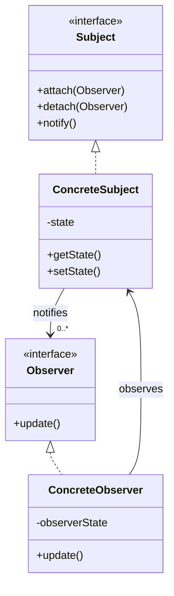

> [!NOTE]
> **Read this diagram as:** `ConcreteSubject` *holds references* to many `Observer` objects. When state changes, it calls `update()` on each.

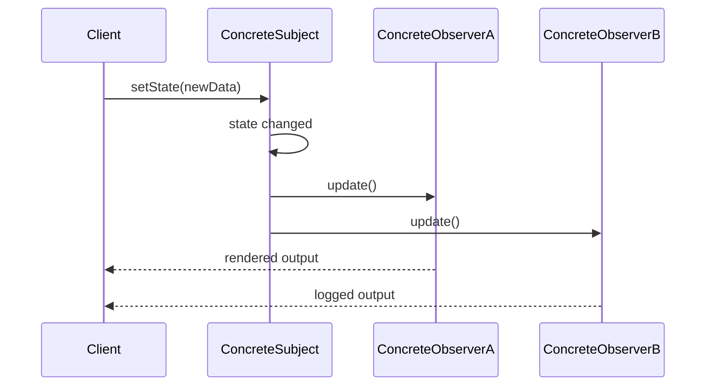

---

## 4.2 Strategy Pattern — Class Diagram

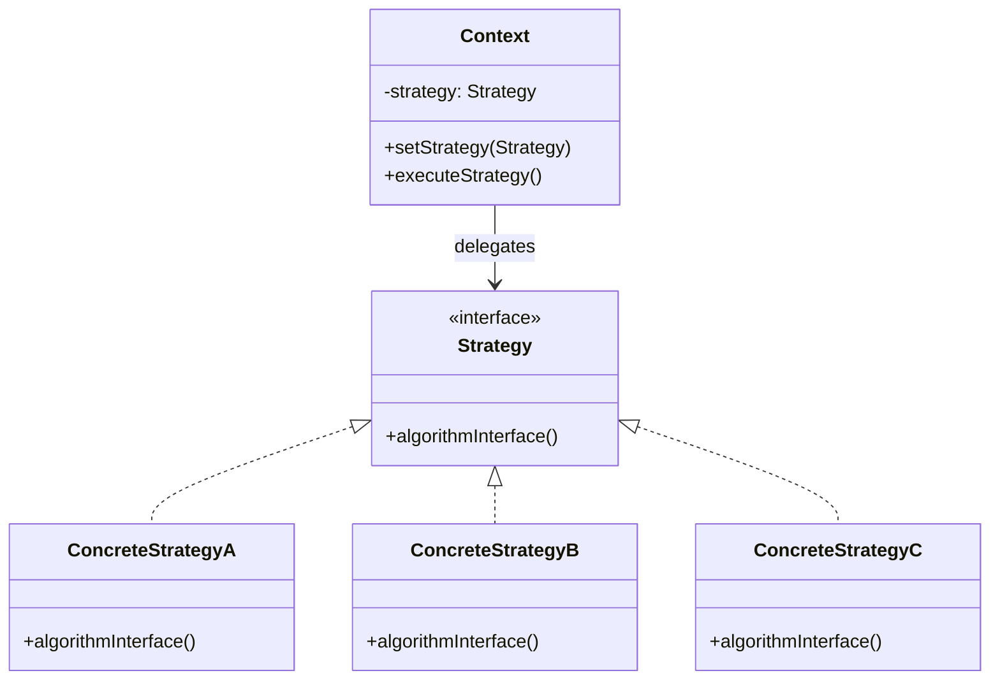

---

## 4.3 State Pattern — State Machine Diagram

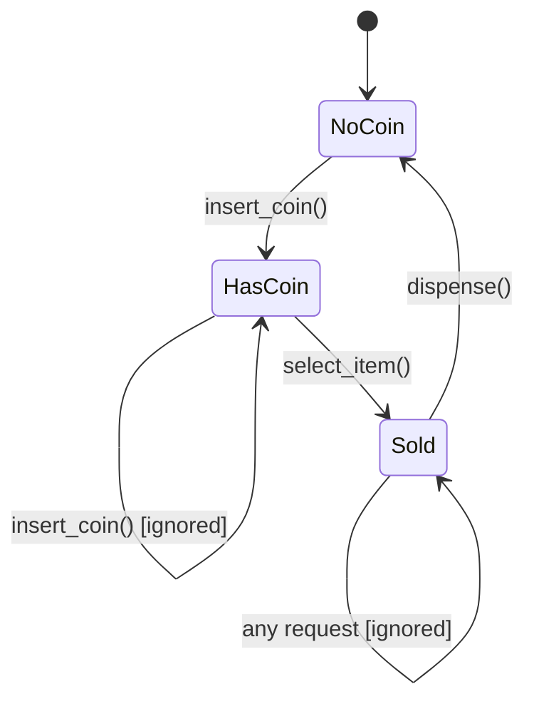

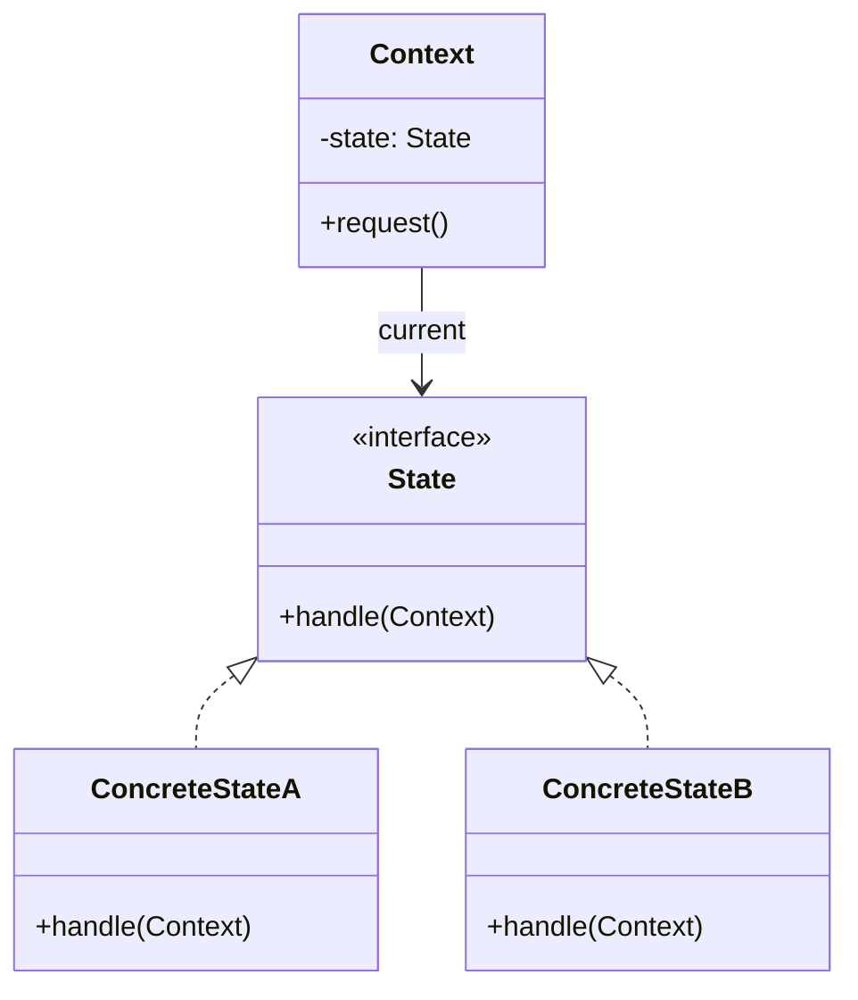

---

## 4.4 Command Pattern — Class Diagram

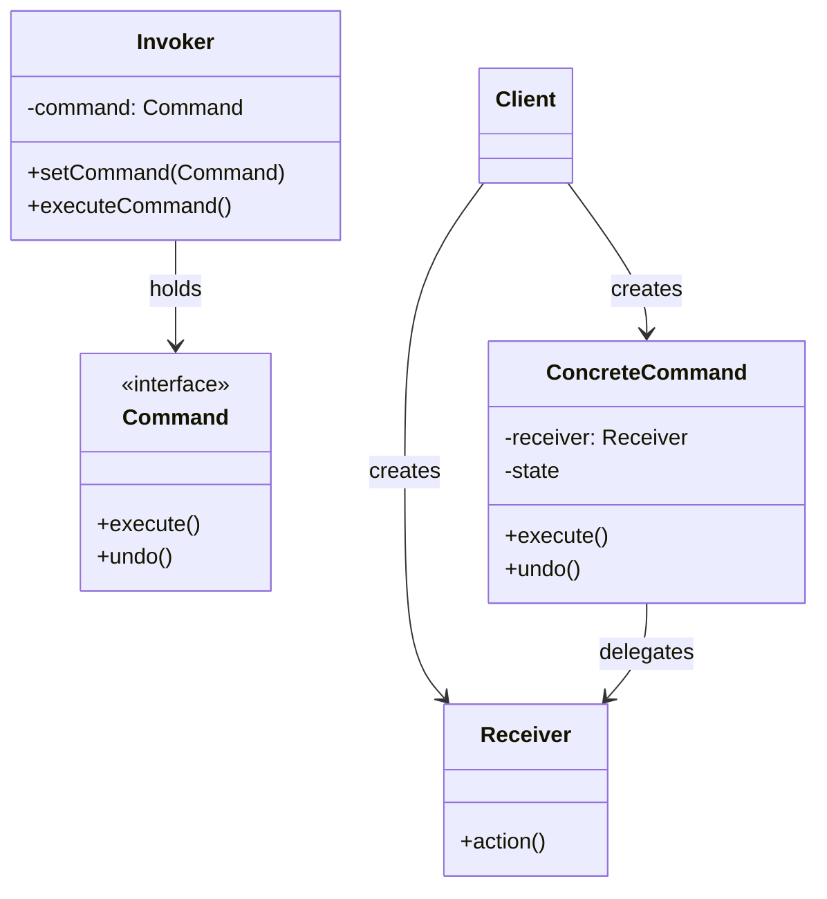

---

## 4.5 Template Method — Sequence Flow

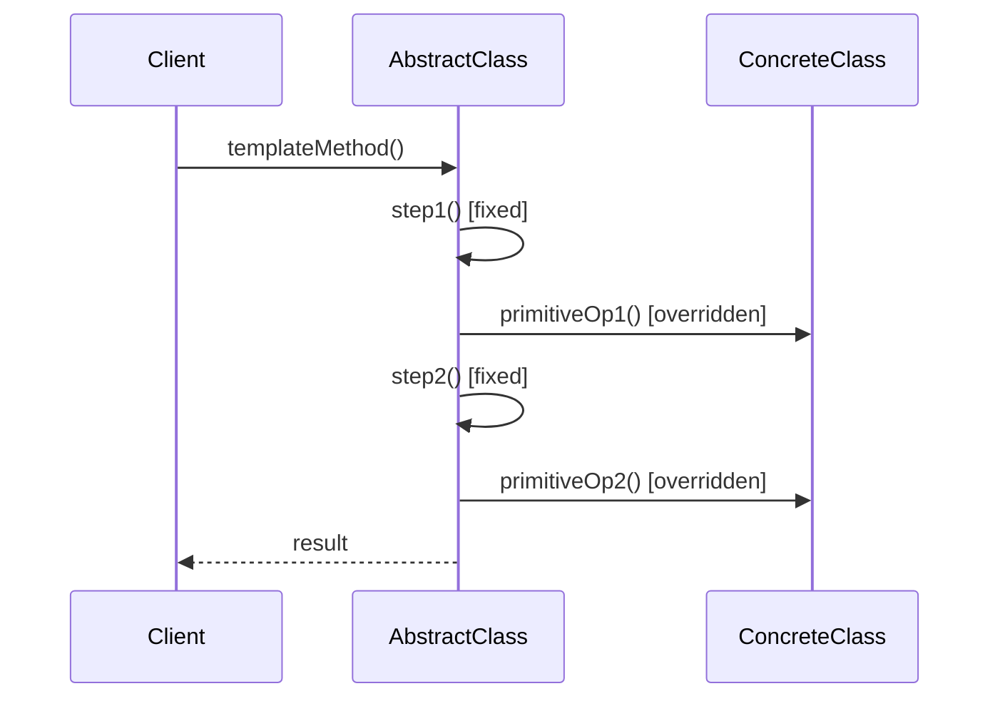

---

## 4.6 Chain of Responsibility — Topology Matrix

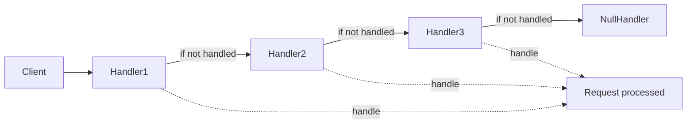

| Stage | Node | Responsibility |
|---|---|---|
| 1 | Handler1 | Validate authentication |
| 2 | Handler2 | Validate input format |
| 3 | Handler3 | Process the request |
| 4 | NullHandler | Default fallback / error logging |

---

## 4.7 Mediator Pattern — Block-Level Architecture

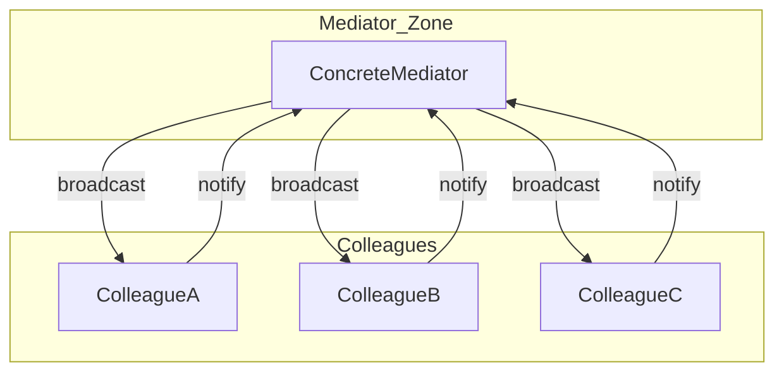

> [!IMPORTANT]
> In the Mediator pattern, **colleagues do not reference each other directly**. All communication is routed through the central `Mediator` object.

---

## 4.8 Iterator Pattern — Sequential Processing Topology

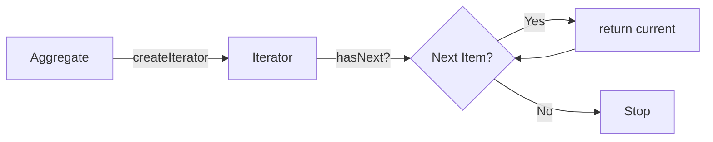

---

## 4.9 Memento Pattern — Save/Restore Flow

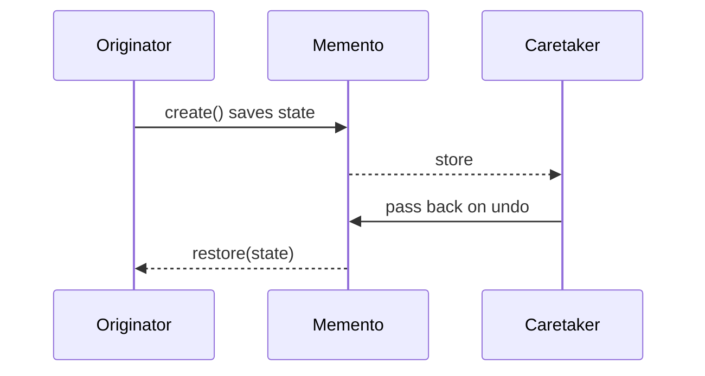

---

## 4.10 Visitor Pattern — Double Dispatch Flow

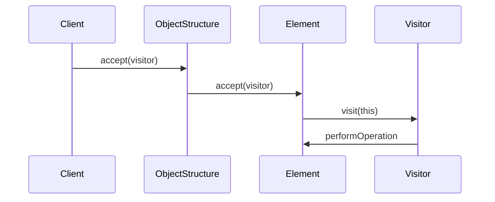

---

## 4.11 Pattern Selection Flowchart (Decision Aid)

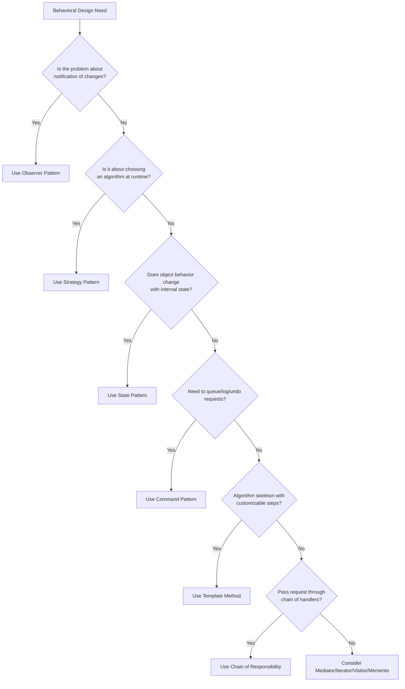

<!-- SECTION_4_END -->

<!-- SECTION_5_START -->

# KTU 2024 Scheme Examination Question Bank & Topic Recap

## Part A — Short Answer Questions (3 Marks Each)

### Question 1
> **[KTU University Exam - July 2024]**
> **CO1, Remember**
> *Define a Behavioral Design Pattern. List any four examples of behavioral design patterns from the GoF catalog.*

**Model Answer (3 Marks):**
- **[Definition: 1 Mark]** A Behavioral Design Pattern is a category of design patterns that focuses on **how objects interact and communicate**, particularly concerning **algorithms and the assignment of responsibilities** between objects.
- **[Listing 4 patterns: 2 Marks — 0.5 each]**
  1. Observer Pattern
  2. Strategy Pattern
  3. State Pattern
  4. Command Pattern
  *(Acceptable alternatives: Chain of Responsibility, Mediator, Iterator, Memento, Visitor, Template Method, Interpreter)*

---

### Question 2
> **[KTU University Exam - Dec 2023]**
> **CO1, Understand**
> *Differentiate between Observer pattern and Mediator pattern with one suitable example of each.*

**Model Answer (3 Marks):**
- **[Observer: 1 Mark]** Establishes **one-to-many** dependency. Subject broadcasts to all registered observers. **Example:** Weather station notifying multiple displays.
- **[Mediator: 1 Mark]** Centralizes communication between multiple objects. Objects do **not** refer to each other directly. **Example:** Chat room where users send messages via the chat server.
- **[Key Difference: 1 Mark]** Observer is **one-directional notification** (one subject to many observers); Mediator is **bidirectional central coordination** (many colleagues communicate through it).

---

## Part B — Long Answer Questions (14 Marks Each)

> [!IMPORTANT]
> **KTU 2024 Module-2 ESE Pattern:** Part B questions carry **14 marks**, generally with an **internal choice** (Q.7a or 7b, Q.8a or 8b, etc.). Each sub-part carries 7 marks and tests escalating cognitive levels (Understand → Apply → Analyze).

---

### Question A (14 Marks) — Observer Pattern

> **[KTU University Exam - July 2024]**
> **CO2, Understand + Apply**
> *Consider an online auction system where multiple bidders want to be notified whenever a new highest bid is placed. (a) [7 Marks] Identify the most appropriate behavioral design pattern and draw its class diagram. (b) [7 Marks] Write the Java/Python implementation demonstrating the pattern.*

#### Part (a) — Pattern Identification & Class Diagram (7 Marks)

**Model Solution:**

**[Pattern identification with reasoning: 2 Marks]**
The most appropriate behavioral design pattern is the **Observer Pattern** because:
- The auction acts as a **Subject** that maintains a list of subscribed bidders (Observers).
- Whenever the **highest bid changes** (state change in the subject), all registered bidders must be **notified automatically**.
- This is a textbook **one-to-many dependency** scenario.

**[Class Diagram: 3 Marks]**

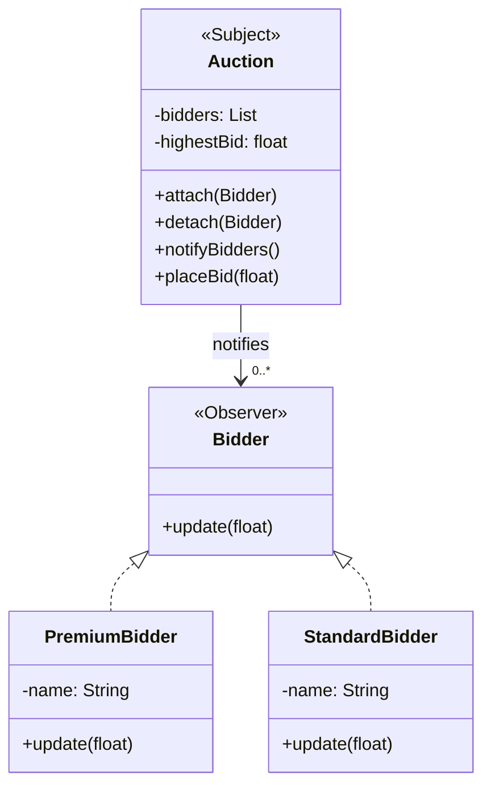

**[Explanation of relationships: 2 Marks]**
- `Auction` (ConcreteSubject) maintains a list of `Bidder` (Observer) references.
- `PremiumBidder` and `StandardBidder` are ConcreteObservers implementing the `update()` method.
- The Subject calls `notifyBidders()` which iterates and calls `update()` on each observer.

#### Part (b) — Python Implementation (7 Marks)

```python
from __future__ import annotations
from abc import ABC, abstractmethod
from typing import List


class Bidder(ABC):
    @abstractmethod
    def update(self, highest_bid: float, bidder_name: str) -> None:
        pass


class Auction:
    def __init__(self, item_name: str) -> None:
        self.item_name = item_name
        self._bidders: List[Bidder] = []
        self._highest_bid: float = 0.0
        self._leading_bidder: str = "None"

    def attach(self, bidder: Bidder) -> None:
        if bidder not in self._bidders:
            self._bidders.append(bidder)
            print(f"[Auction] {type(bidder).__name__} attached.")

    def detach(self, bidder: Bidder) -> None:
        self._bidders.remove(bidder)

    def place_bid(self, amount: float, bidder_name: str) -> None:
        if amount > self._highest_bid:
            self._highest_bid = amount
            self._leading_bidder = bidder_name
            print(f"\n[Auction] New highest bid: ₹{amount} by {bidder_name}")
            self._notify_bidders()
        else:
            print(f"[Auction] Bid ₹{amount} too low. Current: ₹{self._highest_bid}")

    def _notify_bidders(self) -> None:
        for b in self._bidders:
            b.update(self._highest_bid, self._leading_bidder)


class PremiumBidder(Bidder):
    def update(self, highest_bid: float, bidder_name: str) -> None:
        print(f"  [Premium] ALERT! New high bid ₹{highest_bid} by {bidder_name}")


class StandardBidder(Bidder):
    def __init__(self, name: str) -> None:
        self.name = name

    def update(self, highest_bid: float, bidder_name: str) -> None:
        if bidder_name != self.name:
            print(f"  [Standard-{self.name}] Outbid! Current: ₹{highest_bid}")


if __name__ == "__main__":
    auction = Auction("Antique Vase")
    p1 = PremiumBidder()
    s1 = StandardBidder("Alice")
    s2 = StandardBidder("Bob")

    auction.attach(p1)
    auction.attach(s1)
    auction.attach(s2)

    auction.place_bid(5000, "Alice")
    auction.place_bid(7500, "Bob")
```

**Valuation Key — Part (b) [7 Marks]:**
- '[Correct class structure: 1 Mark]'
- '[Subject interface with attach/detach/notify: 2 Marks]'
- '[Observer interface with update: 1 Mark]'
- '[Concrete classes with state + notification logic: 2 Marks]'
- '[Working client code with attach and place_bid: 1 Mark]'

---

### Question B (14 Marks) — Strategy Pattern (Alternative Choice)

> **[KTU University Exam - Dec 2023]**
> **CO2, Understand + Apply**
> *A travel booking platform wants to support multiple sorting strategies for displaying flight results: by price, by duration, and by airline rating. (a) [7 Marks] Identify the pattern and draw the class diagram. (b) [7 Marks] Implement the solution in Java/Python.*

#### Part (a) — Pattern Identification & Class Diagram (7 Marks)

**Model Solution:**

**[Pattern identification: 2 Marks]**
The **Strategy Pattern** is appropriate because:
- The platform needs to switch between **multiple interchangeable algorithms** (sorting methods) at runtime.
- Sorting logic is **encapsulated** in separate classes.
- The Context (`FlightSearch`) **does not need to know** the details of the sorting algorithm.

**[Class Diagram: 3 Marks]**

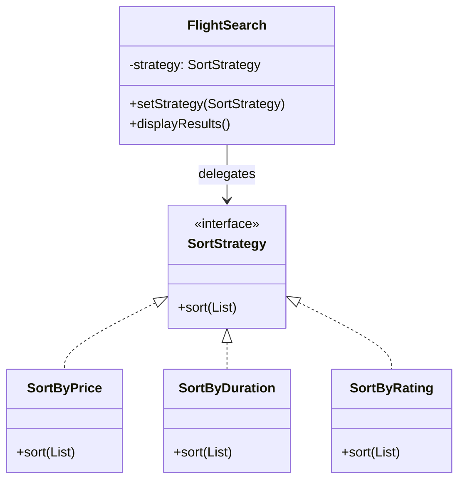

**[Explanation: 2 Marks]**
- `SortStrategy` defines the abstract `sort()` method.
- `SortByPrice`, `SortByDuration`, and `SortByRating` are concrete strategies.
- `FlightSearch` (Context) holds a reference to the active strategy and delegates the sort call.

#### Part (b) — Python Implementation (7 Marks)

```python
from __future__ import annotations
from abc import ABC, abstractmethod
from typing import List, Tuple


Flight = Tuple[str, float, int, float]  # (airline, price, duration_min, rating)


class SortStrategy(ABC):
    @abstractmethod
    def sort(self, flights: List[Flight]) -> List[Flight]:
        pass


class SortByPrice(SortStrategy):
    def sort(self, flights: List[Flight]) -> List[Flight]:
        return sorted(flights, key=lambda f: f[1])


class SortByDuration(SortStrategy):
    def sort(self, flights: List[Flight]) -> List[Flight]:
        return sorted(flights, key=lambda f: f[2])


class SortByRating(SortStrategy):
    def sort(self, flights: List[Flight]) -> List[Flight]:
        return sorted(flights, key=lambda f: -f[3])  # descending


class FlightSearch:
    def __init__(self) -> None:
        self._strategy: SortStrategy | None = None

    def set_strategy(self, strategy: SortStrategy) -> None:
        self._strategy = strategy

    def display(self, flights: List[Flight]) -> None:
        if self._strategy is None:
            raise RuntimeError("No sort strategy set.")
        sorted_flights = self._strategy.sort(flights)
        for f in sorted_flights:
            print(f"  {f[0]:15} ₹{f[1]:8.2f}  {f[2]:4}min  ★{f[3]}")


if __name__ == "__main__":
    flights = [
        ("Indigo",  4500.0, 150, 4.2),
        ("Air India", 5200.0, 130, 4.5),
        ("SpiceJet", 3800.0, 175, 3.9),
    ]
    search = FlightSearch()

    print("--- Sorted by Price ---")
    search.set_strategy(SortByPrice())
    search.display(flights)

    print("\n--- Sorted by Duration ---")
    search.set_strategy(SortByDuration())
    search.display(flights)

    print("\n--- Sorted by Rating ---")
    search.set_strategy(SortByRating())
    search.display(flights)
```

**Valuation Key — Part (b) [7 Marks]:**
- '[Strategy interface defined: 1 Mark]'
- '[Three concrete strategy classes implemented: 3 Marks]'
- '[Context class with setStrategy + delegation: 2 Marks]'
- '[Client code with runtime strategy switching: 1 Mark]'

---

## ⚠️ KTU Examiner's Valuation Warning / Pitfall Callout

> [!WARNING]
> **Common Mistakes That Cost Marks:**
>
> 1. **Forgetting to mark the abstract `<<interface>>` stereotype** in the UML class diagram. KTU evaluators specifically check for this — failing to mark an interface loses **1 full mark**.
> 2. **Confusing Observer with Mediator.** Observer is **one-to-many** (one subject → many observers). Mediator is **many-to-many via a hub**. Drawing arrows directly between colleagues in a Mediator diagram is a major error.
> 3. **Not showing multiplicity (0..*, 1, etc.)** in the class diagram. Always annotate how many observers/strategies a context can hold.
> 4. **Writing monolithic code** without separating the interface from the concrete classes. KTU tests **design quality**, not just working code.
> 5. **Omitting the `undo()` method** in Command pattern implementations. Even if not asked, demonstrating it shows complete understanding.
> 6. **Confusing Template Method with Strategy.** Template Method uses **inheritance** (subclass overrides); Strategy uses **composition** (Context holds a strategy object).
> 7. **Writing `|x|` in tables** — this breaks markdown. Use `\vert x \vert` or write "abs(x)" instead.

---

## Topic Recap & Important Things to Remember

> [!NOTE]
> **Rapid Revision Checklist — Behavioral Design Patterns**

- **Behavioral patterns** = patterns about **object interaction, communication, and responsibility distribution**.
- The GoF catalog contains **11 behavioral patterns**: Chain of Responsibility, Command, Interpreter, Iterator, Mediator, Memento, Observer, State, Strategy, Template Method, Visitor.
- **Observer** = **one-to-many** notification (Subject + Observers). Used in event-driven systems, MVC.
- **Strategy** = **encapsulate interchangeable algorithms** behind a common interface. Eliminates conditional logic.
- **State** = **behavior depends on internal state**; object appears to change its class. Models state machines.
- **Command** = **request encapsulated as an object**; enables queuing, logging, and **undo/redo**.
- **Template Method** = **algorithm skeleton in base class**; subclasses refine steps. Uses **inheritance**.
- **Chain of Responsibility** = **pass request along a chain** of handlers until one handles it. Sender is decoupled from receiver.
- **Mediator** = **centralized communication hub**; colleagues don't refer to each other directly.
- **Iterator** = **uniform sequential traversal** of collections without exposing internal structure.
- **Memento** = **capture/externalize state** for later restoration. Powers undo functionality.
- **Visitor** = **add new operations** to a class hierarchy without modifying the classes. Uses **double dispatch**.
- **Interpreter** = **represent grammar as classes** to interpret sentences in a language.
- Two pattern groups exist: **object-behavioral** (composition-based: Strategy, State, Iterator, Visitor) and **class-behavioral** (inheritance-based: Template Method, Interpreter).
- Most important design principles used: **Open/Closed Principle**, **Loose Coupling**, **Single Responsibility**, **Encapsulation of Variation**.
- Always include `<<interface>>` stereotype, **multiplicity annotations** (0..*, 1), and clear role labels in UML diagrams.
- Use **composition over inheritance** for Strategy, State, Visitor, Iterator (object-behavioral).
- Use **inheritance** for Template Method and Interpreter (class-behavioral).
- Real-world examples: Observer → React/Vue state; Strategy → Payment routing; Command → Undo in editors; State → TCP connection; Chain of Responsibility → Java exception handling.

<!-- SECTION_5_END -->
