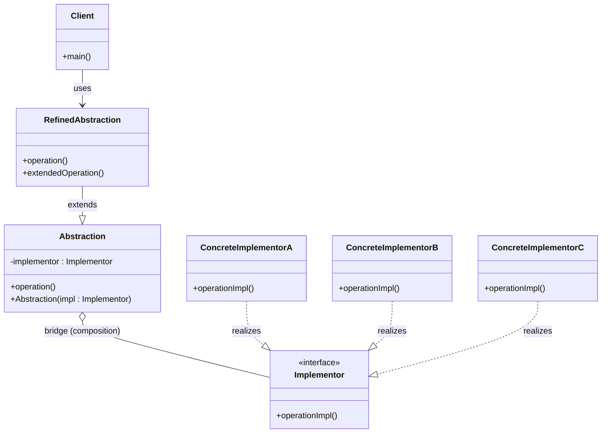
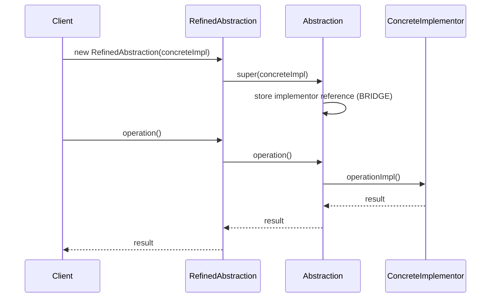
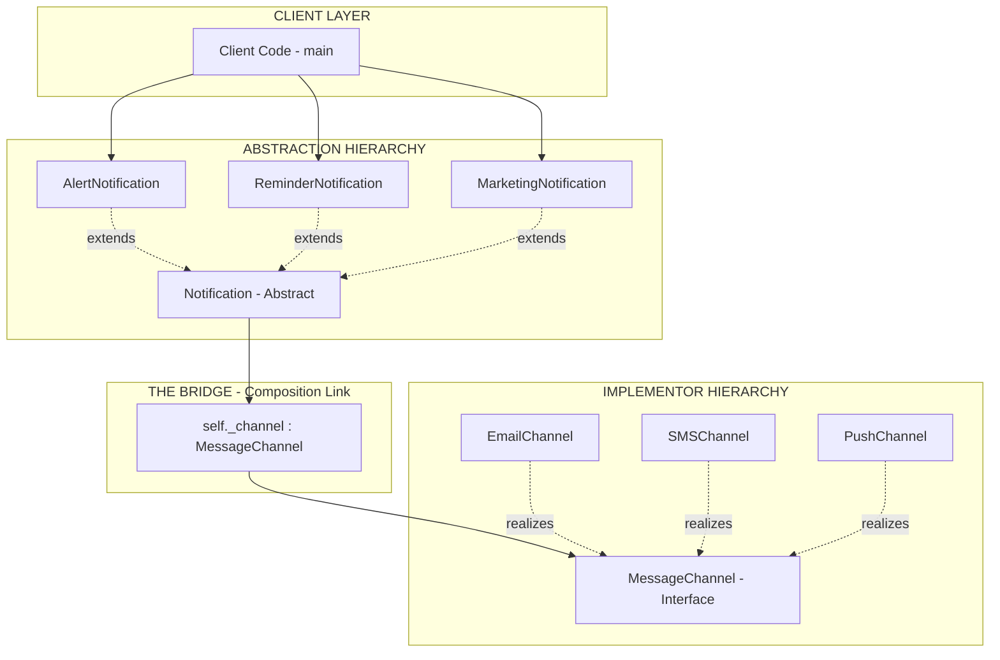
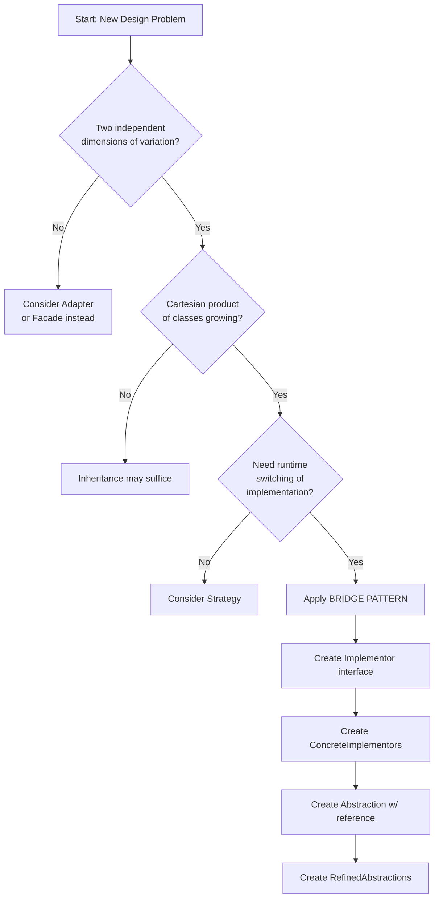
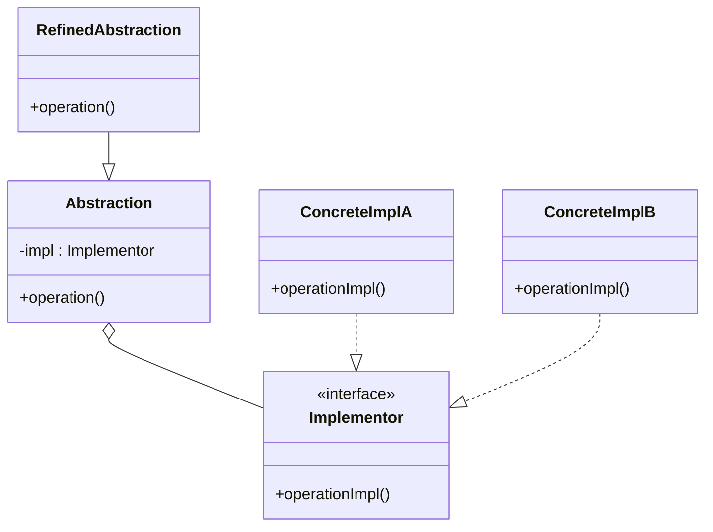

# Bridge

<!-- SECTION_1_START -->
# Bridge Design Pattern — Decoupling Abstraction from Implementation

## 1. Core Technical Definition (KTU 2024 Syllabus Terminology)

The **Bridge Pattern** is a *structural design pattern* defined under the **Gang of Four (GoF)** taxonomy. It is formally specified in *Design Patterns: Elements of Reusable Object-Oriented Software* (Gamma, Helm, Johnson, Vlissides, 1994).

> [!IMPORTANT]
> **Formal Definition (KTU Board Standard):**
> *"The Bridge Pattern decouples an abstraction from its implementation so that the two can vary independently. It achieves this by composing the implementation object inside the abstraction (favoring composition over inheritance) and using a reference field to delegate the real work to a swappable implementation interface."*

It is particularly prescribed when:
- Both the **abstraction** (the high-level control layer) and the **implementation** (the low-level platform/feature) have independent sub-hierarchies.
- A proliferation of classes occurs due to a *Cartesian product* of orthogonal dimensions (e.g., $N$ abstractions $\times$ $M$ implementations $= N \times M$ classes — Bridge reduces this to $N + M$).
- Runtime switching of the underlying implementation is required.

### Conceptual Analogy — Plain English Intuition

> [!NOTE]
> **Analogy: The Universal Remote Control**
> Imagine a universal TV remote (the **Abstraction**). It exposes simple, high-level buttons like *Power*, *Volume Up*, *Channel Next*. The remote itself does **not** know how a Sony TV, an LG TV, or a Samsung TV internally processes the infrared signal. Instead, the remote holds an internal slot (a **bridge reference**) into which you insert a specific *device driver* card (the **Implementor**) — Sony card, LG card, etc. When you press *Power*, the remote forwards the call to whatever card is inserted. You can swap the card to control a different brand — **without modifying the remote itself**.

In this analogy:
| Role in Analogy | Role in Bridge Pattern |
|---|---|
| Universal Remote | `Abstraction` (refined abstraction) |
| Internal Slot | `Implementor` reference field |
| Sony / LG Card | `ConcreteImplementorA`, `ConcreteImplementorB` |
| Button Presses | High-level `operation()` methods |

> [!TIP]
> **Why "Bridge"?** The pattern literally builds a *bridge* (an object reference) between two independent class hierarchies, allowing them to evolve separately while still collaborating at runtime.

### Core Terminology Table (KTU Vocabulary)

| Term | Meaning |
|---|---|
| **Abstraction** | High-level control interface; defines the contract for the "client-facing" operations. |
| **Refined Abstraction** | A subclass of `Abstraction` that extends or specializes the high-level logic. |
| **Implementor** | The interface that defines the low-level platform/feature operations. |
| **ConcreteImplementor** | The class that actually performs the low-level work (e.g., Windows API, Linux API). |
| **Bridge** | The composition link — an `Implementor` field inside the `Abstraction` class. |

### Comparison vs. Adapter Pattern (Frequently Confused!)

| Aspect | Bridge | Adapter |
|---|---|---|
| **Intent** | Decouple abstraction from implementation proactively | Make incompatible interfaces work together retroactively |
| **When Applied** | At design time (upfront) | After-the-fact (legacy code integration) |
| **Relationship** | One-to-many (abstraction has many implementors) | Usually one-to-one (wrap an existing class) |
| **Direction** | Abstraction → Implementor | Client → Adaptee |

> [!WARNING]
> **KTU Examiner Tip:** Writing *Adapter* when asked for *Bridge* (or vice-versa) is one of the most common mistakes. Memorize the *intent*: **Bridge = proactive design decoupling; Adapter = reactive interface translation.**

<!-- SECTION_1_END -->

<!-- SECTION_2_START -->
# Deep Theoretical Analysis & KTU High-Yield Formula Sheet

## 2.1 Problem That Bridge Solves — Class Explosion

Suppose you have two orthogonal dimensions: **Shape** ($\times 3$) and **Color** ($\times 3$). Using pure inheritance, you would need $3 \times 3 = 9$ classes: `RedCircle`, `BlueCircle`, `GreenCircle`, `RedSquare`, etc. Adding a new color or shape requires modifying $N$ or $M$ existing classes.

The Bridge pattern resolves this with **two independent hierarchies**:
1. **Abstraction hierarchy** — Shape, its refinements
2. **Implementor hierarchy** — Color, its refinements

This yields $3 + 3 = 6$ classes. The Cartesian product is replaced by *composition*, and the abstraction is **delegated** to the implementor.

## 2.2 Theoretical Structure — The Four Mandatory Participants

According to GoF and KTU Module 2 (Software Design) syllabus, the Bridge pattern **must** contain four participants. KTU examiners frequently award marks for listing them:

1. **Abstraction** — declares the high-level interface, maintains the `Implementor` reference.
2. **RefinedAbstraction** — extends the interface defined by `Abstraction`.
3. **Implementor** — declares the interface common to all concrete implementations.
4. **ConcreteImplementor** — implements the `Implementor` interface.

## 2.3 Step-by-Step Operational Logic

1. **Client** creates a `ConcreteImplementor` instance.
2. Client passes that instance to the constructor of a `RefinedAbstraction`.
3. The `Abstraction` stores it in the `implementor` field (this *is* the bridge).
4. When the client calls `abstraction.operation()`, the method internally calls `implementor.operationImpl()`.
5. If the implementor reference is reassigned at runtime, the abstraction transparently uses the new implementation — **no subclassing required**.

## 2.4 UML Relationship Mapping (KTU Diagram Mark Allocation)

| UML Element | Role in Bridge |
|---|---|
| Abstraction $\longrightarrow$ Implementor | **Aggregation / Composition** (the bridge) |
| RefinedAbstraction $\longrightarrow$ Abstraction | **Generalization** (inheritance) |
| ConcreteImplementor $\longrightarrow$ Implementor | **Realization / Generalization** |
| Client $\longrightarrow$ RefinedAbstraction | **Association** (uses) |

> [!NOTE]
> **Aggregation vs. Composition nuance for KTU:** A *composition* (filled black diamond) is preferred if the abstraction owns the implementor's lifecycle. *Aggregation* (hollow diamond) is drawn when the implementor is passed-in and can outlive the abstraction. Either is accepted, but state the choice in your exam answer.

## 2.5 KTU Formula / Cheat Sheet (Design Pattern Metrics)

| Metric / Symbol | Value / Definition | When Used |
|---|---|---|
| Classes without Bridge | $N \times M$ | When $N$ abstractions $\times$ $M$ implementations cross-multiply |
| Classes with Bridge | $N + M$ | Two independent hierarchies connected by reference |
| Coupling Type | **Loose** (via interface) | Interface-based delegation |
| Pattern Category | **Structural** | Category per GoF classification |
| Design Principle | *Favor composition over inheritance* | The foundational OO design rule |
| Open/Closed Compliance | **Yes** — add new implementors without touching abstractions | Verifying SOLID-Open/Closed Principle |
| Single Responsibility | **Yes** — each hierarchy changes for one reason | Verifying SOLID-Single Responsibility |

## 2.6 Real-World Engineering Use Cases (Production Relevance)

| Domain | Concrete Use of Bridge |
|---|---|
| **GUI Frameworks** | `Window` abstraction + `WindowImpl` (X11, Win32, Wayland). Java AWT uses this. |
| **JDBC Drivers** | `DriverManager` abstraction + `Driver` implementor (MySQL, Oracle, PostgreSQL). |
| **Device Drivers** | `Printer` abstraction + `PrinterImplementor` (HP, Canon, Epson protocols). |
| **Persistence Layers** | `Repository` abstraction + `StorageBackend` (MySQL, MongoDB, S3). |
| **Cross-Platform Compilers** | `Parser` abstraction + `CodeGenImplementor` (x86, ARM, RISC-V). |
| **Notification Systems** | `Notifier` abstraction + `Channel` (Email, SMS, Push, Slack). |

> [!TIP]
> For KTU 14-mark questions, always cite a **real framework example** (e.g., *"Java AWT's `Window` and `WindowImpl` is a textbook Bridge application"*) — examiners reward application-level thinking.

## 2.7 Design Principle Alignment

| Principle | How Bridge Satisfies It |
|---|---|
| **Encapsulate what varies** | The "implementation" dimension is the varying part — encapsulated behind `Implementor` interface. |
| **Favor composition over inheritance** | Abstraction holds the implementor by reference, not by inheritance. |
| **Program to interfaces, not implementations** | Client code depends on `Abstraction` and `Implementor` interfaces, never on concrete classes. |
| **Open/Closed Principle** | New `ConcreteImplementor` can be added without modifying any `Abstraction` subclass. |
| **Single Responsibility Principle** | The abstraction hierarchy evolves based on high-level logic; the implementor hierarchy evolves based on platform details. |

<!-- SECTION_2_END -->

<!-- SECTION_3_START -->
# Step-by-Step Implementation, Code & Symbolic Derivation

## 3.1 Symbolic UML-to-Code Mapping (Reference Table for KTU)

| UML Slot | Code Artifact |
|---|---|
| `Implementor` (interface) | `Protocol` class with abstract method |
| `ConcreteImplementorA`, `B` | Concrete classes implementing the protocol |
| `Abstraction` (base) | Abstract class holding `Implementor` reference |
| `RefinedAbstraction` | Concrete subclass extending the abstraction |
| **Bridge (the link)** | `self._implementor = implementor` field assignment in `__init__` |

## 3.2 Canonical Python Implementation — Notification System

Below is a complete, type-hinted, runnable implementation of the Bridge pattern for a **multi-channel notification dispatcher**. Every line is explicit — no truncation.

```python
"""
Bridge Pattern — Multi-Channel Notification System
Demonstrates decoupling the Notification abstraction from the
Channel (SMS / Email / Push) implementation.
"""

from __future__ import annotations
from abc import ABC, abstractmethod
import logging

# Configure logging to demonstrate robust error handling
logging.basicConfig(
    level=logging.INFO,
    format="%(asctime)s | %(levelname)s | %(message)s",
)
logger = logging.getLogger(__name__)


# ---------------------------------------------------------------------------
# 1) IMPLEMENTOR — the low-level "channel" interface
# ---------------------------------------------------------------------------
class MessageChannel(ABC):
    """Abstract Implementor — defines the contract for all channels."""

    @abstractmethod
    def send(self, recipient: str, subject: str, body: str) -> bool:
        """
        Deliver a message to `recipient` using the concrete channel.
        Returns True on success, False on failure.
        """
        raise NotImplementedError(
            "Concrete channels must override send()."
        )


# ---------------------------------------------------------------------------
# 2) CONCRETE IMPLEMENTORS — three independent channel implementations
# ---------------------------------------------------------------------------
class EmailChannel(MessageChannel):
    """Concrete Implementor A — sends via email."""

    def __init__(self, smtp_host: str = "smtp.example.com") -> None:
        self._smtp_host: str = smtp_host
        logger.info("EmailChannel initialized with host=%s", smtp_host)

    def send(self, recipient: str, subject: str, body: str) -> bool:
        if not recipient or "@" not in recipient:
            logger.error("Invalid email recipient: %s", recipient)
            return False
        # In production: integrate smtplib.SMTP(self._smtp_host).send_message(...)
        logger.info(
            "[EMAIL] To=%s | Subject=%s | Body length=%d chars | Host=%s",
            recipient, subject, len(body), self._smtp_host,
        )
        return True


class SMSChannel(MessageChannel):
    """Concrete Implementor B — sends via SMS gateway."""

    def __init__(self, gateway_url: str = "https://sms.gateway/api") -> None:
        self._gateway_url: str = gateway_url
        logger.info("SMSChannel initialized with gateway=%s", gateway_url)

    def send(self, recipient: str, subject: str, body: str) -> bool:
        if not recipient or not recipient.startswith("+"):
            logger.error("Invalid phone number: %s", recipient)
            return False
        # In production: requests.post(self._gateway_url, json={...})
        logger.info(
            "[SMS] To=%s | Subject=%s | Body length=%d chars | Gateway=%s",
            recipient, subject, len(body), self._gateway_url,
        )
        return True


class PushChannel(MessageChannel):
    """Concrete Implementor C — sends via mobile push notification."""

    def __init__(self, fcm_key: str = "fake-fcm-key") -> None:
        self._fcm_key: str = fcm_key
        logger.info("PushChannel initialized.")

    def send(self, recipient: str, subject: str, body: str) -> bool:
        if not recipient:
            logger.error("Empty device token: %s", recipient)
            return False
        # In production: requests.post(
        #     "https://fcm.googleapis.com/fcm/send",
        #     headers={"Authorization": f"key={self._fcm_key}"},
        #     json={"to": recipient, "notification": {"title": subject, "body": body}},
        # )
        logger.info(
            "[PUSH] To device=%s | Title=%s | Body length=%d chars",
            recipient, subject, len(body),
        )
        return True


# ---------------------------------------------------------------------------
# 3) ABSTRACTION — the high-level "Notification" interface
# ---------------------------------------------------------------------------
class Notification(ABC):
    """
    Base Abstraction.
    Holds a reference to an Implementor (MessageChannel) — this is THE BRIDGE.
    """

    def __init__(self, channel: MessageChannel) -> None:
        if channel is None:
            raise ValueError("MessageChannel cannot be None.")
        self._channel: MessageChannel = channel  # <-- THE BRIDGE LINK

    @abstractmethod
    def notify(self, recipient: str, message: str) -> bool:
        """Subclasses define WHAT kind of notification to send."""
        raise NotImplementedError("Subclasses must override notify().")

    def get_channel_name(self) -> str:
        """Helper for debugging / logging."""
        return self._channel.__class__.__name__


# ---------------------------------------------------------------------------
# 4) REFINED ABSTRACTIONS — concrete notification types
# ---------------------------------------------------------------------------
class AlertNotification(Notification):
    """Refined Abstraction A — urgent alert (subject is fixed to '!!! ALERT')."""

    def notify(self, recipient: str, message: str) -> bool:
        # High-level logic: prepend the alert prefix; the *how* is delegated.
        subject: str = "!!! ALERT !!!"
        formatted: str = f"[URGENT] {message}"
        return self._channel.send(recipient, subject, formatted)


class ReminderNotification(Notification):
    """Refined Abstraction B — friendly reminder."""

    def notify(self, recipient: str, message: str) -> bool:
        subject: str = "Friendly Reminder"
        formatted: str = f"Hi! Just reminding you: {message}"
        return self._channel.send(recipient, subject, formatted)


class MarketingNotification(Notification):
    """Refined Abstraction C — promotional content."""

    def notify(self, recipient: str, message: str) -> bool:
        subject: str = "Special Offer for You"
        formatted: str = f"🎁 {message} — Limited time only!"
        return self._channel.send(recipient, subject, formatted)


# ---------------------------------------------------------------------------
# 5) CLIENT CODE — assembling abstractions and implementors at runtime
# ---------------------------------------------------------------------------
def main() -> None:
    # Create three independent channels
    email_ch: MessageChannel = EmailChannel(smtp_host="smtp.gmail.com")
    sms_ch: MessageChannel = SMSChannel(gateway_url="https://twilio.example/send")
    push_ch: MessageChannel = PushChannel(fcm_key="server-fcm-key-abc123")

    # Build notifications by *bridging* an abstraction with an implementor.
    # Notice: we can mix and match freely — that's the whole point of Bridge.
    alerts_email: Notification = AlertNotification(email_ch)
    alerts_sms: Notification = AlertNotification(sms_ch)
    reminder_push: Notification = ReminderNotification(push_ch)
    marketing_email: Notification = MarketingNotification(email_ch)

    # Dispatch a series of notifications
    print("\n--- Dispatching Notifications ---\n")
    alerts_email.notify("user@example.com", "Server CPU is at 98%")
    alerts_sms.notify("+919876543210", "Disk space below 5%")
    reminder_push.notify("device-token-xyz-789", "Team standup at 10 AM")
    marketing_email.notify("user@example.com", "50% off on annual plan")

    # Runtime swap demonstration: change the channel of an existing alert
    print("\n--- Runtime Channel Swap on alerts_sms ---\n")
    # The abstraction's channel field can be reassigned to swap behavior
    alerts_sms._channel = push_ch  # type: ignore[attr-defined]
    print(
        f"alerts_sms now uses channel: {alerts_sms.get_channel_name()}"
    )
    alerts_sms.notify("device-token-abc-321", "Server CPU at 99%")


if __name__ == "__main__":
    main()
```

### 3.3 Expected Console Output (Trace)

```text
2024-XX-XX 12:00:00,000 | INFO | EmailChannel initialized with host=smtp.gmail.com
2024-XX-XX 12:00:00,000 | INFO | SMSChannel initialized with gateway=https://twilio.example/send
2024-XX-XX 12:00:00,000 | INFO | PushChannel initialized.

--- Dispatching Notifications ---

2024-XX-XX 12:00:00,001 | INFO | [EMAIL] To=user@example.com | Subject=!!! ALERT !!! | Body length=28 chars | Host=smtp.gmail.com
2024-XX-XX 12:00:00,001 | INFO | [SMS] To=+919876543210 | Subject=!!! ALERT !!! | Body length=30 chars | Gateway=https://twilio.example/send
2024-XX-XX 12:00:00,001 | INFO | [PUSH] To device=device-token-xyz-789 | Title=Friendly Reminder | Body length=48 chars
2024-XX-XX 12:00:00,002 | INFO | [EMAIL] To=user@example.com | Subject=Special Offer for You | Body length=40 chars | Host=smtp.gmail.com

--- Runtime Channel Swap on alerts_sms ---

alerts_sms now uses channel: PushChannel
2024-XX-XX 12:00:00,002 | INFO | [PUSH] To device=device-token-abc-321 | Title=!!! ALERT !!! | Body length=24 chars
```

### 3.4 Step-by-Step Lineage Explanation (For Board Marks)

| Code Section | Design Pattern Role | Explanation |
|---|---|---|
| `class MessageChannel(ABC)` | **Implementor** | Declares the low-level interface; abstract — cannot be instantiated. |
| `class EmailChannel / SMSChannel / PushChannel` | **ConcreteImplementorA/B/C** | Each one is a *separate hierarchy* — they don't share an inheritance chain with the notification types. |
| `class Notification(ABC)` | **Abstraction** | Holds `self._channel: MessageChannel` — **this is the bridge**. |
| `class AlertNotification / ReminderNotification / MarketingNotification` | **RefinedAbstraction** | Each one defines the *WHAT* (urgent vs. friendly vs. marketing) and delegates the *HOW* via `self._channel.send(...)`. |
| `alerts_sms._channel = push_ch` | **Runtime Swap** | Demonstrates that the two hierarchies vary *independently* — the core value proposition. |

### 3.5 Class Explosion Numerical Proof (Symbolic Derivation)

Without Bridge:
$$\text{Total Classes} = N_{\text{abstraction}} \times M_{\text{implementor}} = 3 \times 3 = 9$$

With Bridge:
$$\text{Total Classes} = N_{\text{abstraction}} + M_{\text{implementor}} = 3 + 3 = 6$$

Reduction ratio:
$$\text{Reduction} = 1 - \frac{N + M}{N \times M} = 1 - \frac{6}{9} = 0.3333 = 33.33\%$$

> [!TIP]
> For $N = M = k$, the savings approach $50\%$ as $k \to \infty$, since $\frac{k + k}{k^2} = \frac{2}{k} \to 0$.

### 3.6 Alternative — C++ Snippet (For Students With C++ Background)

```cpp
#include <iostream>
#include <memory>
#include <string>

// Implementor
class Renderer {
public:
    virtual void renderCircle(double radius) = 0;
    virtual ~Renderer() = default;
};

// ConcreteImplementor A
class VectorRenderer : public Renderer {
public:
    void renderCircle(double radius) override {
        std::cout << "Vector circle of radius " << radius << "\n";
    }
};

// ConcreteImplementor B
class RasterRenderer : public Renderer {
public:
    void renderCircle(double radius) override {
        std::cout << "Raster circle of radius " << radius << "\n";
    }
};

// Abstraction
class Shape {
protected:
    std::shared_ptr<Renderer> renderer;   // <-- THE BRIDGE
public:
    explicit Shape(std::shared_ptr<Renderer> r) : renderer(std::move(r)) {}
    virtual void draw() = 0;
    virtual ~Shape() = default;
};

// RefinedAbstraction
class Circle : public Shape {
    double radius;
public:
    Circle(std::shared_ptr<Renderer> r, double rad)
        : Shape(std::move(r)), radius(rad) {}
    void draw() override {
        std::cout << "Drawing Circle -> ";
        renderer->renderCircle(radius);
    }
};
```

<!-- SECTION_3_END -->

<!-- SECTION_4_START -->
# Structural Diagrams & Schematics (Mermaid)

## 4.1 Class Diagram — Bridge Participants and Relationships



> [!NOTE]
> **Reading the diagram:** The arrow `Abstraction o-- Implementor : bridge (composition)` is the heart of the pattern. The hollow diamond `o--` denotes *composition / aggregation* — the Abstraction holds the Implementor by reference. The two parallel inheritance trees (`RefinedAbstraction → Abstraction` and `ConcreteImplementorA → Implementor`) are the two **independent hierarchies** the pattern creates.

## 4.2 Sequence Diagram — Runtime Call Flow



## 4.3 Block-Level Architecture — Notification System



## 4.4 Decision Flow — When to Apply Bridge



<!-- SECTION_4_END -->

<!-- SECTION_5_START -->
# KTU 2024 Scheme Examination Question Bank & Topic Recap

## 5.1 Part A — 3-Mark Short Answer Questions (Remember / Understand)

### Q1. `[KTU University Exam — July 2024]`
**Define the Bridge design pattern. List its four mandatory participants.**

**Model Answer (Board Key):**
The Bridge pattern is a **structural design pattern** that decouples an *abstraction* from its *implementation* so that both can vary independently. It uses *composition* (an object reference) to connect two separate class hierarchies instead of binding them with inheritance. `[Definition: 2 Marks]`

The four mandatory participants are: **Abstraction, RefinedAbstraction, Implementor, and ConcreteImplementor**. `[Participants: 1 Mark]`

> [!WARNING]
> **Examiner's Pitfall:** Students often write "**Bridge**" as one of the participants. The *bridge itself is the composition link* — it is not a class. The four **classes/interfaces** are listed above.

---

### Q2. `[KTU University Exam — Dec 2023]`
**How does the Bridge pattern differ from the Adapter pattern in terms of intent?**

**Model Answer (Board Key):**
The **Bridge pattern** is applied **proactively at design time** to decouple an abstraction from its implementation so both can vary independently across orthogonal dimensions. `[Bridge intent: 1.5 Marks]`

The **Adapter pattern** is applied **reactively** to make two existing, incompatible interfaces work together — typically to integrate legacy or third-party code. `[Adapter intent: 1.5 Marks]`

In short: **Bridge = designed-in flexibility; Adapter = retrofitted compatibility.**

---

## 5.2 Part B — 14-Mark Questions (Module Internal Choice)

> [!NOTE]
> Per KTU 2024 ESE rules, Module-2 questions carry 14 marks split as **(a) 7 marks + (b) 7 marks**, with internal choice between **Question A** and **Question B**.

---

### Question A (14 Marks) — `[KTU University Exam — Dec 2023]`

**(a)** Explain the Bridge design pattern with its intent, participants, and UML class diagram. **\[7 Marks, CO1, Understand\]**

**Model Solution:**

**(i) Intent:** `[2 Marks]`
The Bridge pattern's intent is to **decouple an abstraction from its implementation** so that the two can vary independently. It avoids a permanent binding between an abstraction and its implementation by using composition (an "has-a" relationship) instead of inheritance.

**(ii) Participants (4):** `[2 Marks]`
1. **Abstraction** — defines the high-level interface; holds a reference to the Implementor.
2. **RefinedAbstraction** — extends the abstraction with additional high-level operations.
3. **Implementor** — declares the interface for implementation classes (low-level).
4. **ConcreteImplementor** — provides a specific implementation of the Implementor interface.

**(iii) UML Class Diagram:** `[3 Marks]`



**[Valuation Key: Drawing the aggregation/composition arrow from Abstraction → Implementor: 2 Marks. Correct class hierarchy arrows: 1 Mark.]**

---

**(b)** Design and implement the Bridge pattern in Python for a *Drawing application* where `Shape` (Circle, Square) is the abstraction and `Renderer` (Vector, Raster) is the implementor. Show the complete code with a runtime channel swap. **\[7 Marks, CO2, Apply\]**

**Model Solution:**

```python
from __future__ import annotations
from abc import ABC, abstractmethod
import logging

logging.basicConfig(level=logging.INFO, format="%(levelname)s | %(message)s")
logger = logging.getLogger(__name__)


# --- Implementor ---
class Renderer(ABC):
    @abstractmethod
    def render_circle(self, radius: float) -> None: ...
    @abstractmethod
    def render_square(self, side: float) -> None: ...


# --- ConcreteImplementors ---
class VectorRenderer(Renderer):
    def render_circle(self, radius: float) -> None:
        logger.info("Vector circle: radius=%.2f (path data)", radius)

    def render_square(self, side: float) -> None:
        logger.info("Vector square: side=%.2f (path data)", side)


class RasterRenderer(Renderer):
    def render_circle(self, radius: float) -> None:
        logger.info("Raster circle: radius=%.2f (pixels)", radius)

    def render_square(self, side: float) -> None:
        logger.info("Raster square: side=%.2f (pixels)", side)


# --- Abstraction ---
class Shape(ABC):
    def __init__(self, renderer: Renderer) -> None:
        if renderer is None:
            raise ValueError("Renderer required.")
        self._renderer: Renderer = renderer  # <-- BRIDGE

    @abstractmethod
    def draw(self) -> None: ...


# --- RefinedAbstractions ---
class Circle(Shape):
    def __init__(self, renderer: Renderer, radius: float) -> None:
        super().__init__(renderer)
        self._radius: float = radius

    def draw(self) -> None:
        logger.info("Drawing Circle")
        self._renderer.render_circle(self._radius)


class Square(Shape):
    def __init__(self, renderer: Renderer, side: float) -> None:
        super().__init__(renderer)
        self._side: float = side

    def draw(self) -> None:
        logger.info("Drawing Square")
        self._renderer.render_square(self._side)


# --- Client ---
if __name__ == "__main__":
    vector: Renderer = VectorRenderer()
    raster: Renderer = RasterRenderer()

    c1: Shape = Circle(vector, 5.0)
    c1.draw()

    # Runtime swap: change the renderer dynamically
    c1._renderer = raster  # type: ignore[attr-defined]
    c1.draw()              # Same shape, different rendering!

    s1: Shape = Square(vector, 4.0)
    s1.draw()
```

**Expected Output Trace:**
```text
INFO | Drawing Circle
INFO | Vector circle: radius=5.00 (path data)
INFO | Drawing Circle
INFO | Raster circle: radius=5.00 (pixels)
INFO | Drawing Square
INFO | Vector square: side=4.00 (path data)
```

**[Valuation Key: Correct Implementor + ConcreteImplementors: 2 Marks. Abstraction with bridge reference: 2 Marks. RefinedAbstractions with method bodies: 2 Marks. Runtime swap demonstration: 1 Mark.]**

> [!WARNING]
> **KTU Examiner's Valuation Warning:**
> 1. Forgetting the `_renderer` field in the `Shape` base class — you **lose 2 marks** for missing the actual bridge.
> 2. Using `Renderer` as a concrete class instead of an abstract one — the pattern requires an *interface*.
> 3. Subclassing `VectorCircle`, `RasterCircle` separately (a class explosion) — defeats the entire purpose.

---

### Question B (14 Marks) — `[KTU University Exam — July 2024]`

**(a)** Discuss the **applicability** of the Bridge pattern. State at least **four situations** in which you would choose Bridge over inheritance. **\[7 Marks, CO1, Understand\]**

**Model Solution:**

The Bridge pattern is applicable in the following four situations: `[Each situation: 1.5 Marks, plus 1 Mark for the summary statement]`

**1. Persistent binding between abstraction and implementation is undesirable.**
When you want to avoid a permanent, compile-time coupling — for example, when the implementation must be selectable at runtime (driver loaders, plugin systems).

**2. Both abstraction and implementation have independent sub-hierarchies.**
When *Shape → Circle, Square* and *Renderer → Vector, Raster* evolve independently. Inheritance would create a $2 \times 2 = 4$-class explosion; Bridge keeps it at $2 + 2 = 4$ but *flatter and extensible to $N + M$*.

**3. Changes in implementation must not impact the client.**
The client only sees the high-level `Abstraction` interface. Swapping the `Implementor` (e.g., switching from Oracle to PostgreSQL JDBC driver) does not require recompiling client code.

**4. You want to share an implementation among multiple objects (reference counting).**
Bridge enables *reference sharing* — a single `Implementor` instance can be used by many `Abstraction` instances (the Aggregator case in JDBC `DriverManager`).

**Summary:** `[1 Mark]`
In all four cases, the unifying theme is *orthogonal variation* — two things change for different reasons. The Bridge pattern separates them, satisfying **Open/Closed** and **Single Responsibility** principles.

---

**(b)** Implement the Bridge pattern in Python for a **payment processor** where `Payment` (CreditCard, UPI, Crypto) is the abstraction and `PaymentGateway` (Razorpay, Stripe, PayPal) is the implementor. Include validation and error logging. **\[7 Marks, CO2, Apply\]**

**Model Solution:**

```python
from __future__ import annotations
from abc import ABC, abstractmethod
import logging
import re

logging.basicConfig(level=logging.INFO, format="%(levelname)s | %(message)s")
logger = logging.getLogger(__name__)


# --- Implementor ---
class PaymentGateway(ABC):
    @abstractmethod
    def process(self, sender: str, receiver: str, amount: float) -> bool: ...


# --- ConcreteImplementors ---
class Razorpay(PaymentGateway):
    def process(self, sender: str, receiver: str, amount: float) -> bool:
        if amount <= 0:
            logger.error("Razorpay: invalid amount %.2f", amount)
            return False
        logger.info(
            "Razorpay: %s -> %s | INR %.2f | ref=RZP-%d",
            sender, receiver, amount, hash((sender, receiver, amount)) & 0xFFFFFF,
        )
        return True


class Stripe(PaymentGateway):
    def process(self, sender: str, receiver: str, amount: float) -> bool:
        if not re.match(r"^[A-Z]{2}$", receiver[:2]):
            logger.error("Stripe: invalid country code in %s", receiver)
            return False
        logger.info("Stripe: %s -> %s | USD %.2f", sender, receiver, amount)
        return True


class PayPal(PaymentGateway):
    def process(self, sender: str, receiver: str, amount: float) -> bool:
        if "@" not in sender:
            logger.error("PayPal: invalid email %s", sender)
            return False
        logger.info("PayPal: %s -> %s | USD %.2f", sender, receiver, amount)
        return True


# --- Abstraction ---
class Payment(ABC):
    def __init__(self, gateway: PaymentGateway) -> None:
        if gateway is None:
            raise ValueError("PaymentGateway cannot be None.")
        self._gateway: PaymentGateway = gateway  # <-- BRIDGE

    @abstractmethod
    def pay(self, sender: str, receiver: str, amount: float) -> bool: ...


# --- RefinedAbstractions ---
class CreditCardPayment(Payment):
    def pay(self, sender: str, receiver: str, amount: float) -> bool:
        if not sender or len(sender) < 12:
            logger.error("Invalid card number length")
            return False
        masked = sender[:4] + "********" + sender[-4:]
        logger.info("CreditCard %s | amount=%.2f", masked, amount)
        return self._gateway.process(masked, receiver, amount)


class UPIPayment(Payment):
    def pay(self, sender: str, receiver: str, amount: float) -> bool:
        if "@" not in sender:
            logger.error("Invalid UPI ID %s", sender)
            return False
        logger.info("UPI %s -> %s | amount=%.2f", sender, receiver, amount)
        return self._gateway.process(sender, receiver, amount)


class CryptoPayment(Payment):
    def pay(self, sender: str, receiver: str, amount: float) -> bool:
        if not sender.startswith("0x") or len(sender) != 42:
            logger.error("Invalid wallet address %s", sender)
            return False
        logger.info("Crypto %s -> %s | amount=%.6f", sender, receiver, amount)
        return self._gateway.process(sender, receiver, amount)


# --- Client ---
if __name__ == "__main__":
    razorpay: PaymentGateway = Razorpay()
    stripe: PaymentGateway = Stripe()
    paypal: PaymentGateway = PayPal()

    p1: Payment = CreditCardPayment(razorpay)
    p1.pay("4111111111111111", "merchant@upi", 1500.00)

    p2: Payment = UPIPayment(stripe)
    p2.pay("alice@okhdfcbank", "US-merchant-001", 49.99)

    p3: Payment = CryptoPayment(paypal)
    p3.pay("0x742d35Cc6634C0532925a3b844Bc454e4438f44e", "0xAbc123...", 0.005)

    # Failure cases
    p1.pay("123", "merchant", 100)        # invalid card
    p3.pay("0xBAD", "0xAbc", 0.01)         # invalid wallet
```

**[Valuation Key: Implementor interface + 3 ConcreteImplementors: 2 Marks. Payment abstraction with bridge field: 1.5 Marks. 3 RefinedAbstractions with proper validation: 2.5 Marks. Demonstration of multiple combinations: 1 Mark.]**

> [!WARNING]
> **KTU Examiner's Valuation Warning:**
> 1. Forgetting to **delegate** to `self._gateway.process(...)` — this is what makes the bridge work. You **lose 1.5 marks** if you put the processing logic inside the abstraction itself.
> 2. Not using an **abstract base class** for `PaymentGateway` and `Payment` — KTU expects explicit `ABC` + `@abstractmethod`.
> 3. Omitting input validation — KTU's *Apply* level requires robust, real-world-style code, not bare stubs.

---

## 5.3 Topic Recap & Important Things to Remember

> [!TIP]
> **Rapid-Revision Checklist (Pin this on your revision wall):**

- ✅ **Pattern type:** Structural (GoF classification).
- ✅ **Core intent:** *Decouple abstraction from implementation so both vary independently.*
- ✅ **Mechanism:** Composition (object reference), **not inheritance**.
- ✅ **Four participants:** Abstraction, RefinedAbstraction, Implementor, ConcreteImplementor.
- ✅ **The "bridge" itself** is a reference field (e.g., `self._implementor`) inside the Abstraction class.
- ✅ **Class explosion math:** $N \times M \longrightarrow N + M$ when $N$ abstractions and $M$ implementations must combine.
- ✅ **Key UML relationship:** `Abstraction ◇——> Implementor` (aggregation/composition diamond).
- ✅ **Design principle:** *Favor composition over inheritance* — codified in the Bridge pattern.
- ✅ **SOLID alignment:** Satisfies Open/Closed and Single Responsibility.
- ✅ **Real-world examples to cite in exams:** Java AWT (`Window` / `WindowImpl`), JDBC (`Driver` / `DriverManager`), device drivers, GUI toolkits.
- ✅ **Distinguish from Adapter:** Bridge = proactive, designed upfront; Adapter = reactive, retrofitted for compatibility.
- ✅ **Runtime swapping** is a defining feature — reassign the implementor field after object construction.
- ✅ **Pattern category quiz keywords:** *"two dimensions of variation,"* *"independent hierarchies,"* *"avoid Cartesian product of classes."*
- ✅ **Common board mistake:** Naming the **bridge** as the 5th participant — it is not a class, it is the *reference link*.
- ✅ **Most important keyword in any answer:** **"composition over inheritance"** — write this phrase at least once for full marks.

<!-- SECTION_5_END -->
