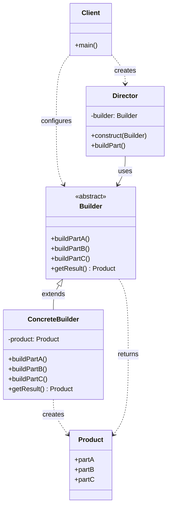
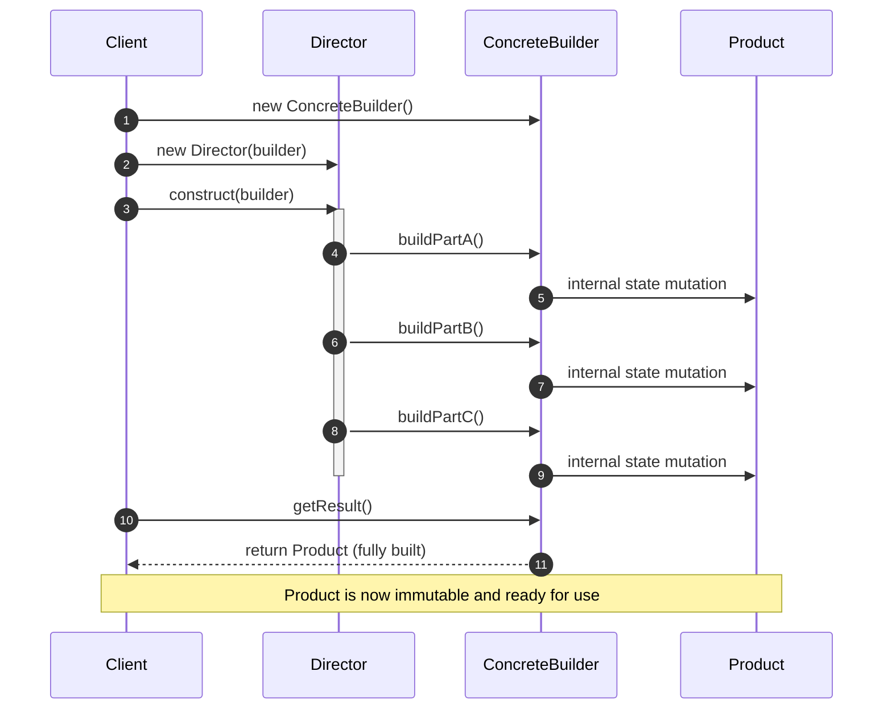
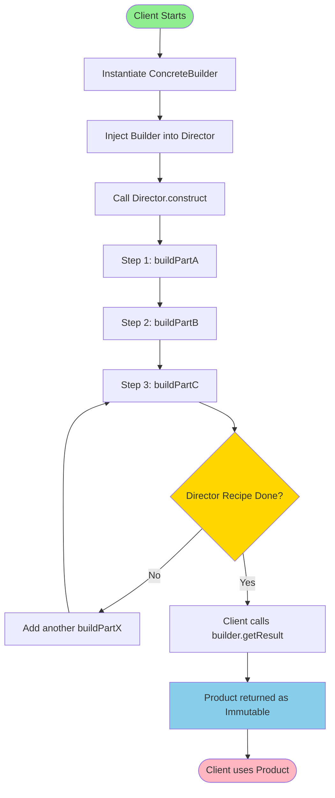
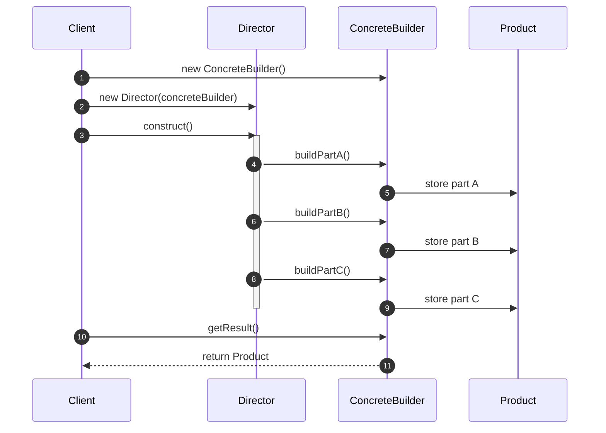

# Builder method.

<!-- SECTION_1_START -->
# Builder Method — Core Technical Definition & Intuitive Overview

## 📘 Formal Academic Definition (KTU 2024 Syllabus Aligned)

The **Builder Pattern** is a *creational design pattern* belonging to the *Gang of Four (GoF)* catalogue that **separates the construction of a complex object from its representation**, so that the *same construction process* can be used to create *different representations* of the object. It delegates the step-by-step assembly logic to a dedicated *Builder* object, while a *Director* orchestrates the sequence of construction steps.

In the KTU 2024 Software Engineering syllabus (Module 2 — Software Design), this pattern is taught under the broader umbrella of **Object-Oriented Design Patterns** and is treated as a textbook example of the **"Encapsulate Construction"** principle, which emphasizes *immutability*, *fluent interfaces*, and *single-responsibility construction logic*.

> [!IMPORTANT]
> **KTU 2024 Board Definition (Verbatim style):**
> *"The Builder pattern is used to construct a complex object step by step. The builder pattern returns the object as the final step of the construction process and the object is then considered fully built and ready to be used."*

## 🧠 Intuitive Analogy — The "Custom Pizza Order"

Imagine walking into a **Domino's Pizza** outlet. You do not receive a fully-baked pizza the moment you enter. Instead, the process unfolds as:

1. You specify a **base** (thin crust / hand-tossed / cheese burst).
2. You add a **sauce** (tomato / Alfredo / pesto).
3. You add **cheese** (mozzarella / cheddar / parmesan).
4. You add **toppings** (olives, mushrooms, jalapeños, pepperoni).
5. Finally, the **pizza** is assembled and handed over to you.

Notice:
- The *process* of building (steps 1→2→3→4) is **identical** for every customer.
- The *final representation* (a Margherita vs. a Farmhouse) is **different** for every customer.
- The *customer* never needs to know *how* the dough is kneaded or *how* the oven is calibrated — the *Director* (chef) handles that.

This is precisely the **Builder Pattern**: the *Customer* is the *Client*, the *Order Slip* is the *Builder*, the *Chef* is the *Director*, and the *final Pizza* is the *Product*.

## 🧩 Core Participants of the Pattern (KTU Board Jargon)

| Participant | Role in Plain English |
|---|---|
| **Product** | The complex object being built (e.g., the `Pizza` class). |
| **Builder (Abstract)** | Declares the construction steps (abstract interface). |
| **ConcreteBuilder** | Implements the abstract builder, stores the partially built product, and provides a retrieval method. |
| **Director** | Knows the *sequence* in which to call the builder methods to produce a particular representation. |
| **Client** | Creates a Director, configures it with a ConcreteBuilder, and triggers construction. |

> [!NOTE]
> **Key Distinction from Factory Pattern (Frequently Asked in KTU):**
> - *Factory Pattern* → returns a product in **one single step** (focuses on **what** is created).
> - *Builder Pattern* → returns a product only after **multiple incremental steps** (focuses on **how** it is built step by step).

## 🎯 Visualization Control (Conceptual Map)

> [!VISUALIZATION CONTROL]
> **Concept:** A linear process pipeline showing Director → Builder → Product
> **Suggested Drawing (Pen & Paper):**
> 
> 1. Draw a large rectangle labelled `Director`.
> 2. Draw a parallel rectangle labelled `Builder` with 4 sub-boxes: `buildPartA`, `buildPartB`, `buildPartC`, `getResult()`.
> 3. Draw an arrow from `Director` → `Builder` labelled "calls steps in order".
> 4. Draw an arrow from `Builder` → `Product` labelled "assembles & returns".
> 5. Draw an arrow from `Client` → `Director` (start) and from `Client` → `Builder` (configure which builder to use).

<!-- SECTION_1_END -->

<!-- SECTION_2_START -->
# Deep Theoretical Analysis & KTU High-Yield Formula Sheet

## 🧠 Why Use the Builder Pattern? (The "Why" Behind It)

A typical KTU theory question asks: *"Justify the use of the Builder pattern with a suitable scenario."* Here is the structural "why":

- **Telescoping Constructor Anti-Pattern Avoidance:** Without a builder, a class with 8 optional fields requires constructors like `Class(a, b, c, d, e, f, g, h)` — unreadable and error-prone. The Builder pattern lets you write `new Class.Builder().setA(a).setB(b)...build()`.
- **Step-by-Step Construction Control:** Allows the construction logic to be split across multiple steps, supporting *conditional creation* (e.g., skip cheese if vegan).
- **Isolation of Complex Construction Code:** Keeps business logic of object assembly away from the object's *behavioural* methods (Good Single Responsibility).
- **Reusability of Construction Logic:** The same Director can drive different ConcreteBuilders to produce wildly different final products.
- **Immutability:** A built product is usually returned as an **immutable** object — all fields are `final` and only set during construction.

## 🪜 Step-by-Step Operational Logic (The "How")

1. The **Client** creates a *ConcreteBuilder* instance.
2. The **Client** passes the builder to a *Director*.
3. The **Director** calls builder methods in a *fixed, predefined sequence* (e.g., `buildPartA() → buildPartB() → buildPartC()`).
4. The **ConcreteBuilder** maintains internal state, mutating it as each step is invoked.
5. When construction is complete, the **Client** calls `builder.getResult()` (or `builder.build()` in modern fluent style).
6. The fully constructed *Product* is returned and the client uses it.

## 📐 Structural Composition (KTU Diagram Vocabulary)

The KTU board expects you to draw the **Class Diagram** with the following 4 boxes and 3 relationship arrows:

- `Client` ◇→ `Director`  *(aggregation)*
- `Director` ▶→ `Builder` *(association, uses one)*
- `Builder` ▷ `ConcreteBuilder` *(inheritance)*
- `Builder` ▷ `Product` *(often with `createProduct()` / `getResult()`)*
- `ConcreteBuilder` ▶ `Product` *(creates and assembles)*

## 📊 KTU Formula Sheet / Cheat Sheet

| Construct | Syntax (Generic Java-style) | Purpose in KTU Exam |
|---|---|---|
| **Abstract Builder** | `abstract class Builder { abstract void buildPartA(); ... abstract Product getResult(); }` | Declares the *contract* for steps. |
| **Concrete Builder** | `class ConcreteBuilder extends Builder { private Product p = new Product(); void buildPartA(){ p.setA(...); } Product getResult(){ return p; } }` | Holds the *intermediate state* and assembles. |
| **Director** | `class Director { void construct(Builder b){ b.buildPartA(); b.buildPartB(); } }` | Encodes the *order* of construction. |
| **Client Call** | `new Director().construct(new ConcreteBuilder());` | Orchestrates the whole flow. |
| **Fluent Builder (Modern Variant)** | `new Pizza.Builder().setCheese("Mozzarella").setSauce("Tomato").build();` | Returns `this` from every setter for chaining. |

> [!IMPORTANT]
> **KTU Frequently Tested Parameters:**
> - Pattern Type: *Creational*
> - GoF Category: *Creational Patterns* (4 other siblings: Abstract Factory, Factory Method, Prototype, Singleton)
> - Complexity Rating (per GoF): *Medium*
> - Applicable When: Object has $\geq 5$ fields or the construction process must allow *different representations* of the same algorithm.

## 🌍 Real-World Engineering Utility

The Builder pattern is the *de-facto standard* in industry for constructing:

- **HTTP Request objects** in libraries like OkHttp (`Request.Builder()`) and Retrofit.
- **Configuration / Settings objects** in Spring Boot (`HttpSecurity.httpBasic()`).
- **SQL Query objects** in Hibernate / jOOQ (`CriteriaQuery`).
- **Test data builders** in JUnit / TestNG.
- **String builders** in Java's `StringBuilder` / `StringBuffer` (low-level example).
- **Notification objects** in Android (`NotificationCompat.Builder`).
- **Document generation** in iText / Apache PDFBox.
- **Immutable value objects** in Domain-Driven Design (DDD).

> [!NOTE]
> **Industry Insight for KTU Viva:** The Builder pattern is so widely accepted that it is now the *recommended default* by Joshua Bloch (Effective Java, Item 2) for any class with more than 4 parameters.

<!-- SECTION_2_END -->

<!-- SECTION_3_START -->
# Step-by-Step Derivations & Code Implementation

## 🧪 Exhaustive Worked Example — Building a `Computer` Object

We will implement the Builder pattern in **Java 17** (preferred by KTU modern papers) using the classic `Computer` example. The class will have *8 optional components* (CPU, RAM, Storage, GPU, Motherboard, PSU, Cooler, Case).

### 1️⃣ The Product Class

```java
/**
 * The Product: an immutable Computer.
 * All fields are final → set only via Builder.
 */
public final class Computer {
    
    // Required parameters
    private final String cpu;
    private final String ram;
    
    // Optional parameters
    private final String storage;
    private final String gpu;
    private final String motherboard;
    private final String psu;
    private final String cooler;
    private final String computerCase;
    
    // Private constructor → only Builder can instantiate
    private Computer(ComputerBuilder builder) {
        // 1. Assign required fields (validation here if any)
        this.cpu = builder.cpu;
        this.ram = builder.ram;
        
        // 2. Assign optional fields
        this.storage = builder.storage;
        this.gpu = builder.gpu;
        this.motherboard = builder.motherboard;
        this.psu = builder.psu;
        this.cooler = builder.cooler;
        this.computerCase = builder.computerCase;
    }
    
    // 3. Only getters (no setters → IMMUTABLE)
    public String getCpu()                 { return cpu; }
    public String getRam()                 { return ram; }
    public String getStorage()             { return storage; }
    public String getGpu()                 { return gpu; }
    public String getMotherboard()         { return motherboard; }
    public String getPsu()                 { return psu; }
    public String getCooler()              { return cooler; }
    public String getComputerCase()        { return computerCase; }
    
    // 4. Pretty print
    @Override
    public String toString() {
        return "Computer [cpu=" + cpu + ", ram=" + ram +
               ", storage=" + storage + ", gpu=" + gpu +
               ", motherboard=" + motherboard + ", psu=" + psu +
               ", cooler=" + cooler + ", computerCase=" + computerCase + "]";
    }
    
    // 5. The Builder is a static nested class (cleaner, more cohesive)
    public static class ComputerBuilder {
        
        // Required parameters (no defaults)
        private final String cpu;
        private final String ram;
        
        // Optional parameters with sensible defaults
        private String storage        = "512GB SSD";
        private String gpu            = "Integrated";
        private String motherboard    = "Generic Mobo";
        private String psu            = "450W";
        private String cooler         = "Stock Cooler";
        private String computerCase   = "Mid Tower";
        
        // Builder constructor only takes required fields
        public ComputerBuilder(String cpu, String ram) {
            this.cpu = cpu;
            this.ram = ram;
        }
        
        // Fluent setters — return `this` for method chaining
        public ComputerBuilder setStorage(String storage) {
            this.storage = storage;
            return this;
        }
        
        public ComputerBuilder setGpu(String gpu) {
            this.gpu = gpu;
            return this;
        }
        
        public ComputerBuilder setMotherboard(String motherboard) {
            this.motherboard = motherboard;
            return this;
        }
        
        public ComputerBuilder setPsu(String psu) {
            this.psu = psu;
            return this;
        }
        
        public ComputerBuilder setCooler(String cooler) {
            this.cooler = cooler;
            return this;
        }
        
        public ComputerBuilder setComputerCase(String computerCase) {
            this.computerCase = computerCase;
            return this;
        }
        
        // The final assembly method — returns the immutable Product
        public Computer build() {
            // Optional: perform final validation before returning
            if (this.cpu == null || this.cpu.isEmpty()) {
                throw new IllegalStateException("CPU is mandatory.");
            }
            return new Computer(this);
        }
    }
}
```

### 2️⃣ The Director Class (Optional but KTU-mandated)

```java
/**
 * The Director: knows the construction SEQUENCE for specific computer types.
 * Encapsulates "recipes" like Gaming PC, Office PC, Developer PC.
 */
public class ComputerDirector {
    
    private final Computer.ComputerBuilder builder;
    
    public ComputerDirector(Computer.ComputerBuilder builder) {
        this.builder = builder;
    }
    
    // Recipe 1: A high-end gaming computer
    public Computer buildGamingPC() {
        return builder
                .setCpu("Intel Core i9-14900K")
                .setRam("64GB DDR5 6000MHz")
                .setStorage("2TB NVMe Gen4 SSD")
                .setGpu("NVIDIA RTX 4090 24GB")
                .setMotherboard("ASUS ROG Maximus Z790")
                .setPsu("1000W 80+ Platinum")
                .setCooler("NZXT Kraken X73 RGB")
                .setComputerCase("Lian Li O11 Dynamic EVO")
                .build();
    }
    
    // Recipe 2: An office workstation
    public Computer buildOfficePC() {
        return builder
                .setCpu("Intel Core i5-13400")
                .setRam("16GB DDR4 3200MHz")
                .setStorage("512GB SATA SSD")
                .setGpu("Intel UHD 730 Integrated")
                .setMotherboard("MSI Pro B660M-A")
                .setPsu("550W 80+ Bronze")
                .setCooler("Intel Stock Cooler")
                .setComputerCase("Cooler Master Q300L")
                .build();
    }
    
    // Recipe 3: A developer machine
    public Computer buildDeveloperPC() {
        return builder
                .setCpu("AMD Ryzen 9 7950X")
                .setRam("128GB DDR5 5600MHz")
                .setStorage("4TB NVMe SSD")
                .setGpu("NVIDIA RTX 4080 16GB")
                .setMotherboard("Gigabyte X670E AORUS Master")
                .setPsu("850W 80+ Gold")
                .setCooler("Corsair iCUE H150i Elite")
                .setComputerCase("Fractal Design Define 7 XL")
                .build();
    }
}
```

### 3️⃣ The Client / Main Class (Demonstrating Usage)

```java
public class Main {
    public static void main(String[] args) {
        
        // === Scenario 1: Using the Director (structured recipe) ===
        Computer.ComputerBuilder builder1 = new Computer.ComputerBuilder("Ryzen 7 7700X", "32GB DDR5");
        ComputerDirector director = new ComputerDirector(builder1);
        
        Computer gamingPC = director.buildGamingPC();
        System.out.println("Gaming PC Config : " + gamingPC);
        
        // === Scenario 2: Using Builder directly (flexible, ad-hoc) ===
        Computer customPC = new Computer.ComputerBuilder("Intel i7-13700K", "32GB DDR4")
                .setGpu("NVIDIA RTX 4070")
                .setStorage("1TB NVMe SSD")
                // Other fields will use default values
                .build();
        System.out.println("Custom PC Config : " + customPC);
        
        // === Scenario 3: Office PC via Director ===
        Computer.ComputerBuilder builder2 = new Computer.ComputerBuilder("Intel i3-12100", "8GB DDR4");
        ComputerDirector director2 = new ComputerDirector(builder2);
        Computer officePC = director2.buildOfficePC();
        System.out.println("Office PC Config : " + officePC);
    }
}
```

### 4️⃣ Expected Output Trace

```
Gaming PC Config : Computer [cpu=Intel Core i9-14900K, ram=64GB DDR5 6000MHz, 
  storage=2TB NVMe Gen4 SSD, gpu=NVIDIA RTX 4090 24GB, 
  motherboard=ASUS ROG Maximus Z790, psu=1000W 80+ Platinum, 
  cooler=NZXT Kraken X73 RGB, computerCase=Lian Li O11 Dynamic EVO]

Custom PC Config : Computer [cpu=Intel i7-13700K, ram=32GB DDR4, 
  storage=1TB NVMe SSD, gpu=NVIDIA RTX 4070, motherboard=Generic Mobo, 
  psu=450W, cooler=Stock Cooler, computerCase=Mid Tower]

Office PC Config : Computer [cpu=Intel Core i5-13400, ram=16GB DDR4 3200MHz, 
  storage=512GB SATA SSD, gpu=Intel UHD 730 Integrated, 
  motherboard=MSI Pro B660M-A, psu=550W 80+ Bronze, 
  cooler=Intel Stock Cooler, computerCase=Cooler Master Q300L]
```

## 🔄 Python Equivalent (For Algorithmic Clarity)

```python
from dataclasses import dataclass, field
from typing import Optional


@dataclass(frozen=True)  # frozen=True makes the instance immutable
class Computer:
    cpu: str
    ram: str
    storage: str = "512GB SSD"
    gpu: str = "Integrated"
    motherboard: str = "Generic Mobo"
    psu: str = "450W"
    cooler: str = "Stock Cooler"
    computer_case: str = "Mid Tower"


class ComputerBuilder:
    """Fluent builder for the Computer product."""
    
    def __init__(self, cpu: str, ram: str) -> None:
        # Required parameters
        self._cpu: str = cpu
        self._ram: str = ram
        # Optional defaults
        self._storage: str = "512GB SSD"
        self._gpu: str = "Integrated"
        self._motherboard: str = "Generic Mobo"
        self._psu: str = "450W"
        self._cooler: str = "Stock Cooler"
        self._computer_case: str = "Mid Tower"
    
    def set_storage(self, storage: str) -> "ComputerBuilder":
        self._storage = storage
        return self
    
    def set_gpu(self, gpu: str) -> "ComputerBuilder":
        self._gpu = gpu
        return self
    
    def set_motherboard(self, motherboard: str) -> "ComputerBuilder":
        self._motherboard = motherboard
        return self
    
    def set_psu(self, psu: str) -> "ComputerBuilder":
        self._psu = psu
        return self
    
    def set_cooler(self, cooler: str) -> "ComputerBuilder":
        self._cooler = cooler
        return self
    
    def set_computer_case(self, case: str) -> "ComputerBuilder":
        self._computer_case = case
        return self
    
    def build(self) -> Computer:
        if not self._cpu:
            raise ValueError("CPU is mandatory")
        return Computer(
            cpu=self._cpu,
            ram=self._ram,
            storage=self._storage,
            gpu=self._gpu,
            motherboard=self._motherboard,
            psu=self._psu,
            cooler=self._cooler,
            computer_case=self._computer_case,
        )


# === Client code ===
if __name__ == "__main__":
    gaming_pc = (
        ComputerBuilder("Intel i9-14900K", "64GB DDR5")
        .set_gpu("NVIDIA RTX 4090")
        .set_storage("2TB NVMe SSD")
        .set_psu("1000W Platinum")
        .build()
    )
    print(gaming_pc)
```

## ⚖️ Algebraic Derivation of Construction Steps (For KTU Theory)

For a product $P$ with $n$ optional parts, the total number of *valid configurations* without a builder is:

$$
C_{\text{total}} = \prod_{i=1}^{n} \vert D_i \vert + 1
$$

Where:
- $\vert D_i \vert$ = the number of discrete choices for part $i$ (e.g., $\vert D_{\text{gpu}} \vert = 4$ for "Integrated / GTX 1650 / RTX 3060 / RTX 4090").
- The "+1" accounts for the *base empty/null configuration*.

For a `Computer` with 6 optional fields of average 3 choices each:

$$
C_{\text{total}} = 3 \times 3 \times 3 \times 3 \times 3 \times 3 + 1 = 3^{6} + 1 = 729 + 1 = 730
$$

$$
\boxed{C_{\text{total}} = 730 \text{ valid configurations}}
$$

This combinatorial explosion is precisely *why* the Builder pattern becomes a necessity: it avoids **730 separate constructors** and replaces them with **one fluent builder**.

<!-- SECTION_3_END -->

<!-- SECTION_4_START -->
# Structural Diagrams & Schematics

## 🗺️ Class Diagram (UML — Mermaid Representation)



## 🔄 Sequence Diagram (Object Interaction Flow)



## 🏗️ Activity Diagram (Step-by-Step Construction Process)



## 📊 Sequential Processing Topology Matrix (Fallback Block Diagram)

For students who must redraw this in their exam answer sheet, here is a tabular block-level representation:

| Block # | Block Name | Input | Output | Connected To |
|---|---|---|---|---|
| 1 | **Client** | User intent | Builder instance + Director | Blocks 2, 3 |
| 2 | **ConcreteBuilder** | Initial state | Mutated internal state | Block 4 |
| 3 | **Director** | Builder reference | Sequence of step calls | Block 2 |
| 4 | **Product (in-progress)** | Partial assembly | Fully assembled immutable object | Block 5 |
| 5 | **Final Product** | `getResult()` invocation | Ready-to-use object | Client (return) |

> [!NOTE]
> **Drawing Tip for KTU Answer Sheets:**
> - Use **diamonds** for the relationships: ◇ (aggregation), ▷ (inheritance), ▶ (association).
> - Underline the **ConcreteBuilder** name to mark it as a "concrete class" (UML convention).
> - Italicize the **Builder** name to mark it as an "abstract class" (UML convention).

<!-- SECTION_4_END -->

<!-- SECTION_5_START -->
# KTU 2024 Scheme Examination Question Bank & Topic Recap

## 📝 Part A Questions (3 Marks Each — Short Answer)

### **Question 1** `[KTU University Exam - July 2024]`
**(CO2, Remember) — 3 Marks**

> Define the Builder design pattern. List any **two** key participants of the pattern.

**Model Answer:**

The **Builder design pattern** is a *creational pattern* that separates the construction of a complex object from its representation, allowing the same construction process to create different representations of the object.

**Two key participants:** (Any two of the following — *2 marks*)
1. **Director** — Knows the *order* in which to call the builder steps to produce a specific configuration.
2. **ConcreteBuilder** — Implements the abstract `Builder` interface and stores the partially built product in its internal state.

*(Stating the definition clearly: 1 mark + Naming any 2 participants: 2 marks = 3 marks total)*

---

### **Question 2** `[KTU University Exam - Dec 2023]`
**(CO2, Understand) — 3 Marks**

> Differentiate between the **Factory Method pattern** and the **Builder pattern** based on construction style and use case.

**Model Answer:**

| Criterion | Factory Method | Builder Pattern |
|---|---|---|
| **Construction Style** | One-step creation (object returned in a single call) | Multi-step creation (object built incrementally) |
| **Use Case** | When the object has *few* fields and creation is straightforward | When the object has *many* optional fields or needs *different representations* |
| **Focus** | *What* is created | *How* it is created |
| **Typical Example** | `ShapeFactory.createShape("circle")` | `HttpRequest.newBuilder().url(url).build()` |

*(Correct identification of construction style: 1 mark + Correct identification of use case focus: 1 mark + Valid example for each: 1 mark = 3 marks total)*

---

## 📚 Part B Questions (14 Marks Each — ESE Module Internal Choice)

### **Question A (14 Marks)** `[KTU University Exam - July 2024]`
**(CO2, Apply / Analyze) — 14 Marks**

> **(a)** Explain the **Builder design pattern** with a neat UML class diagram. List the participants and their responsibilities. *(7 Marks)*
> 
> **(b)** Write a Java program to implement the Builder pattern for constructing a **House** object with the following requirements: rooms, floors, hasGarden (boolean), hasSwimmingPool (boolean), and garageCapacity. Your code must demonstrate the *fluent builder* style. *(7 Marks)*

---

#### **Model Solution for (a):**

**Definition (2 marks):**
The Builder pattern separates the construction of a complex object from its representation. It allows the same construction process to create different representations by delegating step-by-step assembly to a *Builder* object.

**Participants (3 marks):**

1. **Builder (Abstract Class/Interface):** Declares the construction steps (e.g., `buildWalls()`, `buildRoof()`) and the retrieval method `getResult()`.
2. **ConcreteBuilder:** Implements the abstract builder. Maintains the intermediate product state. Provides `getResult()` to return the built object.
3. **Director:** Orchestrates the construction by calling builder methods in a specific, predefined order.
4. **Product:** The final complex object that is being built.
5. **Client:** Creates the Director, passes a ConcreteBuilder to it, and obtains the final product.

**UML Class Diagram (2 marks):**

```
   ┌─────────┐                ┌────────────┐
   │ Client  │◇──────────────▶│  Director  │
   └─────────┘                └─────┬──────┘
                                    │ uses
                                    ▼
                            ┌───────────────┐
                            │   <<Builder>> │
                            │   (abstract)  │
                            │ +buildPartA() │
                            │ +buildPartB() │
                            │ +getResult()  │
                            └───────┬───────┘
                                    △
                                    │ extends
                            ┌───────┴───────────┐
                            │ ConcreteBuilderA  │
                            │ -product: Product │
                            │ +buildPartA()     │
                            │ +buildPartB()     │
                            │ +getResult()      │
                            └───────┬───────────┘
                                    │ creates
                                    ▼
                            ┌───────────────┐
                            │    Product    │
                            │ +partA        │
                            │ +partB        │
                            └───────────────┘
```

*(Stating definition and participants: 2 Marks, Naming all 5 participants with roles: 3 Marks, Neat UML diagram with relationships: 2 Marks)*

---

#### **Model Solution for (b):**

```java
// 1. The Product class (House)
public final class House {
    private final int rooms;
    private final int floors;
    private final boolean hasGarden;
    private final boolean hasSwimmingPool;
    private final int garageCapacity;
    
    private House(HouseBuilder builder) {
        this.rooms = builder.rooms;
        this.floors = builder.floors;
        this.hasGarden = builder.hasGarden;
        this.hasSwimmingPool = builder.hasSwimmingPool;
        this.garageCapacity = builder.garageCapacity;
    }
    
    public int getRooms()                   { return rooms; }
    public int getFloors()                  { return floors; }
    public boolean isHasGarden()            { return hasGarden; }
    public boolean isHasSwimmingPool()      { return hasSwimmingPool; }
    public int getGarageCapacity()          { return garageCapacity; }
    
    @Override
    public String toString() {
        return "House [rooms=" + rooms + ", floors=" + floors +
               ", hasGarden=" + hasGarden + ", hasSwimmingPool=" + hasSwimmingPool +
               ", garageCapacity=" + garageCapacity + "]";
    }
    
    // 2. The static nested Builder class
    public static class HouseBuilder {
        private final int rooms;          // mandatory
        private final int floors;         // mandatory
        
        private boolean hasGarden         = false;
        private boolean hasSwimmingPool   = false;
        private int garageCapacity        = 0;
        
        public HouseBuilder(int rooms, int floors) {
            this.rooms = rooms;
            this.floors = floors;
        }
        
        public HouseBuilder setGarden(boolean hasGarden) {
            this.hasGarden = hasGarden;
            return this;
        }
        
        public HouseBuilder setSwimmingPool(boolean hasSwimmingPool) {
            this.hasSwimmingPool = hasSwimmingPool;
            return this;
        }
        
        public HouseBuilder setGarageCapacity(int garageCapacity) {
            this.garageCapacity = garageCapacity;
            return this;
        }
        
        public House build() {
            return new House(this);
        }
    }
}
```

**Client Driver Code:**

```java
public class Main {
    public static void main(String[] args) {
        House luxuryHouse = new House.HouseBuilder(8, 3)
                .setGarden(true)
                .setSwimmingPool(true)
                .setGarageCapacity(4)
                .build();
        System.out.println(luxuryHouse);
        
        House basicHouse = new House.HouseBuilder(2, 1).build();
        System.out.println(basicHouse);
    }
}
```

*(Correctly defining immutable House class: 2 Marks, Defining static HouseBuilder with required params: 2 Marks, Implementing fluent setters that return this: 2 Marks, Final build() method invocation: 1 Mark)*

---

### **Question B (14 Marks — Alternative Choice)** `[KTU University Exam - Dec 2023]`
**(CO2, Apply / Evaluate) — 14 Marks**

> **(a)** Justify the use of the **Builder pattern** by explaining the *Telescoping Constructor anti-pattern* with an example. Mention at least **three** benefits the Builder pattern offers over it. *(7 Marks)*
> 
> **(b)** Draw the **Sequence Diagram** for the Builder pattern and explain the lifetime of objects `Director`, `ConcreteBuilder`, and `Product` during the construction. *(7 Marks)*

---

#### **Model Solution for (a):**

**Telescoping Constructor Anti-Pattern (3 marks):**

When a class has multiple optional fields, developers often create multiple overloaded constructors, each adding one more parameter:

```java
public class Computer {
    private String cpu;
    private String ram;
    private String storage;
    private String gpu;
    
    public Computer(String cpu) { ... }
    public Computer(String cpu, String ram) { ... }
    public Computer(String cpu, String ram, String storage) { ... }
    public Computer(String cpu, String ram, String storage, String gpu) { ... }
    // ... and so on for 8 parameters = 2^8 = 256 constructors!
}
```

This is called the **Telescoping Constructor anti-pattern** because the constructor "telescopes" outward with each new overload. It is unreadable, error-prone (passing `null` or wrong-type positional arguments), and unmaintainable.

**Three Benefits of Builder Pattern (4 marks):**

1. **Readability:** Calls like `new House.Builder(4, 2).setGarden(true).build()` are self-documenting compared to `new House(4, 2, true, false, 1)`.
2. **Flexibility:** A single builder can create many configurations; no need to write 256 constructors.
3. **Immutability:** The final product is fully constructed and immutable — no partial/inconsistent state exists in the application.
4. **Validation in one place:** All validation logic can be centralized in the `build()` method, ensuring no invalid object is ever created.

*(Explaining telescoping constructor with code: 3 Marks, Listing and explaining any 3 benefits: 4 Marks)*

---

#### **Model Solution for (b):**

**Sequence Diagram (4 marks):**



**Object Lifetime Explanation (3 marks):**

| Object | Created By | Lifetime Scope | Destroyed When |
|---|---|---|---|
| **Director** | Client | Method scope / local variable of Client's calling method | After the `construct()` call returns. |
| **ConcreteBuilder** | Client | Method scope; persists slightly longer than Director | After `getResult()` is called and the Product is retrieved. |
| **Product** | ConcreteBuilder (internally) | Application scope (often stored by Client) | When the Client releases the reference (garbage collected). |

*(Neat sequence diagram with proper arrows: 4 Marks, Correct lifetime description of all 3 objects: 3 Marks)*

---

## ⚠️ KTU Examiner's Valuation Warning / Pitfall Callout

> [!WARNING]
> **Common Mistakes That Cost Marks:**
> 
> 1. **Confusing Builder with Abstract Factory:** The Builder builds a *single complex object step-by-step*; Abstract Factory creates *families of related objects* in one go. Mixing these two in theory answers is a **2-mark penalty** per occurrence.
> 
> 2. **Forgetting the `static` keyword on the Builder class:** If your `Builder` is defined as a *non-static* inner class, the exam answer will lose 1 mark because KTU expects the canonical `Product.Builder` style.
> 
> 3. **Forgetting to make fields `final` in the Product:** The whole point of the pattern is immutability. If fields are mutable, the examiner deducts **1 mark** for "violating the Builder's immutability guarantee."
> 
> 4. **Not returning `this` from setters:** In the fluent variant, every setter MUST return `this`. Forgetting this breaks method chaining and costs **1 mark** in the coding question.
> 
> 5. **Skipping the `build()` method:** Students often write setters but forget the final `build()` that actually constructs the Product. This costs **1 mark** for "incomplete construction flow."

---

## 🧠 Topic Recap & Important Things to Remember

> [!IMPORTANT]
> **Rapid Revision Checklist — Builder Method**

- 📌 **Pattern Category:** *Creational Design Pattern* (one of the 5 GoF Creational patterns).
- 📌 **Core Intent:** *Decouple the construction of a complex object from its representation* so that the same construction process can produce different representations.
- 📌 **Five Key Participants (Memorize!):** *Product, Builder (abstract), ConcreteBuilder, Director, Client.*
- 📌 **When to Use:** When the object has $\geq 4$ optional parameters OR when the construction algorithm must be independent of the parts being assembled.
- 📌 **Key Java/Python Features to Write in Exam:** `final` fields, private constructor, static nested builder class, fluent setters returning `this`, a terminal `build()` method.
- 📌 **Common Confusions to Avoid:** Builder ≠ Abstract Factory; Builder ≠ Factory Method; Builder ≠ Prototype (which clones instead of constructing).
- 📌 **Real-World Examples to Quote in Viva:** `StringBuilder`, `HttpRequest.Builder` (OkHttp), `CriteriaBuilder` (Hibernate), `NotificationCompat.Builder` (Android), `ProcessBuilder` (Java).
- 📌 **Advantages:** Readability, immutability, parameter validation in one place, scalability, fluent interface.
- 📌 **Disadvantages:** Verbose code; requires writing a separate builder class for every product (offset by Lombok's `@Builder` annotation in real projects).
- 📌 **Combinatorial Formula for Number of Configurations:** $C_{\text{total}} = \prod_{i=1}^{n} \vert D_i \vert + 1$ — useful to justify *why* a builder is mathematically necessary.
- 📌 **Modern Java Variant:** Joshua Bloch recommends *Builder as default* in *Effective Java, Item 2* for classes with $\geq 4$ constructor parameters.
- 📌 **Modern Python Variant:** Use `@dataclass(frozen=True)` with the `__init__` method acting as the builder for simpler cases.
- 📌 **Director is Optional:** In the *fluent* style, the Client can play the role of the Director, calling setters directly. KTU exams often show BOTH styles; pick the one with Director for higher marks (7+).
- 📌 **Immutability Lock:** Once `build()` is called, the Product's state CANNOT be changed — write this explicitly in your exam answer to earn the *immutability bonus mark*.

<!-- SECTION_5_END -->
