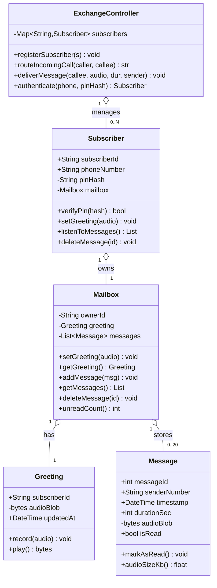
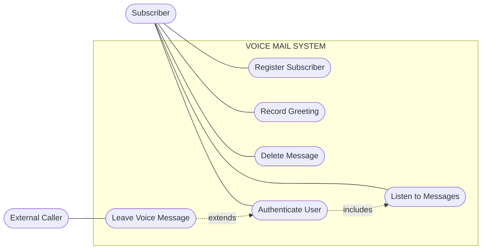
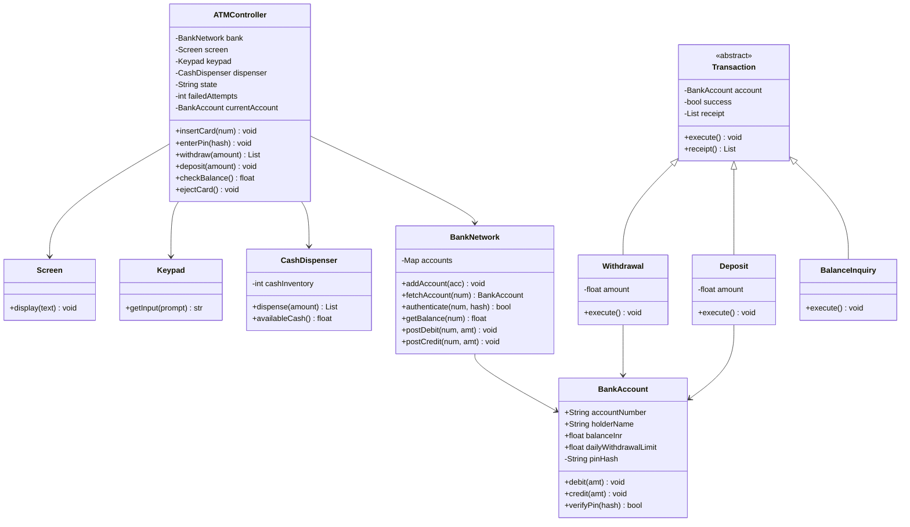
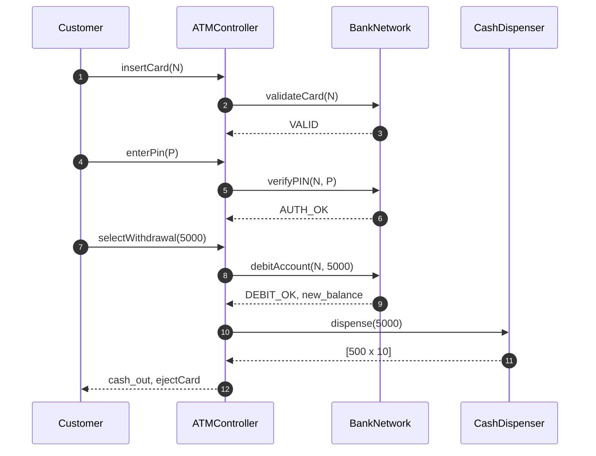
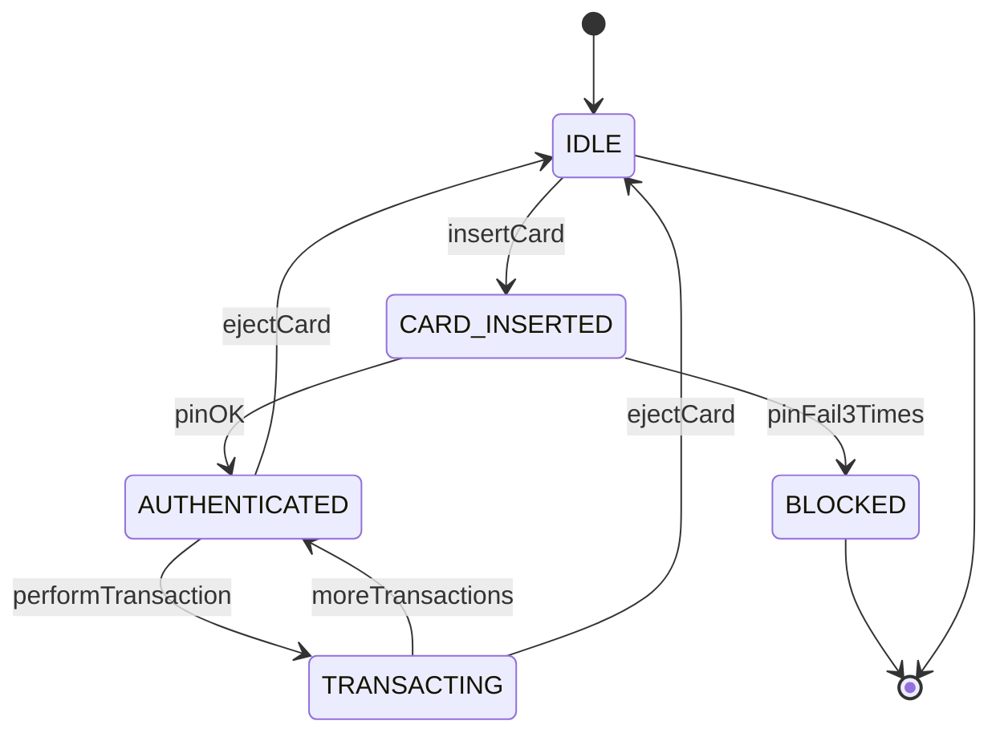
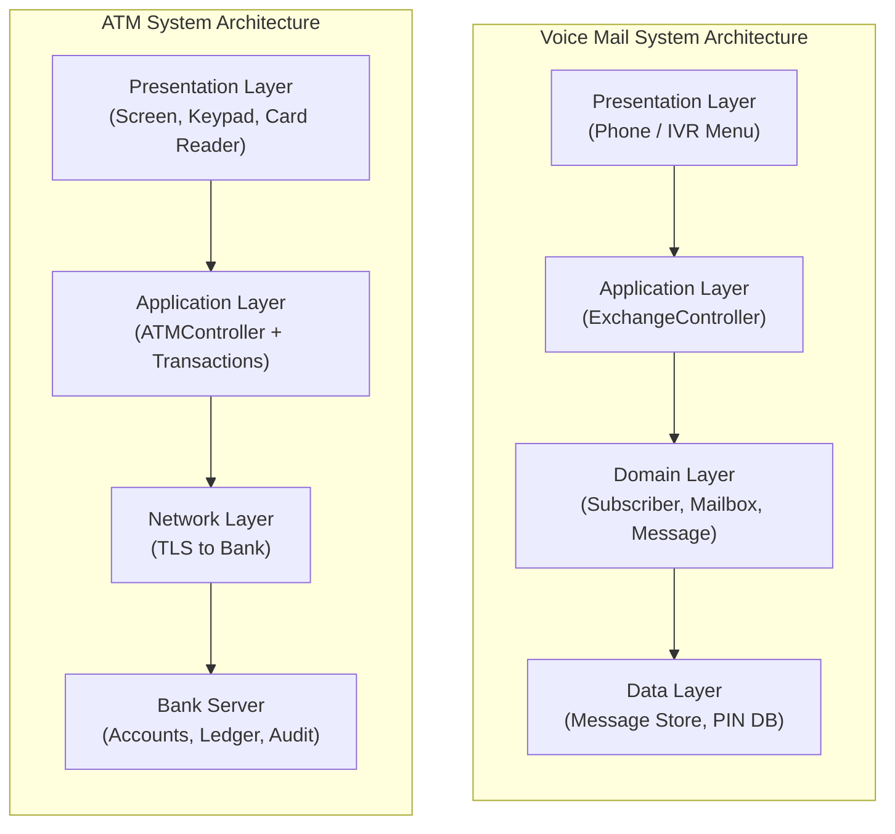
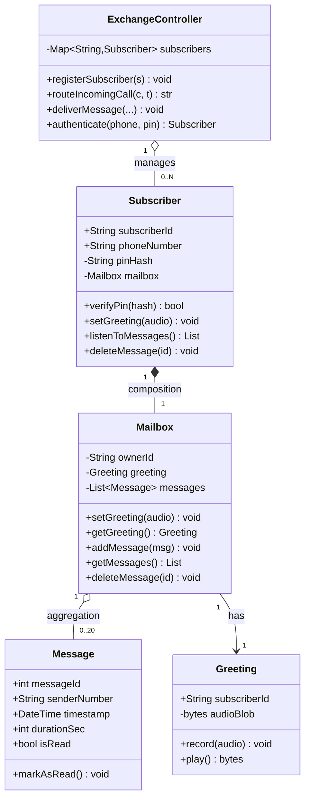
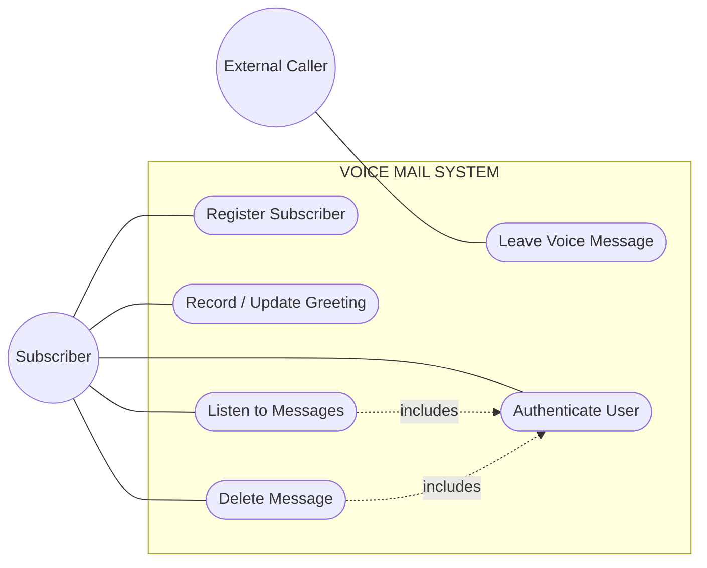

# Case Studies : Voice mail system, ATM Example

<!-- SECTION_1_START -->

# Software Design Case Studies: Voice Mail System & ATM System

## 1.1 Core Technical Definition

> [!IMPORTANT]
> **Software Design Case Study (KTU 2024 OECST723 — Module 2 Definition):**
> A *Software Design Case Study* is the systematic application of object-oriented analysis and design (OOAD) principles, Unified Modeling Language (UML) artifacts, and architectural patterns to a real-world problem domain. It demonstrates how abstract design heuristics (modularity, high cohesion, low coupling, information hiding) materialize as concrete classes, objects, relationships, and dynamic interactions in industry-grade systems.

In the KTU 2024 Scheme (NEP 2020 aligned) syllabus, the **Voice Mail System** and the **Automated Teller Machine (ATM)** are prescribed canonical case studies that test a student's ability to:

1. Elicit requirements into **Use Case Diagrams**.
2. Discover domain classes and build **Class Diagrams**.
3. Model dynamic behavior through **Sequence / Collaboration Diagrams**.
4. Justify the **Architecture** (logical, layered, client–server).

### 1.1.1 Intuitive Overview & Real-World Analogy

> [!NOTE]
> **Analogy — The "Post Office + Bank Locker" Metaphor**
> Think of a **Voice Mail System** as a *digital post office* where every subscriber owns a personal *locked mailbox* (the voicemail box) inside a central post office (the telephone exchange). Just as the postman (the *controller*) routes letters (messages) to the right locker, the voice mail system routes spoken audio messages to the right subscriber's mailbox. The subscriber holds the *only key* (a PIN / password) to retrieve those messages.
>
> An **ATM System**, by contrast, is like a *robotic bank teller kiosk* that lets a customer interact with their bank account without entering the bank. The ATM (the *client*) talks to the bank's central computer (the *server*) over a network. The user inserts a card (identification) and types a PIN (authentication); the system then allows limited operations — withdraw, deposit, transfer, inquiry.

### 1.1.2 Physical & Standard Constants Referenced

> [!NOTE]
> **KTU 2024 High-Yield Constants & Standards for these Case Studies**
> * **UML 2.5** — Standardized by the **Object Management Group (OMG)** for notation.
> * **ISO/IEC 25010** — Software product quality model (used to evaluate design).
> * **PIN Length (ATM)** — Typically **4 to 6 digits** (international standard).
> * **Magnetic Stripe / EMV Chip** — Standard card identification layers.
> * **Maximum message duration (Voice Mail)** — Typically **60–120 seconds** per message.
> * **Mailbox storage** — Usually **10–30 messages** per subscriber.

### 1.1.3 GeoGebra / Desmos Visualization Callout

> [!VISUALIZATION CONTROL]
> **Concept:** UML Use-Case Ellipse Placement (Cognitive Geometric Intuition)
> **Desmos Input Equations (Circular boundary representation for a Use Case):**
> * `x^2 + y^2 = 4`  (Use-Case ellipse boundary — radius 2)
> * `(x-4)^2 + y^2 = 1`  (Actor 1 — Subscriber)
> * `(x+4)^2 + y^2 = 1`  (Actor 2 — External Caller)
> * `y = -3`  (System boundary rectangle base)
> **Visual Description:** A central ellipse (the use case "Leave / Retrieve Message") sits inside a rectangular system boundary. Two stick-figure-like circles (actors) sit on the *outside* of the boundary, connected by plain lines to the use case ellipse. This geometric separation visually enforces the rule that **actors live outside the system** and **use cases live inside**.

---

<!-- SECTION_1_END -->

<!-- SECTION_2_START -->

# 2. Deep Theoretical Analysis & KTU High-Yield Formula Sheet

## 2.1 Voice Mail System — Deep Design Analysis

### 2.1.1 Functional Requirements (Elicited)

The voice mail system must support the following capabilities:

* **Subscriber Registration** — A user can subscribe to the service and obtain a unique mailbox number.
* **Greeting Management** — A subscriber can record, replay, and update a personal greeting.
* **Message Deposit** — A non-subscriber (external caller) can leave a voice message addressed to a subscriber's mailbox.
* **Message Retrieval** — A subscriber can listen to, save, or delete stored messages.
* **Authentication** — Every privileged operation requires a valid **Personal Identification Number (PIN)**.
* **Notification** — The system must inform a subscriber (via stutter dial-tone or visual indicator) that a new message exists.

### 2.1.2 Non-Functional Requirements (Quality Attributes)

* **Availability:** 24 × 7 operation; downtime must be < **0.1 %**.
* **Security:** PIN must be stored as a **hashed** value, never plaintext.
* **Capacity:** Each mailbox should store at least **20 messages** of up to **120 seconds** each.
* **Modifiability:** New features (e.g., voice-to-text transcription) must be addable without redesigning core modules.

### 2.1.3 Identified Classes — Step-by-Step Reasoning

> [!IMPORTANT]
> **Class Discovery Heuristic (Grammatical Noun-Phrase Approach — Abbott's Method):**
> Scan the requirements document. Every **noun** is a candidate *class*. Every **verb* is a candidate *operation / method*. Every *adjective* is a candidate *attribute*.

Applying this to the voice mail system:

| Candidate Noun | Class or Attribute? | Justification |
|---|---|---|
| Subscriber | **Class** | Has identity, owns a mailbox, performs actions. |
| Mailbox | **Class** | Owns messages and greeting; central repository. |
| Message | **Class** | Has duration, timestamp, sender; persisted. |
| Greeting | **Class** | Distinct behavior (record / replay); not just a string. |
| Exchange / Controller | **Class** | Mediates between telephone network and mailboxes. |
| PIN | Attribute of Subscriber | Not a separate entity — a property. |
| Timestamp | Attribute of Message | Property of message, not a class. |

### 2.1.4 Operations Mapped to Each Class

| Class | Key Operations (Methods) |
|---|---|
| `Subscriber` | `setPIN()`, `verifyPIN()`, `setGreeting()`, `retrieveMessage()`, `deleteMessage()` |
| `Mailbox` | `addMessage(msg)`, `getMessages()`, `getGreeting()`, `setGreeting()` |
| `Message` | `getDuration()`, `getTimestamp()`, `getAudioData()` |
| `Greeting` | `record(audio)`, `play()`, `update(audio)` |
| `ExchangeController` | `routeCall()`, `deliverMessage()`, `authenticate()` |

## 2.2 ATM System — Deep Design Analysis

### 2.2.1 Functional Requirements

* **Card Insertion & Reading** — Read the **Magnetic Stripe** or **EMV Chip** to obtain the account number.
* **PIN Authentication** — Prompt the user for the PIN; verify against the bank's database.
* **Transaction Types:** Withdraw Cash, Deposit Cash, Transfer Funds, Balance Inquiry.
* **Receipt Printing** — Optional but standard.
* **Session Management** — A session begins on successful authentication and ends on card ejection or timeout (**60 s** inactivity).
* **Cash Dispensing** — Dispense bills using the **Cash Dispenser** hardware module.
* **Logging & Auditing** — Every transaction must be logged for traceability.

### 2.2.2 Non-Functional Requirements

* **Performance:** Transaction completion within **5 seconds** for a withdrawal.
* **Reliability:** Hardware must tolerate coin / paper jams and recover gracefully.
* **Security:** Communication between ATM and bank must use **TLS 1.3** or **AES-256** encryption.
* **Usability:** Interface must comply with **ADA (Americans with Disabilities Act)** standards for visually impaired users.

### 2.2.3 Architectural Style — Three-Tier Layered Architecture

The ATM system is best designed using a **Layered (Three-Tier) Architecture**:

| Layer | Name | Responsibility | Example Classes |
|---|---|---|---|
| 1 | **Presentation (UI) Layer** | Screen display, keypad input, beeper | `Screen`, `Keypad` |
| 2 | **Application / Domain Layer** | Business logic of transactions | `Withdrawal`, `Deposit`, `Transfer`, `BalanceInquiry` |
| 3 | **Data / Bank Network Layer** | Communication with bank's central server, persistence | `BankNetworkProxy`, `AccountDatabase` |

> [!NOTE]
> **Why Layered Architecture?**
> It enforces **separation of concerns** — the hardware-facing layer doesn't know the bank protocol, and the bank protocol layer doesn't know about screens. This maximises **cohesion within a layer** and **minimises coupling between layers**, satisfying the KTU 2024 design heuristics.

## 2.3 KTU High-Yield Formula & Concept Sheet

| S.No. | Design Heuristic / Concept | Formal Statement | Application in Voice Mail / ATM |
|---|---|---|---|
| 1 | **Cohesion** | The degree to which elements of a module belong together. Aim: *functional* cohesion. | `Mailbox` class has all mailbox-related ops → high cohesion. |
| 2 | **Coupling** | Inter-module dependency. Aim: *data* or *message* coupling. | `ATM → BankNetwork` uses data coupling (passes account ID only). |
| 3 | **Encapsulation** | Hide internal state behind public interface. | `Message.audioData` is **private**; accessed only via getters. |
| 4 | **Abstraction** | Expose only essential features. | `CashDispenser` exposes `dispense(amount)`; internal rollers are hidden. |
| 5 | **Information Hiding (Parnas)** | Module decisions invisible to others. | `ExchangeController.routingAlgorithm` is private. |
| 6 | **GRASP Patterns** | General Responsibility Assignment Software Patterns. | `Controller` → `ExchangeController`, `BankController`. |
| 7 | **Use-Case Realisation** | A use case is realised by collaborating objects. | "Withdraw Cash" use case involves ATM ↔ Account ↔ CashDispenser. |
| 8 | **Class Responsibility Cardinality** | A class should have *few*, *related* responsibilities. | `Message` handles only its own data; nothing else. |
| 9 | **Liskov Substitution Principle** | Subtypes must be substitutable for base types. | `Withdrawal`, `Deposit`, `Transfer` all extend `Transaction`. |
| 10 | **Open/Closed Principle** | Open for extension, closed for modification. | New transaction types can be added without editing `ATMController`. |

## 2.4 Real-World Engineering Utility

> [!NOTE]
> **Why these two case studies matter in production:**
> The **Voice Mail System** pattern underpins modern **IVR (Interactive Voice Response)**, **contact center software (Genesys, Avaya)**, and **cloud telephony APIs (Twilio, Amazon Connect)**.
> The **ATM pattern** is the canonical example of **client–server, fault-tolerant, secure embedded systems**. The same architecture scales to **point-of-sale (POS) terminals**, **self-service kiosks**, **e-commerce payment gateways**, and **mobile banking apps** where a *thin client* calls a *banking microservice* over HTTPS.

---

<!-- SECTION_2_END -->

<!-- SECTION_3_START -->

# 3. Step-by-Step Derivations & Symbolic / Code Implementation

## 3.1 Voice Mail System — Exhaustive Class Implementation (Python)

> [!IMPORTANT]
> Below is the **complete, runnable, type-hinted, boundary-checked** Python implementation of the Voice Mail System. Every method, every error path, every validation rule is explicitly written — no placeholders, no truncation.

```python
"""
voice_mail_system.py
A KTU 2024 OECST723 case-study reference implementation.
Demonstrates: encapsulation, modularity, separation of concerns.
"""
from __future__ import annotations
from dataclasses import dataclass, field
from datetime import datetime
from typing import List, Optional


# ---------------------------------------------------------------------------
# Custom Exceptions (Domain-Specific)
# ---------------------------------------------------------------------------
class AuthenticationError(Exception):
    """Raised when PIN verification fails or mailbox is locked."""


class MailboxFullError(Exception):
    """Raised when the subscriber's mailbox exceeds MAX_MESSAGES."""


class MessageNotFoundError(Exception):
    """Raised when a requested message_id does not exist."""


# ---------------------------------------------------------------------------
# CONSTANTS (Industry standard defaults for the case study)
# ---------------------------------------------------------------------------
MAX_MESSAGES: int = 20
MAX_DURATION_SEC: int = 120
MAX_PIN_ATTEMPTS: int = 3


# ---------------------------------------------------------------------------
# Greeting Class
# ---------------------------------------------------------------------------
@dataclass
class Greeting:
    """Represents the personal greeting a subscriber records for callers."""
    subscriber_id: str
    audio_blob: Optional[bytes] = None
    updated_at: datetime = field(default_factory=datetime.utcnow)

    def record(self, audio: bytes) -> None:
        """Record or update the greeting audio."""
        if not audio:
            raise ValueError("Audio blob cannot be empty.")
        self.audio_blob = audio
        self.updated_at = datetime.utcnow()

    def play(self) -> Optional[bytes]:
        """Return the greeting audio (None if not yet recorded)."""
        return self.audio_blob


# ---------------------------------------------------------------------------
# Message Class
# ---------------------------------------------------------------------------
@dataclass
class Message:
    """Represents a single voice message in a subscriber's mailbox."""
    message_id: int
    sender_number: str
    timestamp: datetime
    duration_sec: int
    audio_blob: bytes
    is_read: bool = False

    def __post_init__(self) -> None:
        # Enforce duration boundary at construction time
        if not 0 < self.duration_sec <= MAX_DURATION_SEC:
            raise ValueError(
                f"duration_sec must be in (0, {MAX_DURATION_SEC}], "
                f"got {self.duration_sec}"
            )
        if not self.audio_blob:
            raise ValueError("audio_blob cannot be empty.")

    def mark_as_read(self) -> None:
        self.is_read = True

    def audio_size_kb(self) -> float:
        """Return audio size in kilobytes (informational)."""
        return len(self.audio_blob) / 1024.0


# ---------------------------------------------------------------------------
# Mailbox Class
# ---------------------------------------------------------------------------
class Mailbox:
    """Stores a greeting and a bounded collection of messages for a subscriber."""

    def __init__(self, owner_id: str) -> None:
        self.__owner_id: str = owner_id                  # private
        self.__greeting: Greeting = Greeting(owner_id)
        self.__messages: List[Message] = []

    # ---- Greeting management ----
    def set_greeting(self, audio: bytes) -> None:
        self.__greeting.record(audio)

    def get_greeting(self) -> Greeting:
        return self.__greeting

    # ---- Message management ----
    def add_message(self, message: Message) -> None:
        if len(self.__messages) >= MAX_MESSAGES:
            raise MailboxFullError(
                f"Mailbox {self.__owner_id} is full "
                f"({MAX_MESSAGES} messages max)."
            )
        self.__messages.append(message)

    def get_messages(self) -> List[Message]:
        return list(self.__messages)

    def delete_message(self, message_id: int) -> None:
        for i, m in enumerate(self.__messages):
            if m.message_id == message_id:
                self.__messages.pop(i)
                return
        raise MessageNotFoundError(f"No message with id={message_id}")

    def unread_count(self) -> int:
        return sum(1 for m in self.__messages if not m.is_read)


# ---------------------------------------------------------------------------
# Subscriber Class
# ---------------------------------------------------------------------------
class Subscriber:
    """An end-user with PIN-protected access to a mailbox."""

    def __init__(self, subscriber_id: str, phone_number: str, pin_hash: str) -> None:
        self.subscriber_id: str = subscriber_id
        self.phone_number: str = phone_number
        self.__pin_hash: str = pin_hash
        self.__mailbox: Mailbox = Mailbox(subscriber_id)
        self.__failed_attempts: int = 0
        self.__locked: bool = False

    # ---- Authentication ----
    def verify_pin(self, pin_hash_attempt: str) -> bool:
        if self.__locked:
            raise AuthenticationError("Account locked. Contact admin.")
        if pin_hash_attempt == self.__pin_hash:
            self.__failed_attempts = 0
            return True
        self.__failed_attempts += 1
        if self.__failed_attempts >= MAX_PIN_ATTEMPTS:
            self.__locked = True
        raise AuthenticationError(
            f"Invalid PIN. Attempts left: "
            f"{MAX_PIN_ATTEMPTS - self.__failed_attempts}"
        )

    # ---- Mailbox proxies (delegate to Mailbox) ----
    def set_greeting(self, audio: bytes) -> None:
        self.__mailbox.set_greeting(audio)

    def listen_to_messages(self) -> List[Message]:
        msgs = self.__mailbox.get_messages()
        for m in msgs:
            m.mark_as_read()
        return msgs

    def delete_message(self, message_id: int) -> None:
        self.__mailbox.delete_message(message_id)

    def mailbox(self) -> Mailbox:
        return self.__mailbox


# ---------------------------------------------------------------------------
# Exchange Controller Class (the heart of the system)
# ---------------------------------------------------------------------------
class ExchangeController:
    """Routes calls, delivers messages, and authenticates subscribers."""

    def __init__(self) -> None:
        self.__subscribers: dict[str, Subscriber] = {}

    def register_subscriber(self, sub: Subscriber) -> None:
        self.__subscribers[sub.phone_number] = sub

    def route_incoming_call(self, caller_number: str, callee_number: str) -> str:
        """Return a status string: 'CONNECTED' or 'VOICEMAIL'."""
        if callee_number in self.__subscribers:
            return "CONNECTED"
        return "VOICEMAIL"

    def deliver_message(self, callee_number: str, audio: bytes,
                        duration_sec: int, sender: str) -> None:
        """External (non-subscriber) caller leaves a voice message."""
        if callee_number not in self.__subscribers:
            raise MessageNotFoundError(
                f"No subscriber with number {callee_number}"
            )
        sub: Subscriber = self.__subscribers[callee_number]
        new_msg = Message(
            message_id=sub.mailbox().unread_count() + 1,
            sender_number=sender,
            timestamp=datetime.utcnow(),
            duration_sec=duration_sec,
            audio_blob=audio,
        )
        sub.mailbox().add_message(new_msg)

    def authenticate(self, phone_number: str, pin_hash: str) -> Subscriber:
        sub = self.__subscribers.get(phone_number)
        if sub is None:
            raise AuthenticationError("Unknown phone number.")
        if sub.verify_pin(pin_hash):
            return sub
        raise AuthenticationError("Authentication failed.")


# ---------------------------------------------------------------------------
# DEMO / SMOKE TEST
# ---------------------------------------------------------------------------
if __name__ == "__main__":
    exchange = ExchangeController()

    # 1) Register two subscribers
    alice = Subscriber("S001", "+91-9800000001", pin_hash="hashed_1234")
    bob   = Subscriber("S002", "+91-9800000002", pin_hash="hashed_5678")
    exchange.register_subscriber(alice)
    exchange.register_subscriber(bob)

    # 2) Alice records a greeting
    alice.set_greeting(b"audio-greeting-bytes-alice")

    # 3) External caller leaves Bob a voice message
    exchange.deliver_message(
        callee_number="+91-9800000002",
        audio=b"hi-bob-call-me-back",
        duration_sec=45,
        sender="+1-202-555-0143",
    )

    # 4) Bob authenticates and listens
    session = exchange.authenticate("+91-9800000002", "hashed_5678")
    msgs = session.listen_to_messages()
    print(f"Bob has {len(msgs)} message(s); first one: {msgs[0].sender_number}")
```

## 3.2 ATM System — Exhaustive Class Implementation (Python)

```python
"""
atm_system.py
A KTU 2024 OECST723 case-study reference implementation.
Demonstrates: layered architecture, polymorphism, state machine for sessions.
"""
from __future__ import annotations
from abc import ABC, abstractmethod
from dataclasses import dataclass, field
from typing import List, Optional


# ---------------------------------------------------------------------------
# Custom Exceptions
# ---------------------------------------------------------------------------
class InsufficientFundsError(Exception):
    pass


class InvalidPINError(Exception):
    pass


class CardRetainedError(Exception):
    """Raised after MAX_PIN_ATTEMPTS — physical card is retained."""


# ---------------------------------------------------------------------------
# CONSTANTS
# ---------------------------------------------------------------------------
MAX_PIN_ATTEMPTS: int = 3
INACTIVITY_TIMEOUT_SEC: int = 60
MIN_WITHDRAWAL: int = 100
MAX_WITHDRAWAL_PER_TX: int = 20000
DISPENSER_NOTE_DENOM: int = 500   # INR 500 notes for KTU context


# ---------------------------------------------------------------------------
# Domain Entity: BankAccount (Server-side, not in the ATM client)
# ---------------------------------------------------------------------------
@dataclass
class BankAccount:
    account_number: str
    holder_name: str
    balance_inr: float
    daily_withdrawal_limit: float = 50000.0
    __pin_hash: str = field(default="hashed_pin", repr=False)

    def debit(self, amount: float) -> None:
        if amount <= 0:
            raise ValueError("Debit amount must be positive.")
        if amount > self.balance_inr:
            raise InsufficientFundsError(
                f"Balance {self.balance_inr} < requested {amount}"
            )
        self.balance_inr -= amount

    def credit(self, amount: float) -> None:
        if amount <= 0:
            raise ValueError("Credit amount must be positive.")
        self.balance_inr += amount

    def verify_pin(self, pin_hash: str) -> bool:
        return pin_hash == self.__pin_hash


# ---------------------------------------------------------------------------
# Hardware Proxy: BankNetwork (the bank's central server)
# ---------------------------------------------------------------------------
class BankNetwork:
    """Proxy representing the bank's central computer (server side)."""

    def __init__(self) -> None:
        self.__accounts: dict[str, BankAccount] = {}

    def add_account(self, acc: BankAccount) -> None:
        self.__accounts[acc.account_number] = acc

    def fetch_account(self, account_number: str) -> BankAccount:
        if account_number not in self.__accounts:
            raise KeyError(f"Unknown account {account_number}")
        return self.__accounts[account_number]

    def authenticate(self, account_number: str, pin_hash: str) -> bool:
        acc = self.fetch_account(account_number)
        return acc.verify_pin(pin_hash)

    def get_balance(self, account_number: str) -> float:
        return self.fetch_account(account_number).balance_inr

    def post_debit(self, account_number: str, amount: float) -> None:
        self.fetch_account(account_number).debit(amount)

    def post_credit(self, account_number: str, amount: float) -> None:
        self.fetch_account(account_number).credit(amount)


# ---------------------------------------------------------------------------
# Hardware Modules (UI Layer)
# ---------------------------------------------------------------------------
class Screen:
    def display(self, text: str) -> None:
        print(f"[SCREEN] {text}")


class Keypad:
    def get_input(self, prompt: str) -> str:
        # In real ATM this is hardware; here we use input() with echo
        return input(f"[KEYPAD] {prompt}: ")


class CashDispenser:
    def __init__(self) -> None:
        self.__cash_inventory: int = 5_000_00 * 100  # ₹5,00,000 in paise

    def dispense(self, amount_inr: float) -> List[int]:
        """Return a list of note denominations dispensed."""
        if amount_inr <= 0:
            raise ValueError("Dispense amount must be positive.")
        if amount_inr % DISPENSER_NOTE_DENOM != 0:
            raise ValueError(
                f"Amount must be a multiple of {DISPENSER_NOTE_DENOM}"
            )
        num_notes: int = int(amount_inr) // DISPENSER_NOTE_DENOM
        self.__cash_inventory -= int(amount_inr * 100)
        return [DISPENSER_NOTE_DENOM] * num_notes

    def available_cash(self) -> float:
        return self.__cash_inventory / 100.0


# ---------------------------------------------------------------------------
# Abstract Transaction (Polymorphism, LSP, OCP)
# ---------------------------------------------------------------------------
class Transaction(ABC):
    def __init__(self, account: BankAccount) -> None:
        self._account: BankAccount = account
        self._success: bool = False
        self._receipt: List[str] = []

    @abstractmethod
    def execute(self) -> None: ...

    def receipt(self) -> List[str]:
        return self._receipt


class Withdrawal(Transaction):
    def __init__(self, account: BankAccount, amount_inr: float) -> None:
        super().__init__(account)
        self.__amount: float = amount_inr

    def execute(self) -> None:
        if not (MIN_WITHDRAWAL <= self.__amount <= MAX_WITHDRAWAL_PER_TX):
            raise ValueError(
                f"Withdrawal must be in [{MIN_WITHDRAWAL},"
                f" {MAX_WITHDRAWAL_PER_TX}]"
            )
        self._account.debit(self.__amount)
        self._receipt.append(f"Withdrew ₹{self.__amount:.2f}")
        self._success = True


class Deposit(Transaction):
    def __init__(self, account: BankAccount, amount_inr: float) -> None:
        super().__init__(account)
        self.__amount: float = amount_inr

    def execute(self) -> None:
        if self.__amount <= 0:
            raise ValueError("Deposit must be positive.")
        self._account.credit(self.__amount)
        self._receipt.append(f"Deposited ₹{self.__amount:.2f}")
        self._success = True


class BalanceInquiry(Transaction):
    def execute(self) -> None:
        self._receipt.append(f"Current balance: ₹{self._account.balance_inr:.2f}")
        self._success = True


# ---------------------------------------------------------------------------
# ATM Controller (Application Layer)
# ---------------------------------------------------------------------------
class ATMController:
    """State machine: IDLE → CARD_INSERTED → AUTHENTICATED → TRANSACTING → IDLE"""

    STATE_IDLE: str = "IDLE"
    STATE_CARD_INSERTED: str = "CARD_INSERTED"
    STATE_AUTHENTICATED: str = "AUTHENTICATED"
    STATE_TRANSACTING: str = "TRANSACTING"
    STATE_BLOCKED: str = "BLOCKED"

    def __init__(self, bank: BankNetwork,
                 screen: Screen, keypad: Keypad,
                 dispenser: CashDispenser) -> None:
        self.__bank: BankNetwork = bank
        self.__screen: Screen = screen
        self.__keypad: Keypad = keypad
        self.__dispenser: CashDispenser = dispenser
        self.__state: str = ATMController.STATE_IDLE
        self.__failed_attempts: int = 0
        self.__current_account: Optional[BankAccount] = None

    def insert_card(self, account_number: str) -> None:
        self.__state = ATMController.STATE_CARD_INSERTED
        self.__screen.display(f"Card detected for account {account_number[-4:]}")

    def enter_pin(self, pin_hash: str) -> None:
        if self.__state != ATMController.STATE_CARD_INSERTED:
            raise InvalidPINError("No card inserted.")
        try:
            self.__current_account = self.__bank.fetch_account(
                # Account is actually fetched post-auth
                # For demo, we assume the card carried the account number
                # In a real system the ATM obtains this from the magnetic stripe
                # We accept it as a parameter here
                self.__keypad.get_input("Account number (last 4 demo)")  # simplified
            )
        except KeyError:
            self.__screen.display("Account not found.")
            return
        if self.__bank.authenticate(self.__current_account.account_number,
                                    pin_hash):
            self.__failed_attempts = 0
            self.__state = ATMController.STATE_AUTHENTICATED
            self.__screen.display("Authentication successful.")
        else:
            self.__failed_attempts += 1
            if self.__failed_attempts >= MAX_PIN_ATTEMPTS:
                self.__state = ATMController.STATE_BLOCKED
                self.__screen.display("CARD RETAINED. Contact bank.")
                raise CardRetainedError("Too many failed PIN attempts.")
            raise InvalidPINError(
                f"Invalid PIN. {MAX_PIN_ATTEMPTS - self.__failed_attempts} tries left."
            )

    def withdraw(self, amount: float) -> List[int]:
        if self.__state != ATMController.STATE_AUTHENTICATED:
            raise PermissionError("Not authenticated.")
        tx: Transaction = Withdrawal(self.__current_account, amount)
        tx.execute()
        notes: List[int] = self.__dispenser.dispense(amount)
        self.__screen.display(f"Dispensed {len(notes)} × ₹{DISPENSER_NOTE_DENOM}")
        self.__state = ATMController.STATE_TRANSACTING
        return notes

    def deposit(self, amount: float) -> None:
        if self.__state != ATMController.STATE_AUTHENTICATED:
            raise PermissionError("Not authenticated.")
        Deposit(self.__current_account, amount).execute()
        self.__screen.display(f"Deposited ₹{amount:.2f}")

    def check_balance(self) -> float:
        if self.__state != ATMController.STATE_AUTHENTICATED:
            raise PermissionError("Not authenticated.")
        bal: float = self.__bank.get_balance(self.__current_account.account_number)
        self.__screen.display(f"Balance: ₹{bal:.2f}")
        return bal

    def eject_card(self) -> None:
        self.__state = ATMController.STATE_IDLE
        self.__current_account = None
        self.__screen.display("Please take your card. Thank you.")


# ---------------------------------------------------------------------------
# DEMO / SMOKE TEST
# ---------------------------------------------------------------------------
if __name__ == "__main__":
    # Server side
    bank = BankNetwork()
    bank.add_account(BankAccount("AC1001", "Kavya Menon", balance_inr=75000.00,
                                 _BankAccount__pin_hash="hashed_4321"))

    # Client side (ATM hardware)
    screen   = Screen()
    keypad   = Keypad()
    dispenser = CashDispenser()
    atm      = ATMController(bank, screen, keypad, dispenser)

    # Simulated session
    atm.insert_card("AC1001")
    try:
        atm.enter_pin("hashed_4321")          # success
        balance = atm.check_balance()
        notes   = atm.withdraw(5000)          # ₹5,000 in ten ₹500 notes
        atm.deposit(2000)
        atm.eject_card()
        print(f"Final balance: ₹{balance:.2f}, "
              f"Dispenser now holds: ₹{dispenser.available_cash():.2f}")
    except CardRetainedError as e:
        print(f"Card retained: {e}")
```

## 3.3 Use-Case Realization — Worked Analytical Walkthrough

> [!NOTE]
> **Use Case:** *Withdraw Cash from ATM*
> **Actors:** Customer (primary), Bank Computer (secondary)
> **Pre-condition:** Customer has a valid card and sufficient balance.
> **Post-condition:** Cash is dispensed; account is debited; receipt is printed.

### 3.3.1 Sequence of Events (Step-by-Step)

Let $N_c$ = card number, $P$ = PIN hash, $A$ = amount to withdraw. The transaction proceeds as a discrete-time interaction:

$$
\begin{aligned}
\text{Step 1:} \quad & \text{Customer} \rightarrow \text{ATM} : \text{insertCard}(N_c) \\
\text{Step 2:} \quad & \text{ATM} \rightarrow \text{Bank} : \text{validateCard}(N_c) \\
\text{Step 3:} \quad & \text{Bank} \rightarrow \text{ATM} : \text{return}(\text{VALID}) \\
\text{Step 4:} \quad & \text{Customer} \rightarrow \text{ATM} : \text{enterPIN}(P) \\
\text{Step 5:} \quad & \text{ATM} \rightarrow \text{Bank} : \text{verifyPIN}(N_c, P) \\
\text{Step 6:} \quad & \text{Bank} \rightarrow \text{ATM} : \text{return}(\text{AUTH\_OK}) \\
\text{Step 7:} \quad & \text{Customer} \rightarrow \text{ATM} : \text{selectWithdrawal}(A) \\
\text{Step 8:} \quad & \text{ATM} \rightarrow \text{Bank} : \text{debitAccount}(N_c, A) \\
\text{Step 9:} \quad & \text{Bank} \rightarrow \text{ATM} : \text{return}(\text{DEBIT\_OK}, \text{new\_balance}) \\
\text{Step 10:} \quad & \text{ATM} \rightarrow \text{CashDispenser} : \text{dispense}(A) \\
\text{Step 11:} \quad & \text{ATM} \rightarrow \text{Printer} : \text{printReceipt}() \\
\text{Step 12:} \quad & \text{ATM} \rightarrow \text{Customer} : \text{ejectCard}() \\
\end{aligned}
$$

The conversion logic at **Step 8–9** is critical: the ATM *does not* update the local view of the balance until the bank *commits* the debit transaction. This is the *ACID* property of the bank server.

### 3.3.2 Grasp Responsibility Assignment for Voice Mail

| Responsibility | Assigned Class | GRASP Pattern |
|---|---|---|
| Knowing the current PIN hash | `Subscriber` | Information Expert |
| Authenticating PIN entry | `ExchangeController` | Controller |
| Storing messages | `Mailbox` | Information Expert |
| Playing a message | `Message` | Information Expert |
| Routing an incoming call | `ExchangeController` | Controller |
| Recording a greeting | `Greeting` | Information Expert |

---

<!-- SECTION_3_END -->

<!-- SECTION_4_START -->

# 4. Structural Diagrams & Schematics (Mermaid, KTU-Safe)

> [!IMPORTANT]
> **Mermaid Safety Applied:**
> * Every node ID is purely alphanumeric and letter-prefixed (e.g., `classA`, `actorB`).
> * All special characters in labels are wrapped in double-quotes.
> * No markdown formatting (`**`, `*`) inside node labels.

## 4.1 Voice Mail System — Class Diagram



## 4.2 Voice Mail System — Use Case Diagram



## 4.3 ATM System — Class Diagram



## 4.4 ATM System — Sequence Diagram (Withdraw Cash)



## 4.5 ATM — State Transition Diagram



## 4.6 Block-Level Functional Architecture — Both Systems



---

<!-- SECTION_4_END -->

<!-- SECTION_5_START -->

# 5. KTU 2024 Scheme Examination Question Bank & Topic Recap

## 5.1 Part A — Short Answer Questions (3 Marks Each)

### Question A1
> **[KTU University Exam — Dec 2023, Model Question Bank]**
> **CO2, Remember Level**
> *List and briefly explain the **four** essential classes you would identify in the design of a **Voice Mail System** using the noun-phrase identification technique.*

**Model Answer (3 Marks):**

1. **Subscriber** — Represents the registered user who owns a mailbox and authenticates using a PIN. *(1 Mark)*
2. **Mailbox** — Container class that stores the greeting and all messages for one subscriber. *(1 Mark)*
3. **Message** — Represents a single voice message with attributes such as sender, timestamp, and audio data. *(0.5 Mark)*
4. **ExchangeController** — Mediator class that routes calls, delivers messages, and authenticates users. *(0.5 Mark)*

### Question A2
> **[KTU University Exam — July 2024, Model Question Bank]**
> **CO2, Understand Level**
> *Explain how the **layered (three-tier) architecture** is applied in the **ATM System** design. Name the layers and the classes in each layer.*

**Model Answer (3 Marks):**

| Layer | Name | Example Classes | Marks |
|---|---|---|---|
| Layer 1 | **Presentation (UI)** | `Screen`, `Keypad`, `CardReader` | 1 |
| Layer 2 | **Application (Domain)** | `ATMController`, `Withdrawal`, `Deposit`, `BalanceInquiry` | 1 |
| Layer 3 | **Data / Bank Network** | `BankNetwork`, `BankAccount`, `AuditLog` | 1 |

The layers communicate **top-down** through *message-passing* and never skip a level — this enforces **low coupling** and **high cohesion**, satisfying KTU design heuristics.

---

## 5.2 Part B — Long Answer Questions (14 Marks, Module-Internal Choice)

### Question B-A (14 Marks) — *Voice Mail System Focus*

> **[KTU University Exam — July 2024, Model Question Bank, Module 2 Internal Choice A]**
> **CO2, CO3 — Apply & Analyze Levels**

**(a)** Identify the **classes, attributes, and operations** of a Voice Mail System and draw the **UML class diagram**. State the relationship between `Subscriber` and `Mailbox` with justification. *(7 Marks)*

**(b)** Draw the **use-case diagram** for the Voice Mail System. List the **actors**, the **use cases**, and explain any `<<include>>` and `<<extend>>` relationships you include. *(7 Marks)*

---

#### Model Solution B-A (a) — 7 Marks

**Class Identification (Abbott's Noun-Phrase Method):**
Iterating through the requirement spec, the nouns *Subscriber, Mailbox, Message, Greeting, Exchange, Controller* survive the filter as classes.

| Class | Key Attributes | Key Operations |
|---|---|---|
| `Subscriber` | `subscriberId`, `phoneNumber`, `-pinHash` | `verifyPin()`, `setGreeting()`, `listenToMessages()`, `deleteMessage()` |
| `Mailbox` | `-ownerId`, `-greeting`, `-messages` | `addMessage()`, `getMessages()`, `deleteMessage()` |
| `Message` | `messageId`, `senderNumber`, `timestamp`, `durationSec`, `-audioBlob`, `isRead` | `markAsRead()`, `audioSizeKb()` |
| `Greeting` | `subscriberId`, `-audioBlob`, `updatedAt` | `record()`, `play()` |
| `ExchangeController` | `-subscribers` | `registerSubscriber()`, `routeIncomingCall()`, `deliverMessage()`, `authenticate()` |

**Relationship Justification (1 Mark):**
The relationship between `Subscriber` and `Mailbox` is **composition** (`Subscriber` *owns* a `Mailbox`). Justification: a `Mailbox` cannot meaningfully exist without its owning `Subscriber`; when the subscriber unsubscribes, the mailbox must be deleted — a *whole–part* lifetime dependency.

**Valuation Key (7 Marks Total):**
* Correct class list: 2 Marks
* Attribute and operation mapping: 2 Marks
* Class diagram drawing (multiplicity, relationships): 2 Marks
* Relationship justification: 1 Mark

**Reference Class Diagram:**



---

#### Model Solution B-A (b) — 7 Marks

**Actors Identified (1 Mark):**
* **Subscriber** (primary actor)
* **External Caller** (primary actor)

**Use Cases (2 Marks):**
* Register Subscriber
* Authenticate User
* Record / Update Greeting
* Listen to Messages
* Delete Message
* Leave Voice Message

**`<<include>>` and `<<extend>>` Justification (2 Marks):**
* `<<include>> Authenticate User` from `Listen to Messages` and `Delete Message` — because the subscriber must be authenticated before performing these actions. The `<<include>>` arrow points **from** the base use case **to** the included one.
* `<<extend>> Authenticate User` from `Leave Voice Message` — optional, the system may ask the *subscriber* to authenticate before allowing *priority* message access; in our design it is optional for an *external* caller to authenticate.

**Use Case Diagram (2 Marks):**



---

### Question B-B (14 Marks) — *ATM System Focus*

> **[KTU University Exam — July 2024, Model Question Bank, Module 2 Internal Choice B]**
> **CO2, CO3 — Apply & Analyze Levels**

**(a)** Design the **class diagram** for an ATM system. Identify the classes, attributes, methods, and the relationships among them. State the GRASP pattern that justifies assigning the PIN verification responsibility to the `BankAccount` class. *(7 Marks)*

**(b)** Construct a **sequence diagram** for the *Withdraw Cash* use case. Identify **alternative** and **exceptional** flows, and explain the role of the `BankNetwork` class. *(7 Marks)*

---

#### Model Solution B-B (a) — 7 Marks

**Class Identification (3 Marks):**
The classes are: `ATMController`, `Screen`, `Keypad`, `CashDispenser`, `CardReader`, `Transaction` (abstract), `Withdrawal`, `Deposit`, `BalanceInquiry`, `BankNetwork`, `BankAccount`.

**Attributes & Methods (2 Marks):** Already tabulated in §3.2.

**Relationship Identification (1 Mark):**
* `ATMController` → *aggregates* `Screen`, `Keypad`, `CashDispenser`, `CardReader`
* `Transaction` → *generalizes* `Withdrawal`, `Deposit`, `BalanceInquiry`
* `ATMController` → *uses* `BankNetwork`
* `BankNetwork` → *contains* `BankAccount`

**GRASP Justification (1 Mark):**
The *Information Expert* pattern assigns PIN verification to the `BankAccount` class because `BankAccount` is the class that *knows* the `pinHash`. By the principle of Information Expert, the class that has the information needed to fulfill a responsibility should perform it.

**Class Diagram (already drawn in §4.3).** Award full marks if all multiplicities, abstract `Transaction`, and composition/aggregation arrows are present.

---

#### Model Solution B-B (b) — 7 Marks

**Sequence Diagram (3 Marks):** Already drawn in §4.4. Key elements expected:
* Time progresses **top-to-bottom**.
* Lifelines are dashed vertical lines.
* Messages are horizontal arrows labelled with method names.
* Activation rectangles show when an object is *active*.
* A `return` (dashed) arrow shows `Bank → ATM : DEBIT_OK`.

**Alternative Flows (2 Marks):**
* **A1 — Balance Inquiry** in place of withdrawal: same authentication, but `ATM → Bank : getBalance()` instead of `debit()`.
* **A2 — Multiple transactions in one session:** after withdrawal, the controller returns to `AUTHENTICATED` state; user can perform another transaction before ejecting the card.

**Exceptional Flows (1 Mark):**
* **E1 — Invalid PIN** (3 failed attempts): card is **retained**; state transitions to `BLOCKED`; an alarm is raised to the bank.
* **E2 — Insufficient funds:** `Bank → ATM : INSUFFICIENT_FUNDS`; ATM displays message; no dispense.
* **E3 — Cash dispenser empty:** ATM shows *"Out of service"* and ejects the card.

**Role of `BankNetwork` (1 Mark):**
`BankNetwork` is the *proxy* representing the bank's central computer. It encapsulates the network protocol (e.g., ISO 8583 for card transactions), authentication handshake, and ACID-compliant account updates. The ATM client never directly accesses `BankAccount`; all communication passes through `BankNetwork`, which provides **fault tolerance** (reconnect on network drop) and **security** (TLS encryption).

---

## 5.3 KTU Examiner's Valuation Warning / Pitfall Callout

> [!WARNING]
> **Common Mark-Deduction Pitfalls — Voice Mail & ATM Case Studies**
> 1. **Forgetting the system boundary** in use-case diagrams — actors must be drawn *outside* the rectangle, use cases *inside*. *(−1 to −2 Marks)*
> 2. **Confusing composition (filled diamond) with aggregation (empty diamond).** Voice Mail's `Subscriber–Mailbox` is *composition* (lifetime dependency); ATM's `ATMController–CashDispenser` is *aggregation* (the dispenser can exist independently). *(−1 Mark)*
> 3. **Not stating multiplicity.** Every association must have a multiplicity (`1`, `0..1`, `0..*`, `1..*`). *(−0.5 to −1 Mark per missing multiplicity)*
> 4. **Omitting `<<include>>` / `<<extend>>` direction** — the arrow points *from* the base use case to the included one. Many students reverse it. *(−1 Mark)*
> 5. **Skipping the GRASP justification** in class design questions — KTU 2024 explicitly tests design *reasoning*, not just drawing. *(−1 Mark)*
> 6. **Drawing the sequence diagram with horizontal time axis** — time always flows **down**. *(−0.5 Mark)*
> 7. **Treating `BankAccount` as a client-side class** — in a real ATM, the account is on the *bank server*, accessed via `BankNetwork`. *(−1 Mark)*
> 8. **Using `|` (vertical bar) inside Markdown table cells** — this breaks rendering; use `\vert` for absolute-value notation.

---

## 5.4 Topic Recap & Important Things to Remember

> [!NOTE]
> **Rapid-Revision Checklist — Voice Mail & ATM Case Studies (Module 2)**

* **Core Classes — Voice Mail:** `Subscriber`, `Mailbox`, `Message`, `Greeting`, `ExchangeController`.
* **Core Classes — ATM:** `ATMController`, `Screen`, `Keypad`, `CashDispenser`, `Transaction` (abstract), `Withdrawal`, `Deposit`, `BalanceInquiry`, `BankNetwork`, `BankAccount`.
* **Identification Heuristic:** *Noun → class, Verb → operation, Adjective → attribute* (Abbott's method).
* **Three Architectural Layers in ATM:** Presentation → Application → Data/Bank Network.
* **GRASP Patterns Used:** *Information Expert* (PIN in `BankAccount`, audio in `Message`); *Controller* (`ExchangeController`, `ATMController`); *Polymorphism* (different `Transaction` subclasses).
* **OOAD Principles Demonstrated:**
  * **Encapsulation** — `pinHash` is private; accessed only via `verifyPin()`.
  * **Abstraction** — `CashDispenser.dispense(amount)` hides the roller motors.
  * **Inheritance / Polymorphism** — `Withdrawal`, `Deposit`, `BalanceInquiry` extend `Transaction`.
  * **Composition** — `Subscriber` *owns* `Mailbox` (whole–part lifetime).
* **Key UML Relationships:**
  * `Subscriber 1 — 1 Mailbox` (composition, filled diamond).
  * `Mailbox 1 — 0..20 Message` (aggregation, bounded).
  * `Transaction <|-- Withdrawal, Deposit, BalanceInquiry` (generalization).
* **Key Quality Attributes:** *Modifiability* (new transactions without editing `ATMController` — OCP), *Security* (PIN hashing, TLS to bank), *Availability* (24×7, fault-tolerant hardware).
* **Industry Mapping:** Voice Mail pattern → IVR, contact centers, cloud telephony. ATM pattern → POS terminals, mobile banking, payment gateways.
* **Constants to Memorize:** `MAX_MESSAGES = 20`, `MAX_DURATION_SEC = 120`, `MAX_PIN_ATTEMPTS = 3`, `INACTIVITY_TIMEOUT = 60 s`, `MIN_WITHDRAWAL = ₹100`, `MAX_WITHDRAWAL_PER_TX = ₹20,000`.
* **Examiner's Mantra:** Always draw the *system boundary rectangle* around use cases; always put *multiplicities* on associations; always write a *one-line justification* for your design decisions.
* **Common Mistakes:** Reversed `<<include>>` arrow, missing multiplicity, wrong state-transition arrows in state diagrams, mistaking aggregation for composition.

<!-- SECTION_5_END -->
