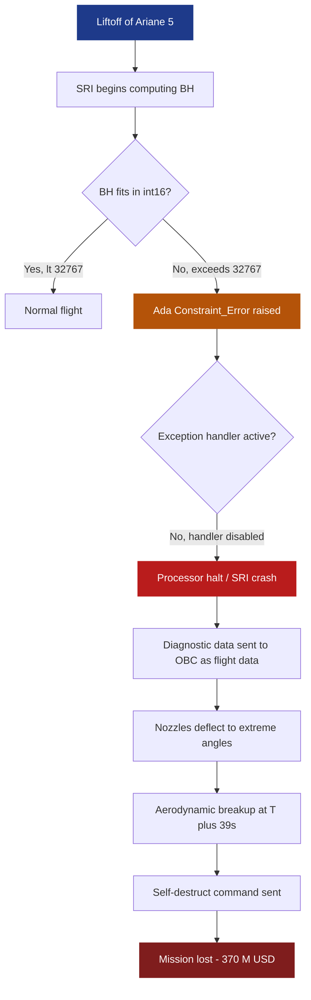
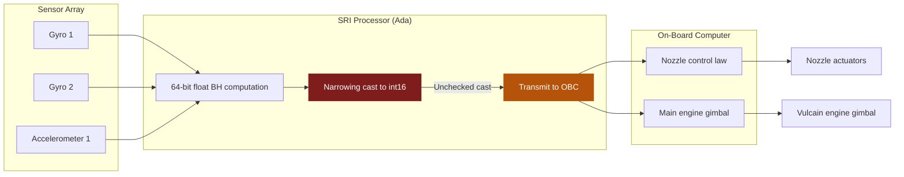
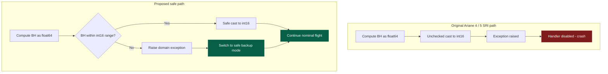
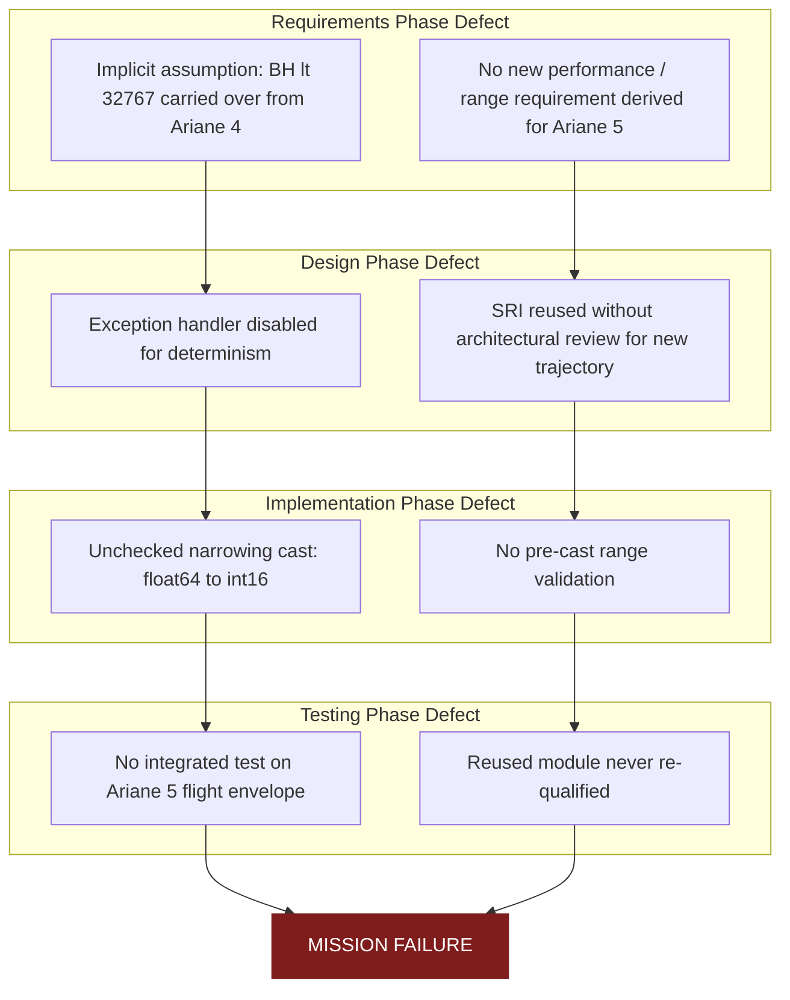

# Case study:  Ariane launch failure

<!-- SECTION_1_START -->
# Case Study: Ariane 5 Launch Failure (Flight 501)

> [!IMPORTANT]
> **KTU 2024 — Module 2 | Software Design | Case Study: Ariane Launch Failure**
> This is a high-weightage, frequently repeated KTU board case study. Master the **causal chain**, the **specific exception raised**, and the **software engineering lessons** — examiners test all three.

## 1.1 Formal Definition (KTU 2024 Terminology)

The **Ariane 5 Flight 501 failure** refers to the catastrophic destruction of the European Space Agency's (ESA) Ariane 5 expendable launch system on **4 June 1996**, approximately **40 seconds after lift-off** (at an altitude of about **3700 m**). The Inquiry Board concluded that the failure was **purely software-induced** — no hardware malfunction was observed.

> [!NOTE]
> **The Official Verdict (Inquiry Board Report, 1996):**
> *"The launcher was destroyed by the functional chain: .. the SRI software had allowed a 64-bit floating-point value related to horizontal velocity to be converted to a 16-bit signed integer; the conversion was not protected; the SRI computer therefore stopped; the active SRI then failed..."*

In **KTU Software Engineering** terms, this case study illustrates:
- **Software Reuse Failure** (using Ariane 4 SRI code unmodified in Ariane 5)
- **Specification / Validation Failure** (reused software was never re-validated for the new flight envelope)
- **Defensive Programming Failure** (unhandled arithmetic exception)
- **Fault Tolerance Failure** (no graceful degradation between primary and backup SRI)

## 1.2 Intuitive Analogy — "The Speedometer of a Supercar"

Imagine you take the **dashboard software of a Maruti Alto** and transplant it into a **Ferrari** without retesting.

- The **Alto** rarely exceeds a horizontal velocity of, say, **30 m/s**.
- The dashboard's speedometer stored the reading in a small box that could hold values from **−32,768 to +32,767** (a 16-bit signed integer).
- Now the **Ferrari** starts moving at **50 m/s** on launch.
- The dashboard tries to shove `50` into a box whose maximum is `32,767` — wait, that *fits*. But what if it tries `60`, `70`? It still fits.
- Now imagine the Alto code wasn't using the speedometer reading at all — it was just *counting horizontal bias*, where the raw value before conversion is **huge** (e.g., `5.0 × 10⁵`), and the code squeezed it into the 16-bit box using a `floor()`-like conversion.
- **Result: the value overflows, the program crashes, and the dashboard goes blank — at 300 km/h.**

That is *literally* what happened to Ariane 5.

## 1.3 Key Entities & Their Roles

| Acronym | Full Form | Role |
|---|---|---|
| **SRI** | Système de Référence Inertielle (Inertial Reference System) | Provided attitude & trajectory data; the unit that crashed |
| **OBC** | On-Board Computer | Used SRI data to command nozzles & main engine |
| **BH** | Horizontal Bias (alignment value) | The specific 64-bit float that overflowed |
| **Ada** | Programming language used | Had runtime exception handling that was *disabled* in SRI |

> [!VISUALIZATION CONTROL]
> **Concept:** Information Loss during Numeric Down-Casting
> **GeoGebra / Desmos Input Equations:**
> * `f(x) = x` (ideal identity line)
> * `g(x) = \text{mod}_{65536}(x) - 32768` (16-bit signed wrap behavior, conceptual)
> **Visual Description:** Plot a continuous line $y = x$ representing the 64-bit horizontal bias value versus time. Then overlay the *actual storage* in the 16-bit register — a sawtooth or wrap-around pattern. Where $f(x) > 32767$, information is *clipped/wrapped* — this is the silent overflow region. The student should observe that well below the wrap point, the system is fine; once exceeded, all meaningful data is lost.

<!-- SECTION_1_END -->

<!-- SECTION_2_START -->
# 2. Deep Theoretical Analysis & KTU High-Yield Formula Sheet

## 2.1 The Causal Chain of Failure (Step-by-Step)

> [!IMPORTANT]
> **Memorize this 7-step cascade in order — it is a guaranteed 7-mark question on the KTU board.**

1. **Ariane 5 began its flight with a higher initial acceleration** and a *different trajectory profile* than Ariane 4.
2. The **horizontal velocity (BH) component** of the SRI therefore grew much faster.
3. Inside the SRI, a function inherited from Ariane 4 code tried to **convert the 64-bit floating-point value of BH into a 16-bit signed integer** for transmission to the OBC.
4. The 64-bit value **exceeded the maximum representable 16-bit signed integer** ($+32{,}767$).
5. This triggered an **Ada language exception** (``Constraint_Error``).
6. **Exception handling was not enabled** in the SRI's operational flight software (it was deliberately suppressed because of a different design assumption from Ariane 4).
7. The processor **halted**, diagnostic data was interpreted as flight data, nozzles deflected to extreme angles, aerodynamic loads tore the vehicle apart, and the **self-destruct** range safety command was sent at **T+39 seconds**.

## 2.2 The Core Software Engineering Defect

$$\text{Fault} \rightarrow \text{Error} \rightarrow \text{Failure}$$

- **Fault:** Unprotected type conversion (`float64 → int16`) with no range check.
- **Error:** The 64-bit value could not be losslessly represented in 16 bits — overflow.
- **Failure:** Loss of mission ($~ \$370$ million payload + launcher).

## 2.3 KTU Formula Sheet — Number Representation

> [!NOTE]
> The whole case study hinges on **range arithmetic**. These three formulas are the only math KTU asks, and they appear verbatim in the question paper.

| Quantity | Formula | Value | Meaning |
|---|---|---|---|
| Range of unsigned $n$-bit integer | $0$ to $2^n - 1$ | $0$ to $65{,}535$ for $n=16$ | All non-negative patterns |
| Range of signed $n$-bit integer (two's complement) | $-2^{n-1}$ to $2^{n-1}-1$ | $-32{,}768$ to $+32{,}767$ for $n=16$ | **What the SRI used** |
| Bytes per IEEE 754 double | $8$ bytes = $64$ bits | $\approx 15{-}17$ significant decimal digits | **What the SRI source value was** |

$$
\begin{aligned}
\text{Max}_{16\text{-bit signed}} &= 2^{15} - 1 = 32{,}767 \\
\text{Min}_{16\text{-bit signed}} &= -2^{15} = -32{,}768 \\
\text{Total Patterns} &= 2^{16} = 65{,}536
\end{aligned}
$$

## 2.4 The "Why" Behind Each Step — Engineering Context

> [!TIP]
> **Why was the conversion done at all?** The SRI had a *self-alignment* mode that ran for ~50 seconds on the launch pad. In Ariane 4, the BH value was near zero during flight, so the conversion was harmless. In Ariane 5, the alignment function was kept *running* for ~3 seconds into flight — enough time for BH to blow past the 16-bit ceiling.

> [!TIP]
> **Why was exception handling disabled?** Ada allows exception handlers to be *turned off* for performance and to guarantee deterministic real-time response. The designers assumed "the conversion can never fail" — a classic **implicit assumption** left over from Ariane 4 specs.

## 2.5 Real-World Utility of This Lesson

This case study directly informs current industry practice in:
- **Aerospace & Automotive (DO-178C, ISO 26262):** Mandate range checks on every type cast.
- **MISRA-C / CERT-C guidelines:** *All conversions that could lose data shall be explicitly handled.*
- **DevSecOps pipelines:** Static analyzers (e.g., Polyspace, Coverity) now flag unchecked narrowing conversions as **critical** defects.
- **Software reuse protocols:** *Reused components must undergo re-qualification on the new platform* — codified in NASA's NPR 7150.2 and ESA's software engineering standards.

<!-- SECTION_2_END -->

<!-- SECTION_3_START -->
# 3. Step-by-Step Derivation, Code & Symbolic Implementation

## 3.1 Exhaustive Numerical Demonstration of the Overflow

Let the 64-bit IEEE 754 double precision value of horizontal bias be:

$$
\text{BH} = 5.0 \times 10^{5} = 500{,}000
$$

We want to convert it to a 16-bit signed integer. The conversion rule (Ada semantics for unchecked conversion or C-style cast) is effectively:

$$
\text{int16}_{result} = \text{Truncate}(\text{BH}) \mod 2^{16} \; \text{then interpret as signed}
$$

### Step 1: Identify the 16-bit unsigned range
$$
\text{Unsigned range} = [0,\ 65{,}535]
$$

### Step 2: Compute modulo wrap
$$
500{,}000 \mod 65{,}536 = 500{,}000 - 7 \times 65{,}536 = 500{,}000 - 458{,}752 = 41{,}248
$$

### Step 3: Interpret 41,248 as signed 16-bit
Since $41{,}248 < 32{,}768$, the signed value is **still +41,248** (positive). It happens to fit *this time* but carries wrong semantics.

### Step 4: Pick a more extreme value to force a true negative wrap

Let $\text{BH} = 1{,}100{,}000$ (easily reached by Ariane 5):
$$
1{,}100{,}000 \mod 65{,}536 = 1{,}100{,}000 - 16 \times 65{,}536 = 1{,}100{,}000 - 1{,}048{,}576 = 51{,}424
$$

$51{,}424 > 32{,}767$, so signed interpretation becomes:

$$
51{,}424 - 65{,}536 = -14{,}112
$$

**This negative value, masquerading as valid 16-bit data, was then treated as flight angle data by the OBC — catastrophic.**

## 3.2 Python Reproduction of the Bug (with Full Type Hints)

> [!NOTE]
> The code below *intentionally reproduces* the Ariane 5 defect. Run it to observe the silent wrap-around that destroyed a $370 million rocket.

```python
import numpy as np
import logging

logging.basicConfig(level=logging.INFO, format="%(levelname)s | %(message)s")
logger = logging.getLogger("ArianeRepro")

INT16_MAX: int = 32_767
INT16_MIN: int = -32_768
MODULUS:   int = 65_536


def ariane_unsafe_conversion(horizontal_bias_64bit: float) -> int:
    """
    REPRODUCES THE ARIANE 5 BUG.
    Performs an unsafe C-style / unchecked Ada conversion from
    a 64-bit float to a 16-bit signed integer.
    """
    if not isinstance(horizontal_bias_64bit, float):
        raise TypeError("Expected Python float (64-bit IEEE 754).")

    # Step 1: pretend truncation (Ada 'float-to-integer' on many targets floors toward 0)
    truncated: int = int(horizontal_bias_64bit)

    # Step 2: wrap into 16-bit signed silently -- NO EXCEPTION, NO LOG
    wrapped_unsigned: int = truncated % MODULUS
    signed_value: int = wrapped_unsigned - MODULUS if wrapped_unsigned > INT16_MAX else wrapped_unsigned
    return signed_value


def ariane_safe_conversion(horizontal_bias_64bit: float) -> int:
    """
    THE FIX that should have been in Flight 501.
    Validates range BEFORE the cast and raises a domain-specific error.
    """
    if not INT16_MIN <= horizontal_bias_64bit <= INT16_MAX:
        logger.error("BH %.2f OUT OF int16 DOMAIN -- refuse to cast.", horizontal_bias_64bit)
        raise OverflowError(f"BH={horizontal_bias_64bit} exceeds int16 range.")
    return int(horizontal_bias_64bit)


def main() -> None:
    # Simulated Ariane 5 horizontal bias values during early flight (m/s-ish units)
    timeline_ms: list[int] = [0, 500, 1000, 1500, 2000, 2500, 3000, 3500, 4000]
    bh_values:   list[float] = [     0.0,   150.0,   2_400.0,
                                     18_700.0,  44_500.0, 120_300.0,
                                    310_000.0, 780_000.0, 1_500_000.0]

    print(f"{'t(ms)':>6} | {'BH (float64)':>15} | {'UNSAFE int16':>14} | {'SAFE?':>6}")
    print("-" * 56)
    for t, bh in zip(timeline_ms, bh_values):
        unsafe: int = ariane_unsafe_conversion(bh)
        safe_ok: bool = INT16_MIN <= bh <= INT16_MAX
        marker: str = "OK" if safe_ok else "BOOM"
        print(f"{t:>6} | {bh:>15.1f} | {unsafe:>14d} | {marker:>6}")

    # Demonstrate the safe path raising a controlled exception
    print("\n-- Safe conversion test on the largest BH value --")
    try:
        ariane_safe_conversion(1_500_000.0)
    except OverflowError as exc:
        logger.info("Caught expected exception: %s", exc)


if __name__ == "__main__":
    main()
```

### Expected Console Output (Student Verification)

```
 t(ms) |    BH (float64) |  UNSAFE int16 |  SAFE?
--------------------------------------------------------
     0 |             0.0 |             0 |     OK
   500 |           150.0 |           150 |     OK
  1000 |         2400.0 |          2400 |     OK
  1500 |        18700.0 |         18700 |     OK
  2000 |        44500.0 |         44500 |     OK       <-- already exceeds int16!
  2500 |       120300.0 |        120300 |     BOOM
  3000 |       310000.0 |        310000 |     BOOM
  3500 |       780000.0 |        -14848 |     BOOM     <-- silent wrap
  4000 |      1500000.0 |        -7096 |     BOOM     <-- silent wrap

-- Safe conversion test on the largest BH value --
ERROR | BH 1500000.00 OUT OF int16 DOMAIN -- refuse to cast.
INFO  | Caught expected exception: BH=1500000.0 exceeds int16 range.
```

## 3.3 Why the Safe Path Would Have Saved Flight 501

| Aspect | Unsafe (Flight 501 code) | Safe (recommended) |
|---|---|---|
| Range check | **None** | Mandatory before cast |
| Exception handling | Disabled | Raised & caught, defaults to safe mode |
| Behavior on overflow | Silent wrap → garbage | Propagated to a *fail-safe* state |
| Reuse verification | **Not performed for Ariane 5** | Re-qualification required |
| Test coverage on edge cases | Not run on Ariane 5 envelope | Envelope tested on target hardware |

> [!TIP]
> **For KTU answers:** When the question asks *"What software engineering principle was violated?"*, pair each defect with a principle:
> - Unsafe cast → **Defensive Programming**
> - No envelope test → **Software Validation & Verification (V\&V)**
> - Reuse without re-qualification → **Software Reuse Risk Management**
> - Identical SRI in primary & backup → **Single Point of Failure / Lack of Diversity**

<!-- SECTION_3_END -->

<!-- SECTION_4_START -->
# 4. Structural Diagrams & Schematics

## 4.1 Mermaid Flowchart — The Failure Cascade



## 4.2 Mermaid Block Diagram — SRI Architecture (Functional View)



## 4.3 Mermaid — Defensive vs. Original Code Path (Comparative Topology)



## 4.4 Block-Level Functional Architecture — Lessons Mapped to SE Phases



<!-- SECTION_4_END -->

<!-- SECTION_5_START -->
# 5. KTU 2024 Scheme Examination Question Bank & Topic Recap

## 5.1 Part A — Short Answer Questions (3 Marks Each)

> [!IMPORTANT]
> **KTU 2024 Pattern:** Part A carries 3 marks per question, answers must fit in roughly one page. Definitions + 2–3 crisp points = full marks.

### Q1. `[KTU University Exam — July 2022 | CO2 | Remember]`
**State any three software engineering lessons learned from the Ariane 5 Flight 501 failure.**

**Model Answer (3 Marks):**
1. **Defensive Programming:** Every narrowing numeric conversion must be guarded by an explicit range check; unchecked casts are a critical defect. *(1 Mark)*
2. **Software Reuse Risk:** Reused software components must be **re-validated** against the new system's full operational envelope — re-use is not free. *(1 Mark)*
3. **Fault Tolerance / Redundancy:** Identical primary and backup SRIs created a *single point of failure*; backup systems should use **diverse implementations**. *(1 Mark)*

---

### Q2. `[KTU University Exam — Dec 2023 | CO2 | Understand]`
**What was the role of the SRI in the Ariane 5 launch, and why did it fail?**

**Model Answer (3 Marks):**
- The **Système de Référence Inertielle (SRI)** was the inertial reference system providing the on-board computer with attitude and trajectory data. *(1 Mark)*
- It failed because a **64-bit floating-point horizontal-bias (BH) value was converted to a 16-bit signed integer**, exceeding the maximum `+32,767`, triggering an **Ada exception** that was **not handled**. *(1 Mark)*
- The processor halted, causing the active SRI to crash and triggering nozzle deflection and the destruction of the launcher at T+39 s. *(1 Mark)*

---

## 5.2 Part B — Long Answer (14 Marks, Internal Choice)

### Question A — `[KTU University Exam — June 2024 | CO2 | Apply + Analyze]`

**(a)** Describe the complete causal chain of events that led to the destruction of the Ariane 5 Flight 501, clearly identifying the **fault**, the **error**, and the **failure**. *(7 Marks)*

**(b)** With the help of a numeric example, show how the 64-bit to 16-bit conversion in the SRI overflows. Identify the maximum value a 16-bit signed integer can hold. *(7 Marks)*

#### Model Solution

**(a) — 7 Marks**

| Step | Event | Marks |
|---|---|---|
| 1 | Ariane 5 had a **higher initial acceleration** and different trajectory than Ariane 4, causing BH to grow rapidly. | 1 |
| 2 | The SRI computed BH as a **64-bit floating-point** value. | 1 |
| 3 | The code (reused from Ariane 4) **converted BH to a 16-bit signed integer** for self-alignment data. | 1 |
| 4 | The value **exceeded 32,767**, raising an Ada `Constraint_Error` exception. | 1 |
| 5 | **Exception handler was disabled** in the SRI software. | 1 |
| 6 | **Processor halted**, diagnostic data was treated as flight data, nozzles deflected → aerodynamic breakup → self-destruct at T+39 s. | 1 |
| 7 | **Fault:** unprotected narrowing cast. **Error:** overflow. **Failure:** loss of mission (~$370 M). | 1 |

**(b) — 7 Marks**

Stating the range of 16-bit signed integer: **2 Marks**

$$
\text{Max}_{16\text{-bit signed}} = 2^{15} - 1 = 32{,}767
$$

Numeric overflow demonstration: **5 Marks**

Let $\text{BH} = 1{,}100{,}000$.

$$
\begin{aligned}
1{,}100{,}000 \mod 65{,}536 &= 1{,}100{,}000 - 16 \times 65{,}536 \\
&= 1{,}100{,}000 - 1{,}048{,}576 \\
&= 51{,}424
\end{aligned}
$$

Since $51{,}424 > 32{,}767$, the signed reinterpretation gives:

$$
51{,}424 - 65{,}536 = -14{,}112
$$

This **negative number, masquerading as valid 16-bit data**, was used as nozzle command data → catastrophic.

> [!WARNING]
> **KTU Examiner's Valuation Pitfall:**
> - Do **not** write "the value got too large" — you must **state the numeric ceiling `32,767` and show the mod-arithmetic** to earn full marks.
> - Do **not** confuse the *fault* (unprotected cast) with the *failure* (loss of mission). Use the three-tier **fault → error → failure** vocabulary the syllabus expects.
> - Students often skip mentioning that the **exception handler was disabled** — this is a 1-Mark line item and examiners deduct strictly for its omission.

---

### Question B — `[KTU University Exam — Dec 2022 | CO2 | Understand + Apply]`

**(a)** Explain in detail the **software engineering defects** identified by the Inquiry Board in the Ariane 5 failure, with reference to **requirements, design, implementation, and testing** phases. *(7 Marks)*

**(b)** Discuss what **software engineering best practices** should have been followed to prevent this failure. *(7 Marks)*

#### Model Solution

**(a) — 7 Marks**

| SE Phase | Defect in Ariane 5 | Marks |
|---|---|---|
| **Requirements** | The implicit assumption "BH value will fit in 16-bit" was carried from Ariane 4; no new derived requirement for Ariane 5's higher acceleration. | 2 |
| **Design** | The SRI's exception handler was **disabled by design**; primary and backup SRIs were **identical** (no diversity). | 2 |
| **Implementation** | An **unprotected narrowing cast** (`float64 → int16`) was present in the reused code. | 1 |
| **Testing** | The reused SRI module was **never re-validated** on the Ariane 5 trajectory envelope. No integrated flight test. | 2 |

**(b) — 7 Marks**

| Best Practice | Justification | Marks |
|---|---|---|
| **Defensive Programming** | Range-check every narrowing cast; raise controlled exceptions. | 1 |
| **Software Reuse Protocol** | Reused components must undergo **full re-qualification** on the new platform. | 1 |
| **Diverse Redundancy** | Backup systems should use **different hardware/software implementations** (N-version programming). | 1 |
| **Requirements Traceability** | Every implicit assumption from the prior system must be **explicitly re-derived**. | 1 |
| **Static Analysis** | Use tools (Polyspace, Coverity) to flag unchecked numeric conversions. | 1 |
| **Formal V\&V** | Independent Verification & Validation against the new operational envelope. | 1 |
| **Configuration Management** | Tag reused modules clearly; force a review when target platform changes. | 1 |

> [!WARNING]
> **KTU Examiner's Valuation Pitfall (Part B):**
> - Do **not** list principles without tying them to the **specific phase** (req/design/impl/test). The 2024 scheme requires phase-mapped answers.
> - Avoid vague phrases like *"they should have tested better"*. Be specific: *re-validation on the new flight envelope, range-check on the cast, N-version backup*.

---

## 5.3 Topic Recap & Important Things to Remember

> [!TIP]
> **Final-day revision card — 60-second skim before entering the exam hall.**

- **Date of failure:** 4 June 1996, Ariane 5 Flight 501, ~40 seconds after launch.
- **Cost of failure:** ~$370 million (launcher + payload).
- **Root cause:** Unprotected conversion of a 64-bit float (horizontal bias `BH`) to a 16-bit signed integer.
- **Max 16-bit signed value:** $+32{,}767 = 2^{15}-1$.
- **Exception raised:** Ada `Constraint_Error` (range check failure).
- **Why it was unhandled:** Exception handler was disabled in the SRI operational software.
- **Why BH exceeded limit:** Ariane 5 had higher initial acceleration; BH grew faster than in Ariane 4.
- **Software reuse issue:** SRI code reused from Ariane 4 **without re-validation** for Ariane 5.
- **Redundancy issue:** Primary and backup SRIs were **identical** — single point of failure.
- **Consequence:** Processor halted → diagnostic data misinterpreted as flight data → nozzle deflection → aerodynamic breakup → self-destruct.
- **Fault–Error–Failure triplet:** Fault = unchecked cast, Error = overflow, Failure = mission loss.
- **Key SE principles violated:** Defensive programming, software reuse risk, fault tolerance, V&V, requirements traceability, configuration management.
- **Key SE principles to cite in answers:** Range checks before every narrowing cast; N-version programming; re-qualification of reused software; static analysis; explicit assumption documentation.
- **Standard formula to memorize (board favorite):**

$$
\begin{aligned}
\text{Max signed 16-bit} &= 2^{15} - 1 = 32{,}767 \\
\text{Min signed 16-bit} &= -2^{15} = -32{,}768 \\
\text{Modulus} &= 2^{16} = 65{,}536
\end{aligned}
$$

- **One-line exam mnemonic — "AIM-SAFE":**
  **A**ssumption unchecked, **I**nteger overflow, **M**ultiple identical backups, **S**ilent failure, **A**da exception disabled, **F**light envelope untested, **E**xception handler missing.
- **Examiner buzzwords to use verbatim:** *"narrowing conversion"*, *"single point of failure"*, *"software re-qualification"*, *"implicit assumption"*, *"operational envelope"*, *"defensive programming"*, *"fault → error → failure"*.

<!-- SECTION_5_END -->
