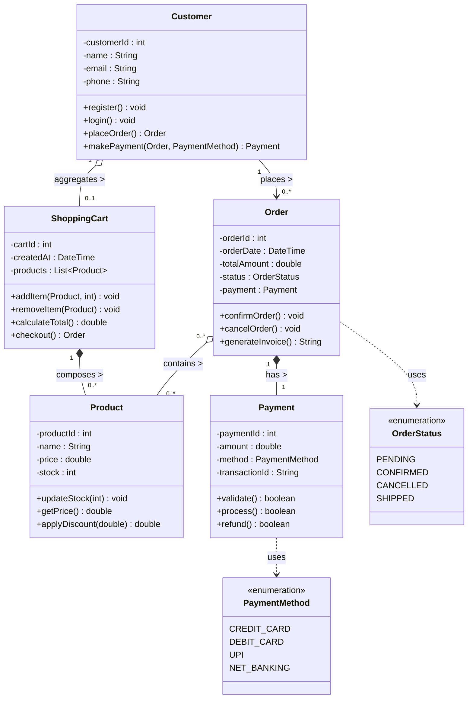
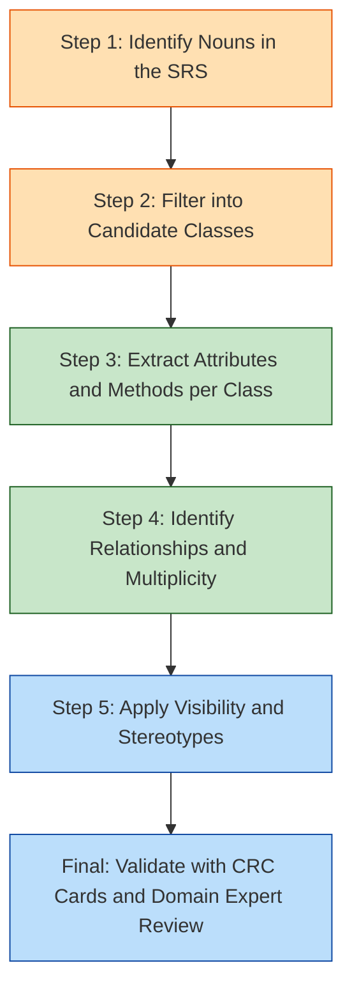
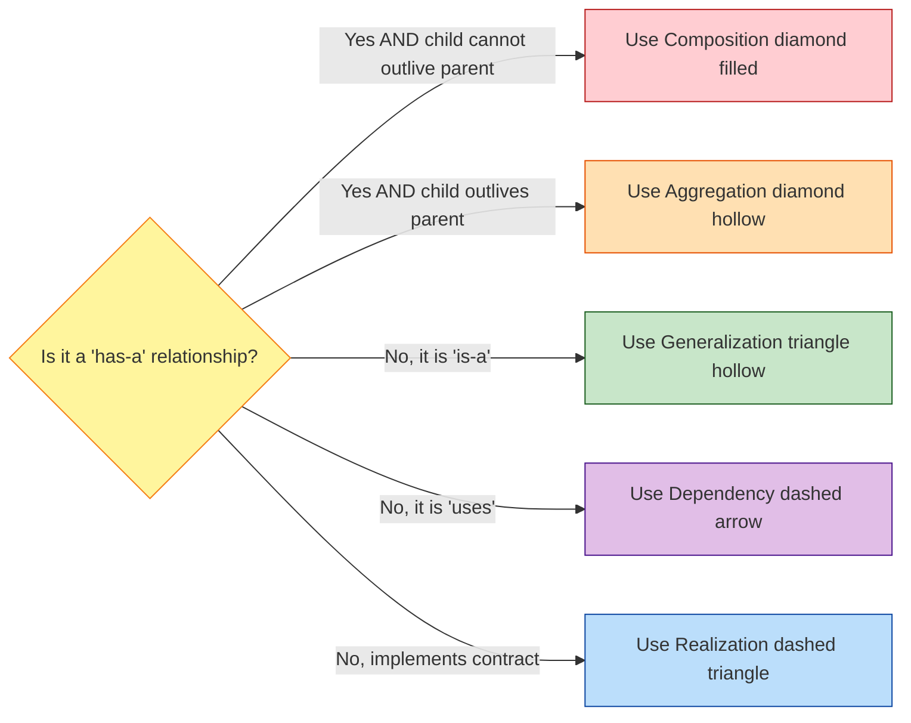
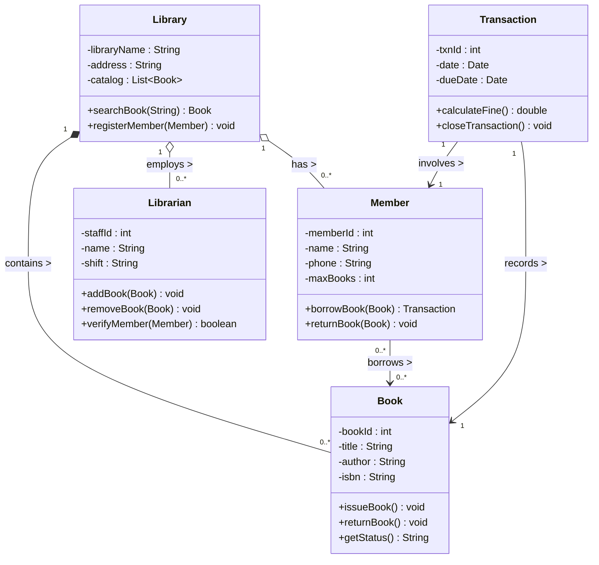
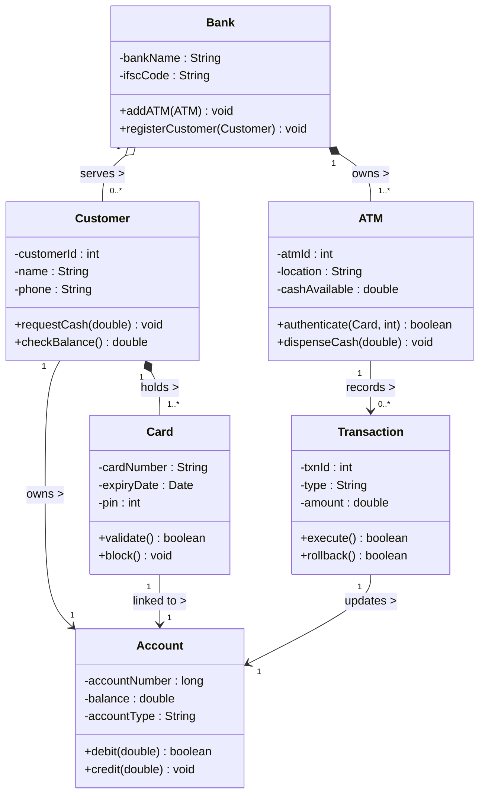

# Class diagram

<!-- SECTION_1_START -->
# Class Diagram in UML (Unified Modeling Language)

## 1. Core Technical Definition

A **Class Diagram** is a static, structural UML (Unified Modeling Language) diagram that visually represents the **blueprint of an object-oriented software system**. It depicts the system's classes, their internal structure (attributes and operations), the relationships between classes, and the multiplicity (cardinality) of those relationships. Class diagrams are the most frequently used UML diagrams during the **Object-Oriented Analysis and Design (OOAD)** phase of the **Software Development Life Cycle (SDLC)**.

> [!IMPORTANT]
> **KTU 2024 Syllabus Highlight (Module 2 – Software Design):**
> Class diagrams belong to the family of **Structural UML Diagrams**. They are essential for translating an SRS (Software Requirement Specification) document into an implementable software architecture using object-oriented principles such as **Encapsulation**, **Abstraction**, **Inheritance**, and **Polymorphism**.

## 2. Conceptual Analogy / Intuition

Imagine you are an architect designing a hospital building.
- You don't draw every brick, pipe, or patient — instead, you draw a **floor plan** that shows *rooms*, *doors*, and *corridors* along with labels like "Patient Room (max 2 patients) connects to Nurse Station."
- A **Class Diagram** works exactly the same way. A `Class` is a *room*, an `Attribute` is the *label on a wall*, an `Operation` is the *service* that the room provides, and a *Relationship line* is the *door or corridor* connecting rooms.

Another simpler analogy: think of a **Class as a Cookie Cutter** and an **Object as a Cookie**. The cookie cutter defines the shape and pattern (attributes and methods), while each individual cookie is a distinct, instantiated entity you can hold in your hand.

## 3. Key Vocabulary (KTU Standard Terminology)

| Term | Meaning |
|---|---|
| **Class** | A template/blueprint describing a set of objects with shared structure and behavior. |
| **Object** | A runtime instance of a class residing in memory. |
| **Attribute** | A named property/state of a class (e.g., `balance`, `name`). |
| **Operation / Method** | A function or behavior that the class can perform. |
| **Visibility** | Access modifier controlling who can see an attribute or method. |
| **Multiplicity** | Numeric constraint on how many objects participate in a relationship. |
| **Stereotype** | A UML `<<guillemet>>` annotation that adds meta-meaning (e.g., `<<interface>>`). |
| **Abstract Class** | A class written in *italics* that cannot be instantiated directly. |

> [!NOTE]
> **Static vs Dynamic Nature:** A class diagram is a **static** structural model — it captures *what* the system is composed of, not *how* it behaves over time. For *dynamic* behavior, KTU expects you to use **Sequence Diagrams** or **State-Chart Diagrams** (covered later in the syllabus).

> [!VISUALIZATION CONTROL]
> **Concept:** A generic UML class is represented as a rectangle divided into **3 horizontal compartments**.
> **Geometric Equations / Shapes:**
> * `Rectangle Height = H1 + H2 + H3`
> * `H1` = Compartment 1 → Class Name (bold, centered)
> * `H2` = Compartment 2 → Attribute list
> * `H3` = Compartment 3 → Method list
> **Visual Description:** Draw a single rectangle split into three stacked boxes. The top box carries the class name. The middle box lists `+name : String` style attributes. The bottom box lists `+calculate() : double` style methods.
<!-- SECTION_1_END -->

<!-- SECTION_2_START -->
# Deep Theoretical Analysis & KTU High-Yield Formula Sheet

## 1. Anatomy of a UML Class — The Three Compartments

A class in UML is drawn as a rectangle partitioned into **three horizontal sections**:

1. **Class Name Compartment** (Top) — Contains the class name in **bold**. If the class is **abstract**, the name is written in *italics*.
2. **Attribute Compartment** (Middle) — Lists the data members. The standard UML signature is:
   $$\text{visibility} \; \text{name} \; : \; \text{type} \; [\; \text{multiplicity} \;] \; \{ \; \text{property-string} \; \}$$
3. **Operation Compartment** (Bottom) — Lists the methods. The standard UML signature is:
   $$\text{visibility} \; \text{name} \; (\text{parameter-list}) \; : \; \text{return-type} \; \{ \; \text{property-string} \; \}$$

## 2. Visibility Modifiers (The Four Symbols)

| Symbol | Visibility | UML Meaning | C++ / Java Equivalent |
|:---:|---|---|---|
| `+` | **Public** | Visible to all classes. | `public` |
| `-` | **Private** | Visible only within the class itself. | `private` |
| `#` | **Protected** | Visible to subclasses and same package. | `protected` |
| `~` | **Package** | Visible only to classes in the same package/namespace. | `default` (Java) / no keyword (C++) |
| *Underlined* | **Static** (Classifier-scope) | A single copy shared by all objects. | `static` |

> [!NOTE]
> **Underlining** in UML denotes a **class-level (static)** member. For example, `-idCounter : int` written with an underline represents a single shared `idCounter` for the class — equivalent to the `static` keyword in Java/C++.

## 3. The Seven UML Relationships (KTU High-Yield Table)

| # | Relationship | UML Arrow | Keyword | Strength | Real-World Example |
|---|---|---|---|---|---|
| 1 | **Association** | Solid line `\-\-` | "uses / knows" | Weak | `Student` — `Course` (a student enrolls in courses) |
| 2 | **Directed Association** | Solid line with arrow `-->` | "flows toward" | Weak | `Customer` --> `Order` (a customer places an order) |
| 3 | **Aggregation** | Solid line with **hollow** diamond `o--` | "has-a" (weak ownership) | Medium | `Department` o-- `Professor` (a professor can exist without a department) |
| 4 | **Composition** | Solid line with **filled** diamond `*--` | "part-of" (strong ownership) | Strong | `House` *-- `Room` (a room cannot exist without its house) |
| 5 | **Generalization (Inheritance)** | Solid line with **hollow** triangle `<\|--` | "is-a" | Strong | `Vehicle` <\|-- `Car` (a car is a vehicle) |
| 6 | **Realization (Implementation)** | **Dashed** line with hollow triangle `..\|>` | "implements" | Strong | `Comparable` ..\|> `Integer` (an integer implements comparable) |
| 7 | **Dependency** | **Dashed** line with arrow `..>` | "depends on" | Weakest | `Controller` ..> `Database` (controller uses database temporarily) |

## 4. Multiplicity Rules (Cardinality Constraints)

| Notation | Meaning |
|---|---|
| `1` | Exactly one |
| `0..1` | Zero or one (optional) |
| `*` or `0..*` | Zero or many |
| `1..*` | One or many (at least one) |
| `n..m` | Range from `n` to `m` inclusive |

The multiplicity is placed at the **end of the line that touches the target class** — *not* the source.

> [!IMPORTANT]
> **Aggregation vs Composition — KTU's Favourite Trap Question:**
> Use **Composition** when the child object's lifecycle is **completely tied** to the parent (delete the parent → delete the child). Use **Aggregation** when the child can **outlive** the parent (the child is a separate, independent entity).

## 5. Interface and Abstract Class Notation

- **Interface** is drawn as a *stereotype* `<<interface>>` (often shown as a small circle/lollipop — the "lollipop notation").
- **Abstract Class** is drawn as a rectangle with the name in *italics*. Abstract methods are also written in italics.

## 6. Real-World Engineering Utility

Class diagrams are heavily used in:
- **Enterprise Java / Spring Boot Projects** — JPA entity modeling (`@Entity`, `@OneToMany`, `@ManyToOne`).
- **Database Schema Design** — Each class often maps to a relational table (Object-Relational Mapping with Hibernate).
- **API Contract Design** — Especially in microservices where each service exposes a class-based DTO (Data Transfer Object).
- **Reverse Engineering** — Tools like *Visual Paradigm*, *StarUML*, *IBM Rational Rose*, and *Lucidchart* can auto-generate class diagrams from existing Java/C++/Python code.

<!-- SECTION_2_END -->

<!-- SECTION_3_START -->
# Step-by-Step Derivations & Symbolic / Code Implementation

## Worked Example: Online Shopping System (Class Diagram → Python Code)

To consolidate the theory, let us design a mini **Online Shopping System** with the following real-world classes:

- `Customer` — buys products.
- `ShoppingCart` — temporary collection of products.
- `Product` — an item available for sale.
- `Order` — confirmed purchase transaction.
- `Payment` — settles the bill for an order.

### Step 1 — Identify the Classes and Attributes

| Class | Key Attributes |
|---|---|
| `Customer` | `customerId`, `name`, `email`, `phone` |
| `ShoppingCart` | `cartId`, `createdAt` |
| `Product` | `productId`, `name`, `price`, `stock` |
| `Order` | `orderId`, `orderDate`, `totalAmount`, `status` |
| `Payment` | `paymentId`, `amount`, `method`, `transactionId` |

### Step 2 — Identify the Operations

| Class | Key Operations |
|---|---|
| `Customer` | `register()`, `login()`, `placeOrder()`, `makePayment()` |
| `ShoppingCart` | `addItem()`, `removeItem()`, `calculateTotal()`, `checkout()` |
| `Product` | `updateStock()`, `getPrice()`, `applyDiscount()` |
| `Order` | `confirmOrder()`, `cancelOrder()`, `generateInvoice()` |
| `Payment` | `validate()`, `process()`, `refund()` |

### Step 3 — Identify the Relationships and Multiplicity

| Source Class | Relationship | Target Class | Multiplicity (Source) | Multiplicity (Target) | Reasoning |
|---|---|---|---|---|---|
| `Customer` | Aggregation | `ShoppingCart` | `1` | `1` (0..1) | A customer may or may not have an active cart. |
| `ShoppingCart` | Composition | `Product` | `1` | `0..*` | A cart holds zero-or-more products; cart destruction destroys its line-items. |
| `Customer` | Directed Association | `Order` | `1` | `0..*` | A customer may place many orders. |
| `Order` | Composition | `Payment` | `1` | `1` | Every confirmed order must have exactly one payment. |
| `Order` | Aggregation | `Product` | `1..*` | `0..*` | An order references products (the products exist independently in the catalog). |

### Step 4 — Convert the Class Diagram to Python (Type-Hinted Code)

```python
from __future__ import annotations
from dataclasses import dataclass, field
from datetime import datetime
from typing import List, Optional
from enum import Enum


# ============================================================
# ENUMS — Support the 'status' and 'method' attributes
# ============================================================
class OrderStatus(Enum):
    PENDING = "PENDING"
    CONFIRMED = "CONFIRMED"
    CANCELLED = "CANCELLED"
    SHIPPED = "SHIPPED"


class PaymentMethod(Enum):
    CREDIT_CARD = "CREDIT_CARD"
    DEBIT_CARD = "DEBIT_CARD"
    UPI = "UPI"
    NET_BANKING = "NET_BANKING"


# ============================================================
# PRODUCT CLASS  (Independence: created first)
# ============================================================
@dataclass
class Product:
    productId: int
    name: str
    price: float
    stock: int = 0

    def updateStock(self, quantity: int) -> None:
        if quantity < 0 and abs(quantity) > self.stock:
            raise ValueError("Insufficient stock to remove.")
        self.stock += quantity
        print(f"[LOG] Stock updated for {self.name}: {self.stock}")

    def getPrice(self) -> float:
        return self.price

    def applyDiscount(self, percent: float) -> float:
        if not (0.0 <= percent <= 100.0):
            raise ValueError("Discount must be between 0 and 100.")
        discounted = self.price * (1.0 - percent / 100.0)
        print(f"[LOG] Discounted price of {self.name} = {discounted}")
        return discounted


# ============================================================
# SHOPPING CART CLASS  (Composition with Product)
# ============================================================
class ShoppingCart:
    def __init__(self, cartId: int) -> None:
        self.cartId: int = cartId
        self.createdAt: datetime = datetime.now()
        self.products: List[Product] = []        # composition target

    def addItem(self, product: Product, qty: int = 1) -> None:
        if qty <= 0:
            raise ValueError("Quantity must be positive.")
        for _ in range(qty):
            self.products.append(product)
        print(f"[LOG] Added {qty} x {product.name} to cart {self.cartId}.")

    def removeItem(self, product: Product) -> None:
        if product in self.products:
            self.products.remove(product)
            print(f"[LOG] Removed {product.name} from cart {self.cartId}.")
        else:
            print(f"[WARN] {product.name} not found in cart {self.cartId}.")

    def calculateTotal(self) -> float:
        total: float = sum(p.getPrice() for p in self.products)
        print(f"[LOG] Cart {self.cartId} total = {total}")
        return total

    def checkout(self) -> "Order":
        total_amount: float = self.calculateTotal()
        order = Order(
            orderId=Order._idCounter,
            orderDate=datetime.now(),
            totalAmount=total_amount,
            status=OrderStatus.PENDING,
        )
        Order._idCounter += 1
        order.products = list(self.products)   # copy the line items
        return order


# ============================================================
# ORDER CLASS  (References Product, has a Payment)
# ============================================================
class Order:
    _idCounter: int = 1000       # static class-level id generator

    def __init__(
        self,
        orderId: int,
        orderDate: datetime,
        totalAmount: float,
        status: OrderStatus = OrderStatus.PENDING,
    ) -> None:
        self.orderId: int = orderId
        self.orderDate: datetime = orderDate
        self.totalAmount: float = totalAmount
        self.status: OrderStatus = status
        self.products: List[Product] = []
        self.payment: Optional[Payment] = None   # composition target

    def confirmOrder(self) -> None:
        if self.payment is None:
            raise RuntimeError("Cannot confirm order without a successful payment.")
        self.status = OrderStatus.CONFIRMED
        print(f"[LOG] Order {self.orderId} confirmed.")

    def cancelOrder(self) -> None:
        if self.status == OrderStatus.SHIPPED:
            raise RuntimeError("Cannot cancel an order that has already shipped.")
        self.status = OrderStatus.CANCELLED
        print(f"[LOG] Order {self.orderId} cancelled.")

    def generateInvoice(self) -> str:
        invoice_lines: List[str] = [
            f"------- INVOICE for Order #{self.orderId} -------",
            f"Date   : {self.orderDate.isoformat()}",
            f"Status : {self.status.value}",
            f"Items  :",
        ]
        for p in self.products:
            invoice_lines.append(f"  - {p.name}  ${p.getPrice():.2f}")
        invoice_lines.append(f"TOTAL  : ${self.totalAmount:.2f}")
        invoice_lines.append("------------------------------------------")
        return "\n".join(invoice_lines)


# ============================================================
# PAYMENT CLASS  (Composition child of Order)
# ============================================================
class Payment:
    def __init__(
        self,
        paymentId: int,
        amount: float,
        method: PaymentMethod,
    ) -> None:
        self.paymentId: int = paymentId
        self.amount: float = amount
        self.method: PaymentMethod = method
        self.transactionId: Optional[str] = None

    def validate(self) -> bool:
        return self.amount > 0.0

    def process(self) -> bool:
        if not self.validate():
            print("[ERROR] Payment validation failed.")
            return False
        self.transactionId = f"TXN-{self.paymentId:06d}"
        print(f"[LOG] Payment {self.transactionId} processed via {self.method.value}.")
        return True

    def refund(self) -> bool:
        if self.transactionId is None:
            print("[WARN] Refund requested on an unprocessed payment.")
            return False
        print(f"[LOG] Refund issued for transaction {self.transactionId}.")
        return True


# ============================================================
# CUSTOMER CLASS  (Aggregates a Cart, places Orders)
# ============================================================
class Customer:
    def __init__(self, customerId: int, name: str, email: str, phone: str) -> None:
        self.customerId: int = customerId
        self.name: str = name
        self.email: str = email
        self.phone: str = phone
        self.cart: Optional[ShoppingCart] = None        # 0..1 multiplicity
        self.orders: List[Order] = []                   # 0..* multiplicity

    def register(self) -> None:
        print(f"[LOG] Customer {self.name} registered with email {self.email}.")

    def login(self) -> None:
        print(f"[LOG] Customer {self.name} logged in.")

    def makePayment(self, order: Order, method: PaymentMethod) -> Payment:
        payment = Payment(
            paymentId=order.orderId,
            amount=order.totalAmount,
            method=method,
        )
        if payment.process():
            order.payment = payment
            order.confirmOrder()
        return payment


# ============================================================
# DRIVER CODE  (Demonstrates end-to-end flow)
# ============================================================
if __name__ == "__main__":
    # Step 1: Create products
    laptop = Product(productId=1, name="Laptop", price=75000.0, stock=10)
    mouse = Product(productId=2, name="Mouse", price=500.0, stock=100)

    # Step 2: Register a customer and create their cart
    alice = Customer(101, "Alice", "alice@example.com", "+91-9999999999")
    alice.register()
    alice.login()
    alice.cart = ShoppingCart(cartId=1)

    # Step 3: Add items to the cart
    alice.cart.addItem(laptop, qty=1)
    alice.cart.addItem(mouse, qty=2)

    # Step 4: Checkout -> creates an Order
    order1 = alice.cart.checkout()
    order1.products = [laptop, mouse, mouse]
    alice.orders.append(order1)

    # Step 5: Make payment
    alice.makePayment(order1, PaymentMethod.UPI)

    # Step 6: Generate the invoice
    print(order1.generateInvoice())
```

### Step 5 — Multiplicity Constraint Verification (Algebraic Derivation)

Let us derive the **total number of class instances** that can exist for a system with $C$ customers, where each customer can have at most one cart, and each cart can hold up to $P$ products.

$$
\begin{aligned}
\text{Cart count}            & \le 1 \times C                       & \text{(multiplicity: 0..1)} \\
\text{Product line-items}    & \le P \times \text{Cart count}        & \text{(multiplicity: 0..* with cap P)} \\
\text{Order count}           & \le O_{\max} \times C                 & \text{(multiplicity: 0..* with cap } O_{\max}\text{)} \\
\text{Payment count}         & = \text{Order count}                  & \text{(multiplicity: 1 — composition)}
\end{aligned}
$$

For our driver code with $C = 1$ customer, $P_{\max} = 3$ line-items, $O_{\max} = 1$ order:

$$
\begin{aligned}
\text{Carts allowed}   & = 1 \\
\text{Products allowed}& = 1 \times 3 = 3 \\
\text{Orders allowed}  & = 1 \times 1 = 1 \\
\text{Payments forced} & = 1
\end{aligned}
$$

> [!NOTE]
> **Why this derivation matters in KTU exams:**
> The examiner often tests whether the student can compute *maximum* instances and *minimum* instances from a given multiplicity range. Always show both:
>
> $$\text{Min} = \prod_{i=1}^{n} \text{min-multiplicity}_{i}, \qquad \text{Max} = \prod_{i=1}^{n} \text{max-multiplicity}_{i}$$

<!-- SECTION_3_END -->

<!-- SECTION_4_START -->
# Structural Diagrams & Schematics

## 1. UML Class Diagram of the Online Shopping System (Mermaid)

> [!NOTE]
> **Mermaid `classDiagram` syntax reminder:** Use the seven relationship arrows listed in Section 2. Multiplicity is written in double quotes `" "` immediately before the arrow. Method/attribute visibility uses `+`, `-`, `#`, `~` symbols.



## 2. Sequential Construction Topology — How to Build a Class Diagram in 5 Steps



## 3. Relationship Decision Matrix (Block-Level Reference)



<!-- SECTION_4_END -->

<!-- SECTION_5_START -->
# KTU 2024 Scheme Examination Question Bank & Topic Recap

---

## Part A — Short Answer Questions (3 Marks Each)

### Question 1 [KTU University Exam – July 2023]
**Differentiate between Aggregation and Composition with a suitable example.** *(CO2, Understand)*

**Model Answer (3 Marks):**

| Aspect | Aggregation (Hollow Diamond) | Composition (Filled Diamond) |
|---|---|---|
| Ownership Type | **Weak "has-a"** | **Strong "part-of"** |
| Lifecycle | Child can exist independently of the parent. | Child is destroyed when the parent is destroyed. |
| UML Notation | `o--` (hollow diamond) | `*--` (filled diamond) |
| Example | `Department` o-- `Professor` (a professor may switch departments) | `House` *-- `Room` (rooms cannot exist without a house) |

> **[Valuation Key: 1 Mark for definition of each + 1 Mark for the example. Total 3 Marks.]**

---

### Question 2 [KTU University Exam – Dec 2022]
**Explain the four visibility modifiers used in UML class diagrams.** *(CO1, Remember)*

**Model Answer (3 Marks):**

The four UML visibility symbols are:

1. **`+` Public** — accessible to all classes in the system. (1 Mark)
2. **`-` Private** — accessible only within the class itself. (1 Mark)
3. **`#` Protected** — accessible to subclasses and to other classes in the same package. (0.5 Mark)
4. **`~` Package** — accessible only to classes declared inside the same package/namespace. (0.5 Mark)

> **[Valuation Key: 0.5 Marks for the symbol, 0.25 Marks for the explanation. Total 3 Marks.]**

---

## Part B — Long Answer Questions (14 Marks Each, Internal Choice)

> **KTU 2024 Rule:** *Each Part B question carries 14 Marks split as (a) 7 Marks + (b) 7 Marks. The student must attempt exactly ONE full choice (either Q1a+Q1b OR Q2a+Q2b).*

---

### Choice Set 1

#### Question 1 (a) [KTU University Exam – July 2024] — 7 Marks
**With a neat UML class diagram, design the software classes for a Library Management System. Clearly show at least 4 classes, 2 attributes and 2 methods per class, and all 7 UML relationships where applicable.** *(CO3, Apply)*

**Model Answer (7 Marks):**

**Step 1 — Identify Classes (1 Mark):** `Book`, `Member`, `Librarian`, `Library`, `Transaction`.

**Step 2 — Attributes and Methods (2 Marks):**

| Class | Attributes | Methods |
|---|---|---|
| `Book` | `-bookId`, `-title`, `-author`, `-isbn` | `+issueBook()`, `+returnBook()`, `+getStatus()` |
| `Member` | `-memberId`, `-name`, `-phone`, `-maxBooks` | `+borrowBook(Book)`, `+returnBook(Book)` |
| `Librarian` | `-staffId`, `-name`, `-shift` | `+addBook(Book)`, `+removeBook(Book)`, `+verifyMember(Member)` |
| `Library` | `-libraryName`, `-address`, `-catalog` | `+searchBook(String)`, `+registerMember(Member)` |
| `Transaction` | `-txnId`, `-date`, `-dueDate` | `+calculateFine()`, `+closeTransaction()` |

**Step 3 — Draw the Class Diagram (4 Marks):**



> **[Valuation Key — Step 3 split: 1 Mark for classes drawn, 1 Mark for attributes, 1 Mark for methods, 1 Mark for relationships + multiplicities.]**

---

#### Question 1 (b) [KTU University Exam – July 2024] — 7 Marks
**Compare the three structural relationships — Association, Aggregation, and Composition — in UML. For each, give one example from the Library Management System designed in part (a).** *(CO2, Analyze)*

**Model Answer (7 Marks):**

| # | Feature | Association | Aggregation | Composition |
|---|---|---|---|---|
| 1 | Symbol | Plain line `-->` or line | `o--` (hollow diamond) | `*--` (filled diamond) |
| 2 | Ownership | No ownership | Weak ownership | Strong ownership |
| 3 | Lifecycle Dependency | None | Independent lifecycle | Tied to parent lifecycle |
| 4 | Multiplicity | `0..*`, `1..*`, etc. | Usually `1` to `0..*` | Parent is `1`, child is `0..*` |
| 5 | Example (Library) | `Member --> Book` (a member borrows a book) | `Library o-- Member` (members exist even when the library shuts down) | `Library *-- Book` (a book in the catalog is destroyed when the library removes it) |

**[Valuation Key: 1 Mark per comparison row + 1 Mark per real-world example from part (a) = 5 Marks + 2 Marks for conclusion. Total 7 Marks.]**

---

### Choice Set 2 (Internal Alternative)

#### Question 2 (a) [KTU University Exam – Dec 2023] — 7 Marks
**Design a UML class diagram for an ATM (Automated Teller Machine) system. Identify at least 5 classes, their key attributes, methods, and relationships with proper multiplicity.** *(CO3, Apply)*

**Model Answer (7 Marks):**

**Step 1 — Identify Classes (1 Mark):** `ATM`, `Account`, `Customer`, `Card`, `Transaction`, `Bank`.

**Step 2 — Attributes and Methods Table (2 Marks):**

| Class | Attributes | Methods |
|---|---|---|
| `ATM` | `-atmId`, `-location`, `-cashAvailable` | `+authenticate(Card, int) boolean`, `+dispenseCash(double) void` |
| `Account` | `-accountNumber`, `-balance`, `-accountType` | `+debit(double) boolean`, `+credit(double) void` |
| `Customer` | `-customerId`, `-name`, `-phone` | `+requestCash(double) void`, `+checkBalance() double` |
| `Card` | `-cardNumber`, `-expiryDate`, `-pin` | `+validate() boolean`, `+block() void` |
| `Transaction` | `-txnId`, `-type`, `-amount` | `+execute() boolean`, `+rollback() boolean` |

**Step 3 — UML Class Diagram (4 Marks):**



> **[Valuation Key — Step 3 split: 1 Mark for the 5 classes drawn, 1 Mark for attributes, 1 Mark for methods, 1 Mark for correct multiplicity on relationships.]**

---

#### Question 2 (b) [KTU University Exam – Dec 2023] — 7 Marks
**Explain the concept of multiplicity in UML with reference to the ATM system from part (a). If there are 10 ATMs and each ATM has processed a maximum of 5 transactions today, derive the total maximum number of `Transaction` objects that can exist.** *(CO4, Analyze)*

**Model Answer (7 Marks):**

**Definition (2 Marks):** *Multiplicity* in UML defines how many instances of one class can be associated with one instance of another class. It is placed at the **target** end of the relationship line and uses the notations `1`, `0..1`, `*`, `0..*`, `1..*`, or `n..m`.

**Identify Multiplicities in the ATM Diagram (3 Marks):**

| Source → Target | Source Multiplicity | Target Multiplicity |
|---|---|---|
| `Bank → ATM` | `1` | `1..*` |
| `Bank → Customer` | `1` | `0..*` |
| `Customer → Card` | `1` | `1..*` |
| `Customer → Account` | `1` | `1` |
| `ATM → Transaction` | `1` | `0..*` |

**Derivation of Total Maximum `Transaction` Objects (2 Marks):**

Let $A$ be the number of ATMs, and let $T_{\max}$ be the maximum transactions per ATM per day. Then the total maximum number of `Transaction` objects is given by:

$$
T_{\text{total}}^{\max} \;=\; A \times T_{\max}
$$

Substituting $A = 10$ and $T_{\max} = 5$:

$$
\begin{aligned}
T_{\text{total}}^{\max} & = 10 \times 5 \\
                       & = 50
\end{aligned}
$$

Hence, **at most 50 `Transaction` objects** can exist in the system for that day.

> **[Valuation Key: 1 Mark for formula setup, 0.5 Mark for substitution, 0.5 Mark for the final numeric answer.]**

---

## KTU Examiner's Valuation Warning / Pitfall Callout

> [!WARNING]
> **Common mistakes KTU examiners deduct marks for:**
> 1. **Forgetting multiplicity on BOTH ends** — Many students draw `Customer --> Order` without writing `1` and `0..*`. Deduct 1 Mark.
> 2. **Wrong arrow direction in inheritance** — The hollow triangle must point to the **parent** (superclass), not the child. Drawing `<|--` in the wrong direction costs 1–2 Marks.
> 3. **Using Composition where Aggregation is correct** — If a `Professor` can switch universities, you must use **aggregation** (`o--`), not composition. Examiners deduct heavily for confusing these two.
> 4. **Skipping the visibility symbol** — A class diagram with bare attributes like `name : String` (no `+`/`-`/`#`) loses 0.5–1 Mark per attribute.
> 5. **Writing code in a UML diagram question** — The question asks for a *diagram*. Writing only a Python class and skipping the rectangle compartments is a **zero for the diagram sub-part** in Part B.
> 6. **Missing `<<stereotype>>` for interface/enum** — When asked to model an interface, you must write `<<interface>>` above the class name; otherwise the answer is treated as a regular class.

---

## Topic Recap & Important Things to Remember

- A **Class Diagram** is a *static structural* UML diagram used during the OO design phase.
- Every class is drawn as a **three-compartment rectangle**: Class Name (top), Attributes (middle), Operations (bottom).
- Visibility symbols: **`+` public**, **`-` private**, **`#` protected**, **`~` package**, and *underline* for **static**.
- An **abstract class** has its name in *italics*; an **interface** is annotated with the `<<interface>>` stereotype.
- The **seven UML relationships** (memorize in this order): Association, Directed Association, Aggregation, Composition, Generalization, Realization, Dependency.
- **Composition** = strong `*--` (filled diamond), child dies with parent. **Aggregation** = weak `o--` (hollow diamond), child outlives parent.
- **Inheritance** uses the hollow triangle `<|--` and expresses the "is-a" relationship.
- **Realization** uses a **dashed** line with hollow triangle `..|>` for "implements" an interface.
- **Dependency** is a dashed arrow `..>` and represents the *weakest* coupling.
- **Multiplicity** is written on the **target end** of the line. Use `1`, `0..1`, `*`, `0..*`, `1..*`, or `n..m`.
- The **min/max object count formula** for a chain of multiplicities is:
  $$\text{Max total} \;=\; \prod_{i=1}^{n} \text{max-multiplicity}_i, \qquad \text{Min total} \;=\; \prod_{i=1}^{n} \text{min-multiplicity}_i$$
- Class diagrams are **reverse-engineerable** by tools such as *Visual Paradigm*, *StarUML*, and *IBM Rational Rose* from existing Java/C++/Python code.
- Always pair every attribute with **visibility, name, and type** — examiners mark each part separately.
- The class diagram works hand-in-hand with **Sequence Diagrams** (dynamic behavior) and **Use-Case Diagrams** (functional requirements) within the broader UML 2.5 specification.
<!-- SECTION_5_END -->
