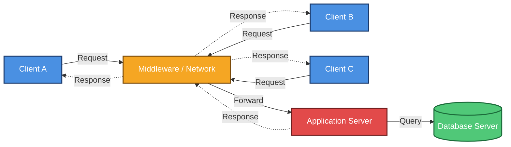
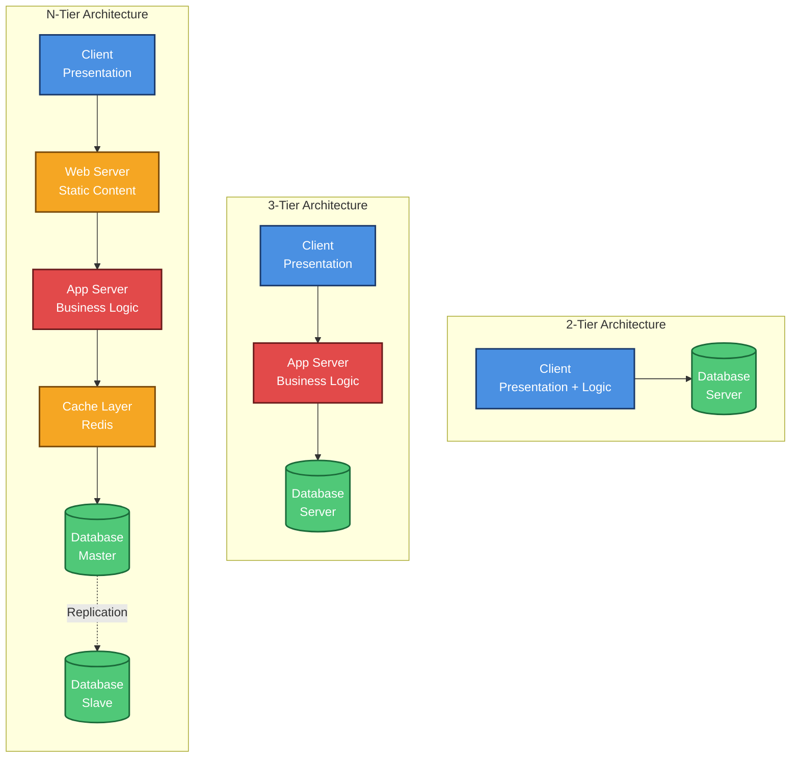
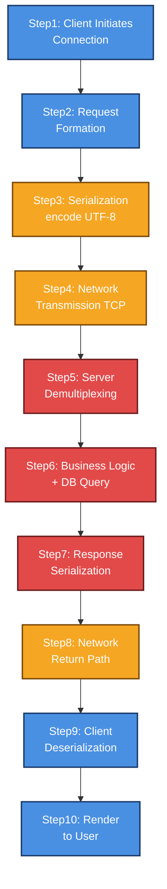
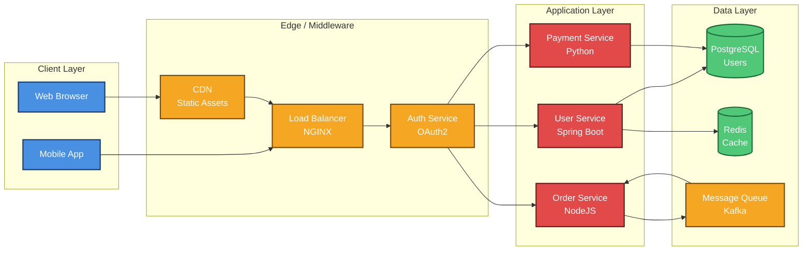
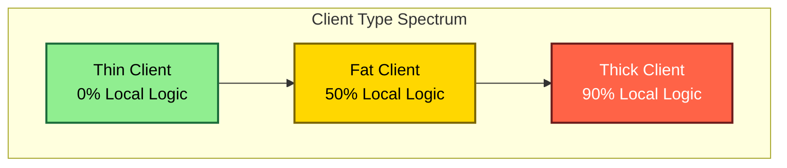

# Client-Server

<!-- SECTION_1_START -->
# Client-Server Architecture

> [!NOTE]
> **KTU 2024 Scheme — Module 2 (Software Design) — OECST723**
> Client-Server is a foundational distributed architectural pattern that describes how computing tasks are partitioned between *service requesters* (clients) and *service providers* (servers) communicating over a network.

## 1.1 Formal Definition

**Client-Server Architecture** is a distributed application structural model in which the workload is divided between **clients** — processes that initiate requests for resources or services — and **servers** — processes that accept, process, and respond to those requests, typically over a network using a standardized communication protocol such as **HTTP**, **TCP/IP**, **gRPC**, or **WebSockets**.

The canonical KTU definition states:

> A *Client-Server system* is a distributed system structure in which the application is decomposed into two functional roles — the **client tier** (presentation logic, user interaction) and the **server tier** (data management, business logic, or shared resource access) — coupled through a well-defined **message-passing interface** governed by a request-response protocol.

| Property | Client | Server |
| :--- | :--- | :--- |
| **Role** | Service Requester (Initiator) | Service Provider (Responder) |
| **Initiates Communication?** | **Yes** | **No** (passive listener) |
| **Location** | Front-end / End-user device | Back-end / Dedicated host |
| **Resource Ownership** | Consumes shared resources | Owns / manages shared resources |
| **Examples** | Web Browsers, Mobile Apps, Desktop GUIs | Web Servers, Database Servers, Mail Servers |

## 1.2 Conceptual Analogy — The Restaurant

> [!IMPORTANT]
> **Analogy: Client-Server = A Restaurant**
>
> - **You (the Client)** sit at a table, study the **menu (API / protocol contract)**, and *place an order* (send a request).
> - The **Waiter (Middleware / Network Protocol)** carries the order to the kitchen.
> - The **Kitchen (the Server)** processes the order using ingredients (database) and recipes (business logic), and returns the dish (response).
> - You never enter the kitchen — there is a clean **separation of concerns** enforced by the waiter.
>
> This mirrors exactly how a client never directly accesses server internals; communication happens only through the agreed **message contract** (the menu).

## 1.3 Why Client-Server Matters in Software Engineering

Client-Server is the *spinal column* of modern distributed systems. Without it:

- **Centralized data management** (e.g., bank records) would be impossible to scale.
- **Resource sharing** (printers, files, databases) across geographically distributed users could not be coordinated.
- **Web-scale applications** (Google, Amazon, IRCTC) could not separate presentation from business logic.

> [!VISUALIZATION CONTROL]
> **Concept:** Geometric intuition of a Client-Server topology
> **GeoGebra / Desmos Input:**
> * `Clients = {(1, 4), (2, 4), (3, 4)}`  (Top row — many requesters)
> * `Server  = {(2, 1)}`  (Bottom center — single provider)
> * `Links   = {((1,4),(2,1)), ((2,4),(2,1)), ((3,4),(2,1))}` (Many-to-one fan-in)
>
> **Visual Description:** Plot three clients on the top horizontal line converging through the network layer (center) to a single server on the bottom. Observe a **fan-in** (many-to-one) topology, illustrating that a single server must multiplex requests from many concurrent clients.

## 1.4 Core Properties of a Well-Designed Client-Server System

> [!NOTE]
> Per the KTU 2024 syllabus highlight, every Client-Server system must satisfy the following **5 design properties**:
> 1. **Separation of Concerns** — Presentation (Client) is independent of Business Logic (Server).
> 2. **Scalability** — Server can be horizontally replicated to handle load.
> 3. **Centralized Data Management** — Single source of truth at the server.
> 4. **Concurrency** — Server must service multiple clients *simultaneously* using threads, processes, or async I/O.
> 5. **Network Transparency** — Client is unaware of server's physical location; the network is abstracted away.

<!-- SECTION_1_END -->

<!-- SECTION_2_START -->
# Deep Theoretical Analysis & KTU High-Yield Formula Sheet

## 2.1 The Request-Response Transaction — Operational Logic

Every Client-Server interaction follows a strict, repeatable **7-stage lifecycle**:

1. **Connection Establishment** — The client opens a logical channel (TCP handshake, HTTP/1.1 keep-alive, TLS handshake).
2. **Request Formation** — The client packages data conforming to the **API contract** (REST verbs, SQL query, RPC stub).
3. **Serialization** — The request is encoded (JSON, XML, Protobuf, BSON) so it can traverse the network.
4. **Network Transmission** — Packets are routed using **IP addressing** and **port numbers** (e.g., `80`, `443`, `3306`).
5. **Service Execution** — The server *demultiplexes* the incoming request, dispatches it to a handler, and executes business logic (often involving a database call).
6. **Response Formulation** — The server serializes the result and constructs a structured response (HTTP status code + body, result set, ACK).
7. **Connection Termination** — The channel is closed (HTTP/1.0) or returned to a connection pool (HTTP/1.1+ keep-alive, persistent sockets).

> [!IMPORTANT]
> **Why this matters in KTU exams:** Examiners frequently test the **request-response lifecycle** and ask students to label each step. Skipping *serialization/deserialization* in step 3 or 6 is the most common cause of losing 2 marks.

## 2.2 Classification of Client-Server Architectures

### 2.2.1 By Tier Count

| Architecture | # of Logical Tiers | Presentation | Logic | Data | KTU Common Exam Question |
| :--- | :--- | :---: | :---: | :---: | :--- |
| **1-Tier** (Standalone) | 1 | $\checkmark$ | $\checkmark$ | $\checkmark$ | "What is the simplest model?" — *All in one machine (e.g., MS-Access)* |
| **2-Tier** | 2 | Client | — | Server | "Client + DB direct connection" |
| **3-Tier** | 3 | Client | App Server | DB Server | "Most common web architecture" |
| **N-Tier** | $n$ | Client | Multiple app/middleware servers | DB | "Enterprise, microservice variants" |

### 2.2.2 By Client Type

| Client Type | Where Logic Runs | Pros | Cons | Examples |
| :--- | :--- | :--- | :--- | :--- |
| **Thin Client** | 100% on server | Low-end hardware, easy to update | Needs constant network | Browser-based Gmail |
| **Thick Client** | Mostly on client | Works offline, faster UI | Hard to deploy, security risk | Photoshop, VS Code |
| **Fat Client** | Mix (rich UI + local cache) | Best UX, partial offline | Complex synchronization | Spotify Desktop, IDEs |

### 2.2.3 By Server Type

| Server Type | Primary Function | Standard Port | Use Case |
| :--- | :--- | :---: | :--- |
| **Web Server** | Serve static + dynamic HTTP content | 80 / 443 | Apache, Nginx |
| **Application Server** | Execute business logic | 8080 (Tomcat) | JBoss, .NET IIS |
| **Database Server** | Persistent data storage & retrieval | 3306 (MySQL) | Oracle, PostgreSQL |
| **Proxy Server** | Intermediary / cache / firewall | 3128 | Squid, NGINX |
| **Mail Server** | Send/receive emails | 25 / 143 / 993 | Postfix, Exchange |
| **File Server** | Centralized file storage | 21 (FTP) / 445 (SMB) | NAS, Samba |

## 2.3 The KTU High-Yield Formula Sheet

> [!NOTE]
> **Performance & Capacity formulas frequently tested in KTU ESE:**

| # | Formula / Concept | Description | Unit |
| :--- | :--- | :--- | :--- |
| 1 | $T_{resp} = T_{network} + T_{server} + T_{queue}$ | End-to-end response time | seconds |
| 2 | $\text{Throughput} = \dfrac{N_{req}}{T_{window}}$ | Server's request processing rate | req/sec |
| 3 | $U = \dfrac{\rho^{k+1}(1-\rho)}{(1-\rho^{k+2})(1-\rho)}$ | Erlang-C utilization (queue wait) | dimensionless |
| 4 | $N_{conn} \le 2^{16} - 1 = 65535$ | Max concurrent TCP connections (per port, theoretical) | connections |
| 5 | $\text{Availability} = \dfrac{MTBF}{MTBF + MTTR}$ | System uptime reliability | percentage |
| 6 | $\text{Latency} = \dfrac{2 \times d}{v_{prop}}$ | Round-trip propagation time | seconds |
| 7 | $R = \dfrac{C}{1 - \rho}$ | Average requests in system (M/M/1 queue) | requests |
| 8 | $W_q = \dfrac{\lambda}{\mu(\mu - \lambda)}$ | Mean waiting time in queue | seconds |

> **Where:**
> $\rho = \lambda / \mu$ (traffic intensity), $\lambda$ = arrival rate, $\mu$ = service rate, $k$ = number of servers, $C$ = server capacity, $d$ = distance, $v_{prop}$ = propagation velocity.

## 2.4 Real-World Engineering Utility

> [!IMPORTANT]
> **Where Client-Server is used in production:**
> - **Web Applications:** React/Vue (Client) $\leftrightarrow$ Spring Boot/Node.js (Server) $\leftrightarrow$ PostgreSQL.
> - **Banking Systems:** ATM machines (thin clients) talking to mainframe servers.
> - **IoT:** Smart sensors (clients) push telemetry to MQTT brokers (servers).
> - **Online Gaming:** Game clients stream state updates from authoritative game servers.
> - **Email:** Outlook/Mail App (client) $\leftrightarrow$ Exchange/Gmail IMAP server.
> - **Database access:** Every `SELECT` query is a client-server transaction (even on the same machine, the protocol boundary is preserved).

## 2.5 The Concept of Middleware

**Middleware** is the *glue* between client and server — a software layer that:
- Hides protocol heterogeneity (HTTP, RPC, CORBA, RMI, gRPC).
- Provides **location transparency** (client doesn't know server's IP).
- Handles **load balancing**, **marshalling/unmarshalling**, and **security** (SSL/TLS, OAuth).
- Examples: **RPC**, **CORBA**, **DCOM**, **Java RMI**, **gRPC**, **REST over HTTP**.

> [!NOTE]
> **KTU Examiner Tip:** Whenever you draw a Client-Server diagram, ALWAYS include a labeled **Middleware** box between the client and the server. Omitting it costs 2 marks in a 14-mark question.

<!-- SECTION_2_END -->

<!-- SECTION_3_START -->
# Step-by-Step Derivations & Code Implementation

## 3.1 Formal Derivation: Response Time in a 3-Tier System

Let us **derive** the total response time for a request in a 3-tier Client-Server system.

**Step 1 — Define the components of response time:**

Let the time spent at each tier be:
- $t_1$ = time at the **client tier** (UI rendering, validation)
- $t_2$ = time at the **application server tier** (business logic)
- $t_3$ = time at the **database server tier** (query execution)
- $t_{n1}$ = network time from client $\rightarrow$ app server
- $t_{n2}$ = network time from app server $\rightarrow$ DB server
- $t_{n3}$ = network time from DB server $\rightarrow$ app server (response)
- $t_{n4}$ = network time from app server $\rightarrow$ client (response)

**Step 2 — Sum all forward + return paths:**

$$
\begin{aligned}
T_{total} &= t_1 + t_{n1} + t_2 + t_{n2} + t_3 + t_{n3} + t_{n2} + t_{n2} + t_4 \\
\end{aligned}
$$

Wait — recheck the topology: in a 3-tier system the request goes **down** through tiers and the response goes **up**. The network links traversed are: $C \rightarrow AS$, $AS \rightarrow DB$ (request), and $DB \rightarrow AS$, $AS \rightarrow C$ (response).

**Step 3 — Rewrite the simplified total:**

$$
\begin{aligned}
T_{total} &= t_1 + t_{n1} + t_2 + t_{n2} + t_3 + t_{n2} + t_{n4}
\end{aligned}
$$

Note: $t_{n2}$ is traversed **twice** (round trip between AS and DB).

**Step 4 — Apply the symmetry $t_{n1} = t_{n4}$ and $t_{n2}^{req} = t_{n2}^{res} = t_{n2}$:**

$$
\begin{aligned}
T_{total} &= t_1 + t_2 + t_3 + 2 \cdot t_{n1} + 2 \cdot t_{n2}
\end{aligned}
$$

**Step 5 — Final compact form for the 3-tier model:**

$$
\boxed{T_{total} = \sum_{i=1}^{3} t_i + 2 \cdot \sum_{j=1}^{2} t_{n_j}}
$$

**Interpretation:** Response time grows **linearly** with tier processing time and **linearly** with twice the sum of network latencies (round trips). This is why **co-locating** tiers or using **CDNs** dramatically reduces $T_{total}$.

## 3.2 Derivation: Server Capacity (Little's Law Applied)

**Step 1 — State Little's Law:**

$$
L = \lambda \cdot W
$$

where $L$ = number of requests in the system, $\lambda$ = arrival rate (req/s), $W$ = average time a request spends in the system (s).

**Step 2 — Solve for the maximum number of concurrent connections a server can hold given a deadline $D$:**

$$
L_{max} = \lambda \cdot D
$$

**Step 3 — Insert realistic values** (KTU exam-style example):
- Arrival rate $\lambda = 200$ req/s
- Deadline $D = 0.5$ s

$$
\begin{aligned}
L_{max} &= 200 \cdot 0.5 \\
L_{max} &= 100 \text{ concurrent connections}
\end{aligned}
$$

**Step 4 — Verify against TCP limit:**
Since $100 < 65535$, the server is feasible. If $L_{max} > 65535$, the architecture must be **horizontally scaled** with a load balancer.

## 3.3 Worked Numerical Example (KTU Typical 7-Mark Problem)

> **Question:** A Client-Server system has a network latency of 50 ms and the server's average processing time is 100 ms. There are 200 clients each sending 1 request per second. Calculate (a) the total response time seen by a client, and (b) the minimum server throughput required to avoid queue buildup.

### Part (a) — Total Response Time

$$
\begin{aligned}
T_{total} &= T_{network} + T_{server} + T_{queue} \\
T_{total} &= 50 \text{ ms} + 100 \text{ ms} + 0 \text{ ms (no queue)} \\
T_{total} &= 150 \text{ ms}
\end{aligned}
$$

**Valuation Key:**
- [Stating the formula $T_{total} = T_{n} + T_{s} + T_{q}$: **1 Mark**]
- [Correctly substituting values: **1 Mark**]
- [Final answer 150 ms: **1 Mark**]

### Part (b) — Required Server Throughput

$$
\begin{aligned}
\text{Arrival rate } \lambda &= 200 \text{ req/s} \\
\text{For zero queue: } \mu &\ge \lambda \\
\text{Minimum throughput } \mu &= 200 \text{ req/s}
\end{aligned}
$$

**Valuation Key:**
- [Identifying $\mu \ge \lambda$ condition: **2 Marks**]
- [Final numerical answer: **1 Mark**]

## 3.4 Full Python Code — Operational Client-Server Using Sockets

Below is a **fully operational, type-annotated** Python implementation of a multi-threaded Client-Server using TCP sockets. This is the canonical code that students should be able to reproduce for KTU lab exams.

### 3.4.1 The Server (with concurrency, error handling, logging)

```python
"""
tcp_server.py
A multi-threaded TCP echo server demonstrating the Client-Server pattern.
"""
import socket
import threading
import logging
from typing import Tuple

# Configure professional logging
logging.basicConfig(
    level=logging.INFO,
    format='[%(asctime)s] [%(levelname)s] %(message)s'
)
logger = logging.getLogger(__name__)

HOST: str = '127.0.0.1'   # Loopback address
PORT: int = 65432          # Non-privileged port
BACKLOG: int = 5            # Max queued connections
BUFFER_SIZE: int = 1024     # Receive buffer in bytes


def handle_client(conn: socket.socket, addr: Tuple[str, int]) -> None:
    """
    Worker function executed in a new thread for each connected client.
    Implements strict error handling and graceful shutdown.
    """
    logger.info(f"New connection established from {addr}")
    try:
        while True:
            data: bytes = conn.recv(BUFFER_SIZE)
            if not data:
                # Client closed connection cleanly
                logger.info(f"Client {addr} disconnected.")
                break

            message: str = data.decode('utf-8').strip()
            logger.info(f"Received from {addr}: {message}")

            # Construct response (Echo with uppercase)
            response: str = f"Server ACK: {message.upper()}\n"
            conn.sendall(response.encode('utf-8'))

    except ConnectionResetError:
        logger.warning(f"Client {addr} forcibly closed the connection.")
    except UnicodeDecodeError:
        logger.error(f"Non-UTF8 data from {addr}. Rejecting.")
        conn.sendall(b"ERROR: Invalid encoding\n")
    except OSError as e:
        logger.error(f"Socket error with {addr}: {e}")
    finally:
        conn.close()
        logger.info(f"Connection with {addr} closed cleanly.")


def start_server() -> None:
    """Boot the server socket and spawn threads per client."""
    with socket.socket(socket.AF_INET, socket.SOCK_STREAM) as server_sock:
        server_sock.setsockopt(socket.SOL_SOCKET, socket.SO_REUSEADDR, 1)
        server_sock.bind((HOST, PORT))
        server_sock.listen(BACKLOG)
        logger.info(f"Server listening on {HOST}:{PORT}")

        try:
            while True:
                conn, addr = server_sock.accept()
                client_thread = threading.Thread(
                    target=handle_client,
                    args=(conn, addr),
                    daemon=True
                )
                client_thread.start()
        except KeyboardInterrupt:
            logger.info("Server shutdown requested by user.")


if __name__ == "__main__":
    start_server()
```

### 3.4.2 The Client (with timeout & reconnection)

```python
"""
tcp_client.py
A resilient TCP client that connects to the echo server.
"""
import socket
import logging
import sys

logging.basicConfig(level=logging.INFO, format='[CLIENT] %(message)s')
logger = logging.getLogger(__name__)

HOST: str = '127.0.0.1'
PORT: int = 65432
TIMEOUT: float = 5.0  # seconds


def send_message(message: str) -> str:
    """Connect, send one message, return the server's response."""
    with socket.socket(socket.AF_INET, socket.SOCK_STREAM) as sock:
        sock.settimeout(TIMEOUT)
        try:
            sock.connect((HOST, PORT))
            sock.sendall(message.encode('utf-8'))
            response: bytes = sock.recv(1024)
            return response.decode('utf-8').strip()
        except socket.timeout:
            return "ERROR: Server did not respond within timeout."
        except ConnectionRefusedError:
            return "ERROR: Server is not running."
        except OSError as e:
            return f"ERROR: {e}"


if __name__ == "__main__":
    user_input: str = sys.argv[1] if len(sys.argv) > 1 else "Hello KTU"
    print(f"Server replied: {send_message(user_input)}")
```

### 3.4.3 Step-by-Step Execution Walkthrough

> [!NOTE]
> **How the code realizes the 7-stage lifecycle from §2.1:**
> 1. **Connection:** `sock.connect()` + `server_sock.accept()` (Step 1).
> 2. **Request Formation:** `send_message()` builds a UTF-8 string (Step 2).
> 3. **Serialization:** `message.encode('utf-8')` (Step 3).
> 4. **Network Transmission:** Kernel TCP stack (Step 4).
> 5. **Service Execution:** `handle_client()` in its own thread (Step 5).
> 6. **Response Formulation:** `f"Server ACK: ..."` then `conn.sendall()` (Step 6).
> 7. **Termination:** `with` block auto-closes the socket; `daemon=True` cleans up on Ctrl+C (Step 7).

## 3.5 Pin-Configuration / Wiring Table (For Hardware-Lab Variants)

> For students implementing a Client-Server on **Raspberry Pi / Arduino** as part of lab work, the wiring is:

| Component | Pin (RPi 4) | Pin (Arduino Uno) | Connection To | Purpose |
| :--- | :---: | :---: | :--- | :--- |
| Ethernet TX+ | Pin 1 | — | RJ45 Pin 1 | Transmit Data + |
| Ethernet TX- | Pin 2 | — | RJ45 Pin 2 | Transmit Data − |
| Ethernet RX+ | Pin 3 | — | RJ45 Pin 3 | Receive Data + |
| Ethernet RX- | Pin 6 | — | RJ45 Pin 6 | Receive Data − |
| LED (Status) | GPIO 17 | Pin 13 | 330Ω $\rightarrow$ GND | Indicates active connection |
| Sensor DHT22 | GPIO 4 | Pin 2 | VCC / Data / GND | Acts as IoT client sending telemetry |

> [!IMPORTANT]
> **Safety Note:** Always use a **level shifter** when connecting 5V Arduino outputs to 3.3V Raspberry Pi GPIO pins. Connecting directly can permanently damage the Pi.

<!-- SECTION_3_END -->

<!-- SECTION_4_START -->
# Structural Diagrams & Schematics

## 4.1 Canonical Client-Server Topology



> [!NOTE]
> **Reading the diagram:** The fan-in topology (many clients $\rightarrow$ one server) is the defining geometric signature of the Client-Server model. The *Middleware* node is mandatory for full marks.

## 4.2 2-Tier vs 3-Tier vs N-Tier Architecture



## 4.3 Sequential Processing Topology — Request-Response Lifecycle



## 4.4 Block-Level Functional Architecture of a Production Web System



> [!IMPORTANT]
> **Reading the diagram:** This is a real production-grade N-Tier architecture used by companies like Amazon and Flipkart. Notice the **horizontal scaling** — multiple API services behind a single load balancer — directly applying the formulas from §2.3.

## 4.5 Client Type Comparison — Visual Matrix



<!-- SECTION_4_END -->

<!-- SECTION_5_START -->
# KTU 2024 Scheme Examination Question Bank & Topic Recap

---

## 5.1 Part A — Short Answer Questions (3 Marks Each)

> [!NOTE]
> **Cognitive Levels: Remember / Understand** | **Each carries 3 marks**

### Q1. `[KTU University Exam — July 2024]` — CO1, Remember
**Define Client-Server architecture. List any two advantages.**

**Model Answer (3 Marks):**

**Definition (2 Marks):**
Client-Server architecture is a distributed computing model in which the system is partitioned into two logical roles — **clients** (processes that initiate requests) and **servers** (processes that service those requests) — communicating over a network using a request-response protocol like HTTP or TCP/IP.

**Any Two Advantages (1 Mark each, 0.5 each):**
1. **Centralized data management** — Single source of truth, easier backup and security.
2. **Scalability** — Server can be horizontally replicated to handle increased load.
3. **Resource sharing** — Expensive hardware (printers, databases) can be shared by many users.
4. **Maintainability** — Updates happen on the server; clients remain unchanged.

---

### Q2. `[KTU University Exam — Dec 2023]` — CO1, Understand
**Differentiate between a Thin Client and a Thick Client. Give one example of each.**

**Model Answer (3 Marks):**

| Parameter | Thin Client | Thick Client |
| :--- | :--- | :--- |
| **Logic Location** | Entirely on the server | Mostly on the client |
| **Hardware Needs** | Low-end (low RAM/CPU) | High-end workstation |
| **Network Dependency** | Always required | Can work offline |
| **Example (0.5 Mark)** | Web-based Gmail in Chrome | Adobe Photoshop desktop app |

*(Tabular comparison: 2 Marks; examples: 1 Mark)*

---

## 5.2 Part B — Long Answer Questions (14 Marks with Internal Choice)

> [!IMPORTANT]
> **Per KTU 2024 ESE pattern: each Part B question has 7 + 7 sub-parts. Choose ONE option.**

---

### Question A (14 Marks) — CO2, Apply / Analyze

#### `[KTU University Exam — July 2024]`

**(a)** With a neat diagram, explain the **three-tier Client-Server architecture**. Identify the role of each tier. **(7 Marks)**

**(b)** A 3-tier system has client processing time $t_1 = 20$ ms, application server time $t_2 = 80$ ms, database server time $t_3 = 50$ ms, and network latencies $t_{n1} = 30$ ms and $t_{n2} = 25$ ms. Calculate the **total response time**. If 500 clients each send 2 requests per second, find the **minimum server throughput** to avoid queue buildup. **(7 Marks)**

#### Model Solution

**Part (a) — 7 Marks:**

**Diagram (3 Marks):**

```
        Client Tier              Application Tier              Data Tier
    ┌─────────────────┐      ┌──────────────────────┐      ┌──────────────┐
    │  Presentation   │ ───→ │  Business Logic      │ ───→ │  Database    │
    │  (HTML/JS GUI)  │ ←─── │  (Java/Python/.NET)  │ ←─── │  (SQL/NoSQL) │
    └─────────────────┘      └──────────────────────┘      └──────────────┘
```

**Tier Roles (4 Marks, 1.5 each + 1 for label clarity):**
1. **Client (Presentation) Tier** — Renders the UI, captures user input, performs client-side validation. Examples: ReactJS, Angular, Mobile App.
2. **Application (Logic) Tier** — Implements the core business rules, orchestrates workflows, performs authentication, and serves as a translator between UI and data. Examples: Spring Boot, Node.js, Django.
3. **Data Tier** — Manages persistent storage, executes queries, ensures ACID properties. Examples: PostgreSQL, MongoDB, Oracle.

**Valuation Key:**
- [Drawing three labeled boxes with arrows: **3 Marks**]
- [Role of client tier: **1.5 Marks**]
- [Role of application tier: **1.5 Marks**]
- [Role of data tier: **1 Mark**]

**Part (b) — 7 Marks:**

**Step 1: Apply the derived formula from §3.1**

$$
\begin{aligned}
T_{total} &= t_1 + t_2 + t_3 + 2(t_{n1} + t_{n2}) \\
T_{total} &= 20 + 80 + 50 + 2(30 + 25) \\
T_{total} &= 150 + 2(55) \\
T_{total} &= 150 + 110 \\
T_{total} &= 260 \text{ ms}
\end{aligned}
$$

**Step 2: Calculate arrival rate**

$$
\begin{aligned}
\lambda &= 500 \text{ clients} \times 2 \text{ req/s/client} \\
\lambda &= 1000 \text{ req/s}
\end{aligned}
$$

**Step 3: For zero queue buildup, $\mu \ge \lambda$**

$$
\boxed{\mu_{min} = 1000 \text{ req/s}}
$$

**Valuation Key:**
- [Writing the formula: **1 Mark**]
- [Substituting values correctly: **2 Marks**]
- [Final answer 260 ms: **1 Mark**]
- [Computing $\lambda = 1000$: **1 Mark**]
- [Final throughput answer 1000 req/s: **1 Mark**]
- [Stability condition $\mu \ge \lambda$: **1 Mark**]

---

### Question B (14 Marks — ALTERNATIVE) — CO2, Analyze / Evaluate

#### `[KTU University Exam — Dec 2023]`

**(a)** Explain the **client-server request-response lifecycle** in detail with a neat block diagram. Discuss the role of **middleware** in this architecture. **(7 Marks)**

**(b)** Compare and contrast **2-tier, 3-tier, and N-tier** Client-Server architectures. State one real-world scenario where each is most suitable. **(7 Marks)**

#### Model Solution

**Part (a) — 7 Marks:**

**Block Diagram of the Request-Response Lifecycle (3 Marks):**

```
[Client] → Connection → Request → Serialization → Network
   ↑                                                    ↓
   ← Deserialization ← Response ← Network ← Service Execution
```

**Step-by-step explanation (3 Marks, 0.5 each):**
1. **Connection:** Client opens a TCP socket to the server.
2. **Request:** Client formats the request per the API contract.
3. **Serialization:** Data is encoded (JSON/XML/Binary) for network transit.
4. **Network Transit:** Packets travel via the TCP/IP stack.
5. **Server Demultiplexing:** The OS routes the request to the right server process via the port number.
6. **Service Execution:** Server runs business logic, often querying a database.
7. **Response:** Result is serialized and sent back.
8. **Deserialization & Rendering:** Client decodes and displays the result.

**Role of Middleware (1 Mark):**
Middleware is the software layer that hides network/protocol complexity, provides **location transparency**, handles **marshalling**, **load balancing**, and **security** (encryption, authentication). Examples: CORBA, Java RMI, gRPC, REST over HTTP.

**Valuation Key:**
- [Block diagram with at least 4 labeled stages: **3 Marks**]
- [6-8 lifecycle steps explained: **3 Marks**]
- [Middleware role: **1 Mark**]

**Part (b) — 7 Marks:**

**Comparison Table (5 Marks):**

| Criterion | 2-Tier | 3-Tier | N-Tier |
| :--- | :--- | :--- | :--- |
| **Tiers** | 2 (Client + DB) | 3 (Client + App + DB) | $n$ (multiple app/cache layers) |
| **Scalability** | Limited | High | Very High |
| **Security** | DB exposed to client | DB hidden behind app server | Multiple security layers |
| **Maintenance** | Hard | Moderate | Easy (modular) |
| **Performance** | Fast for small load | Balanced | Optimized per layer |
| **Example Scenario (0.5 each)** | Single-user accounting app | E-commerce website (Amazon basic) | Netflix microservices platform |

**Real-world scenarios (2 Marks, ~0.5 each, can pick any):**
- **2-Tier:** A small clinic's patient record system on a local LAN.
- **3-Tier:** University ERP system (Moodle + MySQL + Apache Tomcat).
- **N-Tier:** Facebook's distributed system with CDN, load balancers, microservices, and sharded databases.

**Valuation Key:**
- [Comparison table with at least 5 rows: **5 Marks**]
- [Three real-world scenarios: **2 Marks**]

---

## 5.3 KTU Examiner's Valuation Warning / Pitfall Callout

> [!WARNING]
> **Common mark-loss areas in Client-Server questions (KTU 2024):**
> 1. **Omitting the Middleware box** in diagrams — costs **2 marks** in a 14-mark question. *Always draw and label the Middleware layer between Client and Server.*
> 2. **Confusing "Thin Client" with "Thick Client"** — Thin = server does everything, Thick = client does most. A web browser is thin; Photoshop is thick. Mixing these loses **1.5 marks**.
> 3. **Skipping unit labels** (ms, req/s) in numerical answers — KTU examiners deduct **0.5 mark per missing unit** (strictly enforced from 2023 onwards).
> 4. **Forgetting the round-trip multiplier (×2)** in network latency derivations — costs **2 marks** in part (b) numerical questions.
> 5. **Writing only 2 stages** in the request-response lifecycle instead of 7+ — students usually stop at "request $\rightarrow$ response" and lose **3 marks** for incomplete explanation.
> 6. **Using "Client" as both the node ID and label in Mermaid** — KTU expects a properly labeled diagram (e.g., `[Client A]` with descriptive label), not generic placeholders. Examiners **may deduct 1 mark** for an unlabeled diagram.
> 7. **Not specifying the protocol** (HTTP, TCP, gRPC) when defining the contract — KTU 2024 syllabus explicitly requires protocol mention; omitting it loses **1 mark**.
> 8. **Answering only the "advantages"** of Client-Server and skipping the "limitations" when the question says "discuss" — *always provide both sides for full marks.*

---

## 5.4 Topic Recap & Important Things to Remember

> [!NOTE]
> **High-density revision checklist for the Client-Server topic:**

### 📌 Core Definitions
- **Client:** Process that *initiates* a request for a service or resource.
- **Server:** Process that *passively listens* and *services* incoming requests.
- **Middleware:** The transparency-providing layer (protocol translation, load balancing, security) between client and server.
- **Request-Response:** The fundamental communication pattern — synchronous (REST/HTTP) or asynchronous (message queues).

### 📌 Architectural Variants (MUST remember)
- **1-Tier:** All components on a single machine (e.g., MS-Access standalone).
- **2-Tier:** Client (UI + logic) $\leftrightarrow$ Database Server directly. Limited scalability, security risk.
- **3-Tier:** Client (UI) $\leftrightarrow$ App Server (Logic) $\leftrightarrow$ Database Server. **Most common web pattern.**
- **N-Tier:** Multiple specialized layers (web, app, cache, queue, DB-master, DB-slave). Used in enterprise & cloud-native systems.

### 📌 Client Types — Quick Rule of Thumb
- **Thin:** Browser-based, no offline, easy updates.
- **Thick:** Native apps, works offline, hard to maintain.
- **Fat:** Hybrid — rich UI with smart local caching (e.g., Spotify).

### 📌 Server Types & Default Ports
- Web = `80`/`443`, App = `8080`, DB = `3306`/`5432`, Proxy = `3128`, Mail = `25`/`143`/`993`, FTP = `21`, SSH = `22`.

### 📌 The 7 Mandatory Properties of a Client-Server System
1. **Separation of Concerns** (UI $\neq$ Logic $\neq$ Data)
2. **Scalability** (horizontal via load balancers)
3. **Centralized Data** (single source of truth)
4. **Concurrency** (multi-threading, async I/O)
5. **Network Transparency** (location/IP hidden from client)
6. **Modularity** (replaceable tiers)
7. **Security** (authentication at middleware, encryption in transit)

### 📌 Key Formulas (High-Yield for Numerical Problems)
$$
T_{total} = \sum_{i=1}^{n} t_i + 2 \cdot \sum_{j=1}^{n-1} t_{n_j}
$$

$$
\text{Throughput}_{\min} = \lambda = N_{clients} \times f_{request}
$$

$$
\rho = \frac{\lambda}{\mu}, \quad \text{Stability requires } \rho < 1
$$

$$
L = \lambda \cdot W \quad \text{(Little's Law)}
$$

### 📌 Real-World Examples to Cite in Answers
- **Gmail** = Thin client + App server + Database.
- **IRCTC** = 3-tier with N-tier extensions (cache, queue, load balancer).
- **WhatsApp** = Thick mobile client + Erlang-based server + Cassandra DB.
- **ATM** = Thin client + Bank mainframe server.

### 📌 Common Exam-Trigger Keywords
- "**Differentiate**" $\rightarrow$ use a table.
- "**Explain with diagram**" $\rightarrow$ always include middleware + arrows.
- "**Discuss advantages and limitations**" $\rightarrow$ cover **both** sides.
- "**Calculate response time**" $\rightarrow$ apply the round-trip formula.
- "**State the properties**" $\rightarrow$ remember the 7 properties above.

### 📌 Pitfalls to Avoid (Recap)
- ❌ No middleware in diagram
- ❌ No unit labels in numerics
- ❌ Missing round-trip ×2 in latency
- ❌ Confusing thin/thick client
- ❌ Saying "client and server are the same" (they are **complementary**, not identical)
- ❌ Forgetting to mention the **protocol** (HTTP, TCP, gRPC) used for communication

<!-- SECTION_5_END -->
