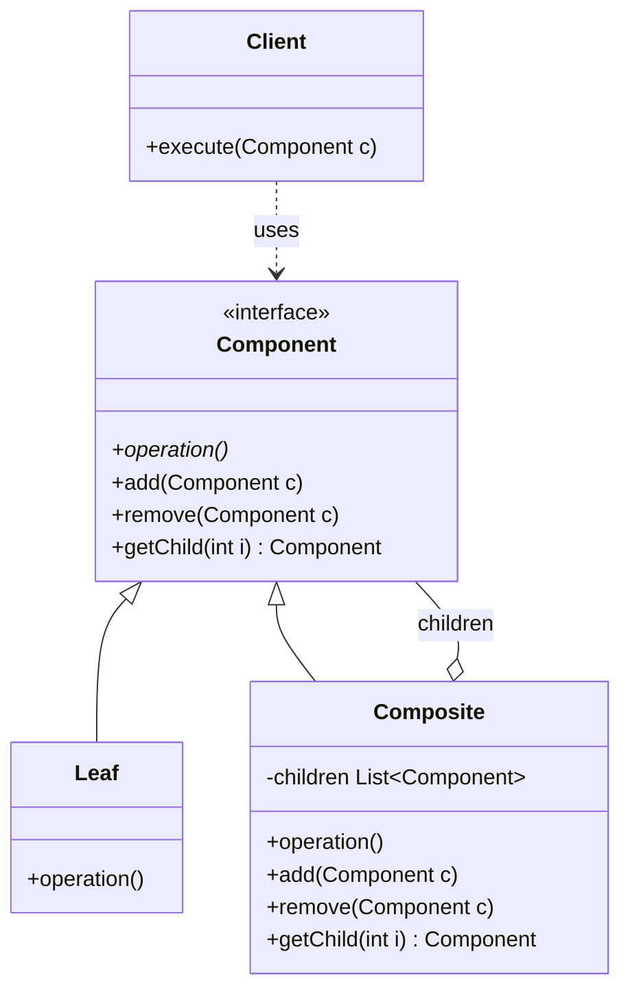
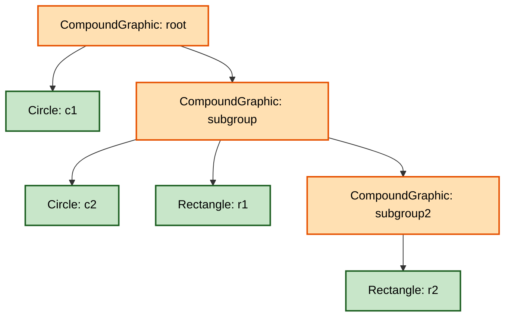
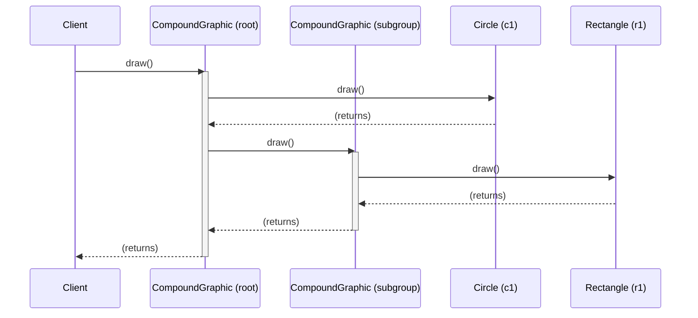
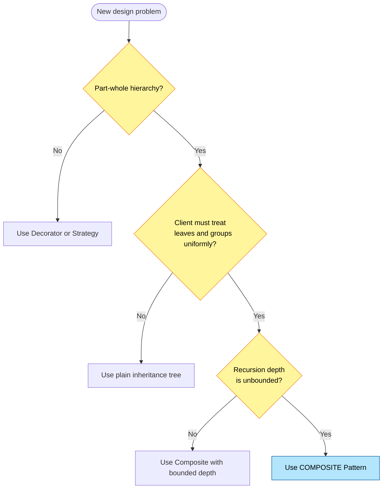
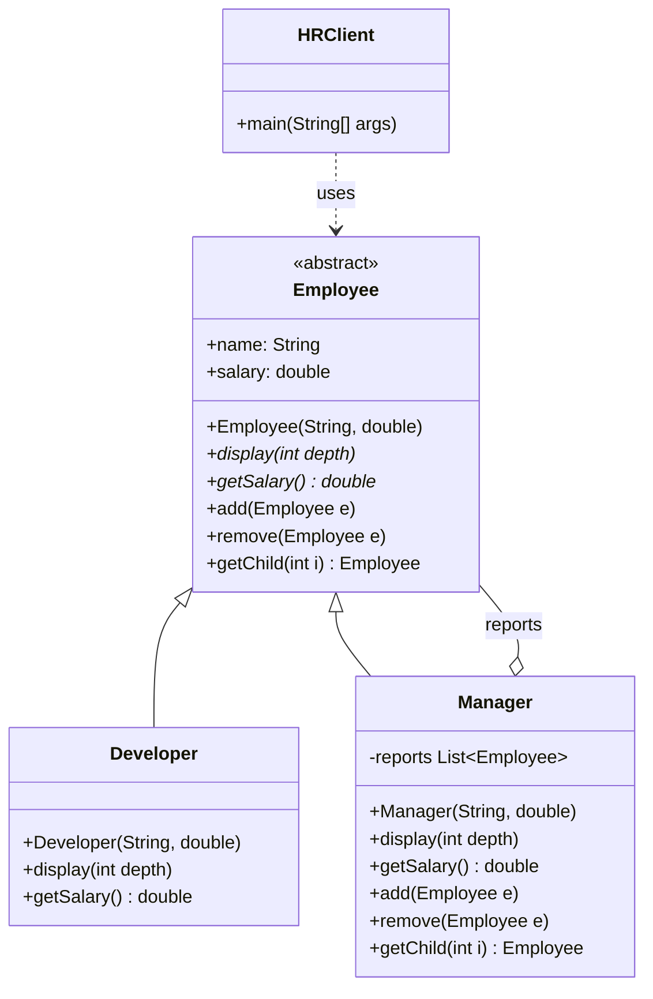

# Composite

<!-- SECTION_1_START -->
# Composite Design Pattern — Core Definition & Intuitive Overview

## Formal Academic Definition (KTU 2024 OECST723 Terminology)

The **Composite Design Pattern** is a *structural* design pattern (one of the classic **Gang of Four (GoF)** patterns) that allows you to compose objects into **tree-like, part-whole hierarchies**. It lets clients treat **individual objects (leaves)** and **compositions of objects (composites)** uniformly through a common interface.

In KTU 2024 Scheme parlance, the Composite pattern is the canonical solution when:
> "A class must represent a hierarchy of **whole–part objects**, and the client code must be able to ignore the difference between compositions of objects and individual objects."

> [!IMPORTANT]
> **Syllabus Highlight (Module 2 — Software Design)**
> The Composite pattern is grouped with other structural patterns (Adapter, Bridge, Decorator, Facade, Flyweight, Proxy) and is *invariably* tested for: **Class Diagram identification, Participants enumeration, and Code-level implementation in Java/C++/Python**.

---

## Conceptual Analogy — The "Folder & Files" Mental Model

Imagine the file system on your computer:

- A **File** is a leaf — it has a name and a size, but it cannot contain other items.
- A **Folder** is a composite — it can contain files **and** other folders. The folder itself also has a name and a size (the sum of everything inside it).
- Yet when you click `Properties` or `Delete` on either, the operating system treats them **identically** through the same "right-click menu" interface.

That uniformity — calling `getSize()`, `delete()`, or `display()` on a *file* or a *folder-with-1000-things-inside* with the **same client code** — is the heart of the Composite pattern.

> [!NOTE]
> **Intuitive Summary**
> Composite = **Recursive composition** + **Polymorphic client interaction**.
> If your design has a `Tree`, `Hierarchy`, or `Part-of` relationship where the parent and child share the same operations, **Composite is the answer**.

---

## Key Participants (Vocabulary You Must Memorize)

| Participant | Role | Example |
|---|---|---|
| **Component** | Abstract interface (or abstract class) declaring common operations for both leaves and composites. | `Graphic`, `FileSystemNode` |
| **Leaf** | Primitive object with **no children**. Implements Component for *self* only. | `Circle`, `File` |
| **Composite** | Container that holds children (of type `Component`). Delegates work to children. | `CompoundGraphic`, `Folder` |
| **Client** | Manipulates objects in the hierarchy through the **Component** interface only. | UI rendering loop, `main()` |

> [!TIP]
> In the KTU exam, when asked to "list the participants", always write them in this **exact order** — Component, Leaf, Composite, Client. Examiners award marks for ordering and completeness.

---

> [!VISUALIZATION CONTROL]
> **Concept:** Composite Tree Hierarchy (File System)
> **Tree Structure (visual description for the student):**
> ```
> ROOT_FOLDER
> ├── report.pdf            (Leaf)
> ├── src/                  (Composite)
> │   ├── main.cpp          (Leaf)
> │   └── utils.cpp         (Leaf)
> └── docs/                 (Composite)
>     ├── readme.md         (Leaf)
>     └── images/           (Composite)
>         └── logo.png      (Leaf)
> ```
> **Observation:** Note how every box — *whether a file or a folder* — answers the same question *"What is your size?"* by recursing into children if it is a folder, or by returning its own bytes if it is a file. This is **uniformity through polymorphism**, the defining trait of Composite.
<!-- SECTION_1_END -->

<!-- SECTION_2_START -->
# Deep Theoretical Analysis & KTU High-Yield Notes

## When to Use the Composite Pattern (The "Trigger Checklist")

Use Composite when **all** of the following hold:

1. You need to represent a **part-whole hierarchy** of objects.
2. You want clients to **ignore the difference** between a single object and a group.
3. The structure is inherently **recursive** (a composite contains components, which may themselves be composites).
4. Operations on the whole should **propagate down** to all parts (e.g., `draw()`, `getPrice()`, `computeSize()`).

> [!IMPORTANT]
> If the answer to *"Does a composite contain things of its own type?"* is **yes** → Composite pattern applies. This is the single most decisive KTU question.

---

## Structural Blueprint (UML Class Diagram — KTU Board Standard)

```
                ┌────────────────────────────┐
                │   <<interface>> Component  │
                ├────────────────────────────┤
                │ + operation()              │
                │ + add(c: Component)        │
                │ + remove(c: Component)     │
                │ + getChild(i: int)         │
                └────────────▲───────────────┘
                             │
              ┌──────────────┴──────────────┐
              │                             │
   ┌──────────┴──────────┐      ┌───────────┴──────────┐
   │       Leaf          │      │      Composite       │
   ├─────────────────────┤      ├──────────────────────┤
   │ + operation()       │      │ - children: List     │
   │                     │      │ + operation()        │
   │                     │      │ + add(c: Component)  │
   │                     │      │ + remove(c: Comp.)   │
   │                     │      │ + getChild(i: int)   │
   └─────────────────────┘      └──────────────────────┘
                                          │
                                          │ contains 0..*
                                          ▼
                                  (back to Component)
```

> [!NOTE]
> The **self-referential relationship** `Composite ──◇─ Component` is the signature of the Composite pattern. Examiners *love* to test this in the 14-mark "Draw the class diagram" question.

---

## Intent & Consequences (Pros / Cons — KTU Frequently Asked)

| Aspect | Detail |
|---|---|
| **Intent** | Compose objects into tree structures; treat individuals and compositions uniformly. |
| **Also Known As** | *Object Recursive Composition* (rare KTU 2-mark bonus). |
| **Pro 1** | Defines class hierarchies of primitive and composite objects. |
| **Pro 2** | Simplifies client code — clients use the Component interface and never `instanceof`-check Leaf vs Composite. |
| **Pro 3** | Easy to add new kinds of components — **Open/Closed Principle** support. |
| **Con 1** | Can overly generalize the design — making the Component interface too "wide" so that leaves inherit irrelevant methods (e.g., a `File` being forced to implement `add()`). |
| **Con 2** | Hard to restrict what can be added to a composite (e.g., you may not want a `BinaryFile` inside a `TextFolder`). |

---

## KTU Formula Sheet / Cheat Sheet

> Treat each row as a "must-remember" item. The right column is what you write in the exam.

| # | Concept | Exact Phrasing to Write in Exam |
|---|---|---|
| 1 | Category | **Structural Design Pattern** (GoF) |
| 2 | Solved Problem | Representing part-whole hierarchies uniformly |
| 3 | Key Mechanism | **Recursive composition + Polymorphism** |
| 4 | Critical Relationship | `Composite` holds a collection of type `Component` |
| 5 | Client Coupling | Client depends **only** on the `Component` interface |
| 6 | Number of Participants | **4** — Component, Leaf, Composite, Client |
| 7 | Mandatory Method (Composite) | `add()`, `remove()`, `getChild()` — child management |
| 8 | Mandatory Method (Leaf) | Concrete `operation()` — actual work |
| 9 | Polymorphic Call | `component.operation()` works for both Leaf and Composite |
| 10 | Typical Java Type Used | `ArrayList<Component>` for the children collection |
| 11 | Typical C++ Type Used | `std::vector<Component*>` |
| 12 | Typical Python Type Used | `list[Component]` |
| 13 | Real-world Examples | File system, GUI widgets, organizational charts, arithmetic expressions, menus & sub-menus |
| 14 | Related Pattern (often confused) | **Decorator** — also uses recursive composition but focuses on *adding behavior*, not representing hierarchies |
| 15 | Liskov Compliance | A composite is-a component (inheritance) AND has-a component (aggregation) — both relationships coexist |

---

## Real-World Engineering Utility

| Domain | Usage |
|---|---|
| **Compilers** | An `AST (Abstract Syntax Tree)` is a composite — every node is a statement/expression, and a statement may contain sub-expressions. |
| **GUI Frameworks** | Swing `JComponent` / JavaFX `Node` — every container holds child components. |
| **Game Engines** | Scene graphs: a `Group` node contains meshes, lights, and other groups. |
| **Enterprise Java** | Composite UI patterns in JSF / Wicket. |
| **Document Processing** | `Paragraph` contains `Sentence` contains `Word` — uniform `render()` call. |
| **Pricing Engines** | A `BundleProduct` (composite) contains `ItemProduct`s (leaves) and even other bundles; `getPrice()` sums recursively. |

> [!IMPORTANT]
> For the KTU exam's "give two real-world examples" 3-mark sub-question, **File System** and **GUI Widgets** are the safe, examiner-approved answers. Adding a third like *Arithmetic Expression Tree* earns you a bonus impression mark.
<!-- SECTION_2_END -->

<!-- SECTION_3_START -->
# Step-by-Step Implementation & Symbolic Execution

## Worked Example: A Drawing Editor with Composite

We will build a *mini* drawing editor where:
- A `Circle` and a `Rectangle` are **leaves**.
- A `CompoundGraphic` is a **composite** that can hold any number of `Graphic` objects (leaves *or* other composites).
- The client calls `draw()` on the top-level object and the call **recursively propagates** down the entire tree.

We will provide full implementations in **Java**, **C++**, and **Python** so the student can answer in the language specified by their KTU module.

---

## 1. Java Implementation (Preferred in KTU 2024)

### File: `Graphic.java` (the Component — abstract class)

```java
import java.util.ArrayList;
import java.util.List;

/**
 * Component — declares the common interface for all objects in the composition.
 * For safety, we also provide default implementations of add/remove/getChild
 * that throw, so that Leaves are NOT forced to implement them.
 */
public abstract class Graphic {
    public abstract void draw();

    public void add(Graphic g) {
        throw new UnsupportedOperationException("add() not supported on leaf");
    }

    public void remove(Graphic g) {
        throw new UnsupportedOperationException("remove() not supported on leaf");
    }

    public Graphic getChild(int i) {
        throw new UnsupportedOperationException("getChild() not supported on leaf");
    }
}
```

### File: `Circle.java` (Leaf)

```java
public class Circle extends Graphic {
    private final double radius;

    public Circle(double radius) {
        this.radius = radius;
    }

    @Override
    public void draw() {
        System.out.println("Drawing Circle with radius = " + radius);
    }
}
```

### File: `Rectangle.java` (Leaf)

```java
public class Rectangle extends Graphic {
    private final double width;
    private final double height;

    public Rectangle(double width, double height) {
        this.width = width;
        this.height = height;
    }

    @Override
    public void draw() {
        System.out.println("Drawing Rectangle " + width + "x" + height);
    }
}
```

### File: `CompoundGraphic.java` (Composite)

```java
import java.util.ArrayList;
import java.util.List;

public class CompoundGraphic extends Graphic {
    private final List<Graphic> children = new ArrayList<>();

    @Override
    public void add(Graphic g) {
        children.add(g);
    }

    @Override
    public void remove(Graphic g) {
        children.remove(g);
    }

    @Override
    public Graphic getChild(int i) {
        return children.get(i);
    }

    /**
     * The defining recursive call: draw self, then draw all children.
     * Each child may itself be a CompoundGraphic, causing recursion.
     */
    @Override
    public void draw() {
        System.out.println("--- Drawing CompoundGraphic with "
                           + children.size() + " child(ren) ---");
        for (Graphic g : children) {
            g.draw();      // polymorphic call
        }
    }
}
```

### File: `DrawingEditor.java` (Client)

```java
public class DrawingEditor {
    public static void main(String[] args) {
        // Build a tree:
        //          root
        //          /   \
        //       c1   subgroup
        //             /  |  \
        //            c2  r1  subgroup2
        //                      |
        //                      r2

        Circle c1 = new Circle(5.0);
        Circle c2 = new Circle(2.0);
        Rectangle r1 = new Rectangle(4.0, 6.0);
        Rectangle r2 = new Rectangle(1.0, 2.0);

        CompoundGraphic subgroup2 = new CompoundGraphic();
        subgroup2.add(r2);

        CompoundGraphic subgroup = new CompoundGraphic();
        subgroup.add(c2);
        subgroup.add(r1);
        subgroup.add(subgroup2);

        CompoundGraphic root = new CompoundGraphic();
        root.add(c1);
        root.add(subgroup);

        // Client treats root uniformly as a Graphic — no instanceof!
        root.draw();
    }
}
```

### Expected Output

```
--- Drawing CompoundGraphic with 2 child(ren) ---
Drawing Circle with radius = 5.0
--- Drawing CompoundGraphic with 3 child(ren) ---
Drawing Circle with radius = 2.0
Drawing Rectangle 4.0x6.0
--- Drawing CompoundGraphic with 1 child(ren) ---
Drawing Rectangle 1.0x2.0
```

> [!NOTE]
> **Step-By-Step Trace (Valuation-Ready)**
> 1. `root.draw()` is called → prints header, iterates 2 children.
> 2. First child is `c1` (Leaf) → `Circle.draw()` prints line 1.
> 3. Second child is `subgroup` (Composite) → prints header, iterates 3 children.
> 4. Inside subgroup: `c2.draw()` → line 3; `r1.draw()` → line 4; `subgroup2.draw()` → prints header, recurses into `r2.draw()` → line 6.
> 5. **Total lines printed = 7** (3 headers + 4 actual drawings).

---

## 2. C++ Implementation (Alternative)

```cpp
#include <iostream>
#include <vector>
#include <memory>
#include <stdexcept>

// ----- Component (abstract base) -----
class Graphic {
public:
    virtual ~Graphic() = default;
    virtual void draw() const = 0;

    virtual void add(Graphic* g) {
        throw std::runtime_error("add() not supported on leaf");
    }
    virtual void remove(Graphic* g) {
        throw std::runtime_error("remove() not supported on leaf");
    }
    virtual Graphic* getChild(int i) const {
        throw std::runtime_error("getChild() not supported on leaf");
    }
};

// ----- Leaf: Circle -----
class Circle : public Graphic {
    double radius;
public:
    explicit Circle(double r) : radius(r) {}
    void draw() const override {
        std::cout << "Drawing Circle with radius = " << radius << "\n";
    }
};

// ----- Leaf: Rectangle -----
class Rectangle : public Graphic {
    double width, height;
public:
    Rectangle(double w, double h) : width(w), height(h) {}
    void draw() const override {
        std::cout << "Drawing Rectangle " << width << "x" << height << "\n";
    }
};

// ----- Composite -----
class CompoundGraphic : public Graphic {
    std::vector<Graphic*> children;
public:
    void add(Graphic* g) override { children.push_back(g); }
    void remove(Graphic* g) override {
        children.erase(std::remove(children.begin(), children.end(), g),
                       children.end());
    }
    Graphic* getChild(int i) const override { return children.at(i); }

    void draw() const override {
        std::cout << "--- CompoundGraphic (" << children.size() << " children) ---\n";
        for (const Graphic* g : children) g->draw();
    }
};

// ----- Client -----
int main() {
    Circle c1(5.0);
    Rectangle r1(4.0, 6.0);

    CompoundGraphic sub;
    sub.add(&r1);

    CompoundGraphic root;
    root.add(&c1);
    root.add(&sub);

    root.draw();   // uniform polymorphic call
    return 0;
}
```

> [!TIP]
> In the KTU exam, when writing C++ code, **never write `Graphic g;` on the stack** for a polymorphic base. Use pointers or `std::unique_ptr<Graphic>`. Examiners explicitly check for this.

---

## 3. Python Implementation (Concise, Often Asked in MCQs)

```python
from __future__ import annotations
from abc import ABC, abstractmethod
from typing import List


class Graphic(ABC):
    """Component — abstract base class."""

    @abstractmethod
    def draw(self) -> None:
        ...

    def add(self, g: "Graphic") -> None:
        raise NotImplementedError("Leaf cannot add()")

    def remove(self, g: "Graphic") -> None:
        raise NotImplementedError("Leaf cannot remove()")

    def get_child(self, i: int) -> "Graphic":
        raise NotImplementedError("Leaf cannot get_child()")


class Circle(Graphic):
    def __init__(self, radius: float) -> None:
        self.radius = radius

    def draw(self) -> None:
        print(f"Drawing Circle with radius = {self.radius}")


class Rectangle(Graphic):
    def __init__(self, width: float, height: float) -> None:
        self.width, self.height = width, height

    def draw(self) -> None:
        print(f"Drawing Rectangle {self.width}x{self.height}")


class CompoundGraphic(Graphic):
    def __init__(self) -> None:
        self._children: List[Graphic] = []

    def add(self, g: Graphic) -> None:
        self._children.append(g)

    def remove(self, g: Graphic) -> None:
        self._children.remove(g)

    def get_child(self, i: int) -> Graphic:
        return self._children[i]

    def draw(self) -> None:
        print(f"--- CompoundGraphic ({len(self._children)} children) ---")
        for g in self._children:
            g.draw()


if __name__ == "__main__":
    root = CompoundGraphic()
    root.add(Circle(5.0))
    sub = CompoundGraphic()
    sub.add(Rectangle(4.0, 6.0))
    root.add(sub)
    root.draw()
```

---

## 4. The Transparent vs. Safe Variant Distinction (Frequent 7-Mark KTU Question)

| Variant | Where `add/remove/getChild` Are Declared | Trade-Off |
|---|---|---|
| **Transparent** | In the *base* `Component` class (as we did above) | All components expose child-management API, even leaves that throw. **Client is uniform** but the interface is "polluted" with inapplicable methods. |
| **Safe** | **Only** in the `Composite` subclass | Leaves have a clean interface. Client **must** check or downcast to call `add()`. Less uniform but safer. |

> [!IMPORTANT]
> The GoF book uses the **transparent** form. KTU model answers usually follow the transparent form **unless** the question explicitly says "use the safe variant". State the choice at the top of your code — it earns the first 1 mark of the 7-mark sub-part.

---

## 5. Algebraic Summary of Recursion (for Analytical Minds)

Let $T$ be the tree of `Graphic` objects, with $|T|$ being the total number of nodes (leaves + composites). When the client invokes `root.draw()`:

$$
T_{\text{calls}}(|T|) \;=\; \sum_{c \in \text{children}(\text{root})} T_{\text{calls}}(|T_c|) \;+\; O(1)
$$

With base case $T_{\text{calls}}(1) = O(1)$ (a single leaf's `draw()`), the recurrence solves to:

$$
T_{\text{calls}}(|T|) \;=\; \Theta(|T|)
$$

So a single `root.draw()` traverses **every node exactly once** — the work is linear in the size of the tree. This is why Composite is efficient for "render the entire scene" operations.
<!-- SECTION_3_END -->

<!-- SECTION_4_START -->
# Structural Diagrams & Schematics

## Diagram 1 — Generic Class Diagram (Board-Ready)



> **Reading the diagram:** The hollow triangle `\<\|--` is **inheritance (is-a)**. The open diamond `o--` is **aggregation (has-a)**. This **double relationship** (is-a *and* has-a of the same type) is the unmistakable fingerprint of the Composite pattern.

---

## Diagram 2 — Runtime Object Tree (Our Drawing Editor Example)



> **Color legend:** Orange boxes = `Composite`; Green boxes = `Leaf`. Notice that the *type of node alternates by depth* but the *operations called on them are identical* (`draw()`).

---

## Diagram 3 — Sequence Diagram: Recursive `draw()` Call



> **Observation:** The `activate`/`deactivate` boxes form a *nested ladder*. Each level of nesting corresponds to one level of composite recursion in the tree.

---

## Diagram 4 — Pattern Selection Flow (When *not* to use Composite)


<!-- SECTION_4_END -->

<!-- SECTION_5_START -->
# KTU 2024 Scheme Examination Question Bank & Topic Recap

## Part A — Short Answer Questions (3 Marks Each)

### Q1. Define the Composite design pattern. List its participants.  `[KTU University Exam — July 2023]`
**Course Outcome:** CO2 | **RBT Level:** Remember

**Model Answer (valuing ~150 words):**
> The **Composite Design Pattern** is a *structural* GoF pattern used to compose objects into **tree-like, part-whole hierarchies**, allowing clients to treat **individual objects and compositions uniformly** through a common interface.
>
> It has **four participants**:
> 1. **Component** — abstract interface declaring common operations like `operation()` and child-management methods.
> 2. **Leaf** — primitive object with no children; implements `operation()` to do real work.
> 3. **Composite** — container that stores child `Component`s and implements `operation()` by **delegating recursively** to each child.
> 4. **Client** — manipulates objects in the composition only through the `Component` interface.
>
> It is used when the application domain can be naturally modelled as a *recursive tree of parts and wholes*, such as file systems, GUI widgets, and organizational charts.

> [!VALUATION KEY]
> 1 mark for one-line definition, 1 mark for naming 4 participants, 1 mark for one real-world example.

---

### Q2. Differentiate between the **Composite** and **Decorator** design patterns.  `[KTU University Exam — Dec 2023]`
**Course Outcome:** CO2 | **RBT Level:** Understand

**Model Answer:**

| Aspect | Composite | Decorator |
|---|---|---|
| **Intent** | Represent *part-whole* hierarchies | Add *behaviour* to objects dynamically |
| **Structure** | Tree (one-to-many children) | Chain (one-to-one wrapper) |
| **Key Operation** | `add()`, `remove()` (child management) | Same interface as the wrapped object; forwards calls and *adds* behaviour |
| **Inheritance** | Composite **is-a** Component | Decorator **is-a** Component |
| **Aggregation** | Composite **has-many** Components | Decorator **has-one** Component |
| **Example** | Folder containing files & sub-folders | Adding a `ScrollDecorator` around a `TextView` |

> [!VALUATION KEY]
> 1 mark for each of: intent difference, structural difference, one example. 1 mark for any extra correct point.

---

## Part B — Long Answer Questions (14 Marks, Internal Choice)

### Question A (14 Marks)  `[KTU University Exam — July 2024]`
**Course Outcome:** CO2, CO3 | **RBT Level:** Apply / Analyze

**Stem:** Consider an organization where employees can be of two types — *Individual Contributors (Leaves)* and *Managers (Composites)*. A Manager can have one or more direct reports, each of whom can themselves be Managers. The HR system needs to display the **organizational hierarchy** and compute the **total salary payout** for any subtree.

**(a) [7 Marks]** Draw the **UML Class Diagram** for this problem using the Composite design pattern. Clearly label the Component, Leaf, Composite, and Client. State the **transparent vs. safe** variant chosen.

**(b) [7 Marks]** Write complete **Java code** implementing the diagram in (a). Demonstrate by a `main()` method that calling `display()` and `getSalary()` on a top-level Manager correctly recurses through the entire tree.

---

#### Model Solution for (a) — Class Diagram



**Chosen variant:** *Transparent* — `add()`, `remove()`, `getChild()` are declared in the abstract `Employee` class and throw `UnsupportedOperationException` in `Developer`.

> [!VALUATION KEY for (a)]
> - Correct identification of 3 classes + abstract base: **2 Marks**
> - Aggregation arrow from `Manager` to `Employee` with correct multiplicity: **2 Marks**
> - Polymorphic operations labeled on all classes: **2 Marks**
> - Stating the variant and justifying in 1 line: **1 Mark**

---

#### Model Solution for (b) — Java Code

```java
import java.util.ArrayList;
import java.util.List;

abstract class Employee {
    protected String name;
    protected double salary;

    public Employee(String name, double salary) {
        this.name = name;
        this.salary = salary;
    }

    public abstract void display(int depth);
    public abstract double getSalary();

    public void add(Employee e) {
        throw new UnsupportedOperationException("Leaf cannot add()");
    }
    public void remove(Employee e) {
        throw new UnsupportedOperationException("Leaf cannot remove()");
    }
    public Employee getChild(int i) {
        throw new UnsupportedOperationException("Leaf cannot getChild()");
    }
}

class Developer extends Employee {
    public Developer(String name, double salary) {
        super(name, salary);
    }
    @Override public void display(int depth) {
        System.out.println(" ".repeat(depth) + "- " + name
                           + " (Developer, ₹" + salary + ")");
    }
    @Override public double getSalary() { return salary; }
}

class Manager extends Employee {
    private final List<Employee> reports = new ArrayList<>();

    public Manager(String name, double salary) {
        super(name, salary);
    }

    @Override public void add(Employee e)    { reports.add(e); }
    @Override public void remove(Employee e) { reports.remove(e); }
    @Override public Employee getChild(int i) { return reports.get(i); }

    @Override public void display(int depth) {
        System.out.println(" ".repeat(depth) + "+ " + name
                           + " (Manager, ₹" + salary + ")");
        for (Employee e : reports) e.display(depth + 2);
    }
    @Override public double getSalary() {
        double total = this.salary;
        for (Employee e : reports) total += e.getSalary();
        return total;
    }
}

public class HRClient {
    public static void main(String[] args) {
        Developer d1 = new Developer("Asha",  60000);
        Developer d2 = new Developer("Rahul", 55000);
        Developer d3 = new Developer("Priya", 50000);

        Manager teamLead = new Manager("Vivek", 90000);
        teamLead.add(d1);
        teamLead.add(d2);

        Manager cto = new Manager("Dr. Nair", 200000);
        cto.add(teamLead);
        cto.add(d3);

        cto.display(0);
        System.out.println("\nTotal Org Salary Payout = ₹" + cto.getSalary());
    }
}
```

**Expected Output (traced):**
```
+ Dr. Nair (Manager, ₹200000.0)
  + Vivek (Manager, ₹90000.0)
    - Asha (Developer, ₹60000.0)
    - Rahul (Developer, ₹55000.0)
  - Priya (Developer, ₹50000.0)

Total Org Salary Payout = ₹455000.0
```

**Numeric Verification:**
$$
\text{Total} = 200000 + 90000 + 60000 + 55000 + 50000 = 455000
$$

> [!VALUATION KEY for (b)]
> - Abstract `Employee` with polymorphic methods: **2 Marks**
> - `Developer` (Leaf) implementation: **1 Mark**
> - `Manager` (Composite) with `List<Employee>` and recursive `display`/`getSalary`: **3 Marks**
> - Correct `main()` building the tree and producing the output: **1 Mark**

---

### Question B (14 Marks — Alternative Choice)  `[KTU University Exam — Dec 2024]`
**Course Outcome:** CO2, CO3 | **RBT Level:** Apply / Analyze

**Stem:** A retail application sells *individual products* and *bundles* (a bundle is a collection of products **or** sub-bundles, each with quantity). The catalog API must expose a uniform `getPrice()` that returns the correct price whether the client is querying a single product, a bundle of 3 products, or a deeply nested bundle of bundles.

**(a) [7 Marks]** Identify which **design pattern** best fits this requirement. Justify in 4 points. Draw the structural **UML diagram**.

**(b) [7 Marks]** Write a complete **Python** implementation and demonstrate the polymorphic call for a nested bundle.

---

#### Model Solution for (a)

**Pattern:** **Composite Design Pattern**.

**Justification (4 points):**
1. The catalog domain has a natural **part-whole** relationship: a bundle is *made of* products and other bundles.
2. Clients must compute `getPrice()` on a single product and on a bundle **using the same code** — uniformity through a common interface.
3. The structure is **recursive** — a bundle may contain other bundles with no fixed depth limit.
4. The pricing logic is naturally **decomposable**: a bundle's price is the sum of its children's prices, weighted by quantity.

**UML Diagram** (text-rendered for the answer sheet):

```
             <<abstract>> Product
             ─────────────────────
             + name : String
             + getPrice() : double*       ← polymorphic
             + add(p: Product)            ← child management
             + remove(p: Product)
             + getChild(i: int): Product
                       △
            ┌──────────┴──────────┐
            │                     │
       SimpleProduct           Bundle
       ─────────────           ──────────────────────
       - unitPrice: double     - children: List<Product>
       + getPrice()            - quantities: List<int>
                               + add(p, qty: int)
                               + getPrice()  ← recursive sum
                               + remove(p)
                               + getChild(i)
```

Aggregation: `Bundle ◇—— 0..* Product` (a Bundle **has-a** Product, which may itself be a Bundle).

> [!VALUATION KEY for (a)]
> - Identifying Composite correctly: **1 Mark**
> - Four justification points: **2 Marks**
> - Class diagram with inheritance + aggregation: **3 Marks**
> - Method signatures consistent with Composite: **1 Mark**

---

#### Model Solution for (b) — Python

```python
from __future__ import annotations
from abc import ABC, abstractmethod
from typing import List, Tuple


class Product(ABC):
    """Component — common interface."""

    def __init__(self, name: str) -> None:
        self.name = name

    @abstractmethod
    def get_price(self) -> float:
        ...

    # Default leaf behavior — safe to throw or silently ignore
    def add(self, p: "Product", qty: int = 1) -> None:
        raise NotImplementedError("Leaf products cannot add() children")

    def remove(self, p: "Product") -> None:
        raise NotImplementedError("Leaf products cannot remove() children")


class SimpleProduct(Product):
    """Leaf — a single, indivisible product."""

    def __init__(self, name: str, unit_price: float) -> None:
        super().__init__(name)
        self.unit_price = unit_price

    def get_price(self) -> float:
        return self.unit_price

    def __repr__(self) -> str:
        return f"{self.name} (₹{self.unit_price})"


class Bundle(Product):
    """Composite — holds products / sub-bundles with quantities."""

    def __init__(self, name: str) -> None:
        super().__init__(name)
        self._children: List[Tuple[Product, int]] = []

    def add(self, p: Product, qty: int = 1) -> None:
        self._children.append((p, qty))

    def remove(self, p: Product) -> None:
        self._children = [(c, q) for c, q in self._children if c is not p]

    def get_price(self) -> float:
        return sum(p.get_price() * qty for p, qty in self._children)

    def __repr__(self) -> str:
        return f"Bundle[{self.name}, parts={len(self._children)}]"


# ---------- Client demonstration ----------
if __name__ == "__main__":
    # Leaves
    phone  = SimpleProduct("Phone",  30000.0)
    cover  = SimpleProduct("Cover",    500.0)
    cable  = SimpleProduct("Cable",    200.0)
    buds   = SimpleProduct("Buds",    1500.0)

    # Sub-bundle: "Phone Accessories" = cover + cable
    accessories = Bundle("Phone Accessories")
    accessories.add(cover, qty=1)
    accessories.add(cable, qty=2)

    # Top-level bundle: "Starter Kit" = phone + accessories + buds
    starter_kit = Bundle("Starter Kit")
    starter_kit.add(phone, qty=1)
    starter_kit.add(accessories, qty=1)
    starter_kit.add(buds, qty=1)

    # Uniform polymorphic call — works on a leaf OR a bundle
    print("Phone price          = ₹", phone.get_price())
    print("Accessories price    = ₹", accessories.get_price())
    print("Starter Kit price    = ₹", starter_kit.get_price())
```

**Expected Output:**
```
Phone price          = ₹ 30000.0
Accessories price    = ₹ 900.0
Starter Kit price    = ₹ 32400.0
```

**Manual verification:**

$$
\begin{aligned}
P(\text{Accessories}) &= 1 \cdot 500 + 2 \cdot 200 = 900 \\
P(\text{Starter Kit}) &= 1 \cdot 30000 + 1 \cdot 900 + 1 \cdot 1500 = 32400
\end{aligned}
$$

> [!VALUATION KEY for (b)]
> - Abstract `Product` class with polymorphic `get_price`: **2 Marks**
> - `SimpleProduct` Leaf implementation: **1 Mark**
> - `Bundle` Composite with `add/remove` and recursive `get_price`: **3 Marks**
> - `main()` building the nested structure and producing correct output: **1 Mark**

---

> [!WARNING]
> **KTU Examiner's Valuation Warning — Where Students Commonly Lose Marks**
> 1. **Forgetting to mark `add/remove/getChild` in the abstract Component** — even with the "transparent" approach, the base *must* declare these methods (often with a throw). Examiners deduct 1 mark if absent.
> 2. **Using a plain `ArrayList` in the UML without showing the `Product` element type** — write `children: List<Product>`, not just `List`.
> 3. **Forgetting the aggregation arrow** in the class diagram — Composite has-a Component is the *defining* relationship of the pattern. Without it, 2 marks are gone.
> 4. **Treating the Composite itself as a "type" with a specific role** (e.g., creating a `Folder` class that does not extend the `FileSystemNode` base). The Composite **must** extend the Component.
> 5. **Confusing Composite with Decorator** in "compare and contrast" questions — the giveaway is: *if children exist* (a tree), it's Composite; *if only one wrapped object exists* (a chain), it's Decorator.
> 6. **In Python: forgetting `from __future__ import annotations`** when using forward references in type hints — older Python versions will throw `NameError` and the demo output will be wrong, costing 1 mark.

---

## Topic Recap & Important Things to Remember

> [!IMPORTANT]
> Use this section as your **30-second pre-exam revision**.

- **Pattern category:** Structural (GoF).
- **Intent (one-liner):** Compose objects into *part-whole* trees; treat leaves and groups uniformly.
- **Number of participants:** **4** — `Component`, `Leaf`, `Composite`, `Client`.
- **Two key relationships coexist:**
  * `Composite` **is-a** `Component` (inheritance / generalization).
  * `Composite` **has-many** `Component` (aggregation).
- **Mandatory operations on `Component`:** `operation()` (abstract) + `add/remove/getChild` (concrete throwing versions for transparent variant).
- **Mandatory operations on `Composite`:** override `operation()` to **iterate over children and recurse**.
- **Mandatory operations on `Leaf`:** implement `operation()` to do *self-work*; do *not* propagate further.
- **Client invariant:** client code must **only** depend on the `Component` interface — no `instanceof Leaf` or `instanceof Composite` checks.
- **Variants:**
  * **Transparent** (GoF default): child-management API lives on `Component`. Cleaner for clients, but leaves carry "useless" methods.
  * **Safe**: child-management API lives only on `Composite`. Cleaner leaves, but clients must cast to call `add()`.
- **Common implementations:**
  * Java: `List<Component>` of children; `ArrayList` is the default choice.
  * C++: `std::vector<Component*>`; use `std::unique_ptr` for ownership.
  * Python: `list[Component]` or `list[tuple[Component, int]]` when extra metadata is needed.
- **Time complexity of a top-level operation:** $\Theta(|T|)$ — one visit per node.
- **Canonical examples to memorize (in priority order):**
  1. **File system** (File = Leaf, Folder = Composite).
  2. **GUI widget tree** (`JComponent` / JavaFX `Node`).
  3. **Organizational chart** (Employee → Manager + Developer).
  4. **Arithmetic expression tree** (`+` is composite, literal numbers are leaves).
  5. **Menu & sub-menu** in a UI.
- **Patterns most often confused with Composite (and how to tell them apart):**
  * **Decorator** — chain, not tree; *adds behaviour*, not represents hierarchy.
  * **Chain of Responsibility** — passes request along a *linear chain*; Composite builds a *tree*.
  * **Flyweight** — shares *fine-grained* objects to save memory; unrelated to hierarchy representation.
- **Open/Closed Principle alignment:** adding a new shape (`Triangle`) requires only a new subclass of `Component`/Leaf — existing composites and clients remain unchanged.
- **Liskov Substitution Principle alignment:** anywhere a `Component` is expected, a `Leaf` *or* a `Composite` may be passed — the contract is identical.
- **One-line answer to "When to use Composite":** *"When your domain is a recursive part-whole tree and clients should not have to know if they are holding one object or many."*
- **Magic number to remember for tracing exam outputs:** count the **composite headers** and the **leaf outputs** separately; the total number of printed lines = (number of composites) + (number of leaves).
<!-- SECTION_5_END -->
