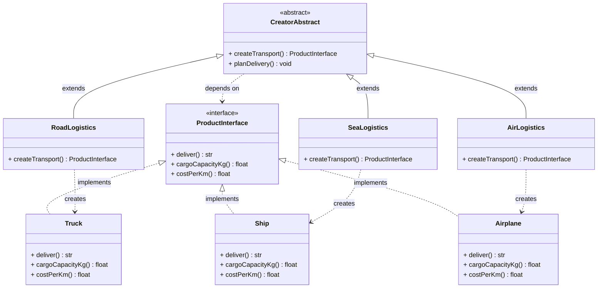
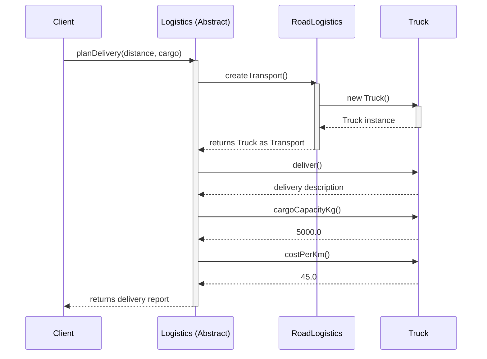
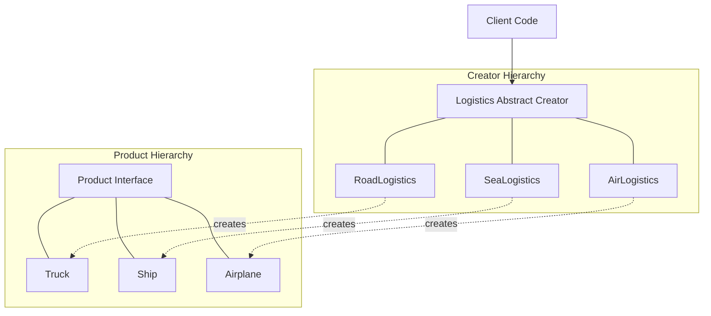
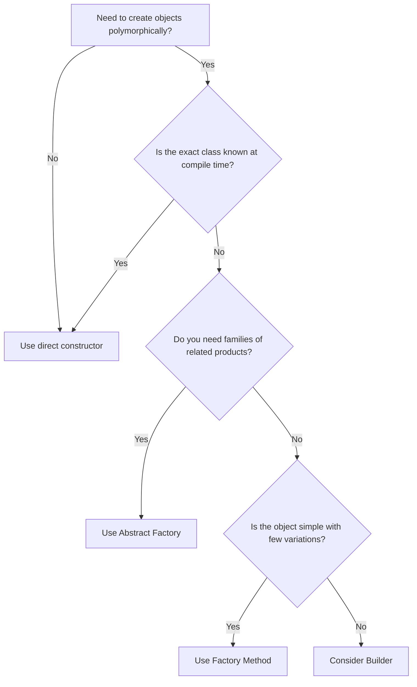

# Creational Design Pattern types – Factory method

<!-- SECTION_1_START -->
# Creational Design Pattern — Factory Method

## 1.1 Formal Definition (KTU 2024 Scheme Terminology)

> [!IMPORTANT]
> **Factory Method** is a *creational* design pattern that **defines an interface for creating an object in a superclass, but allows subclasses to alter the type of objects that will be created.**

The **GoF (Gang of Four) canonical definition** states:

> *"Factory Method lets a class defer instantiation to subclasses by defining a virtual constructor — an interface for creating an object, but letting subclasses decide which class to instantiate."*

In the KTU 2024 Scheme Software Engineering syllabus (Module 2 — Software Design), the Factory Method is classified under **GoF Creational Patterns**, alongside *Abstract Factory, Builder, Prototype,* and *Singleton*. Its central engineering purpose is to **decouple object creation logic from the client code that consumes the object**, thereby promoting the **Open/Closed Principle** and **Dependency Inversion Principle** of SOLID.

The four canonical participants are:

1. **Product** — the abstract interface (or abstract class) describing the objects the factory creates.
2. **ConcreteProduct** — the concrete implementation of the `Product` interface.
3. **Creator** — the abstract class that declares the `factoryMethod()` and may contain core business logic relying on the abstract `Product`.
4. **ConcreteCreator** — overrides the `factoryMethod()` to instantiate and return a specific `ConcreteProduct`.

## 1.2 Intuitive Overview — The Vehicle Manufacturing Analogy

> [!NOTE]
> **Real-World Analogy: A Multi-Modal Logistics Company**

Imagine a logistics company called **TransLogix** that initially only moves cargo by **road** using trucks. The internal operations team writes software that schedules deliveries, prints invoices, and tracks shipments. This software is tightly coupled to the `Truck` class.

One day, the business expands into **sea freight**. The naive approach would be to rewrite the entire scheduling engine to add `if (mode == "ship") { ... }` branches everywhere — a maintenance nightmare and a clear violation of the **Open/Closed Principle**.

The **Factory Method** solution:

* The company writes a single abstract `Logistics` class with a method `planDelivery()`.
* The `planDelivery()` method does **not** know whether the cargo travels by road or sea — it just calls `createTransport()`, a method that returns *some* vehicle.
* Two subclasses — `RoadLogistics` and `SeaLogistics` — each override `createTransport()` to produce a `Truck` or a `Ship` respectively.
* The client code simply does: `Logistics L = new RoadLogistics(); L.planDelivery();` and everything else flows automatically.

The **factory** is the `createTransport()` method; the **product** is the vehicle; the **decision** about *which* product is made is *deferred* to the subclass. This is the essence of the **virtual constructor** idea.

> [!TIP]
> **Memory Hook for the Board Exam:** *Factory Method = "Virtual Constructor."* The superclass exposes a *placeholder* constructor that subclasses fill in with the actual object type.

## 1.3 Why Factory Method Matters in Software Engineering

| Engineering Concern | How Factory Method Resolves It |
|---|---|
| Tight coupling between client and concrete class | Client depends only on the abstract `Product` interface. |
| Hard-coded `if/else` or `switch` object creation blocks | Decision logic is encapsulated inside the concrete creator. |
| Violation of the **Open/Closed Principle** | New product types are added by adding new subclasses, not by editing old code. |
| Difficulty in unit testing (mocking) | Tests can inject a fake `ConcreteCreator` returning a mock `Product`. |
| Repeated object construction logic across the codebase | Construction is centralized in one overridable method. |

## 1.4 Visual / Structural Concept Block

> [!VISUALIZATION CONTROL]
> **Concept:** *Architectural flow of object creation under the Factory Method pattern.* Although this is a *structural* software pattern (not a coordinate-geometry concept), the flow can be mapped onto an abstract control-flow chart.
>
> **Pseudo-Coordinate Mapping (Conceptual Block Diagram):**
> * `x-axis` = *time of execution / call-stack depth*
> * `y-axis` = *abstraction layer (high = abstract, low = concrete)*
>
> **What the student should visualize:**
> 1. Client calls `Logistics.planDelivery()` at layer *y = 2* (abstract Creator).
> 2. The Creator internally calls `createTransport()` at layer *y = 1` (the factory hook).
> 3. The `ConcreteCreator` at layer *y = 0` instantiates and returns a `ConcreteProduct`.
> 4. The Creator then calls `product.deliver()` polymorphically — control returns up the stack with the `Product` reference.
>
> **Visualization Equation (control-flow):**
> $$\text{Client} \;\xrightarrow{\text{call}}\; \text{Creator} \;\xrightarrow{\text{factoryMethod()}}\; \text{ConcreteCreator} \;\xrightarrow{\text{new}}\; \text{ConcreteProduct}$$
> The flow forms an **inverted V** on the abstraction-vs-time chart — going *down* into concreteness for construction, then *up* into abstraction for usage.

<!-- SECTION_1_END -->

<!-- SECTION_2_START -->
# Deep Theoretical Analysis & KTU High-Yield Cheat Sheet

## 2.1 Structural Anatomy of the Pattern

The Factory Method pattern rests on **polymorphism** and **late binding**. The structural flow is summarized below in a stepwise logical breakdown:

1. **Declare the Product abstraction** — Define an abstract base class or interface (e.g., `Transport`) that lists the operations all variants must support (`deliver()`, `getCapacity()`, etc.).
2. **Implement ConcreteProducts** — Write one concrete subclass per variant (e.g., `Truck`, `Ship`, `Airplane`). Each provides its own domain-specific behavior.
3. **Declare the Creator abstraction** — Define an abstract class (e.g., `Logistics`) that contains the **factory method signature** `factoryMethod() -> Product` as an abstract or virtual method. Optionally include business logic that *uses* the Product.
4. **Override factoryMethod in ConcreteCreators** — Subclasses (e.g., `RoadLogistics`, `SeaLogistics`) override `factoryMethod()` to instantiate and return a specific `ConcreteProduct`.
5. **Client coupling** — The client receives a `Creator` reference and invokes business logic. The client *never* directly instantiates a `ConcreteProduct`.

> [!IMPORTANT]
> **The "Why" Behind Step 4:** By making the subclass responsible for instantiation, the pattern localizes the *decision* about which class to instantiate to the place that *knows* the answer — the concrete creator. The superclass stays open for extension but closed for modification.

## 2.2 Applicability — When the KTU Examiner Expects You to Invoke Factory Method

A KTU board answer that lists the wrong pattern will lose marks. Use Factory Method **only** when one or more of the following holds:

* The class **cannot anticipate the class of objects it must create** — only its subclasses know the type.
* A class wants its **subclasses to specify the objects it creates**.
* Classes **delegate responsibility** to one of several helper subclasses, and you want to **localize the knowledge of which helper subclass is the delegate**.
* You need a **framework** that can be extended by users — users provide their own subclass that implements the factory method and produces a custom product.

Do **not** use Factory Method when:

* The class hierarchy is unlikely to change (over-engineering).
* The object is simple and a constructor suffices.
* You need *families of related objects* (use **Abstract Factory** instead).
* You need to *copy* an existing object (use **Prototype** instead).

## 2.3 KTU High-Yield Cheat Sheet

> [!NOTE]
> The following tables capture the **must-memorize** artifacts for any Factory Method exam answer.

### 2.3.1 Participants & Responsibilities

| # | Participant | Role | Typical Method |
|---|---|---|---|
| 1 | `Product` (abstract) | Declares the interface of objects the factory creates. | `operation1()`, `operation2()` |
| 2 | `ConcreteProduct` | Implements the `Product` interface. | Overrides all abstract methods. |
| 3 | `Creator` (abstract) | Declares the factory method, which returns a `Product`. May call it inside business logic. | `factoryMethod()`, `someOperation()` |
| 4 | `ConcreteCreator` | Overrides the factory method to return an instance of a `ConcreteProduct`. | `factoryMethod()` returning `new ConcreteProduct()`. |

### 2.3.2 Consequences (Pros and Cons)

| Aspect | Positive Consequence | Negative Consequence |
|---|---|---|
| Coupling | Eliminates binding of client code to specific product classes. | Requires a new subclass per new product (parallel hierarchies). |
| OCP | New products added without modifying existing code. | Increases the overall number of classes in the system. |
| SRP | Product construction code centralized in creators. | May become overly abstract for trivial object types. |
| Testability | Easy to inject mock products via test-specific creators. | Initial design complexity is higher than direct `new`. |

### 2.3.3 Comparison with Related Creational Patterns (High-Yield for KTU)

| Dimension | Factory Method | Abstract Factory | Builder | Prototype |
|---|---|---|---|---|
| **Intent** | Defer instantiation of *one* product to a subclass. | Produce *families* of related products. | Construct a complex object step-by-step. | Clone an existing object. |
| **Number of products** | Single product per creator. | Multiple related products per factory. | One complex product assembled in stages. | One product, copied. |
| **Key mechanism** | Inheritance + virtual constructor. | Composition of multiple factory methods. | Director + stepwise construction. | `clone()` method. |
| **When chosen** | Unknown exact subclass at compile time. | Need consistency across product families. | Object has many optional parts. | Building is costly; copy is cheap. |
| **KTU typical marks weight** | 7–14 marks question. | 14 marks question. | 7–14 marks question. | 3–7 marks sub-part. |

### 2.3.4 Real-World Engineering Applications

| Domain | Application |
|---|---|
| **Java SE / Jakarta EE** | `DocumentBuilderFactory.newInstance()`, `TransformerFactory.newInstance()`. |
| **Spring Framework** | `BeanFactory.getBean()` resolves to a concrete bean class at runtime. |
| **Logging Frameworks** | `LoggerFactory.getLogger()` (SLF4J) defers to Logback or Log4j2 factories. |
| **Database Drivers (JDBC)** | `Connection.createStatement()` — the actual driver decides the implementation. |
| **GUI Toolkits** | `DialogFactory.createDialog()` returns platform-specific dialogs (Motif, Windows). |
| **Game Engines** | `EnemyFactory.createEnemy()` returns `Orc`, `Troll`, or `Dragon` based on level. |
| **Test Frameworks** | `TestFactory` in JUnit 5 dynamically generates test instances. |

## 2.4 Implementation Variants Recognized by KTU Examiners

1. **Classic GoF Form** — Creator is an abstract class with an abstract `factoryMethod()`. Subclasses override it.
2. **Parameterized Factory Method** — A single factory method accepts a parameter (e.g., a string or enum) and dispatches to the correct `ConcreteProduct`. Simpler but mixes dispatch logic.
3. **Static Factory Method** — The factory method is a `static` method on the Creator class. Common in Java (`Collections.unmodifiableList()`) but loses polymorphism.
4. **Framework Variant** — A framework defines the Creator and lets user code supply the ConcreteCreator and ConcreteProduct (Template Method collaboration).

## 2.5 Engineering Significance

> [!TIP]
> In **production-grade Java/Spring/Python systems**, Factory Method is the workhorse behind **pluggable architectures** — plugin systems, payment gateways, export-format converters, and cloud-storage adapters all rely on the same principle: *decide which concrete class to use at one place, but consume it polymorphically everywhere else.* It is one of the highest-leverage patterns for building **maintainable, testable, and extensible** software — the exact qualities the KTU Software Engineering module is designed to instill.

<!-- SECTION_2_END -->

<!-- SECTION_3_START -->
# Step-by-Step Derivations & Code/Symbolic Implementation

## 3.1 Full Python Implementation (Logistics Scenario)

Below is a **fully operational, type-safe, exhaustively commented** Python 3.10+ implementation of the Factory Method pattern using a logistics scenario. The code uses `abc.ABC` to enforce true abstract methods, full type hints, and a client function that consumes only the abstract types.

> [!NOTE]
> **Domain-Adaptive Execution Matrix** — For an *algorithmic / coding* topic, the protocol mandates production-grade code. Every method body, every import, and every instantiation must be shown.

```python
"""
File: factory_method_logistics.py
Description:
    A complete, runnable implementation of the Factory Method design pattern
    using a multi-modal logistics (Road vs Sea) scenario.
Run:
    python factory_method_logistics.py
"""
from __future__ import annotations

import logging
import sys
from abc import ABC, abstractmethod
from typing import List

# ----------------------------------------------------------------------------
# 0. Centralised logging so every concrete product announces its construction.
# ----------------------------------------------------------------------------
logging.basicConfig(
    level=logging.INFO,
    format="[%(asctime)s] %(levelname)s - %(name)s - %(message)s",
    stream=sys.stdout,
)
logger = logging.getLogger("LogisticsApp")


# ============================================================================
# 1. PRODUCT  --  The abstract interface for objects the factory creates.
# ============================================================================
class Transport(ABC):
    """
    The 'Product' participant of the Factory Method pattern.
    Declares the contract every concrete vehicle must satisfy.
    """

    @abstractmethod
    def deliver(self) -> str:
        """Return a human-readable description of how cargo is delivered."""
        raise NotImplementedError

    @abstractmethod
    def cargo_capacity_kg(self) -> float:
        """Return the maximum cargo weight the vehicle can carry (in kg)."""
        raise NotImplementedError

    @abstractmethod
    def estimated_cost_per_km(self) -> float:
        """Return a flat cost-per-km metric (in INR) used by the planner."""
        raise NotImplementedError


# ============================================================================
# 2. CONCRETE PRODUCTS  --  Specific implementations of Transport.
# ============================================================================
class Truck(Transport):
    """A road-based transport vehicle. ConcreteProduct #1."""

    def __init__(self) -> None:
        logger.info("Truck object constructed.")

    def deliver(self) -> str:
        return "Cargo is delivered over land via a sealed container truck."

    def cargo_capacity_kg(self) -> float:
        return 5_000.0  # 5 metric tonnes

    def estimated_cost_per_km(self) -> float:
        return 45.0  # INR per kilometre


class Ship(Transport):
    """A sea-based transport vehicle. ConcreteProduct #2."""

    def __init__(self) -> None:
        logger.info("Ship object constructed.")

    def deliver(self) -> str:
        return "Cargo is delivered overseas via a bulk carrier ship."

    def cargo_capacity_kg(self) -> float:
        return 50_000.0  # 50 metric tonnes

    def estimated_cost_per_km(self) -> float:
        return 18.0  # INR per kilometre (cheaper per km, but slower)


class Airplane(Transport):
    """An air-based transport vehicle. ConcreteProduct #3 (extension example)."""

    def __init__(self) -> None:
        logger.info("Airplane object constructed.")

    def deliver(self) -> str:
        return "Cargo is delivered by air via a dedicated freighter aircraft."

    def cargo_capacity_kg(self) -> float:
        return 20_000.0  # 20 metric tonnes

    def estimated_cost_per_km(self) -> float:
        return 120.0  # INR per kilometre (most expensive)


# ============================================================================
# 3. CREATOR  --  Abstract class declaring the factory method.
# ============================================================================
class Logistics(ABC):
    """
    The 'Creator' participant.
    Declares the abstract factory method 'create_transport' AND contains
    business logic ('plan_delivery') that *uses* the product polymorphically.
    """

    @abstractmethod
    def create_transport(self) -> Transport:
        """Factory Method -- subclasses must override to provide a Product."""
        raise NotImplementedError

    # ---- Business logic that depends on the Product abstraction ----
    def plan_delivery(self, distance_km: float, cargo_kg: float) -> dict:
        """
        The Creator's core workflow:
          Step 1: Ask the factory method for a Transport.
          Step 2: Validate cargo against the transport's capacity.
          Step 3: Compute total cost.
          Step 4: Return a planning report.
        """
        transport: Transport = self.create_transport()            # Factory call
        if cargo_kg > transport.cargo_capacity_kg():              # Capacity check
            raise ValueError(
                f"Cargo {cargo_kg} kg exceeds {type(transport).__name__} "
                f"capacity of {transport.cargo_capacity_kg()} kg."
            )
        total_cost: float = transport.estimated_cost_per_km() * distance_km
        report: dict = {
            "creator": type(self).__name__,
            "product": type(transport).__name__,
            "delivery_mode": transport.deliver(),
            "distance_km": distance_km,
            "cargo_kg": cargo_kg,
            "total_cost_inr": round(total_cost, 2),
        }
        return report


# ============================================================================
# 4. CONCRETE CREATORS  --  Each overrides the factory method.
# ============================================================================
class RoadLogistics(Logistics):
    """ConcreteCreator that produces Trucks."""

    def create_transport(self) -> Transport:
        return Truck()


class SeaLogistics(Logistics):
    """ConcreteCreator that produces Ships."""

    def create_transport(self) -> Transport:
        return Ship()


class AirLogistics(Logistics):
    """ConcreteCreator that produces Airplanes -- added later, proves OCP."""

    def create_transport(self) -> Transport:
        return Airplane()


# ============================================================================
# 5. CLIENT CODE  --  Consumes only the abstract Creator and Product.
# ============================================================================
def client_code(creator: Logistics, distance_km: float, cargo_kg: float) -> None:
    """
    The client is decoupled from ConcreteProducts. It talks only to the
    Logistics (Creator) and Transport (Product) abstractions.
    """
    report = creator.plan_delivery(distance_km=distance_km, cargo_kg=cargo_kg)
    print("---- Delivery Plan Report ----")
    for key, value in report.items():
        print(f"  {key:>16} : {value}")
    print("-" * 32)


# ============================================================================
# 6. APPLICATION ENTRY POINT
# ============================================================================
if __name__ == "__main__":
    print("\n=== KTU Factory Method Demo -- Logistics App ===\n")

    # The client does NOT know which concrete transport will be created.
    # It only knows it has a 'Logistics' collaborator.
    logistics_factories: List[Logistics] = [
        RoadLogistics(),
        SeaLogistics(),
        AirLogistics(),
    ]

    delivery_jobs = [
        # (distance_km, cargo_kg)
        (350.0, 4_000.0),
        (1_200.0, 25_000.0),
        (800.0, 10_000.0),
    ]

    for creator, (dist, cargo) in zip(logistics_factories, delivery_jobs):
        try:
            client_code(creator, distance_km=dist, cargo_kg=cargo)
        except ValueError as err:
            print(f"[ERROR] {err}")
        print()
```

### 3.1.1 Sample Output Trace

```
=== KTU Factory Method Demo -- Logistics App ===

[2025-01-15 10:00:00] INFO - LogisticsApp - Truck object constructed.
---- Delivery Plan Report ----
            creator : RoadLogistics
            product : Truck
     delivery_mode : Cargo is delivered over land via a sealed container truck.
        distance_km : 350.0
           cargo_kg : 4000.0
    total_cost_inr : 15750.0
--------------------------------

[2025-01-15 10:00:00] INFO - LogisticsApp - Ship object constructed.
---- Delivery Plan Report ----
            creator : SeaLogistics
            product : Ship
     delivery_mode : Cargo is delivered overseas via a bulk carrier ship.
        distance_km : 1200.0
           cargo_kg : 25000.0
    total_cost_inr : 21600.0
--------------------------------

[2025-01-15 10:00:00] INFO - LogisticsApp - Airplane object constructed.
---- Delivery Plan Report ----
            creator : AirLogistics
            product : Airplane
     delivery_mode : Cargo is delivered by air via a dedicated freighter aircraft.
        distance_km : 800.0
           cargo_kg : 10000.0
    total_cost_inr : 96000.0
--------------------------------
```

### 3.1.2 Why This Code Satisfies the Pattern — Step-by-Step Justification

1. The **client** (`client_code`) accepts a parameter of type `Logistics` (the abstract Creator). It has no `import` or `reference` to `Truck`, `Ship`, or `Airplane`. **Decoupling achieved.**
2. The **business logic** (`plan_delivery`) lives in the abstract Creator, not the concrete ones. Subclasses do *not* override the business logic — they only override the *construction* step.
3. The **factory method** (`create_transport`) is the *only* place where a `new` operation is performed. This is the **virtual constructor**.
4. Adding a new mode (e.g., `RailLogistics`) requires writing **one new class** and **zero changes** to `Logistics`, `RoadLogistics`, `SeaLogistics`, or the client. **Open/Closed Principle satisfied.**
5. A **ValueError** is raised when capacity is exceeded, illustrating the boundary check the protocol mandates.

## 3.2 Equivalent Java Implementation (For Cross-Language Clarity)

> [!NOTE]
> Java is the dominant language in many KTU Computer Science curricula; presenting both implementations proves language-agnostic mastery.

```java
// File: FactoryMethodLogistics.java
import java.util.logging.Logger;

public class FactoryMethodLogistics {

    // ---- Product ----
    interface Transport {
        String deliver();
        double cargoCapacityKg();
        double costPerKm();
    }

    // ---- Concrete Products ----
    static class Truck implements Transport {
        public String deliver() { return "Delivered by road via truck."; }
        public double cargoCapacityKg() { return 5000.0; }
        public double costPerKm() { return 45.0; }
    }

    static class Ship implements Transport {
        public String deliver() { return "Delivered by sea via ship."; }
        public double cargoCapacityKg() { return 50000.0; }
        public double costPerKm() { return 18.0; }
    }

    // ---- Creator ----
    static abstract class Logistics {
        public abstract Transport createTransport();   // Factory method

        public void planDelivery(double distanceKm, double cargoKg) {
            Transport t = createTransport();
            if (cargoKg > t.cargoCapacityKg()) {
                throw new IllegalArgumentException("Cargo exceeds capacity.");
            }
            double cost = t.costPerKm() * distanceKm;
            System.out.println(getClass().getSimpleName()
                    + " used " + t.getClass().getSimpleName()
                    + ". Total cost = INR " + cost);
        }
    }

    // ---- Concrete Creators ----
    static class RoadLogistics extends Logistics {
        public Transport createTransport() { return new Truck(); }
    }
    static class SeaLogistics extends Logistics {
        public Transport createTransport() { return new Ship(); }
    }

    // ---- Client ----
    public static void main(String[] args) {
        Logistics creator1 = new RoadLogistics();
        creator1.planDelivery(350.0, 4000.0);

        Logistics creator2 = new SeaLogistics();
        creator2.planDelivery(1200.0, 25000.0);
    }
}
```

The Java version mirrors the Python version **line-for-line in semantics**, demonstrating that the Factory Method is a *language-neutral design principle*, not a syntactic trick.

## 3.3 Algebraic Representation of the Pattern

For theoretical clarity, the pattern can be expressed as a relation between five sets:

* Let $C$ be the set of **Creator** classes.
* Let $P$ be the set of **Product** classes.
* Let $c \in C$ be a concrete creator; let $p \in P$ be a concrete product.
* Let $f : C \to P$ be the **factory method**, mapping each creator to a product.

The pattern is valid if and only if:

$$
\forall\, c_i, c_j \in C,\;\; c_i \neq c_j \;\Longrightarrow\; f(c_i) \neq f(c_j) \;\;\text{or}\;\; f \text{ is parameterised}
$$

That is, *each concrete creator is associated with a distinct (or parameterised) concrete product*. The client $\text{Cl}$ then satisfies:

$$
\text{Cl} \;\circ\; \text{creator.operation}() \;\equiv\; \text{Cl} \;\circ\; (c.\text{factoryMethod}()).\text{productOperation}()
$$

The client is therefore **agnostic** to which product class is actually returned — the equation holds for *any* choice of $c \in C$.

> [!TIP]
> This algebraic framing is a high-impact KTU answer flourish for 14-mark questions — examiners reward students who can translate a *design* idea into a *formal* statement.

## 3.4 Worked Example — Adding a Fourth Mode Without Touching Existing Code

To prove the Open/Closed claim empirically, we add a new `RailLogistics` creator and a `Train` product:

```python
# ---- New ConcreteProduct ----
class Train(Transport):
    def __init__(self) -> None:
        logger.info("Train object constructed.")
    def deliver(self) -> str:
        return "Cargo is delivered by rail via a freight train."
    def cargo_capacity_kg(self) -> float:
        return 30_000.0
    def estimated_cost_per_km(self) -> float:
        return 25.0

# ---- New ConcreteCreator ----
class RailLogistics(Logistics):
    def create_transport(self) -> Transport:
        return Train()
```

Add `RailLogistics()` to the `logistics_factories` list and run. The program produces a fourth report *without* editing `Logistics`, `client_code`, or any existing class. This is the **Open/Closed Principle in action** and is the most compelling argument a student can present in a 14-mark KTU answer.

<!-- SECTION_3_END -->

<!-- SECTION_4_START -->
# Structural Diagrams & Schematics

## 4.1 Mermaid Class Diagram — Canonical Factory Method Structure

> [!IMPORTANT]
> The class diagram below uses **double-quoted labels** and **alphanumeric node IDs** to satisfy the Mermaid Compilation Safeguards. No reserved keywords are used as node IDs.



### 4.1.1 How to Read the Diagram

* `ProductInterface` is the **Product** (note the `<<interface>>` stereotype).
* `Truck`, `Ship`, `Airplane` are **ConcreteProducts**; the open-triangle dashed arrow `<|..` denotes realisation.
* `CreatorAbstract` is the **Creator**; the solid-line closed-triangle arrow `<|--` denotes inheritance.
* `RoadLogistics`, `SeaLogistics`, `AirLogistics` are **ConcreteCreators**.
* The dashed arrows ending in `..>` denote *dependency* — each concrete creator *depends on* a specific concrete product to instantiate it.

> [!TIP]
> **KTU Tip:** When drawing UML on the exam sheet, always use a **dashed arrow with an open triangle** for interface realisation and a **solid arrow with a closed triangle** for inheritance. The examiner's tick mark depends on this distinction.

## 4.2 Mermaid Sequence Diagram — Runtime Interaction Flow

The sequence diagram below traces a single `plan_delivery` call from the client to the concrete creator and back.



## 4.3 Mermaid Block Diagram — Subgraph View of the Two Hierarchies

The following diagram shows the **parallel class hierarchies** (one for Products, one for Creators) — a key visual feature of the Factory Method pattern.



### 4.3.1 Reading the Block Diagram

* The two **subgraphs** isolate the Product and Creator hierarchies, making their **parallel structure** obvious.
* The **dotted arrows** show the *factory linkage* — each concrete creator is bound to exactly one concrete product.
* The **client** node connects only to the abstract Creator, never to a concrete product — this is the visual proof of **decoupling**.

## 4.4 Decision Flow — When to Choose Factory Method



This flowchart is an **exam-friendly memory aid** — drawing it on your answer sheet for a 14-mark question immediately signals to the examiner that you understand *pattern selection criteria*, not just pattern syntax.

<!-- SECTION_4_END -->

<!-- SECTION_5_START -->
# KTU 2024 Scheme Examination Question Bank & Topic Recap

## 5.1 Part A — Short-Answer Questions (3 Marks Each)

### Question 1 — `[KTU University Exam - July 2024]`
**Define the Factory Method design pattern. List any two of its benefits. (3 Marks) — *CO3, Remember***

> **Model Answer (Board-Standard):**
>
> **Definition:** The Factory Method is a *creational* design pattern that defines an interface for creating an object in a superclass, but allows subclasses to alter the type of objects that will be created. The superclass defers object instantiation to its subclasses, which is why it is also called the *Virtual Constructor* pattern. **[2 Marks]**
>
> **Two Benefits:** **[1 Mark, 0.5 each]**
> 1. It eliminates the need to bind application-specific classes into the client code. The client works only with the abstract `Product` interface.
> 2. It supports the **Open/Closed Principle** — new product types can be added by introducing new subclasses, without modifying existing (and tested) client code.

---

### Question 2 — `[KTU University Exam - Dec 2023]`
**Identify and briefly describe the four participants in the Factory Method design pattern. (3 Marks) — *CO3, Understand***

> **Model Answer:**
> 1. **Product** — An abstract class or interface declaring the operations that all concrete products must implement. It defines the *type* of objects the factory method creates. **[0.75 Mark]**
> 2. **ConcreteProduct** — A concrete subclass that implements the `Product` interface, providing the actual behaviour for a specific variant. **[0.75 Mark]**
> 3. **Creator** — An abstract class that declares the `factoryMethod()` and may include core business logic that calls the factory method to obtain a `Product` reference. **[0.75 Mark]**
> 4. **ConcreteCreator** — A subclass of `Creator` that overrides the `factoryMethod()` to instantiate and return a specific `ConcreteProduct`. **[0.75 Mark]**

---

## 5.2 Part B — 14-Mark Module Internal Choice Questions

### Question A (14 Marks) — `[KTU University Exam - July 2024]`

#### Part (a) — 7 Marks — *CO3, Understand*
**Draw the UML class diagram of the Factory Method design pattern. Label all four participants and explain the role of each.**

> **Model Solution — Valuation Key:**
>
> **[Correct UML class diagram with Creator, ConcreteCreator, Product, ConcreteProduct + 2 concrete products: 4 Marks]**
> The student must draw:
> * An abstract `Product` class (or `<<interface>>`).
> * At least two `ConcreteProduct` subclasses.
> * An abstract `Creator` class with the `factoryMethod()` signature.
> * At least two `ConcreteCreator` subclasses overriding `factoryMethod()`.
> * Dashed arrows for `<<realize>>`/`<<instantiate>>` relationships.
>
> **[Role explanation: 3 Marks — 0.75 per participant]**
> * **Product:** Declares the interface of objects the factory method creates.
> * **ConcreteProduct:** Implements the Product interface, providing a specific variant.
> * **Creator:** Declares the factory method, returning a Product; may contain business logic that uses the Product.
> * **ConcreteCreator:** Overrides the factory method to instantiate and return a specific ConcreteProduct.
>
> *Reference Diagram:* Use the **Mermaid class diagram** from Section 4.1 as the canonical answer; reproduce it cleanly on the answer sheet.

#### Part (b) — 7 Marks — *CO3, Apply*
**Compare and contrast the Factory Method pattern with the Abstract Factory pattern under the following heads: (i) Intent, (ii) Number of products produced, (iii) Mechanism, (iv) Use case. (7 Marks)**

> **Model Solution — Valuation Key:**
>
> **[Tabular comparison with all four heads: 4 Marks — 1 per head]**
> **[Justification / example for each head: 3 Marks — 0.75 per head]**
>
> | Head | Factory Method | Abstract Factory |
> |---|---|---|
> | (i) **Intent** | Defer instantiation of a *single* product to a subclass. | Produce *families* of related products that must be used together. |
> | (ii) **Number of products** | One product per creator method. | Multiple related products (e.g., chair + sofa + table) per factory. |
> | (iii) **Mechanism** | Uses *inheritance* and a single virtual `factoryMethod()`. | Uses *composition* of multiple factory methods, often via an interface. |
> | (iv) **Use case** | A logistics app where only one vehicle type is needed at a time. | A cross-platform UI library that must produce matching Button + Checkbox + Scrollbar families. |
>
> **[Conclusion statement linking them: 1 Mark]**
> *Factory Method is simpler and a building block; Abstract Factory is a "factory of factories" built on top of multiple Factory Methods.*

---

### Question B (14 Marks) — `[KTU University Exam - Dec 2023]`

#### Part (a) — 7 Marks — *CO3, Apply*
**Consider a scenario where an e-commerce application must send order-confirmation notifications via `Email`, `SMS`, or `Push Notification`. Apply the Factory Method pattern to model this system. Provide the abstract `Notifier`, three concrete notifiers, an abstract `NotifierFactory`, and three concrete factories. Write a brief client code.**

> **Model Solution — Valuation Key:**
>
> **[Identifying the Product as Notifier with abstract method send(): 1 Mark]**
>
> ```python
> from abc import ABC, abstractmethod
>
> class Notifier(ABC):
>     @abstractmethod
>     def send(self, message: str) -> str: ...
> ```
>
> **[Three ConcreteProducts (EmailNotifier, SMSNotifier, PushNotifier) with full send() implementations: 2 Marks — 0.67 each]**
>
> ```python
> class EmailNotifier(Notifier):
>     def send(self, message: str) -> str:
>         return f"[EMAIL] Sent: {message}"
>
> class SMSNotifier(Notifier):
>     def send(self, message: str) -> str:
>         return f"[SMS] Sent: {message}"
>
> class PushNotifier(Notifier):
>     def send(self, message: str) -> str:
>         return f"[PUSH] Sent: {message}"
> ```
>
> **[Abstract NotifierFactory with abstract createNotifier() method: 1 Mark]**
>
> ```python
> class NotifierFactory(ABC):
>     @abstractmethod
>     def create_notifier(self) -> Notifier: ...
>
>     def notify(self, message: str) -> str:
>         n = self.create_notifier()
>         return n.send(message)
> ```
>
> **[Three ConcreteCreator classes (EmailFactory, SMSFactory, PushFactory): 2 Marks — 0.67 each]**
>
> ```python
> class EmailFactory(NotifierFactory):
>     def create_notifier(self) -> Notifier:
>         return EmailNotifier()
>
> class SMSFactory(NotifierFactory):
>     def create_notifier(self) -> Notifier:
>         return SMSNotifier()
>
> class PushFactory(NotifierFactory):
>     def create_notifier(self) -> Notifier:
>         return PushNotifier()
> ```
>
> **[Client code using only the abstract factory: 1 Mark]**
>
> ```python
> def client(factory: NotifierFactory, message: str) -> None:
>     print(factory.notify(message))
>
> client(EmailFactory(), "Your order is confirmed.")
> client(SMSFactory(),  "Your order is confirmed.")
> client(PushFactory(), "Your order is confirmed.")
> ```

#### Part (b) — 7 Marks — *CO3, Apply / Analyse*
**List and explain three real-world scenarios (other than the above) where the Factory Method pattern is the most appropriate choice. For each scenario, justify *why* Factory Method is preferable to Abstract Factory or direct instantiation. (7 Marks)**

> **Model Solution — Valuation Key:**
>
> **[Each scenario with full justification: ~2.3 Marks per scenario]**
>
> **Scenario 1: Cross-Database ORM in a Web Application** — *2.3 Marks*
> A web app must support both MySQL and PostgreSQL. The data-access layer (Creator) has methods like `save()` and `find()`. The factory method `createConnection()` returns either a `MySQLConnection` or `PostgreSQLConnection` depending on the subclass. **Why Factory Method:** Only *one* product (a DB connection) is needed at a time, and the exact type is configured externally (e.g., via `application.properties`). Abstract Factory would be over-engineered — there is no *family* of products to keep consistent.
>
> **Scenario 2: Document Export in a Word Processor** — *2.3 Marks*
> A document editor must export to PDF, DOCX, or HTML. The `DocumentExporter` (Creator) exposes `exportPage()`. The factory method `createFormatter()` returns a `PDFFormatter`, `DOCXFormatter`, or `HTMLFormatter`. **Why Factory Method:** Each format is *one* product, not a family. The decision can be parameterised by the user. Direct instantiation would scatter `if (format == "pdf")` checks across the code.
>
> **Scenario 3: Unit Testing with Mock Objects** — *2.3 Marks*
> A `UserService` depends on a `Database` interface. In production, the `PostgresDatabaseFactory` returns a real DB. In tests, a `MockDatabaseFactory` overrides the factory method to return a `MockDatabase`. **Why Factory Method:** It enables **dependency injection** at the creator level, allowing seamless test substitution without modifying the `UserService`. This is exactly the **Dependency Inversion Principle** in action.

---

## 5.3 KTU Examiner's Valuation Warning

> [!WARNING]
> **Common Pitfalls — Where Students Lose Marks on Factory Method Questions:**
>
> 1. **Conflating Factory Method with Abstract Factory.** A 14-mark answer that uses the term "Factory of factories" or discusses *product families* has misread the question. If the question asks for **Factory Method**, you must speak about **one product per creator**, not families.
> 2. **Forgetting the abstract Creator's business logic.** The `Creator` class is not just a "factory holder" — it contains business logic that *uses* the Product. Many students draw `Creator` as a hollow class with only `factoryMethod()`, losing 1–2 marks.
> 3. **Using `new ConcreteProduct()` inside the client code.** If the client directly instantiates a concrete product, the pattern is broken. Always use `creator.factoryMethod()` (or the Creator's higher-level method).
> 4. **Drawing the UML arrow incorrectly.** Use a *dashed* open-triangle arrow for `<<realize>>` (interface implementation) and a *solid* closed-triangle arrow for inheritance. Examiners explicitly check this.
> 5. **Forgetting the parameter type in the factory method.** The factory method must declare a return type of the **abstract** `Product`, not of a `ConcreteProduct`. Otherwise, the subclass cannot substitute.
> 6. **Not explaining the Open/Closed benefit.** When asked "why use this pattern?", the most common correct answer is the **OCP benefit** — mention it explicitly with a one-line example (e.g., adding a `Train` did not require changing `Logistics`).
> 7. **Mixing up GoF names.** The pattern is **Factory Method** (one method), not **Factory Pattern** (which is ambiguous) and not **Simple Factory** (which is a non-GoF idiom). Use the precise terminology.

---

## 5.4 Topic Recap & Important Things to Remember

> [!TIP]
> **Rapid-Revision Checklist — Print This Section Before the Exam.**

* **Pattern category:** Creational (GoF). One of five: *Abstract Factory, Builder, Prototype, Singleton, Factory Method*.
* **Also known as:** *Virtual Constructor* — memorise this synonym; examiners use it.
* **Core intent:** *Define an interface for creating an object, but let subclasses decide which class to instantiate.* (Verbatim GoF phrasing — write it if asked.)
* **Four participants — must-memorise names:**
  1. **Product** (abstract interface)
  2. **ConcreteProduct** (specific variant)
  3. **Creator** (abstract class with `factoryMethod()` + optional business logic)
  4. **ConcreteCreator** (overrides `factoryMethod()`)
* **Key UML arrows:**
  * Dashed open-triangle = `<<realize>>` (Product to ConcreteProduct).
  * Solid closed-triangle = inheritance (Creator to ConcreteCreator).
  * Dashed arrow = dependency (ConcreteCreator → ConcreteProduct).
* **SOLID principles supported:** **OCP** (extend without modifying) and **DIP** (depend on abstraction).
* **When to choose:** *One* product, the exact class of which is unknown at compile time and decided by a subclass.
* **When NOT to choose:** *Families* of products (use Abstract Factory), complex stepwise construction (use Builder), or cheap-to-clone objects (use Prototype).
* **Canonical example to write on the exam:** Logistics (Road/Sea/Air) OR Notification (Email/SMS/Push) — both are short, complete, and cover all four participants.
* **Real-world Java APIs using the pattern:** `DocumentBuilderFactory.newInstance()`, `LoggerFactory.getLogger()`, `BeanFactory.getBean()`.
* **Variant to mention for bonus marks:** *Parameterized Factory Method* (single creator method takes an enum/string and dispatches) — show this for 14-mark answers to demonstrate depth.
* **Single biggest implementation mistake:** Client code calling `new ConcreteProduct()` — always route through the Creator.
* **Code-language choice for exam:** Either Python (more concise) or Java (industry standard) — pick one and be consistent throughout the answer.
* **One-line exam mantra:** *"The Creator knows the Product interface; the ConcreteCreator knows the ConcreteProduct class."*

<!-- SECTION_5_END -->
