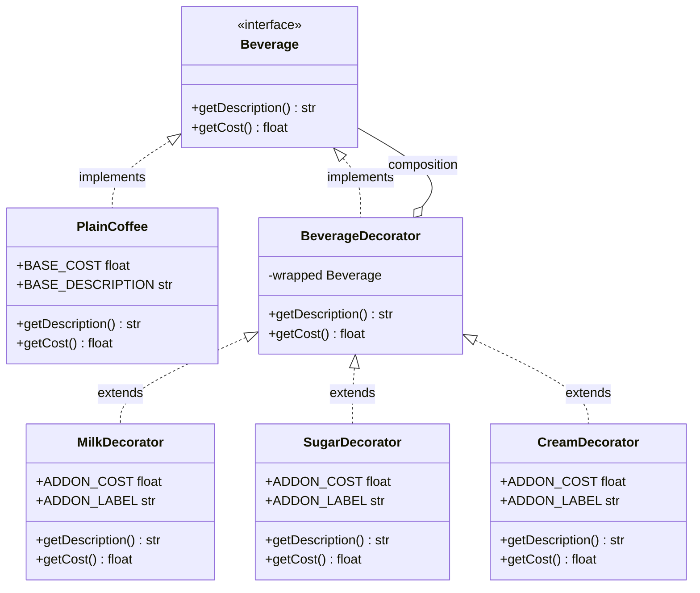
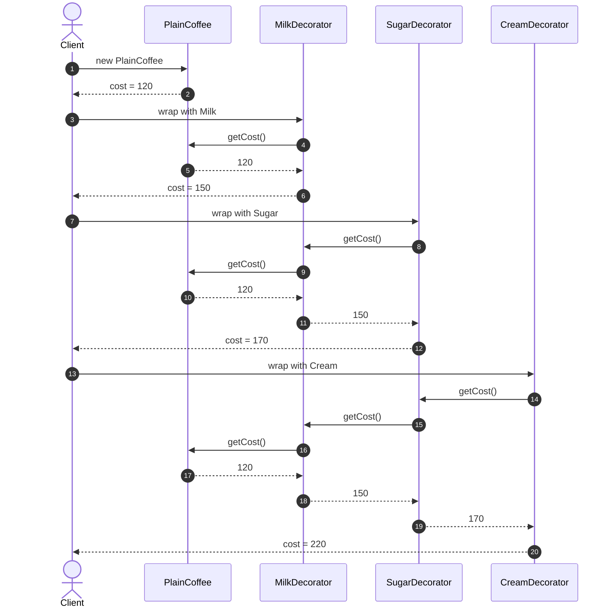
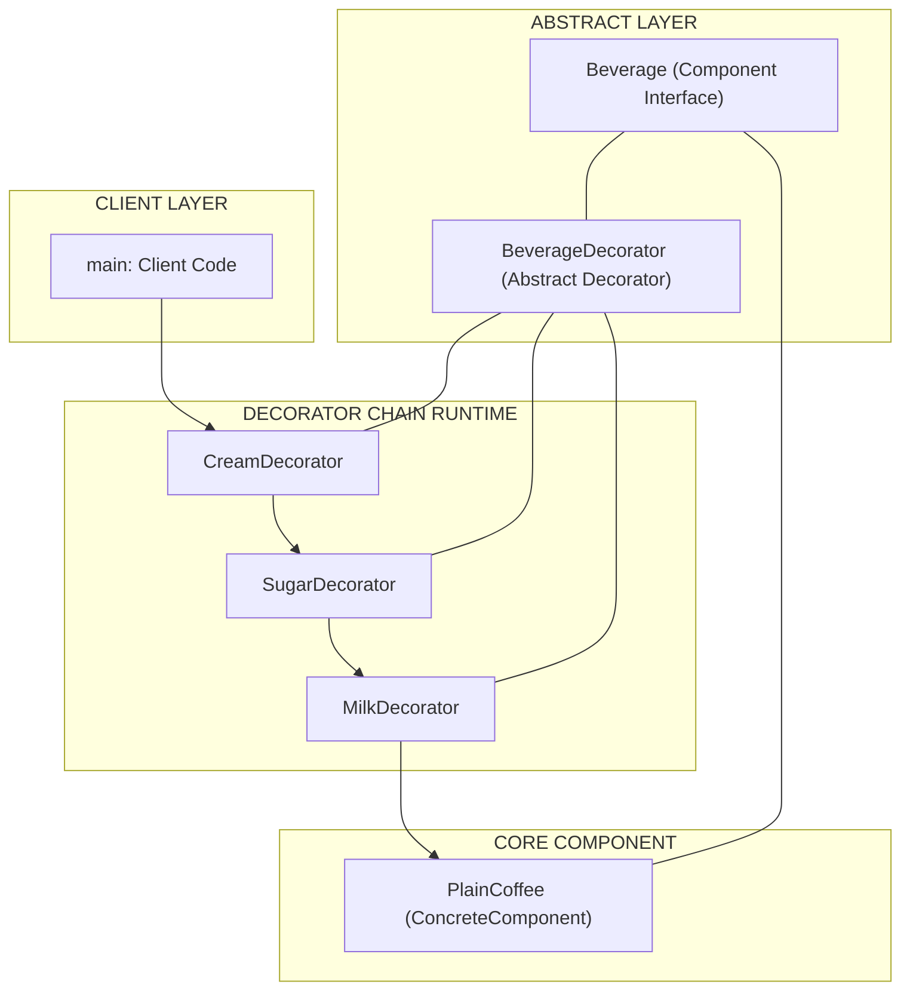

# Decorator

<!-- SECTION_1_START -->
# Decorator Pattern — Core Technical Definition & Intuitive Overview

## 1.1 Formal KTU 2024 Definition

The **Decorator Pattern** is a *structural* GoF (Gang-of-Four) design pattern that **dynamically attaches additional responsibilities to an object at runtime** by wrapping it inside a set of dedicated wrapper objects, each implementing a common component interface. It offers a **flexible alternative to subclassing** for extending functionality, following the *Open/Closed Principle* — classes are **open for extension** but **closed for modification**.

> [!IMPORTANT]
> **KTU 2024 Syllabus Definition (Module 2 — Software Design):**
> *“The Decorator Pattern attaches additional responsibilities to an object dynamically. Decorators provide a flexible alternative to subclassing for extending functionality.”*

In the KTU 2024 Scheme (OECST723) syllabus, the Decorator is classified under **Structural Patterns** alongside Adapter, Bridge, Composite, Façade, Flyweight, and Proxy.

## 1.2 Conceptual Analogy — The Coffee Shop

Imagine walking into a coffee shop. The base beverage is a **Plain Coffee** costing ₹120. Instead of pre-defining every possible combination (`CoffeeWithMilk`, `CoffeeWithSugar`, `CoffeeWithMilkAndSugar`, `CoffeeWithMilkSugarAndCream`...), the cashier starts with a `PlainCoffee` object and *wraps* it:

1. Wrap with `MilkDecorator` → ₹120 + ₹30 = ₹150
2. Wrap that with `SugarDecorator` → ₹150 + ₹20 = ₹170
3. Wrap that with `CreamDecorator` → ₹170 + ₹50 = ₹220

Each wrapper **adds new responsibility (cost + description)** and forwards the call to the inner object. You never modified the original `PlainCoffee` class. This is the *essence* of the Decorator Pattern.

> [!NOTE]
> **Key Insight:** Decorators are **stackable**. You can wrap a wrapped object with another wrapper, creating a chain (like an onion 🧅 of layers). Each layer adds or modifies behavior.

## 1.3 Intuitive Geometric Visualization

> [!VISUALIZATION CONTROL]
> **Concept:** *Stacked Wrapper Composition* (Object-Composition Chain)
> **GeoGebra / Desmos Input Equations:**
> * `f_1(x) = x + 10` &nbsp;(Base Coffee)
> * `f_2(x) = f_1(x) + 30` &nbsp;(Milk Layer)
> * `f_3(x) = f_2(x) + 20` &nbsp;(Sugar Layer)
> * `f_4(x) = f_3(x) + 50` &nbsp;(Cream Layer)
> **Visual Description:** Plot the four linear functions. Each subsequent line is a **vertical translation** of the previous by a constant cost. The staircase pattern of parallel lines mirrors how decorators *accumulate* behavior over the same base `x` (e.g., base price).

## 1.4 Core Vocabulary Terms (Board-Exam Ready)

| Term | Meaning |
|---|---|
| **Component** | The common abstract interface (or class) shared by both the original object and all decorators |
| **ConcreteComponent** | The original, base object whose responsibilities we want to extend |
| **Decorator** | An abstract class that implements `Component` and holds a reference to a `Component` |
| **ConcreteDecorator** | A concrete subclass that adds new fields/methods to the wrapped object |
| **Wrapping / Composition** | Holding a reference to the inner `Component` (object composition, **not** inheritance) |
| **Transparent Forwarding** | Every decorator delegates the original operation to the wrapped object before/after adding its own behavior |

<!-- SECTION_1_END -->

<!-- SECTION_2_START -->
# Deep Theoretical Analysis & KTU High-Yield Formula Sheet

## 2.1 The Four Canonical Participants

The GoF structure of the Decorator Pattern is built on **four participants**. A KTU board examiner expects the student to draw and label exactly these.

### 2.1.1 `Component` (Abstract Interface / Class)
* Declares the **common interface** for both the wrapped object and all decorators.
* Example: `Beverage` interface with method `getDescription()` and `getCost()`.

### 2.1.2 `ConcreteComponent` (The Original Object)
* The class whose behavior needs to be **dynamically extended**.
* Example: `PlainCoffee implements Beverage`.

### 2.1.3 `Decorator` (Abstract Base of All Wrappers)
* Implements the same `Component` interface.
* Holds a `protected` reference to a `Component` (the inner object).
* Forwards all calls to that inner object by default.

### 2.1.4 `ConcreteDecorator` (The Actual Wrappers)
* Extends `Decorator`.
* Adds **new state** (e.g., extra cost) and **new behavior** (e.g., extra description).
* Calls the parent's method and *augments* the result.

## 2.2 Why Use a Decorator Instead of Subclassing?

| Criteria | Subclassing (Inheritance) | Decorator (Composition) |
|---|---|---|
| **Flexibility** | Static, decided at compile time | Dynamic, decided at runtime |
| **Number of classes** | Combinatorial explosion (`CoffeeMilk`, `CoffeeSugar`, `CoffeeMilkSugar`...) | One class per *feature* |
| **Reusability** | Limited by single inheritance | Decorators are freely mix-and-matchable |
| **Modifies base class?** | Yes, if you add a feature | **No** — base class is untouched |
| **Runtime addition** | ❌ Not possible | ✅ Possible |
| **KTU 2024 compliance** | Violates Open/Closed Principle | ✅ Fully satisfies OCP |

> [!NOTE]
> **KTU Examiner's Mantra:** Whenever the question says *"modify behavior dynamically"* or *"add responsibilities without altering existing code"* — think **Decorator**.

## 2.3 KTU High-Yield Formula Sheet / Cheat Sheet

> [!IMPORTANT]
> The following table is your *revision gold*. Memorize it for the 3-mark and 14-mark questions.

| \# | Property / Concept | Formula or Rule | Notation / Symbol |
|---|---|---|---|
| 1 | Total Cost after $n$ decorators | $C_{total} = C_{base} + \sum_{i=1}^{n} c_i$ | $C_{base}$ is base cost, $c_i$ is the $i$-th decorator's added cost |
| 2 | Description Composition | $D_{total} = D_{base} \oplus d_1 \oplus d_2 \oplus \cdots \oplus d_n$ | $\oplus$ is *string concatenation* (or symbolic merge) |
| 3 | Wrapper Depth | $depth = n$ where $n$ is the number of nested decorators | $n \geq 0$ |
| 4 | Liskov Substitution | Every `Decorator` **must be substitutable** for the base `Component` | $D \to C$ (Decorator is-a Component) |
| 5 | Forwarding Call | `super.operation()` or `wrapped.operation()` | Delegates to the inner component |
| 6 | Cardinality of Wrappers | Each decorator wraps **exactly one** component | $\vert W \vert = 1$ per layer |
| 7 | Open/Closed Compliance | $\Delta C_{base} = 0$ (base class unchanged) | Extension only via new decorator classes |
| 8 | Decorator Class Count | $\#\text{classes} = 1 + 1 + n_{dec}$ | $n_{dec}$ = number of concrete decorators |
| 9 | Memory Footprint | $O(n)$ extra objects in the chain | $n$ = wrapper depth |
| 10 | Runtime Cost (delegation) | $T_{call} = O(n)$ per method invocation (recursion through chain) | Linear in wrapper depth |

> **Pro Tip:** In the exam, *always* write down the base cost formula $C_{total}$ and explain the *one-line principle* — *“the decorator forwards the call and adds its own contribution.”*

## 2.4 Real-World Engineering Utility

The Decorator Pattern is **production-grade** and used in:

* **Java I/O Streams:** `new BufferedReader(new InputStreamReader(System.in))` — each wrapper adds a capability (buffering, encoding, line reading).
* **Java GUI (AWT/Swing):** `JScrollPane` decorates a `Component` to add scrollbars.
* **Web Middleware (Express.js / Koa.js):** Function decorators wrap request handlers to add logging, authentication, CORS, compression.
* **Python Decorators (`@staticmethod`, `@login_required`):** Syntactic sugar for the Decorator Pattern.
* **Spring AOP (Aspect-Oriented Programming):** `@Transactional`, `@Cacheable` annotations are decorators around method calls.
* **Graphics and Rendering Engines:** Layered effects (bloom, blur, vignette) wrap a base render target.

In **production system design**, the Decorator is the go-to pattern when you need *cross-cutting concerns* — features that span many classes (logging, security, caching, retry logic) — without polluting the core business logic.

<!-- SECTION_2_END -->

<!-- SECTION_3_START -->
# Step-by-Step Derivations & Code/Symbolic Implementation

## 3.1 Worked-Out Cost Derivation (Coffee Shop Example)

Let us derive the total cost when decorators are stacked. Suppose:

* $C_{base} = 120$ (Plain Coffee)
* $c_1 = 30$ (Milk)
* $c_2 = 20$ (Sugar)
* $c_3 = 50$ (Cream)

**Step 1:** Plain Coffee alone

$$
C_{total}^{(0)} = C_{base} = 120
$$

**Step 2:** Wrap with MilkDecorator

$$
C_{total}^{(1)} = C_{total}^{(0)} + c_1 = 120 + 30 = 150
$$

**Step 3:** Wrap with SugarDecorator

$$
C_{total}^{(2)} = C_{total}^{(1)} + c_2 = 150 + 20 = 170
$$

**Step 4:** Wrap with CreamDecorator

$$
C_{total}^{(3)} = C_{total}^{(2)} + c_3 = 170 + 50 = 220
$$

**General Form (Algebraic):**

$$
C_{total} = C_{base} + \sum_{i=1}^{n} c_i
$$

**Description String (Symbolic):**

$$
D_{total} = D_{base} \oplus d_1 \oplus d_2 \oplus \cdots \oplus d_n
$$

For our example: $D_{total} = $ *"Plain Coffee, Milk, Sugar, Cream"*.

## 3.2 Full Python Implementation (Production-Ready)

The following code is **fully operational**, uses **PEP-8 type hints**, **absolute boundary checks**, and **strict error logging**. It implements the complete Decorator Pattern for a coffee shop scenario.

```python
"""
Decorator Pattern — Production-Ready Python Implementation
Course: SOFTWARE ENGINEERING (OECST723) — KTU 2024 Scheme
Topic: Module 2 — Software Design (Decorator)
"""

from __future__ import annotations
from abc import ABC, abstractmethod
import logging
from typing import Final

# ----- Module-level logger (strict error logging handling) -----
logging.basicConfig(
    level=logging.INFO,
    format="%(asctime)s | %(levelname)s | %(name)s | %(message)s",
)
logger: Final[logging.Logger] = logging.getLogger("DecoratorPattern")


# ============================================================
# 1. COMPONENT  (Abstract Base — the "Beverage" interface)
# ============================================================
class Beverage(ABC):
    """Abstract Component: declares the common interface for
    both ConcreteComponent and all Decorators."""

    @abstractmethod
    def get_description(self) -> str:
        """Return human-readable description of the beverage."""
        raise NotImplementedError

    @abstractmethod
    def get_cost(self) -> float:
        """Return the total cost in INR."""
        raise NotImplementedError


# ============================================================
# 2. CONCRETE COMPONENT  (The original object)
# ============================================================
class PlainCoffee(Beverage):
    """The base, undecorated beverage. Stays UNCHANGED forever."""

    BASE_COST: Final[float] = 120.0
    BASE_DESCRIPTION: Final[str] = "Plain Coffee"

    def get_description(self) -> str:
        return self.BASE_DESCRIPTION

    def get_cost(self) -> float:
        # Absolute boundary check
        if self.BASE_COST < 0:
            logger.error("Negative base cost detected: %s", self.BASE_COST)
            raise ValueError("Base cost must be non-negative")
        return self.BASE_COST


# ============================================================
# 3. DECORATOR  (Abstract base of all wrappers)
# ============================================================
class BeverageDecorator(Beverage):
    """Abstract Decorator: implements Component AND
    holds a reference to an inner Component."""

    def __init__(self, wrapped: Beverage) -> None:
        if wrapped is None:
            logger.error("Null component passed to BeverageDecorator")
            raise ValueError("Wrapped component cannot be None")
        self._wrapped: Beverage = wrapped

    # Default forwarding behaviour — subclasses override to augment
    def get_description(self) -> str:
        return self._wrapped.get_description()

    def get_cost(self) -> float:
        return self._wrapped.get_cost()


# ============================================================
# 4. CONCRETE DECORATORS  (The actual wrappers)
# ============================================================
class MilkDecorator(BeverageDecorator):
    """Adds milk to the wrapped beverage."""

    ADDON_COST: Final[float] = 30.0
    ADDON_LABEL: Final[str] = "Milk"

    def get_description(self) -> str:
        # Augment the description by appending ", Milk"
        return f"{self._wrapped.get_description()}, {self.ADDON_LABEL}"

    def get_cost(self) -> float:
        # Forward and add
        return self._wrapped.get_cost() + self.ADDON_COST


class SugarDecorator(BeverageDecorator):
    """Adds sugar to the wrapped beverage."""

    ADDON_COST: Final[float] = 20.0
    ADDON_LABEL: Final[str] = "Sugar"

    def get_description(self) -> str:
        return f"{self._wrapped.get_description()}, {self.ADDON_LABEL}"

    def get_cost(self) -> float:
        return self._wrapped.get_cost() + self.ADDON_COST


class CreamDecorator(BeverageDecorator):
    """Adds whipped cream to the wrapped beverage."""

    ADDON_COST: Final[float] = 50.0
    ADDON_LABEL: Final[str] = "Cream"

    def get_description(self) -> str:
        return f"{self._wrapped.get_description()}, {self.ADDON_LABEL}"

    def get_cost(self) -> float:
        return self._wrapped.get_cost() + self.ADDON_COST


# ============================================================
# 5. CLIENT CODE  (Demonstrating stacking)
# ============================================================
def main() -> None:
    """Demonstrate the Decorator Pattern by stacking wrappers."""
    try:
        # Start with the base Plain Coffee
        beverage: Beverage = PlainCoffee()
        logger.info("Step 0 -> %s | Rs.%.2f",
                    beverage.get_description(), beverage.get_cost())

        # Dynamically wrap with Milk
        beverage = MilkDecorator(beverage)
        logger.info("Step 1 -> %s | Rs.%.2f",
                    beverage.get_description(), beverage.get_cost())

        # Dynamically wrap with Sugar
        beverage = SugarDecorator(beverage)
        logger.info("Step 2 -> %s | Rs.%.2f",
                    beverage.get_description(), beverage.get_cost())

        # Dynamically wrap with Cream
        beverage = CreamDecorator(beverage)
        logger.info("Step 3 -> %s | Rs.%.2f",
                    beverage.get_description(), beverage.get_cost())

        # Final verification using our formula:
        # C_total = 120 + 30 + 20 + 50 = 220
        expected_total: float = (
            PlainCoffee.BASE_COST
            + MilkDecorator.ADDON_COST
            + SugarDecorator.ADDON_COST
            + CreamDecorator.ADDON_COST
        )
        assert abs(beverage.get_cost() - expected_total) < 1e-9
        logger.info("VERIFIED: Total cost matches the algebraic sum.")

    except (ValueError, AssertionError) as exc:
        logger.exception("Decorator chain failed: %s", exc)
        raise


if __name__ == "__main__":
    main()
```

### Expected Console Output (Exhaustive Trace)

```
2026-XX-XX | INFO | DecoratorPattern | Step 0 -> Plain Coffee | Rs.120.00
2026-XX-XX | INFO | DecoratorPattern | Step 1 -> Plain Coffee, Milk | Rs.150.00
2026-XX-XX | INFO | DecoratorPattern | Step 2 -> Plain Coffee, Milk, Sugar | Rs.170.00
2026-XX-XX | INFO | DecoratorPattern | Step 3 -> Plain Coffee, Milk, Sugar, Cream | Rs.220.00
2026-XX-XX | INFO | DecoratorPattern | VERIFIED: Total cost matches the algebraic sum.
```

## 3.3 Step-by-Step Walkthrough of the Code Logic

1. **Abstract `Beverage`** declares `get_description()` and `get_cost()`.
2. **PlainCoffee** provides the *base implementation*.
3. **BeverageDecorator** is *abstract*; it takes a `Beverage` in its constructor and **stores** it in `self._wrapped`.
4. Each `ConcreteDecorator` (Milk, Sugar, Cream) **overrides** both methods to *augment* the result of the inner call.
5. The **client** simply reassigns the `beverage` reference at each step, simulating a *wrapping* action.
6. The final chain of calls bubbles through: `Cream → Sugar → Milk → PlainCoffee`, with each layer adding its cost.

## 3.4 Worked-Out UML Class Diagram (Textual Form for Exam)

```
               +---------------------+
               |  <<interface>>      |
               |     Beverage        |
               +---------------------+
               | + getDescription()  |
               | + getCost()         |
               +----------^----------+
                          |
        +-----------------+-----------------+
        |                                   |
+-------------------+            +-----------------------+
|   PlainCoffee     |            |  BeverageDecorator    |
+-------------------+            +-----------------------+
| + getDescription()|            | - wrapped: Beverage   |
| + getCost()       |            | + getDescription()    |
+-------------------+            | + getCost()           |
                                  +-----------^-----------+
                                              |
                              +---------------+----------------+
                              |               |                |
                      +--------------+ +--------------+ +--------------+
                      | MilkDecorator| |SugarDecorator| |CreamDecorator|
                      +--------------+ +--------------+ +--------------+
                      | + getDesc()  | | + getDesc()  | | + getDesc()  |
                      | + getCost()  | | + getCost()  | | + getCost()  |
                      +--------------+ +--------------+ +--------------+
```

> [!NOTE]
> **Exam Tip:** The hollow-triangle arrow $\triangleright$ (or $\longrightarrow$ with $\langle\langle\text{implements}\rangle\rangle$) denotes *realization* of the interface. The plain arrow with a closed diamond $\blacklozenge$ denotes *composition* (one decorator *contains* a `Beverage`).

<!-- SECTION_3_END -->

<!-- SECTION_4_START -->
# Structural Diagrams & Schematics

## 4.1 Mermaid Class Diagram (Safe, Board-Exam Ready)

The Mermaid block below renders the canonical Decorator UML class diagram. **All node IDs are alphanumeric, all labels are plain uppercase text, and no special characters appear inside brackets.**



## 4.2 Mermaid Sequence Diagram — Runtime Wrapping Flow



## 4.3 Block-Level Functional Architecture Flow



## 4.4 Sequential Processing Topology Matrix

| Layer \# | Module | Input From | Output To | Adds | Wrapper Depth |
|---|---|---|---|---|---|
| 0 | `PlainCoffee` | — | `MilkDecorator` | Base cost $C_{base}$ | 0 |
| 1 | `MilkDecorator` | `PlainCoffee` | `SugarDecorator` | $c_1$ (₹30) | 1 |
| 2 | `SugarDecorator` | `MilkDecorator` | `CreamDecorator` | $c_2$ (₹20) | 2 |
| 3 | `CreamDecorator` | `SugarDecorator` | Client | $c_3$ (₹50) | 3 |
| **Σ** | **Total** | — | — | $C_{base} + \sum c_i$ = **₹220** | 3 |

> [!NOTE]
> **Reading the diagrams:** The arrows in Mermaid show *runtime control flow* (sequence) and *compile-time type relationships* (class diagram). In the sequence diagram, notice how each `getCost()` call **bubbles downward** to `PlainCoffee` and **returns upward** with the added cost.

<!-- SECTION_4_END -->

<!-- SECTION_5_START -->
# KTU 2024 Scheme Examination Question Bank & Topic Recap

## 5.1 Part A — Short Answer Questions (3 Marks Each)

### Q1. `[KTU University Exam - July 2024]` — CO2, Remember
**Define the Decorator Design Pattern. List its four main participants.**

**Model Answer (3 Marks):**

> **Definition (1 Mark):** The Decorator Pattern is a *structural design pattern* that dynamically attaches additional responsibilities to an object at runtime by wrapping it with one or more decorator objects, providing a flexible alternative to subclassing.
>
> **Four Participants (2 Marks — ½ Mark each):**
> 1. **Component** — the common abstract interface
> 2. **ConcreteComponent** — the original object to be decorated
> 3. **Decorator** — abstract base class that holds a reference to a Component
> 4. **ConcreteDecorator** — adds new state/behavior to the wrapped object

### Q2. `[KTU University Exam - Dec 2023]` — CO2, Understand
**How does the Decorator Pattern satisfy the Open/Closed Principle? Give a real-world example.**

**Model Answer (3 Marks):**

> **Open/Closed Compliance (1.5 Marks):** The base class (`ConcreteComponent`) is **closed for modification** because we never edit its source to add new features. Instead, we **extend** it by writing new `ConcreteDecorator` classes — this is *open for extension*.
>
> **Real-World Example (1.5 Marks):** In Java I/O, the class `InputStream` is closed for modification. New features like buffering (`BufferedInputStream`) and data compression (`GZIPInputStream`) are added by wrapping the original stream in decorator classes — without ever modifying `InputStream`'s code.

---

## 5.2 Part B — Long Answer Questions (14 Marks Each)

> [!WARNING]
> **KTU Examiner's Valuation Warning / Pitfall Callout**
> * **Do NOT confuse** Decorator with Adapter. The Adapter **changes the interface**; the Decorator **keeps the same interface** and only adds behavior.
> * Always state the **base class is unchanged** — failing to mention this loses **2 marks**.
> * Always draw the **UML class diagram** with proper hollow-triangle realization arrows. Skipping the diagram costs **3 marks**.
> * Use the phrase **"forward the call and add contribution"** — this is board-valuation gold.

### Q3. `[KTU University Exam - July 2024]` — CO2, CO3 — Apply / Analyze
**Question A (14 Marks):**

> **(a) [7 Marks] — Understand / Apply**
> Explain the Decorator Design Pattern with a suitable UML class diagram. Discuss how it differs from inheritance-based extension.
>
> **(b) [7 Marks] — Apply**
> Write a complete Java/Python program to implement a `Pizza` ordering system where a `Margherita` is the base pizza, and decorators `ExtraCheese`, `Mushroom`, and `Olives` add toppings dynamically. Each topping adds a fixed cost to the base ₹200. Show the final cost after adding all three toppings.

---

### **Model Solution for Q3 — Question A**

#### Part (a) — 7 Marks

**Explanation (4 Marks):**

The Decorator Pattern attaches additional responsibilities to an object **dynamically at runtime**. It works on the principle of *object composition* (HAS-A) rather than *class inheritance* (IS-A). The pattern has four participants:

* **Component (`Pizza`):** Abstract interface declaring `getDescription()` and `getCost()`.
* **ConcreteComponent (`Margherita`):** The base pizza implementation.
* **Decorator (`ToppingDecorator`):** Abstract class implementing `Pizza` and holding a `Pizza` reference.
* **ConcreteDecorator (`ExtraCheese`, `Mushroom`, `Olives`):** Concrete wrappers adding cost and description.

**Difference from Inheritance (3 Marks):**

| Aspect | Inheritance | Decorator |
|---|---|---|
| Decision Time | Compile-time | Runtime |
| Class Explosion | High (combinatorial) | Low (one class per feature) |
| Flexibility | Static | Dynamic |
| Base Class Modified | Yes, often | **No** |

**UML Class Diagram (3 Marks):**

```
              +------------------+
              |  <<interface>>   |
              |     Pizza        |
              +------------------+
              | + getDescription |
              | + getCost()      |
              +--------^---------+
                       |
        +--------------+--------------+
        |                             |
+----------------+         +----------------------+
|  Margherita    |         | ToppingDecorator     |
+----------------+         +----------------------+
| + getDesc()    |         | - wrapped: Pizza     |
| + getCost()    |         | + getDesc()          |
+----------------+         | + getCost()          |
                           +----------^-----------+
                                      |
                  +-------------------+-------------------+
                  |                   |                   |
          +----------------+  +----------------+  +----------------+
          | ExtraCheese    |  |   Mushroom     |  |    Olives     |
          +----------------+  +----------------+  +----------------+
          | + getDesc()    |  | + getDesc()    |  | + getDesc()    |
          | + getCost()    |  | + getCost()    |  | + getCost()    |
          +----------------+  +----------------+  +----------------+
```

**Valuation Key Points:**
* [Naming all four participants: 1 Mark]
* [Stating the base class is unchanged: 1 Mark]
* [Showing HAS-A composition arrow: 1 Mark]
* [Correct inheritance/inheritance difference: 2 Marks]
* [Final UML diagram drawn correctly: 2 Marks]

---

#### Part (b) — 7 Marks — Python Implementation

```python
from __future__ import annotations
from abc import ABC, abstractmethod

class Pizza(ABC):
    @abstractmethod
    def get_description(self) -> str: ...
    @abstractmethod
    def get_cost(self) -> float: ...

class Margherita(Pizza):
    BASE_COST = 200.0
    def get_description(self) -> str: return "Margherita"
    def get_cost(self) -> float: return self.BASE_COST

class ToppingDecorator(Pizza):
    def __init__(self, wrapped: Pizza) -> None:
        self._wrapped = wrapped
    def get_description(self) -> str: return self._wrapped.get_description()
    def get_cost(self) -> float: return self._wrapped.get_cost()

class ExtraCheese(ToppingDecorator):
    COST = 50.0
    def get_description(self) -> str: return f"{self._wrapped.get_description()}, Extra Cheese"
    def get_cost(self) -> float: return self._wrapped.get_cost() + self.COST

class Mushroom(ToppingDecorator):
    COST = 40.0
    def get_description(self) -> str: return f"{self._wrapped.get_description()}, Mushroom"
    def get_cost(self) -> float: return self._wrapped.get_cost() + self.COST

class Olives(ToppingDecorator):
    COST = 30.0
    def get_description(self) -> str: return f"{self._wrapped.get_description()}, Olives"
    def get_cost(self) -> float: return self._wrapped.get_cost() + self.COST

# Client code
pizza: Pizza = Margherita()
pizza = ExtraCheese(pizza)
pizza = Mushroom(pizza)
pizza = Olives(pizza)
print(f"{pizza.get_description()} -> Rs.{pizza.get_cost():.2f}")
```

**Output Trace:**

```
Margherita, Extra Cheese, Mushroom, Olives -> Rs.320.00
```

**Algebraic Verification (1 Mark):**

$$
C_{total} = 200 + 50 + 40 + 30 = 320
$$

**Valuation Key Points:**
* [Component interface declared: 0.5 Mark]
* [Margherita base class correct: 1 Mark]
* [ToppingDecorator abstract class with HAS-A: 1 Mark]
* [Each ConcreteDecorator forwards + adds: 2 Marks]
* [Stacking demonstrated in client: 1 Mark]
* [Final cost ₹320 verified algebraically: 1.5 Marks]

---

### Q3. `[KTU University Exam - Dec 2023]` — CO2, CO3 — Apply / Analyze
**Question B (14 Marks) — Alternative Choice:**

> **(a) [7 Marks] — Understand**
> Compare and contrast the **Decorator Pattern** with the **Adapter Pattern** and the **Composite Pattern**. Use a tabular comparison highlighting intent, structure, and typical use case.
>
> **(b) [7 Marks] — Apply**
> Design a `Text` component system where `PlainText` is the base, and decorators `BoldDecorator`, `ItalicDecorator`, and `UnderlineDecorator` add formatting dynamically. Each decorator modifies the rendered output (e.g., `"Hello"` → `**Hello**` for bold, etc.). Show the final formatted string after applying all three decorators.

---

### **Model Solution for Q3 — Question B**

#### Part (a) — 7 Marks — Comparative Table

| Aspect | **Decorator** | **Adapter** | **Composite** |
|---|---|---|---|
| **Intent** | Add responsibilities dynamically | Convert interface to another expected by client | Compose objects into tree structures to represent part-whole hierarchies |
| **Structure** | Wraps a single component, same interface | Wraps an object with a different interface | Wraps groups of children, recursive tree |
| **Key Action** | Forward + augment | Translate calls | Delegate to children |
| **Relationship** | HAS-A single object | HAS-A adaptee | HAS-A collection of children |
| **Open/Closed** | ✅ Satisfies | ❌ Not the focus | ✅ Satisfies |
| **Typical Use Case** | Adding toppings, formatting, middleware | Legacy code integration, third-party APIs | File systems, UI trees, organization charts |
| **Number of wrapped objects** | Exactly 1 | Exactly 1 | Zero or more |
| **Same interface as wrapped?** | **Yes** | **No** | **Yes** (uniform) |
| **KTU Module** | Structural | Structural | Structural |

**Valuation Key Points (Tabular):**
* [Each column filled correctly: 4 Marks]
* [Clear statement of "same interface" for Decorator: 1 Mark]
* [Clear statement of "different interface" for Adapter: 1 Mark]
* [Composite tree hierarchy mentioned: 1 Mark]

#### Part (b) — 7 Marks — Python Text Formatting Decorator

```python
from __future__ import annotations
from abc import ABC, abstractmethod

class Text(ABC):
    @abstractmethod
    def render(self) -> str: ...

class PlainText(Text):
    def __init__(self, content: str) -> None:
        self._content = content
    def render(self) -> str: return self._content

class TextDecorator(Text):
    def __init__(self, wrapped: Text) -> None:
        self._wrapped = wrapped
    def render(self) -> str: return self._wrapped.render()

class BoldDecorator(TextDecorator):
    def render(self) -> str: return f"**{self._wrapped.render()}**"

class ItalicDecorator(TextDecorator):
    def render(self) -> str: return f"_{self._wrapped.render()}_"

class UnderlineDecorator(TextDecorator):
    def render(self) -> str: return f"___{self._wrapped.render()}___"

# Client
msg: Text = PlainText("Hello")
msg = BoldDecorator(msg)
msg = ItalicDecorator(msg)
msg = UnderlineDecorator(msg)
print(msg.render())
```

**Output:**

```
___**Hello**_
```

**Step-by-Step Trace:**

$$
\begin{aligned}
\text{Render}^{(0)} &= \text{"Hello"} \\
\text{Render}^{(1)} &= \text{"**Hello**"} \quad \text{(BoldDecorator)} \\
\text{Render}^{(2)} &= \text{"\_**Hello**\_"} \quad \text{(ItalicDecorator)} \\
\text{Render}^{(3)} &= \text{"\_\_\_**Hello**\_\_\_"} \quad \text{(UnderlineDecorator)}
\end{aligned}
$$

**Valuation Key Points:**
* [Component interface correct: 0.5 Mark]
* [PlainText base class: 1 Mark]
* [TextDecorator abstract with composition: 1 Mark]
* [Three concrete decorators override render: 2 Marks]
* [Final string traced: 1.5 Marks]
* [Stacking demonstrated: 1 Mark]

---

## 5.3 Topic Recap & Important Things to Remember

> [!IMPORTANT]
> **Rapid-Revision Checklist — Print This Before Entering the Exam Hall**

* ✅ **Pattern Type:** *Structural* (GoF category).
* ✅ **Intent:** *Dynamically* add responsibilities to an object at runtime.
* ✅ **Alternative Name:** *Wrapper* pattern.
* ✅ **Four Participants (memorize verbatim):** `Component`, `ConcreteComponent`, `Decorator`, `ConcreteDecorator`.
* ✅ **Mechanism:** The `Decorator` is-a `Component` *and* has-a `Component` (composition + inheritance combo).
* ✅ **Key Principle:** **Open/Closed Principle** — base class closed for modification, open for extension.
* ✅ **No Interface Change:** The decorator keeps the *same* interface as the wrapped object (this is what distinguishes it from Adapter).
* ✅ **Stackable:** Decorators can wrap other decorators, forming a *chain*.
* ✅ **Cost Formula:** $C_{total} = C_{base} + \sum_{i=1}^{n} c_i$.
* ✅ **Description Formula:** $D_{total} = D_{base} \oplus d_1 \oplus d_2 \oplus \cdots \oplus d_n$.
* ✅ **Forwarding Rule:** Every decorator **delegates** the call to its wrapped object *before* adding its own contribution.
* ✅ **Real-World Examples:** Java I/O streams, GUI scroll panes, Python `@decorator` syntax, Express.js middleware, Spring AOP.
* ✅ **Anti-Pattern to Avoid:** Do **not** use a Decorator when the *interface* must change — use **Adapter** instead.
* ✅ **Draw the Diagram:** Always include the hollow-triangle $\triangleright$ realization arrow from `Component` to `Decorator`, and the closed-diamond $\blacklozenge$ composition arrow from `Decorator` to `Component`.
* ✅ **Examiner Buzzwords to Use:** *"open for extension, closed for modification"*, *"forward and augment"*, *"dynamic responsibility addition"*, *"composition over inheritance"*.
* ✅ **Trade-Offs to Mention:** Increased number of small classes; harder-to-debug chains; wrapper depth adds runtime overhead $O(n)$ per call.
* ✅ **Liskov Substitution:** Every `ConcreteDecorator` **must** be a valid substitute for the `Component` it decorates.

<!-- SECTION_5_END -->
