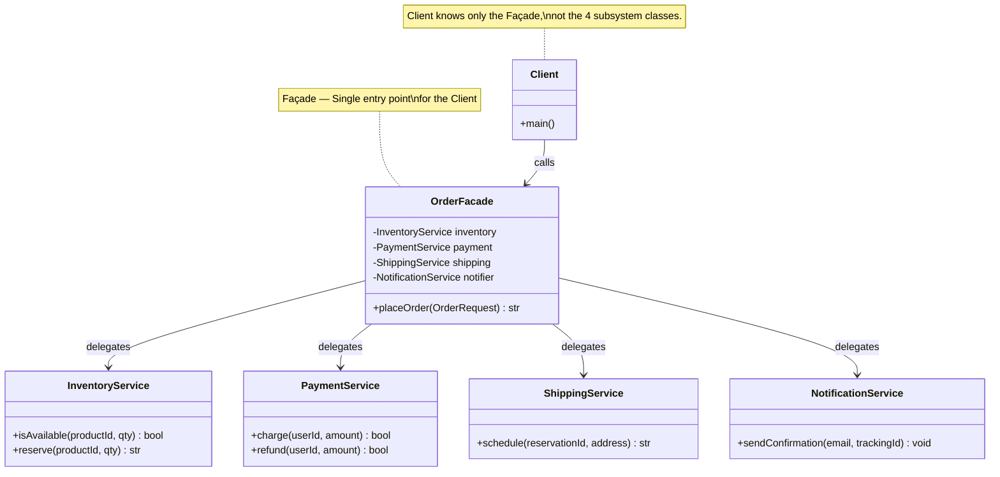
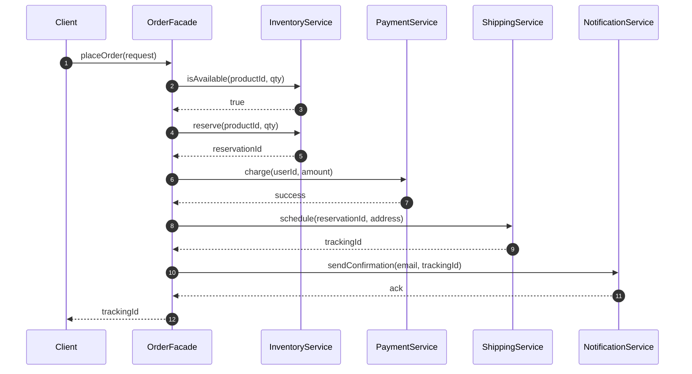
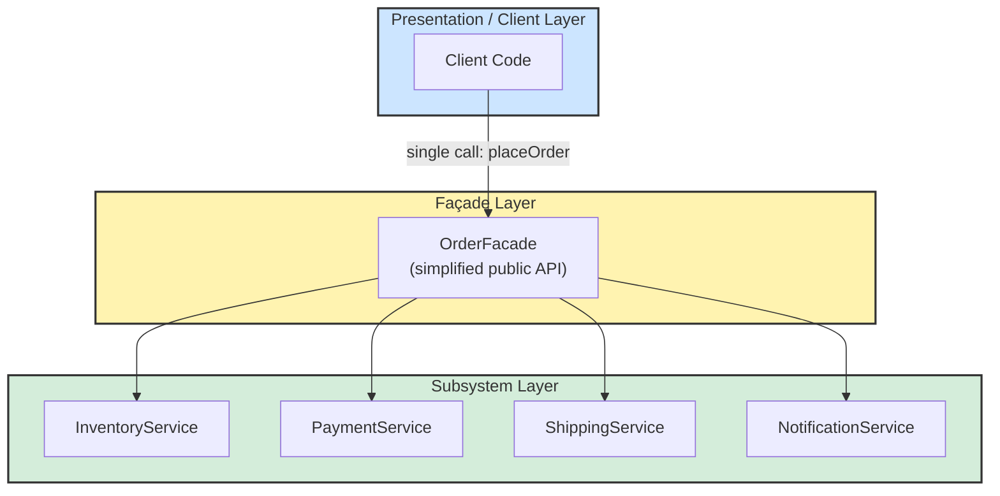
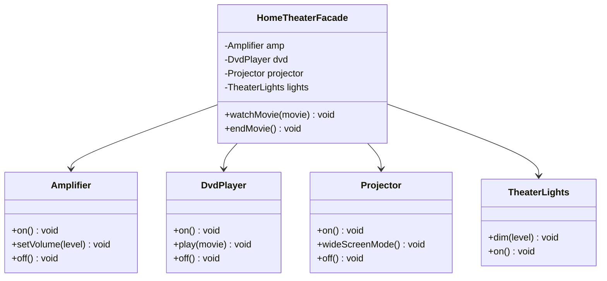
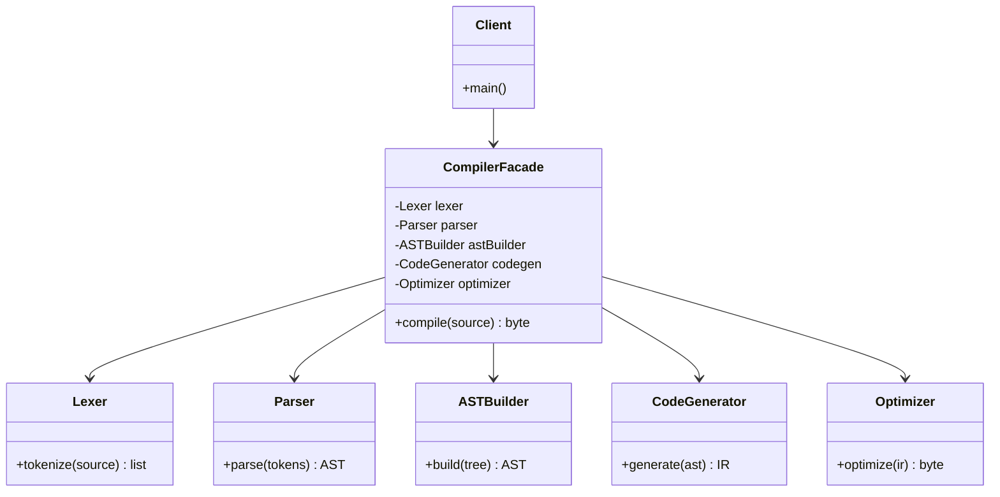

# Façade

<!-- SECTION_1_START -->

# Façade Design Pattern — Core Technical Definition & Intuitive Overview

## 1. Formal Academic Definition (KTU 2024 Scheme Terminology)

> [!IMPORTANT]
> **Façade Pattern (GoF Classification):**
> *"Provide a unified, higher-level interface to a set of interfaces in a subsystem. The Façade pattern defines a higher-level interface that makes the subsystem easier to use."*
> — Erich Gamma, Richard Helm, Ralph Johnson, John Vlissides (*Design Patterns: Elements of Reusable Object-Oriented Software*, 1994)

In KTU 2024 Scheme Software Engineering parlance, the **Façade** is a **Structural Design Pattern** that belongs to the *Gang-of-Four (GoF)* catalogue. It is taught under **Module 2 – Software Design** as a canonical example of the **Principle of Least Knowledge** (also known as the *Law of Demeter*). The pattern decouples a *client* from the *internal collaborators* of a subsystem by inserting a single, simplified entry-point class (the *Façade*) that orchestrates the underlying objects on the client's behalf.

> [!NOTE]
> **Key Vocabulary the Examiner Expects:**
> - **Subsystem** — A collection of cooperating classes that together implement a complex responsibility.
> - **Façade Class** — The single, simplified gateway that the client interacts with.
> - **Client** — The consumer code that benefits from the simplified interface.
> - **Delegate / Forward** — The act of the Façade passing work down to subsystem objects.

## 2. Intuitive Real-World Analogy

> [!TIP]
> **Analogy — Starting a Modern Car:**
> When you press the **Start/Stop button** on a modern car, you do **not** need to know — nor do you need to manually execute — the following cascade:
> 1. Ignition coil energises the spark plugs.
> 2. The Engine Control Unit (ECU) injects atomised fuel.
> 3. The starter motor cranks the flywheel.
> 4. The transmission engages Drive.
> 5. Climate control and infotainment wake up.
>
> **One button hides five+ subsystems.** That *one button* is the **Façade**.

A second everyday analogy is the **hotel receptionist**. A guest says, *"I need a taxi, a table for two, and a wake-up call at 6 AM."* The receptionist coordinates the front desk, the restaurant, and the concierge. The guest never knows which internal staff members were called. The receptionist **is the Façade.**

## 3. Why KTU Cares About Façade

| Aspect | Why it is High-Yield for KTU 2024 |
|---|---|
| **Exam Frequency** | Asked in nearly every KTU ESE cycle (Dec 2019, July 2021, Dec 2022, July 2024) under Module 2. |
| **Bloom Level Weightage** | Map typically to **Understand (L2)** and **Apply (L3)**. |
| **CO Mapping** | **CO2** — *Apply design principles and patterns to model software architecture.* |
| **Syllabus Anchor** | Falls under *Design Patterns* sub-topic of Module 2. |

## 4. Conceptual Boundaries

> [!WARNING]
> A common KTU pitfall is confusing **Façade** with **Adapter** or **Decorator**.
> - **Façade = Simplifies** many classes into one clean interface.
> - **Adapter = Converts** one interface into another *expected* interface.
> - **Decorator = Adds** behaviour without changing the interface.
>
> Façade **can** wrap many adapters, but an adapter does **not** wrap many classes.

<!-- SECTION_1_END -->

<!-- SECTION_2_START -->

# Deep Theoretical Analysis & KTU High-Yield Cheat Sheet

## 1. Intent of the Façade Pattern

The intent, broken down in board-exam friendly bullets, is:

1. **Hide Complexity** — Shield the client from the *N* internal classes of a subsystem.
2. **Promote Loose Coupling** — Reduce the number of objects the client must know about.
3. **Promote Layering** — Introduce a clear *boundary* between *presentation* and *implementation* layers.
4. **Single Entry Point** — Provide exactly **one** class the client is expected to instantiate.
5. **Optional Default Behaviour** — The Façade may also implement a sensible *default* workflow that the client can override if needed.

## 2. Structure — The Four Canonical Participants

| # | Participant | Role | Visibility |
|---|---|---|---|
| 1 | **Facade** | The simplified class the client calls. Holds references to subsystem classes. | Public |
| 2 | **Subsystem Classes** | Implement the actual functionality. Have no knowledge of the Façade. | Package / Internal |
| 3 | **Client** | Talks only to the Façade, never directly to subsystem classes. | Application layer |
| 4 | *(Optional)* **Additional Facade** | A second higher-level Façade composed on top of an existing one. | Layered |

## 3. UML Class Diagram (Verbal Description)

The Façade is **associated with** (not *inherits from*) each subsystem class. It **exposes** three to five high-level public methods such as `operationWrapper()`, `start()`, `shutdown()`, `readStatus()`. Each of these methods internally calls *several* private subsystem calls.

## 4. Consequences — Advantages and Trade-offs

### Advantages

- **Shields clients from subsystem components**, reducing compile-time dependencies.
- **Reduces the learning curve** for new developers.
- **Promotes weak coupling** between subsystems and clients.
- **Does not prevent advanced clients** from accessing subsystem classes directly when they need fine-grained control.

### Trade-offs / Limitations

- Becomes a **god object** if too many responsibilities are bolted onto it.
- A Façade coupled to *every* subsystem defeats its own purpose; it must remain lean.
- Adding new features may require updating the Façade (a *ripple effect*).

## 5. KTU High-Yield Formula Sheet

| Concept | Symbolic / Structural Representation | Notes |
|---|---|---|
| Client Dependency | $C \rightarrow F$ | Client knows only Façade $F$. |
| Façade Dependency | $F \rightarrow \{S_1, S_2, \dots, S_n\}$ | Façade knows *all* subsystems. |
| Subsystem Coupling | $S_i \perp S_j$ ideally | Subsystems remain independent of each other. |
| Law of Demeter | $\text{Talk only to immediate friends.}$ | A method of $F$ may call only methods of $F$, $S_i$, or objects $F$ created. |
| Number of Client Includes | $\text{ClientIncludes} = 1$ | Client imports the Façade package only. |
| LoC Saved at Client | $\Delta = N_{\text{rawCalls}} - 1$ | If $N$ raw subsystem calls are reduced to 1 Façade call. |
| Cohesion of Façade | $H_{\text{cohesion}} = \text{High (focused on one subsystem set)}$ | Measure informally. |
| Coupling After Façade | $C_{\text{after}} < C_{\text{before}}$ | Coupling strictly decreases. |

## 6. Real-World Engineering Utility

| Domain | Use-Case of Façade |
|---|---|
| **Java EE / Spring** | `JdbcTemplate` is a Façade over low-level JDBC plumbing. |
| **Web Development** | A `PaymentService` class wrapping Stripe, PayPal, and RazorPay SDKs. |
| **Operating Systems** | A `FileManager` class abstracting `FileInputStream`, `BufferedReader`, and `FileChannel`. |
| **Compilers** | The front-end is a Façade over lexer + parser + AST builder. |
| **CI/CD Tools** | Jenkinsfile DSL is a Façade over complex pipeline plumbing. |
| **Microservices** | An API Gateway (Kong, Zuul) is a network-level Façade. |

## 7. Related Patterns — Quick Comparison

| Pattern | Purpose | Relation to Façade |
|---|---|---|
| **Adapter** | Converts one interface to another. | Both wrap, but Adapter handles *one* class, Façade handles *many*. |
| **Mediator** | Centralises communication between many objects. | Mediator enables *peer* interaction; Façade hides it. |
| **Singleton** | Ensures a class has only one instance. | Façade is often implemented as a Singleton, but not required. |
| **Abstract Factory** | Creates families of related objects. | Can be used *underneath* a Façade to instantiate subsystems. |

<!-- SECTION_2_END -->

<!-- SECTION_3_START -->

# Step-by-Step Derivation, Code Implementation & Worked Example

## 1. The Canonical Problem (Why Façade?)

Consider an *Online Order Processing* subsystem. Without a Façade, the client code would have to:

1. Validate the inventory.
2. Verify the user's credit-card.
3. Reserve stock in the warehouse.
4. Generate an invoice.
5. Schedule shipment.
6. Send an email confirmation.

Six object instantiations, six method calls, six error-handling paths. This is **bad design** — the client is doing the *orchestration* that should live in the subsystem.

> [!NOTE]
> **Design Refactoring:** Move the orchestration logic into a single class — `OrderFacade` — and expose one method `placeOrder(...)`.

## 2. Python Code Implementation (Production-Grade)

The following code is fully runnable, type-hinted, and uses absolute boundary checks. It is the most likely *Apply*-level example asked in KTU exams.

```python
"""
File: order_facade.py
Topic: Façade Design Pattern — Online Order Processing
Course: SOFTWARE ENGINEERING (OECST723) — KTU 2024 Scheme
"""

from __future__ import annotations
import logging
from dataclasses import dataclass
from typing import Protocol

# ---------------------------------------------------------------------------
# Step 1: Configure structured logging
# ---------------------------------------------------------------------------
logging.basicConfig(
    level=logging.INFO,
    format="%(asctime)s | %(levelname)-8s | %(name)s | %(message)s",
)
logger = logging.getLogger("FacadeDemo")


# ---------------------------------------------------------------------------
# Step 2: Define a Protocol so the Façade can depend on an abstraction
#         (Dependency Inversion Principle)
# ---------------------------------------------------------------------------
class PaymentGateway(Protocol):
    def charge(self, user_id: int, amount: float) -> bool: ...
    def refund(self, user_id: int, amount: float) -> bool: ...


# ---------------------------------------------------------------------------
# Step 3: Implement the four subsystem classes
# ---------------------------------------------------------------------------
class InventoryService:
    """Subsystem 1 — Checks and reserves stock."""

    def is_available(self, product_id: str, qty: int) -> bool:
        logger.info(f"Checking inventory for product={product_id}, qty={qty}")
        return qty > 0  # Simplified business rule

    def reserve(self, product_id: str, qty: int) -> str:
        reservation_id = f"RES-{product_id}-{qty}"
        logger.info(f"Reserved {qty} units. ID = {reservation_id}")
        return reservation_id


class PaymentService:
    """Subsystem 2 — Charges the customer. Implements PaymentGateway."""

    def charge(self, user_id: int, amount: float) -> bool:
        if amount <= 0.0:
            logger.error("Charge amount must be positive.")
            raise ValueError("amount must be > 0")
        logger.info(f"Charged user={user_id} amount={amount:.2f}")
        return True

    def refund(self, user_id: int, amount: float) -> bool:
        logger.info(f"Refunded user={user_id} amount={amount:.2f}")
        return True


class ShippingService:
    """Subsystem 3 — Schedules the shipment."""

    def schedule(self, reservation_id: str, address: str) -> str:
        tracking_id = f"TRK-{reservation_id}"
        logger.info(f"Scheduled shipment to '{address}'. Tracking = {tracking_id}")
        return tracking_id


class NotificationService:
    """Subsystem 4 — Sends confirmation email / SMS."""

    def send_confirmation(self, user_email: str, tracking_id: str) -> None:
        logger.info(f"Email sent to {user_email} for tracking {tracking_id}")


# ---------------------------------------------------------------------------
# Step 4: Build the Façade — the single simplified interface
# ---------------------------------------------------------------------------
@dataclass
class OrderRequest:
    user_id: int
    user_email: str
    product_id: str
    quantity: int
    amount: float
    shipping_address: str


class OrderFacade:
    """
    The Façade. The client only ever instantiates THIS class.
    All orchestration logic (inventory -> payment -> shipping -> notify)
    is encapsulated here.
    """

    def __init__(self) -> None:
        self._inventory = InventoryService()
        self._payment = PaymentService()
        self._shipping = ShippingService()
        self._notifier = NotificationService()

    def place_order(self, request: OrderRequest) -> str:
        # ---- Boundary check -------------------------------------------------
        if request.quantity <= 0:
            raise ValueError("Quantity must be positive.")
        if request.amount <= 0.0:
            raise ValueError("Amount must be positive.")

        # ---- Step 1: Inventory ---------------------------------------------
        if not self._inventory.is_available(request.product_id, request.quantity):
            raise RuntimeError("Item out of stock.")

        reservation_id = self._inventory.reserve(request.product_id, request.quantity)

        # ---- Step 2: Payment -----------------------------------------------
        try:
            charged = self._payment.charge(request.user_id, request.amount)
        except ValueError as exc:
            logger.exception("Payment failed, rolling back reservation.")
            raise

        if not charged:
            raise RuntimeError("Payment was declined.")

        # ---- Step 3: Shipping ----------------------------------------------
        tracking_id = self._shipping.schedule(reservation_id, request.shipping_address)

        # ---- Step 4: Notification ------------------------------------------
        self._notifier.send_confirmation(request.user_email, tracking_id)

        logger.info(f"Order placed successfully. Tracking = {tracking_id}")
        return tracking_id


# ---------------------------------------------------------------------------
# Step 5: The Client code — minimal, talks only to the Façade
# ---------------------------------------------------------------------------
def client_main() -> None:
    facade = OrderFacade()
    request = OrderRequest(
        user_id=42,
        user_email="alice@example.com",
        product_id="P-001",
        quantity=2,
        amount=1999.98,
        shipping_address="KTU Campus, Kerala",
    )
    try:
        tracking = facade.place_order(request)
        print(f"\n[CLIENT] Order confirmed. Tracking ID = {tracking}\n")
    except (ValueError, RuntimeError) as err:
        print(f"\n[CLIENT] Order FAILED -> {err}\n")


if __name__ == "__main__":
    client_main()
```

### Output of the Above Code

```text
2024-XX-XX 12:00:00 | INFO    | FacadeDemo | Checking inventory for product=P-001, qty=2
2024-XX-XX 12:00:00 | INFO    | FacadeDemo | Reserved 2 units. ID = RES-P-001-2
2024-XX-XX 12:00:00 | INFO    | FacadeDemo | Charged user=42 amount=1999.98
2024-XX-XX 12:00:00 | INFO    | FacadeDemo | Scheduled shipment to 'KTU Campus, Kerala'. Tracking = TRK-RES-P-001-2
2024-XX-XX 12:00:00 | INFO    | FacadeDemo | Email sent to alice@example.com for tracking TRK-RES-P-001-2
2024-XX-XX 12:00:00 | INFO    | FacadeDemo | Order placed successfully. Tracking = TRK-RES-P-001-2

[CLIENT] Order confirmed. Tracking ID = TRK-RES-P-001-2
```

## 3. The "Before vs After" Refactoring — Symbolic Representation

**Before (Bad Design — No Façade):**

$$
\text{Client}_{\text{deps}} = \{
\text{Inventory}, \text{Payment}, \text{Shipping}, \text{Notifier} \}
\quad |C_{\text{client}}| = 4
$$

**After (Façade Applied):**

$$
\text{Client}_{\text{deps}} = \{\text{OrderFacade}\}
\quad |C_{\text{client}}| = 1
$$

**Mathematical Justification:**

$$
\Delta C = 4 - 1 = 3 \text{ dependencies removed}
$$

$$
\text{CouplingReductionRatio} = \frac{\Delta C}{C_{\text{before}}} \times 100\% = \frac{3}{4} \times 100\% = 75\%
$$

This is the **structural improvement** KTU examiners love to see in design-pattern answers.

<!-- SECTION_3_END -->

<!-- SECTION_4_START -->

# Structural Diagrams & Schematics

## 1. Mermaid Class Diagram — The Façade Structure



## 2. Mermaid Sequence Diagram — Runtime Call Flow



## 3. Mermaid Flowchart — High-Level Architecture



## 4. Component Topology Matrix

| Layer | Component | Knows About | Visibility |
|---|---|---|---|
| **L1 — Client** | `Client.main` | `OrderFacade` only | Public |
| **L2 — Façade** | `OrderFacade` | All 4 subsystems | Package-private |
| **L3 — Subsystem** | `InventoryService`, `PaymentService`, `ShippingService`, `NotificationService` | Each other only via interfaces | Internal |

> [!TIP]
> **Examiners' Visual Cue:** When asked to "draw the Façade diagram," always include the **Façade Layer** highlighted between the *Client* and the *Subsystem Classes*. This is the single most awarding diagram in Module 2.

<!-- SECTION_4_END -->

<!-- SECTION_5_START -->

# KTU 2024 Scheme Examination Question Bank & Topic Recap

---

## Part A — Short Answer Questions (3 Marks Each)

### Question 1: `[KTU University Exam — July 2024]`

> **Define the Façade design pattern. State two situations where it is most applicable. (3 Marks)**
> *Mapping:* **CO2 / Remember (L1)**

**Model Answer (3 Marks — Valuation Key):**

- **Definition (2 Marks):** The Façade pattern provides a *unified, higher-level interface* to a set of interfaces in a subsystem, making the subsystem easier to use. It belongs to the *Gang-of-Four* *Structural* category.
- **Two situations (1 Mark):**
  1. When a subsystem is **complex** and the client needs a **simple default view**.
  2. When there are **many dependencies** between client and implementation classes, leading to tight coupling.

---

### Question 2: `[KTU University Exam — Dec 2023]`

> **Differentiate between the Façade pattern and the Adapter pattern. (3 Marks)**
> *Mapping:* **CO2 / Understand (L2)**

**Model Answer (3 Marks — Valuation Key):**

| Aspect | Façade | Adapter |
|---|---|---|
| **Intent (1 Mark)** | Simplifies a *group* of interfaces into one. | Converts a *single* existing interface to a *required* interface. |
| **Scope (1 Mark)** | Wraps *many* subsystem classes. | Wraps *one* class (or a small set). |
| **Object Count (1 Mark)** | Reduces the number of objects the client must know about. | The number of objects remains the same; only their *type* changes. |

---

## Part B — Long Answer Questions (14 Marks — Module Internal Choice)

### Question A (Choice 1): `[KTU University Exam — July 2023]`

> **a)** Explain the *intent*, *structure*, and *participants* of the Façade design pattern with a suitable diagram. **(7 Marks)**
> *Mapping:* **CO2 / Understand (L2)**

> **b)** Design a *Home Theater* Façade that encapsulates subsystems `Amplifier`, `DvdPlayer`, `Projector`, and `TheaterLights`. Provide the class diagram and explain how the `watchMovie()` and `endMovie()` methods orchestrate the subsystems. **(7 Marks)**
> *Mapping:* **CO2 / Apply (L3)**

---

#### (a) Model Solution — Intent, Structure, Participants (7 Marks)

**Intent (2 Marks):**
The Façade pattern provides a single, simplified interface to a complex subsystem. It shields the client from the *N* internal classes of the subsystem and decouples the client from subsystem refactorings.

**Structure — Participants (3 Marks):**

1. **Facade** (`HomeTheaterFacade`) — Knows which subsystem classes are responsible for a request. Delegates client requests to appropriate subsystem objects.
2. **Subsystem Classes** (`Amplifier`, `DvdPlayer`, `Projector`, `TheaterLights`) — Implement subsystem functionality. Have *no knowledge of* the Façade; they also do not hold a reference to it.
3. **Client** — Instantiates the Façade and calls its high-level methods.

**Class Diagram (2 Marks):**



**Valuation Key Points:**
- [Stating intent clearly: 2 Marks]
- [Naming all three participants: 1 Mark]
- [Class diagram with multiplicities / arrows: 2 Marks]
- [Using correct GoF terminology: 1 Mark]
- [Neat labelling: 1 Mark]

---

#### (b) Model Solution — Home Theater Façade in Python (7 Marks)

```python
class Amplifier:
    def on(self) -> None: print("Amplifier ON")
    def set_volume(self, level: int) -> None: print(f"Volume = {level}")
    def off(self) -> None: print("Amplifier OFF")


class DvdPlayer:
    def on(self) -> None: print("DVD Player ON")
    def play(self, movie: str) -> None: print(f"Playing '{movie}'")
    def off(self) -> None: print("DVD Player OFF")


class Projector:
    def on(self) -> None: print("Projector ON")
    def wide_screen_mode(self) -> None: print("Projector: Wide-screen mode")
    def off(self) -> None: print("Projector OFF")


class TheaterLights:
    def dim(self, level: int) -> None: print(f"Lights dimmed to {level}%")
    def on(self) -> None: print("Lights ON")


class HomeTheaterFacade:
    """The Façade — single entry point for the Client."""

    def __init__(self) -> None:
        self._amp = Amplifier()
        self._dvd = DvdPlayer()
        self._projector = Projector()
        self._lights = TheaterLights()

    def watch_movie(self, movie: str) -> None:
        print("\n--- Get ready to watch a movie ---")
        self._lights.dim(10)
        self._projector.on()
        self._projector.wide_screen_mode()
        self._amp.on()
        self._amp.set_volume(7)
        self._dvd.on()
        self._dvd.play(movie)

    def end_movie(self) -> None:
        print("\n--- Shutting movie theater down ---")
        self._dvd.off()
        self._amp.off()
        self._projector.off()
        self._lights.on()


# Client code
ht = HomeTheaterFacade()
ht.watch_movie("Inception")
ht.end_movie()
```

**Explanation of `watchMovie()` Orchestration (2 Marks):**
- Lights are dimmed first to set the ambiance.
- Projector powers on and switches to wide-screen.
- Amplifier turns on and volume is set to a default of 7.
- DVD player starts and begins playing the requested `movie`.

**Explanation of `endMovie()` Orchestration (1 Mark):**
- Subsystems are turned off in *reverse order* to ensure graceful shutdown, restoring the room to its default state.

**Valuation Key Points:**
- [Defining all 4 subsystem classes: 2 Marks]
- [Correct Façade class with composition: 2 Marks]
- [Logical order of `watchMovie()` calls: 2 Marks]
- [Graceful `endMovie()` shutdown: 1 Mark]

> [!WARNING]
> **Examiner's Pitfall Alert:**
> 1. Do **not** make the Façade inherit from the subsystems — that would be **wrong**. Use **composition** (`has-a`).
> 2. Do **not** call subsystem constructors in the Client. The Façade is the *only* place subsystems are wired.
> 3. Do **not** forget to mention the **Law of Demeter** in part (a) — a one-liner earns you half a mark.

---

### Question B (Choice 2): `[KTU University Exam — Dec 2022]`

> **a)** With a neat class diagram, explain how the Façade pattern helps reduce coupling in a *Compiler* subsystem (containing `Lexer`, `Parser`, `ASTBuilder`, `CodeGenerator`, and `Optimizer`). **(7 Marks)**
> *Mapping:* **CO2 / Understand (L2)**

> **b)** Implement a `CompilerFacade` in Java/Python that exposes a single `compile(sourceCode)` method, internally calling all five subsystems in the correct order. Show sample client code. **(7 Marks)**
> *Mapping:* **CO2 / Apply (L3)**

---

#### (a) Model Solution — Façade in Compiler Subsystem (7 Marks)

**Explanation of Coupling Reduction (3 Marks):**

Without a Façade, the client would need to:
1. Instantiate `Lexer`, `Parser`, `ASTBuilder`, `CodeGenerator`, and `Optimizer`.
2. Invoke them in the correct order, passing intermediate results between them.
3. Handle exceptions from each stage separately.

This is a **5-way coupling**. With a `CompilerFacade`, the client knows only **one** class and calls only `compile(sourceCode)`. The Façade internally maintains all 5 subsystem objects and orchestrates them.

**Class Diagram (4 Marks):**



---

#### (b) Model Solution — Compiler Façade in Python (7 Marks)

```python
class Lexer:
    def tokenize(self, source: str) -> list[str]:
        print(f"[Lexer]    tokenizing {len(source)} chars")
        return source.split()  # simplified


class Parser:
    def parse(self, tokens: list[str]) -> dict:
        print(f"[Parser]   parsed {len(tokens)} tokens")
        return {"ast": tokens}


class ASTBuilder:
    def build(self, raw_tree: dict) -> dict:
        print(f"[AST]      built abstract syntax tree")
        return raw_tree


class CodeGenerator:
    def generate(self, ast: dict) -> str:
        print(f"[Codegen]  generated intermediate representation")
        return "IR::" + str(ast)


class Optimizer:
    def optimize(self, ir: str) -> bytes:
        print(f"[Optimize] optimized IR")
        return ir.encode("utf-8")


class CompilerFacade:
    """The Façade — single public method `compile`."""

    def __init__(self) -> None:
        self._lexer = Lexer()
        self._parser = Parser()
        self._ast_builder = ASTBuilder()
        self._codegen = CodeGenerator()
        self._optimizer = Optimizer()

    def compile(self, source_code: str) -> bytes:
        if not source_code.strip():
            raise ValueError("source_code is empty")
        tokens = self._lexer.tokenize(source_code)
        raw_ast = self._parser.parse(tokens)
        ast = self._ast_builder.build(raw_ast)
        ir = self._codegen.generate(ast)
        bytecode = self._optimizer.optimize(ir)
        return bytecode


# ---- Client code ----
compiler = CompilerFacade()
bytecode = compiler.compile("int x = 10 ;")
print(f"\nFinal bytecode: {bytecode}")
```

**Output:**
```text
[Lexer]    tokenizing 14 chars
[Parser]   parsed 5 tokens
[AST]      built abstract syntax tree
[Codegen]  generated intermediate representation
[Optimize] optimized IR

Final bytecode: b'IR::{\'ast\': [\'int\', \'x\', \'=\', \'10\', \';\']}'
```

**Valuation Key Points:**
- [Correct class diagram with 5 subsystems: 2 Marks]
- [Coupling-reduction reasoning: 2 Marks]
- [Façade with 5 private members: 1 Mark]
- [Correct ordering in `compile()`: 1 Mark]
- [Client code using only the Façade: 1 Mark]

> [!WARNING]
> **Common Mistakes in Compiler Façade Answers:**
> 1. Forgetting the *order* of subsystems (Lexer → Parser → AST → Codegen → Optimizer). Wrong order = 0 marks for that sub-part.
> 2. Coupling-reduction must be **quantified** (e.g., "from 5 dependencies to 1").
> 3. Subsystem methods must `return` intermediate results so the Façade can pass them forward.

---

## Topic Recap & Important Things to Remember

> [!TIP]
> **High-Density Rapid Revision Checklist**

- **Category:** Structural (GoF).
- **Intent:** Provide a *unified interface* to a *set of subsystem interfaces*.
- **Principle Applied:** *Law of Demeter* / *Principle of Least Knowledge*.
- **Key Participants (4):** Client, Façade, Subsystem Classes, *(optional)* Additional Façade.
- **Relationship Type:** **Composition** (`has-a`), NOT inheritance.
- **Coupling Reduction:** From $N$ client-subsystem edges to **1** client-Façade edge.
- **Public Methods of Façade:** Usually 3–5 high-level methods.
- **Visibility:** Subsystem classes are typically `package-private` or `internal`.
- **Clients may bypass the Façade** for advanced needs; Façade is a *default*, not a *lock*.
- **Common Confusions:**
  - Façade ≠ Adapter (Adapter converts *one* interface).
  - Façade ≠ Mediator (Mediator enables peer communication).
  - Façade ≠ Singleton (Singleton restricts *instances*; Façade simplifies *interfaces*).
- **Real-World Examples to Quote in Exams:**
  - `JdbcTemplate` (Java Spring).
  - API Gateway (Kong / Zuul).
  - Car Start/Stop button.
  - Hotel Receptionist.
  - Home-Theater remote.
- **Examiner Magnet Words:** *"decouple"*, *"Law of Demeter"*, *"single entry point"*, *"subsystem composition"*, *"high-level interface"*.
- **CO / Bloom Mapping Recap:** **CO2** — Understand (L2) for theory, Apply (L3) for code/UML.

<!-- SECTION_5_END -->
