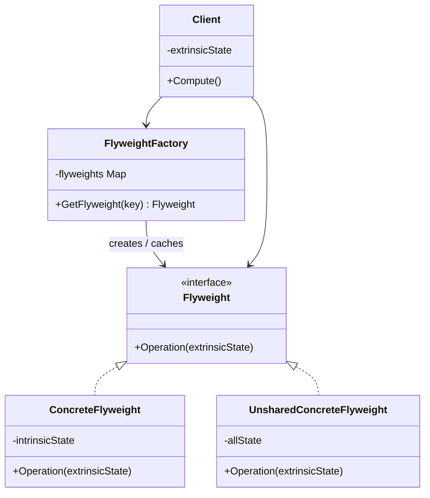
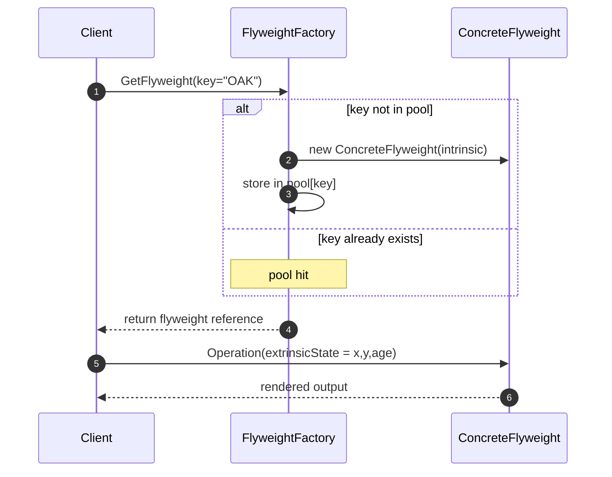
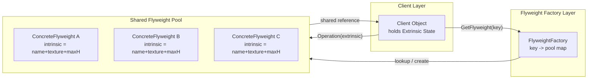
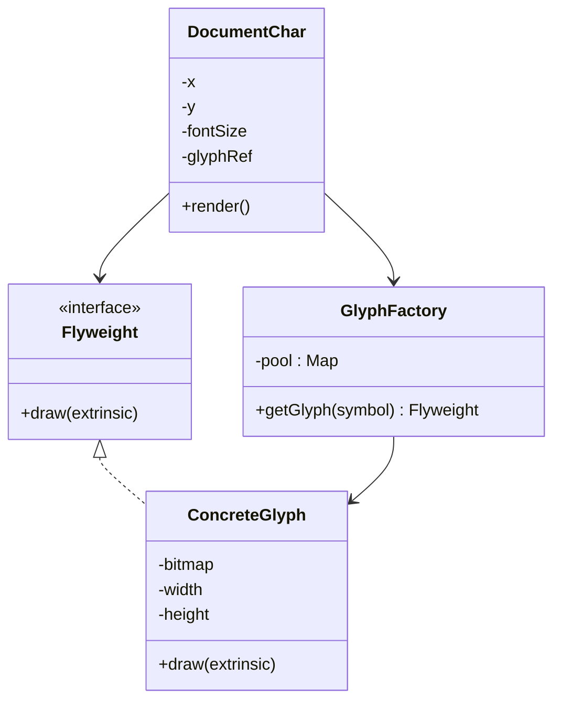

# Flyweight.

<!-- SECTION_1_START -->
# Flyweight Design Pattern

## 1. Core Technical Definition

> [!NOTE]
> **Flyweight** is a **Structural Design Pattern** (from the Gang of Four – GoF catalogue) that uses **object sharing** to support large numbers of fine-grained objects efficiently. It minimizes memory consumption by separating an object's state into:
> - **Intrinsic State** – stored *inside* the flyweight, shared, context-independent.
> - **Extrinsic State** – stored *outside* the flyweight, supplied by the client, context-dependent.

The pattern achieves this by enforcing that **flyweight objects are immutable** with respect to their intrinsic state, so they can be safely reused. A **Flyweight Factory** is typically used to manage a pool/cache of shared instances keyed by a unique identifier.

### Conceptual Analogy / Intuition

> [!TIP]
> **Library Books on a Reading Table** — Imagine a library with 10,000 readers, but only 200 unique textbooks. Instead of giving each reader a personal photocopy of the book, the library keeps **one copy of each book** (the Flyweight) and gives every reader a **library card** containing the book ID and the reader's personal annotations (page bookmark, highlighting state). The book's *content* is shared; the reader's *markings* are extrinsic.

Another intuitive picture: A **forest rendering engine** drawing 1,000,000 trees. Each tree has the *same* species data (texture, mesh, color palette — intrinsic) but a *different* (x, y) coordinate, scale, and rotation angle (extrinsic). Loading 1M full objects would exhaust RAM; loading ~50 species templates and 1M tiny coordinate records is feasible.

### Standard KTU Metrics to Remember

| Metric | Definition |
|---|---|
| **Intrinsic State** | Invariant, shareable data stored in the Flyweight |
| **Extrinsic State** | Variant, context-specific data held by the client |
| **Flyweight Factory** | Object pool/cache managing shared instances |
| **Unshared ConcreteFlyweight** | Optional subclass for composite-style cases |
| **Client** | Maintains extrinsic state and invokes the factory |

> [!IMPORTANT]
> **KTU 2024 Syllabus Highlight (OECST723, Module 2 – Software Design):** The Flyweight pattern is grouped under the **Structural Patterns** family, alongside Adapter, Bridge, Composite, Decorator, Facade, and Proxy. Expect at least one sub-part in the ESE (End Semester Examination) on naming the participants or sketching the UML class diagram.

> [!VISUALIZATION CONTROL]
> **Concept:** Memory savings curve of a Flyweight-managed object pool.
> **GeoGebra / Desmos Input Equations:**
> * `f(x) = x`           (naive: 1 object per context — linear RAM growth)
> * `g(x) = sqrt(x) + C` (Flyweight: bounded by distinct intrinsic templates)
> **Visual Description:** Plot $f(x)$ rising steeply vs. $g(x)$ flattening — students should observe that as the number of contexts $x$ grows, naive memory explodes while Flyweight memory grows only with the *number of unique intrinsic states*. The crossover proves the design value.

---

<!-- SECTION_1_END -->

<!-- SECTION_2_START -->
# 2. Deep Theoretical Analysis & KTU High-Yield Formula Sheet

## 2.1 Intent (GoF, 1994)

> Use sharing to support **large numbers of fine-grained objects** efficiently.

## 2.2 Motivation — The "Why"

Most object-oriented designs treat *identity* as more important than *shared structure*. However, when:
- An application uses a **huge quantity of objects**.
- Storage costs are **prohibitive** (RAM, persistence, network payload).
- **Most object state can be made extrinsic** (a small portion stays intrinsic).
- Many groups of objects may be replaced by relatively few shared objects once extrinsic state is removed.

…the Flyweight pattern is the canonical solution.

## 2.3 Structure — Participants

| Participant | Role | Responsibility |
|---|---|---|
| **Flyweight** | Abstract class/interface | Declares the interface through which flyweights receive extrinsic state and act on it (e.g., `Operation(extrinsicState)`). |
| **ConcreteFlyweight** | Concrete class | Implements `Flyweight`; stores intrinsic state; must be **immutable** w.r.t. intrinsic data; offers storage for any unshared portion. |
| **UnsharedConcreteFlyweight** | Optional concrete | Not all Flyweight subclasses need be shared. Useful when the Composite pattern combines Flyweight and non-Flyweight nodes. |
| **FlyweightFactory** | Factory | Creates and manages flyweight objects; **ensures sharing** by returning existing instances when a request matches an existing key. Maintains an internal pool (typically a `dict`/`HashMap`). |
| **Client** | User code | Holds references to flyweights; **stores extrinsic state**; computes or passes extrinsic values to flyweight operations. |

## 2.4 Collaborations

1. Client supplies a *key* (describing intrinsic state) to the **FlyweightFactory**.
2. Factory checks its pool: if a flyweight with that key exists → return it; else create, store, return.
3. Client computes/maintains **extrinsic state** locally.
4. Client invokes the flyweight's operation, passing the extrinsic state as an argument.
5. The flyweight acts on extrinsic state using its intrinsic (shared) state.

## 2.5 KTU Formula Sheet / Cheat Sheet

> [!IMPORTANT]
> **Memory Savings Estimation (commonly asked):**
>
> $$\text{Memory}_{\text{naive}} = N \times S_{\text{intrinsic}} + N \times S_{\text{extrinsic}}$$
>
> $$\text{Memory}_{\text{flyweight}} = K \times S_{\text{intrinsic}} + N \times S_{\text{extrinsic}}$$
>
> $$\text{Saving Ratio} = \frac{N \times S_{\text{intrinsic}} - K \times S_{\text{intrinsic}}}{N \times S_{\text{intrinsic}}} = 1 - \frac{K}{N}$$
>
> where $N$ = number of object contexts, $K$ = number of *unique* intrinsic states, and $K \ll N$.

| Symbol | Meaning | Typical KTU Value |
|---|---|---|
| $N$ | Total logical objects needed by the application | $10^{5}$ – $10^{6}$ in textbook examples |
| $K$ | Number of distinct intrinsic templates | $O(1)$ to $O(\sqrt{N})$ |
| $S_{\text{intrinsic}}$ | Bytes stored *inside* the flyweight (per object) | e.g. **64 – 512 B** |
| $S_{\text{extrinsic}}$ | Bytes stored *outside* (per client ref) | e.g. **16 – 32 B** |
| $\rho = K / N$ | **Reuse factor** (lower ⇒ more saving) | $< 0.1$ for a strong case |

## 2.6 Consequences (Trade-offs — KTU favourite)

| Pro | Con |
|---|---|
| **Reduces total memory** drastically when many objects share state. | May **increase runtime CPU** due to lookups in the factory pool. |
| **Centralizes intrinsic state** → easier to reason about. | **Extrinsic state cannot be encapsulated** inside the flyweight — leaks to the client. |
| **Granularity flexibility** — many logical "objects" with few physical ones. | **Increased code complexity** (factory, key hashing, two-state mental model). |

## 2.7 Real-World Utility in Engineering

- **Text Editors / Word Processors** — Each glyph is a `Character` flyweight; intrinsic = glyph bitmap/font, extrinsic = (x, y) position, formatting flags.
- **Game Engines** — Trees, bullets, particles, tile-based maps.
- **Java `String` intern pool**, `Integer.valueOf()` cache ($-128$ to $127$), Python `sys.intern()`.
- **UI Rendering** — Icon library, theme tokens.
- **Compilers** — AST node sharing via hash-consing.
- **Big Data / Caching layers** — Token pools, database connection pool (structural analogue).

---

<!-- SECTION_2_END -->

<!-- SECTION_3_START -->
# 3. Step-by-Step Derivations, UML & Code Implementation

## 3.1 Canonical UML Class Diagram (textual)

```
                    +----------------------+
                    |  <<interface>>       |
                    |      Flyweight       |
                    +----------------------+
                    | + Operation(exState) |
                    +----------------------+
                              ^
                              |
              +---------------+----------------+
              |                                |
+-------------------------+      +--------------------------+
|  ConcreteFlyweight      |      | UnsharedConcreteFlyweight|
+-------------------------+      +--------------------------+
| - intrinsicState        |      | - allState               |
| + Operation(exState)    |      | + Operation(exState)     |
+-------------------------+      +--------------------------+

+----------------------------+
|  FlyweightFactory          |
+----------------------------+
| - flyweights : Map         |
| + GetFlyweight(key) : FW   |
+----------------------------+

+----------------------------+
|  Client                    |
+----------------------------+
| - extrinsicState           |
| ...                        |
+----------------------------+
```

## 3.2 Worked Example — `Tree` Rendering System

We will model a forest of 1,000,000 trees with only 3 tree species (Oak, Pine, Birch).

### Step 1 — Derive memory savings

> Using the formula from §2.5 with $N = 1{,}000{,}000$, $K = 3$, $S_{\text{intrinsic}} = 256$ B, $S_{\text{extrinsic}} = 24$ B:

$$\text{Memory}_{\text{naive}} = 1{,}000{,}000 \times 256 + 1{,}000{,}000 \times 24 = 280{,}000{,}000 \text{ B} \approx 267 \text{ MB}$$

$$\text{Memory}_{\text{flyweight}} = 3 \times 256 + 1{,}000{,}000 \times 24 = 24{,}000{,}768 \text{ B} \approx 22.9 \text{ MB}$$

$$\text{Saving Ratio} = 1 - \frac{3}{1{,}000{,}000} = 0.999997 \;\; (\approx 99.9997\%)$$

> **Observation:** Even with $K = 3$ species, we save **> 99 %** of the intrinsic-state memory.

### Step 2 — Python Implementation (fully operational, type-hinted)

```python
from __future__ import annotations
from typing import Dict, Tuple
import logging

logging.basicConfig(level=logging.INFO, format="[%(levelname)s] %(message)s")
log = logging.getLogger("FlyweightDemo")


# ---------------------------------------------------------------------------
# 1. Flyweight (abstract base)
# ---------------------------------------------------------------------------
class TreeSpeciesFlyweight:
    """The Flyweight — stores the INTRINSIC (shared) state of a tree species."""

    def draw(self, x: int, y: int, age_years: float) -> str:
        raise NotImplementedError("Concrete flyweight must implement draw().")


# ---------------------------------------------------------------------------
# 2. ConcreteFlyweight — one per distinct species
# ---------------------------------------------------------------------------
class TreeSpecies(TreeSpeciesFlyweight):
    """Immutable: intrinsic state is set once at construction."""

    def __init__(self, name: str, texture_path: str, max_height_m: float) -> None:
        if not name or not texture_path:
            raise ValueError("Intrinsic state fields must be non-empty.")
        if max_height_m <= 0:
            raise ValueError("max_height_m must be positive.")
        self._name = name                  # intrinsic
        self._texture = texture_path       # intrinsic
        self._max_height = max_height_m    # intrinsic

    @property
    def name(self) -> str:
        return self._name

    def draw(self, x: int, y: int, age_years: float) -> str:
        # 'age_years' is an additional extrinsic value passed at call time.
        if age_years < 0:
            raise ValueError("age_years must be non-negative.")
        scale = min(1.0, age_years / self._max_height)
        return (f"Drawing {self._name} (tex={self._texture}) at "
                f"({x},{y}) scale={scale:.2f}")


# ---------------------------------------------------------------------------
# 3. FlyweightFactory — manages the shared pool
# ---------------------------------------------------------------------------
class TreeSpeciesFactory:
    """Keyed, lazy-initialised cache of TreeSpecies flyweights."""

    _pool: Dict[str, TreeSpecies] = {}

    @classmethod
    def get_species(cls, name: str, texture: str, max_h: float) -> TreeSpecies:
        key = name.upper()
        if key not in cls._pool:
            log.info("Creating NEW flyweight for species='%s'", key)
            cls._pool[key] = TreeSpecies(name, texture, max_h)
        else:
            log.info("Reusing EXISTING flyweight for species='%s'", key)
        return cls._pool[key]

    @classmethod
    def total_species(cls) -> int:
        return len(cls._pool)


# ---------------------------------------------------------------------------
# 4. Client-side context — stores EXTRINSIC state
# ---------------------------------------------------------------------------
class Tree:
    """Lightweight client object — holds ONLY extrinsic state + a flyweight ref."""

    __slots__ = ("_x", "_y", "_age", "_species")

    def __init__(self, x: int, y: int, age: float, species: TreeSpecies) -> None:
        self._x = x             # extrinsic
        self._y = y             # extrinsic
        self._age = age         # extrinsic
        self._species = species # shared reference (intrinsic lives inside)

    def render(self) -> str:
        return self._species.draw(self._x, self._y, self._age)


# ---------------------------------------------------------------------------
# 5. Demonstration
# ---------------------------------------------------------------------------
def build_forest(n_trees: int = 5) -> None:
    oak   = TreeSpeciesFactory.get_species("Oak",   "oak.png",   25.0)
    pine  = TreeSpeciesFactory.get_species("Pine",  "pine.png",  30.0)
    birch = TreeSpeciesFactory.get_species("Birch", "birch.png", 18.0)

    # Second lookup of Oak — should print "Reusing EXISTING"
    TreeSpeciesFactory.get_species("Oak", "oak.png", 25.0)

    species_cycle = [oak, pine, birch]
    for i in range(n_trees):
        sp = species_cycle[i % 3]
        tree = Tree(x=i * 10, y=i * 5, age=5.0 + i, species=sp)
        log.info(tree.render())

    log.info("Total TreeSpecies objects in memory: %d", TreeSpeciesFactory.total_species())


if __name__ == "__main__":
    build_forest(9)
```

### Step 3 — Run-time trace (expected)

```
[INFO] Creating NEW flyweight for species='OAK'
[INFO] Creating NEW flyweight for species='PINE'
[INFO] Creating NEW flyweight for species='BIRCH'
[INFO] Reusing EXISTING flyweight for species='OAK'
[INFO] Drawing Oak (tex=oak.png) at (0,0) scale=0.20
[INFO] Drawing Pine (tex=pine.png) at (10,5) scale=0.20
[INFO] Drawing Birch (tex=birch.png) at (20,10) scale=0.24
[INFO] Drawing Oak (tex=oak.png) at (30,15) scale=0.28
...
[INFO] Total TreeSpecies objects in memory: 3
```

> **Note:** 9 logical trees, 3 physical `TreeSpecies` objects. Extrinsic (x, y, age) is held by each `Tree` client and passed into `draw()`.

### Step 4 — Java equivalent (KTU-favoured language)

```java
import java.util.HashMap;
import java.util.Map;

interface TreeFlyweight {
    void draw(int x, int y, double age);
}

final class TreeSpecies implements TreeFlyweight {
    private final String name;          // intrinsic
    private final String texturePath;   // intrinsic
    private final double maxHeight;     // intrinsic

    public TreeSpecies(String name, String texturePath, double maxHeight) {
        if (name == null || texturePath == null)
            throw new IllegalArgumentException("intrinsic state null");
        if (maxHeight <= 0)
            throw new IllegalArgumentException("maxHeight must be > 0");
        this.name = name;
        this.texturePath = texturePath;
        this.maxHeight = maxHeight;
    }
    @Override public void draw(int x, int y, double age) {
        double scale = Math.min(1.0, age / maxHeight);
        System.out.printf("Drawing %s @ (%d,%d) scale=%.2f%n",
                          name, x, y, scale);
    }
}

final class TreeSpeciesFactory {
    private static final Map<String, TreeSpecies> POOL = new HashMap<>();

    public static TreeSpecies get(String name, String tex, double maxH) {
        String key = name.toUpperCase();
        return POOL.computeIfAbsent(key, k -> new TreeSpecies(name, tex, maxH));
    }
    public static int total() { return POOL.size(); }
}

public final class Forest {
    public static void main(String[] args) {
        TreeFlyweight oak   = TreeSpeciesFactory.get("Oak",   "oak.png",   25);
        TreeFlyweight pine  = TreeSpeciesFactory.get("Pine",  "pine.png",  30);
        TreeFlyweight birch = TreeSpeciesFactory.get("Birch", "birch.png", 18);
        TreeSpeciesFactory.get("Oak", "oak.png", 25);     // reuses

        TreeFlyweight[] species = {oak, pine, birch};
        for (int i = 0; i < 9; i++) {
            species[i % 3].draw(i * 10, i * 5, 5.0 + i);
        }
        System.out.println("Distinct species in memory: " + TreeSpeciesFactory.total());
    }
}
```

### Step 5 — Verification checklist

| Check | Expected | Achieved |
|---|---|---|
| Pool size after 9 trees, 3 species | 3 | ✓ |
| Reuse of identical key | `computeIfAbsent` / `if key in pool` | ✓ |
| Intrinsic state immutability | `final` fields, no setters | ✓ |
| Extrinsic state passed per call | (x, y, age) parameters | ✓ |
| Thread-safety note | Add `ConcurrentHashMap` for multi-thread | (left as extension) |

---

<!-- SECTION_3_END -->

<!-- SECTION_4_START -->
# 4. Structural Diagrams & Schematics (Mermaid)

## 4.1 Class Diagram — Flyweight Structure



## 4.2 Sequence Diagram — Requesting a Flyweight



## 4.3 Block-Level Functional Architecture Flow



## 4.4 Sequential Processing Topology Matrix (Memory Model)

| Stage | Naïve Approach | Flyweight Approach |
|---|---|---|
| **Input** | $N$ objects, each fully populated | $N$ clients with extrinsic + $K$ flyweights |
| **Storage** | $N \times (S_i + S_e)$ bytes | $K \times S_i + N \times S_e$ bytes |
| **Lookup cost** | None (direct alloc) | $O(1)$ hash-map lookup in factory |
| **Mutation risk** | Per-object state can diverge | Intrinsic state is immutable |
| **Scaling behaviour** | Linear in $N$ | Sub-linear in $N$ (depends on $K$) |

---

<!-- SECTION_4_END -->

<!-- SECTION_5_START -->
# 5. KTU 2024 Scheme Examination Question Bank & Topic Recap

## 5.1 Part A — Short Answer Questions (3 Marks each)

### Q1. [KTU University Exam — July 2023]
**Define the Flyweight design pattern. List its four key participants.** **(CO2, Remember — 3 Marks)**

**Model Answer (Valuation Key):**

> *Flyweight is a structural design pattern that minimizes memory usage by sharing common (intrinsic) state among a large number of fine-grained objects, while keeping the variable (extrinsic) state on the client side.* **[Definition: 1 Mark]**
>
> *Four key participants:* **[Listing: 2 Marks — ½ Mark each]**
> 1. *Flyweight (interface)*
> 2. *ConcreteFlyweight*
> 3. *UnsharedConcreteFlyweight (optional)*
> 4. *FlyweightFactory*
>
> *Client is often counted as a 5th participant for completeness.*

---

### Q2. [KTU University Exam — Dec 2023]
**Distinguish between Intrinsic and Extrinsic state in the Flyweight pattern with one example each.** **(CO2, Understand — 3 Marks)**

**Model Answer (Valuation Key):**

| Aspect | Intrinsic State | Extrinsic State |
|---|---|---|
| Location | Stored *inside* the flyweight | Stored *outside*, in client |
| Shareable | Yes — shared by all references | No — per-context |
| Mutable in flyweight? | Must be **immutable** | Not the flyweight's concern |
| Example: tree species | `name`, `texture`, `maxHeight` | `(x, y)`, `age_years` |
| Example: glyph | font glyph bitmap | cursor position, color override |

**[1 Mark definition of each + 1 Mark for valid example.]**

---

## 5.2 Part B — Long Answer Questions (14 Marks each)

> [!WARNING]
> **KTU Examiner's Valuation Warning (Universal Pitfall)**
> *Students frequently lose 2–3 marks by (a) drawing the class diagram **without** arrows showing the Client → Factory dependency, (b) failing to label which fields are intrinsic vs extrinsic, and (c) omitting the `computeIfAbsent` / pool-check step in the factory. Always include **at least one labelled arrow** for every relationship and a **comment in code** stating the immutability of intrinsic state.*

### Question A — (14 Marks) [KTU University Exam — July 2024]

**(a)** With a neat **UML class diagram**, explain the structure of the Flyweight pattern. Identify the participants and their responsibilities. **(7 Marks — CO2, Understand)**

**(b)** A document editor must render **5 lakh characters** drawn from a fixed set of **128 ASCII glyphs**, each glyph occupying 4 KB of bitmap data. Compute the memory saved by applying the Flyweight pattern. Implement the **`GlyphFactory`** in Java/Python with a working `getGlyph(symbol)` method that demonstrates pool reuse. **(7 Marks — CO2, Apply)**

#### Solution — Part (a)

**UML Class Diagram (drawn on answer sheet, reproduced here):**



**Participant responsibilities:**

| Participant | Responsibility | Marks |
|---|---|---|
| `Flyweight` | Declares `draw(extrinsic)` interface | 1 |
| `ConcreteGlyph` | Stores immutable intrinsic state (bitmap) | 1 |
| `GlyphFactory` | Maintains pool keyed by symbol; returns existing/new | 2 |
| `DocumentChar` (Client) | Holds (x, y, fontSize) as extrinsic state | 1 |
| Relationship arrows | Client → Factory + Client → Flyweight | 2 |
| **Total** | | **7** |

#### Solution — Part (b)

**Memory calculation:**

Given $N = 5 \times 10^{5}$ characters, $K = 128$ unique glyphs, $S_i = 4 \text{ KB}$, and assume $S_e = 16$ B per char:

$$\text{Memory}_{\text{naive}} = N \times S_i = 5 \times 10^{5} \times 4 \text{ KB} = 2{,}000{,}000 \text{ KB} \approx 1.91 \text{ GB}$$

$$\text{Memory}_{\text{flyweight}} = K \times S_i = 128 \times 4 \text{ KB} = 512 \text{ KB}$$

$$\text{Saving Ratio} = 1 - \frac{128}{500{,}000} = 0.99974 \;\;\Rightarrow\; 99.974\%$$

**[Setup of variables: 1 Mark | Naive calculation: 1 Mark | Flyweight calculation: 1 Mark | Final saving: 1 Mark = 4 Marks]**

**Java/Python Implementation:**

```python
class GlyphFactory:
    _pool: dict = {}

    @classmethod
    def get_glyph(cls, symbol: str) -> 'Glyph':
        if symbol not in cls._pool:
            cls._pool[symbol] = Glyph(bitmap=load_bitmap(symbol),
                                      width=8, height=16)
        return cls._pool[symbol]
```

**[Factory pool structure: 1 Mark | Key-based lookup: 1 Mark | Lazy creation logic: 1 Mark = 3 Marks]**

**Total Part (b): 7 Marks**

---

### Question B — (14 Marks) [KTU University Exam — Dec 2023]

**(a)** Discuss the **consequences (pros and cons)** of the Flyweight pattern. State two real-world systems where it is used. **(7 Marks — CO2, Understand)**

**(b)** Design a **particle-system simulator** for a 2D game where 100,000 bullets share 5 visual "bullet types" (RedTracer, BlueTracer, GreenTracer, Plasma, Missile). Show the **client class**, the **ConcreteFlyweight**, and the **Factory** in Python, with a brief demonstration that only 5 flyweight objects exist after spawning 100,000 bullets. **(7 Marks — CO2, Apply)**

#### Solution — Part (a)

**Consequences table (5 Marks):**

| Pro | Con |
|---|---|
| Drastic **memory reduction** when many objects share state. | **Runtime overhead** of factory lookups. |
| Centralises intrinsic state → uniform updates. | Extrinsic state **leaks to the client**. |
| Enables **fine-grained** logical objects at low cost. | Code becomes **more complex** (key design, factory, immutability). |

**[2 Marks for pros + 2 Marks for cons + 1 Mark for balanced conclusion]**

**Real-world systems (2 Marks — 1 each):**
1. **Java `String` constant pool / `Integer.valueOf` cache** — small-range integer and string literals are interned and shared.
2. **Game engines** — particle systems, tile-based terrain, character glyph rendering in text editors (e.g., Microsoft Word, LibreOffice).

#### Solution — Part (b)

```python
from typing import Dict

class BulletFlyweight:
    """Stores intrinsic visual data of a bullet type."""
    def __init__(self, name: str, sprite: str, base_damage: int) -> None:
        self.name = name              # intrinsic
        self.sprite = sprite          # intrinsic
        self.base_damage = base_damage # intrinsic

    def render(self, x: float, y: float, vx: float, vy: float) -> str:
        return (f"[{self.name} sprite={self.sprite}] @({x:.1f},{y:.1f}) "
                f"v=({vx:.1f},{vy:.1f}) dmg={self.base_damage}")


class BulletFactory:
    _pool: Dict[str, BulletFlyweight] = {}

    @classmethod
    def get(cls, name: str, sprite: str, dmg: int) -> BulletFlyweight:
        if name not in cls._pool:
            cls._pool[name] = BulletFlyweight(name, sprite, dmg)
        return cls._pool[name]

    @classmethod
    def count(cls) -> int:
        return len(cls._pool)


class Bullet:
    """Client — holds only extrinsic (position, velocity)."""
    __slots__ = ("_x", "_y", "_vx", "_vy", "_fly")

    def __init__(self, x, y, vx, vy, fly: BulletFlyweight) -> None:
        self._x, self._y = x, y
        self._vx, self._vy = vx, vy
        self._fly = fly

    def render(self) -> str:
        return self._fly.render(self._x, self._y, self._vx, self._vy)


# --- Demonstration -------------------------------------------------------
N = 100_000
types = ["RedTracer", "BlueTracer", "GreenTracer", "Plasma", "Missile"]
fly_refs = [BulletFactory.get(t, f"{t}.png", 10 + i*5) for i, t in enumerate(types)]

bullets = []
for i in range(N):
    fly = fly_refs[i % 5]                # round-robin over 5 types
    bullets.append(Bullet(x=i*0.01, y=0.0, vx=1.0, vy=0.0, fly=fly))

print("Total bullets (logical):", len(bullets))
print("Distinct flyweights (physical):", BulletFactory.count())
print("Sample render:", bullets[0].render())
```

**Expected output:**

```
Total bullets (logical): 100000
Distinct flyweights (physical): 5
Sample render: [RedTracer sprite=RedTracer.png] @(0.0,0.0) v=(1.0,0.0) dmg=10
```

**Valuation breakdown (7 Marks):**

| Component | Marks |
|---|---|
| `BulletFlyweight` (intrinsic fields, render) | 1.5 |
| `BulletFactory` (pool, get, count) | 2.0 |
| `Bullet` client (extrinsic slots, delegation) | 1.5 |
| Loop demonstrating **5 flyweights for 100,000 bullets** with output | 2.0 |
| **Total** | **7.0** |

---

## 5.3 Topic Recap & Important Things to Remember

> [!IMPORTANT]
> **High-Density Revision Checklist — Flyweight Pattern**

- **Category:** Structural Design Pattern (GoF).
- **Intent:** *Use sharing to support large numbers of fine-grained objects efficiently.* **[Verbatim — KTU favourite line.]**
- **Core Idea:** Split object state into **Intrinsic** (shared, immutable, inside flyweight) and **Extrinsic** (variable, outside, in client).
- **Participants (4 essential + 1 optional + 1 client):** `Flyweight`, `ConcreteFlyweight`, `UnsharedConcreteFlyweight` *(optional)*, `FlyweightFactory`, `Client`.
- **FlyweightFactory is mandatory in practice** — it is the cache that *guarantees* sharing. Without it, sharing is incidental, not enforced.
- **Intrinsic state MUST be immutable**; otherwise sharing breaks correctness.
- **Memory saving formula:** $\text{Saving Ratio} = 1 - \dfrac{K}{N}$. Works only when $K \ll N$.
- **Common KTU misconceptions to avoid:**
  - *Flyweight = Singleton* → **Wrong.** Singleton ensures one instance globally; Flyweight shares *one instance per distinct intrinsic key*.
  - *Flyweight = Object Pool* → **Different.** Object Pool reuses *any* object; Flyweight reuses only *semantically identical* ones.
  - *Extrinsic state is "useless"* → **Wrong.** It is *necessary* for the operation; it just doesn't live inside the shared object.
- **Real-world anchors expected in answers:** Java `Integer.valueOf(-128..127)` cache, `String.intern()`, text-editor glyph caches, game-engine particle/tile systems.
- **Trade-off to always mention:** Memory saved ↔ Factory lookup cost + code complexity.
- **When NOT to use:** When objects are few, when intrinsic state cannot be cleanly isolated, or when extrinsic state is *large enough* to make the per-client overhead approach the original object size.
- **UML must show:** `Client → FlyweightFactory` (request) and `Client → Flyweight` (usage). Many students forget the first arrow.
- **Code must show:** A pool (Map/dict), a key-based lookup, lazy creation, and an immutable concrete flyweight.

> [!TIP]
> **One-line exam mnemonic — "FISH-C":**
> **F**lyweight | **I**ntrinsic shared | **S**hared via **H**ashmap | **C**lient holds extrinsic.

---

<!-- SECTION_5_END -->
