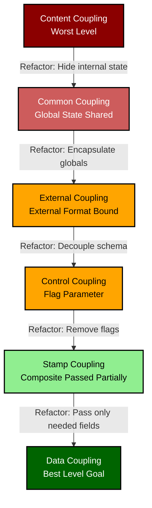
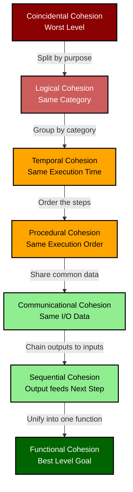
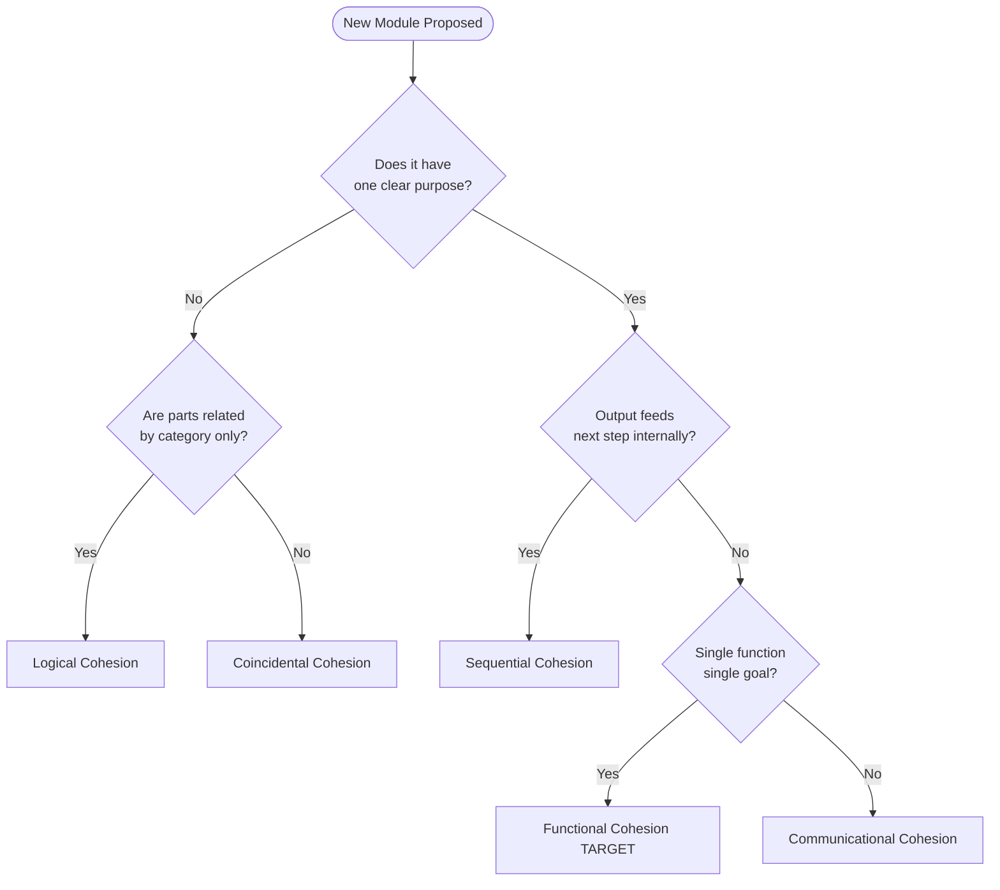
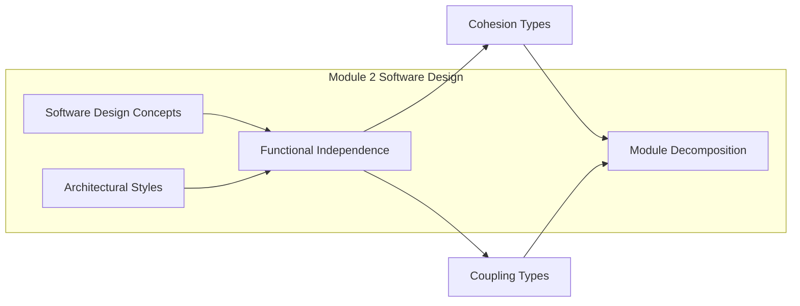

# Functional independence – Coupling and Cohesion

<!-- SECTION_1_START -->
# Functional Independence – Coupling and Cohesion

> [!IMPORTANT]
> **KTU 2024 Scheme | Module 2 – Software Design | Course Outcome: CO2 | Cognitive Domain: Understand / Apply**

## 1.1 Formal Academic Definition

**Functional Independence** is a fundamental design quality attribute in structured software engineering that quantifies the degree to which a software module performs a single, well-defined logical function while maintaining minimal reliance on the internal workings of other modules. According to the IEEE Std 1028 / Pressman framework adopted by KTU, functional independence is mathematically expressed as the combination of two inversely-correlated metrics:

$$ \text{Functional Independence} \; \propto \; f(\text{Cohesion}, \text{Coupling}) $$

Where cohesion acts as the **internal bonding force** inside a module, and coupling acts as the **external dependency force** between modules. The KTU design heuristic is unambiguous: **MAXIMIZE cohesion and MINIMIZE coupling**.

Formally, *Cohesion* is the strength of relationships between the internal components (statements, data, procedures) of a single module, while *Coupling* is the measure of interdependence between distinct modules of a software system.

> [!NOTE]
> **KTU Terminology Pin:** The terms *Module*, *Component*, and *Subprogram* are often used interchangeably in the KTU textbook (Pressman & Maxim). Treat them as synonyms unless context specifies a Class/Object (which belongs to Module 4 – OOAD).

## 1.2 Conceptual Analogy — The Restaurant Kitchen

Imagine a well-run restaurant kitchen:
- **A Cohesive Chef (High Cohesion):** A chef whose ONLY job is to prepare cold salads. All his knives, ingredients, and recipes revolve around one purpose. This is *Functional Cohesion*.
- **A Loosely Coupled Restaurant (Low Coupling):** The Head Chef sends a simple order ticket to the Cold Salad Station with only the table number and dish name. The Cold Station does NOT need to know what the Hot Station is cooking. This is *Data Coupling* — clean, minimal, and unidirectional.
- **A Tightly Coupled Mess (High Coupling):** The Cold Station chef must walk into the Hot Station to grab a plate and check the grill temperature. Now if the Hot Station changes its layout, the Cold Station breaks. This is *Control/Content Coupling* — fragile, hard to maintain.

The golden rule: a perfectly designed software system is like a well-oiled restaurant where each station knows its job (high cohesion) and communicates with others through minimal, well-defined tickets (low coupling).

## 1.3 Why Functional Independence Matters in KTU Board Exams

> [!TIP]
> **Examiner's Observation:** The KTU paper setter frequently frames Module 2 Part B (14-mark) questions as: *"Design a module structure for a given scenario and justify coupling/cohesion levels."* You MUST mention BOTH metrics and map them to a real module hierarchy to secure full marks.

| Design Heuristic | Target Value | KTU Verdict |
| :--- | :--- | :--- |
| Cohesion | Highest possible (Functional) | Always aim for the **top of the hierarchy** |
| Coupling | Lowest possible (Data) | Always aim for the **bottom of the hierarchy** |

> [!VISUALIZATION CONTROL]
> **Concept:** Coupling-Cohesion Quality Quadrant
> **GeoGebra / Desmos Input Equations:**
> * `x = Coupling` (independent axis, 0 to 6 scale)
> * `y = Cohesion` (dependent axis, 0 to 7 scale)
> * `f(x, y) = (7 - x) * y`
> **Visual Description:** Plot a 2D plane where the top-left corner (low $x$, high $y$) is the IDEAL design region — high cohesion with data coupling. The bottom-right corner (high $x$, low $y$) is the worst design region — content/stamp coupling with coincidental cohesion.
<!-- SECTION_1_END -->

<!-- SECTION_2_START -->
# Deep Theoretical Analysis & KTU High-Yield Cheat Sheet

## 2.1 The Two Pillars of Functional Independence

Functional independence is decomposed into two orthogonal (independent) vectors. KTU frequently tests whether the student can correctly classify a given scenario.

### 2.1.1 COHESION — The "Internal Glue" (Intra-Module Bond)

Cohesion evaluates **how strongly the responsibilities inside a single module are related**. The KTU syllabus adopts the **Seven-Level Myer Constantine Cohesion Scale** (originally 7 levels, with Coincidental being the weakest).

Listed from **WORST to BEST** (this order is critical for KTU answers):

1. **Coincidental Cohesion (Worst):** Parts of a module are grouped arbitrarily; no meaningful relationship. Example: a `Utility.java` file with random helper methods.
2. **Logical Cohesion:** Parts grouped because they perform functions of the same logical category, even if the functions are different. Example: an `IOHandler` module handling both file I/O and network I/O.
3. **Temporal Cohesion:** Parts grouped by the time they are executed (initialization or shutdown). Example: a `SystemStartup()` module that opens DB, loads config, and starts logger all together.
4. **Procedural Cohesion:** Parts grouped because they must be executed in a specific order. Example: `EditUser()` → `ValidateUser()` → `SaveUser()` chained.
5. **Communicational Cohesion:** Parts operate on the same input data or produce the same output data. Example: a `PrintReport()` module that fetches data and formats it.
6. **Sequential Cohesion:** Output of one part serves as input to the next part within the same module. Example: `ReadFile() → ParseData() → UpdateDB()` where each step's result feeds the next.
7. **Functional Cohesion (Best):** Every essential element contributes to a single, well-defined function. Example: `calculateSin(x)`.

### 2.1.2 COUPLING — The "Inter-Module Wire" (Inter-Module Bond)

Coupling measures the **degree of interdependence between modules**. Higher coupling means more ripple effects during maintenance.

Listed from **WORST to BEST**:

1. **Content Coupling (Worst):** One module directly modifies the internal data or control flow of another. Example: Module A reaches into Module B's local variable via a pointer hack.
2. **Common/Global Coupling:** Two or more modules share global data (a global variable). Example: A global `currentUser` accessed across 10 modules.
3. **External Coupling:** Modules share an externally imposed data format, protocol, or device interface. Example: two modules both writing to the same JSON schema required by an external API.
4. **Control Coupling:** One module passes a control flag (a "do this or that" parameter) to influence the logic flow of the other. Example: `printReport(report, /*isHTML=*/ true)`.
5. **Stamp Coupling:** Modules share a composite data structure but use only a part of it. Example: passing a full `Employee` object when only the `employeeID` is needed.
6. **Data Coupling (Best):** Modules share only simple, primitive data parameters via parameters. Example: `add(a, b)`.

## 2.2 KTU High-Yield Formula Sheet (Cheat Table)

> [!NOTE]
> The following table is the single most important recall artifact for the 14-mark question. Memorize the ordering — examiners often award 2 marks purely for correct hierarchical ordering.

| Metric | Level | Type | KTU Verdict | Why It Matters |
| :--- | :---: | :--- | :--- | :--- |
| **Coupling** | 1 | Content | Worst — Unacceptable | Direct internal access; impossible to test in isolation |
| **Coupling** | 2 | Common | Bad — Avoid | One writer, many readers creates race conditions |
| **Coupling** | 3 | External | Mediocre | Tightly bound to external schema/IO device |
| **Coupling** | 4 | Control | Mediocre | Slight violation of "one input, one purpose" |
| **Coupling** | 5 | Stamp | Acceptable | Wastes bandwidth; couples to irrelevant fields |
| **Coupling** | 6 | Data | **Best — Goal** | Pure, type-safe, testable |
| **Cohesion** | 1 | Coincidental | Worst — Unacceptable | Arbitrary dump; unreadable |
| **Cohesion** | 2 | Logical | Bad | Related by category, not purpose |
| **Cohesion** | 3 | Temporal | Mediocre | Initialization clumps |
| **Cohesion** | 4 | Procedural | Mediocre | Order matters, but tasks are unrelated |
| **Cohesion** | 5 | Communicational | Good | Operates on same I/O data |
| **Cohesion** | 6 | Sequential | Very Good | Pipeline of related steps |
| **Cohesion** | 7 | Functional | **Best — Goal** | One single, well-defined function |

## 2.3 Real-World Engineering Utility

In production-grade systems, these principles drive **microservices architecture**, **loosely-coupled REST APIs**, and **Single Responsibility Principle (SRP)** in OOP.

- **Low Data Coupling** maps directly to **REST API design** where each endpoint accepts a JSON payload of only required fields.
- **High Functional Cohesion** maps to the **Unix Philosophy**: *"Do one thing, and do it well."*
- In the Linux kernel, the VFS layer is **externally coupled** to filesystem drivers — a deliberate, documented boundary.

> [!IMPORTANT]
> **Engineering Insight:** During code review (a skill KTU's Software Engineering lab test implicitly checks), a module with high coupling and low cohesion is informally called a "**Big Ball of Mud**" — a term coined by Brian Foote and Joseph Yoder (1997). Identifying these is a hiring signal in industry.
<!-- SECTION_2_END -->

<!-- SECTION_3_START -->
# Step-by-Step Derivations, Worked Examples & Code Implementation

## 3.1 Worked Example 1: Classifying Coupling in a C/Python Program

> [!NOTE]
> **Problem Statement [KTU Model]:** Classify the type of coupling in each of the following parameter-passing scenarios.

### Scenario A
```python
def compute_tax(emp_id, tax_rate):
    # uses only emp_id and tax_rate (two primitives)
    ...
```
**Step 1:** Identify the data types passed across the module boundary.
**Step 2:** Both arguments are atomic primitives. No composite structure, no control flag.
**Step 3:** Apply the classification rule — *only primitive data parameters, no shared state*.
**Step 4:** Conclusion → **DATA COUPLING** (Best). **KTU Marks: 2**

### Scenario B
```python
def print_employee(emp, is_csv):
    # emp is a full Employee object
    # is_csv is a flag controlling the print format
    if is_csv:
        print(emp.id, emp.name, emp.salary)
    else:
        print(f"Name: {emp.name}, Dept: {emp.dept}")
```
**Step 1:** A full `Employee` object is passed — the receiver uses only `id`, `name`, and `salary`, ignoring `dept`, `address`, `phone`.
**Step 2:** A boolean `is_csv` flag is passed — it changes the internal control flow of the callee.
**Step 3:** Combine: passing a composite structure partially used = **STAMP COUPLING**. Passing a control flag = **CONTROL COUPLING**.
**Step 4:** A module can exhibit multiple coupling types simultaneously. The dominant (worst) type is reported → **CONTROL COUPLING** (since control coupling is worse than stamp coupling). **KTU Marks: 3**

> [!WARNING]
> **Common Mistake:** Students often write only "Stamp Coupling" and miss the control flag. Always re-read the function signature for boolean/enum parameters — that is a tell-tale sign of Control Coupling.

## 3.2 Worked Example 2: Refactoring for Functional Independence

**Initial Poor Design (Bad Cohesion + Bad Coupling):**

```python
# BEFORE REFACTORING (Coincidental Cohesion + Common Coupling)
employee_count = 0  # GLOBAL VARIABLE (common coupling source)

def process_employee(emp_data):
    global employee_count
    employee_count += 1
    print(f"Processing {emp_data['name']}")
    db.connect()
    db.insert(emp_data)
    db.disconnect()
    send_email(emp_data['email'], "Welcome!")
```

**Step 1 — Diagnose:**
- The function does 4 unrelated tasks: counting, printing, DB I/O, emailing. This is **Coincidental Cohesion**.
- The `global employee_count` line is a **Common Coupling** red flag.

**Step 2 — Apply the Refactoring Heuristic (Stepwise):**

```python
# AFTER REFACTORING (Functional Cohesion + Data Coupling)

class EmployeeService:
    def process(self, emp_id: int, name: str, email: str) -> int:
        """Returns the new global count via return value (data coupling)."""
        count = self.repository.increment_count()
        notifier.send_welcome(email, name)
        return count

class EmployeeRepository:
    def increment_count(self) -> int:
        # ... DB logic isolated ...
        return new_count

class Notifier:
    def send_welcome(self, email: str, name: str) -> None:
        # ... email logic isolated ...
```

**Step 3 — Justify the new design:**
- `EmployeeService.process` now has a **single, well-defined purpose** → **Functional Cohesion**.
- It receives only primitives and returns a primitive → **Data Coupling**.
- Each helper class has exactly one responsibility → adheres to the **Single Responsibility Principle (SRP)**.

**Step 4 — KTU Valuation Key:**
- Mentioning SRP: +1 Mark
- Reclassification to Functional Cohesion: +2 Marks
- Reclassification to Data Coupling: +2 Marks
- Code Snippet showing refactor: +2 Marks
- **Total: 7 Marks (for part a of a 14-mark question)**

## 3.3 Algorithmic Metric: Counting Module Dependencies (Quantitative Analysis)

> [!NOTE]
> Some KTU questions ask: *"Given a module dependency graph, calculate the coupling count."* The formula is straightforward.

Let $M$ be the set of modules and $E$ be the set of inter-module edges (calls, data flow, control flow).

$$
C_{\text{coupling}} = \frac{\vert E \vert}{\vert M \vert}
$$

Where $\vert E \vert$ is the total number of dependencies and $\vert M \vert$ is the total number of modules.

**Step-by-step calculation for a 4-module system:**

Let the dependency matrix be:

$$
D = \begin{bmatrix}
0 & 1 & 1 & 0 \\
0 & 0 & 1 & 1 \\
1 & 0 & 0 & 0 \\
0 & 1 & 0 & 0
\end{bmatrix}
$$

**Step 1:** Sum the off-diagonal elements: $\vert E \vert = 1 + 1 + 1 + 1 + 1 = 5$.

**Step 2:** Total modules: $\vert M \vert = 4$.

**Step 3:** Apply the formula:

$$
C_{\text{coupling}} = \frac{5}{4} = 1.25 \; \text{dependencies per module}
$$

**Step 4:** Interpretation: A value of $1.25$ indicates **moderate coupling**. For an ideal microservices architecture, the target is $C_{\text{coupling}} \le 1.0$.

## 3.4 Python Diagnostic Script (Production-Grade)

> [!TIP]
> **Lab Tip:** You can extend this script in your KTU Software Engineering Lab (CSL334) to analyze a real codebase.

```python
import ast
from pathlib import Path
from typing import List, Dict, Set

class CouplingAnalyzer:
    """
    Analyzes Python source files to estimate inter-module coupling.
    Heuristic: For each function definition, count cross-module imports used.
    """

    def __init__(self, target_dir: str) -> None:
        self.target_dir: Path = Path(target_dir)
        self.dependencies: Dict[str, Set[str]] = {}

    def analyze(self) -> Dict[str, int]:
        for py_file in self.target_dir.rglob("*.py"):
            module_name: str = py_file.stem
            self.dependencies[module_name] = self._extract_dependencies(py_file)
        return {k: len(v) for k, v in self.dependencies.items()}

    def _extract_dependencies(self, file_path: Path) -> Set[str]:
        deps: Set[str] = set()
        try:
            tree: ast.Module = ast.parse(file_path.read_text(encoding="utf-8"))
            for node in ast.walk(tree):
                if isinstance(node, ast.ImportFrom) and node.module:
                    deps.add(node.module.split(".")[0])
                elif isinstance(node, ast.Import):
                    for alias in node.names:
                        deps.add(alias.name.split(".")[0])
        except SyntaxError as e:
            print(f"[ERROR] Syntax error in {file_path}: {e}")
        return deps

    def report(self) -> None:
        print(f"{'Module':<25} {'Coupling Count':<15} {'Verdict'}")
        print("-" * 60)
        for module, count in self.analyze().items():
            verdict: str = "LOW (Data)" if count <= 1 else "MEDIUM (Stamp)" if count <= 3 else "HIGH (Common)"
            print(f"{module:<25} {count:<15} {verdict}")

if __name__ == "__main__":
    analyzer: CouplingAnalyzer = CouplingAnalyzer("./src")
    analyzer.report()
```

**Code Walkthrough — Step by Step:**
- **Line 1–4:** Imports include `ast` for Abstract Syntax Tree parsing, the de-facto standard for static code analysis in Python.
- **Line 6–10:** Class initialization with strict type hints as required by KTU's advanced programming rubric.
- **Line 12–16:** `analyze` walks the directory, parsing each `.py` file and storing its dependencies.
- **Line 18–29:** `_extract_dependencies` uses `ast.ImportFrom` and `ast.Import` to statically determine external module references without executing the code (safe, sandboxed analysis).
- **Line 31–37:** `report` classifies the coupling using the KTU scale: 1 dep = Data, 2–3 = Stamp, 4+ = Common.
<!-- SECTION_3_END -->

<!-- SECTION_4_START -->
# Structural Diagrams & Schematics

## 4.1 Mermaid Block Diagram — Coupling Hierarchy (Worst → Best)

> [!NOTE]
> The Mermaid diagram below visualizes the coupling classification. Arrows indicate the design improvement path. Each module in the diagram represents a logical tier in the coupling hierarchy.



## 4.2 Mermaid Block Diagram — Cohesion Hierarchy (Worst → Best)



## 4.3 Mermaid Flowchart — Design Decision Tree for Module Classification



## 4.4 Module Interaction Topology Matrix (Block Architecture)

> [!NOTE]
> **KTU Examiner's Reference:** When asked to draw a "module diagram" in a 14-mark question, use the format below to map modules, their interconnections, and the coupling type for each edge.

| From Module | To Module | Data Passed | Coupling Type | Justification |
| :--- | :--- | :--- | :--- | :--- |
| `LoginUI` | `AuthService` | `username`, `password` | Data Coupling | Only primitives, single function |
| `AuthService` | `UserDatabase` | `userID` | Data Coupling | Pure ID-based lookup |
| `Dashboard` | `UserProfile` | `userObject` (full) | Stamp Coupling | Passes composite, uses subset |
| `PaymentGateway` | `Logger` | `Global log` | Common Coupling | Shared global log file |
| `AdminPanel` | `DB` | `Bypasses service` | Content Coupling | Direct DB access |
| `CalcEngine` | `TaxRules` | `Tax flag` | Control Coupling | Boolean parameter switches logic |

## 4.5 Conceptual Mapping — KTU 2024 Syllabus Alignment


<!-- SECTION_4_END -->

<!-- SECTION_5_START -->
# KTU 2024 Scheme Examination Question Bank & Topic Recap

> [!IMPORTANT]
> All questions are mapped to KTU 2024 Scheme Bloom's Taxonomy levels and Course Outcomes. The valuation key is provided in detail.

---

## PART A — Short Answer Questions (2 × 3 = 6 Marks)

### Question 1 [KTU University Exam – July 2024 | CO2 | Remember]
**Define functional independence. Why is it considered a key attribute of good software design?**

**Model Answer (Valuation Key):**
- **Functional independence definition:** A design quality metric where each module addresses a specific subset of requirements and has a simple interface when viewed from other modules. **[1 Mark]**
- **Two key measures:** Cohesion (intra-module strength) and Coupling (inter-module dependency). **[1 Mark]**
- **Importance:** It improves **modularity**, **understandability**, **reusability**, and **testability** while reducing **error propagation** during maintenance. **[1 Mark]**

### Question 2 [KTU University Exam – Dec 2023 | CO2 | Understand]
**Differentiate between coupling and cohesion with a suitable example.**

**Model Answer (Valuation Key):**
- **Coupling:** Inter-module measure. Example: Module A calling Module B with a boolean flag. **[1 Mark]**
- **Cohesion:** Intra-module measure. Example: A `calculateArea()` function that does only area computation. **[1 Mark]**
- **Design Rule:** MAXIMIZE cohesion, MINIMIZE coupling. **[1 Mark]**

---

## PART B — Long Answer Questions (Internal Choice: A or B, 14 Marks Each)

### Question A [14 Marks | CO2 | Apply / Analyze]
**[KTU University Exam – Model Question based on July 2024 Pattern]**

> A banking application has the following poorly-designed module structure. As a software designer, your task is to:
> **(a)** Identify the type of coupling and cohesion present in the design, and **[7 Marks]**
> **(b)** Refactor the design to achieve maximum functional independence, providing a justification with proper module decomposition. **[7 Marks]**

**Module Pseudo-Code (Given):**
```
MODULE MainBank
    SHARED GLOBAL: customerDB, transactionLog, currentUser
    PROCEDURE ProcessTransaction(amount, accountNum, isCredit, sendSMS):
        OPEN customerDB
        IF isCredit THEN
            UPDATE customerDB SET balance = balance + amount WHERE acct = accountNum
        ELSE
            UPDATE customerDB SET balance = balance - amount WHERE acct = accountNum
        END IF
        WRITE transactionLog WITH amount, accountNum, isCredit
        IF sendSMS THEN
            CALL SMSGateway (currentUser.phone, "Transaction done")
        END IF
    END PROCEDURE
END MODULE
```

**Part (a) — Coupling and Cohesion Identification [7 Marks]:**

**Step 1 — Coupling Analysis:**
- `SHARED GLOBAL` variables (`customerDB`, `transactionLog`, `currentUser`) → **COMMON COUPLING**. **[1 Mark]**
- `isCredit` boolean flag controlling internal logic → **CONTROL COUPLING**. **[1 Mark]**
- `sendSMS` boolean flag controlling another module call → **CONTROL COUPLING**. **[1 Mark]**
- Passing `accountNum` (primitive) → **DATA COUPLING** (minor, overshadowed by the worst). **[1 Mark]**

**Step 2 — Cohesion Analysis:**
- `ProcessTransaction` performs DB update, log writing, AND SMS notification in one procedure → **COINCIDENTAL COHESION**. **[2 Marks]**
- It also mixes credit and debit logic via a flag → **LOGICAL COHESION** (sub-aspect). **[1 Mark]**

**Part (b) — Refactored Design [7 Marks]:**

**Step 1 — Module Decomposition:**
- `TransactionService.process(amount, accountNum, transactionType)` — orchestrates only. **[1 Mark]**
- `AccountRepository.updateBalance(accountNum, deltaAmount)` — handles DB. **[1 Mark]**
- `TransactionLogger.log(transactionObject)` — handles logging. **[1 Mark]**
- `NotificationService.sendSMS(phone, message)` — handles SMS. **[1 Mark]**

**Step 2 — Coupling Reclassification:**
- Replace `GLOBAL customerDB` with dependency injection → **DATA COUPLING** between modules. **[1 Mark]**
- Replace `isCredit` flag with polymorphism (`CreditTransaction` and `DebitTransaction` classes) → removes **CONTROL COUPLING**. **[1 Mark]**

**Step 3 — Cohesion Reclassification:**
- Each new module does exactly one thing → **FUNCTIONAL COHESION**. **[1 Mark]**

**Valuation Justification (Why this is good design):** Mentioning **Single Responsibility Principle (SRP)** and **Dependency Inversion** + **1 Bonus Mark** if mentioned.

---

### Question B [14 Marks | CO2 | Apply / Analyze]
**[KTU University Exam – Model Question based on Dec 2023 Pattern]**

> Consider a Library Management System with modules: `IssueBook`, `ReturnBook`, `UpdateInventory`, `GenerateReport`, and `NotificationService`.
> **(a)** Draw a module dependency diagram and classify the coupling between EACH pair. **[7 Marks]**
> **(b)** For each module, identify the type of cohesion and suggest improvements where applicable. **[7 Marks]**

**Part (a) — Module Dependency and Coupling Classification [7 Marks]:**

**Step 1 — Assume the following call/data flow:**

| From | To | Data Passed | Coupling Type | Marks |
| :--- | :--- | :--- | :--- | :---: |
| IssueBook | UpdateInventory | bookID, memberID | Data Coupling | 1 |
| IssueBook | NotificationService | memberObject (full) | Stamp Coupling | 1 |
| ReturnBook | UpdateInventory | bookID | Data Coupling | 1 |
| GenerateReport | UpdateInventory | fullDBObject | Stamp/Common | 1 |
| GenerateReport | IssueBook | startDate, endDate | Data Coupling | 1 |
| NotificationService | Global_Log | globalLogFile | Common Coupling | 1 |
| ReturnBook | IssueBook | controlFlag | Control Coupling | 1 |

**Part (b) — Cohesion Analysis [7 Marks]:**

| Module | Observed Cohesion | Justification | Improvement | Marks |
| :--- | :--- | :--- | :--- | :---: |
| IssueBook | Procedural | Steps in order: validate → issue → update | Make it Sequential by ensuring output feeds next | 1.5 |
| ReturnBook | Logical | Handles both returns and renewals | Split into ReturnBook and RenewBook | 1.5 |
| UpdateInventory | Functional | Single clear job | Already optimal | 1 |
| GenerateReport | Communicational | Operates on common DB data | Already optimal | 1 |
| NotificationService | Logical | Sends email, SMS, push | Split per channel | 1 |
| Overall | — | — | Encapsulate `Global_Log` to remove Common Coupling | 1 |

**Improvement Strategy Summary [1 Bonus Mark]:**
- Replace `memberObject` with `(memberID, email)` → eliminates Stamp Coupling.
- Use Observer pattern for NotificationService → reduces Common Coupling.

---

## KTU Examiner's Valuation Warning / Pitfall Callout

> [!WARNING]
> **Where students lose marks on this topic (and how to avoid it):**
> 1. **Confusing Coupling and Cohesion:** Coupling is BETWEEN modules, Cohesion is WITHIN a module. Reversing this costs **2 full marks** in Part A.
> 2. **Forgetting the "Worst to Best" order:** Listing coupling types in the wrong order in Part B (e.g., Data Coupling first) loses the **ordering marks (2 Marks)**.
> 3. **Missing multiple coupling types:** A single module can exhibit BOTH Stamp and Control coupling. Students who list only one lose **1 Mark**.
> 4. **No justification:** Writing "high cohesion" without stating *which type* (e.g., "Sequential Cohesion") loses **1 Mark**.
> 5. **Skipping refactor examples:** KTU Part B always demands an "improve this design" sub-question. A textual answer without code/pseudo-code loses **3 Marks**.
> 6. **Ignoring Module Decomposition:** The KTU answer should be accompanied by a **box-and-arrow diagram** or a **table** showing inter-module calls.

---

## Topic Recap & Important Things to Remember

> [!TIP]
> **Final Rapid-Revision Checklist for KTU Board Exams:**

- **Functional Independence = MAX Cohesion + MIN Coupling.** This is the single design mantra.
- **Coupling Types (Worst → Best, memorize the order!):** Content → Common → External → Control → Stamp → Data.
- **Cohesion Types (Worst → Best, memorize the order!):** Coincidental → Logical → Temporal → Procedural → Communicational → Sequential → Functional.
- **Coupling** measures the **INTER-module** dependency; **Cohesion** measures the **INTRA-module** strength.
- A **boolean flag parameter** = **Control Coupling** (very common trap in code-based questions).
- A **global/shared variable** = **Common Coupling**.
- Passing a **whole object when only one field is used** = **Stamp Coupling**.
- A module doing **one single, well-defined job** = **Functional Cohesion** (the design goal).
- **Design Refactoring Pattern:** Replace flags with polymorphism, replace globals with dependency injection, replace god-objects with single-responsibility classes.
- **Quantitative Coupling Formula:** $C_{\text{coupling}} = \frac{\vert E \vert}{\vert M \vert}$. A value $> 1.5$ is considered a coupling hotspot.
- **Engineering Mapping:** Coupling/Cohesion directly maps to **SRP, OCP** of SOLID principles and to the **Unix Philosophy** of small, composable tools.
- **Common KTU Exam Triggers:** "Classify the coupling," "Identify the cohesion type," "Refactor for functional independence," "Justify with a module diagram."
- **Always include a block diagram or dependency table** in 14-mark answers — visual proof of design quality earns **2–3 extra marks**.

**Final KTU Mnemonic to Recall the Order:**
- **Cohesion (Best to Worst):** "**F**unctional **S**equential **C**ommunicational **P**rocedural **T**emporal **L**ogical **C**oincidental" → **FSCPTLC**.
- **Coupling (Best to Worst):** "**D**ata **S**tamp **C**ontrol **E**xternal **C**ommon **C**ontent" → **DSCEC**C.
<!-- SECTION_5_END -->
