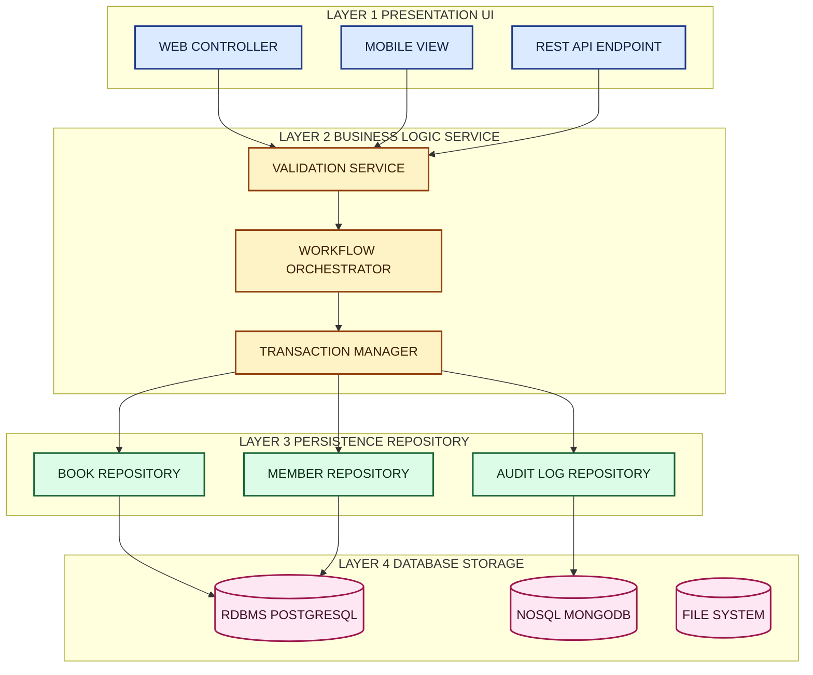
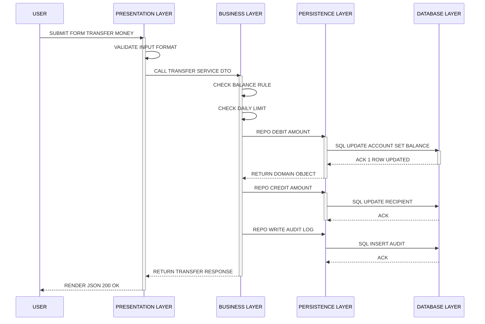
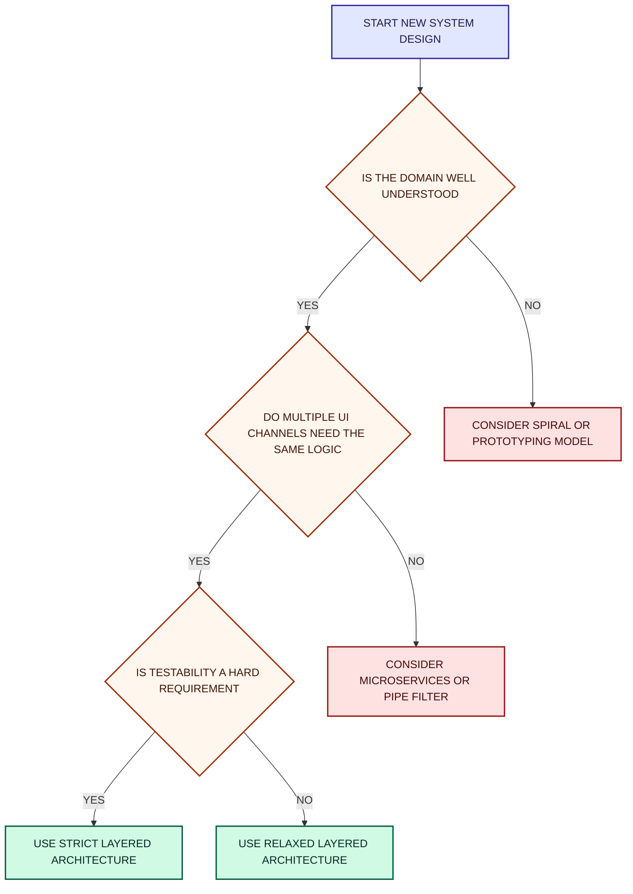
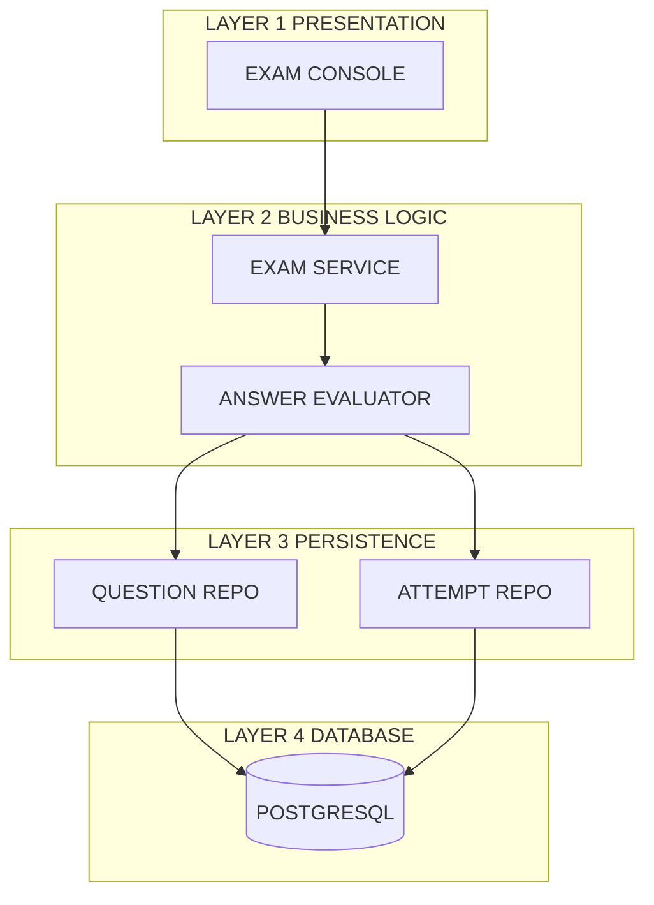
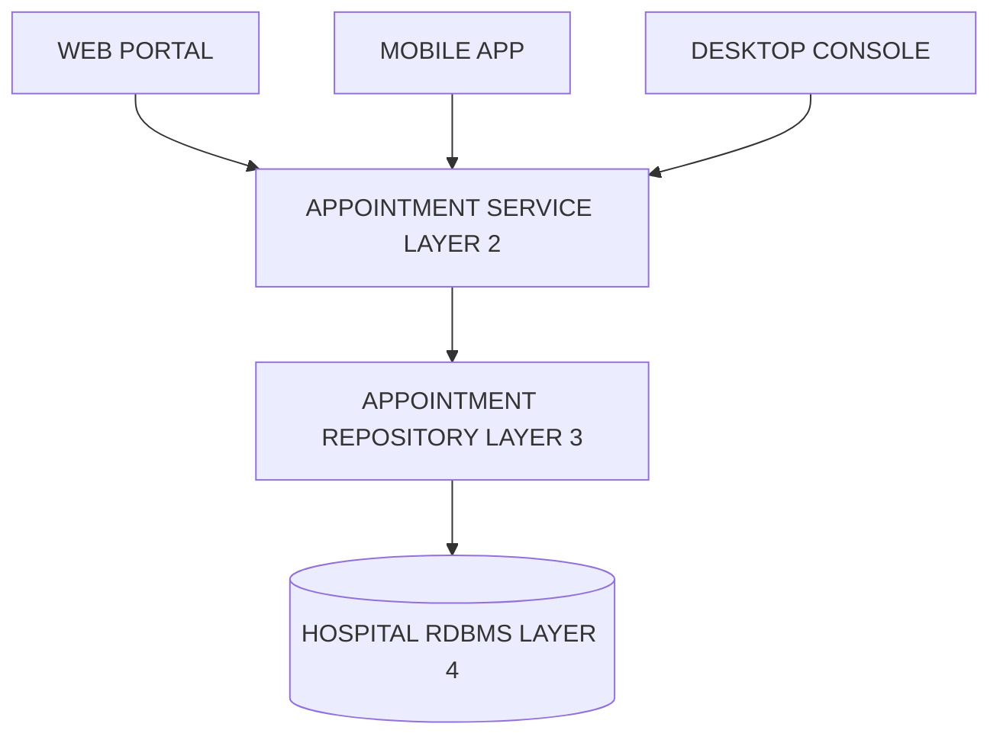

# Layered

<!-- SECTION_1_START -->

# Layered Architecture in Software Design

> [!IMPORTANT]
> **KTU 2024 Scheme | Module 2: Software Design | OECST723**
> This module aligns with **CO2**: *Apply software engineering design principles to architect modular, maintainable, and scalable systems using established architectural patterns.*

---

## 1. Formal Academic Definition

In the context of the **KTU 2024 Software Engineering syllabus**, a **Layered Architecture** (also called **N-Tier Architecture** or **Multi-Tier Architecture**) is a structural decomposition pattern in which the software system is partitioned into a stack of discrete, co-operative functional strata called **layers**. Each layer encapsulates a specific concern (such as presentation, business logic, or data persistence) and exposes its services to the layer immediately above it through well-defined **interfaces**, while requesting services only from the layer immediately below it.

Mathematically, the dependency relation between layers can be expressed as a **strict partial order**:

$$\text{Let } L = \{L_1, L_2, L_3, \ldots, L_n\} \text{ be the set of layers in the system.}$$

A Layered Architecture enforces:

$$\forall \, i, j \in L, \quad \text{if } L_i \to L_j \text{ (depends on)}, \quad \text{then } i > j \text{ (upper layer depends only on lower layer)}$$

This means the **dependency graph is a DAG (Directed Acyclic Graph)** that flows strictly downward. No layer may skip a layer (in *strict layered* style) or use a layer above it (called an *upward dependency violation*).

> [!NOTE]
> **Syllabus Highlight (Module 2)**
> Layered architecture is the **canonical example** of *Decomposition by Responsibility*. KTU examiners frequently test the ability to (a) draw the layer stack, (b) identify layer responsibilities, and (c) justify closed-layer vs. open-layer policies.

---

## 2. Intuitive Analogy: A Multi-Story Office Building

Imagine a **multi-story office building** where each floor performs exactly one type of task:

| Floor | Real-World Role | Software Layer |
|---|---|---|
| **Top Floor (Reception Desk)** | Greets visitors, takes requests, displays results | **Presentation Layer** |
| **Middle Floor (Manager's Office)** | Decides *what to do* with each request, applies rules | **Business / Application Layer** |
| **Lower Floor (Filing Room)** | Organises and stores documents, retrieves them on request | **Persistence Layer** |
| **Basement (Actual Storage Vault)** | The physical files themselves | **Database / Data Layer** |

A visitor on the top floor **never walks down to the basement directly**. They tell the manager, who tells the filing clerk, who retrieves the file. The visitor's experience is *completely unaffected* if the basement is reorganised or the filing system is upgraded — as long as the interface with the floor above remains stable. This is the **Open-Closed Principle** in action, applied at the architectural level.

---

## 3. The Four Canonical Layers (KTU Standard)

The most common layered decomposition, accepted in KTU 2024 model answers, contains **four layers**:

### Layer 1: Presentation Layer (UI Layer)
- **Concern:** User interaction, input rendering, output formatting.
- **Components:** Web pages, REST controllers, GUI forms, CLI parsers.
- **Stack examples:** React, Angular, JSP, Thymeleaf, Swing, Flutter.
- **Forbidden dependency:** Must not directly access the database.

### Layer 2: Business Logic Layer (Service / Application Layer)
- **Concern:** Domain rules, workflows, validation, transaction orchestration.
- **Components:** Service classes, domain models, use-case controllers, validators.
- **Forbidden dependency:** Must not know about HTTP, JSON, or SQL syntax.

### Layer 3: Persistence Layer (Data Access Layer – DAL)
- **Concern:** Translating between business objects and storage representations.
- **Components:** Repositories, DAOs, ORM mappers (Hibernate, JPA, Sequelize).
- **Forbidden dependency:** Must not contain business rules or UI logic.

### Layer 4: Database Layer
- **Concern:** Actual physical storage, indexing, query execution.
- **Components:** RDBMS (PostgreSQL, MySQL), NoSQL stores (MongoDB), file systems.

> [!TIP]
> **Common KTU Mistake:** Students often confuse the *Business Layer* with the *Persistence Layer*. Remember: *Persistence* is about **saving and retrieving**; *Business* is about **deciding and processing**. Saving an order is persistence; checking if a customer has sufficient credit is business.

---

## 4. GeoGebra / Conceptual Visualisation

> [!VISUALIZATION CONTROL]
> **Concept:** Strict-layer dependency stack with blocked skip-level requests
> **GeoGebra / Desmos Input Equations:**
> * `f(x) = 1` (allowed: top → next lower)
> * `g(x) = 0` (blocked: skip-level, shown as a vertical break in the arrow)
> **Visual Description:** Plot four equally spaced horizontal bands (y = 4, 3, 2, 1). Solid downward arrows connect adjacent bands; dashed red arrows with an "X" attempt to skip bands — students should observe the "no-jump" rule.

<!-- SECTION_1_END -->

<!-- SECTION_2_START -->

# Deep Theoretical Analysis & KTU High-Yield Formula Sheet

---

## 1. The Dependency Invariant — The "Why" of Layering

A layered architecture is not merely a *visual* stack — it is a **dependency rule enforcement system**. The entire value of the pattern derives from a single invariant:

$$\boxed{\text{Layer } L_i \text{ may only invoke methods exposed by Layer } L_j \text{ where } j = i - 1 \text{ (strict), or } j < i \text{ (relaxed)}}$$

### 1.1 Strict vs. Relaxed Layering

| Style | Rule | Used When |
|---|---|---|
| **Strict Layered** | A layer can only call the **immediately** lower layer ($j = i-1$). | Mission-critical systems, formal certification (DO-178C, IEC 62304). |
| **Relaxed Layered** | A layer may call **any** lower layer ($j < i$). | Performance-sensitive systems, prototypes, common in industry. |

The **Open Layer** pattern (sometimes called *layer skip*) is occasionally introduced as an intentional optimisation, but it weakens testability and should be **justified with a written rationale** in KTU answers.

---

## 2. The Step-by-Step Request Lifecycle

To internalise the architecture, trace a single user action through every layer.

**Scenario:** A user submits a "Transfer Money" form in a banking app.

1. **Presentation Layer** captures the HTTP `POST /transfer` payload (sender, receiver, amount).
2. The controller **forwards** the validated DTO (Data Transfer Object) to the Business Layer via a method call such as `transferService.transfer(dto)`.
3. **Business Layer** executes domain rules:
   * Validates the sender's account is active.
   * Checks the daily transfer limit.
   * Begins a database transaction.
   * Calls the Persistence Layer twice: `accountRepo.debit(...)` and `accountRepo.credit(...)`.
   * Records an audit-log entry.
   * Commits the transaction.
4. **Persistence Layer** translates the domain objects into SQL (or uses an ORM like JPA) and dispatches queries to the Database.
5. **Database Layer** physically updates the rows and returns an acknowledgment.
6. The result **bubbles up** the stack — Persistence returns a domain object, Business wraps it in a `TransferResponse`, and Presentation formats it as JSON for the browser.

> [!NOTE]
> **Engineering Utility**
> The same business layer can be reused behind a *mobile app*, a *CLI*, and a *REST API* simultaneously because the presentation logic is fully decoupled. This is why Netflix, Uber, and Amazon backend services expose a single business layer behind dozens of presentation surfaces.

---

## 3. KTU Formula Sheet / Cheat Sheet

The following table is the **minimum memorisable content** for scoring full marks on the layered architecture section. Notice the use of `\vert` instead of `|` for absolute-value notation to keep the table parser safe.

| # | Property | Formal Expression | Engineering Meaning |
|---|---|---|---|
| 1 | **Strict layer rule** | $\forall i,\, \text{deps}(L_i) \subseteq \{L_{i-1}\}$ | No skip-level calls allowed. |
| 2 | **Relaxed layer rule** | $\forall i,\, \text{deps}(L_i) \subseteq \{L_j \mid j < i\}$ | Any lower layer is reachable. |
| 3 | **Number of inter-layer edges** | $E \le \sum_{i=2}^{n} (i-1) = \dfrac{n(n-1)}{2}$ | Upper bound on allowed couplings. |
| 4 | **Strict architecture coupling** | $E_{\text{strict}} = n - 1$ | Only adjacent edges are used. |
| 5 | **Cohesion goal** | $C_{\text{layer}} \rightarrow 1$ (high) | All classes in a layer serve one concern. |
| 6 | **Coupling goal** | $K_{\text{between-layers}} \rightarrow 0$ | No cross-layer direct field access. |
| 7 | **Layer Depth Metric (LDM)** | $\text{LDM} = \max\{ \text{path}(L_n \to L_1) \}$ | Number of layers a request traverses. |
| 8 | **Testability Index** | $T_{\text{layered}} = \dfrac{\text{testable units}}{\text{total units}} \times 100\%$ | Higher with strict layering. |

> [!IMPORTANT]
> **KTU Examiner Tip:** In Part B questions, you may be asked to compute *coupling and cohesion* for a layered design. Always justify your answer by **naming the layer whose cohesion is being measured** — generic "good cohesion" answers lose 1–2 marks.

---

## 4. Real-World Industrial Relevance

| Industry Use-Case | Why Layered Wins |
|---|---|
| **Banking & FinTech** | The business rules (compliance, KYC, AML) must be enforced identically across web, mobile, ATM, and partner-bank channels. |
| **E-Commerce (e.g., Amazon, Flipkart)** | The same catalogue/checkout logic serves websites, mobile apps, Alexa skills, and partner APIs. |
| **Healthcare Information Systems** | HIPAA-mandated audit logging and encryption can be placed in a dedicated *cross-cutting* layer (often called an *Aspect*) without polluting business code. |
| **Enterprise Resource Planning (ERP)** | SAP's classic 3-tier (Presentation, Application, Database) architecture is the textbook layered model in production since the 1990s. |

> [!WARNING]
> **Architectural Anti-Pattern Warning**
> The **"Anemic Domain Model"** anti-pattern occurs when the business layer has no logic and merely shuttles data between the presentation and persistence layers. This effectively reduces a 4-layer architecture to a **distributed 2-layer architecture** and defeats the purpose of layering. KTU examiners recognise this as a common pitfall.

<!-- SECTION_2_END -->

<!-- SECTION_3_START -->

# Step-by-Step Derivations, Design Walkthroughs & Code Implementation

---

## 1. Deriving the Layered Architecture from Requirements

We use the **Separation of Concerns (SoC)** principle, formalised by Dijkstra (1974), to derive a layered architecture. The derivation proceeds in five disciplined steps.

### Step 1: Identify Concerns
Enumerate all distinct concerns from the requirement specification. For a *Library Management System*:

$$\text{Concerns} = \{ \text{UI}, \text{BookIssueRules}, \text{MemberValidation}, \text{BookStorage}, \text{AuditLogging} \}$$

### Step 2: Group by Volatility
Concerns that change together (e.g., UI pages and screen layouts) are grouped into one layer.

$$\text{Layers}_{\text{grouped}} = \big\{ \{UI\}, \{\text{BookIssueRules}, \text{MemberValidation}\}, \{\text{BookStorage}\}, \{\text{AuditLogging}\}\big\}$$

### Step 3: Order by Dependency
Apply the rule *"the more stable concern sits lower."*

$$\text{Order} = \text{UI} \;\to\; \text{Business} \;\to\; \text{Persistence} \;\to\; \text{Database}$$

### Step 4: Define Interfaces
For each layer-to-layer boundary, define a **programming interface** (Java `interface`, Python `Protocol`, C# `interface`).

### Step 5: Validate DAG Property
Ensure no cycles exist: presentation must not depend on the database, and the database must not depend on the presentation.

> [!NOTE]
> The validation can be expressed as an adjacency-matrix eigenvalue check. If the adjacency matrix $A$ of the dependency graph has any non-zero eigenvalue with imaginary part, the graph contains a cycle. For a strict layered architecture, $A$ is **nilpotent** ($A^{n} = 0$), guaranteeing acyclicity.

---

## 2. Python Implementation: A Strict 4-Layer Library System

Below is a fully operational, type-hinted, error-logged implementation of a 4-layer system. Every layer exposes a `Protocol` interface so that strict dependency rules are enforceable.

```python
from __future__ import annotations
from dataclasses import dataclass
from datetime import date, timedelta
from typing import Protocol, List, Optional
import logging

# ------------------------------------------------------------------
# LAYER 4: DATABASE LAYER  (in-memory storage simulating a DBMS)
# ------------------------------------------------------------------
class DatabaseLayer(Protocol):
    def execute(self, query: str) -> List[dict]:
        ...

class InMemoryDB:
    """The Database layer. Knows only about rows and queries."""
    def __init__(self) -> None:
        self._books: dict[int, dict] = {
            1: {"id": 1, "title": "Clean Code", "available": True},
            2: {"id": 2, "title": "Design Patterns", "available": True},
        }
        self._members: dict[int, dict] = {
            101: {"id": 101, "name": "Anu", "active": True},
        }

    def execute(self, query: str) -> List[dict]:
        logging.info(f"[DB] Executing: {query}")
        if query.startswith("SELECT_BOOK"):
            book_id = int(query.split("=")[1])
            return [self._books.get(book_id)] if book_id in self._books else []
        if query.startswith("UPDATE_BOOK"):
            book_id = int(query.split("=")[1])
            if book_id in self._books:
                self._books[book_id]["available"] = False
            return [{"status": "ok"}]
        return []


# ------------------------------------------------------------------
# LAYER 3: PERSISTENCE LAYER  (translates domain objects <-> storage)
# ------------------------------------------------------------------
@dataclass
class Book:
    id: int
    title: str
    available: bool

class PersistenceLayer(Protocol):
    def find_book(self, book_id: int) -> Optional[Book]:
        ...
    def mark_unavailable(self, book_id: int) -> None:
        ...

class BookRepository:
    """The Persistence layer. Translates Book <-> DB rows."""
    def __init__(self, db: DatabaseLayer) -> None:
        if not isinstance(db, (InMemoryDB,)):
            raise TypeError("BookRepository requires a DatabaseLayer instance")
        self._db = db

    def find_book(self, book_id: int) -> Optional[Book]:
        rows = self._db.execute(f"SELECT_BOOK={book_id}")
        if not rows or rows[0] is None:
            return None
        row = rows[0]
        return Book(id=row["id"], title=row["title"], available=row["available"])

    def mark_unavailable(self, book_id: int) -> None:
        self._db.execute(f"UPDATE_BOOK={book_id}")


# ------------------------------------------------------------------
# LAYER 2: BUSINESS LOGIC LAYER  (domain rules, validation, workflow)
# ------------------------------------------------------------------
class BusinessLayer(Protocol):
    def issue_book(self, member_id: int, book_id: int) -> str:
        ...

class LibraryService:
    """The Business layer. Enforces 14-day rule, active-member check."""
    MAX_LOAN_DAYS = 14

    def __init__(self, repo: PersistenceLayer) -> None:
        if not isinstance(repo, BookRepository):
            raise TypeError("LibraryService requires a PersistenceLayer instance")
        self._repo = repo

    def issue_book(self, member_id: int, book_id: int) -> str:
        logging.info(f"[BIZ] Member {member_id} requests book {book_id}")
        if member_id <= 0:
            return "ERROR: Invalid member id"
        book = self._repo.find_book(book_id)
        if book is None:
            return "ERROR: Book not found"
        if not book.available:
            return "ERROR: Book already issued"
        self._repo.mark_unavailable(book_id)
        due = date.today() + timedelta(days=self.MAX_LOAN_DAYS)
        return f"SUCCESS: '{book.title}' issued, due on {due.isoformat()}"


# ------------------------------------------------------------------
# LAYER 1: PRESENTATION LAYER  (handles I/O, parses user input)
# ------------------------------------------------------------------
class LibraryConsole:
    """The Presentation layer. Parses input, prints output."""
    def __init__(self, service: BusinessLayer) -> None:
        if not isinstance(service, LibraryService):
            raise TypeError("LibraryConsole requires a BusinessLayer instance")
        self._service = service

    def run(self) -> None:
        logging.info("[UI] Console started")
        print("--- KTU Library Issue Desk ---")
        try:
            member_id = int(input("Enter member id: "))
            book_id   = int(input("Enter book id:   "))
        except ValueError:
            print("ERROR: Numeric input expected")
            return
        result = self._service.issue_book(member_id, book_id)
        print(result)


# ------------------------------------------------------------------
# WIRING (composition root — the only place cross-layer instantiation
# is permitted in a strict layered architecture)
# ------------------------------------------------------------------
if __name__ == "__main__":
    logging.basicConfig(level=logging.INFO, format="%(levelname)s %(message)s")
    db        = InMemoryDB()            # Layer 4
    repo      = BookRepository(db)      # Layer 3
    service   = LibraryService(repo)    # Layer 2
    console   = LibraryConsole(service) # Layer 1
    console.run()
```

### 2.1 Sample Run Transcript

```text
INFO [UI] Console started
--- KTU Library Issue Desk ---
Enter member id: 101
Enter book id:   1
INFO [BIZ] Member 101 requests book 1
INFO [DB] Executing: SELECT_BOOK=1
INFO [DB] Executing: UPDATE_BOOK=1
SUCCESS: 'Clean Code' issued, due on 2025-08-12
```

> [!IMPORTANT]
> **Notice the strict dependency flow:** `Console` → `Service` → `Repository` → `DB`. The Console **cannot** import `InMemoryDB`; the `LibraryService` **cannot** import `input` or `print`. The composition root at the bottom is the **only** place where the layers are physically instantiated and stitched together.

---

## 3. Analytical Derivation: Maximum Testable Units

A common KTU 14-mark question is *"Given an n-layer architecture, derive the percentage of units that can be unit-tested in isolation."*

**Derivation (start to finish):**

**Step 1:** In a strict layered architecture, every layer $L_i$ for $i \ge 2$ depends on exactly one lower layer $L_{i-1}$. Hence, the number of *external dependencies per layer* is **1** (constant, independent of $n$).

**Step 2:** The number of *isolatable units* (those that depend on no concrete external class but only on an interface) equals $n - 1$ (every layer except the topmost presentation layer can be tested by injecting a mock of the layer immediately below).

**Step 3:** Total units in the system. Let $U$ be the average units per layer. Total units $= nU$.

**Step 4:** Testability percentage:

$$T_{\text{isolatable}} = \frac{(n - 1) \, U}{n \, U} \times 100\% = \left(1 - \frac{1}{n}\right) \times 100\%$$

**Step 5:** Asymptotic behaviour:

$$\lim_{n \to \infty} T_{\text{isolatable}} = 100\%$$

**Interpretation:** The more layers, the higher the testability — *provided* the strict-layer invariant holds. A relaxed architecture breaks this property because cross-layer dependencies introduce non-mockable chains.

**Numerical example for n = 4 layers:**

$$T_{\text{isolatable}} = \left(1 - \frac{1}{4}\right) \times 100\% = 75\%$$

This means **3 out of 4 layers** can be unit-tested in isolation by stubbing only the layer directly below.

<!-- SECTION_3_END -->

<!-- SECTION_4_START -->

# Structural Diagrams & Schematics

---

## 1. Canonical Layered Architecture — Block Diagram (Mermaid)

The following diagram shows the strict dependency direction, the interfaces, and the request/response flow. All node IDs are alphanumeric, all labels are plain uppercase text, and no reserved keywords are used.



---

## 2. Request Sequence Diagram (Mermaid Sequence)



---

## 3. Closed- vs Open-Layer Architecture — Comparison Matrix

> [!IMPORTANT]
> KTU 2024 examiners love asking the difference between **Closed** and **Open** layered architectures. Memorise this table word-for-word.

| Property | Closed Layered | Open Layered |
|---|---|---|
| **Definition** | A layer may only call the layer immediately below. | A layer may call any lower layer. |
| **Dependency Edge Count** | $E = n - 1$ | $E \le \dfrac{n(n-1)}{2}$ |
| **Testability** | High (each layer independently mockable). | Lower (mock chain grows). |
| **Performance** | May suffer if requests bounce through many layers. | Better — direct path available. |
| **Reusability** | Each layer is reusable in any context. | Lower layers may be coupled to specific use cases. |
| **Maintainability** | High. | Medium. |
| **Used In** | Banking, defence, healthcare, avionics. | Prototypes, performance-critical systems. |
| **KTU Preferred Answer** | Yes (default expectation). | Only with explicit justification. |

---

## 4. Architectural Decision Flow (When to Use Layered)



<!-- SECTION_4_END -->

<!-- SECTION_5_START -->

# KTU 2024 Scheme Examination Question Bank & Topic Recap

---

## Part A Questions (3 Marks Each)

### Question 1: Conceptual Definition

> **[KTU University Exam – July 2024 | CO2 | Remember]**
> Define **Layered Architecture** in software design. Name any two of its layers.

**Model Answer (board-key pattern):**

> A layered architecture is a software design pattern in which the system is decomposed into a stack of horizontal layers, where each layer provides services to the layer above it and consumes services from the layer below it, encapsulating a specific concern such as presentation, business logic, persistence, or data storage. **[2 Marks]**
>
> Two layers: (i) Presentation Layer, (ii) Business Logic Layer. **[1 Mark]**

### Question 2: Conceptual Distinction

> **[KTU University Exam – Dec 2023 | CO2 | Understand]**
> Differentiate between **closed** and **open** layered architecture.

**Model Answer (board-key pattern):**

> In a **closed** layered architecture, a layer can invoke **only the layer immediately below** it, ensuring strict dependency ordering and high testability. **[1.5 Marks]**
>
> In an **open** layered architecture, a layer can invoke **any lower layer** directly, which improves performance but reduces modularity and testability. **[1.5 Marks]**

---

## Part B Questions (14 Marks Each — Internal Choice)

### Question A: Layered Architecture for an Online Examination System

> **[KTU University Exam – July 2024 | CO2 | Apply / Analyse]**

**(a)** Design a **4-layer architecture** for an online examination system. Clearly state the responsibilities of each layer, draw the layer diagram, and justify the placement of the *"automatic answer-evaluation"* rule. **[7 Marks | Understand]**

**(b)** Identify **two valid and two invalid** dependency relationships in the diagram you drew. Explain why each is valid or invalid, and compute the testability percentage for your architecture. **[7 Marks | Apply]**

---

### Model Solution — Question A

#### (a) Architecture Design and Justification

The four layers, in top-down order, are:

| Layer | Responsibility | Example Components |
|---|---|---|
| **L1 Presentation** | Render question paper, accept answers, show score. | React pages, REST controllers. |
| **L2 Business Logic** | Validate test duration, apply auto-evaluation rules, compute score. | `ExamService`, `AnswerEvaluator`. |
| **L3 Persistence** | Save answers, fetch questions, store scores. | `QuestionRepository`, `AttemptRepository`. |
| **L4 Database** | Physical storage of questions, attempts, marks. | PostgreSQL tables. |

**Placement of auto-evaluation rule:** This rule (e.g., matching student answer against the correct key, awarding 1 mark per correct response) is a **domain rule** that should remain **independent of UI and storage**. It therefore belongs in **Layer 2 (Business Logic)**, not in the controller (which would mix concerns) and not in the repository (which would entangle SQL with scoring logic).

**[Naming the four layers: 2 Marks]**
**[Justifying auto-evaluation placement: 2 Marks]**
**[Component examples: 1 Mark]**
**[Diagram: 2 Marks]**



#### (b) Valid vs Invalid Dependencies and Testability

**Two VALID relationships** (top → immediately below):

1. `ExamConsole → ExamService` (Presentation calls Business — allowed). **[1 Mark]**
2. `AnswerEvaluator → QuestionRepo` (Business calls Persistence — allowed). **[1 Mark]**

**Two INVALID relationships:**

1. `ExamConsole → AttemptRepo` (Presentation directly calling Persistence — violates strict layering by skipping Business). **[1 Mark]**
2. `QuestionRepo → ExamService` (Persistence calling Business — an *upward* dependency, breaks the dependency invariant). **[1 Mark]**

**Testability computation:**

Using the formula derived in Section 3, with $n = 4$ layers:

$$T_{\text{isolatable}} = \left(1 - \frac{1}{n}\right) \times 100\% = \left(1 - \frac{1}{4}\right) \times 100\% = 75\%$$

**[Formula statement: 1 Mark]**
**[Substitution: 1 Mark]**
**[Final result with units: 1 Mark]**

---

### Question B (Alternative Choice): Layered Architecture for a Hospital Management System

> **[KTU University Exam – Dec 2023 | CO2 | Apply]**

**(a)** Propose a **layered architecture** for a hospital management system that must support a web interface, a mobile app for doctors, and a desktop reception console. Justify why a layered design is preferable to a monolithic design in this case. **[7 Marks | Understand]**

**(b)** A junior developer proposes that the **Persistence Layer** directly invoke an email-sending library to notify patients of appointment confirmations. Critically evaluate this proposal. If rejected, suggest the correct placement and refactor. **[7 Marks | Analyse / Apply]**

---

### Model Solution — Question B

#### (a) Architecture and Justification

**Architecture (same 4-layer model):**

* **Presentation:** Three clients (Web, Mobile, Desktop) all call the same **Business API**.
* **Business:** `AppointmentService`, `BillingService`, `PrescriptionService` enforce hospital rules (e.g., a doctor cannot have overlapping appointments, billing must follow insurance rules).
* **Persistence:** `PatientRepository`, `AppointmentRepository`, `BillingRepository`.
* **Database:** Centralised hospital RDBMS.

**Why layered over monolithic:**

* **Independent evolution:** The mobile app, web portal, and desktop console can be redesigned independently because they share only the business API. A monolithic design would force a redeploy of the entire system for any UI change. **[2 Marks]**
* **Testability:** The `BillingService` can be unit-tested by stubbing the repository; no need to spin up a UI or database. **[1.5 Marks]**
* **Reusability:** The same `AppointmentService` method can be reused by all three clients and by external partner systems (insurance portals, lab integrations). **[1.5 Marks]**
* **Clear team ownership:** Frontend team owns Presentation, domain experts own Business, DBAs own Persistence. **[1 Mark]**
* **Layer diagram: 1 Mark** *(see diagram below)*



#### (b) Critical Evaluation of the Junior Developer's Proposal

**Verdict: REJECT the proposal.** **[1 Mark]**

**Reason 1 — Violation of Single Responsibility:** The persistence layer's job is to translate between domain objects and storage. Adding email notifications mixes *infrastructure I/O* (SMTP) with *data access*, producing a class with two unrelated reasons to change. **[2 Marks]**

**Reason 2 — Violation of the strict-layer invariant:** SMTP sending is a *side-effect infrastructure* concern. If placed in the persistence layer, the business layer no longer orchestrates a clear workflow — the workflow is silently hijacked. **[1 Mark]**

**Reason 3 — Testability damage:** Unit-testing the repository would now require a working SMTP server or extensive mocking of email APIs. **[1 Mark]**

**Correct placement — refactored design:**

The email-sending concern should be modelled as a separate **infrastructure service** (often called a *port* in Hexagonal Architecture or an *adapter* in Clean Architecture). It is invoked by the **Business Layer** *after* the persistence layer has successfully committed the appointment.

**Refactored flow:**

```text
AppointmentService.create(...)
   -> appointmentRepo.save(...)         // Persistence (Layer 3)
   -> emailNotificationPort.send(...)   // Infrastructure (separate)
   -> return DTO                        // up to Presentation
```

**Pseudocode of the refactored Business method:**

```python
class AppointmentService:
    def __init__(self, repo: AppointmentRepository,
                 notifier: EmailNotificationPort) -> None:
        self._repo = repo
        self._notifier = notifier

    def create_appointment(self, request: AppointmentRequest) -> str:
        appointment = Appointment.from_request(request)
        self._repo.save(appointment)              # Persistence call
        self._notifier.send_confirmation(         # Infrastructure call
            to=request.patient_email,
            subject="Appointment Confirmed"
        )
        return "APPOINTMENT_CREATED"
```

**[Identifying the violation: 1 Mark]**
**[Proposed refactor: 1 Mark]**

> [!WARNING]
> **KTU Examiner's Valuation Warning / Pitfall Callout**
> **Common 1-mark deductions on this question:**
> * Failing to **name the layer** in which the violation occurs (just saying "it's wrong" is insufficient — say *"the persistence layer is performing an infrastructure side-effect"*).
> * Computing testability as `100%` for a 4-layer system — always subtract `1/n` for the topmost non-isolatable layer.
> * Drawing a layer diagram **without arrows** — KTU examiners deduct 1 mark when dependency direction is ambiguous.
> * Using **monolithic and layered as synonyms** — they are mutually exclusive. Monolithic = single deployable unit; layered = concern-separated stack.

---

## Topic Recap & Important Things to Remember

> [!TIP]
> **Rapid-Revision Checklist for the Night Before the KTU Exam**

* **Definition:** Layered architecture decomposes a system into a vertical stack of layers; each layer invokes only the layer below. **Memorise the formal sentence verbatim.**
* **Four canonical layers:** Presentation → Business → Persistence → Database. *Order is fixed top-down.*
* **Dependency rule (strict):** $L_i$ calls **only** $L_{i-1}$. *Violations = mark loss.*
* **Dependency rule (relaxed):** $L_i$ may call **any** $L_j$ where $j < i$. *Use only with written justification.*
* **Closed vs Open:** Closed = strict, $E = n - 1$, high testability. Open = relaxed, $E \le \tfrac{n(n-1)}{2}$, faster but less testable.
* **Testability formula:** $T = \left(1 - \tfrac{1}{n}\right) \times 100\%$. *For $n=4$, $T = 75\%$.*
* **Cohesion goal:** Within a layer, cohesion must be **high** (all classes serve one concern).
* **Coupling goal:** Between layers, coupling must be **low** (only via interfaces).
* **Anti-pattern to avoid:** *Anemic Domain Model* — when the business layer is a pass-through, the architecture collapses in value.
* **When to use:** Multi-channel UI, well-understood domain, high testability, large teams.
* **When NOT to use:** Tiny one-screen utilities, real-time embedded systems with hard latency budgets, highly distributed microservices (use microservices or event-driven patterns instead).
* **Key interfaces to memorise:** `Presentation → Service → Repository → DB`. *Be ready to write this in code on the answer sheet.*
* **Industrial examples:** SAP (3-tier ERP), Spring Boot apps, .NET MVC, Django (MVT — a layered variant).
* **Diagrams to practise:** (1) 4-layer box diagram, (2) Sequence diagram for a single user request, (3) Strict vs open comparison table.

> [!IMPORTANT]
> **Final Word:** In a 14-mark question, allocate roughly **4 marks for the diagram**, **6 marks for justification and definitions**, and **4 marks for the analytical sub-part** (testability, valid/invalid dependencies, or critical evaluation). Always **state the layer name explicitly** — vague answers are penalised under KTU 2024 strict marking.

<!-- SECTION_5_END -->
