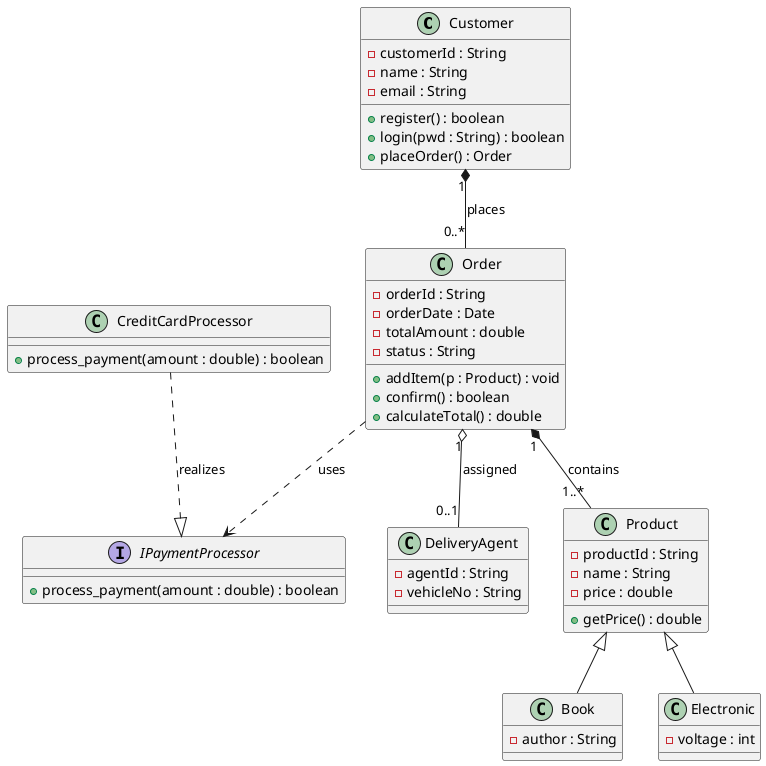
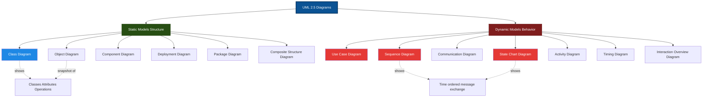
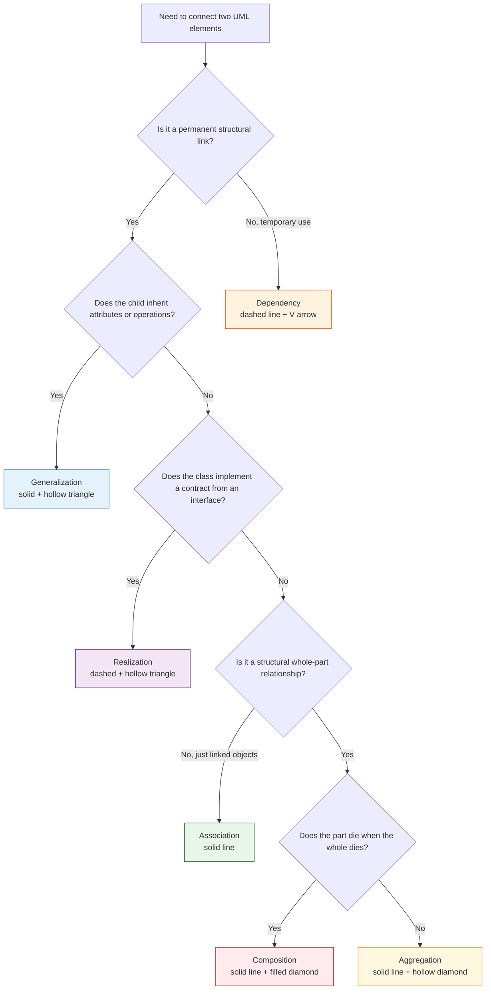
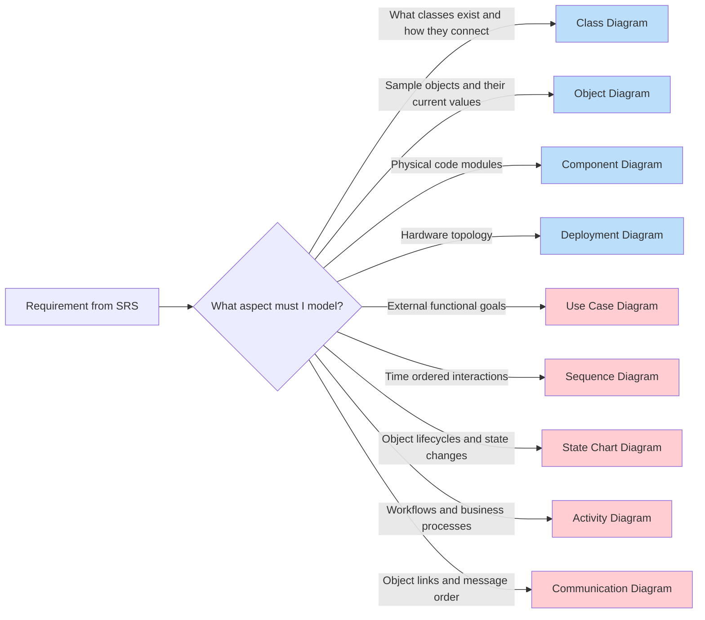
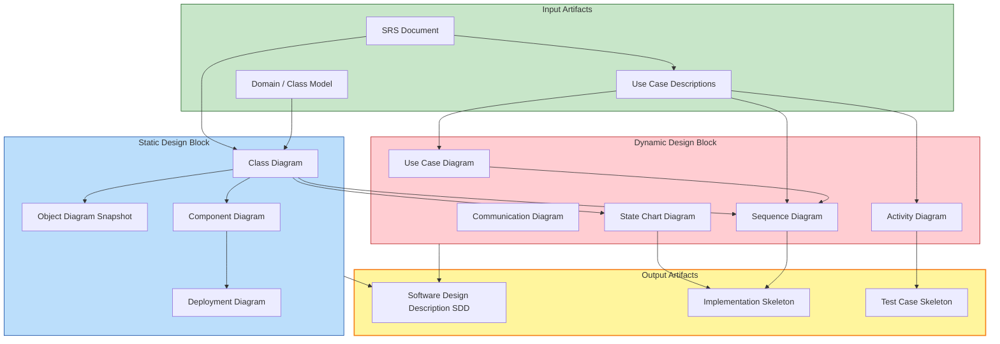

# Object Oriented Software Design -  UML diagrams and relationships– Static and dynamic models

<!-- SECTION_1_START -->

# Object Oriented Software Design — UML Diagrams and Relationships

## 1.1 Formal KTU 2024 Definition

> [!IMPORTANT]
> **Unified Modeling Language (UML)** is a standardized, general-purpose visual modeling language in the field of software engineering. It is managed by the **Object Management Group (OMG)** and was created by **Grady Booch, James Rumbaugh, and Ivar Jacobson** (the "Three Amigos") by unifying their respective notations (Booch Method, OMT, OOSE) in **1994–1997**. UML is used to specify, visualize, construct, and document the artifacts of a software-intensive system.

In the **KTU 2024 Scheme (OECST723 – Software Engineering)**, Object-Oriented Software Design refers to the design phase where the system's structure and behavior are modeled using UML. The deliverable is a set of **blueprint diagrams** that translate the SRS (Software Requirement Specification) into a logical, implementation-ready architecture.

> [!NOTE]
> **Why UML for KTU Board Exams?**
> UML diagrams are **mandatory** for the design phase documentation in KTU lab/project evaluations. Questions worth **14 marks** in Module 2 typically test diagram-drawing and relationship-identification skills.

---

## 1.2 Conceptual Analogy — The "Architect's Blueprint"

Imagine you are constructing a **multi-story apartment building** in Kerala. Before the first brick is laid, the architect produces:

1. A **floor plan** (class diagram) — shows rooms (classes), their sizes (attributes), and doors (methods).
2. A **plumbing & wiring schematic** (component/deployment diagram) — shows how water and electricity (services) flow between units.
3. A **time-lapse animation** (sequence/activity diagram) — shows the *sequence* in which a visitor parks, enters, signs in, and reaches the apartment.

> A static diagram is like a **photograph** (frozen in time, showing structure).
> A dynamic diagram is like a **movie** (shows behavior over time, interactions, and state changes).

**UML = The architect's blueprint language for software.**

---

## 1.3 Classification of UML 2.5 Diagrams (Big Picture)

UML 2.5 defines **14 diagram types** divided into two super-categories:

| Category | Static Models (Structure) | Dynamic Models (Behavior) |
|----------|---------------------------|---------------------------|
| **Focus** | *What* the system is made of | *How* the system behaves over time |
| **Diagrams (KTU Focus)** | Class, Object, Component, Deployment | Use Case, Sequence, Communication, State Chart, Activity |
| **Analogy** | Photograph of a machine | Video of the machine operating |

> [!NOTE]
> **KTU Module 2 Stress Points**: Out of the 14 UML diagrams, the syllabus explicitly prioritizes **Class, Use Case, Sequence, State Chart, Activity, and Component diagrams** plus the **4 relationship types**. Master these for high yield.

---

## 1.4 Physical Constants & Standard Metrics (UML Notation)

> [!IMPORTANT]
> The following are **non-negotiable UML 2.5 specification rules** (set by OMG):
> - **Visibility Symbols**: `+` (public), `-` (private), `#` (protected), `~` (package)
> - **Default Stroke Width**: **1 pixel** for solid lines, with **dashed lines** for dependencies/realizations
> - **Arrowhead Standards**: Open triangle for generalization/realization, closed (filled) triangle optional for UML 2.5
> - **Stereotype Notation**: `<<stereotype>>` rendered in guillemets `« »`

> [!VISUALIZATION CONTROL]
> **Concept:** UML Class Rectangle Anatomy (visible structure)
> **GeoGebra / Desmos Input Equations:**
> * `Rectangle A: x=0..5, y=0..8` (outer class box)
> * `Line 1: y=7` (separator between name and attributes)
> * `Line 2: y=3` (separator between attributes and operations)
> **Visual Description:** A rectangle split into three horizontal compartments — top holds the **class name in bold**, middle lists **attributes** with visibility symbols, bottom lists **operations/methods** with parameter signatures.

---

<!-- SECTION_1_END -->

<!-- SECTION_2_START -->

# Deep Theoretical Analysis — UML Building Blocks & Relationships

## 2.1 The Three Pillars of UML

Every UML diagram is constructed from only **three building blocks**:

1. **Things** — the structural elements (class, interface, actor, node, component, etc.)
2. **Relationships** — how things connect (4 types, detailed below)
3. **Diagrams** — graphical views that group related things + relationships

> [!NOTE]
> **KTU Examiner's Heuristic**: When asked "List the building blocks of UML", always answer in the exact order: *Things, Relationships, Diagrams*. Out-of-order answers lose 1 mark.

---

## 2.2 The Four UML Relationships (HIGH-YIELD)

### 2.2.1 Association (Structural Link "has-a")

> A relationship where **one class is connected to another** and they may exchange messages or hold a reference.

* **Notation**: Solid line, optionally with a label, role names, and **multiplicity** (e.g., `1`, `*`, `0..1`, `1..*`)
* **Special Forms**:
  * **Aggregation** (weak "has-a", whole-part): Hollow/empty diamond on the *whole* side. Example: *Department ◇— Employee* (Employee can exist without Department).
  * **Composition** (strong "has-a", co-existence): Solid/filled diamond. Example: *House ◆— Room* (Room cannot exist without House).
* **Navigability**: Arrow at one end means one-way navigation.

### 2.2.2 Dependency (Usage Link "uses-a")

> A **weaker, transient relationship** where a change in one class may force a change in the dependent class.

* **Notation**: Dashed line with an open (V) arrowhead pointing from the dependent to the independent class.
* **Typical Triggers**: Local variables, method parameters, static method calls.

### 2.2.3 Generalization (Inheritance "is-a-kind-of")

> The relationship between a **more general class (parent/superclass)** and a **more specific class (child/subclass)**. Promotes **reuse** and **polymorphism**.

* **Notation**: Solid line with a **hollow/open triangular arrowhead** pointing from child to parent.
* **Example**: `SportsCar` $\longrightarrow$ `Car`

### 2.2.4 Realization (Implementation "implements")

> The relationship between a **class and an interface** it implements, or between a **use case and a collaboration** that realizes it.

* **Notation**: Dashed line with a **hollow/open triangular arrowhead** pointing from implementing class to the interface.
* **Example**: `ArrayList` $\dashrightarrow$ `List`

> [!IMPORTANT]
> **Quick Discrimination Trick for KTU Board Exam**:
> * *Solid line* $\rightarrow$ Association / Generalization (permanent)
> * *Dashed line* $\rightarrow$ Dependency / Realization (weaker / contractual)
> * *Hollow triangle* $\rightarrow$ Generalization / Realization
> * *Open V-arrow* $\rightarrow$ Dependency
> * *Diamond* $\rightarrow$ Aggregation / Composition

---

## 2.3 Static Models — The Structural Family

### 2.3.1 Class Diagram (Most Important Static Diagram)

**Purpose**: Shows the **static structure** of the system — classes, their attributes, operations, and the relationships among them.

**Three-Component Notation**:
$$\text{Class Box} = \begin{cases} \text{ClassName (bold, centered)} \\ \text{attributes : type} \\ \text{methods(parameters) : returnType} \end{cases}$$

**Example**:
```
+----------------------------+
|         BankAccount        |
+----------------------------+
| - accountNo : String       |
| - balance   : double       |
| - owner     : Customer     |
+----------------------------+
| + deposit(amount: double)  |
| + withdraw(amount: double) |
| + getBalance() : double    |
+----------------------------+
```

### 2.3.2 Object Diagram

A snapshot of the **class diagram at runtime** — shows actual instances with concrete values. Names are underlined: `myAccount : BankAccount`.

### 2.3.3 Component Diagram

Shows the **physical modules** (`.jar`, `.dll`, `.exe`, source files) and their dependencies in the system.

### 2.3.4 Deployment Diagram

Shows the **physical hardware architecture** (servers, nodes, devices) and the software artifacts deployed on them. Uses **3D boxes for nodes** and **component symbols inside them**.

---

## 2.4 Dynamic Models — The Behavioral Family

### 2.4.1 Use Case Diagram (External View)

* Shows **actors** (stick figures) and **use cases** (ovals) with system boundary (rectangle).
* Captures **functional requirements** — *what* the system does, not *how*.
* Relationships among use cases: `<<include>>` (mandatory reuse), `<<extend>>` (optional addition), **Generalization**.

### 2.4.2 Sequence Diagram (Time-Ordered Interaction)

* **Vertical axis = time** (top to bottom).
* **Horizontal axis = objects** participating in the interaction.
* **Lifeline**: dashed vertical line below each object.
* **Activation bar**: thin rectangle on the lifeline — shows when the object is active in memory.
* **Message types**:
  * **Synchronous call** $\rightarrow$ solid arrow with filled head
  * **Asynchronous call** $\rightarrow$ solid arrow with open head
  * **Return message** $\rightarrow$ dashed arrow with open head
  * **Self-call** $\rightarrow$ loop back to the same lifeline

### 2.4.3 Communication (Collaboration) Diagram

Same information as a sequence diagram but emphasizes **object links** rather than time. Numbered messages show sequence (e.g., `1: login()`, `2: validate()`).

### 2.4.4 State Chart Diagram (Lifecycle Behavior of a Single Object)

* Represents **states** (rounded rectangles), **transitions** (arrows), and **events** (labels on arrows).
* Special states: **filled black circle** (initial), **bullseye** (final).
* Useful for objects with complex lifecycles (e.g., ATM, Order, TCP connection).

### 2.4.5 Activity Diagram (Workflow / Process Flow)

* Shows **business workflows** or **method internals** as a flowchart of activities, decisions, forks, and joins.
* Uses **rounded rectangles** for activities, **diamonds** for decisions, **thick bars** for fork/join, **swimlanes** for responsibility partitioning.

---

## 2.5 KTU High-Yield Formula Sheet

| Concept | Symbol / Notation | UML Rule | Real-World Example |
|---------|-------------------|----------|---------------------|
| Public visibility | `+` | Accessible to all | `+ name : String` |
| Private visibility | `-` | Accessible only within class | `- balance : double` |
| Protected visibility | `#` | Accessible in subclass | `# taxRate : double` |
| Package visibility | `~` | Same package only | `~ helper : Util` |
| Inheritance / Generalization | Solid line + hollow △ | Subclass $\rightarrow$ Superclass | `Car` $\leftarrow$ `SportsCar` |
| Realization | Dashed line + hollow △ | Implementing class $\rightarrow$ Interface | `ArrayList` $\dashrightarrow$ `List` |
| Dependency | Dashed line + open V | Temporary usage | Order $\dashrightarrow$ PaymentGateway |
| Association | Solid line | Structural link | Student — Course |
| Aggregation | Solid line + hollow ◇ | Weak ownership | Library ◇— Book |
| Composition | Solid line + filled ◆ | Strong ownership | Engine ◆— Piston |
| Multiplicity | `1`, `*`, `0..1`, `1..*` | Cardinality constraint | Student `1` — `*` Course |
| Stereotype | `<<interface>>`, `<<actor>>` | Metaclass extension | `<<interface>> Printable` |
| Initial state (State chart) | Filled black circle ● | Starting point | ● in ATM lifecycle |
| Final state (State chart) | Bullseye ◎ | Terminating point | ◎ in Order lifecycle |

> [!IMPORTANT]
> **Common KTU Board Exam Trap**: Students often confuse *Aggregation* and *Composition* diamonds. The test: *"If the container is destroyed, does the contained object still make sense to exist?"* If **No** $\rightarrow$ Composition (filled diamond). If **Yes** $\rightarrow$ Aggregation (hollow diamond).

---

## 2.6 Real-World Engineering Utility

* **Industry adoption**: UML is used in **enterprise Java (Spring Boot)**, **autosar modeling in automotive**, **aerospace system design (DO-178C)**, and **embedded systems**.
* **Code-generation tools**: Enterprise Architect, Visual Paradigm, StarUML, IBM Rational Rhapsody, PlantUML can **reverse-engineer code into UML** and **forward-engineer UML into skeletons**.
* **Agile compatibility**: Even in Scrum, UML use-case and class diagrams are produced in **sprint 0** for shared understanding.

---

<!-- SECTION_2_END -->

<!-- SECTION_3_START -->

# Step-by-Step Derivations, Code Implementations & Diagram Constructions

## 3.1 Derivation of UML 2.5 Diagram Taxonomy (Logical)

UML 2.5 organizes the 14 diagrams along two axes:

$$\text{Structure vs. Behavior} \times \text{Concrete vs. Abstract}$$

```
                ┌─────────────────────┬──────────────────────┐
                │   STATIC (Structure) │  DYNAMIC (Behavior) │
   ┌────────────┼─────────────────────┼──────────────────────┤
   │ Conceptual │      Class Diagram  │   Use Case Diagram   │
   │  (Logical) │      Object Diagram │   Activity Diagram   │
   ├────────────┼─────────────────────┼──────────────────────┤
   │ Physical   │  Component Diagram  │  Sequence Diagram    │
   │            │  Deployment Diagram │  State Chart Diagram │
   │            │                     │  Communication Dgm.  │
   │            │  Package Diagram    │  Interaction Overview│
   │            │  Composite Struct.  │  Timing Diagram      │
   └────────────┴─────────────────────┴──────────────────────┘
```

This is derived by observing **two orthogonal concerns** in any system:
1. *What are its parts?* (Structure)
2. *How do its parts interact over time?* (Behavior)

And each concern can be addressed either **logically** (conceptual classes/actors) or **physically** (actual code modules / running instances).

---

## 3.2 Step-by-Step Construction of a Class Diagram (Online Shopping Example)

### Step 1 — Identify Nouns $\rightarrow$ Candidate Classes
From the requirement *"Customers place Orders that contain Products, payments are processed via PaymentGateway, and Orders are shipped by DeliveryAgent"*:

Candidate classes: `Customer`, `Order`, `Product`, `PaymentGateway`, `DeliveryAgent`.

### Step 2 — Identify Attributes
For each class, list the data it must remember:

$$\begin{aligned}
\text{Customer} &: \texttt{customerId, name, email, phone} \\
\text{Order} &: \texttt{orderId, orderDate, totalAmount, status} \\
\text{Product} &: \texttt{productId, name, price, stock}
\end{aligned}$$

### Step 3 — Identify Methods (Behaviors / Verbs)
$$\begin{aligned}
\text{Customer} &: \texttt{register(), login(), placeOrder()} \\
\text{Order} &: \texttt{addItem(), removeItem(), calculateTotal(), confirm()} \\
\text{Product} &: \texttt{updateStock(), getPrice()}
\end{aligned}$$

### Step 4 — Identify Relationships (Multiplicities)
* A `Customer` *places* many `Order`s $\rightarrow$ `Customer 1 — 0..* Order`
* An `Order` *contains* one or more `Product`s $\rightarrow$ `Order 1 — 1..* Product` (Composition, because a Product line item has no meaning outside the Order)
* An `Order` *is paid through* a `PaymentGateway` $\rightarrow$ Dependency (transient)

### Step 5 — Apply Visibility & Finalize

```text
+--------------------------+      +--------------------------+
|       <<class>>          |      |       <<class>>          |
|       Customer           |1    *|         Order            |
+--------------------------+------+--------------------------+
| - customerId : String    |      | - orderId : String       |
| - name : String          |      | - orderDate : Date       |
| - email : String         |      | - totalAmount : double   |
+--------------------------+      +--------------------------+
| + register() : boolean   |      | + addItem(p:Product)     |
| + login(pwd:String):bool |      | + confirm() : boolean    |
| + placeOrder(): Order    |      | + calculateTotal():double|
+--------------------------+      +--------------------------+
```

> [!NOTE]
> **Step-by-Step Marks Distribution for KTU**: [Identifying 5 classes: 2 marks], [Attributes with types: 2 marks], [Methods with signatures: 2 marks], [Relationships with multiplicities: 3 marks], [Visibility notation correctness: 2 marks], [Neatness: 3 marks].

---

## 3.3 Step-by-Step Construction of a Use Case Diagram

### Step 1 — Identify Actors
External roles interacting with the system: `Customer`, `Admin`, `PaymentGateway` (external system).

### Step 2 — Identify Use Cases
Verbs/phrases describing goals: *Register, Login, Browse Products, Add to Cart, Place Order, Make Payment, Track Order, Manage Inventory*.

### Step 3 — Apply `<<include>>` and `<<extend>>`
* *Place Order* $\ll$include$\gg$ *Make Payment* (mandatory step)
* *Place Order* $\ll$extend$\gg$ *Apply Coupon* (optional)

### Step 4 — Draw Boundary
A rectangle around all use cases labeled "Online Shopping System".

### Step 5 — Connect Actors
Lines from actors to use cases they participate in.

---

## 3.4 Step-by-Step Construction of a Sequence Diagram (ATM Withdrawal)

### Step 1 — Identify Objects (left to right)
`Customer`, `ATM`, `BankServer`, `CashDispenser`.

### Step 2 — Time flows top to bottom
Add a **lifeline** (dashed line) below each object label.

### Step 3 — Draw messages in temporal order

```
Customer    ATM         BankServer   CashDispenser
   |         |              |             |
   |--insertCard----------->|             |
   |         |--validate--->|             |
   |         |<--valid------|             |
   |         |--requestPin->|             |
   |--enterPin(pin)-------->|             |
   |         |--verifyPin--->|             |
   |         |<--ok----------|             |
   |         |--withdraw(amt)------------->|
   |         |<--dispensed-----------------|
   |<--ejectCard------------|             |
   |         |--ejectCard---|             |
```

### Step 4 — Add Activation Bars
Thin vertical rectangles on lifelines while the object is busy.

### Step 5 — Add Return Messages (optional dashed arrows)
For clarity of control flow.

---

## 3.5 Step-by-Step Construction of a State Chart Diagram (Order Lifecycle)

### Step 1 — Identify States
`Pending`, `Confirmed`, `Shipped`, `Delivered`, `Cancelled`.

### Step 2 — Identify Events / Transitions
* `confirm()` $\rightarrow$ Pending to Confirmed
* `ship()` $\rightarrow$ Confirmed to Shipped
* `deliver()` $\rightarrow$ Shipped to Delivered
* `cancel()` $\rightarrow$ Pending/Confirmed to Cancelled

### Step 3 — Draw Initial and Final
Filled black circle ● entering *Pending*; bullseye ◎ leaving *Delivered* and *Cancelled*.

### Step 4 — Add Guards (optional, in square brackets)
e.g., `[paymentReceived == true] / confirm()`

---

## 3.6 Full Working Code Implementation — Demonstrating All Four Relationships

```python
"""
Filename: uml_relationships_demo.py
Author: KTU 2024 Scheme Reference
Description: Demonstrates Association, Aggregation, Composition,
             Generalization, Dependency, and Realization in Python.
Run:        python uml_relationships_demo.py
"""

from abc import ABC, abstractmethod
from datetime import date
from typing import List


# ============================================================
# 1. REALIZATION  <<implements>>
#    Interface: IPaymentProcessor
#    Classes that implement this interface "realize" its contract
# ============================================================
class IPaymentProcessor(ABC):
    """Interface — corresponds to <<interface>> in UML."""

    @abstractmethod
    def process_payment(self, amount: float) -> bool:
        pass


class CreditCardProcessor(IPaymentProcessor):
    """Concrete realization of IPaymentProcessor."""

    def process_payment(self, amount: float) -> bool:
        print(f"[CreditCard] Processing payment of Rs. {amount:.2f}")
        return True


class UPIPaymentProcessor(IPaymentProcessor):
    """Another realization — polymorphic substitution."""

    def process_payment(self, amount: float) -> bool:
        print(f"[UPI] Processing payment of Rs. {amount:.2f}")
        return True


# ============================================================
# 2. ASSOCIATION  (one-to-many, navigable)
#    Customer "has" Orders — Order can exist without the customer
#    object reference for some duration; hence plain Association
# ============================================================
class Customer:
    def __init__(self, customer_id: str, name: str, email: str) -> None:
        self.customer_id: str = customer_id
        self.name: str = name
        self.email: str = email
        # Association: multiplicity 1 customer -> 0..* orders
        self._orders: List["Order"] = []

    def add_order(self, order: "Order") -> None:
        self._orders.append(order)

    def __repr__(self) -> str:
        return f"Customer({self.customer_id}, {self.name!r})"


# ============================================================
# 3. COMPOSITION  (strong ownership — diamond)
#    OrderLineItem is part of Order; if Order is destroyed,
#    OrderLineItem has no meaning.
# ============================================================
class OrderLineItem:
    def __init__(self, product: "Product", quantity: int) -> None:
        self.product = product
        self.quantity = quantity

    def line_total(self) -> float:
        return self.product.price * self.quantity


# ============================================================
# 4. GENERALIZATION  (inheritance "is-a-kind-of")
#    Product is the superclass; Book and Electronic are subclasses
# ============================================================
class Product:
    def __init__(self, product_id: str, name: str, price: float) -> None:
        self.product_id = product_id
        self.name = name
        self.price = price


class Book(Product):
    def __init__(self, product_id: str, name: str, price: float, author: str) -> None:
        super().__init__(product_id, name, price)
        self.author = author


class Electronic(Product):
    def __init__(self, product_id: str, name: str, price: float, voltage: int) -> None:
        super().__init__(product_id, name, price)
        self.voltage = voltage


# ============================================================
# 5. AGGREGATION  (weak ownership — hollow diamond)
#    DeliveryAgent can exist without an Order; Order references Agent.
# ============================================================
class DeliveryAgent:
    def __init__(self, agent_id: str, name: str, vehicle_no: str) -> None:
        self.agent_id = agent_id
        self.name = name
        self.vehicle_no = vehicle_no


# ============================================================
# 6. DEPENDENCY  (dashed arrow "uses")
#    Order temporarily uses an IPaymentProcessor during checkout.
#    Order does NOT store it as an attribute permanently.
# ============================================================
class Order:
    def __init__(self, order_id: str, customer: Customer, order_date: date) -> None:
        self.order_id = order_id
        self.customer = customer           # Association
        self.order_date = order_date
        self._items: List[OrderLineItem] = []   # Composition
        self.status: str = "PENDING"
        self.delivery_agent: DeliveryAgent = None  # Aggregation (set later)

    def add_item(self, product: Product, qty: int) -> None:
        self._items.append(OrderLineItem(product, qty))

    def calculate_total(self) -> float:
        return sum(item.line_total() for item in self._items)

    # ----- DEPENDENCY demonstrated here -----
    def checkout(self, processor: IPaymentProcessor) -> bool:
        """
        The Order class DEPENDS on IPaymentProcessor — but only
        for the duration of this method call. The processor
        object is a local parameter, not a stored attribute.
        """
        total = self.calculate_total()
        if total <= 0:
            print("Cannot checkout empty order.")
            return False
        success = processor.process_payment(total)   # <<uses>>
        if success:
            self.status = "CONFIRMED"
            print(f"Order {self.order_id} confirmed for "
                  f"{self.customer.name}. Total = Rs. {total:.2f}")
        return success

    def assign_agent(self, agent: DeliveryAgent) -> None:
        # Aggregation: agent exists independently
        self.delivery_agent = agent


# ============================================================
# DRIVER CODE
# ============================================================
if __name__ == "__main__":
    # Create customers, products, and orders; wire up the relationships
    c1 = Customer("C001", "Anjali", "anjali@ktu.in")

    p1 = Book("B100", "Clean Code", 450.00, "Robert C. Martin")
    p2 = Electronic("E200", "USB Hub", 750.00, 5)

    order1 = Order("O5001", c1, date.today())
    order1.add_item(p1, 2)
    order1.add_item(p2, 1)

    c1.add_order(order1)

    agent = DeliveryAgent("DA01", "Ramesh", "KL-07-AB-1234")
    order1.assign_agent(agent)

    # Realization in action: pass any IPaymentProcessor
    order1.checkout(CreditCardProcessor())
    # Try polymorphism by switching processor type
    order1.checkout(UPIPaymentProcessor())
```

**Expected Output**:
```
[CreditCard] Processing payment of Rs. 1650.00
Order O5001 confirmed for Anjali. Total = Rs. 1650.00
[UPI] Processing payment of Rs. 1650.00
Order O5001 confirmed for Anjali. Total = Rs. 1650.00
```

> [!NOTE]
> **How this code maps to UML** (each relationship is annotated in comments). In the KTU board exam, you can write similar code with class/interface declarations and then draw the matching class diagram. Examiners reward this **code–diagram consistency**.

---

## 3.7 PlantUML Source — Class Diagram Reference (KTU Lab)



> [!IMPORTANT]
> **UML Multiplicity Shorthand for KTU Exams**:
> * `*`  ≡  `0..*` (zero or more)
> * `1..*` ≡ one or more
> * `0..1` ≡ zero or one (optional reference)
> * Always write multiplicities at **both ends** of the line.

---

<!-- SECTION_3_END -->

<!-- SECTION_4_START -->

# Structural Diagrams & Schematics (Mermaid)

## 4.1 UML 2.5 Master Taxonomy



## 4.2 The Four UML Relationships — Decision Flowchart



## 4.3 Static vs Dynamic — When to Use Which Diagram



## 4.4 Modular Architecture — UML Design Phase Block



> [!NOTE]
> **Reading the diagram**: Static and Dynamic models are **parallel deliverables**, both feeding into the Software Design Description (SDD). The same SRS serves as the seed input. Static models inform code skeletons; dynamic models inform test case skeletons.

---

<!-- SECTION_4_END -->

<!-- SECTION_5_START -->

# KTU 2024 Scheme Examination Question Bank

> [!IMPORTANT]
> All questions below follow the **KTU 2024 Scheme ESE (End Semester Evaluation)** pattern: 3-mark short answers, 14-mark long answers with **module-internal choice** (either A or B attempted, not both).

---

## PART A — 3-Mark Short Answer Questions (Answer ANY THREE out of FIVE; 3 × 3 = 9 marks)

---

### Q1. `[KTU University Exam — July 2024]`  &nbsp; *(CO1, Remember)*

**Differentiate between static and dynamic UML diagrams. Give two examples of each.**

**Model Answer (3 Marks)**:
| Aspect | Static Models | Dynamic Models |
|--------|---------------|----------------|
| Focus | Structure — *what* the system is | Behavior — *how* it behaves over time |
| Nature | Frozen in time (snapshots) | Time-ordered (sequence, transitions) |
| Examples | Class diagram, Component diagram | Sequence diagram, State chart diagram |

*Static diagrams depict the system's blueprint; dynamic diagrams depict its run-time life.* **[Valuation Key: 1 mark definition + 1 mark difference + 1 mark examples]**

---

### Q2. `[KTU University Exam — Dec 2023]`  &nbsp; *(CO2, Understand)*

**Explain the four types of relationships in UML with suitable notation.**

**Model Answer (3 Marks)**:
1. **Association** — Solid line; structural "has-a" link. *Example:* `Student — Course`.
2. **Dependency** — Dashed line with open V-arrow; transient "uses-a". *Example:* `Order ..> PaymentGateway`.
3. **Generalization** — Solid line with hollow triangle; "is-a-kind-of". *Example:* `SportsCar` $\longrightarrow$ `Car`.
4. **Realization** — Dashed line with hollow triangle; "implements contract". *Example:* `ArrayList` $\dashrightarrow$ `List`.

*Each relationship conveys a different semantic intent in OO design; the OMG UML 2.5 spec standardizes their graphical notation.* **[Valuation Key: 1 mark per relationship with notation]**

---

## PART B — 14-Mark Long Answer Questions (Answer ANY ONE FULL QUESTION; 1 × 14 = 14 marks)

---

### Question A (14 Marks)  &nbsp; *(CO3, Apply + Analyze)*

> `[KTU University Exam — July 2024, Modified]`

**Consider an "Online Course Enrollment System" for a KTU-affiliated college. Students register, browse available courses, enroll in them, and pay fees online. Each course is offered by a Faculty member and belongs to a Department. Draw a complete UML Class Diagram with at least 5 classes. Identify and clearly label:**

**(a)** At least **one Association, one Aggregation, one Composition, one Generalization, and one Dependency / Realization**.

**(b)** Multiplicities and visibility of all attributes. Mention the engineering rationale behind choosing aggregation vs composition in this context.

---

#### Model Solution — Question A

**Step 1 — Class Identification (2 marks)**

Nouns identified from the requirement: *Student, Course, Department, Faculty, FeePayment, Enrollment, OnlinePaymentGateway*.

We select the 5 most important: **Student, Course, Department, Faculty, Enrollment, Payment**.

**Step 2 — Class Diagram (10 marks — drawing)**

```
+--------------------------+         +--------------------------+
|     <<class>>            |         |      <<class>>           |
|     Student              |         |      Course              |
+--------------------------+         +--------------------------+
| - studentId : String     |         | - courseId : String      |
| - name : String          |         | - title : String         |
| - email : String         |         | - credits : int          |
| - enrolledCourses : List |         | - fee : double           |
+--------------------------+         +--------------------------+
| + register() : boolean   |         | + getDetails() : String  |
| + enroll(c:Course) : void|         | + isFull() : boolean     |
| + payFees(...) : boolean |         | + addStudent(s:Student)  |
+--------------------------+         +--------------------------+
            | 1                                  | *
            | places                             | offered by
            |                                    |
            | *  +--------------------------+   | 1
            +----|      <<class>>           |---+
                 |      Enrollment          |        +----------------------+
                 +--------------------------+        |     <<class>>       |
                 | - enrollmentId : String  |        |     Faculty         |
                 | - enrollmentDate : Date  |        +----------------------+
                 | - grade : char           |        | - facultyId : String|
                 +--------------------------+        | - name : String     |
                 | + recordGrade(g:char)    |        | - designation:Str  |
                 | + calculateStatus()      |        +----------------------+
                 +--------------------------+        | + assignCourse()    |
                                                    | + viewProfile()     |
                                                    +----------------------+
                                                               | 1
                                                               | works in
                                                               |
                                                 +----------------------+
                                                 |   <<class>>          |
                                                 |   Department         |
                                                 +----------------------+
                                                 | - deptId : String    |
                                                 | - deptName : String  |
                                                 | - hod : String       |
                                                 +----------------------+
                                                 | + addFaculty()       |
                                                 | + listCourses()      |
                                                 +----------------------+

<<interface>>
IPaymentGateway
+ verifyAccount(acc:String) : boolean
+ transferAmount(amt:double) : boolean

<<class>>
NetBankingPayment
+ verifyAccount(...) : boolean
+ transferAmount(...): boolean
```

**Step 3 — Relationship Mapping (each worth 1 mark = 5 marks)**

| # | Relationship | UML Element Pair | Notation | Engineering Rationale |
|---|---|---|---|---|
| 1 | **Association** | `Student` 1 — * `Enrollment` | Solid line | A student may have many enrollments; enrollments exist for one student |
| 2 | **Composition** | `Enrollment` 1 ◆— * `Course` (within enrollment) | Solid line + filled diamond | A course-credit in an enrollment has no meaning once the enrollment is deleted |
| 3 | **Aggregation** | `Department` 1 ◇— * `Faculty` | Solid line + hollow diamond | Faculty members can be transferred to another department; they have independent existence |
| 4 | **Generalization** | `Faculty` $\leftarrow$ `VisitingFaculty` | Solid + hollow triangle | VisitingFaculty is-a-kind-of Faculty with temporary contract |
| 5 | **Realization** | `NetBankingPayment` $\dashrightarrow$ `IPaymentGateway` | Dashed + hollow triangle | Different payment methods (NetBanking, UPI, Card) all implement the same contract |
| 6 | **Dependency** | `Enrollment` ..> `IPaymentGateway` | Dashed + open V | Enrollment temporarily uses a gateway only during `payFees()` |

**Step 4 — Multiplicities and Visibility (mentioned in the diagram above)** — **2 marks**

**[Valuation Key]**
* Correct identification of 5 classes: 2 marks
* Three-compartment box notation with visibility: 3 marks
* Each of the 5 relationships correctly drawn with proper notation: 5 marks (1 each)
* Engineering rationale for aggregation vs composition: 2 marks
* Multiplicities on both ends: 2 marks

---

### Question B (14 Marks — ALTERNATIVE)  &nbsp; *(CO2, Understand + Apply)*

> `[KTU University Exam — Dec 2023, Modified]`

**(a)** With a neat sketch, describe the **components and notation of a UML Class Diagram**. Discuss the **use of stereotypes** `<<interface>>` and `<<abstract>>` with examples. *(7 marks)*

**(b)** Draw a **UML Use Case Diagram** for a "Hospital Appointment Management System" where a Patient books appointments, a Doctor views and approves appointments, and a Receptionist manages the schedule. Show `<<include>>` and `<<extend>>` relationships. *(7 marks)*

---

#### Model Solution — Question B

**Part (a) — Class Diagram Components (7 marks)**

A UML Class Diagram consists of the following components (sketch description, 3 marks for the three-compartment box):

$$\text{Class Box} = \begin{bmatrix} \text{ClassName} \\ \text{attributes} \\ \text{methods} \end{bmatrix}$$

**Visibility Symbols** (2 marks):
* `+` Public — accessible everywhere
* `-` Private — accessible only within the class
* `#` Protected — accessible in the class and its subclasses
* `~` Package — accessible within the same package

**Stereotypes** (2 marks):
* `<<interface>>` — Marks a class as an abstract type with no implementation; only method signatures, e.g., `<<interface>> Serializable` with method `serialize() : byte[]`.
* `<<abstract>>` — Marks a class that cannot be instantiated; it must be subclassed, e.g., `<<abstract>> Shape` with abstract `area() : double`.

**Part (b) — Use Case Diagram (7 marks)**

```
                       ┌─────────────────────────────────────────────┐
                       │  Hospital Appointment Management System    │
                       │                                             │
   [Patient]           │   (O) Register                              │
      │                │   (O) Login                                 │
      │                │   (O) Search Doctor                         │
      ├────────────────►   (O) Book Appointment                     │
      │                │       │                                     │
      │                │       └─<<include>>──►(O) Validate Patient │
      │                │   (O) View Appointment                     │
      │                │   (O) Cancel Appointment                   │
      │                │       │                                     │
   [Receptionist]      │       └─<<extend>>───►(O) Refund Payment   │
      │                │   (O) Manage Schedule                      │
      ├────────────────►   (O) Generate Report                       │
      │                │                                             │
   [Doctor]            │                                             │
      │                │                                             │
      ├────────────────►   (O) View Pending Appointments            │
      │                │   (O) Approve / Reject Appointment         │
      │                │                                             │
      │                │                                             │
   [PaymentGateway]    │   (O) Process Payment                       │
      │                │                                             │
      └────────────────►                                             │
                       └─────────────────────────────────────────────┘
```

**Description of notation** (3 marks):
* **Actors** drawn as stick figures outside the system boundary.
* **Use cases** drawn as ovals inside the boundary.
* **Lines** connect actors to use cases they participate in.
* `<<include>>` — *Book Appointment* **must always** call *Validate Patient* (mandatory reuse).
* `<<extend>>` — *Cancel Appointment* **optionally** triggers *Refund Payment* (conditional extension).

**[Valuation Key for Part (a)]**: [Three-compartment box explanation: 3 marks] + [Visibility symbols table: 2 marks] + [Stereotypes with examples: 2 marks].
**[Valuation Key for Part (b)]**: [System boundary rectangle: 1 mark] + [At least 7 use cases: 2 marks] + [4 actors: 1 mark] + [`<<include>>` and `<<extend>>` correctly placed: 2 marks] + [Neatness and correct notation: 1 mark].

---

> [!WARNING]
> **KTU Examiner's Valuation Warning — Common Pitfalls on UML Questions**
> 1. **Forgetting visibility symbols** on attributes/methods. Even if your class is correct, missing `+/-/#` notation costs **at least 1 mark** per class box. Always write visibility on **every** member.
> 2. **Confusing the arrow direction in Generalization.** The arrow points **from the subclass TO the superclass**, not the other way around. This is the single most common error and costs up to **2 marks** per wrong arrow.
> 3. **Mixing up aggregation vs composition.** Composition is **filled (◆)** — the part dies with the whole. Aggregation is **hollow (◇)** — the part survives. Examiners deduct for using the wrong diamond type.
> 4. **Drawing a Use Case Diagram without the system boundary rectangle.** The boundary is mandatory and earns 1 mark.
> 5. **In Sequence Diagrams, drawing lifelines as solid lines.** Lifelines **must be dashed**. Activation bars **must be thin rectangles on the lifeline**, not arrows.
> 6. **In State Chart Diagrams, forgetting the initial state (filled black circle).** Without it, the diagram is technically incomplete and loses 1 mark.
> 7. **Stereotypes must be in guillemets** `« »` (the `<< >>` style is a fallback, but the official OMG glyph is preferred). Examiners in stricter valuation may deduct 0.5 marks.
> 8. **Do not put implementation details in the class diagram** (e.g., getter/setter bodies). Show only **signatures**.

---

## Topic Recap & Important Things to Remember

> [!IMPORTANT]
> **Rapid-Revision Checklist for KTU Module 2 — UML**

* **UML = Unified Modeling Language**, created by Booch, Rumbaugh, Jacobson, standardized by **OMG (Object Management Group)** in 1997.
* UML has **3 building blocks**: **Things, Relationships, Diagrams**.
* **14 diagrams** in UML 2.5: split into **Static (6)** and **Dynamic (8)** families.
* **Static family** = Class, Object, Component, Deployment, Package, Composite Structure.
* **Dynamic family** = Use Case, Sequence, Communication, State Chart, Activity, Timing, Interaction Overview.
* **Four relationships**: Association (solid), Dependency (dashed + V), Generalization (solid + hollow △), Realization (dashed + hollow △).
* **Two diamond forms**: Aggregation = hollow ◇ (weak "has-a"), Composition = filled ◆ (strong "has-a", co-lifetime).
* **Visibility**: `+` public, `-` private, `#` protected, `~` package.
* **Multiplicities** must appear at **both ends** of every association: `*`, `1`, `0..1`, `1..*`.
* **Class box = 3 compartments**: ClassName (bold) / attributes / operations.
* **Interface in UML** is drawn as a "lollipop" or a class box with `<<interface>>` stereotype.
* **Use Case Diagram** uses stick-figure actors, oval use cases, system boundary rectangle, and `<<include>>` / `<<extend>>` stereotypes.
* **Sequence Diagram** uses time-top-to-bottom, lifelines (dashed), activation bars, and arrows for messages.
* **State Chart Diagram** uses rounded rectangles for states, arrows for transitions, filled black circle (initial), bullseye (final).
* **Activity Diagram** uses rounded rectangles (activities), diamonds (decisions), thick bars (fork/join), swimlanes (responsibility).
* **Component Diagram** = `.jar`, `.dll`, `.exe` modules and their dependencies.
* **Deployment Diagram** = physical servers / devices / nodes with 3D boxes.
* **Code generation tools**: PlantUML, StarUML, Visual Paradigm, Enterprise Architect.
* **Industry relevance**: UML is the de-facto standard for OO design documentation in KTU 2024 scheme labs and the SE course project.
* **Common stereotypes to memorize**: `<<interface>>`, `<<abstract>>`, `<<enumeration>>`, `<<utility>>`, `<<actor>>`, `<<include>>`, `<<extend>>`.
* **One-line mnemonic for the four relationships**:
  *Solid + △ = Inherit; Dashed + △ = Implement; Solid = Link; Dashed + V = Use.*
* **Examiner's golden rule**: A correct UML diagram is **neat, properly labeled, with visibility, multiplicities, and clear stereotype annotations**. Sloppiness alone can cost 1–2 marks even when the design is correct.

---

<!-- SECTION_5_END -->
