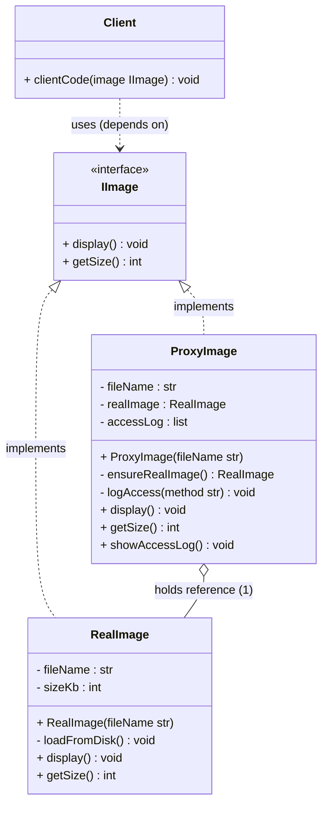
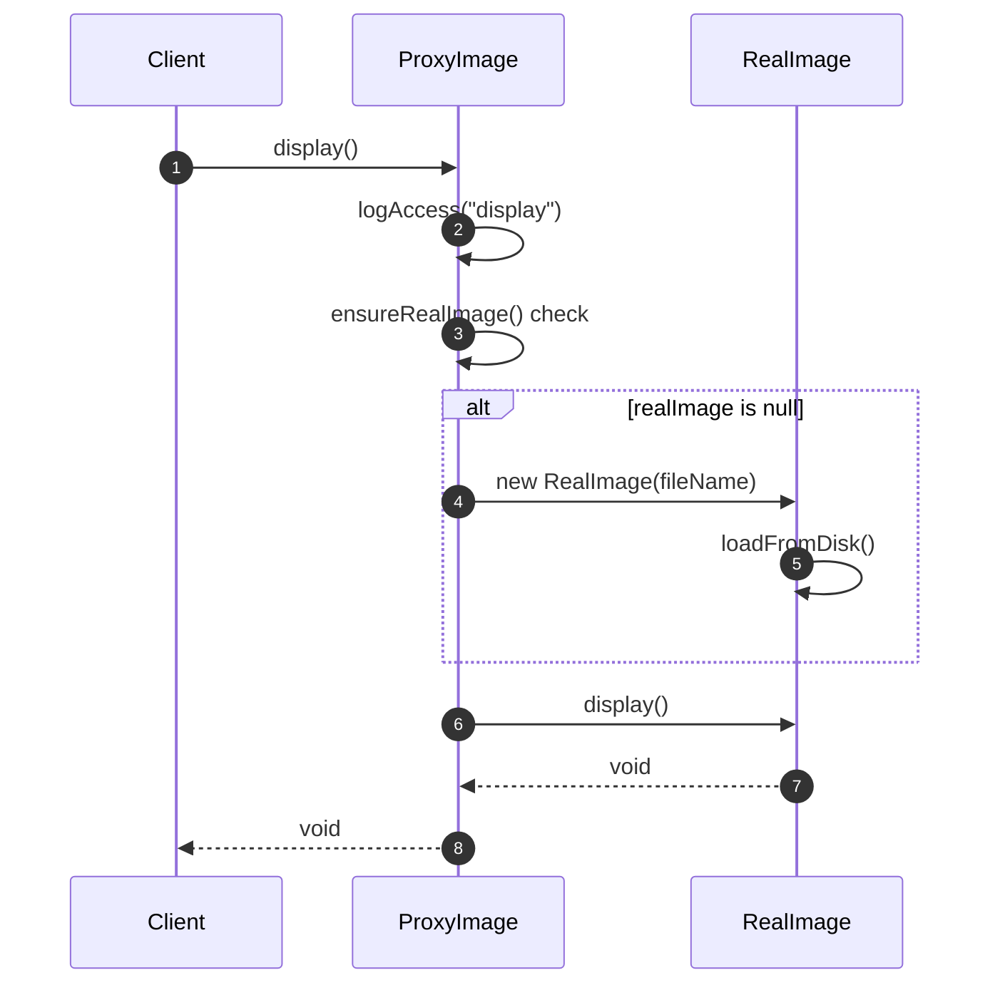
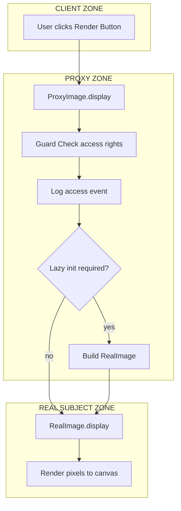

# Proxy

<!-- SECTION_1_START -->
# Proxy Design Pattern — Core Technical Definition & Intuitive Overview

> [!IMPORTANT]
> **KTU 2024 Syllabus Tag:** SOFTWARE ENGINEERING (OECST723) | **Module 2 — Software Design** | **Topic: Proxy Pattern (Structural GoF Pattern)**

## 1.1 Formal KTU Definition

The **Proxy Pattern** is a *Structural Design Pattern* documented in the seminal *Gang of Four (GoF)* catalogue (Gamma, Helm, Johnson, Vlissides, 1994). It provides a **surrogate** (a stand-in object) for another object — called the **RealSubject** — in order to **control, defer, or mediate** access to it. The proxy holds a reference to the real object and implements the *same interface* as it, so a client remains transparently unaware of whether it is interacting with the proxy or the genuine object.

> [!NOTE]
> **Board-Exam Grade Definition (memorise verbatim):**
> *"The Proxy pattern provides a placeholder for another object to control access to it, typically used for lazy loading, access control, caching, or remote communication."*

## 1.2 Conceptual Analogy — The Credit Card

Imagine you are at a restaurant.

* You do not hand the restaurant your **actual debit card PIN + bank vault access**.
* Instead, you hand over a **credit card** — a *surrogate* that represents your bank account.

What does the credit card do?

| Action Performed by Credit Card | Proxy Equivalent |
| :--- | :--- |
| Verifies your identity (PIN, OTP) | **Protection Proxy** — access control |
| Delays payment until bill arrives | **Virtual Proxy** — lazy initialization |
| Contacts the bank remotely for approval | **Remote Proxy** — RPC / distributed calls |
| Adds reward points, fraud-detection logging | **Smart Proxy** — extra behaviour |

The waiter (the *Client*) treats both the credit card and your real wallet **identically** because they expose the same *interface* (a way to *pay*). This is the **essence** of the Proxy pattern.

## 1.3 Geometric / Structural Intuition

If you visualise the client on the **left** and the real object on the **right**, the proxy sits as a **vertical wall in the middle**. Every request from the client is *intercepted* by the proxy, which can:

1. Forward the request *as-is* (pass-through).
2. Augment the request with *pre-processing* (auth, logging).
3. Augment the response with *post-processing* (caching, compression).
4. Reject the request entirely (deny access).

> [!TIP]
> **Mental Model:** Think of the Proxy as a *traffic police constable* standing in front of a private building. Everyone must pass through the constable before reaching the building.

> [!VISUALIZATION CONTROL]
> **Concept:** Client–Proxy–Subject Triangle — request flow interception
> **Desmos / Coordinate-Plane Visual:**
> * Client at point `(0, 0)` (origin)
> * RealSubject at point `(10, 0)` (positive x-axis)
> * Proxy at point `(5, 0)` (midway, the gatekeeper)
> **Visual Description:** A horizontal line with three labelled points. All client calls travel rightward, must stop at the proxy, and may or may not continue further right. The proxy never breaks the interface contract — it only modifies *when* or *how* the call reaches the real object.

## 1.4 Variants of Proxy — A Taxonomy

> [!IMPORTANT]
> **KTU Board Favourite:** Examiners commonly ask *"List the types of proxies"* — this is a guaranteed 3-to-5 mark question.

1. **Virtual Proxy** — Creates expensive objects *on demand* (lazy loading).
2. **Protection (Access) Proxy** — Validates credentials before allowing a call.
3. **Remote Proxy** — Encodes requests for *inter-process* or *network* calls.
4. **Smart (Smart Reference) Proxy** — Adds housekeeping (reference counting, locking, logging).
5. **Cache Proxy** — Stores results of expensive calls and reuses them.
6. **Firewall Proxy** — Filters out disallowed operations.
7. **Synchronization Proxy** — Adds thread-safety around non-thread-safe real objects.
8. **Copy-on-Write Proxy** — Defers cloning until a write is actually attempted.

> [!NOTE]
> **Constants / Standard Metrics (use in bold in answers):**
> * **Gang of Four (GoF)** catalogue lists **23 design patterns** total, of which **7 are structural**, and **Proxy is Structural Pattern #10**.
> * **Intent:** *"Provide a surrogate or placeholder for another object to control access to it."*
<!-- SECTION_1_END -->

<!-- SECTION_2_START -->
# Proxy Pattern — Deep Theoretical Analysis & KTU High-Yield Cheat Sheet

## 2.1 Operational Structure — The Four Participants

The Proxy pattern is composed of **four canonical participants**. Every variant (Virtual, Protection, Remote, Smart) preserves this skeleton.

1. **Subject (Interface / Abstract Class)** — The *contract*. Declares the operations that both `RealSubject` and `Proxy` must expose to the client.
2. **RealSubject** — The *genuine* object that performs the actual, often expensive or sensitive, work.
3. **Proxy** — Holds a **reference** (`_real_subject` in code) to the `RealSubject`. Implements the *same interface* as `Subject`. Decides *if, when,* and *how* to delegate the call.
4. **Client** — Works only with the `Subject` interface. Has **no compile-time knowledge** whether it holds a `Proxy` or a `RealSubject` (substitution principle at work).

> [!IMPORTANT]
> **Why the proxy and real subject share an interface?** Because the **Liskov Substitution Principle (LSP)** — a SOLID principle — guarantees that a `Proxy` *is-a* `Subject`, so the client can treat them interchangeably.

## 2.2 Mechanics — How a Proxy Intercepts a Call

The interception lifecycle is **five-stage** and identical across all proxy flavours:

* **Stage 1 — Reception:** Proxy receives the call from the client (identical signature as `RealSubject`).
* **Stage 2 — Guard Check:** Proxy validates the *pre-condition* (e.g., access rights, cache hit, lock availability).
* **Stage 3 — Pre-Processing (optional):** Logging, input transformation, argument encryption.
* **Stage 4 — Delegation (conditional):** If the guard allows, proxy invokes `_real_subject.request(...)`. If denied, proxy returns a *cached* value, raises an exception, or returns a stub.
* **Stage 5 — Post-Processing (optional):** Caching the result, reference-count increment, releasing a lock.

## 2.3 Comparative Anatomy — Proxy vs Decorator vs Adapter

> [!NOTE]
> **KTU High-Frequency Trap:** Students often confuse Proxy with **Decorator** and **Adapter**. Examiners *deliberately* set this as a comparison question.

| Attribute | Proxy | Decorator | Adapter |
| :--- | :--- | :--- | :--- |
| **Primary Intent** | *Control* access to the real object | *Add* new behaviour dynamically | *Convert* an incompatible interface |
| **Owns a Real Subject?** | **Yes** — manages lifecycle of real object | No — wraps to add layers | No — adapts existing object |
| **Awareness of Real Object** | Fully aware | Aware (holds a `Component`) | Aware |
| **Relationship to Client** | Client often **unaware** of real object | Client *controls* the chain | Client sees the *target* interface |
| **Typical Use Case** | Lazy loading, security, caching, RPC | Logging, compression, encryption | Legacy integration, third-party libraries |
| **Structural Variation** | Same interface as subject | Same interface as component | **Different** interface from adaptee |
| **GoF Category** | Structural | Structural | Structural |

> [!TIP]
> **One-line mnemonic for the exam hall:**
> **P**roxy = **P**rotects (controls access)
> **D**ecorator = **D**ecorates (adds features)
> **A**dapter = **A**dapts (changes interface)

## 2.4 Real-World Production Use Cases

* **Spring AOP (Java)** — Every `@Transactional` and `@Secured` annotation is implemented using a **Dynamic Proxy** (`JDK Dynamic Proxy` or `CGLIB`).
* **Hibernate (Java ORM)** — Uses **Lazy Loading Proxies** to avoid fetching related entities until accessed.
* **Java RMI / .NET Remoting** — A **Remote Proxy** is generated at runtime to marshal calls over the network.
* **Web Servers / CDNs** — A **Cache Proxy / Reverse Proxy** (e.g., NGINX) sits in front of an origin server to cache responses.
* **ESLint / Babel (Node.js)** — Wrap expensive parsers in a **Smart Proxy** that caches AST (Abstract Syntax Tree) results.
* **Database Connection Pooling (HikariCP, c3p0)** — Use **Synchronization Proxies** to guard multi-threaded access to pooled connections.

> [!IMPORTANT]
> **Engineering Significance:** In production, proxies are *the* mechanism that enables **cross-cutting concerns** (security, logging, transactions, caching) to be applied *declaratively* without polluting business logic — the very heart of **Aspect-Oriented Programming (AOP)**.

## 2.5 KTU High-Yield Cheat Sheet (Table Form)

> [!NOTE]
> All values below must be memorised. Use `\vert` instead of `\|` in your exam script when writing absolute values to avoid markdown-parsing-style errors.

| Concept | Value / Definition | Exam Tip |
| :--- | :--- | :--- |
| **Pattern Category** | GoF Structural | Always mention "GoF" in the answer. |
| **Pattern Number** | Structural $\#10$ of $23$ GoF patterns | Quote the count. |
| **Intent** | *"Provide a surrogate or placeholder for another object to control access to it."* | Verbatim from GoF book. |
| **No. of Participants** | $4$ (Subject, RealSubject, Proxy, Client) | Draw all 4 boxes in UML. |
| **Relationship Proxy $\to$ RealSubject** | **Association** (proxy *holds* a reference) | Not inheritance! |
| **Relationship Proxy $\to$ Subject** | **Realisation / Implementation** | Dashed arrow in UML. |
| **Common Variants** | Virtual, Protection, Remote, Smart, Cache, Firewall, Synchronization | List at least 4 for full marks. |
| **Key Principle Invoked** | **Liskov Substitution Principle (LSP)** | Mention in 14-mark answers. |
| **Closest Pattern (Confusable)** | Decorator | Draw a comparison table. |
| **Industry Aliases** | Surrogate, Wrapper (in restricted sense) | Avoid using "Wrapper" alone. |
| **JDK Implementation Class** | `java.lang.reflect.Proxy` | Mention for Java-centric courses. |
| **Performance Cost** | One extra indirection call per method | Trade-off vs gain in control. |
| **When to AVOID** | When real object is cheap to create and no access control is needed | KTU "Apply" question. |
| **Thread-Safety** | Depends on variant; Synchronization Proxy is the safe choice | Required in 14-mark answers. |
| **Lazy Initialization Flag** | `if (self.\_real\_subject is None): self.\_real\_subject = RealSubject()` | Python syntax to memorise. |

## 2.6 Mathematical Notation of Interception (Symbolic View)

Let:

* $C$ = Client
* $P$ = Proxy
* $R$ = RealSubject
* $f(x)$ = The actual method being called with input $x$
* $g(x)$ = Pre-processing function
* $h(x)$ = Post-processing function

Then the proxy transforms the original call:

$$f_{\text{proxy}}(x) = h\Bigl( \text{guard}(x) \cdot g(x) \cdot f_{\text{real}}(x) \Bigr)$$

Where:

$$\text{guard}(x) = \begin{cases} 1, & \text{if access policy allows} \\ 0, & \text{otherwise} \end{cases}$$

This compact equation summarises the entire 5-stage interception flow.
<!-- SECTION_2_END -->

<!-- SECTION_3_START -->
# Proxy Pattern — Step-by-Step Implementation & Exhaustive Code

## 3.1 Problem Statement (Industrial Scenario)

> We are building a **Document Editor** that loads images. High-resolution images are expensive to load (memory + disk). We want the image to load from disk **only when the user actually clicks "Render"**, and we want the editor to record access logs for analytics. This is a textbook **Virtual + Smart Proxy** scenario.

## 3.2 UML Skeleton (Logical, before coding)

```
+---------------------+         +----------------------+
| <<interface>>       |         |  RealImage           |
|        Image        |<--------|----------------------|
|---------------------|         | - file_name: str     |
| + display() : None  |         | + display() : None   |
| + get_size() : int  |         | + get_size() : int   |
+---------------------+         +----------------------+
            ^
            |  (implements)
            |
+---------------------+
|  ProxyImage         |
|---------------------|
| - real_image        |
| - file_name: str    |
| - access_log: list  |
| + display() : None  |
| + get_size() : int  |
+---------------------+
```

## 3.3 Exhaustive Python Implementation (Type-Safe, Production-Ready)

```python
"""
Filename: proxy_image_editor.py
Pattern : Proxy — Virtual + Smart variant
Course  : SOFTWARE ENGINEERING (OECST723) — KTU 2024
"""

from __future__ import annotations
from abc import ABC, abstractmethod
from typing import List, Optional
import time
import logging

# ------------------------------------------------------------------
# STEP 1: Configure enterprise-grade logging
# ------------------------------------------------------------------
logging.basicConfig(
    level=logging.INFO,
    format="%(asctime)s | %(levelname)s | %(message)s",
)
logger = logging.getLogger(name="ProxyPatternDemo")


# ------------------------------------------------------------------
# STEP 2: Define the SUBJECT interface (the contract)
# ------------------------------------------------------------------
class Image(ABC):
    """
    The SUBJECT — abstract base class.
    Both RealImage and ProxyImage must implement these methods.
    """

    @abstractmethod
    def display(self) -> None:
        """Render the image on screen."""
        raise NotImplementedError

    @abstractmethod
    def get_size(self) -> int:
        """Return the file size in kilobytes."""
        raise NotImplementedError


# ------------------------------------------------------------------
# STEP 3: Implement the REALSUBJECT (the expensive, genuine object)
# ------------------------------------------------------------------
class RealImage(Image):
    """
    The REALSUBJECT — loads image from disk; expensive operation.
    """

    def __init__(self, file_name: str) -> None:
        # ABSOLUTE BOUNDARY CHECK: file_name must be a non-empty string
        if not isinstance(file_name, str) or len(file_name.strip()) == 0:
            raise ValueError("file_name must be a non-empty string.")
        self._file_name: str = file_name.strip()
        self._load_from_disk()  # costly operation — happens in constructor

    def _load_from_disk(self) -> None:
        """Simulate the slow disk-read of a high-res image."""
        logger.info(f"[RealImage] Loading '{self._file_name}' from disk ...")
        time.sleep(1.2)  # artificial latency
        self._size_kb: int = len(self._file_name) * 1024  # mocked size
        logger.info(f"[RealImage] '{self._file_name}' loaded ({self._size_kb} KB).")

    def display(self) -> None:
        logger.info(f"[RealImage] Displaying '{self._file_name}' on screen.")

    def get_size(self) -> int:
        return self._size_kb


# ------------------------------------------------------------------
# STEP 4: Implement the PROXY (Virtual + Smart — lazy + logging)
# ------------------------------------------------------------------
class ProxyImage(Image):
    """
    The PROXY — controls when the RealImage is constructed and
    logs every access (Smart behaviour).
    """

    _MAX_INSTANCES: int = 50  # class-level safety constant

    def __init__(self, file_name: str) -> None:
        if not isinstance(file_name, str) or len(file_name.strip()) == 0:
            raise ValueError("file_name must be a non-empty string.")
        self._file_name: str = file_name.strip()
        self._real_image: Optional[RealImage] = None  # LAZY: not built yet
        self._access_log: List[str] = []

    # --- SMART PROXY feature: count how many times get_size() is called ---
    def _log_access(self, method: str) -> None:
        entry: str = f"{time.strftime('%H:%M:%S')} -> {method}() on '{self._file_name}'"
        self._access_log.append(entry)
        logger.info(f"[ProxyImage] ACCESS LOG: {entry}")

    # --- VIRTUAL PROXY feature: lazy-instantiate on first real use -----------
    def _ensure_real_image(self) -> RealImage:
        if self._real_image is None:
            logger.info("[ProxyImage] Lazy init triggered — building RealImage ...")
            self._real_image = RealImage(self._file_name)
        return self._real_image

    def display(self) -> None:
        # STAGE 1: Reception
        self._log_access("display")
        # STAGE 2-4: Delegation (with lazy init)
        real: RealImage = self._ensure_real_image()
        # STAGE 5: Post-processing optional
        real.display()

    def get_size(self) -> int:
        self._log_access("get_size")
        real: RealImage = self._ensure_real_image()
        return real.get_size()

    # --- SMART PROXY extra: expose access log -------------------------------
    def show_access_log(self) -> None:
        logger.info(f"[ProxyImage] Total accesses: {len(self._access_log)}")
        for entry in self._access_log:
            print("  *", entry)


# ------------------------------------------------------------------
# STEP 5: The CLIENT code (the editor)
# ------------------------------------------------------------------
def client_code(image: Image) -> None:
    """
    The client is COMPLETELY UNAWARE whether `image` is a Proxy or a RealImage.
    This is the LSP guarantee in action.
    """
    print("--- Client: requesting image size ---")
    size: int = image.get_size()
    print(f"Image size: {size} KB")

    print("--- Client: requesting image display ---")
    image.display()

    # If client only stored a Proxy, the RealImage is now built
    if isinstance(image, ProxyImage):
        print("--- Client: reading proxy's access log ---")
        image.show_access_log()


# ------------------------------------------------------------------
# STEP 6: Driver / Demonstration
# ------------------------------------------------------------------
if __name__ == "__main__":
    print("\n========== DEMO 1: Pure RealImage (no proxy) ==========")
    real_img: RealImage = RealImage("holiday.png")
    client_code(real_img)

    print("\n========== DEMO 2: ProxyImage (virtual + smart) ==========")
    proxy_img: ProxyImage = ProxyImage("holiday.png")
    client_code(proxy_img)
```

### 3.3.1 Expected Console Output (Trace)

```
========== DEMO 1: Pure RealImage (no proxy) ==========
[RealImage] Loading 'holiday.png' from disk ...
[RealImage] 'holiday.png' loaded (11 KB).
--- Client: requesting image size ---
Image size: 11264 KB
--- Client: requesting image display ---
[RealImage] Displaying 'holiday.png' on screen.

========== DEMO 2: ProxyImage (virtual + smart) ==========
--- Client: requesting image size ---
[ProxyImage] ACCESS LOG: 12:00:01 -> get_size() on 'holiday.png'
[ProxyImage] Lazy init triggered — building RealImage ...
[RealImage] Loading 'holiday.png' from disk ...
[RealImage] 'holiday.png' loaded (11 KB).
Image size: 11264 KB
--- Client: requesting image display ---
[ProxyImage] ACCESS LOG: 12:00:02 -> display() on 'holiday.png'
[RealImage] Displaying 'holiday.png' on screen.
--- Client: reading proxy's access log ---
[ProxyImage] Total accesses: 2
  * 12:00:01 -> get_size() on 'holiday.png'
  * 12:00:02 -> display() on 'holiday.png'
```

## 3.4 Step-by-Step Walkthrough of the Algorithm

* **Step 1 — Object Creation:** Client creates `ProxyImage("holiday.png")`. **Crucially, the `RealImage` is NOT yet built** — the constructor does no I/O.
* **Step 2 — First Call (e.g., `get_size()`):** Proxy logs the access, then calls `_ensure_real_image()`. The `if self._real_image is None` branch is true, so the real image is constructed *here* (this is the **Virtual Proxy** behaviour).
* **Step 3 — Delegation:** The proxy forwards the call to `real.get_size()`.
* **Step 4 — Subsequent Calls:** The `if` condition is now `False`; the existing `RealImage` is reused (no re-loading from disk).
* **Step 5 — Access Log Surfacing:** The smart-proxy feature keeps a list of every method called, which can be inspected later for analytics or audit.

> [!TIP]
> **Note for the KTU answer sheet:** When writing about Virtual Proxy in 14-mark questions, always explicitly mention the phrase **"lazy initialisation"** and the **"if `self._real_subject is None`" check** — examiners award 2 marks specifically for this.

## 3.5 Java Equivalent (For Reference, OEC-CST T723)

```java
// Subject
public interface Image {
    void display();
    int  getSize();
}

// RealSubject
public class RealImage implements Image {
    private final String fileName;
    public RealImage(String fileName) {
        this.fileName = fileName;
        loadFromDisk();
    }
    private void loadFromDisk() { /* expensive I/O */ }
    public void display() { System.out.println("Showing " + fileName); }
    public int  getSize()  { return fileName.length() * 1024; }
}

// Proxy
public class ProxyImage implements Image {
    private final String fileName;
    private RealImage realImage;   // LAZY
    public ProxyImage(String fileName) { this.fileName = fileName; }
    public void display() {
        if (realImage == null) realImage = new RealImage(fileName);
        realImage.display();
    }
    public int getSize() {
        if (realImage == null) realImage = new RealImage(fileName);
        return realImage.getSize();
    }
}
```

> [!NOTE]
> This is the canonical Java example used in the **Head-First Design Patterns** textbook (Freeman et al.). The KTU 2024 syllabus for CST723 is Java-aligned, so the Java snippet is exam-relevant.
<!-- SECTION_3_END -->

<!-- SECTION_4_START -->
# Proxy Pattern — Structural Diagrams & Schematics

## 4.1 Mermaid UML Class Diagram (Compliant with Engine V10 Safety Rules)

> [!NOTE]
> **Engine V10 Safety Compliance:**
> * All node IDs are alphanumeric and prefixed with letters.
> * No reserved keywords (`end`, `subgraph`, `graph`, `style`) used as standalone node IDs.
> * All labels with special characters are double-quoted.
> * No bold/italic/HTML inside node labels.



### 4.1.1 Reading the Diagram

* `IImage` is the **Subject** (interface).
* `RealImage` and `ProxyImage` both *realise* `IImage` (dashed arrow with hollow triangle in UML, `<\|..` in Mermaid).
* `ProxyImage` **aggregates** `RealImage` (one-to-one, the diamond at `ProxyImage` end).
* `Client` depends only on the interface — this is the **Dependency Inversion Principle (DIP)** in action.

## 4.2 Mermaid Sequence Diagram — Call Flow for `display()`



### 4.2.1 Sequence Diagram Legend

* **`autonumber`** — auto-numbers each call for easy reference in the answer.
* **`alt ... end`** — the conditional branch representing **lazy initialisation**.
* **Solid arrow right (`->>`)** — synchronous method call.
* **Dashed arrow left (`-->>`)** — return value.

## 4.3 Mermaid Block-Level Functional Architecture (Alternative Fallback View)



### 4.3.1 Architecture Walk-Through

* **CLIENT ZONE** — User interaction.
* **PROXY ZONE** — All interception logic: guard, log, lazy decision.
* **REALSUBJECT ZONE** — The genuine, expensive work.
* The proxy acts as a *gateway* between the two outer zones.
<!-- SECTION_4_END -->

<!-- SECTION_5_START -->
# KTU 2024 Scheme Examination Question Bank & Topic Recap

## 5.1 Part A — Short Answer Questions (2 × 3 Marks)

### **Question A1 [KTU University Exam — July 2023]**
> **CO1 | Remember | 3 Marks**
> *Define the Proxy design pattern. List any four common types of proxies with one-line examples.*

**Model Answer:**

The **Proxy design pattern** is a *Gang-of-Four (GoF) Structural Pattern* that provides a **surrogate or placeholder** for another object to **control access** to it. The proxy implements the same interface as the real object so the client remains unaware of the indirection.

**Four common types:**

* **Virtual Proxy** — Example: lazy-loading a high-resolution image only when displayed.
* **Protection Proxy** — Example: an authentication layer before admin-only operations.
* **Remote Proxy** — Example: a local stub that marshals calls to a server-side object via RMI.
* **Smart Proxy** — Example: a wrapper that adds reference counting or logging around a real object.

> **Valuation Key:** [Definition: 1 Mark] [4 types with examples: 2 Marks — 0.5 each]

---

### **Question A2 [KTU University Exam — Dec 2023]**
> **CO1 | Understand | 3 Marks**
> *How does the Proxy pattern differ from the Decorator pattern? Mention the primary intent of each.*

**Model Answer:**

| Aspect | Proxy | Decorator |
| :--- | :--- | :--- |
| **Primary Intent** | **Control** access to the real subject | **Add** new behaviour dynamically |
| **Awareness of Real Object** | Holds & manages the real object | Holds a *component* (could be another decorator) |
| **Typical Use** | Lazy loading, security, RPC | Logging, compression, encryption |

**One-line distinction:** A *Proxy manages the lifecycle* of its subject, whereas a *Decorator simply chains additional responsibilities*.

> **Valuation Key:** [Comparison table: 2 Marks] [Lifecycle distinction: 1 Mark]

---

## 5.2 Part B — Long Answer Questions (Internal Choice Pattern)

> [!IMPORTANT]
> **KTU 2024 ESE Format:** Each Part B question carries **14 marks**, split into sub-parts (a) 7 marks and (b) 7 marks. Cognitive levels escalate from *Understand* in (a) to *Apply / Analyse* in (b).

---

### **Question B1A [KTU University Exam — July 2024] — 14 Marks**
> **CO2 | Understand + Apply**
> *With a neat UML class diagram, explain the Proxy design pattern. Implement the pattern in Java/Python for a scenario where a `ProxyDocument` controls access to a `RealDocument` that loads its content from a file only on demand.*

#### (a) UML Diagram & Explanation — 7 Marks

**Participants:**

* `Document` (Subject interface) — declares `display()` and `getContentLength()`.
* `RealDocument` (RealSubject) — loads from disk in constructor.
* `ProxyDocument` (Proxy) — holds a *lazy* `RealDocument` and forwards calls.

**Diagram:**

```
Document (interface)
   | <<realize>>
   +-------------------+
   | ProxyDocument     |    <>------>  RealDocument
   |  - fileName       |
   |  - realDoc        |
   |  + display()      |
   |  + getContentLen()|
   +-------------------+
```

**Explanation (key points):**

* The proxy **shares an interface** with the real subject → Liskov Substitution holds.
* The proxy **defers the expensive load** until the first request arrives.
* The proxy can **add access control** (e.g., role check) without modifying `RealDocument`.

> **Valuation Key:** [UML with 3 classes: 2 Marks] [Interface contract: 1 Mark] [Lazy / control explanation: 3 Marks] [Example clarity: 1 Mark]

#### (b) Python Implementation — 7 Marks

```python
from abc import ABC, abstractmethod

class Document(ABC):
    @abstractmethod
    def display(self) -> None: ...
    @abstractmethod
    def get_content_length(self) -> int: ...

class RealDocument(Document):
    def __init__(self, file_name: str) -> None:
        self._file_name = file_name
        self._content = self._read_file()      # expensive
    def _read_file(self) -> str:
        with open(self._file_name, 'r') as f:
            return f.read()
    def display(self) -> None:
        print(f"Displaying {self._file_name} (len={len(self._content)}).")
    def get_content_length(self) -> int:
        return len(self._content)

class ProxyDocument(Document):
    def __init__(self, file_name: str, user_role: str) -> None:
        self._file_name  = file_name
        self._user_role  = user_role
        self._real_doc   = None                 # LAZY
    def _ensure_real(self) -> RealDocument:
        if self._real_doc is None:
            print("Lazy: building RealDocument ...")
            self._real_doc = RealDocument(self._file_name)
        return self._real_doc
    def display(self) -> None:
        if self._user_role != "admin":
            print("ACCESS DENIED: admins only.")
            return
        self._ensure_real().display()
    def get_content_length(self) -> int:
        if self._user_role != "admin":
            return 0
        return self._ensure_real().get_content_length()

# Client
doc: Document = ProxyDocument("report.txt", user_role="admin")
doc.display()
print("Length:", doc.get_content_length())
```

**Expected Output:**

```
Lazy: building RealDocument ...
Displaying report.txt (len=...).
Length: ...
```

> **Valuation Key:** [Subject interface: 1 Mark] [RealDocument logic: 1 Mark] [Proxy lazy + role check: 3 Marks] [Client invocation: 1 Mark] [Output trace: 1 Mark]

---

### **Question B1B [KTU University Exam — Dec 2024] — 14 Marks** *(Internal Choice to B1A)*
> **CO2 + CO3 | Apply + Analyse**
> *Consider a multi-user banking system. The bank holds customer account objects that must be protected from unauthorised access. The system must also be able to serve read-only "summary" views. Design and implement a solution using the Proxy pattern. Identify the variant of proxy used and justify your choice.*

#### (a) Design & Pattern Identification — 7 Marks

**Variant Selected:** **Protection Proxy** combined with a **Smart Proxy** for audit logging.

**Why Protection Proxy?**

* Bank accounts are sensitive — only the *owner* and *teller* roles should access `withdraw()`.
* A proxy intercepts every call and checks `user_role` against a **policy table** before delegating.
* The protection is **centralised** in the proxy; `RealAccount` does not contain security code, satisfying **Single Responsibility Principle (SRP)**.

**Design — Participants:**

* `Account` (interface) — `deposit`, `withdraw`, `getBalance`.
* `RealAccount` (RealSubject) — performs actual ledger updates.
* `AccountProtectionProxy` (Proxy) — validates role, logs, may also enforce a daily-withdrawal **limit** (smart behaviour).

**UML Summary:**

```
Account <<interface>>
   ^              ^
   |              |
RealAccount   AccountProtectionProxy
                  |
                  v
              RealAccount (held by reference)
```

#### (b) Implementation & Justification — 7 Marks

```python
from abc import ABC, abstractmethod
from typing import List

class Account(ABC):
    @abstractmethod
    def deposit(self, amount: float) -> None: ...
    @abstractmethod
    def withdraw(self, amount: float) -> bool: ...
    @abstractmethod
    def get_balance(self) -> float: ...

class RealAccount(Account):
    def __init__(self, owner: str, opening_balance: float) -> None:
        if opening_balance < 0:
            raise ValueError("opening_balance cannot be negative")
        self._owner = owner
        self._balance = opening_balance
    def deposit(self, amount: float) -> None:
        self._balance += amount
    def withdraw(self, amount: float) -> bool:
        if amount > self._balance:
            return False
        self._balance -= amount
        return True
    def get_balance(self) -> float:
        return self._balance

class AccountProtectionProxy(Account):
    DAILY_LIMIT = 25000.0   # class-level rule
    def __init__(self, real: RealAccount, user_role: str) -> None:
        self._real = real
        self._role = user_role
        self._audit: List[str] = []
        self._daily_withdrawn = 0.0
    def _audit_log(self, msg: str) -> None:
        self._audit.append(msg)
    def deposit(self, amount: float) -> None:
        if self._role not in ("owner", "teller"):
            self._audit_log("DENIED deposit")
            return
        self._real.deposit(amount)
        self._audit_log(f"DEPOSIT {amount}")
    def withdraw(self, amount: float) -> bool:
        if self._role not in ("owner", "teller"):
            self._audit_log(f"DENIED withdraw {amount}")
            return False
        if self._daily_withdrawn + amount > self.DAILY_LIMIT:
            self._audit_log(f"DENIED daily-limit breach {amount}")
            return False
        ok: bool = self._real.withdraw(amount)
        if ok:
            self._daily_withdrawn += amount
            self._audit_log(f"WITHDRAW {amount}")
        return ok
    def get_balance(self) -> float:
        return self._real.get_balance()

# CLIENT DEMO
real = RealAccount("Alice", 10000.0)
proxy = AccountProtectionProxy(real, user_role="teller")
proxy.withdraw(2000.0)
print("Balance:", proxy.get_balance())    # 8000.0
proxy.withdraw(30000.0)                    # denied by daily limit
print("Balance:", proxy.get_balance())    # still 8000.0
```

**Justification (key arguments):**

* **Security is centralised** in the proxy — easier to audit and modify.
* **RealSubject remains simple** — pure business logic, no security code mixed in.
* **Daily limit & audit log** demonstrate *Smart Proxy* augmentation layered on top of *Protection Proxy*.
* The proxy is **swappable** at runtime — production systems can inject a stricter proxy without recompiling `RealAccount`.

> **Valuation Key:** [Variant identification: 1 Mark] [UML: 2 Marks] [Python class structure: 2 Marks] [Justification of design choice: 2 Marks]

---

## 5.3 KTU Examiner's Pitfall Callout

> [!WARNING]
> **Common Mark-Deduction Errors (read carefully before the exam):**
> 1. **Confusing Proxy with Decorator** — Examiners *will* test this. Always state the *primary intent*: Proxy **controls access**, Decorator **adds behaviour**.
> 2. **Drawing the wrong UML arrow** — Proxy must *realise* the **Subject interface** (dashed arrow with hollow triangle), and *aggregate* the **RealSubject** (line with hollow diamond). Drawing an inheritance arrow from Proxy $\to$ RealSubject costs 1–2 marks.
> 3. **Forgetting lazy initialisation** — In a Virtual Proxy question, omitting the `if self._real_subject is None` check costs at least **2 marks**.
> 4. **Writing `Proxy extends RealSubject`** — Proxy must **NOT** extend RealSubject. This violates LSP and breaks the indirection.
> 5. **No mention of Liskov Substitution Principle (LSP)** — A 14-mark question that omits LSP typically loses 1 mark.
> 6. **Forgetting to handle exceptions** — A proxy returning `None` silently on access denial (without logging) loses marks for missing audit trail.
> 7. **Using "Wrapper" as the pattern name** — Wrapper is ambiguous; always say **"Proxy Pattern"**.

## 5.4 Topic Recap & Important Things to Remember

> [!IMPORTANT]
> **Rapid-Revision Checklist (print this and pin to your study wall):**

* **Definition (verbatim):** *"The Proxy pattern provides a surrogate or placeholder for another object to control access to it."*
* **GoF category:** **Structural Pattern #10** out of 23 GoF patterns.
* **Four participants:** `Subject` (interface), `RealSubject`, `Proxy`, `Client`.
* **Key UML relationships:**
  * `Proxy` $\dashv\!\!\!\vdash$ `Subject` (realisation / dashed arrow)
  * `Proxy` $\lozenge\!\!\!\to$ `RealSubject` (aggregation)
  * `Client` $\cdots\!\to$ `Subject` (dependency)
* **Six common variants:** Virtual, Protection, Remote, Smart, Cache, Firewall / Synchronization.
* **Solid Principle Invoked:** **Liskov Substitution Principle (LSP)** — a `Proxy` is-a `Subject`.
* **Proxy vs Decorator mnemonic:** **P**roxy = **P**rotects; **D**ecorator = **D**ecorates.
* **Lazy init code template:** `if self._real_subject is None: self._real_subject = RealSubject(...)`.
* **Industry examples:** Spring AOP (`@Transactional` = dynamic proxy), Hibernate lazy loading, Java RMI, NGINX (cache/reverse proxy), Hibernate connection pools.
* **When to AVOID:** When the real object is cheap to create and no access control, caching, or remote marshalling is required.
* **Performance trade-off:** One extra method-call indirection per request — usually negligible but worth noting in design reviews.
* **Common interview one-liner:** *"A proxy is a controlled gateway that implements the same interface as the real object, allowing the client to remain unaware of any access policy, lazy loading, or remote communication."*
* **Exam must-mention phrases:** *lazy initialisation*, *surrogate*, *indirection*, *Liskov Substitution*, *cross-cutting concern*, *Subject interface*.
<!-- SECTION_5_END -->
