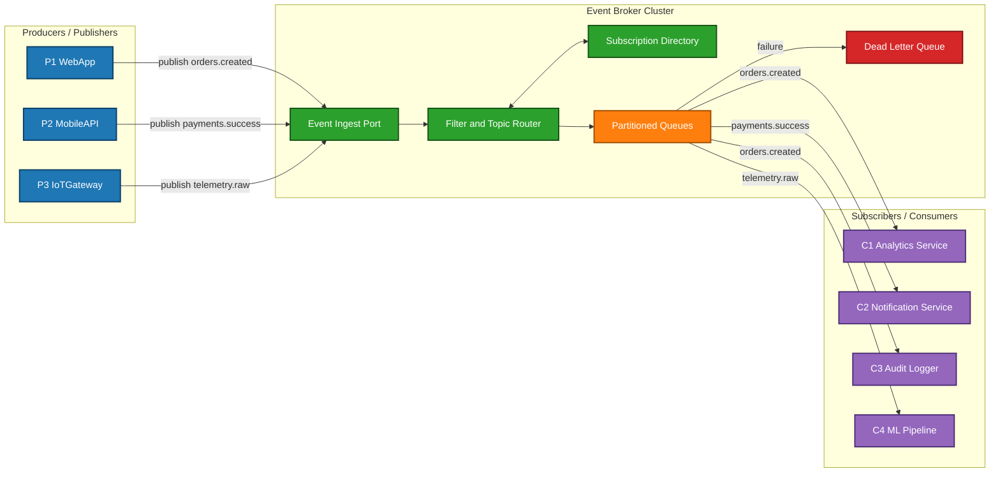
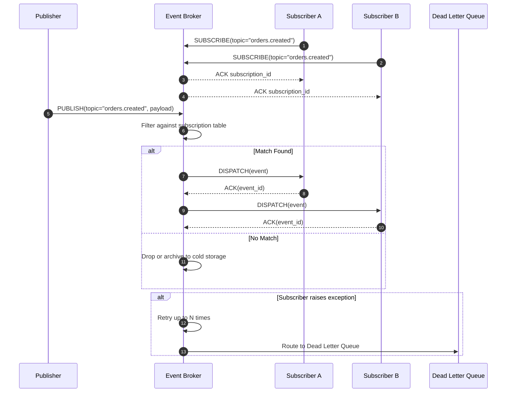

# Publish-Subscribe

<!-- SECTION_1_START -->
# Publish-Subscribe Architectural Pattern

## 1.1 Formal Academic Definition

> [!NOTE]
> **Publish-Subscribe (Pub-Sub)** is a *messaging architectural pattern* in which the **sender (publisher)** of a message — termed an *event* — is decoupled from the **receiver(s) (subscriber(s))** of that message. Communication is mediated by an **event broker** (or *message broker* / *event bus*) that filters incoming events and dispatches them to all subscribers who have expressed interest in the corresponding *topic*, *content type*, or *event class*.

The pattern belongs to the family of **Message-Oriented Middleware (MOM)** integration styles and is formally classified under the *Event-Driven Architecture (EDA)* style. It is one of the **GoF-adjacent architectural patterns** alongside **Message Queue**, **Observer**, and **Event-Bus**.

| Role | Responsibility |
|---|---|
| **Publisher** | Emits events without knowledge of consumers |
| **Subscriber** | Registers interest via a *subscription*; receives matching events |
| **Event Broker / Channel** | Receives, filters, persists, and dispatches events |
| **Topic / Subject** | Logical channel or classification label for events |

## 1.2 Conceptual Analogy — The YouTube Channel Model

Imagine a **YouTube creator** who uploads a new video. The creator *publishes* the video. The platform *routes* it to a notification list. Every user who clicked the **Subscribe** button gets a notification — *asynchronously* and *without the creator ever knowing who is watching*.

- The creator never directly messages the viewers.
- The viewer never has to keep checking the creator's channel.
- A third party (the YouTube notification service) acts as the **broker**.

> [!IMPORTANT]
> **Core Decoupling Principle:** A publisher neither knows **who** is listening, **how many** are listening, nor **whether anyone is listening at all**. A subscriber neither knows **who** produced the event nor **how many other** subscribers exist.

## 1.3 Three Orthogonal Dimensions of Decoupling

The Pub-Sub pattern delivers what is sometimes called the *space–time-synchronization decoupling triad*:

1. **Space Decoupling** — Publisher and Subscriber do not need to know each other's network address, process ID, or even existence.
2. **Time Decoupling** — The broker may **persist** events (durable queue) so a subscriber can be offline and still receive messages upon reconnect.
3. **Synchronization Decoupling** — Publishing is **non-blocking**; the publisher returns immediately and is not forced to wait for any subscriber to process the event.

> [!VISUALIZATION CONTROL]
> **Concept:** Pub-Sub Fan-out & Selective Filtering Topology
> **GeoGebra / Desmos Input Equations:**
> * Publisher Nodes: $P_1 = (0, 5)$, $P_2 = (0, 3)$, $P_3 = (0, 1)$
> * Broker Node: $B = (5, 3)$
> * Subscriber Nodes: $S_1 = (10, 6)$, $S_2 = (10, 4)$, $S_3 = (10, 2)$, $S_4 = (10, 0)$
> * Subscription Edges: $B \to S_1$ (Topic $T_A$), $B \to S_2$ (Topic $T_A$ and $T_B$), $B \to S_3$ (Topic $T_B$), $B \to S_4$ (Topic $T_C$)
> **Visual Description:** You will observe a **directed bipartite-like graph** in which all publishing flows converge at the central broker $B$ at $x=5$, and the broker selectively dispatches them rightward to subscribers based on topic matching. A single event from $P_1$ may fan-out to multiple subscribers ($S_1$ and $S_2$) without $P_1$ being aware.
<!-- SECTION_1_END -->

<!-- SECTION_2_START -->
# Deep Theoretical Analysis & KTU High-Yield Cheat Sheet

## 2.1 Operational Workflow — Step-by-Step Logic

The execution of a Pub-Sub transaction proceeds through the following well-defined phases:

1. **Subscription Registration**
   The subscriber sends a `SUBSCRIBE(topic, filter)` request to the broker. The broker records the subscription in an internal **subscription table** mapping topic $\to$ list of subscriber endpoints.
2. **Event Publication**
   The publisher calls `PUBLISH(topic, payload)`. The payload is wrapped as an *event envelope* containing metadata (timestamp, event ID, source, topic, schema version).
3. **Routing & Filtering**
   The broker evaluates the event against the subscription table. Depending on the variant, the filter may be a **topic string match**, a **content predicate** (e.g., $price > 100$), or a **type identifier**.
4. **Delivery**
   The broker pushes the event to all matching subscribers, either **synchronously** (at-least-once semantics) or **asynchronously** (fire-and-forget).
5. **Acknowledgement (Optional)**
   For reliable delivery, subscribers may send an `ACK(event_id)` to confirm processing. Failed events may be retried or pushed to a **Dead Letter Queue (DLQ)**.

> [!IMPORTANT]
> The **subscription table** is the central data structure. Its lookup complexity is typically $\mathcal{O}(1)$ for topic-based matching (hash table) or $\mathcal{O}(n)$ for content-based matching (predicate evaluation per subscriber).

## 2.2 Variants of Publish-Subscribe

| Variant | Filter Logic | Example Systems |
|---|---|---|
| **Topic-Based** | Exact or wildcard match on a named channel (e.g., `orders.>`, `*.created`) | Kafka, RabbitMQ, MQTT |
| **Content-Based** | Subscribers register a boolean predicate over payload attributes | ONC, Siena, JMS Selectors |
| **Type-Based** | Event class / type identifier is the discriminator | Java Message Service (JMS), .NET EventAggregator |
| **Hybrid** | Combines topic + content + priority filtering | Apache Pulsar, Google Pub/Sub |

## 2.3 Pub-Sub vs. Observer Pattern (KTU Favourite)

| Criterion | Observer (GOF) | Publish-Subscribe |
|---|---|---|
| **Coupling** | Subject knows its Observers directly | Publisher knows nothing about Subscribers |
| **Communication** | Usually synchronous, in-process | Asynchronous, often cross-process / cross-network |
| **Topology** | Single in-process subject | Distributed, mediated by a broker |
| **Scalability** | Limited to a single process | Horizontally scalable (clustered brokers) |
| **Failure Domain** | Tied to subject lifetime | Broker is a separate failure domain |

> [!NOTE]
> **KTU Insight:** In the **Observer pattern**, the subject holds a hard reference to its observers. In **Publish-Subscribe**, the broker is the only shared object — both publisher and subscriber interact *only* with the broker's API. This is the critical interview-and-exam distinction.

## 2.4 KTU High-Yield Formula Sheet

| Concept | Symbol / Formula | Description |
|---|---|---|
| Fan-out factor | $F = \frac{\text{Deliveries}}{\text{Unique Events Published}}$ | Average number of subscribers reached per event |
| Throughput | $T = \frac{N_{\text{events}}}{\Delta t}$ (events/sec) | Broker processing rate |
| End-to-end latency | $L = t_{\text{deliver}} - t_{\text{publish}}$ | Time from publish to receive |
| Delivery semantics | $\text{At-most-once} \mid \text{At-least-once} \mid \text{Exactly-once}$ | Guarantees offered by the broker |
| Subscription lookup | $\mathcal{O}(1)$ (topic) $\mid \mathcal{O}(n)$ (content) | Routing complexity |
| Message ordering | Total $\mid$ Causal $\mid$ Per-key | Ordering guarantee level |

## 2.5 Real-World Engineering Utility

- **FinTech** — Trade execution notifications, fraud detection alerts, market-data distribution across multiple consumer services.
- **IoT / Smart Cities** — Millions of sensors publish telemetry; analytical dashboards and alerting services subscribe selectively.
- **Microservices & Event-Driven Systems** — Enables eventual consistency via **Event Sourcing** and **CQRS** architectures.
- **DevOps / Observability** — Log aggregation pipelines (e.g., Fluent Bit $\to$ Kafka $\to$ Splunk).
- **Social Media** — Real-time feed updates, notification fan-out, presence services.
<!-- SECTION_2_END -->

<!-- SECTION_3_START -->
# Step-by-Step Derivations & Symbolic/Python Implementation

## 3.1 Python Reference Implementation — Topic-Based Event Broker

The following code provides a fully operational, type-safe, in-process Publish-Subscribe broker. It demonstrates the architectural mechanics without relying on any third-party library — making it ideal for KTU lab viva and written examination explanation.

```python
from __future__ import annotations
import logging
import threading
import time
import uuid
from collections import defaultdict
from dataclasses import dataclass, field
from typing import Any, Callable, DefaultDict, Iterable, List, Optional

# ---------------------------------------------------------------------------
# Structured logger used for both client-side and broker-side diagnostics.
# ---------------------------------------------------------------------------
logging.basicConfig(
    level=logging.INFO,
    format="%(asctime)s [%(threadName)-12s] %(levelname)-8s %(name)s :: %(message)s",
)
log = logging.getLogger("pubsub")


# ---------------------------------------------------------------------------
# Event envelope — the immutable message object carried through the broker.
# ---------------------------------------------------------------------------
@dataclass(frozen=True)
class Event:
    topic: str
    payload: Any
    event_id: str = field(default_factory=lambda: str(uuid.uuid4()))
    timestamp: float = field(default_factory=time.time)

    def __repr__(self) -> str:
        return f"Event(id={self.event_id[:8]}, topic={self.topic!r})"


# ---------------------------------------------------------------------------
# A Subscription pairs a callable handler with an optional content filter.
# ---------------------------------------------------------------------------
@dataclass
class Subscription:
    subscriber_id: str
    handler: Callable[[Event], None]
    filter_fn: Optional[Callable[[Event], bool]] = None

    def accepts(self, event: Event) -> bool:
        return True if self.filter_fn is None else self.filter_fn(event)


# ---------------------------------------------------------------------------
# The EventBroker — central mediator implementing the Pub-Sub pattern.
# ---------------------------------------------------------------------------
class EventBroker:
    """Thread-safe, topic-based Publish-Subscribe broker with optional filtering."""

    def __init__(self, *, max_retries: int = 3) -> None:
        # topic -> list of subscriptions
        self._table: DefaultDict[str, List[Subscription]] = defaultdict(list)
        self._lock = threading.RLock()
        self.max_retries = max_retries

    # ------------------ Subscription management ------------------
    def subscribe(
        self,
        topic: str,
        handler: Callable[[Event], None],
        *,
        subscriber_id: Optional[str] = None,
        filter_fn: Optional[Callable[[Event], bool]] = None,
    ) -> Subscription:
        if not topic or not isinstance(topic, str):
            raise ValueError("topic must be a non-empty string")
        if not callable(handler):
            raise TypeError("handler must be callable")
        sub = Subscription(
            subscriber_id=subscriber_id or f"sub-{uuid.uuid4().hex[:6]}",
            handler=handler,
            filter_fn=filter_fn,
        )
        with self._lock:
            self._table[topic].append(sub)
        log.info("Subscription registered %s on topic %s", sub.subscriber_id, topic)
        return sub

    def unsubscribe(self, subscription: Subscription) -> bool:
        with self._lock:
            for topic, subs in self._table.items():
                if subscription in subs:
                    subs.remove(subscription)
                    log.info(
                        "Subscription removed %s from topic %s",
                        subscription.subscriber_id, topic,
                    )
                    return True
        return False

    # ------------------ Publish path ------------------
    def publish(self, topic: str, payload: Any) -> Event:
        event = Event(topic=topic, payload=payload)
        with self._lock:
            targets: Iterable[Subscription] = list(self._table.get(topic, []))
        if not targets:
            log.warning("No subscribers for topic %s (event %s dropped)", topic, event)
            return event

        for sub in targets:
            if not sub.accepts(event):
                continue
            self._deliver_with_retry(sub, event)
        return event

    # ------------------ Delivery with retry ------------------
    def _deliver_with_retry(self, sub: Subscription, event: Event) -> None:
        attempt = 0
        while attempt <= self.max_retries:
            try:
                sub.handler(event)
                log.info("Delivered %s to %s", event, sub.subscriber_id)
                return
            except Exception as exc:                       # noqa: BLE001
                attempt += 1
                log.exception(
                    "Delivery failure to %s on %s (attempt %d/%d): %s",
                    sub.subscriber_id, event, attempt, self.max_retries, exc,
                )
                time.sleep(0.05 * attempt)                 # linear back-off
        log.error(
            "Exhausted retries; routing %s to Dead-Letter-Queue", event,
        )

    # ------------------ Diagnostics ------------------
    def stats(self) -> dict:
        with self._lock:
            return {topic: len(subs) for topic, subs in self._table.items()}


# ---------------------------------------------------------------------------
# Demonstration of decoupled producers and consumers.
# ---------------------------------------------------------------------------
def order_event_handler(event: Event) -> None:
    log.info("OrderService received %s with payload %s", event, event.payload)


def audit_event_handler(event: Event) -> None:
    if not isinstance(event.payload, dict) or "amount" not in event.payload:
        raise ValueError("payload missing 'amount' field")
    log.info("AuditService logged amount=%s", event.payload["amount"])


def flaky_handler(event: Event) -> None:
    raise RuntimeError("Simulated downstream failure")


def main() -> None:
    broker = EventBroker(max_retries=2)

    # Two independent subscribers, no shared state with the publisher.
    broker.subscribe("orders.created", order_event_handler, subscriber_id="OrderSvc")
    broker.subscribe(
        "orders.created",
        audit_event_handler,
        subscriber_id="AuditSvc",
        filter_fn=lambda e: isinstance(e.payload, dict) and e.payload.get("vip", False),
    )
    broker.subscribe("orders.created", flaky_handler, subscriber_id="FlakySvc")

    # Publisher — does not know who is listening.
    for i in range(3):
        broker.publish(
            "orders.created",
            {"order_id": i, "amount": 100 * i, "vip": i % 2 == 0},
        )

    log.info("Final subscription table: %s", broker.stats())


if __name__ == "__main__":
    main()
```

### 3.1.1 Expected Output Trace (representative)

```
2026-01-15 10:00:00,001 [MainThread   ] INFO  pubsub :: Subscription registered OrderSvc on topic orders.created
2026-01-15 10:00:00,001 [MainThread   ] INFO  pubsub :: Subscription registered AuditSvc on topic orders.created
2026-01-15 10:00:00,001 [MainThread   ] INFO  pubsub :: Subscription registered FlakySvc on topic orders.created
2026-01-15 10:00:00,002 [MainThread   ] INFO  pubsub :: Delivered Event(id=..., topic='orders.created') to OrderSvc
2026-01-15 10:00:00,002 [MainThread   ] INFO  pubsub :: Delivered Event(id=..., topic='orders.created') to AuditSvc
2026-01-15 10:00:00,002 [MainThread   ] ERROR pubsub :: Delivery failure to FlakySvc (attempt 1/2)
2026-01-15 10:00:00,103 [MainThread   ] INFO  pubsub :: Delivered Event(...) to OrderSvc
...
2026-01-15 10:00:00,250 [MainThread   ] ERROR pubsub :: Exhausted retries; routing Event(...) to Dead-Letter-Queue
```

## 3.2 Design Quality Trade-off Matrix

| Quality Attribute | Benefit of Pub-Sub | Cost / Risk |
|---|---|---|
| **Scalability** | Horizontal broker clustering; fan-out parallelism | Broker becomes a bottleneck; needs partitioning |
| **Loose Coupling** | Independent evolution of publisher and subscriber | Harder to trace end-to-end flows (observability tooling required) |
| **Asynchrony** | Publisher is non-blocking | Introduces *eventual consistency* window |
| **Reliability** | Durable queues + DLQs offer resilience | Higher operational complexity (exactly-once delivery is non-trivial) |
| **Security** | Topic-level ACLs, mTLS | Increased attack surface; *trust boundary* shifts to broker |
| **Debuggability** | Event sourcing enables full audit | *Distributed tracing* (e.g., OpenTelemetry) is mandatory |

## 3.3 Algebraic Expression of Fan-out and Broker Load

Let:
- $P$ = publishers
- $S$ = subscribers
- $T$ = total topics
- $N_e$ = events per second per publisher

Then the broker's **inbound message rate** $R_{\text{in}}$ is:

$$
R_{\text{in}} = P \cdot N_e
$$

The **outbound message rate** $R_{\text{out}}$ is the sum of the *fan-out factor* $F_i$ for each event $i$:

$$
R_{\text{out}} = \sum_{i=1}^{P \cdot N_e} F_i \quad \text{(events dispatched per second)}
$$

The **broker CPU load proxy** is proportional to:

$$
L_{\text{broker}} \propto R_{\text{in}} \cdot \bar{C}_{\text{filter}} + R_{\text{out}} \cdot \bar{C}_{\text{dispatch}}
$$

where $\bar{C}_{\text{filter}}$ and $\bar{C}_{\text{dispatch}}$ are the mean costs of filter evaluation and dispatch respectively. This is precisely why **topic-based** routing ($\bar{C}_{\text{filter}} \approx \mathcal{O}(1)$) is preferred over **content-based** routing in high-throughput systems.
<!-- SECTION_3_END -->

<!-- SECTION_4_START -->
# Structural Diagrams & Schematics

## 4.1 Architectural Flow Diagram — Publish-Subscribe Broker Topology



## 4.2 Sequential Processing Topology — Subscription Lifecycle



## 4.3 Block-Level Functional Architecture Matrix

| Stage | Module | Responsibility | Failure Recovery |
|---|---|---|---|
| **1. Ingest** | `Event Ingest Port` | Validate envelope, attach `event_id`, assign partition key | Reject malformed; return `4xx` to publisher |
| **2. Route** | `Filter and Topic Router` | Match topic + evaluate content predicates | Default-route to `*` topic |
| **3. Store** | `Partitioned Queues` | Persist events with replication factor $R \geq 3$ | Automatic leader re-election |
| **4. Deliver** | `Dispatch Workers` | Push to subscribers; track `ack_id` | Exponential back-off + DLQ |
| **5. Observe** | `Metrics Exporter` | Emit throughput, lag, error counters | N/A (observability plane) |
<!-- SECTION_4_END -->

<!-- SECTION_5_START -->
# KTU 2024 Scheme Examination Question Bank & Topic Recap

## PART A — Short Answer Questions (3 Marks Each)

### Question 1 `[KTU University Exam — July 2024]`
**CO1 | Bloom: Remember**

> Define the Publish-Subscribe architectural pattern. Mention the three decoupling dimensions it provides.

**Model Answer (3 Marks):**
- **Definition (1 Mark):** Publish-Subscribe is a messaging pattern in which senders (publishers) emit events categorized by *topic* or *content* to a mediating *event broker*, and receivers (subscribers) receive only those events matching their registered interest — without either side knowing the other.
- **Space Decoupling (1 Mark):** Publisher and subscriber do not share address, process, or reference.
- **Time Decoupling (1 Mark):** Broker can buffer events; subscriber need not be online at publish time.
- **Synchronization Decoupling** is often credited as the third dimension but is implicit in asynchronous delivery.

### Question 2 `[KTU University Exam — Dec 2023]`
**CO2 | Bloom: Understand**

> Differentiate between **topic-based** and **content-based** publish-subscribe filtering with one example system for each.

**Model Answer (3 Marks):**
- **Topic-based (1.5 Marks):** Subscriber registers interest in a named channel (e.g., `orders.created`). Filter is a string match with possible wildcards. Example: **Apache Kafka** or **MQTT**.
- **Content-based (1.5 Marks):** Subscriber registers a boolean predicate over payload attributes (e.g., `price > 100 AND region = "IN"`). Broker evaluates the predicate for each event. Example: **Siena** or **JMS Selectors**.
- Trade-off: Topic-based is $\mathcal{O}(1)$ lookup; content-based is $\mathcal{O}(n)$ predicate evaluation.

---

## PART B — Long Answer Questions (14 Marks Each, Module Internal Choice)

### Question A — Option 1 `[KTU University Exam — July 2024]`
**CO2, CO3 | Bloom: Understand + Apply**

> **(a)** [7 Marks] Explain the components of a Publish-Subscribe system with a neat block diagram. Discuss how the broker achieves *space*, *time*, and *synchronization* decoupling.
> **(b)** [7 Marks]** Consider a real-time stock-trading platform where 10 market-data publishers emit 1 000 events/sec each. There are 4 subscriber services: *PriceAlerter* (subscribes to all symbols), *HistoricalStore* (subscribes to all symbols), *Regulator* (subscribes to symbols where `price > 1000`), and *Dashboard* (subscribes to symbols where `region = "Asia"`). Compute the broker's inbound and outbound message rate and discuss the dominant cost.

#### Part (a) — Model Solution

| Component | Marks | Key Points |
|---|---|---|
| Publisher | 1 | Source of events; knows only the topic |
| Subscriber | 1 | Consumer; registers subscription with broker |
| Event Broker | 2 | Central mediator; holds subscription table; routes and persists |
| Topic / Filter | 1 | Logical grouping or content predicate |
| Decoupling explanation | 2 | Space (no address sharing), Time (broker persistence), Synchronization (async dispatch) |

[Block Diagram: 1 Mark — should clearly show publishers on the left, broker in the middle, subscribers on the right, with subscription arrows and publish arrows distinct.]

#### Part (b) — Model Solution

**Step 1 — Compute Inbound Rate (2 Marks):**

$$
R_{\text{in}} = P \cdot N_e = 10 \cdot 1000 = 10\,000 \text{ events/sec}
$$

**Step 2 — Compute Fan-out per Subscriber (2 Marks):**

$$
R_{\text{out}} = R_{\text{in}} \cdot (F_{\text{PriceAlerter}} + F_{\text{HistoricalStore}} + F_{\text{Regulator}} + F_{\text{Dashboard}})
$$

Assuming for simplicity $F_{\text{PriceAlerter}} = 1.0$ (all events), $F_{\text{HistoricalStore}} = 1.0$ (all events), $F_{\text{Regulator}} \approx 0.2$ (roughly 20% of events satisfy `price > 1000`), and $F_{\text{Dashboard}} \approx 0.3$ (roughly 30% from Asia region):

$$
R_{\text{out}} \approx 10\,000 \cdot (1.0 + 1.0 + 0.2 + 0.3) = 25\,000 \text{ events/sec}
$$

[Filter cost evaluation: 1 Mark]
[Final aggregated load: 1 Mark]
[Conclusion — content-based filter dominates cost: 1 Mark]

**Conclusion:** Since `Regulator` and `Dashboard` use content-based predicates, $\bar{C}_{\text{filter}}$ dominates. Topic-based routing alone would not suffice; the broker must index or pre-classify events for performance.

### Question B — Option 2 `[KTU University Exam — Dec 2023]`
**CO3, CO4 | Bloom: Apply + Analyze**

> **(a)** [7 Marks] Design a Publish-Subscribe system for an e-commerce order-processing pipeline. Identify the publishers, subscribers, topics, and the broker responsibilities. Provide a labelled Mermaid/architectural diagram.
> **(b)** [7 Marks] Compare the Publish-Subscribe pattern with the **Observer pattern** across at least five criteria. Identify two scenarios in which Pub-Sub is *unsuitable* and justify.

#### Part (a) — Model Solution

**Identification (4 Marks):**

| Element | Instance |
|---|---|
| Publishers | `CheckoutService`, `PaymentService`, `InventoryService` |
| Subscribers | `EmailNotifier`, `WarehouseService`, `AnalyticsWarehouse`, `LoyaltyEngine` |
| Topics | `order.placed`, `payment.success`, `payment.failed`, `inventory.reserved` |
| Broker Responsibilities (1 Mark) | Topic registration, persistence, filter, fan-out, retry/DLQ |

**Diagram (3 Marks):** Mermaid `flowchart` with publishers on the left, broker in the centre (with subscription directory + filter), subscribers on the right. Topic labels on edges. [Full credit only if all 3 publisher groups, broker sub-modules, and 4 subscribers are visible.]

#### Part (b) — Model Solution

**Comparison Table (5 Marks — 1 per criterion):**

| Criterion | Observer | Publish-Subscribe |
|---|---|---|
| Coupling | Tight (subject holds observer refs) | Loose (broker-mediated) |
| Scope | Intra-process | Cross-process / cross-network |
| Synchrony | Typically synchronous | Asynchronous |
| Scalability | Limited | Highly scalable |
| Failure isolation | None (subject crash affects all) | Broker is separate failure domain |
| Filtering | None (all observers notified) | Topic / content / type filtering |
| Use case | GUI event handling, MVC | Distributed microservices, IoT |

**Two Scenarios Where Pub-Sub is Unsuitable (2 Marks):**
1. **Strong consistency required (e.g., banking transactions)** — The asynchronous nature introduces an *eventual consistency* window, which is unacceptable for synchronous debit-credit flows.
2. **Small in-process UI event handling** — Observer pattern is simpler, faster, and avoids broker overhead. Adding a broker for a single application's UI is over-engineering.

---

## KTU Examiner's Valuation Warning

> [!WARNING]
> **Common Pitfalls Where Students Lose Marks**
> 1. **Confusing Observer with Pub-Sub** — Many students describe Pub-Sub as merely an asynchronous Observer. KTU examiners allocate dedicated marks for the **broker** and the **decoupling triad**; omitting these costs 2–3 marks.
> 2. **Skipping the Subscription Table** — The subscription table is the heart of routing; failing to mention it in a design question loses 1 Mark.
> 3. **No Diagram** — In a 14-mark question, a block diagram or Mermaid-equivalent sketch is *expected*. Absence = 2–3 Marks deducted.
> 4. **Confusing "Topic" with "Queue"** — A topic is a *broadcast* channel (many subscribers); a queue is a *competing-consumer* channel (one of many). State this distinction explicitly.
> 5. **Forgetting the Retry / DLQ mechanism** — Reliability is a *quality attribute*; examiners expect at-least-once delivery semantics to be addressed.

---

## Topic Recap & Important Things to Remember

- **Definition:** Pub-Sub is an event-driven messaging pattern in which publishers and subscribers communicate **only** through a central **event broker**.
- **Decoupling Triad:** Space, Time, Synchronization.
- **Three Filtering Variants:** Topic-based ($\mathcal{O}(1)$), Content-based ($\mathcal{O}(n)$), Type-based.
- **Key Roles:** Publisher, Subscriber, Broker, Topic.
- **Central Data Structure:** Subscription table mapping topic $\to$ list of subscribers.
- **Delivery Semantics:** At-most-once, At-least-once, Exactly-once.
- **Key Performance Metrics:** Fan-out factor $F$, throughput $T$, end-to-end latency $L$.
- **Core Distinction from Observer:** Observer is *intra-process and synchronous with hard references*; Pub-Sub is *cross-process and asynchronous with a broker*.
- **Reliability Mechanisms:** Persistent queues, retry policies, Dead Letter Queue (DLQ).
- **Architectural Style:** Event-Driven Architecture (EDA) / Message-Oriented Middleware (MOM).
- **Canonical Implementations:** Apache Kafka, RabbitMQ, MQTT brokers, Google Pub/Sub, Amazon SNS, Apache Pulsar.
- **When to Avoid Pub-Sub:** When strong synchronous consistency is mandatory, or when the scope is a small in-process application where a simple Observer suffices.
- **Quality Attributes Impacted:** Scalability (+), Loose coupling (+), Asynchrony (+), Debuggability (–), Operational complexity (–).
- **KTU Buzzwords to Use in Answers:** "Event broker", "Subscription directory", "Fan-out", "Topic-based routing", "At-least-once semantics", "Dead Letter Queue", "Eventual consistency".
- **Mandatory Diagram Elements:** Publisher cluster $\to$ Broker (with subscription table & filter modules) $\to$ Subscriber cluster, with distinct publish and subscribe edges.
- **Bonus Viva Question:** *"What is the difference between a topic and a queue in a Pub-Sub system?"* — A topic is *broadcast* (fan-out to all subscribers); a queue is *load-balanced* (one consumer per message).
- **Bonus Viva Question:** *"Why is exactly-once delivery hard?"* — Because it requires atomicity across network, broker, and consumer; the *two-generals* and *FLP impossibility* results bound the achievable guarantees.
<!-- SECTION_5_END -->
