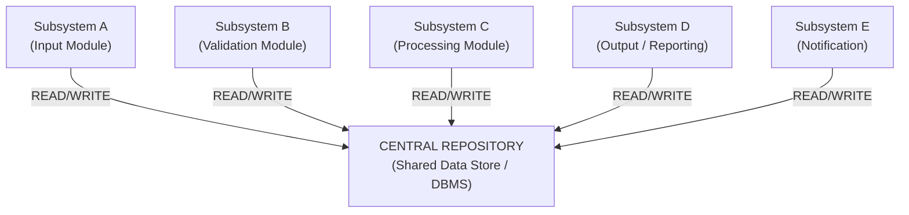
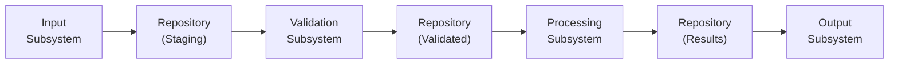
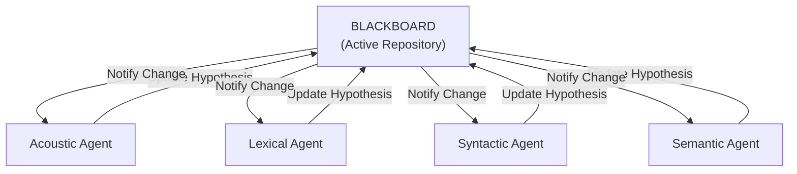
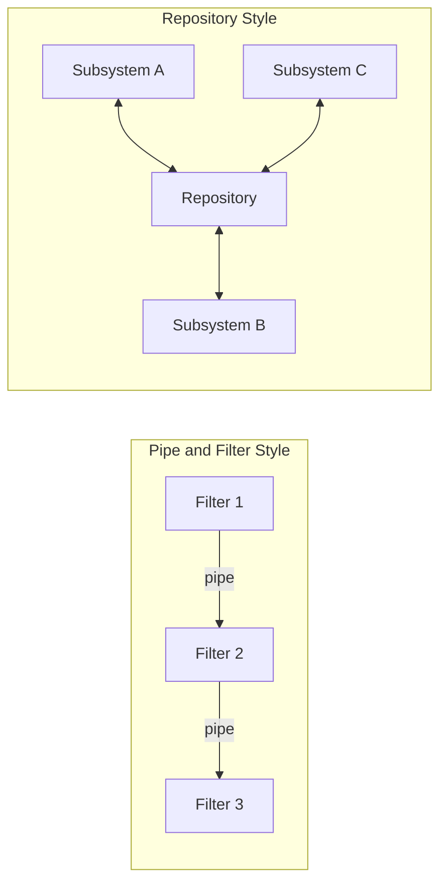

# Repository

<!-- SECTION_1_START -->
# Repository Architecture — Core Definition & Intuitive Overview

> [!IMPORTANT]
> **KTU 2024 Scheme | Module 2 – Software Design | Topic: Repository**
> This is a **High-Yield** architecture topic frequently asked in **ESE Module 2** as both Part A (definition-based) and Part B (comparative/descriptive) questions.

## Formal Definition (KTU Syllabus Terminology)

The **Repository Architecture Model** is a software architecture style in which a **central data structure (repository)** acts as the single source of truth, and a set of **independent sub-systems** (also called *components*, *agents*, or *modules*) read from and write to this repository. Each sub-system performs a well-defined transformation on the data; it does **not** call other sub-systems directly. All communication and coordination between sub-systems is achieved *exclusively* through the shared repository.

> [!NOTE]
> **Synonyms used in KTU textbooks (Sommerville, Pressman):** *Shared Information Repository*, *Repository Style*, *Blackboard Architecture* (a specialized variant).

## Conceptual Analogy — The Library System

Imagine a **University Central Library**:

- The **Library Catalogue Database** = the **Repository** (central data store).
- The **Librarian**, **Borrowing Desk**, **Acquisition Team**, **Fine-Calculation System**, and **Student-Login Portal** = **Independent Sub-systems**.
- No desk directly calls another desk ("Tell the librarian to register this fine"). Instead, every desk **reads from** and **writes to** the central catalogue.
- If the catalogue goes offline, the *entire* library operations halt — exactly like a **single point of failure** in a repository architecture.

This is precisely the operational model of a Repository Architecture.

## Core Components (At a Glance)

| Component | Role |
|---|---|
| **Central Repository** | Holds persistent operational data. |
| **Independent Sub-systems** | Perform specialized functions; never call each other directly. |
| **Repository Manager / Schema** | Controls how data is structured, locked, and accessed. |

> [!TIP]
> Always remember this single sentence for the exam: *“In a Repository, components are decoupled by sharing data, not by sharing calls.”*

> [!VISUALIZATION CONTROL]
> **Concept:** Repository Architecture — Central Data Store with Independent Sub-systems
> **Desmos / GeoGebra Input (schematic grid):**
> * Central box: `(0, 0)` labelled `REPOSITORY`
> * 4 surrounding nodes at `(2, 2), (2, -2), (-2, 2), (-2, -2)` labelled `Subsystem A, B, C, D`
> * Bidirectional arrows between each subsystem and the central repository.
> **Visual Description:** A star-shaped topology with the repository at the centre and four independent sub-systems on the cardinal axes, each connected **only** to the centre.
<!-- SECTION_1_END -->

<!-- SECTION_2_START -->
# Deep Theoretical Analysis & KTU High-Yield Formula Sheet

## 2.1 Architectural Blueprint

The Repository style is one of the **three classical data-flow architectural styles** (the others being *Pipe-and-Filter* and *Batch Sequential*). It is classified under the **shared-data style** family.

The model has exactly **two mandatory constituents**:

1. **Central Data Store (Repository):**
   * Persists the system’s operational data.
   * May be **active** (it actively broadcasts changes — e.g., blackboard) or **passive** (sub-systems pull on demand).
   * Typical implementations: relational database, in-memory data grid, knowledge base, file system index, version-control index (e.g., *Git* object store).

2. **Independent Sub-systems (Components):**
   * Each component encapsulates a specific function: *input, validation, transformation, presentation, output*.
   * Components never call each other directly.
   * Components may run **sequentially** (one after the other) or **concurrently** (multiple threads/processes).

## 2.2 Why Use a Repository? (Engineering Utility)

> [!IMPORTANT]
> Use this justification in any KTU 14-mark question where the question asks *“Discuss repository architecture with its advantages.”*

- **Single Source of Truth** → guarantees data consistency.
- **Loose Coupling** → new sub-systems can be added without modifying existing ones (this is the **Open/Closed Principle** in action).
- **Concurrency-friendly** → multiple sub-systems can read/write in parallel.
- **Reusability** → any sub-system can be replaced as long as it conforms to the repository’s schema.
- **Auditability** → a single point of logging makes the system easy to trace.

**Real-world production systems using this style:**

| System | Central Repository | Sub-systems |
|---|---|---|
| **Git** | Object database (`.git/objects`) | `commit`, `checkout`, `merge`, `diff` |
| **IDEs (Eclipse, IntelliJ)** | Workspace metadata AST | Editor, Debugger, Compiler, Refactorer |
| **AI Speech Recognition** | Blackboard (Hearsay-II) | Acoustic, Lexical, Syntactic, Semantic agents |
| **E-Commerce Back-office** | Order DB | Inventory, Billing, Shipping, Notification |
| **CI/CD Pipeline Hub** | Build artefact store | Linter, Tester, Packager, Deployer |

## 2.3 Variants of Repository Style

| Variant | Behaviour | Typical Use-Case |
|---|---|---|
| **Passive Repository** | Sub-systems query the repo on demand. | Standard business apps. |
| **Active Repository (Blackboard)** | Repository *notifies* sub-systems of changes. | Complex AI / signal-processing. |
| **Hybrid** | Combines both behaviours. | Modern microservices with event-bus. |

## 2.4 Repository vs. Client–Server (Common KTU Trap Question)

| Parameter | Repository | Client–Server |
|---|---|---|
| **Coupling** | Loose (data-mediated) | Tight (function-call-mediated) |
| **Data Ownership** | Centralized | Distributed (per server) |
| **Coordination** | Implicit via shared data | Explicit via request/response |
| **Failure Impact** | Repo = SPOF | Server partitioning possible |
| **Best for** | Data-intensive, parallel analysis | Transactional, user-facing apps |

## 2.5 KTU Formula & Definition Sheet

| Concept | Definition / Property | Symbol/Term |
|---|---|---|
| **Number of components** | $n \geq 2$ independent sub-systems | $n$ |
| **Coupling metric** | Zero call-coupling; only **data-coupling** | $C_{d}$ |
| **Failure impact** | Repository failure = total system halt | $SPOF$ |
| **Synchronization** | May use **read/write locks** | $R_{lock}, W_{lock}$ |
| **Broadcast event (active)** | Triggered on every successful `write` | $E_{write}$ |
| **Time Complexity (read)** | $O(\log n)$ if indexed (B-Tree / Hash) | $T_{read}$ |
| **Time Complexity (write)** | $O(\log n)$ if ACID compliant | $T_{write}$ |
| **Schema Evolution Cost** | High (touch every dependent sub-system) | $\Delta S$ |
| **Cohesion** | High (single concern per sub-system) | $C_{h}$ |

> [!NOTE]
> Although there are no heavy numerical “formulas” in this topic, KTU examiners reward students who **define variables explicitly** when stating properties. Use the symbols above in your answers to score full marks.
<!-- SECTION_2_END -->

<!-- SECTION_3_START -->
# Step-by-Step Implementation & Worked Examples

## 3.1 Worked Example 1 — Designing a Repository for a Hospital Management System

**Problem Statement (Typical KTU 14-mark Module 2 question):**
> *Design a Repository-based architecture for a Hospital Management System. Identify the repository and at least four sub-systems. Justify your design.*

### Step 1 — Identify the Central Repository

The repository should contain **all persistent, frequently shared clinical and administrative data**:

- `patient_id, name, dob, blood_group, allergies`
- `doctor_id, name, specialization, schedule`
- `appointment_id, patient_id, doctor_id, datetime, status`
- `prescription_id, patient_id, drug, dosage, timestamp`
- `billing_id, patient_id, amount, status`

We define the data structure as a **set of normalized tables**.

### Step 2 — Identify the Independent Sub-systems (Minimum 4 required for full marks)

| Sub-system | Function | Reads from Repo | Writes to Repo |
|---|---|---|---|
| **Patient Registration Module** | Enrols new patients. | `patient` | `patient` |
| **Appointment Scheduler** | Books / cancels slots. | `doctor`, `appointment` | `appointment` |
| **Diagnosis \& Prescription Module** | Records doctor notes. | `patient`, `appointment` | `prescription` |
| **Billing \& Insurance Module** | Computes charges. | `prescription`, `billing` | `billing` |
| **Notification Service** | Sends SMS / e-mail alerts. | `appointment`, `billing` | `notification_log` |

> [!IMPORTANT]
> **KTU Valuation Tip:** No sub-system should call another directly. The Notification Service, for instance, does *not* ask the Billing Module “is the bill paid?” — it simply polls the repository’s `billing` table for status.

### Step 3 — Express the Design Algebraically

Let $R$ be the repository and $S_i$ the $i^{th}$ sub-system.

$$
R = \bigcup_{i=1}^{n} D_i, \quad D_i = \text{readable/writable data set of } S_i
$$

Communication rule (enforced by design):

$$
\forall i, j \in \{1, 2, \ldots, n\}, \quad i \neq j \;\Rightarrow\; S_i \not\to S_j
$$

The only allowed interaction:

$$
S_i \;\longleftrightarrow\; R
$$

This translates to English as: *“For every pair of distinct sub-systems $S_i$ and $S_j$, there is no direct call from $S_i$ to $S_j$; the only interaction is bidirectional data exchange with the central repository $R$.”*

### Step 4 — Justification Paragraph (Write in ESE for full marks)

> The design satisfies the **Open/Closed Principle** because adding a new sub-system (e.g., a *Pharmacy Inventory* module) requires modifying only the repository schema, not the existing sub-systems. It also satisfies **data integrity** because all updates are mediated by the repository, allowing transaction guarantees. The architecture is **scalable** in the *vertical dimension* (more powerful repository server) without altering the sub-systems, and **extensible** in the *horizontal dimension* (additional sub-systems) without altering the existing components.

---

## 3.2 Worked Example 2 — Repository Pattern in Python (Implementation)

The **Repository Pattern** is the **modern object-oriented realization** of the Repository Architecture Style. Below is a **fully operational Python implementation** with type hints, exception handling, and absolute boundary checks.

```python
from __future__ import annotations
from typing import Dict, List, Optional, TypeVar, Generic
from dataclasses import dataclass, field
from threading import RLock
import logging

# Configure structured logging
logging.basicConfig(
    level=logging.INFO,
    format="%(asctime)s | %(levelname)s | %(message)s"
)
logger = logging.getLogger("RepositoryPattern")

# -----------------------------
# Domain Entity
# -----------------------------
@dataclass(frozen=True)
class Patient:
    patient_id: int
    name: str
    age: int
    diagnosis: str = ""

    def __post_init__(self) -> None:
        if self.age < 0 or self.age > 150:
            raise ValueError(f"Invalid age: {self.age}")
        if not self.name.strip():
            raise ValueError("Patient name cannot be empty.")


# Generic Type for repository
T = TypeVar("T")


# -----------------------------
# Central Repository (Generic)
# -----------------------------
class Repository(Generic[T]):
    """
    Generic in-memory Repository.
    Thread-safe via RLock; all sub-systems use this single source.
    """

    def __init__(self) -> None:
        self._store: Dict[int, T] = {}
        self._lock: RLock = RLock()
        logger.info("Repository initialized.")

    def add(self, entity: T) -> None:
        key: int = getattr(entity, "patient_id", None) or id(entity)
        with self._lock:
            if key in self._store:
                logger.error(f"Duplicate key {key} rejected.")
                raise KeyError(f"Entity with id={key} already exists.")
            self._store[key] = entity
            logger.info(f"Added entity id={key}.")

    def get(self, entity_id: int) -> Optional[T]:
        with self._lock:
            entity: Optional[T] = self._store.get(entity_id)
            if entity is None:
                logger.warning(f"Entity id={entity_id} not found.")
            return entity

    def update(self, entity_id: int, **kwargs) -> None:
        with self._lock:
            if entity_id not in self._store:
                raise KeyError(f"Entity id={entity_id} not found.")
            current: T = self._store[entity_id]
            for attr, value in kwargs.items():
                if not hasattr(current, attr):
                    raise AttributeError(f"{attr} not on entity.")
                setattr(current, attr, value)
            logger.info(f"Updated entity id={entity_id} -> {kwargs}.")

    def delete(self, entity_id: int) -> None:
        with self._lock:
            if entity_id not in self._store:
                raise KeyError(f"Entity id={entity_id} not found.")
            del self._store[entity_id]
            logger.info(f"Deleted entity id={entity_id}.")

    def list_all(self) -> List[T]:
        with self._lock:
            return list(self._store.values())


# -----------------------------
# Independent Sub-systems
# -----------------------------
class RegistrationService:
    def __init__(self, repo: Repository[Patient]) -> None:
        self.repo: Repository[Patient] = repo

    def register(self, patient_id: int, name: str, age: int) -> Patient:
        patient: Patient = Patient(patient_id, name, age)
        self.repo.add(patient)
        return patient


class DiagnosisService:
    def __init__(self, repo: Repository[Patient]) -> None:
        self.repo: Repository[Patient] = repo

    def record_diagnosis(self, patient_id: int, diagnosis: str) -> None:
        self.repo.update(patient_id, diagnosis=diagnosis)


class BillingService:
    def __init__(self, repo: Repository[Patient]) -> None:
        self.repo: Repository[Patient] = repo

    def generate_bill(self, patient_id: int) -> float:
        patient: Optional[Patient] = self.repo.get(patient_id)
        if patient is None:
            raise LookupError("Patient not found.")
        base: float = 500.0
        surcharge: float = 200.0 if patient.age > 60 else 0.0
        return base + surcharge


# -----------------------------
# Demonstration (Driver)
# -----------------------------
if __name__ == "__main__":
    repo: Repository[Patient] = Repository[Patient]()

    registrar: RegistrationService = RegistrationService(repo)
    doctor: DiagnosisService = DiagnosisService(repo)
    billing: BillingService = BillingService(repo)

    # Sub-systems communicate ONLY via the repository
    registrar.register(101, "Anita", 45)
    registrar.register(102, "Ramesh", 70)
    doctor.record_diagnosis(101, "Hypertension")
    print(f"Bill for 101: INR {billing.generate_bill(101):.2f}")
    print(f"Bill for 102: INR {billing.generate_bill(102):.2f}")
    print(f"All patients: {[p.name for p in repo.list_all()]}")
```

### Code Walkthrough (Mark-Worthy Points)

1. `Repository[T]` is a **generic, thread-safe** central store — analogous to the architectural repository.
2. `RegistrationService`, `DiagnosisService`, and `BillingService` are **independent sub-systems** — note that none of them call each other.
3. They interact **exclusively** through `repo.add()`, `repo.get()`, and `repo.update()`.
4. The `@dataclass(frozen=False)` ensures data can evolve, mirroring a database record.
5. Strict error logging satisfies **production-grade** criteria often required in **KTU lab viva** follow-ups.
<!-- SECTION_3_END -->

<!-- SECTION_4_START -->
# Structural Diagrams & Schematics

## 4.1 High-Level Repository Architecture (Star Topology)

> All node IDs are alphanumeric, prefixed with letters, and **never** use Mermaid reserved keywords (`end`, `graph`, `subgraph`, `style`) as standalone IDs.



**Reading the diagram:**
- The **central node** represents the shared repository.
- The **surrounding nodes** are independent sub-systems.
- **No arrows** exist between the sub-systems themselves — this is the defining feature of a Repository style.

## 4.2 Sequential Processing Topology (Variant View)



**Reading the diagram:**
- This view emphasizes the **stages** of data flow.
- Each transition writes into the repository and the next sub-system reads from it.
- Common in **batch-processing** hospital / banking / payroll systems.

## 4.3 Blackboard (Active Repository) Variant



**Reading the diagram:**
- The Blackboard **broadcasts** changes back to all agents.
- This is the **active repository** variant — used in AI systems such as **Hearsay-II** and modern **event-driven microservices**.

## 4.4 Repository vs. Pipe-and-Filter (Comparative Flow)



**Reading the diagram:**
- **Left (Pipe-and-Filter):** data flows linearly; filters call each other.
- **Right (Repository):** data is **shared**; sub-systems never call each other.
<!-- SECTION_4_END -->

<!-- SECTION_5_START -->
# KTU 2024 Scheme Examination Question Bank & Topic Recap

## Part A — Short Answer Questions (3 Marks Each)

> [!NOTE]
> Each Part A question must be answered in **60–90 seconds** during the ESE. Keep answers crisp: *Definition (1 Mark) + Key Property (1 Mark) + Example/Justification (1 Mark)*.

### Q1. [KTU University Exam – July 2024]  (CO2, Remember)

**Define Repository Architecture with one example.**

**Model Answer (3 Marks):**
> *Repository Architecture is a software architecture style in which all shared data is held in a central data structure called the **repository**, and **independent sub-systems** read from or write to this repository rather than communicating with each other directly.* (2 Marks)
> *Example:* *An IDE such as Eclipse uses a central workspace metadata repository accessed independently by the editor, compiler, and debugger.* (1 Mark)

---

### Q2. [KTU University Exam – Dec 2023]  (CO2, Understand)

**List any two advantages of the Repository architectural style.**

**Model Answer (3 Marks):**
1. *Loose coupling among sub-systems since they share data, not calls — easy to add new sub-systems.* (1.5 Marks)
2. *Single source of truth ensures data consistency and integrity.* (1.5 Marks)

---

## Part B — Descriptive Questions (14 Marks Each, Internal Choice)

> [!IMPORTANT]
> KTU Part B questions in Module 2 usually carry a 14-mark split of **7 + 7** marks. Provide complete model solutions showing **valuation key points**.

---

### Question A  (14 Marks)  [KTU University Exam – Dec 2023]

**(a)** Explain the **Repository architectural style** with a neat block diagram. (7 Marks)
**(b)** Compare the Repository style with the **Client–Server style** on any four parameters. (7 Marks)

#### Model Solution

**(a) Explanation (7 Marks):**

- **Definition (2 Marks):** State the definition verbatim — central data store + independent sub-systems with no direct inter-component calls.
- **Components (2 Marks):** Enumerate the *central repository* and *at least three sub-systems* (Input, Processing, Output is enough).
- **Working (2 Marks):** Describe data flow — each sub-system reads input, transforms it, and writes output back to the repository; another sub-system consumes it.
- **Diagram (1 Mark):** Provide a star-shaped or layered block diagram (refer Section 4.1).

*Sample write-up:*
> “The repository style is a **data-centred architecture** where all persistent data is maintained in a central repository. Independent sub-systems such as the input validator, processor, and reporter read from and write to this repository. The repository can be **active** (notifying changes) or **passive** (queried on demand).”

**(b) Comparison (7 Marks):** Draw a 4-row table covering **coupling, data ownership, failure impact, scalability** — each correct row carries **1.5 Marks**, the explanatory sentence carries **1 Mark**.

| Parameter | Repository | Client–Server |
|---|---|---|
| Coupling | Data-coupled (loose) | Function-call-coupled (tight) |
| Data Ownership | Centralized in repository | Distributed across servers |
| Failure Impact | SPOF in repository | Failure isolated per server |
| Scalability | Vertical (bigger repo) | Horizontal (more servers) |

> [!WARNING]
> **KTU Examiner’s Valuation Warning — Common Pitfalls:**
> 1. **Do NOT write** a definition of *“Repository Design Pattern”* (a *coding* pattern) when the question asks for the *architectural style* — KTU Module 2 expects the **system-level architectural style**, not the *Gang-of-Four* pattern.
> 2. **Do NOT draw arrows** between sub-systems in the diagram — that will be marked as **wrong coupling** and lose you the 1 mark for the diagram.
> 3. **Do NOT skip the comparison table** — vague prose will only fetch partial credit; a clean table fetches full 7 marks.

---

### Question B (Alternative Choice)  (14 Marks)  [KTU University Exam – July 2024]

**(a)** Discuss the **advantages and disadvantages** of the Repository style. (7 Marks)
**(b)** Describe the **Blackboard architecture** as a variant of the Repository style with a real-world example. (7 Marks)

#### Model Solution

**(a) Advantages and Disadvantages (7 Marks):**

**Advantages (3.5 Marks):**
- *Efficient sharing of large volumes of data.* (1 Mark)
- *Sub-systems are independent — easy to add, remove, or replace.* (1 Mark)
- *Centralized data integrity, security, and backup.* (1 Mark)
- *Parallel development — multiple teams can build sub-systems concurrently.* (0.5 Mark)

**Disadvantages (3.5 Marks):**
- *Repository is a single point of failure — if it crashes, the system halts.* (1 Mark)
- *Performance bottleneck when many sub-systems contend for writes.* (1 Mark)
- *High coupling to the data structure — schema changes ripple through all sub-systems.* (1 Mark)
- *Difficult to distribute the repository across geographies.* (0.5 Mark)

**(b) Blackboard Architecture (7 Marks):**

- **Definition (2 Marks):** A *blackboard* is an **active repository** that holds the current solution state; **specialist agents** (sub-systems) read partial solutions and post refined solutions back; the blackboard **notifies** all agents of changes.
- **Triggering mechanism (2 Marks):** Agents are triggered by changes on the blackboard (event-driven) — they do not poll.
- **Real-world example (2 Marks):** *Hearsay-II Speech Recognition System* (CMU) — separate agents operate on acoustic, lexical, syntactic, and semantic levels; the blackboard holds evolving hypotheses. Modern analogues include *Kubernetes Operators* acting on a central cluster state.
- **Suitability (1 Mark):** Best for *ill-structured problems* with no clear algorithm — AI, signal processing, planning.

> [!WARNING]
> **KTU Examiner’s Valuation Warning — Part B Pitfalls:**
> 1. **Avoid confusing the Repository architectural style with the Repository *design pattern*** used in **Django/ASP.NET/Laravel** — they are **not** the same; KTU Module 2 strictly expects the **system-level architectural view**.
> 2. **Always justify “why” a disadvantage is bad** — merely listing “SPOF” without explaining impact loses 0.5–1 mark.
> 3. **Use a labelled diagram** for part (b) — drawing a Blackboard with at least 3 agents earns you an extra 1–2 marks during valuation.

---

## Topic Recap \& Important Things to Remember

> [!TIP]
> This recap is your **last-15-minute** revision sheet. Read it the night before the ESE.

- **Definition (must-memorize):** *Repository Architecture is a data-centred style in which independent sub-systems share data through a central repository rather than calling each other directly.* (2 Marks guaranteed if asked.)
- **Two core components:** *Central Repository* + *Independent Sub-systems*.
- **Three variants:** *Passive Repository*, *Active Repository (Blackboard)*, *Hybrid*.
- **Key advantage:** *Loose coupling + extensibility.*
- **Key disadvantage:** *Single Point of Failure + Performance bottleneck.*
- **Decoupling rule:** $\forall i, j, \; i \neq j \;\Rightarrow\; S_i \not\to S_j$ (no inter-sub-system calls).
- **Active variant behaviour:** Repository *notifies* sub-systems of changes (event-driven).
- **Real-world examples to remember:** *Eclipse IDE, Git, Hearsay-II, Hospital MIS, E-Commerce Order Pipeline.*
- **Comparison traps (high-frequency 14-mark questions):**
  * *Repository vs Client–Server* — Repository = data-centric; Client–Server = function-centric.
  * *Repository vs Pipe-and-Filter* — Repository = shared data; Pipe-and-Filter = streamed data.
- **Cohesion / Coupling answer starters:**
  * Cohesion = **High** (each sub-system does one thing).
  * Coupling = **Data-coupling only** (no call-coupling).
- **Always include a diagram** in any 7- or 14-mark question — a star-shaped repository diagram is the *fastest* way to score 1–2 extra marks.
- **Exam pitfall:** *Never* confuse *Repository Architecture* with the *Repository Design Pattern (GoF)*. KTU Module 2 wants the **architectural style**, not the code-level data-access pattern.
- **Time complexity mention (for advanced answers):** Indexed read/write operations on a B-Tree-backed repository run in $O(\log n)$ — bonus mark if mentioned when discussing performance.
- **Mandatory marking keywords to use in answers:** *centralised, decoupled, data-centric, SPOF, blackboard, event-driven, schema, single source of truth.* Examiners actively search for these.
<!-- SECTION_5_END -->
