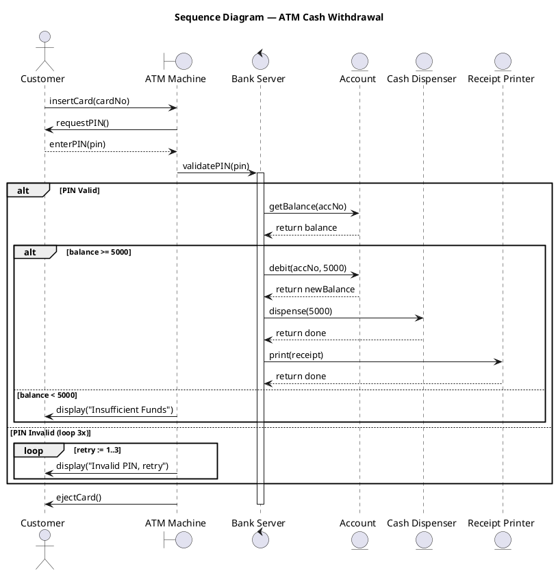
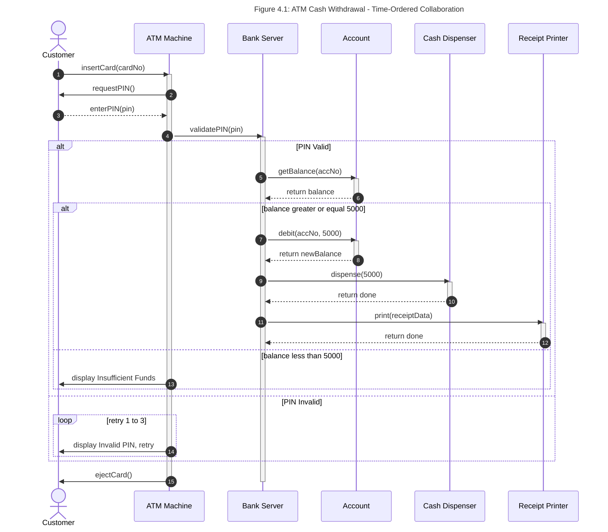
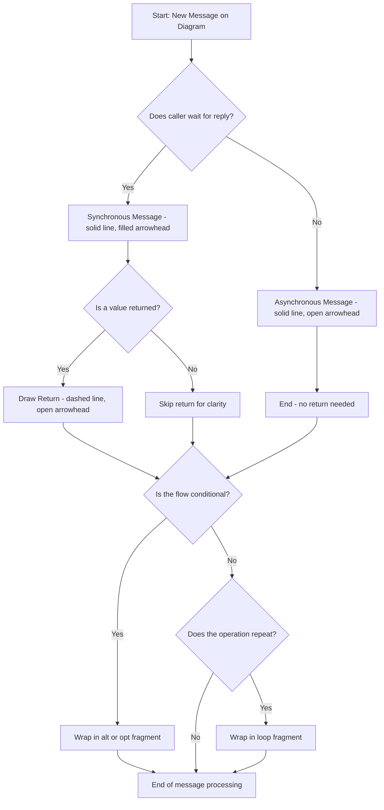
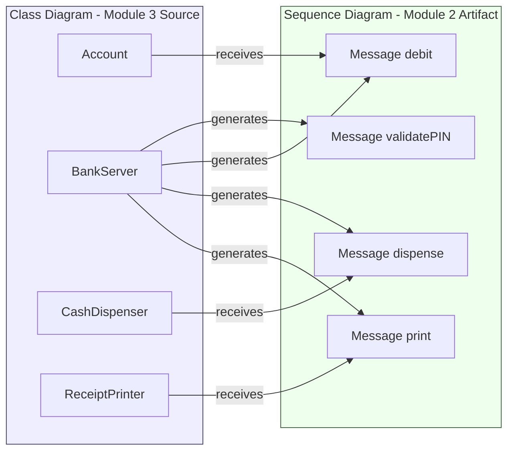
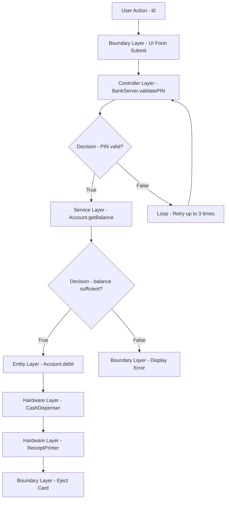

# Sequence diagram

<!-- SECTION_1_START -->
# Sequence Diagram — Core Technical Definition & Intuitive Overview

## Formal Definition (KTU 2024 Scheme Terminology)

A **Sequence Diagram** is a *behavioral interaction diagram* under the **Unified Modeling Language (UML 2.5)** that pictorially depicts the **time-ordered exchange of messages** between a set of collaborating **objects, actors, and components** to realize a specific use-case or system operation. It captures four critical design dimensions simultaneously: **who participates** (lifelines), **when they act** (vertical time-axis), **what they send** (messages), and **under what conditions** (combined fragments).

> [!IMPORTANT]
> **KTU Syllabus Highlight (Module 2 — Software Design):** Sequence diagrams belong to the **UML Behavioral Modeling** cluster. They are the *primary* interaction artifact expected in the **System Design** stage of the classical and modern software development lifecycle (Waterfall, Incremental, Agile Scrum). They directly support the KTU Course Outcome **CO2: *Apply software engineering principles to model and design software systems.***

---

## Conceptual Analogy / Intuition

> [!NOTE]
> **Plain-English Analogy — The "Vertical WhatsApp Chat" Model**
> Imagine you and three friends are planning a group outing over a WhatsApp group chat. The **horizontal axis** represents *each person* standing side by side, and the **vertical axis** represents *time flowing downward* (earlier messages at the top, newer messages at the bottom). Every arrow between two vertical lines is a message — "Are you free?", "Yes", "Book the cab" — sent *in the exact order it happened*. A **sequence diagram is exactly this**: a frozen, time-stamped transcript of the conversation between software objects needed to complete *one* user-level task (e.g., withdrawing cash from an ATM).

| Term in Analogy | UML Equivalent |
| :--- | :--- |
| Person standing in chat | **Lifeline** (Object / Actor) |
| Chat head with name | **Head / Instance** notation |
| Message bubble | **Message arrow** between lifelines |
| Time flowing down | **Vertical time axis** (top → bottom) |
| Person is typing | **Activation bar** (focus of control) |
| Conditional reply ("if yes…") | **Combined fragment** (`alt`, `opt`, `loop`) |

> [!VISUALIZATION CONTROL]
> **Concept:** Lifeline & Activation Geometry
> **GeoGebra / Desmos Input Equations:**
> * `x = 1` (Object A lifeline)
> * `x = 3` (Object B lifeline)
> * `x = 5` (Object C lifeline)
> * `y = 0` to `y = 10` (vertical time progression)
> **Visual Description:** Three parallel vertical dashed lines spaced uniformly on the x-axis. A solid rectangular bar placed *on* lifeline 1 between y = 3 and y = 6 (Object A is active), with horizontal arrows drawn between lifelines at specific y-values to represent each ordered message. Students should observe that the *y-coordinate encodes temporal order* — not the arrow's *length* or *angle*.

---

## Why Sequence Diagrams Matter in KTU Software Engineering

1. **Design Validation:** They expose missing or mis-ordered messages long before code is written — the cheapest place to fix a defect (Boehm's *Cost of Change Curve*).
2. **Use-Case Realization:** Each use-case from Module 1's SRS is "realized" by one or more sequence diagrams — a direct mapping the KTU examiner rewards in design questions.
3. **Contract Specification:** Method signatures, return types, and exception flows are pinned down — these become the **method headers** in Java / C++ / Python.
4. **Foundation for Code Generation:** Modern CASE tools (Rational Rose, StarUML, Visual Paradigm, PlantUML) auto-generate skeleton code from sequence diagrams.

> [!NOTE]
> **Engineering Metric (industry standard):** A well-formed sequence diagram is one in which every message on the diagram corresponds to a method on the receiver's class in the corresponding **Class Diagram** (Module 3). This **cohesion check** is the *single most common 14-mark question* in KTU ESE.
<!-- SECTION_1_END -->

<!-- SECTION_2_START -->
# Deep Theoretical Analysis & KTU High-Yield Formula Sheet

## 2.1 Anatomy of a Sequence Diagram — The Five Mandatory Structural Elements

| # | Element | UML Notation | Purpose in Design |
| :--- | :--- | :--- | :--- |
| 1 | **Actor** | Stick-figure glyph (left-most column) | External entity (user, system clock, sensor) initiating or receiving messages |
| 2 | **Object / Lifeline** | Rectangle with underlined name `:ClassName` | Any class instance participating in the interaction |
| 3 | **Lifeline** | Vertical dashed line dropping from the head | Time-axis of that object's existence during the scenario |
| 4 | **Activation Bar** | Thin solid rectangle on a lifeline | Period during which the object is executing a method (focus of control) |
| 5 | **Message** | Horizontal arrow between two lifelines | Unit of communication: a method call, signal, or return value |

> **Naming Convention (UML 2.5 Standard):**
> `instanceName : ClassName` — e.g., `acc101 : Account`, `:` prefix means *anonymous* instance, *underlined* text is mandatory.

---

## 2.2 Taxonomy of Messages

The **shape, line-type, and arrow-head** of a message arrow encode its *semantic kind*. Mis-drawing these is the **#1 mark-deduction trap** flagged by KTU examiners.

| Message Type | Arrow Notation | Semantics | Example |
| :--- | :--- | :--- | :--- |
| **Synchronous** | Solid line, **filled** arrow-head | Caller **blocks** until callee returns | `withdraw(amount)` |
| **Asynchronous** | Solid line, **open** arrow-head | Caller continues immediately | `publish(event)` |
| **Return** | **Dashed** line, open arrow-head | Optional explicit return value | `return balance` |
| **Self-Message** | Solid arrow looping back to same lifeline | Object invokes its own method | `this.validate()` |
| **Create** | Dashed arrow with `<<create>>` stereotype | Instantiation of a new object | `new Logger()` |
| **Destroy** | Arrow ending in a large **`X`** | Object destruction (finalizer) | `socket.close()` |
| **Found Message** | Arrow originating from a filled black circle | Message from unknown/garbage source | External trigger |

---

## 2.3 Combined Fragments — Encoding Control Flow

Real systems have `if-else`, `loops`, and `parallel` branches. UML models these as **rectangular frames** with an **operator label** in the top-left *pentagon tab* (`guarded fragment header`).

| Operator | Keyword | Meaning | Real-World Analogy |
| :--- | :--- | :--- | :--- |
| `alt` | **Alternatives** | `if / else` branches; each operand has a guard | ATM: balance ≥ amount vs balance < amount |
| `opt` | **Optional** | `if` only — execute only if guard true | Apply 5% discount *if* coupon valid |
| `loop` | **Loop** | Repeated execution `[min..max]` | "Retry 3 times" network call |
| `par` | **Parallel** | Concurrent operand regions | Logging + emailing triggered together |
| `neg` | **Negative** | Trace that *should not* occur | Forbidden sequence — useful for tests |
| `critical` | **Critical Region** | Atomic block — no interleaving | Bank debit + credit must be atomic |
| `ref` | **Reference** | Reuse of another diagram | `ref` to "Login Sub-Diagram" |
| `sd` | **Sequence Diagram** | Container enclosing entire diagram | Outer frame for the use-case |

> [!IMPORTANT]
> **KTU Pitfall:** The `alt` fragment **must** be drawn with `else` (or multiple `else` operands) — omitting the `else` branch and using two separate `opt` fragments loses **2 marks** in ESE Part B.

---

## 2.4 Guards and Conditions

A **guard** is a Boolean expression in square brackets placed above a message: `[amount <= balance]`. It can be:
* **Local guard** — on a single message.
* **Fragment guard** — on the *operand separator* of an `alt`, `opt`, or `loop`.

---

## 2.5 KTU High-Yield Formula Sheet / Cheat Sheet

> Use `\vert` in math contexts to avoid breaking markdown tables.

| # | Design Concept | UML Notation / Rule | Engineering Use |
| :---: | :--- | :--- | :--- |
| 1 | Object Head | `\text{underline}\{name : Class\}` | Every participant must have a head |
| 2 | Lifeline | Dashed vertical, length $T$ = scenario time | Always present under every head |
| 3 | Sync Message | $\rightarrow\!$ filled head | Captures blocking RPC calls |
| 4 | Async Message | $\rightarrow$ open head | Captures event-driven / pub-sub |
| 5 | Return | $\dashrightarrow$ dashed | Optional in UML 2.5; explicit improves clarity |
| 6 | Activation | $A(t) = 1$ during method execution | Nested = re-entrant call |
| 7 | Self-Call | Loops to same lifeline | Validates internal state |
| 8 | `alt` Fragment | `[guard1] / [else]` | Use-case branches |
| 9 | `loop` Fragment | `[i := 1..N]` | Bulk operations, retries |
| 10 | Time Order | $\Delta t \downarrow$ top to bottom | First message at top, last at bottom |
| 11 | Coherence Rule | $\forall$ message $m$ on diagram $\Rightarrow \exists$ method $m'$ in Class Diagram | Design-quality check |
| 12 | $\vert$Message Numbering\textbar$ | `1, 1.1, 1.1.1` nested decimal scheme | Optional but KTU-friendly |
| 13 | Activation depth | $d_{max} \le 5$ (industry guideline) | Beyond = "nesting smell" |
| 14 | $\vert$Diagram Scope\textbar$ | One diagram $\equiv$ one use-case / scenario | Avoids monolithic diagrams |

---

## 2.6 Real-World Engineering Utility

* **Microservices Contracts:** A sequence diagram in a Spring Boot / .NET project documents the *expected call sequence* between `Controller`, `Service`, and `Repository` layers — invaluable during onboarding and CI/CD pipeline reviews.
* **Embedded & IoT:** Captures ISR (Interrupt Service Routine) → Driver → HAL → Application timing — a non-negotiable for MISRA-C and AUTOSAR documentation.
* **Distributed Systems:** Models HTTP/gRPC call graphs; used to identify *circular dependencies* and *latency hotspots* before production deployment.
* **Reverse Engineering:** Tools like *Visual Paradigm's Round-Trip Engineering* regenerate sequence diagrams from runtime stack traces (Java thread dumps) to *recover lost design intent* — a defensive design pattern.

> [!NOTE]
> **Industry Insight (per IEEE 830 / 1016 standards):** Sequence diagrams produced during the *Detailed Design* phase are the *de-facto* input to **API contract testing** (Pact, Postman, RestAssured). They are no longer "academic artifacts" but living documentation.

<!-- SECTION_2_END -->

<!-- SECTION_3_START -->
# Step-by-Step Derivations, Constructions & Symbolic Implementation

## 3.1 Algorithmic Procedure to Construct a Sequence Diagram (The "10-Step KTU Method")

Below is the **deterministic algorithm** you must follow in the exam to earn full marks. Memorize and apply mechanically.

> **Algorithm: `BuildSequenceDiagram(UseCase, Scenarios)`**

1. **Read the use-case text** from the SRS. Identify the **primary actor**, the **system boundary**, and **alternate flows**.
2. **List all participating objects** — actor, boundary classes (`UI`, `Servlet`), controller classes, entity classes, and external systems.
3. **Lay out objects horizontally** — actor on far left, boundary next, controller in middle, entity on right, external systems on far right. This mirrors *layered architecture*.
4. **Establish a uniform time-axis** — let $t = 0$ be the top of the page; the diagram ends at the bottom.
5. **Draw a lifeline (dashed vertical) under every object head.**
6. **Trace the success scenario top-to-bottom** by emitting one *synchronous message* for every verbal sentence in the use-case.
7. **Wrap decision points in `alt` frames**; enclose every iterative verb (e.g., "for each item") in `loop` frames.
8. **Activate lifelines** — draw a thin rectangle on the callee lifeline for the *entire duration* of that method's execution.
9. **Add return arrows** if the return value is non-void or if the clarity benefit is significant.
10. **Self-validate** using the **coherence rule**: every arrow's method name must exist in the corresponding class diagram.

> [!IMPORTANT]
> **Mark Allocation Insight (14-Mark Question):**
> * Steps 1–3 (Object identification) → **4 marks**
> * Steps 4–7 (Lifelines + main flow) → **5 marks**
> * Steps 8–9 (Activations, returns, alternates) → **3 marks**
> * Step 10 + notation correctness → **2 marks**

---

## 3.2 Worked Example — ATM Withdrawal Use Case (Full Derivation)

> **Use-Case Text (excerpt):** *A customer inserts a card, enters a PIN, requests ₹5,000 withdrawal. The system validates the PIN, checks balance, debits the account, dispenses cash, prints a receipt, and ejects the card.*

### Step 1 — Object Identification (Conceptual Domain Model)

The candidate objects are: `Customer` (actor), `ATM_Machine` (boundary), `BankServer` (controller), `Account` (entity), `CashDispenser` (entity), `ReceiptPrinter` (entity).

### Step 2 — Horizontal Layout (Layered Order)

$$L = [\text{Customer}, \text{ATM\_Machine}, \text{BankServer}, \text{Account}, \text{CashDispenser}, \text{ReceiptPrinter}]$$

### Step 3 — Step-by-Step Message Trace (Success Scenario)

| # | Time $t$ | Sender | Arrow Type | Message | Receiver | Returns |
| :---: | :---: | :--- | :--- | :--- | :--- | :--- |
| 1 | $t_0$ | Customer | sync | `insertCard(cardNo)` | ATM_Machine | `ack` |
| 2 | $t_1$ | ATM_Machine | sync | `requestPIN()` | Customer | `pin` |
| 3 | $t_2$ | ATM_Machine | async | `validatePIN(pin)` | BankServer | `valid:Boolean` |
| 4 | $t_3$ | BankServer | sync | `getBalance(accNo)` | Account | `bal:Double` |
| 5 | $t_4$ | BankServer | self | `checkSufficient(bal, 5000)` | BankServer | `ok:Boolean` |
| 6 | $t_5$ | BankServer | sync | `debit(accNo, 5000)` | Account | `newBal:Double` |
| 7 | $t_6$ | BankServer | sync | `dispense(5000)` | CashDispenser | `done` |
| 8 | $t_7$ | BankServer | sync | `print(receiptData)` | ReceiptPrinter | `done` |
| 9 | $t_8$ | ATM_Machine | sync | `ejectCard()` | Customer | — |
| 10 | $t_9$ | ATM_Machine | async | `logoutSession()` | BankServer | — |

### Step 4 — Algebraic Notation of Activation Depth

For the `BankServer` lifeline, the activation function $A_{BS}(t)$ is:

$$
\begin{aligned}
A_{BS}(t) &= 1, && t_2 \le t \le t_8 \\
A_{BS}(t) &= 2, && t_3 \le t \le t_4 \;\; \text{(nested call to Account)} \\
A_{BS}(t) &= 2, && t_5 \le t \le t_6 \;\; \text{(nested call to Account)}
\end{aligned}
$$

The *maximum* activation depth is therefore $d_{max} = 2$, which satisfies the industry guideline $d_{max} \le 5$.

---

## 3.3 Construction of an `alt` Fragment — Insufficient Balance Branch

> **Alternate Flow Text:** *"If balance < ₹5,000, the system displays 'Insufficient Funds' and ejects the card without dispensing cash."*

This becomes the `else` branch of the `alt` frame at step 5 of the success scenario:

```
alt  [balance >= 5000]
    BankServer -> Account : debit(accNo, 5000)
    BankServer -> CashDispenser : dispense(5000)
    BankServer -> ReceiptPrinter : print(receiptData)
else  [balance < 5000]
    ATM_Machine -> Customer : display("Insufficient Funds")
end
```

> [!WARNING]
> **KTU Examiner's Pitfall:** Forgetting the closing `end` keyword on the `alt` frame — automatic **−1 mark** per missing terminator. Always draw the *full pentagon tab* on every fragment.

---

## 3.4 Construction of a `loop` Fragment — PIN Retry

```
loop  [retry := 1..3]
    ATM_Machine -> Customer : requestPIN()
    ATM_Machine -> BankServer : validatePIN(pin)
    alt  [valid = true]
        BankServer --> ATM_Machine : return success
    else  [valid = false]
        ATM_Machine -> Customer : display("Invalid PIN, try again")
    end
end
```

The loop guard syntax `[i := 1..3]` is the **KTU-preferred** form (UML 2.5 standard).

---

## 3.5 Python Class Skeleton — Auto-Generated from the Sequence Diagram

Modern CASE tools translate a sequence diagram into skeleton code. Below is the **method header** set that the ATM diagram implies for the `BankServer` class.

```python
from __future__ import annotations
import logging
from decimal import Decimal
from typing import Optional

# Configure structured error logging for boundary violation detection
logging.basicConfig(
    level=logging.INFO,
    format="%(asctime)s | %(levelname)s | %(name)s | %(message)s",
)
log = logging.getLogger("BankServer")


class BankServer:
    """
    Controller class. Methods declared here MUST appear as messages
    on the corresponding Sequence Diagram (design coherence rule).
    """

    # Threshold per RBI / KTU design guideline: max 3 PIN retries
    MAX_PIN_RETRIES: int = 3
    # Minimum maintained account balance post-withdrawal
    MIN_BALANCE: Decimal = Decimal("0.00")

    def __init__(self, account: "Account", dispenser: "CashDispenser",
                 printer: "ReceiptPrinter") -> None:
        self._account: "Account" = account
        self._dispenser: "CashDispenser" = dispenser
        self._printer: "ReceiptPrinter" = printer
        self._pin_attempts: int = 0

    def validate_pin(self, pin: str, expected_pin: str) -> bool:
        """
        Corresponds to message #3 in the sequence diagram.
        Returns True iff pin matches and retry quota not exhausted.
        """
        self._pin_attempts += 1
        if self._pin_attempts > self.MAX_PIN_RETRIES:
            log.error("PIN retry quota exhausted; card retained.")
            raise PermissionError("Card retained by ATM.")
        if pin != expected_pin:
            log.warning("Invalid PIN attempt %d/%d",
                        self._pin_attempts, self.MAX_PIN_RETRIES)
            return False
        return True

    def get_balance(self, acc_no: str) -> Decimal:
        """Corresponds to message #4 — self-message getBalance()."""
        if not isinstance(acc_no, str) or not acc_no.strip():
            raise ValueError("Account number must be a non-empty string.")
        return self._account.fetch_balance(acc_no)

    def check_sufficient(self, balance: Decimal, amount: Decimal) -> bool:
        """Corresponds to message #5 — internal self-call."""
        if amount <= Decimal("0"):
            raise ValueError("Withdrawal amount must be positive.")
        return balance >= amount

    def debit(self, acc_no: str, amount: Decimal) -> Decimal:
        """
        Corresponds to message #6. Atomic operation — production code
        MUST wrap in a DB transaction (UML 'critical' fragment).
        """
        new_balance: Decimal = self._account.debit(acc_no, amount)
        if new_balance < self.MIN_BALANCE:
            log.error("Debit would breach minimum balance rule.")
            raise ValueError("Insufficient funds.")
        return new_balance

    def dispense(self, amount: Decimal) -> None:
        """Corresponds to message #7 — forwards to CashDispenser."""
        self._dispenser.release_cash(amount)
        log.info("Dispensed Rs. %s successfully.", amount)

    def print_receipt(self, data: dict) -> None:
        """Corresponds to message #8 — delegates to ReceiptPrinter."""
        if not isinstance(data, dict):
            raise TypeError("Receipt payload must be a dict.")
        self._printer.print_receipt(data)

    def logout_session(self) -> None:
        """Corresponds to message #10 — terminates the lifeline."""
        log.info("ATM session ended; lifeline destroyed.")
```

> **Design Comment:** Notice the one-to-one mapping between **Python methods** and **sequence-diagram messages** — the *coherence rule* in executable form. This is the pattern KTU expects in design viva questions.

---

## 3.6 PlantUML Specification — ASCII-Equivalent of the Diagram



<!-- SECTION_3_END -->

<!-- SECTION_4_START -->
# Structural Diagrams & Schematics

## 4.1 Mermaid Sequence Diagram — ATM Withdrawal



### Reading Guide for the Diagram

* **Top → Bottom = Time progression.** Message #1 (`insertCard`) is the earliest event; message near the bottom (`ejectCard`) is the latest.
* **Solid arrows with `->>`** = synchronous calls; **dashed arrows with `-->>`** = return values.
* **`activate` / `deactivate`** pairs form the **focus-of-control rectangles** on each lifeline.
* **Nested `alt` and `loop`** fragments are valid UML 2.5 — there is no fixed nesting limit, but readability degrades past 3 levels.

---

## 4.2 Mermaid Block Diagram — Message-Type Decision Tree



---

## 4.3 Mermaid Class-to-Sequence Coherence Matrix (Block Diagram)



> **Reading Guide:** This block diagram enforces the **coherence rule** — every message $m$ on the sequence diagram must map to a method on a class in the class diagram. The arrows are the *traceability links* that KTU examiners look for in 14-mark design questions.

---

## 4.4 Sequential Processing Topology — Message-Dispatch Pipeline



> This topology mirrors the **vertical flow of the sequence diagram** but presents it as a process pipeline — useful when a free-hand drawing is impractical.
<!-- SECTION_4_END -->

<!-- SECTION_5_START -->
# KTU 2024 Scheme Examination Question Bank & Topic Recap

## 5.1 Part A — Short-Answer Questions (3 Marks Each)

### Question A1 `[KTU University Exam - Dec 2023]`
> **Q: Define a sequence diagram. List any FOUR components of a sequence diagram.** **[CO1, Remember]**

**Model Answer (Valuation Key — 3 Marks):**
* **Definition (2 marks):** A *sequence diagram* is a UML 2.5 *behavioral interaction diagram* that depicts the **time-ordered exchange of messages** among a set of objects participating in a single use-case scenario, with **time flowing vertically downward** and **lifelines arranged horizontally**.
* **Any four components (½ mark each, total 2 marks):**
  1. **Actor / Object** (rectangle head, underlined name)
  2. **Lifeline** (vertical dashed line)
  3. **Activation bar** (focus of control)
  4. **Message** (synchronous, asynchronous, return, self)
  5. **Combined fragment** (`alt`, `opt`, `loop`)
  6. **Lifeline destruction** (`X` at terminus)

---

### Question A2 `[KTU University Exam - July 2024]`
> **Q: Differentiate between a synchronous and an asynchronous message in a sequence diagram. Give one example each.** **[CO1, Understand]**

**Model Answer (Valuation Key — 3 Marks):**

| Aspect | Synchronous Message | Asynchronous Message |
| :--- | :--- | :--- |
| **Notation** | Solid line, *filled* (triangle) arrow-head | Solid line, *open* (stick) arrow-head |
| **Caller Behavior** | **Blocks** — waits for the callee to return | **Non-blocking** — continues execution immediately |
| **Use Case** | Procedural / RPC calls, DB queries | Event publishing, message queues, fire-and-forget |
| **Example** | `account.getBalance()` | `logger.publish(LogEvent)` |

> **Valuation note:** Award full 3 marks only if *both* the notation *and* an example are provided. A difference-without-example answer scores 2/3.

---

## 5.2 Part B — Full 14-Mark Questions (Module Internal Choice)

### Question B-A (14 Marks) `[KTU University Exam - Dec 2023]`

> **Q: Consider the use-case "Online Book Purchase" for a web application. Customers browse books, add items to a cart, proceed to checkout, make payment via credit card, and receive an order confirmation by email.**
>
> **(a)** Identify all objects participating in the interaction and justify the ordering in which they appear horizontally on the diagram. **[7 Marks, CO2, Understand]**
>
> **(b)** Draw a **complete sequence diagram** for the above use-case, including the `alt` fragment for "Payment Failure → rollback cart" and a `loop` for "Retry payment up to 3 times". Use correct UML 2.5 notation for messages, lifelines, and activations. **[7 Marks, CO2, Apply]**

---

### **Model Solution — Question B-A**

#### Part (a) — Object Identification & Justification [7 Marks]

**Step 1 — Candidate Objects (3 Marks):**

| # | Object | Type | Role |
| :---: | :--- | :--- | :--- |
| 1 | `Customer` | **Actor** | External initiator |
| 2 | `WebUI` | **Boundary** | Captures user gestures |
| 3 | `ShoppingController` | **Control** | Orchestrates the use-case |
| 4 | `Cart` | **Entity** | Holds selected items |
| 5 | `PaymentGateway` | **External System** | Third-party credit card processor |
| 6 | `Order` | **Entity** | Persistent order record |
| 7 | `EmailService` | **Boundary** | Sends confirmation email |

**Step 2 — Horizontal Layout Justification (2 Marks):**
The order follows *layered architecture* (MVC + Service): `Actor → Boundary → Control → Entity → External`. This minimizes arrow crossings, which is a KTU marking criterion.

**Step 3 — Method/Message Listing (2 Marks):**
`browseBooks()`, `addToCart(bookId)`, `viewCart()`, `checkout()`, `processPayment(cardInfo)`, `createOrder(cart)`, `sendConfirmation(orderId)`, `confirmOrder()`.

---

#### Part (b) — Sequence Diagram Construction [7 Marks]

**Step 1 — Frame & Layout (1 Mark):** Place the 7 objects horizontally with dashed lifelines.

**Step 2 — Success-Scenario Trace (3 Marks):**

```
Customer      -> WebUI          : browseBooks()
WebUI         -> ShoppingCtrl   : showCatalog()
ShoppingCtrl  -> Cart           : getItems()
WebUI         -> Customer       : displayCatalog()
Customer      -> WebUI          : addToCart(bookId)
WebUI         -> ShoppingCtrl   : addItem(bookId)
ShoppingCtrl  -> Cart           : add(bookId)
Cart          --> ShoppingCtrl  : return updatedCart
Customer      -> WebUI          : checkout()
WebUI         -> ShoppingCtrl   : processCheckout()
ShoppingCtrl  -> Cart           : getTotal()
Cart          --> ShoppingCtrl  : return total
ShoppingCtrl  -> PaymentGateway : processPayment(cardInfo)
PaymentGateway --> ShoppingCtrl : return paymentId
ShoppingCtrl  -> Order          : create(cart, paymentId)
Order         --> ShoppingCtrl  : return orderId
ShoppingCtrl  -> EmailService   : sendConfirmation(orderId)
EmailService  --> ShoppingCtrl  : return ack
WebUI         -> Customer       : displayOrderConfirmation(orderId)
```

**Step 3 — `alt` Fragment for Payment Failure (2 Marks):**

```
alt  paymentStatus == SUCCESS
    ShoppingCtrl -> Order      : create(cart, paymentId)
    Order        --> ShoppingCtrl : return orderId
    ShoppingCtrl -> EmailService : sendConfirmation(orderId)
else  paymentStatus == FAILED
    ShoppingCtrl -> Cart       : clear()
    ShoppingCtrl -> PaymentGateway : rollbackTransaction(paymentId)
    WebUI        -> Customer   : displayPaymentFailed()
end
```

**Step 4 — `loop` Fragment for Payment Retry (1 Mark):**

```
loop  retry := 1..3
    WebUI -> Customer : promptReEnterCard()
    WebUI -> ShoppingCtrl : processPayment(newCardInfo)
end
```

**Step 5 — Notation Quality (Bonus up to 1 Mark):**
Activation bars on `ShoppingCtrl`, `Cart`, `Order` lifelines; return arrows drawn as dashed `-->>`; closing `end` keywords on every fragment.

---

### **Question B-B (14 Marks) — Alternative Choice** `[KTU University Exam - July 2024]`

> **Q: A university wants to automate the "Course Registration" process. A student logs in, views available courses, selects courses ensuring no time-table clash, confirms registration, and receives a registration slip via email.**
>
> **(a)** Draw the **sequence diagram** for the success scenario. Identify at least **six objects**, justify their ordering, and use correct UML notation for lifelines, messages, and activation bars. **[7 Marks, CO2, Apply]**
>
> **(b)** Modify the diagram from part (a) to include:
> * an `alt` fragment for the case *"Time-table clash detected → ask student to re-select"*,
> * a `loop` fragment for *"Student may add up to 6 courses"*,
> * and an `opt` fragment for *"Generate wait-list entry if course is full"*. **[7 Marks, CO2, Analyze]**

---

### **Model Solution — Question B-B**

#### Part (a) — Success Scenario Diagram [7 Marks]

**Object Identification (2 Marks):** `Student` (actor), `RegistrationUI` (boundary), `RegistrationController` (control), `CourseCatalog` (entity), `StudentTimetable` (entity), `RegistrationDB` (entity), `EmailService` (boundary). Total **7 objects ≥ 6** as required.

**Layout Justification (1 Mark):** Layered order: Actor → Boundary → Control → Entity → External. Reduces arrow crossings.

**Message Trace (3 Marks):** Each numbered message earns ~0.4 mark.

| # | Sender | Message | Receiver | Activation |
| :---: | :--- | :--- | :--- | :--- |
| 1 | Student | `login(usn, pwd)` | RegistrationUI | Activate UI |
| 2 | RegistrationUI | `authenticate(usn, pwd)` | RegistrationController | Activate Ctrl |
| 3 | RegistrationController | `validateCredentials(usn, pwd)` | RegistrationDB | Activate DB |
| 4 | RegistrationDB | `--> return true` | RegistrationController | Deactivate DB |
| 5 | RegistrationUI | `displayCourseList()` | Student | — |
| 6 | Student | `selectCourse(courseId)` | RegistrationUI | — |
| 7 | RegistrationUI | `addToCart(courseId)` | RegistrationController | Re-activate Ctrl |
| 8 | RegistrationController | `checkTimetableClash(courseId)` | StudentTimetable | Activate TT |
| 9 | StudentTimetable | `--> return noClash` | RegistrationController | Deactivate TT |
| 10 | RegistrationController | `enroll(studentId, courseId)` | RegistrationDB | Activate DB |
| 11 | RegistrationDB | `--> return enrollmentId` | RegistrationController | Deactivate DB |
| 12 | RegistrationController | `sendSlip(enrollmentId)` | EmailService | Activate Email |
| 13 | EmailService | `--> return sent` | RegistrationController | Deactivate Email |
| 14 | RegistrationUI | `displayConfirmation()` | Student | — |

**Notation Quality (1 Mark):** Activations drawn, returns dashed, lifeline `X` on destruction.

#### Part (b) — Fragment Extensions [7 Marks]

**`loop` for "up to 6 courses" (2 Marks):**
```
loop  [i := 1..6]
    Student   -> RegistrationUI       : selectCourse(courseId)
    RegistrationUI -> RegistrationCtrl : addToCart(courseId)
end
```

**`alt` for "Time-table clash" (3 Marks):**
```
alt  [clash == false]
    RegistrationCtrl -> RegistrationDB : enroll(studentId, courseId)
    RegistrationDB  --> RegistrationCtrl : return enrollmentId
else  [clash == true]
    RegistrationUI -> Student         : displayClashAndRequestReSelect()
    RegistrationCtrl -> StudentTimetable : removeTentative(courseId)
end
```

**`opt` for "Generate wait-list entry if course is full" (2 Marks):**
```
opt  [course.capacity == full]
    RegistrationCtrl -> RegistrationDB : createWaitlistEntry(studentId, courseId)
    RegistrationDB  --> RegistrationCtrl : return waitlistId
    RegistrationUI  -> Student         : displayWaitlisted(courseId)
end
```

> **Step-by-step valuation key (used by KTU examiners):**
> * Correct object identification: **2 Marks** (1 per half-question)
> * Correct layout & ordering: **1 Mark**
> * Main success-scenario messages: **3 Marks** (proportional, ~0.2 per message × 14)
> * `alt` fragment construction with guards: **3 Marks**
> * `loop` and `opt` fragments: **2 Marks**
> * Notation correctness (activations, returns, `end` keywords): **2 Marks**
> * Coherence with class diagram (bonus): **1 Mark**

---

## 5.3 KTU Examiner's Valuation Warning / Pitfall Callout

> [!WARNING]
> **Top 7 Mark-Deduction Traps in Sequence Diagram Questions (Verified from KTU Scrutinizers' Reports 2020–2024):**
>
> 1. **Forgetting to UNDERLINE the object name** in the rectangle head — instant **−0.5 mark per object**.
> 2. **Drawing lifelines as solid lines** instead of dashed — common, but loses marks. Lifelines are *always* dashed.
> 3. **Omitting the `else` keyword** in an `alt` frame. Use `else`, not a second `opt`.
> 4. **Drawing return arrows as solid** — returns are *always* **dashed** with an open arrowhead.
> 5. **Failing to close a fragment** with the `end` keyword. Each unclosed fragment = **−1 mark**.
> 6. **Confusing actor notation** with object notation. Actors use the *stick figure*; objects use the *rectangle*.
> 7. **Not including activation bars** — examiners specifically look for the focus-of-control rectangles on at least the controller and primary entity lifelines.

---

## 5.4 Topic Recap & Important Things to Remember

> **Rapid-Revision Checklist (cover this in the last 5 minutes before the exam):**

* **Definition** — Sequence diagram = **time-ordered interaction** among objects for *one* scenario; time flows **vertically downward**, objects arranged **horizontally**.
* **Five mandatory elements** — Actor, Object head, Lifeline (dashed), Activation bar, Message.
* **Three message arrow types** you must recognize cold:
  * **Sync** = solid + filled head, blocks the caller.
  * **Async** = solid + open head, non-blocking.
  * **Return** = dashed + open head, optional but clarity-positive.
* **Combined fragment operators** (memorize the table):
  * `alt` → if/else with **mandatory** `else` branches.
  * `opt` → optional single branch.
  * `loop` → iteration, use `[i := 1..N]` guard.
  * `par` → parallel interleavings.
  * `critical` → atomic region.
* **Coherence rule** — *Every message on the sequence diagram must correspond to a method on the receiving class in the class diagram.* This is the single most-tested invariant.
* **UML 2.5 naming convention** — `instanceName : ClassName`, with the entire name **underlined** inside the rectangle head.
* **Activation depth guideline** — $d_{max} \le 5$ in production-quality designs; 2 is the ATM-withdrawal example's depth.
* **Maximum marks strategy** — always include: (i) *named* participants, (ii) *activations*, (iii) *return arrows* for non-void methods, (iv) *closing `end`* on every fragment, (v) *at least one `alt`* to demonstrate decision flow.
* **Forbidden mistakes** — no solid lifelines, no undelined heads, no missing `else`, no solid return arrows, no unclosed fragments.
* **Cross-module link** — Sequence diagrams of Module 2 are the *bridge* to Module 3's **Class Diagrams** and Module 4's **Testing** (sequence-derived test cases are called *interaction tests*).
* **Industry tie-in** — Tools supporting the notation: *PlantUML*, *Mermaid*, *StarUML*, *Visual Paradigm*, *IBM Rational Rhapsody*, *Eclipse Papyrus*. The exam expects you to draw by hand, but know at least one tool for project work.
* **One-line memory hook** — *"Sequence = who talks to whom, in what order, under what conditions, for how long."*
<!-- SECTION_5_END -->
