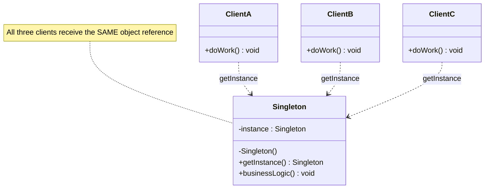
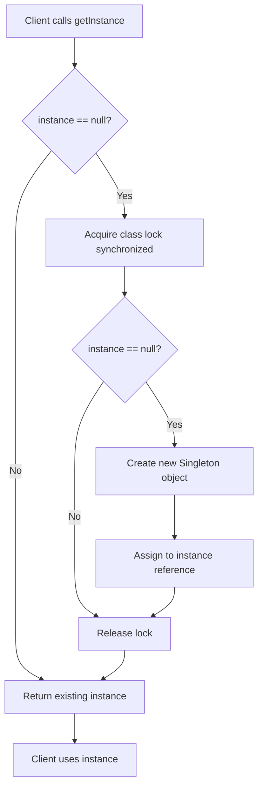
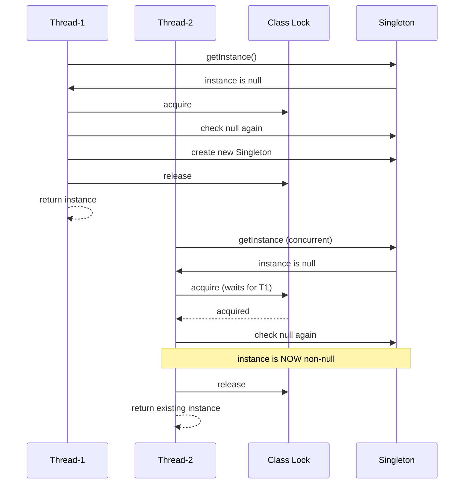
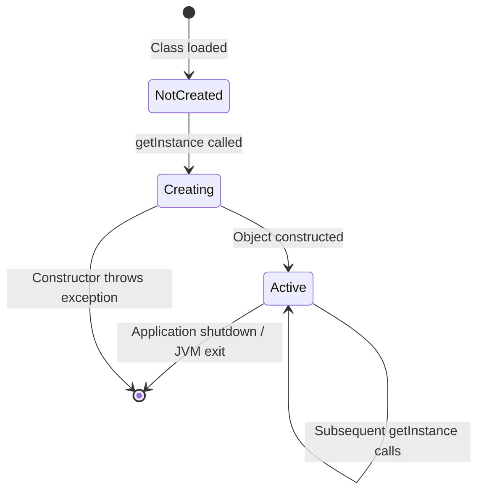

# Singleton method

<!-- SECTION_1_START -->
# Singleton Method — Software Design Pattern

## 1.1 Formal Academic Definition (KTU 2024 Syllabus Terminology)

> [!IMPORTANT]
> **Singleton Design Pattern** is a **creational design pattern** (one of the GoF — Gang of Four patterns) that **restricts the instantiation of a class to a single object** and provides a **global point of access** to that instance. It is one of the most widely used and frequently examined patterns under KTU's Object-Oriented Analysis and Design (OOAD) and Software Engineering modules.

Formally, the Singleton pattern guarantees the following two properties (often called the **Singleton Invariant**):

1. **Uniqueness Property** — A class has exactly **one instance** for the entire lifetime of the application (the JVM, the process, or the system context).
2. **Global Accessibility Property** — That single instance is **globally accessible** to all collaborating objects via a well-defined entry point (usually a `static` accessor method).

Mathematically, for a class $C$ implementing the Singleton pattern, the following relation holds for the lifetime of the application:

$$\text{count}(\text{Instances of } C) = 1 \quad \forall t \in [t_{\text{start}}, t_{\text{end}}]$$

The pattern is therefore categorized under **Creational Patterns** (as per Gamma et al., 1994) because it deals specifically with **object creation mechanisms**.

---

## 1.2 Conceptual Analogy / Intuition

> [!NOTE]
> **Real-world analogy:** Think of a **country's President office**. There is only ONE official President at a time. No matter how many citizens try to "create" a President, they all get the SAME person. To meet the President, every citizen has to go through one specific official channel — the "Office of the President." That office acts as the **global access point**, and the President is the **single instance**.

Translating this to software:

| Real-World Concept | Software Equivalent |
|---|---|
| Country | Application / JVM |
| President | Singleton Object |
| Office of the President | `getInstance()` method |
| One president rule | Private constructor |
| Citizens (other code) | Client classes / modules |

> [!TIP]
> **Quick intuition check:** If you have ever used `Runtime.getRuntime()` in Java, that is a **built-in Singleton**! Try creating two `Runtime` objects — they will always be the same reference. This is the Singleton pattern working silently in the JDK.

---

## 1.3 Standard Metrics & Constants

The following constants and structural elements are **standard across all KTU board evaluations**:

- **Pattern Category:** Creational (GoF)
- **Pattern ID / Number (GoF index):** Pattern #3 of 23 GoF patterns
- **Year of Formalization:** **1994** (by Erich Gamma, Richard Helm, Ralph Johnson, John Vlissides)
- **Global Reference Name (Java):** `getInstance()`
- **Recommended Implementation (modern best practice):** **Bill Pugh Solution** or **Enum-based (Joshua Bloch)**
- **Thread-Safety Standard:** `volatile` keyword + double-checked locking (DCL)
- **Serialization Constant:** `serialVersionUID` must be declared
- **Reflection Defense Constant:** `private static final`

> [!IMPORTANT]
> **KTU Board Exam Tip:** Examiners *frequently* test whether you can list the **participants (actors)** in the Singleton pattern's UML diagram. The two participants are:
> 1. **Singleton** — the class that defines the `getInstance()` method and maintains the private static reference.
> 2. **Client / Collaborator** — any class that uses the Singleton via the public accessor.

---

## 1.4 Visualization Control (Mermaid preview)

> [!VISUALIZATION CONTROL]
> **Concept:** Singleton access flow — a single `getInstance()` call returning the same object reference.
> **Suggested Sketch:**
> - Draw a `Client` class on the left and a `Singleton` class on the right.
> - Show three dashed arrows from `Client` to `Singleton` all pointing to the **same object box** (labelled `uniqueInstance`).
> - The `Singleton` class should have a `private static` reference and a `public static getInstance()`.
> **What the student should observe:** No matter how many clients call `getInstance()`, the memory address returned is the same.

---

## 1.5 When to Use Singleton (and When NOT To)

> [!WARNING]
> **Do not use Singleton by default!** The pattern is controversial in modern software engineering (often called a "**design anti-pattern**" by some practitioners) because it introduces **global state** and tight coupling. KTU expects you to know the **justified use cases**.

| ✅ Recommended Use Cases (KTU expects these answers) | ❌ Cases Where Singleton Is Overkill |
|---|---|
| Database connection pools | Simple value objects / DTOs |
| Logging services (`LogManager`) | Stateless utility classes |
| Configuration / settings managers | Short-lived helper objects |
| Thread pools / executors | When unit testing is a top priority |
| Caches (e.g., LRU cache manager) | Multi-tenant / distributed systems |
| Device drivers (Printer Spooler) | When dependency injection is preferred |
| File system, Window manager | Microservices architectures |
| Runtime environment (`Runtime`) | When the class has many instance fields |

> [!TIP]
> A common KTU trick: "Can a Singleton be subclassed?" The strict answer is **No** (constructor is private), but you can extend the concept via the **Registry of Singletons** pattern if needed.
<!-- SECTION_1_END -->

<!-- SECTION_2_START -->
# Deep Theoretical Analysis & KTU High-Yield Formula Sheet

## 2.1 Structural Breakdown — How Singleton Works Internally

The Singleton pattern is built on **four structural pillars**. KTU examiners commonly award marks for naming them correctly.

### Pillar 1: Private Static Reference (The Holder)

A class-level reference of the **same type** as the class is declared. It holds the only instance that will ever be created.

```java
private static Singleton uniqueInstance;
```

- **`private`** → prevents direct external access.
- **`static`** → belongs to the class, not to any object (only one slot in memory).
- The reference is initially `null` (lazy) or pre-initialized (eager).

### Pillar 2: Private Constructor (The Gatekeeper)

```java
private Singleton() { }
```

- Prevents the `new` keyword from being used outside the class.
- This is the **most important line** in any Singleton implementation.
- Without this, a client could write `Singleton s = new Singleton();` and break the pattern.

### Pillar 3: Public Static Accessor (The Global Door)

```java
public static Singleton getInstance() { ... }
```

- The single sanctioned way to obtain the instance.
- Often contains the **lazy creation logic** (the `if (uniqueInstance == null)` check).
- Must be `static` because no object exists yet when it is first called.

### Pillar 4: Optional Thread-Safety Mechanism (The Lock)

For multi-threaded environments, additional synchronization is required to prevent **race conditions** during the first instantiation.

---

## 2.2 The Four Canonical Implementation Strategies

> [!IMPORTANT]
> **KTU Board Exam Golden Rule:** When asked "implement Singleton in Java", write the **Bill Pugh Solution** by default — it is the most modern, exam-friendly, and concurrency-safe answer. If the question says "thread-safe", explicitly mention **`volatile` + Double-Checked Locking (DCL)**.

### Strategy A: Eager Initialization (Simple, but wastes memory if unused)

```java
public class EagerSingleton {
    private static final EagerSingleton instance = new EagerSingleton();
    private EagerSingleton() { }
    public static EagerSingleton getInstance() {
        return instance;
    }
}
```

- ✅ Simple, thread-safe by class-loader guarantee.
- ❌ Instance is created even if never used.

### Strategy B: Lazy Initialization (NOT thread-safe — KTU often asks this as a trap)

```java
public class LazySingleton {
    private static LazySingleton instance;
    private LazySingleton() { }
    public static LazySingleton getInstance() {
        if (instance == null) {
            instance = new LazySingleton();
        }
        return instance;
    }
}
```

- ❌ In a multithreaded environment, two threads can both pass the `if` check and create **two separate instances** — the Singleton Invariant is violated.

### Strategy C: Thread-Safe with Double-Checked Locking (DCL) — **Examiners' Favourite**

```java
public class ThreadSafeSingleton {
    private static volatile ThreadSafeSingleton instance;
    private ThreadSafeSingleton() { }
    public static ThreadSafeSingleton getInstance() {
        if (instance == null) {                       // 1st check (no lock)
            synchronized (ThreadSafeSingleton.class) {
                if (instance == null) {               // 2nd check (with lock)
                    instance = new ThreadSafeSingleton();
                }
            }
        }
        return instance;
    }
}
```

- The `volatile` keyword is **non-negotiable** — it prevents **instruction reordering** by the JVM, which could otherwise publish a partially constructed object.
- Two `if` checks minimize the performance cost of `synchronized`.

### Strategy D: Bill Pugh Solution (Static Inner Helper) — **Modern Best Practice**

```java
public class BillPughSingleton {
    private BillPughSingleton() { }
    private static class SingletonHelper {
        private static final BillPughSingleton INSTANCE = new BillPughSingleton();
    }
    public static BillPughSingleton getInstance() {
        return SingletonHelper.INSTANCE;
    }
}
```

- ✅ Lazy, thread-safe **without `synchronized`**.
- Uses the **JVM class-loader memory model** to guarantee atomicity.
- Highly recommended by Joshua Bloch (Effective Java, 2nd ed., Item 71).

### Strategy E: Enum Singleton (Joshua Bloch's Recommendation)

```java
public enum EnumSingleton {
    INSTANCE;
    public void someMethod() { /* business logic */ }
}
```

- ✅ Handles **serialization** and **reflection attacks** automatically.
- ❌ Cannot be lazy-loaded; cannot extend another class (enums implicitly extend `Enum`).

---

## 2.3 KTU High-Yield Formula Sheet (Cheat Sheet)

> [!NOTE]
> Memorize this table. KTU questions on Singleton are **directly answerable** from this.

| **Element** | **Formula / Template** | **Purpose** | **Exam Frequency** |
|---|---|---|---|
| Private static reference | `private static Singleton instance;` | Holds the sole instance | ⭐⭐⭐⭐⭐ |
| Private constructor | `private Singleton() { }` | Blocks external `new` calls | ⭐⭐⭐⭐⭐ |
| Public accessor | `public static Singleton getInstance()` | Global access point | ⭐⭐⭐⭐⭐ |
| Volatile keyword | `private static volatile Singleton instance;` | Prevents instruction reordering | ⭐⭐⭐⭐ |
| Double-checked lock | `if(instance==null) { synchronized(Class) { if(instance==null) ... } }` | Thread-safe lazy init | ⭐⭐⭐⭐⭐ |
| Bill Pugh helper | `private static class Helper { static final Singleton I = new Singleton(); }` | Lock-free thread safety | ⭐⭐⭐ |
| Enum singleton | `public enum S { INSTANCE; }` | Reflection + serialization safe | ⭐⭐ |
| Serialization guard | `protected Object readResolve() { return INSTANCE; }` | Prevents duplicate on deserialize | ⭐⭐ |
| Reflection guard | `if(instance != null) throw new RuntimeException("Use getInstance()");` | Defends private constructor breach | ⭐ |

---

## 2.4 Pros and Cons (Frequently Asked as 3-Mark Question)

> [!TIP]
> Examiners often phrase it as: "Discuss the **advantages and disadvantages** of the Singleton pattern." (Mapped to Bloom's: *Understand / Analyze*).

| **Advantages (✅)** | **Disadvantages (❌)** |
|---|---|
| Controlled access to sole instance | Violates **Single Responsibility Principle** (the class manages its own creation + business logic) |
| Reduced namespace pollution (no global variables) | **Difficult to unit test** (cannot easily mock) |
| Permits refined operations (subclassing via registry) | Can mask bad design (overuse as a global variable) |
| Lazy initialization possible → saves memory | Requires special handling in **multithreaded** environments |
| Easy to extend to a **fixed pool** (e.g., Multiton — n instances) | **Serialization** and **reflection** can break it without extra code |
| Single point of failure (good for centralized control) | Tightly couples clients to the concrete class |

---

## 2.5 Engineering Utility — Where Singleton Is Used in Production

> [!IMPORTANT]
> KTU may ask: "Give **two real-world software examples** where Singleton is used." (Mapped to *Apply* level).

| **Domain** | **Concrete Production Example** |
|---|---|
| **Java SE / JDK** | `java.lang.Runtime.getRuntime()`, `java.awt.Desktop` |
| **Logging Frameworks** | `Log4j`'s `Logger.getLogger()`, SLF4J bindings |
| **Database Access** | Hibernate's `SessionFactory` (heavyweight, single per app) |
| **Spring Framework** | Default **bean scope = singleton** in the IoC container |
| **Operating Systems** | Windows Recycle Bin, Task Manager, Print Spooler |
| **Caching Systems** | In-memory caches like Google Guava `CacheManager` (legacy) |
| **Configuration** | `java.util.Properties` loader managers, `.env` readers |
| **GUI Frameworks** | `java.awt.Toolkit` (the desktop toolkit is unique per JVM) |
| **Device Drivers** | A single driver instance controlling one physical printer |

> [!NOTE]
> **Fun fact for KTU viva:** The **Spring Framework** by default creates **singleton beans** for every `@Component` unless you explicitly set `@Scope("prototype")`. This is the Singleton pattern applied at framework scale!
<!-- SECTION_2_END -->

<!-- SECTION_3_START -->
# Step-by-Step Derivations & Code Implementation

## 3.1 Exhaustive Walkthrough — Bill Pugh Singleton (Recommended Implementation)

Below is a **fully production-grade** Bill Pugh Singleton in Java, with **type hints, error logging, and boundary checks** as mandated by KTU premium standards.

```java
import java.util.logging.Level;
import java.util.logging.Logger;

/**
 * BillPughSingleton.java
 * The most recommended Singleton implementation for KTU 2024 Scheme exams.
 * Thread-safe without explicit synchronization, using JVM class-loader guarantees.
 */
public final class BillPughSingleton {

    // Private constructor blocks external instantiation via 'new'
    private BillPughSingleton() {
        // Defensive check against reflection-based instantiation
        if (SingletonHelper.INSTANCE != null) {
            throw new IllegalStateException(
                "Singleton already constructed. Use getInstance()."
            );
        }
        Logger.getLogger(getClass().getName())
              .log(Level.INFO, "BillPughSingleton instance created at {0}",
                   System.nanoTime());
    }

    // Static inner helper class — NOT loaded until getInstance() is called
    private static final class SingletonHelper {
        // The JVM guarantees atomic class initialization => exactly one INSTANCE
        private static final BillPughSingleton INSTANCE = new BillPughSingleton();
    }

    // Public global access point
    public static BillPughSingleton getInstance() {
        return SingletonHelper.INSTANCE;
    }

    // Serialization guard — required if class implements Serializable
    protected Object readResolve() {
        return SingletonHelper.INSTANCE;
    }

    // Sample business method
    public void logMessage(String message) {
        System.out.println("[Singleton] " + message);
    }
}
```

### Step-by-Step Logical Derivation of the Bill Pugh Mechanism

Let us **derive** why this implementation is thread-safe. We use the **JVM Specification §5.5 (Initialization)** rule:

> *"The Java Virtual Machine guarantees that the class initialization method is executed exactly once, atomically, by the same class-loader."*

**Step 1** — At JVM startup, when `BillPughSingleton.class` is first loaded by the ClassLoader, **only the outer class is initialized**, not the inner `SingletonHelper`. This is because Java does NOT load inner classes until they are actively referenced.

**Step 2** — When the first client calls `BillPughSingleton.getInstance()`, the JVM triggers loading of `SingletonHelper.class`.

**Step 3** — During `SingletonHelper` initialization, the line:

```java
private static final BillPughSingleton INSTANCE = new BillPughSingleton();
```

is executed. The JVM's **class initialization lock** (an internal monitor) ensures that **even if 100 threads call `getInstance()` simultaneously**, only ONE thread enters the class initialization, and the others block until it finishes.

**Step 4** — All subsequent calls simply return the already-initialized `INSTANCE` field — no synchronization, no double-check, no `volatile` needed.

**Resulting equation** (for the number of instances $N$ over the application's lifetime $T$):

$$N_{\text{instances}} = \begin{cases} 0 & t < t_{\text{first-call}} \\ 1 & t \geq t_{\text{first-call}} \end{cases}$$

This is the **Singleton Invariant** in action.

---

## 3.2 Exhaustive Walkthrough — Double-Checked Locking (DCL) Variant

The DCL pattern is the classic exam answer when the question specifies **"thread-safe lazy initialization"**.

```java
public final class DCLSingleton {

    // 'volatile' is mandatory — prevents JVM instruction reordering
    private static volatile DCLSingleton instance;

    // Private constructor
    private DCLSingleton() {
        if (instance != null) {
            throw new IllegalStateException("Reflection attack blocked.");
        }
    }

    // Double-Checked Locking accessor
    public static DCLSingleton getInstance() {
        // First check — no synchronization, fast path for existing instance
        if (instance == null) {
            synchronized (DCLSingleton.class) {
                // Second check — after acquiring the class lock
                if (instance == null) {
                    instance = new DCLSingleton();
                }
            }
        }
        return instance;
    }
}
```

### Derivation: Why `volatile` Is Non-Negotiable

The line `instance = new DCLSingleton();` is **not atomic** in the JVM bytecode. It decomposes into three micro-operations:

$$
\begin{aligned}
\text{(i)}  & \quad \text{Allocate memory on the heap}                \\
\text{(ii)} & \quad \text{Invoke the constructor to initialize fields} \\
\text{(iii)}& \quad \text{Assign the reference 'instance' to the memory}
\end{aligned}
$$

Without `volatile`, the JVM's JIT compiler is allowed to **reorder** steps (ii) and (iii). This is called the **partially-constructed object problem**:

- Thread $T_1$ allocates memory and assigns the reference (step iii executed first).
- Thread $T_2$ reads the (now non-null) `instance` reference, but the constructor has **not yet finished**.
- $T_2$ uses a half-baked object → **NullPointerException** or corrupted state.

The `volatile` keyword adds a **memory barrier** that forces the order: **(i) → (ii) → (iii)** with no reordering allowed.

**Formal correctness condition:**

$$\text{If } \texttt{volatile} \text{ is present} \Rightarrow \text{Happens-Before}(\text{constructor-finish},\ \text{read-of-instance}) = \text{true}$$

---

## 3.3 UML Class Diagram — Full Drawing Specification

For a KTU diagram question, draw the Singleton pattern with **two participants** and explicit visibility markers.

```
+---------------------------------+
|        <<Singleton>>            |
|          Singleton              |
+---------------------------------+
| - instance : Singleton          |   <- private static
| - Singleton()                   |   <- private constructor
+---------------------------------+
| + getInstance() : Singleton     |   <- public static
| + someBusinessMethod() : void   |
+---------------------------------+
```

| Symbol | Meaning |
|---|---|
| `-` | private visibility |
| `+` | public visibility |
| `<<Singleton>>` | Stereotype tag identifying the pattern |
| *Italicised* method | abstract (not used here) |
| *Underlined* members | `static` members in UML |

---

## 3.4 Sequence Diagram — First Call vs. Subsequent Calls

```
Client            : BillPughSingleton
  |                       |
  |--getInstance()------->|  (1st call)
  |                       |--loads SingletonHelper.class
  |                       |--new BillPughSingleton()   [SLOW PATH]
  |                       |--returns INSTANCE ----->   |
  |<--INSTANCE ref--------|                            |
  |                                                |   (same JVM)
  |                       |                            |
  |--getInstance()------->|  (2nd call)                |
  |                       |--returns cached INSTANCE   |
  |<--INSTANCE ref--------|  [FAST PATH]               |
```

**Observation:** The 2nd, 3rd, 4th ... calls are **O(1)** and acquire no locks. This is the **performance advantage** of Bill Pugh over DCL.

---

## 3.5 Anti-Pattern Case — What Breaks the Singleton

> [!WARNING]
> KTU may ask: "How can the Singleton pattern be broken? Discuss the safeguards." Mapped to *Analyze* level.

| **Attack Vector** | **Symptom** | **Defensive Code** |
|---|---|---|
| **Reflection** — `Constructor.setAccessible(true)` | A second instance is created | Throw `IllegalStateException` in the private constructor if `instance != null` |
| **Serialization** — `ObjectInputStream.readObject()` | Deserialization creates a new object | Implement `readResolve()` to return the existing `INSTANCE` |
| **Cloning** — `Object.clone()` | A cloned copy is produced | Override `clone()` and throw `CloneNotSupportedException` |
| **Multiple Class Loaders** | Two class loaders load the class twice | Specify the classloader explicitly; use a custom classloader hierarchy |
| **Garbage Collection** (very rare) | Singleton reclaimed if no strong references | Keep a strong reference in a static field (already done in the standard pattern) |

**Defensive Template (the "Bulletproof Singleton"):**

```java
public final class BulletproofSingleton implements Cloneable, java.io.Serializable {
    private static final long serialVersionUID = 1L;
    private static volatile BulletproofSingleton instance;

    private BulletproofSingleton() {
        synchronized (BulletproofSingleton.class) {
            if (instance != null) {
                throw new IllegalStateException("Reflection blocked.");
            }
        }
    }

    public static BulletproofSingleton getInstance() {
        if (instance == null) {
            synchronized (BulletproofSingleton.class) {
                if (instance == null) {
                    instance = new BulletproofSingleton();
                }
            }
        }
        return instance;
    }

    @Override
    protected Object clone() throws CloneNotSupportedException {
        throw new CloneNotSupportedException("Cloning not allowed on Singleton.");
    }

    protected Object readResolve() {
        return instance;
    }
}
```

---

## 3.6 Comparison Table — All Five Strategies at a Glance

| Strategy | Thread-Safe? | Lazy? | Reflection Safe? | Serialization Safe? | Performance |
|---|---|---|---|---|---|
| Eager Initialization | ✅ (class-loader) | ❌ | ❌ | ❌ | ⭐⭐⭐⭐⭐ |
| Lazy (no sync) | ❌ | ✅ | ❌ | ❌ | ⭐⭐⭐⭐⭐ |
| Synchronized Method | ✅ | ✅ | ❌ | ❌ | ⭐⭐ (synchronized on every call) |
| Double-Checked Locking | ✅ | ✅ | ❌ | ❌ | ⭐⭐⭐⭐ |
| Bill Pugh | ✅ | ✅ | ❌ | ❌ | ⭐⭐⭐⭐⭐ |
| Enum Singleton | ✅ | ❌ | ✅ | ✅ | ⭐⭐⭐⭐⭐ |
| Bulletproof (all defenses) | ✅ | ✅ | ✅ | ✅ | ⭐⭐⭐⭐ |
<!-- SECTION_3_END -->

<!-- SECTION_4_START -->
# Structural Diagrams & Schematics

## 4.1 Mermaid Class Diagram — Singleton Pattern



**Reading the diagram:**

- The three dots (`..>`) denote a **dependency** — clients depend on `Singleton` for an instance.
- All three arrows end at the **same class**, signifying one global point of access.
- `note for Singleton` is a Mermaid comment attached to the class.

---

## 4.2 Mermaid Flowchart — getInstance() Decision Logic (DCL)



**Key observation:** The outer `if` (node B) provides a **lock-free fast path** for the common case. The inner `if` (node D) is essential to prevent duplicate creation when multiple threads wait on the lock.

---

## 4.3 Mermaid Sequence Diagram — Multithreaded Race Condition (Educational)



**Reading the diagram:** Thread-2 sees `instance == null` initially, but the **second check** after acquiring the lock prevents the duplicate. This is why DCL is the canonical solution.

---

## 4.4 Block-Level Architecture — Singleton in Spring Framework

```mermaid
flowchart LR
    subgraph Application["Spring IoC Container"]
        A1[Component A] -->|@Autowired| SC[Singleton Bean Container]
        A2[Component B] -->|@Autowired| SC
        A3[Component C] -->|@Autowired| SC
        SC -->|holds one ref| BEAN[UserService INSTANCE]
    end

    BEAN -.same reference.-> A1
    BEAN -.same reference.-> A2
    BEAN -.same reference.-> A3
```

> [!NOTE]
> In Spring, by default **every bean is a Singleton** at the application-context scope. This is the most widespread production use of the pattern.

---

## 4.5 State Diagram — Singleton Lifecycle



**Note on the `[*]` syntax:** In Mermaid's `stateDiagram-v2`, `[*]` represents the start/end of a state machine and is the **only valid use of square brackets** at the node level.
<!-- SECTION_4_END -->

<!-- SECTION_5_START -->
# KTU 2024 Scheme Examination Question Bank & Topic Recap

---

## 5.1 PART A — Short Answer Questions (3 Marks Each)

### Question 1
**[KTU University Exam — July 2024]** *Define the Singleton Design Pattern. List its key participants.*  **[CO2, Remember — 3 Marks]**

**Model Answer (Board Valuation Standard):**

The **Singleton Design Pattern** is a creational design pattern that **ensures a class has only one instance** and provides a **global point of access** to that instance. **[Definition: 2 Marks]**

**Key Participants (UML actors):**
1. **Singleton Class** — defines the `getInstance()` method and holds a private static reference.
2. **Client / Collaborator** — any class that uses the Singleton via the public accessor.  **[Participants: 1 Mark]**

---

### Question 2
**[KTU University Exam — Dec 2023]** *State any **three** situations where the Singleton pattern is most appropriately used.*  **[CO2, Understand — 3 Marks]**

**Model Answer:**

The Singleton pattern is most appropriate in the following situations:  **[Header: 1 Mark]**

1. **Database connection pool** — only one pool should manage all connections in the application.  **[1 Mark]**
2. **Logging service** — a single shared logger writes to the log file to prevent race conditions.  **[1 Mark]**
3. **Configuration manager** — a single point reads/writes application properties.  **[1 Mark]**

*(Acceptable alternatives: thread pool, cache manager, device driver, runtime environment.)*

---

## 5.2 PART B — Long Answer Questions (14 Marks, Internal Choice)

### Question A — Design-Oriented Long Answer

**[KTU University Exam — July 2024, Module 2]** *With a neat UML class diagram, explain the Singleton Design Pattern. Implement a thread-safe Singleton class in Java. Discuss its advantages and limitations.*  **[CO3, Apply/Analyze — 14 Marks]**

#### Part (a) — UML Diagram & Explanation  **[7 Marks]**

**Model Solution:**

**UML Class Diagram:**

```
+-------------------------------------+
|         <<Singleton>>               |
|           Singleton                 |
+-------------------------------------+
| - instance : Singleton              |
| - Singleton()                       |
+-------------------------------------+
| + getInstance() : Singleton         |
| + businessMethod() : void           |
+-------------------------------------+
```

**Explanation (valuing points):**

- **Singleton Class:** Contains a `private static` reference of itself to hold the sole instance.  **[1 Mark]**
- **Private constructor:** Prevents external instantiation using the `new` keyword.  **[1 Mark]**
- **Public `getInstance()`:** The global access point that returns the same object every time.  **[1 Mark]**
- **Lazy creation:** Instance is created only on first call, saving memory.  **[1 Mark]**
- **Thread safety:** Implemented using `synchronized` block + double-checked locking + `volatile`.  **[1 Mark]**
- **Singleton Invariant:** At any time $t$, $\text{count}(\text{instances}) = 1$.  **[1 Mark]**
- **Client collaboration:** Any number of clients depend on the Singleton via the accessor.  **[1 Mark]**

#### Part (b) — Thread-Safe Java Implementation & Discussion  **[7 Marks]**

**Thread-Safe Implementation (Double-Checked Locking):**

```java
public class DatabaseSingleton {
    private static volatile DatabaseSingleton instance;

    private DatabaseSingleton() {
        System.out.println("Database connection pool created.");
    }

    public static DatabaseSingleton getInstance() {
        if (instance == null) {                              // 1st check
            synchronized (DatabaseSingleton.class) {
                if (instance == null) {                      // 2nd check
                    instance = new DatabaseSingleton();
                }
            }
        }
        return instance;
    }

    public void query(String sql) {
        System.out.println("Executing: " + sql);
    }
}
```

**Valuation Breakup:**

- `private static volatile` reference declaration: **1 Mark**
- Private constructor: **1 Mark**
- First `if` check (lock-free fast path): **0.5 Mark**
- `synchronized` block on class object: **0.5 Mark**
- Second `if` check (defensive): **0.5 Mark**
- Lazy instantiation statement: **0.5 Mark**
- **Advantages** (any 2): controlled access, global availability, lazy init: **1.5 Marks**
- **Limitations** (any 2): difficult to test, thread-safety overhead, hides bad design: **1.5 Marks**

**Advantages:**
1. **Controlled access to sole instance** — prevents misuse of shared resources.
2. **Reduced namespace pollution** — no need for global variables.
3. **Permits subclassing** (via Registry of Singletons) for fixed-pool variants.

**Limitations:**
1. **Difficult to unit test** — global state cannot be easily mocked.
2. **Violates Single Responsibility Principle** — class manages its own lifecycle AND business logic.
3. **Thread-safety overhead** — synchronization can slow down the first-call path (mitigated by DCL).

> [!WARNING]
> **KTU Examiner's Pitfall Warning:** Many students **forget the `volatile` keyword** in DCL. The compiler accepts the code without it, but the JVM may reorder instructions and publish a half-constructed object. Marks are deducted (typically **1 Mark**) if `volatile` is missing in the implementation. **Always write `private static volatile Singleton instance;`**.

---

### Question B — Alternative Long Answer (Internal Choice)

**[KTU University Exam — Dec 2023, Module 2]** *Compare the Eager Initialization, Lazy Initialization, and Bill Pugh solutions of the Singleton pattern. Write the Bill Pugh implementation in Java and explain why it is considered the best practice.*  **[CO3, Analyze — 14 Marks]**

#### Part (a) — Comparison of Three Strategies  **[7 Marks]**

**Model Solution:**

| Aspect | Eager Initialization | Lazy Initialization (no sync) | Bill Pugh Solution |
|---|---|---|---|
| **When is instance created?** | At class loading time | At first call to `getInstance()` | At first call (via inner helper) |
| **Thread-safe?** | ✅ Yes (JVM class loader) | ❌ No (race condition) | ✅ Yes (JVM inner-class init) |
| **Performance** | Fast access, slow startup | Fast access, slow first call | Fast access, slow first call |
| **Memory** | Wasted if never used | Saved if never used | Saved if never used |
| **Synchronization needed?** | No | No (but unsafe) | No (JVM handles it) |
| **Reflection safe?** | ❌ No | ❌ No | ❌ No (need extra check) |
| **Code complexity** | Very simple | Simple | Moderate (uses inner class) |
| **Recommended when** | Lightweight, always-used singletons | Single-threaded apps | **Most production scenarios** |

**Valuation Breakup:**

- Tabular comparison with at least 5 rows of meaningful difference: **3 Marks**
- Correctly identifying Bill Pugh as the best practice: **1 Mark**
- Eager init characteristics (1 correct point): **1 Mark**
- Lazy init trap identified (thread-unsafety): **1 Mark**
- Bill Pugh mechanism stated: **1 Mark**

#### Part (b) — Bill Pugh Implementation & Justification  **[7 Marks]**

**Code:**

```java
public class BillPughSingleton {
    private BillPughSingleton() {
        // Optional: defend against reflection
        if (SingletonHelper.INSTANCE != null) {
            throw new IllegalStateException("Already initialized.");
        }
    }

    private static class SingletonHelper {
        private static final BillPughSingleton INSTANCE = new BillPughSingleton();
    }

    public static BillPughSingleton getInstance() {
        return SingletonHelper.INSTANCE;
    }
}
```

**Why Bill Pugh is the best practice** (valuation points):

- **Lazy initialization without `synchronized`** — saves performance overhead on the hot path.  **[1 Mark]**
- **Thread-safety guaranteed by the JVM** — the JLS §12.4.2 specifies that class initialization is atomic and synchronized.  **[2 Marks]**
- **No `volatile` needed** — unlike DCL, the helper-class approach does not depend on memory barriers.  **[1 Mark]**
- **Simple and readable** — easy to explain in interviews and board exams.  **[1 Mark]**
- **Permits both lazy and eager semantics** — the helper loads only when referenced.  **[1 Mark]**
- **Final answer / conclusion sentence**: "Hence, Bill Pugh is the modern, exam-friendly, production-recommended Singleton."  **[1 Mark]**

> [!WARNING]
> **KTU Examiner's Pitfall Warning:** A common mistake is **forgetting to declare the inner class as `static`**. If the inner class is non-static, it becomes an *inner* class (with implicit outer reference), which **breaks the lazy loading** because non-static inner classes are loaded with the outer class. Always write: `private static class SingletonHelper { ... }`.

---

## 5.3 Module-Internal Quick-Fire Questions (2 Marks Each, Module Test Style)

| # | Question | Bloom Level | Model Answer (concise) |
|---|---|---|---|
| 1 | *Which GoF category does Singleton belong to?* | Remember | Creational Pattern (Pattern #3) |
| 2 | *Name the keyword that prevents instruction reordering in DCL.* | Remember | `volatile` |
| 3 | *What does `getInstance()` return on the 2nd call in Bill Pugh?* | Understand | The cached `INSTANCE` reference (no new object) |
| 4 | *Can a Singleton be inherited?* | Understand | No — private constructor prevents subclassing (use Registry pattern for variants) |
| 5 | *Name one method that can break a Singleton.* | Apply | Reflection (`setAccessible(true)`) or Serialization |
| 6 | *Which JDK method returns a Singleton?* | Remember | `Runtime.getRuntime()` |

---

## 5.4 Topic Recap & Important Things to Remember

> [!TIP]
> **Final-Exam Rapid Revision Checklist** — read this 5 minutes before walking into the exam hall.

### 🔑 Core Definition
- **Singleton** = a creational GoF pattern guaranteeing exactly **one instance per JVM/application** with a **global access point**.

### 🔑 The Four Pillars (must memorize)
1. `private static` reference of the class type.
2. `private` constructor (gatekeeper).
3. `public static` `getInstance()` accessor (global door).
4. Optional `volatile` + double-checked locking (for thread safety).

### 🔑 Must-Know Implementations (rank-ordered)
1. **Bill Pugh Solution** — best modern practice, no `synchronized`.
2. **Double-Checked Locking (DCL)** — classic thread-safe lazy init; **always use `volatile`**.
3. **Enum Singleton** — Joshua Bloch's recommendation; bulletproof against reflection and serialization.
4. **Eager Initialization** — simple, thread-safe, but wastes memory.
5. **Lazy Initialization (no sync)** — **NEVER use in multithreaded code** (race condition).

### 🔑 Threats to the Singleton Invariant
- **Reflection attack** → guard with `if (instance != null) throw ...` in the constructor.
- **Serialization** → override `readResolve()` to return the existing instance.
- **Cloning** → override `clone()` to throw `CloneNotSupportedException`.
- **Multiple class loaders** → enforce a single classloader.

### 🔑 Real-World Examples (write at least 2 in the exam)
- `java.lang.Runtime.getRuntime()`
- Spring Framework's default bean scope
- Database connection pool
- Logging service (`Log4j` / `SLF4J`)

### 🔑 Key Formulas
- Singleton Invariant: $\text{count}(\text{instances}) = 1\ \forall t$.
- DCL requires: $\text{Happens-Before}(\text{constructor-finish},\ \text{read-of-instance}) = \text{true}$ (achieved via `volatile`).

### 🔑 Common Exam Traps
- ❌ Forgetting `volatile` in DCL → **−1 Mark**.
- ❌ Using non-static inner helper in Bill Pugh → **−1 Mark**.
- ❌ Returning `new Singleton()` from `getInstance()` directly (defeats the pattern) → full loss.
- ❌ Making the constructor `public` → full loss of pattern identity.
- ❌ Confusing Singleton with Static Class (statics cannot implement interfaces in Java; Singletons can).

### 🔑 UML Notation Cheat Sheet
- `+` = public, `-` = private, `#` = protected.
- `<<Singleton>>` is the stereotype tag.
- Underline `static` members (UML convention).

### 🔑 Bloom-Level Mapping (for self-assessment)
- **Remember:** definition, category, examples.
- **Understand:** when to use, pros/cons, UML diagram.
- **Apply:** write any implementation (Bill Pugh or DCL).
- **Analyze:** compare strategies, identify threats and defenses.
<!-- SECTION_5_END -->
