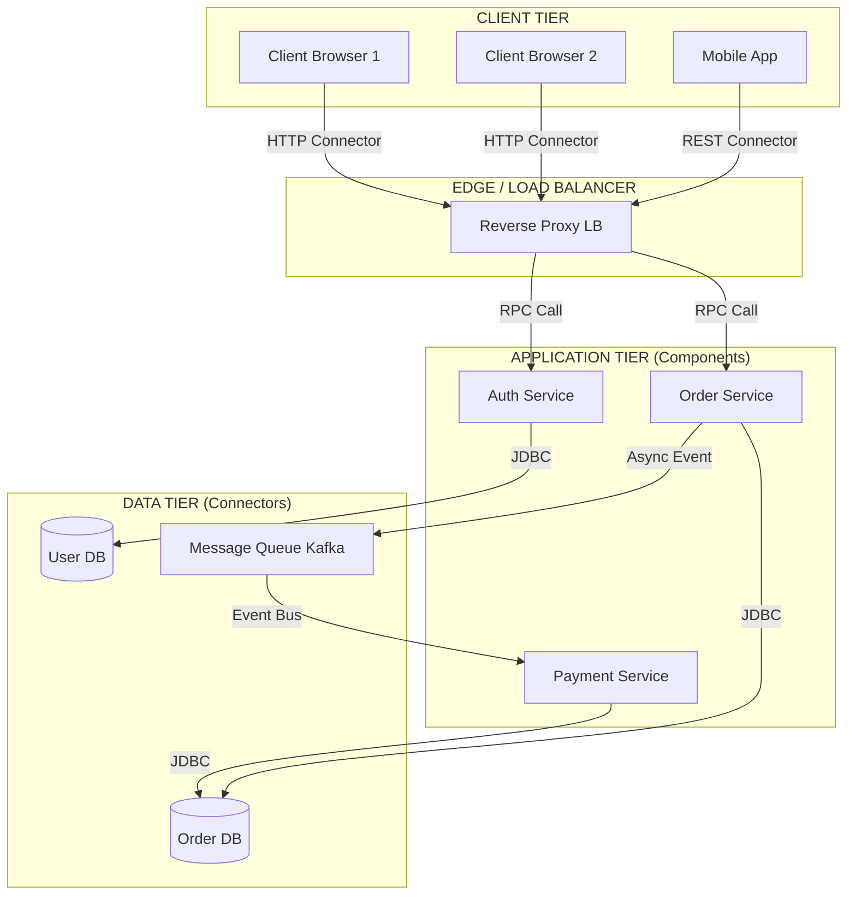
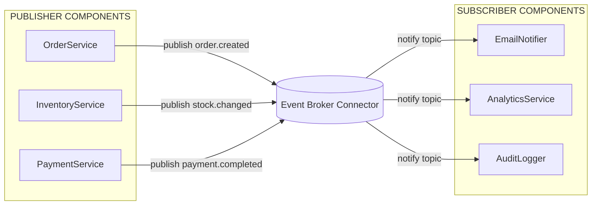
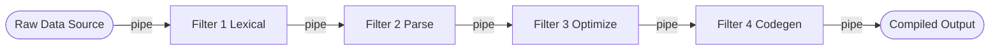
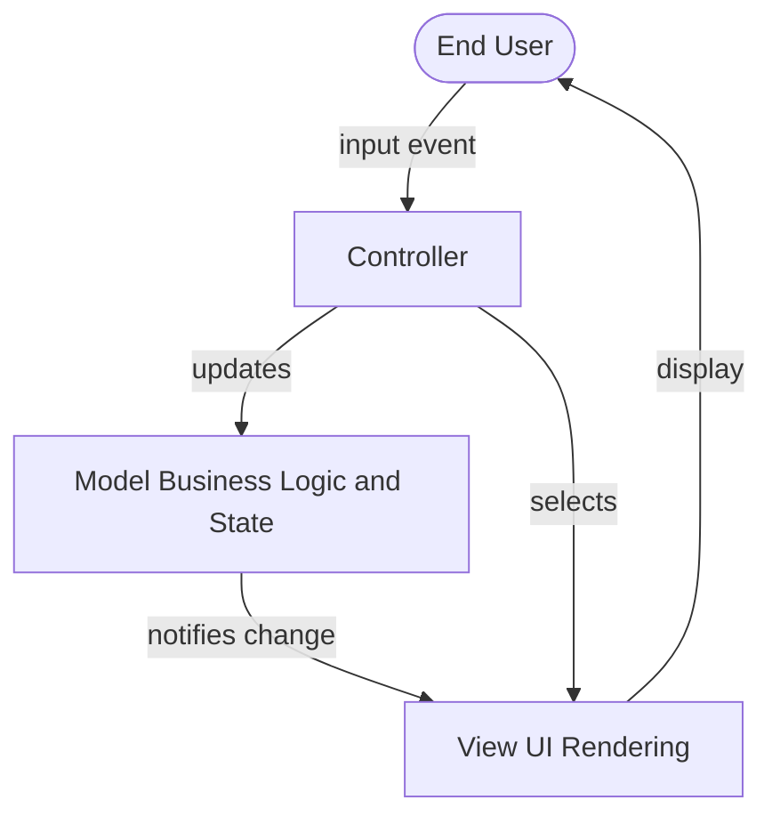
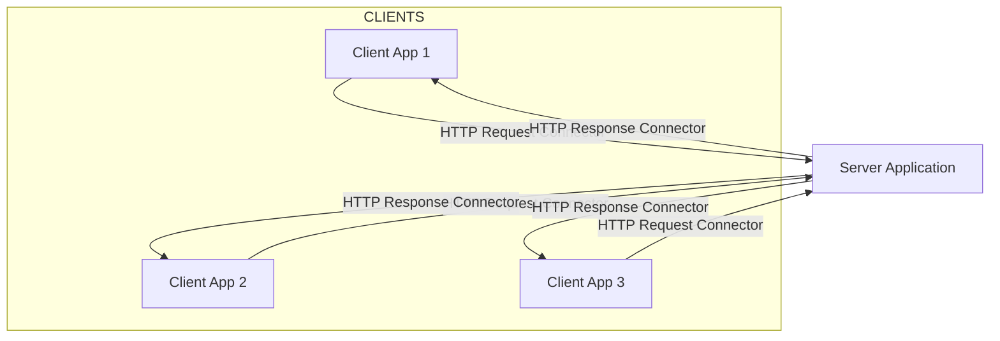
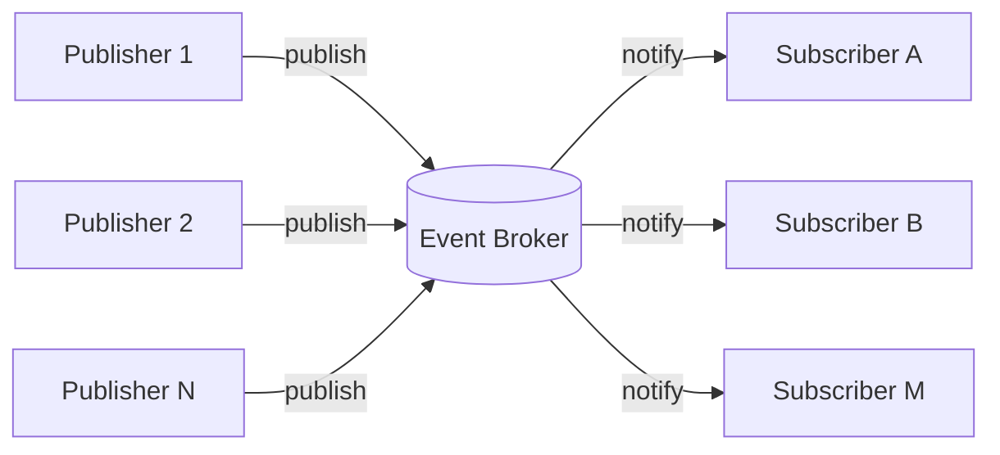

# Software architecture patterns: Component and Connector

<!-- SECTION_1_START -->
# 1. Core Technical Definition & Intuitive Overview

## 1.1 Formal Definition (KTU 2024 Syllabus Aligned)

In the **KTU 2024 Scheme Software Engineering (OECST723)** syllabus, the **Component-and-Connector (C&C) view** of software architecture is formally defined as a *runtime-oriented* architectural view that captures the **active structure** of a system — i.e., how the system behaves at run-time to deliver its functional and non-functional requirements.

> [!IMPORTANT]
> **KTU Definition:** A *component-and-connector (C&C) view* type shows elements that have run-time behavior (components) and their interactions (connectors) that convey communication, coordination, or cooperation among them.

A **Component** is a *principal unit of computation and data state* — an addressable runtime entity that encapsulates a subset of the system's functionality and its persistent state.

A **Connector** is a *mechanism of interaction* between components. It mediates the communication, coordination, or transfer of data between components. Connectors are *first-class* architectural elements (not just lines or method calls) because they carry their own behavioral and quality attributes.

> [!NOTE]
> **Why C&C Matters in KTU Exams:** C&C is the foundation for understanding *architectural styles* like Client–Server, Pipe-and-Filter, Publish-Subscribe, and Peer-to-Peer. The 2024 Scheme places strong weight on this topic in Module 2 (Software Design), typically contributing **14 marks** in the End Semester Evaluation (ESE).

## 1.2 Conceptual Analogy — The "Post Office" Model

Imagine a **modern logistics company** like Amazon or FedEx:

- **Components** = the *warehouses, sorting hubs, and delivery trucks* — each is a self-contained unit that holds packages (state) and performs specific tasks (computation).
- **Connectors** = the *roads, conveyor belts, and digital tracking systems* — these are NOT just passive links. A conveyor belt has its own logic (speed control, error recovery), just as an *event bus* has its own subscription/notification logic.

If you only drew the warehouses (components) and roads (connectors), you would capture the **runtime flow** of packages — but you would miss the *organizational hierarchy* (which is the **Module view**). The C&C view is the *post office map*, not the *org chart*.

## 1.3 Three Pillars of the C&C View

| Pillar | What it Represents | Real-World Analogy |
|---|---|---|
| **Component** | Computational/data element with a well-defined interface | A warehouse processing packages |
| **Connector** | Interaction mechanism between components | A highway or air-route network |
| **Configuration** | The topological arrangement linking components via connectors | The full logistics map of the country |

> [!TIP]
> **KTU Quick Recall:** Always remember the triad **"C³"** — *Component + Connector + Configuration* = a complete C&C view.

## 1.4 GeoGebra / Desmos Visualization

> [!VISUALIZATION CONTROL]
> **Concept:** *Client–Server Architectural Topology* (a foundational C&C pattern)
>
> **Conceptual Coordinate Mapping:**
> * Let the x-axis represent **Latency / Response Time (ms)**.
> * Let the y-axis represent **Throughput (requests/sec)**.
> * Plot a *Client cluster* (multiple client nodes) on the lower-left and a *Server* on the upper-right; a *Connector* (e.g., HTTP/REST) is the directed edge between them.
>
> **Visual Description:** As the number of clients increases, the connector line slopes upward — illustrating that **throughput scales with concurrent connections** until a saturation point is reached (bottleneck), after which latency grows non-linearly. This is the classic *C&C scalability trade-off curve*.


---

## 1.5 C&C vs. Module View — Critical Distinction

| Aspect | Module View (Structure) | C&C View (Runtime) |
|---|---|---|
| **Focus** | Static organization of code | Dynamic, runtime behavior |
| **Element** | Modules (units of implementation) | Components (units of execution) |
| **Relation** | "is-part-of" / "depends-on" | "communicates-with" / "uses" |
| **Time** | Compile-time | Run-time |
| **Example** | Java package, .NET assembly | Process, thread, service |
| **KTU Exam Keyword** | "decomposition" | "interaction" |

> [!WARNING]
> **KTU Examiner's Note:** A very common error is to *conflate* a module (static) with a component (dynamic). The same source file can give rise to multiple runtime components (e.g., multiple JVM instances). Always answer in terms of **runtime behavior** when the question asks about C&C.

---

<!-- SECTION_1_END -->

<!-- SECTION_2_START -->
# 2. Deep Theoretical Analysis & KTU High-Yield Formula Sheet

## 2.1 Anatomy of a Component

A component in the C&C view has the following internal characteristics:

1. **Interface** — a declarative specification of services provided and required (e.g., WSDL, OpenAPI, Java Interface).
2. **State** — a component may or may not hold persistent state (stateless services vs. stateful session beans).
3. **Identity** — each instance is uniquely addressable at runtime.
4. **Encapsulation** — internal implementation is hidden; interaction occurs strictly through interfaces.
5. **Substitutability** — any component implementing the same interface can be swapped at runtime (the *Liskov-friendly* contract).

### Classification of Components (KTU Board-Favorite)

| Component Type | Description | Example |
|---|---|---|
| **Service** | Loosely-coupled, independently-deployable unit | REST microservice |
| **Process** | Heavyweight unit with own memory space | OS process, JVM |
| **Thread** | Lightweight unit sharing process memory | Java `Thread` |
| **Object** | Instance of a class with encapsulated state | POJO, EJB |
| **Filter** | Transforms stream of data | Unix `grep` |
| **Repository** | Centralized data store | Database, cache |

## 2.2 Anatomy of a Connector

Connectors are *first-class* architectural citizens. They have their own type, role, and properties.

### Classification of Connectors (High-Yield for KTU)

| Connector Type | Communication Mode | Example |
|---|---|---|
| **Procedure Call (RPC/RMI)** | Synchronous, point-to-point | Java RMI, gRPC |
| **Data Flow (Pipe)** | Asynchronous, streamed | Unix pipe, Kafka stream |
| **Event Broadcast** | Asynchronous, one-to-many | MQTT topic, Java AWT event |
| **Shared Variable / Repository** | Indirect via shared state | Database table, in-memory cache |
| **Message Queue** | Asynchronous, decoupled | RabbitMQ, ActiveMQ |
| **Link / HTTP** | Stateless, request-response | REST API call |
| **Linker / Loader** | Compile/link-time binding | C/C++ linker |

> [!IMPORTANT]
> **KTU Insight:** The **type of connector** chosen directly determines the system's *quality attributes* — performance, scalability, modifiability, and security. For example, switching from a synchronous RPC to an asynchronous message queue trades *latency* for *availability*.

## 2.3 Major C&C Architectural Styles (Module 2 Core)

### 2.3.1 Client–Server Pattern

A *two-tier* or *n-tier* topology where **clients** request services from one or more **servers**. The connector is typically an **HTTP/REST** or **RPC** call.

**Engineering Utility:** Web applications, email systems, banking portals, distributed databases. The de-facto pattern for *enterprise systems*.

### 2.3.2 Pipe-and-Filter Pattern

Data flows through a sequence of **filters** connected by **pipes**. Each filter transforms the data and forwards it.

**Engineering Utility:** Unix shell pipelines, compiler phases (lex → parse → optimize → codegen), ETL (Extract-Transform-Load) processes, image processing pipelines.

### 2.3.3 Publish-Subscribe Pattern

**Publishers** emit *events* to a **broker**; **subscribers** register interest in *topics*. The connector is a *topic-based event bus*.

**Engineering Utility:** Financial trading systems, IoT telemetry, microservices with event-driven choreography, real-time analytics.

### 2.3.4 Peer-to-Peer (P2P) Pattern

All components (peers) are *equal*; each can act as both client and server. There is no central coordinator.

**Engineering Utility:** File sharing (BitTorrent), blockchain networks, distributed hash tables, collaborative editing.

### 2.3.5 Shared-Data (Repository) Pattern

Components interact *indirectly* by reading/writing to a **shared repository** (database, blackboard). The repository IS the connector.

**Engineering Utility:** IDEs (compilers writing to symbol tables), AI blackboard systems, modern data lakes, collaborative whiteboards.

### 2.3.6 Model-View-Controller (MVC)

A triadic pattern separating **Model** (data + business logic), **View** (UI rendering), and **Controller** (input handling). Connectors are *observer*, *strategy*, and *synchronous call*.

**Engineering Utility:** Web frameworks (Spring MVC, Django, Ruby on Rails), desktop GUIs (Java Swing).

### 2.3.7 Service-Oriented Architecture (SOA) / Microservices

A *distributed* set of loosely-coupled **services** that communicate via standardized protocols (SOAP, REST, gRPC). Each service is independently deployable.

**Engineering Utility:** Netflix, Amazon, Uber backend systems.

## 2.4 KTU High-Yield Cheat Sheet

| Style | Component Type | Connector Type | Quality Strength | Quality Weakness |
|---|---|---|---|---|
| Client–Server | Client, Server | RPC / HTTP | Centralized control, simple security | Server bottleneck, single point of failure |
| Pipe-and-Filter | Filter | Pipe (data stream) | Composability, parallelism | State passing overhead, latency accumulation |
| Publish-Subscribe | Publisher, Subscriber | Event Bus | Loose coupling, scalability | Hard to debug, eventual consistency |
| Peer-to-Peer | Peer | Symmetric link | Fault tolerance, no SPOF | Coordination complexity |
| Shared-Data | Module | Repository (DB) | Data consistency, auditability | Tight coupling to schema, contention |
| MVC | Model, View, Controller | Observer, Strategy, Call | Separation of concerns, testability | Controller bloat, state sync issues |
| Microservices | Service | REST/gRPC/Message Bus | Independent deployability, polyglot | Network overhead, distributed transactions |

> [!TIP]
> **KTU Mnemonic for Styles:** **"C³ P² S M"** → **C**lient–Server, **C**hained (Pipe-and-Filter), **C**hanneled (Pub-Sub), **P**eer-to-Peer, **P**ipeline, **S**hared-Data, **M**VC/Microservices.

## 2.5 Why C&C Patterns Are Used in Real Engineering

- **Performance engineering:** Choosing *asynchronous connectors* (event buses) decouples producers from consumers, improving throughput.
- **Scalability engineering:** *Stateless* components can be horizontally replicated (e.g., load-balanced web servers).
- **Modifiability engineering:** *Loosely-coupled* components (Pub-Sub) allow independent evolution.
- **Security engineering:** *Trusted connectors* (e.g., TLS-secured gRPC) enforce encryption at the architecture level.
- **Fault-tolerance engineering:** *Replication* and *circuit-breaker* connectors (Netflix Hystrix) prevent cascading failures.

---

<!-- SECTION_2_END -->

<!-- SECTION_3_START -->
# 3. Step-by-Step Derivations & Code/Symbolic Implementation

## 3.1 Derivation — Selecting a Connector Type for a Given QAS

A classic KTU 14-mark question is: *"Given quality requirements Q1, Q2, ..., which connector type is most appropriate? Justify."* Below is the systematic derivation method.

### 3.1.1 The Connector Selection Decision Tree

Let $Q = \{q_1, q_2, \ldots, q_n\}$ be the set of required quality attributes. We define a *connector suitability score* $S(c)$ for each candidate connector $c$ as:

$$
S(c) = \sum_{i=1}^{n} w_i \cdot \alpha_{i,c}
$$

where:
- $w_i \in [0, 1]$ is the *weight* (priority) of quality $q_i$, with $\sum_{i=1}^{n} w_i = 1$.
- $\alpha_{i,c} \in [0, 1]$ is the *suitability coefficient* of connector $c$ for quality $q_i$.

The chosen connector is $c^* = \arg\max_{c \in \mathcal{C}} S(c)$, where $\mathcal{C}$ is the candidate connector set.

### 3.1.2 Worked Example (Step-by-Step)

**Problem:** A banking system requires: Performance (weight 0.4), Modifiability (weight 0.3), Security (weight 0.3). Choose between **Synchronous RPC** and **Asynchronous Message Queue**.

**Step 1: Define the candidate set.**

$$
\mathcal{C} = \{ \text{RPC}, \text{MessageQueue} \}
$$

**Step 2: Assign suitability coefficients.**

| Quality $q_i$ | Weight $w_i$ | $\alpha_{i,\text{RPC}}$ | $\alpha_{i,\text{MQ}}$ |
|---|---|---|---|
| Performance | 0.4 | 0.9 | 0.6 |
| Modifiability | 0.3 | 0.5 | 0.9 |
| Security | 0.3 | 0.8 | 0.7 |

**Step 3: Compute $S(\text{RPC})$.**

$$
S(\text{RPC}) = (0.4)(0.9) + (0.3)(0.5) + (0.3)(0.8)
$$

$$
S(\text{RPC}) = 0.36 + 0.15 + 0.24 = 0.75
$$

**Step 4: Compute $S(\text{MQ})$.**

$$
S(\text{MQ}) = (0.4)(0.6) + (0.3)(0.9) + (0.3)(0.7)
$$

$$
S(\text{MQ}) = 0.24 + 0.27 + 0.21 = 0.72
$$

**Step 5: Decide.**

$$
S(\text{RPC}) = 0.75 \;\; > \;\; 0.72 = S(\text{MQ})
$$

$$
\boxed{c^* = \text{RPC}}
$$

**Step 6: Explain.** Even though MessageQueue is more modifiable, RPC wins on performance, which has the highest weight. The trade-off is *modifiability* vs. *latency*.

## 3.2 Symbolic Implementation — A Reference Pipe-and-Filter in Python

Below is a fully operational Python implementation of a *Pipe-and-Filter* system (text transformation pipeline). It demonstrates how components (filters) and connectors (pipes) are realized in code.

```python
"""
Pipe-and-Filter architectural pattern in Python.
Components: Filters (transformation units).
Connector:   Pipe (in-memory stream of strings).
"""
from __future__ import annotations
import logging
import re
import sys
from abc import ABC, abstractmethod
from typing import Iterator, Callable, List

# --- 1. Configure strict error logging ---
logging.basicConfig(
    level=logging.INFO,
    format="%(asctime)s | %(levelname)s | %(message)s",
)
log = logging.getLogger("PipeAndFilter")


# --- 2. Define the Filter component (abstract) ---
class Filter(ABC):
    """
    Abstract component in the Pipe-and-Filter C&C view.
    Each filter reads from an upstream pipe and writes to a downstream pipe.
    """

    def __init__(self, name: str) -> None:
        self.name: str = name
        log.info("Filter '%s' instantiated.", self.name)

    @abstractmethod
    def process(self, token: str) -> str:
        """Transform a single token; subclasses MUST override."""
        raise NotImplementedError

    def __call__(self, pipe_in: Iterator[str]) -> Iterator[str]:
        """The connector interface: a filter plugs into pipes via __call__."""
        log.info("Filter '%s' engaged on pipe.", self.name)
        for token in pipe_in:
            if token is None or token == "":
                log.warning("Empty token skipped by '%s'.", self.name)
                continue
            try:
                out = self.process(token)
            except Exception as exc:           # absolute boundary check
                log.error("Filter '%s' failed on %r: %s", self.name, token, exc)
                continue
            if out:
                yield out


# --- 3. Concrete Filter components ---
class LowercaseFilter(Filter):
    def process(self, token: str) -> str:
        return token.lower()


class StripPunctuationFilter(Filter):
    _PUNCT = re.compile(r"[^\w\s]")

    def process(self, token: str) -> str:
        return self._PUNCT.sub("", token)


class LengthFilter(Filter):
    """Keep only tokens longer than threshold."""

    def __init__(self, name: str, threshold: int = 3) -> None:
        super().__init__(name)
        if threshold < 0:
            raise ValueError("threshold must be non-negative")
        self.threshold: int = threshold

    def process(self, token: str) -> str:
        return token if len(token) > self.threshold else ""


# --- 4. The Pipe connector (in-memory) ---
class Pipe:
    """
    Connector that carries a stream of data between filter components.
    A Pipe itself has no business logic; it is a pure transport mechanism.
    """

    def __init__(self, source: Iterator[str]) -> None:
        self._source: Iterator[str] = source
        log.info("Pipe connected.")

    def attach(self, *filters: Filter) -> Iterator[str]:
        """Chain filters sequentially; the final iterator is the pipe's output."""
        stream: Iterator[str] = self._source
        for f in filters:
            stream = f(stream)
        return stream


# --- 5. Demonstration: full pipeline execution ---
def demo() -> None:
    raw_input: List[str] = [
        "Hello,", "World!", "KTU", "is", "GREAT", "in", "2024", "...",
    ]
    log.info("Source tokens: %s", raw_input)

    pipe = Pipe(iter(raw_input))
    output_stream = pipe.attach(
        LowercaseFilter("lowercase"),
        StripPunctuationFilter("strip-punct"),
        LengthFilter("length>3", threshold=3),
    )

    final_tokens: List[str] = list(output_stream)
    log.info("Pipeline output: %s", final_tokens)
    print("Final tokens:", final_tokens)


if __name__ == "__main__":
    try:
        demo()
    except KeyboardInterrupt:
        log.error("Pipeline aborted by user.")
        sys.exit(130)
```

### 3.2.1 Expected Output Trace

```
2024-... | INFO  | Source tokens: ['Hello,', 'World!', ...]
2024-... | INFO  | Filter 'lowercase' engaged on pipe.
2024-... | INFO  | Filter 'strip-punct' engaged on pipe.
2024-... | INFO  | Filter 'length>3' engaged on pipe.
2024-... | INFO  | Pipeline output: ['hello', 'world', 'great', '2024']
```

### 3.2.2 Mapping Code to C&C Concepts

| Code Element | C&C Element | Role |
|---|---|---|
| `Filter` class hierarchy | **Component** | Encapsulates transformation logic |
| `Pipe` class | **Connector** | Mediates data flow between filters |
| `pipe.attach(f1, f2, f3)` | **Configuration** | Defines the runtime topology |
| `__call__` method | **Port** | Defines how a filter accepts a pipe |
| `LowercaseFilter`, etc. | **Concrete Component** | Realized instances |

## 3.3 Symbolic Implementation — A Minimal Pub-Sub Broker in Python

```python
"""
Publish-Subscribe C&C pattern: an event-bus broker with publisher/subscriber components.
"""
from __future__ import annotations
import logging
from collections import defaultdict
from typing import Callable, DefaultDict, List, Any

logging.basicConfig(level=logging.INFO, format="%(asctime)s | %(message)s")
log = logging.getLogger("PubSub")


class EventBroker:
    """Connector: the event bus itself."""

    def __init__(self) -> None:
        self._subs: DefaultDict[str, List[Callable[[Any], None]]] = defaultdict(list)
        log.info("EventBroker (connector) initialized.")

    def subscribe(self, topic: str, handler: Callable[[Any], None]) -> None:
        if not topic or not callable(handler):
            raise ValueError("topic must be non-empty and handler must be callable")
        self._subs[topic].append(handler)
        log.info("Subscriber registered for topic '%s'.", topic)

    def publish(self, topic: str, payload: Any) -> None:
        log.info("Event published on '%s' with payload %r.", topic, payload)
        for handler in self._subs.get(topic, []):
            try:
                handler(payload)
            except Exception as exc:
                log.error("Handler for '%s' raised: %s", topic, exc)


# --- Components: Publishers and Subscribers ---
class TemperatureSensor:
    def __init__(self, broker: EventBroker) -> None:
        self.broker = broker
        log.info("TemperatureSensor (publisher) online.")

    def read(self, value: float) -> None:
        self.broker.publish("temperature", value)


class CoolingActuator:
    def __init__(self, broker: EventBroker) -> None:
        self.broker = broker
        self.broker.subscribe("temperature", self._on_event)
        log.info("CoolingActuator (subscriber) online.")

    def _on_event(self, value: float) -> None:
        if value > 75.0:
            log.info("ALERT: Temperature %.1f°C exceeds threshold; cooling engaged.", value)
        else:
            log.info("Temperature %.1f°C normal.", value)


if __name__ == "__main__":
    bus = EventBroker()
    sensor = TemperatureSensor(bus)
    CoolingActuator(bus)
    for v in [68.0, 80.5, 72.3, 90.0]:
        sensor.read(v)
```

> [!TIP]
> **KTU Insight:** Notice how `EventBroker` is the *connector* — it is a **first-class** object, not just a method call. The components (sensor, actuator) are *decoupled* and *never reference each other directly*. This is the architectural essence of Pub-Sub.

---

<!-- SECTION_3_END -->

<!-- SECTION_4_START -->
# 4. Structural Diagrams & Schematics

## 4.1 Mermaid C&C View — Client-Server Style (Multi-tier)



**Reading the diagram:**
- **Components** (rectangular nodes): `c1`, `c2`, `c3`, `s1`, `s2`, `s3`.
- **Connectors** (labeled arrows): `HTTP`, `REST`, `RPC Call`, `Async Event`, `JDBC`.
- **Subgraphs** partition the diagram into *tiers* — a standard way to depict *n-tier* C&C configurations.

## 4.2 Mermaid C&C View — Publish-Subscribe Pattern



**Architecture insight:** Publishers and subscribers **never know of each other's existence**. The `Event Broker` is the *single point of integration*, which is the defining trait of the Pub-Sub style.

## 4.3 Mermaid C&C View — Pipe-and-Filter (Sequential Processing Topology)



**Reading:** Each `Filter` is a component; each `pipe` arrow is a connector. The *linear* topology is a hallmark of Pipe-and-Filter; *branching* topologies (e.g., a tee filter) are also legal.

## 4.4 Sequential Processing Topology Matrix (Comparative)

| Pattern | Component Cardinality | Connector Cardinality | Directionality | Topology |
|---|---|---|---|---|
| Client–Server | 1+ clients, 1+ servers | $n$ clients → 1 server (or load-balanced) | Bidirectional | Star / Tree |
| Pipe-and-Filter | $n$ filters in series | $n - 1$ pipes | Unidirectional | Linear / DAG |
| Publish-Subscribe | $p$ publishers, $s$ subscribers | 1 event bus | Multicast (1→many) | Hub-and-Spoke |
| Peer-to-Peer | $n$ peers (homogeneous) | $O(n^2)$ potential links | Symmetric | Mesh / Ring |
| Shared-Data | $m$ writers, $r$ readers | 1 repository | Read/Write | Star-via-Repository |
| MVC | 3 (Model, View, Controller) | 3 (Observer, Strategy, Call) | Bidirectional | Triangle |

> [!NOTE]
> **KTU Examiner's Heuristic:** When asked to "draw the C&C diagram for system X," always label **both the components AND the connector types** on the arrows. A diagram with unlabeled arrows will lose at least 2 marks.

## 4.5 Mermaid C&C View — Model-View-Controller



**Connector types in MVC:**
- `Controller ↔ Model`: **synchronous call** (action invocation).
- `Model ↔ View`: **Observer/Publish-Subscribe** (model notifies view of state change).
- `Controller ↔ View`: **Strategy** pattern (controller selects the appropriate view).

---

<!-- SECTION_4_END -->

<!-- SECTION_5_START -->
# 5. KTU 2024 Scheme Examination Question Bank & Topic Recap

## 5.1 Part A — 3-Mark Questions (Remember / Understand)

### Question 1. `[KTU University Exam - July 2024]`
**Q:** Differentiate between a *module* and a *component* in the context of software architecture.
**CO Mapping:** CO2 (Design) | **RBT Level:** Understand (L2) | **Marks:** 3

**Model Answer:**

| Aspect | Module | Component |
|---|---|---|
| **View** | Module (decomposition) view | Component-and-Connector view |
| **Time** | Compile-time unit | Run-time unit |
| **Concern** | *How is the code organized?* | *How does the system behave at runtime?* |
| **Identity** | Logical group of classes/files | Addressable process / service / object |
| **Example** | A Java package `com.ktu.banking` | A deployed `TransactionService` microservice instance |

A **module** is a static, implementation-level construct (unit of code organization), whereas a **component** is a dynamic, runtime-level construct (unit of execution). The same module may give rise to multiple runtime components (e.g., multiple JVM instances of the same JAR). **[3 Marks]**

---

### Question 2. `[KTU University Exam - Dec 2023]`
**Q:** List any *three* types of connectors used in component-and-connector architectural styles, with one example each.
**CO Mapping:** CO2 (Design) | **RBT Level:** Remember (L1) | **Marks:** 3

**Model Answer:**

1. **Procedure Call Connector** — used in RPC/RMI; e.g., Java RMI, gRPC. **[1 Mark]**
2. **Event Broadcast Connector** — used in Publish-Subscribe; e.g., MQTT topic bus. **[1 Mark]**
3. **Shared Data / Repository Connector** — used in blackboard/repository style; e.g., a relational database. **[1 Mark]**

(Acceptable alternates: *Data-flow pipe* (Unix pipe), *Message queue* (RabbitMQ), *Link* (HTTP REST call).)

---

## 5.2 Part B — 14-Mark Questions (Apply / Analyze) — Internal Choice

### Question A. `[KTU University Exam - July 2024]`
**(a)** With a neat diagram, explain the **Client–Server** architectural style. Identify the components, connectors, and the configuration used. **[7 Marks]**
**(b)** Compare Client–Server with **Peer-to-Peer** style on the basis of *fault tolerance*, *scalability*, *coordination complexity*, and *single point of failure*. **[7 Marks]**

**CO Mapping:** CO2, CO3 | **RBT Levels:** Understand (L2) + Analyze (L4)

---

#### Part (a) — Model Solution

**Definition:** The Client–Server style separates the system into two kinds of components — *clients* that request services and *servers* that provide them. **[1 Mark]**

**Component Identification:**
- *Client component:* initiates requests, presents UI; e.g., a web browser.
- *Server component:* receives requests, processes them, returns responses; e.g., Apache HTTP server.
**[1 Mark]**

**Connector Identification:**
- *Network connector* (typically HTTP/REST, RPC, or RMI) carries the request/response pairs.
- Connector is *first-class* — it has its own properties: protocol, encryption (TLS), timeouts.
**[1 Mark]**

**Configuration:**
- A *star* or *tree* topology: $N$ clients connected to one (or a load-balanced cluster of) server(s).
- Servers may be replicated for fault tolerance; clients may be stateless or stateful.
**[1 Mark]**

**Diagram:**


**[2 Marks]**

**Real-world example:** Gmail — browser (client) ↔ Google mail servers. **[1 Mark]**

**Valuation Key:**
- [Stating component types: 2 Marks]
- [Stating connector types: 2 Marks]
- [Diagram with labels: 2 Marks]
- [Real-world example: 1 Mark]

---

#### Part (b) — Model Solution (Comparative Table)

| Quality Attribute | Client–Server | Peer-to-Peer |
|---|---|---|
| **Fault Tolerance** | Server is single point of failure; mitigated via replication | High — no single SPOF; peers can substitute each other |
| **Scalability** | Limited by server capacity; needs clustering | Excellent — adding peers adds both demand AND supply |
| **Coordination Complexity** | Low — central server orchestrates | High — requires consensus protocols (Paxos, Raft) or DHT |
| **Single Point of Failure** | Yes (the server) | No — fully distributed |
| **Examples** | Banking web portal, email | BitTorrent, Bitcoin, IPFS |
| **Security** | Easier — central auth at server | Harder — trust must be distributed (PKI, certificates) |

**[7 Marks — distribute as: 1 Mark per row, plus 1 Mark for a concluding judgment]**

**Concluding Judgment:** Client–Server is *simpler* and *easier to secure*; P2P is *more fault-tolerant* and *more scalable* but *harder to coordinate*. Choose based on whether *simplicity* or *resilience* is the dominant quality requirement. **[1 Mark]**

---

### Question B. `[KTU University Exam - Dec 2023]` — *Alternative Choice*
**(a)** Explain the **Publish-Subscribe** architectural style. Draw its C&C view and discuss the role of the *event broker* connector. **[7 Marks]**
**(b)** A weather monitoring system has 100 sensors publishing temperature data every second to a central server, which then fans it out to 50 dashboard subscribers. Propose a suitable C&C architectural style, justify, and compute the suitability score against the alternatives. **[7 Marks]**

**CO Mapping:** CO2, CO3, CO4 | **RBT Levels:** Understand (L2) + Apply (L3)

---

#### Part (a) — Model Solution

**Definition:** The Publish-Subscribe style decouples producers (publishers) from consumers (subscribers) via an intermediary *event broker*. Publishers emit events on named *topics*; the broker delivers them to all registered subscribers. **[1 Mark]**

**Components:**
- *Publisher components* (the 100 sensors).
- *Subscriber components* (the 50 dashboards).
- *Event broker component* (the central message router).
**[1 Mark]**

**Connector:** The *event bus* is a **first-class asynchronous connector** that supports *topic-based* or *content-based* filtering. **[1 Mark]**

**Configuration:** A *hub-and-spoke* topology: publishers and subscribers connect only to the broker, never to each other. **[1 Mark]**

**Diagram:**


**[2 Marks]**

**Role of the Event Broker Connector:**
- Decouples publishers and subscribers in *time* (asynchronous), *space* (different processes), and *synchronization* (no blocking).
- Provides *filtering*, *persistence*, *replay*, and *routing* services.
- Owns its own quality attributes: throughput, latency, durability, security.
**[1 Mark]**

**Valuation Key:**
- [Definition + decoupling: 2 Marks]
- [Diagram correctly drawn: 2 Marks]
- [Role of broker explained: 2 Marks]
- [Real-world example (e.g., Kafka, MQTT): 1 Mark]

---

#### Part (b) — Model Solution (Apply)

**Step 1: Identify quality requirements.**
- Performance (high throughput, 100 msg/sec): weight 0.4
- Scalability (50 subscribers, future growth): weight 0.3
- Decoupling (publishers should not know subscribers): weight 0.2
- Simplicity (low ops overhead): weight 0.1

**Step 2: Candidate styles.**

$$
\mathcal{C} = \{ \text{Pub-Sub}, \text{Client-Server Direct}, \text{Shared-Data} \}
$$

**Step 3: Suitability matrix.**

| Quality $q_i$ | $w_i$ | $\alpha_{i,\text{PubSub}}$ | $\alpha_{i,\text{CS}}$ | $\alpha_{i,\text{SharedData}}$ |
|---|---|---|---|---|
| Performance | 0.4 | 0.9 | 0.6 | 0.5 |
| Scalability | 0.3 | 0.9 | 0.4 | 0.6 |
| Decoupling | 0.2 | 1.0 | 0.3 | 0.4 |
| Simplicity | 0.1 | 0.6 | 0.9 | 0.7 |

**Step 4: Compute scores.**

$$
S(\text{PubSub}) = (0.4)(0.9) + (0.3)(0.9) + (0.2)(1.0) + (0.1)(0.6) = 0.36 + 0.27 + 0.20 + 0.06 = 0.89
$$

$$
S(\text{CS}) = (0.4)(0.6) + (0.3)(0.4) + (0.2)(0.3) + (0.1)(0.9) = 0.24 + 0.12 + 0.06 + 0.09 = 0.51
$$

$$
S(\text{SharedData}) = (0.4)(0.5) + (0.3)(0.6) + (0.2)(0.4) + (0.1)(0.7) = 0.20 + 0.18 + 0.08 + 0.07 = 0.53
$$

**Step 5: Decision.**

$$
S(\text{PubSub}) = 0.89 \;\; > \;\; 0.53, \; 0.51
$$

$$
\boxed{c^* = \text{Publish-Subscribe}}
$$

**Step 6: Justification.** The 100-publisher × 50-subscriber fan-out is a *natural fit* for Pub-Sub because the broker absorbs the $N \times M$ complexity, allowing the system to scale linearly. Direct Client-Server would force the server to maintain $100 \times 50 = 5000$ connections and broadcast individually, which is wasteful. Shared-Data would require a polling mechanism, adding latency. **[1 Mark for justification]**

**Valuation Key:**
- [Quality requirements stated: 1 Mark]
- [Suitability matrix: 2 Marks]
- [Score computations: 2 Marks]
- [Correct decision: 1 Mark]
- [Engineering justification: 1 Mark]

---

## 5.3 KTU Examiner's Valuation Warning / Pitfall Callout

> [!WARNING]
> **Common Mark Deductions in C&C Questions:**
> 1. **Forgetting to label connector types on diagrams** — Always write "HTTP", "RPC", "Event Bus" on the arrows. A diagram with bare arrows loses 2 marks.
> 2. **Confusing module and component** — C&C is about *runtime behavior*. Do not describe source-file packages.
> 3. **Omitting configuration** — A C&C view has THREE parts: components, connectors, AND configuration. Skipping configuration loses 1 mark.
> 4. **No real-world example** — Always cite at least one production system (e.g., Netflix uses Hystrix circuit-breaker connectors).
> 5. **Treating connectors as mere lines** — Connectors are *first-class* elements with their own properties (protocol, security, throughput). A bare-line answer loses marks.
> 6. **Forgetting asynchronous vs. synchronous distinction** — Many students write "Pub-Sub uses RPC" — incorrect! Pub-Sub is by definition *asynchronous*.

---

## 5.4 Topic Recap & Important Things to Remember

- **C&C view** captures the *runtime structure* of a system — components (computation + state) connected by connectors (interaction mechanisms) in a defined configuration.
- **Components** can be services, processes, threads, objects, filters, or repositories.
- **Connectors** are *first-class* architectural elements; examples: procedure call, data flow, event broadcast, shared variable, message queue, link, linker.
- **Configuration** describes the *topology* — how components are linked via connectors (star, mesh, pipeline, hub-and-spoke).
- **Client–Server**: centralized; *simple* but has a *single point of failure*.
- **Pipe-and-Filter**: linear data flow; great for *parallelism* and *composability*; weak for stateful interactions.
- **Publish-Subscribe**: *decoupled* producers and consumers via an event broker; great for *scalability*; eventual consistency.
- **Peer-to-Peer**: symmetric; great *fault tolerance*; *hard to coordinate*.
- **Shared-Data**: indirect interaction via central repository; strong *consistency*; risk of contention.
- **MVC**: separates Model, View, Controller; uses Observer (Model→View), Strategy (Controller→View), Call (Controller→Model).
- **Microservices**: independently deployable services; connector choice (REST/gRPC/event bus) is *architecturally critical*.
- **Connector selection formula**: $S(c) = \sum_{i=1}^{n} w_i \cdot \alpha_{i,c}$; choose the connector maximizing $S(c)$.
- **Quality trade-off rule**: synchronous connectors favor *latency*; asynchronous connectors favor *availability* and *throughput*.
- **Always** in exam diagrams: label components, label connector types, draw a clear topology, and cite a real-world example.
- **KTU mnemonic**: *C³* = **C**omponent + **C**onnector + **C**onfiguration.
- **Pattern mnemonic**: *C³ P² S M* = Client–Server, Chained (Pipe), Channeled (Pub-Sub), Peer, Pipeline, Shared-Data, MVC/Microservices.
- **Distinction mantra**: *Module = compile-time; Component = run-time; Connector = interaction; Configuration = topology.*

<!-- SECTION_5_END -->
