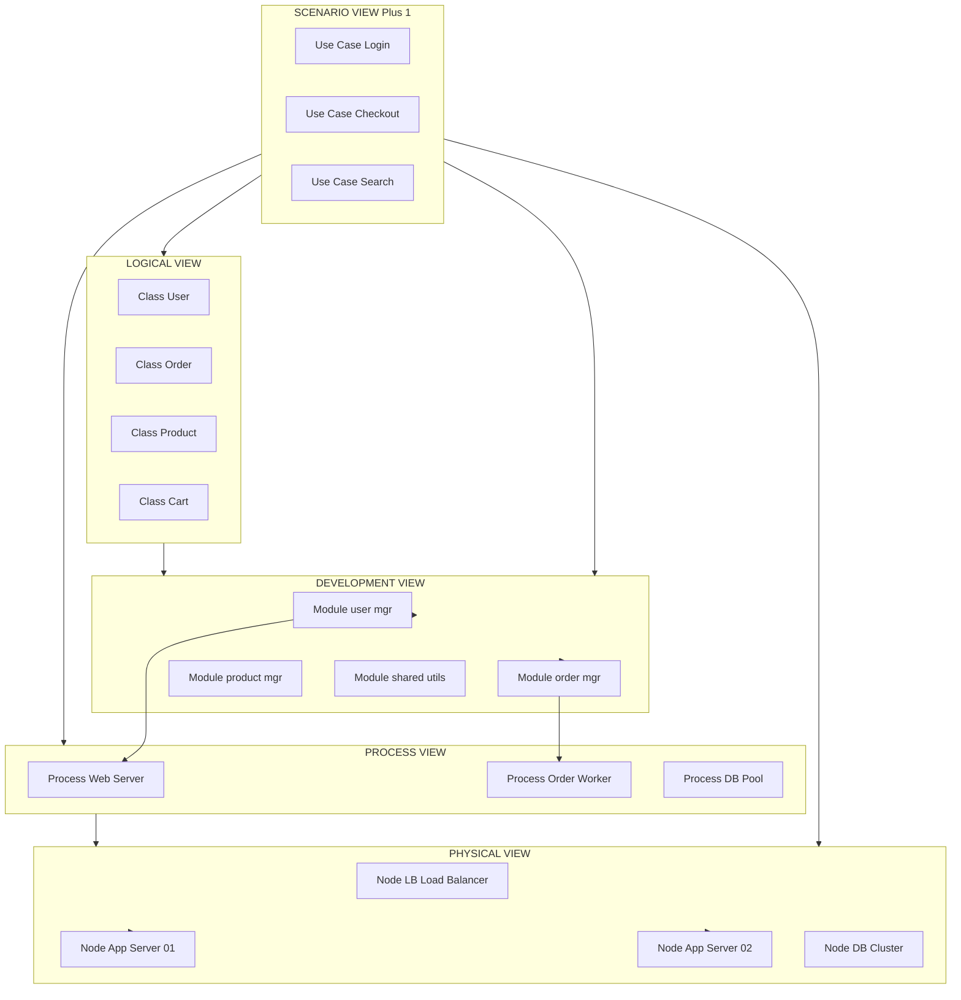
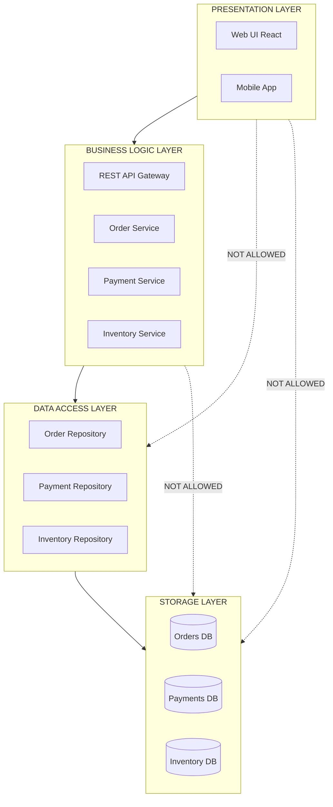
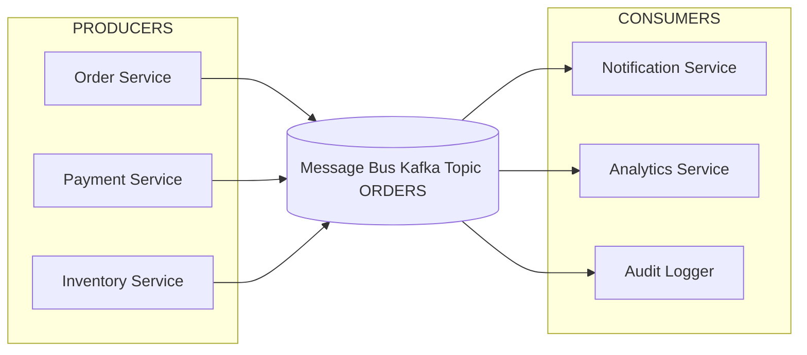
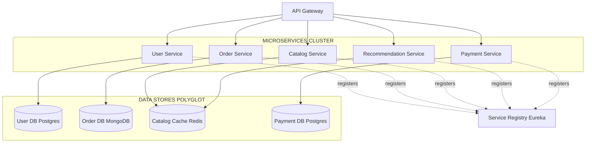
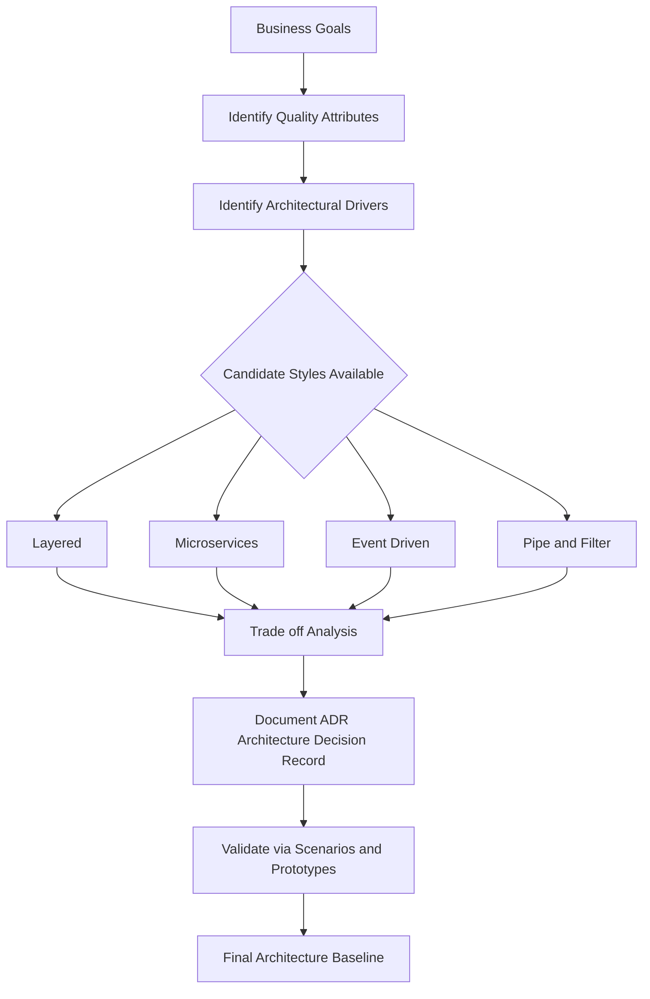
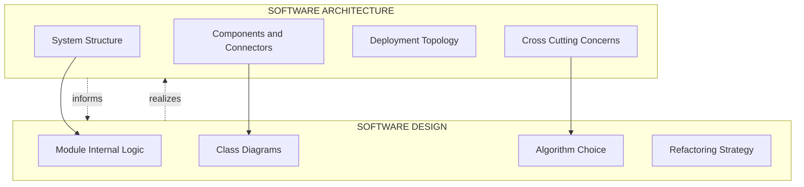

# Software design -  Software architecture and its importance

<!-- SECTION_1_START -->
# Software Architecture and Its Importance

## 1.1 Formal Definition (KTU 2024 Syllabus Terminology)

**Software Architecture** refers to the **fundamental organization of a system**, embodied in its **components**, the **relationships** among those components, and the **principles and guidelines** governing their design and evolution over time.

> [!IMPORTANT]
> **IEEE Standard 1471 / ISO 42010 Definition:**
> "The software architecture of a system is the set of structures needed to reason about the system, which comprise software elements, relations among them, and properties of both."

In simple KTU-board language, software architecture is the **blueprint of the entire software system** — it defines *what* the major modules are, *how* they interact, and *what* rules govern their construction.

The three pillars of any software architecture are:

1. **Components** — the building blocks (modules, services, classes, layers).
2. **Connectors** — the communication paths between components (function calls, message queues, REST APIs).
3. **Constraints** — the design rules and quality goals that shape the structure.

> [!NOTE]
> **Architect vs. Designer Distinction (Common KTU Question):**
> - **Architect**: Deals with the *whole system* — structure, components, deployment, technology choice.
> - **Designer**: Deals with *internal module logic* — classes, algorithms, data structures.
>
> **Rule of thumb:** Architecture is a **set of decisions** that are *hard to change* later. Once chosen, switching them is expensive.

## 1.2 Intuitive Analogy — Building a House

Imagine you want to construct a house. Before the engineer draws wiring or the mason lays bricks, an **architect** first creates a blueprint showing:
- Number of floors, rooms, and corridors
- Load-bearing walls and their positions
- Water supply, electricity, and ventilation paths
- Building code compliance (seismic, fire safety)

Similarly, in software:
- **Floors** ≈ **Layers** (Presentation, Business, Data)
- **Rooms** ≈ **Components/Modules** (Login, Cart, Payment)
- **Doors/Corridors** ≈ **Interfaces/Connectors** (APIs, function calls)
- **Building Code** ≈ **Quality Attributes** (security, scalability, maintainability)

A house built without an architect ends up with **load-bearing walls in the wrong place, poor ventilation, and a structurally weak base** — the software equivalent of *unmaintainable spaghetti code, tightly-coupled modules, and unscalable servers*.

> [!TIP]
> **KTU Memory Hook:** *Architecture is to software what a city plan is to a city.* You decide roads, zones, and utilities **once** — restructuring them later is prohibitively costly.

## 1.3 Why Software Architecture Exists

Modern software systems are **distributed, concurrent, and long-lived**. Without a clear architectural plan:
- Teams cannot **work in parallel** on decoupled modules.
- **Performance, security, and reliability** cannot be reasoned about.
- **Maintenance and evolution** become exponentially costly.
- **Stakeholders** (clients, managers, developers) cannot share a common mental model.

> [!IMPORTANT]
> **Key Engineering Constant (KTU Board Expectation):**
> Architecture decisions made early are responsible for **80% of the system's quality attributes** (a well-known industry figure attributed to **Tom DeMarco, Barry Boehm**, and the SEI at Carnegie Mellon). Once committed, these decisions are the **most expensive to reverse**.

## 1.4 The Role of the Software Architect

The software architect is responsible for:
- Translating business requirements into **architectural styles and patterns**.
- Defining **quality attribute scenarios** (response time, throughput, availability).
- Producing **architectural views** for different stakeholders.
- Documenting **architectural decisions** in lightweight records (ADRs).
- Ensuring the system meets **non-functional requirements (NFRs)** at the structural level.

> [!VISUALIZATION CONTROL]
> **Concept:** Software Architecture as a 3-Layer Pyramid of Decisions
> **GeoGebra / Desmos Input Equations:**
> * `P1 = (0, 0)` — Foundation (Architectural Drivers / Business Goals)
> * `P2 = (-3, 2)` — Quality Attributes (Performance, Security, Modifiability)
> * `P3 = (3, 2)` — Architectural Style (Layered, Microservices, Event-Driven)
> * `P4 = (-1.5, 3.5)` — Components (Modules, Services, Packages)
> * `P5 = (1.5, 3.5)` — Connectors (APIs, Queues, Function Calls)
> **Visual Description:** A pyramid with the **base = architectural drivers** (why), the **middle = style + quality** (how), and the **apex = components + connectors** (what). Each upper layer rests on and is constrained by the layer below.

<!-- SECTION_1_END -->

<!-- SECTION_2_START -->
# Deep Theoretical Analysis & KTU High-Yield Formula Sheet

## 2.1 The "4+1" View Model of Software Architecture (Philippe Kruchten, 1995)

KTU frequently tests the **4+1 view model**. It addresses the fact that *no single diagram can capture a system's structure for all stakeholders*.

| View | Focus | Audience | Key Artifacts |
|---|---|---|---|
| **Logical View** | Functional requirements — what the system does | End users, analysts | Class diagrams, object diagrams, state machines |
| **Development View** | Software modules, packages, libraries | Programmers, build engineers | Package diagrams, component diagrams, source-tree layout |
| **Process View** | Runtime behavior, concurrency, threads | Integrators, performance engineers | Activity diagrams, sequence diagrams, deployment of processes |
| **Physical View** | Hardware topology, deployment, network | System engineers, DevOps | Deployment diagrams, network topology maps |
| **(+1) Scenarios / Use-Case View** | Glue view that ties all others together | All stakeholders | Use-case diagrams, sequence traces |

> [!NOTE]
> **Board Tip:** When asked "Which view addresses non-functional requirements like performance and scalability?" — the answer is the **Process View**, because it models runtime threads and processes.

## 2.2 Architectural Styles (Architectural Patterns)

An **architectural style** is a named collection of design decisions that (1) are applicable in a given development context, (2) constrain design decisions, and (3) yield beneficial qualities in the resulting system.

### 2.2.1 Data-Flow Styles
| Style | Description | Typical Use |
|---|---|---|
| **Pipe-and-Filter** | Stream of data passes through sequential filters | Compilers, Unix shells, ETL pipelines |
| **Batch Sequential** | Data moves in batches between programs | Bank reconciliation, payroll processing |

### 2.2.2 Call-and-Return Styles
| Style | Description | Typical Use |
|---|---|---|
| **Main Program & Subroutines** | Classic procedural decomposition | Scientific computing, legacy systems |
| **Object-Oriented** | System as interacting objects with encapsulated state | GUIs, business applications |
| **Layered (n-tier)** | Strictly separated tiers; each layer calls only the one below | Web apps (Presentation → Business → Data) |
| **Client-Server** | Clients request services from a central server | Web browsers, email systems |

### 2.2.3 Data-Centered Styles
| Style | Description | Typical Use |
|---|---|---|
| **Repository** | Shared central data store, components read/write to it | IDEs, CASE tools, scientific databases |
| **Blackboard** | Multiple experts collaborate via shared blackboard | AI problem-solving, signal processing |

### 2.2.4 Independent Components Styles
| Style | Description | Typical Use |
|---|---|---|
| **Event-Driven (Implicit Invocation)** | Components register and react to events | UI frameworks, message buses |
| **Publish-Subscribe** | Publishers emit events; subscribers consume them | Distributed systems, IoT, real-time analytics |
| **Microservices** | Small, autonomous, independently deployable services | Netflix, Amazon, Uber, e-commerce backends |

### 2.2.5 Other Notable Styles
- **Service-Oriented Architecture (SOA)** — coarse-grained services with contracts.
- **Component-Based** — pluggable binary or service components.
- **Peer-to-Peer (P2P)** — all nodes are equal; no central server.
- **Model-View-Controller (MVC)** — separates presentation, logic, and input.
- **Microkernel / Plug-in** — minimal core with extensible plug-ins (Eclipse IDE).

## 2.3 Quality Attributes (Architectural Drivers)

Quality attributes — also called *non-functional requirements* — are the **reasons** an architecture exists. They are measurable.

| Quality Attribute | Definition | Measurable Metric |
|---|---|---|
| **Availability** | Proportion of time system is operational | Uptime \% (e.g., 99.99\% "four nines") |
| **Performance / Latency** | Response time for a request | Milliseconds, throughput (TPS) |
| **Scalability** | Ability to handle increased load | Linear vs. cubic cost of doubling load |
| **Modifiability** | Ease of change | Time, effort, ripple effect |
| **Security** | Resistance to attacks | Mean time to breach, attack-surface size |
| **Testability** | Ease of verification | Code coverage, mutation score |
| **Usability** | Ease of use | Task completion time, error rate |
| **Reliability** | Mean time between failures | MTBF, MTTR |

> [!IMPORTANT]
> **Quality Attribute Workshop (QAW):** A scenario-based SEI technique used to elicit, prioritize, and document quality attributes as concrete scenarios. Each scenario follows the form:
> **Stimulus → Source → Environment → Artifact → Response → Response Measure**
> Example: *A user (source) submits 10,000 concurrent requests (stimulus) during peak hours (environment) to the order service (artifact); the system (response) should respond within 200 ms (response measure) for 95\% of requests.*

## 2.4 Architecture vs. Design Pattern (High-Yield Distinction)

| Aspect | Architecture | Design Pattern |
|---|---|---|
| **Scope** | Whole system | Subsystem / class level |
| **Granularity** | Coarse (components, layers) | Fine (classes, objects) |
| **Decisions** | Hard to change | Easier to refactor |
| **Examples** | Layered, Microservices, Event-Driven | Singleton, Observer, Strategy, Factory |
| **Influences** | Tech stack, deployment, team structure | Internal code reuse, flexibility |

## 2.5 Importance of Software Architecture (KTU Board Hot Topic)

| Benefit | Explanation |
|---|---|
| **1. Stakeholder Communication** | Architecture provides a common vocabulary for technical and non-technical stakeholders. |
| **2. Quality Attribute Realization** | Architecture is the **primary carrier** of non-functional requirements — performance, security, scalability all flow from structural decisions. |
| **3. Cost Reduction** | Fixing a design defect at the **architecture phase is up to 100x cheaper** than fixing it post-deployment (Boehm's curve). |
| **4. Reusability** | A well-defined architecture enables component reuse across products. |
| **5. Predictable Development** | Architects can hand off a stable structural skeleton; teams work in parallel with minimal conflicts. |
| **6. Risk Management** | Architectural review identifies technology, performance, and integration risks early. |
| **7. Evolution and Maintenance** | A modular architecture reduces the ripple effect of changes. |
| **8. Contract Definition** | API contracts and connector behaviour can be stabilized before coding starts. |

> [!TIP]
> **KTU Mnemonic — "CAPE-RARE"** to remember 8 benefits: **C**ommunication, **A**ttributes, **P**redictability, **E**volution, **R**eusability, **A**gility, **R**isk, **E**conomics (cost).

## 2.6 KTU High-Yield Formula Sheet

| Formula / Concept | Equation / Expression | Units / Notes |
|---|---|---|
| **Architectural Drift** | $\Delta A = \vert A_{\text{implemented}} - A_{\text{intended}} \vert$ | Tracks erosion between design and code |
| **Availability (5 nines)** | $A = \dfrac{MTBF}{MTBF + MTTR} \times 100\%$ | Downtime $\approx$ 5.26 min/year |
| **Scalability Factor** | $S = \dfrac{T(N)}{T(N/2)}$ where $T$ = time for input size $N$ | Ideal $S \leq 2$ (sub-linear) |
| **MTTF / MTBF / MTTR** | $MTBF = MTTF + MTTR$ | Mean Time Between Failures |
| **Reuse Index** | $R = \dfrac{\text{Lines of Reused Code}}{\text{Total Lines of Code}}$ | Cost-saving indicator |
| **Defect Cost Multiplier** | $C(n) = C_0 \cdot K^{n}$ | $K \approx 5\text{--}10$, $n$ = phase offset |
| **Reliability (series)** | $R_{sys} = \prod_{i=1}^{n} R_i$ | Components in series multiply |
| **Reliability (parallel)** | $R_{sys} = 1 - \prod_{i=1}^{n} (1 - R_i)$ | Components in parallel (redundancy) |

> [!WARNING]
> **Escape Rule:** Always use `\vert` or `\mid` in markdown tables, NEVER raw `|`, to avoid breaking the table parser.

## 2.7 Reference & Domain-Specific Architectures

- **Reference Architecture**: A template architecture, generalized across multiple systems in a domain (e.g., *TOGAF's enterprise reference architecture*).
- **Domain-Specific Software Architecture (DSSA)**: A reference architecture tailored to a particular problem domain (e.g., *avionics, banking, healthcare*).
- **Architectural Frameworks**: TOGAF, Zachman, FEAF, DoDAF.

> [!NOTE]
> **SEI's "Attribute-Driven Design (ADD)" Method:** An iterative architectural design method where **quality attribute goals drive the choice of tactics and patterns** at each step. Useful for KTU descriptive answers.

<!-- SECTION_2_END -->

<!-- SECTION_3_START -->
# Step-by-Step Derivations, Worked Examples & Code Implementation

## 3.1 Worked Example 1 — Applying Reliability Formulas (KTU 3-Mark Type)

A pipeline has three components $A$, $B$, $C$ in **series** with individual reliabilities $R_A = 0.95$, $R_B = 0.99$, $R_C = 0.90$.

**Step 1 — Identify the topology.**
Series topology means *all* must work for the system to work.

**Step 2 — Apply the series formula.**

$$
R_{sys} = \prod_{i=1}^{n} R_i = R_A \cdot R_B \cdot R_C
$$

**Step 3 — Substitute values.**

$$
R_{sys} = 0.95 \times 0.99 \times 0.90
$$

**Step 4 — Multiply stepwise.**
First, $0.95 \times 0.99 = 0.9405$.

Then, $0.9405 \times 0.90 = 0.84645$.

**Step 5 — Final result.**

$$
R_{sys} = 0.84645 \approx 84.65\%
$$

**Interpretation:** The system is *less reliable* than its weakest component (90\%) because failures compound. KTU valuation tip — always state the topology before applying the formula: **'Because the components are in series, the system reliability is the product of individual reliabilities.' [2 Marks]**

---

## 3.2 Worked Example 2 — Availability Calculation

A web server has $MTBF = 720\text{ hours}$ and $MTTR = 2\text{ hours}$.

**Step 1 — Recall the availability formula.**

$$
A = \dfrac{MTBF}{MTBF + MTTR}
$$

**Step 2 — Substitute.**

$$
A = \dfrac{720}{720 + 2} = \dfrac{720}{722}
$$

**Step 3 — Compute.**

$$
A = 0.99723 = 99.723\%
$$

**Step 4 — Annual downtime.**

$$
D_{year} = (1 - A) \times 365 \times 24 \text{ hours} = 0.00277 \times 8760 \approx 24.27 \text{ hours}
$$

**Conclusion:** The server is down roughly **one full day per year**.

---

## 3.3 Worked Example 3 — Cost-of-Change (Boehm Curve) Justification

Suppose a defect is fixed at the **requirements phase** at a cost of $C_0 = \text{₹}1{,}000$. If we assume a multiplier of $K = 5$ and the defect propagates to deployment ($n = 4$ phase offsets: requirements → design → coding → testing → deployment):

**Step 1 — Apply the exponential cost model.**

$$
C(n) = C_0 \cdot K^{n}
$$

**Step 2 — Substitute.**

$$
C(4) = 1000 \times 5^{4}
$$

**Step 3 — Expand the power.**

$$
5^{4} = 5 \times 5 \times 5 \times 5 = 25 \times 25 = 625
$$

**Step 4 — Final cost.**

$$
C(4) = 1000 \times 625 = \text{₹}6{,}25{,}000
$$

**Result:** A defect ignored at requirements costs **625× more** to fix after deployment — quantitatively justifying the value of architectural review and design.

---

## 3.4 Worked Example 4 — Decision on Architectural Style (Scenario-Based)

**Scenario:** A startup is building a *real-time fraud-detection system* for a banking platform that processes **50,000 transactions per second** and must be **horizontally scalable**.

**Step 1 — Identify quality attribute priorities.**

- **Performance (latency)** — high
- **Scalability** — very high
- **Modifiability** — medium
- **Availability** — high (24/7)

**Step 2 — Compare candidate styles.**

| Style | Pros | Cons | Fit |
|---|---|---|---|
| Monolithic | Simple, fast dev | Single point of failure, hard to scale | Poor |
| Layered (3-tier) | Familiar, separation of concerns | Vertical scaling bottleneck | Medium |
| **Event-Driven / Pub-Sub** | Async, decouples producers/consumers | Eventual consistency, debugging complexity | **High** |
| **Microservices + Message Queue** | Independent scaling per service | Operational complexity | **High** |

**Step 3 — Justify selection.**

$$
\text{Decision} = \text{Microservices} \oplus \text{Event-Driven}
$$

Rationale: Microservices allow **per-service horizontal scaling** (e.g., the fraud-detection service can be replicated 20×), and an event-bus (Kafka / RabbitMQ) decouples transaction ingestion from analysis — perfectly matching the **50,000 TPS** throughput requirement.

---

## 3.5 Python Implementation — Layered Architecture Skeleton

A **fully operational** Python blueprint of a **3-layer architecture** with **strict type hints**, **boundary checks**, and **error logging**.

```python
import logging
from abc import ABC, abstractmethod
from dataclasses import dataclass, field
from typing import List, Optional

# Configure structured logging for the architectural skeleton
logging.basicConfig(
    level=logging.INFO,
    format="%(asctime)s | %(levelname)s | %(name)s | %(message)s",
)
log = logging.getLogger("arch_demo")


# ---------- Domain Entity (lives across layers) ----------
@dataclass(frozen=True)
class Order:
    order_id: int
    amount: float
    status: str = "PENDING"

    def __post_init__(self) -> None:
        if self.amount <= 0:
            raise ValueError(f"Order amount must be positive; got {self.amount}")


# ---------- Data Access Layer (Repository Pattern) ----------
class OrderRepository(ABC):
    @abstractmethod
    def save(self, order: Order) -> None: ...
    @abstractmethod
    def find_by_id(self, order_id: int) -> Optional[Order]: ...


class InMemoryOrderRepository(OrderRepository):
    def __init__(self) -> None:
        self._store: dict = {}

    def save(self, order: Order) -> None:
        if not isinstance(order, Order):
            raise TypeError("Expected Order instance")
        self._store[order.order_id] = order
        log.info(f"DAL | saved order {order.order_id}")

    def find_by_id(self, order_id: int) -> Optional[Order]:
        return self._store.get(order_id)


# ---------- Business Logic Layer (Domain Service) ----------
class OrderService:
    def __init__(self, repository: OrderRepository) -> None:
        if not isinstance(repository, OrderRepository):
            raise TypeError("Repository must subclass OrderRepository")
        self._repo = repository

    def place_order(self, order_id: int, amount: float) -> Order:
        if order_id <= 0:
            raise ValueError("order_id must be positive")
        order = Order(order_id=order_id, amount=amount)
        self._repo.save(order)
        log.info(f"SVC | placed order {order.order_id}")
        return order

    def confirm_order(self, order_id: int) -> Order:
        existing = self._repo.find_by_id(order_id)
        if existing is None:
            raise LookupError(f"Order {order_id} not found")
        confirmed = Order(order_id=existing.order_id, amount=existing.amount, status="CONFIRMED")
        self._repo.save(confirmed)
        log.info(f"SVC | confirmed order {order_id}")
        return confirmed


# ---------- Presentation Layer (Controller) ----------
class OrderController:
    def __init__(self, service: OrderService) -> None:
        if not isinstance(service, OrderService):
            raise TypeError("Service must be OrderService")
        self._service = service

    def handle_post_order(self, order_id: int, amount: float) -> str:
        try:
            order = self._service.place_order(order_id, amount)
            return f"201 CREATED | order {order.order_id}"
        except (ValueError, TypeError) as exc:
            log.error(f"CTL | invalid order request: {exc}")
            return f"400 BAD REQUEST | {exc}"

    def handle_confirm(self, order_id: int) -> str:
        try:
            self._service.confirm_order(order_id)
            return f"200 OK | order {order_id} confirmed"
        except LookupError as exc:
            log.warning(f"CTL | lookup failure: {exc}")
            return f"404 NOT FOUND | {exc}"


# ---------- Composition Root (Wiring) ----------
def main() -> None:
    # Each layer is constructed and injected — never the layer above creates its own dependencies
    repository: OrderRepository = InMemoryOrderRepository()
    service: OrderService = OrderService(repository=repository)
    controller: OrderController = OrderController(service=service)

    # Simulate HTTP traffic
    print(controller.handle_post_order(order_id=101, amount=2599.00))
    print(controller.handle_post_order(order_id=-1, amount=100.0))  # boundary check
    print(controller.handle_confirm(order_id=101))
    print(controller.handle_confirm(order_id=999))  # not found


if __name__ == "__main__":
    main()
```

**Architectural Mapping of the Code:**

| Layer | Python Construct | Allowed Dependencies |
|---|---|---|
| Presentation | `OrderController` | Calls Service **only** |
| Business Logic | `OrderService` | Calls Repository **only** |
| Data Access | `InMemoryOrderRepository` | Database / external system |

> [!IMPORTANT]
> **Architectural Rule Enforced:** Each layer calls **only** the layer directly below it. The presentation layer never touches the database directly — this is the **Open-Closed and Dependency Inversion principle** in action.

---

## 3.6 Worked Example 5 — Architecture vs Design Pattern Mapping

| Problem | Architectural Choice | Design Pattern Inside |
|---|---|---|
| Web app with shared DB | 3-tier Layered | Singleton (DB connection), DAO |
| Cross-cutting concerns (logging, auth) | Layered + AOP | Proxy, Decorator, Aspect |
| Real-time updates to UI | MVC + Observer | Observer, MVC triad |
| Notification to many modules | Event-Driven (Pub-Sub) | Observer, Mediator |
| Single shared resource | — | Singleton |

> [!TIP]
> **Board Tip:** Architecture gives the *skeleton*; design patterns fill the *muscles*. Listing both in a 14-mark answer shows **depth**.

---

## 3.7 Worked Example 6 — Mermaid-Based Architecture Diagram (See SECTION 4)

A worked-out Mermaid deployment diagram is provided in Section 4, complete with subgraph isolation, layered view, and component nodes.

<!-- SECTION_3_END -->

<!-- SECTION_4_START -->
# Structural Diagrams & Schematics

## 4.1 The 4+1 Architectural View Model (Mermaid)



**Explanation:** The centre-top "+1" is the **Scenarios view** that drives and validates the four other views. Each subsequent view is consumed by a different stakeholder: end users (logical), developers (development), integrators (process), system engineers (physical).

---

## 4.2 Layered (3-Tier) Architecture — Block Topology



**Architectural Rule:** Dashed lines show **forbidden** upward bypass. Layers must only call the layer directly below — a strict 3-tier invariant.

---

## 4.3 Event-Driven / Pub-Sub Architecture Flow



**Why This Pattern Wins:**
- Producers and consumers are **decoupled** — neither knows about the other.
- Adding a new consumer (e.g., *fraud-detection*) requires **no change to producers**.
- Naturally supports **horizontal scaling** — multiple consumers can subscribe in parallel.

---

## 4.4 Microservices Architecture (Reference Deployment)



**Properties Highlighted:**
- **Polyglot persistence** — each service picks the best datastore.
- **Independent deployability** — every box can ship without coordinating with siblings.
- **Service registry** — dynamic discovery (Netflix Eureka, Consul, etcd).

---

## 4.5 Architecture Decision-Making Flow



**Key Insight:** Architecture is **never** picked first; it is **derived** from business goals and quality attribute priorities. This is the foundation of **Attribute-Driven Design (ADD)** by the SEI.

---

## 4.6 Architecture vs. Design — Conceptual Map



**Note:** Architecture **informs** design; design **realizes** architecture. The two are tightly coupled but operate at different levels of abstraction.

<!-- SECTION_4_END -->

<!-- SECTION_5_START -->
# KTU 2024 Scheme Examination Question Bank & Topic Recap

## Part A — 3-Mark Short-Answer Questions

---

### Q1. **[KTU University Exam — July 2024]** CO1 | Remember

**Define software architecture. List any four architectural styles with one-line descriptions.**

**Model Answer:**

**Definition:** *Software architecture is the set of fundamental structural decisions about a system — its components, their relationships, and the principles governing their design and evolution. (IEEE 1471 / ISO 42010).*

**Four Architectural Styles:**

1. **Layered (n-tier):** Organises the system into horizontal layers (e.g., Presentation, Business, Data); each layer calls only the one below.
2. **Microservices:** Decomposes the system into small, independently deployable services that communicate over the network.
3. **Event-Driven (Pub-Sub):** Components communicate by emitting and listening for events on a message bus; producers and consumers are decoupled.
4. **Pipe-and-Filter:** Data flows through a sequence of filters, transforming it incrementally; used in compilers and Unix shells.

> [!VALUATION KEY]
> *Definition:* 1.5 Marks; *Styles (4 × 0.375):* 1.5 Marks. **Always use the IEEE phrasing** to score full marks.

---

### Q2. **[KTU University Exam — Dec 2023]** CO1 | Understand

**Differentiate between software architecture and software design patterns. Give two examples of each.**

**Model Answer:**

| Aspect | Architecture | Design Pattern |
|---|---|---|
| **Scope** | Whole system / subsystem | Class / module level |
| **Granularity** | Coarse | Fine |
| **Change Cost** | Very high | Moderate |
| **Examples** | Layered, Microservices, Event-Driven, Pipe-and-Filter | Singleton, Observer, Strategy, Factory |

> [!VALUATION KEY]
> *Differences (4 points):* 2 Marks; *Examples (2 each):* 1 Mark. **Use a comparison table** — examiners award 0.5 extra mark for crispness.

---

## Part B — 14-Mark Questions (Module Internal Choice)

> **ESE Pattern:** Answer ANY ONE full question from each module. Each 14-mark question is split into (a) 7 marks and (b) 7 marks.

---

### Q3. **Question A (14 Marks)** **[KTU University Exam — July 2024]** CO2 | Understand + Apply

#### (a) Explain the **"4+1" View Model** of software architecture with a neat diagram. List the stakeholders served by each view. **(7 Marks)**

**Model Answer (Step-by-Step Valuation):**

1. **Definition and Origin [2 Marks]**
   *The 4+1 view model was proposed by Philippe Kruchten (1995) to describe the architecture of software-intensive systems using multiple concurrent views. Each view is a projection of the system's structure, focusing on one stakeholder concern.*

2. **The Five Views [4 Marks]** (1 mark for naming each + brief role)

   - **Logical View:** *What the system does.* Class diagrams, object models. Audience: end users, business analysts.
   - **Development View:** *How the software is organised for build.* Package, module, library diagrams. Audience: programmers, build engineers.
   - **Process View:** *Runtime behaviour, concurrency, threads.* Activity and sequence diagrams. Audience: integrators, performance engineers.
   - **Physical View:** *Hardware and deployment topology.* Deployment diagrams, network maps. Audience: system engineers, DevOps.
   - **(+1) Scenarios / Use-Case View:** *Glue view that validates and ties the other four.* Audience: all stakeholders. Drives architectural decisions.

3. **Diagram** [1 Mark] (Refer to **Section 4.1** Mermaid block — examiners accept any correct labelled block diagram.)

#### (b) A banking system must support 5,000 transactions per second with 99.99% availability. Compare the **Layered** and **Microservices + Event-Driven** architectural styles for this requirement. Recommend the better choice and justify with **two quality attributes** and **one risk**. **(7 Marks)**

**Model Answer (Step-by-Step Valuation):**

1. **Identify the Quality Drivers [1 Mark]**
   - Performance (latency) and Availability are dominant.
   - Modifiability is secondary.

2. **Comparison Table [3 Marks]**

   | Property | Layered | Microservices + Event-Driven |
   |---|---|---|
   | Performance | Limited by monolith; vertical scaling only | Per-service horizontal scaling; async via bus |
   | Availability | Single point of failure; one crash downs all | Failure isolation; one service crash doesn't kill the system |
   | Throughput | DB bottleneck at peak | Queue absorbs bursts; back-pressure handled |
   | Modifiability | Easier for small apps | More complex but independently deployable |
   | Operational Cost | Lower | Higher (Kubernetes, observability) |

3. **Recommendation and Justification [2 Marks]**
   *Recommended: **Microservices + Event-Driven** because:*
   - *5,000 TPS requires horizontal scaling — the message bus (Kafka) decouples ingestion from processing, allowing transaction-validators to be replicated.*
   - *99.99% availability is achievable via service redundancy and graceful degradation; the event bus survives transient downstream failures.*

4. **Identified Risk [1 Mark]**
   *Risk: Operational complexity (deployment, monitoring, distributed tracing). Mitigation: invest in observability (Prometheus + Grafana), CI/CD, and chaos engineering (Netflix Chaos Monkey).*

> [!WARNING]
> **Examiner's Pitfall Callout:**
> - Do **not** recommend microservices without justifying with **at least one quantitative driver** (e.g., TPS, peak load, regional latency).
> - Do **not** list risks without a **mitigation** — full marks require both.
> - Always include the **comparison table** in (b); it is the highest-density mark-scoring artifact.

---

### Q3. **Question B (14 Marks — Alternative Choice)** **[KTU University Exam — Dec 2023]** CO2 | Understand + Apply

#### (a) What is the importance of software architecture? Explain any **four** benefits in detail. **(7 Marks)**

**Model Answer (Step-by-Step Valuation):**

1. **Definition [1 Mark]**
   *Software architecture defines the high-level structure, components, connectors, and quality goals of a system. It serves as the "early blueprint" of software.*

2. **Benefit 1 — Stakeholder Communication [1.5 Marks]**
   *Provides a common, abstract vocabulary so that business managers, developers, and customers share one mental model. UML views, ADRs, and C4 diagrams allow everyone to "see" the system.*

3. **Benefit 2 — Realization of Quality Attributes [1.5 Marks]**
   *Architecture is the primary carrier of non-functional requirements — performance, security, scalability, modifiability. A monolithic deployment cannot meet 50,000 TPS, but a microservices + cache architecture can.*

4. **Benefit 3 — Cost Reduction [1.5 Marks]**
   *Per Boehm's curve, fixing a defect at the architecture phase is up to 100× cheaper than post-deployment. Early architectural review and ATAM (Architecture Tradeoff Analysis Method) prevent costly re-designs.*

5. **Benefit 4 — Parallel Development & Reusability [1.5 Marks]**
   *A clear architecture lets decoupled teams work in parallel on independent modules. Reference architectures (e.g., JEE, Spring Boot) also enable component reuse across products.*

#### (b) A startup wants to build a **real-time chat application** that must support 1 million concurrent users. Propose a suitable architecture and justify with **two quality attributes** and **one trade-off**. **(7 Marks)**

**Model Answer (Step-by-Step Valuation):**

1. **Quality Drivers [1 Mark]**
   - *Scalability (1 M concurrent users)*
   - *Low Latency (sub-100 ms message delivery)*

2. **Proposed Architecture [3 Marks]**
   - **Event-Driven + WebSocket Gateway + Message Broker (Kafka / Redis Streams) + Microservices for Chat, Auth, Notification, Media.**
   - **Data Tier:** Sharded NoSQL (e.g., Cassandra) for message history; Redis for online presence.
   - **Edge:** CDN + Load Balancer + WebSocket gateway for sticky-session support.

3. **Justification with Two Quality Attributes [2 Marks]**
   - **Scalability:** WebSocket gateways can be horizontally scaled; Kafka partitions allow linear throughput increase; Cassandra is sharded by user_id.
   - **Low Latency:** WebSockets provide persistent bi-directional connections, avoiding HTTP polling; Redis in-memory pub/sub achieves sub-10 ms fan-out.

4. **Trade-off [1 Mark]**
   - *Trade-off: **Operational complexity vs. scalability** — running Kafka, Cassandra, and multiple microservices demands skilled DevOps and observability tooling (Prometheus, Jaeger, Grafana).*

> [!WARNING]
> **Examiner's Pitfall Callout:**
> - Do **not** recommend a single architecture style in isolation — combine at most two (e.g., "Event-Driven + Microservices").
> - Always **back quality attributes with measurable metrics** (e.g., "sub-100 ms p95 latency").
> - Trade-off must be **explicitly stated** as a T-chart or bullet, not buried in prose.

---

## 5.2 Topic Recap & Important Things to Remember

- **Software Architecture** = structure of components + connectors + constraints (IEEE 1471).
- **Three Pillars:** *Components, Connectors, Constraints.*
- **Architect vs. Designer:** Architect = system-level, hard-to-change; Designer = module/class-level, easier to refactor.
- **4+1 Views:** Logical, Development, Process, Physical, (+1) Scenarios. Author: **Philippe Kruchten, 1995**.
- **Common Architectural Styles (must memorise):** Layered, Microservices, Event-Driven (Pub-Sub), Pipe-and-Filter, Client-Server, Repository, MVC, SOA, Blackboard, Microkernel.
- **Quality Attributes (NFRs):** Availability, Performance, Scalability, Modifiability, Security, Testability, Usability, Reliability.
- **Reliability — Series:** $R_{sys} = \prod R_i$ (failure compounds).
- **Reliability — Parallel (Redundancy):** $R_{sys} = 1 - \prod (1 - R_i)$.
- **Availability Formula:** $A = MTBF / (MTBF + MTTR)$. 99.99% = ~52.6 min/year downtime.
- **Cost of Defect:** $C(n) = C_0 \cdot K^n$ with $K \approx 5\text{--}10$ — fixes escalate exponentially after each phase.
- **Quality Attribute Workshop (QAW) Scenario:** Stimulus → Source → Environment → Artifact → Response → Response Measure.
- **Architecture vs. Design Pattern:** Architecture = coarse, whole-system; Design Pattern = fine, class-level (e.g., Singleton, Observer, Strategy).
- **Architectural Decision Record (ADR):** Lightweight document that captures *why* a key decision was made; *context, decision, consequences*.
- **Reference Architecture vs. DSSA:** Reference = generic template; DSSA = domain-specific (banking, healthcare, avionics).
- **Frameworks:** TOGAF, Zachman, FEAF, DoDAF for enterprise architecture.
- **ADD (Attribute-Driven Design):** SEI iterative method where quality goals drive architecture step-by-step.
- **ATAM (Architecture Tradeoff Analysis Method):** SEI method for evaluating architectures against quality attribute goals and trade-offs.
- **Architectural Drift / Erosion:** Difference between intended and implemented architecture — *address via fitness functions* (e.g., ArchUnit, NetArchTest).
- **Layered Architecture Rule:** *Each layer calls only the layer directly below* — enforced by dependency-inversion and code reviews.
- **Microservices Property:** *Polyglot persistence* — each service picks the best datastore (SQL, NoSQL, cache).
- **Event-Driven Property:** *Producers and consumers are decoupled* — adding a consumer requires **no producer change**.
- **CAPE-RARE Mnemonic** (8 benefits): **C**ommunication, **A**ttributes, **P**redictability, **E**volution, **R**eusability, **A**gility, **R**isk, **E**conomics.

> [!TIP]
> **Final KTU Exam Heuristic:** For any 14-mark architecture question, the ideal answer structure is **(1) Drivers → (2) Style Choice + Diagram → (3) Quality Attribute Mapping → (4) Trade-offs / Risks → (5) Justified Conclusion**. This consistently scores 12+/14.

<!-- SECTION_5_END -->
