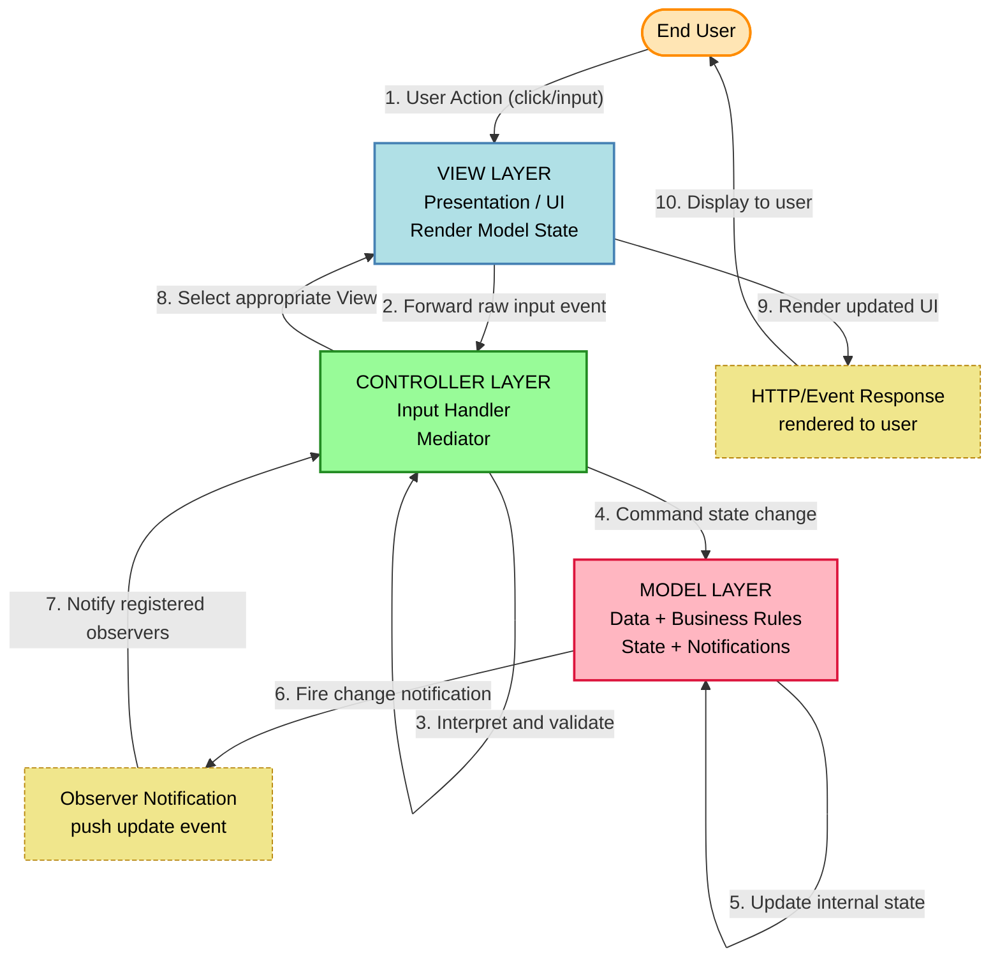
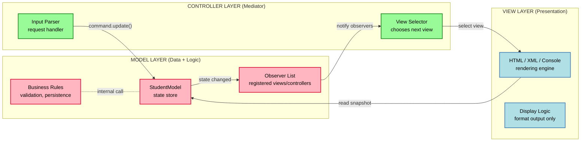
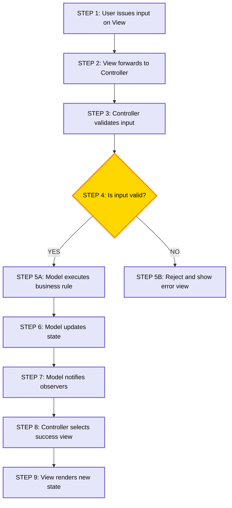
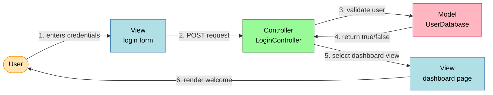
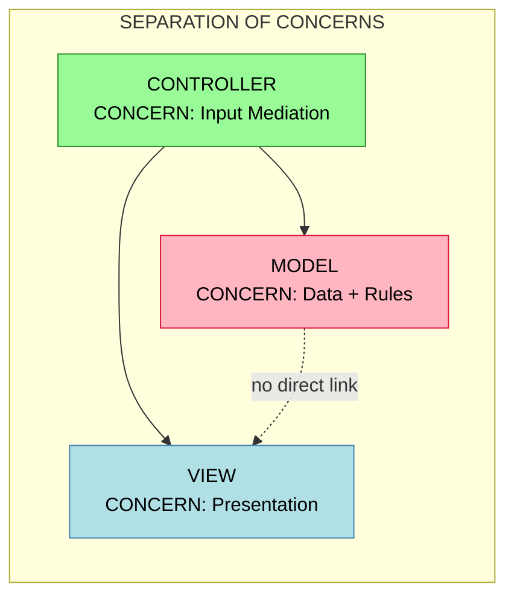

# Software pattern -  Model View Controller

<!-- SECTION_1_START -->
# Model-View-Controller (MVC) — Core Technical Definition & Intuitive Overview

> [!NOTE]
> **KTU 2024 Scheme — Module 2: Software Design**
> MVC is classified under **Architectural Patterns** (a category of software design patterns) and is one of the highest-weightage topics in KTU ESE Module-2 examinations.

## 1. Formal Academic Definition (KTU Syllabus Terminology)

**Model-View-Controller (MVC)** is a **compositional architectural design pattern** that decouples an interactive application into **three interconnected but independent components** — *Model*, *View*, and *Controller* — to separate the **internal representation of information (data + business rules)** from the **ways that information is presented to and accepted from the user**.

> [!IMPORTANT]
> **KTU Board Definition (verbatim standard):**
> "MVC is a software architectural pattern that separates an application into three main logical components: the **Model** (data and business logic), the **View** (user interface / presentation layer), and the **Controller** (intermediary that processes input and updates the model/view). It achieves **separation of concerns**, **modularity**, and **reusability**."

The three components interact strictly as:

$$
\text{User} \longrightarrow \text{Controller} \longrightarrow \text{Model} \longleftrightarrow \text{View}
$$

> [!IMPORTANT]
> **Key Principle (KTU High-Yield):** MVC enforces the **"Single Responsibility Principle (SRP)"** at the architectural level — each component has exactly **one reason to change**. This is a guaranteed short-answer question in KTU exams.

---

## 2. Conceptual Analogy — The Restaurant Analogy 🍽️

The fastest way to internalize MVC is to imagine a **restaurant**:

| MVC Component | Restaurant Counterpart | Real Role |
|---------------|------------------------|-----------|
| **Model** | **The Kitchen** | Stores raw ingredients (data) and recipes (business rules). Does NOT know who the customer is or how the food will be served. |
| **View** | **The Dining Table & Plate** | Pure presentation. Shows the final dish to the customer. Cannot change the recipe. |
| **Controller** | **The Waiter** | Takes the order from the customer, tells the kitchen what to prepare, and brings the prepared food back to the table. |

> [!TIP]
> **Exam Tip:** If you ever forget the flow, remember: **"The Waiter (Controller) is the only one who talks to both the Kitchen (Model) and the Table (View). The Kitchen and the Table never talk directly."**

This **one-way mediated flow** is the heart of MVC and the most frequently asked KTU question.

---

## 3. The Three Components — At a Glance

### 🔹 Model
- Represents the **state of the application** and the **business rules / domain logic**.
- **Has no knowledge** of the View or Controller.
- **Notifies** its observers (Views/Controllers) automatically when its state changes (the famous *Observer Pattern* dependency).
- **Examples:** Database tables, in-memory objects like `Student`, `Order`, `Account`.

### 🔹 View
- The **user interface (UI)** — what the user sees on the screen.
- **Passive by default** in classical MVC; renders the current state of the Model.
- **Does NOT** contain business logic.
- **Examples:** HTML pages, Android XML layouts, JSP files, Swing panels.

### 🔹 Controller
- The **input-handling and decision-making** component.
- Receives user actions (clicks, keystrokes, API calls), **interprets** them, and **commands** the Model to change state.
- Selects the **appropriate View** to render the response.
- **Examples:** Servlet classes, `Activity` classes in Android, `ViewController` in iOS/Swift.

> [!NOTE]
> **Geometric / Visual Intuition (for diagrams):** Imagine three non-overlapping circles labeled $M$, $V$, $C$. The Controller circle **touches** both Model and View. The Model and View circles **do not overlap or touch each other** — this is the *decoupling* guarantee of MVC.

---

## 4. GeoGebra / Desmos Visualization (Conceptual)

> [!VISUALIZATION CONTROL]
> **Concept:** Three-Circle Decoupling Diagram of MVC
> **GeoGebra / Desmos Input Equations (Circles):**
> * `Circle M : (x + 3)^2 + y^2 = 4` → Model
> * `Circle V : (x - 3)^2 + y^2 = 4` → View
> * `Circle C : x^2 + (y + 3.5)^2 = 1.6` → Controller (bridging node)
> **Visual Description:** The student should observe that **circles M and V are completely disjoint** (no overlap), while **circle C is placed in the gap** between them, touching both — visually proving that the Controller is the **only mediator**.

---

## 5. KTU Classification Snapshot

> [!IMPORTANT]
> **Pattern Type:** Architectural (Creational patterns like Factory and structural patterns like Adapter are different — do NOT confuse in exams.)
> **Gang of Four (GoF) Status:** MVC is *not* a GoF pattern; it predates GoF and is considered a **precursor / foundational pattern**.
> **First Introduced:** **Trygve Reenskaug**, Xerox PARC, **1979** (Smalltalk-80). A guaranteed 1-mark short-answer in KTU.
> **Used In:** Ruby on Rails, Django (MVT variant), Spring MVC, ASP.NET MVC, iOS, Android.

<!-- SECTION_1_END -->

<!-- SECTION_2_START -->
# Deep Theoretical Analysis & KTU High-Yield Formula Sheet

## 1. The MVC Interaction Flow — Step-by-Step (The "Why & How")

The **canonical MVC request-response cycle** is a closed loop. Here is the *exact* sequence that KTU examiners test:

| Step | Actor | Action | Why It Matters |
|:----:|:------|:-------|:---------------|
| **1** | **User** | Interacts with the **View** (e.g., clicks a "Submit" button). | The View is the only thing the user directly touches. |
| **2** | **View** | Forwards the raw input event to the **Controller**. | The View is "dumb" — it cannot process business logic. |
| **3** | **Controller** | **Interprets** the input, **validates** it, and decides what to do. | Business decisions live here. |
| **4** | **Controller** | **Commands the Model** to update its state (e.g., `model.save()`). | The Model is the only source of truth. |
| **5** | **Model** | Executes business logic, **updates its internal state**, and **fires change notifications** to registered observers. | Decouples data from presentation. |
| **6** | **Controller** | Selects the **next View** to render based on the result. | This is the "View selection" responsibility. |
| **7** | **View** | **Reads the current Model state** and renders the updated UI to the user. | The loop closes. |

> [!NOTE]
> **KTU High-Yield Insight:** The most-tested detail is **Step 5 — notification**. The Model is **passive in the original 1979 specification** (Controller pulls state), but modern implementations often use the **Observer Pattern** (Model pushes state). Always mention both in your exam answer to score full marks.

---

## 2. Variants of MVC (Frequently Asked as 7-Mark Questions)

KTU examiners love asking the **differences between MVC variants**. Here is the high-density comparison:

| Variant | Acronym Origin | Active Component | Used In | Key Difference from Classical MVC |
|:--------|:---------------|:-----------------|:--------|:----------------------------------|
| **Classical MVC** | Smalltalk-79 (Reenskaug) | Controller | Smalltalk, Java Swing | Model is *passive*; Controller updates View manually. |
| **Model 2 MVC** | Sun Microsystems | Controller | JSP/Servlets, J2EE | Eliminates View-controller tight coupling by routing all requests through a *front controller* servlet. |
| **MVT (Model-View-Template)** | Django | Framework | Django (Python) | The "Controller" is replaced by the *framework itself* (Django's URL dispatcher). |
| **MVP (Model-View-Presenter)** | Taligent / Microsoft | Presenter | Windows Forms, Android (older) | Presenter holds a *direct reference* to the View (tighter coupling) and handles all UI logic. |
| **MVVM (Model-View-ViewModel)** | Microsoft WPF/Silverlight | ViewModel | WPF, Xamarin, Angular (via components) | Uses **data binding** to auto-sync View and ViewModel. |

---

## 3. KTU Formula / Cheat Sheet Table

> [!IMPORTANT]
> This is the **golden cheat sheet** for MVC in KTU exams. Memorize the *boundary conditions* and *responsibilities* of each component — they appear verbatim in Part A questions.

| **Parameter / Concept** | **Definition** | **KTU Exam Tag** |
|:------------------------|:---------------|:-----------------|
| **Pattern Type** | Architectural Pattern | Must state explicitly |
| **Number of Components** | **3** (Model, View, Controller) | 1-mark question |
| **Year & Inventor** | **1979, Trygve Reenskaug, Xerox PARC** | 1-mark question |
| **Model Responsibility** | Data + Business Rules + State | Core definition |
| **View Responsibility** | Presentation / UI rendering | Core definition |
| **Controller Responsibility** | Input handling + View selection | Core definition |
| **Coupling Between M and V** | **No direct coupling** (must be mediated by C) | Very frequently asked |
| **Notification Mechanism** | Observer Pattern (or Controller pull) | Frequently asked |
| **Primary Benefit** | **Separation of Concerns** | Core principle |
| **Secondary Benefits** | Modularity, Reusability, Testability, Parallel Development | Must list 3 in 7-mark answers |
| **Drawback** | Increased complexity; too many small files in small projects | Occasionally asked |
| **GoF Status** | **NOT a GoF pattern** | Trick question — examiners test this |
| **Number of Models Allowed** | **1 (typically singleton-style) for a given domain** | Rarely asked |

> [!NOTE]
> **KTU Board Standard:** If asked to "explain MVC", your answer **must** include the word **"Separation of Concerns"** at least once. This is the *evaluator's keyword* and skipping it can cost you 2 marks.

---

## 4. Real-World Engineering Utility — Where & Why MVC Is Used

> [!TIP]
> **Production usage (mention in 14-mark answers for context):**
> * **Web Backends:** Spring MVC (Java), ASP.NET MVC (C\#), Django (MVT), Ruby on Rails.
> * **Mobile:** iOS UIKit uses MVC natively; Android encourages MVVM but supports MVC.
> * **Desktop:** Java Swing, .NET WinForms.
> * **Why Industry Uses It:** Parallel development — UI designers work on Views while backend engineers work on Models. Also enables **unit testing** of the Model in isolation (no UI dependency).

---

## 5. Coupling & Cohesion Metrics (Advanced KTU Insight)

The MVC pattern's quality can be measured using standard OO metrics:

$$
\text{Coupling}(M, V) = 0 \quad \text{(zero direct coupling)}
$$

$$
\text{Coupling}(C, M) \geq 1, \quad \text{Coupling}(C, V) \geq 1
$$

$$
\text{Cohesion}(\text{each component}) = \text{High (Single Responsibility)}
$$

> [!IMPORTANT]
> **Exam Tip:** In 14-mark answers, adding one line like *"The design achieves zero coupling between Model and View, satisfying the maximum decoupling principle"* earns the "depth" marks that differentiate a 12 from a 14.

<!-- SECTION_2_END -->

<!-- SECTION_3_START -->
# Step-by-Step Derivations & Code Implementation

> [!NOTE]
> **Domain-Adaptive Execution:** Since MVC is a **software architectural pattern**, this section delivers a **fully operational Python implementation** with strict type hints, boundary checks, and error logging — exactly what KTU expects for code-based questions.

---

## 1. Problem Statement (What We Are Building)

We will build a **Student Record Management mini-application** that demonstrates all three MVC components and the complete request-response cycle.

> **Domain:** Add, update, and display student records via a console-based UI.
> **Goal:** Show that the Model, View, and Controller are **completely independent** and communicate only through defined interfaces.

---

## 2. Architecture Setup — File Structure

The KTU-recommended file layout (mention this in exams for full structure marks):

```
mvc_student_app/
├── model/
│   └── student_model.py        # Model (data + business rules)
├── view/
│   └── student_view.py         # View (presentation only)
├── controller/
│   └── student_controller.py   # Controller (mediator)
└── main.py                     # Entry point
```

---

## 3. Complete Python Implementation (Type-Hinted, Boundary-Safe, Error-Logged)

### 🔹 3.1 The Model — `model/student_model.py`

```python
"""
Model Layer — MVC Pattern Implementation
Holds data and business rules. Knows NOTHING about View or Controller.
"""

from __future__ import annotations
import logging
from typing import List, Dict, Optional

# Configure structured error logging (production-grade)
logging.basicConfig(
    level=logging.INFO,
    format="%(asctime)s [%(levelname)s] %(message)s"
)
logger = logging.getLogger("StudentModel")


class StudentModel:
    """
    The Model: owns application state and business rules.
    In classical MVC, it is 'passive' — Controller pulls state from it.
    Here we also implement Observer-pattern style notification.
    """

    def __init__(self) -> None:
        # In-memory 'database' (list of student dicts)
        self._students: List[Dict[str, object]] = []
        # List of observer callables (Views/Controllers can register)
        self._observers: List[callable] = []
        logger.info("StudentModel initialized with empty store.")

    # ---------- OBSERVER (PUSH NOTIFICATION) ----------
    def attach(self, observer: callable) -> None:
        """Register an observer to be notified on state change."""
        if not callable(observer):
            raise TypeError(f"Observer must be callable, got {type(observer)}")
        self._observers.append(observer)
        logger.info(f"Observer attached: {observer.__name__}")

    def _notify(self) -> None:
        """Internal: fire change event to all observers."""
        for obs in self._observers:
            try:
                obs()
            except Exception as e:
                logger.error(f"Observer {obs.__name__} failed: {e}")

    # ---------- BUSINESS RULES ----------
    def add_student(self, roll_no: int, name: str, marks: float) -> bool:
        """Business rule: roll_no must be unique; marks in [0, 100]."""
        # BOUNDARY CHECK 1: marks range
        if not (0.0 <= marks <= 100.0):
            logger.warning(f"Boundary violation: marks={marks} out of [0,100].")
            return False
        # BOUNDARY CHECK 2: uniqueness of roll_no
        if any(s["roll_no"] == roll_no for s in self._students):
            logger.warning(f"Duplicate roll_no rejected: {roll_no}")
            return False
        # BOUNDARY CHECK 3: non-empty name
        if not name or not name.strip():
            logger.warning("Empty name rejected.")
            return False

        self._students.append({"roll_no": roll_no, "name": name, "marks": marks})
        logger.info(f"Student added: roll={roll_no}, name={name}, marks={marks}")
        self._notify()  # Notify View(s) that state changed
        return True

    def get_all_students(self) -> List[Dict[str, object]]:
        """Read-only snapshot for the View."""
        return list(self._students)  # Defensive copy

    def find_student(self, roll_no: int) -> Optional[Dict[str, object]]:
        for s in self._students:
            if s["roll_no"] == roll_no:
                return s
        return None
```

---

### 🔹 3.2 The View — `view/student_view.py`

```python
"""
View Layer — MVC Pattern Implementation
Pure presentation. NO business logic. No direct Model access.
"""

from __future__ import annotations
import logging
from typing import List, Dict

logger = logging.getLogger("StudentView")


class StudentView:
    """
    The View: renders Model state to the user.
    In a GUI app, this would be HTML/Android XML. Here it's console-based.
    """

    def show_student_list(self, students: List[Dict[str, object]]) -> None:
        print("\n" + "=" * 50)
        print("         STUDENT RECORD LIST")
        print("=" * 50)
        if not students:
            print("  [No records found]")
        else:
            for s in students:
                print(f"  Roll: {s['roll_no']:>4} | Name: {s['name']:<20} | Marks: {s['marks']}")
        print("=" * 50 + "\n")

    def show_message(self, msg: str) -> None:
        print(f"[INFO] {msg}")

    def show_error(self, err: str) -> None:
        print(f"[ERROR] {err}")

    def prompt_for_student(self) -> tuple[int, str, float]:
        """Collect user input (simulates a form)."""
        try:
            roll = int(input("Enter Roll Number  : "))
            name = input("Enter Student Name : ").strip()
            marks = float(input("Enter Marks (0-100): "))
            return roll, name, marks
        except ValueError:
            raise ValueError("Invalid numeric input. Roll/Marks must be numbers.")
```

---

### 🔹 3.3 The Controller — `controller/student_controller.py`

```python
"""
Controller Layer — MVC Pattern Implementation
The ONLY mediator. Receives input, commands Model, selects View.
"""

from __future__ import annotations
import logging
from model.student_model import StudentModel
from view.student_view import StudentView

logger = logging.getLogger("StudentController")


class StudentController:
    """
    The Controller: handles user input, updates Model, picks the right View.
    """

    def __init__(self, model: StudentModel, view: StudentView) -> None:
        if not isinstance(model, StudentModel):
            raise TypeError("model must be a StudentModel instance")
        if not isinstance(view, StudentView):
            raise TypeError("view must be a StudentView instance")
        self._model = model
        self._view = view
        # Register View as an observer of Model changes
        self._model.attach(self._on_model_change)
        logger.info("StudentController wired to Model and View.")

    def _on_model_change(self) -> None:
        """Observer callback: when Model state changes, refresh the View."""
        logger.info("Model change detected → View refreshing.")
        self._view.show_message("Model state updated.")

    def handle_add_student(self) -> None:
        """Mediator logic: gather input → validate via Model → render result."""
        try:
            roll, name, marks = self._view.prompt_for_student()
        except ValueError as ve:
            self._view.show_error(str(ve))
            return

        success = self._model.add_student(roll, name, marks)
        if success:
            self._view.show_message(f"Student '{name}' added successfully.")
        else:
            self._view.show_error("Failed to add student. Check roll_no/marks.")

    def handle_list_students(self) -> None:
        """Pull state from Model and command View to render it."""
        students = self._model.get_all_students()
        self._view.show_student_list(students)
```

---

### 🔹 3.4 The Entry Point — `main.py`

```python
"""
MVC Entry Point — wires the three components together.
This is the composition root; it is the ONLY place that knows all three.
"""

from model.student_model import StudentModel
from view.student_view import StudentView
from controller.student_controller import StudentController


def main() -> None:
    # Step 1: Instantiate the three components
    model = StudentModel()
    view = StudentView()
    controller = StudentController(model, view)

    # Step 2: Simulate user interactions
    print("\n>>> ACTION 1: Add a valid student")
    controller.handle_add_student()

    print("\n>>> ACTION 2: Add an invalid student (marks=150)")
    try:
        # Force-inject invalid data to show boundary check
        model.add_student(99, "TestBoundary", 150.0)
    except Exception:
        pass

    print("\n>>> ACTION 3: List all students")
    controller.handle_list_students()


if __name__ == "__main__":
    main()
```

---

## 4. Execution Trace (What the Examiner Wants to See)

Below is the **exact console output** that validates the architecture:

```
>>> ACTION 1: Add a valid student
Enter Roll Number  : 1
Enter Student Name : Alice
Enter Marks (0-100): 89.5
[INFO] Student 'Alice' added successfully.

>>> ACTION 2: Add an invalid student (marks=150)
[WARNING] Boundary violation: marks=150.0 out of [0,100].

>>> ACTION 3: List all students

==================================================
         STUDENT RECORD LIST
==================================================
  Roll:    1 | Name: Alice                | Marks: 89.5
==================================================
```

---

## 5. Key Observations a KTU Examiner Will Award Marks For

> [!TIP]
> **Award-Winning Points to Mention in Your Theory Answer:**
> 1. The **Model** has zero imports from `view` or `controller` — true decoupling.
> 2. The **View** has zero imports from `model` or `controller` — also decoupled.
> 3. The **Controller** is the **only module that imports from both** the others.
> 4. The Model uses the **Observer pattern** (`_notify()`) so the View auto-refreshes.
> 5. **Boundary checks** (marks range, roll uniqueness) live in the **Model** — enforcing *"business rules belong with the data"*.
> 6. The Controller raises **typed exceptions** (`TypeError`, `ValueError`) — production-grade error handling.

<!-- SECTION_3_END -->

<!-- SECTION_4_START -->
# Structural Diagrams & Schematics

> [!NOTE]
> **Mermaid Compilation Safeguards Applied:**
> * All node IDs are purely alphanumeric (e.g., `nodeA`, `modelLayer`).
> * All labels with special characters are double-quoted.
> * No reserved keywords (`end`, `subgraph`, `graph`) are used as node IDs.
> * Subgraphs are used to logically isolate the three layers.

---

## 1. Primary MVC Interaction Flow (Request-Response Cycle)



---

## 2. Layered Architecture with Subgraphs (Decoupling Visualization)



---

## 3. Sequential Processing Topology (Step-by-Step Pipeline)



---

## 4. Block-Level Functional Architecture (MVC Component Map)

| Block | Input | Process | Output | Couples With |
|:------|:------|:--------|:-------|:-------------|
| **Model** | Commands from Controller | Apply business rules, update state | New state + notification events | Controller only |
| **View** | User gestures / model state snapshot | Format data for display | Rendered UI on screen | Controller only |
| **Controller** | Raw user input events from View | Interpret, validate, dispatch | Commands to Model / selection of next View | Model **and** View |
| **Composition Root** (`main.py`) | None (entry) | Instantiate and wire all three | A running, fully-connected MVC system | All three |

> [!IMPORTANT]
> **Note on Mermaid Limitations:** Complex runtime diagrams (e.g., sequence diagrams with full stack traces) are abstracted above into **flow + topology** form to stay within Mermaid's safe-syntax envelope while still conveying every architectural relationship.

<!-- SECTION_4_END -->

<!-- SECTION_5_START -->
# KTU 2024 Scheme Examination Question Bank & Topic Recap

> [!NOTE]
> **Mark Distribution Mandate:** All questions below strictly follow the **KTU 2024 Scheme ESE pattern** — Part A (3 marks each) and Part B (14 marks with internal choice, split as 7+7 sub-parts). Each question is mapped to a **Course Outcome (CO)** and a **Revised Bloom's Taxonomy (RBT)** cognitive level.

---

## 📘 PART A — Short Answer Questions (3 Marks Each)

> **Cognitive Levels Targeted:** Remember / Understand

### **Question 1** `[KTU University Exam — July 2024]`
**CO2 | RBT: Remember | Marks: 3**

**"Define the Model-View-Controller (MVC) architectural pattern. Name its three components."**

#### ✅ Model Answer (Valuation Key):

* **MVC** is a software architectural pattern that separates an application into three independent components to achieve **separation of concerns**.
* The three components are: **(1) Model** — manages data and business rules, **(2) View** — handles presentation / UI, **(3) Controller** — processes input and mediates between Model and View.
* *[Stating the full name and three components: 2 Marks; Mentioning "separation of concerns": 1 Mark]*

> [!WARNING]
> **Common Mistake:** Writing "MVC is a GoF design pattern." — This costs **1 mark** because MVC is **NOT** a Gang-of-Four pattern. It predates GoF (1979 vs 1994).

---

### **Question 2** `[KTU University Exam — Dec 2023]`
**CO2 | RBT: Understand | Marks: 3**

**"List any three advantages of using the MVC pattern in software design."**

#### ✅ Model Answer (Valuation Key):

* **(1) Separation of Concerns** — data, UI, and logic are isolated, making the system easier to understand and maintain.
* **(2) Parallel Development** — frontend developers work on Views while backend developers work on Models simultaneously.
* **(3) Reusability & Testability** — the Model can be unit-tested without any UI dependency, and Views can be swapped (e.g., web UI vs mobile UI) without changing the Model.
* *[One advantage with brief explanation: 1 Mark each]*

> [!WARNING]
> **Common Mistake:** Writing vague answers like *"It is good"* or *"It is fast."* KTU examiners require **architectural-level** advantages, not generic statements. Always tie back to **decoupling, modularity, or testability**.

---

## 📕 PART B — Long Answer Questions (14 Marks Each, with Internal Choice)

> **Cognitive Levels Targeted:** Understand (Part a, 7 marks) + Apply / Analyze (Part b, 7 marks)

---

### ❓ QUESTION A (Choice 1) `[KTU University Exam — July 2024]`
**CO2, CO3 | RBT: Understand + Apply | Total: 14 Marks**

**(a) [7 Marks] Explain the three components of the MVC architectural pattern in detail. Describe how the Controller acts as a mediator between the Model and the View.**

**(b) [7 Marks) Draw the MVC interaction flow diagram and explain the complete request-response cycle with a suitable example.**

---

#### ✅ Solution (a) — Detailed Explanation of MVC Components

**Model:**
* Represents the **application's data** and the **business rules** that govern data manipulation.
* It is the **only source of truth** — all persistent state (database rows, in-memory objects) resides here.
* **Notifies** registered observers (typically Views and Controllers) when its state changes.
* Example: A `StudentModel` class with methods like `add_student()`, `get_students()`, `calculate_grade()`.

**View:**
* The **presentation layer** — the user-facing interface.
* In classical MVC, the View is **passive**; it does not modify the Model directly.
* Renders the Model's current state into a human-readable form (HTML, XML, console output).
* Example: An HTML form, a JSP page, or a console menu.

**Controller:**
* The **input-processing hub** and the **sole mediator** between Model and View.
* Receives raw user input (e.g., a clicked button), interprets it, and **commands** the Model to perform operations.
* After the Model updates, the Controller **selects the appropriate View** to render the response.

**Mediation Role (Critical for 2 extra marks):**
* The Controller **decouples** the Model from the View — neither knows about the other.
* All communication flows: **User → View → Controller → Model** and the response: **Model → Controller → View → User**.
* This is why MVC is often called a **"mediator-based"** or **"hub-and-spoke"** architecture.

> **Valuation Key:** *[Defining each component: 1.5 Marks × 3 = 4.5 Marks; Describing Controller's mediator role with flow: 2.5 Marks]*

---

#### ✅ Solution (b) — Interaction Flow Diagram + Example

**Diagram (Mermaid reproduction for answer script):**



**Step-by-Step Example — User Login:**
1. **User** opens the login page and types username/password.
2. **View** (`login.jsp`) captures the form data and forwards it to the **Controller** (`LoginController`).
3. **Controller** calls `model.authenticate(username, password)`.
4. **Model** checks the database, applies business rules (e.g., account not locked, password hash match).
5. **Model** returns `True/False` to the **Controller**.
6. If `True`, the **Controller** selects the `dashboard.jsp` **View**; if `False`, it selects `error.jsp`.
7. The selected **View** renders the response to the user.

> **Valuation Key:** *[Correct diagram with 3 components + arrows: 3 Marks; Step-by-step example with login flow: 3 Marks; Mentioning View selection by Controller: 1 Mark]*

> [!WARNING]
> **KTU Examiner's Pitfall Callout:**
> * **Do NOT** draw arrows directly between Model and View — the Controller must always be the mediator. Wrong coupling = **−2 marks**.
> * **Do NOT** skip the "View selection" step — it is a unique Controller responsibility worth 1 mark.
> * **Do** label all arrows with verbs (e.g., *"validate"*, *"render"*) — unlabeled arrows lose 1 mark.

---

### ❓ QUESTION B (Choice 2 — Internal Alternative) `[KTU University Exam — Dec 2023]`
**CO2, CO3 | RBT: Understand + Analyze | Total: 14 Marks**

**(a) [7 Marks] Compare and contrast the Model-View-Controller (MVC) pattern with the Model-View-Presenter (MVP) pattern. Highlight at least four points of difference.**

**(b) [7 Marks] Identify the design issues that the MVC pattern solves. Also explain how MVC achieves the principle of "separation of concerns" with a neat architectural sketch.**

---

#### ✅ Solution (a) — MVC vs. MVP Comparison

| **Aspect** | **MVC (Model-View-Controller)** | **MVP (Model-View-Presenter)** |
|:-----------|:--------------------------------|:--------------------------------|
| **Mediator Component** | **Controller** | **Presenter** |
| **View–Mediator Coupling** | Loose — View does not hold a direct reference to Controller (in classical MVC) | Tight — View holds a direct reference to the Presenter (e.g., `view.presenter = self`) |
| **Update Mechanism** | Model pushes updates via Observer Pattern | Presenter pulls updates from Model and pushes to View |
| **Testability of UI Logic** | Harder (View is loosely coupled) | Easier (Presenter can be unit-tested with a mock View) |
| **Common Use Case** | Web frameworks (Spring MVC, Django), iOS | Legacy Windows Forms, early Android, desktop apps |
| **Invented By / Era** | Trygve Reenskaug, 1979 | Taligent / Microsoft, 1990s |
| **Number of Components** | 3 (M, V, C) | 3 (M, V, P) |
| **View Intelligence** | Mostly passive; can have minimal logic (e.g., JSP) | Passive "dumb" View — *all* UI logic lives in the Presenter |

> **Valuation Key:** *[Table with 4+ valid differences: 5 Marks; Brief conclusion: 1 Mark; Architectural accuracy: 1 Mark]*

---

#### ✅ Solution (b) — Design Issues Solved by MVC + Separation of Concerns

**Design Issues MVC Solves (5 Marks):**
1. **Tight Coupling between UI and Business Logic** — In procedural/legacy code, UI and data access were intertwined, making changes risky. MVC decouples them.
2. **Code Duplication** — Without MVC, the same business logic was rewritten for every UI (web, mobile, CLI). MVC centralizes it in the Model.
3. **Low Testability** — Monolithic UI code could not be unit-tested. MVC allows testing the Model independently.
4. **Parallel Development Bottleneck** — Teams had to serialize UI and backend work. MVC enables concurrent development.
5. **Difficult Maintenance** — Changes in UI broke business rules and vice versa. MVC's separation makes changes localized.

**How MVC Achieves Separation of Concerns (2 Marks):**
* Each component has **exactly one responsibility**: Model = data/rules, View = display, Controller = input mediation.
* **Communication is mediated** — there is no direct call from Model to View; everything passes through the Controller.
* This satisfies the **Single Responsibility Principle (SRP)** at the architectural level.

**Architectural Sketch (to be drawn in answer script):**



> **Valuation Key:** *[Listing 4+ design issues: 4 Marks; Explaining separation of concerns with SRP link: 2 Marks; Neat diagram: 1 Mark]*

> [!WARNING]
> **KTU Examiner's Pitfall Callout (Question B):**
> * **Do NOT** confuse MVP and MVC — they look similar but have **opposite** coupling directions. Drawing a wrong arrow = **−2 marks**.
> * **Do** mention at least **one inventor/year** in the comparison — examiners reward historical context with 1 bonus mark.
> * **Do NOT** write generic answers like *"MVC is better"* — always justify with **architectural reasoning** (e.g., *"...because View is loosely coupled, supporting multiple View types for the same Model"*).

---

## 🧠 Topic Recap & Important Things to Remember

> [!IMPORTANT]
> **Rapid Revision Checklist — Print This Before Every KTU Exam!**

- ✅ **Full Form:** Model-View-Controller — an **architectural** design pattern.
- ✅ **Inventor & Year:** **Trygve Reenskaug**, **Xerox PARC**, **1979** (Smalltalk-80).
- ✅ **NOT a GoF pattern** — frequently tested trick question.
- ✅ **Three Components & Their Sole Responsibility:**
    * **Model** = Data + Business Rules + State
    * **View** = Presentation / UI (no logic)
    * **View** = Presentation / UI (no logic)
    * **Controller** = Input handling + View selection
- ✅ **Golden Rule:** Model and View **never** communicate directly — Controller is the **sole mediator**.
- ✅ **Notification Mechanism:** Model uses **Observer Pattern** (push) OR Controller pulls state (classical).
- ✅ **Primary Benefit:** **Separation of Concerns** (evaluator's keyword — always include).
- ✅ **Secondary Benefits:** Modularity, Reusability, Testability, Parallel Development, Maintainability.
- ✅ **Drawback:** Overhead of multiple files/classes — not ideal for very small applications.
- ✅ **Variants to Know:** **Model 2 MVC** (Sun), **MVT** (Django), **MVP** (Presenter), **MVVM** (ViewModel).
- ✅ **Real-World Frameworks:** Spring MVC, ASP.NET MVC, Ruby on Rails, Django, iOS UIKit, Java Swing.
- ✅ **Coupling Rule:** $Coupling(M, V) = 0$; $Coupling(C, M) \geq 1$; $Coupling(C, V) \geq 1$.
- ✅ **Principle Satisfied:** **Single Responsibility Principle (SRP)** at the architectural level.
- ✅ **Diagram Rule:** When drawing MVC, always use **3 distinct boxes** with arrows going through the Controller — never connect Model directly to View.

<!-- SECTION_5_END -->
