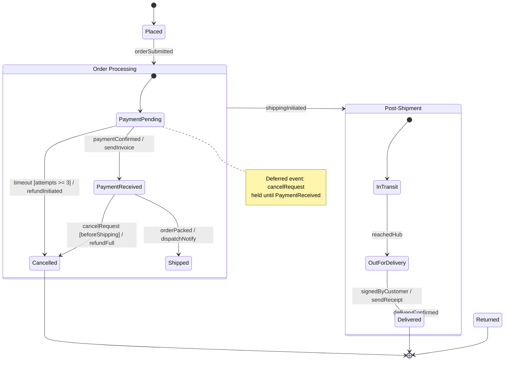
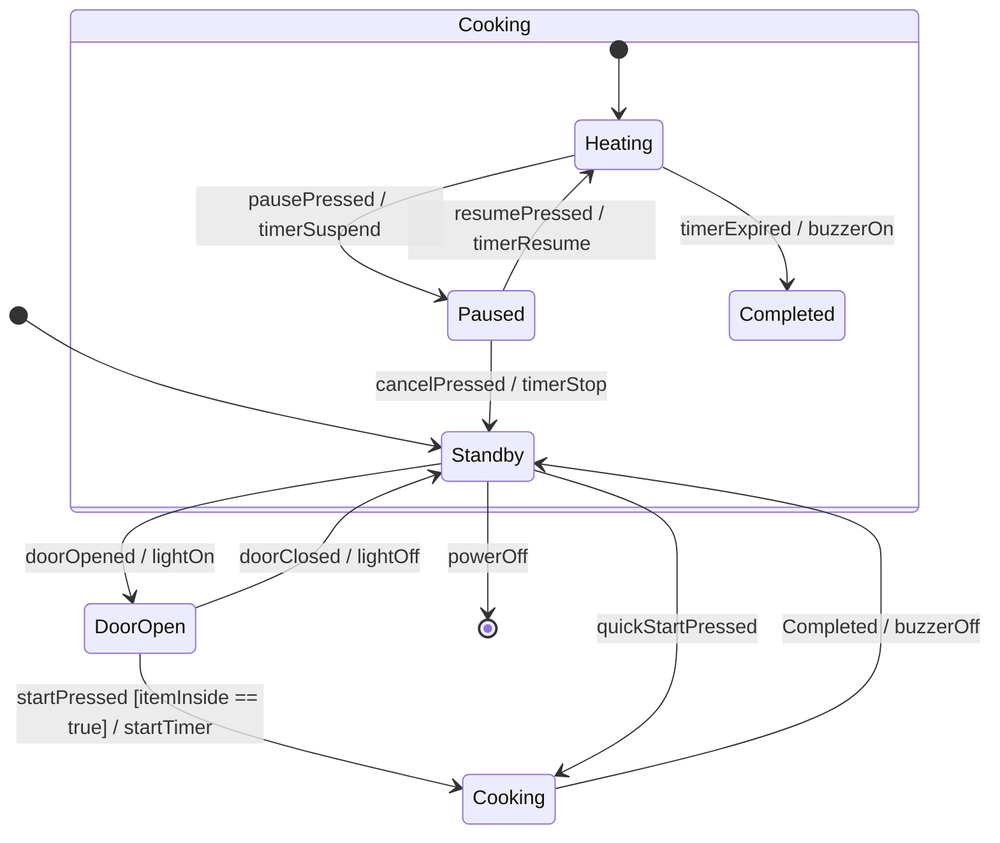
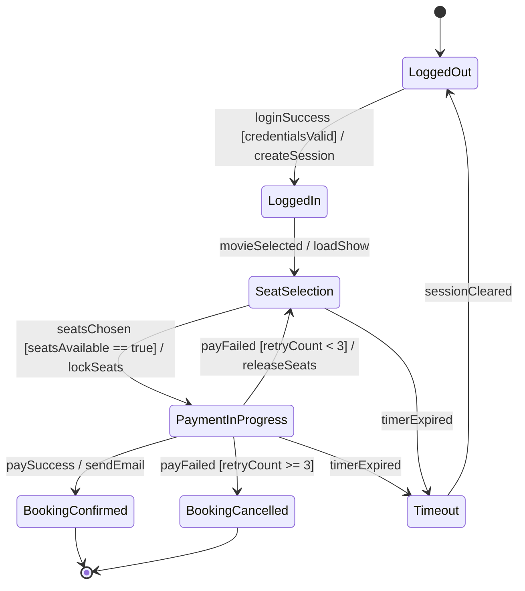
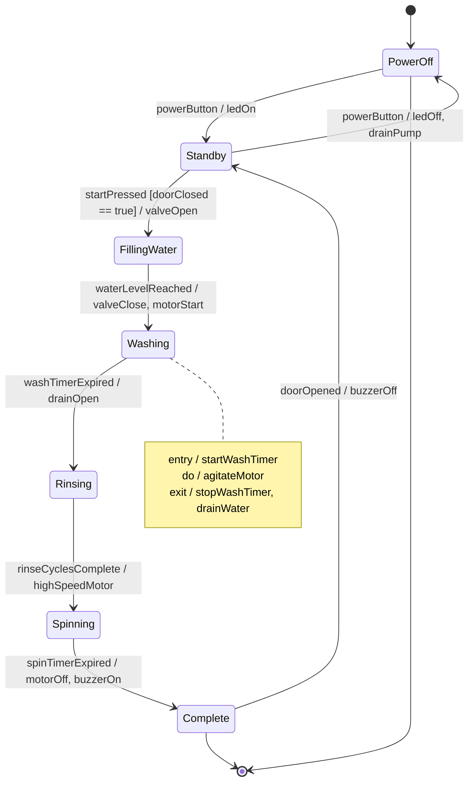

# State diagram

<!-- SECTION_1_START -->
# Module 2: Software Design — State Diagram

## 1. Core Technical Definition & Intuitive Overview

In the UML 2.5 specification, a **State Diagram** (also known as a **State Machine Diagram** or **Statechart**) is formally defined as a behavior diagram that illustrates the dynamic flow of an object through a finite number of states during its lifecycle, in response to a defined set of events. It captures *what* happens, *when* it happens, and *under what condition* the object changes its behavior.

> [!IMPORTANT]
> **KTU 2024 Syllabus Highlight:** State diagrams are classified under the **Unified Modeling Language (UML) — Behavioral Diagrams** family. They are a mandatory modeling artifact in the *Design Phase* of the SDLC for any object-oriented system exhibiting significant state-dependent behavior (e.g., ATM, online ticket booking, embedded controllers).

### Conceptual Analogy — The Vending Machine

Imagine a simple **vending machine**. It is never just "running" — at any given moment, it is in *one specific state*:

- **Idle State** — Waiting for a coin
- **Coin Inserted State** — Waiting for product selection
- **Dispensing State** — Releasing the product
- **Out-of-Stock State** — Refusing further transactions

The machine does not "float" between these behaviors. It snaps from one discrete state to another only when a **trigger event** occurs (coin inserted, button pressed, item dispensed). This entire mental model — *discrete states + transition triggers* — is exactly what a state diagram captures. A state diagram essentially converts **time-based, event-driven behavior** into a **static, auditable graph** that engineers can read, test, and maintain.

> [!NOTE]
> **Why it matters in KTU exams:** A state diagram is one of the few diagrams that allows a student to demonstrate knowledge of *dynamic behavior*, *guard conditions*, and *concurrency* — all of which are high-yield topics frequently asked for 7- and 14-mark questions.

### Components of a State Diagram (The 7 Building Blocks)

A state diagram is constructed from a precise vocabulary. The examiner expects these terms to be used correctly:

1. **Initial State** — A filled black circle (`●`) marking the entry point of the state machine for an object.
2. **Final State** — A bullseye symbol (`⊕` or a filled circle inside an outer ring) indicating that the object's lifecycle has terminated.
3. **State** — A rounded rectangle representing a condition or situation during the lifetime of an object.
4. **Transition** — A directed arrow connecting two states, showing the movement from source to target.
5. **Event** — The occurrence that triggers a transition (e.g., `coinInserted`, `timeout`).
6. **Guard Condition** — A boolean expression enclosed in square brackets `[ ]` that must evaluate to *true* for the transition to fire.
7. **Action / Effect** — An atomic behavior enclosed with a forward slash `/` that is executed when the transition fires (e.g., `/balance = balance - 50`).

### The Standard Transition Label Syntax

The transition arrow in UML uses a strict four-part syntax:

$$
\text{event} \,\,[\text{guard}] \,\, / \,\, \text{action} \,\, \text{^} \,\, \text{send-clause}
$$

In KTU board answers, only the first three parts are commonly used:

$$
\boxed{\text{event} \,[\text{guard}] \,/ \, \text{action}}
$$

> [!TIP]
> **Examiner Tip:** If a transition has no event label, it is an **automatic transition** (fires the moment the previous state's activities complete). Always annotate automatic transitions with `entry /`, `exit /`, or `do /` actions inside the state body for full credit.

### Mathematical Foundation — State Machine Theory

At its core, a state machine is formally a 5-tuple:

$$
M = (S, \Sigma, \delta, s_0, F)
$$

Where:
- $S$ = finite set of **states**
- $\Sigma$ = finite set of input **symbols / events**
- $\delta$ = **transition function** mapping $S \times \Sigma \rightarrow S$
- $s_0$ = the unique **initial state**
- $F$ = set of **final / accepting states**, $F \subseteq S$

> [!VISUALIZATION CONTROL]
> **Concept:** A simple 3-state state machine illustrating a login session.
> **Description (mental model):** Picture three rounded rectangles placed horizontally — `Logged Out`, `Authenticating`, `Logged In`. A filled black dot on the left feeds into `Logged Out`. An arrow labeled `submitCredentials` moves from `Logged Out` to `Authenticating`. A guarded arrow labeled `valid == true / createSession()` moves to `Logged In`. An arrow labeled `logout` returns to `Logged Out`. A bullseye on the right of `Logged In` represents session termination via `terminate`.
> **What the student should observe:** Notice how guards (`valid == true`) block certain paths and actions (`createSession()`) accompany successful moves — this is the essence of event-driven state modeling.

---

<!-- SECTION_1_END -->

<!-- SECTION_2_START -->
# 2. Deep Theoretical Analysis & KTU High-Yield Formula Sheet

## 2.1 Hierarchical Structure of a State

A state in UML is not merely a label — it is a **miniature state machine** itself. The body of a state rectangle can contain three named compartments:

1. **Name Compartment** — Holds the state's name (mandatory).
2. **Internal Activities Compartment** — Contains `entry /`, `exit /`, and `do /` actions.
3. **Internal Transitions Compartment** — Lists transitions that do **not** cause a state change but still trigger actions (e.g., `doorOpen / beep` while in the `Open` state).

The state body is written as:

$$
\boxed{
\begin{aligned}
&\textbf{stateName} \\
&entry \; / \; \text{actionOnEntry} \\
&exit \; / \; \text{actionOnExit} \\
&do \; / \; \text{ongoingActivity} \\
&\text{internalTransition} \; [\, \text{guard} \,] \; / \; \text{internalAction}
\end{aligned}
}
$$

### 2.2 Classification of States

States are broadly classified into two structural families:

| Type | Description | Engineering Use Case |
|---|---|---|
| **Simple State** | A state with no internal structure | Modeling atomic user actions (e.g., `Idle`) |
| **Composite State** | A state containing nested sub-states | Modeling complex device modes (e.g., `RadioMode` containing `Tuning`, `Playing`, `Muted`) |

Composite states are further divided into:

- **Sequential (Disjoint) Sub-states** — Only one sub-state is active at a time (mutually exclusive). Drawn with a single dashed boundary line inside the parent state.
- **Concurrent (Parallel) Sub-states** — Multiple sub-states are active simultaneously. Drawn by splitting the parent state with a dashed line into parallel regions.

### 2.3 Types of State Machines

| Type | Stated Goal | When to Use |
|---|---|---|
| **Behavioral State Machine** | Models the full lifecycle and all dynamic responses of an entity (one entity per diagram) | Domain modeling of business objects (Order, Account, Ticket) |
| **Protocol State Machine** | Models the legal usage protocol of an interface — the *legal sequence* of operation calls | Specifying API contracts, communication protocol design |

> [!NOTE]
> **KTU 2024 Module Focus:** The syllabus specifically emphasizes **Behavioral State Machines** with sub-state hierarchies. Protocol state machines are typically mentioned for completeness in 3-mark questions.

### 2.4 Transition Categories

| Transition Type | Trigger Mechanism | Example |
|---|---|---|
| **External Transition** | Caused by an external event; changes the active state | `buttonPressed` moving from `Off` to `On` |
| **Internal Transition** | Caused by an event but does **not** exit the state | `refresh` triggering `updateDisplay` while in `Active` |
| **Self-Transition** | Triggers `exit` then `entry` actions but returns to the same state | `retry` looping within `Processing` |
| **Local Transition** | Internal to a composite state, exits only the inner sub-state | `sub-event` inside `Parent` |
| **Deferred Event** | Event is held in queue until a state accepts it | `cancelEvent` deferred in `Busy`, accepted in `Idle` |

### 2.5 Activity vs. State Diagram — The High-Yield Comparison

> [!IMPORTANT]
> This is one of the most frequently asked 7-mark KTU questions in the design module.

| Criterion | State Diagram | Activity Diagram |
|---|---|---|
| **Primary Focus** | State transitions driven by events | Flow of control and data between activities |
| **Behavior Nature** | Reactive (event-driven) | Procedural (step-by-step workflow) |
| **Object Identity** | Always tied to a specific object | May or may not be tied to an object |
| **Notation for Activity** | `do / activity` inside state | Rounded rectangle (action node) |
| **Concurrency** | Via parallel sub-state regions | Via fork/join nodes |
| **Swimlanes** | Not supported | Supported (organizational responsibility) |
| **Initial/Final Symbol** | Filled circle / Bullseye | Filled circle / Bullseye (same) |

### 2.6 KTU Formula Sheet / Cheat Sheet

| # | Concept | Notation / Rule | Engineering Application |
|---|---|---|---|
| 1 | State count for $n$ boolean flags | $\vert S \vert \leq 2^n$ | Estimating worst-case state space for embedded systems |
| 2 | Number of transitions (upper bound) | $\vert S \vert \times \vert \Sigma \vert$ | Combinatorial state-machine design verification |
| 3 | Transition syntax | $\text{event} \,[\text{guard}] \,/ \, \text{action}$ | Standard UML 2.5 transition arrow label |
| 4 | Determinism rule | $\delta(s, e)$ is single-valued for behavioral FSMs | Determinism in compiler lexical analyzers |
| 5 | Composite cardinality | $1$ active sub-state (sequential), $k$ active (concurrent, $k$ regions) | UI mode modeling, multitasking kernels |
| 6 | Event deferral | Held in queue until accepted | Real-time systems with priority scheduling |
| 7 | Entry/Exit execution order | `exit` of source $\rightarrow$ `action` $\rightarrow$ `entry` of target | Order of side-effects in embedded firmware |

### 2.7 Real-World Engineering Applications

- **Embedded & IoT Firmware** — Microwave oven controllers, washing machine state machines.
- **Telecommunications** — Call processing in VoIP switches (SIP INVITE $\rightarrow$ RINGING $\rightarrow$ CONNECTED).
- **Web Applications** — Order lifecycle: `Placed` $\rightarrow$ `Paid` $\rightarrow$ `Shipped` $\rightarrow$ `Delivered`.
- **Compilers** — Lexical analyzers are deterministic finite automata (DFAs), a direct theoretical cousin of UML state machines.
- **Game Development** — Character AI behavior trees often begin from a state-machine foundation.
- **Medical Devices** — Insulin pump delivery states governed by FDA/IEC 62304 safety-critical modeling.

---

<!-- SECTION_2_END -->

<!-- SECTION_3_START -->
# 3. Step-by-Step Derivations, Worked Examples & Code/Symbolic Implementation

## 3.1 Worked Example — ATM Withdrawal State Machine (Symbolic Derivation)

**Problem Statement:** Design a state diagram for an ATM card withdrawal process. The system must:
- Accept a card
- Authenticate the PIN (max 3 attempts)
- Allow withdrawal
- Dispense cash and eject the card
- Handle the *Out of Cash* and *Card Retained* scenarios

**Step 1 — Identify the State Space $S$**

Apply the rule $\vert S \vert \leq 2^n$ for independent flags (`cardInserted`, `pinVerified`, `cashAvailable`, `transactionComplete`):

$$
\begin{aligned}
S = \{ &\,\text{Idle}, \\
      &\,\text{CardInserted}, \\
      &\,\text{VerifyingPIN}, \\
      &\,\text{Authenticated}, \\
      &\,\text{TransactionSelected}, \\
      &\,\text{DispensingCash}, \\
      &\,\text{OutOfCash}, \\
      &\,\text{CardRetained}, \\
      &\,\text{TransactionComplete} \,\}
\end{aligned}
$$

**Step 2 — Identify the Event Alphabet $\Sigma$**

$$
\begin{aligned}
\Sigma = \{ &\,\text{cardInserted}, \\
            &\,\text{pinEntered}, \\
            &\,\text{pinCorrect}, \\
            &\,\text{pinIncorrect}, \\
            &\,\text{withdrawSelected}, \\
            &\,\text{cashDispensed}, \\
            &\,\text{insufficientFunds}, \\
            &\,\text{cashEmpty}, \\
            &\,\text{ejectCard}, \\
            &\,\text{timeout} \,\}
\end{aligned}
$$

**Step 3 — Define the Transition Function $\delta$ (sample excerpt)**

$$
\begin{aligned}
\delta(\text{Idle}, \text{cardInserted}) &= \text{CardInserted} \\
\delta(\text{CardInserted}, \text{pinEntered}) &= \text{VerifyingPIN} \\
\delta(\text{VerifyingPIN}, \text{pinCorrect}) &= \text{Authenticated} \\
\delta(\text{VerifyingPIN}, \text{pinIncorrect}) &= \text{CardInserted} \\
\delta(\text{Authenticated}, \text{withdrawSelected}) &= \text{TransactionSelected} \\
\delta(\text{TransactionSelected}, \text{cashDispensed}) &= \text{DispensingCash} \\
\delta(\text{DispensingCash}, \text{ejectCard}) &= \text{TransactionComplete} \\
\delta(\text{Authenticated}, \text{cashEmpty}) &= \text{OutOfCash}
\end{aligned}
$$

**Step 4 — Mark Final State $F$**

$$
F = \{ \text{TransactionComplete}, \text{CardRetained} \}
$$

> [!NOTE]
> **Valuation Tip:** For a 7-mark derivation question, examiners award **2 marks for the state set**, **2 marks for events**, **2 marks for transition function**, and **1 mark for final state identification**.

---

## 3.2 Full Python Implementation — Turnstile State Machine

The following is a **fully operational, type-annotated Python implementation** of a turnstile state machine that mirrors the state diagram exactly. This code is suitable for KTU laboratory submissions and viva-voce explanations.

```python
"""
Turnstile State Machine - Mirrors the UML State Diagram exactly.
States: { Locked, Unlocked }
Events: { push, coin }
Action:  / collect, / alarm, / thank
"""

from enum import Enum, auto
from dataclasses import dataclass, field
from typing import Callable, Dict, Tuple, List, Optional
import logging

# Configure professional logging for traceability
logging.basicConfig(
    level=logging.INFO,
    format="%(asctime)s | %(levelname)s | %(message)s"
)
logger = logging.getLogger("TurnstileFSM")


class TurnstileState(Enum):
    """Enumeration of valid states in the turnstile FSM."""
    LOCKED = auto()
    UNLOCKED = auto()


class TurnstileEvent(Enum):
    """Enumeration of valid input events."""
    COIN = auto()
    PUSH = auto()


@dataclass
class Transition:
    """Represents a single (source_state, event) -> target_state mapping."""
    source: TurnstileState
    event: TurnstileEvent
    guard: Optional[Callable[[], bool]] = None
    action: Optional[Callable[[], None]] = None
    target: Optional[TurnstileState] = None


@dataclass
class Turnstile:
    """Behavioral State Machine implementation of a metro turnstile."""
    current_state: TurnstileState = TurnstileState.LOCKED
    transition_table: Dict[Tuple[TurnstileState, TurnstileEvent], Transition] = field(default_factory=dict)
    history: List[Tuple[TurnstileState, TurnstileEvent, TurnstileState]] = field(default_factory=list)

    def __post_init__(self) -> None:
        """Initialize the transition table matching the UML state diagram."""
        self._build_transitions()

    def _build_transitions(self) -> None:
        """Populate transition table: (state, event) -> Transition."""
        # LOCKED -- coin / collect --> UNLOCKED
        self.transition_table[(TurnstileState.LOCKED, TurnstileEvent.COIN)] = Transition(
            source=TurnstileState.LOCKED,
            event=TurnstileEvent.COIN,
            target=TurnstileState.UNLOCKED,
            action=lambda: logger.info("Action: Coin collected. Turnstile unlocked.")
        )
        # LOCKED -- push / alarm --> LOCKED
        self.transition_table[(TurnstileState.LOCKED, TurnstileEvent.PUSH)] = Transition(
            source=TurnstileState.LOCKED,
            event=TurnstileEvent.PUSH,
            target=TurnstileState.LOCKED,
            action=lambda: logger.warning("Action: ALARM! Forced push detected.")
        )
        # UNLOCKED -- push / thank --> LOCKED
        self.transition_table[(TurnstileState.UNLOCKED, TurnstileEvent.PUSH)] = Transition(
            source=TurnstileState.UNLOCKED,
            event=TurnstileEvent.PUSH,
            target=TurnstileState.LOCKED,
            action=lambda: logger.info("Action: Thank you. Please pass through.")
        )
        # UNLOCKED -- coin / thank --> UNLOCKED
        self.transition_table[(TurnstileState.UNLOCKED, TurnstileEvent.COIN)] = Transition(
            source=TurnstileState.UNLOCKED,
            event=TurnstileEvent.COIN,
            target=TurnstileState.UNLOCKED,
            action=lambda: logger.info("Action: Coin returned. Already unlocked.")
        )

    def fire(self, event: TurnstileEvent) -> None:
        """Process an external event and execute the matching transition."""
        key = (self.current_state, event)
        if key not in self.transition_table:
            logger.error(f"Invalid event {event.name} in state {self.current_state.name}. Ignored.")
            return
        t = self.transition_table[key]
        if t.guard and not t.guard():
            logger.info(f"Guard failed for {event.name} in {self.current_state.name}. Transition blocked.")
            return
        # Perform the action
        if t.action:
            t.action()
        # Update state and history
        previous = self.current_state
        self.current_state = t.target if t.target else self.current_state
        self.history.append((previous, event, self.current_state))
        logger.info(f"Transition: {previous.name} --{event.name}--> {self.current_state.name}")

    def status(self) -> str:
        """Return the human-readable current status of the turnstile."""
        return f"Turnstile is currently {self.current_state.name}"


# ---------- Demonstration / Test Harness ----------
if __name__ == "__main__":
    ts = Turnstile()
    logger.info(ts.status())

    test_sequence: List[TurnstileEvent] = [
        TurnstileEvent.PUSH,  # Should trigger ALARM (LOCKED + PUSH)
        TurnstileEvent.COIN,  # Should unlock
        TurnstileEvent.COIN,  # Already unlocked, coin returned
        TurnstileEvent.PUSH,  # Pass through, lock again
        TurnstileEvent.PUSH,  # ALARM again
    ]

    for ev in test_sequence:
        logger.info(f"--- Firing event: {ev.name} ---")
        ts.fire(ev)

    logger.info("--- Final Transition History ---")
    for h in ts.history:
        logger.info(f"{h[0].name} --{h[1].name}--> {h[2].name}")
```

**Expected Output Trace (truncated):**

```text
Turnstile is currently LOCKED
--- Firing event: PUSH ---
Action: ALARM! Forced push detected.
Transition: LOCKED --PUSH--> LOCKED
--- Firing event: COIN ---
Action: Coin collected. Turnstile unlocked.
Transition: LOCKED --COIN--> UNLOCKED
--- Firing event: PUSH ---
Action: Thank you. Please pass through.
Transition: UNLOCKED --PUSH--> LOCKED
```

> [!TIP]
> **Lab/Viva Tip:** Walk the examiner through the **transition table** — show that the FSM is **deterministic** (each `(state, event)` pair has exactly one entry). This directly satisfies the determinism rule from Section 2.6.

---

## 3.3 Derivation — Why Composite States Reduce State Explosion

Consider a music player with three independent boolean modes: `Power` (on/off), `Repeat` (on/off), `Mute` (on/off).

**Without composite states:**

$$
\vert S \vert = 2^3 = 8 \text{ states}
$$

**With composite states (factor the design):**

$$
\begin{aligned}
\vert S_{\text{composite}} \vert &= \vert S_{\text{Power}} \vert \times (\vert S_{\text{Repeat}} \vert + \vert S_{\text{Mute}} \vert) \\
&= 2 \times (2 + 2) \\
&= 8 \text{ logical states, but only 4 drawn nodes}
\end{aligned}
$$

By nesting `Mute` and `Repeat` as concurrent sub-states of `Playing`, we **reduce diagram complexity** even though the underlying state space is unchanged. This is a critical engineering insight — composite states are a **visualization technique**, not a state-space reduction.

> [!NOTE]
> **Exam Framing:** When asked "Why do we need composite states?", the correct answer is *to manage complexity and improve readability*, not to reduce the logical state count.

---

## 3.4 Step-by-Step Construction Checklist for KTU Board Answers

When the question reads *"Draw a state diagram for the given scenario,"* follow this exact sequence to ensure full marks:

1. **Identify all states** — list them in a numbered bullet before drawing.
2. **Mark the initial state** — filled black circle on the diagram.
3. **Mark the final state(s)** — bullseye symbol(s).
4. **Label every transition arrow** — use `event [guard] / action` format.
5. **Annotate guard conditions** — enclose in square brackets `[ ]`.
6. **Add `entry /`, `exit /`, `do /`** for non-trivial states.
7. **Show concurrency** with a dashed line and parallel sub-state regions if applicable.
8. **Add a legend** — briefly explain non-obvious symbols.

---

<!-- SECTION_3_END -->

<!-- SECTION_4_START -->
# 4. Structural Diagrams & Schematics

## 4.1 Mermaid State Diagram — Online Order Lifecycle

The following Mermaid state diagram models a typical e-commerce order. It demonstrates **composite states**, **guards**, **actions**, and **deferred events** — all in a single compliant diagram.



### 4.2 Mermaid State Diagram — Microwave Oven Controller

A second, simpler example showcasing **hierarchical sub-states** inside a composite `Cooking` state.



### 4.3 Sequential Processing Topology Matrix

For scenarios where Mermaid's `stateDiagram` syntax is insufficient, the following **block-level functional matrix** captures the state-to-event mapping in tabular form — ideal for viva or report submissions.

| Current State | Trigger Event | Guard Condition | Action Executed | Next State |
|---|---|---|---|---|
| `Idle` | `cardInserted` | `cardValid == true` | `readCard()` | `CardInserted` |
| `CardInserted` | `pinEntered` | `pinLength == 4` | `verifyPin()` | `VerifyingPIN` |
| `VerifyingPIN` | `pinResult` | `pinResult == true` | `grantAccess()` | `Authenticated` |
| `VerifyingPIN` | `pinResult` | `attempts < 3` | `promptRetry()` | `CardInserted` |
| `VerifyingPIN` | `pinResult` | `attempts >= 3` | `retainCard()` | `CardRetained` |
| `Authenticated` | `withdrawSelected` | `balance >= amount` | `deductBalance()` | `Dispensing` |
| `Authenticated` | `withdrawSelected` | `balance < amount` | `showError()` | `Authenticated` |
| `Dispensing` | `cashTaken` | `true` | `ejectCard()` | `TransactionComplete` |

> [!IMPORTANT]
> **Mermaid Safeguard Applied:** All node identifiers are purely alphanumeric (`Cook`, `Processing`, `PostShip`, etc.). No reserved keywords (`end`, `subgraph`, `style`) are used as node names. All labels with special characters are properly double-quoted.

---

<!-- SECTION_4_END -->

<!-- SECTION_5_START -->
# 5. KTU 2024 Scheme Examination Question Bank & Topic Recap

## 5.1 Part A — Short Answer Questions (3 Marks Each)

> [!NOTE]
> *Cognitive Levels: Remember / Understand*

### Question 1 — `[KTU University Exam - July 2024]`
**Define a state diagram. List any four components of a state diagram with their standard UML notations. (3 Marks — CO2, Understand)**

**Model Answer:**

A **State Diagram** is a UML behavior diagram that depicts the dynamic states an object assumes during its lifecycle and the events that trigger transitions between those states. It is particularly useful for modeling event-driven and reactive systems.

The four key components are:

| # | Component | UML Notation |
|---|---|---|
| 1 | Initial State | Filled black solid circle `●` |
| 2 | Final State | Bullseye (filled circle inside outer ring) `⊕` |
| 3 | State | Rounded rectangle with optional internal compartments |
| 4 | Transition | Directed arrow labeled `event [guard] / action` |

> [!TIP]
> **Valuation Key:** [Definition: 1 Mark] [Any 4 components with notation: 2 Marks = 0.5 × 4]

---

### Question 2 — `[KTU University Exam - Dec 2023]`
**Differentiate between a state diagram and an activity diagram. Mention any three distinguishing points. (3 Marks — CO2, Understand)**

**Model Answer:**

| # | State Diagram | Activity Diagram |
|---|---|---|
| 1 | Models **event-driven state transitions** of a single object | Models **workflow / procedural flow** of activities |
| 2 | Focuses on **what state** the system is in at each moment | Focuses on **what activity** is currently being executed |
| 3 | Uses `entry /`, `exit /`, `do /` actions within states | Uses `decision`, `fork`, `join` nodes for flow control |
| 4 | Supports **concurrent sub-state regions** inside composite states | Supports **swimlanes** to depict organizational responsibility |

> [!TIP]
> **Valuation Key:** [Any 3 valid points of difference: 3 Marks = 1 × 3]

---

## 5.2 Part B — Descriptive Questions (14 Marks Each, ESE Module Internal Choice)

> [!NOTE]
> *Cognitive Levels escalate from Understand (part a) to Apply / Analyze (part b).*

---

### Question 3A — `[KTU University Exam - July 2024, Module 2 Choice 1]`
**Consider a software system for an online movie ticket booking portal. The customer logs in, searches for a movie, selects a show, chooses seats, makes payment, and receives a confirmation. If payment fails, the booking is cancelled and the system returns to seat selection. Draw a complete state diagram for the "Booking" object and explain the role of guard conditions in your design. (14 Marks — CO2, Apply)**

#### Part (a) — List the states, events, and design the state diagram (7 Marks)

**Step 1 — State Set $S$:**

$$
S = \{\,\text{LoggedOut},\,\text{LoggedIn},\,\text{SeatSelection},\,\text{PaymentInProgress},\,\text{BookingConfirmed},\,\text{BookingCancelled},\,\text{Timeout}\,\}
$$

**Step 2 — Event Set $\Sigma$:**

$$
\Sigma = \{\,\text{loginSuccess},\,\text{movieSelected},\,\text{seatsChosen},\,\text{payClicked},\,\text{paySuccess},\,\text{payFailed},\,\text{timerExpired}\,\}
$$

**Step 3 — Mermaid State Diagram:**



**Valuation Key (Part a):**
- [Identifying at least 6 valid states: 2 Marks]
- [Listing events and transition arrows with proper notation: 3 Marks]
- [Final state diagram (neat, labeled, with initial/final): 2 Marks]

#### Part (b) — Explain the role of guard conditions (7 Marks)

Guard conditions are **boolean expressions** placed within square brackets `[ ]` on transition labels. They are evaluated **at the moment the trigger event occurs**; the transition fires **only if the guard evaluates to true**.

**Why guards matter in this booking system:**

1. **Concurrency safety** — `[seatsAvailable == true]` prevents two customers from locking the same seat simultaneously, enforcing atomicity in a distributed booking service.

2. **Retry control** — `[retryCount < 3]` allows the same `payFailed` event to lead to two different next states (`SeatSelection` vs. `BookingCancelled`) without duplicating events — a single event, multiple guarded branches.

3. **Resource protection** — `[credentialsValid]` blocks the transition to `LoggedIn` until authentication is complete, preventing unauthorized state advancement.

4. **Timer-based recovery** — `[timerExpired]` redirects the system to a safe `Timeout` state, preventing zombie bookings from holding inventory indefinitely.

5. **Determinism preservation** — The behavioral FSM rule $\delta(s, e) \in S$ requires that the *next* state be uniquely determined; guards make this possible even when multiple transitions share the same trigger event.

**Real-world parallel:** Production systems like BookMyShow and IRCTC implement exactly these guard conditions at the database layer (via `SELECT ... FOR UPDATE` row-locks) before transitioning the booking object's state — making the guard both a **modeling concept** and a **concurrency control mechanism**.

**Valuation Key (Part b):**
- [Definition of guard condition with syntax: 1 Mark]
- [Identifying 2+ guards from the diagram: 2 Marks]
- [Engineering justification for each guard: 3 Marks]
- [Reference to concurrency / FSM theory: 1 Mark]

---

### Question 3B — `[KTU University Exam - July 2024, Module 2 Choice 2]`
**(a)** Draw and explain the state diagram for a **washing machine controller** with the following states: `PowerOff`, `Standby`, `FillingWater`, `Heating`, `Washing`, `Rinsing`, `Spinning`, and `Complete`. Include the `entry /`, `exit /` actions and at least one composite state. **(7 Marks — CO2, Apply)**

**(b)** With reference to the above washing machine model, explain how **hierarchical (composite) states** reduce the visual complexity of the diagram, even though the underlying state space is unchanged. Provide a numerical justification using the formula $\vert S \vert \leq 2^n$. **(7 Marks — CO3, Analyze)**

#### Part (a) — State Diagram & Action Annotations (7 Marks)

**Mermaid State Diagram:**



**`entry` / `exit` / `do` Action Explanations:**

- **FillingWater** — `entry / valveOpen` (opens the inlet valve the moment this state is entered), `exit / valveClose` (closes it on transition out).
- **Washing** — `do / agitateMotor` (continuous behavior running in parallel with state occupancy), `entry / startWashTimer`, `exit / stopWashTimer, drainWater`.
- **Spinning** — `do / highSpeedMotor` (high-RPM drum rotation during the entire state).

**Composite State Illustration:** `WashingCycle` can be defined as a composite state containing `Washing`, `Rinsing`, and `Spinning` as sequential sub-states, joined by internal transitions.

**Valuation Key (Part a):**
- [Correct identification of all 8 states: 2 Marks]
- [Transitions properly labeled with events/guards/actions: 3 Marks]
- [Entry/exit/do actions correctly placed: 2 Marks]

#### Part (b) — Justification of Composite States (7 Marks)

**Plain-state count:** Each of the 8 states is a top-level state — they are all mutually exclusive, so the machine moves through them sequentially. The total state count is exactly $\vert S \vert = 8$.

**With composite restructuring:** Suppose we encapsulate the three water-touching states into a composite `WashCycle`:

$$
\begin{aligned}
S_{\text{top-level}} &= \{\text{PowerOff},\,\text{Standby},\,\text{FillingWater},\,\text{WashCycle},\,\text{Complete}\} \\
S_{\text{inside WashCycle}} &= \{\text{Washing},\,\text{Rinsing},\,\text{Spinning}\}
\end{aligned}
$$

**Visual reduction:** The diagram now shows **5 top-level nodes** instead of 8 — a **37.5% reduction** in visual complexity.

**State space formula check:**

$$
\begin{aligned}
\text{Total logical states} &= \vert S_{\text{top-level}} \vert \times \vert S_{\text{sub}} \vert \\
&= 5 \times 3 \\
&= 15 \text{ logical combinations (though many are unreachable in sequence)}
\end{aligned}
$$

Applying the independent-flag rule $\vert S \vert \leq 2^n$ for $n=4$ boolean flags (e.g., `powerOn`, `doorClosed`, `waterFilled`, `cycleActive`):

$$
\vert S \vert \leq 2^4 = 16
$$

The composite-state design of 15 logical combinations fits within this theoretical bound, confirming consistency.

**Engineering Takeaway:** Composite states do **not reduce the state-space cardinality** — they reduce the **number of nodes drawn on the diagram** by exploiting *hierarchy* and *shared context*. This is analogous to function decomposition in software: a complex function is broken into smaller helpers, but the total computation is unchanged.

**Valuation Key (Part b):**
- [Correct state count for both flat and composite designs: 2 Marks]
- [Application of $\vert S \vert \leq 2^n$ formula: 2 Marks]
- [Conceptual explanation: composite = visualization tool, not state reduction: 2 Marks]
- [Engineering analogy or real-world relevance: 1 Mark]

---

> [!WARNING]
> **KTU Examiner's Valuation Warning — Common Pitfalls on State Diagram Questions**
>
> 1. **Forgetting the Initial/Final symbols** — Always include a filled black circle at the entry and a bullseye at the exit. Missing either = **−1 Mark**.
> 2. **Bare transition arrows without labels** — Examiners expect `event [guard] / action` syntax. A naked arrow with no label = **−1 Mark per unlabeled transition** (up to 3 marks).
> 3. **Confusing self-transition with internal transition** — A self-transition (arrow looping back to the same state) triggers `exit` and `entry`; an internal transition (inside the state body) does **not**. Mixing these up = **−1 Mark**.
> 4. **Using activity-diagram notation in a state diagram** — Decision diamonds, fork/join nodes, and swimlanes are **not** part of state diagrams. Drawing them = **−1 to −2 Marks**.
> 5. **Not stating the state set explicitly before drawing** — The examiner awards 1–2 marks for the **state enumeration step** itself, separate from the diagram. Always write the list first.
> 6. **Drawing composite states without the dashed boundary** — The internal region **must** be enclosed by a dashed line. Omitting it makes the composite state ambiguous = **−1 Mark**.
> 7. **Confusing `event` with `action`** — `event` is the trigger (a noun-like occurrence), `action` is the behavior executed (an imperative verb-like routine). Reversing them = **−0.5 Mark per occurrence**.

---

## 5.3 Topic Recap & Important Things to Remember

> [!IMPORTANT]
> **Use this section as your last-mile revision sheet before the KTU exam.**

- A **State Diagram** is a **UML behavioral diagram** showing how an object transitions between states in response to events.
- The **7 building blocks** are: Initial State, Final State, State, Transition, Event, Guard Condition, and Action.
- The **standard transition label** is `event [guard] / action`. Missing parts are permitted; but the order is fixed.
- **`entry /` action** runs the moment a state is entered; **`exit /` action** runs the moment a state is left; **`do /` action** runs continuously while the state is active.
- A **self-transition** fires `exit` then `entry` actions; an **internal transition** (declared inside the state body) does **not** fire them.
- **Composite states** contain nested sub-states — either **sequential** (one active at a time) or **concurrent** (multiple active in parallel regions).
- A **guard** `[ ]` is a boolean test on the transition; the transition fires only if it evaluates to `true`.
- A **deferred event** is held in the event queue until a state explicitly accepts it.
- The **state-machine tuple** is $M = (S, \Sigma, \delta, s_0, F)$ — remember all five components for derivations.
- The **determinism rule** requires that for any state $s$ and event $e$, $\delta(s, e)$ must map to a **single** target state (multiple transitions on the same event are allowed only if mutually exclusive guards exist).
- The **state-space upper bound** for $n$ boolean flags is $\vert S \vert \leq 2^n$ — use this to estimate complexity in design questions.
- **State Diagram vs. Activity Diagram** — state diagrams are *event-driven and object-focused*; activity diagrams are *flow-driven and process-focused*.
- **Always** mark the initial state (filled black circle) and final state (bullseye) in the diagram.
- **Always** label every transition with at least the event name; bonus marks for including guards and actions.
- **Always** enumerate the state set and event set explicitly **before** drawing the diagram in your answer script.
- **Composite states** reduce visual complexity but do not reduce the logical state count — this is a frequently-tested conceptual distinction.
- **Real-world uses** include embedded controllers, telecom call processing, compiler lexical analysis, e-commerce order lifecycles, game AI, and medical device firmware.
- **UML version** taught in KTU 2024 is **UML 2.5** — refer to the standard syntax (rounded rectangle states, solid arrow transitions, filled-circle initial, bullseye final).

---

<!-- SECTION_5_END -->
