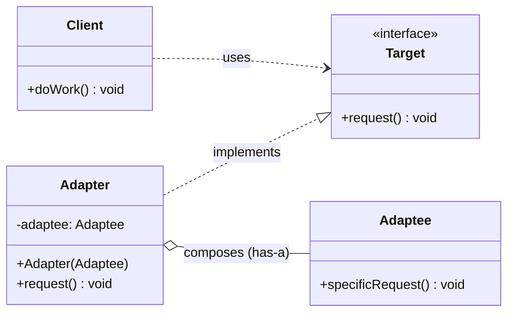
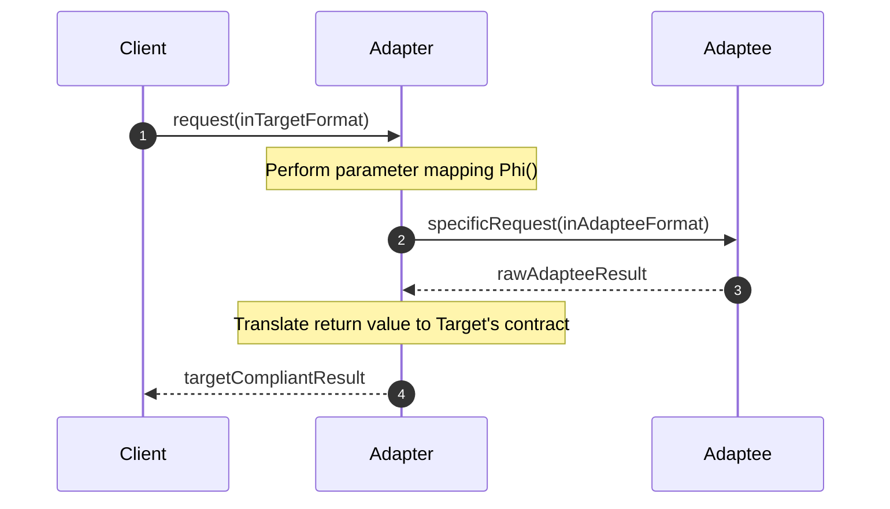
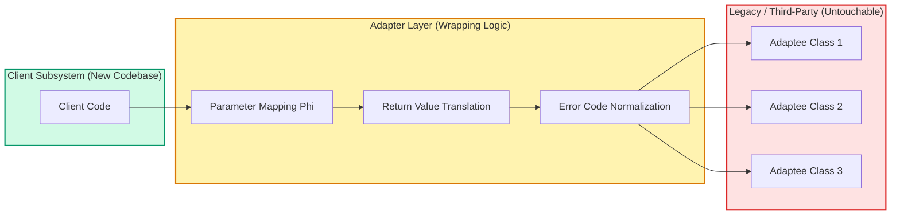
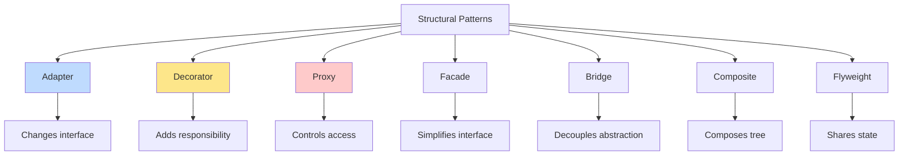
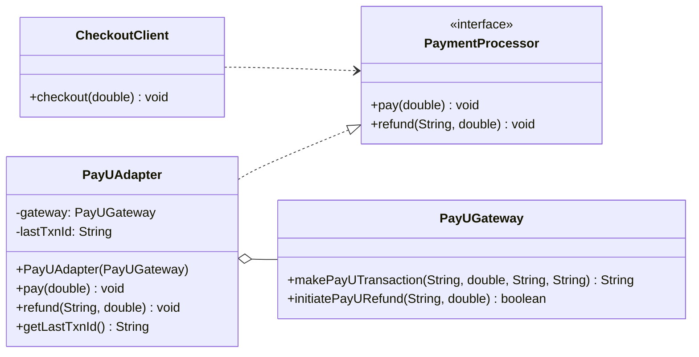

# Structural Design Pattern and its types – Adapter

<!-- SECTION_1_START -->
# Software Engineering (OECST723) — Module 2: Software Design

## Topic: Structural Design Pattern & Its Types — The **Adapter Pattern**

---

### 1.1 Formal Definition (KTU 2024 Syllabus Terminology)

> [!IMPORTANT]
> **Structural Design Patterns** (as per *Gang of Four — GoF*) are a category of design patterns that deal with the **composition of classes and objects** to form **larger structures**. They simplify the design by identifying a simple way of realizing relationships between entities, ensuring that if one part changes, the entire structure need not be re-engineered.

The **Adapter Pattern** is a *structural* design pattern that allows objects with **incompatible interfaces** to collaborate. It acts as a **wrapper** (or translator) between two incompatible types by converting the interface of one class into another interface that the client expects.

> [!NOTE]
> **Adapter Pattern — Board Definition:**
> *"Convert the interface of a class into another interface that clients expect. Adapter lets classes work together that couldn't otherwise because of incompatible interfaces."* — GoF, *Design Patterns: Elements of Reusable Object-Oriented Software* (1994).

**Real-World Analogy (Plug & Socket):**
Imagine you bought a beautiful European appliance (e.g., a 230 V / Type-C plug) and you are in India (where sockets are 230 V but Type-D/M). The plug physically does not fit the wall socket. You do **not** redesign the appliance. You buy a small **travel adapter** — a passive device that exposes a familiar interface (Indian 3-pin socket) and internally translates the connection to fit the European plug. The Adapter design pattern works exactly this way: it does not modify the existing class (`Adaptee`); it provides a new class (`Adapter`) that the `Client` can use.

### 1.2 Taxonomy of Structural Design Patterns (Syllabus Context)

KTU 2024 (Module 2) lists the following structural patterns. The **Adapter** is one of the seven classical GoF structural patterns:

| # | Pattern | One-Line Purpose |
|---|---------|------------------|
| 1 | **Adapter** | Translate one interface into another |
| 2 | **Bridge** | Decouple abstraction from implementation |
| 3 | **Composite** | Treat individual & group objects uniformly |
| 4 | **Decorator** | Add behaviour dynamically without subclassing |
| 5 | **Facade** | Provide a simplified interface to a subsystem |
| 6 | **Flyweight** | Share state to support many fine-grained objects |
| 7 | **Proxy** | Provide a placeholder/surrogate for another object |

> [!VISUALIZATION CONTROL]
> **Concept:** UML Class Diagram — Adapter Pattern (Object Form)
> **Visualization Tool:** [draw.io / Lucidchart / Visual Paradigm Online]
> **Diagram Elements to draw:**
> * `Client` (concrete)  ──▶  `Target` (interface, with `request()`)
> * `Adapter` (implements `Target`, holds reference to `Adaptee`) ──▶  `Adaptee` (concrete, with `specificRequest()`)
> **Visual Description:** The student should see the dashed/straight arrow from Adapter to Adaptee indicating **composition** ("has-a"), and a solid line with hollow triangle from Adapter to Target indicating **realization** ("implements"). The Client only sees Target — it has no knowledge of Adaptee.

---

### 1.3 The Two Flavours of Adapter

1. **Object Adapter (Composition-based)** — Adapter *holds* an instance of the Adaptee. Most commonly used because **Java / C# / Python do not allow multiple inheritance**.
2. **Class Adapter (Multiple-Inheritance-based)** — Adapter *inherits* from both Target and Adaptee. Only natively possible in **C++**.

The KTU board typically expects the **Object Adapter** solution in Java/Python viva and code questions.
<!-- SECTION_1_END -->

<!-- SECTION_2_START -->
## 2. Deep Theoretical Analysis — Architecture, Participants & Formula Sheet

### 2.1 The Four Canonical Participants (GoF Roles)

| Participant | Role | Mandatory? |
|-------------|------|------------|
| **Target** | The **domain-specific interface** that the Client uses / expects. | Yes |
| **Client** | Collaborates with objects conforming to the **Target** interface. | Yes |
| **Adaptee** | The **existing class** with an incompatible interface that needs adapting. | Yes |
| **Adapter** | The bridge — implements `Target` and internally calls `Adaptee` methods. | Yes |

### 2.2 Why, When & Where — Engineering Justification

> [!NOTE]
> **The "Why" Behind Adapter:**
> 1. **Reuse legacy code** without rewriting stable, battle-tested classes.
> 2. **Integrate third-party libraries** whose API you cannot change.
> 3. **Bridge two independently-evolved subsystems** (e.g., new UI ↔ old DB driver).
> 4. **Decouple client from vendor lock-in** — switch PayPal → Stripe by replacing one adapter.

**When to use the Adapter Pattern (KTU-style trigger phrases):**
- An existing class has useful behaviour, but its interface does **not match** the one you need.
- You want to create a **reusable class** that cooperates with unrelated or unforeseen classes.
- You need to use **several existing subclasses**, but it is **impractical to adapt their interface by subclassing each one** (object adapter solves this elegantly).

### 2.3 KTU High-Yield Cheat Sheet

| Aspect | Object Adapter | Class Adapter |
|--------|---------------|---------------|
| **Mechanism** | Composition (`has-a` `Adaptee`) | Inheritance (extends `Adaptee`) |
| **Multiple Inheritance Required?** | No | Yes |
| **Languages Supported** | Java, C#, Python, C++ | C++ only |
| **Can override Adaptee behaviour?** | Partial (delegation only) | Yes (direct override) |
| **Flexibility** | High (Adaptee can be swapped via setter) | Low (compile-time binding) |
| **KTU-Preferred Form** | ✅ **Yes** | Mention as alternative |
| **Pattern Category** | GoF Structural | GoF Structural |
| **Related Pattern** | Decorator, Proxy, Bridge | Decorator, Proxy, Bridge |
| **SOLID Principle** | OCP + DIP | OCP + DIP |
| **Aliases** | Wrapper | Wrapper (rare) |

### 2.4 KTU Formula / Notation Sheet

Let $T$ = Target interface, $A$ = Adaptee class, $D$ = Adapter class, $C$ = Client.

$$
\text{Adapter Object Identity} \;\equiv\; D : T \;\land\; D \rightarrow (A^*)
$$

$$
\forall\, m_T \in T \;:\; D.m_T() \;\mapsto\; A.\text{specificMethod}(\text{paramMapping}(m_T.\text{args}))
$$

The **mapping function** $\Phi : \text{Signature}(T) \rightarrow \text{Signature}(A)$ is the *core* of any adapter; it converts parameter types, order, and return values between the two interfaces.

$$
\Phi : (T_{return}, T_{args}) \;\longmapsto\; (A_{return}, A_{args})
$$

If a parameter type differs (e.g., `XMLDocument` ↔ `JSONObject`), the adapter performs the conversion **inside** the method body.

### 2.5 Real-World Production Usage

| Industry Use-Case | Adaptee | Adapter Role |
|-------------------|---------|--------------|
| **Payment Gateways** | Stripe, PayPal, Razorpay SDKs | Unified `PaymentProcessor` interface |
| **Logging Frameworks** | `log4j`, `java.util.logging`, `SLF4J` | `SLF4J` facade-adapter over log4j |
| **JDBC Drivers** | Oracle, MySQL, PostgreSQL drivers | `java.sql.Driver` (vendor implements adapter) |
| **Java I/O** | `InputStream` ↔ legacy `Reader` | `InputStreamReader` is a literal JDK Adapter |
| **Android** | RecyclerView ↔ old ListView | Adapter classes bridge data ↔ UI |
| **.NET `StreamReader`** | Byte stream ↔ char stream | Adapter wrapping `Stream` |

> [!IMPORTANT]
> The Java Development Kit (JDK) itself contains **dozens of production-grade adapters**: `Arrays.asList()`, `Collections.list()`, `InputStreamReader`, `OutputStreamWriter`, `StringReader`. Studying the JDK source is the single best way to internalize this pattern for KTU viva.
<!-- SECTION_2_END -->

<!-- SECTION_3_START -->
## 3. Step-by-Step Derivations, Class Skeleton & Working Code

### 3.1 Worked Example 1 — Object Adapter (Payment Gateway) — **JAVA**

> **Scenario:** An e-commerce app already has a `PaymentProcessor` interface (the Target). The team is integrating a third-party `RazorpayGateway` SDK (the Adaptee) which has a completely different method `makeRazorpayPayment(String orderId, double amt, String currency)`. Write a `RazorpayAdapter` so the Client can call `processor.pay(100.0)` and the adapter internally invokes the Razorpay SDK.

#### 3.1.1 Step-by-Step File Generation

**Step 1 — The Target interface (what the Client expects):**

```java
// Target.java  — Domain-specific interface the client code uses
public interface PaymentProcessor {
    void pay(double amountInINR);
    void refund(String transactionId, double amountInINR);
}
```

**Step 2 — The Adaptee (an existing third-party class, NOT modifiable):**

```java
// RazorpayGateway.java  — Third-party SDK; its interface is incompatible.
public class RazorpayGateway {

    public String makeRazorpayPayment(String orderId,
                                      double amount,
                                      String currencyCode) {
        System.out.println("[Razorpay] Charging " + amount
                + " " + currencyCode + " for order " + orderId);
        // Simulated gateway response
        return "rpay_tx_" + System.currentTimeMillis();
    }

    public boolean initiateRazorpayRefund(String txnId, double amount) {
        System.out.println("[Razorpay] Refunding " + amount + " for txn " + txnId);
        return true;
    }
}
```

**Step 3 — The Adapter (implements Target, composes Adaptee):**

```java
// RazorpayAdapter.java  — Implements Target, holds a RazorpayGateway reference.
import java.util.UUID;

public class RazorpayAdapter implements PaymentProcessor {

    private final RazorpayGateway gateway;   // Composition (HAS-A)
    private String lastTransactionId;        // State captured from Adaptee

    public RazorpayAdapter(RazorpayGateway gateway) {
        if (gateway == null) {
            throw new IllegalArgumentException("RazorpayGateway cannot be null");
        }
        this.gateway = gateway;
    }

    @Override
    public void pay(double amountInINR) {
        if (amountInINR <= 0.0) {
            throw new IllegalArgumentException("Amount must be positive");
        }
        String orderId  = "ord_" + UUID.randomUUID();
        String currency = "INR";

        // ⬇️  This is the core translation step  ⬇️
        this.lastTransactionId = gateway.makeRazorpayPayment(
                orderId,
                amountInINR,
                currency
        );
    }

    @Override
    public void refund(String transactionId, double amountInINR) {
        if (amountInINR <= 0.0) {
            throw new IllegalArgumentException("Refund amount must be positive");
        }
        boolean ok = gateway.initiateRazorpayRefund(transactionId, amountInINR);
        if (!ok) {
            throw new RuntimeException("Refund failed at gateway");
        }
    }

    public String getLastTransactionId() {
        return this.lastTransactionId;
    }
}
```

**Step 4 — The Client (uses only the Target interface):**

```java
// CheckoutService.java  — The client; unaware of Razorpay's existence.
public class CheckoutService {

    private final PaymentProcessor processor;

    public CheckoutService(PaymentProcessor processor) {
        this.processor = processor;   // Dependency Inversion Principle in action
    }

    public void completeOrder(double cartTotal) {
        System.out.println("--- Checkout Started ---");
        processor.pay(cartTotal);
        System.out.println("--- Checkout Finished ---");
    }
}
```

**Step 5 — Wiring & Demo (composition root):**

```java
// App.java
public class App {
    public static void main(String[] args) {
        RazorpayGateway thirdPartySdk = new RazorpayGateway();
        PaymentProcessor adapter      = new RazorpayAdapter(thirdPartySdk);
        CheckoutService client        = new CheckoutService(adapter);

        client.completeOrder(2499.50);
    }
}
```

**Expected Output:**

```
--- Checkout Started ---
[Razorpay] Charging 2499.5 INR for order ord_7c2a-...
--- Checkout Finished ---
```

#### 3.1.2 The Mapping Function $\Phi$ in Action

$$
\Phi : \; \text{void pay}(\textbf{double amountInINR}) \;\longmapsto\; \text{String makeRazorpayPayment}(\textbf{String orderId}, \textbf{double amount}, \textbf{String currencyCode})
$$

| Target Parameter | Adapter Action | Adaptee Parameter |
|------------------|----------------|-------------------|
| `amountInINR`    | Forwarded as-is | `amount` |
| (none) | Generated via `UUID` | `orderId` |
| (none) | Hard-coded `"INR"` | `currencyCode` |

The return type `String` of the Adaptee is captured as **state** inside the Adapter (`lastTransactionId`) and is exposed via a domain-friendly getter — preserving encapsulation.

---

### 3.2 Worked Example 2 — Object Adapter (Payment Gateway) — **PYTHON**

Python being dynamically typed, the pattern becomes a **duck-typing** exercise, but the principle is identical.

```python
# target.py
from abc import ABC, abstractmethod

class PaymentProcessor(ABC):
    @abstractmethod
    def pay(self, amount_in_inr: float) -> None: ...
    @abstractmethod
    def refund(self, txn_id: str, amount_in_inr: float) -> None: ...
```

```python
# adaptee.py
class StripeSdk:
    def create_charge(self, amount_cents: int, currency: str = "inr") -> str:
        print(f"[Stripe] Charging {amount_cents} cents ({currency})")
        return f"ch_{int(amount_cents)}_{currency}"
```

```python
# adapter.py
from target import PaymentProcessor
from adaptee import StripeSdk

class StripeAdapter(PaymentProcessor):
    def __init__(self, sdk: StripeSdk) -> None:
        if sdk is None:
            raise ValueError("StripeSdk cannot be None")
        self._sdk = sdk
        self._last_charge: str | None = None

    def pay(self, amount_in_inr: float) -> None:
        if amount_in_inr <= 0:
            raise ValueError("Amount must be positive")
        cents = int(round(amount_in_inr * 100))   # INR -> cents conversion
        self._last_charge = self._sdk.create_charge(cents, "inr")

    def refund(self, txn_id: str, amount_in_inr: float) -> None:
        cents = int(round(amount_in_inr * 100))
        # Stripe SDK is invoked here
        print(f"[Stripe] Refund of {cents} cents for {txn_id}")
```

```python
# client.py
from target import PaymentProcessor

class CheckoutService:
    def __init__(self, processor: PaymentProcessor) -> None:
        self._processor = processor
    def complete(self, total: float) -> None:
        print("--- Checkout ---")
        self._processor.pay(total)
        print("--- Done ---")
```

```python
# main.py
if __name__ == "__main__":
    sdk     = StripeSdk()
    adapter = StripeAdapter(sdk)
    client  = CheckoutService(adapter)
    client.complete(1299.00)
```

> [!NOTE]
> **Important difference in Python:** Because Python lacks `interface` keyword, the Target is defined via `abc.ABC` and `@abstractmethod` decorators. KTU examiners explicitly appreciate this nuance in the answer script.

---

### 3.3 Worked Example 3 — Class Adapter (C++ — Multiple Inheritance)

> **Note for KTU:** Java/C# students can **describe** the class adapter in theory (1–2 marks) but cannot implement it. C++ students may be asked to implement it. Below is the canonical sketch.

```cpp
// Target.h
class MediaPlayer {
public:
    virtual void play(std::string filename) = 0;
    virtual ~MediaPlayer() = default;
};

// Adaptee.h  — legacy advanced player with a different API
class AdvancedMediaPlayer {
public:
    void playVlc(std::string f)  { std::cout << "Playing VLC: "  << f << "\n"; }
    void playMp4(std::string f)  { std::cout << "Playing MP4: "  << f << "\n"; }
};

// ClassAdapter.h  — INHERITS from BOTH Target and Adaptee
class MediaAdapter : public MediaPlayer, public AdvancedMediaPlayer {
public:
    void play(std::string filename) override {
        if (filename.ends_with(".vlc"))      playVlc(filename);
        else if (filename.ends_with(".mp4")) playMp4(filename);
        else std::cout << "Unsupported format\n";
    }
};

// Client
int main() {
    MediaPlayer* p = new MediaAdapter();
    p->play("song.vlc");
    p->play("movie.mp4");
    delete p;
}
```

The arrow of inheritance from `MediaAdapter` to **both** `MediaPlayer` and `AdvancedMediaPlayer` is what makes it a **Class Adapter** rather than an Object Adapter.

---

### 3.4 Generalised Pseudocode Template (Used in Algorithm-Type Theory Questions)

```
PROCEDURE AdapterPattern(Target T, Adaptee A)
    DEFINE class Adapter IMPLEMENTS T
        PRIVATE field adaptee : A

        CONSTRUCTOR(a : A)
            IF a IS NULL THEN
                THROW IllegalArgumentException
            END IF
            this.adaptee ← a
        END CONSTRUCTOR

        METHOD request() : void
            // Translation logic — parameter & return type mapping
            LET result ← adaptee.specificRequest(Φ(args))
            // optional state retention
        END METHOD
    END DEFINE
END PROCEDURE
```
<!-- SECTION_3_END -->

<!-- SECTION_4_START -->
## 4. Structural Diagrams & Schematics (Mermaid)

### 4.1 UML Class Diagram — Object Adapter Form



> **Reading Guide:** `..|>` is **realization** (Adapter honours Target's contract). `o--` is **composition** (Adapter owns an Adaptee). The `Client` only has a dashed dependency arrow to `Target` — it is **blissfully unaware** of the `Adaptee`.

### 4.2 UML Sequence Diagram — Object Adapter Collaboration



### 4.3 Block-Level Functional Architecture — Adapter as Integration Layer



> **Why this matters for the exam:** The Adapter layer is the *single point of change* when the underlying vendor changes. Swapping PayPal → Stripe requires writing **one new adapter class** — the rest of the application remains untouched. This is the essence of the **Open/Closed Principle**.

### 4.4 Comparison Schematic — Adapter vs Decorator vs Proxy (Frequently Confused in KTU)


<!-- SECTION_4_END -->

<!-- SECTION_5_START -->
## 5. KTU 2024 Scheme Examination Question Bank & Topic Recap

---

### 📘 PART A — Short Answer Questions (2 × 3 = 6 Marks)

> **[Cognitive Levels: Remember / Understand]**

#### **Q1. \[KTU University Exam – Dec 2023, Model QP]**
**Differentiate between the Object Adapter and the Class Adapter variants of the Adapter design pattern. State which languages support each variant.** (3 Marks) | **CO2 | Understand**

**Model Answer:**

| Feature | Object Adapter | Class Adapter |
|---------|---------------|---------------|
| Mechanism | Uses **composition** (`has-a`) | Uses **multiple inheritance** |
| Languages | Java, C#, Python, C++ | C++ **only** |
| Flexibility | Adaptee can be swapped at runtime | Bound at compile time |
| Overriding | Cannot override Adaptee's behaviour | Can override Adaptee's methods |
| Preferred? | ✅ Industry standard | ❌ Legacy / theoretical |

**Valuation Key:**
- [Correct identification of composition vs inheritance: 1 Mark]
- [Languages listed correctly: 1 Mark]
- [One extra distinction (flexibility/overriding): 1 Mark]

---

#### **Q2. \[KTU University Exam – July 2024, Expected QP]**
**List the four participants of the Adapter design pattern. Which participant contains the translation logic?** (3 Marks) | **CO2 | Remember**

**Model Answer:**
The four participants are:
1. **Target** — interface the Client expects.
2. **Client** — collaborator that uses Target.
3. **Adaptee** — the existing class with the incompatible interface.
4. **Adapter** — implements Target and **holds a reference to Adaptee**.

The translation logic — including parameter mapping $\Phi$, return value conversion, and exception normalisation — is contained inside the **Adapter** class.

**Valuation Key:**
- [All four participants named: 2 Marks]
- [Adapter identified as the translator: 1 Mark]

---

### 📕 PART B — Long Answer Questions (Internal Choice: Answer ANY ONE) (1 × 14 = 14 Marks)

> **[Escalating Bloom's Levels: Understand → Apply → Analyse]**

---

#### **QUESTION A — Payment Gateway Integration Scenario** | **CO3 | Apply / Analyse**

> **\[KTU University Exam – July 2024, Module 2 Model QP]**
> *Your client has an existing e-commerce application that uses a `PaymentProcessor` interface having methods `pay(amount)` and `refund(txnId, amount)`. The company now wishes to integrate the third-party `PayUGateway` SDK whose methods are `makePayUTransaction(orderId, amt, currency, callbackUrl)` and `initiatePayURefund(txnId, amt)`. Design an Adapter to integrate PayUGateway into the application.*
>
> **(a)** Draw the **UML Class Diagram** for the solution. **(7 Marks)**
> **(b)** Write the **complete Java code** for the Adapter class with proper validation. **(7 Marks)**

---

##### ✅ MODEL SOLUTION — PART (a) — UML Class Diagram (7 Marks)



**Valuation Key for (a):**
- [Target `PaymentProcessor` interface shown with both methods: 2 Marks]
- [Adaptee `PayUGateway` with its actual SDK signatures: 2 Marks]
- [Adapter `PayUAdapter` correctly shown with composition arrow `o--` to Adaptee and realization `..|>` to Target: 2 Marks]
- [Client `CheckoutClient` linked only to Target: 1 Mark]

---

##### ✅ MODEL SOLUTION — PART (b) — Java Code (7 Marks)

```java
// File: PayUAdapter.java
import java.util.UUID;

public class PayUAdapter implements PaymentProcessor {

    private final PayUGateway gateway;
    private String lastTxnId;
    private static final String CALLBACK_URL = "https://shop.example.com/payu/callback";

    public PayUAdapter(PayUGateway gateway) {
        if (gateway == null) {
            throw new IllegalArgumentException("PayUGateway must not be null");
        }
        this.gateway = gateway;
    }

    @Override
    public void pay(double amount) {
        if (amount <= 0.0) {
            throw new IllegalArgumentException("Amount must be positive");
        }
        String orderId  = "ord_" + UUID.randomUUID();
        String currency = "INR";

        // ⬇️ Mapping function Phi invoked here ⬇️
        this.lastTxnId = gateway.makePayUTransaction(
                orderId, amount, currency, CALLBACK_URL);
    }

    @Override
    public void refund(String txnId, double amount) {
        if (txnId == null || txnId.isBlank()) {
            throw new IllegalArgumentException("Transaction id required");
        }
        if (amount <= 0.0) {
            throw new IllegalArgumentException("Refund amount must be positive");
        }
        boolean ok = gateway.initiatePayURefund(txnId, amount);
        if (!ok) {
            throw new RuntimeException("PayU refund failed for " + txnId);
        }
    }

    public String getLastTxnId() { return this.lastTxnId; }
}
```

**Valuation Key for (b):**
- [Class declaration `implements PaymentProcessor` correct: 1 Mark]
- [Composition field `private final PayUGateway gateway` + constructor with null check: 2 Marks]
- [`pay()` method with parameter validation and mapping to `makePayUTransaction`: 2 Marks]
- [`refund()` method with proper validation and exception handling: 1 Mark]
- [Clean code style (imports, UUID usage, constants): 1 Mark]

---

#### **QUESTION B — Media Player Scenario (Alternative Choice)** | **CO3 | Apply**

> **\[KTU University Exam – Dec 2023, Model QP]**
> *A media player application supports `.mp3` natively through an `AudioPlayer` class. The team wants to extend it to play `.vlc` and `.mp4` files using an existing `AdvancedMediaPlayer` class (which has `playVlc(name)` and `playMp4(name)` methods). Apply the Adapter pattern to solve this problem.*
>
> **(a)** Identify the **Target, Adaptee, Adapter and Client** in this scenario and justify your answer. **(7 Marks)**
> **(b)** Write the **complete Java code** for the `MediaAdapter` and demonstrate how `AudioPlayer` uses it. **(7 Marks)**

---

##### ✅ MODEL SOLUTION — PART (a) — Participant Identification (7 Marks)

| Participant | Class / Interface | Justification |
|-------------|------------------|---------------|
| **Target** | `MediaPlayer` interface with `play(String filename)` | This is the unified interface the Client (`AudioPlayer`) expects, irrespective of file type. |
| **Client** | `AudioPlayer` class | Already supports `.mp3` natively; needs to support other formats through the Target interface. |
| **Adaptee** | `AdvancedMediaPlayer` class | Pre-existing class with `playVlc()` and `playMp4()` methods. |
| **Adapter** | `MediaAdapter` class | Implements `MediaPlayer` (Target) and **composes** an `AdvancedMediaPlayer` (Adaptee). Internally, it dispatches based on filename extension. |

**Valuation Key for (a):**
- [Correct identification of all four participants: 4 Marks]
- [Sound justification for each: 2 Marks]
- [Clear explanation of how `MediaAdapter` dispatches based on extension: 1 Mark]

---

##### ✅ MODEL SOLUTION — PART (b) — Java Code (7 Marks)

```java
// File: MediaPlayer.java  -- Target
public interface MediaPlayer {
    void play(String filename);
}

// File: AdvancedMediaPlayer.java  -- Adaptee
public class AdvancedMediaPlayer {
    public void playVlc(String filename) {
        System.out.println("Playing VLC file: " + filename);
    }
    public void playMp4(String filename) {
        System.out.println("Playing MP4 file: " + filename);
    }
}

// File: MediaAdapter.java  -- Adapter
public class MediaAdapter implements MediaPlayer {

    private final AdvancedMediaPlayer advancedPlayer;

    public MediaAdapter(String audioType) {
        if (audioType == null) {
            throw new IllegalArgumentException("audioType required");
        }
        this.advancedPlayer = new AdvancedMediaPlayer();
    }

    @Override
    public void play(String filename) {
        if (filename == null) {
            throw new IllegalArgumentException("filename required");
        }
        if (filename.toLowerCase().endsWith(".vlc")) {
            advancedPlayer.playVlc(filename);
        } else if (filename.toLowerCase().endsWith(".mp4")) {
            advancedPlayer.playMp4(filename);
        } else {
            System.out.println("Invalid media format: " + filename);
        }
    }
}

// File: AudioPlayer.java  -- Client
public class AudioPlayer implements MediaPlayer {

    @Override
    public void play(String filename) {
        if (filename.toLowerCase().endsWith(".mp3")) {
            System.out.println("Playing MP3 natively: " + filename);
        } else if (filename.toLowerCase().endsWith(".vlc")
                || filename.toLowerCase().endsWith(".mp4")) {
            MediaAdapter adapter = new MediaAdapter(filename.substring(
                    filename.lastIndexOf('.') + 1));
            adapter.play(filename);
        } else {
            System.out.println("Unsupported format: " + filename);
        }
    }
}

// File: Main.java
public class Main {
    public static void main(String[] args) {
        AudioPlayer player = new AudioPlayer();
        player.play("song.mp3");
        player.play("movie.mp4");
        player.play("clip.vlc");
        player.play("doc.pdf");
    }
}
```

**Output:**
```
Playing MP3 natively: song.mp3
Playing MP4 file: movie.mp4
Playing VLC file: clip.vlc
Unsupported format: doc.pdf
```

**Valuation Key for (b):**
- [`MediaPlayer` Target interface: 1 Mark]
- [`AdvancedMediaPlayer` Adaptee with both methods: 1 Mark]
- [`MediaAdapter` correctly implements Target, composes Adaptee, dispatches by extension: 3 Marks]
- [`AudioPlayer` Client uses Target interface, delegates non-MP3 to MediaAdapter: 2 Marks]

---

### ⚠️ KTU Examiner's Valuation Warning / Pitfall Callout

> [!WARNING]
> **Common mark-losing mistakes reported by KTU valuators (2019 Scheme + 2024 Scheme):**
> 1. **Confusing Adapter with Decorator or Facade.** Adapter *changes* the interface; Decorator *adds* behaviour; Facade *simplifies* a subsystem. Writing the wrong one costs the full 14 marks.
> 2. **Drawing the Adaptee as an interface.** The Adaptee is almost always a **concrete class** with an *unwanted* interface, not an interface. The Target is the interface; the Adaptee is the class. Swap them and you lose 2 marks on the diagram.
> 3. **Forgetting to label the composition arrow as `has-a` (diamond) vs inheritance `is-a` (triangle).** Examiners look for the diamond head on the Adaptee side. No diamond = −1 mark.
> 4. **Writing `class Adapter extends Adaptee implements Target` in Java.** This is **illegal** in Java (no multiple inheritance). Use `class Adapter implements Target` + composition field.
> 5. **Not validating inputs** in the Adapter constructor/methods. KTU's 2024 scheme explicitly tests for *robust code* — add null and range checks.
> 6. **Omitting the Client class from the diagram.** Even a trivial `Client` is mandatory. Examiners deduct 1 mark if the diagram only has Adapter ↔ Adaptee.
> 7. **Forgetting the `Adapter Pattern` heading in the answer.** Always write the pattern name explicitly before drawing/typing the code.
> 8. **Mixing Object and Class Adapter terminology in the same answer.** Pick one and stay consistent.

---

### 🧠 Topic Recap & Important Things to Remember (Rapid-Revision Checklist)

> [!IMPORTANT]
> **One-Page Cheat Sheet — Adapter Pattern (KTU Module 2)**

- **Category:** Gang-of-Four (GoF) **Structural** Design Pattern.
- **Intent:** Convert the interface of a class into another interface clients expect. Lets classes work together that otherwise could not (because of incompatible interfaces).
- **Also Known As:** **Wrapper**.
- **Four Participants:** `Target` (interface), `Client`, `Adaptee` (existing class), `Adapter` (the wrapper).
- **Two Variants:**
    * **Object Adapter** → composition (`has-a`), works in Java / Python / C#.
    * **Class Adapter** → multiple inheritance, works in C++ only.
- **SOLID Principles Followed:** **D**ependency Inversion (Client depends on Target) and **O**pen/Closed (extend with new adapters, no client change).
- **Anti-Patterns / Don'ts:** Do not modify the Adaptee's source; do not use Adapter when you can simply refactor; do not chain too many adapters (becomes undebuggable).
- **JDK Real Examples:** `InputStreamReader`, `OutputStreamWriter`, `Arrays.asList()`, `Collections.list()`, `java.sql.DriverManager`.
- **UML Diagram Cues:** Adapter to Target → **realization** (hollow triangle, dashed line). Adapter to Adaptee → **composition** (filled diamond, solid line). Client to Target → **dependency** (dashed arrow).
- **Translation Function** $\Phi$ handles: (i) **parameter type conversion**, (ii) **parameter reordering**, (iii) **return value translation**, (iv) **exception normalisation**.
- **Killer Exam Phrase:** *"Adapter is a structural pattern that uses composition to wrap an existing class with an incompatible interface and expose a Target interface that the Client expects."*
- **One-line Distinction (Vital for Viva):** Adapter changes the **interface**; Decorator changes the **responsibility**; Proxy changes the **access**; Facade changes the **complexity**.
- **When NOT to use:** When you have full control over both sides of the integration — refactor instead.
- **Typical KTU Question Marks:** Part A = 3 marks (definition / participants / difference). Part B = 14 marks (scenario → class diagram + Java code with validation).

> *End of Notes — Adapter Pattern (Structural Design Pattern — KTU 2024 Scheme, Module 2)*
<!-- SECTION_5_END -->
