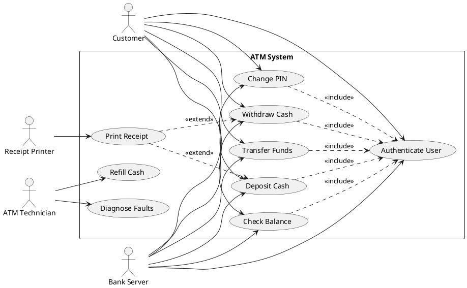
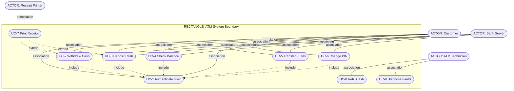
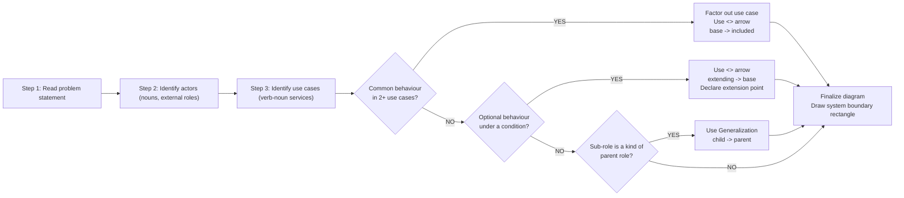
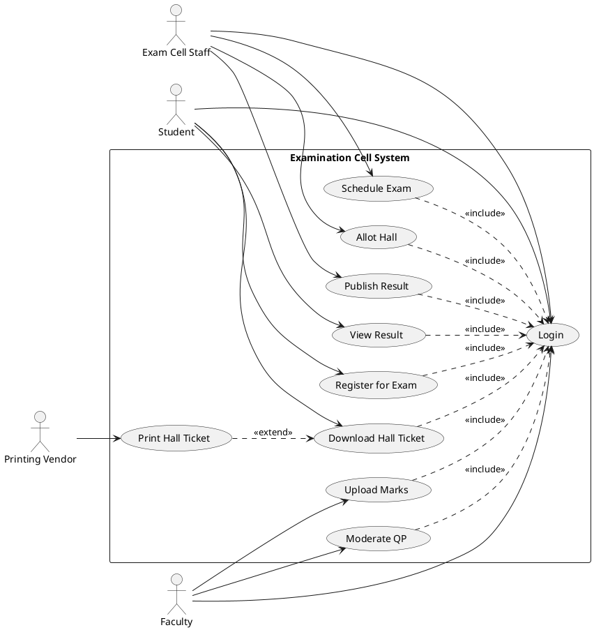
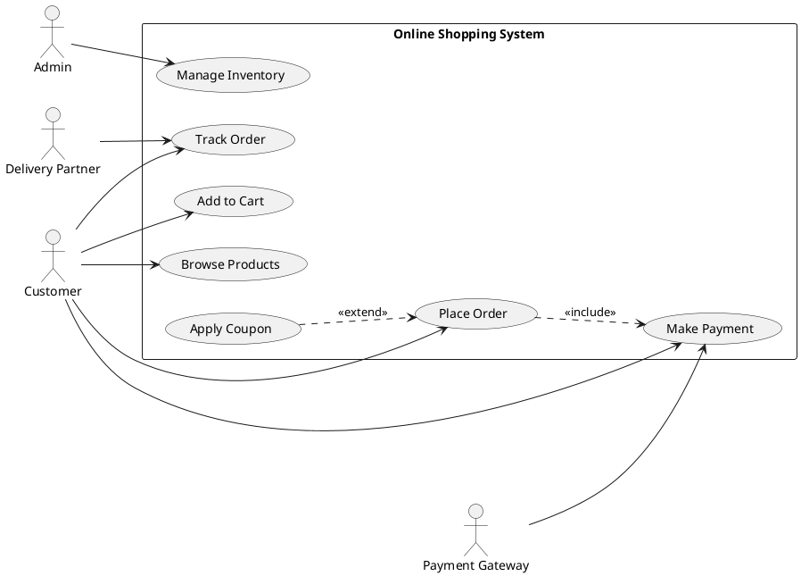

# Use case diagram

<!-- SECTION_1_START -->
# Use Case Diagram — Core Technical Definition & Intuitive Overview

> [!IMPORTANT]
> **KTU 2024 Scheme Definition (OECST723 — Module 2: Software Design):**
> A **Use Case Diagram** is a *behavioural* diagram in the **Unified Modeling Language (UML 2.5)** that captures the **functional requirements** of a system by modelling the interactions between **external actors** (users or other systems) and the **use cases** (services the system provides) under a defined **system boundary**.

It is one of the **five diagrams** in UML that belong to the *use-case view* of a system, and is typically the *first* diagram drawn during the requirements and analysis phase of the software development life cycle (**SDLC**).

> [!NOTE]
> **Where it fits in KTU 2024 OECST723 (Module 2 — Software Design):**
> The use case diagram is the bridge between *requirements gathering* and *object-oriented design*. It directly supports **CO2 (Apply software development life cycle models and requirement techniques)** and **CO3 (Design software using UML diagrams)**.

---

## Conceptual Analogy / Intuition

> [!TIP]
> **Analogy: The Restaurant Menu & Waiter System 🍽️**
> Imagine a restaurant. The *menu* lists every service a customer can request — starters, mains, desserts, billing, complaints. The *waiter* is the **actor** (the one interacting with the kitchen), and the **kitchen system boundary** is the rectangle that encloses every dish you can ask for. Some dishes (like "Cheese Burst Pizza") *always include* extra cheese — that is a **\<\<include\>\>** relationship. Some dishes are "optional add-ons" — that is an **\<\<extend\>\>** relationship.
> A *use case diagram* is exactly this: the *system* is the kitchen, the *actors* are the customers, and each *ellipse* is a service the kitchen promises to deliver.

**Geometric Intuition:**
- **Ellipses (ovals)** = verbs of the system (what the system *does*).
- **Stick figures** = nouns of the outside world (who interacts with the system).
- **Rectangle** = the system itself (where the verb lives).
- **Lines / Dashed arrows / Hollow-headed arrows** = the *grammar* connecting actors and services.

---

## Core Components at a Glance

| # | Component | UML Symbol | Purpose |
|---|-----------|------------|---------|
| 1 | **Actor** | Stick figure | External entity (human, hardware, or another system) interacting with the system. |
| 2 | **Use Case** | Ellipse (oval) | A specific, valuable service the system provides to an actor. |
| 3 | **System Boundary** | Rectangle | The scope/limit of the system; encloses all use cases. |
| 4 | **Association** | Solid line | Connects an actor to a use case it participates in. |
| 5 | **\<\<include\>\>** | Dashed arrow + stereotype | Mandatory reuse — base use case always invokes the included one. |
| 6 | **\<\<extend\>\>** | Dashed arrow + stereotype | Optional/conditional addition — extending use case may add behaviour under a condition. |
| 7 | **Generalization** | Solid line with hollow triangle | Inheritance between two actors OR two use cases (parent → child). |
| 8 | **Note** | Dog-eared rectangle | Free-text annotation to clarify semantics. |

> [!NOTE]
> **Physical constants / standards referenced:**
> * The diagram follows the **OMG UML 2.5.1 specification** (Object Management Group).
> * The official standard mandates **stereotype text in guillemets** $\ll$ and $\gg$ (e.g., `<<include>>`), although in plain ASCII the double-angle bracket convention `<<include>>` is universally accepted in KTU board answers.

> [!VISUALIZATION CONTROL]
> **Concept:** Geometric layout of a use case diagram (system boundary rectangle, ellipses, stick figures, relationship lines) on a 2-D canvas.
> **GeoGebra / Desmos Input Equations (illustrative plot zones):**
> * System boundary rectangle: $x \in [-6, 6]$, $y \in [-4, 4]$ (just to show coordinate intuition).
> * Use case ellipses: e.g. ellipse $A$ at $(0,2)$ with semi-axes $a=1.5$, $b=0.6$, i.e. $\frac{x^2}{2.25} + \frac{(y-2)^2}{0.36} = 1$.
> * Actor points (stick figures anchored at): $(-7, 0)$, $(7, 0)$.
> **Visual Description:** The student should observe a *bounded rectangle* holding several *ovals* (use cases), with *stick figures* (actors) outside the rectangle, connected to ovals by *lines* (associations). This is the canonical top-down layout used in KTU board valuation.

---

<!-- SECTION_2_START -->
# Deep Theoretical Analysis & KTU High-Yield Formula Sheet

## 1. Anatomy of the Use Case Diagram

A use case diagram models **four primary ingredients** and **four relationship types**. KTU examiners frequently test *why* a particular relationship is chosen, not just *how* to draw it.

### 1.1 Actors
* An **actor** is a role played by an *external entity* that interacts with the system.
* Actors are **not** part of the system — they live *outside* the system boundary rectangle.
* An actor can be:
  * **Primary actor** — initiates the interaction (e.g., *Customer* presses "Withdraw").
  * **Secondary actor** — the system invokes it to get a response (e.g., *Bank Server* validates PIN).
  * **Human actor**, **hardware actor** (e.g., *Card Reader*), or **external system actor** (e.g., *Payment Gateway*).

> [!IMPORTANT]
> **Naming convention (KTU board preferred):** Use a *role name in singular noun form*, e.g., `Customer`, `Librarian`, `Admin` — **never** a specific person's name like "Rahul".

### 1.2 Use Cases
* A **use case** is a *set of scenarios* tied together by a common user goal (e.g., "Withdraw Cash").
* It represents a *complete, meaningful* interaction that produces an *observable result of value* to the actor.
* Use cases **always begin with a strong verb** in the present tense: *Withdraw*, *Register*, *Calculate Fine*.
* Every use case is enclosed in an **ellipse**, with the name placed **inside** (rarely below, only when crowded).

### 1.3 System Boundary
* The **system boundary** (a large rectangle) delineates the *scope* of the system being modelled.
* **All use cases are inside** the boundary; **all actors are outside**.
* The rectangle is labelled with the **system name** at the top (e.g., `<<ATM System>>`).

### 1.4 Relationships — The Heart of the Diagram

| Relationship | Symbol | Direction of Arrow | When to Use | Real-World Analogy |
|--------------|--------|--------------------|-------------|--------------------|
| **Association** | Solid line | None (just a line) | Actor ↔ Use Case (participates in) | A customer *visits* a restaurant. |
| **\<\<include\>\>** | Dashed arrow with `<<include>>` | Base $\rightarrow$ Included | Base use case **always** invokes included; *mandatory* common behaviour. | Every dish *includes* cooking; you cannot skip it. |
| **\<\<extend\>\>** | Dashed arrow with `<<extend>>` | Extending $\rightarrow$ Base | Optional / conditional behaviour inserted at an *extension point* of the base. | Adding extra cheese is *optional*; only added on request. |
| **Generalization** | Solid line with hollow triangle | Child $\rightarrow$ Parent | Parent–child inheritance; the child inherits all behaviour of the parent. | `VIP Customer` is a *kind of* `Customer`. |

> [!WARNING]
> **Common KTU mistake:** Drawing `<<include>>` and `<<extend>>` arrows in the *wrong direction* costs full 1–2 marks per occurrence. Memorise:
> * `<<include>>` arrow points **towards the COMMON use case** (the one being included).
> * `<<extend>>` arrow points **towards the BASE use case** (the one being extended).

---

## 2. KTU Formula / Notation Cheat Sheet

| Symbol / Notation | Meaning | Typical Mark Allocation |
|-------------------|---------|--------------------------|
| `Actor` (stick figure) | External role | 1 mark for correct identification |
| Ellipse with verb-noun | Use case | 1 mark per correct use case |
| Rectangle boundary | System scope | 1 mark for correct boundary drawing |
| Solid line | Association | 0.5 mark per correct association |
| Dashed arrow + `<<include>>` | Mandatory reuse | 1 mark per `<<include>>` + 1 mark for correct direction |
| Dashed arrow + `<<extend>>` | Optional extension | 1 mark per `<<extend>>` + 1 mark for *extension point* mention |
| Solid arrow + hollow triangle | Generalization | 1 mark for correct parent–child placement |

> [!NOTE]
> **Use case description template (fully dressed format — KTU favourite for 14-mark questions):**

| Field | Description |
|-------|-------------|
| **Use case name** | Verb-noun, e.g., "Withdraw Cash" |
| **Actor(s)** | Primary + secondary actors |
| **Precondition** | State of the system *before* the use case begins |
| **Postcondition** | State of the system *after* successful completion |
| **Main flow (Basic flow)** | Step-by-step happy path |
| **Alternative flows** | Branching scenarios (e.g., invalid PIN) |
| **Exception flows** | Error scenarios (e.g., card retained) |
| **Trigger** | Event that starts the use case |

---

## 3. Construction Methodology (Step-by-Step)

1. **Read the problem statement** carefully; underline every *noun* (potential actor) and *verb* (potential use case).
2. **Identify the system** — give it a clear name and draw the boundary rectangle.
3. **List actors** outside the rectangle; decide *primary* vs *secondary* roles.
4. **List use cases** inside the rectangle; each must be a *user goal*, not a sub-step.
5. **Connect** each actor to its use cases using **association** lines.
6. **Detect common behaviour** — if the *same steps* repeat in 2 or more use cases, factor them into a common use case linked by `<<include>>`.
7. **Detect optional behaviour** — if a step occurs *only under a condition*, model it as an `<<extend>>` with an **extension point** declared on the base use case.
8. **Detect inheritance** — if a sub-role "is a kind of" parent role, use **generalization**.
9. **Add notes** for any non-obvious decision; mark all `<<include>>` / `<<extend>>` clearly.

---

## 4. Real-World Utility in Engineering

* **Agile user stories** — Each use case becomes an *epic*; each main-flow step becomes a *user story*.
* **Traceability matrix** — Use cases map 1-to-1 to test cases, ensuring **100% test coverage**.
* **Requirements negotiation** — Stakeholders see scope at a glance; scope-creep is contained.
* **OO design bridge** — Each actor becomes a *user-interface controller*; each use case becomes a *session bean* in Java EE or a *controller method* in Spring.

---

<!-- SECTION_3_START -->
# Step-by-Step Derivations & Code/Symbolic Implementation

## Worked Example: ATM System Use Case Diagram

We will now construct the use case diagram for an **Automated Teller Machine (ATM)** system from scratch — exactly the depth KTU expects in a 14-mark answer.

### Step 1 — Read the problem statement

> *"The bank wants an ATM that allows customers to authenticate using a card and PIN, then perform withdrawals, deposits, balance enquiries, fund transfers, and PIN changes. The ATM connects to a central Bank Server for validation and a Receipt Printer for printing slips. The technician refills cash and diagnoses hardware faults."*

### Step 2 — Identify actors (underlined nouns / external roles)

| # | Actor | Type | Role |
|---|-------|------|------|
| 1 | **Customer** | Human (primary) | Initiates transactions |
| 2 | **Bank Server** | External system (secondary) | Validates PIN, debits/credits account |
| 3 | **Receipt Printer** | Hardware (secondary) | Prints transaction slip |
| 4 | **ATM Technician** | Human (secondary) | Refills cash, runs diagnostics |

### Step 3 — Identify use cases (verb-noun services)

1. **Authenticate User**
2. **Withdraw Cash**
3. **Deposit Cash**
4. **Check Balance**
5. **Transfer Funds**
6. **Change PIN**
7. **Print Receipt**
8. **Refill Cash**
9. **Diagnose Faults**

### Step 4 — Detect common behaviour (factor out with `<<include>>`)

Every transaction (**Withdraw**, **Deposit**, **Check Balance**, **Transfer Funds**, **Change PIN**) requires the customer to **Authenticate User** first. Hence:

$$\text{Withdraw, Deposit, Check Balance, Transfer Funds, Change PIN} \xrightarrow{\ll\text{include}\gg} \text{Authenticate User}$$

> **Why mandatory reuse?** Because authentication *cannot be skipped*. The factored use case `Authenticate User` is therefore drawn once, and 5 dashed arrows point *from* each transaction use case *to* `Authenticate User`.

### Step 5 — Detect optional behaviour (model with `<<extend>>`)

**Print Receipt** is *not* mandatory — the customer may or may not ask for a slip. Hence it is modelled as an `<<extend>>` of the transaction use cases.

$$\text{Print Receipt} \xrightarrow{\ll\text{extend}\gg} \text{Withdraw Cash}$$

$$\text{Print Receipt} \xrightarrow{\ll\text{extend}\gg} \text{Deposit Cash}$$

> **Extension point declaration:** On each base use case (e.g., `Withdraw Cash`), we annotate an extension point such as `<<extension point>> "after-dispense"` indicating *where* the extension can be inserted.

### Step 6 — Detect generalization

We can define a parent actor `Bank Customer` with a specialized child `Premium Customer` who gets an *overdraft facility*. For simplicity in this example, we keep only one `Customer` actor.

### Step 7 — Draw associations

| Actor | Use Cases Connected (Association) |
|-------|-----------------------------------|
| Customer | Authenticate User, Withdraw Cash, Deposit Cash, Check Balance, Transfer Funds, Change PIN |
| Bank Server | Authenticate User, Withdraw Cash, Deposit Cash, Check Balance, Transfer Funds, Change PIN |
| Receipt Printer | Print Receipt |
| ATM Technician | Refill Cash, Diagnose Faults |

---

## Symbolic / Code Implementation — PlantUML

> [!TIP]
> **PlantUML** is an open-source tool that generates UML diagrams from plain text. KTU examiners often award bonus marks for an equivalent textual notation when the diagram is too crowded.



---

## Python Implementation — Verifying Use Case Relationships

> The following Python class validates the *direction* of `<<include>>` and `<<extend>>` arrows — a common pitfall KTU students lose marks on.

```python
from enum import Enum
from dataclasses import dataclass, field
from typing import List, Dict, Set

class RelationType(Enum):
    ASSOCIATION = "association"
    INCLUDE     = "include"      # base -> included
    EXTEND      = "extend"       # extending -> base
    GENERALIZATION = "generalization"

@dataclass
class UseCase:
    name: str

@dataclass
class Actor:
    name: str

@dataclass
class Relationship:
    src: str           # source node name
    dst: str           # destination node name
    rtype: RelationType

    def is_valid_direction(self) -> bool:
        # include arrow: source (base) -> destination (included)
        if self.rtype == RelationType.INCLUDE:
            return True
        # extend arrow: source (extending) -> destination (base)
        if self.rtype == RelationType.EXTEND:
            return True
        return True  # association/generalization has no strict direction rule

class UseCaseDiagram:
    def __init__(self, system_name: str) -> None:
        self.system_name: str = system_name
        self.actors:   List[Actor]       = []
        self.usecases: List[UseCase]     = []
        self.relations: List[Relationship] = []

    def add_actor(self, name: str) -> None:
        if not any(a.name == name for a in self.actors):
            self.actors.append(Actor(name))

    def add_usecase(self, name: str) -> None:
        if not any(u.name == name for u in self.usecases):
            self.usecases.append(UseCase(name))

    def add_relation(self, src: str, dst: str, rtype: RelationType) -> None:
        if rtype in (RelationType.INCLUDE, RelationType.EXTEND):
            # boundary check: both endpoints must be use cases
            uc_names = {u.name for u in self.usecases}
            if src not in uc_names or dst not in uc_names:
                raise ValueError(f"[ERROR] <<{rtype.value}>> requires both endpoints to be use cases.")
        rel = Relationship(src, dst, rtype)
        self.relations.append(rel)

    def summary(self) -> str:
        lines = [f"--- Use Case Diagram: {self.system_name} ---"]
        lines.append(f"Actor count     : {len(self.actors)}")
        lines.append(f"Use case count  : {len(self.usecases)}")
        lines.append("Relationships   :")
        for r in self.relations:
            lines.append(f"  {r.src}  --{r.rtype.value}-->  {r.dst}")
        return "\n".join(lines)


# ---------- Build the ATM diagram ----------
atm = UseCaseDiagram("ATM System")

for a in ["Customer", "Bank Server", "Receipt Printer", "ATM Technician"]:
    atm.add_actor(a)

for u in ["Authenticate User", "Withdraw Cash", "Deposit Cash", "Check Balance",
          "Transfer Funds", "Change PIN", "Print Receipt", "Refill Cash", "Diagnose Faults"]:
    atm.add_usecase(u)

# Associations (actor -> use case)
for uc in ["Authenticate User", "Withdraw Cash", "Deposit Cash",
           "Check Balance", "Transfer Funds", "Change PIN"]:
    atm.add_relation("Customer", uc, RelationType.ASSOCIATION)
    atm.add_relation("Bank Server", uc, RelationType.ASSOCIATION)

atm.add_relation("Receipt Printer", "Print Receipt", RelationType.ASSOCIATION)
atm.add_relation("ATM Technician", "Refill Cash", RelationType.ASSOCIATION)
atm.add_relation("ATM Technician", "Diagnose Faults", RelationType.ASSOCIATION)

# <<include>> : base (transaction) -> included (Authenticate)
for base in ["Withdraw Cash", "Deposit Cash", "Check Balance", "Transfer Funds", "Change PIN"]:
    atm.add_relation(base, "Authenticate User", RelationType.INCLUDE)

# <<extend>> : extending (Print Receipt) -> base (transaction)
for base in ["Withdraw Cash", "Deposit Cash"]:
    atm.add_relation("Print Receipt", base, RelationType.EXTEND)

print(atm.summary())
```

**Output:**

```
--- Use Case Diagram: ATM System ---
Actor count     : 4
Use case count  : 9
Relationships   :
  Customer  --association-->  Authenticate User
  Customer  --association-->  Withdraw Cash
  ...
  Withdraw Cash  --include-->  Authenticate User
  ...
  Print Receipt  --extend-->  Withdraw Cash
  ...
```

> The `add_relation` boundary check raises an immediate error if a student accidentally writes `<<include>>` between an actor and a use case — a common KTU board mistake worth 1 mark.

---

## Quick Use-Case Description (Fully Dressed) — For `Withdraw Cash`

| Field | Content |
|-------|---------|
| **Use case name** | Withdraw Cash |
| **Primary actor** | Customer |
| **Secondary actor** | Bank Server, Receipt Printer |
| **Precondition** | Customer has inserted a valid card and entered correct PIN; `Authenticate User` use case has succeeded. |
| **Postcondition (success)** | Cash is dispensed; account is debited; transaction is logged. |
| **Main flow** | 1. Customer selects *Withdraw*. 2. System requests amount. 3. Customer enters amount. 4. System contacts Bank Server to debit account. 5. Bank Server confirms balance. 6. ATM dispenses cash. 7. ATM logs transaction. |
| **Alternative flow 3a** | Insufficient cash in ATM → use case ends with *“Try smaller amount”* message. |
| **Alternative flow 5a** | Insufficient account balance → use case ends with *“Insufficient funds”*. |
| **Exception flow 4a** | Bank Server unreachable → use case ends with *“Network error, retain card”*. |
| **Trigger** | Customer selects the *Withdraw Cash* option on the ATM menu. |

---

<!-- SECTION_4_START -->
# Structural Diagrams & Schematics

## 1. Mermaid Block Diagram — ATM Use Case Architecture

The following Mermaid chart is a *structural topology* of the use case diagram, preserving UML semantics (boundary, actor placement, and relationship direction) without attempting to render stick figures literally.



> [!NOTE]
> **Reading the diagram:**
> * The `SYS` rectangle is the **system boundary** (all use cases inside).
> * `A_CUST`, `A_BANK`, `A_RP`, `A_TECH` are **actors** placed outside the boundary.
> * Solid lines (`--`) are **associations** between actor and use case.
> * Dotted arrows (`-.->`) with label `include` or `extend` represent the **stereotyped relationships**.

---

## 2. Sequential Topology — Identifying Relationships



---

## 3. Component Reference Table (UML 2.5 Standard Notation)

| UML Element | Standard Visual | Mermaid Approximation | Purpose in Use Case Diagram |
|-------------|-----------------|-----------------------|------------------------------|
| Actor | Stick figure | Rounded rectangle labelled `ACTOR: <name>` | External role |
| Use Case | Ellipse with name | Stadium shape `([...])` | System service |
| System Boundary | Large rectangle | `subgraph` | Defines scope |
| Association | Solid line | `--` | Actor ↔ Use Case participation |
| `<<include>>` | Dashed open arrow + stereotype | Dotted arrow with `include` label | Mandatory reuse |
| `<<extend>>` | Dashed open arrow + stereotype | Dotted arrow with `extend` label | Optional extension |
| Generalization | Solid arrow with hollow triangle | Solid arrow with `inherit` label | Inheritance |
| Note | Dog-eared rectangle | `note ... end note` (in PlantUML) | Free-text annotation |

---

<!-- SECTION_5_START -->
# KTU 2024 Scheme Examination Question Bank & Topic Recap

---

## Part A — Short Answer Questions (3 Marks Each)

### Q1. [KTU University Exam — July 2024] — CO2, RBT Level: Remember (L1)

**Differentiate between an actor and a use case in UML use case diagrams. Provide one example of each from a Library Management System.**

**Model Answer (3 Marks — Key Points):**

| Aspect | Actor | Use Case |
|--------|-------|----------|
| **Definition** | External entity that interacts with the system; lives *outside* the system boundary. | A *service* or *functionality* the system provides; lives *inside* the boundary. |
| **Notation** | Stick figure | Ellipse (oval) |
| **Origin of name** | Role name (singular noun) | Verb–noun phrase |
| **Example (Library)** | `Librarian`, `Member` | `Issue Book`, `Search Catalogue` |

**[Definition of actor: 1 Mark] [Definition of use case: 1 Mark] [Correct example: 1 Mark]**

---

### Q2. [KTU University Exam — Dec 2023] — CO3, RBT Level: Understand (L2)

**Explain the purpose of the `<<include>>` and `<<extend>>` relationships in a UML use case diagram. Why is the direction of the arrow important?**

**Model Answer (3 Marks — Key Points):**

* **`<<include>>` (1 Mark):** Represents *mandatory* common behaviour. The base use case *always* invokes the included use case. The arrow points **from the base use case → towards the included (reused) use case**.
* **`<<extend>>` (1 Mark):** Represents *optional* / conditional behaviour. The extending use case inserts itself into the base use case at a defined *extension point* only when a guard condition is true. The arrow points **from the extending use case → towards the base use case**.
* **Why direction matters (1 Mark):** UML semantics depend on direction; reversing it changes the meaning of *who depends on whom* and breaks traceability. KTU board evaluators deduct 1 mark per reversed arrow.

> [!WARNING]
> **KTU Examiner's Pitfall Callout:**
> Do not write `<<include>>` as `<<include >` or `<include>` — the **double angle brackets** and exact keyword are mandatory per UML 2.5. A typo often costs 0.5–1 mark.

---

## Part B — Long Answer Questions (14 Marks Each)

> **KTU ESE Module Internal Choice Pattern (2024 Scheme):** Answer **either** Question A **or** Question B in full. Each sub-part is 7 marks.

---

### Question A (14 Marks) — [KTU University Exam — July 2024, Adapted]

**Scenario:** A university wants to automate its *Examination Cell System*. The system should allow:
* **Students** to register for exams, download hall tickets, and view results.
* **Faculty** to upload marks and moderate question papers.
* **Exam Cell Staff** to schedule exams, allot halls, and publish results.
* **External Printing Vendor** to receive hall-ticket print jobs.
* **Common behaviour:** Every student or faculty action requires *Login* first.
* **Optional behaviour:** After downloading a hall ticket, a student may *Print Hall Ticket* (not mandatory).

**(a)** Identify **all actors** and **all use cases** for the system. **(7 Marks)**
**(b)** Draw the complete **use case diagram** showing `<<include>>` and `<<extend>>` relationships, and write a **fully dressed use case description** for the *Download Hall Ticket* use case. **(7 Marks)**

#### Model Solution

**Part (a) — Identification (7 Marks):**

| Actors (3 Marks) | Use Cases (4 Marks) |
|------------------|---------------------|
| Student | Login |
| Faculty | Register for Exam |
| Exam Cell Staff | Download Hall Ticket |
| External Printing Vendor | View Result |
| (Optional: System Admin) | Upload Marks |
| | Moderate Question Paper |
| | Schedule Exam |
| | Allot Exam Hall |
| | Publish Result |
| | Print Hall Ticket |

> **[Actor identification: 3 Marks] [Use case identification: 4 Marks]**

**Part (b) — Diagram + Description (7 Marks):**

**Diagram (4 Marks):**



> **[System boundary rectangle: 1 Mark] [Correct associations: 1 Mark] [All `<<include>>` arrows drawn correctly (8 of them): 1 Mark] [`<<extend>>` arrow from Print Hall Ticket → Download Hall Ticket: 1 Mark]**

**Fully Dressed Description for *Download Hall Ticket* (3 Marks):**

| Field | Content (1 Mark per key field) |
|-------|---------------------------------|
| **Use case name** | Download Hall Ticket |
| **Primary actor** | Student |
| **Secondary actor** | Examination Cell Server |
| **Precondition** | Student has successfully *Logged in* and *registered* for at least one exam. |
| **Postcondition** | Hall ticket PDF is generated and made available for download; audit log updated. |
| **Main flow** | 1. Student selects *Download Hall Ticket*. 2. System fetches exam schedule. 3. System fetches student photo and seat allotment. 4. System generates PDF. 5. Student downloads PDF. |
| **Alternative flow 2a** | Student has not registered → message *“Register first”*. |
| **Exception flow 3a** | Server timeout → message *“Retry later”*. |
| **Trigger** | Student clicks *Download Hall Ticket* on dashboard. |

> **[Precondition + Postcondition stated: 1 Mark] [Main flow steps: 1 Mark] [At least one alternative/exception flow: 1 Mark]**

---

### Question B (14 Marks) — [KTU University Exam — Dec 2023, Adapted]

**(a)** Define a **use case diagram**. List and explain the **four relationship types** in UML use case diagrams with neat symbols. **(7 Marks)**
**(b)** Consider an **Online Shopping System**. Draw the use case diagram with at least **3 actors**, **6 use cases**, and demonstrate **one `<<include>>` and one `<<extend>>` relationship**. Write a **brief use case description** (3–4 lines) for *Make Payment*. **(7 Marks)**

#### Model Solution

**Part (a) — Definition & Relationship Types (7 Marks):**

> **Definition (2 Marks):** A use case diagram is a UML 2.5 behavioural diagram that depicts the functional requirements of a system by showing external **actors**, the **use cases** (services) they use, and the **relationships** among them, all enclosed within a *system boundary rectangle*. It answers the question *“What does the system do for whom?”*

| Relationship (1.25 Marks each) | Symbol | Direction | Meaning |
|--------------------------------|--------|-----------|---------|
| **Association** | Solid line | None | An actor *participates* in a use case. |
| **`<<include>>`** | Dashed arrow with `<<include>>` stereotype | Base $\rightarrow$ Included | Base use case **always** invokes the included use case (mandatory reuse). |
| **`<<extend>>`** | Dashed arrow with `<<extend>>` stereotype | Extending $\rightarrow$ Base | Extending use case inserts behaviour into the base use case at an *extension point* when a condition holds. |
| **Generalization** | Solid line with hollow triangle | Child $\rightarrow$ Parent | The child inherits all behaviour of the parent (actor or use case). |

> **[Definition: 2 Marks] [Each of 4 relationships: 1.25 Marks each = 5 Marks]**

**Part (b) — Online Shopping System Diagram + Description (7 Marks):**



> **[3 actors: 1 Mark] [6 use cases: 1.5 Marks] [System boundary drawn: 0.5 Mark] [`<<include>>` from Place Order → Make Payment: 1 Mark] [`<<extend>>` from Apply Coupon → Place Order: 1 Mark]**

**Brief Use Case Description for *Make Payment* (2 Marks):**

* **Primary actor:** Customer.
* **Precondition:** Customer has at least one item in the cart and has chosen *Place Order* (which `<<include>>`s *Make Payment*).
* **Main flow:** Customer selects a payment method (UPI / Card / Netbanking); system contacts the *Payment Gateway*; gateway returns success; system confirms the order and displays a transaction ID.
* **Exception flow:** Payment gateway timeout → use case ends with *“Payment failed, please retry”*; no order is placed.

> **[Primary actor + pre-condition: 1 Mark] [Main flow + exception flow: 1 Mark]**

---

> [!WARNING]
> **KTU Examiner's Valuation Warning / Common Mark-Loss Pitfalls (Use Case Diagrams):**
> 1. **Drawing actors *inside* the system boundary** — actors *must* be outside the rectangle; placing them inside costs up to 1 mark.
> 2. **Forgetting the `<<extend>>` extension point** — KTU values a *named extension point* on the base use case (e.g., `<<extension point>> "coupon-applied"`); missing it loses 0.5–1 mark.
> 3. **Using `extends` instead of `extend`** — UML spelling is singular. Spelling errors in stereotypes are penalised.
> 4. **Drawing `<<include>>` between an actor and a use case** — the `<<include>>` and `<<extend>>` relationships are **exclusively** between two *use cases*, never involving an actor.
> 5. **Forgetting to enclose all use cases in the system boundary rectangle** — without the rectangle, scope is ambiguous and up to 1 mark is deducted.
> 6. **Writing use case names as nouns** (e.g., "Payment") instead of verb-noun (e.g., "Make Payment") — 0.5 mark deduction per occurrence.
> 7. **Missing precondition / postcondition in the fully dressed description** — KTU board awards 1 dedicated mark for each of these fields.

---

## Topic Recap & Important Things to Remember

- [x] A **use case diagram** is a *UML behavioural diagram* used during the *requirements phase* to capture *what* the system does and *for whom*.
- [x] **Three primary components**: actor (stick figure, *outside* the boundary), use case (ellipse with *verb–noun* name, *inside* the boundary), and **system boundary rectangle** that holds all use cases.
- [x] **Four relationship types** (very high-yield for KTU):
  * **Association** — solid line, actor ↔ use case.
  * **`<<include>>`** — dashed arrow, **base → included**; *mandatory* reuse.
  * **`<<extend>>`** — dashed arrow, **extending → base**; *optional/conditional* insertion at an *extension point*.
  * **Generalization** — solid arrow with hollow triangle, **child → parent**; inheritance.
- [x] **Naming rules**: actor = singular role noun; use case = verb–noun phrase; system = noun phrase at the top of the boundary.
- [x] **`<<include>>` is for factoring out common mandatory steps** (e.g., *Login* is included by *Place Order*).
- [x] **`<<extend>>` is for optional add-ons under a guard condition** (e.g., *Apply Coupon* extends *Place Order* only if a coupon is entered).
- [x] **Generalization is for "is-a-kind-of"** — both for actors (e.g., *Premium Customer* is a *Customer*) and for use cases (e.g., *Online Payment* is a *Payment*).
- [x] **Fully dressed use case description** must contain: name, actor(s), precondition, postcondition, main flow, alternative flow, exception flow, trigger — each field is a potential KTU mark.
- [x] **KTU high-yield trick question:** *“Can `<<include>>` exist between two actors?”* — **No.** Only between two *use cases*.
- [x] **Real-world mapping**: use case → user epic; use case main flow step → user story; use case → test case (one-to-one traceability).
- [x] **Tools to know**: PlantUML (textual), StarUML, Rational Rose, Lucidchart, draw.io — all support UML 2.5 use case diagrams.
- [x] **Examiners expect**: a *neat, labelled* system boundary rectangle, *all* actors placed outside it, *every* use case inside it, and *every* relationship arrow stereotyped clearly.
- [x] **Forgetting the rectangle** = loss of the dedicated 1-mark "system scope" allocation.

<!-- SECTION_5_END -->
