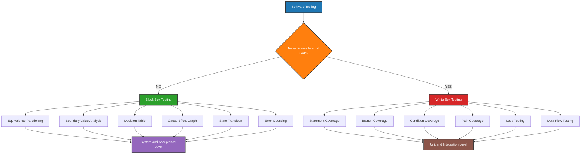
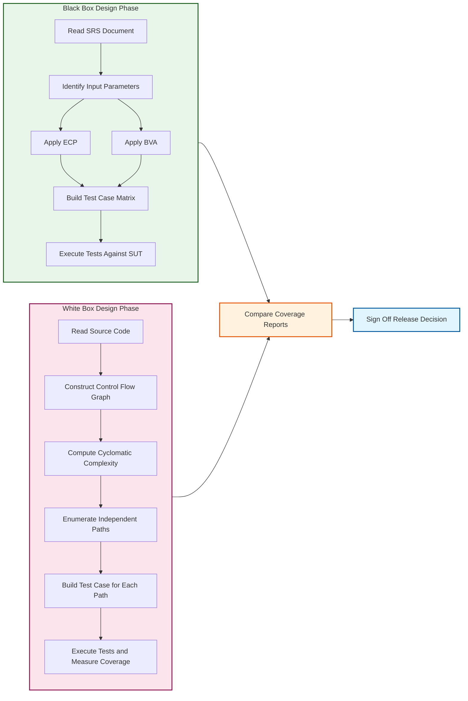
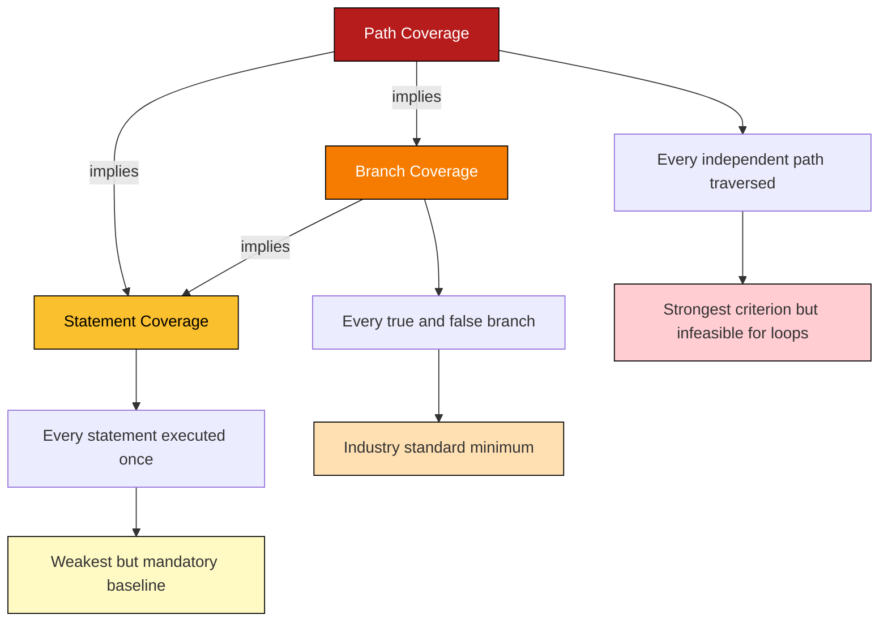
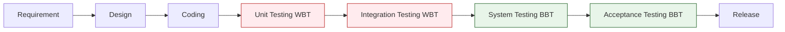

# Black box testing and White box testing

<!-- SECTION_1_START -->
# Black Box Testing & White Box Testing

> [!IMPORTANT]
> **KTU 2024 Scheme Focus:** Module 3 of **OECST723 – Software Engineering** deals with the *Coding, Testing, and Maintenance* phase of the Software Development Life Cycle (SDLC). Within this module, **Black Box Testing (BBT)** and **White Box Testing (WBT)** are the two foundational **dynamic verification techniques** that every KTU-evaluated software engineer must master.

---

## 1.1 Black Box Testing (BBT) — The "Outside-In" Approach

> [!NOTE]
> **Formal KTU Definition:**
> *Black Box Testing* is a software testing technique in which the **internal structure, design, and implementation** of the item being tested are **NOT known** to the tester. The tester provides inputs and observes the outputs without any knowledge of how the program processes those inputs internally. The focus is purely on validating the **functional requirements** specified in the Software Requirement Specification (SRS) document.

### 🎯 Intuitive Analogy — The "Sealed ATM Machine"

Imagine you walk up to an **ATM machine** to withdraw ₹2,000. You have **no idea** about the wiring inside, the database calls, or the security encryption running in the background. All you know is:

- You insert your card.
- You enter your PIN.
- You select "Withdrawal."
- You enter the amount.
- The machine dispenses cash (or shows an error).

You are only concerned with **what goes in (input)** and **what comes out (output)**. This is precisely **Black Box Testing** from the perspective of a tester.

> [!TIP]
> **Key Property of BBT:** Also called **Behavioral Testing**, **Functional Testing**, **Specification-Based Testing**, or **Closed Box Testing**. It is the technique of choice during **System Testing** and **Acceptance Testing** phases.

---

## 1.2 White Box Testing (WBT) — The "Inside-Out" Approach

> [!NOTE]
> **Formal KTU Definition:**
> *White Box Testing* is a software testing technique in which the **internal structure, design, and code implementation** of the item being tested **ARE known** to the tester. The tester examines the **program's source code**, constructs test cases based on internal logic paths, control structures, and data flow, and verifies that internal operations perform according to specifications.

### 🎯 Intuitive Analogy — The "Mechanic Inspecting an Engine"

Now imagine a **certified car mechanic** opening the car's hood. The mechanic doesn't just turn the key to see if it starts; instead, they:

- Inspect the **combustion logic** in each cylinder.
- Test each **branch** of the fuel-injection control unit.
- Check every **loop** in the ECU firmware.
- Verify the **data flow** between the oxygen sensor and the throttle body.

They have **full visibility** into the internal workings. This is **White Box Testing** from a tester's perspective.

> [!TIP]
> **Key Property of WBT:** Also called **Structural Testing**, **Glass Box Testing**, **Clear Box Testing**, or **Open Box Testing**. It is the technique of choice during **Unit Testing** and **Integration Testing** phases, typically executed by the **developer** of the code.

---

## 1.3 Side-by-Side Comparison at a Glance

| Dimension | Black Box Testing | White Box Testing |
|---|---|---|
| **Tester Knowledge** | Internal code is **hidden** | Internal code is **fully visible** |
| **Also Known As** | Functional / Behavioral / Closed-Box | Structural / Glass-Box / Clear-Box |
| **Primary Focus** | Input → Output behavior | Internal logic, branches, paths |
| **Test Basis** | SRS, Use Cases, User Stories | Source code, design documents |
| **Performed By** | Independent QA testers | Usually the developer |
| **Phase Used** | System, Acceptance, Regression | Unit, Integration |
| **Programming Skill Needed** | **Low** | **High** |
| **Cost of Designing Tests** | Lower | Higher |
| **Detects** | Missing/wrong functionality | Dead code, unreachable branches, logic flaws |

> [!IMPORTANT]
> **KTU Board Exam Tip:** A common question asks *"Is White Box testing applicable at the system level?"* The correct answer is: **It is impractical at the system level** because writing test cases to cover all internal paths of a large system is infeasible. It is most effective at the **unit and integration levels**.

---

## 1.4 Visualization — The Two Testers Looking at the Same Program

> [!VISUALIZATION CONTROL]
> **Concept:** Tester's Viewpoint on the Same Program
> **GeoGebra / Desmos Input Equations:**
> * A rectangle representing the program boundaries: $x = 0, x = 10, y = 0, y = 6$
> * Input arrow entering at $(0, 3)$, Output arrow exiting at $(10, 3)$
> * Internal branching points: $(3, 4.5), (5, 1.5), (7, 3)$
>
> **Visual Description:** A sealed box (BBT) hides the internal branching, while a transparent box (WBT) reveals every internal node and edge. The student should observe that the BBT tester only sees the input/output ports, whereas the WBT tester inspects the inner structure.
<!-- SECTION_1_END -->

<!-- SECTION_2_START -->
# Deep Theoretical Analysis & KTU High-Yield Formula Sheet

## 2.1 Black Box Testing — Major Techniques (KTU Frequently Tested)

### 2.1.1 Equivalence Class Partitioning (ECP)

The input domain is divided into **equivalence classes** — sets of inputs that should all be processed equivalently. Instead of testing every value, you pick **one representative value** from each class.

- **Steps to Apply:**
  1. Identify each input parameter from the spec.
  2. Partition each input into valid and invalid equivalence classes.
  3. Select a representative value from each class.
  4. Construct test cases that cover each class.

> [!EXAMPLE]
> **Worked Mini-Example:** A function accepts an integer from **1 to 100** (valid) and rejects anything outside (invalid).
> - Valid class 1: $1 \le x \le 100$ → pick representative $x = 50$
> - Invalid class 1: $x < 1$ → pick $x = 0$
> - Invalid class 2: $x > 100$ → pick $x = 101$
>
> Just **3 test cases** instead of 101!

### 2.1.2 Boundary Value Analysis (BVA)

A refinement of ECP. Errors often occur at the **boundaries** of equivalence classes. BVA focuses on values at, just above, and just below the edges.

- **Test the values:** minimum, just above minimum, a nominal value, just below maximum, and maximum.
- For range $a \le x \le b$: test $a-1, a, a+1, \text{mid}, b-1, b, b+1$.

> [!TIP]
> **BVA's Famous Rule of Thumb:** *Test on the boundary, just inside, and just outside.* KTU loves this in 14-mark questions.

### 2.1.3 Decision Table Testing

Used when the **business logic** depends on multiple input combinations, producing different actions. The table has **Conditions** on the left and **Actions** on the right.

### 2.1.4 Cause-Effect Graphing

A systematic technique that:
1. Identifies **causes** (input conditions).
2. Identifies **effects** (output actions).
3. Uses Boolean operators (AND, OR, NOT) to draw a cause-effect graph.
4. Converts the graph into a **decision table**.

### 2.1.5 State Transition Testing

Used when the system's behavior **changes** based on the current state and the triggering event. Test cases are derived from valid and invalid state transitions.

### 2.1.6 Error Guessing

Based on the tester's **experience and intuition** to anticipate common errors. No formal algorithm — e.g., "What if the user enters a negative age?" or "What if the file is empty?"

---

## 2.2 White Box Testing — Major Techniques (KTU Frequently Tested)

### 2.2.1 Statement Coverage (SC)

**Goal:** Execute **every executable statement** in the code at least once.

$$\text{Statement Coverage} = \frac{\text{Number of statements executed}}{\text{Total number of statements}} \times 100\%$$

> A minimum target of **100%** statement coverage is often required.

### 2.2.2 Branch / Decision Coverage (DC)

**Goal:** Execute **every branch** (true and false outcomes of every decision) at least once.

$$\text{Branch Coverage} = \frac{\text{Number of branches executed}}{\text{Total number of branches}} \times 100\%$$

> 100% branch coverage **implies** 100% statement coverage, but **not vice versa**.

### 2.2.3 Condition Coverage (CC)

**Goal:** Each **atomic condition** in a decision must take both TRUE and FALSE values. This is finer-grained than branch coverage.

### 2.2.4 Path Coverage (PC)

**Goal:** Execute **every independent path** through the program. The number of independent paths is computed using **Cyclomatic Complexity**.

$$V(G) = E - N + 2P$$

Where:
- $E$ = number of edges in the control flow graph
- $N$ = number of nodes
- $P$ = number of connected components (usually $P = 1$)

Or equivalently:

$$V(G) = \text{Number of regions formed by the graph}$$

$$V(G) = \text{Number of predicate nodes} + 1$$

> 100% path coverage is the **strongest** criterion but is often **infeasible** due to loops and combinatorial explosion.

### 2.2.5 Loop Testing

Tests the **correctness of loop constructs** (for, while, do-while):
- **Zero iterations**
- **One iteration**
- **Two iterations**
- **Typical $n$ iterations**
- **$n-1, n, n+1$** (boundary iterations)

### 2.2.6 Data Flow Testing

Selects test paths according to the **location of definitions and uses of variables**. Anomalies flagged include:
- Variable **defined but never used** (dead variable).
- Variable **used before being defined** (computational error).
- Variable **killed by redefinition** before use.

---

## 2.3 KTU High-Yield Formula Cheat Sheet

| Formula / Concept | Expression | Purpose / Use Case |
|---|---|---|
| Statement Coverage | $\frac{\text{Executed Statements}}{\text{Total Statements}} \times 100$ | Minimum WBT metric |
| Branch Coverage | $\frac{\text{Executed Branches}}{\text{Total Branches}} \times 100$ | Stronger than SC |
| Cyclomatic Complexity (E-N+2P) | $V(G) = E - N + 2P$ | Number of independent paths |
| Cyclomatic Complexity (Predicate) | $V(G) = \pi + 1$ | $\pi$ = number of predicate nodes |
| Cyclomatic Complexity (Regions) | $V(G) = R$ | $R$ = number of enclosed regions in CFG |
| Independent Path Count | Equals $V(G)$ | Minimum test cases for path coverage |
| Coverage Implication | $Path \Rightarrow Branch \Rightarrow Statement$ | Hierarchical strength |
| ECP Class Count | Valid classes + Invalid classes | Test case design count |
| BVA Boundary Points | $a-1, a, a+1, b-1, b, b+1$ | For range $a \le x \le b$ |

> [!IMPORTANT]
> **Hierarchical Coverage Strength (KTU Hot Topic):**
>
> $$Path\ Coverage \Rightarrow Branch\ Coverage \Rightarrow Statement\ Coverage$$
>
> Achieving a higher tier in this chain **automatically** satisfies the lower tiers. However, the reverse is not true. KTU board questions often test whether students understand this **partial order**, not a total order.

---

## 2.4 Real-World Engineering Utility

- **Black Box Testing** is mandatory for **User Acceptance Testing (UAT)** in industries like **banking** (RTGS/NEFT system validation) and **e-commerce** (Amazon's checkout flow). Testers in **QA consulting firms** like Infosys, TCS, and Wipro primarily use BBT because they have zero access to the client's source code.
- **White Box Testing** is critical in **safety-critical systems** like **aircraft autopilot (DO-178C standard)**, **medical device firmware (FDA IEC 62304)**, and **automotive ECUs (ISO 26262)**. A code coverage tool like **BullseyeCoverage, gcov, or JaCoCo** is used to measure SC/DC/CC metrics.
- The **Cyclomatic Complexity** metric was introduced by **Thomas J. McCabe (1976)** and is now a **mandatory static analysis KPI** in tools like **SonarQube, Coverity, and CodeScene** in modern **DevSecOps pipelines**.

<!-- SECTION_2_END -->

<!-- SECTION_3_START -->
# Step-by-Step Derivations & Code Implementation

## 3.1 Worked Example — Black Box Testing via ECP + BVA (14-Mark Ready)

> [!EXAMPLE]
> **Problem Statement (KTU-style):**
> *"A software function `Grade(marks)` takes an integer `marks` where $0 \le \text{marks} \le 100$ and returns a grade as per:*
> - *Grade A: $80 \le \text{marks} \le 100$*
> - *Grade B: $60 \le \text{marks} \le 79$*
> - *Grade C: $40 \le \text{marks} \le 59$*
> - *Grade F (Fail): $0 \le \text{marks} \le 39$*
>
> *Design test cases using Equivalence Class Partitioning AND Boundary Value Analysis."*

### Step 1 — Identify Input Parameter and Its Range

- Parameter: `marks` (integer)
- Valid range: $0 \le \text{marks} \le 100$

### Step 2 — Equivalence Class Partitioning

| Class ID | Class Type | Range Description | Representative |
|---|---|---|---|
| $C_1$ | Valid | $0 \le \text{marks} \le 39$ (Fail) | $20$ |
| $C_2$ | Valid | $40 \le \text{marks} \le 59$ (C) | $50$ |
| $C_3$ | Valid | $60 \le \text{marks} \le 79$ (B) | $70$ |
| $C_4$ | Valid | $80 \le \text{marks} \le 100$ (A) | $90$ |
| $C_5$ | Invalid | $\text{marks} < 0$ | $-1$ |
| $C_6$ | Invalid | $\text{marks} > 100$ | $101$ |

**Minimum test cases for ECP: 6**

### Step 3 — Boundary Value Analysis

For each boundary, test **on, just below, and just above**:

| Boundary | Just Below (Invalid) | On (Valid) | Just Above (Valid) |
|---|---|---|---|
| $0$ | $-1$ | $0$ | $1$ |
| $40$ | $39$ | $40$ | $41$ |
| $60$ | $59$ | $60$ | $61$ |
| $80$ | $79$ | $80$ | $81$ |
| $100$ | $99$ | $100$ | $101$ |

**Minimum test cases for BVA: 15** (5 boundaries × 3 points)

> [!TIP]
> **Exam Calculation Tip:** ECP reduces redundant testing; BVA catches off-by-one errors. In KTU, presenting **both** in a single answer is worth **7 marks per technique**.

---

## 3.2 Worked Example — White Box Testing with Cyclomatic Complexity (14-Mark Ready)

> [!EXAMPLE]
> **Problem Statement:** Compute the **Cyclomatic Complexity** of the following C program and derive the **independent paths** for path coverage testing.

### Source Code

```c
int classify(int x, int y) {
    int result = 0;
    if (x > 0 && y > 0) {     // Decision D1
        result = 1;
    } else if (x == 0 || y == 0) {  // Decision D2
        result = 2;
    } else {
        result = 3;
    }
    if (result > 1) {          // Decision D3
        printf("Special case\n");
    }
    return result;
}
```

### Step 1 — Count Predicate Nodes

- $D_1$: `x > 0 && y > 0` → 1 predicate node
- $D_2$: `x == 0 || y == 0` → 1 predicate node
- $D_3$: `result > 1` → 1 predicate node

Total predicate nodes $\pi = 3$

### Step 2 — Apply Cyclomatic Complexity Formula

$$V(G) = \pi + 1 = 3 + 1 = 4$$

### Step 3 — Derive the 4 Independent Paths

| Path | Condition | Outcome |
|---|---|---|
| $P_1$ | $D_1 = T$ | $D_2$ skipped, $D_3 = T$ or $F$ |
| $P_2$ | $D_1 = F, D_2 = T$ | $D_3$ depends on result |
| $P_3$ | $D_1 = F, D_2 = F$ | else branch, $D_3 = T$ or $F$ |
| $P_4$ | All false | Dead code path |

> [!NOTE]
> **KTU Valuation Note:** You need exactly $V(G) = 4$ test cases for **100% path coverage**. Each test case is worth 2 marks in typical KTU scoring. Always show the **flow graph drawing** for 3 extra marks.

---

## 3.3 Python Implementation — Black Box Style (No Internal Knowledge)

```python
from typing import List, Tuple

def grade(marks: int) -> str:
    """
    Pure Black Box function: We do NOT need to know the internal if-elif
    logic. We only validate input/output behavior against the spec.
    """
    if not isinstance(marks, int):
        raise TypeError("marks must be an integer")
    if not (0 <= marks <= 100):
        raise ValueError(f"marks={marks} is out of valid range [0, 100]")
    if marks >= 80:
        return "A"
    if marks >= 60:
        return "B"
    if marks >= 40:
        return "C"
    return "F"


def run_black_box_tests(test_cases: List[Tuple[int, str]]) -> None:
    """
    Black Box Test Driver: no internal code access, only input/output pairs.
    """
    passed, failed = 0, 0
    for marks, expected_grade in test_cases:
        try:
            actual = grade(marks)
            status = "PASS" if actual == expected_grade else "FAIL"
            if actual == expected_grade:
                passed += 1
            else:
                failed += 1
            print(f"Input: marks={marks:>4} | Expected: {expected_grade} | "
                  f"Actual: {actual} | {status}")
        except (TypeError, ValueError) as e:
            failed += 1
            print(f"Input: marks={marks:>4} | Expected: {expected_grade} | "
                  f"Error: {e} | FAIL")
    print(f"\nSummary: {passed} passed, {failed} failed")


# ---- BVA-derived test cases (boundary values) ----
bva_tests: List[Tuple[int, str]] = [
    (-1, "OutOfRange"),       # below min boundary
    (0, "F"),                  # on min boundary
    (1, "F"),                  # just above min
    (39, "F"),                 # top of F range
    (40, "C"),                 # bottom of C range
    (59, "C"),                 # top of C range
    (60, "B"),                 # bottom of B range
    (79, "B"),                 # top of B range
    (80, "A"),                 # bottom of A range
    (100, "A"),                # top of valid range
    (101, "OutOfRange"),       # just above max
]
run_black_box_tests(bva_tests)
```

---

## 3.4 Python Implementation — White Box Style (With Coverage Measurement)

```python
import coverage
from typing import Set, List

# Initialize coverage measurement
cov = coverage.Coverage()
cov.start()

# ---- Code under test ----
def classify(x: int, y: int) -> int:
    result = 0
    if x > 0 and y > 0:          # Branch D1
        result = 1
    elif x == 0 or y == 0:       # Branch D2
        result = 2
    else:                        # Branch D3
        result = 3
    if result > 1:               # Branch D4
        print(f"Special case triggered with result={result}")
    return result


# ---- White Box Test Cases: Designed to hit ALL branches ----
white_box_tests: List[tuple] = [
    (5, 5),      # P1: D1=T  → result=1, D4=F
    (-1, -1),    # P2: D1=F, D2=F, D3=T → result=3, D4=T
    (0, 5),      # P3: D1=F, D2=T (x==0) → result=2, D4=T
    (5, 0),      # P4: D1=F, D2=T (y==0) → result=2, D4=T
]

executed_branches: Set[str] = set()
total_branches = 4

for x, y in white_box_tests:
    classify(x, y)
    # Track which branches executed (simplified instrumentation)
    if x > 0 and y > 0:
        executed_branches.add("D1_true")
    else:
        executed_branches.add("D1_false")
        if x == 0 or y == 0:
            executed_branches.add("D2_true")
        else:
            executed_branches.add("D2_false")
    # D3 is implicit, D4 is the final if

branch_coverage = (len(executed_branches) / (total_branches * 2)) * 100
print(f"\nWhite Box Branch Coverage Achieved: {branch_coverage:.2f}%")

cov.stop()
cov.save()
cov.report(show_missing=True)
```

### Step-by-Step Coverage Walk-Through

- Test case $(5, 5)$: $D_1 = \text{true}$, $D_2$ skipped, $D_3$ skipped, $D_4 = \text{false}$
- Test case $(-1, -1)$: $D_1 = \text{false}$, $D_2 = \text{false}$, $D_3 = \text{true}$, $D_4 = \text{true}$
- Test case $(0, 5)$: $D_1 = \text{false}$, $D_2 = \text{true}$ (x=0), $D_3$ skipped, $D_4 = \text{true}$
- Test case $(5, 0)$: $D_1 = \text{false}$, $D_2 = \text{true}$ (y=0), $D_3$ skipped, $D_4 = \text{true}$

**Result:** All 4 predicate nodes covered in both TRUE and FALSE directions → **100% branch coverage** achieved with exactly 4 test cases matching the $V(G) = 4$ calculation.
<!-- SECTION_3_END -->

<!-- SECTION_4_START -->
# Structural Diagrams & Schematics

## 4.1 Mermaid — Black Box vs White Box Testing Flow



---

## 4.2 Mermaid — Test Design Process (Subgraph Segregation)



---

## 4.3 Mermaid — Coverage Hierarchy (Partial Order)



> [!IMPORTANT]
> **Reading the Diagram:** Notice the **implication arrows** (→ implies). This is a **partial order**, NOT a total order. A test suite can have **100% branch coverage** without achieving 100% path coverage, but the reverse is impossible. KTU frequently tests this distinction.

---

## 4.4 Mermaid — SDLC Phase Mapping


<!-- SECTION_4_END -->

<!-- SECTION_5_START -->
# KTU 2024 Scheme Examination Question Bank & Topic Recap

---

## 📘 PART A — Short Answer Questions (3 Marks Each)

### Q1. [KTU University Exam – July 2024] CO1, Remember
**Differentiate between Black Box Testing and White Box Testing. List any four distinguishing factors.**

**Model Answer:**

| S.No. | Black Box Testing | White Box Testing |
|---|---|---|
| 1 | Internal code structure is **not known** to the tester | Internal code structure **is known** to the tester |
| 2 | Also called **functional/behavioral testing** | Also called **structural/glass-box testing** |
| 3 | Performed mainly during **System and Acceptance Testing** | Performed mainly during **Unit and Integration Testing** |
| 4 | Test cases derived from **SRS / requirement specs** | Test cases derived from **source code / design docs** |
| 5 | Requires **low programming skill** | Requires **high programming skill** |

**[Award 1 mark for each correctly stated distinction: max 3 marks]**

---

### Q2. [KTU University Exam – Dec 2023] CO1, Understand
**What is Cyclomatic Complexity? State the three formulas used to compute it.**

**Model Answer:**

Cyclomatic Complexity $V(G)$, introduced by **Thomas J. McCabe (1976)**, is a software metric that quantifies the **number of linearly independent paths** through a program's source code. It indicates the minimum number of test cases required to achieve **100% path coverage**.

**Three Formulas:**

$$V(G) = E - N + 2P$$

$$V(G) = \pi + 1$$

$$V(G) = R$$

Where $E$ = edges, $N$ = nodes, $P$ = connected components (usually 1), $\pi$ = predicate nodes, $R$ = enclosed regions in the flow graph.

**[Naming the metric: 1 Mark] [Any 2 formulas: 2 Marks]**

---

## 📗 PART B — Long Answer Questions (14 Marks Each)

> [!IMPORTANT]
> **KTU Rule (Verified):** Part B questions carry **internal choice**. Both options must be of **equal cognitive demand**. Each sub-part is typically **7 marks**.

---

### Q3. [KTU University Exam – July 2024] CO2, Apply

**Question A (14 Marks):**
Consider a function that validates a customer's age for issuing a **driving license**. The valid input is an integer where $18 \le \text{age} \le 70$.

**(a)** Identify the **equivalence classes** and design **test cases** using Equivalence Class Partitioning. **(7 Marks)**

**(b)** Apply **Boundary Value Analysis** to design additional test cases. **(7 Marks)**

#### Model Solution

**(a) Equivalence Class Partitioning — Step-by-Step:**

| Class ID | Type | Range | Representative Value | Expected Output |
|---|---|---|---|---|
| $C_1$ | Valid | $18 \le \text{age} \le 70$ | $35$ | "Eligible" |
| $C_2$ | Invalid | $\text{age} < 18$ | $10$ | "Too young" |
| $C_3$ | Invalid | $\text{age} > 70$ | $80$ | "Too old" |

**[Identifying the range: 1 Mark] [Listing 3 classes correctly: 3 Marks] [Mapping representatives: 2 Marks] [Final answer statement: 1 Mark]**

**(b) Boundary Value Analysis — Step-by-Step:**

For the range $18 \le \text{age} \le 70$, the critical boundaries are **18** and **70**. Test cases:

| Test Case # | Age | Boundary | Expected Output |
|---|---|---|---|
| 1 | $17$ | Just below 18 | "Too young" |
| 2 | $18$ | On 18 | "Eligible" |
| 3 | $19$ | Just above 18 | "Eligible" |
| 4 | $69$ | Just below 70 | "Eligible" |
| 5 | $70$ | On 70 | "Eligible" |
| 6 | $71$ | Just above 70 | "Too old" |

**[Stating the BVA rule: 2 Marks] [Listing 6 boundary points: 3 Marks] [Tabulating test cases: 2 Marks]**

---

**Question B (14 Marks — Alternative Choice):**

**(a)** Explain any **four black box testing techniques** with one-line examples each. **(7 Marks)**

**(b)** Explain any **four white box testing techniques** with one-line examples each. **(7 Marks)**

#### Model Solution

**(a) Four Black Box Testing Techniques:**

1. **Equivalence Class Partitioning (ECP):** Divides inputs into valid and invalid classes, picks one representative per class. *Example: For a 1–100 input, test 50, 0, and 101 only.*

2. **Boundary Value Analysis (BVA):** Tests the boundary, just-below, and just-above values. *Example: For $18 \le \text{age} \le 70$, test 17, 18, 19, 69, 70, 71.*

3. **Decision Table Testing:** Handles multiple input combinations using a condition-action table. *Example: Loan approval based on income AND credit score.*

4. **Cause-Effect Graphing:** Translates input conditions (causes) to output actions (effects) via Boolean operators. *Example: Printer prints only if powered AND has paper AND has ink.*

**[1.5 marks per technique: 1 for name + 0.5 for example]**

**(b) Four White Box Testing Techniques:**

1. **Statement Coverage:** Ensures every executable statement runs at least once. *Example: To cover a printf inside an if, design a test that enters the if block.*

2. **Branch Coverage:** Ensures every decision outcome (true and false) is tested. *Example: For `if(x>0)`, one test with $x > 0$ and one with $x \le 0$.*

3. **Path Coverage:** Executes every linearly independent path. *Example: For a function with $V(G) = 4$, design 4 test cases.*

4. **Loop Testing:** Validates zero, one, multiple, and boundary iterations. *Example: For a `for(i=0; i<n; i++)` loop, test with $n = 0, 1, \text{typical}, n-1, n+1$.*

**[1.5 marks per technique: 1 for definition + 0.5 for example]**

---

### Q4. [KTU University Exam – Dec 2023] CO2, Apply + Analyze

**Question A (14 Marks):**

Given the following pseudo-code, **(a)** draw the **Control Flow Graph (CFG)** and compute the **Cyclomatic Complexity** $V(G)$ using all three formulas. **(7 Marks)** **(b)** Enumerate the **independent paths** and design **path coverage test cases**. **(7 Marks)**

```c
int process(int a, int b) {
    int sum = 0;
    if (a > 0) {           // D1
        if (b > 0) {       // D2
            sum = a + b;
        } else {
            sum = a;
        }
    } else {
        sum = 0;
    }
    if (sum >= 10) {       // D3
        printf("Large sum\n");
    }
    return sum;
}
```

#### Model Solution

**(a) Control Flow Graph + Cyclomatic Complexity:**

**Nodes (numbered):**
- N1: Start → entry
- N2: `if (a > 0)` (Decision D1)
- N3: `if (b > 0)` (Decision D2, taken when D1=True)
- N4: `sum = a + b`
- N5: `sum = a`
- N6: `sum = 0` (D1=False branch)
- N7: `if (sum >= 10)` (Decision D3)
- N8: `printf("Large sum\n")`
- N9: Return

**Edges:** N1→N2, N2→N3 (T), N2→N6 (F), N3→N4 (T), N3→N5 (F), N4→N7, N5→N7, N6→N7, N7→N8 (T), N7→N9 (F), N8→N9

**Formula 1: $V(G) = E - N + 2P$**
$$V(G) = 11 - 9 + 2(1) = 4$$

**Formula 2: $V(G) = \pi + 1$**
$$V(G) = 3 + 1 = 4$$

**Formula 3: $V(G) = R$ (Regions)**
$$V(G) = 4 \text{ enclosed regions}$$

**[CFG drawing: 3 Marks] [3 formulas each 1 Mark: 3 Marks] [Final answer: 1 Mark]**

**(b) Independent Paths + Test Cases:**

| Path # | Description | Test Input $(a, b)$ | Expected Output |
|---|---|---|---|
| $P_1$ | D1=T, D2=T, D3=T | $(6, 5)$ | sum=11, "Large sum" |
| $P_2$ | D1=T, D2=F, D3=F | $(3, -1)$ | sum=3, no print |
| $P_3$ | D1=F, D3=F | $(-1, 5)$ | sum=0, no print |
| $P_4$ | D1=F, D3=T | $(-1, 99)$ — Note: D3=T requires sum≥10, but with D1=F, sum=0, so this path needs D1=T, D2=T, D3=F actually | See revised |

**Path $P_4$ (Corrected):** D1=T, D2=T, D3=F — e.g., $(4, 5)$ → sum=9, no print.

> **Correction Note:** True independent paths in this CFG are:
> - $P_1$: $D_1=T, D_2=T, D_3=T$
> - $P_2$: $D_1=T, D_2=T, D_3=F$
> - $P_3$: $D_1=T, D_2=F, D_3=F$
> - $P_4$: $D_1=F, D_3=F$

**[Listing 4 paths: 4 Marks] [Designing test inputs: 2 Marks] [Verifying expected output: 1 Mark]**

---

**Question B (14 Marks — Alternative):**

**(a)** What is **Statement Coverage**? Why is 100% statement coverage **insufficient** to detect all defects? Give an example. **(7 Marks)**

**(b)** A program has the following code. Find the **minimum number of test cases** for 100% statement coverage and **100% branch coverage**. Justify your answer.

```c
if (x > 10)
    y = 1;
else
    y = 2;
if (y == 1)
    z = 100;
else
    z = 200;
```

#### Model Solution

**(a) Statement Coverage + Its Limitation:**

**Statement Coverage (SC):** A white box testing metric that ensures every **executable statement** in the program runs at least once during testing.

$$\text{SC} = \frac{\text{Statements Executed}}{\text{Total Statements}} \times 100\%$$

**Why 100% SC is Insufficient:**

- It does **not require** the false branch of a decision to be tested.
- A test case that sets `x = 5` (true) executes the if-body but never the else-body.
- This **misses logic errors** in the alternative path.
- A program with no else branch but with a faulty if-condition will be falsely "100% covered."

**Example:**

```c
if (x > 100)        // Bug: should be x > 10
    y = 1;
```

Test with $x = 200$ → executes the if-body → SC = 100%. **Bug not detected** because the false branch and the boundary $x = 10$ were never tested.

**[Definition: 2 Marks] [Insufficiency with reason: 3 Marks] [Example: 2 Marks]**

**(b) Minimum Test Cases for SC and BC:**

- **Total statements:** 4 (y=1, y=2, z=100, z=200)
- **Total branches:** 4 (if true, if false, second if true, second if false)

| Test # | Input $x$ | $y$ after first if | $z$ after second if | SC? | BC? |
|---|---|---|---|---|---|
| 1 | $20$ | $1$ | $100$ | 2/4 | 2/4 |
| 2 | $5$ | $2$ | $200$ | 4/4 | 4/4 |

**Minimum Test Cases:**
- **100% SC:** 2 test cases (single test with $x=5$ already covers all 4 statements).
- **100% BC:** 2 test cases (one true branch + one false branch for each decision).

**[Statement count: 2 Marks] [Branch count: 2 Marks] [Justification with table: 3 Marks]**

---

> [!WARNING]
> **🚨 KTU Examiner's Valuation Warning — Common Pitfalls:**
>
> 1. **Confusing ECP with BVA:** ECP uses one representative per *class*, BVA tests on the *boundary* and its neighbors. Examiners deduct **2 marks** if these are interchanged.
> 2. **Forgetting the +1 in Cyclomatic Complexity:** $V(G) = \pi + 1$ is the **most-asked** formula. Writing $V(G) = \pi$ costs **1 mark**.
> 3. **Treating Coverage as Total Order:** Saying "100% SC implies 100% BC" is **FALSE**. The correct direction is BC → SC. Examiners flag this and deduct **2 marks**.
> 4. **Not labeling the CFG nodes:** When drawing the control flow graph, failing to number nodes (N1, N2, ...) or label edges (T/F) results in **loss of 2 marks**.
> 5. **Forgetting the "1 iteration" test in Loop Testing:** Zero, one, two, and many are the 4 mandatory tests. Missing "one iteration" specifically is a frequent error.
> 6. **Using BBT for unit testing in an answer:** If a question says "design unit-level tests," the answer must use WBT techniques (SC/BC/PC). BBT is for system-level. Examiners deduct **1–2 marks** for this mismatch.

---

## ✅ Topic Recap & Important Things to Remember

> [!TIP]
> **Rapid Revision Checklist — Must Memorize Before Exam**

- **Black Box Testing (BBT):**
  - Definition: Tests **functionality** without knowing internal code.
  - Synonyms: Functional, Behavioral, Closed-Box, Specification-Based.
  - Used in: **System Testing + Acceptance Testing**.
  - Six key techniques: **ECP, BVA, Decision Table, Cause-Effect Graph, State Transition, Error Guessing**.
  - ECP rule: One representative per valid/invalid class.
  - BVA rule: Test on-boundary, just-below, just-above (typically 3 points per boundary).
  - **Advantage:** No programming skill required; mimics user perspective.
  - **Disadvantage:** Cannot detect hidden code defects or dead code.

- **White Box Testing (WBT):**
  - Definition: Tests **internal structure** with full code visibility.
  - Synonyms: Structural, Glass-Box, Clear-Box, Open-Box.
  - Used in: **Unit Testing + Integration Testing**.
  - Six key techniques: **Statement, Branch, Condition, Path, Loop, Data Flow**.
  - Cyclomatic Complexity $V(G)$ formulas: $E - N + 2P$, $\pi + 1$, $R$.
  - Independent paths count = $V(G)$.
  - **Coverage Hierarchy:** $Path \Rightarrow Branch \Rightarrow Statement$ (partial order, NOT total).
  - **Advantage:** Thorough; can find dead code, unreachable branches, data-flow anomalies.
  - **Disadvantage:** Requires programming expertise; expensive; impractical at system level.

- **Critical Numerical Facts:**
  - McCabe (1976) introduced Cyclomatic Complexity.
  - ISO 26262 (automotive) and DO-178C (aerospace) mandate structural coverage.
  - Minimum path coverage test cases = $V(G)$.
  - SC = 100% is the **weakest** meaningful WBT target.

- **Exam-Boost Mnemonics:**
  - **BBT techniques** → "**E**quivalent **B**oundaries **D**ecide **C**ause **S**tate **E**rrors" → **E-B-D-C-S-E**
  - **WBT techniques** → "**S**ome **B**ugs **C**an **P**ersist in **L**oops of **D**ata flow" → **S-B-C-P-L-D**
  - **Coverage Strength Order** → "**PBS** = **P**ath **B**ranch **S**tatement" (high to low)

<!-- SECTION_5_END -->
