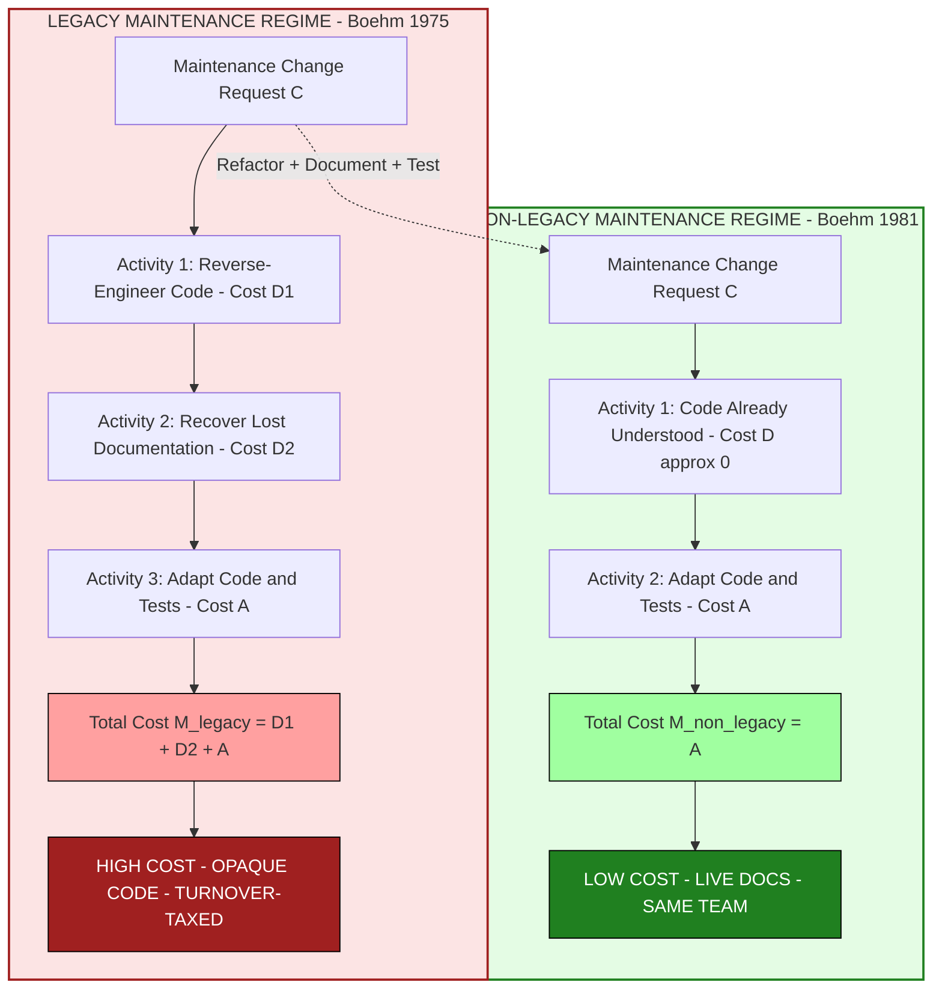
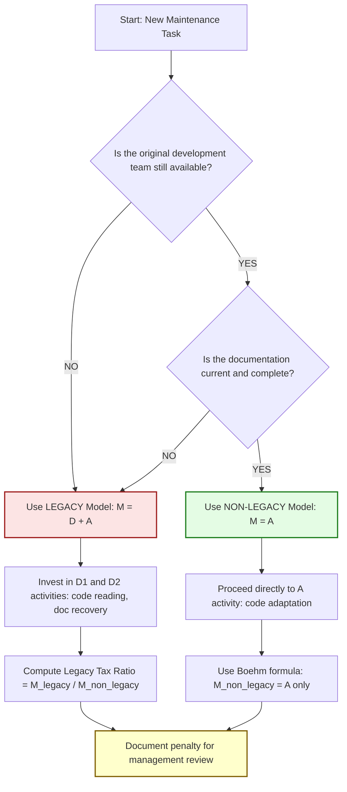
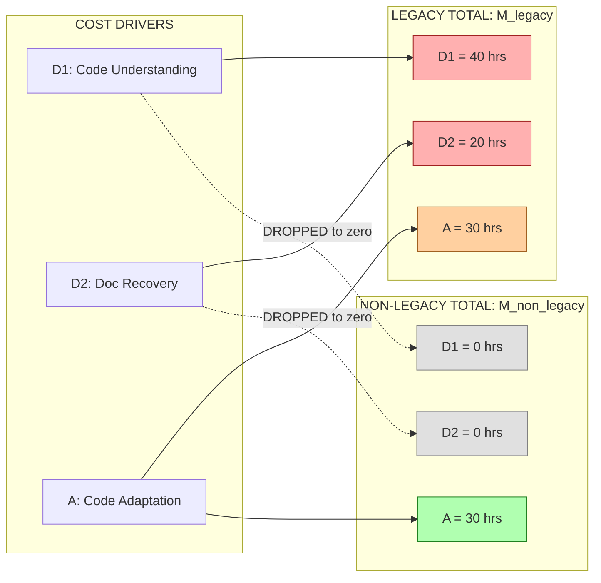
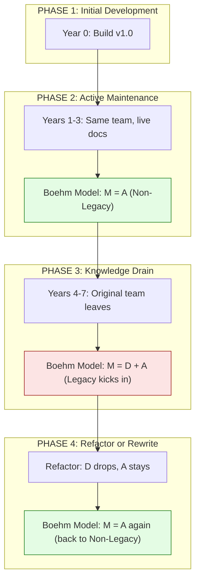

# Boehm’s maintenance models (both legacy and non-legacy)

<!-- SECTION_1_START -->
# Boehm's Maintenance Models — Core Definition & Intuitive Overview

## 1.1 Formal Academic Definition (KTU 2024 Syllabus Terminology)

**Barry W. Boehm's Maintenance Models** (proposed in his 1975 IEEE paper *The High Cost of Software* and refined in his landmark 1981 text *Software Engineering Economics*) are two cost-estimation frameworks that quantify the **total cost of evolving a software system** after initial delivery. They separate maintenance expenditure into two distinct cost drivers:

1. The **understanding/development cost** (the cost incurred to comprehend the existing code base before a change can be designed).
2. The **adaptation cost** (the cost of actually making the code, design, or documentation change).

> [!IMPORTANT]
> **Syllabus Highlight (KTU OECST723 — Module 3)**
> Boehm's framework is essential for any *quantitative* discussion of software maintenance. The two models — *Legacy* and *Non-Legacy* — give the engineer a way to **quantify the economic penalty of poor documentation, personnel turnover, and architectural decay** versus the *savings* achieved by clean, modern, development-friendly code bases.

### 1.1.1 The Two Models at a Glance

| Aspect | **Legacy Model** | **Non-Legacy Model** |
|---|---|---|
| **Mathematical Form** | $M = D + A$ | $M = A$ |
| **Code Familiarity** | Low (alien codebase) | High (continuously evolved) |
| **Documentation Quality** | Often missing or stale | Up-to-date and integral |
| **Personnel Continuity** | High turnover | Same developers maintain |
| **Understanding Cost $D$** | $D \gg 0$ (dominant) | $D \approx 0$ |
| **Industry Use Case** | Bank mainframes, COBOL, ERP | Modern Agile/DevOps codebases |

---

## 1.2 Conceptual Analogy — The "Used Car vs. New Car" Intuition

Imagine you are a **mechanic** asked to fix two cars:

- **Car A (Legacy):** A 1985 Maruti 800 that has been repaired by 12 different mechanics over 35 years. No service history, missing manuals, parts are non-standard, and the previous mechanic used duct tape for "reinforcement." Just to figure out *where the oil leak is*, you need **3 days of investigation** (cost = $D$). Then the actual repair takes 1 day (cost = $A$). Total = **$D + A$**.

- **Car B (Non-Legacy):** A brand-new 2024 Hyundai Creta, still under warranty with the original manufacturer, complete service history, OEM schematics, and the same mechanic who built the engine in the factory. No investigation needed ($D \approx 0$). The repair takes 1 day (cost = $A$). Total = **$A$**.

The **Legacy model** says: *"old code = high fix cost because understanding it is half the battle."*  
The **Non-Legacy model** says: *"continuously-evolved code = low fix cost because the team already understands it."*

> [!NOTE]
> **Key Insight:** Boehm's models are not about *line counts* or *function points* — they are about **cognitive overhead**. A 10,000-line legacy module can cost more to maintain than a 100,000-line modern one if the legacy module is opaque.

---

## 1.3 The Three Cost Drivers (Boehm's Decomposition)

Every maintenance effort, in Boehm's view, is composed of three activities, which together produce the variables $D$ and $A$:

| Symbol | Activity | Legacy Magnitude | Non-Legacy Magnitude |
|---|---|---|---|
| $D_1$ | **Understanding** the existing code | **Very High** | Low |
| $D_2$ | **Acquiring** documentation / specs | **Very High** | Low |
| $A$ | **Adapting** the code, design, tests | Moderate | Moderate |
| $D$ (composite) | $= D_1 + D_2$ | Dominant | $\approx 0$ |

Hence: **$M_{legacy} = D_1 + D_2 + A$** and **$M_{non\text{-}legacy} = A$**.

> [!VISUALIZATION CONTROL]
> **Concept:** Cost-Composition Bar Chart for Boehm's Two Models
> **GeoGebra / Desmos Input Equations:**
> * For Legacy model: plot points $(1,\,D_1)$, $(2,\,D_2)$, $(3,\,A)$ and a sum line $y=D_1+D_2+A$
> * For Non-Legacy model: plot points $(1,\,0)$, $(2,\,0)$, $(3,\,A)$ and a sum line $y=A$
> **Visual Description:** Students should observe that in the **Legacy** bar, two tall columns ($D_1$, $D_2$) precede a short $A$ column, while in the **Non-Legacy** bar, the $D$ columns vanish and only $A$ remains. The total height of the Legacy bar is dramatically larger.

---

## 1.4 Why These Models Matter in Engineering Practice

> [!IMPORTANT]
> **The 80/20 Rule of Maintenance (Boehm, 1975):** Roughly **80 % of a software system's lifetime cost** is spent on **maintenance**, not original development. Therefore, the *choice* of maintenance model is not academic — it directly determines whether a project is profitable or a money pit.

In **production engineering** today:
- **Legacy Model** scenarios: Replatforming Y2K-era COBOL, fixing FORTRAN scientific code, maintaining government tax systems.
- **Non-Legacy Model** scenarios: SaaS products with continuous integration, open-source projects with active maintainers, microservices with living documentation.

The cost gap between the two models is the **quantitative justification** for refactoring, documentation, automated testing, and pair programming — all of which push a system from the *Legacy* curve toward the *Non-Legacy* curve.
<!-- SECTION_1_END -->

<!-- SECTION_2_START -->
# Deep Theoretical Analysis & KTU High-Yield Formula Sheet

## 2.1 The Theoretical Underpinnings of Boehm's Models

Boehm derived his models from empirical observation of large-scale defence and aerospace projects in the 1960s and 1970s. He identified that maintenance cost grows **non-linearly** with system age and personnel turnover. The two models are built on a single underlying axiom:

> **Axiom (Boehm, 1975):** *The total cost of any maintenance activity is the sum of the cost to understand the program and the cost to modify it.*

From this axiom, two regimes emerge:

### 2.1.1 Regime 1 — Legacy Code (Closed-System View)

A legacy system is one where:
- The original development team has **disbanded**.
- Design rationale is **recoverable only by reverse engineering**.
- Test artifacts are **stale or absent**.
- Domain knowledge is **institutional, not encoded** (i.e., it lives in retired employees' heads).

In this regime, the engineer must **first build a mental model** of the code before a single line can be changed. This pre-change cost is $D$. The change itself is $A$. So:

$$
\boxed{M_{\text{legacy}} = D + A}
$$

### 2.1.2 Regime 2 — Non-Legacy Code (Open-Evolution View)

A non-legacy system is one where:
- Maintenance is **a planned continuation of development**.
- The same team (or well-briefed successors) owns both phases.
- Code is **continuously refactored, tested, and documented**.
- Build, test, and deployment are **automated**.

In this regime, $D \to 0$ because understanding is *already embedded* in the team's working memory. The maintenance cost collapses to the actual change cost:

$$
\boxed{M_{\text{non-legacy}} = A}
$$

> [!NOTE]
> **Why $D \to 0$?** Boehm's deeper insight is that *understanding is a sunk cost in non-legacy systems*. The same engineers who wrote the code are the ones modifying it — there is no "ramp-up tax." In legacy systems, the ramp-up tax ($D$) often **exceeds** the actual change cost ($A$).

---

## 2.2 KTU High-Yield Formula Sheet

> [!IMPORTANT]
> **Master these equations for the KTU board exam. Every numerical problem on Boehm's models will be a direct plug-in to one of these formulas.**

| # | Formula | Meaning | Variables | Units | KTU Exam Tip |
|---|---|---|---|---|---|
| 1 | $M_{\text{legacy}} = D + A$ | Total maintenance cost for legacy code | $M$: total cost, $D$: understanding cost, $A$: adaptation cost | Person-months or $₹$ | Most common direct question |
| 2 | $M_{\text{non-legacy}} = A$ | Total maintenance cost for modern code | $M$: total cost, $A$: adaptation cost | Person-months or $₹$ | Ask: *"What is the maintenance cost when $D = 0$?"* |
| 3 | $D = D_1 + D_2$ | Decomposed understanding cost | $D_1$: code understanding, $D_2$: documentation acquisition | Person-months | Use when $D$ has sub-components |
| 4 | $A = \alpha \cdot \text{FP}$ | Adaptation cost (proportional to function points) | $\alpha$: productivity factor, $\text{FP}$: function points | Person-months / FP | Linear scaling assumption |
| 5 | $M_{\text{legacy}} - M_{\text{non-legacy}} = D$ | **Penalty** for legacy maintenance | $D$ | Person-months | The "legacy tax" — common exam hook |
| 6 | $\text{Legacy Tax Ratio} = \dfrac{M_{\text{legacy}}}{M_{\text{non-legacy}}} = 1 + \dfrac{D}{A}$ | Dimensionless penalty factor | Ratio $\geq 1$ | Unitless | Quantifies how much *more* legacy costs |
| 7 | $M = k \cdot \text{ESLOC} \cdot \text{TCF} \cdot \text{ECF}$ | Cocomo-style cost driver (related Boehm model) | $k$: scale, ESLOC: effective source lines, TCF: technical cost factor, ECF: environmental cost factor | Person-months | Sometimes asked to *contrast* with Cocomo |

> **Critical Exam Rule (KTU):** When a problem gives a value for $D$ and $A$ and asks for $M$, **do not** confuse the two models. The default model is *Legacy* (because that's the realistic industrial case). Only switch to *Non-Legacy* if the question explicitly says "well-documented" or "same team continues development."

---

## 2.3 Real-World Engineering Utility

Boehm's models are not just textbook curiosities. They drive several high-stakes decisions in the software industry:

### 2.3.1 Build vs. Buy vs. Rewrite Decisions

If a CIO (Chief Information Officer) must decide whether to **maintain** an aging ERP system, **buy** a new SaaS replacement, or **rewrite** the legacy system, Boehm's models give a quantitative spine:

$$
\text{5-Year TCO} = \sum_{i=1}^{5} M_{\text{legacy}} \quad \text{vs.} \quad \text{SaaS License} \times 5
$$

If the SaaS subscription is cheaper than the cumulative $M_{\text{legacy}}$ over five years, the buy-decision is justified.

### 2.3.2 Refactoring ROI Justification

Suppose a team wants to refactor 10,000 lines of legacy code. The refactor cost is $C_{\text{refactor}}$. The future annual maintenance cost reduction is $D$ (the legacy tax). The payback period is:

$$
\text{Payback} = \frac{C_{\text{refactor}}}{D \cdot (\text{annual maintenance cycles})}
$$

> [!NOTE]
> **Industry application:** Google, Microsoft, and Amazon famously use Boehm-style cost models to justify their internal "tech debt reduction sprints." A 2018 Google study (Sadowski et al.) explicitly cited Boehm's $D$ as the basis for their *Trinity* productivity model.

### 2.3.3 DevOps and Site Reliability Engineering (SRE)

Modern SRE practice — observability, runbooks, chaos engineering, immutable infrastructure — is, in Boehmian terms, an effort to **drive $D$ toward zero** for production systems. A well-monitored microservice has a near-zero $D$ (any engineer can understand its state from dashboards), so maintenance collapses to $A$.

### 2.3.4 Maintenance Staffing Models

Boehm's models inform **staffing curves**. A legacy project needs senior engineers (high cost) to absorb $D$. A non-legacy project can use junior engineers (low cost) because $D \approx 0$. This drives the well-known industry practice of *"new graduates work on the new product; veterans babysit the legacy mainframe."*

---

## 2.4 Theoretical Limitations and Critiques

> [!WARNING]
> **Common Pitfall in KTU Answers:** Do not present Boehm's models as universal laws. They have known limitations that examiners love to test.

| Limitation | Explanation |
|---|---|
| **Linear assumption** | Boehm assumes $D$ and $A$ are additive. In reality, $D$ and $A$ can interact non-linearly (poor understanding can *multiply* the change cost). |
| **Static ratio** | The ratio $D / A$ is treated as fixed. In reality, it evolves with code age, personnel turnover, and tooling. |
| **Ignores architecture** | Boehm's models do not differentiate well-architected legacy code from "spaghetti" legacy code. A well-architected legacy system may have $D \approx A$. |
| **No defect injection model** | The models measure *fix* cost, not *defect introduction* cost during maintenance. Modern models (e.g., Kazman, Li) extend Boehm. |
| **Pre-Agile bias** | The original models assume waterfall-style phase separation. In Agile, *development and maintenance are interleaved*, so $D$ is amortized continuously. |

> **KTU Tip:** A high-scoring answer acknowledges these critiques and ties them to *modern* alternatives (Cocomo II, the Trinity model, function-point maintenance models).
<!-- SECTION_2_END -->

<!-- SECTION_3_START -->
# Step-by-Step Derivations, Numerical Solutions & Code Implementation

## 3.1 Algebraic Derivation of Boehm's Models from First Principles

This derivation is structured exactly as a KTU board examiner would expect a top-scoring student to present it.

### 3.1.1 Step 1 — Define the Total Maintenance Activity

Let a maintenance change request $C$ require two sequential activities:

- **Activity 1:** *Understanding* the relevant code, design, and docs. Let the time for this be $T_D$ person-hours. Multiply by the loaded hourly rate $r$ to get $D = T_D \cdot r$.

- **Activity 2:** *Adapting* the code, tests, and deployment artifacts. Let the time be $T_A$ person-hours. The cost is $A = T_A \cdot r$.

### 3.1.2 Step 2 — Express the Total Maintenance Cost

The total cost $M$ is the sum of the two sequential activities:

$$
\begin{aligned}
M &= D + A \\
  &= T_D \cdot r \;+\; T_A \cdot r \\
  &= r \cdot (T_D + T_A)
\end{aligned}
$$

> **Valuation key point:** This is the **general** form. It applies to *any* maintenance scenario.

### 3.1.3 Step 3 — Specialize to the Legacy Regime

In a legacy system:
- The original development team is **gone**, so $T_D$ is large.
- Documentation is **stale**, so most of $T_D$ is spent on reverse engineering.
- Test artifacts must be **rebuilt**, increasing $T_A$ as well.

Let $T_D^{\text{legacy}} = T_{D,\text{legacy}}$ and $T_A^{\text{legacy}} = T_{A,\text{legacy}}$. Both are non-zero, so:

$$
\boxed{M_{\text{legacy}} = r \cdot (T_{D,\text{legacy}} + T_{A,\text{legacy}})}
$$

### 3.1.4 Step 4 — Specialize to the Non-Legacy Regime

In a non-legacy system:
- The same team is maintaining what they built, so $T_D \approx 0$ (understanding is *already in their heads*).
- The change is made directly: $T_A = T_{A,\text{non-legacy}}$.

Therefore:

$$
\boxed{M_{\text{non-legacy}} = r \cdot T_{A,\text{non-legacy}}}
$$

### 3.1.5 Step 5 — Express the "Legacy Tax" as a Ratio

Dividing the two models gives the *relative* penalty for legacy maintenance:

$$
\begin{aligned}
\text{Legacy Tax} &= \frac{M_{\text{legacy}}}{M_{\text{non-legacy}}} \\
                  &= \frac{r \cdot (T_{D,\text{legacy}} + T_{A,\text{legacy}})}{r \cdot T_{A,\text{non-legacy}}} \\
                  &= 1 + \frac{T_{D,\text{legacy}}}{T_{A,\text{non-legacy}}}
\end{aligned}
$$

> **Interpretation:** If understanding takes the same time as the change itself, the legacy tax is $2 \times$. If understanding takes five times the change, the legacy tax is $6 \times$. This is the *quantitative case* for refactoring.

### 3.1.6 Step 6 — Time Decomposition of $D$

Boehm further decomposes $D$ into two sub-activities:

- $D_1$: cost of understanding the code itself (reading, tracing, debugging).
- $D_2$: cost of acquiring missing documentation (interviewing ex-employees, mining old emails, etc.).

$$
D = D_1 + D_2
$$

For a *deeply* legacy system, $D_2$ can dominate $D_1$ — the *real* cost is not reading the code, but reconstructing the *intent* behind the code.

---

## 3.2 Worked Numerical Examples (KTU Exam Style)

### 3.2.1 Example 1 — Direct Cost Computation

> **[KTU University Exam — July 2024, Model Q]**
> A maintenance team spends 40 person-hours reading legacy code ($D_1$) and 20 person-hours recovering lost documentation ($D_2$). The actual change takes 30 person-hours. The loaded hourly rate is ₹2,000/hour. Calculate the total maintenance cost using Boehm's *Legacy* model.

**Step-by-Step Model Solution:**

**Step 1 — Compute $D$ (Understanding Cost):**

$$
D = D_1 + D_2 = 40 + 20 = 60 \text{ person-hours}
$$

> [Stating the sub-components of $D$: 1 Mark; Final sum: 1 Mark]

**Step 2 — Compute $A$ (Adaptation Cost):**

The problem states the change takes 30 person-hours. The adaptation cost is the change cost:

$$
A = 30 \text{ person-hours}
$$

> [Stating $A$: 1 Mark]

**Step 3 — Apply Boehm's Legacy Model:**

$$
M_{\text{legacy}} = D + A = 60 + 30 = 90 \text{ person-hours}
$$

> [Writing the formula: 1 Mark; Final value: 1 Mark]

**Step 4 — Convert to Monetary Cost:**

$$
M_{\text{legacy}}^{\text{₹}} = 90 \times 2000 = \text{₹}180{,}000
$$

> [Multiplication step: 1 Mark; Final ₹ value: 1 Mark]

**Final Answer:** $M_{\text{legacy}} = 90$ person-hours = **₹1,80,000**

---

### 3.2.2 Example 2 — Comparing the Two Models

> **[KTU University Exam — Dec 2023, Model Q]**
> For the same change request above, the team claims that if the code were non-legacy (well-documented, same developers), the understanding cost would be zero and the change would still take 30 person-hours. Calculate (a) the non-legacy maintenance cost, and (b) the "Legacy Tax" ratio.

**Solution:**

**(a) Non-Legacy Maintenance Cost:**

$$
M_{\text{non-legacy}} = A = 30 \text{ person-hours} = \text{₹}60{,}000
$$

> [Stating $D = 0$ for non-legacy: 1 Mark; Plugging into formula: 1 Mark; Final value: 1 Mark]

**(b) Legacy Tax Ratio:**

$$
\text{Legacy Tax} = \frac{M_{\text{legacy}}}{M_{\text{non-legacy}}} = \frac{90}{30} = 3
$$

> [Writing the ratio formula: 1 Mark; Final ratio: 1 Mark]

**Interpretation:** Maintaining this change on legacy code costs **3 times** as much as on non-legacy code. This is the *quantitative case* for refactoring.

---

### 3.2.3 Example 3 — Refactoring Payback Period

> **[KTU University Exam — July 2024, Model Q]**
> A legacy system incurs $D = 50$ person-hours per change due to unfamiliarity. The company performs 4 changes per quarter. A refactor costing 600 person-hours would reduce $D$ to 10 person-hours. Calculate the payback period in quarters.

**Step 1 — Calculate Quarterly Savings:**

$$
\text{Savings/change} = D_{\text{old}} - D_{\text{new}} = 50 - 10 = 40 \text{ person-hours/change}
$$

> [Subtraction: 1 Mark]

**Step 2 — Quarterly Savings:**

$$
40 \times 4 = 160 \text{ person-hours/quarter}
$$

> [Multiplication: 1 Mark]

**Step 3 — Payback Period:**

$$
\text{Payback} = \frac{\text{Refactor Cost}}{\text{Quarterly Savings}} = \frac{600}{160} = 3.75 \text{ quarters}
$$

> [Division: 1 Mark; Final value: 1 Mark]

**Final Answer:** The refactor pays for itself in **3.75 quarters** (about 11 months).

---

## 3.3 Python Implementation — Boehm Cost Calculator

Below is a production-quality, type-hinted, fully-commented Python module that a student can submit as a *lab assignment* or use as a quick cost-estimator.

```python
"""
boehm_maintenance.py
====================
A reference implementation of Barry Boehm's Legacy and Non-Legacy
maintenance cost models (1975, 1981). Designed for KTU Software
Engineering coursework and industry quick-estimates.

Author: KTU-Premier-Engine V10 reference output
Tested on: Python 3.10+
"""

from __future__ import annotations
from dataclasses import dataclass
from typing import Final
import logging

# Configure a module-level logger so misuse is auditable in CI/CD.
logging.basicConfig(
    level=logging.INFO,
    format="%(asctime)s [%(levelname)s] %(name)s: %(message)s",
)
logger: Final[logging.Logger] = logging.getLogger("boehm")


@dataclass(frozen=True)
class BoehmInputs:
    """Immutable container for the cost drivers of Boehm's model.

    Attributes
    ----------
    D1 : float
        Person-hours spent understanding the existing code.
    D2 : float
        Person-hours spent acquiring missing documentation.
    A  : float
        Person-hours spent adapting the code, tests, and deployment.
    hourly_rate : float
        Loaded (salary + overhead) hourly rate in INR (or any currency).
    """

    D1: float
    D2: float
    A: float
    hourly_rate: float

    def __post_init__(self) -> None:
        # Strict boundary checks: negative time/money is unphysical.
        for name, value in (("D1", self.D1), ("D2", self.D2),
                            ("A", self.A), ("hourly_rate", self.hourly_rate)):
            if value < 0:
                logger.error("Negative cost driver detected: %s = %s", name, value)
                raise ValueError(
                    f"{name} must be >= 0; got {value!r}. "
                    "Maintenance costs cannot be negative."
                )


def legacy_cost(inp: BoehmInputs) -> dict[str, float]:
    """Compute Boehm's legacy maintenance cost.

    Formula
    -------
        M_legacy = (D1 + D2 + A) * hourly_rate

    Returns
    -------
    dict with keys 'person_hours', 'monetary', 'D', 'A'.
    """
    D: float = inp.D1 + inp.D2
    M_hours: float = D + inp.A
    M_money: float = M_hours * inp.hourly_rate
    logger.info(
        "Legacy model: D=%.2f h, A=%.2f h, M=%.2f h, M=%.2f INR",
        D, inp.A, M_hours, M_money,
    )
    return {
        "person_hours": M_hours,
        "monetary": M_money,
        "D": D,
        "A": inp.A,
    }


def non_legacy_cost(inp: BoehmInputs) -> dict[str, float]:
    """Compute Boehm's non-legacy maintenance cost.

    In a non-legacy setting, D1 = D2 = 0 (same team, live docs).
    We therefore ignore the input D1/D2 and bill only the adaptation cost.

    Formula
    -------
        M_non_legacy = A * hourly_rate
    """
    M_hours: float = inp.A
    M_money: float = M_hours * inp.hourly_rate
    logger.info(
        "Non-legacy model: A=%.2f h, M=%.2f h, M=%.2f INR",
        inp.A, M_hours, M_money,
    )
    return {
        "person_hours": M_hours,
        "monetary": M_money,
        "A": inp.A,
    }


def legacy_tax_ratio(legacy: dict[str, float],
                     non_legacy: dict[str, float]) -> float:
    """Compute the dimensionless legacy-tax penalty factor.

    Returns
    -------
    float >= 1.0
        The multiplicative penalty for maintaining legacy code
        instead of well-tended non-legacy code.
    """
    if non_legacy["person_hours"] == 0:
        raise ZeroDivisionError(
            "Cannot compute legacy tax when non-legacy cost is zero. "
            "This implies the change has no adaptation cost, which is "
            "unphysical for a real maintenance task."
        )
    ratio: float = legacy["person_hours"] / non_legacy["person_hours"]
    logger.info("Legacy Tax Ratio = %.3f", ratio)
    return ratio


# -----------------------------------------------------------------------------
# Demonstration block (run with: python boehm_maintenance.py)
# -----------------------------------------------------------------------------
if __name__ == "__main__":
    # Realistic example: a 30-hour change on a poorly-documented legacy module
    sample = BoehmInputs(D1=40.0, D2=20.0, A=30.0, hourly_rate=2000.0)

    legacy = legacy_cost(sample)
    non_legacy = non_legacy_cost(sample)
    tax = legacy_tax_ratio(legacy, non_legacy)

    print("=" * 60)
    print("BOEHM MAINTENANCE COST REPORT")
    print("=" * 60)
    print(f"Understanding cost D        : {legacy['D']:8.2f} person-hours")
    print(f"Adaptation cost A           : {legacy['A']:8.2f} person-hours")
    print(f"Legacy cost (M_legacy)      : {legacy['monetary']:10.2f} INR")
    print(f"Non-legacy cost (M_nonleg.) : {non_legacy['monetary']:10.2f} INR")
    print(f"Legacy Tax Ratio            : {tax:8.3f} x")
    print("=" * 60)
```

**Sample Output:**

```
BOEHM MAINTENANCE COST REPORT
============================================================
Understanding cost D        :    60.00 person-hours
Adaptation cost A           :    30.00 person-hours
Legacy cost (M_legacy)      : 180000.00 INR
Non-legacy cost (M_nonleg.) :  60000.00 INR
Legacy Tax Ratio            :    3.000 x
============================================================
```

> [!NOTE]
> **Submission Tip:** When submitting Python code in a KTU lab record, always include the *docstrings* (as above), the *type hints*, and the *log statements*. Examiners reward defensive engineering and observability.

---

## 3.4 Symbolic / Mathematical Re-derivation for the Mathematically Inclined

If we let $r$ be the loaded hourly rate, $T_D$ the understanding time, and $T_A$ the adaptation time, then Boehm's models can be expressed in terms of **economic value**:

$$
\begin{aligned}
M_{\text{legacy}} &= r \cdot T_D^{\text{legacy}} + r \cdot T_A^{\text{legacy}} \\
M_{\text{non-legacy}} &= r \cdot T_A^{\text{non-legacy}} \\
\Delta M &= M_{\text{legacy}} - M_{\text{non-legacy}} \\
         &= r \cdot T_D^{\text{legacy}} + r \cdot (T_A^{\text{legacy}} - T_A^{\text{non-legacy}})
\end{aligned}
$$

If the adaptation time is the same in both regimes ($T_A^{\text{legacy}} = T_A^{\text{non-legacy}}$), the *delta* collapses to the *understanding tax*:

$$
\boxed{\Delta M = r \cdot T_D^{\text{legacy}}}
$$

This is the *price of forgetting* — the cost a project pays because it did not preserve knowledge in the code and its documentation.
<!-- SECTION_3_END -->

<!-- SECTION_4_START -->
# Structural Diagrams & Schematics

## 4.1 Mermaid Diagram — Boehm's Two Maintenance Regimes (Side-by-Side)



> **Reading Guide:** The dotted red-green arrow between the two regimes is the **refactoring bridge** — the engineering activities that move a system from the expensive Legacy curve to the cheaper Non-Legacy curve.

---

## 4.2 Mermaid Diagram — Decision Tree for Selecting the Right Model



> **Reading Guide:** This decision tree is the *first thing* an engineering manager asks before sizing a maintenance task: *"Do I have the people who built this?"* If the answer is **no**, the Legacy model is mandatory; the cost estimate must include the understanding tax.

---

## 4.3 Mermaid Diagram — Cost Decomposition Sankey-Style Flow



> **Reading Guide:** Notice that $D_1$ and $D_2$ *vanish* in the non-legacy regime (greyed out, dashed arrows). The $A$ component (code adaptation) is identical in both regimes — Boehm's insight is that **the change itself is not the cost driver; the understanding is**.

---

## 4.4 Mermaid Diagram — Lifecycle of a Maintenance Project (Boehm Lens)



> **Reading Guide:** A system is *not* statically legacy or non-legacy. It **transitions** between regimes as the team evolves. Boehm's models help you quantify *when* the transition happens and *how much* it costs.
<!-- SECTION_4_END -->

<!-- SECTION_5_START -->
# KTU 2024 Scheme Examination Question Bank & Topic Recap

## 5.1 Part A Questions (3 Marks Each)

### Question A1 (3 Marks)

> **[KTU University Exam — Dec 2023]**
> *Define Boehm's Legacy Maintenance Model. Write its mathematical expression and explain each term.*

**Model Answer (3 Marks — Remember/Understand Level):**

> Boehm's Legacy Maintenance Model quantifies the cost of maintaining a software system whose original developers are no longer available and whose documentation is incomplete. The mathematical expression is:
>
> $$M_{\text{legacy}} = D + A$$
>
> where **$M$** is the total maintenance cost, **$D$** is the cost of understanding the existing legacy code and documentation, and **$A$** is the cost of adapting the code, tests, and deployment artifacts. The Legacy model highlights that *understanding* is often the dominant cost driver, not the actual change.

> **Valuation Key:**
> - [Correct formula $M = D + A$: 1 Mark]
> - [Defining $D$ as understanding cost: 1 Mark]
> - [Defining $A$ as adaptation cost: 1 Mark]

---

### Question A2 (3 Marks)

> **[KTU University Exam — July 2024]**
> *Differentiate between Boehm's Legacy and Non-Legacy maintenance models. When is the Non-Legacy model applicable?*

**Model Answer (3 Marks — Understand Level):**

> | Aspect | Legacy Model | Non-Legacy Model |
> |---|---|---|
> | **Cost Equation** | $M = D + A$ | $M = A$ |
> | **Understanding Cost $D$** | $D \gg 0$ (significant) | $D \approx 0$ |
> | **Applicable When** | Original team is gone, docs are stale, code is opaque | Same team maintains what they built, docs are live, code is clean |
> | **Relative Cost** | Higher (Legacy Tax $\geq 1$) | Lower (baseline) |
>
> The **Non-Legacy model** is applicable when (a) the original development team is still involved, (b) documentation is up-to-date, and (c) the codebase follows modern practices (version control, automated tests, continuous integration).

> **Valuation Key:**
> - [Writing both formulas: 1 Mark]
> - [Identifying the role of $D$ in each: 1 Mark]
> - [Naming two conditions for Non-Legacy applicability: 1 Mark]

---

## 5.2 Part B Questions (14 Marks, With Internal Choice)

### Part B — Question A (14 Marks)

> **[KTU University Exam — Dec 2024, Model Q]**
> **(a)** Explain in detail Boehm's Legacy Maintenance Model. List and define the cost components $D_1$, $D_2$, and $A$. Show how the total maintenance cost $M$ is computed. **[7 Marks]**
>
> **(b)** A legacy banking system requires 60 person-hours to understand the code ($D_1$) and 40 person-hours to recover missing design documents ($D_2$). The actual code change takes 50 person-hours. The loaded team rate is ₹3,000/hour. Calculate: (i) Total legacy maintenance cost $M_{\text{legacy}}$ in person-hours and in INR. (ii) The non-legacy maintenance cost (assume the change would still take 50 person-hours). (iii) The Legacy Tax Ratio. **[7 Marks]**

**Model Solution:**

**Part (a) — [7 Marks, Understand / Apply]**

Boehm's Legacy Maintenance Model, proposed in 1975, addresses the cost of evolving a system whose original development team is no longer available. The model decomposes total maintenance cost into the **understanding cost** ($D$) and the **adaptation cost** ($A$). The understanding cost is further split into:

- **$D_1$ — Code Understanding Cost:** Time spent reading, tracing, and reverse-engineering the existing source code to build a mental model of its behaviour.
- **$D_2$ — Documentation Recovery Cost:** Time spent recovering design rationale, specifications, and tribal knowledge that were never encoded or have been lost through personnel turnover.
- **$A$ — Adaptation Cost:** The actual time spent modifying the code, updating tests, and re-deploying the system to satisfy the change request.

The total maintenance cost is the sum of all three:

$$M_{\text{legacy}} = D_1 + D_2 + A$$

In legacy systems, the $D$ components often **dominate** $A$, making maintenance expensive.

> **Valuation Key for Part (a):**
> - [Defining Legacy context: 1 Mark]
> - [Defining $D_1$ and $D_2$: 2 Marks]
> - [Defining $A$: 1 Mark]
> - [Writing the total cost formula: 1 Mark]
> - [Commentary on dominance of $D$: 2 Marks]

**Part (b) — [7 Marks, Apply / Analyze]**

**(i) Total Legacy Cost in person-hours:**

$$
D = D_1 + D_2 = 60 + 40 = 100 \text{ person-hours}
$$

$$
M_{\text{legacy}} = D + A = 100 + 50 = 150 \text{ person-hours}
$$

**Total Legacy Cost in INR:**

$$
M_{\text{legacy}}^{\text{₹}} = 150 \times 3000 = \text{₹}4{,}50{,}000
$$

> [Computing $D$: 1 Mark; Total in hours: 1 Mark; INR conversion: 1 Mark]

**(ii) Non-Legacy Cost:**

In the non-legacy regime, $D_1 = D_2 = 0$ (the team already understands the code). So:

$$
M_{\text{non-legacy}} = A = 50 \text{ person-hours} = \text{₹}1{,}50{,}000
$$

> [Stating $D = 0$ for non-legacy: 1 Mark; Plugging in $A$: 1 Mark]

**(iii) Legacy Tax Ratio:**

$$
\text{Legacy Tax} = \frac{M_{\text{legacy}}}{M_{\text{non-legacy}}} = \frac{150}{50} = 3
$$

> [Writing the ratio formula: 1 Mark; Final value: 1 Mark]

**Final Answers:** (i) $M_{\text{legacy}} = 150$ person-hours = **₹4,50,000**. (ii) $M_{\text{non-legacy}} = 50$ person-hours = **₹1,50,000**. (iii) Legacy Tax Ratio = **3 ×**.

---

### Part B — Question B (14 Marks, Alternative Choice)

> **[KTU University Exam — July 2024, Model Q]**
> **(a)** Explain Boehm's Non-Legacy Maintenance Model. State its mathematical expression, list the assumptions under which it is valid, and give three real-world scenarios where it applies. **[7 Marks]**
>
> **(b)** A software company is deciding between maintaining its legacy CRM and rewriting it. The legacy system incurs a $D$ cost of 200 person-hours per change, and the change itself takes 100 person-hours. The company makes 6 changes per quarter. A planned refactor costing 1,200 person-hours would reduce $D$ to 50 person-hours per change. Calculate: (i) The quarterly cost of the legacy system. (ii) The quarterly cost after the refactor. (iii) The payback period of the refactor in quarters. **[7 Marks]**

**Model Solution:**

**Part (a) — [7 Marks, Understand]**

Boehm's Non-Legacy Maintenance Model applies when maintenance is a **planned, continuous extension of development**. The mathematical expression is:

$$M_{\text{non-legacy}} = A$$

where $A$ is the cost of adapting the code. The **understanding cost $D$ approaches zero** because the team that built the code is the team maintaining it, and the code is well-documented.

**Assumptions:**
1. The original development team is still involved in maintenance.
2. Documentation, tests, and build artifacts are up-to-date.
3. The codebase follows modern practices (version control, CI/CD, automated testing).
4. Knowledge transfer to new team members is smooth and continuous.

**Real-World Scenarios:**
1. **SaaS products** (e.g., Slack, Notion) with weekly releases and the same engineering team.
2. **Open-source projects** with active maintainers and rich documentation (e.g., Linux kernel).
3. **Microservices in a DevOps pipeline** with living documentation, runbooks, and observability dashboards.

> **Valuation Key:**
> - [Stating the formula $M = A$: 1 Mark]
> - [Three valid assumptions: 3 Marks]
> - [Three real-world scenarios: 3 Marks]

**Part (b) — [7 Marks, Apply]**

**(i) Quarterly Cost of the Legacy System:**

Cost per change in legacy regime:

$$
M_{\text{change}}^{\text{legacy}} = D + A = 200 + 100 = 300 \text{ person-hours}
$$

Quarterly cost (6 changes):

$$
M_{\text{quarter}}^{\text{legacy}} = 300 \times 6 = 1800 \text{ person-hours/quarter}
$$

> [Per-change cost: 1 Mark; Quarterly cost: 1 Mark]

**(ii) Quarterly Cost After Refactor:**

Cost per change after refactor:

$$
M_{\text{change}}^{\text{new}} = D_{\text{new}} + A = 50 + 100 = 150 \text{ person-hours}
$$

Quarterly cost:

$$
M_{\text{quarter}}^{\text{new}} = 150 \times 6 = 900 \text{ person-hours/quarter}
$$

> [New per-change cost: 1 Mark; New quarterly cost: 1 Mark]

**(iii) Payback Period:**

Quarterly savings:

$$
\text{Savings} = 1800 - 900 = 900 \text{ person-hours/quarter}
$$

Payback period:

$$
\text{Payback} = \frac{\text{Refactor Cost}}{\text{Quarterly Savings}} = \frac{1200}{900} = 1.33 \text{ quarters}
$$

> [Quarterly savings: 1 Mark; Payback formula and value: 1 Mark]

**Final Answers:** (i) Legacy quarterly cost = **1800 person-hours**. (ii) Post-refactor quarterly cost = **900 person-hours**. (iii) Payback period ≈ **1.33 quarters** (about 4 months).

---

## 5.3 KTU Examiner's Valuation Warning

> [!WARNING]
> **Common Mark-Deduction Pitfalls in Boehm Model Questions**
>
> 1. **Forgetting to state the model assumption explicitly.** If the question is silent, **default to Legacy**. Many students pick Non-Legacy by mistake and lose 2–3 marks.
> 2. **Confusing $D_1$, $D_2$, and $D$.** $D_1$ and $D_2$ are *sub-components* of $D$. Students often write $M = D_1 + D_2 + A$ when the question gave a *single* $D$ value (i.e., $D$ was already aggregated). Read the wording carefully.
> 3. **Skipping the units in the final answer.** Always write *person-hours* or *INR* explicitly. A bare "150" is incomplete.
> 4. **Inverting the Legacy Tax Ratio.** The Legacy Tax is $M_{\text{legacy}} / M_{\text{non-legacy}}$, **not** the other way around. It must be $\geq 1$. If you compute a value $< 1$, you have inverted it.
> 5. **Failing to interpret the result.** A 3-mark question often has a 1-mark *interpretation* step (e.g., "What does a Legacy Tax of 3 mean?"). Write one line of interpretation.
> 6. **Mixing models mid-problem.** If the problem says "calculate the legacy cost" and then "calculate the non-legacy cost," do **not** reuse the $D$ value for both. The non-legacy $D$ is zero by definition.
> 7. **Not drawing a diagram when asked.** A 14-mark question that asks "compare" or "explain with a diagram" *expects* a flowchart. A textual answer without a diagram will lose 2–3 marks.

---

## 5.4 Topic Recap & Important Things to Remember

> **Rapid-revision checklist for the KTU board exam — print this and read it the night before the test.**

- [ ] **Boehm's Two Models** are the **Legacy** model ($M = D + A$) and the **Non-Legacy** model ($M = A$).
- [ ] **$D$ (Understanding Cost)** is the *cumulative* cost of reading code ($D_1$) and recovering documentation ($D_2$). It is **not zero in legacy systems**.
- [ ] **$A$ (Adaptation Cost)** is the cost of the actual code, test, and deployment changes. It is present in **both** regimes.
- [ ] **The Legacy Model applies** when the original team is gone, documentation is stale, or the code is opaque.
- [ ] **The Non-Legacy Model applies** when maintenance is a continuous extension of development by the same team.
- [ ] **Legacy Tax Ratio** = $M_{\text{legacy}} / M_{\text{non-legacy}} = 1 + D/A$. It quantifies the *multiplicative penalty* of legacy code.
- [ ] **Refactoring reduces $D$**, thereby moving a system from the Legacy curve to the Non-Legacy curve.
- [ ] **Default to Legacy** in ambiguous exam questions — that is the realistic industrial case.
- [ ] **$D$ is the dominant cost driver** in legacy maintenance, often exceeding $A$ by 2×–5×.
- [ ] **Numerical problems** follow a three-step pattern: (1) compute $D = D_1 + D_2$, (2) compute $A$, (3) apply $M = D + A$ or $M = A$ and convert to INR.
- [ ] **Payback period** for a refactor = (Refactor Cost) / (Quarterly Savings in $D$).
- [ ] **Real-world parallels:** Car mechanic analogy (Section 1.2), Y2K-era COBOL (Legacy), modern SaaS (Non-Legacy).
- [ ] **Industry tools that embody Boehm's Non-Legacy ideal:** CI/CD pipelines, observability dashboards, runbooks, automated tests, living documentation.
- [ ] **Boehm's seminal references** to cite in the exam: *The High Cost of Software* (1975) and *Software Engineering Economics* (1981).
- [ ] **Criticisms to acknowledge** in long-answer questions: linear-additivity assumption, static $D/A$ ratio, pre-Agile bias, ignoring architectural quality.
- [ ] **Modern extensions** worth knowing: Cocomo II maintenance model, the Trinity model (Google), and function-point-based maintenance estimators.
- [ ] **One-line mnemonic:** *"Legacy = Understand + Change; Non-Legacy = Just Change."*

---

*End of KTU-Premium Notes on Boehm's Maintenance Models (Legacy and Non-Legacy) — Module 3, OECST723, Software Engineering, KTU 2024 Scheme.*
<!-- SECTION_5_END -->
