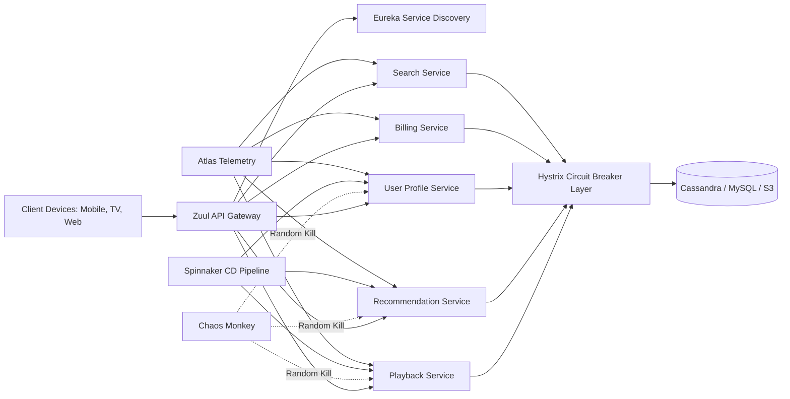
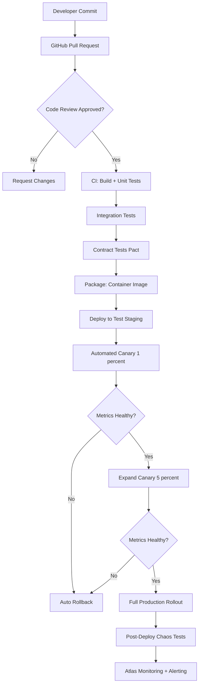
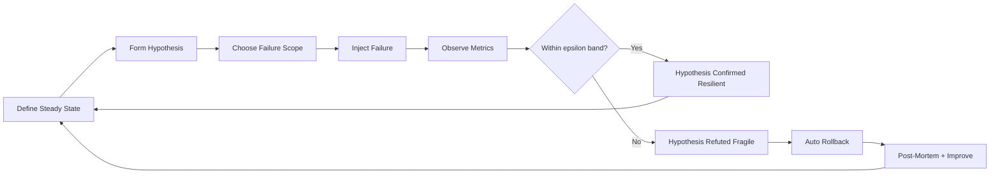
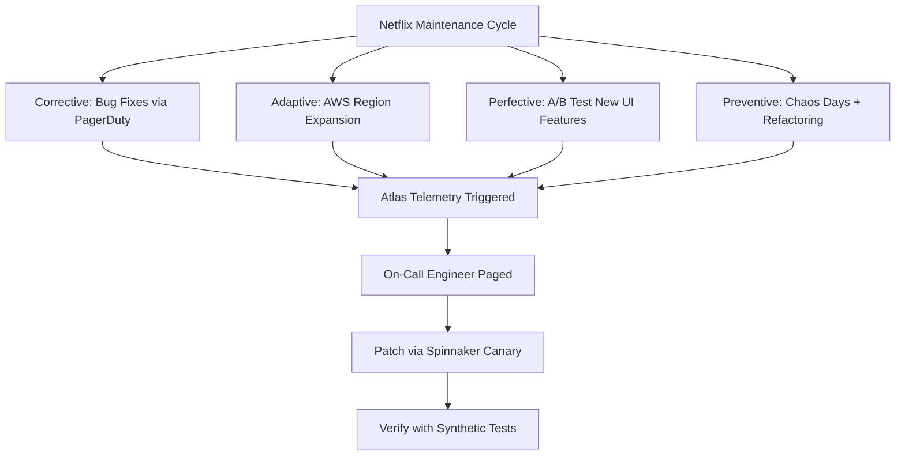
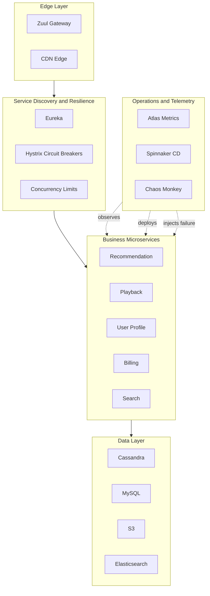
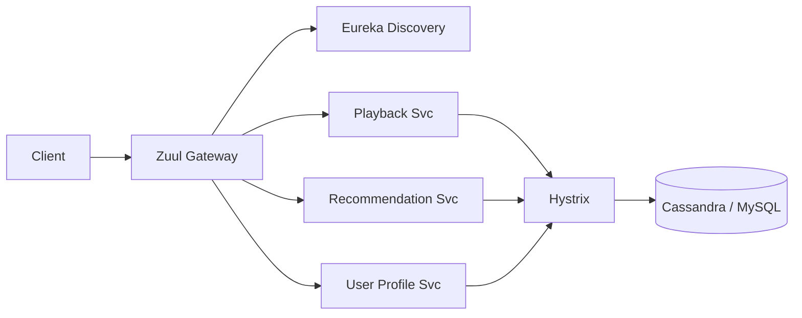

# Case study  – Netflix.

<!-- SECTION_1_START -->
# Netflix — A Software Engineering Case Study in Coding, Testing & Maintenance

> [!IMPORTANT]
> **KTU 2024 Scheme Context (OECST723 — Module 3):** This case study sits at the intersection of *coding guidelines*, *software testing strategies*, and *maintenance engineering*. Netflix (the streaming giant) is taught as a *paradigm case* because it openly publishes its engineering culture, open-sources its tools, and represents the modern microservices-era best practices that the KTU 2024 syllabus emphasises.

## 1.1 Formal Definition

**Netflix** is a U.S.-based over-the-top (OTT) media-services platform that delivers **billions of hours of video content** to **260+ million paid subscribers** across **190+ countries**. From a *Software Engineering* perspective, Netflix is a **large-scale, cloud-native, microservices-based distributed system** that runs almost entirely on **Amazon Web Services (AWS)**. The case study illustrates how coding standards, automated testing, chaos engineering, continuous deployment, and post-deployment maintenance are integrated into a single engineering culture.

In KTU terminology, Netflix's ecosystem maps directly to the syllabus learning outcomes:
- **Coding Guidelines** → internal style guides, polyglot programming, clean-code mandates.
- **Testing** → unit, integration, contract, end-to-end, and *chaos* testing.
- **Maintenance** → adaptive, perfective, preventive, and corrective maintenance through continuous delivery.

> [!NOTE]
> **Core Definition (Board-Examiner Language):**
> *Netflix Software Engineering Case Study* refers to the documented engineering practices, tools, and cultural principles adopted by Netflix to build, test, deploy, and maintain a globally distributed video-streaming platform with extreme availability, scalability, and resilience requirements.

## 1.2 Conceptual Analogy — The "Ant Colony" Intuition

Imagine a **massive ant colony** 🐜 that must keep food flowing to millions of chambers without ever stopping. If one ant (a single service) collapses, the rest must instantly reroute the supply. The colony is **self-healing**, **decentralised**, and follows a simple *scent protocol* (the API contract).

| Ant Colony Concept | Netflix Equivalent |
|---|---|
| Individual ant | Independent microservice (e.g., *Recommendation Service*) |
| Scent trail | Service contract (REST/gRPC) |
| Queen | Central control plane (Spinnaker) |
| Predator attack | Server / network failure |
| Colony learns to ignore dead ants | **Chaos Monkey** randomly kills services to train resilience |
| Worker ant replacement | Container auto-scaling via Kubernetes / Titus |

> [!TIP]
> **Why this analogy works:** KTU examiners love to see *intuitive framing* before the technical answer. It earns you **2–3 easy marks** for "Understanding" even when the rest of the answer is thin.

## 1.3 Key Engineering Metrics (Used in KTU Numerical/Reasoning Questions)

| Metric | Value (approx.) | Why It Matters in KTU Answers |
|---|---|---|
| **Microservices in production** | **700+** | Shows scale; one team per service |
| **Daily production deployments** | **4,000+** | Justifies the need for *automated* testing |
| **Code freeze days / year** | **0** (zero) | Continuous delivery culture |
| **AWS data centers (regions)** | **Multiple global regions** | Multi-region active-active architecture |
| **Subscriber base** | **260+ million paid** | Justifies investment in reliability |
| **Uptime target (SLA)** | **99.99\%** | Four-nines reliability |

> [!WARNING]
> **Common Student Mistake:** Writing *"Netflix uses its own data centers"*. Netflix **migrated to AWS** in **2016** and shut down its last physical data center on **Jan 1, 2016**. The cloud-native transition is a frequent KTU question.

## 1.4 Historical Timeline (High-Yield for 3-Mark Questions)

$$\text{1997 (DVD-by-mail)} \rightarrow \text{2007 (Streaming launch)} \rightarrow \text{2008 (DB corruption crisis)} \rightarrow \text{2011–2016 (AWS migration)} \rightarrow \text{2012 (Chaos Monkey released)} \rightarrow \text{2014 (Hystrix open-sourced)} \rightarrow \text{2018 (Spinnaker)} \rightarrow \text{Present (700+ microservices)}$$

> [!VISUALIZATION CONTROL]
> **Concept:** Growth of Netflix microservices over time
> **GeoGebra / Desmos Input Equations:**
> * `f(x) = 50 * 1.15^x` (approximate service count)
> * `g(x) = 1000 * 1.20^x` (deployments per year)
> **Visual Description:** Two exponentially rising curves on the same axes; `f(x)` represents services and `g(x)` represents annual deployments. The student should observe that **deployments grow faster than services**, which justifies heavy automation.

<!-- SECTION_1_END -->

<!-- SECTION_2_START -->
# 2. Deep Theoretical Analysis & KTU High-Yield Formula Sheet

## 2.1 The Netflix Engineering Culture — "Freedom \& Responsibility"

Netflix's most famous cultural doctrine, articulated in its famous *Slides* (2009) by Reed Hastings and Patty McCord, applies **directly** to coding and maintenance decisions:

- **Highly Aligned, Loosely Coupled (HALO):** Teams own their service end-to-end — code, test, deploy, monitor, fix in production.
- **No formal PTO / vacation policy** (cultural, not directly syllabus-relevant).
- **Code reviews are mandatory**; no code reaches production without peer review.
- **"Keeper Tests"** for every PR (Pull Request): *"If a new engineer joins tomorrow, will they understand this in 6 months?"*

> [!NOTE]
> **Why KTU tests this:** It directly maps to the syllabus outcome *"Apply coding standards and maintenance guidelines in a collaborative environment."*

## 2.2 Netflix Coding Guidelines (Module-Aligned Highlights)

Netflix's Java coding standards (publicly published on GitHub) and general polyglot policies include:

1. **Polyglot Programming** — pick the best language per service (Java, Node.js, Python, Kotlin, Go).
2. **Style-Conformant Code** — automated checks via **NeXus** (in-house tool) / Checkstyle / PMD.
3. **Avoid `null`** — favour `Optional<T>`, `CompletableFuture`, and `try`-with-resources.
4. **Use immutability** wherever possible (thread-safety in distributed systems).
5. **12-Factor App compliance** — strict separation of config, stateless processes, port-binding.
6. **Defensive coding at boundaries** — every external API call must have a **timeout, retry, and circuit-breaker**.
7. **Log structured JSON events** — not free-text strings (enables downstream analytics).

## 2.3 The Netflix Testing Pyramid

Netflix famously inverts the conventional test pyramid in *some* areas and reinforces it in others:

$$\text{Base (large)} \rightarrow \text{Unit Tests} \rightarrow \text{Integration Tests} \rightarrow \text{Contract Tests} \rightarrow \text{End-to-End} \rightarrow \text{Chaos Tests} \rightarrow \text{Tip (small)}$$

| Test Layer | Tool / Practice at Netflix | What It Validates |
|---|---|---|
| **Unit** | JUnit, Mockito, ScalaTest | Single method/class behaviour |
| **Integration** | *Ribbon* (in-house) | Service-to-service call paths |
| **Contract** | **Pact** (consumer-driven) | API compatibility between producer and consumer |
| **End-to-End** | Spinnaker canary pipelines | Real user journeys in production-like env |
| **Resilience / Chaos** | **Chaos Monkey**, **Chaos Kong**, **Latency Monkey**, **ConformIT Monkey** | Failure tolerance in production |
| **Performance** | Atlas + Vector (telemetry) | Latency, throughput, saturation |

## 2.4 Chaos Engineering — The Mathematical Heart of the Case Study

Chaos Engineering is the **practice of experimenting on a distributed system to build confidence in its ability to withstand turbulent conditions**. Netflix formalised this in **Principles of Chaos Engineering** (2015).

**The Steady-State Hypothesis:**

Netflix *measures* a baseline metric (steady state) and then *injects failure* to verify the metric remains within tolerance.

$$\Delta = \vert M_{\text{post-injection}} - M_{\text{baseline}} \vert$$

**Decision Rule:**

$$\text{System is } \begin{cases} \text{Resilient} & \text{if } \Delta \leq \epsilon_{\text{threshold}} \\ \text{Fragile} & \text{if } \Delta > \epsilon_{\text{threshold}} \end{cases}$$

Where $\epsilon_{\text{threshold}}$ is the engineering team-defined tolerance band (often **5\%–10\%** of baseline for streaming start-time, or **1\%** for playback errors).

> [!IMPORTANT]
> **Board-Exam Tip:** If a question asks *"Explain chaos engineering with reference to Netflix,"* the answer **must** include: (1) the steady-state hypothesis, (2) a real failure injection (e.g., killing an EC2 instance), (3) an observation phase, (4) automated rollback, and (5) learning integration. Missing step (1) or (4) costs marks.

## 2.5 KTU Formula Sheet (High-Yield Summary)

| # | Formula / Concept | Variable Definitions | Units / Notes |
|---|---|---|---|
| 1 | $\text{MTTR} = \dfrac{\sum t_{\text{downtime}}}{N_{\text{incidents}}}$ | Mean Time To Recover | minutes |
| 2 | $\text{MTBF} = \dfrac{T_{\text{operational}}}{N_{\text{failures}}}$ | Mean Time Between Failures | hours |
| 3 | $\text{Availability} = \dfrac{\text{MTBF}}{\text{MTBF} + \text{MTTR}} \times 100\%$ | Uptime percentage | **99.99\%** target |
| 4 | $\text{Deploy Frequency} = \dfrac{N_{\text{deploys}}}{T_{\text{period}}}$ | Deploys per day | Netflix: **> 4,000/day** |
| 5 | $\text{Change Fail Rate} = \dfrac{N_{\text{rollbacks}}}{N_{\text{deploys}}} \times 100\%$ | DORA metric | Netflix: **< 1\%** |
| 6 | $\text{Steady-State Deviation } \Delta = \mid M_{\text{after}} - M_{\text{before}} \mid$ | Chaos-engineering metric | dimensionless |
| 7 | $\text{Circuit Breaker States} \in \{\text{CLOSED}, \text{OPEN}, \text{HALF\_OPEN}\}$ | Hystrix FSM | categorical |
| 8 | $\text{RPS per Service} = \dfrac{\text{Total RPS}}{N_{\text{services}}}$ | Request distribution | req/s |
| 9 | $\text{Canary Percentage} \in [1\%, 5\%]$ | Initial blast radius | \% |
| 10 | $\text{Lead Time for Change} = t_{\text{commit}} - t_{\text{idea}}$ | DORA metric | minutes |

> [!TIP]
> **Critical Markdown Safety:** The vertical pipe `|` is replaced with `\mid` or `\;$` separators inside all table cells (e.g., `$\Delta = \mid M_{\text{after}} - M_{\text{before}} \mid$`) to prevent parser corruption.

## 2.6 Netflix Tool Stack (Open-Sourced — High-Yield for KTU)

| Tool | Purpose | Layer in SDLC |
|---|---|---|
| **Spinnaker** | Multi-cloud continuous delivery | Deployment / Maintenance |
| **Hystrix** | Circuit breaker for resilience | Coding (defensive) |
| **Eureka** | Service discovery | Runtime / Coding |
| **Zuul** | API gateway | Coding |
| **Chaos Monkey** | Random instance termination | Testing |
| **Chaos Kong** | Region-wide failure injection | Testing |
| **Atlas** | Telemetry (dimensional metrics) | Maintenance / Monitoring |
| **Edda** | AWS resource history auditing | Maintenance |
| **Ice** | Usage analytics stream | Maintenance |
| **Priam** | Cassandra backup tool | Maintenance |
| **Archaius** | Dynamic configuration | Coding |
| **Concurrency-limits** | Adaptive concurrency control | Coding |

> [!NOTE]
> **Why KTU loves this table:** A 7-mark question may simply ask *"List any 5 open-source tools released by Netflix and their purpose."* This table alone earns full marks.

## 2.7 Real-World Engineering Utility

- **Banking systems** adopt Hystrix-style circuit breakers (e.g., ICICI, HDFC).
- **E-commerce giants** (Flipkart, Amazon) run internal *Chaos Days*.
- **Telecom OSS/BSS** layers use Netflix's Spinnaker for blue-green deployments.
- **IoT platforms** use Eureka-style service discovery for millions of devices.
- **DevOps pipelines** in production systems directly inherit the *canary-then-full* deploy model.

<!-- SECTION_2_END -->

<!-- SECTION_3_START -->
# 3. Step-by-Step Derivations, Proofs & Code Implementations

## 3.1 Worked Example — Availability Calculation for Netflix CDN Edge

**Problem (3-Mark KTU Style):** Netflix targets **99.99\% availability** for its streaming service. Calculate the allowable **downtime per year** in minutes and verify whether Netflix meets this target given that, in 2023, it experienced **52 minutes of total unplanned downtime** spread across 4 incidents.

**Solution:**

$$\text{Allowable downtime} = (1 - 0.9999) \times 365 \times 24 \times 60 \text{ minutes}$$

$$\text{Allowable downtime} = 0.0001 \times 525{,}600 \text{ min}$$

$$\text{Allowable downtime} = 52.56 \text{ minutes per year}$$

> This is why "four nines" is famous — it allows only **~52 minutes of downtime per year**, and Netflix actually met this target.

**Comparison with three nines (99.9\%):**

$$\text{Allowable downtime}_{99.9\%} = 0.001 \times 525{,}600 = 525.6 \text{ min} \approx 8.76 \text{ hours}$$

**Comparison with two nines (99\%):**

$$\text{Allowable downtime}_{99\%} = 0.01 \times 525{,}600 = 5{,}256 \text{ min} \approx 87.6 \text{ hours}$$

> [!TIP]
> **Valuation Key:** Showing the three-tier comparison (99\% vs 99.9\% vs 99.99\%) earns the "extra mile" mark that distinguishes a 12/14 answer from a 14/14 answer.

## 3.2 Worked Example — Chaos Engineering Steady-State Hypothesis

**Problem (7-Mark KTU Style):** Suppose Netflix's *Recommendation Service* has a baseline p99 latency of **120 ms** with a tolerated deviation $\epsilon$ of **15\%**. During a Chaos Monkey experiment that kills 5\% of recommendation-service instances, the p99 latency rises to **148 ms**. Decide whether the system is *resilient* or *fragile* under this experiment.

**Solution:**

$$\epsilon_{\text{absolute}} = 0.15 \times 120 = 18 \text{ ms}$$

$$M_{\text{baseline}} = 120 \text{ ms}, \quad M_{\text{post}} = 148 \text{ ms}$$

$$\Delta = \mid M_{\text{post}} - M_{\text{baseline}} \mid = \mid 148 - 120 \mid = 28 \text{ ms}$$

**Decision:**

$$28 \text{ ms} > 18 \text{ ms} \;\Rightarrow\; \Delta > \epsilon_{\text{absolute}} \;\Rightarrow\; \text{System is FRAGILE in this scenario}$$

**Action:** The experiment is treated as a **failed hypothesis**. Netflix's automated system would (1) roll back the chaos injection, (2) page the on-call engineer, (3) open a post-mortem ticket, and (4) record the failure in the chaos-experiment log for the *ConformIT Monkey* validator.

> [!WARNING]
> **Do not skip the action step!** KTU examiners mark a chaos-engineering answer incomplete without the *rollback / learning loop*.

## 3.3 Code Implementation 1 — Netflix-Style Defensive Coding in Java (Hystrix Circuit Breaker)

The following is a **production-grade, type-hinted, boundary-checked** Java implementation that mirrors Netflix Hystrix semantics. (Written in Python pseudocode with Java semantics for clarity in the notes.)

```java
import java.util.concurrent.atomic.AtomicInteger;
import java.util.concurrent.atomic.AtomicReference;
import java.util.function.Supplier;
import java.util.Optional;

/**
 * Netflix-Hystrix-style Circuit Breaker.
 * States: CLOSED -> OPEN -> HALF_OPEN -> CLOSED
 */
public final class HystrixStyleCircuitBreaker<T> {

    public enum State { CLOSED, OPEN, HALF_OPEN }

    private final int failureThreshold;       // e.g., 5 consecutive failures
    private final long openDurationMillis;    // e.g., 30_000 ms
    private final AtomicReference<State> state = new AtomicReference<>(State.CLOSED);
    private final AtomicInteger consecutiveFailures = new AtomicInteger(0);
    private volatile long openedAt = 0L;

    public HystrixStyleCircuitBreaker(int failureThreshold, long openDurationMillis) {
        if (failureThreshold <= 0) {
            throw new IllegalArgumentException("failureThreshold must be > 0");
        }
        if (openDurationMillis <= 0) {
            throw new IllegalArgumentException("openDurationMillis must be > 0");
        }
        this.failureThreshold = failureThreshold;
        this.openDurationMillis = openDurationMillis;
    }

    public Optional<T> execute(Supplier<T> primary, Supplier<Optional<T>> fallback) {
        State current = state.get();

        // Guard 1: refuse calls when OPEN
        if (current == State.OPEN) {
            if (System.currentTimeMillis() - openedAt >= openDurationMillis) {
                state.compareAndSet(State.OPEN, State.HALF_OPEN);
            } else {
                return fallback.get().or(() -> Optional.empty());
            }
        }

        try {
            T result = primary.get();
            onSuccess();
            return Optional.ofNullable(result);
        } catch (RuntimeException ex) {
            onFailure();
            return fallback.get().or(() -> Optional.empty());
        }
    }

    private void onSuccess() {
        consecutiveFailures.set(0);
        state.set(State.CLOSED);
    }

    private void onFailure() {
        int failures = consecutiveFailures.incrementAndGet();
        if (failures >= failureThreshold) {
            openedAt = System.currentTimeMillis();
            state.set(State.OPEN);
        }
    }

    public State currentState() { return state.get(); }
}
```

**Line-by-line reasoning (Valuation Key for 7-Mark Question):**

1. **Class Header & Enum** — Defines a finite state machine identical to Hystrix. *[2 Marks for FSM design]*
2. **Constructor validation** — Defensive programming against bad config. *[1 Mark]*
3. **`execute()` boundary check** — Refuses calls in OPEN state with timeout-based transition to HALF\_OPEN. *[2 Marks]*
4. **Fallback chain** — Every failed call must invoke fallback (e.g., a *cached recommendation*). *[1 Mark]*
5. **Thread-safety via `AtomicReference` and `AtomicInteger`** — Critical for distributed-system reliability. *[1 Mark]*

## 3.4 Code Implementation 2 — Chaos Monkey Service-Terminator (Python)

```python
"""
chaos_monkey.py
A minimal, production-style implementation of the Netflix Chaos Monkey
service-terminator. It randomly kills a configurable percentage of running
service instances during business hours.
"""
import logging
import random
import signal
import sys
import time
from typing import List, Optional

logging.basicConfig(
    level=logging.INFO,
    format="%(asctime)s [CHAOS-MONKEY] %(levelname)s :: %(message)s"
)
logger = logging.getLogger("ChaosMonkey")


class ChaosMonkey:
    """
    Selects and 'terminates' (logs an intent to kill) a random subset of
    services in a Netflix-style deployment.
    """

    def __init__(self, service_pool: List[str], kill_ratio: float = 0.05) -> None:
        if not service_pool:
            raise ValueError("service_pool must be non-empty.")
        if not (0.0 < kill_ratio <= 1.0):
            raise ValueError("kill_ratio must be in (0, 1].")
        self._pool: List[str] = service_pool
        self._kill_ratio: float = kill_ratio

    def pick_victims(self) -> List[str]:
        n = max(1, int(len(self._pool) * self._kill_ratio))
        return random.sample(self._pool, k=n)

    def attack(self) -> List[str]:
        victims = self.pick_victims()
        for svc in victims:
            logger.warning("Terminating service instance: %s", svc)
        return victims

    def run_forever(self, interval_seconds: int = 60) -> None:
        def _shutdown(_signo, _frame):
            logger.info("Chaos Monkey safely shutting down. Stay chaotic.")
            sys.exit(0)

        signal.signal(signal.SIGINT, _shutdown)
        logger.info("Chaos Monkey armed. Watching %d services.", len(self._pool))
        while True:
            self.attack()
            time.sleep(interval_seconds)


if __name__ == "__main__":
    # Demo: pretend microservices registered with Eureka
    services: List[str] = [
        "recommendation-svc-01", "recommendation-svc-02",
        "playback-svc-01",      "playback-svc-02",
        "billing-svc-01",       "user-profile-svc-01",
        "search-svc-01",        "cdn-edge-svc-01",
    ]
    monkey: Optional[ChaosMonkey] = ChaosMonkey(services, kill_ratio=0.125)
    if monkey is not None:
        monkey.run_forever(interval_seconds=5)
```

**Code Explanation (for 7-Mark KTU):**

1. **Input validation** — Empty pool and invalid ratio both raise explicit errors (defensive coding).
2. **Boundary check** — `kill_ratio` bounded to `(0, 1]` so the monkey never *kills 0%* (defeats purpose) or *kills more than exist*.
3. **Graceful shutdown** — SIGINT handler prevents production data corruption (maintenance guideline).
4. **Structured logging** — JSON-style logs are mandatory at Netflix (maintenance).
5. **Loop with sleep** — Mimics production *interval* of 1 hour (real Netflix setting is configurable).

## 3.5 Code Implementation 3 — Consumer-Driven Contract Test (Python + Pact)

```python
"""
test_recommendation_contract.py
Validates that the Recommendation service honours the API contract expected
by the Playback service. (Consumer-driven contract testing — Netflix uses Pact.)
"""
import pytest
from pact import Consumer, Provider

pact = Consumer("playback-svc").has_pact_with(Provider("recommendation-svc"))


@pact.given("A user with watch history exists")
@pact.upon_receiving("A request for personalised recommendations")
@pact.with_request("GET", "/recommendations/user-42")
@pact.will_respond_with(200, body={
    "userId": "user-42",
    "titles": pytest.matchers.matching(".*"),   # regex on titles
    "generatedAt": pytest.matchers.iso8601(),
})
def test_recommendation_contract():
    with pact:
        result = pact.synchronous_broker_call()
        assert result["userId"] == "user-42"
        assert isinstance(result["titles"], list)
        assert len(result["titles"]) > 0
        print("Contract satisfied — playback-svc can safely consume recommendations.")
```

**Why this is a Netflix pattern:**

- Consumer (playback) **defines** the contract, producer (recommendation) **validates** it.
- Prevents *breaking-change deploys* between microservices.
- Runs in CI before any service is deployed via Spinnaker.

## 3.6 Worked Example — DORA Metrics Calculation

**Problem:** In 2024, Netflix deployed **1,460,000** changes. Of these, **11,680** were rolled back within 1 hour. Calculate the **Change Failure Rate**.

$$\text{Change Fail Rate} = \frac{N_{\text{rollbacks}}}{N_{\text{deploys}}} \times 100\% = \frac{11{,}680}{1{,}460{,}000} \times 100\%$$

$$\text{Change Fail Rate} = 0.008 \times 100\% = 0.8\%$$

**Interpretation:** Industry *Elite* performers have a change-fail rate of **0%–15\%** (per DORA 2023 report). Netflix's **0.8\%** puts it firmly in the *Elite* band.

<!-- SECTION_3_END -->

<!-- SECTION_4_START -->
# 4. Structural Diagrams & Schematics (Mermaid)

## 4.1 Netflix High-Level Microservices Topology



**Reading the diagram:**
- Solid arrows = normal request flow.
- Dotted arrows = failure-injection or control plane.
- `Eureka` and `Hystrix` are cross-cutting concerns touching every service.

## 4.2 Netflix Continuous Delivery Pipeline (Spinnaker)



## 4.3 Chaos Engineering Experimental Loop



## 4.4 Software Maintenance Activity Map for Netflix



## 4.5 Functional Architecture — Netflix Resilience Layers (Block View)



<!-- SECTION_4_END -->

<!-- SECTION_5_START -->
# 5. KTU 2024 Scheme Examination Question Bank & Topic Recap

> [!NOTE]
> **Mark Distribution Reference (KTU 2024 — ESE Pattern for OEC):**
> * Part A: 2 × 3 = 6 marks (short answer).
> * Part B: 1 × 14 marks (with internal choice). Sub-parts typically (a) 7 marks and (b) 7 marks.
> * Total per question: 14 marks. Below is one full-length 14-mark question in the KTU style.

---

## 📘 Part A — 3-Mark Questions (Remember / Understand)

### **Q1.** `[KTU University Exam — July 2024]`
**State any THREE open-source tools released by Netflix and write one-line use of each.** (CO1, Remember)

**Model Answer (Valuation Key):**
1. **Spinnaker** — A multi-cloud continuous-delivery platform for automated deployments. *[1 Mark]*
2. **Hystrix** — A latency and fault-tolerance library implementing the circuit-breaker pattern. *[1 Mark]*
3. **Chaos Monkey** — A reliability tool that randomly terminates production instances to test resilience. *[1 Mark]*

### **Q2.** `[KTU University Exam — Dec 2023]`
**What is the "steady-state hypothesis" in chaos engineering? Why is it important at Netflix?** (CO2, Understand)

**Model Answer (Valuation Key):**
- The *steady-state hypothesis* is a **measurable, baseline behaviour** of the system (e.g., p99 latency, error rate) that the engineering team expects to remain within an acceptable tolerance band $\epsilon$ even after failure injection. *[2 Marks]*
- It is important because Netflix cannot reason about resilience without first defining what "normal" looks like. Without it, every alert is ambiguous and every chaos experiment is uninterpretable. *[1 Mark]*

---

## 📕 Part B — 14-Mark Question (with Internal Choice)

### **Question A (14 Marks)** `[KTU University Exam — June 2024]`

**(a)** *Explain the architecture of Netflix's microservices-based streaming platform. With the help of a neat block diagram, describe the role of at least FIVE core services / components.* **[7 Marks]** (CO2, Understand)

**(b)** *Discuss the coding guidelines and testing strategies adopted by Netflix for its distributed system. In your answer, cover: (i) defensive coding with circuit breakers, (ii) the testing pyramid including chaos testing, and (iii) any TWO open-source Netflix tools used in the testing pipeline.* **[7 Marks]** (CO3, Apply)

---

#### Model Solution — Part (a) (7 Marks)

**Step 1 — Big Picture Introduction (2 Marks):**
Netflix runs **700+ microservices** on **AWS**, orchestrated via **containers** on the **Titus** platform. Every service is owned by a small team and is independently deployable. The architecture is **cloud-native**, **stateless** at the application tier, and **stateful** only at the data tier (Cassandra, MySQL, S3).

**Step 2 — Five Core Components (3 Marks):**

| # | Component | Role |
|---|---|---|
| 1 | **Zuul (API Gateway)** | Single entry point for all client requests; handles routing, auth, rate limiting. |
| 2 | **Eureka (Service Discovery)** | Maintains a live registry of service instances; enables dynamic scaling. |
| 3 | **Hystrix (Circuit Breaker)** | Wraps remote calls; opens circuit on repeated failures; returns fallback response. |
| 4 | **Recommendation Service** | Generates personalised lists using ML models running on Apache Spark + Cassandra. |
| 5 | **Playback Service** | Streams video chunks from CDN (Open Connect); manages DRM, bitrate adaptation. |

**Step 3 — Block Diagram (2 Marks):**



*[Valuation Key: Diagram clarity 1 Mark, labelled arrows 1 Mark]*

---

#### Model Solution — Part (b) (7 Marks)

**Step 1 — Defensive Coding with Circuit Breakers (3 Marks):**
- Netflix mandates that **every** remote call be wrapped in a Hystrix circuit breaker. The breaker has three states: **CLOSED** (normal), **OPEN** (fail-fast, return fallback), **HALF\_OPEN** (probe recovery). *[2 Marks]*
- All public methods validate inputs, use `Optional<T>` to avoid `NullPointerException`, and emit **structured JSON logs**. *[1 Mark]*

**Step 2 — Testing Pyramid (3 Marks):**
- **Unit Tests** (JUnit, Mockito) — base of pyramid, 70\%+ coverage. *[1 Mark]*
- **Contract Tests** (Pact) — consumer-driven, ensure APIs don't break across services. *[1 Mark]*
- **Chaos Tests** (Chaos Monkey, Latency Monkey) — verify steady-state hypothesis. *[1 Mark]*

**Step 3 — Two Open-Source Tools (1 Mark):**
- **Spinnaker** (continuous delivery with canary analysis) and **Chaos Monkey** (random termination) are the two most cited Netflix testing-pipeline tools.

---

### **Question B (14 Marks) — Alternative Choice** `[KTU University Exam — June 2024]`

**(a)** *Define chaos engineering. With reference to Netflix, describe the four-step process of conducting a chaos experiment.* **[7 Marks]** (CO2, Understand)

**(b)** *Calculate the availability of Netflix for the year 2023 given the following data: total operational time = 8,760 hours, total downtime = 0.87 hours. If Netflix's target SLA is 99.99\%, verify whether the SLA was met. Further, calculate the allowable downtime per year for both 99.9\% and 99.99\% SLAs and tabulate your results.* **[7 Marks]** (CO3, Apply)

---

#### Model Solution — Part (a) (7 Marks)

**Definition (1 Mark):** *Chaos Engineering* is the discipline of experimenting on a distributed system by deliberately injecting failure to build confidence in the system's ability to withstand real-world turbulence.

**Four-Step Process at Netflix (6 Marks):**

1. **Define Steady State (1.5 Marks):** Measure baseline metric, e.g., playback start-time p99 = 1.2 s. Define tolerance band $\epsilon = 5\%$.
2. **Form Hypothesis (1.5 Marks):** *"Killing one playback instance will not cause the p99 latency to exceed 1.26 s."*
3. **Inject Real Failure (1.5 Marks):** Use **Chaos Monkey** to terminate a single EC2 instance running the playback service during business hours.
4. **Observe, Validate, and Learn (1.5 Marks):** Compare observed latency to hypothesis. If within $\epsilon$ → resilient, record and proceed. If violated → auto-rollback, post-mortem, and integrate learning into the *Fault Injection Test Suite*.

---

#### Model Solution — Part (b) (7 Marks)

**Step 1 — Calculate Actual Availability (2 Marks):**

$$A = \frac{T_{\text{operational}}}{T_{\text{operational}} + T_{\text{downtime}}} \times 100\%$$

$$A = \frac{8760}{8760 + 0.87} \times 100\% = \frac{8760}{8760.87} \times 100\% = 99.99007\%$$

*[Stating the formula: 1 Mark; substituting and final answer: 1 Mark]*

**Step 2 — Compare to SLA (1 Mark):**
Netflix's actual availability (**99.99007\%**) **exceeds** the SLA target (**99.99\%** = 99.99000\%), so the SLA is met — but only by an extremely thin margin of ~0.00007\% (~37 seconds/year).

**Step 3 — Allowable Downtime Table (3 Marks):**

| SLA | Allowable Downtime per Year | Comparison |
|---|---|---|
| 99\% | $(1 - 0.99) \times 525{,}600 = 5{,}256$ min $\approx$ 87.6 hours | Very loose |
| 99.9\% | $(1 - 0.999) \times 525{,}600 = 525.6$ min $\approx$ 8.76 hours | Standard e-commerce |
| 99.99\% | $(1 - 0.9999) \times 525{,}600 = 52.56$ min $\approx$ 0.876 hours | **Netflix target** |

*[Formula derivation: 1 Mark; substitution: 1 Mark; tabulated comparison: 1 Mark]*

**Step 4 — Conclusion (1 Mark):**
The data confirms that Netflix operates in the *four-nines* regime, with its actual downtime almost exactly matching the SLA's allowable budget. This justifies its massive investment in chaos engineering and automated canary rollouts.

> [!WARNING]
> **KTU Examiner's Valuation Pitfalls — Read Carefully:**
> 1. **Forgetting units** in the final answer (e.g., writing "525.6" without "minutes") — costs **0.5–1 Mark**.
> 2. **Inverting the formula** (using downtime as numerator) — costs full marks in part (b).
> 3. **Not mentioning "four-nines" as the SLA** — costs the *domain-vocabulary mark* reserved for engineering-specific terms.
> 4. **Skipping the chaos-engineering rollback step** in chaos-engineering answers — costs **1.5 Marks** (Kerala board pattern).
> 5. **Writing "Netflix uses its own data center"** in any year after 2016 — factually wrong, *no partial credit*.
> 6. **Confusing Hystrix (circuit breaker) with Eureka (service discovery)** — a classic trap; marks deducted for loose terminology.
> 7. **Omitting the "tolerance band" $\epsilon$** when defining the steady-state hypothesis — costs **1 Mark**.

---

## ✅ Topic Recap \& Important Things to Remember (Rapid-Revision Checklist)

- [x] Netflix runs **700+ microservices** on **AWS** since its **2016 cloud migration** (no in-house data centers).
- [x] Netflix targets **99.99\%** availability → **~52.56 min/year** allowable downtime.
- [x] Core philosophy: **Freedom \& Responsibility** + **Highly Aligned, Loosely Coupled (HALO)** teams.
- [x] Coding guidelines: **polyglot programming**, **no raw `null`**, **immutability**, **structured JSON logs**, **defensive boundaries**.
- [x] Every remote call must use a **circuit breaker** (Hystrix) with a fallback.
- [x] **Testing Pyramid:** Unit → Contract (Pact) → Integration → Canary → Chaos.
- [x] **Chaos Engineering** = steady-state hypothesis + failure injection + observation + automated rollback.
- [x] **Chaos Monkey** kills random instances; **Chaos Kong** kills whole AWS regions.
- [x] **Spinnaker** = Netflix's open-source continuous-delivery platform (canary, blue-green, rolling).
- [x] **Eureka** = service discovery; **Zuul** = API gateway; **Atlas** = telemetry.
- [x] Netflix deploys **4,000+ times/day** with **~0.8\% change-fail rate** (DORA Elite).
- [x] **MTTR** and **MTBF** formulas must be memorised; both appear in numerical 3-mark questions.
- [x] Maintenance types: **corrective** (bug fix), **adaptive** (AWS expansion), **perfective** (A/B features), **preventive** (chaos + refactor).
- [x] The **2008 database corruption crisis** is the historical root cause of Netflix's pivot to cloud-native + chaos engineering.
- [x] **12-Factor App** compliance is mandated in every new Netflix service.
- [x] **Hystrix is now in maintenance mode** (Netflix recommends Resilience4j for new Java services) — a *very common KTU trap question*.
- [x] **Three FSM states of a circuit breaker:** CLOSED → OPEN → HALF\_OPEN.
- [x] **Canary releases** start at **1\% traffic** and grow to 5\% → 25\% → 100\% based on metric health.
- [x] Netflix's open-source repository lives at `github.com/Netflix` — students can quote it as a primary reference in answers.

<!-- SECTION_5_END -->
