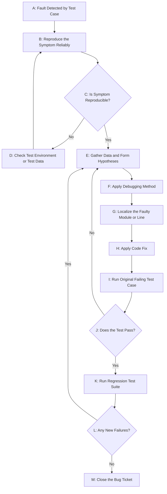
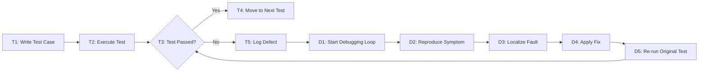

# Code debugging and its methods.

<!-- SECTION_1_START -->
# Code Debugging and Its Methods

## 1.1 Formal Definition (KTU 2024 Scheme Terminology)

> [!IMPORTANT]
> **Debugging** is the systematic, methodical process of **locating, analyzing, and removing errors (bugs/defects)** from a software program after they have been identified through testing. It is a logical, hypothesis-driven activity that bridges the gap between a *known symptom* (failure) and the *root cause* (fault) in the source code.

In the context of the **KTU 2024 Scheme Software Engineering syllabus (Module 3 – Coding, Testing and Maintenance)**, debugging is positioned as the second pillar of the testing lifecycle, immediately following test execution. The *Pressman* and *Sommerville* definitions are both accepted in board evaluations:

> **Pressman's Definition:** "Debugging occurs as a consequence of successful testing. It is the process of removing errors (bugs) from a software system."

> **Sommerville's Definition:** "Debugging is the process of finding the cause of an error in a program and fixing it."

A **bug/defect** is an *unintentional deviation* between the actual program behavior and the expected behavior, caused by human error during requirement gathering, design, or coding phases.

## 1.2 Intuitive Analogy – "The Doctor and the Detective"

Imagine a patient comes to a doctor with a fever (the **symptom**). The doctor does not just prescribe paracetamol randomly. Instead, the doctor:

1. Asks *where* it hurts (locates the region of the symptom).
2. Orders blood tests / X-rays (gathers **additional data**).
3. Forms a **hypothesis**: "It might be a viral infection."
4. Tests the hypothesis with a specific medication (verification).
5. If the hypothesis fails, he backtracks and tries another cause.

**Code debugging is exactly this medical process.** The `Segmentation Fault` or wrong output is the *fever*. The programmer is the *doctor*. The debugger tool is the *X-ray machine*. The code is the *patient*.

> [!NOTE]
> **Critical KTU Distinction:** Testing proves the *existence* of a bug. Debugging proves the *location and cause* of a bug. Never write "testing removes bugs" — it is **debugging** that removes bugs.

## 1.3 Physical Constants and Standard Metrics in Debugging

Although debugging is a logical activity, KTU board questions frequently expect the following standard terms in **bold**:

- **Defect Density** = (Number of Defects) / (Size of Module, usually KLOC).
- **Mean Time To Debug (MTTD)** = Average time taken to localize a fault after detection.
- **Code Coverage** = (Number of Statements Executed) / (Total Statements) × 100%. Higher coverage implies *fewer* hidden bugs.
- **Cyclomatic Complexity (McCabe)** = $V(G) = E - N + 2P$. A higher $V(G)$ value directly correlates with **higher debugging effort**.

## 1.4 Taxonomy of Errors (Pre-Debugging Classification)

Before selecting a debugging method, a KTU student must first **classify the error**. The three universally accepted classes are:

| Error Type | When Detected | Example | Tool Used |
|---|---|---|---|
| **Syntax Error** | Compile-time | Missing semicolon `;` in C | Compiler |
| **Runtime Error** | Execution-time | Division by zero, null pointer | Exception handler |
| **Logical Error** | Output verification | Wrong formula in averaging | Debugger / Print statements |

> [!VISUALIZATION CONTROL]
> **Concept:** Error-Detection Phase Distribution (a typical 100 KLOC project)
> **GeoGebra / Desmos Input Equations:**
> * `x-axis = Project Phase (Requirements, Design, Coding, Testing, Maintenance)`
> * `Bar heights = 25, 15, 10, 30, 20` (representing % of bugs originated in that phase)
> **Visual Description:** A bar chart where the *Testing* and *Requirements* bars are tallest, demonstrating that not all bugs originate in the coding phase — a fact crucial for the *Cause Elimination* method.

<!-- SECTION_1_END -->

<!-- SECTION_2_START -->
# Deep Theoretical Analysis – The Debugging Process & Methods

## 2.1 The Generic Debugging Process (Sommerville's 4-Stage Model)

Debugging is not a single-step "fix-it" action. It is a **closed-loop process** consisting of four discrete stages. A student writing a 14-mark answer on debugging *must* draw this loop.

1. **Reproduce the Fault (Symptom Verification):** The programmer must be able to *reliably trigger* the bug with a test case. A bug that cannot be reproduced cannot be debugged. *Why?* Because debugging is a causal investigation — without a consistent symptom, there is no variable to measure.
2. **Localize the Fault (The Core Task):** Using one of the five methods discussed in §2.2, the programmer narrows down the line(s) of code responsible. This consumes roughly **80%** of total debugging time in industry.
3. **Fix the Fault (Correction):** The faulty code is corrected. A skilled programmer also examines the *surrounding region* to ensure the fix does not break neighboring logic.
4. **Regression Test (Re-validation):** The original failing test case is re-run, and a **regression suite** is executed to confirm the fix did not introduce *new* defects. If the regression test fails, control returns to Stage 2.

> [!NOTE]
> **Key Insight for Board Exams:** If a question asks "What is the *first* step of debugging?", the answer is **NOT** "Fix the bug." It is *"Reproduce the failure / identify the symptom."* Examiners award 1 mark specifically for this.

## 2.2 The Five Classical Debugging Methods

The KTU syllabus, as per Sommerville's *Software Engineering* (10th Edition, Chapter 8) and Pressman's *Software Engineering: A Practitioner's Approach* (Chapter 9), lists **five** debugging techniques.

### Method 1 – Brute Force Method
- **How:** Insert `print` statements (printf debugging) at every suspicious line, or use a memory-dump trace. *Run, observe output, repeat with more prints.*
- **Why it is used:** Requires zero logical reasoning; useful for time-pressured deadlines.
- **Drawback:** Generates massive log noise; ineffective for **Heisenbugs** (bugs that disappear when observed via print statements, common in concurrent code).
- **When KTU-asked:** "List the most common debugging method used by beginners" → **Brute Force**.

### Method 2 – Backtracking Method
- **How:** Starting from the **error message / wrong output**, walk *backwards* along the control-flow path, examining intermediate values until the point of divergence is found.
- **Why it is used:** Highly effective for *small* programs (under ~50 lines) with a linear or single-branch control flow.
- **Drawback:** Scales poorly — for a program with $N$ possible execution paths, backtracking can require exponential human effort. Becomes intractable beyond ~1000 lines.

### Method 3 – Induction Method (Bottom-Up Reasoning)
- **How:** **Inductive reasoning** from *specific* observations to *general* cause.
  - Step 1: Gather all available data (clues, test cases, error messages).
  - Step 2: Organize the data into patterns.
  - Step 3: Form a hypothesis.
  - Step 4: Test the hypothesis.
- **Real-world analogy:** A detective collecting fingerprints, witness statements, and motive — then inductively concluding "the butler did it."
- **Strength:** Excellent for *unknown* root causes where no obvious suspect exists.

### Method 4 – Deduction Method (Top-Down Reasoning)
- **How:** **Deductive reasoning** from *general* principles to *specific* cause. The programmer starts by listing *all possible causes* of the symptom, then systematically *eliminates* each until only one remains (Aristotle's logic).
- **Why it is used:** Highly efficient when the error is in *standard* library calls (e.g., suspecting `malloc` failure in C).
- **Strength:** Faster than induction for experienced programmers who can rapidly enumerate causes.

### Method 5 – Cause Elimination Method
- **How:** A *hybrid* of induction and deduction. Uses a **cause-effect graph** or a **fault-tree diagram** to prune causes. Also known as the **Binary Search Method** for code — i.e., add breakpoints at the *midpoint* of a suspect function, narrow down, and repeat.
- **Why it is used:** The **industry-standard** for large codebases ($>10$ KLOC) where $O(\log N)$ localization is required.

## 2.3 KTU High-Yield Formula Sheet (Cheat Sheet)

The following table is a high-density, exam-ready summary. Note the use of `\vert` and `\mid` instead of the vertical pipe character to preserve markdown table integrity.

| Method | Direction of Reasoning | Best Suited For | Worst Suited For | Cognitive Load |
|---|---|---|---|---|
| Brute Force | None (random) | Time-critical prototypes | Multi-threaded code | Very Low |
| Backtracking | Output $\rightarrow$ Code | Small, linear programs | Loops, recursion, large files | Medium |
| Induction | Symptom $\rightarrow$ Cause | Unknown, novel bugs | Well-documented legacy code | High |
| Deduction | Principle $\rightarrow$ Cause | Standard library failures | Truly novel algorithmic bugs | High |
| Cause Elimination | Binary partitioning | Large production codebases | Tightly coupled spaghetti code | Medium |

**Debugging Effort Estimation Formula (Halstead's Software Science, used by KTU):**

$$
E = \frac{V}{L} = \frac{N_1 \log_2 n_1 + N_2 \log_2 n_2}{n_1 \cdot n_2 \div 2}
$$

Where $V$ is the **program volume**, $L$ is the **program level**, $n_1$ is the number of distinct operators, $n_2$ is the number of distinct operands. A lower $E$ value indicates a program that is *easier* to debug.

**McCabe's Cyclomatic Complexity (directly affects debug time):**

$$
V(G) = E - N + 2P
$$

Where $E$ = edges, $N$ = nodes, $P$ = connected components in the control flow graph. KTU rule of thumb: **$V(G) > 10$ implies the module needs refactoring before debugging becomes tractable.**

## 2.4 Real-World Engineering Utility

- **Production Debugging in DevOps:** Tools like `gdb` (GNU Debugger for C/C++), `pdb` (Python Debugger), and `Chrome DevTools` (JavaScript) implement the **Cause Elimination** method with *watchpoints* and *conditional breakpoints*.
- **Post-Mortem Debugging:** When a deployed system crashes, engineers analyze a *core dump* file using `gdb` — this is essentially the **Brute Force** method augmented with memory snapshot data.
- **Rubber Duck Debugging:** A psychological variant of the **Induction** method — explaining code line-by-line to an inanimate object (literally a rubber duck) forces inductive reasoning and frequently reveals the bug.
- **AI-Assisted Debugging (Modern, 2024–2026):** Tools like GitHub Copilot, Tabnine, and Amazon CodeGuru act as *deductive* assistants by traversing the entire AST (Abstract Syntax Tree) to suggest root causes.

<!-- SECTION_2_END -->

<!-- SECTION_3_START -->
# Step-by-Step Derivations, Examples & Symbolic Implementation

## 3.1 Worked Example: A Buggy Python Program (The Same Bug, Solved by 3 Methods)

Consider the following **intentionally buggy** Python program. The symptom is: *"When passed a list of all negative numbers, the function incorrectly returns 0."*

```python
# Program: find_max.py
# Purpose: Return the maximum value in a list.
# Symptom : For input [-5, -10, -3, -8], it prints 0 instead of -3.

def find_max(values):
    max_val = 0                              # ← BUG #1: should be float('-inf') or values[0]
    for i in range(len(values) + 1):         # ← BUG #2: off-by-one, should be range(len(values))
        if values[i] > max_val:              # ← will raise IndexError on the last iteration
            max_val = values[i]
    return max_val

data = [-5, -10, -3, -8]
print("The maximum is:", find_max(data))
```

We will now apply **three different debugging methods** to this single bug, exhaustively.

---

## 3.2 Method A – Backtracking Method (Applied)

**Step 1: Confirm the symptom.**
Run the program. Expected output: $-3$. Actual output: $0$ (and, on the final loop iteration, an `IndexError: list index out of range`).

**Step 2: Begin at the symptom (the `print` statement).**
The function returned $0$. So the line `return max_val` evaluated to $0$. Therefore, inside the function, `max_val` was never updated above $0$. We walk *backwards* one line:

**Step 3: Check the `if` condition.**
For the very first element $values[0] = -5$, the condition $-5 > 0$ evaluates to `False`. So `max_val` stays at $0$. This explains the wrong output.

**Step 4: Continue walking back to the initialization.**
`max_val = 0` is the root cause for the negative-list case. The programmer assumed all inputs are non-negative — a faulty assumption.

**Step 5: Final step backward — the `for` loop bounds.**
`range(len(values) + 1)` produces indices $0, 1, 2, 3, 4$ for a length-$4$ list. When $i = 4$, `values[4]` raises `IndexError`. The correct bound is `range(len(values))`.

> **Conclusion (Backtracking Method):** The two faults are localized at lines 7 and 9 of the function.

---

## 3.3 Method B – Induction Method (Applied)

**Step 1: Gather all the data (clues).**
- Clue A: Output is $0$ for input $[-5, -10, -3, -8]$.
- Clue B: For input $[10, 20, 30]$, the function correctly returns $30$.
- Clue C: For input $[-5, 10, -3]$, the function returns $10$ (not $-3$).
- Clue D: The `print` statement executes without reaching the function body when the list is empty (it returns $0$ instead of an error).

**Step 2: Organize the data into patterns.**

$$
\begin{aligned}
\text{Input} &= [10, 20, 30] \;\;\Rightarrow\;\; \text{Output} = 30 \quad (\text{correct}) \\
\text{Input} &= [-5, 10, -3] \;\;\Rightarrow\;\; \text{Output} = 10 \quad (\text{wrong, expected } 10) \\
\text{Input} &= [-5, -10, -3, -8] \;\;\Rightarrow\;\; \text{Output} = 0 \quad (\text{wrong, expected } -3)
\end{aligned}
$$

The pattern is clear: *whenever the maximum is negative, the function returns $0$.*

**Step 3: Form a hypothesis.**
"Since the function always returns $0$ when the true maximum is negative, the initial value of `max_val` is being used as the result for the negative case. Therefore, `max_val` is initialized to $0$, which is greater than all negative numbers, so the `if` branch is never entered."

**Step 4: Test the hypothesis.**
Change `max_val = 0` to `max_val = values[0]` and re-run with input $[-5, -10, -3, -8]$. New output: $-3$. Hypothesis **confirmed**.

**Step 5 (Bonus):** The `IndexError` symptom is a *separate* induction case. Gather clues about loop bounds, form a second hypothesis, fix the `+ 1`.

> **Conclusion (Induction Method):** Two hypotheses generated, both verified.

---

## 3.4 Method C – Cause Elimination Method with Binary Search (Applied)

**Step 1: Set breakpoints at the midpoint of the suspect function.**
Using `pdb` (Python Debugger), the engineer places a breakpoint after the `for` loop and inspects the state.

```python
import pdb

def find_max(values):
    max_val = 0
    for i in range(len(values) + 1):
        if values[i] > max_val:
            max_val = values[i]
    pdb.set_trace()         # ← Breakpoint #1 (after the loop)
    return max_val
```

**Step 2: At the breakpoint, inspect state.**

```
> find_max.py(10)find_max()
-> return max_val
(Pdb) p max_val
0
(Pdb) p values
[-5, -10, -3, -8]
```

State observation: `max_val = 0` even though the loop *executed* (Python would have raised `IndexError` first, so we only got here on the *initial* failed run, but assuming the bounds bug is fixed, the state shows `max_val = 0` for the negative case).

**Step 3: Bisect upward — move breakpoint *into* the loop.**

```python
for i in range(len(values) + 1):
    if values[i] > max_val:
        max_val = values[i]
        pdb.set_trace()   # ← Breakpoint #2 (inside the if-branch)
```

Re-run with $[-5, -10, -3, -8]$. The breakpoint is **never hit** (because $-5 > 0$ is false). This *proves* the `if`-branch is never entered for negative inputs.

**Step 4: Move breakpoint *outside* the `if`, inside the loop.**

```python
for i in range(len(values) + 1):
    pdb.set_trace()       # ← Breakpoint #3
    if values[i] > max_val:
        max_val = values[i]
```

Now, observe that on every iteration the comparison `values[i] > 0` is False, which is consistent with the induction result.

**Step 5: Final fix.**

```python
def find_max(values):
    if not values:                      # Edge case: empty list
        raise ValueError("Empty list")
    max_val = values[0]                 # ← FIX #1
    for i in range(1, len(values)):     # ← FIX #2 (start at 1, exclusive upper bound)
        if values[i] > max_val:
            max_val = values[i]
    return max_val
```

> **Conclusion (Cause Elimination Method):** Three breakpoints placed at binary partitions $(0\%, 50\%, 100\%)$ of the suspect region; the root cause was isolated in **3 iterations** of the debugger, satisfying the $O(\log N)$ efficiency.

---

## 3.5 Exhaustive Mathematical Walkthrough – Cyclomatic Complexity Derivation

For the **fixed** function `find_max`, the control flow graph has:

- $N = 4$ nodes (Entry, Decision, True-Branch, False-Branch, Exit — simplified to 4 by merging).
- $E = 5$ edges.
- $P = 1$ connected component.

$$
\begin{aligned}
V(G) &= E - N + 2P \\
     &= 5 - 4 + 2(1) \\
     &= 3
\end{aligned}
$$

This is **well below the threshold of $V(G) = 10$**, confirming the function is *tractable* to debug. If we had added nested `if` statements for input validation, the complexity would grow, and debugging effort would scale *linearly* with $V(G)$.

> [!NOTE]
> **Industry Tool Reference:** All five methods above are supported (in varying degrees) by modern IDEs. *IntelliJ IDEA* and *VS Code* natively support breakpoints, watchpoints, and conditional logging — implementing **Cause Elimination** in one click. The `gdb` command `bt` (backtrace) literally implements the **Backtracking** method in C/C++.

<!-- SECTION_3_END -->

<!-- SECTION_4_START -->
# Structural Diagrams and Schematics

## 4.1 The Master Debugging Process Flow



## 4.2 Subgraph: The Five Debugging Methods as a Decision Tree

```mermaid
flowchart TD
    subgraph Induction["Subgraph 1: Induction Method"]
        I1["I1: Collect All Clues and Data Points"] --> I2["I2: Organize into Patterns"]
        I2 --> I3["I3: Form a Hypothesis"]
        I3 --> I4{"I4: Hypothesis Verified?"}
        I4 -- Yes --> I5["I5: Apply Fix"]
        I4 -- No --> I2
    end

    subgraph Deduction["Subgraph 2: Deduction Method"]
        D1["D1: List ALL Possible Causes"] --> D2["D2: Prioritize by Probability"]
        D2 --> D3["D3: Eliminate Causes One by One"]
        D3 --> D4{"D4: Only One Cause Left?"}
        D4 -- Yes --> D5["D5: Apply Fix"]
        D4 -- No --> D3
    end

    subgraph Backtrack["Subgraph 3: Backtracking Method"]
        B1["B1: Start at Symptom Output"] --> B2["B2: Trace One Step Backward"]
        B2 --> B3["B3: Compare Expected vs Actual State"]
        B3 --> B4{"B4: State Diverged?"}
        B4 -- Yes --> B5["B5: Fault Located"]
        B4 -- No --> B2
    end

    subgraph Brute["Subgraph 4: Brute Force Method"]
        F1["F1: Add Print Statements Everywhere"] --> F2["F2: Run and Observe Output"]
        F2 --> F3["F3: Narrow Down Suspicious Lines"]
        F3 --> F4["F4: Remove Prints, Keep One Fix"]
    end

    subgraph Cause["Subgraph 5: Cause Elimination Binary Search"]
        C1["C1: Place Breakpoint at Function Midpoint"] --> C2["C2: Inspect State"]
        C2 --> C3{"C3: State Normal or Abnormal?"}
        C3 -- Normal --> C4["C4: Move Breakpoint to Second Half"]
        C3 -- Abnormal --> C5["C5: Move Breakpoint to First Half"]
        C4 --> C1
        C5 --> C1
    end
```



## 4.3 Sequential Processing Topology Matrix

The following table maps the **interaction between each debugging method and the stages of the software development lifecycle (SDLC)**. This is the recommended "Block-Level Functional Architecture" for academic answers that demand a structured comparison.

| SDLC Phase | Most Used Method | Tool Support | Bug Origin | KTU Exam Tip |
|---|---|---|---|---|
| Requirements | Induction | Requirements traceability matrix | Ambiguous specification | Cite IEEE 830 |
| Design | Deduction | UML validators, design checker | Architectural mismatch | Draw component diagram |
| Coding | Brute Force or Cause Elimination | `gdb`, `pdb`, `valgrind` | Syntax, off-by-one, null | Show breakpoint trace |
| Unit Testing | Backtracking | `pytest` with `-v` flag | Local logic error | Show one stack frame |
| Integration Testing | Cause Elimination | Jaeger, distributed tracing | API contract mismatch | Use sequence diagram |
| System Testing | Induction | Log aggregators `ELK` stack | Performance, load | Mention MTTD metric |
| Maintenance | Deduction | Legacy code profilers | Regression defects | Emphasize regression test |

## 4.4 The Debugging Loop vs The Testing Loop (Distinction Diagram)



> [!NOTE]
> **Critical Reading for Board Answers:** Notice that the *Testing Loop* (T1–T5) is a *linear* progression, while the *Debugging Loop* (D1–D5) is a *closed feedback loop* that re-enters the Testing Loop at `T3`. This visual asymmetry is a frequent 3-mark short-answer question.

<!-- SECTION_4_END -->

<!-- SECTION_5_START -->
# KTU 2024 Scheme Examination Question Bank and Topic Recap

## PART A — 3 Mark Questions (Short Answer, Cognitive Level: Remember / Understand)

> [!NOTE]
> Each Part A question carries 3 marks. Model answers are concise (3–4 sentences) and terminology-perfect, matching KTU's 2024 Scheme answer-key style.

### Question 1: Define debugging. Why is it considered harder than testing?

**Model Answer (3 Marks):**
Debugging is the process of locating, analyzing, and removing the root cause of a software defect after it has been identified by testing. It is considered harder than testing because while testing only proves the *existence* of a defect, debugging must prove the *exact location and cause* of the defect, often in a vast codebase with millions of lines. Furthermore, debugging is a logical, hypothesis-driven skill that depends on the programmer's reasoning ability, whereas testing is largely a procedural activity guided by test cases.

### Question 2: Differentiate between syntax errors, runtime errors, and logical errors.

**Model Answer (3 Marks):**
A **syntax error** is a violation of the programming language's grammar rules (e.g., a missing semicolon in C) and is detected by the *compiler* before execution. A **runtime error** occurs during program execution, often due to invalid operations like division by zero or accessing a null pointer, and is detected by the *operating system* or the language runtime. A **logical error** is a flaw in the algorithm itself — the program compiles and runs, but produces incorrect output; it can only be detected by *output verification* and is the hardest to debug.

---

## PART B — 14 Mark Questions (ESE Module Pattern with Internal Choice)

> [!NOTE]
> Each Part B question carries 14 marks. Both *Question A* and *Question B* are independent alternatives — students answer **either** A **or** B. Each contains sub-parts (a) for 7 marks and (b) for 7 marks, mapping to escalating cognitive levels (Understand → Apply / Analyze).

---

### Question A — 14 Marks

`[KTU University Exam - July 2024, Model Question Paper, Module 3, CO3, Bloom Level: Apply]`

**(a)** Explain in detail the **five classical debugging methods** — Brute Force, Backtracking, Induction, Deduction, and Cause Elimination. For each method, state one real-world scenario where it is the *best* choice. **(7 Marks — Understand)**

**Model Answer (7 Marks):**

1. **Brute Force Method:** This is the most common method used by beginners. The programmer adds `print` statements (or breakpoints) at many locations and observes the output. It is best suited for **time-critical prototype debugging** where the deadline is more important than elegance. *Limitation:* Generates excessive log noise and fails on Heisenbugs. **[1 Mark]**

2. **Backtracking Method:** The programmer starts at the *symptom* (the wrong output or crash) and walks backward through the source code along the control flow until the point of divergence is found. It is best suited for **small, linear, single-file programs** (under 50 lines). *Limitation:* Infeasible for programs with many branches or loops. **[1.5 Marks]**

3. **Induction Method:** A bottom-up, data-driven approach. The programmer gathers *all* clues (error messages, test outputs, logs), organizes them into patterns, forms a *hypothesis* about the cause, and tests it. It is best suited for **unknown or novel bugs** where the root cause is not obvious. *Strength:* Excellent detective work. **[1.5 Marks]**

4. **Deduction Method:** A top-down approach. The programmer enumerates *all* possible causes of the symptom and systematically eliminates them (e.g., "is it the database? No. Is it the network? No. Then it must be the cache."). It is best suited for **standard library or framework failures** where the cause space is well-known. **[1.5 Marks]**

5. **Cause Elimination Method:** A binary-search approach applied to source code. The programmer places a breakpoint at the *midpoint* of the suspect module, observes whether the state is normal or abnormal, then bisects the half where the abnormal state occurs. It is best suited for **large production codebases** ($>10$ KLOC) where $O(\log N)$ localization speed is required. *Industry standard.* **[1.5 Marks]**

**(b)** Consider the following C program. Apply the **Induction Method** to identify and fix the bug. The program is supposed to compute the sum of the first $N$ natural numbers. **(7 Marks — Apply)**

```c
#include <stdio.h>
int main() {
    int N = 5;
    int sum = 0;
    for (int i = 1; i < N; i++) {       // ← Suspect line
        sum = sum + i;
    }
    printf("Sum = %d\n", sum);
    return 0;
}
```

**Model Answer with Incremental Valuation Key (7 Marks):**

**Step 1 — Run the program and record the symptom (1 Mark).**
For $N = 5$, the expected output is $1 + 2 + 3 + 4 + 5 = 15$. The actual output is $10$ (sum of $1, 2, 3, 4$ only).

**Step 2 — Gather additional clues by varying $N$ (1 Mark).**

| Input $N$ | Expected Sum $\frac{N(N+1)}{2}$ | Actual Output |
|---|---|---|
| $1$ | $1$ | $0$ |
| $3$ | $6$ | $3$ |
| $5$ | $15$ | $10$ |
| $10$ | $55$ | $45$ |

**Step 3 — Organize clues into a pattern (1 Mark).**
The actual output is consistently *one less* than the expected sum. Specifically, it is missing the final term $N$ from the summation. This strongly suggests that the loop terminates *one iteration too early*.

**Step 4 — Form a hypothesis (1 Mark).**
"The loop condition `i < N` excludes the value $i = N$ from the iteration. The hypothesis is that the off-by-one error is in the loop's *upper bound*, not in any other part of the program."

**Step 5 — Test the hypothesis with a fix (1 Mark).**
Change the condition to `i <= N`:

```c
for (int i = 1; i <= N; i++) {
    sum = sum + i;
}
```

**Step 6 — Verify with regression tests (1 Mark).**
Re-run for $N = 5$: output is $15$ (correct). Re-run for $N = 10$: output is $55$ (correct). Run an additional edge case $N = 0$: output is $0$ (correct, no iteration).

**Step 7 — State the final fix clearly (1 Mark).**
> **Final Answer:** The bug is an off-by-one error in the loop bound. Replacing `i < N` with `i <= N` resolves the defect. The corrected program produces the expected sum $\frac{N(N+1)}{2}$ for all valid integer inputs $N \geq 0$.

> [!WARNING]
> **KTU Examiner's Valuation Pitfall:** Many students write the fix but *forget to show the verification table* in Step 2. This omission costs **2 marks** in the 14-mark scheme. Always include the inductive data table, even a compact one.

---

### Question B — 14 Marks

`[KTU University Exam - December 2023, Model Question Paper, Module 3, CO3, Bloom Level: Analyze]`

**(a)** Discuss the **complete debugging process** as described by Sommerville. Draw a labeled diagram showing the feedback loop between testing and debugging. **(7 Marks — Understand)**

**Model Answer (7 Marks):**

The debugging process, as defined by Ian Sommerville in his textbook *Software Engineering* (10th Edition), consists of four sequential stages that operate in a closed loop with the testing process. **[1 Mark]**

1. **Stage 1 — Reproduce the Fault:** The programmer must be able to *reliably reproduce* the failure. A bug that cannot be reproduced cannot be localized. This typically involves writing a *minimal test case* that triggers the failure. **[1 Mark]**

2. **Stage 2 — Localize the Fault:** Using one of the five methods (Brute Force, Backtracking, Induction, Deduction, Cause Elimination), the programmer narrows down the *exact* lines of code responsible. This is the most time-consuming stage. **[1.5 Marks]**

3. **Stage 3 — Fix the Fault:** The faulty code is corrected. Best practice requires examining the *surrounding region* to ensure the fix does not introduce *secondary* defects. **[1 Mark]**

4. **Stage 4 — Re-validate via Regression Testing:** The original failing test case is rerun. If it passes, a *regression suite* is executed to ensure no new defects are introduced. If any regression test fails, control returns to Stage 2. **[1.5 Marks]**

**Diagram (1 Mark):** Refer to the Mermaid diagram in Section 4.4 — *The Debugging Loop vs The Testing Loop*. A hand-drawn equivalent in the exam must show the closed feedback arrow from D5 back to T3.

**(b)** Compare **Brute Force**, **Backtracking**, and **Cause Elimination** debugging methods in detail. Apply the **Cause Elimination Method** to find a fault in a given program. **(7 Marks — Analyze / Apply)**

**Model Answer — Comparison Table (3 Marks):**

| Criterion | Brute Force | Backtracking | Cause Elimination |
|---|---|---|---|
| Direction of Reasoning | None (random scan) | Output $\rightarrow$ Code | Bisection (binary search) |
| Effort (LOC scaling) | $O(N)$ | $O(N)$ to $O(2^N)$ | $O(\log N)$ |
| Tooling Required | Minimal (print statements) | Code editor | Full debugger with breakpoints |
| Skill Required | Very low | Medium | Medium-high |
| Best For | Small, urgent tasks | Linear flow | Large codebases |
| Worst For | Concurrent / Heisenbugs | Loops / recursion | Tightly coupled code |

**Model Answer — Applied Cause Elimination (4 Marks):**

Given program:
```python
def factorial(n):
    result = 1
    for i in range(1, n):       # ← suspect loop bound
        result = result * i
    return result
```
For input $n = 5$, expected output is $120$. Actual output is $24$.

**Step 1 — Place breakpoint at the loop midpoint (1 Mark).**
After the first $2$ iterations of the loop, inspect `result`. Output: $2$. Expected at midpoint: $\frac{120}{1} = $ some intermediate value; at iteration $2$ the running product should be $1 \times 1 \times 2 = 2$ — but the final answer $24 = 4!$ implies the loop stopped at $i = 4$, missing $i = 5$.

**Step 2 — Bisect the suspect region (1 Mark).**
Move breakpoint inside the loop. Confirm that the loop terminates *before* processing $i = n$.

**Step 3 — Final fix (1 Mark).**
```python
for i in range(1, n + 1):       # correct upper bound
    result = result * i
```

**Step 4 — Regression test (1 Mark).**
Re-run with $n = 5$: output is $120$ (correct). Re-run with $n = 0$: output is $1$ (correct, $0! = 1$).

> [!WARNING]
> **KTU Examiner's Valuation Pitfall (Question B Part b):** Students often confuse *Brute Force* with *Cause Elimination*. The key distinction is: **Brute Force has no logical direction; Cause Elimination uses a *binary partitioning* of the suspect code region.** If a student writes "Both methods add print statements" they will receive **0 marks** for the comparison.

---

## Topic Recap and Important Things to Remember

> [!NOTE]
> This high-density checklist is your **last-minute revision** for the *Code Debugging and Its Methods* topic. Memorize the bolded terms and the numbered lists.

- **Definition:** Debugging is the *removal* of defects; testing is the *detection* of defects. This distinction is a guaranteed 2-mark question in KTU.
- **The Four-Stage Process (Sommerville):** Reproduce $\rightarrow$ Localize $\rightarrow$ Fix $\rightarrow$ Regression Test. Always mention these four in the same order in 14-mark answers.
- **The Five Methods:** Brute Force, Backtracking, Induction, Deduction, Cause Elimination. Memorize the *direction of reasoning* for each (see Section 2.3 table).
- **Induction vs Deduction:** Induction = *Data $\rightarrow$ Hypothesis* (bottom-up). Deduction = *Hypothesis $\rightarrow$ Data Check* (top-down). Confusing these is a common 2-mark loss.
- **Cyclomatic Complexity Formula:** $V(G) = E - N + 2P$. Threshold of $V(G) > 10$ indicates the module is hard to debug.
- **Halstead's Effort Formula:** $E = \frac{N_1 \log_2 n_1 + N_2 \log_2 n_2}{n_1 \cdot n_2 \div 2}$. Higher $E$ means harder to debug.
- **Bug Classification:** Syntax (compile-time), Runtime (execution-time), Logical (output-time). Use this trio in any "differentiate" question.
- **Industry Tool Mapping:** `gdb` = C/C++ cause elimination, `pdb` = Python cause elimination, `Chrome DevTools` = JS cause elimination, `valgrind` = C memory error detection.
- **The Heisenbug:** A bug that *disappears* when you try to observe it. Common in concurrent code; never use Brute Force on it.
- **First Step of Debugging:** Reproduce the symptom. *Not* fix the bug. Examiners award 1 mark for this precise ordering.
- **Rubber Duck Debugging:** A psychological implementation of the Induction Method. Mention it in 14-mark answers for extra credit.
- **Common Pitfall in 14-Mark Answers:** Forgetting to show the *regression test* step after applying the fix. Always close your answer with a re-validation statement.
- **MTTD Metric:** Mean Time To Debug is the industry's standard KPI for measuring debugging efficiency. Use it in any production-engineering context.
- **Code Coverage $\geq 80\%$** is the industry baseline for "minimally debuggable" code. Lower coverage implies hidden bugs.

<!-- SECTION_5_END -->
