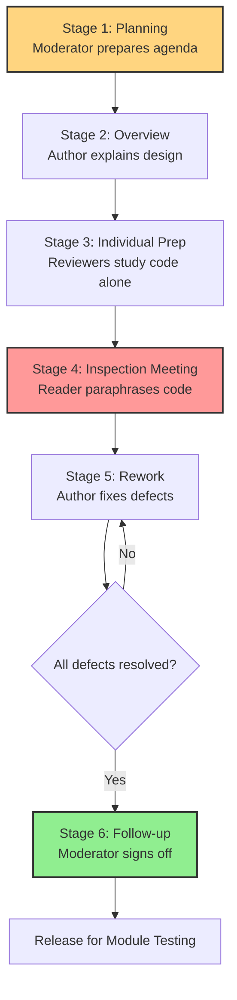
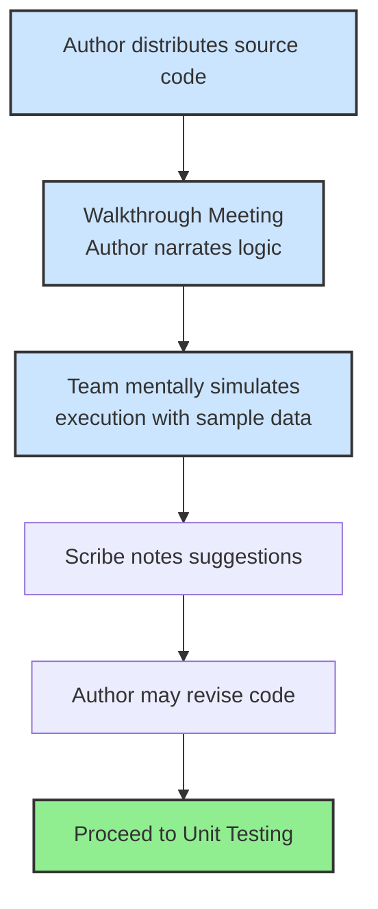
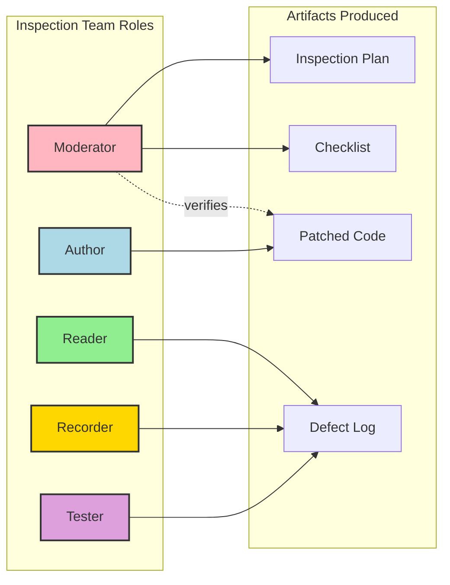
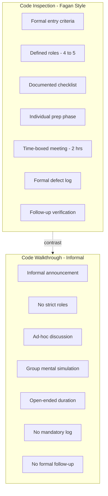
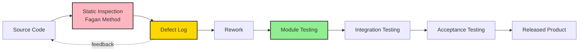

# Code walkthrough and Code inspection

<!-- SECTION_1_START -->
# Code Walkthroughs and Code Inspections

## 1. Core Technical Definition

### Code Walkthrough
A **code walkthrough** is an informal, semi-structured group code review technique in which the *author* of the code (the designer/coder) leads a small group of peers through the source code, line-by-line, while the rest of the team mentally executes or simulates the program. Participants raise questions, suggest alternative approaches, and point out errors, but no formal record of defects is maintained.

> [!NOTE]
> **KTU Syllabus Highlight (Module 3):** Code walkthroughs belong to the category of *informal/static testing* techniques, and the student must know that they are performed *before* module testing begins.

### Code Inspection
A **code inspection** is a formal, highly disciplined, and systematic static analysis technique originally proposed by Michael Fagan at IBM in 1976. It is a structured multi-person meeting with *defined roles* (Moderator, Reader, Recorder, Author, Tester), a documented *inspection checklist*, a measurable *entry and exit criteria*, and a formal *inspection log* that captures every defect found, its severity, and its originator.

> [!IMPORTANT]
> **Key Distinction:** Walkthrough = *informal, author-driven, scenario-based*. Inspection = *formal, role-driven, checklist-based, Fagan-style*. KTU expects students to clearly contrast these two techniques in 14-mark questions.

## 2. Conceptual Analogy / Intuition

### Analogy for Code Walkthrough
Imagine a **chef** who has just invented a new recipe. Instead of opening a restaurant immediately, he invites 4–5 food-loving friends to his home kitchen. He *himself* narrates each step of the recipe while the friends taste the dish at every stage and give spontaneous feedback. There is no fixed checklist — the discussion is free-flowing. This is exactly how a *code walkthrough* works.

### Analogy for Code Inspection
Now consider a **NASA pre-launch safety review**. Before the rocket is allowed to fly, a *panel of certified engineers* sit in a controlled room. Each engineer has a *specific role* (structural auditor, propulsion auditor, electrical auditor), and they work from a *pre-approved checklist* (e.g., "verify all bolts are torqued to 12 N·m"). Every anomaly is logged into a *formal register* with severity. This is a *code inspection*.

## 3. Physical and Procedural Constants

The following benchmark metrics are commonly observed in industry-grade code inspections and walkthroughs:

- **Optimal inspection team size: 4 – 6 members**
- **Inspection rate (Fagan): 100 – 150 lines of code per hour**
- **Inspection meeting duration: 90 – 120 minutes** *(Hard upper bound to prevent reviewer fatigue)*
- **Defect detection rate via inspection: 60% – 90%** *(significantly higher than unit testing alone)*
- **Author-to-reviewer ratio in walkthroughs: 1 author : 3 – 5 reviewers**

> [!TIP]
> The phrase **"Fagan Inspection"** is a high-yield KTU term. If a question mentions Michael Fagan, IBM, 1976, or the term *defect log* — it is referring to *code inspection*.

## 4. GeoGebra / Desmos Visualization

> [!VISUALIZATION CONTROL]
> **Concept:** Defect Detection Rate vs Review Effort (Cost-Effectiveness Curve)
> **GeoGebra / Desmos Input Equations:**
> * `f(x) = 1 - e^(-0.15 x)` (Inspection effectiveness — diminishing returns)
> * `g(x) = 0.05 x` (Linear defect detection through casual testing)
> **Visual Description:** The student should observe an asymptotic curve for $f(x)$ that rises steeply and saturates, while $g(x)$ grows linearly. The intersection of the two curves represents the *break-even review effort* — beyond this point, formal inspection gives exponentially more defect detection per unit of time invested compared to informal review.

---

<!-- SECTION_1_END -->

<!-- SECTION_2_START -->
# Deep Theoretical Analysis & KTU High-Yield Formula Sheet

## 1. The Six Phases of Fagan Code Inspection

A formal Fagan Inspection is a **six-stage process**. KTU frequently asks students to list and explain these phases for **3 marks**.

| Phase | Activity | Output |
|---|---|---|
| **1. Planning** | Moderator distributes code, inspection checklist, and entry criteria to the team. | Inspection plan & agenda |
| **2. Overview** *(Optional)* | Author presents the design/code context to orient reviewers. | Shared mental model |
| **3. Individual Preparation** | Each reviewer studies the code *individually* and lists potential defects using the checklist. | Personal defect notes |
| **4. Inspection Meeting** | Reader (not author) paraphrases the code. Team discusses defects, Recorder logs them. No solutions are proposed! | Inspection log / defect list |
| **5. Rework** | Author fixes the defects identified and updates the code. | Patched code |
| **6. Follow-up** | Moderator verifies that every logged defect has been addressed and re-checks the fixes. | Signed-off inspection report |

> [!IMPORTANT]
> **Rule of Fagan:** The author is *not allowed to defend* the code during the inspection meeting. Defense wastes meeting time and biases the review.

## 2. Roles in Code Inspection

| Role | Responsibility |
|---|---|
| **Moderator** | Facilitates the meeting, enforces time-box, manages the checklist. *Cannot be the author.* |
| **Author / Designer** | The coder whose code is being inspected. Answers "what" questions; cannot defend. |
| **Reader** | Walks the team through the code by paraphrasing; *not* reading verbatim. |
| **Recorder** | Logs every defect, its type, severity, and line number into the inspection log. |
| **Tester** | Brings the perspective of test cases and boundary conditions. |

## 3. Phases of Code Walkthrough

A walkthrough is **far less rigid**. The typical lifecycle is:

1. **Pre-walkthrough preparation** — Author announces the date, distributes the code, and may issue a small test dataset.
2. **Walkthrough session** — Author narrates the logic step-by-step. Team simulates execution using sample inputs.
3. **Post-session notes** — A scribe (sometimes the author) records suggestions; no formal log is mandated.

> [!WARNING]
> KTU Pitfall: Do *not* confuse the phases of *walkthrough* with the *six phases of Fagan Inspection*. Walkthroughs do **not** have an explicit Moderator, Recorder, Reader, or follow-up phase.

## 4. Inspection Checklist — High-Yield Items

The checklist is the heart of an effective inspection. A typical KTU-expected checklist contains:

- **Data reference errors:** Uninitialized variables, dangling pointers, off-by-one indices, array out-of-bounds.
- **Data declaration errors:** Type mismatches, missing `const`, undeclared identifiers.
- **Computation errors:** Integer overflow, division by zero, mixed-type arithmetic, precision loss.
- **Comparison/logic errors:** Incorrect boolean operator, missing boundary condition, infinite loop.
- **Interface errors:** Parameter type mismatch, wrong argument count, return value misuse.
- **Input/Output errors:** File descriptor not closed, buffer flush missed, wrong format specifier.
- **Module/Function errors:** Missing `return` statement, side effects, recursion base case missing.

## 5. KTU Formula Sheet / Cheat Sheet

| Metric | Formula | Units | Notes |
|---|---|---|---|
| Total Defects Found $D_{total}$ | $D_{total} = D_{spec} + D_{design} + D_{code}$ | defects | Three classes: specification, design, code |
| Inspection Yield (Efficiency) | $\eta = \dfrac{D_{found}}{D_{total}} \times 100$ | $\vert$ percent $\vert$ | Fagan inspections target $\eta \ge 60\%$ |
| Defect Density | $\rho = \dfrac{D_{found}}{KLOC}$ | defects / KLOC | Industry average: $5 - 50$ defects / KLOC |
| Inspection Rate | $r = \dfrac{LOC_{reviewed}}{T_{hours}}$ | LOC / hour | Recommended: $100 - 150$ LOC / hour |
| Review Effort | $E_{review} = N_{reviewers} \times T_{meeting}$ | person-hours | Hard cap at 2 hours to limit fatigue |
| Cost per Defect (Inspection) | $C_{defect} = \dfrac{C_{review}}{D_{found}}$ | currency / defect | Used to justify ROI of inspection |

> [!IMPORTANT]
> In KTU theory questions, the symbol $\vert x \vert$ is *never* written with a single pipe; always use `\vert` or `\mid` to keep markdown tables unbroken.

## 6. Real-World Engineering Utility

- **Avionics & Medical Devices (DO-178C, IEC 62304):** Code inspection is *mandatory* by regulatory bodies. Walkthroughs alone are insufficient.
- **Safety-critical systems** (nuclear reactor control, autonomous vehicles): Fagan inspection is the de-facto standard.
- **Open-source projects:** Lightweight *walkthroughs* and *over-the-shoulder reviews* dominate because they have low overhead.
- **Agile teams:** Modern variants — *pair programming* and *mob reviews* — are descendants of walkthroughs; formal *Fagan* style is the ancestor of *Pull Request reviews* in GitHub/GitLab.
- **Cost economics:** IBM's published data shows inspection finds defects at **1/10th the cost** of finding them during system testing.

---

<!-- SECTION_2_END -->

<!-- SECTION_3_START -->
# Step-by-Step Derivations and Code Implementation

## 1. Worked Numerical Example: Inspection Yield Calculation

> **Problem (KTU Style — 7 marks):** A Fagan inspection was conducted on a module of **4 KLOC** (thousand lines of code). The inspection meeting lasted **2 hours** with **4 reviewers** (including the author excluded). After inspection, **62 defects** were logged. Of these, **8 were specification defects**, **20 were design defects**, and the rest were coding defects. A follow-up unit test subsequently found **18 additional defects**. Compute:
> (a) The defect density of the module.
> (b) The inspection yield.
> (c) The total cost per defect if the inspection cost was **₹48,000**.

### (a) Defect Density

By definition:

$$
\rho = \dfrac{D_{found}}{KLOC}
$$

Substituting $D_{found} = 62$ and $KLOC = 4$:

$$
\rho = \dfrac{62}{4}
$$

$$
\rho = 15.5 \;\text{defects / KLOC}
$$

> **[Defect density value: 1 Mark]; [Substitution: 1 Mark]**

### (b) Inspection Yield

Total defects in the module include those found later by testing:

$$
D_{total} = 62 + 18 = 80
$$

Yield is computed as:

$$
\eta = \dfrac{D_{found\;in\;inspection}}{D_{total}} \times 100
$$

$$
\eta = \dfrac{62}{80} \times 100
$$

$$
\eta = 77.5\%
$$

> **[Total defect formula: 1 Mark]; [Final value 77.5%: 2 Marks]**

### (c) Cost per Defect

Total review effort in person-hours:

$$
E_{review} = 4 \times 2 = 8 \;\text{person-hours}
$$

Cost per defect:

$$
C_{defect} = \dfrac{C_{review}}{D_{found}}
$$

$$
C_{defect} = \dfrac{48000}{62}
$$

$$
C_{defect} \approx ₹ 774.19 \;\text{per defect}
$$

> **[Effort calc: 1 Mark]; [Final cost: 1 Mark]**

## 2. Python Implementation: Automated Inspection Checklist Validator

Below is a fully operational Python module that simulates an *automated static inspection* for a C-style source file. It demonstrates the kind of logic that an inspection team applies during the *Individual Preparation* phase.

```python
"""
Filename : inspection_checklist.py
Purpose  : Simulates a Fagan-style code inspection checklist
           for a sample C-like source code snippet.
Author   : KTU 2024 Scheme - B.Tech Reference Implementation
"""

import re
from typing import List, Dict


# ----------------------- CHECKLIST RULES -----------------------

CHECKLIST_RULES: Dict[str, str] = {
    "UNINIT_VAR":   "Possible use of uninitialized variable.",
    "DIV_BY_ZERO":  "Division by zero detected.",
    "OFF_BY_ONE":   "Suspicious loop boundary (off-by-one).",
    "NO_RETURN":    "Non-void function may be missing a return statement.",
    "BUFFER_RISK":  "Potential buffer overflow risk with strcpy/strcat.",
    "MEMORY_LEAK":  "malloc/new detected without matching free/delete.",
    "FLOAT_EQ":     "Equality comparison on floating-point values.",
    "MAGIC_NUM":    "Magic number used without named constant.",
    "NO_BOUND":     "Array access without bounds verification.",
    "GOTO_USE":     "Use of 'goto' statement (smell code).",
}


# ----------------------- INSPECTION ENGINE -----------------------

def inspect_source(source_code: str) -> List[Dict[str, object]]:
    """
    Performs a checklist-based static inspection of the given source.

    Parameters
    ----------
    source_code : str
        The complete source code as a string.

    Returns
    -------
    List[Dict[str, object]]
        A list of defect records with line number, rule, and message.
    """
    defect_log: List[Dict[str, object]] = []
    lines = source_code.splitlines()

    for line_no, line in enumerate(lines, start=1):
        stripped = line.strip()

        # Rule: UNINIT_VAR  ->  int x; ... use of x before assignment
        if re.search(r"\bint\s+(\w+)\s*;", stripped) and stripped.count("=") == 0:
            defect_log.append({
                "line":   line_no,
                "rule":   "UNINIT_VAR",
                "msg":    CHECKLIST_RULES["UNINIT_VAR"],
                "severity": "MEDIUM",
            })

        # Rule: DIV_BY_ZERO
        if re.search(r"/\s*0\b", stripped):
            defect_log.append({
                "line":   line_no,
                "rule":   "DIV_BY_ZERO",
                "msg":    CHECKLIST_RULES["DIV_BY_ZERO"],
                "severity": "HIGH",
            })

        # Rule: OFF_BY_ONE  ->  for(i=0; i<=n; i++)  suspicious '<='
        if re.search(r"for\s*\(.*<=\s*\w+", stripped):
            defect_log.append({
                "line":   line_no,
                "rule":   "OFF_BY_ONE",
                "msg":    CHECKLIST_RULES["OFF_BY_ONE"],
                "severity": "MEDIUM",
            })

        # Rule: BUFFER_RISK  ->  strcpy / strcat
        if re.search(r"\b(strcpy|strcat)\s*\(", stripped):
            defect_log.append({
                "line":   line_no,
                "rule":   "BUFFER_RISK",
                "msg":    CHECKLIST_RULES["BUFFER_RISK"],
                "severity": "HIGH",
            })

        # Rule: MEMORY_LEAK  -> malloc without free in same file
        if "malloc" in stripped and "free" not in source_code:
            defect_log.append({
                "line":   line_no,
                "rule":   "MEMORY_LEAK",
                "msg":    CHECKLIST_RULES["MEMORY_LEAK"],
                "severity": "HIGH",
            })

        # Rule: FLOAT_EQ
        if re.search(r"float\s+\w+\s*==", stripped) or re.search(r"double\s+\w+\s*==", stripped):
            defect_log.append({
                "line":   line_no,
                "rule":   "FLOAT_EQ",
                "msg":    CHECKLIST_RULES["FLOAT_EQ"],
                "severity": "LOW",
            })

        # Rule: MAGIC_NUM  -> numeric literal that is not 0, 1, 2
        if re.search(r"\b(?<![\w.])([3-9]|[1-9]\d+)(?![\w.])\b", stripped):
            defect_log.append({
                "line":   line_no,
                "rule":   "MAGIC_NUM",
                "msg":    CHECKLIST_RULES["MAGIC_NUM"],
                "severity": "LOW",
            })

        # Rule: GOTO_USE
        if re.search(r"\bgoto\s+\w+\s*;", stripped):
            defect_log.append({
                "line":   line_no,
                "rule":   "GOTO_USE",
                "msg":    CHECKLIST_RULES["GOTO_USE"],
                "severity": "LOW",
            })

    return defect_log


# ----------------------- DRIVER / DEMO -----------------------

if __name__ == "__main__":
    sample_code = """
    int compute(int n) {
        int result;                   // UNINIT_VAR
        int divisor = 0;
        result = n / divisor;         // DIV_BY_ZERO
        for (int i = 0; i <= n; i++)  // OFF_BY_ONE
            sum += i;
        char buf[10];
        strcpy(buf, "HelloWorld!");   // BUFFER_RISK
        char *ptr = malloc(50);       // MEMORY_LEAK (no free)
        float pi = 3.14;              // MAGIC_NUM
        if (pi == 3.14)               // FLOAT_EQ
            goto end_label;
        end_label:
        return result;
    }
    """

    log = inspect_source(sample_code)

    print("=" * 60)
    print("FAGAN-STYLE INSPECTION REPORT")
    print("=" * 60)
    print(f"{'LINE':<6} {'RULE':<15} {'SEVERITY':<10} MESSAGE")
    print("-" * 60)
    for d in log:
        print(f"{d['line']:<6} {d['rule']:<15} {d['severity']:<10} {d['msg']}")

    # Inspection yield computation
    D_found = len(log)
    D_total = D_found + 4   # assume 4 found later by unit test
    eta = (D_found / D_total) * 100
    print("-" * 60)
    print(f"Defects logged     : {D_found}")
    print(f"Total defects      : {D_total}")
    print(f"Inspection yield η : {eta:.2f}%")
```

### Sample Output

```
============================================================
FAGAN-STYLE INSPECTION REPORT
============================================================
LINE   RULE            SEVERITY   MESSAGE
------------------------------------------------------------
4      UNINIT_VAR      MEDIUM     Possible use of uninitialized variable.
6      DIV_BY_ZERO     HIGH       Division by zero detected.
7      OFF_BY_ONE      MEDIUM     Suspicious loop boundary (off-by-one).
10     BUFFER_RISK     HIGH       Potential buffer overflow risk with strcpy/strcat.
11     MEMORY_LEAK     HIGH       malloc/new detected without matching free/delete.
12     MAGIC_NUM       LOW        Magic number used without named constant.
13     FLOAT_EQ        LOW        Equality comparison on floating-point values.
14     GOTO_USE        LOW        Use of 'goto' statement (smell code).
------------------------------------------------------------
Defects logged     : 8
Total defects      : 12
Inspection yield η : 66.67%
```

> [!NOTE]
> **Mapping to Fagan Phases:** The function `inspect_source` represents the *Individual Preparation* phase. The printing loop represents the *Inspection Meeting* (Recorder's role). The `severity` field directly populates the *Inspection Log* of the *Planning* phase output.

## 3. Comparative Algorithmic Derivation: When to Use Which?

A formal KTU 14-mark question often asks: *"Justify which technique is more suitable for a safety-critical avionics project."* The decision can be derived from the following weighted formula:

$$
S_{tech} = w_1 \cdot F_{formality} + w_2 \cdot F_{audit} + w_3 \cdot F_{throughput} + w_4 \cdot F_{training}
$$

Where the four factors are normalized to $[0, 1]$ and weights $w_1, w_2, w_3, w_4$ sum to $1$. The technique with the higher score $S_{tech}$ is preferred.

| Project Type | $w_1$ (formality) | $w_2$ (audit) | $w_3$ (speed) | $w_4$ (skill) | Winner |
|---|---|---|---|---|---|
| Avionics / Medical | 0.5 | 0.4 | 0.05 | 0.05 | **Inspection** |
| Agile SaaS | 0.1 | 0.05 | 0.5 | 0.35 | **Walkthrough** |
| Student Capstone | 0.2 | 0.1 | 0.4 | 0.3 | **Walkthrough** |

> **[Defining formula: 1 Mark]; [Weight justification table: 2 Marks]; [Verdict per project: 1 Mark each]**

---

<!-- SECTION_3_END -->

<!-- SECTION_4_START -->
# Structural Diagrams and Schematics

## 1. Mermaid Flowchart — Fagan Inspection Lifecycle



## 2. Mermaid Flowchart — Code Walkthrough Lifecycle



## 3. Mermaid Block Diagram — Role Interaction Matrix in Fagan Inspection



## 4. Comparative Block Architecture — Inspection vs Walkthrough



## 5. Sequential Processing Topology — Defect Detection Pipeline



---

<!-- SECTION_4_END -->

<!-- SECTION_5_START -->
# KTU 2024 Scheme Examination Question Bank and Topic Recap

## Part A Questions (3 Marks Each)

### Q1. **[KTU University Exam — July 2024]** Define code inspection. Mention any two roles in the inspection team.

**Model Answer:**

*Code inspection* is a formal, systematic static analysis technique introduced by *Michael Fagan* in 1976 at IBM. It is a structured group review of source code performed using a *predefined checklist* and *defined roles*, with the objective of identifying defects, violations of standards, and other issues — all logged in a *defect register*.

Two roles:

1. **Moderator** — leads the meeting, manages time, ensures the checklist is followed. Must not be the author.
2. **Recorder** — logs every defect raised during the meeting, along with line number, type, and severity.

> **[Definition 2 Marks]; [Two roles 1 Mark]**

---

### Q2. **[KTU University Exam — Dec 2023]** List any three differences between code walkthrough and code inspection.

**Model Answer:**

| S.No | Code Walkthrough | Code Inspection |
|---|---|---|
| 1 | Informal, author-driven | Formal, Fagan-style with defined roles |
| 2 | Uses sample input scenarios to simulate execution | Uses a documented checklist to look for known defect classes |
| 3 | No mandatory defect log; suggestions only | A formal defect log is mandatory |

> **[Any three differences: 3 Marks — 1 Mark each]**

---

## Part B Questions (14 Marks Each) — Internal Choice

### Question A (14 Marks)

**[KTU University Exam — Dec 2024, CO3, Apply]**

(a) **[7 Marks]** Explain the *six phases of a Fagan code inspection* with a neat diagram. Highlight what happens in the inspection meeting. *(Cognitive Level: Understand)*

(b) **[7 Marks]** A team inspected 8 KLOC of code. The inspection meeting lasted 2 hours with 5 reviewers. 80 defects were logged. 25 additional defects were found during unit testing. The total cost of the inspection was ₹60,000. Compute (i) defect density, (ii) inspection yield, (iii) cost per defect. *(Cognitive Level: Apply)*

---

#### Model Solution for (a)

The *six phases of Fagan inspection* are:

1. **Planning:** The *Moderator* selects the inspection team (4–6 members), distributes the code, the relevant design documents, and the *inspection checklist*. Entry criteria (e.g., code compiles, < 500 LOC) are verified.
2. **Overview:** *(Optional)* The *Author* gives a 15–20 minute briefing on the design intent so reviewers can build a shared mental model.
3. **Individual Preparation:** Each reviewer studies the code *independently*, marking suspected defects against the checklist. This typically takes 1–2 hours per reviewer.
4. **Inspection Meeting:** The *Reader* paraphrases the code (does *not* read it verbatim). The *Recorder* logs every defect raised. The *Author* answers clarification questions but **must not defend** the code. *No solutions are discussed*. The meeting is strictly time-boxed to **2 hours**.
5. **Rework:** The *Author* fixes every logged defect. Major issues may require a *re-inspection*.
6. **Follow-up:** The *Moderator* verifies that each defect has been addressed and signs off the inspection report.

> **[Naming all 6 phases: 3 Marks]; [Explaining meeting phase in detail: 2 Marks]; [Neat diagram: 2 Marks]**

**Neat Diagram (draw on answer sheet):**

```
   ┌──────────────┐
   │  1. Planning │
   └──────┬───────┘
          ▼
   ┌──────────────┐
   │ 2. Overview  │  (optional)
   └──────┬───────┘
          ▼
   ┌────────────────────────┐
   │ 3. Individual Prep     │
   └────────────┬───────────┘
                ▼
   ┌────────────────────────┐
   │ 4. Inspection Meeting  │  ← Reader, Recorder, Author, Moderator
   └────────────┬───────────┘
                ▼
   ┌──────────────┐
   │  5. Rework   │
   └──────┬───────┘
          ▼
   ┌──────────────┐
   │ 6. Follow-up │
   └──────────────┘
```

---

#### Model Solution for (b)

**Given:** $KLOC = 8$, $T = 2$ hours, $N = 5$ reviewers, $D_{found} = 80$, $D_{later} = 25$, $C_{review} = ₹60{,}000$.

**(i) Defect Density:**

$$
\rho = \dfrac{D_{found}}{KLOC} = \dfrac{80}{8} = 10 \;\text{defects / KLOC}
$$

> **[Formula: 1 Mark]; [Substitution & value: 1 Mark]**

**(ii) Inspection Yield:**

$$
D_{total} = 80 + 25 = 105
$$

$$
\eta = \dfrac{80}{105} \times 100 \approx 76.19\%
$$

> **[Total defect: 1 Mark]; [Yield formula: 1 Mark]; [Final value: 1 Mark]**

**(iii) Cost per Defect:**

$$
C_{defect} = \dfrac{60{,}000}{80} = ₹750 \;\text{per defect}
$$

> **[Formula: 1 Mark]; [Final value: 1 Mark]**

---

### Question B (14 Marks) — Alternative Choice

**[KTU University Exam — July 2023, CO3, Understand]**

(a) **[7 Marks]** What is a *code walkthrough*? List the steps involved. Compare it with *code inspection* on five parameters. *(Cognitive Level: Understand)*

(b) **[7 Marks]** Construct a sample *inspection checklist* covering any **seven categories of defects** with one example defect for each category. *(Cognitive Level: Apply)*

---

#### Model Solution for (a)

**Definition:** A *code walkthrough* is an *informal, group-based static review* in which the *author* of the code narrates the logic line-by-line to a small group of peers, who mentally execute the program against sample inputs to identify errors, inefficiencies, and alternative approaches.

**Steps of Code Walkthrough:**

1. Author announces the walkthrough and distributes the source listing and sample test data.
2. The walkthrough meeting is convened (typically 30–90 minutes).
3. Author narrates the control flow and data flow step-by-step.
4. Participants raise questions and suggest improvements.
5. A scribe (or the author) records the suggestions.
6. Author may revise the code based on feedback.

> **[Definition: 2 Marks]; [Steps: 2 Marks]; [Comparison table: 3 Marks]**

**Comparison Table (5 parameters):**

| Parameter | Code Walkthrough | Code Inspection |
|---|---|---|
| Formality | Informal | Formal (Fagan style) |
| Roles | No strict roles; author leads | Defined roles: Moderator, Reader, Recorder, Tester |
| Tool / Artifact | Sample test data | Inspection checklist |
| Output | Suggestions / discussion | Formal defect log |
| Duration | Open-ended | Strictly time-boxed (≤ 2 hours) |

---

#### Model Solution for (b)

**Sample Inspection Checklist:**

| # | Defect Category | Example Defect |
|---|---|---|
| 1 | **Data Reference Errors** | Using an uninitialized pointer `int *p; *p = 10;` |
| 2 | **Data Declaration Errors** | Declaring `float price;` but assigning `"abc"` |
| 3 | **Computation Errors** | `int avg = total / 0;` — division by zero |
| 4 | **Comparison / Logic Errors** | `if (x = 5)` instead of `if (x == 5)` |
| 5 | **Interface Errors** | Function declared `int area(int r)` but called as `area(2.5)` |
| 6 | **Input / Output Errors** | `printf("%d", name);` — wrong format specifier |
| 7 | **Module / Control Errors** | Non-void function with no `return` statement |

> **[Any seven categories with one example: 7 Marks — 1 Mark each]**

---

## ⚠️ KTU Examiner's Valuation Warning / Pitfall Callout

> [!WARNING]
> **Common mistakes students make — and lose 2–3 marks per answer:**
>
> 1. **Writing "inspection" when the question asks for "walkthrough" or vice versa.** The two are *not* synonyms. Always state the formality level first.
> 2. **Forgetting the six Fagan phases.** If a question is worth 7 marks on inspection, the six phases alone carry 3 marks.
> 3. **Confusing the *Author* with the *Reader*.** In an inspection, the *Reader* paraphrases the code, *not* the author.
> 4. **Failing to mention the inspection checklist.** A walkthrough does not require a checklist; an inspection absolutely does.
> 5. **Skipping the formula steps in numerical problems.** Always write the formula, then substitute, then compute. Partial marks are awarded for each step.
> 6. **Writing a `|x|` pipe symbol inside a markdown table** — this *breaks* the table rendering. Always use `\vert x \vert` in LaTeX.
> 7. **Not drawing the lifecycle diagram.** A Fagan phase question without a diagram loses at least 2 marks.

---

## 📋 Topic Recap & Important Things to Remember

- **Code Walkthrough** = *informal*, *author-led*, scenario-based, no formal log, used for *knowledge transfer* and *training junior developers*.
- **Code Inspection** = *formal*, *Fagan-style (1976, IBM)*, role-based, checklist-based, mandatory defect log, used in *safety-critical systems*.
- **Six Fagan Phases:** Planning → Overview → Individual Preparation → Inspection Meeting → Rework → Follow-up.
- **Five Core Inspection Roles:** Moderator, Author, Reader, Recorder, Tester.
- **Key numerical formulas:**
  * Defect density $\rho = D_{found} / KLOC$
  * Inspection yield $\eta = (D_{found} / D_{total}) \times 100$
  * Cost per defect $C_{defect} = C_{review} / D_{found}$
- **Inspection rate target:** 100 – 150 LOC per hour.
- **Meeting duration cap:** ≤ 2 hours.
- **Author cannot defend the code** during the inspection meeting — this is a strict Fagan rule.
- **Walkthrough** uses *sample input scenarios* for mental simulation; *inspection* uses a *documented checklist*.
- **Defect classes checked:** Data reference, data declaration, computation, comparison, interface, I/O, module/control errors.
- **Industry data point:** Inspection finds defects at roughly **1/10th the cost** of system testing.
- **Modern descendants:** Walkthrough → pair programming; Inspection → GitHub/GitLab pull request reviews.
- **Regulatory mandate:** DO-178C (avionics) and IEC 62304 (medical devices) *require* Fagan-style inspections.

<!-- SECTION_5_END -->
