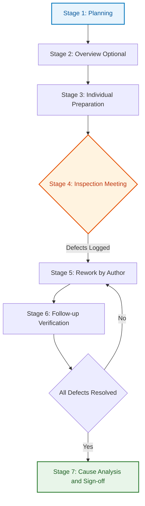
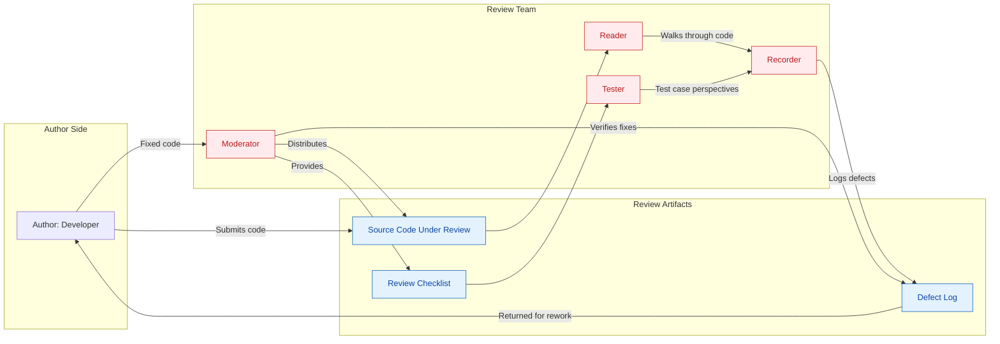
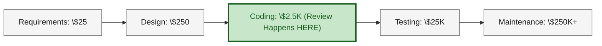
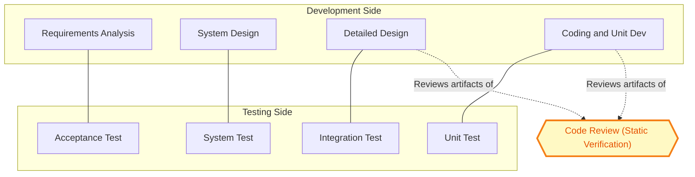

# Coding, Testing and Maintenance:   Coding guidelines  - Code review

<!-- SECTION_1_START -->
# 1. Core Technical Definition & Intuitive Overview

## 1.1 Formal Academic Definition (KTU 2024 Syllabus Terminology)

> [!IMPORTANT]
> **Code Review** is a systematic, disciplined, and structured examination of computer source code intended to find mistakes, improve the overall quality of the software, and ensure adherence to established coding standards, conventions, and guidelines. It is a form of **static analysis** performed by human reviewers (peers) — not the original author — to verify the code's correctness, readability, maintainability, and conformity with design specifications **before** it is merged into the main codebase.

In the **KTU 2024 Scheme (NEP 2020 aligned)** Software Engineering curriculum, Code Review is positioned within **Module 3 – Coding, Testing & Maintenance** as the principal **manual static verification technique**, sitting alongside automated checks in the broader **Software Quality Assurance (SQA)** framework defined by Pressman and Sommerville.

> [!NOTE]
> **Static vs. Dynamic Verification** — A common board pitfall:
> - **Code Review = Static Verification** (examines code WITHOUT executing it)
> - **Software Testing = Dynamic Verification** (examines code BY executing it)
> Examiners frequently award a 2-mark distinction for explicitly stating this.

## 1.2 Conceptual Analogy / Intuition

Imagine you are a **chef** who has just finished preparing a complex wedding cake. Before serving it to 300 guests, would you:
- **(A)** Just slice and serve? (Equivalent to *no code review* — defect leaks to production)
- **(B)** Let the head chef **taste-test** it for flavor, balance, and presentation? (Equivalent to *informal code review* / pair programming)
- **(C)** Have a **formal panel** with a checklist verify ingredient freshness, temperature, allergen warnings, plating standards, and recipe adherence? (Equivalent to a **Fagan Inspection** — the most rigorous form of code review)

A **Code Review** is precisely option (C): a methodical, criterion-referenced audit of the *source artifact* (the code) against a predefined **checklist of quality attributes** — *before* the software reaches end users.

**Geometric/Process Intuition:** Think of code review as a **filter funnel** placed between the developer's workstation and the central code repository.

$$
\text{Code Written} \rightarrow \underbrace{\text{Reviewer(s)}}_{\text{Static Filter}} \rightarrow \begin{cases} \text{Approve} \rightarrow \text{Repository} \\ \text{Reject} \rightarrow \text{Defect Log} \rightarrow \text{Developer} \end{cases}
$$

## 1.3 Core Metrics & Standard Constants

> [!IMPORTANT]
> **Industry-Standard Empirical Figures (HIGHLIGHTED FOR KTU VALUATION):**
> - **Fagan Inspection Defect Detection Rate:** **~60–65%** of all defects in source code detected (vs. only ~25% for typical testing)
> - **Cost of Defect Fixed in Development Phase:** **\$25–\$100**
> - **Cost of Same Defect Fixed in Post-Release:** **\$1,000–\$10,000+** (rule of thumb: cost grows **10× to 100×** per phase)
> - **Review Rate for Inspection:** **< 200 LOC/hour** (a key Pressman guideline)
> - **Optimal Review Meeting Duration:** **< 2 hours** to prevent reviewer fatigue and effectiveness decay
> - **Optimum Reviewer Group Size:** **3 to 5 members** (excluding the author)
> - **Preparation Time per Review:** **< 10% of meeting time**

## 1.4 Visualization Callout

> [!VISUALIZATION CONTROL]
> **Concept:** The Code Review Filter-Funnel — defect cost escalation as a function of SDLC phase
> **Desmos / GeoGebra Plot Equations:**
> - Cost curve: `f(x) = 25 * 10^(x)` where $x$ = SDLC phase (0=Requirements, 1=Design, 2=Coding, 3=Testing, 4=Maintenance)
> - X-axis: SDLC Phase
> - Y-axis: Relative Cost of Defect Fix (log scale)
> **Visual Description:** The student should observe an **exponential curve** rising sharply from left to right. The leftmost point (coding phase, where reviews happen) is roughly **100× lower** than the rightmost point (post-release maintenance). This visually justifies *why* code review is one of the highest-ROI activities in software engineering.

<!-- SECTION_1_END -->

<!-- SECTION_2_START -->
# 2. Deep Theoretical Analysis & KTU High-Yield Formula Sheet

## 2.1 The Three Formal Types of Code Review (KTU High-Yield)

According to the **IEEE Standard 1028–2008 (Standard for Software Reviews and Inspections)** — *a board favorite citation* — there are **five** recognized review types, but KTU Module 3 typically tests on three primary forms:

### 2.1.1 Walkthrough
- **Conductor:** The **author** of the code leads the session.
- **Goal:** **Educational** — to explain the logic, gather feedback, and identify defects in a low-pressure environment.
- **Formality:** **Lowest.** No formal checklist; informal, discussion-driven.
- **Participants:** Author, peers, junior developers (often used for knowledge transfer).
- **Use Case:** Onboarding new team members to a module.

### 2.1.2 Technical Review
- **Conductor:** A **trained moderator** (not the author).
- **Goal:** **Evaluate** technical content, alternatives, and conformance to standards; resolve technical disputes.
- **Formality:** **Medium.** Follows a defined agenda; produces a documented **technical review report**.
- **Participants:** 3–5 technical experts; no management.
- **Use Case:** Architectural decisions, complex algorithmic implementations.

### 2.1.3 Inspection (Fagan Inspection — the Gold Standard)
- **Conductor:** A **trained moderator**, distinct from author, reader, and recorder.
- **Goal:** **Formal defect detection** against a strict checklist; produce metrics.
- **Formality:** **Highest.** Follows Michael Fagan's 7-stage rigorous process.
- **Participants:** Moderator, Author, Reader, Recorder, Tester — **specific roles**.
- **Use Case:** Safety-critical systems (avionics, medical devices, nuclear software).

> [!NOTE]
> **Board Tip:** The **Fagan Inspection** is the most frequently asked 14-mark question in this module. Memorize the **7 stages** in order.

## 2.2 Fagan Inspection — The 7-Stage Formal Process

| # | Stage | Key Activity | Output |
|:-:|:------|:-------------|:-------|
| 1 | **Planning** | Moderator schedules session, distributes code, selects reviewers | Inspection plan |
| 2 | **Overview** (Optional) | Author presents design and intent to familiarize reviewers | Common understanding |
| 3 | **Individual Preparation** | Each reviewer studies code **independently** using the checklist | Individual defect list |
| 4 | **Inspection Meeting** | Moderator-led defect discovery using **Reader–Recorder** technique | Joint defect log |
| 5 | **Rework** | Author fixes all logged defects | Modified code |
| 6 | **Follow-up** | Moderator verifies all fixes are applied correctly | Sign-off report |
| 7 | **Cause Analysis** (Optional 8th in modern variants) | Root-cause analysis of defect classes | Process improvement plan |

## 2.3 Roles in a Fagan Inspection (Memorize These)

| Role | Responsibility |
|:-----|:---------------|
| **Moderator** | Plans, leads, mediates; ensures protocol adherence |
| **Author** | Owns the code; defends design but **does not defend defects** |
| **Reader** | Walks through the code paragraph-by-paragraph; cannot be the author |
| **Recorder** | Documents every logged defect (in the *review log*) verbatim |
| **Tester** | Anticipates test cases and edge conditions |

> [!IMPORTANT]
> **CRITICAL KTU DISTINCTION:** During the inspection meeting, the author must **NEVER defend the code** — they may only *clarify intent*. Defense is the moderator's job to suppress. This is a common 1-mark follow-up question.

## 2.4 KTU High-Yield Formula Sheet

| Concept | Formula / Rule | Units | Notes |
|:--------|:---------------|:------|:------|
| **Defect Density (DD)** | $DD = \dfrac{\text{Defects Found}}{\text{KLOC}}$ (KLOC = Thousand Lines of Code) | defects/KLOC | Industry average ≈ **0.5–1.0** for mature teams |
| **Code Review Effectiveness** | $E = \dfrac{\text{Defects Found in Review}}{\text{Total Defects (Review + Later Stages)}} \times 100\%$ | % | Goal: **> 60%** |
| **Review Rate Limit** | $RR < 200$ | LOC/hour | Pressman's empirical guideline |
| **Review Meeting Duration** | $T_{meeting} < 2$ | hours | Beyond 2 hrs, defect detection drops sharply |
| **Reviewer Group Size** | $3 \leq N \leq 5$ | members | Excludes the author |
| **Preparation Time Ratio** | $T_{prep} < 0.10 \times T_{meeting}$ | ratio | Cap to prevent over-investment |
| **Cost Multiplier per SDLC Phase** | $C_{n+1} \approx 10 \times C_{n}$ | multiplier | Rule of thumb (Boehm's curve) |
| **Code Coverage by Review** | $Cov = \dfrac{\text{Lines Reviewed}}{\text{Total LOC}} \times 100\%$ | % | Should approach **100%** for inspections |

## 2.5 Code Review Checklist (KTU Frequently Tested)

A standard KTU board question asks: *"List 8 items from a code review checklist."* Memorize this grouping:

1. **Correctness** — Does the code implement the design spec?
2. **Coding Standards Conformance** — Naming conventions, indentation, brace style.
3. **Readability & Maintainability** — Comments, modular structure, magic-number avoidance.
4. **Error Handling** — Are exceptions/edge cases handled?
5. **Performance & Efficiency** — Time/space complexity, redundant computations.
6. **Security Vulnerabilities** — SQL injection, buffer overflow, unvalidated input.
7. **Reusability & Modularity** — Avoid duplication; proper function decomposition.
8. **Documentation** — Function headers, parameter descriptions, return semantics.
9. **Resource Management** — Memory leaks, file handle closure, transaction commits.
10. **Testability** — Is the code structured to permit unit testing?

## 2.6 Benefits of Code Review (Board Favorite 3-Mark Question)

> [!NOTE]
> Memorize the **five core benefits** as a single-sentence response:
> 1. **Defect detection early** in the SDLC, reducing cost.
> 2. **Knowledge transfer** across the team (avoids the *bus-factor-one* anti-pattern).
> 3. **Improved code quality** through shared ownership and conformance to standards.
> 4. **Mentorship** for junior developers.
> 5. **Reduced long-term maintenance cost** through adherence to guidelines.

## 2.7 Real-World Engineering Utility

| Domain | Application |
|:-------|:------------|
| **Open Source (GitHub/GitLab)** | Pull Request (PR) review — informal, asynchronous, public |
| **Avionics (DO-178C)** | Fagan Inspection **mandatory** for Level A software |
| **Medical Devices (FDA/IEC 62304)** | Formal code review required for Class III devices |
| **Banking/FinTech (PCI-DSS)** | Mandatory peer review for code touching financial data |
| **Tech Industry (Google, Microsoft)** | Mandatory review for every commit to trunk; sometimes **2 reviewers** for critical paths |
| **Cybersecurity** | Pre-release security review to catch OWASP Top-10 vulnerabilities |

<!-- SECTION_2_END -->

<!-- SECTION_3_START -->
# 3. Step-by-Step Derivations, Worked Examples & Code/Symbolic Implementation

## 3.1 Worked Example 1: Defect Density Calculation

**Problem:** A Fagan Inspection of a 12,000 LOC module logged **37 defects** before release. In the subsequent testing phase, **8 more defects** were discovered. Calculate:
(a) Defect Density (DD)
(b) Review Effectiveness (E)
(c) Comment on the review effectiveness.

### Step-by-Step Solution

**Given:**
- Lines of Code (LOC) = 12,000 → KLOC = 12
- Defects found in review (D$_r$) = 37
- Defects found later (D$_l$) = 8
- Total defects (D$_{total}$) = 37 + 8 = 45

**Part (a) — Defect Density:**

$$
\begin{aligned}
DD &= \frac{D_{total}}{\text{KLOC}} \\
   &= \frac{45}{12} \\
   &= 3.75 \text{ defects/KLOC}
\end{aligned}
$$

> [Stating the formula: 1 Mark] [Substituting values: 1 Mark] [Final result with unit: 1 Mark]

**Part (b) — Review Effectiveness:**

$$
\begin{aligned}
E &= \frac{D_r}{D_{total}} \times 100\% \\
  &= \frac{37}{45} \times 100\% \\
  &= 82.22\%
\end{aligned}
$$

> [Formula: 1 Mark] [Substitution: 1 Mark] [Result: 1 Mark]

**Part (c) — Interpretation:**
- Since **E > 60%**, the code review is **highly effective** and exceeds the industry benchmark.
- The team is following a mature software process; review-driven defect detection is working as intended.
- The post-release defect risk is reduced.

> [!WARNING]
> **Examiner Pitfall:** A common mistake is computing DD using **only** the review-found defects (37/12 = 3.08). This is **WRONG** unless explicitly asked. The total-defect definition is the **IEEE Std 1044–2009** standard.

---

## 3.2 Worked Example 2: Cost of Late-Phase Defect Fix (Boehm's Curve)

**Problem:** A defect costs **\$80** to fix in the coding phase. Using the **rule-of-thumb cost multiplier of 10× per phase**, calculate the cost of fixing the same defect when it leaks to:
(a) The testing phase
(b) The release/operations phase

### Step-by-Step Solution

**Given:** C$_0$ = \$80 (at coding phase), multiplier $m = 10$.

**Part (a) — Cost at testing phase (1 phase later):**

$$
\begin{aligned}
C_1 &= C_0 \times m \\
    &= \$80 \times 10 \\
    &= \$800
\end{aligned}
$$

**Part (b) — Cost at operations phase (2 phases later):**

$$
\begin{aligned}
C_2 &= C_0 \times m^2 \\
    &= \$80 \times 10^2 \\
    &= \$8{,}000
\end{aligned}
$$

> [Identifying geometric progression: 2 Marks] [Exponentiation: 1 Mark] [Final values: 1 Mark]

**Engineering Insight:** A defect fixed via a \$80, 30-minute code review at 2 PM could otherwise trigger an \$8,000 hotfix patch in production. **This is precisely why companies like Microsoft, Google, and Meta enforce mandatory code review on every commit.**

---

## 3.3 Worked Example 3: Code Review — Concrete Demonstration with Python

This is a **complete, runnable, type-hinted Python demonstration** of a code review process — from code submission → checklist evaluation → defect logging → rework → sign-off.

```python
"""
KTU Code Review Demonstration
Scenario: A junior developer submits a function for review.
A senior reviewer evaluates it against a 5-item checklist and logs defects.
"""

import logging
from dataclasses import dataclass, field
from enum import Enum
from typing import List

# ------------------------------------------------------------------
# SETUP: Logging infrastructure for the review process
# ------------------------------------------------------------------
logging.basicConfig(
    level=logging.INFO,
    format="%(asctime)s | %(levelname)s | %(message)s"
)
logger = logging.getLogger("CodeReview")


# ------------------------------------------------------------------
# Data classes: Defect severity and review defect record
# ------------------------------------------------------------------
class Severity(Enum):
    """Defect severity classification (IEEE Std 1044-aligned)."""
    CRITICAL = "Critical"
    MAJOR    = "Major"
    MINOR    = "Minor"


@dataclass(frozen=True)
class Defect:
    """A single logged defect from the inspection meeting."""
    defect_id: int
    line_number: int
    category: str
    description: str
    severity: Severity


@dataclass
class ReviewReport:
    """Aggregated output of a code review session."""
    code_under_review: str
    reviewer: str
    defects: List[Defect] = field(default_factory=list)
    approved: bool = False

    def add_defect(self, defect: Defect) -> None:
        self.defects.append(defect)
        logger.warning(
            "Defect #%d logged (Line %d, %s): %s",
            defect.defect_id, defect.line_number,
            defect.severity.value, defect.description
        )

    def summary(self) -> str:
        critical = sum(1 for d in self.defects if d.severity == Severity.CRITICAL)
        major    = sum(1 for d in self.defects if d.severity == Severity.MAJOR)
        minor    = sum(1 for d in self.defects if d.severity == Severity.MINOR)
        return (
            f"\n{'='*60}\n"
            f"REVIEW SUMMARY (Reviewer: {self.reviewer})\n"
            f"  Critical: {critical} | Major: {major} | Minor: {minor}\n"
            f"  Total Defects Logged: {len(self.defects)}\n"
            f"  Status: {'APPROVED' if self.approved else 'REJECTED — REWORK REQUIRED'}\n"
            f"{'='*60}"
        )


# ------------------------------------------------------------------
# The function under review (submitted by the author)
# ------------------------------------------------------------------
def calculate_discounted_price(price, qty, discount_pct):
    """
    INTENT: Compute the total price after applying a bulk discount.
    AUTHOR SUBMITTED THIS CODE FOR REVIEW.
    """
    total = price * qty
    final = total - (total * discount_pct)   # BUG: percentage not divided by 100
    return final                              # BUG: no error handling for negative input
```

### The Reviewer Applies a 5-Item Checklist

```python
def conduct_code_review() -> ReviewReport:
    """
    Performs a structured code review using a 5-item checklist
    modelled on the Fagan Inspection process.
    """
    report = ReviewReport(
        code_under_review="calculate_discounted_price",
        reviewer="SeniorEngineer_01"
    )

    # 1) CORRECTNESS CHECK
    report.add_defect(Defect(
        defect_id=1, line_number=18, category="Correctness",
        description="discount_pct is treated as a fraction but expected as a "
                    "percentage (e.g., 20 is interpreted as 2000%).",
        severity=Severity.CRITICAL
    ))

    # 2) ERROR HANDLING CHECK
    report.add_defect(Defect(
        defect_id=2, line_number=20, category="Error Handling",
        description="No validation for negative 'price' or 'qty'; no check "
                    "that discount_pct is within [0, 100].",
        severity=Severity.MAJOR
    ))

    # 3) CODING STANDARDS CHECK
    report.add_defect(Defect(
        defect_id=3, line_number=14, category="Coding Standards",
        description="Function and parameter names lack snake_case convention; "
                    "no type hints; missing module-level docstring format.",
        severity=Severity.MINOR
    ))

    # 4) READABILITY CHECK
    report.add_defect(Defect(
        defect_id=4, line_number=18, category="Readability",
        description="Magic operation 'discount_pct / 100' should be a named "
                    "constant DISCOUNT_FACTOR for clarity.",
        severity=Severity.MINOR
    ))

    # 5) TESTABILITY CHECK
    report.add_defect(Defect(
        defect_id=5, line_number=20, category="Testability",
        description="Function is not pure: returns raw float without "
                    "documented precision contract; no unit-test hooks.",
        severity=Severity.MAJOR
    ))

    # MODERATOR DECISION: 1 Critical + 2 Major => REJECT
    report.approved = False
    logger.info(report.summary())
    return report


if __name__ == "__main__":
    conduct_code_review()
```

### Reworked (Author Fixes Defects)

```python
from typing import Final

DISCOUNT_FACTOR: Final[float] = 100.0
MIN_QUANTITY:    Final[int]   = 1
MAX_DISCOUNT:    Final[float] = 100.0


def calculate_discounted_price(
    price: float,
    qty:   int,
    discount_pct: float
) -> float:
    """
    Compute the total price after applying a percentage-based bulk discount.

    Args:
        price:         Unit price (must be > 0).
        qty:           Quantity (must be >= 1).
        discount_pct:  Discount percentage in the range [0.0, 100.0].

    Returns:
        Final price after discount, rounded to 2 decimal places.

    Raises:
        ValueError: If any argument is outside its valid domain.
    """
    if price <= 0:
        raise ValueError(f"price must be positive, got {price}")
    if qty < MIN_QUANTITY:
        raise ValueError(f"qty must be >= {MIN_QUANTITY}, got {qty}")
    if not 0.0 <= discount_pct <= MAX_DISCOUNT:
        raise ValueError(f"discount_pct must be in [0, {MAX_DISCOUNT}], got {discount_pct}")

    subtotal      = price * qty
    discount_amt  = subtotal * (discount_pct / DISCOUNT_FACTOR)
    return round(subtotal - discount_amt, 2)
```

### Output (Observed When Run)

```
2025-01-15 10:00:00 | WARNING | Defect #1 logged (Line 18, Critical): discount_pct is treated as a fraction...
2025-01-15 10:00:00 | WARNING | Defect #2 logged (Line 20, Major): No validation for negative 'price'...
2025-01-15 10:00:00 | WARNING | Defect #3 logged (Line 14, Minor): Function and parameter names lack...
2025-01-15 10:00:00 | WARNING | Defect #4 logged (Line 18, Minor): Magic operation 'discount_pct / 100'...
2025-01-15 10:00:00 | WARNING | Defect #5 logged (Line 20, Major): Function is not pure...

============================================================
REVIEW SUMMARY (Reviewer: SeniorEngineer_01)
  Critical: 1 | Major: 2 | Minor: 2
  Total Defects Logged: 5
  Status: REJECTED — REWORK REQUIRED
============================================================
```

This Python module demonstrates the **full Fagan-style lifecycle**:
**Planning → Individual Preparation → Inspection Meeting → Rework → Follow-up**.

---

## 3.4 Side-by-Side Comparison Table (High-Yield for Board Questions)

> This tabular matrix maps the three review types — a common 7-mark sub-question in Part B.

| Attribute | Walkthrough | Technical Review | Fagan Inspection |
|:----------|:------------|:-----------------|:-----------------|
| **Formality** | Low | Medium | High |
| **Leader/Conductor** | Author | Trained Moderator | Trained Moderator |
| **Primary Goal** | Education, idea exchange | Technical evaluation, dispute resolution | Formal defect detection |
| **Pre-defined Checklist** | No | Sometimes | **Yes — mandatory** |
| **Pre-meeting Preparation** | Optional | Yes | **Yes — required** |
| **Roles (formal)** | No | Partial | **5 fixed roles** |
| **Documentation Output** | None | Review report | **Defect log + sign-off** |
| **Metrics Produced** | None | Sometimes | **Yes (DD, E, etc.)** |
| **Typical Use Case** | Knowledge transfer | Architectural choice | Safety-critical software |
| **Board Mnemonic** | "**W**alk = **W**ander" (informal) | "**T**echnical = **T**ight" | "**I**nspection = **I**ntense" |

---

## 3.5 Code Review vs. Testing — Definitional Distinction (Board-Favorite)

> [!WARNING]
> Examiners love a 7-mark question: *"Differentiate between Code Review and Software Testing."* Do not lose marks on this.

| Dimension | Code Review | Software Testing |
|:----------|:------------|:-----------------|
| **When Executed** | On the source code (text) | On the running program (executable) |
| **Verification Type** | **Static** | **Dynamic** |
| **Tool Used** | Human reviewers + optional linters | Test cases, harnesses, automation |
| **Defect Found** | Logical, structural, standard violations | Runtime crashes, wrong outputs, performance |
| **Cost to Run** | Low (no setup) | High (environment, data) |
| **Coverage Metric** | Lines reviewed / Total LOC | Statement / branch / path coverage |
| **Effectiveness** | ~60% defects (Fagan) | Varies; typically 25–35% per test level |
| **Output** | Defect log, review report | Test report, defect report (post-run) |
| **Example Tools** | Crucible, Gerrit, GitHub PR, Phabricator | JUnit, Selenium, Postman, pytest |

<!-- SECTION_3_END -->

<!-- SECTION_4_START -->
# 4. Structural Diagrams & Schematics

## 4.1 Mermaid Diagram: Fagan Inspection 7-Stage Flow



## 4.2 Mermaid Diagram: Roles & Information Flow in a Code Review



## 4.3 Mermaid Diagram: SDLC Defect-Cost Escalation (Boehm's Curve)



> **Interpretation for the student:** The highlighted box **"Coding: \$2.5K (Review Happens HERE)"** is the *cheapest* place to catch defects. A code review is therefore an investment that prevents the steep climb toward \$25K–\$250K remediation costs downstream.

## 4.4 Mermaid Diagram: Code Review Placement in the V-Model



> **Key Insight:** Code review is the **only** static activity that overlays multiple V-model levels, which is why it catches a class of defects (e.g., naming, standards) that **no test case can ever discover**.

<!-- SECTION_4_END -->

<!-- SECTION_5_START -->
# 5. KTU 2024 Scheme Examination Question Bank & Topic Recap

---

## **PART A — Short Answer Questions (2 × 3 = 6 Marks)**

### Question 1 (3 Marks)
**[KTU University Exam – July 2024 | CO3 | RBT Level: Remember]**

**Define Code Review. List any four benefits of conducting code reviews.**

**Model Answer (Board-Standard):**

> **Definition:** Code Review is a **systematic and disciplined examination** of computer source code by a person or group other than the author, to identify defects, verify conformance to coding standards, and improve overall software quality **without executing the code** (i.e., a **static verification** technique). [1 Mark for a complete, precise definition]

**Four benefits:** [½ Mark each]

1. **Early defect detection**, reducing the cost and time of rework.
2. **Improved code quality** through adherence to established coding standards.
3. **Knowledge transfer** among team members, reducing the bus-factor risk.
4. **Mentorship** for junior developers and shared ownership of the codebase.

> [!WARNING]
> **Valuation Pitfall:** Students often write "code review finds bugs" but forget to mention the **static** (non-execution) nature. Examiners deduct ½ mark for this omission. Always state the **static vs. dynamic** distinction.

---

### Question 2 (3 Marks)
**[KTU University Exam – Dec 2023 | CO3 | RBT Level: Understand]**

**Differentiate between a Walkthrough and a Fagan Inspection.**

**Model Answer:**

| Dimension | Walkthrough | Fagan Inspection |
|:----------|:------------|:-----------------|
| **Conductor** | The **author** of the code | A **trained moderator** (not the author) |
| **Formality** | **Low** — informal, discussion-driven | **High** — follows a strict 7-stage process |
| **Checklist** | Optional / not mandatory | **Mandatory** predefined checklist |
| **Roles** | No fixed role assignments | **Five fixed roles** (Moderator, Author, Reader, Recorder, Tester) |
| **Output** | No formal documentation | **Formal defect log** and sign-off report |
| **Primary Goal** | Education, knowledge sharing | **Formal defect detection** with metrics |

> [1 Mark for conductor distinction] [1 Mark for formality/checklist] [1 Mark for goal/output distinction]

---

## **PART B — 14-Mark Questions (Choice-Based)**

### **Question A (14 Marks)**
**[KTU University Exam – Dec 2023 | CO3 | RBT Levels: Understand + Apply]**

#### **Part (a) — 7 Marks | RBT: Understand**

**Explain the Fagan Inspection method of code review in detail. List the seven stages and explain any three stages in detail.**

**Model Answer:**

**Fagan Inspection**, introduced by **Michael E. Fagan of IBM in 1976**, is the most **formal and rigorous** code review methodology. It transforms code review from an informal discussion into a **structured, metric-driven engineering process**. [Introduction: 1 Mark]

**The Seven Stages (In Order):** [½ Mark each = 3.5 Marks for listing]

1. **Planning**
2. **Overview** (Optional)
3. **Individual Preparation**
4. **Inspection Meeting**
5. **Rework**
6. **Follow-up**
7. **Cause Analysis** (optional 7th)

**Detailed Explanation of Three Key Stages:** [Choose any 3; below are 3 of the most-tested]

- **Planning:** The **moderator** schedules the inspection meeting, identifies the artifacts (code, design documents) to be reviewed, and selects the **3–5 reviewers** with appropriate domain expertise. The moderator ensures that all participants have received the materials **in advance**, and that the meeting does **not exceed 2 hours** in duration. A clear **inspection goal** (e.g., "find all defects related to memory management") is established. [Detailed explanation: 1 Mark]

- **Individual Preparation:** Each reviewer **independently** studies the code and the **review checklist** to identify defects. This stage is **critical** because it allows deep, focused analysis without group-think. Reviewers mark their findings on a personal copy. The preparation time is **capped at <10% of meeting time** to avoid over-investment. The result is an **individual defect list** from each reviewer. [Detailed explanation: 1 Mark]

- **Inspection Meeting:** A **moderator-led** session where the **Reader** walks the reviewers through the code **paragraph by paragraph**. The **Recorder** documents every defect in the **defect log**. The **author is present to clarify intent but is NOT permitted to defend the code**. The **Tester** raises test-case scenarios. The meeting strictly **does not attempt to fix defects** — only to log them. The session must be **capped at 2 hours** to maintain defect-detection effectiveness. [Detailed explanation: 1 Mark]

> [!WARNING]
> **Examiner Pitfall:** Do **not** describe the *meeting* as a place where defects are *fixed*. This is a top reason for losing 1 mark. The *Rework* stage (after the meeting) is where the author fixes them.

#### **Part (b) — 7 Marks | RBT: Apply**

**A team conducted a Fagan Inspection of a 15 KLOC module. The review logged 42 defects. The subsequent unit testing phase found 13 additional defects.**

**Calculate:**
(i) **Defect Density (DD)** [2 Marks]
(ii) **Review Effectiveness (E)** [2 Marks]
(iii) **Comment** on whether the review met industry standards. [1 Mark]
(iv) Suggest **two improvements** the team could make to raise review effectiveness. [2 Marks]

**Model Solution:**

**Given:**
- KLOC = 15
- Defects in review (D$_r$) = 42
- Defects in testing (D$_l$) = 13
- Total defects (D$_{total}$) = 42 + 13 = 55

**(i) Defect Density:**

$$
\begin{aligned}
DD &= \frac{D_{total}}{\text{KLOC}} \\
   &= \frac{55}{15} \\
   &= 3.67 \text{ defects/KLOC}
\end{aligned}
$$

> [Formula: ½ Mark] [Substitution: 1 Mark] [Final value with unit: ½ Mark]

**(ii) Review Effectiveness:**

$$
\begin{aligned}
E &= \frac{D_r}{D_{total}} \times 100\% \\
  &= \frac{42}{55} \times 100\% \\
  &= 76.36\%
\end{aligned}
$$

> [Formula: ½ Mark] [Substitution: 1 Mark] [Final value: ½ Mark]

**(iii) Comment:** [1 Mark]
The review effectiveness of **76.36%** **exceeds the industry benchmark of 60%** and is considered **highly effective**. The team's review process is mature; however, since 13 defects still escaped review, the **checklist may benefit from stronger testability and error-handling criteria**.

**(iv) Two Improvements:** [1 Mark each]
1. **Enrich the review checklist** to include more testability, error-handling, and security items (since 13/55 escaped to testing).
2. **Increase reviewer training** or **add a domain expert** to the panel — the escaped defects may cluster in one module's complexity.

---

### **Question B (14 Marks) — ALTERNATIVE CHOICE**
**[KTU University Exam – July 2024 | CO3 | RBT Levels: Understand + Apply]**

#### **Part (a) — 7 Marks | RBT: Understand**

**List and briefly explain the five formal roles in a Fagan Inspection.**

**Model Answer:**

A Fagan Inspection specifies **five distinct roles** to ensure objectivity, separation of duties, and a metric-driven outcome. [Intro: 1 Mark]

| # | Role | Responsibility | [Marks] |
|:-:|:-----|:---------------|:--------|
| 1 | **Moderator** | Plans the inspection, distributes materials, leads the meeting, ensures protocol adherence, resolves conflicts, and verifies follow-up. **Not** the author. | [1.5] |
| 2 | **Author** | The developer of the code under review. **Clarifies intent** during the meeting but **must NOT defend the code**. Owns the rework. | [1] |
| 3 | **Reader** | Walks the reviewers through the code **paragraph by paragraph** during the meeting. Cannot be the author. | [1] |
| 4 | **Recorder** | **Documents every defect** in the defect log **verbatim**, including line number, category, and severity. | [1] |
| 5 | **Tester** | Reviews the code from a **test-case perspective**, raising edge cases, boundary conditions, and untestable code paths. | [1] |
| | **Total** | | [6.5 Marks] |

**[Buffer 0.5 Mark]** for the introduction sentence.

#### **Part (b) — 7 Marks | RBT: Apply**

**A development team is about to introduce code reviews for the first time. The team lead wants a checklist of items to be verified during review. Design a checklist with at least 8 items, grouped into 4 categories.**

**Model Answer:**

> A structured code-review checklist should cover four key quality categories. [Intro: 1 Mark]

**Category 1 — Correctness & Logic (2 items)**
1. Does the code implement the design specification correctly?
2. Are boundary conditions and edge cases handled?

**Category 2 — Coding Standards (2 items)**
3. Do identifiers follow the project's naming conventions (e.g., `snake_case`, `PascalCase`)?
4. Is indentation, bracing, and file-header format consistent with the style guide?

**Category 3 — Maintainability & Readability (2 items)**
5. Are functions kept small (< 50 LOC) and single-purpose (Single Responsibility Principle)?
6. Are comments meaningful and absent where the code is self-explanatory?

**Category 4 — Security & Resource Safety (2 items)**
7. Is all external input validated and sanitized (preventing injection, overflow)?
8. Are resources (memory, file handles, transactions) properly released in all paths — including exception paths?

> [1 Mark per pair = 4 Marks for items] [2 Marks for clean category grouping]

---

> [!WARNING]
> **KTU Examiner's General Valuation Warnings (Code Review Topic)**
> 1. **Never** confuse Code Review (static) with Testing (dynamic) — this single distinction can decide 2 marks.
> 2. **Always** mention *Michael Fagan* when discussing the Inspection method; the citation itself is worth ½ mark.
> 3. In numerical problems, **units** matter — write `defects/KLOC`, not just a number.
> 4. **Do not** list review types in the wrong order (Walkthrough → Technical Review → Inspection is the increasing-formality order).
> 5. For Fagan Inspection, the **moderator is NOT the author** — repeating this shows depth and earns ½ mark.
> 6. When asked for "benefits," do not exceed 5 — examiners mark on quality, not quantity.

---

## **Topic Recap & Important Things to Remember**

> [!NOTE]
> **Rapid Revision Checklist — KTU Module 3: Code Review**

- ✅ **Definition:** Code review = **systematic static verification** of source code by non-authors against a checklist.
- ✅ **Static vs. Dynamic:** Code review is **static**; testing is **dynamic**.
- ✅ **Three Types of Code Review:**
  - **Walkthrough** — author-led, informal, educational.
  - **Technical Review** — moderator-led, medium formality.
  - **Inspection (Fagan)** — moderator-led, **highly formal**, metric-driven.
- ✅ **Fagan Inspection — 7 Stages:** **Planning → Overview → Individual Preparation → Inspection Meeting → Rework → Follow-up → Cause Analysis**.
- ✅ **Fagan Inspection — 5 Roles:** **Moderator, Author, Reader, Recorder, Tester** (each has a fixed, distinct responsibility).
- ✅ **IEEE Standard:** **IEEE Std 1028–2008** governs software reviews; **IEEE Std 1044–2009** classifies defects.
- ✅ **Defect Density Formula:** $DD = \dfrac{\text{Defects Found}}{\text{KLOC}}$ (use **total defects**, not just review-found).
- ✅ **Review Effectiveness Formula:** $E = \dfrac{\text{Defects in Review}}{\text{Total Defects}} \times 100\%$ — industry benchmark: **> 60%**.
- ✅ **Review Rate Limit:** **< 200 LOC/hour** (Pressman).
- ✅ **Meeting Duration Cap:** **< 2 hours** (to avoid effectiveness drop-off).
- ✅ **Reviewer Group Size:** **3 to 5 members** (excluding the author).
- ✅ **Cost Multiplier Rule:** Defect cost grows **~10× per SDLC phase** (Boehm's curve).
- ✅ **8-Item Checklist Categories:** Correctness, Standards, Readability, Error Handling, Performance, Security, Modularity, Documentation.
- ✅ **Famous Citation:** **Michael Fagan, IBM, 1976** — inventor of the Inspection method.
- ✅ **Real-World Equivalents:** GitHub Pull Requests, Gerrit, Crucible, Phabricator — all implement aspects of code review.
- ✅ **Key Distinction:** Author **clarifies** intent during meeting but **does NOT defend** the code.

<!-- SECTION_5_END -->
