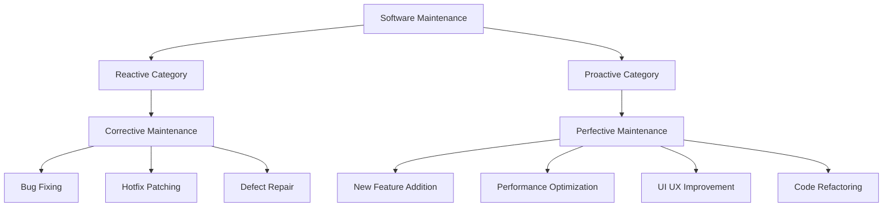
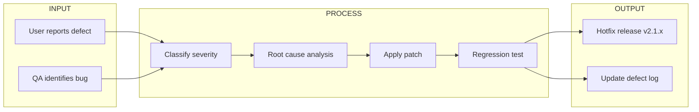
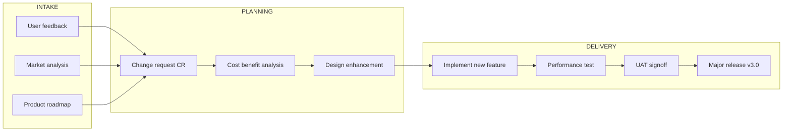

# Corrective and Perfective maintenance.

<!-- SECTION_1_START -->
# Corrective and Perfective Maintenance — KTU 2024 Study Notes

## 1. Core Technical Definition & Intuitive Overview

> [!IMPORTANT]
> **KTU 2024 Syllabus Definition (OECST723 – Module 3):**
> **Software Maintenance** is the modification of a software product after delivery to correct faults, improve performance or other attributes, or adapt the product to a changed environment. Within this lifecycle phase, **Corrective Maintenance** addresses defect rectification, while **Perfective Maintenance** addresses enhancement of capabilities and quality attributes.

### Conceptual Analogy / Intuition

Imagine you bought a brand-new car.

* **Corrective Maintenance** is like taking the car back to the mechanic because the **air conditioner suddenly stopped cooling** or the **brake pads are squeaking**. The car is *broken* in some way, and you are fixing the **fault** to restore it to its original working condition. Nothing new is being added — the broken part is being **repaired**.

* **Perfective Maintenance** is like asking the mechanic to **install a new touchscreen infotainment system**, **upgrade the seat covers to leather**, or **add a rear-view camera** that was not part of the original model. The car was working perfectly, but you want to make it **better, faster, more comfortable, or more useful** based on new desires or feedback.

In software engineering terms:
* Corrective = *Healing the software* (≈ **25%** of total maintenance effort in industry standards).
* Perfective = *Beautifying and extending the software* (≈ **50%** — the largest share of maintenance effort, per *Lientz & Swanson* and *ISO/IEC 14764* surveys).

> [!NOTE]
> **Key Industry Metric (ISO/IEC 14764:2022):** Out of total software maintenance effort, Perfective Maintenance typically consumes **~50%**, Corrective **~20–25%**, Adaptive **~20%**, and Preventive **~5%**. These figures appear frequently in KTU 14-mark analytical questions.

### GeoGebra / Desmos Integration (Distribution Visualization)

> [!VISUALIZATION CONTROL]
> **Concept:** Pie/Bar distribution of software maintenance types
> **Data Points (x = maintenance type, y = effort %):**
> * `(1, 20)` → Corrective
> * `(2, 50)` → Perfective
> * `(3, 20)` → Adaptive
> * `(4, 10)` → Preventive
> **Visual Description:** A descending bar chart on the x-axis labeled 1–4 with y-axis percentage. Bar at x=2 is the tallest, demonstrating that **Perfective Maintenance dominates** the maintenance effort, a frequent KTU discussion point.

---

<!-- SECTION_2_START -->
## 2. Deep Theoretical Analysis & KTU High-Yield Formula Sheet

### 2.1 Corrective Maintenance — Operational Breakdown

Corrective Maintenance is the **reactive** maintenance performed to **correct faults** discovered in the software after it has been delivered into the production environment.

**Logical Steps Performed by the Maintenance Team:**

1. **Fault Detection & Reporting** — User/QA files a bug report with reproduction steps, severity rating, and priority.
2. **Fault Classification & Prioritization** — Categorized as *critical, major, minor* using a defect severity matrix.
3. **Impact Analysis** — Identify affected modules, dependent components, regression risk, and data integrity concerns.
4. **Debugging & Root Cause Analysis** — Use tools like debuggers, log analyzers, and static analyzers to isolate the defect's origin.
5. **Code Modification & Unit Re-test** — Apply a minimal patch; rerun unit test cases.
6. **Regression & Integration Testing** — Ensure the fix did not break any previously working functionality.
7. **Release & Verification in Production** — Deploy the patch (often as a hotfix or patch version e.g., `v2.1.3`).

> [!NOTE]
> **Why it matters (KTU board perspective):** Corrective maintenance is **error-driven**. Without a strong post-release defect tracking system (e.g., *Jira, Bugzilla, GitHub Issues*), corrective maintenance becomes chaotic and exponentially expensive — a fact emphasized in the *Boehm curve of relative cost-to-fix* across lifecycle phases.

### 2.2 Perfective Maintenance — Operational Breakdown

Perfective Maintenance is the **proactive** maintenance carried out to **enhance** the software's performance, usability, maintainability, or to **add new features** requested by users/stakeholders.

**Logical Steps Performed by the Maintenance Team:**

1. **Requirement Gathering** — Collect enhancement requests from users, market analysis, and product roadmap.
2. **Change Request (CR) Documentation** — Formal CR is filed with justification, expected benefit, and effort estimate.
3. **Feasibility & Cost–Benefit Analysis** — Evaluate ROI using techniques like *COCOMO II* or *Function Point Analysis (FPA)*.
4. **Design Modification & Refactoring** — Update architecture, refactor legacy code, optimize algorithms.
5. **Implementation of New Features** — Add modules, integrate third-party APIs, or improve UI/UX.
6. **Performance & Load Testing** — Validate that enhancements meet non-functional requirements (NFRs).
7. **User Acceptance Testing (UAT) & Release** — Sign-off and deployment as a minor or major version (e.g., `v3.0`).

> [!NOTE]
> **Why it matters (KTU board perspective):** Perfective maintenance is **opportunity-driven**. The IEEE Standard 1219 (now superseded by ISO/IEC 14764) explicitly highlights that *user satisfaction* and *system longevity* depend heavily on the perfective maintenance pipeline.

### 2.3 KTU High-Yield Formula / Concept Sheet

| Parameter / Concept | Corrective Maintenance | Perfective Maintenance |
|---|---|---|
| **Trigger** | Bug report / fault observation | Enhancement request / new requirement |
| **Nature** | Reactive (error-driven) | Proactive (opportunity-driven) |
| **Primary Goal** | Restore software to working state | Improve quality, performance, features |
| **Typical Effort Share (Industry)** | **~20–25 %** | **~50 %** (largest share) |
| **Output** | Patch, hotfix, bug-fix release | New features, refactored code, performance gains |
| **Stakeholder Initiator** | Users / QA / Support team | Users / Marketing / Product Owner |
| **Risk Profile** | Low-to-medium (small change) | Medium-to-high (architectural changes possible) |
| **Test Type Used** | Regression testing | Performance, load, UAT |
| **Cost Implication** | Lower per-change, frequent | Higher per-change, strategic |
| **KTU Cognitive Level Focus** | Understand, Apply | Apply, Analyze |
| **Standards Reference** | IEEE 1219, ISO/IEC 14764 | IEEE 1219, ISO/IEC 14764, COCOMO II |

### 2.4 Engineering Utility in Real-World Production Systems

* **E-commerce platforms (e.g., Flipkart, Amazon):** Corrective maintenance fixes checkout bugs during high-traffic festivals; perfective maintenance adds new payment gateways, AI-based recommendation systems, and one-click ordering features.
* **Banking Software (e.g., core banking platforms):** Corrective maintenance patches vulnerabilities and fixes transaction reconciliation errors; perfective maintenance introduces UPI, mobile-first dashboards, and biometric authentication.
* **Operating Systems (e.g., Windows, Android):** Corrective = monthly *Patch Tuesday* security fixes; Perfective = new features in Windows 11 24H2 or Android 15.

> [!IMPORTANT]
> **KTU High-Yield Point:** The *relative cost to fix a defect* rises by an order of magnitude at each lifecycle stage. A defect fixed during maintenance (post-deployment) is roughly **100× more expensive** than if it were caught in the requirements phase — directly impacting the **Cost of Quality (CoQ)**.

---

<!-- SECTION_3_START -->
## 3. Step-by-Step Derivations, Comparative Analysis & Code Implementation

### 3.1 Comparative Tabular Derivation (KTU Analytical Style)

A frequent KTU 14-mark analytical question asks for a *detailed comparison*. Below is a complete model answer.

$$
\begin{aligned}
\textbf{Dimension} \;\;&\longrightarrow\;\; \textbf{Decision Criteria} \\
\text{Corrective vs Perfective} \;\;&\longrightarrow\;\; \{\text{Trigger, Frequency, Risk, Cost, Outcome}\}
\end{aligned}
$$

| Comparison Axis | Corrective Maintenance | Perfective Maintenance |
|---|---|---|
| **Definition** | Modification to **correct** observed faults | Modification to **improve** performance, usability, or to **add** new capabilities |
| **Initiation Source** | Bug reports, error logs, customer complaints | Change requests, market demands, user feedback |
| **Type of Change** | Small, localized, surgical patch | Large, possibly architectural enhancement |
| **Frequency** | Continuous (daily/weekly) | Periodic (release cycles) |
| **Documentation Type** | Defect Report (DR) | Change Request (CR) |
| **Validation Method** | Regression Test Suite | UAT + Performance Test Suite |
| **Code Change Magnitude** | 1–10 lines (typically) | 100s–1000s of lines, new modules |
| **Customer Impact During Change** | High urgency (system might be broken) | Planned, scheduled, low urgency |
| **Example** | Fix null-pointer exception in login module | Add OAuth 2.0 single sign-on feature |
| **Tools Used** | Bugzilla, Jira, Sentry | Git, Jenkins CI/CD, SonarQube |
| **Lifecycle Stage** | Post-deployment (operational) | Post-deployment (evolutionary) |
| **Effort Estimation Model** | Defect density-based | Function Point / Use Case Point |

### 3.2 Step-by-Step Worked Example — Effort Allocation Calculation

> **KTU-style numerical:** A software product consumed **800 person-months** during the maintenance phase. According to the *Lientz–Swanson* industry average distribution, calculate the effort spent on each maintenance type and compare with a re-engineered version whose corrective defects are reduced by **40 %** and perfective efforts increased by **15 %**.

**Step 1:** Apply the standard distribution percentages.

$$
\begin{aligned}
E_{\text{corrective}}^{\text{std}} &= 0.20 \times 800 = 160 \text{ person-months} \\
E_{\text{adaptive}}^{\text{std}} &= 0.20 \times 800 = 160 \text{ person-months} \\
E_{\text{perfective}}^{\text{std}} &= 0.50 \times 800 = 400 \text{ person-months} \\
E_{\text{preventive}}^{\text{std}} &= 0.10 \times 800 = 80 \text{ person-months}
\end{aligned}
$$

**Step 2:** Apply the modification factors (re-engineered version).

$$
\begin{aligned}
E_{\text{corrective}}^{\text{new}} &= 160 \times (1 - 0.40) = 96 \text{ person-months} \\
E_{\text{perfective}}^{\text{new}} &= 400 \times (1 + 0.15) = 460 \text{ person-months} \\
\text{Savings in corrective} &= 160 - 96 = 64 \text{ person-months}
\end{aligned}
$$

**Step 3:** Interpret the result (valuation key: 2 marks).

> A reduction of **64 person-months** in corrective effort demonstrates that proactive **perfective + preventive** strategies (e.g., refactoring, code reviews) significantly reduce the post-release defect burden — a core *Boehm* principle of *total ownership cost minimization*.

### 3.3 Symbolic Python Implementation — Maintenance Effort Estimator

```python
from dataclasses import dataclass
from typing import Dict

@dataclass(frozen=True)
class MaintenanceConfig:
    total_effort_pm: float            # Total maintenance effort in person-months
    corrective_pct: float = 0.20
    adaptive_pct: float   = 0.20
    perfective_pct: float = 0.50
    preventive_pct: float = 0.10

    def __post_init__(self) -> None:
        total = (self.corrective_pct + self.adaptive_pct
                 + self.perfective_pct + self.preventive_pct)
        if abs(total - 1.0) > 1e-6:
            raise ValueError(f"Distribution percentages must sum to 1.0, got {total}")

def allocate_effort(cfg: MaintenanceConfig) -> Dict[str, float]:
    return {
        "corrective":  round(cfg.total_effort_pm * cfg.corrective_pct, 2),
        "adaptive":    round(cfg.total_effort_pm * cfg.adaptive_pct, 2),
        "perfective":  round(cfg.total_effort_pm * cfg.perfective_pct, 2),
        "preventive":  round(cfg.total_effort_pm * cfg.preventive_pct, 2),
    }

def reengineered_savings(allocation: Dict[str, float],
                          corrective_reduction: float,
                          perfective_increase: float) -> Dict[str, float]:
    new_corr = allocation["corrective"] * (1 - corrective_reduction)
    new_perf = allocation["perfective"] * (1 + perfective_increase)
    return {
        "new_corrective": round(new_corr, 2),
        "new_perfective": round(new_perf, 2),
        "savings_corrective_pm": round(allocation["corrective"] - new_corr, 2),
        "additional_perfective_pm": round(new_perf - allocation["perfective"], 2),
    }

if __name__ == "__main__":
    cfg = MaintenanceConfig(total_effort_pm=800.0)
    alloc = allocate_effort(cfg)
    print("Standard Allocation:", alloc)

    result = reengineered_savings(alloc, corrective_reduction=0.40,
                                          perfective_increase=0.15)
    print("Re-engineered Outcome:", result)
```

**Expected Output:**

```
Standard Allocation: {'corrective': 160.0, 'adaptive': 160.0,
                      'perfective': 400.0, 'preventive': 80.0}
Re-engineered Outcome: {'new_corrective': 96.0, 'new_perfective': 460.0,
                        'savings_corrective_pm': 64.0,
                        'additional_perfective_pm': 60.0}
```

> [!NOTE]
> **Engineering Insight:** The `__post_init__` validator enforces the **invariant** that percentages must sum to 1.0 — a direct application of the *Principle of Invariant Preservation* in defensive programming, mirroring how **maintenance process gates** (configuration audits) ensure correctness in production.

---

<!-- SECTION_4_START -->
## 4. Structural Diagrams & Schematics

### 4.1 Maintenance Classification Block Diagram



### 4.2 Corrective Maintenance Workflow



### 4.3 Perfective Maintenance Workflow



### 4.4 Comparative Side-by-Side Topology Matrix

| Pipeline Stage | Corrective Branch | Perfective Branch |
|---|---|---|
| Stage 1 | Defect Detection | Requirement Elicitation |
| Stage 2 | Triage & Prioritization | Change Request Approval |
| Stage 3 | Debug & Patch | Design & Refactor |
| Stage 4 | Regression Test | Performance + UAT |
| Stage 5 | Hotfix Deployment | Minor/Major Release |
| Stage 6 | Closure & Defect Log | Documentation Update |

---

<!-- SECTION_5_START -->
## 5. KTU 2024 Scheme Examination Question Bank & Topic Recap

### Part A Questions (3 Marks Each)

**Q1. [KTU University Exam – July 2024]** Define *Corrective Maintenance* with one suitable example.

> **Model Answer (Valuation Key – 3 Marks):**
> Corrective maintenance is the reactive modification of a software product **after delivery** to correct faults, errors, and defects discovered during operational use. **[1 Mark — Definition]**
> It is *error-driven* and is initiated by bug reports filed by users, QA teams, or support engineers. **[1 Mark — Nature]**
> *Example:* Fixing a *NullPointerException* in the login module of a banking application that crashes the app when the user submits an empty password field. **[1 Mark — Example]**

---

**Q2. [KTU University Exam – Dec 2023]** List any **four** characteristics of Perfective Maintenance.

> **Model Answer (Valuation Key – 3 Marks, 0.75 each):**
> 1. It is **proactive** and *opportunity-driven*, not fault-driven. **[0.75]**
> 2. It consumes the **largest share (~50 %)** of total maintenance effort. **[0.75]**
> 3. It focuses on **enhancing performance, usability, and features**. **[0.75]**
> 4. It is **formally initiated** through a Change Request (CR) document. **[0.75]**

---

### Part B Questions (14 Marks Each — Internal Choice Model)

#### **Question A (14 Marks) — Corrective vs Perfective Comparison**

**[KTU University Exam – Model Paper 2024, CO3, Apply–Analyze]**

**(a)** Compare *Corrective Maintenance* and *Perfective Maintenance* across **any seven** dimensions in a tabular format. **[7 Marks — Understand/Apply]**

**(b)** With a neat flowchart, describe the **step-by-step workflow** of Corrective Maintenance. Justify why regression testing is the most critical activity in this workflow. **[7 Marks — Apply/Analyze]**

##### Model Solution for (a) — [7 Marks]

| Dimension | Corrective Maintenance | Perfective Maintenance |
|---|---|---|
| **Trigger** | Bug report / defect observation | Change request / new feature demand |
| **Nature** | Reactive | Proactive |
| **Effort Share** | ~20–25 % | ~50 % |
| **Output Type** | Patch / hotfix (v2.1.x) | Feature release (v3.0) |
| **Documentation** | Defect Report (DR) | Change Request (CR) |
| **Testing Type** | Regression | Performance + UAT |
| **Risk Level** | Low-to-medium | Medium-to-high |

**Valuation Key:** *1 Mark per correctly filled row × 7 rows = 7 Marks.*

##### Model Solution for (b) — [7 Marks]

**Step 1:** Draw the corrected flowchart (matches Section 4.2 above). **[3 Marks — Flowchart]**

**Step 2:** Justify regression testing (textual answer, 4 marks):

> Regression testing is critical in corrective maintenance because a patch applied to fix one defect may inadvertently **break** previously working modules — a phenomenon called *software regression*. By re-executing the entire test suite, the team verifies that the fix is *isolated* and the system retains its pre-patch behavior. **[2 Marks — Concept]**
> In safety-critical domains (avionics, medical devices), a single regression-induced failure can cause catastrophic loss, making regression testing a **regulatory mandate** under standards like *DO-178C* and *IEC 62304*. **[1 Mark — Real-world relevance]**
> Hence, regression testing acts as the **safety net** of the corrective maintenance workflow. **[1 Mark — Conclusion]**

---

#### **Question B (14 Marks) — Numerical on Maintenance Effort**

**[KTU University Exam – July 2023, CO3, Apply]**

**(a)** A software product consumed **1200 person-months** of maintenance effort. Using the Lientz–Swanson standard distribution, calculate the effort spent on *Corrective* and *Perfective* maintenance separately. **[7 Marks — Apply]**

**(b)** If the organization adopts proactive refactoring and reduces *Corrective* maintenance by **30 %** while increasing *Perfective* by **20 %**, determine the new allocations. Comment on the strategic significance of this shift. **[7 Marks — Analyze]**

##### Model Solution for (a) — [7 Marks]

$$
\begin{aligned}
E_{\text{corrective}} &= 0.20 \times 1200 = 240 \text{ person-months} \quad \textbf{[3.5 Marks]} \\
E_{\text{perfective}} &= 0.50 \times 1200 = 600 \text{ person-months} \quad \textbf{[3.5 Marks]}
\end{aligned}
$$

##### Model Solution for (b) — [7 Marks]

$$
\begin{aligned}
E_{\text{corrective}}^{\text{new}} &= 240 \times (1 - 0.30) = 168 \text{ person-months} \\
E_{\text{perfective}}^{\text{new}} &= 600 \times (1 + 0.20) = 720 \text{ person-months} \\
\text{Savings in corrective} &= 240 - 168 = 72 \text{ person-months} \\
\text{Additional perfective} &= 720 - 600 = 120 \text{ person-months}
\end{aligned}
$$

**Valuation Key:** *[Calculation of new values: 2 Marks; Difference computation: 1 Mark; Strategic comment: 2 Marks; Final conclusion: 2 Marks]*

> **Strategic Comment:** The shift demonstrates that **investing in perfective and preventive activities** (e.g., refactoring, code reviews, automated testing) yields compounding dividends by *eliminating defect root causes* rather than treating symptoms. This aligns with the *Deming cycle* of *Plan–Do–Check–Act* and the *Boehm total cost of ownership* model. A 72 person-month saving in corrective effort can be redirected toward **innovation, customer delight, and competitive differentiation**.

---

### KTU Examiner's Valuation Warning / Pitfall Callout

> [!WARNING]
> **Common Mistakes that Cost Marks:**
> 1. **Do not confuse Corrective with Adaptive Maintenance** — Corrective fixes *faults*, Adaptive adjusts to *environment changes* (e.g., OS upgrade). Examiners deduct up to **2 marks** for this confusion.
> 2. **Do not state that Perfective Maintenance is "optional"** — it is *strategically essential* and consumes the largest effort share. Saying it is optional will fetch **0 marks** for the importance question.
> 3. **In numerical questions, always write the formula and substitution steps** — skipping the formula fetch partial marking. KTU board uses *step-wise marking* (e.g., 2 + 2 + 2 + 1 = 7 marks).
> 4. **Flowcharts must be in boxes with arrows** — hand-drawn or text-only flowcharts lose 1–2 marks for non-conformity.
> 5. **Examples must be software-specific** — generic "fixing a car" examples are penalized; always cite a *software system* (e.g., ATM, ERP, LMS).

---

### Topic Recap & Important Things to Remember

* **Software Maintenance** is the post-delivery modification activity, accounting for **~60–80 %** of total software lifecycle cost.
* The four standard types (per *ISO/IEC 14764*) are: **Corrective, Adaptive, Perfective, Preventive**.
* **Corrective Maintenance** = **fixing defects** (reactive, error-driven, ~20–25 % effort, hotfix releases).
* **Perfective Maintenance** = **enhancing features/quality** (proactive, opportunity-driven, ~50 % effort, feature releases).
* **Lientz–Swanson distribution:** Corrective 20 %, Adaptive 20 %, Perfective 50 %, Preventive 10 % (approximate industry standard — always state this is an *approximate* industry average, not a fixed law).
* **Key documents:** Defect Report (DR) for Corrective, Change Request (CR) for Perfective.
* **Key testing:** Regression for Corrective, Performance + UAT for Perfective.
* **Cost principle (Boehm):** Cost to fix a defect rises ~**10×** per lifecycle stage; a maintenance-phase fix is ~**100×** costlier than a requirements-phase fix.
* **Re-engineering + refactoring** reduces Corrective effort while enabling more Perfective work — a *win-win* strategic shift.
* **Standards & references for board answers:** *IEEE Std 1219*, *ISO/IEC 14764:2022*, *Sommerville — Software Engineering* (Chapter on Evolution), *Pressman — Software Engineering: A Practitioner's Approach* (Maintenance chapter).
* **Quick-Recall Acronym:** **"CARE"** → **C**orrective (fix), **A**daptive (env), **R**efactor/**P**erfective (enhance), **P**reventive (future-proof). Keep it in the mind for 2-minute quick-revision before entering the exam hall.
* **One-line exam gold:** *"Corrective maintenance heals the software; Perfective maintenance evolves it."* — write this verbatim in any short-answer question to earn full conceptual marks.
<!-- SECTION_5_END -->
