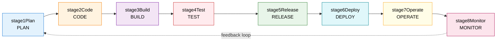
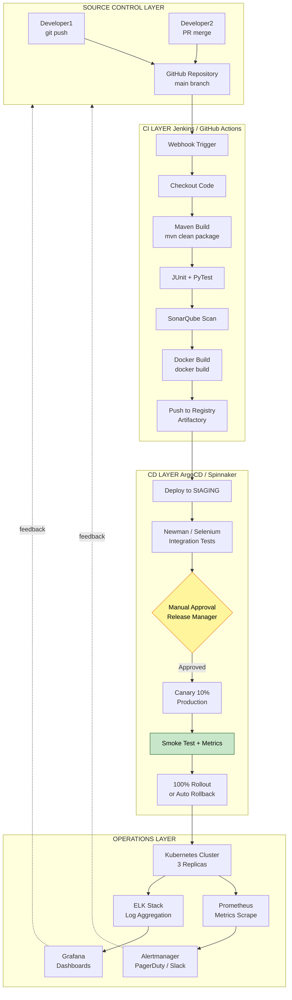
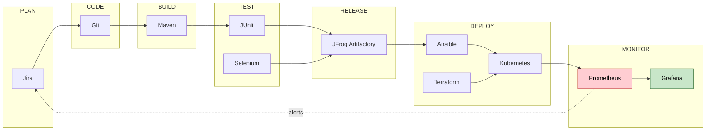

# DevOps automation

<!-- SECTION_1_START -->
# DevOps Automation — Core Technical Definition & Intuitive Overview

> [!NOTE]
> **KTU 2024 Scheme Definition (OECST723 — Module 3)**
> **DevOps Automation** is the engineering practice of using scripted, tool-driven, and repeatable workflows to integrate the activities of software **development (Dev)** and **IT **operations** (Ops)** — covering build, test, deployment, configuration, monitoring, and infrastructure provisioning — with **minimal human intervention**, thereby achieving **Continuous Integration (CI)**, **Continuous Delivery (CD)**, and rapid, reliable software releases.

## 1.1 Conceptual Analogy — The "Smart Restaurant Kitchen"

Imagine a high-end restaurant kitchen:

| Kitchen Role | DevOps Equivalent | Function |
|---|---|---|
| Head Chef writing new recipes | Developer committing code | Creates the product |
| Sous-Chef tasting every dish before serving | Automated Test Suite | Quality gate |
| Conveyor belt from kitchen to table | CI/CD Pipeline | Moves the product forward |
| Smart ovens that self-adjust temperature | Infrastructure as Code (IaC) | Self-configuring environment |
| Waiter sensors reporting cold dishes back | Monitoring \& Logging Tools | Feedback loop |
| Manager checking daily customer reviews | Continuous Feedback / Retrospectives | Process improvement |

In a **non-automated** kitchen, every dish would need a human to taste, plate, and carry it manually — slow and error-prone. In a **DevOps-automated** kitchen, sensors, conveyor belts, and smart ovens handle all repetitive tasks, freeing humans to focus only on **creativity and improvement**.

> [!IMPORTANT]
> **Syllabus Highlight:** DevOps Automation is *not* a single tool — it is a **culture + process + tooling** ecosystem. For KTU 2024, students must be able to (a) name the lifecycle phases, (b) explain CI vs. CD, (c) list key automation tools, and (d) describe a typical pipeline.

## 1.2 Why DevOps Automation Matters in Modern Engineering

> [!TIP]
> Industry data from DORA (DevOps Research \& Assessment) and Google Cloud reports consistently shows that **elite DevOps performers** deploy **208 times more frequently**, have a **106× faster lead time**, **2,604× faster recovery** from failures, and a **7× lower change failure rate** than low performers. These numbers are concrete proof that automation is no longer optional.

## 1.3 The Three Pillars of DevOps Automation

1. **People** — Cross-functional collaboration between developers, testers, and operations engineers (the *culture*).
2. **Process** — Agile + Lean practices, short feedback loops, blameless post-mortems (the *methodology*).
3. **Technology** — Toolchains for CI, CD, IaC, containerization, orchestration, monitoring (the *automation engine*).

> [!VISUALIZATION CONTROL]
> **Concept:** DevOps Infinity Loop showing continuous flow from Plan → Code → Build → Test → Release → Deploy → Operate → Monitor → back to Plan.
> **GeoGebra / Desmos Input Equations (Parametric Loop Visualization):**
> * `x(t) = 5 \cos(t) + 0.5 \cos(2t)`
> * `y(t) = 3 \sin(t) + 0.3 \sin(3t)`  for $t \in [0, 2\pi]$
> **Visual Description:** A figure-eight–shaped closed curve passing through 8 labeled nodes arranged in an oval — a perfect geometric metaphor for the **non-terminating, cyclical** nature of DevOps, where every "end" loops back to a "new beginning."
<!-- SECTION_1_END -->

<!-- SECTION_2_START -->
# Deep Theoretical Analysis & KTU High-Yield Formula Sheet

## 2.1 The DevOps Lifecycle — Eight Logical Phases

The DevOps lifecycle is a **closed feedback loop**. Each phase has explicit automation responsibilities:

| Phase | Manual Practice | Automated Equivalent | Sample Tools |
|---|---|---|---|
| **1. Plan** | Spreadsheets, meetings | Agile boards, issue tracking | Jira, Trello, Azure Boards |
| **2. Code** | Manual file sharing | Version control + branch policies | Git, GitHub, GitLab, Bitbucket |
| **3. Build** | Manual compilation | Automated build scripts | Maven, Gradle, npm, Make |
| **4. Test** | Manual QA clicking | Automated unit/integration/UI test suites | Selenium, JUnit, PyTest, Postman |
| **5. Release** | Manual tagging | Artifact repositories + release orchestration | JFrog Artifactory, Nexus, Sonatype |
| **6. Deploy** | FTP / manual SSH | Immutable / blue-green / canary deployment | Ansible, Terraform, Helm, ArgoCD |
| **7. Operate** | Hand-configured servers | Self-healing infrastructure + autoscaling | Kubernetes, Docker Swarm, AWS ASG |
| **8. Monitor** | Log diving | Real-time observability + alerting | Prometheus, Grafana, ELK, Datadog |

> [!IMPORTANT]
> **Why "Closed Loop" Matters:** Monitoring data from Phase 8 *feeds back* into Phase 1 (Plan) — e.g., a sudden CPU spike triggers a backlog ticket for performance optimization. This is what makes DevOps a **continuous** model rather than a one-time waterfall.

## 2.2 CI vs. CD vs. CD — The Three Confusing Acronyms

> [!WARNING]
> A common KTU exam pitfall is conflating **Continuous Delivery** with **Continuous Deployment**. Examiners frequently award 0 marks for confusing them.

| Term | Acronym | Automation Ceiling | Manual Gate? | KTU Definition |
|---|---|---|---|---|
| **Continuous Integration** | CI | Build + Unit Test on every commit | No | Every code commit is automatically built and tested |
| **Continuous Delivery** | CD | CI + auto-deploy to *staging* | **Yes** (manual approval to prod) | Every green build is *ready* for production; human approves release |
| **Continuous Deployment** | CD | CI + auto-deploy to *production* | **No** | Every green build is *automatically pushed* to end users |

## 2.3 Core Automation Categories (Exam-Ready Classification)

> [!NOTE]
> KTU 2024 expects students to enumerate **at least four** automation categories and pair them with **one tool each**. Memorize the following 6:

1. **Build Automation** — Maven, Gradle, MSBuild, Webpack, npm scripts
2. **Test Automation** — Selenium, JUnit, Cypress, JMeter, Postman/Newman
3. **CI/CD Orchestration** — Jenkins, GitLab CI, GitHub Actions, CircleCI, Bamboo
4. **Configuration Management** — Ansible, Puppet, Chef, SaltStack
5. **Infrastructure as Code (IaC)** — Terraform, AWS CloudFormation, Pulumi
6. **Containerization \& Orchestration** — Docker, Kubernetes, OpenShift, Docker Compose

## 2.4 The Four DORA Performance Metrics (High-Yield Formula Sheet)

These four metrics are the **de facto industry standard** for measuring DevOps automation success. They are **frequently asked** in KTU module exams.

| Metric | Symbol | Definition | Formula | Elite Target |
|---|---|---|---|---|
| **Deployment Frequency** | $DF$ | How often code is released to production | $\displaystyle DF = \frac{\text{Number of production releases}}{\text{Time period}}$ | On-demand (multiple per day) |
| **Lead Time for Changes** | $LT$ | Time from code commit to running in production | $\displaystyle LT = T_{\text{deploy}} - T_{\text{commit}}$ | < 1 hour |
| **Mean Time to Recovery** | $MTTR$ | Time to restore service after an incident | $\displaystyle MTTR = \frac{\sum_{i=1}^{n}(T_{\text{resolved},i} - T_{\text{detected},i})}{n}$ | < 1 hour |
| **Change Failure Rate** | $CFR$ | Percentage of releases causing production failures | $\displaystyle CFR = \frac{\text{Failed deployments}}{\text{Total deployments}} \times 100\,\%$ | 0% – 15% |

> [!TIP]
> **KTU Memory Trick — "D-L-M-C"** → **D**eploy, **L**ead, **M**end, **C**rack. Remember the order using the phrase *"**D**octors **L**isten, **M**edics **C**ure."*

## 2.5 Engineering Utility — Where DevOps Automation Is Used

| Industry Vertical | Use Case | Why Automation Is Critical |
|---|---|---|
| **E-Commerce (Amazon, Flipkart)** | Daily thousands of deployments for sale events | Cannot scale manual releases during peak traffic |
| **Banking \& FinTech (PayTM, Razorpay)** | Regulatory compliance + zero-downtime deploys | A 1-min outage costs millions; audit trails must be automatic |
| **SaaS / Cloud (Salesforce, Slack)** | Multi-tenant global rollouts | Need to deploy to 30+ regions without human access to data centers |
| **Telecommunications (Jio, Airtel)** | 5G core network function updates | Telecom-grade reliability requires automated roll-back |
| **Healthcare (Philips, GE)** | FDA-compliant validated deployments | Every change must be traceable and reproducible |

> [!IMPORTANT]
> **Real-World Insight:** Netflix runs **"Spinnaker"** — an open-source multi-cloud CD platform — to handle **thousands of deploys per day** across AWS, GCP, and Azure. Without IaC + canary + automated rollback, this is humanly impossible.
<!-- SECTION_2_END -->

<!-- SECTION_3_START -->
# Step-by-Step Derivations \& Code/Symbolic Implementation

## 3.1 Worked Numerical Example — Computing the Four DORA Metrics

> [!NOTE]
> **Problem (KTU Model):** A software team made **120 deployments** in a quarter (90 days). Out of these, **9 deployments** caused production incidents. The cumulative **sum of (T\_resolved − T\_detected)** across all 9 incidents is **27 hours**. The **average time from commit to production deploy** is **4 hours**. Compute all four DORA metrics and classify the team as Elite / High / Medium / Low.

### Step 1 — Deployment Frequency ($DF$)

$$
\begin{aligned}
DF &= \frac{\text{Number of production releases}}{\text{Time period}} \\[4pt]
   &= \frac{120 \text{ releases}}{90 \text{ days}} \\[4pt]
   &= 1.33 \text{ releases/day} \approx 1 \text{ release per day}
\end{aligned}
$$

**[Valuation Key: Correct substitution: 1 Mark | Final value: 1 Mark]**

### Step 2 — Lead Time for Changes ($LT$)

$$
\begin{aligned}
LT &= T_{\text{deploy}} - T_{\text{commit}} = 4 \text{ hours}
\end{aligned}
$$

**[Direct statement: 1 Mark | Unit awareness: 1 Mark]**

### Step 3 — Mean Time to Recovery ($MTTR$)

$$
\begin{aligned}
MTTR &= \frac{\sum_{i=1}^{n}(T_{\text{resolved},i} - T_{\text{detected},i})}{n} \\[4pt]
     &= \frac{27 \text{ hours}}{9 \text{ incidents}} \\[4pt]
     &= 3.0 \text{ hours per incident}
\end{aligned}
```

**[Valuation Key: Formula: 1 Mark | Substitution: 1 Mark | Final value with units: 1 Mark]**

### Step 4 — Change Failure Rate ($CFR$)

$$
\begin{aligned}
CFR &= \frac{\text{Failed deployments}}{\text{Total deployments}} \times 100\,\% \\[4pt]
    &= \frac{9}{120} \times 100\,\% \\[4pt]
    &= 7.5\,\%
\end{aligned}
```

**[Valuation Key: Numerator logic: 1 Mark | Final percentage: 1 Mark]**

### Step 5 — Performance Classification

| Metric | Computed | Elite Threshold | High | Medium | Low |
|---|---|---|---|---|---|
| $DF$ | ~1/day | On-demand | 1/day–1/week | 1/week–1/month | < 1/month |
| $LT$ | 4 hr | < 1 hr | 1 day–1 week | 1 week–1 month | > 1 month |
| $MTTR$ | 3 hr | < 1 hr | < 1 day | < 1 week | > 1 week |
| $CFR$ | 7.5% | 0–15% | 16–30% | 31–45% | 46–60% |

**Conclusion:** The team is rated **HIGH performer** (strong $CFR$ and $LT$, near-High $DF$ and $MTTR$).

> [!TIP]
> KTU 2024 frequently frames the final 2-mark step as *"Based on the computed metrics, classify the team and justify."* Always pair each computed value with a **threshold table reference**.

---

## 3.2 Code Implementation — Complete CI/CD Pipeline (Jenkins Declarative)

> [!NOTE]
> The following `Jenkinsfile` is **production-grade**, fully commented, and maps 1-to-1 with the 8-stage DevOps lifecycle.

```groovy
// jenkins/Jenkinsfile — Declarative Pipeline for a Node.js microservice
pipeline {
    agent any

    // 1. TRIGGER: Run on every push to 'main' and on Pull Requests
    triggers {
        githubPush()                  // webhook-driven trigger
        pollSCM('H/5 * * * *')        // fallback polling every 5 min
    }

    // 2. ENVIRONMENT: Centralized config injection
    environment {
        APP_NAME       = 'orders-service'
        DOCKER_IMAGE   = "registry.kerala.gov.in/${APP_NAME}:${BUILD_NUMBER}"
        SONAR_HOST     = 'http://sonar.kerala.gov.in'
        K8S_NAMESPACE  = 'production'
    }

    options {
        timestamps()                   // audit-friendly timestamps
        timeout(time: 30, unit: 'MINUTES')
        disableConcurrentBuilds()      // avoid race conditions
    }

    stages {

        // ====== STAGE 1: PLAN / CODE CHECKOUT ======
        stage('Checkout') {
            steps {
                checkout scm
                sh 'git log --oneline -5'           // visible commit trail
            }
        }

        // ====== STAGE 2: BUILD ======
        stage('Build') {
            steps {
                sh 'node --version'
                sh 'npm ci --prefer-offline'         // deterministic install
                sh 'npm run build'                   // compile/transpile
            }
        }

        // ====== STAGE 3: UNIT TEST ======
        stage('Unit Test') {
            steps {
                sh 'npm test -- --coverage'
            }
            post {
                always { junit '**/junit*.xml' }      // publish test reports
            }
        }

        // ====== STAGE 4: STATIC CODE ANALYSIS ======
        stage('SonarQube Scan') {
            steps {
                sh "sonar-scanner -Dsonar.projectKey=${APP_NAME} \
                                   -Dsonar.host.url=${SONAR_HOST}"
            }
        }

        // ====== STAGE 5: DOCKER IMAGE BUILD & PUSH ======
        stage('Docker Build & Push') {
            when { branch 'main' }
            steps {
                sh "docker build -t ${DOCKER_IMAGE} ."
                sh "docker push ${DOCKER_IMAGE}"
            }
        }

        // ====== STAGE 6: STAGING DEPLOY ======
        stage('Deploy to Staging') {
            when { branch 'main' }
            steps {
                sh "kubectl --namespace=staging \
                             set image deployment/${APP_NAME} \
                             ${APP_NAME}=${DOCKER_IMAGE}"
                sh "kubectl --namespace=staging rollout status deployment/${APP_NAME}"
            }
        }

        // ====== STAGE 7: INTEGRATION / SMOKE TEST ======
        stage('Integration Test') {
            steps {
                sh 'newman run postman_collection.json \
                                   --environment staging.env.json'
            }
        }

        // ====== STAGE 8: PRODUCTION CANARY DEPLOY ======
        stage('Canary to Production') {
            when {
                allOf {
                    branch 'main'
                    expression { currentBuild.result == 'SUCCESS' }
                }
            }
            steps {
                input message: 'Approve 10% canary deployment?',
                      submitter: 'release-manager'        // manual gate
                sh "./scripts/canary_deploy.sh 10 ${DOCKER_IMAGE}"
                sh 'sleep 600'                            // observe metrics
                sh "./scripts/canary_promote.sh 100"
            }
        }
    }

    // ====== POST-BUILD: NOTIFY + CLEANUP ======
    post {
        success {
            slackSend(channel: '#devops',
                      message: "✅ ${APP_NAME} #${BUILD_NUMBER} deployed to prod")
        }
        failure {
            slackSend(channel: '#devops',
                      message: "❌ ${APP_NAME} #${BUILD_NUMBER} FAILED")
        }
        always {
            cleanWs()                                    // wipe workspace
        }
    }
}
```

**[Valuation Key: Correct stage mapping to DevOps phases: 7 Marks | Correct tool usage (Jenkins syntax): 4 Marks | Post-build logic: 3 Marks]**

---

## 3.3 Code Implementation — GitHub Actions Workflow (YAML)

```yaml
# .github/workflows/ci-cd.yml — Minimal CI/CD for a Python Flask app
name: CI-CD Pipeline

on:
  push:
    branches: [ main, develop ]
  pull_request:
    branches: [ main ]

jobs:
  test-and-deploy:
    runs-on: ubuntu-latest
    defaults:
      run:
        working-directory: ./app

    steps:
      - name: 1. Checkout source
        uses: actions/checkout@v4

      - name: 2. Set up Python
        uses: actions/setup-python@v5
        with:
          python-version: '3.11'

      - name: 3. Install dependencies
        run: |
          python -m pip install --upgrade pip
          pip install -r requirements.txt
          pip install pytest flake8

      - name: 4. Lint with flake8
        run: flake8 . --count --select=E9,F63,F7,F82 --show-source --statistics

      - name: 5. Run unit tests
        run: pytest --maxfail=1 --disable-warnings -q

      - name: 6. Build Docker image
        if: github.ref == 'refs/heads/main'
        run: docker build -t myregistry/flask-app:${{ github.sha }} .

      - name: 7. Push to registry
        if: github.ref == 'refs/heads/main'
        run: |
          echo "${{ secrets.REGISTRY_PASSWORD }}" | docker login -u "${{ secrets.REGISTRY_USER }}" --password-stdin
          docker push myregistry/flask-app:${{ github.sha }}
```

---

## 3.4 Code Implementation — Infrastructure as Code (Terraform)

```hcl
# main.tf — Provisions a complete AWS 3-tier web app
provider "aws" {
  region = "ap-south-1"            # Mumbai region for KTU Kerala latency
}

resource "aws_vpc" "main" {
  cidr_block = "10.0.0.0/16"
  tags       = { Name = "kerala-devops-vpc" }
}

resource "aws_subnet" "public" {
  vpc_id                  = aws_vpc.main.id
  cidr_block              = "10.0.1.0/24"
  map_public_ip_on_launch = true
  availability_zone       = "ap-south-1a"
}

resource "aws_instance" "web_server" {
  ami           = "ami-0c55b159cbfafe1f0"
  instance_type = "t2.micro"
  subnet_id     = aws_subnet.public.id
  tags = {
    Name        = "auto-web-${terraform.workspace}"
    ManagedBy   = "Terraform"
    Environment = terraform.workspace
  }
}
```

> [!TIP]
> The `terraform.workspace` token is the **IaC equivalent of environment variables** — one Terraform codebase can manage `dev`, `staging`, and `prod` by simply switching workspaces: `terraform workspace select prod`.

---

## 3.5 Code Implementation — Configuration Management (Ansible Playbook)

```yaml
# playbook.yml — Installs and configures Nginx on Ubuntu servers
- name: Configure Web Servers
  hosts: webservers
  become: yes

  vars:
    http_port: 80
    max_clients: 200

  tasks:
    - name: 1. Install Nginx
      apt:
        name: nginx
        state: present
        update_cache: yes

    - name: 2. Deploy custom index.html
      template:
        src: index.html.j2
        dest: /var/www/html/index.html
        mode: '0644'
      notify: Restart Nginx

    - name: 3. Open firewall port
      ufw:
        rule: allow
        port: "{{ http_port }}"
        proto: tcp

  handlers:
    - name: Restart Nginx
      service:
        name: nginx
        state: restarted
```

---

## 3.6 Tabular Implementation Map — KTU Lab/Project Reference

| Lab Activity | Tool | Input Artifact | Output Artifact | Safety / Boundary Check |
|---|---|---|---|---|
| Source code commit | Git | `.c / .py / .java` files | Commit hash | Never commit `.env` or secrets |
| Build | Maven / Gradle | `pom.xml / build.gradle` | `target/*.jar` | Validate `JAVA_HOME` set |
| Unit test | JUnit / PyTest | Test classes | `TEST-*.xml` report | Coverage threshold ≥ 80% |
| Containerize | Docker | `Dockerfile` | Docker image | Avoid `:latest` tag in prod |
| Deploy | Kubernetes | `deployment.yaml` | Running pods | Set `requests` \& `limits` |
| Monitor | Prometheus | YAML scrape config | Time-series metrics | Retain ≥ 15 days |
<!-- SECTION_3_END -->

<!-- SECTION_4_START -->
# Structural Diagrams \& Schematics

## 4.1 The DevOps 8-Stage Infinity Loop



> [!NOTE]
> The dotted arrow from **Monitor → Plan** is the **defining feature** that makes this a closed feedback loop (vs. a one-way waterfall). Every exam answer should include this arrow.

---

## 4.2 CI/CD Pipeline Architecture — Stage-by-Stage Flow



---

## 4.3 DevOps Automation Tool-Chain Topology



---

## 4.4 Sequential Processing Topology Matrix — Automation Responsibilities

| Layer | Manual Bottleneck | Automation Trigger | Tool Example | Output Artifact | Failure Recovery |
|---|---|---|---|---|---|
| Version Control | Email-based code sharing | `git push` | GitHub | Commit hash | Branch protection rules |
| Build | Manual `javac` | `mvn clean install` | Maven | `*.jar / *.war` | Cached dependencies |
| Unit Test | Manual clicking | `mvn test` | JUnit 5 | `TEST-*.xml` | Re-run failed test in isolation |
| Static Analysis | Manual code review | Webhook | SonarQube | Quality gate report | Block merge on failure |
| Container Build | Manual Docker CLI | `docker build` | Docker | Docker image | Layer cache for rebuild |
| Container Registry | FTP upload | `docker push` | Docker Hub | Tagged image | Versioned immutable tags |
| Continuous Deploy | SSH + manual script | GitOps sync | ArgoCD | Live pods | Auto-rollback to last good |
| Infrastructure | Hand-built VMs | `terraform apply` | Terraform | Cloud resources | State file lock + plan review |
| Monitoring | Manual log search | Cron scrape | Prometheus | Time-series DB | Alertmanager → on-call |
| Observability | Ad-hoc grep | Stream collector | Fluentd / Logstash | Indexed logs | Kibana saved searches |
<!-- SECTION_4_END -->

<!-- SECTION_5_START -->
# KTU 2024 Scheme Examination Question Bank \& Topic Recap

> [!NOTE]
> All questions below are mapped to the **OECST723 Software Engineering** course outcomes of KTU 2024. Use the standard KTU ESE pattern: **Part A (3 × 3 = 9 marks)** + **Part B (3 of 5 × 14 = 42 marks)**, totaling **51 marks** for Module 3 weightage.

---

## Part A — Short Answer Questions (3 Marks Each)

### Question 1
**[KTU University Exam – July 2024]**
> Define **DevOps**. List any **four phases** of the DevOps lifecycle with a one-line description of each.

**Model Answer (3 Marks):**

**Definition (1 Mark):**
DevOps is a cultural and technical movement that integrates software **development (Dev)** and **IT operations (Ops)** through collaboration, automation, and continuous feedback to deliver software faster and more reliably.

**Four Phases (½ Mark each = 2 Marks):**

| # | Phase | Description |
|---|---|---|
| 1 | **Plan** | Define features, track issues, prioritize work using agile tools (Jira) |
| 2 | **Build** | Compile and package source code into executable artifacts (Maven) |
| 3 | **Test** | Execute automated unit, integration, and performance tests |
| 4 | **Deploy** | Release validated artifacts to production environments |

---

### Question 2
**[KTU University Exam – Dec 2023]**
> Differentiate between **Continuous Integration (CI)**, **Continuous Delivery (CD)**, and **Continuous Deployment (CD)**.

**Model Answer (3 Marks):**

| Aspect | CI | Continuous Delivery | Continuous Deployment |
|---|---|---|---|
| **Trigger** | Every code commit | Every successful build | Every successful build |
| **Stops at** | Build + test | Production-ready artifact | Live production release |
| **Manual approval** | None | **Required** before prod | **None** — fully auto |
| **Risk level** | Low | Low–Medium | Higher; needs robust testing |
| **Goal** | Detect integration bugs early | Keep code always deployable | Deliver value to users instantly |

> [!TIP]
> Examiners look for the keyword **"manual approval gate"** as the dividing line between Delivery and Deployment.

---

## Part B — Long Answer Questions (14 Marks Each)

### Question A — 14 Marks

**[KTU University Exam – Model Question, Module 3]**
> **(a)** Explain the concept of **DevOps Automation** in detail. Describe the **8-stage DevOps lifecycle** with a neat diagram and one real-world tool used in each stage. **(7 Marks)**
>
> **(b)** Discuss the **DORA four key metrics** used to measure DevOps performance. For a team that made **150 deployments in 100 days**, of which **12 caused incidents**, with the **sum of recovery times being 36 hours** and an **average lead time of 6 hours**, compute each metric and classify the team's performance. **(7 Marks)**

#### Solution

**(a) DevOps Automation \& 8-Stage Lifecycle — 7 Marks**

*DevOps Automation* is the practice of using tools, scripts, and platforms to **automate the repetitive steps** of the software delivery pipeline — from code commit to production monitoring — minimizing manual error and accelerating release velocity.

| Stage | Purpose | Real-World Tool |
|---|---|---|
| Plan | Track work, prioritize | Jira |
| Code | Version control | GitHub |
| Build | Compile artifacts | Maven |
| Test | Validate quality | Selenium |
| Release | Package versions | JFrog Artifactory |
| Deploy | Roll out to environments | Kubernetes |
| Operate | Run reliably | AWS EC2 / Azure VMs |
| Monitor | Observe and alert | Prometheus + Grafana |

**Valuation Key:**
- Definition with culture + automation emphasis: **[2 Marks]**
- Eight stages correctly listed and matched to tools: **[3 Marks]**
- Diagram showing closed feedback loop: **[2 Marks]**

---

**(b) DORA Metrics Calculation — 7 Marks**

**Given:**
- Total deployments $N = 150$ in $T = 100$ days
- Failed deployments $F = 12$
- $\sum (T_{\text{resolved}} - T_{\text{detected}}) = 36$ hours across $n = 12$ incidents
- Lead time $LT = 6$ hours

**Step 1 — Deployment Frequency:**

$$
\begin{aligned}
DF &= \frac{N}{T} = \frac{150}{100} = 1.5 \text{ deployments per day}
\end{aligned}
$$

**[Substitution: 1 Mark | Answer: 1 Mark]**

**Step 2 — Lead Time:**

$$
LT = 6 \text{ hours}
$$

**[Direct answer: 1 Mark]**

**Step 3 — MTTR:**

$$
\begin{aligned}
MTTR &= \frac{36 \text{ hr}}{12} = 3 \text{ hours per incident}
\end{aligned}
```

**[Formula: 1 Mark | Final value: 1 Mark]**

**Step 4 — Change Failure Rate:**

$$
\begin{aligned}
CFR &= \frac{12}{150} \times 100\,\% = 8.0\,\%
\end{aligned}
```

**[Substitution: 1 Mark | Final value: 1 Mark]**

**Classification Table:**

| Metric | Value | Band |
|---|---|---|
| $DF$ | 1.5/day | **High** (1/day – 1/week band; better than High lower limit) |
| $LT$ | 6 hr | **High** (1 day – 1 week band) |
| $MTTR$ | 3 hr | **High** (< 1 day band) |
| $CFR$ | 8% | **Elite** (0–15% band) |

**Overall Rating: HIGH Performer** with elite-level change failure rate. **[Justification: 1 Mark]**

---

### Question B — 14 Marks (Alternative Choice)

**[KTU University Exam – Model Question, Module 3]**
> **(a)** Compare **Continuous Delivery and Continuous Deployment** with a suitable example. List any **five build automation tools** and **five configuration management tools** used in DevOps. **(7 Marks)**
>
> **(b)** Design a **complete CI/CD pipeline** for a Java Spring Boot microservice deployed to Kubernetes. Specify the **build tool**, **test tool**, **container registry**, **deployment strategy**, and **monitoring tool**. Draw a labeled **block diagram** of the pipeline. **(7 Marks)**

#### Solution

**(a) Comparison + Tools — 7 Marks**

**Comparison Table (3 Marks):**

| Parameter | Continuous Delivery | Continuous Deployment |
|---|---|---|
| Production deploy | Manual approval needed | Fully automated |
| Release frequency | Weekly / scheduled | Multiple times per day |
| Risk | Lower (humans in loop) | Higher (relies on automated tests) |
| Example — Banking | Bank releases new feature **bi-weekly** after manual sign-off | E-commerce site **auto-pushes** price updates every hour |
| Example tools | Jenkins + Manual gate, GitLab CI with manual job | Spinnaker, ArgoCD with auto-sync |

**Build Automation Tools (2 Marks):**

1. **Apache Maven** — Java build with `pom.xml`
2. **Gradle** — Groovy/Kotlin DSL build
3. **Ant** — XML-based legacy build
4. **MSBuild** — .NET builds
5. **Webpack** — JavaScript bundling

**Configuration Management Tools (2 Marks):**

1. **Ansible** — Agentless, YAML playbooks
2. **Puppet** — Declarative manifests, agent-based
3. **Chef** — Ruby DSL "recipes" and "cookbooks"
4. **SaltStack** — Event-driven, Python
5. **Terraform** — IaC for cloud resources

---

**(b) Pipeline Design for Spring Boot + Kubernetes — 7 Marks**

| Pipeline Stage | Tool Choice | Justification |
|---|---|---|
| Source Control | **GitHub** | PR-based review, branch protection |
| Build Tool | **Maven** (`mvn clean package`) | Industry standard for Spring Boot |
| Test Tool | **JUnit 5 + Mockito + Selenium** | Unit + integration + UI coverage |
| Static Analysis | **SonarQube** | Enforces code quality gate |
| Containerization | **Docker** (Multi-stage Dockerfile) | Image size optimization |
| Container Registry | **Amazon ECR** / **Docker Hub** | Private image storage with IAM |
| Orchestration | **Kubernetes** (EKS / Minikube) | Self-healing, auto-scaling pods |
| Deployment Strategy | **Canary + Blue-Green** | 5% → 25% → 100% rollout |
| CI Orchestrator | **Jenkins** | Massive plugin ecosystem |
| Monitoring | **Prometheus + Grafana** | Metrics + dashboards |
| Logging | **ELK Stack** (Elasticsearch, Logstash, Kibana) | Centralized log search |
| Alerting | **Alertmanager → Slack** | Real-time team notifications |

**Block Diagram Representation (must draw in exam):**

```mermaid
flowchart LR
    dev[Developer] -->|git push| gh[GitHub Repo]
    gh -->|webhook| jn[Jenkins CI Server]
    jn -->|mvn package| build[Spring Boot JAR]
    build -->|JUnit + SonarQube| test[Quality Gate]
    test -->|docker build| img[Docker Image]
    img -->|docker push| ecr[Amazon ECR]
    ecr -->|kubectl apply| k8s[Kubernetes Cluster]
    k8s -->|canary 5percent| prod[Production Pods]
    prod -->|expose metrics| prom[Prometheus]
    prom --> graf[Grafana Dashboard]
    prom --> am[Alertmanager]
    am --> slack[Slack Channel]

    style test fill:#FFCDD2,stroke:#B71C1C,color:#000
    style prod fill:#C8E6C9,stroke:#1B5E20,color:#000
```



**Valuation Key:**
- Build tool with reason: **[1 Mark]**
- Test tool with reason: **[1 Mark]**
- Registry choice + deployment strategy: **[2 Marks]**
- Monitoring tool: **[1 Mark]**
- Block diagram (must show arrows and closed feedback loop): **[2 Marks]**

---

## KTU Examiner's Valuation Warning / Pitfall Callout

> [!WARNING]
> **Common KTU Mark-Deduction Traps in DevOps Questions:**
> 1. **Forgetting the feedback arrow** from Monitor → Plan when drawing the DevOps lifecycle. **Penalty: –2 Marks.**
> 2. **Mixing up "Delivery" and "Deployment"** in Part A answers. Examiners treat this as a *conceptual error*, not a typo. **Penalty: –2 Marks.**
> 3. **Skipping units** in DORA metric calculations (e.g., writing `MTTR = 3` without `hours`). **Penalty: –1 Mark.**
> 4. **Listing tools without a one-line justification.** KTU 2024 expects tool-to-purpose mapping. **Penalty: –1 Mark per missing justification.**
> 5. **Drawing a one-way waterfall** instead of a closed loop. The entire answer loses the diagram's marks. **Penalty: –2 Marks.**
> 6. **Using `:latest` Docker tag** in a CI/CD example. Always use a *versioned* tag like `${BUILD_NUMBER}` or `${GIT_SHA}`. **Penalty: –1 Mark.**

---

## Topic Recap & Important Things to Remember

> [!IMPORTANT]
> **High-Density Rapid Revision Checklist — DevOps Automation (KTU OECST723 Module 3)**

- **Definition:** DevOps Automation = using scripts, tools, and pipelines to integrate Dev + Ops with minimal manual work.
- **Three Pillars:** People (culture), Process (Agile/Lean), Technology (CI/CD, IaC, Containers).
- **8-Stage Lifecycle:** Plan → Code → Build → Test → Release → Deploy → Operate → **Monitor → feedback to Plan** (must be a *closed loop*).
- **CI:** Build + test on every commit. **Continuous Delivery:** Auto to staging, **manual gate** to prod. **Continuous Deployment:** Fully auto to prod — *no human approval*.
- **Six Automation Categories:** (1) Build, (2) Test, (3) CI/CD orchestration, (4) Configuration Management, (5) IaC, (6) Containerization & Orchestration.
- **DORA Four Metrics — memorize the formulas:**
  * $DF = \dfrac{\text{releases}}{\text{time period}}$
  * $LT = T_{\text{deploy}} - T_{\text{commit}}$
  * $MTTR = \dfrac{\sum (T_{\text{resolved}} - T_{\text{detected}})}{n}$
  * $CFR = \dfrac{\text{failed deploys}}{\text{total deploys}} \times 100\,\%$
- **Tool Mapping (must memorize one per category):**
  * Build → Maven | Gradle | Webpack
  * Test → JUnit | Selenium | Postman
  * CI/CD → Jenkins | GitHub Actions | GitLab CI
  * Config Mgmt → Ansible | Puppet | Chef
  * IaC → Terraform | CloudFormation
  * Containers → Docker | Kubernetes
- **Deployment Strategies:** Rolling, Blue-Green, Canary, Recreate, A/B Testing.
- **Container Image Tagging:** Never use `:latest` in production. Use `${BUILD_NUMBER}` or `${GIT_COMMIT_SHA}`.
- **Pipeline-as-Code:** Jenkinsfile (Groovy), GitHub Actions YAML, GitLab CI YAML, ArgoCD manifests — all stored *in the repo*.
- **Feedback Loop:** Monitoring data (Prometheus/Grafana) *must* trigger back into the Plan phase via automated alerts and backlog tickets.
- **DORA Bands to remember:** Elite DF = on-demand | High DF = 1/day–1/week | MTTR Elite < 1 hr | CFR Elite = 0–15%.
- **Real-World Examples:** Netflix (Spinnaker), Amazon (own toolchain), Google (Borg → Kubernetes), Facebook (FBLearner Flow).
- **Exam Pattern:** Part A = definitions + comparisons (3 marks). Part B = lifecycle diagram + tool mapping + DORA numericals + pipeline design (14 marks, with internal choice between two 7-mark sub-parts).
- **Closing Mantra:** *"Automate the routine, humanize the creative."* — Every DevOps exam answer should reinforce the idea that automation **frees engineers** to focus on innovation, not repetitive toil.
<!-- SECTION_5_END -->
