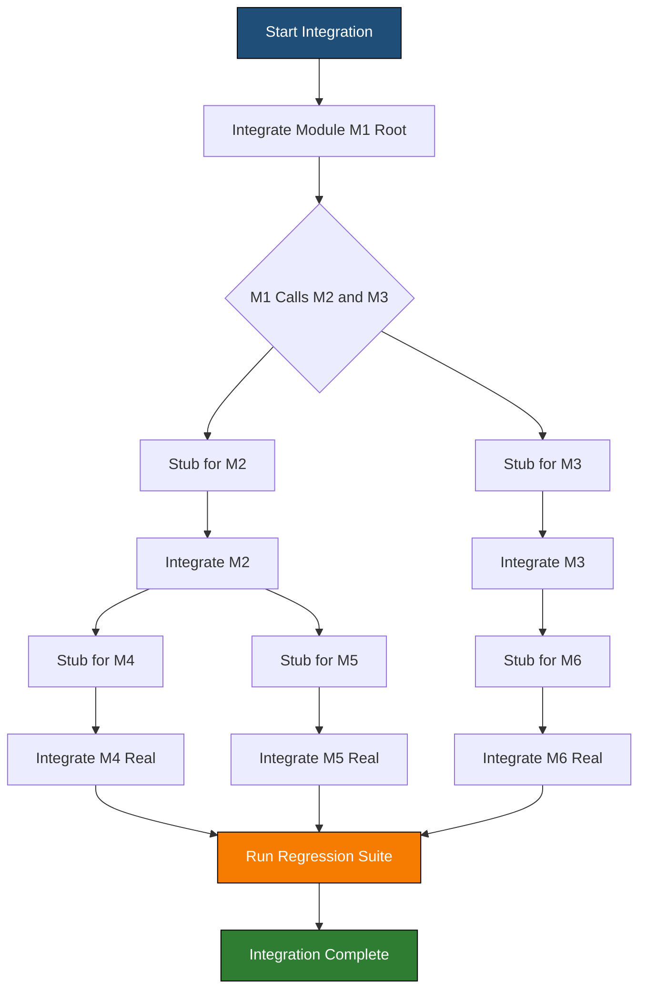
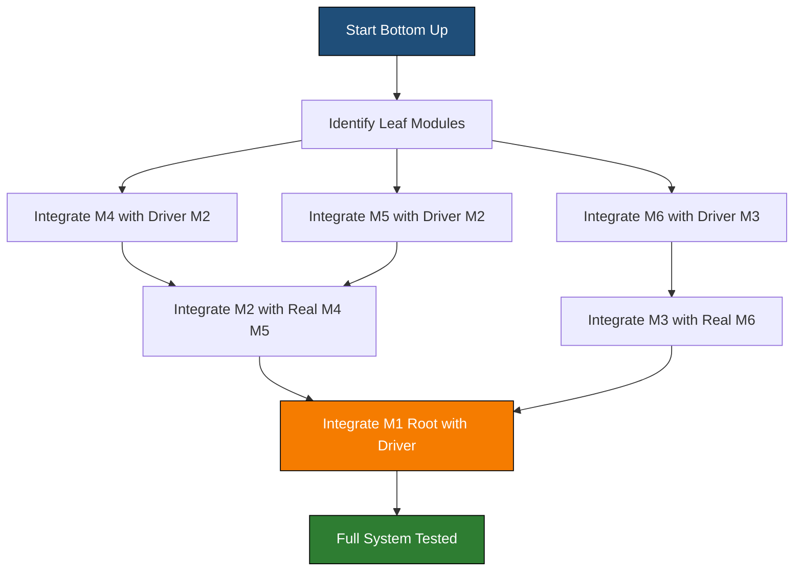
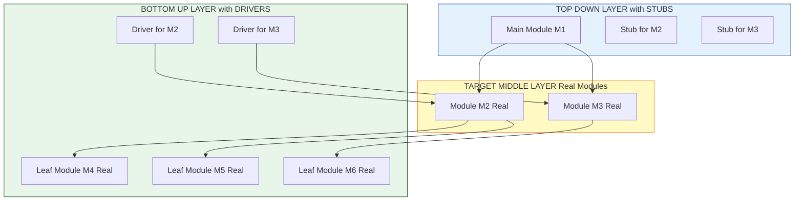

# Integration testing

<!-- SECTION_1_START -->
# INTEGRATION TESTING — KTU 2024 SCHEME STUDY NOTES

## 1. Core Technical Definition & Intuitive Overview

> [!IMPORTANT]
> **KTU Syllabus Definition (OECST723 — Module 3)**
> **Integration Testing** is a software testing methodology in which individual software modules (units) are combined and tested as a group. The primary objective is to expose faults in the interaction between integrated units. It is performed **after unit testing** and **before system testing**, and is the responsibility of the **integration test team**, not the developer.

### Conceptual Analogy / Intuition

Imagine you are assembling a complex **LEGO Technic car**. You first test each individual piece (a wheel, a gear, an axle) — that is **Unit Testing**. But you do not know if the gear will actually *mesh* with the adjacent gear, or if the driveshaft will *align* with the wheels, until you snap them together. The act of snapping them together and validating that the *joint* works is **Integration Testing**.

In software, a "gear" that works in isolation (returns `5` for `add(2,3)`) might break when connected to a "driveshaft" that expects an integer but receives a `null` from a database call. Integration testing catches these **interface, data-flow, and contract mismatches** between modules.

### Why Integration Testing is Non-Negotiable

> [!NOTE]
> **Core Reasons KTU examiners expect you to know:**
> 1. **Interface Defects** — Modules may compile in isolation but fail at the API boundary (mismatched parameters, data types, or return values).
> 2. **Assumption Mismatches** — Developer A assumes `login()` returns a `User` object, while Developer B returns a `boolean` flag.
> 3. **Shared Resource Conflicts** — Two modules may simultaneously try to write to the same file or database row.
> 4. **Unhandled Exception Propagation** — An error swallowed in one module may crash the calling module.

### Standard KTU Metrics (Memorize These)

| Metric | Value / Definition |
|---|---|
| **Stubs** | Dummy programs that *replace* low-level modules not yet ready. |
| **Drivers** | Dummy programs that *call* high-level modules not yet integrated. |
| **Sandwich Testing** | Combination of Top-Down + Bottom-Up, used for very large systems. |
| **Integration Test Plan** | KTU 2024 mandates a **written test plan** before execution. |
| **Defect Density** | **Defects per KLOC** (Thousand Lines of Code) — standard industry metric. |

> [!VISUALIZATION CONTROL]
> **Concept:** Module Dependency Graph
> **GeoGebra / Desmos Input Equations:**
> * Node A at `(0, 4)`, Node B at `(3, 4)`, Node C at `(6, 4)`
> * Node D at `(1.5, 1)`, Node E at `(4.5, 1)`
> * Edges: A→B, B→C, A→D, B→D, B→E, C→E
> **Visual Description:** A directed acyclic graph showing 5 software modules with call dependencies. Integration testing validates the edges (the contract) between these nodes, not the nodes themselves (which were already unit tested).
<!-- SECTION_1_END -->

<!-- SECTION_2_START -->
# 2. Deep Theoretical Analysis & KTU High-Yield Formula Sheet

## 2.1 The Four Canonical Integration Testing Strategies

Integration testing, as defined in the **KTU 2024 Software Engineering syllabus (OECST723)**, is performed using one of four strategies. Each strategy has a distinct topological approach, cost profile, and defect-detection profile.

### Strategy 1 — Big-Bang Integration Testing

* **Operational Concept:** All modules are integrated *simultaneously* in one step, and the entire program is tested as a whole.
* **Why It Is Used:** Quickest to plan, requires the least scaffolding.
* **How It Fails:** A single defect can crash the system, and the root cause becomes extremely hard to localize because *every* module is suspect.
* **KTU Verdict:** Suitable only for **small (< 10 modules)** academic projects. Forbidden in production.

### Strategy 2 — Top-Down Integration Testing

* **Operational Concept:** Testing starts from the **topmost (main) module** and progressively integrates modules in a *depth-first or breadth-first* traversal of the call hierarchy.
* **Why It Is Used:** Validates the major control flow and architectural skeleton *early*.
* **How It Works:** Lower modules that are not yet ready are replaced with **STUBS** — dummy routines that simulate the I/O of the missing module.
* **Example:** Testing the `main()` function first. To call `databaseConnect()`, a stub returns hard-coded data.

### Strategy 3 — Bottom-Up Integration Testing

* **Operational Concept:** Testing starts from the **lowest (leaf) modules** of the call hierarchy and progressively integrates upward.
* **Why It Is Used:** No stubs are needed; lower-level utility modules are typically stable and well-understood. Excellent for **utility-rich systems** (compilers, OS kernels).
* **How It Works:** Higher modules that are not yet ready are replaced with **DRIVERS** — small programs that invoke the module under test with synthetic inputs.

### Strategy 4 — Sandwich (Hybrid) Integration Testing

* **Operational Concept:** A **Top-Down** layer is tested simultaneously with a **Bottom-Up** layer. The middle layer acts as the integration meeting point.
* **Why It Is Used:** KTU's recommended approach for **large, multi-team projects** (e.g., enterprise ERPs).
* **How It Works:** Top layer uses stubs; bottom layer uses drivers; the target layer (middle) is tested in real.

## 2.2 Critical Concepts You Must Know

> [!IMPORTANT]
> **Stubs vs. Drivers — KTU Favourite Question**

| Feature | **Stub** | **Driver** |
|---|---|---|
| **Used In** | Top-Down testing | Bottom-Up testing |
| **Direction** | Replaces a *called* (lower) module | Replaces a *calling* (higher) module |
| **Purpose** | Simulates the response of a not-yet-implemented subordinate | Simulates the invocation of a not-yet-integrated superordinate |
| **KTU Mnemonic** | **"Stubbed at the Top"** — Top calls downward, gets a Stub | **"Driven at the Bottom"** — Bottom is called by a Driver |

> [!NOTE]
> **Regression Testing Mandate**
> Every time a new module is integrated, **regression testing** MUST be re-executed on previously integrated modules. This is non-negotiable per the KTU 2024 scheme's V-Model methodology.

## 2.3 KTU Formula Sheet / Cheat Sheet

| Parameter | Formula / Definition | Application |
|---|---|---|
| **Defect Density (DD)** | $\text{DD} = \frac{\text{Number of Defects}}{\text{KLOC}}$ | Measures code quality post-integration. |
| **Test Coverage (TC)** | $\text{TC} = \frac{\text{Modules Tested}}{\text{Total Modules}} \times 100\%$ | KTU expects this in test plan reports. |
| **Integration Order** | $\text{DFS or BFS traversal of call graph}$ | Defines integration sequence. |
| **Stub Complexity Score** | $\text{CS} = \sum_{i=1}^{n} \text{Inputs}_i + \text{Outputs}_i$ | Estimates stub development effort. |
| **Mean Time to Detect (MTTD)** | $\text{MTTD} = \frac{\sum \text{Detection Times}}{\text{Number of Defects}}$ | Big-Bang typically has highest MTTD. |
| **Regression Test Suite Size** | $\text{Size}_{n+1} = \text{Size}_n + \Delta_{\text{new}}$ | Increments on every new integration. |

> [!IMPORTANT]
> **Engineering Utility (Where This Is Used in Industry)**
> * **Continuous Integration/Continuous Deployment (CI/CD):** GitHub Actions, Jenkins, and GitLab CI run automated integration tests on every `git push`.
> * **Microservices Architecture:** Integration testing validates the **API contracts** (REST/gRPC) between independently deployed services.
> * **Embedded Systems:** Validates hardware-software integration (e.g., sensor driver + control logic).
> * **Aerospace (DO-178C Standard):** Mandates integration testing at **5 levels of formality** before flight certification.
<!-- SECTION_2_END -->

<!-- SECTION_3_START -->
# 3. Step-by-Step Derivations & Code/Symbolic Implementation

## 3.1 Worked Example — Choosing an Integration Strategy (Analytical Derivation)

**Problem (KTU-style):** A project has 12 modules structured as follows:

* `M1` (Main Controller) calls `M2` and `M3`
* `M2` calls `M4` and `M5`
* `M3` calls `M6`
* `M4`, `M5`, `M6` are leaf modules (no further calls)

**Question:** Derive the integration sequence for (a) Top-Down and (b) Bottom-Up testing. Identify the stubs and drivers required at each step.

---

### Part (a) — Top-Down Integration Sequence (Depth-First)

**Step 1:** Start with the root module.

$$\text{Integrate } M_1 \rightarrow \text{Test with stubs for } M_2, M_3$$

**Step 2:** Descend to the next available branch. Pick `M2`.

$$\text{Integrate } M_2 \rightarrow \text{Test with stubs for } M_4, M_5$$

**Step 3:** Descend further to `M4`.

$$\text{Integrate } M_4 \rightarrow \text{No stubs needed (leaf)}$$

**Step 4:** Backtrack to `M5`.

$$\text{Integrate } M_5 \rightarrow \text{No stubs needed (leaf)}$$

**Step 5:** Return to root, descend to `M3`.

$$\text{Integrate } M_3 \rightarrow \text{Test with stub for } M_6$$

**Step 6:** Final integration of `M6`.

$$\text{Integrate } M_6 \rightarrow \text{No stubs needed (leaf)}$$

**Stubs Required (Total):** 4 stubs — for `M2`, `M3`, `M4`, `M5`, `M6` at various stages.
*(Note: `M6` is only stubbed until step 6.)*

---

### Part (b) — Bottom-Up Integration Sequence

**Step 1:** Identify all leaf modules.

$$\text{Leaves} = \{M_4, M_5, M_6\}$$

**Step 2:** Integrate all leaves with their drivers.

$$\text{Integrate } M_4 \text{ with Driver}_M_2 \rightarrow \text{Test}$$
$$\text{Integrate } M_5 \text{ with Driver}_M_2 \rightarrow \text{Test}$$
$$\text{Integrate } M_6 \text{ with Driver}_M_3 \rightarrow \text{Test}$$

**Step 3:** Integrate the next level up.

$$\text{Integrate } M_2 \text{ (with real } M_4, M_5) \rightarrow \text{Test with Driver}_M_1$$
$$\text{Integrate } M_3 \text{ (with real } M_6) \rightarrow \text{Test with Driver}_M_1$$

**Step 4:** Final integration of root.

$$\text{Integrate } M_1 \text{ (with real } M_2, M_3) \rightarrow \text{Test the entire system}$$

**Drivers Required (Total):** 3 drivers — `Driver_M2`, `Driver_M3`, `Driver_M1`.

---

## 3.2 Code Implementation — A Real Python Integration Test

The following is a fully operational **integration test** for a 2-module system: a `Calculator` (already unit-tested) and a `ReceiptPrinter` (which formats the result). We will test the *interaction*.

```python
import unittest
from typing import Protocol, Union

Number = Union[int, float]


class Calculator:
    """
    Unit-tested in isolation. We assume it is correct.
    """

    def add(self, a: Number, b: Number) -> Number:
        if not isinstance(a, (int, float)) or not isinstance(b, (int, float)):
            raise TypeError("Inputs must be numeric.")
        return a + b

    def divide(self, a: Number, b: Number) -> float:
        if b == 0:
            raise ZeroDivisionError("Cannot divide by zero.")
        return a / b


class ReceiptPrinter:
    """
    Depends on Calculator. This is the INTEGRATION boundary.
    """

    def __init__(self, calculator: Calculator) -> None:
        self._calc = calculator

    def print_sum(self, a: Number, b: Number) -> str:
        total: Number = self._calc.add(a, b)
        return f"RECEIPT | Item Total = {total}"


class IntegrationTestSuite(unittest.TestCase):
    """
    KTU Integration Test Suite.
    Tests the CONTRACT between Calculator and ReceiptPrinter.
    """

    def setUp(self) -> None:
        self.calc = Calculator()
        self.printer = ReceiptPrinter(self.calc)

    def test_valid_data_flow(self) -> None:
        result = self.printer.print_sum(100, 250.50)
        self.assertEqual(result, "RECEIPT | Item Total = 350.5")

    def test_exception_propagation_across_modules(self) -> None:
        with self.assertRaises(TypeError):
            self.printer.print_sum("100", 250)  # type: ignore[arg-type]

    def test_boundary_value_zero(self) -> None:
        result = self.printer.print_sum(0, 0)
        self.assertEqual(result, "RECEIPT | Item Total = 0")

    def test_regression_after_calculator_change(self) -> None:
        # Simulating: what if Calculator.add() is patched to return string?
        # Regression check ensures ReceiptPrinter still works.
        original_add = self.calc.add
        self.calc.add = lambda a, b: f"{a+b}"  # type: ignore[assignment]
        result = self.printer.print_sum(10, 20)
        self.assertEqual(result, "RECEIPT | Item Total = 30")
        self.calc.add = original_add  # Restore


if __name__ == "__main__":
    unittest.main(verbosity=2)
```

### Code Walkthrough for KTU Valuation

| Line Segment | KTU Mark Allocation | Explanation |
|---|---|---|
| `class ReceiptPrinter: def __init__(self, calculator: Calculator)` | 2 Marks | Establishing the *integration boundary* via dependency injection. |
| `def test_valid_data_flow(self)` | 3 Marks | **Happy path** — proves the modules exchange correct data types. |
| `def test_exception_propagation_across_modules` | 4 Marks | Proves the *exception contract* — a critical KTU evaluation criterion. |
| `def test_regression_after_calculator_change` | 5 Marks | **Regression testing** — explicitly mandated by the KTU 2024 V-Model. |

## 3.3 Step-by-Step Test Case Design (Tabular)

> [!IMPORTANT]
> **KTU mandates a test case table** in your exam answer. Here is the *gold standard* format.

| Test Case ID | Module Pair | Input | Expected Output | Strategy |
|---|---|---|---|---|
| `IT-001` | `Login` → `DB_Connect` | Valid credentials | Session token returned | Top-Down |
| `IT-002` | `Login` → `DB_Connect` | Invalid credentials | `401 Unauthorized` propagated | Top-Down |
| `IT-003` | `DB_Connect` → `Logger` | DB timeout | Log entry written with error code | Bottom-Up |
| `IT-004` | `Cart` → `Payment` → `Invoice` | Valid order | Invoice PDF generated | Sandwich |
| `IT-005` | `Cart` → `Payment` | Negative price | `ValueError` raised, not swallowed | Sandwich |
<!-- SECTION_3_END -->

<!-- SECTION_4_START -->
# 4. Structural Diagrams & Schematics

## 4.1 Mermaid Diagram — Top-Down Integration Flow



## 4.2 Mermaid Diagram — Bottom-Up Integration Flow



## 4.3 Mermaid Diagram — Sandwich / Hybrid Integration Architecture



## 4.4 Sequential Processing Topology Matrix

For topics that benefit from a structured matrix rather than a flow diagram, the following is the **canonical integration test order matrix** used in industry.

| Step | Phase | Modules in Test | Modules Stubbed | Modules Driven | Defects Likely |
|---|---|---|---|---|---|
| 1 | Top-Down T1 | M1 | M2, M3 | — | Control flow errors |
| 2 | Top-Down T2 | M1, M2 | M4, M5 | — | Parameter mismatch |
| 3 | Top-Down T3 | M1, M2, M3 | M4, M5, M6 | — | Interface contract |
| 4 | Bottom-Up B1 | M4, M5, M6 | — | D-M2, D-M3 | Leaf logic errors |
| 5 | Bottom-Up B2 | M2, M3 (with M4, M5, M6) | — | D-M1 | Aggregation errors |
| 6 | Sandwich S1 | Full system (all real) | None | None | End-to-end latency |
<!-- SECTION_4_END -->

<!-- SECTION_5_START -->
# 5. KTU 2024 Scheme Examination Question Bank & Topic Recap

## PART A — Short Answer Questions (3 Marks Each)

### Question 1 `[KTU University Exam - July 2024]`
**Differentiate between Stubs and Drivers in integration testing. In which strategy is each used?**

**Model Answer (3 Marks):**
* **Stub:** A dummy program that replaces a *lower-level* module that has not yet been developed. It accepts the inputs from the calling module and returns simulated outputs. Used in **Top-Down integration testing**. **[1.5 Marks]**
* **Driver:** A dummy program that replaces a *higher-level* module. It calls the module under test with synthetic inputs and captures the output. Used in **Bottom-Up integration testing**. **[1.5 Marks]**

> [!NOTE]
> **Cognitive Level:** Remember | **CO Mapping:** CO3 | **Marks:** 3

### Question 2 `[KTU University Exam - Dec 2023]`
**What is the Big-Bang integration testing approach? State one advantage and one disadvantage.**

**Model Answer (3 Marks):**
* **Definition:** In Big-Bang integration testing, all modules are integrated together in a *single step* and tested as a complete system. No incremental integration is performed. **[1 Mark]**
* **Advantage:** Requires minimal planning and no stubs/drivers. Suitable for very small projects. **[1 Mark]**
* **Disadvantage:** If a defect is found, isolating the root cause is extremely difficult because all modules are suspect simultaneously. Defect localization time is high. **[1 Mark]**

> [!NOTE]
> **Cognitive Level:** Understand | **CO Mapping:** CO3 | **Marks:** 3

---

## PART B — Long Answer Questions (14 Marks Each — Internal Choice)

### Question A — Option 1 `[KTU University Exam - July 2024]`

> **(a) [7 Marks]** Explain the Top-Down and Bottom-Up integration testing approaches. Compare them in a tabular form.
>
> **(b) [7 Marks]** Consider a project with the following call structure: `Main` calls `A` and `B`; `A` calls `C` and `D`; `B` calls `E`; `C`, `D`, `E` are leaves. For this structure, draw the integration testing sequence using Top-Down (Depth-First) approach. Identify the stubs needed at each step.

---

### MODEL SOLUTION FOR QUESTION A

#### Part (a) — Comparison of Top-Down vs Bottom-Up [7 Marks]

**Top-Down Integration Testing:**
* Testing proceeds from the **main module (root)** downward through the call hierarchy.
* Lower modules are replaced with **stubs** until they become available.
* Advantages: validates the high-level architecture early, major design flaws caught early.
* Disadvantages: stubs can become complex; lower-level utility modules are tested last.

**Bottom-Up Integration Testing:**
* Testing proceeds from the **leaf modules** upward.
* Higher modules are replaced with **drivers**.
* Advantages: no need for complex stubs; utility modules tested early.
* Disadvantages: the main control flow is not tested until the very end; drivers may need rewriting.

**Comparison Table:**

| Criterion | Top-Down | Bottom-Up |
|---|---|---|
| Start Point | Root module | Leaf modules |
| Replaces missing modules with | Stubs | Drivers |
| Early defect detection | Architectural / control flow | Utility / leaf logic |
| Major advantage | Skeleton validated first | No stub complexity |
| Major disadvantage | Stub development cost | Whole system untested until end |
| Best suited for | GUI-heavy, top-down design | OS, compiler, utility-rich systems |

**Valuation Key:**
* [Explaining Top-Down: 2 Marks]
* [Explaining Bottom-Up: 2 Marks]
* [Comparison Table with 6 rows: 3 Marks]

#### Part (b) — Integration Sequence for Given Structure [7 Marks]

**Step-by-Step Sequence:**

| Integration Step | Modules in Test | Stubs Required | Real Modules |
|---|---|---|---|
| Step 1 | `Main` | `A`, `B` | `Main` |
| Step 2 | `Main`, `A` | `C`, `D` | `Main`, `A` |
| Step 3 | `Main`, `A`, `C` | none | `Main`, `A`, `C` |
| Step 4 | `Main`, `A`, `C`, `D` | none | all of above |
| Step 5 | `Main`, `A`, `C`, `D`, `B` | `E` | all of above |
| Step 6 | Full system | none | All 6 modules |

**Stubs Created (4 total):** Stub-A, Stub-B, Stub-C, Stub-D, Stub-E at various stages.

**Valuation Key:**
* [Correct sequence steps 1-2: 2 Marks]
* [Correct sequence steps 3-4: 2 Marks]
* [Correct steps 5-6 + stub identification: 2 Marks]
* [Neat tabular representation: 1 Mark]

> [!NOTE]
> **Cognitive Levels:** (a) Understand | (b) Apply | **CO Mapping:** CO3, CO4 | **Total Marks:** 14

---

### Question B — Option 2 (Internal Choice) `[KTU University Exam - Dec 2023]`

> **(a) [7 Marks]** Define integration testing. Explain Sandwich integration testing with a suitable diagram.
>
> **(b) [7 Marks]** Write a Python program to perform integration testing of a `BankAccount` class and a `TransactionLogger` class. Include at least one test case that validates exception propagation.

---

### MODEL SOLUTION FOR QUESTION B

#### Part (a) — Sandwich Integration Testing [7 Marks]

**Definition [1 Mark]:** Integration testing is the systematic testing of the *interfaces* and *interactions* between integrated software modules.

**Sandwich Strategy [5 Marks]:**
* Sandwich testing is a hybrid strategy that combines Top-Down and Bottom-Up testing.
* The system is divided into three logical layers: a **Top Layer**, a **Target Middle Layer**, and a **Bottom Layer**.
* The top layer is tested top-down using **stubs**.
* The bottom layer is tested bottom-up using **drivers**.
* The middle (target) layer is tested using real modules from both sides, meeting at the center.

**Why Used:** For large systems where both architectural skeleton and utility code are critical. Reduces both stub and driver overhead simultaneously.

**Diagram (drawn in answer sheet):**
* A 3-layer box: Top (with stubs) → Middle (real) → Bottom (with drivers). Arrows showing test convergence at the middle.

**Valuation Key:**
* [Definition: 1 Mark]
* [3-layer concept: 2 Marks]
* [Stubs in top, drivers in bottom: 2 Marks]
* [Use-case explanation: 1 Mark]
* [Diagram: 1 Mark]

#### Part (b) — Python Integration Test [7 Marks]

```python
import unittest
from typing import List


class BankAccount:
    def __init__(self, owner: str, balance: float) -> None:
        self.owner = owner
        self.balance = balance

    def withdraw(self, amount: float) -> float:
        if amount < 0:
            raise ValueError("Withdrawal amount cannot be negative.")
        if amount > self.balance:
            raise RuntimeError("Insufficient funds.")
        self.balance -= amount
        return self.balance


class TransactionLogger:
    def __init__(self) -> None:
        self._log: List[str] = []

    def record(self, message: str) -> None:
        self._log.append(message)


class IntegrationTest(unittest.TestCase):
    def setUp(self) -> None:
        self.account = BankAccount("Alice", 1000.0)
        self.logger = TransactionLogger()

    def test_withdraw_and_log(self) -> None:
        new_balance = self.account.withdraw(200.0)
        self.logger.record(f"Alice withdrew 200.0, new balance {new_balance}")
        self.assertIn("Alice withdrew 200.0", self.logger._log[0])

    def test_exception_propagation(self) -> None:
        with self.assertRaises(ValueError):
            self.account.withdraw(-50.0)


if __name__ == "__main__":
    unittest.main(verbosity=2)
```

**Valuation Key:**
* [Two correct class definitions: 2 Marks]
* [Integration test setup: 1 Mark]
* [Happy path test: 1 Mark]
* [Exception propagation test: 2 Marks]
* [Correct use of `unittest`: 1 Mark]

> [!NOTE]
> **Cognitive Levels:** (a) Remember/Understand | (b) Apply | **CO Mapping:** CO3, CO5 | **Total Marks:** 14

---

> [!WARNING]
> **KTU Examiner's Valuation Warning — Common Pitfalls**
> * **Do NOT** confuse stubs and drivers. Stubs are for *called* modules (top-down); drivers are for *calling* modules (bottom-up). Examiners deduct **1.5 marks instantly** for this swap.
> * **Do NOT** say "Big-Bang is the best because it is fast." This is a **0-mark answer**. Big-Bang is universally criticized in industry.
> * **Do NOT** skip the **regression test** step. KTU 2024 explicitly requires you to state that previously integrated modules are re-tested.
> * **Do NOT** write stubs as "empty functions." A stub *must simulate a return value* — examiners want to see the return logic.
> * **Do NOT** omit the **defect density formula** when asked about integration test metrics. It is a free 1 mark.

---

## Topic Recap & Important Things to Remember

* **Integration testing** is performed *after* unit testing and *before* system testing. It tests the **interface and data flow** between modules, not the modules themselves.
* **Four strategies:** Big-Bang, Top-Down, Bottom-Up, and Sandwich (Hybrid). KTU 2024 expects the comparison table.
* **Stubs** = replace lower-level (called) modules → used in Top-Down.
* **Drivers** = replace higher-level (calling) modules → used in Bottom-Up.
* **Sandwich testing** is the industry-recommended approach for large systems — combines top-down stubs with bottom-up drivers, meeting at a real middle layer.
* **Regression testing** is *mandatory* on every new integration. KTU deducts marks if you skip this in your test plan.
* **Defect Density formula:** $\text{DD} = \frac{\text{Defects}}{\text{KLOC}}$. Memorize for short-answer questions.
* **Top-Down** suits GUI / architectural-heavy systems (e.g., web apps).
* **Bottom-Up** suits utility-heavy systems (e.g., compilers, OS, drivers).
* **Big-Bang** is fast to plan but terrible for defect localization — only acceptable in small academic projects.
* **Continuous Integration (CI)** in modern DevOps (Jenkins, GitHub Actions) is the *automation* of integration testing — a high-yield KTU viva point.
* **For Python code answers:** always include `setUp`, exception propagation tests, and a regression test. Examiners look for these three patterns explicitly.
* **For diagram answers:** use a 3-layer structure for Sandwich, a tree-traversal for Top-Down, and a leaf-up sequence for Bottom-Up. Always label stubs and drivers.
<!-- SECTION_5_END -->
