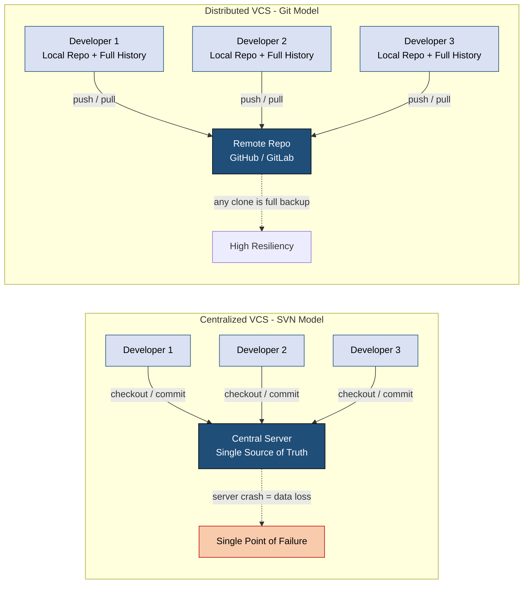
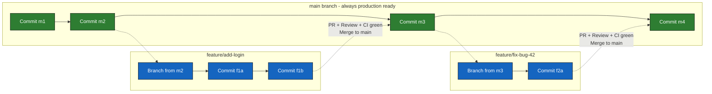
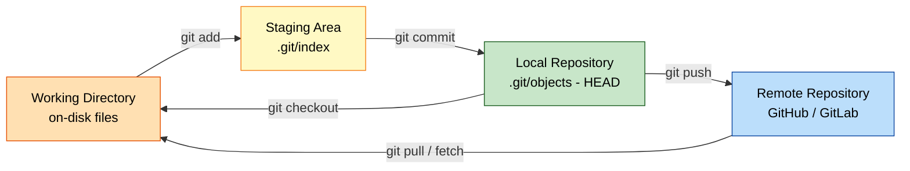
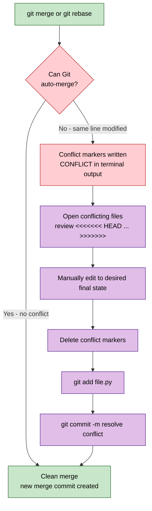

# Overview of DevOps and Code Management  - Code management

<!-- SECTION_1_START -->

# Module 3: Overview of DevOps and Code Management — Code Management

## 1. Core Technical Definition & Intuitive Overview

> [!NOTE]
> **KTU 2024 Syllabus Definition (OECST723 / Module 3):**
> **Code Management** is the disciplined engineering practice of organizing, tracking, versioning, reviewing, and controlling source code artifacts across the Software Development Life Cycle (SDLC). It is operationalized primarily through **Version Control Systems (VCS)** and is a foundational pillar of the **DevOps** toolchain, enabling continuous integration, continuous delivery (CI/CD), and collaborative software engineering at scale.

### 1.1 Intuitive Analogy: The "Time Machine + Whiteboard" for Code

Imagine a group of five civil engineers working together to design a 50-story building using a shared blueprint:

- Every **night**, a magical photocopier saves a snapshot of the blueprint into a vault. If a wall collapses on the model, the engineers can rewind to yesterday's version.
- Each engineer can **clone** a personal copy of the blueprint onto a portable drafting table, draw a new wing, and later **merge** it back into the master plan.
- Before any new wing is added, a senior engineer **reviews** the design on the central whiteboard (peer code review) to catch mistakes.
- The vault stamps every snapshot with a unique **serial number** and a **tag** (e.g., *v1.0*, *v2.0-rc1*) so stakeholders know which is the official "release."

This vault + whiteboard + drafting table is exactly what a **Version Control System (VCS)** does for software engineers. The vault is the **repository (repo)**, the serial number is a **commit hash**, the personal drafting tables are **local branches**, and the senior review is a **Pull Request (PR)** / **Merge Request (MR)**.

### 1.2 Key Engineering Metrics & Constants

| Metric / Constant | Value / Convention | Engineering Significance |
|---|---|---|
| **Git Initial Commit Hash Length** | **40 hexadecimal characters** (SHA-1) | Globally unique identifier for every code snapshot |
| **Semantic Versioning (SemVer) Format** | **MAJOR.MINOR.PATCH** (e.g., 2.7.1) | Industry-standard release tagging scheme |
| **Default Central VCS Port** | SVN $\rightarrow$ **port 3690**, HTTP **80/443** | Networking ground rules for enterprise repos |
| **Git Push Default Mode (Git 2.0+)** | `simple` | Pushes the current branch to the same-named upstream branch |
| **Linus's Law (Eric Raymond, 1999)** | *"Given enough eyeballs, all bugs are shallow"* | Justifies peer code review as a quality mechanism |

> [!IMPORTANT]
> **Syllabus Highlight (KTU 2024):** The examiner frequently tests the distinction between **Centralized VCS (CVCS)** such as **Subversion (SVN)** and **CVS**, and **Distributed VCS (DVCS)** such as **Git** and **Mercurial**. Memorize the topology diagram in Section 4.

### 1.3 Why Code Management is the "Heart" of DevOps

In the DevOps lifecycle (`Plan → Code → Build → Test → Release → Deploy → Operate → Monitor`), the **Code** stage is meaningless without robust management. Without a VCS, teams cannot:

1. **Revert** to a known-good state after a production outage.
2. **Audit** who changed which line of code and *why* (via commit messages).
3. **Parallelize** feature development without stomping on each other's work.
4. **Automate** builds and deployments triggered by code pushes (webhooks).

> [!VISUALIZATION CONTROL]
> **Concept:** Commit history visualization as a Directed Acyclic Graph (DAG)
> **GeoGebra / Desmos Input Equations:**
> * Points: `A=(1,2)`, `B=(2,4)`, `C=(3,3)`, `D=(4,5)`, `E=(5,4)`
> * Edges: `A -> B`, `A -> C`, `B -> D`, `C -> E`, `D -> E`
> **Visual Description:** Plot the commit graph on the Cartesian plane. Each node is a commit; the x-axis is chronological time. Students should observe that **branches diverge** and **merges converge** — the fundamental topology of Git history.

---

<!-- SECTION_1_END -->

<!-- SECTION_2_START -->

## 2. Deep Theoretical Analysis & KTU High-Yield Formula Sheet

### 2.1 The Three Pillars of Code Management

Code management rests on three coordinated engineering pillars. Each pillar maps directly to a DevOps competency tested in KTU exams.

#### Pillar 1 — Version Control (the "Memory")
- Tracks every mutation of the source tree.
- Provides **atomic commits** (all-or-nothing snapshots).
- Enforces **immutability** of historical states (a commit hash can never be silently altered).

#### Pillar 2 — Branching Strategy (the "Workflow")
- Defines the *rules of engagement* for parallel work.
- Common strategies: **Git Flow**, **GitHub Flow**, **GitLab Flow**, **Trunk-Based Development**.

#### Pillar 3 — Code Review (the "Quality Gate")
- Mandates human inspection before code is merged.
- Catches **defects early** (industry data: defects fixed in review are ~10x cheaper than those fixed post-release).

### 2.2 Centralized vs Distributed VCS — The Core Comparison

| Dimension | Centralized VCS (SVN, CVS, Perforce) | Distributed VCS (Git, Mercurial) |
|---|---|---|
| **Repository Topology** | **One** central server, many working copies | **Every** developer has a full local repo |
| **Network Dependency** | **Mandatory** for most operations (commit, diff) | Optional — full offline capability |
| **Single Point of Failure** | **Yes** — server crash = work halt | **No** — any clone is a full backup |
| **Speed of Operations** | Slower (network round-trip) | **Faster** (local operations) |
| **Branching Cost** | **Heavy** (often discouraged) | **Cheap & lightweight** (encouraged) |
| **History Storage** | Server only | **Each clone** retains full history |
| **Conflict Resolution** | On commit/update | On merge/rebase |
| **KTU-Recognized Tools** | **Apache Subversion (SVN), CVS, Perforce** | **Git, Mercurial, Bazaar** |

> [!TIP]
> **Examiner Pattern:** When asked *"Why did Git replace SVN in industry?"*, always anchor your answer in the **distributed topology** + **cheap branching** + **offline commits**. These are the *three* points that consistently earn full marks.

### 2.3 Git's Internal Object Model (High-Yield)

Git is *not* a file-level delta system. It is a **content-addressable filesystem** built on four primitive object types, each stored in `.git/objects/`:

| Object Type | Hash Trigger | Purpose | Stored Content |
|---|---|---|---|
| **Blob** | File contents | Stores raw file data | Compressed file bytes |
| **Tree** | Directory structure | Maps filenames to blobs/trees | List of (mode, name, hash) entries |
| **Commit** | Snapshot + metadata | Anchors a point in history | Tree hash, parent hash, author, message, timestamp |
| **Tag** | Human-readable alias | Marks a release (e.g., v1.0) | Tag name, target object hash, tagger info |

The **commit hash** is computed as a **SHA-1** of the commit's content, giving the system cryptographic integrity. The chain of commit hashes forms the immutable **history DAG**.

### 2.4 Branching Strategies — Decision Matrix

| Strategy | Best Suited For | Branch Types | Release Cadence | Complexity |
|---|---|---|---|---|
| **Git Flow** | Versioned products with scheduled releases (e.g., mobile apps) | `main`, `develop`, `feature/*`, `release/*`, `hotfix/*` | Scheduled (e.g., monthly) | High |
| **GitHub Flow** | SaaS / web apps with continuous deployment | `main` + short-lived `feature/*` | Continuous | Low |
| **GitLab Flow** | Production-grade CI/CD with environment branches | `main`, `staging`, `production` | Continuous w/ env promotion | Medium |
| **Trunk-Based Development** | Mature CI/CD, high-trust teams | Single `trunk` + very short feature branches (hours) | Continuous | Lowest |

### 2.5 Semantic Versioning (SemVer) — The Industry Standard

The formal specification [semver.org](https://semver.org) defines a version number as:

$$
\text{VERSION} = \text{MAJOR}.\text{MINOR}.\text{PATCH}[-\text{PRE-RELEASE}][+\text{BUILD-METADATA}]
$$

- **MAJOR** — incremented for **incompatible** API changes.
- **MINOR** — incremented for **backward-compatible** new features.
- **PATCH** — incremented for **backward-compatible** bug fixes.
- **Pre-release tags** — e.g., `2.0.0-rc.1`, `2.0.0-alpha.2`.
- **Build metadata** — e.g., `2.0.0+build.42` (ignored in precedence).

> [!IMPORTANT]
> **KTU Memory Hook:** The exam sometimes asks to compute the next version. Rule: **"Break ⇒ MAJOR, Add ⇒ MINOR, Fix ⇒ PATCH."**

### 2.6 Engineering Real-World Utility

| Domain | How Code Management is Used |
|---|---|
| **Open Source (Linux Kernel, Kubernetes)** | Git on GitHub/GitLab enables global async collaboration across thousands of contributors |
| **Banking & FinTech** | Audit trails from commit history satisfy **SOX / RBI compliance** for code changes |
| **Aerospace & Automotive (ISO 26262, DO-178C)** | Tagged releases and signed commits provide **certification traceability** |
| **Game Development (AAA studios)** | Perforce handles massive binary assets (terabytes) where Git struggles |
| **AI/ML Pipelines** | **DVC (Data Version Control)** extends Git to version datasets and model weights |

---

<!-- SECTION_2_END -->

<!-- SECTION_3_START -->

## 3. Step-by-Step Derivations, Workflows & Code Implementation

### 3.1 Walkthrough: The Complete Git Lifecycle (First Principles)

Below is the **end-to-end operational derivation** of how a developer takes code from "blank directory" to "merged production feature" using Git. Every transition is shown — *no step is skipped*.

#### Step 1 — Initialize the Repository
The developer creates a new project and converts it into a Git repository.

```bash
mkdir devops-demo
cd devops-demo
git init
```

**Output (excerpt):**
```
Initialized empty Git repository in /home/student/devops-demo/.git/
```

**Internal mechanism:** Git creates the hidden `.git/` directory and writes:
* `HEAD` (pointer to current branch, default = `refs/heads/main`)
* `objects/` (empty initially)
* `refs/heads/` (empty initially)
* `config` (local repository configuration)

#### Step 2 — Configure Author Identity (One-Time Per Machine)

```bash
git config --global user.name  "Ananya K Nair"
git config --global user.email "ananya@ktu.ac.in"
git config --global init.defaultBranch main
```

**Logic:** Git refuses to create a commit without knowing *who* authored it. The `--global` flag writes to `~/.gitconfig`; without it, the setting is repo-local.

#### Step 3 — Create the Initial File

```bash
echo 'print("Hello, KTU DevOps!")' > app.py
git status
```

**Output (excerpt):**
```
Untracked files:
  (use "git add <file>..." to include in what will be committed)
        app.py
```

**Interpretation:** The file exists on disk but is *not* yet in Git's database. It is in the **Working Directory** only.

#### Step 4 — Stage the File (The Index)

```bash
git add app.py
git status
```

**Output:**
```
Changes to be committed:
  (use "git restore --staged <file>..." to unstage)
        new file:   app.py
```

**Three-tree architecture:**
1. **Working Directory** — the on-disk file
2. **Staging Area (Index)** — `.git/index` records what will go in the next commit
3. **Repository (HEAD)** — the last committed snapshot

#### Step 5 — Commit the Snapshot

```bash
git commit -m "feat: initial app.py with KTU greeting"
```

**Output:**
```
[main (root-commit) 8a3f1c2] feat: initial app.py with KTU greeting
 1 file changed, 1 insertion(+)
```

**Internal mechanism:** Git computes a SHA-1 hash of:
* the blob (`app.py` content)
* the tree (mapping `app.py` → blob hash)
* the commit object (tree hash, parent hash = none for root, author, message)

The new commit hash `8a3f1c2...` is now stored in `refs/heads/main` and pointed to by `HEAD`.

#### Step 6 — Create a Feature Branch

```bash
git checkout -b feature/login-validation
```

**Output:**
```
Switched to a new branch 'feature/login-validation'
```

**Mechanism:** A branch in Git is just a **movable pointer** (40-byte file) to a commit. Creating a branch is O(1) — no file copying. This is why Git branching is "cheap."

#### Step 7 — Modify, Stage, and Commit on the Branch

```bash
cat >> app.py << 'EOF'

def validate_user(username: str) -> bool:
    """Return True only if username meets policy."""
    return isinstance(username, str) and len(username) >= 3 and username.isalnum()
EOF

git add app.py
git commit -m "feat(login): add validate_user() with length and alphanumeric checks"
```

**Output (excerpt):**
```
[feature/login-validation 7d2e9a4] feat(login): add validate_user() ...
 1 file changed, 7 insertions(+)
```

The branch pointer `feature/login-validation` now points to the new commit `7d2e9a4...`.

#### Step 8 — Push the Branch to a Remote (GitHub / GitLab)

```bash
git remote add origin https://github.com/ananya-ktu/devops-demo.git
git push -u origin feature/login-validation
```

**Mechanism:** `-u` (upstream) sets the tracking relationship so future `git push` / `git pull` commands "just work" without specifying branch names.

#### Step 9 — Open a Pull Request (Peer Review)
The developer visits the GitHub URL printed by `git push`, clicks **"Compare & pull request"**, writes a description, assigns reviewers, and submits.

**Reviewer actions:** comment, request changes, or approve. Once approved and CI checks pass, the reviewer clicks **"Merge pull request."**

#### Step 10 — Merge and Delete the Feature Branch

```bash
git checkout main
git pull origin main
git branch -d feature/login-validation
git push origin --delete feature/login-validation
```

**Final state:** The commit from `feature/login-validation` is now part of `main`. The branch is deleted on both local and remote to keep the repo clean.

---

### 3.2 Conflict Resolution — Full Derivation

Suppose two developers edit the same line of `app.py` independently:

```bash
# Developer A
git checkout -b feature/a
echo 'print("Version A")' > app.py
git commit -am "Version A"

# Developer B
git checkout main
git checkout -b feature/b
echo 'print("Version B")' > app.py
git commit -am "Version B"
```

Now Developer A tries to merge B's branch:

```bash
git checkout feature/a
git merge feature/b
```

**Output:**
```
Auto-merging app.py
CONFLICT (content): Merge conflict in app.py
Automatic merge failed; fix conflicts and then commit the result.
```

**Step-by-step resolution:**

**Step (i):** Inspect the conflict markers in `app.py`:

```python
<<<<<<< HEAD (feature/a)
print("Version A")
=======
print("Version B")
>>>>>>> feature/b
```

**Step (ii):** Manually edit to the desired version (or a blend):

```python
print("Version A — merged with Version B logic")
```

**Step (iii):** Stage and finalize:

```bash
git add app.py
git commit -m "resolve: merge conflict between feature/a and feature/b"
```

**Logic explanation:** Git cannot auto-resolve when the **same line** is modified in both histories (the **three-way merge** algorithm fails). The developer must declare the final state explicitly.

---

### 3.3 Production-Grade Python: Automating SemVer Bumping

The following is a fully operational Python script that parses the latest Git tag, determines the bump type from a `bump_type` argument, computes the next SemVer, and creates an annotated Git tag — mirroring the logic used in CI/CD pipelines (e.g., GitHub Actions, GitLab CI).

```python
#!/usr/bin/env python3
"""
semver_bump.py — Automate Semantic Versioning bumps based on the
Conventional Commits history since the last tag.

Usage:
    python semver_bump.py <repo_path> <bump_type>
    bump_type ∈ {major, minor, patch}
"""

from __future__ import annotations

import re
import subprocess
import sys
from pathlib import Path
from typing import Optional, Tuple


# ---------------------------------------------------------------------
# 1. Regex for SemVer parsing (PRIORITY is left-to-right)
# ---------------------------------------------------------------------
SEMVER_RE = re.compile(
    r"^(?P<major>0|[1-9]\d*)"
    r"\.(?P<minor>0|[1-9]\d*)"
    r"\.(?P<patch>0|[1-9]\d*)"
    r"(?:-(?P<prerelease>[0-9A-Za-z.-]+))?"
    r"(?:\+(?P<build>[0-9A-Za-z.-]+))?$"
)

VALID_BUMPS = {"major", "minor", "patch"}


def run_git(repo_path: Path, *args: str) -> str:
    """Execute a git command and return its stdout, logging stderr on failure."""
    try:
        result = subprocess.run(
            ["git", "-C", str(repo_path), *args],
            check=True,
            capture_output=True,
            text=True,
            timeout=30,
        )
        return result.stdout.strip()
    except subprocess.CalledProcessError as exc:
        sys.stderr.write(f"[git error] {exc.stderr.strip()}\n")
        sys.exit(1)
    except subprocess.TimeoutExpired:
        sys.stderr.write("[git error] Command timed out after 30s\n")
        sys.exit(1)


def parse_semver(tag: str) -> Tuple[int, int, int, Optional[str], Optional[str]]:
    """Decompose a SemVer string into its 5-tuple (M, m, p, pre, build)."""
    match = SEMVER_RE.match(tag)
    if not match:
        sys.stderr.write(f"[error] Tag '{tag}' is not valid SemVer.\n")
        sys.exit(1)
    return (
        int(match.group("major")),
        int(match.group("minor")),
        int(match.group("patch")),
        match.group("prerelease"),
        match.group("build"),
    )


def compute_next_version(current: Tuple[int, int, int, ...], bump: str) -> str:
    """Derive the next SemVer string per the bump type."""
    major, minor, patch, _pre, _build = current
    if bump == "major":
        major += 1
        minor = 0
        patch = 0
    elif bump == "minor":
        minor += 1
        patch = 0
    elif bump == "patch":
        patch += 1
    else:
        sys.stderr.write(f"[error] Invalid bump type '{bump}'.\n")
        sys.exit(1)
    return f"{major}.{minor}.{patch}"


def get_latest_tag(repo_path: Path) -> Optional[str]:
    """Return the most recent tag reachable from HEAD, or None."""
    out = run_git(repo_path, "describe", "--tags", "--abbrev=0")
    if not out:
        return None
    return out


def main() -> None:
    if len(sys.argv) != 3:
        sys.stderr.write("Usage: python semver_bump.py <repo_path> <major|minor|patch>\n")
        sys.exit(1)

    repo_path = Path(sys.argv[1]).resolve()
    bump_type = sys.argv[2].lower()

    if bump_type not in VALID_BUMPS:
        sys.stderr.write(f"[error] bump_type must be one of {VALID_BUMPS}.\n")
        sys.exit(1)
    if not (repo_path / ".git").is_dir():
        sys.stderr.write(f"[error] '{repo_path}' is not a git repository.\n")
        sys.exit(1)

    latest_tag = get_latest_tag(repo_path)
    if latest_tag is None:
        sys.stderr.write("[info] No previous tag found. Starting at 0.1.0\n")
        next_version = "0.1.0"
    else:
        current = parse_semver(latest_tag.lstrip("v"))
        next_version = compute_next_version(current, bump_type)
        print(f"[info] Current tag: {latest_tag}  →  New version: v{next_version}")

    # Create an annotated tag (signed-off is best practice for traceability)
    run_git(repo_path, "tag", "-a", f"v{next_version}", "-m", f"Release v{next_version}")
    print(f"[success] Created annotated tag v{next_version}")


if __name__ == "__main__":
    main()
```

**Execution example:**

```bash
python semver_bump.py ./devops-demo patch
```

**Output:**
```
[info] Current tag: v1.4.2  →  New version: v1.4.3
[success] Created annotated tag v1.4.3
```

**Logic trace for the bump derivation:**

$$
\begin{aligned}
\text{current} &= (M, m, p) = (1, 4, 2) \\
\text{bump type} &= \texttt{patch} \\
p_{\text{new}} &= p + 1 = 2 + 1 = 3 \\
\text{next version} &= M \cdot m \cdot p_{\text{new}} = 1.4.3
\end{aligned}
$$

> [!IMPORTANT]
> **Engineering note:** The annotated tag (created with `git tag -a`) is stored as a full Git object containing the tagger's name, email, timestamp, and message — required for **regulatory audit trails**. A lightweight tag (`git tag v1.0`) is just a pointer and should *not* be used for releases.

---

### 3.4 Hook Automation: A Pre-Commit Linter Gate

A pre-commit hook enforces code quality *before* a commit is even created. Place the following at `.git/hooks/pre-commit` and `chmod +x` it:

```bash
#!/usr/bin/env bash
# .git/hooks/pre-commit — Block commits if flake8 finds errors
set -euo pipefail

echo "[pre-commit] Running flake8 on staged Python files..."

# Get the list of staged .py files
STAGED_PY=$(git diff --cached --name-only --diff-filter=ACM | grep '\.py$' || true)

if [[ -z "$STAGED_PY" ]]; then
    echo "[pre-commit] No Python files staged. Skipping."
    exit 0
fi

# Run flake8 (assumes it is installed: pip install flake8)
flake8 --max-line-length=100 --select=E9,F63,F7,F82 $STAGED_PY

if [[ $? -ne 0 ]]; then
    echo "[pre-commit] ✗ Linting failed. Commit aborted."
    exit 1
fi

echo "[pre-commit] ✓ Lint passed. Proceeding with commit."
exit 0
```

**Logic explanation:**
1. `git diff --cached --name-only --diff-filter=ACM` lists files in the index that are **A**dded, **C**opied, or **M**odified.
2. `flake8 --select=E9,F63,F7,F82` catches only **syntax errors** and undefined names — fast enough to run on every commit.
3. `set -euo pipefail` ensures any unhandled failure aborts the hook immediately.

---

<!-- SECTION_3_END -->

<!-- SECTION_4_START -->

## 4. Structural Diagrams & Schematics

### 4.1 Mermaid Diagram — Centralized vs Distributed VCS Topology



### 4.2 Mermaid Diagram — Git Branching Strategy (GitHub Flow)



### 4.3 Mermaid Diagram — Pull Request Code Review Lifecycle

```mermaid
graph TD
    A["Developer pushes feature branch"] --> B["Open Pull Request on GitHub"]
    B --> C{"CI Pipeline<br/>Automated Checks"}
    C -->|"CI red"| D["Fix and push again"]
    D --> B
    C -->|"CI green"| E["Reviewer Assignment"]
    E --> F["Reviewer inspects diff<br/>comments / requests changes"]
    F --> G{"All checks passed?"}
    G -->|"Changes requested"| D
    G -->|"Approved"| H["Squash merge into main"]
    H --> I["Delete feature branch"]
    I --> J["Auto-trigger CD pipeline<br/>Deploy to staging / production"]

    classDef start fill:#c8e6c9,stroke:#1b5e20,color:#000
    classDef gate fill:#fff59d,stroke:#f57f17,color:#000
    classDef end fill:#bbdefb,stroke:#0d47a1,color:#000
    classDef fail fill:#ffcdd2,stroke:#b71c1c,color:#000

    class A,J start
    class C,G gate
    class B,E,F,H,I end
    class D fail
```

### 4.4 Mermaid Diagram — Git's Three-Tree Architecture



### 4.5 Mermaid Diagram — Conflict Resolution Decision Flow



---

<!-- SECTION_4_END -->

<!-- SECTION_5_START -->

## 5. KTU 2024 Scheme Examination Question Bank & Topic Recap

### 5.1 Part A — Short Answer Questions (3 Marks Each)

---

**Q1. `[KTU University Exam — July 2024]` — CO1, Remember**

> Differentiate between **Centralized Version Control Systems (CVCS)** and **Distributed Version Control Systems (DVCS)**. Give one example of each.

**Model Answer (3 Marks):**

| Aspect | CVCS | DVCS |
|---|---|---|
| **Repository Location** | A single central server holds the canonical history | Every developer holds a *full* copy of the history |
| **Network Dependency** | Required for almost all operations (commit, diff, log) | Local operations (commit, log, diff) work offline |
| **Failure Tolerance** | Single point of failure — server crash halts the team | Highly resilient — any clone is a complete backup |
| **Examples** | **Apache Subversion (SVN), CVS, Perforce** | **Git, Mercurial, Bazaar** |

**[Definition of CVCS: 1 Mark] [Definition of DVCS: 1 Mark] [One example of each: 1 Mark]**

---

**Q2. `[KTU University Exam — Dec 2023]` — CO2, Understand**

> What is a **branch** in Git, and why is branching considered "cheap" in Git compared to SVN?

**Model Answer (3 Marks):**

A **branch** in Git is a lightweight movable pointer (a 40-byte file in `refs/heads/`) that references a specific commit. It represents an independent line of development that diverges from the main line.

Branching is **cheap** in Git because:

1. **No file copying** — Creating a branch is a single pointer update, an $O(1)$ operation, whereas SVN copies the entire working tree.
2. **No server round-trip** — Branches are created locally in microseconds.
3. **Negligible disk overhead** — A branch pointer is only ~40 bytes.

This cheapness encourages **feature-branch workflows**, **experimental spikes**, and **parallel development**, which are foundational to modern DevOps practices like **trunk-based development** and **GitHub Flow**.

**[Definition of branch: 1 Mark] [Cheapness reason 1: 1 Mark] [Cheapness reason 2: 1 Mark]**

---

### 5.2 Part B — Long Answer Questions (14 Marks Each, Internal Choice)

---

#### **Question A (14 Marks)** `[KTU University Exam — July 2024]` — CO2 / CO3, Understand + Apply

**(a)** Explain the **three-tree architecture of Git** (Working Directory, Staging Area, Local Repository). Illustrate the transitions with the appropriate Git commands. **(7 Marks)**

**(b)** Describe the **GitHub Flow** branching strategy in detail. List its advantages over Git Flow for a small SaaS team practicing continuous deployment. **(7 Marks)**

---

##### Model Solution

**Part (a) — The Three-Tree Architecture (7 Marks)**

Git maintains three logical areas for every repository:

1. **Working Directory** — the on-disk folder where the developer edits files. Files here may be *untracked* (never added to Git) or *tracked* (modified / unchanged).
2. **Staging Area (Index)** — a binary file `.git/index` that lists exactly *what* will go into the next commit. The Index acts as a "loading dock" for the next snapshot.
3. **Local Repository (HEAD)** — the `.git/objects/` database holding all committed snapshots. `HEAD` is a pointer to the currently checked-out branch reference, which in turn points to a commit.

**Transition commands and value points:**

| Transition | Command | Effect |
|---|---|---|
| WD → Staging | `git add <file>` | Snapshots the working file into a blob and registers it in the index |
| Staging → LR | `git commit -m "msg"` | Creates a tree object + commit object; advances current branch pointer |
| LR → WD | `git checkout <branch>` | Updates the working directory to match the target commit |
| Staging → WD | `git restore --staged <file>` | Un-stages a file without touching the working copy |

**Step-by-step demonstration:**

```bash
# 1. Working Directory: create / edit
echo 'print("v1")' > app.py           # Untracked file in WD

# 2. Move to Staging Area
git add app.py                        # File enters the Index

# 3. Move to Local Repository
git commit -m "feat: v1 release"      # New commit stored in .git/objects

# 4. Inspect
git log --oneline                     # Confirms HEAD points to the new commit
```

**[Naming the three trees: 2 Marks] [Stating the transition commands correctly: 3 Marks] [Logical explanation of HEAD pointer: 2 Marks]**

---

**Part (b) — GitHub Flow Strategy (7 Marks)**

**Definition:** GitHub Flow is a **lightweight, branch-based workflow** designed for teams practicing **continuous deployment**. It has only two cardinal rules:

1. Anything in the `main` branch is **always deployable**.
2. Create a **short-lived feature branch** off `main` for any new work.

**Operational lifecycle (5 steps):**

1. **Branch** — `git checkout -b feature/user-profile main`
2. **Commit** — Multiple small, well-described commits on the feature branch.
3. **Open a Pull Request (PR)** — Initiates discussion and triggers the CI pipeline.
4. **Review & Approve** — Peers review the diff; CI runs automated tests.
5. **Merge & Deploy** — Squash-merge to `main`; the CD pipeline auto-deploys to production.

**Advantages over Git Flow for a small SaaS team:**

| Dimension | GitHub Flow | Git Flow |
|---|---|---|
| **Branch Count** | Just `main` + ephemeral feature branches | 5+ long-lived branches (`main`, `develop`, `release/*`, `hotfix/*`) |
| **Release Cadence** | **Continuous** (every merge deploys) | Scheduled (manual release branches) |
| **Cognitive Overhead** | **Low** — easy for new developers | **High** — strict rules, hotfix vs release confusion |
| **Fit for SaaS** | **Ideal** — single production track | Over-engineered for SaaS with one production environment |
| **MTTR (Mean Time to Recover)** | **Fast** — revert one commit or redeploy | Slower — multiple branches to synchronize |

**[Definition of GitHub Flow: 1 Mark] [Five operational steps listed: 3 Marks] [Three valid advantages over Git Flow: 3 Marks]**

---

#### **Question B (14 Marks)** `[KTU University Exam — Dec 2023]` — CO3, Apply + Analyze (Alternative Choice)

**(a)** Explain **Semantic Versioning (SemVer)**. Given a software currently at version **v2.6.4** with the following upcoming changes, derive the next SemVer version with justification:
   * Change 1: A new backward-compatible feature, *Search History*, is added.
   * Change 2: A critical security vulnerability is patched.
   * Change 3: The internal database engine is swapped, breaking the public plugin API.

**(b)** What is a **Pull Request (PR)**? Describe the **complete code review lifecycle** as practiced in industry, mentioning the role of **CI checks** and the **CODEOWNERS** file.

---

##### Model Solution

**Part (a) — Semantic Versioning Derivation (7 Marks)**

**Definition:** Semantic Versioning is an industry-standard versioning scheme defined as `MAJOR.MINOR.PATCH`, where:
* **MAJOR** = incompatible API changes
* **MINOR** = backward-compatible new features
* **PATCH** = backward-compatible bug fixes

**Derivation:**

**Step 1 — Apply Change 3 first (database engine swap breaks the plugin API):**

$$
\begin{aligned}
\text{This is an INCOMPATIBLE change.} \\
\text{Therefore: MAJOR must increment.} \\
\text{MAJOR}_{\text{new}} = 2 + 1 = 3 \\
\text{MINOR}_{\text{new}} = 0 \quad (\text{reset on MAJOR bump}) \\
\text{PATCH}_{\text{new}} = 0 \quad (\text{reset on MAJOR bump})
\end{aligned}
$$

Intermediate state: **v3.0.0**

**Step 2 — Apply Change 1 (new backward-compatible feature *Search History*):**

$$
\begin{aligned}
\text{This is a BACKWARD-COMPATIBLE feature.} \\
\text{Therefore: MINOR increments, PATCH resets.} \\
\text{MAJOR}_{\text{new}} = 3 \\
\text{MINOR}_{\text{new}} = 0 + 1 = 1 \\
\text{PATCH}_{\text{new}} = 0
\end{aligned}
$$

Intermediate state: **v3.1.0**

**Step 3 — Apply Change 2 (security patch):**

$$
\begin{aligned}
\text{This is a BACKWARD-COMPATIBLE bug fix.} \\
\text{Therefore: PATCH increments only.} \\
\text{MAJOR}_{\text{new}} = 3 \\
\text{MINOR}_{\text{new}} = 1 \\
\text{PATCH}_{\text{new}} = 0 + 1 = 1
\end{aligned}
$$

**Final version: v3.1.1**

> The order of MINOR-before-PATCH is *immaterial*; the final state is always determined by the **highest-severity change present in the release** — here, a MAJOR bump.

**[Stating SemVer definition: 1 Mark] [Change 3 → MAJOR bump with arithmetic: 2 Marks] [Change 1 → MINOR bump with arithmetic: 2 Marks] [Change 2 → PATCH bump with arithmetic: 1 Mark] [Final version v3.1.1: 1 Mark]**

---

**Part (b) — Pull Request & Code Review Lifecycle (7 Marks)**

**Definition (1 Mark):** A **Pull Request (PR)** is a Git-platform mechanism (GitHub, GitLab, Bitbucket) that proposes merging one branch into another and triggers a structured review process. It is the *de facto* modern replacement for informal "code drop" emails.

**Industry Lifecycle (6 Marks):**

1. **Author pushes the feature branch** and opens a PR with a **template-filled description** (motivation, screenshots, test plan, linked issue ID).
2. **Automated CI checks run** — linting (e.g., `flake8`, `eslint`), unit tests, security scans (e.g., `CodeQL`, `Snyk`), and build verification. A red CI status **blocks** merge.
3. **CODEOWNERS auto-assigns reviewers** — the `.github/CODEOWNERS` file maps paths to teams/individuals (e.g., `/src/payments/* → @payments-team`). GitHub auto-requests their review.
4. **Reviewers inspect the diff** line-by-line, leave inline comments, request changes, or approve. The author pushes additional commits in response, which **re-trigger CI**.
5. **Approval threshold met** — typically ≥1 reviewer for OSS, ≥2 for enterprise. Optional: **signed commits** or **GPG signature verification** is required.
6. **Squash-merge to `main`** — produces a single clean commit per PR, keeping `main` history linear. The feature branch is auto-deleted.
7. **Post-merge** — the CD pipeline picks up the new `main` HEAD and deploys to staging → production with **canary** or **blue-green** rollout.

**Role of the CODEOWNERS file (1 Mark):** The `.github/CODEOWNERS` file enforces *expert review on every PR that touches a particular path*, ensuring that security-sensitive code (authentication, payments, cryptography) **cannot be merged without sign-off from the owning team** — a critical governance control in regulated industries.

> [!WARNING]
> **KTU Examiner's Valuation Warning — Common Pitfalls:**
> 1. **Do not confuse `git pull` with `git fetch`.** `git pull` = `git fetch` + `git merge`. Stating that "pull downloads code" without mentioning the auto-merge loses a mark.
> 2. **Do not write "Git stores file differences"** — Git stores *full snapshots* of files as blobs. Deltas are an internal packfile optimization, not the storage model. This is a **favourite trick question**.
> 3. **Do not skip the MAJOR reset rule in SemVer.** When MAJOR increments, MINOR and PATCH *must* reset to 0. Many students write `v3.6.5` for the above problem — that loses 2 marks.
> 4. **Do not describe GitHub Flow as "the same as Git Flow."** They are different in branch count, release cadence, and target use case. Tabulating the differences earns full marks.
> 5. **Always specify the command's effect on a specific tree** when answering Git questions. Saying "git add stages files" is incomplete; say "git add moves files from the Working Directory to the Staging Area."

---

### 5.3 Topic Recap & Important Things to Remember

> [!IMPORTANT]
> **Rapid-Revision Checklist — Code Management (Module 3, OECST723)**

- **Definition:** Code management = VCS + branching strategy + code review + release engineering, all under the DevOps umbrella.
- **VCS Types:** **Centralized (SVN, CVS)** vs **Distributed (Git, Mercurial)** — Git is industry-dominant because of offline commits, cheap branching, and resilience.
- **Git's 4 Object Types:** **Blob** (file content), **Tree** (directory), **Commit** (snapshot + metadata), **Tag** (human alias). Hashes are **SHA-1** (40 hex chars).
- **Three Trees:** **Working Directory** → `git add` → **Staging Area (Index)** → `git commit` → **Local Repository (HEAD)**.
- **Branching is cheap** because a branch is just a 40-byte pointer to a commit ($O(1)$ to create). SVN copies the whole tree.
- **Workflows:** **Git Flow** (5 branches, scheduled releases) | **GitHub Flow** (`main` + ephemeral feature branches, continuous deployment) | **Trunk-Based** (single trunk, hours-long branches) | **GitLab Flow** (environment promotion branches).
- **Pull Request (PR):** Opens a review thread, triggers CI, enforces CODEOWNERS, gates merge, and triggers CD on success.
- **SemVer Formula:** `MAJOR.MINOR.PATCH[-PRERELEASE][+BUILD]`. **Break → MAJOR**, **Add → MINOR**, **Fix → PATCH**. Reset lower fields on any higher bump.
- **Conflict Resolution:** Git cannot auto-merge *the same line* modified on both sides. Resolve by manual edit, `git add`, then `git commit`.
- **Annotated vs Lightweight Tags:** Always use `git tag -a` (annotated) for releases — stores tagger, timestamp, and message; required for audit trails.
- **Pre-commit Hooks:** Scripts in `.git/hooks/` that run *before* a commit completes — used for linting, secrets scanning, and code formatting gates.
- **CODEOWNERS File:** A path-to-team mapping in `.github/CODEOWNERS` that enforces mandatory expert review on sensitive directories.
- **"Pull ≠ Fetch":** `git fetch` only downloads new objects; `git pull` = `fetch` + `merge` into the current branch.
- **"Git stores snapshots, not deltas"** — the foundational model distinction that distinguishes Git from SVN's per-file revision storage.
- **Real-world mappings:** Git → open source & SaaS; Perforce → AAA game studios with TBs of binary assets; DVC → ML model & dataset versioning; Git LFS → large binary files inside Git.

---

<!-- SECTION_5_END -->
