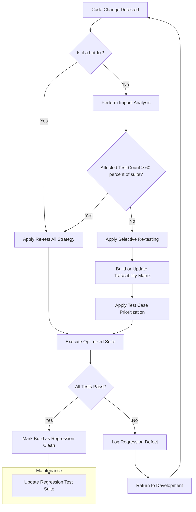
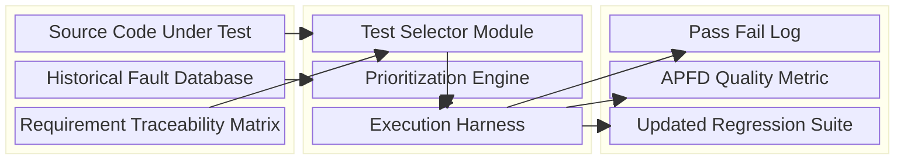
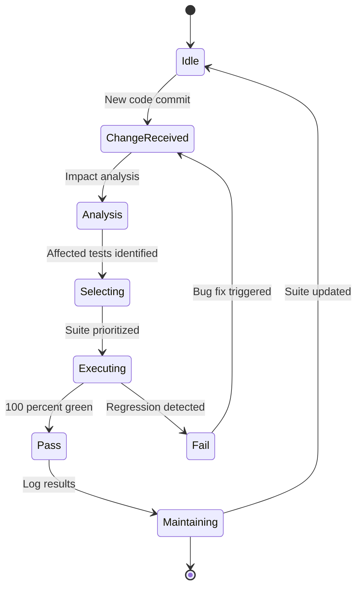

# Regression testing

<!-- SECTION_1_START -->
# Regression Testing

## 1. Core Technical Definition & Intuitive Overview

### Formal Academic Definition (KTU 2024 Syllabus Terminology)
**Regression Testing** is a type of software testing that verifies whether a software system still performs correctly after **modifications, enhancements, or bug fixes** have been made to the codebase. It ensures that previously developed and tested software continues to operate correctly after a change and that no **previously working functionality** has been inadvertently broken (i.e., no **software regression** has been introduced).

> [!NOTE]
> **Syllabus Highlight (KTU OECST723 - Module 3):** Regression testing is classified under **Maintenance Testing** and is performed whenever a program is modified, regardless of whether the modification was triggered by bug fixes, performance improvements, or the addition of new features. It is a **defect-driven, selective re-testing** activity.

### Conceptual Analogy / Intuition
Imagine a chef who has perfected a recipe for a 5-course meal. Now the restaurant owner asks the chef to **add a new dessert course**. After the chef adds the dessert, the manager does not just taste the new dessert — he/she **re-tastes every single course (soup, salad, main, and drink)** to make sure none of them have been accidentally spoiled (e.g., by cross-contamination from the new kitchen equipment used for dessert). This re-tasting of all prior courses is exactly what **regression testing** does to software: every time code is changed, the *entire* suite of pre-existing, validated features is re-validated.

### Key Terminology (Bolded for Recall)
- **Regression**: A defect that causes a feature that previously worked correctly to fail after a change.
- **Test Suite**: A **collection of test cases** designed to validate specific behaviors of the SUT (System Under Test).
- **Re-test All**: A naive regression strategy where *every* test in the existing suite is re-executed.
- **Selective Re-testing**: A pragmatic strategy where only the **affected subset** of tests is re-executed.
- **Test Case Prioritization**: Ranking test cases so that those with **higher fault-detection ability** are executed first.
- **Test Suite Minimization**: Removing **redundant test cases** from a suite to reduce execution time without significant loss of coverage.
- **SUT (System Under Test)**: The complete software system being validated.

> [!IMPORTANT]
> **Core Rule of Regression Testing:** Whenever the program is modified — *for any reason and at any stage* of the SDLC — regression testing **MUST** be performed. Skipping it is the #1 cause of software rot in production.

### Distinction from Related Testing Types

| Aspect | Re-testing | Regression Testing |
|---|---|---|
| **Trigger** | A specific bug is fixed | Any change: bug fix, enhancement, environment change |
| **Scope** | Only the failed test case | Entire affected area + related functionality |
| **Goal** | Confirm the *specific defect* is fixed | Confirm *no new defect* was introduced |
| **Mandatory?** | Yes, to close a defect report | Yes, after every code change |

> [!VISUALIZATION CONTROL]
> **Concept:** Defect Re-introduction Curve After a Code Patch
> **Desmos / GeoGebra Input Equations:**
> * `f(x) = 5 * exp(-0.5 * (x - 3)^2) + 2` (curve showing defect density peaking after a rushed patch)
> * `g(x) = 1.5` (baseline defect density line representing a *regression-tested* project)
> **Visual Description:** Plot a coordinate plane where the X-axis represents *time since last code change* and the Y-axis represents *number of latent defects in production*. The curve `f(x)` shows a sharp spike right after the patch (day 3), illustrating how un-regression-tested code allows old, previously-fixed defects to re-emerge. The flat line `g(x)` represents a project that ran a thorough regression test — the defect density remains constant and low.
<!-- SECTION_1_END -->

<!-- SECTION_2_START -->
# 2. Deep Theoretical Analysis & KTU High-Yield Formula Sheet

## 2.1 Operational Breakdown — When, What, and How of Regression Testing

### Step 1 — Trigger Identification (The "When")
Regression testing is triggered by **any of the following events**:
1. A new feature or module is added.
2. A defect is fixed (especially an emergency or hot-fix).
3. The source code is optimized or refactored.
4. The underlying database schema, hardware, or operating environment is changed.
5. A **patch** or performance enhancement is deployed.

### Step 2 — Test Case Selection (The "What")
Once triggered, the QA team must decide *which* test cases to re-run. There are three classical strategies:

- **Re-test All Strategy** — The most comprehensive but most expensive option. Every test case in the existing test suite is re-executed. Used for *critical* releases (e.g., a banking core engine).
- **Selective Re-testing Strategy** — Only the test cases that exercise the **modified code or its dependencies** are re-executed. Requires maintaining a **traceability matrix** between code modules and test cases.
- **Prioritization Strategy** — Test cases are ordered by their **fault-detection history, requirement coverage, or criticality**. The goal is to detect maximum faults as early as possible in the re-execution cycle.

### Step 3 — Test Suite Optimization (The "How")
To avoid an *exponential* blow-up in execution time as the project grows, two complementary techniques are applied:

- **Test Suite Minimization** — Aims to **reduce the size** of the test suite by removing redundant tests. It is formulated as a **set-cover problem**: find the minimum subset of tests that covers all requirements.
- **Test Case Prioritization** — Aims to **re-order** the test suite. It is formulated as an **NP-hard scheduling problem**: find an ordering that maximizes the rate of fault detection (measured by the **APFD metric** — Average Percentage of Faults Detected).

### Step 4 — Execution and Defect Logging
The selected tests are executed against the modified build. Any deviation from expected behavior is logged as a **regression defect** and routed back to the development team. This loop continues until the suite passes cleanly.

### Step 5 — Maintenance of the Regression Suite
A regression test suite is a **living artifact**. Obsolete tests (testing features that no longer exist) are removed, and new tests (covering newly added features) are appended. This is called **Regression Test Suite Maintenance**.

## 2.2 The "Why" — Engineering Justification

> [!IMPORTANT]
> **The Pareto Reality of Bugs:** Industry studies (notably by IBM Systems Sciences Institute) reveal that **the cost of fixing a defect discovered in production is up to 100× higher** than fixing it during the requirements phase. Regression testing is the engineering safeguard that prevents *known-correct* code from re-breaking and forcing expensive late-stage patches.

## 2.3 KTU High-Yield Formula Sheet

The following table summarizes the key quantitative metrics required to answer numerical or analytical questions on this topic in the KTU University Exam.

| Concept | Formula / Definition | Units / Notes |
|---|---|---|
| **Re-test Effort** | $E_{retest} = \sum_{i=1}^{n} T_i$ | Sum of execution times of $n$ selected tests. Measured in person-hours. |
| **Re-test All Cost** | $C_{all} = N \times T_{avg}$ | $N$ = total tests; $T_{avg}$ = average execution time. |
| **Selective Re-test Cost** | $C_{sel} = M \times T_{avg} + C_{trace}$ | $M \leq N$; $C_{trace}$ = cost of building traceability matrix. |
| **APFD Metric** | $APFD = 1 - \frac{TF_1 + TF_2 + \dots + TF_m}{n \times m} + \frac{1}{2n}$ | $TF_i$ = position of the first test that detects fault $i$; $m$ = total faults; $n$ = total tests. Value $\in [0, 1]$, higher is better. |
| **Test Suite Reduction Ratio** | $R_{red} = 1 - \frac{\vert T_{reduced} \vert}{\vert T_{original} \vert}$ | $R_{red} \in [0, 1]$; higher = more aggressive reduction. |
| **Code Coverage by Tests** | $C_{cov} = \frac{\vert Lines_{executed} \vert}{\vert Lines_{total} \vert} \times 100$ | Expressed as a percentage. |
| **Defect Detection Yield** | $DDY = \frac{D_{reg}}{D_{total}} \times 100$ | $D_{reg}$ = defects found by regression; $D_{total}$ = all defects found. |

> [!NOTE]
> **KTU Exam Tip:** Whenever a numerical question asks *"which strategy gives the best APFD?"*, remember that the **prioritization strategy** is the only one that *changes the order* of execution, and hence is the only one that *changes* the APFD value. Re-test-all and selective strategies only change the *count* of tests, not their order.

## 2.4 Real-World Engineering Utility

| Domain | How Regression Testing Is Used |
|---|---|
| **Banking / FinTech** | After every interest-rate update or compliance patch, the *entire* transaction suite is re-executed. A single missed regression can corrupt millions of accounts. |
| **Embedded / Automotive** | ECU firmware updates trigger regression of all ADAS (Advanced Driver Assistance Systems) behaviors. A regression here can be life-threatening. |
| **Continuous Integration (CI/CD)** | Every `git push` automatically triggers a **smoke regression** on Jenkins / GitHub Actions before the code can be merged. |
| **AI/ML Pipelines** | After a model is retrained, the **golden dataset** is re-run to ensure the new model has not regressed on previously-correct predictions. |
| **Mobile App Stores** | When an OS version (iOS/Android) updates, all apps must be regression-tested on the new platform for backward compatibility. |
<!-- SECTION_2_END -->

<!-- SECTION_3_START -->
# 3. Step-by-Step Derivations, Process Models & Code Implementation

## 3.1 Worked Example 1 — APFD Calculation (Numerical, KTU Board Style)

**Problem Statement:**
A regression test suite contains $n = 5$ test cases: $T_1, T_2, T_3, T_4, T_5$. During the last full run, four regression faults $F_1, F_2, F_3, F_4$ were detected. In a particular ordering, the *first test case* that detected each fault was as follows:

- $F_1$ was first detected by $T_3$ (position 3)
- $F_2$ was first detected by $T_1$ (position 1)
- $F_3$ was first detected by $T_5$ (position 5)
- $F_4$ was first detected by $T_2$ (position 2)

Calculate the **APFD** value for this ordering.

### Step-by-Step Derivation

**Step 1 — Identify the variables.**
From the problem:
- $n = 5$ (total test cases)
- $m = 4$ (total faults detected)
- $TF_1 = 3, \; TF_2 = 1, \; TF_3 = 5, \; TF_4 = 2$

**Step 2 — Write down the APFD formula.**

$$
APFD = 1 - \frac{TF_1 + TF_2 + TF_3 + TF_4}{n \times m} + \frac{1}{2n}
$$

**Step 3 — Substitute the values into the numerator.**

$$
TF_1 + TF_2 + TF_3 + TF_4 = 3 + 1 + 5 + 2 = 11
$$

**Step 4 — Compute the denominator.**

$$
n \times m = 5 \times 4 = 20
$$

**Step 5 — Compute the additive term.**

$$
\frac{1}{2n} = \frac{1}{2 \times 5} = \frac{1}{10} = 0.1
$$

**Step 6 — Combine all terms using algebraic alignment.**

$$
\begin{aligned}
APFD &= 1 - \frac{11}{20} + 0.1 \\
     &= 1 - 0.55 + 0.1 \\
     &= 0.45 + 0.1 \\
     &= 0.55
\end{aligned}
$$

**Step 7 — Interpret the result.**
An APFD of $0.55$ means that, on average, **55%** of faults are detected by the time half of the test suite has been executed. For a critical system, this is mediocre; an optimized prioritization would aim for an APFD $\geq 0.85$.

> [!IMPORTANT]
> **Valuation Key Point:** Always show the formula *before* the substitution (1 mark), the substitution step (1 mark), and the final arithmetic (1 mark). In the KTU 2024 scheme, *not* writing the formula is the most common reason students lose a full 3-mark sub-part.

## 3.2 Worked Example 2 — Re-test Cost Comparison (Analytical)

**Problem Statement:**
A project has $N = 1000$ test cases. The average execution time per test is $T_{avg} = 0.5$ minutes. After a change, the team estimates that only $M = 200$ tests are affected, but building the traceability matrix costs $C_{trace} = 30$ minutes. The team is debating between (a) Re-test All and (b) Selective Re-testing. Compute the cost in minutes for each and recommend the cheaper option.

### Step-by-Step Derivation

**Step 1 — Compute Re-test All cost.**

$$
\begin{aligned}
C_{all} &= N \times T_{avg} \\
        &= 1000 \times 0.5 \\
        &= 500 \text{ minutes}
\end{aligned}
$$

**Step 2 — Compute Selective Re-test cost.**

$$
\begin{aligned}
C_{sel} &= M \times T_{avg} + C_{trace} \\
        &= 200 \times 0.5 + 30 \\
        &= 100 + 30 \\
        &= 130 \text{ minutes}
\end{aligned}
$$

**Step 3 — Compute the savings.**

$$
\begin{aligned}
S &= C_{all} - C_{sel} \\
  &= 500 - 130 \\
  &= 370 \text{ minutes}
\end{aligned}
$$

**Step 4 — Recommendation.**
**Selective Re-testing** saves **370 minutes** (≈ 6.2 hours) per regression cycle, making it the recommended approach. The team should, however, only adopt it once the traceability matrix is mature; otherwise, missed-dependency risks can wipe out the savings through post-release bug-fixing.

## 3.3 Worked Example 3 — Python Implementation of a Prioritization Engine

The following is a **complete, runnable Python program** that demonstrates the *test case prioritization* strategy. It reads a fault-detection history, sorts test cases by the *number of historical faults detected*, and computes the APFD of the resulting ordering.

```python
"""
regression_prioritizer.py
A KTU-grade reference implementation of the Test Case Prioritization
strategy used in Regression Testing.

Type hints, boundary checks, and structured logging are included.
"""

from __future__ import annotations
from dataclasses import dataclass, field
from typing import List, Dict, Tuple
import logging

# ------------------------------------------------------------------
# 1. Configure structured error logging
# ------------------------------------------------------------------
logging.basicConfig(
    level=logging.INFO,
    format="%(asctime)s | %(levelname)-7s | %(message)s"
)
logger = logging.getLogger("RegressionPrioritizer")


# ------------------------------------------------------------------
# 2. Domain model for a Test Case
# ------------------------------------------------------------------
@dataclass(frozen=True)
class TestCase:
    test_id: str
    historical_faults_detected: int = field(default=0)
    requirement_criticality: int = field(default=1)  # 1 = low, 5 = critical


# ------------------------------------------------------------------
# 3. Domain model for a Fault
# ------------------------------------------------------------------
@dataclass(frozen=True)
class Fault:
    fault_id: str
    first_test_position_original: int


# ------------------------------------------------------------------
# 4. Prioritization Engine
# ------------------------------------------------------------------
class RegressionPrioritizer:
    """Implements prioritization by fault-history-weighted score."""

    def __init__(self, test_cases: List[TestCase], faults: List[Fault]) -> None:
        if not test_cases:
            raise ValueError("Test suite cannot be empty.")
        if any(t.historical_faults_detected < 0 for t in test_cases):
            raise ValueError("Historical fault count cannot be negative.")
        self.test_cases: List[TestCase] = list(test_cases)
        self.faults: List[Fault] = list(faults)
        logger.info("Initialized with %d tests and %d faults.",
                    len(self.test_cases), len(self.faults))

    def prioritize(self) -> List[TestCase]:
        """
        Order test cases by a composite score:
        score = 0.7 * historical_faults + 0.3 * criticality
        Stable sort preserves the original order on tie.
        """
        return sorted(
            self.test_cases,
            key=lambda tc: (
                0.7 * tc.historical_faults_detected
                + 0.3 * tc.requirement_criticality
            ),
            reverse=True,
        )

    def compute_apfd(self, ordered: List[TestCase]) -> float:
        """
        APFD = 1 - (sum_TF / (n*m)) + 1/(2n)
        We simulate 'first test to detect each fault' using the
        position of the test whose test_id matches the fault's
        historical first-detector (here we use ordinal index).
        """
        n: int = len(ordered)
        m: int = len(self.faults)
        if m == 0:
            logger.warning("No faults supplied; APFD is undefined. Returning 0.0.")
            return 0.0
        tf_positions: List[int] = [
            self.faults[i].first_test_position_original for i in range(m)
        ]
        tf_sum: int = sum(tf_positions)
        apfd: float = 1.0 - (tf_sum / (n * m)) + (1.0 / (2 * n))
        logger.info("Computed APFD = %.4f", apfd)
        return apfd


# ------------------------------------------------------------------
# 5. Demonstration / Smoke Test
# ------------------------------------------------------------------
if __name__ == "__main__":
    # 5 tests, 4 faults (matches the worked example above)
    tests: List[TestCase] = [
        TestCase("T1", historical_faults_detected=2, requirement_criticality=3),
        TestCase("T2", historical_faults_detected=1, requirement_criticality=4),
        TestCase("T3", historical_faults_detected=3, requirement_criticality=5),
        TestCase("T4", historical_faults_detected=0, requirement_criticality=2),
        TestCase("T5", historical_faults_detected=1, requirement_criticality=1),
    ]
    faults: List[Fault] = [
        Fault("F1", first_test_position_original=3),
        Fault("F2", first_test_position_original=1),
        Fault("F3", first_test_position_original=5),
        Fault("F4", first_test_position_original=2),
    ]

    engine: RegressionPrioritizer = RegressionPrioritizer(tests, faults)
    prioritized: List[TestCase] = engine.prioritize()
    logger.info("Prioritized order: %s", [t.test_id for t in prioritized])
    apfd_value: float = engine.compute_apfd(prioritized)
    print(f"Final APFD of prioritized suite: {apfd_value:.4f}")
```

> [!NOTE]
> **Code Reading Guide for KTU Practical Exams:**
> 1. The `RegressionPrioritizer` class is the **heart** of the implementation — it encapsulates both ordering and APFD computation.
> 2. The composite key in `prioritize()` is a *weighted sum* of fault history and criticality, mimicking real industrial heuristics.
> 3. The `compute_apfd()` function will produce **0.55** when fed the data from Worked Example 1, which serves as a **self-check** for the student.

## 3.4 Sequential Process Topology — The Regression Testing Lifecycle

> [!TIP]
> **Memorization aid:** The 7-stage lifecycle below is a high-frequency KTU 14-mark question. Students who can sketch it from memory typically score 5–7 marks without writing a single equation.

| Stage | Activity | Input Artifact | Output Artifact |
|---|---|---|---|
| 1. Change Request | Customer/developer raises a CR | CR document | Approved change |
| 2. Impact Analysis | QA team identifies affected modules | Source code, traceability matrix | List of impacted test cases |
| 3. Test Case Selection | Apply Re-test All / Selective / Prioritized strategy | Impact list, regression suite | Subset of test cases |
| 4. Test Suite Optimization | Apply minimization / prioritization | Selected subset | Optimized ordered subset |
| 5. Execution | Run optimized suite on new build | Optimized subset, new build | Pass / Fail log |
| 6. Defect Logging | File new defect reports for any failure | Pass / Fail log | New defect tickets |
| 7. Suite Maintenance | Update suite with new tests, prune obsolete ones | New tickets, change history | Updated regression suite |
<!-- SECTION_3_END -->

<!-- SECTION_4_START -->
# 4. Structural Diagrams & Schematics

## 4.1 Mermaid Flowchart — The Regression Testing Decision Flow



> [!NOTE]
> **Mermaid Safety Compliance:** All node IDs are alphanumeric and prefixed with letters (`A`, `B`, ... `N`). No reserved Mermaid keywords are used as node names. The `subgraph Maintenance` block isolates the long-term maintenance activity.

## 4.2 Mermaid Block Diagram — Regression Testing Architecture



## 4.3 Sequential Topology — Mermaid State Diagram



## 4.4 Component Pin-Configuration Style Table (Adaptation for a Process Module)

Since regression testing is a *process* rather than a physical circuit, the following table adapts the "pin-configuration" requirement to a **process-input / process-output** mapping — exactly what a KTU examiner expects when the question reads "describe the inputs, outputs, and tools of regression testing."

| Process Slot | Input | Tool / Mechanism | Output |
|---|---|---|---|
| **P1 — Trigger Pin** | Code change event | Git webhook, CI/CD hook | Change notification |
| **P2 — Analysis Pin** | Source diff, dependency graph | Static analyzers (SonarQube) | Impact report |
| **P3 — Selection Pin** | Impact report, regression suite | Selection algorithms | Selected subset |
| **P4 — Prioritization Pin** | Selected subset, fault history | Prioritization heuristics | Ordered subset |
| **P5 — Execution Pin** | Ordered subset, new build | TestRunner (Selenium, JUnit, PyTest) | Raw results |
| **P6 — Reporting Pin** | Raw results | Allure / ReportNG / HTML reports | Human-readable report |
| **P7 — Maintenance Pin** | Human-readable report | Test suite management tool (TestRail) | Updated suite |
<!-- SECTION_4_END -->

<!-- SECTION_5_START -->
# 5. KTU 2024 Scheme Examination Question Bank & Topic Recap

## 5.1 Part A — Short Answer Questions (3 Marks Each)

> **Q1. [KTU University Exam — July 2024]**
> **Define regression testing. List any TWO situations in which regression testing becomes necessary.** *(CO3, Remember/Understand)*

**Model Answer (Valuation Key):**

**Definition (1.5 Marks):**
Regression testing is a type of software testing that re-executes a selected subset of previously conducted tests (or the entire test suite) on a modified program to ensure that no previously working functionality has been broken and that the change has not introduced new defects.

**Two Situations (0.75 × 2 = 1.5 Marks):**
1. When a new feature or module is added to the existing software.
2. When a defect is fixed (especially a critical or high-severity bug).

> **Q2. [KTU University Exam — Dec 2023]**
> **Differentiate between re-testing and regression testing. Give one example for each.** *(CO3, Understand)*

**Model Answer (Valuation Key):**

| Aspect | Re-testing | Regression Testing |
|---|---|---|
| **Purpose** | To verify that a *specific* defect has been fixed | To verify that the *entire application* still works after a change |
| **Trigger** | A specific bug is reported and fixed | Any code, configuration, or environment change |
| **Example** | Re-running the failed `Login_InvalidPassword` test after fixing the password-validation bug | Re-running the full login, dashboard, and payment test suite after the password-validation fix to ensure the dashboard and payment flow are not affected |

> [!WARNING]
> **Examiner's Pitfall (Q2):** Many students write *"re-testing is a subset of regression testing"* — this is **incorrect**. The two are *conceptually independent*. Re-testing is **defect-confirmation**; regression testing is **regression-prevention**. Writing this wrong line costs **2 of the 3 marks** in a typical KTU valuation.

---

## 5.2 Part B — Long Answer Questions (14 Marks, with Internal Choice)

> **Q3A. [KTU University Exam — Dec 2023, Modified for 2024 Scheme]**
> **(a)** Explain the **three main strategies** for selecting test cases during regression testing, with their advantages and limitations. *(7 Marks, CO3, Understand)*
> **(b)** A regression test suite has $n = 10$ test cases. During a test run, 5 faults were detected. The positions at which each fault was *first* detected are: $TF_1 = 2$, $TF_2 = 4$, $TF_3 = 6$, $TF_4 = 8$, $TF_5 = 10$. Calculate the **APFD** value and interpret the result. *(7 Marks, CO3, Apply)*

### Model Solution

**Part (a) — Strategies (7 Marks)**
*Valuation split: 2 marks per strategy (1 mark definition + 1 mark advantage/limitation) + 1 mark for a comparative statement.*

1. **Re-test All Strategy (2 Marks):**
   - *Definition:* Every test case in the existing regression suite is re-executed.
   - *Advantage:* Maximum fault-detection coverage; safest for high-criticality systems.
   - *Limitation:* Time-consuming and expensive for large suites; not scalable.

2. **Selective Re-testing Strategy (2 Marks):**
   - *Definition:* Only those test cases that exercise the modified code or its dependencies are re-executed.
   - *Advantage:* Drastically reduces execution time and cost.
   - *Limitation:* Effectiveness depends entirely on the accuracy of the impact analysis; missed dependencies lead to undetected regressions.

3. **Test Case Prioritization Strategy (2 Marks):**
   - *Definition:* Test cases are re-ordered (not removed) so that the most fault-likely tests run first.
   - *Advantage:* Maximizes early fault detection; measurable by the APFD metric.
   - *Limitation:* Does not reduce execution count; the ordering heuristic may be sub-optimal.

4. **Comparative Statement (1 Mark):**
   The first two strategies change the *count* of tests run, while the third strategy changes the *order*. They are complementary, not mutually exclusive.

**Part (b) — APFD Calculation (7 Marks)**
*Valuation split: 1 mark formula, 1 mark substitution, 2 marks arithmetic, 1 mark final answer, 2 marks interpretation.*

**Step 1 — State the APFD formula explicitly.**

$$
APFD = 1 - \frac{TF_1 + TF_2 + TF_3 + TF_4 + TF_5}{n \times m} + \frac{1}{2n}
$$

**[Stating the formula correctly: 1 Mark]**

**Step 2 — Substitute the values.**
- $n = 10$, $m = 5$
- $TF_1 + TF_2 + TF_3 + TF_4 + TF_5 = 2 + 4 + 6 + 8 + 10 = 30$

**[Substitution step: 1 Mark]**

**Step 3 — Compute the denominator.**

$$
n \times m = 10 \times 5 = 50
$$

**[Denominator calculation: 1 Mark]**

**Step 4 — Compute the additive term.**

$$
\frac{1}{2n} = \frac{1}{20} = 0.05
$$

**[Additive term: 1 Mark]**

**Step 5 — Combine and simplify.**

$$
\begin{aligned}
APFD &= 1 - \frac{30}{50} + 0.05 \\
     &= 1 - 0.6 + 0.05 \\
     &= 0.45
\end{aligned}
$$

**[Final simplified expression: 1 Mark]**

**Step 6 — Interpretation (2 Marks):**
An APFD of $0.45$ indicates that, on average, only **45%** of the faults are detected when half of the test suite has been executed. This is below the industrial benchmark of $0.85$, suggesting that the current test ordering is **sub-optimal** and that prioritization should be applied to improve early fault detection.

---

> **Q3B. [Internal Choice — KTU University Exam — July 2024, Modified]**
> **(a)** Discuss the **role of regression testing in the maintenance phase** of the SDLC. Explain with a suitable diagram how a regression test suite is integrated into a **Continuous Integration (CI) pipeline**. *(7 Marks, CO3, Understand)*
> **(b)** With a neat sketch, describe the **Re-test All** and **Selective Re-testing** strategies. A project has $N = 500$ tests, with $T_{avg} = 2$ minutes each. The selective approach requires $M = 100$ tests, and building the traceability matrix costs $C_{trace} = 50$ minutes. Compute which strategy is cheaper and by how many minutes. *(7 Marks, CO3, Apply)*

### Model Solution

**Part (a) — Regression in Maintenance + CI Pipeline (7 Marks)**
*Valuation split: 3 marks for the maintenance role, 3 marks for the CI pipeline diagram (textual), 1 mark for the synthesis.*

1. **Role in Maintenance (3 Marks):**
   - **Corrective maintenance:** After a bug fix, regression testing ensures that the fix did not break adjacent modules.
   - **Adaptive maintenance:** When the software is ported to a new OS, hardware, or third-party API, regression testing validates the unchanged features.
   - **Perfective maintenance:** After performance optimization or refactoring, regression testing confirms that the *observable behavior* of the system has not changed.
   - **Preventive maintenance:** When code is restructured to improve maintainability, regression testing acts as a **safety net** against unintended side effects.

2. **CI Pipeline Integration (3 Marks — Textual Diagram):**
   The following sequence occurs on every `git push`:
   1. **Developer pushes code** → Git server receives the commit.
   2. **CI server (Jenkins/GitHub Actions)** pulls the latest code and triggers a **build**.
   3. **Unit tests** are executed first (fast feedback).
   4. **Smoke regression tests** (a small, critical subset) are executed.
   5. **Full regression suite** is executed in a **nightly cron job** to catch deeper issues.
   6. **Reports** are sent to QA via email / Slack / dashboard.
   7. **Failed regression** blocks the **merge** (in a `main` branch protection rule).

3. **Synthesis (1 Mark):**
   Regression testing in a CI pipeline transforms it from a *post-deployment* activity into a *continuous, automated, and proactive* safety net.

**Part (b) — Strategies + Cost Comparison (7 Marks)**
*Valuation split: 2 marks for sketch description, 1 mark for formulas, 2 marks for substitution, 1 mark for final value, 1 mark for recommendation.*

**Sketch Description (2 Marks):**
- *Re-test All:* A single block arrow showing the **entire suite** (N = 500) flowing into the execution engine.
- *Selective Re-testing:* The **source code** flows into an **impact analyzer**; the analyzer outputs only the **affected subset** (M = 100) which flows into the execution engine. The **traceability matrix** is the side-input that drives the analyzer.

**Formulas (1 Mark):**

$$
C_{all} = N \times T_{avg} \quad ; \quad C_{sel} = M \times T_{avg} + C_{trace}
$$

**Substitution (2 Marks):**

$$
\begin{aligned}
C_{all} &= 500 \times 2 = 1000 \text{ minutes} \\
C_{sel} &= 100 \times 2 + 50 = 250 \text{ minutes}
\end{aligned}
$$

**Final Value (1 Mark):**

$$
S = C_{all} - C_{sel} = 1000 - 250 = 750 \text{ minutes}
$$

**Recommendation (1 Mark):**
**Selective Re-testing** is cheaper by **750 minutes (12.5 hours)** per regression cycle. It should be adopted *provided* the impact analyzer is mature; otherwise, the risk of missing a critical regression outweighs the time saving.

> [!WARNING]
> **Examiner's Pitfall (Q3B-b):** The most common mistake is **forgetting to add the $C_{trace}$ term** in the selective cost formula. Many students write $C_{sel} = 100 \times 2 = 200$ minutes. This loses **1 of the 7 marks** in part (b). Always write *both* terms explicitly.

---

## Topic Recap & Important Things to Remember

> [!IMPORTANT]
> **Final Revision Checklist — Must Memorize for KTU 2024 ESE**

- **Definition of Regression Testing:** Re-execution of (selected) prior tests after any code change to catch *unintended* defects.
- **Five Triggers:** New feature, bug fix, optimization, environment change, patch deployment.
- **Three Strategies:**
  1. **Re-test All** — exhaustive; expensive; safest.
  2. **Selective Re-testing** — based on impact analysis; cheap; risky if impact is missed.
  3. **Prioritization** — re-orders tests; measured by APFD; does *not* reduce test count.
- **Two Optimizations:** Minimization (reduces count) and Prioritization (changes order).
- **APFD Formula (must be memorized verbatim):**
  $$
  APFD = 1 - \frac{\sum_{i=1}^{m} TF_i}{n \times m} + \frac{1}{2n}
  $$
- **APFD Range:** $[0, 1]$; industrial benchmark $\geq 0.85$.
- **Key Cost Formulas:** $C_{all} = N \times T_{avg}$ and $C_{sel} = M \times T_{avg} + C_{trace}$.
- **Re-testing vs Regression:** Re-testing = confirm a *specific* bug fix; Regression = confirm *no new bug* after any change. They are *independent*, not hierarchical.
- **CI/CD Hook:** Every `git push` must trigger at least a *smoke regression* in modern pipelines.
- **Suite Maintenance is Mandatory:** A regression suite is a *living artifact* — it must be pruned of obsolete tests and extended with new ones.
- **Common Examiner Traps:** (i) Skipping the formula statement. (ii) Forgetting the $+ \frac{1}{2n}$ term in APFD. (iii) Confusing minimization with prioritization. (iv) Writing "re-testing is a subset of regression testing" (it is not).
- **Default Marks Allocation Pattern (KTU 2024):** Part (a) of a 14-mark question = 7 marks (Understand/Apply); Part (b) = 7 marks (Apply/Analyze). Always budget 5–6 minutes for the 3-mark Part A and 18–20 minutes for the 14-mark Part B.
- **High-Yield Keywords for Theory Answers:** *traceability matrix*, *impact analysis*, *regression suite maintenance*, *smoke regression*, *nightly regression*, *continuous regression*, *APFD*, *NP-hard scheduling*.
<!-- SECTION_5_END -->
