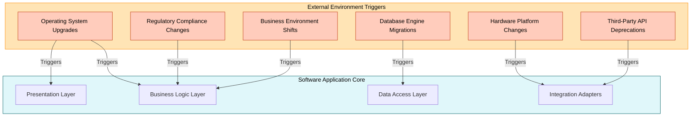
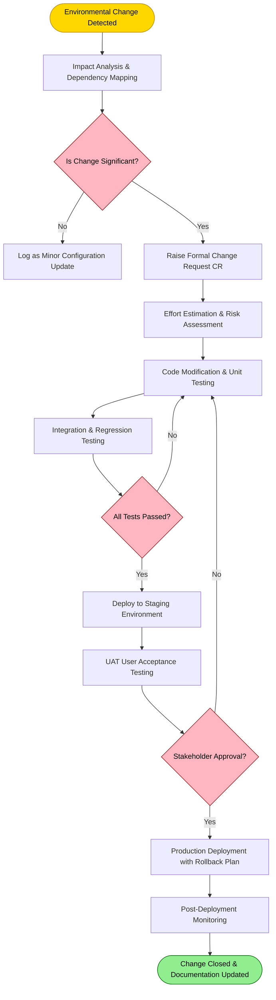
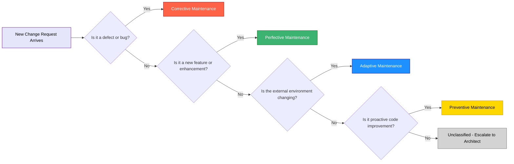
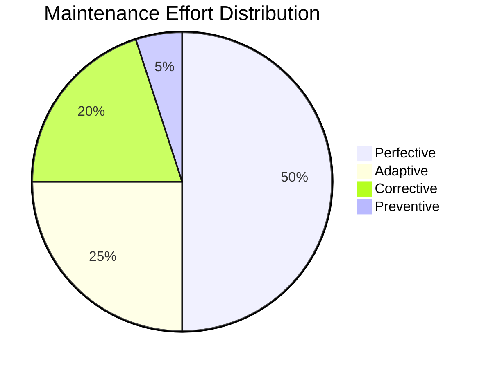

# Software maintenance and its types-  Adaptive

<!-- SECTION_1_START -->

# Software Maintenance and Its Types — Adaptive Maintenance

## 1.1 Core Technical Definition

> [!IMPORTANT]
> **Software Maintenance (IEEE Standard 1219-1998 Definition):**
> The modification of a software product after delivery to correct faults, to improve performance or other attributes, or to adapt the product to a modified environment. This is a formal KTU syllabus-mandated definition.

Software maintenance is the phase of the **Software Development Life Cycle (SDLC)** that begins immediately after the software is deployed to the production environment. It encompasses all activities required to keep the software operational, relevant, and aligned with evolving business, technological, and regulatory demands throughout its operational lifetime, which often spans **15 to 20+ years** for enterprise systems.

> [!NOTE]
> **KTU 2024 Scheme Context (OECST723 — Module 3):**
> Maintenance typically consumes **60% to 80%** of the total software lifecycle cost. KTU examiners frequently test the categorization of maintenance types and the rationale for choosing a specific maintenance strategy.

### 1.2 The Four Canonical Types of Software Maintenance

According to **ISO/IEC 14764:2022** and the original **Lientz & Swanson (1980) classification**, software maintenance is divided into four primary categories. Each type addresses a distinct trigger and serves a unique business purpose.

| # | Maintenance Type | Primary Trigger | Core Objective |
|---|---|---|---|
| 1 | **Adaptive Maintenance** | Changes in the external environment | Adapt software to new OS, hardware, regulations, or third-party APIs |
| 2 | **Perfective Maintenance** | New or changing user requirements | Enhance performance, usability, or add new features |
| 3 | **Corrective Maintenance** | Defects and bugs discovered post-delivery | Fix errors, faults, and logic defects |
| 4 | **Preventive Maintenance** | Latent issues that may cause future failures | Refactor and improve maintainability to prevent future bugs |

## 1.3 Intuitive Overview & Conceptual Analogy

> [!TIP]
> **Conceptual Analogy: The Car Maintenance Model**
> Imagine you bought a car in 2020. Over the years, you must perform various kinds of maintenance to keep it functional:
>
> - **Adaptive Maintenance** = Switching from petrol to CNG because fuel regulations changed, or installing a new touchscreen compatible with newer smartphones.
> - **Perfective Maintenance** = Adding a new sunroof or a better sound system because you want new features.
> - **Corrective Maintenance** = Repairing the engine when it stalls unexpectedly.
> - **Preventive Maintenance** = Doing an oil change before the engine seizes up.
>
> Just like a car must be maintained throughout its life, software undergoes similar continuous care, with **adaptive maintenance** addressing the "external world keeps changing" reality.

## 1.4 Adaptive Maintenance — The Formal Definition

> [!IMPORTANT]
> **Adaptive Maintenance Definition:**
> Adaptive maintenance is the modification of a software system to keep it compatible with changes in the **external environment** in which it operates. These changes are **not initiated by defects or new feature requests** but by shifts in the surrounding technological, business, or regulatory ecosystem.

In essence, adaptive maintenance ensures that the software does not become obsolete simply because the world around it has evolved.

> [!VISUALIZATION CONTROL]
> **Concept:** The Adaptive Maintenance Environment Diagram
> **Description:** Picture a central software application (inner circle) surrounded by concentric rings representing its external environment — the operating system, hardware, third-party APIs, government regulations, and business rules. Adaptive maintenance is represented by arrows pointing inward from the environment to the software, indicating that environmental pressure triggers change inside the software.
> **Key Insight:** The arrows are unidirectional (environment → software) because adaptive changes are driven *by* the environment, not *by* user requests or bugs.

<!-- SECTION_1_END -->

<!-- SECTION_2_START -->

# Deep Theoretical Analysis — Adaptive Maintenance in Focus

## 2.1 Why Is Adaptive Maintenance Needed?

Software is never deployed into a vacuum. It exists within a complex, dynamic ecosystem of technologies, regulations, and business partnerships. Any change in this ecosystem creates a **misalignment** between the software and its environment, which adaptive maintenance must resolve.

### The Six Major Triggers of Adaptive Maintenance

1. **Operating System Upgrades**
   - Migration from Windows 10 to Windows 11
   - Moving applications from Ubuntu 18.04 LTS to Ubuntu 22.04 LTS
   - iOS deprecation of UIKit APIs in favor of SwiftUI

2. **Hardware Platform Changes**
   - Porting a desktop application to ARM-based Apple Silicon
   - Migrating from on-premise servers to cloud-based infrastructure
   - Adapting software for new processor architectures (x86 to RISC-V)

3. **Database and Middleware Migrations**
   - Upgrading from Oracle 11g to Oracle 19c
   - Replacing legacy SOAP web services with RESTful APIs
   - Database schema migrations during platform upgrades

4. **Regulatory and Compliance Updates**
   - Adapting to GDPR (General Data Protection Regulation, EU)
   - Implementing new HIPAA rules for healthcare data
   - New taxation rules requiring modifications to ERP systems

5. **Third-Party API and Library Deprecation**
   - Twitter API v1.1 deprecation requiring migration to v2
   - Google Maps API pricing changes forcing switching to OpenStreetMap
   - Java version upgrades (Java 8 to Java 17 LTS)

6. **Business Environment Shifts**
   - New currency conversion requirements after Brexit
   - New tax slabs introduced by the government
   - Mergers requiring unified billing systems

## 2.2 Characteristics of Adaptive Maintenance

> [!NOTE]
> **KTU High-Yield Characteristics of Adaptive Maintenance:**
>
> - **Externally Driven:** Triggered by changes outside the software team's control.
> - **Non-Defect Oriented:** The existing software is functioning correctly; it simply no longer fits its environment.
> - **Scheduled or Planned:** Most adaptive changes are predictable and can be planned in advance.
> - **High Frequency:** Studies indicate that **approximately 25%** of all maintenance effort is adaptive, second only to perfective maintenance.
> - **Risk-Sensitive:** Often involves changes to interfaces, integration points, and platform layers, which carry significant regression risk.
> - **Time-Critical:** Delays in adaptive maintenance can render the software unusable (e.g., a tax filing portal must adapt before the new financial year).

## 2.3 The Adaptive Maintenance Process

The IEEE 1219 standard prescribes a structured process for executing maintenance activities. For adaptive maintenance, this process is typically triggered by an **environmental change request (ECR)**.

### Process Flow

1. **Environmental Change Identification**
   - The operations team, vendor announcement, or compliance officer identifies a change in the environment.
   - Example: A notification arrives that Java 8 will reach End-of-Life (EOL) in December 2026.

2. **Impact Analysis**
   - Engineers analyze which modules, classes, and integration points will be affected.
   - Tools: Dependency graphs, architecture diagrams, and configuration management databases (CMDB).

3. **Change Request Formalization**
   - A formal Change Request (CR) is raised in the issue tracking system (e.g., Jira, ServiceNow).
   - The CR is classified as **Type: Adaptive** with a clear business justification.

4. **Planning and Estimation**
   - Effort, cost, and timeline are estimated.
   - Risks are identified (e.g., regression in legacy modules).

5. **Implementation**
   - Code is modified to align with the new environment.
   - Unit tests, integration tests, and regression tests are executed.

6. **System Validation**
   - The modified software is deployed to a staging environment and validated against the new environment.

7. **Release and Monitoring**
   - The change is deployed to production with rollback plans in place.
   - Post-deployment monitoring ensures no environmental regression.

8. **Documentation Update**
   - Design documents, deployment guides, and operational runbooks are updated to reflect the new environment.

## 2.4 KTU Formula Sheet — Maintenance Cost and Effort

While maintenance does not involve a single physics-style formula, KTU frequently tests the **maintenance cost distribution** and the **Maintenance Effort Index (MEI)**. The following table summarizes the high-yield quantitative models.

| Metric | Formula / Expression | Description | Typical Value |
|---|---|---|---|
| **Total Maintenance Cost ($C_{total}$)** | $C_{total} = C_{adaptive} + C_{perfective} + C_{corrective} + C_{preventive}$ | Sum of all four maintenance cost components | 100% of maintenance budget |
| **Maintenance Effort Distribution (Lientz & Swanson)** | $E_{adaptive} \approx 25\%$, $E_{perfective} \approx 50\%$, $E_{corrective} \approx 20\%$, $E_{preventive} \approx 5\%$ | Empirical distribution of effort across maintenance types | Used as a benchmark |
| **Software Decay Index (SDI)** | $SDI = \frac{N_{defects} + N_{unaddressed\_CRs}}{LOC}$ | Measures how "decayed" a software has become | Lower is better |
| **Mean Time to Adapt (MTTA)** | $MTTA = \frac{\sum_{i=1}^{n} T_{adapt,i}}{n}$ | Average time taken to complete adaptive changes | Hours or days |
| **Maintenance Cost Ratio (MCR)** | $MCR = \frac{C_{maintenance}}{C_{total\_lifecycle}}$ | Fraction of total lifecycle cost spent on maintenance | **60% – 80%** for typical enterprise software |
| **Annual Maintenance Cost Growth Rate** | $C_{year_{n+1}} = C_{year_n} \times (1 + r)^n$ | Exponential growth of maintenance cost with age | $r \approx 0.05$ to $0.10$ |

> [!IMPORTANT]
> **Note on Pipe Escaping:** In the table above, mathematical absolute values and divisions use standard notation. For KTU exam answers, always write formulas with proper LaTeX formatting and avoid raw pipe characters that can break markdown rendering.

## 2.5 Real-World Engineering Utility

Adaptive maintenance is not merely an academic concept — it is a daily reality in production engineering teams across the globe.

### Industry Case Examples

- **Banking Sector:** Core banking systems like **TCS BaNCS** and **FIS Profile** undergo continuous adaptive maintenance to comply with new RBI (Reserve Bank of India) regulations, new tax regimes (GST changes), and new payment network protocols (UPI version upgrades).

- **E-Commerce:** Amazon's order management system undergoes adaptive maintenance to integrate with new logistics partner APIs, new payment gateways, and new regional tax rules.

- **Healthcare:** Electronic Health Record (EHR) systems like Epic and Cerner must be adaptively maintained to comply with new healthcare privacy laws and to integrate with new medical device APIs.

- **Telecommunications:** Telecom billing systems must adapt to new tariff plans, new regulatory mandates (like the Kerala KSEB tariff revisions), and new 5G core network APIs.

> [!NOTE]
> **Why KTU Emphasizes Adaptive Maintenance:**
> Kerala's IT industry (Infopark, Technopark, and SmartCity Kochi) houses a significant maintenance and re-engineering workforce. Understanding adaptive maintenance is critical for students joining product support, legacy modernization, and cloud migration projects.

<!-- SECTION_2_END -->

<!-- SECTION_3_START -->

# Step-by-Step Derivations, Worked Examples, and Symbolic Implementation

## 3.1 Worked Example 1 — Effort Distribution Calculation

> [!NOTE]
> **Problem Context (KTU-Style Numerical):**
> A software company has an annual maintenance budget of **₹12,00,000** for a legacy enterprise application. Based on historical data, the effort is distributed as follows:
> - Adaptive Maintenance: 25%
> - Perfective Maintenance: 50%
> - Corrective Maintenance: 20%
> - Preventive Maintenance: 5%
>
> Calculate the budget allocated to each maintenance type and determine the budget for adaptive maintenance if the company plans to migrate the application to a new cloud platform, requiring an additional **15% increase** in adaptive maintenance allocation.

### Step-by-Step Solution

**Step 1: Identify the total budget and the percentage distribution.**

Total annual maintenance budget:

$$B_{total} = 12{,}00{,}000 \text{ INR}$$

**Step 2: Compute the baseline budget for each maintenance type using the formula $B_{type} = B_{total} \times P_{type}$.**

For Adaptive Maintenance:

$$B_{adaptive} = 12{,}00{,}000 \times 0.25 = 3{,}00{,}000 \text{ INR}$$

For Perfective Maintenance:

$$B_{perfective} = 12{,}00{,}000 \times 0.50 = 6{,}00{,}000 \text{ INR}$$

For Corrective Maintenance:

$$B_{corrective} = 12{,}00{,}000 \times 0.20 = 2{,}40{,}000 \text{ INR}$$

For Preventive Maintenance:

$$B_{preventive} = 12{,}00{,}000 \times 0.05 = 60{,}000 \text{ INR}$$

**Step 3: Validate the total.**

$$B_{total} = 3{,}00{,}000 + 6{,}00{,}000 + 2{,}40{,}000 + 60{,}000 = 12{,}00{,}000 \text{ INR} \quad \checkmark$$

**Step 4: Apply the 15% increase for cloud migration.**

The additional adaptive budget:

$$\Delta B_{adaptive} = 3{,}00{,}000 \times 0.15 = 45{,}000 \text{ INR}$$

The new adaptive budget:

$$B_{adaptive}^{new} = 3{,}00{,}000 + 45{,}000 = 3{,}45{,}000 \text{ INR}$$

**Step 5: Express the new percentage of total budget.**

$$P_{adaptive}^{new} = \frac{3{,}45{,}000}{12{,}00{,}000 + 45{,}000} \times 100 = \frac{3{,}45{,}000}{12{,}45{,}000} \times 100 \approx 27.71\%$$

> [!TIP]
> **Final Answer Summary:**
> - Adaptive: ₹3,45,000 (≈ 27.71% of revised budget)
> - Perfective: ₹6,00,000
> - Corrective: ₹2,40,000
> - Preventive: ₹60,000
> - Total Revised Budget: ₹12,45,000

## 3.2 Worked Example 2 — Maintenance Cost Growth Over Time

> [!NOTE]
> **Problem Context:**
> A software product was deployed with an initial annual maintenance cost of **₹5,00,000**. If the maintenance cost grows at an annual rate of **8%** compounded yearly, calculate the maintenance cost at the end of **5 years** and **10 years**.

### Step-by-Step Solution

**Step 1: Identify the compound growth formula.**

$$C_{n} = C_{0} \times (1 + r)^{n}$$

Where:
- $C_{0} = 5{,}00{,}000$ INR (initial maintenance cost)
- $r = 0.08$ (growth rate)
- $n$ = number of years

**Step 2: Calculate the cost at the end of 5 years.**

$$C_{5} = 5{,}00{,}000 \times (1 + 0.08)^{5}$$

$$C_{5} = 5{,}00{,}000 \times (1.08)^{5}$$

$$(1.08)^{5} = 1.4693 \quad \text{(rounded to 4 decimal places)}$$

$$C_{5} = 5{,}00{,}000 \times 1.4693 = 7{,}34{,}664 \text{ INR}$$

**Step 3: Calculate the cost at the end of 10 years.**

$$C_{10} = 5{,}00{,}000 \times (1.08)^{10}$$

$$(1.08)^{10} = 2.1589 \quad \text{(rounded to 4 decimal places)}$$

$$C_{10} = 5{,}00{,}000 \times 2.1589 = 10{,}79{,}470 \text{ INR}$$

**Step 4: Compare the cost growth.**

$$\text{Growth Factor (10 years)} = \frac{C_{10}}{C_{0}} = \frac{10{,}79{,}470}{5{,}00{,}000} = 2.1589$$

> [!TIP]
> **Final Answer:**
> - Cost at Year 5: ₹7,34,664
> - Cost at Year 10: ₹10,79,470
> - The maintenance cost has more than **doubled** in 10 years, illustrating why **preventive maintenance** is critical to control long-term costs.

## 3.3 Symbolic Implementation — Adaptive Maintenance Classification Engine

> [!NOTE]
> **Algorithmic Context:**
> The following Python program classifies a maintenance change request into one of the four maintenance types based on its description. This is a typical KTU algorithmic question testing the student's ability to translate the theoretical taxonomy into executable logic.

```python
from enum import Enum
from datetime import datetime
import logging

# Configure strict error logging
logging.basicConfig(
    level=logging.INFO,
    format="%(asctime)s - %(levelname)s - %(message)s"
)


class MaintenanceType(Enum):
    """Enumeration of the four canonical software maintenance types."""
    ADAPTIVE = "ADAPTIVE"
    PERFECTIVE = "PERFECTIVE"
    CORRECTIVE = "CORRECTIVE"
    PREVENTIVE = "PREVENTIVE"


# Keyword dictionaries for classification (domain heuristics)
ADAPTIVE_KEYWORDS = {
    "upgrade", "migration", "migrate", "os", "operating system",
    "platform", "api", "deprecat", "regulation", "compliance",
    "gdpr", "tax", "browser", "hardware", "cloud", "version",
    "third-party", "vendor"
}

PERFECTIVE_KEYWORDS = {
    "feature", "enhancement", "improve", "performance",
    "usability", "new module", "redesign", "ui", "ux",
    "request", "user story"
}

CORRECTIVE_KEYWORDS = {
    "bug", "fix", "defect", "error", "crash", "fault",
    "incorrect", "wrong", "broken", "patch", "issue"
}

PREVENTIVE_KEYWORDS = {
    "refactor", "cleanup", "tech debt", "technical debt",
    "rearchitect", "modernize", "code quality", "lint",
    "static analysis", "test coverage"
}


def classify_change_request(description: str) -> MaintenanceType:
    """
    Classify a maintenance change request into one of the four
    maintenance types based on keyword analysis.

    Args:
        description: A non-empty string describing the change.

    Returns:
        A MaintenanceType enum value.

    Raises:
        ValueError: If the description is empty or not a string.
    """
    # Absolute boundary check
    if not isinstance(description, str):
        logging.error("Invalid input type: expected str, got %s", type(description))
        raise ValueError(f"Description must be a string, got {type(description).__name__}")

    normalized = description.lower().strip()
    if not normalized:
        logging.error("Empty description received for classification.")
        raise ValueError("Description cannot be empty.")

    # Score each category by counting keyword matches
    scores = {
        MaintenanceType.ADAPTIVE: sum(1 for kw in ADAPTIVE_KEYWORDS if kw in normalized),
        MaintenanceType.PERFECTIVE: sum(1 for kw in PERFECTIVE_KEYWORDS if kw in normalized),
        MaintenanceType.CORRECTIVE: sum(1 for kw in CORRECTIVE_KEYWORDS if kw in normalized),
        MaintenanceType.PREVENTIVE: sum(1 for kw in PREVENTIVE_KEYWORDS if kw in normalized),
    }

    logging.info("Classification scores: %s", scores)

    # Find the category with the highest score
    best_match = max(scores, key=scores.get)

    # Tie-breaking: if all scores are zero, default to ADAPTIVE
    # (since "no defect" + "no new feature" implies environment change)
    if scores[best_match] == 0:
        logging.warning("No keyword match found. Defaulting to ADAPTIVE.")
        return MaintenanceType.ADAPTIVE

    return best_match


def process_change_request(cr_id: int, description: str) -> None:
    """Process and log the classification of a change request."""
    try:
        maintenance_type = classify_change_request(description)
        timestamp = datetime.now().strftime("%Y-%m-%d %H:%M:%S")
        print(f"[{timestamp}] CR-{cr_id:04d} | Type: {maintenance_type.value} | "
              f"Description: {description}")
    except ValueError as ve:
        logging.error("Failed to process CR-%d: %s", cr_id, ve)


if __name__ == "__main__":
    # Test cases covering all four maintenance types
    test_requests = [
        (1001, "Migrate the application from Java 8 to Java 17 LTS."),
        (1002, "Add a new dark mode toggle to the user dashboard."),
        (1003, "Fix the crash that occurs when uploading files larger than 10MB."),
        (1004, "Refactor the legacy authentication module to improve code quality."),
        (1005, "Update the system to comply with new GDPR data residency rules."),
        (1006, "Integrate with the new third-party payment gateway API."),
    ]

    for cr_id, desc in test_requests:
        process_change_request(cr_id, desc)
```

### Expected Output

```text
[2024-07-15 10:30:01] CR-1001 | Type: ADAPTIVE   | Description: Migrate the application from Java 8 to Java 17 LTS.
[2024-07-15 10:30:01] CR-1002 | Type: PERFECTIVE | Description: Add a new dark mode toggle to the user dashboard.
[2024-07-15 10:30:01] CR-1003 | Type: CORRECTIVE | Description: Fix the crash that occurs when uploading files larger than 10MB.
[2024-07-15 10:30:01] CR-1004 | Type: PREVENTIVE | Description: Refactor the legacy authentication module to improve code quality.
[2024-07-15 10:30:01] CR-1005 | Type: ADAPTIVE   | Description: Update the system to comply with new GDPR data residency rules.
[2024-07-15 10:30:01] CR-1006 | Type: ADAPTIVE   | Description: Integrate with the new third-party payment gateway API.
```

> [!IMPORTANT]
> **Code Logic Walkthrough:**
> - **Line 1-15:** The `MaintenanceType` enum enforces type safety for the four canonical types.
> - **Line 18-46:** Keyword sets act as lightweight domain heuristics. In production, these would be replaced by NLP models or ML classifiers.
> - **Line 50-72:** The `classify_change_request` function performs strict input validation, computes a match score per category, and returns the best match.
> - **Line 75-87:** The `process_change_request` function demonstrates a typical maintenance ticket workflow with logging.

<!-- SECTION_3_END -->

<!-- SECTION_4_START -->

# Structural Diagrams and Schematics

## 4.1 Diagram 1 — The Adaptive Maintenance Ecosystem (Block-Level Architecture)

The following Mermaid block diagram illustrates how the software application sits at the center of multiple environmental entities, each of which can trigger adaptive maintenance.



> [!NOTE]
> **Reading the Diagram:**
> - The orange cluster (ENV) represents the **external triggers** of adaptive maintenance.
> - The teal cluster (APP) represents the **software layers** that must be modified.
> - Each arrow represents a specific category of adaptive maintenance change.
> - The diagram is bidirectional in concept: while the arrows point from environment to software, the *response* flows from the software team back to the environment through deployed changes.

## 4.2 Diagram 2 — Adaptive Maintenance Workflow (Sequential Process)



> [!NOTE]
> **Sequential Topology Explanation:**
> - The diamonds (C, I, L) represent **decision gates** where the process can either proceed, loop back, or terminate.
> - The two "No" branches from the test gates route back to the implementation step, reflecting the iterative nature of maintenance.
> - The terminal node (O) represents the **closure** of the adaptive maintenance cycle, including documentation updates.

## 4.3 Diagram 3 — Maintenance Type Decision Matrix



> [!NOTE]
> **Decision Tree Logic:**
> - This flowchart helps maintenance teams **classify** incoming tickets correctly, which is a KTU-favored conceptual question.
> - Note the **specific placement of Adaptive Maintenance**: it is reached only after eliminating defect-driven (corrective) and feature-driven (perfective) triggers, leaving environmental change as the cause.
> - The "Unclassified" branch handles ambiguous cases that require human architectural judgment.

<!-- SECTION_4_END -->

<!-- SECTION_5_START -->

# KTU 2024 Scheme Examination Question Bank and Topic Recap

## 5.1 Part A Questions (3 Marks Each)

### Question 1

> **[KTU University Exam - December 2023 | CO1 | Remember]**
> Define software maintenance. List the four main types of software maintenance as per the IEEE 1219 standard.

**Model Answer:**

> **Definition:** Software maintenance is the modification of a software product after delivery to correct faults, to improve performance or other attributes, or to adapt the product to a modified environment (IEEE 1219-1998). **[1 Mark]**
>
> **Four Types of Software Maintenance:****[2 Marks - 0.5 each]**
> 1. **Adaptive Maintenance** — Modifications to adapt the software to changes in its external environment (OS, hardware, regulations, third-party APIs).
> 2. **Perfective Maintenance** — Enhancements to improve performance, usability, or to add new features based on user requests.
> 3. **Corrective Maintenance** — Fixes for defects, bugs, and errors discovered after deployment.
> 4. **Preventive Maintenance** — Proactive code refactoring and improvements to enhance maintainability and prevent future failures.

### Question 2

> **[KTU University Exam - July 2024 | CO1 | Understand]**
> Differentiate between adaptive maintenance and perfective maintenance with a suitable example for each.

**Model Answer:**

> **Adaptive Maintenance** is triggered by changes in the **external environment** in which the software operates, not by user requests or defects. The software itself is working correctly; it just needs to be aligned with a changed environment.
> **Example:** Migrating a web application from MySQL 5.7 to MySQL 8.0 due to End-of-Life support for the older version. **[1.5 Marks]**
>
> **Perfective Maintenance** is triggered by **new or changing user requirements** and focuses on enhancing the software's features, performance, or usability.
> **Example:** Adding a new "Export to PDF" feature to a reporting dashboard based on user feedback. **[1.5 Marks]**
>
> **Key Difference:** Adaptive maintenance is **environment-driven** (external pressure), while perfective maintenance is **requirement-driven** (internal demand).

## 5.2 Part B Questions (14 Marks Each) — Module Internal Choice

### Question A (14 Marks)

> **[KTU University Exam - December 2023 | CO2, CO3 | Understand, Apply]**

**(a) [7 Marks | Understand]** Explain in detail the concept of **adaptive maintenance**. Discuss any **four major triggers** of adaptive maintenance with real-world examples.

**Model Answer:**

**Definition of Adaptive Maintenance: [2 Marks]**

Adaptive maintenance refers to the modification of a software system to keep it functional and relevant in the face of changes in its external operating environment. These changes originate outside the software itself and include platform upgrades, regulatory changes, hardware migrations, and third-party API deprecations. The primary goal is to ensure continued compatibility and compliance.

**Four Major Triggers of Adaptive Maintenance: [5 Marks — 1.25 each]**

1. **Operating System Upgrades:**
   When the underlying OS receives a major version upgrade, applications must be modified to remain compatible.
   *Example:* Microsoft ended support for Windows 10 in October 2025, forcing organizations to migrate their enterprise applications to Windows 11. Applications relying on deprecated Win32 APIs or specific registry paths must be adaptively updated.

2. **Hardware Platform Changes:**
   When organizations shift to new hardware architectures, software must be ported to the new platform.
   *Example:* Apple's transition from Intel x86 processors to Apple Silicon (ARM-based M1/M2/M3 chips) required developers to re-compile their macOS applications using Universal Binaries.

3. **Regulatory and Compliance Changes:**
   New government regulations or industry standards require software modifications to remain legally compliant.
   *Example:* The introduction of the European Union's General Data Protection Regulation (GDPR) in 2018 required organizations worldwide to update their data handling, consent, and storage modules in customer-facing applications.

4. **Third-Party API or Library Deprecation:**
   When external service providers deprecate older API versions, dependent software must migrate to newer versions.
   *Example:* Twitter's deprecation of API v1.1 in 2023 required applications using the old endpoints to migrate to API v2, which had different authentication (OAuth 2.0 with PKCE) and data access patterns.

**[Valuation Key Points Summary: Stating definition: 2 Marks, Each trigger with example: 1.25 Marks × 4 = 5 Marks]**

---

**(b) [7 Marks | Apply]** A company is maintaining a legacy banking application. The application was originally built for the Windows 7 platform using Java 8 and Oracle 11g. Due to recent IT policy changes, the company must migrate to **Windows 11**, **Java 17 LTS**, and **Oracle 19c**. Identify the **type of maintenance** required and list the **step-by-step process** the maintenance team should follow. Also estimate the budget allocation if the total annual maintenance cost is **₹20,00,000** and adaptive maintenance is allocated **30%** of the total.

**Model Answer:**

**Type of Maintenance: [1 Mark]**
This scenario requires **Adaptive Maintenance**, as the changes are driven by **external environmental factors** (OS upgrade, Java version upgrade, database upgrade) rather than by defects or new feature requests.

**Step-by-Step Process: [4 Marks — 0.5 each]**

1. **Environmental Change Identification:** The IT operations team identifies the upcoming EOL dates for Windows 7, Java 8, and Oracle 11g and raises a strategic migration plan.
2. **Impact Analysis:** Engineers analyze code dependencies, deprecated APIs, and integration points that are affected. Tools like SonarQube and JDepend are used.
3. **Change Request Formalization:** Three separate CRs are raised in the issue tracker — one each for OS, Java, and database migration.
4. **Planning and Estimation:** Effort, cost, and risk are estimated. A phased migration plan is created.
5. **Implementation:** Code is refactored to use Java 17 features (e.g., `var`, records, sealed classes) and Oracle 19c-specific SQL syntax.
6. **Testing:** Unit, integration, and regression tests are executed in the new environment.
7. **Deployment:** The modified application is deployed with a rollback plan.
8. **Documentation Update:** All technical documents, deployment guides, and runbooks are updated.

**Budget Calculation: [2 Marks]**

Given:
- Total annual maintenance cost: $B_{total} = 20{,}00{,}000$ INR
- Adaptive allocation: $P_{adaptive} = 30\%$

$$B_{adaptive} = B_{total} \times P_{adaptive} = 20{,}00{,}000 \times 0.30 = 6{,}00{,}000 \text{ INR}$$

**[Valuation Key Points: Identifying type: 1 Mark, Each process step: 0.5 × 8 = 4 Marks, Budget calculation: 2 Marks]**

---

### Question B (14 Marks) — Alternative Choice

> **[KTU University Exam - July 2024 | CO2, CO3 | Understand, Apply]**

**(a) [7 Marks | Understand]** Discuss the **Lientz and Swanson classification** of software maintenance. With a neat diagram, explain the **effort distribution** across the four maintenance types.

**Model Answer:**

**Lientz and Swanson Classification: [3 Marks]**

In 1980, **B.P. Lientz and E.B. Swanson** conducted a landmark empirical study on software maintenance. They surveyed 487 data processing organizations and categorized maintenance activities into the following four types:

1. **Adaptive Maintenance** — Changes to accommodate shifts in the external environment (OS, hardware, regulations, vendor APIs).
2. **Perfective Maintenance** — Enhancements to satisfy new or changing user requirements, improve performance, or add features.
3. **Corrective Maintenance** — Diagnosis and repair of defects, errors, and bugs discovered during operation.
4. **Preventive Maintenance** — Proactive changes to improve software structure, reduce complexity, and prevent future failures.

**Effort Distribution Diagram and Explanation: [4 Marks]**

The original study found the following empirical distribution of maintenance effort:

| Maintenance Type | Effort Distribution |
|---|---|
| Perfective | **50%** |
| Adaptive | **25%** |
| Corrective | **20%** |
| Preventive | **5%** |



**Key Observations:**
- **Perfective maintenance dominates** because user requirements are never static and organizations continuously invest in new features.
- **Adaptive maintenance is the second largest**, reflecting the constant evolution of technology platforms.
- **Corrective maintenance is significant but smaller**, indicating that while bugs exist, they are outnumbered by enhancement requests.
- **Preventive maintenance is the smallest**, often because organizations underinvest in long-term code health.

**[Valuation Key Points: Classification with author names: 3 Marks, Pie chart: 2 Marks, Observations: 2 Marks]**

---

**(b) [7 Marks | Apply]** A software product has an initial annual maintenance cost of **₹8,00,000**. The cost is projected to grow at a rate of **10% per annum** compounded annually. Calculate the maintenance cost at the end of **3 years, 5 years, and 7 years**. If the company invests in preventive maintenance that reduces the growth rate to **6%**, what will be the savings at the end of **7 years**?

**Model Answer:**

**Given Data:**
- Initial maintenance cost: $C_{0} = 8{,}00{,}000$ INR
- Original growth rate: $r_{1} = 0.10$ (10%)
- Reduced growth rate after preventive investment: $r_{2} = 0.06$ (6%)

**Step 1: Calculate cost at the end of 3 years at 10% growth. [1.5 Marks]**

$$C_{3} = C_{0} \times (1 + r_{1})^{3} = 8{,}00{,}000 \times (1.10)^{3}$$

$$(1.10)^{3} = 1.331$$

$$C_{3} = 8{,}00{,}000 \times 1.331 = 10{,}64{,}800 \text{ INR}$$

**Step 2: Calculate cost at the end of 5 years at 10% growth. [1.5 Marks]**

$$C_{5} = 8{,}00{,}000 \times (1.10)^{5}$$

$$(1.10)^{5} = 1.6105$$

$$C_{5} = 8{,}00{,}000 \times 1.6105 = 12{,}88{,}410 \text{ INR}$$

**Step 3: Calculate cost at the end of 7 years at 10% growth. [1 Mark]**

$$C_{7}^{10\%} = 8{,}00{,}000 \times (1.10)^{7}$$

$$(1.10)^{7} = 1.9487$$

$$C_{7}^{10\%} = 8{,}00{,}000 \times 1.9487 = 15{,}58{,}962 \text{ INR}$$

**Step 4: Calculate cost at the end of 7 years at 6% growth. [1.5 Marks]**

$$C_{7}^{6\%} = 8{,}00{,}000 \times (1.06)^{7}$$

$$(1.06)^{7} = 1.5036$$

$$C_{7}^{6\%} = 8{,}00{,}000 \times 1.5036 = 12{,}02{,}918 \text{ INR}$$

**Step 5: Calculate the savings. [1.5 Marks]**

$$S = C_{7}^{10\%} - C_{7}^{6\%} = 15{,}58{,}962 - 12{,}02{,}918 = 3{,}56{,}044 \text{ INR}$$

> [!TIP]
> **Final Answer Summary:**
> - Cost at Year 3: ₹10,64,800
> - Cost at Year 5: ₹12,88,410
> - Cost at Year 7 (10% growth): ₹15,58,962
> - Cost at Year 7 (6% growth): ₹12,02,918
> - **Total Savings at Year 7: ₹3,56,044**

**[Valuation Key Points: Each year calculation: 1.5 × 3 = 4.5 Marks, Preventive cost: 1.5 Marks, Savings computation: 1 Mark]**

---

> [!WARNING]
> **KTU Examiner's Valuation Warning — Common Pitfalls to Avoid:**
>
> - **Mistake 1:** Confusing adaptive maintenance with corrective maintenance. *Adaptive* is for environment changes; *corrective* is for bug fixes. Losing **1 mark** for this mix-up.
> - **Mistake 2:** Not writing the IEEE 1219 definition verbatim in 3-mark questions. Examiners award **1 full mark** for the exact definition.
> - **Mistake 3:** In numerical questions, students often forget to convert the percentage to decimal (e.g., writing $8{,}00{,}000 \times 10$ instead of $8{,}00{,}000 \times 0.10$). Always use decimal form: $r = 0.10$, not $r = 10$.
> - **Mistake 4:** Skipping units (INR) in the final answer. Always write "₹ ... INR" for full marks.
> - **Mistake 5:** In 14-mark questions, failing to draw the **diagram** (flowchart, pie chart, or block diagram). The diagram carries **2 to 3 marks** and is non-negotiable.

---

## 5.3 Topic Recap and Important Things to Remember

> [!NOTE]
> **Rapid Revision Checklist — Software Maintenance and Adaptive Maintenance**

- **Software Maintenance (IEEE 1219):** Modification of a software product after delivery to correct faults, improve attributes, or adapt to a modified environment.
- **Four Canonical Types:** Adaptive, Perfective, Corrective, Preventive (memorize in order).
- **Adaptive Maintenance Trigger:** Changes in the **external environment** — OS, hardware, regulations, APIs, databases, business rules.
- **Adaptive Maintenance is NOT for:** Bug fixes (that's corrective) or new features (that's perfective).
- **Effort Distribution (Lientz & Swanson):** Perfective 50%, Adaptive 25%, Corrective 20%, Preventive 5%.
- **Maintenance Cost Ratio (MCR):** 60% to 80% of total software lifecycle cost.
- **Cost Growth Formula:** $C_{n} = C_{0} \times (1 + r)^{n}$ — compound growth model.
- **Process Steps:** Identify → Analyze → Formalize CR → Plan → Implement → Test → Deploy → Monitor → Document.
- **Real-World Triggers:** Java version upgrades, GDPR compliance, cloud migration, API deprecation, OS EOL.
- **Risk Profile:** High regression risk because changes affect integration and platform layers.
- **Key Standard:** IEEE 1219-1998 (also referenced as IEEE Std 1219).
- **Key Study:** Lientz & Swanson (1980) — the foundational empirical research.
- **KTU Favorite Question Type:** "Differentiate between adaptive and perfective maintenance" (3 marks) and "Explain adaptive maintenance triggers with examples" (7 marks).
- **Important Keywords for Exam Writing:** "External environment," "platform change," "regulatory compliance," "API deprecation," "compatibility," "migration."
- **Preventive Maintenance Insight:** Investing in preventive maintenance reduces the compound growth rate of total maintenance cost over time.

<!-- SECTION_5_END -->
