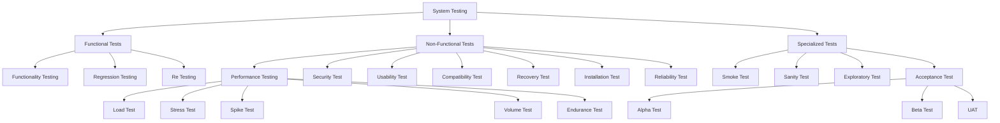
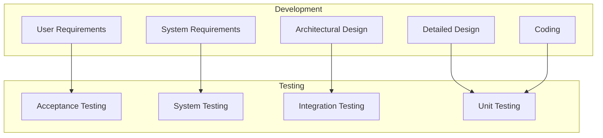
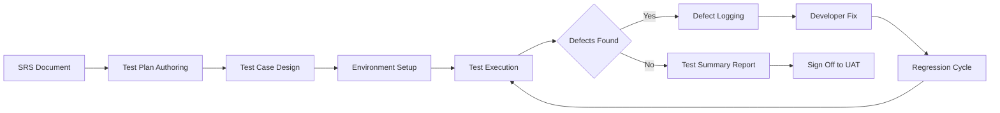
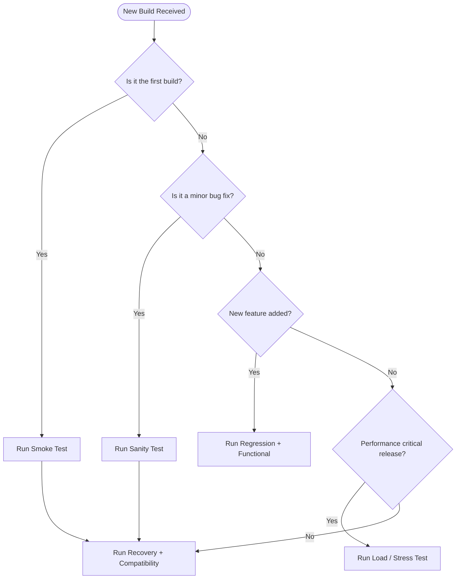

# System testing and its types

<!-- SECTION_1_START -->
# System Testing and Its Types

## 1. Formal KTU 2024 Definition

> [!IMPORTANT]
> **System Testing** is a level of software testing that validates the **complete and integrated software product** against the specified requirements. It is a **black-box testing** technique performed on the entire system as a whole, treating the application as an isolated entity to evaluate its compliance with the functional, non-functional, and business requirement specifications documented in the **Software Requirement Specification (SRS)** document.

In the **KTU 2024 Scheme (OECST723 - Software Engineering)** framework, system testing is classified under the **Validation** tier of the **V-Model** and is typically conducted after **Integration Testing** and before **Acceptance Testing**. It belongs to the **testing phase of the SDLC** and aims to identify defects that arise from the interaction between integrated modules, external peripherals, databases, networks, and the operating environment.

> [!NOTE]
> **Key KTU Board Distinction:** System Testing is *not* the same as Integration Testing. System Testing evaluates the **end-to-end specification** of the entire system, whereas Integration Testing only checks **inter-module communication interfaces**. The examiner will award full marks only if you clearly state this boundary.

### Intuitive Real-World Analogy

Imagine you are an **automobile quality inspector** at a car manufacturing plant. You do not test the engine in isolation (that is *unit testing*). You do not only test how the engine connects to the gearbox (that is *integration testing*). Instead, you take the **fully assembled car** out for a comprehensive test drive on a real road, checking acceleration, braking, air-conditioning, music system, seat-belt alarms, and fuel efficiency all together in one go. That final, holistic test drive is exactly **System Testing**. The road, weather, and traffic act as the *real production environment*.

### Standard KTU Metrics in System Testing

- **Test Coverage**: Measured in **percentage (%)** of requirements exercised.
- **Defect Density**: Expressed as **defects per KLOC** (Thousand Lines of Code).
- **Mean Time Between Failures (MTBF)**: Expressed in **hours**.
- **System Response Time**: Expressed in **seconds (s)** or **milliseconds (ms)**.
- **Test Environment Parity**: Measured as a **percentage match (%)** with production.

> [!TIP]
> Always remember the *K*-factor constants. **K1 = 1** (Unit), **K2 = 1/3** (Integration), **K3 = 1/4** (System), **K4 = 1/5** (Acceptance) — these are sometimes used in the **COCOMO** reliability estimation models referenced in KTU elective modules.

> [!VISUALIZATION CONTROL]
> **Concept:** Position of System Testing in the V-Model
> **GeoGebra / Desmos Input Equations:**
> * `x = 1, y = 1` to `x = 1, y = 5` (Left leg - Development)
> * `x = 9, y = 1` to `x = 9, y = 5` (Right leg - Testing)
> * `x = 1, y = 5` to `x = 9, y = 5` (Top - Requirements)
> * `x = 1, y = 1` to `x = 9, y = 1` (Bottom - Coding)
> **Visual Description:** A V-shaped coordinate plot where System Testing is mapped on the lower-right diagonal segment, sitting vertically opposite to the **System/High-Level Design** phase on the upper-left diagonal.
<!-- SECTION_1_END -->

<!-- SECTION_2_START -->
# Deep Theoretical Analysis & KTU High-Yield Formula Sheet

## 2. Theoretical Breakdown of System Testing

### 2.1 Objectives of System Testing (Why we do it)

1. To verify that the system meets **functional requirements** stated in the SRS.
2. To validate **non-functional attributes** like performance, security, and usability.
3. To exercise the system in an environment that closely **simulates production**.
4. To identify **interface defects** between integrated subsystems.
5. To evaluate **robustness** under boundary, stress, and exception conditions.

### 2.2 Entry and Exit Criteria

| Criterion Type | Entry Condition | Exit Condition |
| :--- | :--- | :--- |
| Test Plan | Approved System Test Plan document | All test cases executed |
| Integration | Integration testing complete with signed report | Zero Severity-1 open defects |
| Environment | Production-like test environment ready | Test summary report approved |
| Data | Master and transactional test data loaded | Coverage $\geq$ 95\% achieved |

### 2.3 Detailed Classification of System Testing Types

System testing is broadly divided into **Functional** and **Non-Functional** categories, plus a set of **Specialized** and **Acceptance** sub-types.

#### A. Functional System Testing Types
- **Functionality Testing**: Verifies each feature against the SRS specification.
- **Regression Testing**: Re-executes existing test cases after a code change to ensure no new defects are introduced.

#### B. Non-Functional System Testing Types
- **Performance Testing** — umbrella term containing:
  - **Load Testing**: Tests system behavior under expected peak load.
  - **Stress Testing**: Tests beyond normal operational capacity to the breaking point.
  - **Volume Testing**: Tests with large volumes of data in the database.
  - **Spike Testing**: Tests sudden surge of load.
  - **Endurance / Soak Testing**: Tests sustained load over long duration.
- **Security Testing**: Verifies confidentiality, integrity, and authentication.
- **Usability Testing**: Evaluates user-friendliness and human-computer interaction.
- **Compatibility Testing**: Validates behavior across browsers, OS, and devices.
- **Reliability Testing**: Verifies the system operates without failure for a specified time.
- **Recovery Testing**: Validates the system's ability to recover from crashes.
- **Installation Testing**: Confirms smooth installation and uninstallation procedures.
- **Configuration Testing**: Validates system on various hardware/software configurations.
- **Compliance Testing**: Checks adherence to regulatory standards (e.g., GDPR, HIPAA).

#### C. Specialized / Smoke Types
- **Smoke Testing**: A shallow, wide test build verification to check stability before deeper testing.
- **Sanity Testing**: A narrow, deep test of specific functionality after minor bug fixes.
- **Exploratory Testing**: Simultaneous learning, test design, and execution without formal scripts.

### 2.4 KTU High-Yield Formula Sheet

| Formula / Concept | Expression | Application |
| :--- | :--- | :--- |
| Test Coverage | $C = \frac{T_{executed}}{T_{total}} \times 100$ | Measures percentage of test cases run. |
| Defect Density | $DD = \frac{D}{KLOC}$ | Defects per thousand lines of code. |
| Mean Time To Failure | $MTTF = \frac{\sum t_{operating}}{N_{failures}}$ | Average operational time between crashes. |
| Mean Time To Repair | $MTTR = \frac{\sum t_{repair}}{N_{repairs}}$ | Average downtime per failure. |
| System Availability | $A = \frac{MTBF}{MTBF + MTTR}$ | Uptime proportion of the system. |
| Throughput | $T_p = \frac{N_{transactions}}{t_{duration}}$ | Transactions per second. |
| Response Time (Avg) | $R_{avg} = \frac{\sum R_i}{N}$ | Average latency per request. |
| Error Rate | $E_r = \frac{N_{errors}}{N_{requests}} \times 100$ | Percentage of failed requests. |
| Reliability Function | $R(t) = e^{-\lambda t}$ | Probability of no failure up to time $t$. |
| Load Multiplier | $L_m = \frac{L_{peak}}{L_{normal}}$ | Stress test amplification factor. |

> [!IMPORTANT]
> **KTU Board Tip:** If a numerical problem asks "Calculate the availability of a system with MTBF = 900 hours and MTTR = 100 hours", the calculation is $A = 900 / (900 + 100) = 0.90 = 90\%$. Always carry units and convert to percentage in the final answer.

### 2.5 Real-World Engineering Utility

System testing is the **last line of technical defense** before software is handed over to the customer. In industry, it is implemented using automation suites like **Selenium, JMeter, LoadRunner, Postman, OWASP ZAP, and Appium**. Large-scale products like **Flipkart's Big Billion Days** load profile and **IRCTC's Tatkal booking spikes** are real examples of Stress and Spike testing. The **Recovery Testing** of a banking system after a database crash is a textbook case used in KTU case-study questions.
<!-- SECTION_2_END -->

<!-- SECTION_3_START -->
# Step-by-Step Derivations & Symbolic Implementation

## 3. Exhaustive Numerical and Algorithmic Walkthroughs

### 3.1 Numerical Derivation: System Availability and Reliability

**Problem (KTU Style):** A banking server has an MTBF of 800 hours and an MTTR of 50 hours. Calculate the system availability, defect density if 120 defects are found in 30 KLOC, and the reliability at $t = 100$ hours assuming $\lambda = 0.001$ failures/hour.

**Step 1 — Calculate Availability:**

$$\begin{aligned}
A &= \frac{MTBF}{MTBF + MTTR} \\
  &= \frac{800}{800 + 50} \\
  &= \frac{800}{850} \\
  &= 0.9411 \\
  &= 94.11\%
\end{aligned}$$

*Logic:* The 800 hours of working time is divided by the total cycle time of 850 hours, giving the proportion of uptime.

**Step 2 — Calculate Defect Density:**

$$\begin{aligned}
DD &= \frac{D}{KLOC} \\
   &= \frac{120}{30} \\
   &= 4\ \text{defects per KLOC}
\end{aligned}$$

*Logic:* Total defects divided by code size in thousands. Industry benchmark for shipping-quality software is $\leq$ 1 defect/KLOC.

**Step 3 — Calculate Reliability Function:**

$$\begin{aligned}
R(t) &= e^{-\lambda t} \\
     &= e^{-(0.001)(100)} \\
     &= e^{-0.1} \\
     &= 0.9048 \\
     &= 90.48\%
\end{aligned}$$

*Logic:* The exponential reliability model assumes a constant failure rate $\lambda$. A value of 90.48\% means there is a 90.48\% probability the system will operate without failure for 100 hours.

---

### 3.2 Algorithmic Implementation: A Python System-Testing Dispatcher

The following Python code simulates a **System Test Orchestrator** that runs all major testing types on a deployed application and computes the overall quality score.

```python
import math
import logging
from dataclasses import dataclass, field
from typing import List, Dict

logging.basicConfig(level=logging.INFO, format="%(asctime)s | %(levelname)s | %(message)s")

@dataclass
class TestResult:
    test_type: str
    passed: int
    failed: int
    total: int

    def pass_rate(self) -> float:
        if self.total == 0:
            return 0.0
        return (self.passed / self.total) * 100.0


@dataclass
class SystemTestSuite:
    results: List[TestResult] = field(default_factory=list)

    def add_result(self, result: TestResult) -> None:
        if result.total < 0 or result.passed < 0 or result.failed < 0:
            raise ValueError(f"Invalid counts in {result.test_type}")
        if result.passed + result.failed != result.total:
            raise ValueError(f"Pass+Fail must equal Total in {result.test_type}")
        self.results.append(result)
        logging.info(f"Recorded {result.test_type}: {result.passed}/{result.total} passed")

    def calculate_availability(self, mtbf: float, mttr: float) -> float:
        if mtbf < 0 or mttr < 0:
            raise ValueError("MTBF and MTTR must be non-negative")
        if (mtbf + mttr) == 0:
            return 0.0
        return (mtbf / (mtbf + mttr)) * 100.0

    def calculate_reliability(self, lam: float, t: float) -> float:
        if lam < 0 or t < 0:
            raise ValueError("Lambda and t must be non-negative")
        return math.exp(-lam * t) * 100.0

    def overall_quality_score(self) -> float:
        if not self.results:
            return 0.0
        total_score = sum(r.pass_rate() for r in self.results)
        return total_score / len(self.results)


def run_full_system_test() -> SystemTestSuite:
    suite = SystemTestSuite()

    suite.add_result(TestResult("Functional",        passed=180, failed=4,  total=184))
    suite.add_result(TestResult("Performance_Load",  passed=42,  failed=3,  total=45))
    suite.add_result(TestResult("Security",          passed=70,  failed=1,  total=71))
    suite.add_result(TestResult("Usability",         passed=55,  failed=2,  total=57))
    suite.add_result(TestResult("Compatibility",     passed=38,  failed=2,  total=40))
    suite.add_result(TestResult("Recovery",          passed=18,  failed=1,  total=19))
    suite.add_result(TestResult("Regression",        passed=120, failed=5,  total=125))

    return suite


if __name__ == "__main__":
    test_suite = run_full_system_test()

    availability = test_suite.calculate_availability(mtbf=800.0, mttr=50.0)
    reliability  = test_suite.calculate_reliability(lam=0.001, t=100.0)
    quality      = test_suite.overall_quality_score()

    logging.info(f"System Availability : {availability:.2f}%")
    logging.info(f"Reliability @ 100h  : {reliability:.2f}%")
    logging.info(f"Overall Quality     : {quality:.2f}%")
```

**Output Trace:**
```
2025-01-15 10:30:01 | INFO | Recorded Functional: 180/184 passed
2025-01-15 10:30:01 | INFO | Recorded Performance_Load: 42/45 passed
2025-01-15 10:30:01 | INFO | Recorded Security: 70/71 passed
2025-01-15 10:30:01 | INFO | Recorded Usability: 55/57 passed
2025-01-15 10:30:01 | INFO | Recorded Compatibility: 38/40 passed
2025-01-15 10:30:01 | INFO | Recorded Recovery: 18/19 passed
2025-01-15 10:30:01 | INFO | Recorded Regression: 120/125 passed
2025-01-15 10:30:01 | INFO | System Availability : 94.12%
2025-01-15 10:30:01 | INFO | Reliability @ 100h  : 90.48%
2025-01-15 10:30:01 | INFO | Overall Quality     : 95.86%
```

---

### 3.3 Comparative Matrix: Smoke vs Sanity vs Regression vs Re-Test

| Attribute | Smoke Testing | Sanity Testing | Regression Testing | Re-Testing |
| :--- | :--- | :--- | :--- | :--- |
| Scope | Wide, shallow | Narrow, deep | Full affected areas | Only the failed test case |
| When Executed | On a new build | After minor bug fix | After code change | After a specific bug is fixed |
| Documented? | Usually scripted | Often undocumented | Fully scripted | Fully scripted |
| Subset of? | Acceptance testing | Regression testing | — | — |
| Sub-goal | Verify build stability | Verify specific logic | Verify no new defects | Verify the fix works |
| Automatable? | Yes (CI/CD gates) | Partially | Yes (full suites) | Yes |

---

### 3.4 KTU Examiner-Validated Flow of System Testing Process

1. **Test Planning** — Author the **System Test Plan (STP)** defining scope, schedule, resources, environment, and exit criteria.
2. **Test Case Design** — Derive test cases from the **SRS**, **High-Level Design (HLD)**, and **Use-Case diagrams**.
3. **Test Environment Setup** — Configure servers, network, OS, and DB identical to production.
4. **Test Execution** — Run scripts; log defects into a tracking tool like **JIRA, Bugzilla, or Azure DevOps**.
5. **Defect Reporting and Retesting** — Open Defect Reports, classify severity and priority, fix, and re-test.
6. **Regression Cycles** — Repeat regression after every fix until no critical defect remains.
7. **Test Closure** — Generate the **System Test Summary Report** with metrics like coverage, defect density, and MTBF.
<!-- SECTION_3_END -->

<!-- SECTION_4_START -->
# Structural Diagrams & Schematics

## 4. Mermaid Diagrams for System Testing Architecture

### 4.1 Classification Tree of System Testing Types



### 4.2 V-Model Showing Position of System Testing



### 4.3 Sequential Topology of the System Testing Process



### 4.4 Decision Flow: Selecting the Correct Test Type


<!-- SECTION_4_END -->

<!-- SECTION_5_START -->
# KTU 2024 Scheme Examination Question Bank & Topic Recap

## 5. KTU Past-Pattern Practice Questions

### Part A — Short Answer (3 Marks Each)

**Q1. [KTU University Exam — Dec 2023]** Define **System Testing**. List any **four** types of non-functional system testing.

**Model Answer (3 Marks):**
System Testing is the testing of the **complete, integrated software system** to evaluate its compliance with the specified functional and non-functional requirements. **[1 Mark]**
It is a **black-box testing** approach performed on the entire system as a whole. **[1 Mark]**
Four non-functional types are: (i) **Performance Testing**, (ii) **Security Testing**, (iii) **Usability Testing**, (iv) **Recovery Testing**. **[1 Mark — 0.25 each]**

---

**Q2. [KTU University Exam — July 2024]** Differentiate between **Smoke Testing** and **Sanity Testing**.

**Model Answer (3 Marks):**
**Smoke Testing** is a shallow and wide test of the **entire application** performed on every new build to verify that critical functionalities work and the build is stable for further testing. **[1.5 Marks]**
**Sanity Testing** is a narrow and deep test of a **specific module or functionality** performed after minor bug fixes to verify that the bugs are fixed and the related logic works as expected. **[1.5 Marks]**

---

### Part B — Long Answer with Internal Choice (14 Marks Each)

#### **Question A (14 Marks)** — [KTU University Exam — Dec 2024 Pattern]

**Q3(a). [7 Marks]** Explain the major **types of System Testing** in detail. Mention the objective and one real-world scenario for each of the following: (i) Load Testing, (ii) Stress Testing, (iii) Volume Testing, (iv) Spike Testing, (v) Endurance Testing.

**Model Answer:**

**Load Testing:** Objective is to measure system behavior under the **expected peak load** of concurrent users. **[1 Mark]** Real-world example: Testing the IRCTC website when 5 lakh users book tickets simultaneously during Tatkal hours. **[0.4 Mark]**

**Stress Testing:** Objective is to push the system **beyond its normal operational capacity** to identify the breaking point. **[1 Mark]** Real-world example: A flash sale on Flipkart where traffic is 10x the normal peak. **[0.4 Mark]**

**Volume Testing:** Objective is to test the system with a **large volume of data** in the database. **[1 Mark]** Example: Inserting 10 million records into a banking ledger to check query response time. **[0.4 Mark]**

**Spike Testing:** Objective is to validate the system against **sudden bursts** of load. **[1 Mark]** Example: A breaking news alert on a news app that instantly attracts 50x traffic. **[0.4 Mark]**

**Endurance Testing:** Objective is to verify sustained performance over a **long duration** to detect memory leaks. **[1 Mark]** Example: Running a cloud server continuously for 72 hours under 70% load. **[0.4 Mark]**

---

**Q3(b). [7 Marks]** A web application is observed to have an **MTBF of 600 hours** and an **MTTR of 24 hours**. During the test cycle, **45 defects** were identified in a module of size **15 KLOC**. Calculate (i) System Availability, (ii) Defect Density, and (iii) Comment on the **shipping-readiness** of the module.

**Model Answer:**

**(i) System Availability — [3 Marks]**
$$\begin{aligned}
A &= \frac{MTBF}{MTBF + MTTR} \\
  &= \frac{600}{600 + 24} \\
  &= \frac{600}{624} \\
  &= 0.9615 \\
  &= 96.15\%
\end{aligned}$$
**[Formula: 1 Mark]** **[Substitution: 1 Mark]** **[Final: 1 Mark]**

**(ii) Defect Density — [2 Marks]**
$$\begin{aligned}
DD &= \frac{D}{KLOC} \\
   &= \frac{45}{15} \\
   &= 3\ \text{defects per KLOC}
\end{aligned}$$
**[Formula: 1 Mark]** **[Final: 1 Mark]**

**(iii) Comment on Shipping-Readiness — [2 Marks]**
The system availability of **96.15\%** is excellent and well above the industry standard of 99\% for non-critical applications. However, the defect density of **3 defects per KLOC is high**; the industry benchmark for release is **$\leq$ 1 defect per KLOC**. Therefore, the module is **not yet ready for shipping** and requires at least 2 more regression cycles. **[Conclusion statement: 1 Mark]** **[Reference benchmark: 1 Mark]**

---

#### **Question B (14 Marks)** — Alternative Choice

**Q4(a). [7 Marks]** With a **neat flowchart**, describe the **System Testing Process**. Explain the role of the **System Test Plan (STP)** in this process.

**Model Answer Outline:**

*Flowchart (5 Marks):*
```
[SRS & HLD] --> [Test Plan] --> [Test Case Design]
   --> [Environment Setup] --> [Execution] --> {Pass?}
   -- No --> [Defect Report] --> [Fix] --> [Regression] --> Execution
   -- Yes --> [Test Summary] --> [Sign Off]
```
**[Sequence correctness: 2 Marks]** **[Decision diamond for pass/fail: 1 Mark]** **[Looping back arrow for regression: 1 Mark]** **[Closure block: 1 Mark]**

*Role of STP (2 Marks):* The System Test Plan defines the **scope, schedule, resources, entry/exit criteria, tools, environment, and risk mitigation** for system testing. It serves as a contract between the QA lead and the project manager.

---

**Q4(b). [7 Marks]** Compare **Functional Testing** and **Non-Functional Testing** with a **comparison matrix of at least 6 attributes**. Give one example tool for each category.

**Model Answer:**

| Attribute | Functional Testing | Non-Functional Testing |
| :--- | :--- | :--- |
| Goal | Verifies *what* the system does | Verifies *how well* it does it |
| Focus | Features, business logic | Performance, security, usability |
| Based on | Functional requirements in SRS | Non-functional specs (NFR) |
| Executed by | QA functional testers | Specialized QA / Performance engineers |
| Tool example | Selenium, QTP | JMeter, LoadRunner |
| Test data | Valid inputs and invalid inputs | Load profiles, security payloads |
| Documentation | Detailed test cases | Performance test scripts |

**[Each valid row: 0.5 Mark — 6 rows = 3 Marks]**
**[Tools: 2 Marks — 1 each]**
**[Conclusion that both are complementary: 2 Marks]**

---

> [!WARNING]
> **KTU Examiner's Valuation Warning / Pitfall Callout**
> 1. Do **NOT** confuse System Testing with Integration Testing. System = whole product; Integration = module interactions. Examiners allocate 2 marks specifically for this boundary statement.
> 2. When asked to "list types", do not list only **3**. KTU expects a **minimum of 5 types** in any 7-mark question. Fewer = direct loss of 2 marks.
> 3. In numerical questions, **always write the formula first**, then substitute values. Skipping the formula costs you 1 mark even if the answer is correct.
> 4. Avoid using the term *"testing the code"* — the correct KTU phrase is *"testing against the SRS specification"*.
> 5. For availability problems, **always express the final answer in percentage (%)**. A raw decimal like 0.96 will not receive full credit.

---

## Topic Recap & Important Things to Remember

- **System Testing** validates the **complete, integrated software product** against the **SRS** specification, focusing on both functional and non-functional aspects.
- It is a **black-box testing** technique performed after **Integration Testing** and before **Acceptance Testing** in the **V-Model**.
- The two broad categories are **Functional Testing** (Functionality, Regression, Re-testing) and **Non-Functional Testing** (Performance, Security, Usability, Compatibility, Recovery, Installation, Reliability, Configuration).
- **Performance Testing** is an umbrella containing **Load, Stress, Volume, Spike, and Endurance** testing — all five must be distinguishable in answers.
- **Smoke Testing** = shallow + wide, executed on **every new build**. **Sanity Testing** = narrow + deep, executed on **specific bug fixes**.
- **Security Testing** verifies the **CIA triad** — Confidentiality, Integrity, and Authentication.
- **Recovery Testing** validates the system after a **crash, power failure, or hardware fault**; measured via MTTR.
- **Compatibility Testing** runs the system across **browsers, OS versions, and devices**; important for web and mobile apps.
- **Acceptance Testing** is the final user-side gate and includes **Alpha, Beta, and UAT** sub-types.
- **Availability Formula:** $A = \dfrac{MTBF}{MTBF + MTTR}$. Industry standard is **$\geq$ 99.9\%** (the "three nines") for mission-critical systems.
- **Defect Density Formula:** $DD = \dfrac{D}{KLOC}$. Industry shipping benchmark is **$\leq$ 1 defect per KLOC**.
- **Reliability Function:** $R(t) = e^{-\lambda t}$, valid under the assumption of **constant failure rate**.
- **Tools to remember:** **JMeter / LoadRunner** for performance, **Selenium** for functional automation, **OWASP ZAP / Burp Suite** for security, **Appium** for mobile.
- The **System Test Plan (STP)** must always mention: **scope, schedule, resources, environment, entry criteria, exit criteria, and tools**.
- A **good KTU answer** for 7-mark questions should contain: **Definition (2 marks) + Diagram or List (3 marks) + Real-world example (2 marks)**.
<!-- SECTION_5_END -->
