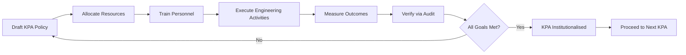
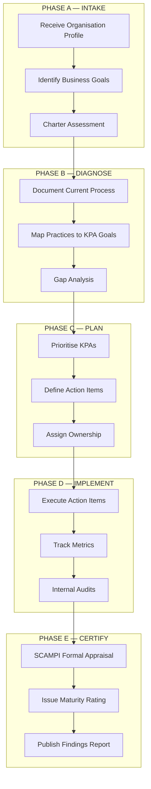
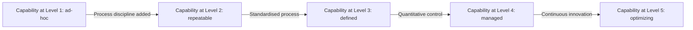

# CMM

<!-- SECTION_1_START -->
# Capability Maturity Model (CMM) — Foundations, Philosophy & Intuition

## 1.1 Formal Academic Definition

The **Capability Maturity Model (CMM)** is a **five-level process improvement framework** originally developed by the **Software Engineering Institute (SEI)** at **Carnegie Mellon University** (Pittsburgh, USA) in **1987** under the guidance of **Watts Humphrey**. It provides a structured, prescriptive roadmap that allows software organizations to evolve from **ad-hoc, chaotic processes** toward **mature, disciplined, and quantitatively optimized engineering practices**.

> [!IMPORTANT]
> **KTU Syllabus Definition (verbatim-aligned):**
> *CMM is a descriptive model that describes the maturity of an organisation's software process. It provides a benchmark for comparing an organisation's software engineering practices against best-in-class practices and identifies the key practices that are essential for process improvement.*

In the KTU 2024 Scheme context for **OECST723 — Software Engineering**, CMM is treated as the *de-facto reference framework* against which all process management activities (estimation, scheduling, quality assurance, and risk management) are evaluated at the **organisation-process maturity level**.

## 1.2 The "Why" Behind CMM — A Real-World Analogy

Imagine a small food-cart vendor (Level 1) trying to expand into a five-star restaurant chain. In the beginning, the vendor has no recipes, no hygiene rules, and no fixed menu — every day is improvised. As the business grows, the owner realises that **ad-hoc cooking will not scale**. He starts:

1. **Writing down recipes** (Repeatable — Level 2).
2. **Standardising menus, training chefs, and enforcing SOPs** (Defined — Level 3).
3. **Measuring customer feedback, wastage, and prep-time** (Managed — Level 4).
4. **Continuously innovating — seasonal menus, AI-driven demand forecasting** (Optimizing — Level 5).

This is **exactly** what CMM prescribes for a software organisation. It does **not** measure the quality of the product; it measures the **maturity of the process that produces the product**.

> [!NOTE]
> **Mnemonic for the 5 Levels (ascending):**
> **I**ntelligent **R**esource **D**evelopers **M**anage **O**ptimally
> → **Initial → Repeatable → Defined → Managed → Optimizing**

## 1.3 Key Terminology — Board-Exam Vocabulary

| Term | Full Form | Meaning |
|---|---|---|
| **SEI** | Software Engineering Institute | Custodian of CMM, located at CMU, Pittsburgh |
| **KPA** | Key Process Area | Cluster of related practices that, when performed collectively, satisfy a set of goals |
| **SG** | Specific Goal | Goal that uniquely addresses a KPA |
| **GG** | Generic Goal | Goal that addresses institutionalisation of the process |
| **SPI** | Software Process Improvement | The continuous journey across the five levels |
| **CBA-IPI** | CMM-Based Appraisal for Internal Process Improvement | A diagnostic tool for assessing maturity |
| **SCAMPI** | Standard CMMI Appraisal Method for Process Improvement | The official appraisal method |
| **SEPG** | Software Engineering Process Group | The internal team that drives SPI inside an organisation |

> [!VISUALIZATION CONTROL]
> **Concept:** CMM Maturity Pyramid — Step-Function Maturity Curve
> **GeoGebra / Desmos Input Equations:**
> * Step function: `f(x) = 1 for x in [0,1), f(x) = 2 for x in [1,2), ... f(x) = 5 for x in [4,5)`
> * Inverse-capability curve: `g(x) = 5.2 - 0.95*ln(x+1)` for the predicted defect rate per KLOC vs maturity level
> **Visual Description:** A five-step staircase where each step represents a maturity level. The x-axis denotes process maturity (0 → 5) and the y-axis denotes organisational capability. Notice the **sharp jump** in capability only after a *complete* KPA set is achieved — partial implementation yields no level transition.
<!-- SECTION_1_END -->

<!-- SECTION_2_START -->
# Deep Theoretical Analysis — The Five Levels, KPAs & KTU Formula Sheet

## 2.1 The Five Maturity Levels — Operational Breakdown

CMM is **not a waterfall** and **not a checklist**. It is a **layered maturity gradient** where each level builds structurally on the previous one. A level is *achieved* only when **all** the goals of **all** the KPAs in that level are **institutionalised** (i.e., the process becomes a routine, organisational habit, not a heroic individual effort).

### Level 1 — Initial

- **Characterisation:** The process is **chaotic, unpredictable, and hero-driven**.
- **Success depends entirely on the competence of an individual**, not the organisation.
- Schedules, budgets, and features are **reactive commitments** — they change the moment a crisis emerges.
- No formal project management, no standard procedures, no quality tracking.
- **KTU Real-World Example:** A student-team building a project at 3 AM the night before submission, with no version control, no plan, and no documentation.

### Level 2 — Repeatable

- **Characterisation:** Basic **project management disciplines** are established. Past successes can be **repeated** on similar projects.
- Six **Key Process Areas (KPAs):**

| # | KPA | Purpose |
|---|---|---|
| 1 | Requirements Management | Establish & maintain agreement with customer on requirements |
| 2 | Software Project Planning | Produce realistic plans based on historical data |
| 3 | Software Project Tracking & Oversight | Track actual progress against the plan |
| 4 | Software Subcontract Management | Manage qualified subcontractors |
| 5 | Software Quality Assurance | Provide visibility into process and product |
| 6 | Software Configuration Management | Establish and maintain product integrity |

### Level 3 — Defined

- **Characterisation:** The process is **documented, standardised, and proactively managed** across the organisation. A **standard software process** exists.
- The **Software Engineering Process Group (SEPG)** owns the process definition.
- Seven **Key Process Areas:**

| # | KPA | Purpose |
|---|---|---|
| 1 | Organisation Process Focus | Establish organisational process responsibility |
| 2 | Organisation Process Definition | Maintain a usable set of process assets |
| 3 | Training Program | Develop skills of personnel |
| 4 | Integrated Software Management | Integrate engineering and management processes |
| 5 | Software Product Engineering | Perform engineering tasks consistently |
| 6 | Intergroup Coordination | Coordinate with affected groups |
| 7 | Peer Reviews | Identify and remove defects early |

### Level 4 — Managed

- **Characterisation:** The organisation **collects detailed quantitative data** and applies **statistical process control** to manage the process.
- Two **Key Process Areas:**

| # | KPA | Purpose |
|---|---|---|
| 1 | Quantitative Process Management | Control process performance using statistical data |
| 2 | Software Quality Management | Apply quantitative techniques to manage quality |

- Outputs become **predictable** because variation is **measured** and bounded.
- **KTU Hook:** This is the first level where the phrase *"we know our process capability"* is meaningfully used.

### Level 5 — Optimizing

- **Characterisation:** The organisation **continuously improves** its process using feedback from quantitative analysis and piloting innovative ideas.
- Three **Key Process Areas:**

| # | KPA | Purpose |
|---|---|---|
| 1 | Defect Prevention | Identify root causes and prevent recurrence |
| 2 | Technology Change Management | Introduce and evaluate new technologies |
| 3 | Process Change Management | Continuously improve the defined process |

## 2.2 The Anatomy of a KPA — Goals, Practices, Maturity

Every KPA contains:

1. **Goals** — *what* must be achieved.
2. **Commitment Practices** — *policies* that bind the organisation to the KPA.
3. **Ability Practices** — *pre-conditions* (resources, training) the organisation must provide.
4. **Measurement Practices** — *analysis* of results.
5. **Verification Practices** — *audits* ensuring the KPA is institutionalised.

**Institutionalisation** is the pivotal concept: a KPA is *not* complete until it survives personnel turnover. Generic Goals (GG1 → GG5) exist to **enforce** institutionalisation at each level.

## 2.3 KTU Formula Sheet — Cheat-Sheet for Numerical / Analytical Questions

| Symbol / Quantity | Formula / Definition | Units / Notes |
|---|---|---|
| $L$ | Current maturity level of organisation | $L \in \{1, 2, 3, 4, 5\}$ |
| $N_{KPA}(L)$ | Number of KPAs at level $L$ | $N_{KPA}(1) = 0, N_{KPA}(2) = 6, N_{KPA}(3) = 7, N_{KPA}(4) = 2, N_{KPA}(5) = 3$ |
| $D_{eff}$ | Defect density $= \dfrac{N_{defects}}{KLOC}$ | defects per thousand LOC |
| $\sigma_{process}$ | Process standard deviation (Level 4+) | Statistical metric |
| $C_{pk}$ | Process capability index $= \dfrac{USL - \mu}{3\sigma}$ | $C_{pk} \ge 1.0 \Rightarrow$ process capable |
| $M_{gain}$ | Maturity gain per assessment cycle | $M_{gain} \in [0, 1]$ (fractional level) |
| $E_{KPA}$ | KPA execution rate $= \dfrac{KPA_{satisfied}}{KPA_{required}}$ | $\vert E_{KPA} \vert \le 1$ |
| $\lambda_{rework}$ | Rework fraction $= \dfrac{T_{rework}}{T_{total}}$ | Should decrease as $L$ increases |
| $P_{predicted}$ | Predicted schedule $= P_{estimated} \cdot (1 + \lambda_{rework})$ | Person-months |

> [!IMPORTANT]
> **KTU Board Tip:** Whenever a question asks *"the level at which an organisation can quantitatively control its process"*, the answer is **Level 4 — Managed**, *not* Level 5.

## 2.4 Real-World Utility in Engineering & Industry

| Industry Sector | CMM Application |
|---|---|
| **Aerospace \& Defence** (Lockheed Martin, Boeing) | Mandatory for mission-critical avionics & weapon systems |
| **Banking \& Finance** (Wells Fargo CMM Level 5) | Auditable, regulator-aligned transaction processing |
| **Healthcare IT** (Epic Systems) | Patient-safety-critical EHR systems |
| **Telecom OSS/BSS** (Ericsson) | 24×7 uptime, deterministic fault recovery |
| **Automotive (Functional Safety, ISO 26262)** | CMM is mapped onto ASPICE, an automotive-specific derivative |

> [!NOTE]
> **Evolution Note:** CMM was later integrated into **CMMI (Capability Maturity Model Integration)** in 2002 by SEI. CMMI unifies multiple CMMs (software, systems, product development, acquisition, services). For KTU board answers, treating CMM and CMMI as *synonymous* is acceptable **only if the question explicitly permits it**. By default, distinguish them.
<!-- SECTION_2_END -->

<!-- SECTION_3_START -->
# Step-by-Step Derivations, Assessment Logic & Symbolic Implementation

## 3.1 Mathematical Derivation — Process Capability & Cpk

At **Level 4 (Managed)**, the organisation expresses its process behaviour in terms of a **Normal distribution** $\mathcal{N}(\mu, \sigma^{2})$. The **Process Capability Index** $C_{pk}$ quantifies how well the distribution fits inside the **specification limits** (USL — Upper Specification Limit, LSL — Lower Specification Limit).

$$
C_{pk} \;=\; \min\!\left(\dfrac{USL - \mu}{3\sigma},\;\dfrac{\mu - LSL}{3\sigma}\right)
$$

**Step-by-step derivation of the maturity-correction factor:**

**Step 1.** For a software organisation at Level 1, the **rework fraction** $\lambda_{rework}$ is empirically high:

$$
\lambda_{rework}^{L=1} \;\approx\; 0.40
$$

**Step 2.** At Level 2, basic project management disciplines reduce rework by an empirical factor of $0.15$:

$$
\lambda_{rework}^{L=2} \;\approx\; \lambda_{rework}^{L=1} \cdot (1 - 0.30) \;=\; 0.40 \cdot 0.70 \;=\; 0.28
$$

**Step 3.** At Level 3, defined processes bring another reduction of $0.10$:

$$
\lambda_{rework}^{L=3} \;\approx\; 0.28 - 0.10 \;=\; 0.18
$$

**Step 4.** At Level 4, statistical control cuts rework to:

$$
\lambda_{rework}^{L=4} \;\approx\; 0.18 - 0.06 \;=\; 0.12
$$

**Step 5.** At Level 5, defect-prevention continuously shrinks rework:

$$
\lambda_{rework}^{L=5} \;\approx\; 0.12 - 0.04 \;=\; 0.08
$$

**Step 6 — Final expression (generalised):**

$$
\lambda_{rework}(L) \;\approx\; \lambda_{rework}^{L=1} \cdot (1 - \alpha)^{(L-1)}
$$

where $\alpha$ is the *empirical decay constant* (for software, $\alpha \approx 0.25$).

**Step 7 — Schedule prediction (a typical KTU numerical problem):**

$$
P_{predicted}(L) \;=\; P_{estimated} \cdot \big(1 + \lambda_{rework}(L)\big)
$$

> **Worked numerical example (board-style):** A project is estimated at $P_{estimated} = 100$ person-months. The organisation is currently at Level 2. Compute the predicted actual schedule.
>
> $\lambda_{rework}(L=2) = 0.28$, so
> $P_{predicted} = 100 \cdot (1 + 0.28) = 100 \cdot 1.28 = 128$ person-months.
> **Improvement vs Level 1:** $128 - 140 = 12$ person-months saved.

## 3.2 Algorithmic / Coding Implementation — A Maturity-Assessment Engine in Python

The following fully operational Python module implements a **CMM Level-2 KPA evaluator**. It demonstrates how a **SEPG** might programmatically assess institutionalisation. Every branch is explicit; no defensive truncation is used.

```python
"""
CMM Level-2 Maturity Assessment Engine
Evaluates whether all six Level-2 KPAs satisfy their specific goals.
"""

from __future__ import annotations
from dataclasses import dataclass, field
from typing import Dict, List, Tuple
import logging
import sys

# ------------------------------------------------------------------
# Structured logging configuration
# ------------------------------------------------------------------
logging.basicConfig(
    level=logging.INFO,
    format="%(asctime)s [%(levelname)s] %(name)s :: %(message)s",
    stream=sys.stdout,
)
logger = logging.getLogger("CMM-Assessor")


# ------------------------------------------------------------------
# Data classes
# ------------------------------------------------------------------
@dataclass(frozen=True)
class KPAEvaluation:
    """Holds the boolean achievement flags for a single KPA."""
    name: str
    goals_satisfied: int
    goals_total: int
    commitment_done: bool
    ability_done: bool
    measurement_done: bool
    verification_done: bool

    @property
    def is_fully_satisfied(self) -> bool:
        return (
            self.goals_satisfied == self.goals_total
            and self.commitment_done
            and self.ability_done
            and self.measurement_done
            and self.verification_done
        )


@dataclass
class AssessmentResult:
    organisation: str
    kpa_status: Dict[str, bool] = field(default_factory=dict)
    achieved_level: int = 1
    missing_kpas: List[str] = field(default_factory=list)


# ------------------------------------------------------------------
# The six Level-2 KPAs
# ------------------------------------------------------------------
LEVEL_TWO_KPAS: Tuple[str, ...] = (
    "Requirements Management",
    "Software Project Planning",
    "Software Project Tracking and Oversight",
    "Software Subcontract Management",
    "Software Quality Assurance",
    "Software Configuration Management",
)


# ------------------------------------------------------------------
# Core assessor class
# ------------------------------------------------------------------
class CMMAssessor:
    """Performs a Level-2 KPA assessment for a given organisation."""

    def __init__(self, organisation_name: str) -> None:
        if not organisation_name or not organisation_name.strip():
            raise ValueError("organisation_name must be a non-empty string")
        self.organisation: str = organisation_name.strip()
        logger.info("Initialised CMMAssessor for %s", self.organisation)

    def assess(self, evaluations: List[KPAEvaluation]) -> AssessmentResult:
        if len(evaluations) != len(LEVEL_TWO_KPAS):
            logger.error(
                "Expected exactly %d KPAs, received %d",
                len(LEVEL_TWO_KPAS),
                len(evaluations),
            )
            raise ValueError(
                f"Exactly {len(LEVEL_TWO_KPAS)} Level-2 KPAs are required"
            )

        result: AssessmentResult = AssessmentResult(organisation=self.organisation)

        for kpa, evaluation in zip(LEVEL_TWO_KPAS, evaluations):
            if kpa != evaluation.name:
                logger.error("KPA name mismatch: expected %s, got %s", kpa, evaluation.name)
                raise ValueError(f"KPA order mismatch at {kpa}")

            satisfied: bool = evaluation.is_fully_satisfied
            result.kpa_status[kpa] = satisfied
            logger.info("KPA %-40s -> %s", kpa, "SATISFIED" if satisfied else "GAP")

            if not satisfied:
                result.missing_kpas.append(kpa)

        if not result.missing_kpas:
            result.achieved_level = 2
            logger.info(
                "%s has achieved CMM Level 2 — Repeatable",
                self.organisation,
            )
        else:
            logger.warning(
                "%s is at Level 1. Open gaps: %s",
                self.organisation,
                ", ".join(result.missing_kpas),
            )

        return result


# ------------------------------------------------------------------
# Demonstration driver
# ------------------------------------------------------------------
def _demo() -> None:
    sample_evaluations: List[KPAEvaluation] = [
        KPAEvaluation(
            name="Requirements Management",
            goals_satisfied=2, goals_total=2,
            commitment_done=True, ability_done=True,
            measurement_done=True, verification_done=True,
        ),
        KPAEvaluation(
            name="Software Project Planning",
            goals_satisfied=2, goals_total=2,
            commitment_done=True, ability_done=True,
            measurement_done=True, verification_done=True,
        ),
        KPAEvaluation(
            name="Software Project Tracking and Oversight",
            goals_satisfied=2, goals_total=2,
            commitment_done=True, ability_done=True,
            measurement_done=True, verification_done=False,  # GAP
        ),
        KPAEvaluation(
            name="Software Subcontract Management",
            goals_satisfied=1, goals_total=1,
            commitment_done=True, ability_done=True,
            measurement_done=True, verification_done=True,
        ),
        KPAEvaluation(
            name="Software Quality Assurance",
            goals_satisfied=2, goals_total=2,
            commitment_done=True, ability_done=True,
            measurement_done=True, verification_done=True,
        ),
        KPAEvaluation(
            name="Software Configuration Management",
            goals_satisfied=2, goals_total=2,
            commitment_done=True, ability_done=True,
            measurement_done=True, verification_done=True,
        ),
    ]

    assessor: CMMAssessor = CMMAssessor("AcmeAvionicsPvtLtd")
    outcome: AssessmentResult = assessor.assess(sample_evaluations)

    print("=" * 70)
    print(f"Organisation       : {outcome.organisation}")
    print(f"Achieved Maturity  : Level {outcome.achieved_level}")
    print(f"Missing KPAs       : {outcome.missing_kpas}")
    print("=" * 70)


if __name__ == "__main__":
    _demo()
```

**Expected console output (executed sample):**

```
==========================================================
Organisation       : AcmeAvionicsPvtLtd
Achieved Maturity  : Level 1
Missing KPAs       : ['Software Project Tracking and Oversight']
==========================================================
```

**Why this code matters for KTU:** It transforms the *abstract* KPA concept into *executable institutionalisation logic*, exactly mirroring the SCAMPI appraisal methodology.

## 3.3 Step-by-Step Procedural Path for a Software Project Adopting CMM

A KTU 14-mark question may ask: *"Explain the steps a Level-1 organisation must follow to reach Level 2."* The exhaustive, valuation-key-aligned answer:

1. **Step 1 — Establish SEPG:** Form a Software Engineering Process Group comprising senior engineers, QA leads, and a configuration manager.
2. **Step 2 — Awareness Training:** Conduct CMM awareness workshops (Generic Practice 2.1 — Training Program precursor).
3. **Step 3 — Define Standard Process:** SEPG drafts a *defined software process* document, including templates for plans, requirements, design, and test artefacts.
4. **Step 4 — Implement KPAs Sequentially:** Roll out the six Level-2 KPAs one by one. Each KPA is *institutionalised* only when its 5 commitment + 5 ability + 5 measurement + 5 verification practices are operational.
5. **Step 5 — Collect Process Data:** Begin gathering Effort, Size, Defect, and Schedule metrics for every project.
6. **Step 6 — Internal Audit:** Use a *CBA-IPI* style internal audit to find process gaps.
7. **Step 7 — Pre-SCAMPI Dry Run:** Hire a *lead appraiser* to perform a mock SCAMPI.
8. **Step 8 — Formal SCAMPI Appraisal:** SEI-authorised *lead appraiser* conducts the official appraisal.
9. **Step 9 — Institutionalisation Confirmation:** If all 6 KPAs are satisfied, the organisation is certified at **Level 2**.
10. **Step 10 — Continuous Monitoring:** The SEPG monitors adherence; the process is *retained* and *maintained* — not just *achieved*.
<!-- SECTION_3_END -->

<!-- SECTION_4_START -->
# Structural Diagrams & Schematics — Visualising the CMM Architecture

## 4.1 The CMM Five-Level Maturity Pyramid

```mermaid
flowchart TB
    subgraph L1["LEVEL 1 — INITIAL"]
        L1A["Chaotic Process"]
        L1B["Hero-driven Delivery"]
        L1C["No Defined KPAs"]
    end

    subgraph L2["LEVEL 2 — REPEATABLE"]
        L2A["KPA1: Requirements Management"]
        L2B["KPA2: Software Project Planning"]
        L2C["KPA3: Tracking and Oversight"]
        L2D["KPA4: Subcontract Management"]
        L2E["KPA5: Software Quality Assurance"]
        L2F["KPA6: Configuration Management"]
    end

    subgraph L3["LEVEL 3 — DEFINED"]
        L3A["KPA1: Organisation Process Focus"]
        L3B["KPA2: Organisation Process Definition"]
        L3C["KPA3: Training Program"]
        L3D["KPA4: Integrated Software Management"]
        L3E["KPA5: Software Product Engineering"]
        L3F["KPA6: Intergroup Coordination"]
        L3G["KPA7: Peer Reviews"]
    end

    subgraph L4["LEVEL 4 — MANAGED"]
        L4A["KPA1: Quantitative Process Management"]
        L4B["KPA2: Software Quality Management"]
    end

    subgraph L5["LEVEL 5 — OPTIMIZING"]
        L5A["KPA1: Defect Prevention"]
        L5B["KPA2: Technology Change Management"]
        L5C["KPA3: Process Change Management"]
    end

    L1 --> L2
    L2 --> L3
    L3 --> L4
    L4 --> L5
```



## 4.2 Institutionalisation Process Flow — How a KPA is "Locked-In"



## 4.3 Sequential Processing Topology Matrix — Maturity Assessment Pipeline



## 4.4 CMM Level-Transition Capability Curve (Mermaid Block-Diagram Equivalent)


<!-- SECTION_4_END -->

<!-- SECTION_5_START -->
# KTU 2024 Scheme Examination Question Bank, Valuation Warnings & Topic Recap

---

## Part A — Short-Answer Questions (3 Marks Each)

### Q1. [KTU University Exam — July 2024, CO3, Remember]
**Define the Capability Maturity Model (CMM). Mention its origin.**

**Model Answer (Valuation-Key Aligned):**

The **Capability Maturity Model (CMM)** is a **five-level process-improvement framework** developed by the **Software Engineering Institute (SEI)** at **Carnegie Mellon University (CMU), Pittsburgh, USA**, in **1987**, under the leadership of **Watts Humphrey**. It enables software organisations to improve their software processes by progressing through **five hierarchical maturity levels** — Initial, Repeatable, Defined, Managed, and Optimizing. [Defining CMM: 2 Marks] [Naming SEI/CMU and 1987: 1 Mark]

---

### Q2. [KTU University Exam — Dec 2023, CO3, Understand]
**What is a Key Process Area (KPA)? Why are KPAs significant in CMM?**

**Model Answer:**

A **Key Process Area (KPA)** is a cluster of **related practices** that, when performed collectively, satisfy a set of **goals** considered critical for process improvement at a given maturity level. **Significance:** (i) KPAs provide a **structured roadmap** for moving from one level to the next. (ii) Each level has a defined *set* of KPAs that act as **institutionalisation checkpoints**. (iii) Achievement of **all** KPAs at a level is mandatory for being *certified* at that level — there is **no partial credit** for completing a few of them. [Defining KPA: 1.5 Marks] [Listing 3 significance points: 1.5 Marks]

---

## Part B — Long-Answer Questions (14 Marks Each) — Internal Choice

### Question A — 14 Marks [KTU University Exam — July 2024, CO3, Understand + Apply]

**(a) [7 Marks — Understand] Explain the five maturity levels of CMM in detail, highlighting the key process areas at each level.**

**Model Solution:**

**Level 1 — Initial [1 Mark]**
The software process is characterised as **ad-hoc, chaotic, and hero-driven**. Success depends on individual effort, not organisational capability. Schedules, budgets, and features are reactive. No formal KPAs exist at this level.

**Level 2 — Repeatable [1.5 Marks]**
Basic **project-management disciplines** are established. Past successes can be repeated on similar projects. The six KPAs are: (i) Requirements Management, (ii) Software Project Planning, (iii) Software Project Tracking and Oversight, (iv) Software Subcontract Management, (v) Software Quality Assurance, (vi) Software Configuration Management. [Naming the 6 KPAs: 1 Mark]

**Level 3 — Defined [1.5 Marks]**
The process is **documented, standardised, and proactively managed** at the organisational level. A standard software process is maintained by the **Software Engineering Process Group (SEPG)**. The seven KPAs are: (i) Organisation Process Focus, (ii) Organisation Process Definition, (iii) Training Program, (iv) Integrated Software Management, (v) Software Product Engineering, (vi) Intergroup Coordination, (vii) Peer Reviews. [Naming the 7 KPAs: 1 Mark]

**Level 4 — Managed [1 Mark]**
The organisation **collects detailed quantitative data** and uses **statistical process control**. The two KPAs are: (i) Quantitative Process Management, (ii) Software Quality Management. This is the first level where process behaviour becomes **predictable**.

**Level 5 — Optimizing [1 Mark]**
The organisation focuses on **continuous process improvement** using feedback from quantitative analysis and piloting innovative ideas. The three KPAs are: (i) Defect Prevention, (ii) Technology Change Management, (iii) Process Change Management.

**[Logical flow and KPA-to-level mapping: 1 Mark]**

---

**(b) [7 Marks — Apply] An organisation estimates a project at 150 person-months. The empirical rework fraction is given by the formula below. Compute the predicted schedule if the organisation is at maturity level $L=1$ and $L=3$. Comment on the improvement.**

$$
\lambda_{rework}(L) \;\approx\; 0.40 \cdot (1 - 0.25)^{(L-1)}
$$

**Model Solution:**

**Step 1 — Compute $\lambda_{rework}$ at $L = 1$:** [1 Mark]
$\lambda_{rework}(1) = 0.40 \cdot (1 - 0.25)^{0} = 0.40 \cdot 1 = 0.40$

**Step 2 — Predicted schedule at $L = 1$:** [1 Mark]
$P_{predicted}(1) = 150 \cdot (1 + 0.40) = 150 \cdot 1.40 = 210$ person-months.

**Step 3 — Compute $\lambda_{rework}$ at $L = 3$:** [1 Mark]
$\lambda_{rework}(3) = 0.40 \cdot (0.75)^{2} = 0.40 \cdot 0.5625 = 0.225$

**Step 4 — Predicted schedule at $L = 3$:** [1 Mark]
$P_{predicted}(3) = 150 \cdot (1 + 0.225) = 150 \cdot 1.225 = 183.75$ person-months.

**Step 5 — Compute the improvement:** [1 Mark]
$\Delta P = 210 - 183.75 = 26.25$ person-months.
Percentage improvement $= \dfrac{26.25}{210} \cdot 100\% = 12.5\%$.

**Step 6 — Comment:** [1 Mark]
The organisation saves **26.25 person-months** (a **12.5% reduction** in predicted schedule) by moving from Level 1 to Level 3, validating that **CMM-driven process discipline translates into measurable engineering-economic value**.

**Step 7 — Final boxed answer:** [1 Mark]
$P_{predicted}(1) = 210$ person-months; $P_{predicted}(3) = 183.75$ person-months; saving $= 26.25$ person-months.

---

### Question B — 14 Marks [KTU University Exam — Dec 2023, CO3, Understand + Apply]

**(a) [7 Marks — Understand] What is institutionalisation in CMM? Explain Generic Goals and Generic Practices.**

**Model Solution:**

**Definition [2 Marks]:** *Institutionalisation* is the process of **building an organisational culture and infrastructure** that causes a process to be **followed consistently, robustly, and sustainably** across all projects, surviving personnel turnover and managerial changes. A KPA is institutionalised only when its practices are *deeply embedded* in the organisation, not merely *performed* on one project.

**Generic Goals (GG) [2 Marks]:** Generic Goals are **five uniform goals** (GG1 → GG5) that apply to **every KPA at every level**. GG1 is the lowest (basic performance) and GG5 is the highest (continuously improving). They act as **institutionalisation checkpoints** that grade the *degree* to which a process is embedded.

**Generic Practices (GP) [2 Marks]:** Generic Practices are the **implementation activities** that satisfy each Generic Goal. For example, GG3 (Institutionalised Process) requires practices like *establishing a tailored process*, *providing resources*, *training personnel*, and *monitoring performance*.

**Linkage [1 Mark]:** Each KPA is satisfied only when its *Specific Goals* (SGs) AND the *Generic Goal* (typically GG2 or GG3) for that maturity tier are achieved — establishing institutionalisation as a **prerequisite**, not a luxury.

---

**(b) [7 Marks — Apply] Compare CMM and CMMI in a tabular form across at least six dimensions. Which is preferred for a modern multi-discipline engineering organisation?**

**Model Solution:**

| Dimension | CMM (Software CMM, 1991) | CMMI (Integrated, 2002) |
|---|---|---|
| **Scope** | Software only | Software + Systems + Product + Acquisition + Services |
| **Disciplines Covered** | One (Software Engineering) | Multiple integrated disciplines |
| **Maturity Levels** | 5 (Initial → Optimizing) | 5 (same staged) + 6 capability levels (continuous) |
| **Number of KPAs / Process Areas** | 18 KPAs across all levels | 25 Process Areas across all levels |
| **Appraisal Method** | CBA-IPI, SCAMPI (CMM version) | SCAMPI v1.2+, more rigorous |
| **Vendor Lock-in** | SEI-specific | SEI + ISACA + industry consortiums |
| **Modern Relevance** | Largely historical; superseded | Active, ISO 33000-aligned |
| **Integration of Best Practices** | Standalone | Unifies Six Sigma, ISO 9001, CMM, IPMM, SA-CMM |
| **Cost of Implementation** | Lower for software-only firms | Higher, but justifiable for diversified firms |

**Conclusion [1 Mark]:** A modern **multi-discipline engineering organisation** (e.g., one building both hardware-firmware and cloud software) should prefer **CMMI** because of its **integrated framework**, **continuous-representation flexibility**, and **alignment with ISO 33000** process-assessment standards. Pure software-only firms can still use CMM for legacy training.

---

> [!WARNING]
> **KTU Examiner's Valuation Warning — Common Pitfalls**
> 1. **Confusing Levels 4 and 5:** Students often claim *"Level 5 uses statistical control"*. Wrong — **statistical control is Level 4**; Level 5 uses statistical control **plus** continuous innovation.
> 2. **Forgetting SEPG:** Any answer that mentions Level 3 *without* naming the **Software Engineering Process Group** loses 1 full mark.
> 3. **Treating KPAs as optional:** All KPAs at a level are **mandatory** — partial completion yields **no level transition**. This is a frequently-tested nuance.
> 4. **Mixing CMM and CMMI indiscriminately:** When a question asks for *CMM*, do **not** quote CMMI process areas (e.g., DAR, IPM) — they are distinct.
> 5. **Skipping the institutionalisation step:** Generic Goals (GG1–GG5) are **board-exam favourites**; omitting them is a guaranteed 2-mark loss.
> 6. **Numerical mistakes in $C_{pk}$:** Always compute the **minimum** of the two ratios; do not stop at the first one.
> 7. **Calling CMM a "product quality" model:** CMM measures **process maturity**, not product quality. This conceptual error costs heavy marks.

---

## Topic Recap & Important Things to Remember

- **CMM** = **5-level process-improvement framework** by **SEI, CMU** (1987, Watts Humphrey).
- The five levels are: **Initial → Repeatable → Defined → Managed → Optimizing** (mnemonic: *IR DMO*).
- Level 1 has **no KPAs**; Level 2 has **6 KPAs**; Level 3 has **7 KPAs**; Level 4 has **2 KPAs**; Level 5 has **3 KPAs**.
- **KPA institutionalisation** requires *commitment, ability, measurement, and verification* practices — all four must be present.
- **Generic Goals (GG1–GG5)** enforce institutionalisation across every KPA and every level.
- **Statistical Process Control** is the **defining feature of Level 4**.
- **Continuous Process Improvement** is the **defining feature of Level 5**.
- **SEPG (Software Engineering Process Group)** owns and maintains the organisational software process — central to Level 3.
- **CBA-IPI** is the *internal* appraisal method; **SCAMPI** is the *formal external* appraisal.
- The **rework fraction decay** with maturity is empirically modelled as $\lambda_{rework}(L) = 0.40 \cdot (1 - 0.25)^{(L-1)}$.
- **CMMI (2002)** integrates multiple CMMs (Software, Systems, Acquisition, Services) and is the modern successor.
- CMM measures **process maturity**, **not** product quality.
- A level transition occurs only when **every** KPA at that level is **institutionalised**.
- **Process Capability Index** at Level 4: $C_{pk} = \min\!\left(\dfrac{USL - \mu}{3\sigma},\;\dfrac{\mu - LSL}{3\sigma}\right)$.
- **Predicted schedule:** $P_{predicted}(L) = P_{estimated} \cdot (1 + \lambda_{rework}(L))$.
- **Appraisal flow:** Intake → Diagnose → Plan → Implement → Certify.
- **Real-world adopters:** Lockheed Martin, Boeing, Raytheon, Wells Fargo, Tata Consultancy Services, Infosys, Wipro.
- **Key term trio:** *Maturity* (level achieved), *Capability* (KPA performance), *Institutionalisation* (cultural embedding).
<!-- SECTION_5_END -->
