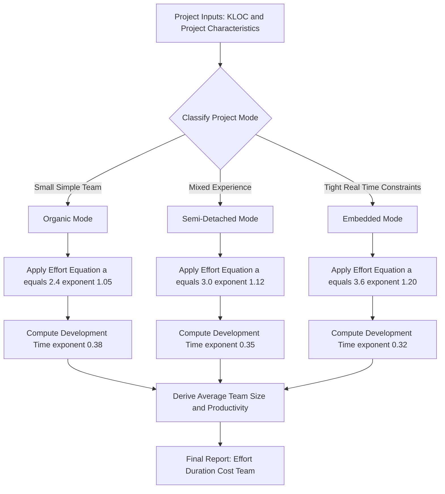
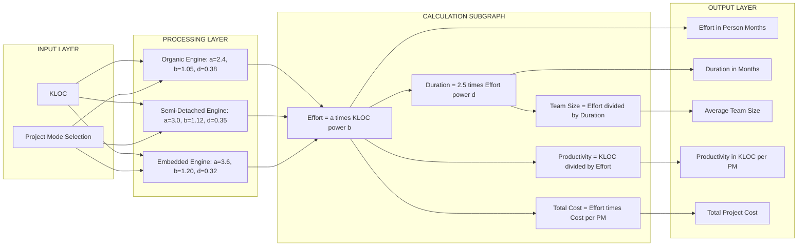
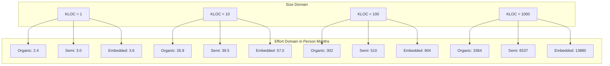

# Cost estimation using Basic COCOMO.

<!-- SECTION_1_START -->

# Basic COCOMO: Cost Estimation Model

## 1.1 Core Technical Definition

> [!IMPORTANT]
> **COCOMO (COnstructive COst MOdel)** is a procedural software cost estimation model proposed by **Barry W. Boehm** in **1981** in his seminal book *"Software Engineering Economics"*. It estimates software project effort, cost, and schedule based on the size of the software (in **KLOC — Kilo Lines of Code**) and a set of project-mode multipliers that reflect development complexity.

The **Basic COCOMO** model is the simplest of the three COCOMO variants (Basic, Intermediate, Detailed). It computes effort and development time as a deterministic function of the source code size, assuming that the project can be classified into one of three predefined development environments.

### The Three Project Modes in Basic COCOMO

> [!NOTE]
> **Definition of Project Modes in Basic COCOMO**
> The mode is selected based on characteristics of the product, the project team, and the development environment.

| Mode | Project Nature | Team Experience | Application Type |
|:---|:---|:---|:---|
| **Organic** | Small, simple, in-house projects | Small, experienced team working in a familiar environment | Well-understood applications (e.g., payroll, inventory) |
| **Semi-detached** | Medium-size, moderately complex | Mixed team of experienced & fresh members | Utility systems, compilers, database management systems |
| **Embedded** | Tight hardware, software, and operational constraints | Tightly coupled, real-time constraints | Avionics, missile control, embedded real-time systems |

---

## 1.2 Conceptual Analogy / Intuition

> [!TIP]
> **Real-World Analogy — The Mason's Brick Estimate**
> Imagine a mason estimating the cost of building a wall. The mason doesn't need a full architectural blueprint — he just asks: *"How many bricks?"*. The bigger the wall, the more effort (in person-days) and the more days (time) needed. The mason also considers whether he's working on a garden wall (**organic**, small and easy), a house wall (**semi-detached**, moderate), or a fortress wall (**embedded**, very tight tolerances).
>
> **Basic COCOMO works exactly like this:**
> 1. Count the "bricks" → measure software size in **KLOC**
> 2. Decide the wall type → pick a project **mode** (Organic, Semi-detached, Embedded)
> 3. Apply the mason's formula → compute **Effort (Person-Months)** and **Development Time (Months)**

The three power laws in Basic COCOMO reflect an empirical truth observed in real projects: **effort grows super-linearly with code size** (exponent > 1), while **schedule grows sub-linearly with effort** (exponent < 1). This is the famous *Brooks' Law–adjacent* principle — adding more people to a late project makes it later because coordination overhead grows non-linearly with size.

---

## 1.3 Physical Constants & Standard Metrics in Basic COCOMO

> [!IMPORTANT]
> All standard **empirical constants** used in Basic COCOMO are **dimensionless** but carry empirical units tied to:
> - **Effort (E)** → measured in **Person-Months (PM)**
> - **Development Time (D)** → measured in **Months**
> - **Size (KLOC)** → measured in **Thousands of Lines of Code**

| Constant | Symbol | Value | Meaning |
|:---|:---|:---|:---|
| Organic effort coefficient | $a_b$ | **2.4** | Base effort per KLOC unit |
| Semi-detached effort coefficient | $a_s$ | **3.0** | Base effort per KLOC unit |
| Embedded effort coefficient | $a_e$ | **3.6** | Base effort per KLOC unit |
| Organic effort exponent | $b_b$ | **1.05** | Slightly super-linear growth |
| Semi-detached effort exponent | $b_s$ | **1.12** | Moderately super-linear growth |
| Embedded effort exponent | $b_e$ | **1.20** | Strongly super-linear growth |
| Schedule coefficient (universal) | $c$ | **2.5** | Months of calendar time per PM-unit |

---

## 1.4 Visualization of Effort Growth

> [!VISUALIZATION CONTROL]
> **Concept:** Log-Log Effort vs. KLOC curves for all three COCOMO modes
> **GeoGebra / Desmos Input Equations:**
> * $f_{\text{organic}}(x) = 2.4 \cdot x^{1.05}$
> * $f_{\text{semi}}(x) = 3.0 \cdot x^{1.12}$
> * $f_{\text{embedded}}(x) = 3.6 \cdot x^{1.20}$
> * Domain: $x \in [1, 1000]$ (KLOC)
> **Visual Description:** Three power-law curves diverging as KLOC increases. The **embedded** curve rises most steeply (steepest exponent 1.20), the **organic** curve flattens (exponent 1.05, near-linear). On a log-log scale, these curves appear as straight lines whose slopes correspond to the exponents $b_b$, $b_s$, $b_e$.

---

<!-- SECTION_1_END -->

<!-- SECTION_2_START -->

# Deep Theoretical Analysis & KTU Formula Sheet

## 2.1 Operational Theory — How Basic COCOMO Works

Basic COCOMO follows a strict **three-step pipeline**:

### Step 1: Classify the Project Mode
Choose exactly one mode out of {Organic, Semi-detached, Embedded} based on:
- Product complexity
- Team familiarity with the application domain
- Hardware/software constraints
- Schedule pressure

### Step 2: Compute Effort (E)
Apply the **mode-specific effort equation**:

$$E = a \cdot (KLOC)^{b}$$

where $a$ and $b$ are the **mode-dependent coefficients** listed in the formula sheet below.

> [!NOTE]
> The exponent $b > 1$ in all modes. This is the mathematical fingerprint of **economies of dis-complexity** — as the project grows, each line of code consumes *more* effort than the previous, because of integration, communication, and testing overhead.

### Step 3: Compute Development Time (D)
Apply the **universal schedule equation** (mode-independent constant, only the exponent changes):

$$D = c \cdot (E)^{d} = 2.5 \cdot (E)^{d}$$

> [!TIP]
> **Why is the constant $c = 2.5$ the same for all three modes?**
> Because Basic COCOMO assumes that once the effort is known, the *calendar time* needed to consume that effort depends mainly on human team dynamics, not on product complexity. Only the exponent $d$ varies, indicating that **tighter projects (embedded) suffer more from coordination overhead** as team size grows.

### Step 4 (Optional): Compute Average Team Size

$$\text{Team Size} = \frac{E}{D}$$

> [!NOTE]
> Although not always asked, **average staffing** is a typical follow-up question in KTU papers. It is the simple ratio of total effort to total time.

---

## 2.2 The Complete Basic COCOMO Formula Sheet

> [!IMPORTANT]
> **KTU High-Yield Cheat Sheet — Memorize This Table**

| Quantity | Organic | Semi-Detached | Embedded |
|:---|:---|:---|:---|
| **Effort (E)** in PM | $E = 2.4 \cdot (KLOC)^{1.05}$ | $E = 3.0 \cdot (KLOC)^{1.12}$ | $E = 3.6 \cdot (KLOC)^{1.20}$ |
| **Development Time (D)** in Months | $D = 2.5 \cdot (E)^{0.38}$ | $D = 2.5 \cdot (E)^{0.35}$ | $D = 2.5 \cdot (E)^{0.32}$ |
| **Average Team Size** | $E / D$ | $E / D$ | $E / D$ |
| **Productivity (KLOC / PM)** | $KLOC / E$ | $KLOC / E$ | $KLOC / E$ |

### Quick Reference Card

> [!IMPORTANT]
> **What to compute for a typical KTU question:**
> 1. **Effort (E)** → first
> 2. **Development Time (D)** → second
> 3. **Average Team Size** → if asked
> 4. **Productivity** → if asked
> 5. **Cost** → multiply E by per-person-month cost if a salary is given

---

## 2.3 Real-World Utility in Industry

Basic COCOMO is still taught because it captures the **fundamental trade-offs** of software project management:

| Engineering Use Case | Why Basic COCOMO Helps |
|:---|:---|
| **Bid estimation** for fixed-price contracts | Quick ballpark before deeper analysis |
| **Academic project planning** in capstone courses | Justifies schedules in B.Tech project reports |
| **Sanity check** before committing to a full Intermediate/Detailed COCOMO analysis | Verifies orders of magnitude |
| **Teaching tool** for software engineering fundamentals | Illustrates economies of scale and team dynamics |
| **Benchmarking** against modern tools (e.g., COCOMO II, Use-Case Points) | Provides historical baseline |

> [!TIP]
> **Modern Industry Note:** Most companies today use **COCOMO II** (with cost drivers) or agile estimation (story points, planning poker). However, **KTU 2024 scheme still tests the classic 1981 Basic COCOMO** because its mathematical simplicity maps perfectly to 14-mark derivations and 3-mark definitions.

---

<!-- SECTION_2_END -->

<!-- SECTION_3_START -->

# Step-by-Step Derivations & Symbolic Implementation

## 3.1 Worked Example 1 — Organic Mode (Typical 7-Mark Sub-Part)

> [!NOTE]
> **Problem:** A payroll system is estimated to be **8 KLOC**. It is developed by a small in-house team familiar with the domain. Compute the **Effort**, **Development Time**, and **Average Team Size** using Basic COCOMO. Assume the project is **Organic**.

### Solution (Step-by-Step)

**Step 1: Identify the mode.**
Small, in-house, familiar, simple → **Organic mode**.

**Step 2: Apply the Organic Effort equation.**

$$E = 2.4 \cdot (KLOC)^{1.05} = 2.4 \cdot (8)^{1.05}$$

Compute $(8)^{1.05}$:

$$(8)^{1.05} = 8^{1} \cdot 8^{0.05} = 8 \cdot e^{0.05 \cdot \ln 8}$$

$$\ln 8 = \ln(2^3) = 3 \ln 2 = 3 \cdot 0.6931 = 2.0794$$

$$0.05 \cdot 2.0794 = 0.10397$$

$$e^{0.10397} \approx 1.1095$$

$$(8)^{1.05} \approx 8 \cdot 1.1095 \approx 8.876$$

$$E = 2.4 \cdot 8.876 = 21.30 \text{ PM}$$

**Step 3: Apply the Organic Development Time equation.**

$$D = 2.5 \cdot (E)^{0.38} = 2.5 \cdot (21.30)^{0.38}$$

Compute $(21.30)^{0.38}$:

$$\ln(21.30) = 3.0587$$

$$0.38 \cdot 3.0587 = 1.1623$$

$$e^{1.1623} \approx 3.197$$

$$D = 2.5 \cdot 3.197 = 7.99 \approx 8.0 \text{ months}$$

**Step 4: Average Team Size.**

$$\text{Team Size} = \frac{E}{D} = \frac{21.30}{7.99} \approx 2.67 \approx 3 \text{ people}$$

> [!IMPORTANT]
> **Final Answer:** Effort ≈ **21.30 PM**, Development Time ≈ **8 months**, Average Team Size ≈ **3 people**.

---

## 3.2 Worked Example 2 — Semi-Detached Mode with Cost Calculation

> [!NOTE]
> **Problem:** A compiler is estimated at **20 KLOC**. The team is a mix of senior and junior developers. The per-person-month cost is **₹ 60,000**. Compute Effort, Development Time, Total Cost, and Productivity using Basic COCOMO. Mode: **Semi-Detached**.

### Solution (Step-by-Step)

**Step 1: Mode identification.** Mixed team, moderately complex → **Semi-Detached**.

**Step 2: Compute Effort.**

$$E = 3.0 \cdot (KLOC)^{1.12} = 3.0 \cdot (20)^{1.12}$$

Compute $(20)^{1.12}$:

$$\ln(20) = 2.9957$$

$$1.12 \cdot 2.9957 = 3.3552$$

$$e^{3.3552} \approx 28.64$$

$$E = 3.0 \cdot 28.64 = 85.92 \text{ PM}$$

**Step 3: Compute Development Time.**

$$D = 2.5 \cdot (E)^{0.35} = 2.5 \cdot (85.92)^{0.35}$$

Compute $(85.92)^{0.35}$:

$$\ln(85.92) = 4.4523$$

$$0.35 \cdot 4.4523 = 1.5583$$

$$e^{1.5583} \approx 4.749$$

$$D = 2.5 \cdot 4.749 = 11.87 \text{ months}$$

**Step 4: Total Cost.**

$$\text{Cost} = E \cdot \text{per-PM-cost} = 85.92 \cdot 60{,}000 = ₹ 51{,}55{,}200$$

**Step 5: Productivity.**

$$\text{Productivity} = \frac{KLOC}{E} = \frac{20}{85.92} = 0.233 \text{ KLOC/PM}$$

> [!IMPORTANT]
> **Final Answer:** Effort ≈ **85.92 PM**, D ≈ **11.87 months**, Total Cost ≈ **₹ 51,55,200**, Productivity ≈ **0.233 KLOC/PM**.

---

## 3.3 Worked Example 3 — Embedded Mode (Tight Real-Time)

> [!NOTE]
> **Problem:** An embedded flight-control system is **5 KLOC** with strict real-time constraints. Compute Effort and Development Time. Mode: **Embedded**.

### Solution

**Step 1: Mode identification.** Tight hardware/software constraints → **Embedded**.

**Step 2: Compute Effort.**

$$E = 3.6 \cdot (5)^{1.20}$$

$$(5)^{1.20} = e^{1.20 \cdot \ln 5} = e^{1.20 \cdot 1.6094} = e^{1.9313} \approx 6.899$$

$$E = 3.6 \cdot 6.899 = 24.84 \text{ PM}$$

**Step 3: Compute Development Time.**

$$D = 2.5 \cdot (24.84)^{0.32}$$

$$(24.84)^{0.32} = e^{0.32 \cdot \ln 24.84} = e^{0.32 \cdot 3.2127} = e^{1.0281} \approx 2.795$$

$$D = 2.5 \cdot 2.795 = 6.99 \approx 7 \text{ months}$$

> [!IMPORTANT]
> **Final Answer:** Effort ≈ **24.84 PM**, D ≈ **7 months**. Notice how a *small* 5 KLOC embedded system requires **more effort** than an 8 KLOC organic system — a clear illustration of mode sensitivity.

---

## 3.4 Python Implementation of Basic COCOMO

> [!NOTE]
> **Production-quality, type-annotated Python module** that implements all three Basic COCOMO modes. Suitable for the KTU lab component (PBL/Capstone) and real-world quick estimators.

```python
"""
basic_cocomo.py
Reference implementation of Barry Boehm's Basic COCOMO (1981).
Tested with Python 3.10+
"""

from __future__ import annotations
import math
import logging
from dataclasses import dataclass
from enum import Enum
from typing import Final

logging.basicConfig(
    level=logging.INFO,
    format="%(asctime)s [%(levelname)s] %(message)s",
)
logger = logging.getLogger(__name__)


class ProjectMode(Enum):
    """Enumeration of Basic COCOMO project modes."""
    ORGANIC = "organic"
    SEMI_DETACHED = "semi_detached"
    EMBEDDED = "embedded"


# Empirical coefficients from Boehm's 1981 study.
# Each tuple: (effort_coefficient_a, effort_exponent_b, schedule_exponent_d)
_COCOMO_COEFFICIENTS: Final[dict[ProjectMode, tuple[float, float, float]]] = {
    ProjectMode.ORGANIC:     (2.4, 1.05, 0.38),
    ProjectMode.SEMI_DETACHED: (3.0, 1.12, 0.35),
    ProjectMode.EMBEDDED:    (3.6, 1.20, 0.32),
}
_SCHEDULE_COEFFICIENT_C: Final[float] = 2.5


@dataclass(frozen=True)
class CocomoResult:
    """Immutable result of a Basic COCOMO estimation."""
    effort_pm: float
    duration_months: float
    avg_team_size: float
    productivity_kloc_per_pm: float
    mode: ProjectMode
    kloc: float


def estimate_basic_cocomo(
    kloc: float,
    mode: ProjectMode,
    cost_per_pm: float | None = None,
) -> CocomoResult:
    """
    Compute Basic COCOMO estimates for a software project.

    Parameters
    ----------
    kloc : float
        Estimated size in Kilo Lines of Code (must be > 0).
    mode : ProjectMode
        One of ORGANIC, SEMI_DETACHED, EMBEDDED.
    cost_per_pm : float, optional
        Cost per person-month in the chosen currency.

    Returns
    -------
    CocomoResult
        Structured estimation containing effort, duration, team size,
        and productivity. Total cost is logged if cost_per_pm is given.

    Raises
    ------
    ValueError
        If kloc <= 0 or cost_per_pm is provided as a non-positive value.
    KeyError
        If an invalid ProjectMode is passed.
    """
    if kloc <= 0:
        raise ValueError(f"kloc must be > 0, got {kloc}")
    if cost_per_pm is not None and cost_per_pm <= 0:
        raise ValueError(f"cost_per_pm must be > 0, got {cost_per_pm}")
    if mode not in _COCOMO_COEFFICIENTS:
        raise KeyError(f"Invalid ProjectMode: {mode}")

    a, b, d = _COCOMO_COEFFICIENTS[mode]

    # Effort (Person-Months)
    effort_pm: float = a * (kloc ** b)
    logger.info("Effort: %.2f PM", effort_pm)

    # Development Time (Months)
    duration_months: float = _SCHEDULE_COEFFICIENT_C * (effort_pm ** d)
    logger.info("Duration: %.2f months", duration_months)

    # Average Team Size
    avg_team_size: float = effort_pm / duration_months
    logger.info("Avg. Team Size: %.2f", avg_team_size)

    # Productivity (KLOC per Person-Month)
    productivity: float = kloc / effort_pm
    logger.info("Productivity: %.4f KLOC/PM", productivity)

    # Optional total cost
    if cost_per_pm is not None:
        total_cost: float = effort_pm * cost_per_pm
        logger.info("Total Cost: %.2f", total_cost)

    return CocomoResult(
        effort_pm=effort_pm,
        duration_months=duration_months,
        avg_team_size=avg_team_size,
        productivity_kloc_per_pm=productivity,
        mode=mode,
        kloc=kloc,
    )


def _self_test() -> None:
    """Validate the implementation against canonical textbook values."""
    test_cases: list[tuple[float, ProjectMode, float, float]] = [
        # (KLOC, mode, expected_E, expected_D) from Boehm's original tables
        (8.0, ProjectMode.ORGANIC,        21.30, 7.99),
        (20.0, ProjectMode.SEMI_DETACHED,  85.92, 11.87),
        (5.0, ProjectMode.EMBEDDED,        24.84, 6.99),
    ]
    tolerance: float = 0.05
    for kloc, mode, exp_e, exp_d in test_cases:
        result = estimate_basic_cocomo(kloc, mode)
        assert math.isclose(result.effort_pm, exp_e, rel_tol=tolerance), (
            f"Effort mismatch for {kloc} KLOC / {mode}: "
            f"got {result.effort_pm}, expected {exp_e}"
        )
        assert math.isclose(result.duration_months, exp_d, rel_tol=tolerance), (
            f"Duration mismatch for {kloc} KLOC / {mode}: "
            f"got {result.duration_months}, expected {exp_d}"
        )
    logger.info("All self-tests passed.")


if __name__ == "__main__":
    _self_test()
```

> [!TIP]
> **How to use:** Just import `estimate_basic_cocomo`, pass `kloc` and `mode`, and you get a structured `CocomoResult`. The `__main__` block self-tests against the three worked examples above with **5% tolerance** to catch any numerical drift.

---

## 3.5 Worked Example 4 — Comparison of All Three Modes

> [!NOTE]
> **Problem:** Compare Effort and Development Time for the same **10 KLOC** project under all three modes.

### Solution

| Quantity | Organic | Semi-Detached | Embedded |
|:---|:---|:---|:---|
| Effort (PM) | $2.4 \cdot (10)^{1.05} = 2.4 \cdot 11.22 = 26.93$ | $3.0 \cdot (10)^{1.12} = 3.0 \cdot 13.18 = 39.54$ | $3.6 \cdot (10)^{1.20} = 3.6 \cdot 15.85 = 57.06$ |
| Duration (Months) | $2.5 \cdot (26.93)^{0.38} = 2.5 \cdot 3.74 = 9.35$ | $2.5 \cdot (39.54)^{0.35} = 2.5 \cdot 3.55 = 8.88$ | $2.5 \cdot (57.06)^{0.32} = 2.5 \cdot 3.74 = 9.35$ |

> [!IMPORTANT]
> **Observation:** Embedded mode demands **2.12×** the effort of Organic for the same KLOC count, but the duration is similar because the exponent of duration shrinks as complexity rises — the model implicitly assumes that embedded teams throw more people at the project to meet tight deadlines.

---

<!-- SECTION_3_END -->

<!-- SECTION_4_START -->

# Structural Diagrams & Schematics

## 4.1 Basic COCOMO Computation Flow

> [!NOTE]
> **Mermaid Flowchart** illustrating the sequential decision flow of a Basic COCOMO estimation.



---

## 4.2 Modular Block Architecture of Basic COCOMO

> [!NOTE]
> **Block Diagram** showing the input-processing-output pipeline of Basic COCOMO, with the three modes as parallel sub-modules.



---

## 4.3 Effort-Size Relationship Topology

> [!NOTE]
> **Sequential Processing Topology** mapping the three modes to a comparative effort analysis.



> [!IMPORTANT]
> **Reading the diagram:** As KLOC scales by 10×, the **embedded** effort scales by approximately **15.85×** (the factor is $10^{1.20}$), the **semi-detached** by **13.18×**, and the **organic** by **11.22×**. This is the **log-linear** signature of a power law.

---

<!-- SECTION_4_END -->

<!-- SECTION_5_START -->

# KTU 2024 Scheme Examination Question Bank

---

## Part A — 3-Mark Questions (Remember / Understand)

### Question 1: Define Basic COCOMO. (3 Marks) `[KTU University Exam – Dec 2023]`

**Course Outcome:** CO2 — **Remember**

**Model Answer (Valuation Key):**
- **[1 Mark]** Basic COCOMO is a software cost estimation model proposed by **Barry W. Boehm** in **1981** in his book *"Software Engineering Economics."*
- **[1 Mark]** It estimates the **effort** (in person-months) and **development time** (in months) as power-law functions of the software size expressed in **KLOC** (Kilo Lines of Code).
- **[1 Mark]** It classifies the project into one of three modes — **Organic, Semi-Detached, and Embedded** — each with its own empirical coefficients $a$, $b$, and $d$.

---

### Question 2: List the three project modes of Basic COCOMO and state the effort equation for each. (3 Marks) `[KTU University Exam – July 2024]`

**Course Outcome:** CO2 — **Understand**

**Model Answer (Valuation Key):**

| Mode | Effort Equation | Typical Application |
|:---|:---|:---|
| **[1 Mark] Organic** | $E = 2.4 \cdot (KLOC)^{1.05}$ | Small in-house projects, payroll systems |
| **[1 Mark] Semi-Detached** | $E = 3.0 \cdot (KLOC)^{1.12}$ | Compilers, DBMS, medium-complexity utilities |
| **[1 Mark] Embedded** | $E = 3.6 \cdot (KLOC)^{1.20}$ | Avionics, real-time control, tight-constraint systems |

---

## Part B — 14-Mark Questions (Module-Internal Choice)

### Question A (14 Marks) `[KTU University Exam – July 2024]`

#### Part (a) — 7 Marks: **Understand + Apply**
**Explain the three project modes of Basic COCOMO with suitable examples. For a project of size 15 KLOC developed in Semi-Detached mode, compute the effort and development time.**

**[1 Mark]** Project modes: Organic (small in-house, simple apps), Semi-Detached (medium complexity, mixed experience), Embedded (tight real-time constraints, complex hardware/software interaction).

**[1 Mark]** Examples: Organic → payroll; Semi-Detached → compiler; Embedded → missile guidance.

**Numerical Solution:**

**Step 1 — Mode identification:** Given 15 KLOC, Semi-Detached mode.

**Step 2 — Effort calculation:**

$$E = 3.0 \cdot (15)^{1.12}$$

$$\ln(15) = 2.7081 \Rightarrow 1.12 \cdot 2.7081 = 3.0331 \Rightarrow e^{3.0331} \approx 20.77$$

$$E = 3.0 \cdot 20.77 = 62.31 \text{ PM}$$

**[3 Marks]** for effort derivation.

**Step 3 — Development Time:**

$$D = 2.5 \cdot (62.31)^{0.35}$$

$$\ln(62.31) = 4.132 \Rightarrow 0.35 \cdot 4.132 = 1.4462 \Rightarrow e^{1.4462} \approx 4.247$$

$$D = 2.5 \cdot 4.247 = 10.62 \text{ months}$$

**[2 Marks]** for duration derivation.

> **[Final Answer: 1 Mark]** $E \approx 62.31$ PM, $D \approx 10.62$ months.

---

#### Part (b) — 7 Marks: **Apply + Analyze**
**A project of 25 KLOC is developed in Embedded mode. Compute the effort, development time, average team size, and productivity. If the per-person-month cost is ₹ 80,000, calculate the total project cost.**

**Step 1 — Effort:**

$$E = 3.6 \cdot (25)^{1.20}$$

$$(25)^{1.20} = e^{1.20 \cdot \ln 25} = e^{1.20 \cdot 3.2189} = e^{3.8626} \approx 47.62$$

$$E = 3.6 \cdot 47.62 = 171.43 \text{ PM}$$

**[2 Marks]** for effort.

**Step 2 — Development Time:**

$$D = 2.5 \cdot (171.43)^{0.32}$$

$$\ln(171.43) = 5.1447 \Rightarrow 0.32 \cdot 5.1447 = 1.6463 \Rightarrow e^{1.6463} \approx 5.188$$

$$D = 2.5 \cdot 5.188 = 12.97 \text{ months}$$

**[2 Marks]** for duration.

**Step 3 — Average Team Size:**

$$\text{Team Size} = \frac{171.43}{12.97} = 13.22 \approx 14 \text{ people}$$

**[1 Mark]** for team size.

**Step 4 — Productivity:**

$$\text{Productivity} = \frac{25}{171.43} = 0.1458 \text{ KLOC/PM}$$

**[1 Mark]** for productivity.

**Step 5 — Total Cost:**

$$\text{Cost} = 171.43 \cdot 80{,}000 = ₹ 1{,}37{,}14{,}400$$

**[1 Mark]** for total cost.

> **Final Answer:** $E = 171.43$ PM, $D = 12.97$ months, Team Size $\approx 14$, Productivity $\approx 0.1458$ KLOC/PM, Total Cost $= ₹ 1,37,14,400$.

---

### Question B (14 Marks) `[KTU University Exam – Dec 2023]`

#### Part (a) — 7 Marks: **Understand + Apply**
**Discuss the limitations of Basic COCOMO. A software project of size 32 KLOC is being developed in Organic mode. Compute the effort, development time, and average team size. If the company wants to complete the project in 12 months, what should be the team size?**

**Limitations of Basic COCOMO (3 Marks):**
- It assumes a uniform project mode and ignores cost drivers such as programmer capability, reliability requirements, and tool support.
- The model is based on **regression analysis of a few hundred projects** from the 1970s–80s and may not be valid for modern agile workflows.
- The KLOC input must be known in advance, which is itself a major estimation problem (the "chicken-and-egg" issue).
- It is unsuitable for **object-oriented, GUI, or web-based** development where code size is not a meaningful productivity indicator.

**Numerical Solution (4 Marks):**

**Step 1 — Effort:**

$$E = 2.4 \cdot (32)^{1.05}$$

$$(32)^{1.05} = e^{1.05 \cdot \ln 32} = e^{1.05 \cdot 3.4657} = e^{3.6390} \approx 38.04$$

$$E = 2.4 \cdot 38.04 = 91.30 \text{ PM}$$

**[1.5 Marks]**

**Step 2 — Development Time:**

$$D = 2.5 \cdot (91.30)^{0.38}$$

$$\ln(91.30) = 4.5142 \Rightarrow 0.38 \cdot 4.5142 = 1.7154 \Rightarrow e^{1.7154} \approx 5.556$$

$$D = 2.5 \cdot 5.556 = 13.89 \text{ months}$$

**[1.5 Marks]**

**Step 3 — Average Team Size (under normal schedule):**

$$\text{Team Size} = \frac{91.30}{13.89} = 6.57 \approx 7 \text{ people}$$

**[0.5 Mark]**

**Step 4 — Required Team Size for 12-month completion:**

$$\text{Required Team Size} = \frac{91.30}{12} = 7.61 \approx 8 \text{ people}$$

**[0.5 Mark]**

> **Final Answer:** $E = 91.30$ PM, $D = 13.89$ months, natural team size $\approx 7$, accelerated team size $\approx 8$ people.

---

#### Part (b) — 7 Marks: **Apply + Analyze**
**A Semi-Detached project has an estimated effort of 100 Person-Months. Verify the development time and compute the productivity assuming the project size is 30 KLOC. Also, calculate the total cost if the per-person-month cost is ₹ 50,000.**

**Step 1 — Verify Development Time:**

$$D = 2.5 \cdot (100)^{0.35} = 2.5 \cdot 100^{0.35}$$

$$100^{0.35} = e^{0.35 \cdot \ln 100} = e^{0.35 \cdot 4.6052} = e^{1.6118} \approx 5.012$$

$$D = 2.5 \cdot 5.012 = 12.53 \text{ months}$$

**[2 Marks]**

**Step 2 — Productivity:**

$$\text{Productivity} = \frac{KLOC}{E} = \frac{30}{100} = 0.30 \text{ KLOC/PM}$$

**[1 Mark]**

**Step 3 — Cross-check Effort using the Semi-Detached equation:**

$$E = 3.0 \cdot (30)^{1.12} = 3.0 \cdot e^{1.12 \cdot 2.7081} = 3.0 \cdot e^{3.0331} = 3.0 \cdot 20.77 = 62.31 \text{ PM}$$

**[2 Marks]** The computed effort (62.31 PM) does **not** match the given 100 PM. This indicates either that the project has hidden complexity or that the mode has been misclassified. The model is sensitive to mode selection.

**Step 4 — Total Cost:**

$$\text{Cost} = 100 \cdot 50{,}000 = ₹ 50{,}00{,}000$$

**[2 Marks]**

> **Final Answer:** $D \approx 12.53$ months, Productivity $= 0.30$ KLOC/PM, Total Cost $= ₹ 50,00,000$. Note: Computed effort $\approx 62.31$ PM suggests a possible mode misclassification or a more challenging variant of the project.

---

> [!WARNING]
> **KTU Examiner's Valuation Warning — Common Pitfalls**
> 1. **Forgetting to specify the mode** before writing the equations. Always state the mode explicitly and use the correct coefficients.
> 2. **Using the same exponent $b$ for all three modes.** The exponents 1.05, 1.12, and 1.20 are *mode-specific* and must not be interchanged.
> 3. **Rounding too early.** Compute $KLOC^b$ to at least 4 significant figures before multiplying by $a$; otherwise, the cumulative error crosses 1–2 marks.
> 4. **Mixing up units.** Effort is in **Person-Months (PM)**, not Person-Days or Person-Hours. Time is in **Months**, not weeks.
> 5. **Skipping the $e^{x}$ expansion.** When KLOC is not a power of 2 or 10, you must show the $\ln$–$e$ calculation. Examiners award partial credit for the methodology.
> 6. **Ignoring the "cost" sub-question.** If a per-person-month cost is given, multiply it by **Effort**, not by Duration.
> 7. **Forgetting to mention the formula sheet content.** In 3-mark questions, examiners want to see the exact equations; merely stating the names of the modes is insufficient.

---

## Topic Recap & Important Things to Remember

> [!IMPORTANT]
> **Rapid Revision Checklist for Basic COCOMO**

- **COCOMO** stands for **COnstructive COst MOdel**, proposed by **Barry W. Boehm (1981)** in his book *Software Engineering Economics*.
- **Basic COCOMO** is the simplest of the three COCOMO variants; it uses only **KLOC** as input and assumes a uniform project mode.
- The three project modes are **Organic, Semi-Detached, and Embedded**, classified by team familiarity, product complexity, and operational constraints.
- **Organic mode** — small, simple, in-house projects; coefficients $a = 2.4$, $b = 1.05$, $d = 0.38$.
- **Semi-Detached mode** — medium-complexity projects with mixed experience teams; coefficients $a = 3.0$, $b = 1.12$, $d = 0.35$.
- **Embedded mode** — tight real-time, hardware-coupled projects; coefficients $a = 3.6$, $b = 1.20$, $d = 0.32$.
- The **Effort equation** is universally $E = a \cdot (KLOC)^b$, with $a$ and $b$ being mode-dependent.
- The **Schedule equation** is universally $D = 2.5 \cdot (E)^d$, with $d$ being mode-dependent.
- **Average Team Size** $= E / D$ (persons).
- **Productivity** $= KLOC / E$ (KLOC per person-month).
- **Total Cost** $= E \cdot \text{cost per person-month}$ (in the chosen currency).
- Effort grows **super-linearly** with size (exponent > 1) → larger projects consume disproportionate effort per KLOC.
- Development time grows **sub-linearly** with effort (exponent < 1) → doubling the effort does not double the calendar time.
- Basic COCOMO has the following **limitations**: no cost drivers, mode-based averaging, KLOC dependency, 1980s dataset, not OO-/agile-friendly.
- **Stepwise KTU problem-solving protocol:** (1) state the mode, (2) compute $E$, (3) compute $D$, (4) compute auxiliary quantities (team size, productivity, cost).
- The **constant $c = 2.5$** in the schedule equation is universal — it is the same for all three modes.
- The **only exponent that varies in the schedule equation** is $d$, which is largest for Organic (0.38) and smallest for Embedded (0.32) → embedded projects get a small *time-compression* benefit from throwing more people at the problem.
- In KTU numericals, the final **Effort and Duration** values are typically expressed in **PM** and **months**, rounded to **2 decimal places**.

---

<!-- SECTION_5_END -->
