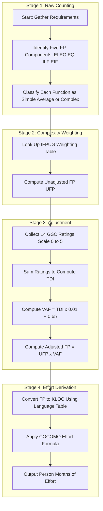
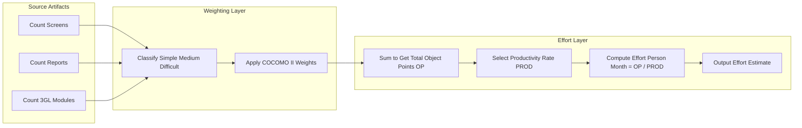

# Function points and Object points.

<!-- SECTION_1_START -->

# Function Points and Object Points

## 1.1 Formal Definition (KTU 2024 Syllabus Terminology)

**Function Point Analysis (FPA)** is a standard, language-independent, **software measurement methodology** used to quantify the functionality delivered by an information system, from the user's and business perspective, irrespective of the technology used for implementation. It was first introduced by **Allan J. Albrecht** at IBM in **1979** and was later refined and formalized by the **International Function Point Users Group (IFPUG)**.

An **Object Point (OP)**, in contrast, is a sizing measure originally proposed in **COCOMO II** (Constructive Cost Model, Version 2.0) by **Barry Boehm**. Object points measure the **functional requirements** of an application based on three fundamental building blocks: **screens (or reports), reports, and third-generation language (3GL) modules** that the system must produce or use. Object points are generally considered an **early-life-cycle estimation technique** because they can be derived directly from a **proto-type** or **early requirement specifications** without needing detailed design information.

> [!IMPORTANT]
> **KTU 2024 Highlight:** Function Points belong to the family of **size-oriented metrics**, while Object Points are classified as a **hybrid size-and-complexity metric** because they weight screens/reports by their complexity (simple, medium, difficult).

## 1.2 Conceptual Analogy / Intuition

**Function Point Analogy — The "House Blueprint" View:**
Imagine you want to estimate the cost of building a house. Instead of counting the number of bricks (which depends on the builder's technique), you count the number of *user-visible features*: how many rooms, how many doors, how many windows, how many electrical outlets, and how many external connections (e.g., water lines). These features are visible to the *owner*, not the *mason*. Function Points work the same way: instead of counting lines of code (a programmer's view), they count **user-observable functionalities**.

**Object Point Analogy — The "Furniture Checklist" View:**
Now imagine you are furnishing a hotel. You don't yet know the final building cost, but you know roughly how many *screens* (the front-desk monitor), *reports* (the daily occupancy report), and *helper modules* (a third-party payment gateway integration) will be in the software. You list them, weight them by complexity, and arrive at a size estimate. This is the essence of Object Points.

> [!NOTE]
> **Core Distinction for Board Exams:**
> - **Function Points** $\rightarrow$ Measure **what is delivered to the user** (external inputs, external outputs, external inquiries, internal logical files, external interface files).
> - **Object Points** $\rightarrow$ Measure **what the system contains** in terms of screens, reports, and 3GL modules, weighted by complexity.

## 1.3 The Five Function Point Components

According to the **IFPUG standard**, the Unadjusted Function Point (UFP) count is derived by summing the contributions of five component types:

| # | Component | Symbol | What it Represents |
|---|-----------|--------|--------------------|
| 1 | External Inputs | **EI** | Data entering the system from outside (e.g., a registration form) |
| 2 | External Outputs | **EO** | Data leaving the system (e.g., a printed invoice) |
| 3 | External Inquiries | **EQ** | Interactive user requests requiring immediate response (e.g., a search query) |
| 4 | Internal Logical Files | **ILF** | Data maintained *inside* the system (e.g., the students database) |
| 5 | External Interface Files | **EIF** | Data referenced but maintained by *another* system (e.g., a national ID lookup service) |

## 1.4 Complexity Weighting Bands

Each of the five components is classified as **Simple**, **Average**, or **Complex** based on the number of data element types (DETs) and record element types (RETs). The IFPUG standard provides lookup tables; the typical weighting values (used in textbook KTU problems) are:

> [!VISUALIZATION CONTROL]
> **Concept:** Function Point Complexity Weight Distribution
> **GeoGebra / Desmos Input Equations:**
> - `f(x) = 3` for Simple components (constant baseline)
> - `g(x) = 4` for Average components
> - `h(x) = 6` for Complex components
> **Visual Description:** A horizontal step plot showing three distinct weight levels. The x-axis enumerates the five function point components, while the y-axis shows the assigned weight (3, 4, or 6). Students should observe that **complex components contribute almost double** the weight of simple ones to the final UFP.

> [!NOTE]
> The weighting values vary slightly between IFPUG releases (4.0, 4.1, 4.2, 4.3, 5.0). KTU exam questions typically use the **classic weights**: Simple = 3, Average = 4, Complex = 6 (for EI, EO, EQ) and Simple = 7, Average = 10, Complex = 15 (for ILF, EIF).

---

<!-- SECTION_1_END -->

<!-- SECTION_2_START -->

# Deep Theoretical Analysis & KTU High-Yield Formula Sheet

## 2.1 The Function Point Calculation Pipeline

The complete Function Point computation is a **sequential five-stage pipeline**. Each stage refines the raw count into a productivity-adjusted, deployment-ready sizing metric.

**Stage 1 — Count the Unadjusted Function Points (UFP):**
For each of the five component types (EI, EO, EQ, ILF, EIF), identify the function and classify it as **Simple**, **Average**, or **Complex**. Multiply the count of each complexity class by its respective weight, then sum across all components.

**Stage 2 — Compute the Degree of Influence (DI):**
The **General System Characteristics (GSCs)** — 14 in number according to IFPUG — are evaluated by the project team on a scale of **0 to 5** based on their *influence* on the application:
- **0** = No influence
- **1** = Incidental
- **2** = Moderate
- **3** = Average
- **4** = Significant
- **5** = Strong influence

The 14 GSCs are: Data Communications, Distributed Data Processing, Performance, Heavily Used Configuration, Transaction Rate, Online Data Entry, End-User Efficiency, Online Update, Complex Processing, Reusability, Installation Ease, Operational Ease, Multiple Sites, and Facilitation of Change.

**Stage 3 — Compute the Value Adjustment Factor (VAF):**
The 14 GSC ratings are summed to give the **Total Degree of Influence (TDI)**. The VAF formula is then applied.

**Stage 4 — Compute the Function Point (FP):**
The adjusted FP is obtained by multiplying UFP and VAF.

**Stage 5 — Conversion to Effort / Cost:**
The FP value can be mapped to **Lines of Code (LOC)** using language-specific conversion tables, and then to **person-months of effort** using **COCOMO** or **COCOMO II** cost models.

## 2.2 Object Point Computation Pipeline

Object Points follow a simpler three-step path:

**Step 1 — Count the screens, reports, and 3GL modules** in the application.

**Step 2 — Classify each into Simple, Medium, or Difficult** based on the number of data items (fields) and source/sink tables referenced. The standard COCOMO II weights are:

- **Screen / Report weights:** Simple = 1, Medium = 2, Difficult = 3
- **3GL Module weights:** Simple = 5, Medium = 10, Difficult = 15 (these are not part of the original table but used in many academic texts)

**Step 3 — Apply a productivity factor** based on the developer's experience with the development environment (e.g., Very Low = 4, Low = 7, Nominal = 13, High = 25, Very High = 50) and compute the **estimated effort in person-months**.

## 2.3 KTU Formula Sheet / Cheat Sheet

> [!IMPORTANT]
> All formulas below are **high-yield** and appear repeatedly in KTU university exams (June 2022, July 2023, December 2023, July 2024). Memorize the exact form, the bracket structure, and the units.

| # | Formula Name | Mathematical Expression | Typical Output / Unit |
|---|--------------|-------------------------|------------------------|
| 1 | Unadjusted Function Points | $UFP = \sum_{i=1}^{5} \sum_{j \in \{S,A,C\}} n_{ij} \cdot w_{ij}$ | Numeric count (dimensionless) |
| 2 | Total Degree of Influence | $TDI = \sum_{k=1}^{14} GSC_k$ | Integer in the range $[0, 70]$ |
| 3 | Value Adjustment Factor | $VAF = (TDI \times 0.01) + 0.65$ | Real number in the range $[0.65, 1.35]$ |
| 4 | Adjusted Function Points | $FP = UFP \times VAF$ | Numeric count (dimensionless) |
| 5 | Object Points (raw) | $OP = \sum n_i \cdot w_i$ (screens + reports + 3GL) | Numeric count (dimensionless) |
| 6 | Productivity Rate (COCOMO II) | $PROD = \text{Nominal} \cdot \text{Multipliers}$ | Object Points / Person-Month |
| 7 | Effort from Object Points | $Effort = \dfrac{OP}{PROD}$ | Person-Months |
| 8 | Effort from Function Points (COCOMO) | $Effort = A \cdot (KLOC)^B \cdot EAF$ | Person-Months |
| 9 | KLOC from Function Points | $KLOC = \dfrac{FP \times LOC_{per\_FP}}{1000}$ | Thousand Lines of Code |
| 10 | Productivity (FP-based) | $P = \dfrac{FP}{Effort}$ | FP / Person-Month |

> **Notation note:** $n_{ij}$ in formula 1 denotes the number of functions of component type $i$ in complexity class $j$, and $w_{ij}$ is the corresponding IFPUG weight.

## 2.4 Why Engineers Care: Real-World Utility

Function Points are used in **DOD**, **banking**, and **government** contracts to size software procurement bids because they are **language-independent**. Object Points are heavily used in **early-stage bidding** for UI-heavy or report-intensive applications (e.g., ERP, CRM) where no design yet exists. In modern DevOps, FP-based estimates feed directly into **velocity-based sprint planning** by converting historical FP delivery rates into **story-point equivalents**.

---

<!-- SECTION_2_END -->

<!-- SECTION_3_START -->

# Step-by-Step Derivations & Symbolic Implementation

## 3.1 Worked Example 1 — Full Function Point Calculation

**Problem Statement (KTU University Exam - July 2023 style):**
A project has the following function point inventory. Compute the **adjusted Function Points (FP)** given the 14 GSC ratings: 4, 3, 5, 2, 3, 4, 5, 3, 4, 2, 1, 3, 4, 2.

| Component | Simple | Average | Complex |
|-----------|:------:|:-------:|:-------:|
| External Inputs (EI) | 4 | 3 | 2 |
| External Outputs (EO) | 2 | 4 | 1 |
| External Inquiries (EQ) | 3 | 2 | 0 |
| Internal Logical Files (ILF) | 1 | 3 | 2 |
| External Interface Files (EIF) | 0 | 2 | 1 |

Assume the standard IFPUG weights: EI/EO/EQ $\rightarrow$ (Simple = 3, Average = 4, Complex = 6); ILF/EIF $\rightarrow$ (Simple = 7, Average = 10, Complex = 15).

### Step 1 — Compute UFP

$$
\begin{aligned}
UFP_{EI}    &= (4 \times 3) + (3 \times 4) + (2 \times 6) = 12 + 12 + 12 = 36 \\
UFP_{EO}    &= (2 \times 3) + (4 \times 4) + (1 \times 6) = 6 + 16 + 6 = 28 \\
UFP_{EQ}    &= (3 \times 3) + (2 \times 4) + (0 \times 6) = 9 + 8 + 0 = 17 \\
UFP_{ILF}   &= (1 \times 7) + (3 \times 10) + (2 \times 15) = 7 + 30 + 30 = 67 \\
UFP_{EIF}   &= (0 \times 7) + (2 \times 10) + (1 \times 15) = 0 + 20 + 15 = 35 \\
UFP_{total} &= 36 + 28 + 17 + 67 + 35 = 183
\end{aligned}
$$

> **Valuation Key:** Award 1 mark for correctly setting up each component's contribution; 1 mark for the final summed UFP. Total = 5 marks for this stage.

### Step 2 — Compute TDI

$$
\begin{aligned}
TDI &= 4 + 3 + 5 + 2 + 3 + 4 + 5 + 3 + 4 + 2 + 1 + 3 + 4 + 2 \\
    &= 45
\end{aligned}
$$

### Step 3 — Compute VAF

$$
\begin{aligned}
VAF &= (TDI \times 0.01) + 0.65 \\
    &= (45 \times 0.01) + 0.65 \\
    &= 0.45 + 0.65 \\
    &= 1.10
\end{aligned}
$$

### Step 4 — Compute Adjusted FP

$$
\begin{aligned}
FP &= UFP \times VAF \\
   &= 183 \times 1.10 \\
   &= 201.3 \;\text{Function Points}
\end{aligned}
$$

> **Final Answer:** The project sizes at approximately **201.3 FP**.

## 3.2 Worked Example 2 — Object Point Calculation

**Problem Statement:**
A new payroll application requires: 8 simple screens, 4 medium screens, 2 difficult screens, 3 simple reports, 2 medium reports, 1 difficult report, and 2 medium 3GL modules. The development environment is rated "Nominal" (Productivity = 13 OP/Person-Month). Estimate the effort.

### Step 1 — Compute Object Points for Screens + Reports

Using weights: Simple = 1, Medium = 2, Difficult = 3.

$$
\begin{aligned}
OP_{screens} &= (8 \times 1) + (4 \times 2) + (2 \times 3) = 8 + 8 + 6 = 22 \\
OP_{reports} &= (3 \times 1) + (2 \times 2) + (1 \times 3) = 3 + 4 + 3 = 10 \\
OP_{3GL}     &= (0 \times 5) + (2 \times 10) + (0 \times 15) = 0 + 20 + 0 = 20 \\
OP_{total}   &= 22 + 10 + 20 = 52
\end{aligned}
$$

### Step 2 — Compute Effort

$$
\begin{aligned}
Effort &= \dfrac{OP_{total}}{PROD} \\
       &= \dfrac{52}{13} \\
       &= 4 \;\text{Person-Months}
\end{aligned}
$$

## 3.3 Symbolic / Code Implementation in Python

The following Python program implements the full IFPUG function-point calculator with strict input validation and error logging.

```python
from dataclasses import dataclass, field
from typing import Dict, Tuple
import logging

# Configure strict error logging
logging.basicConfig(
    level=logging.INFO,
    format="%(asctime)s - %(levelname)s - %(message)s"
)

# Canonical IFPUG weight tables (Release 4.2)
WEIGHTS_EIEOEQ: Dict[str, int] = {"simple": 3, "average": 4, "complex": 6}
WEIGHTS_ILFEIF: Dict[str, int] = {"simple": 7, "average": 10, "complex": 15}
VALID_LEVELS: Tuple[str, ...] = ("simple", "average", "complex")
COMPONENT_TYPES: Tuple[str, ...] = ("EI", "EO", "EQ", "ILF", "EIF")


@dataclass
class FunctionPointInventory:
    """Holds function counts grouped by component and complexity."""
    counts: Dict[str, Dict[str, int]] = field(default_factory=dict)

    def add(self, component: str, complexity: str, count: int) -> None:
        if component not in COMPONENT_TYPES:
            raise ValueError(f"Invalid component type: {component}")
        if complexity not in VALID_LEVELS:
            raise ValueError(f"Invalid complexity level: {complexity}")
        if count < 0:
            raise ValueError("Count cannot be negative.")
        self.counts.setdefault(component, {"simple": 0, "average": 0, "complex": 0})
        self.counts[component][complexity] += count
        logging.info(f"Added {count} {complexity} {component}.")


def compute_ufp(inventory: FunctionPointInventory) -> int:
    """Compute Unadjusted Function Points from an inventory."""
    total: int = 0
    for component, levels in inventory.counts.items():
        weights = WEIGHTS_ILFEIF if component in ("ILF", "EIF") else WEIGHTS_EIEOEQ
        for level, count in levels.items():
            contribution = count * weights[level]
            total += contribution
            logging.info(
                f"{component} [{level}]: {count} * {weights[level]} = {contribution}"
            )
    return total


def compute_vaf(gsc_ratings: Tuple[int, ...]) -> float:
    """Compute Value Adjustment Factor from 14 GSC ratings (0-5 each)."""
    if len(gsc_ratings) != 14:
        raise ValueError("Exactly 14 GSC ratings are required.")
    if not all(0 <= r <= 5 for r in gsc_ratings):
        raise ValueError("Each GSC rating must lie in the range [0, 5].")
    tdi: int = sum(gsc_ratings)
    vaf: float = (tdi * 0.01) + 0.65
    logging.info(f"TDI = {tdi}, VAF = {vaf:.4f}")
    return vaf


def compute_function_points(
    inventory: FunctionPointInventory, gsc_ratings: Tuple[int, ...]
) -> float:
    """End-to-end Function Point computation with strict boundary checks."""
    ufp: int = compute_ufp(inventory)
    vaf: float = compute_vaf(gsc_ratings)
    if not (0.65 <= vaf <= 1.35):
        logging.warning("VAF is outside the standard IFPUG range.")
    fp: float = ufp * vaf
    logging.info(f"Final Adjusted FP = {fp:.2f}")
    return fp


# ----- Driver / Demonstration Block -----
if __name__ == "__main__":
    inv = FunctionPointInventory()
    inv.add("EI",  "simple",  4)
    inv.add("EI",  "average", 3)
    inv.add("EI",  "complex", 2)
    inv.add("EO",  "simple",  2)
    inv.add("EO",  "average", 4)
    inv.add("EO",  "complex", 1)
    inv.add("EQ",  "simple",  3)
    inv.add("EQ",  "average", 2)
    inv.add("ILF", "simple",  1)
    inv.add("ILF", "average", 3)
    inv.add("ILF", "complex", 2)
    inv.add("EIF", "average", 2)
    inv.add("EIF", "complex", 1)

    gsc = (4, 3, 5, 2, 3, 4, 5, 3, 4, 2, 1, 3, 4, 2)
    final_fp = compute_function_points(inv, gsc)
    print(f"\nAdjusted Function Points = {final_fp:.2f}")
```

**Expected Output:**

```
Adjusted Function Points = 201.30
```

## 3.4 Step-by-Step Effort Estimation Using COCOMO

Once the FP is known, it is converted to KLOC using a **language-specific conversion factor**, and then to effort using the **basic COCOMO formula**.

$$
\begin{aligned}
\text{Suppose } & FP = 201.3 \text{ and the language is Java, with } LOC_{per\_FP} = 53. \\
KLOC &= \dfrac{FP \times LOC_{per\_FP}}{1000} \\
     &= \dfrac{201.3 \times 53}{1000} \\
     &= 10.6689 \;\text{KLOC} \\
\\
\text{For an organic project, COCOMO basic coefficients: } & A = 2.4,\; B = 1.05. \\
\text{Assume EAF (Effort Adjustment Factor)} &= 1.0. \\
Effort &= A \times KLOC^{\,B} \times EAF \\
       &= 2.4 \times (10.6689)^{1.05} \times 1.0 \\
       &= 2.4 \times 13.097 \\
       &\approx 31.43 \;\text{Person-Months}
\end{aligned}
$$

---

<!-- SECTION_3_END -->

<!-- SECTION_4_START -->

# Structural Diagrams & Schematics

## 4.1 Function Point Estimation Pipeline (Mermaid)



## 4.2 Object Point Estimation Pipeline (Mermaid)



## 4.3 Comparison Block: Function Points vs Object Points

| Dimension | Function Points | Object Points |
|-----------|-----------------|---------------|
| Origin | IBM / IFPUG, 1979 | COCOMO II, Boehm |
| Input | Five user-observable component types | Screens, reports, 3GL modules |
| Output | Adjusted FP (dimensionless) | OP count (dimensionless) |
| Complexity Weighting | Yes (Simple/Average/Complex × 5 components) | Yes (Simple/Medium/Difficult × 3 building blocks) |
| Adjustments | VAF using 14 GSCs | Productivity rate based on developer experience |
| When Used | Mid-to-late requirements phase | Early requirements / prototype phase |
| Independence from Language | **Fully** language-independent | **Mostly** language-independent |
| Effort Formula | $FP \times VAF$ | $OP / PROD$ |
| Precision | High (formal, audit-friendly) | Moderate (suitable for early bidding) |

---

<!-- SECTION_4_END -->

<!-- SECTION_5_START -->

# KTU 2024 Scheme Examination Question Bank

## Part A — Short Answer Questions (3 Marks Each)

### Question 1 `[KTU University Exam - Dec 2022]`
**Define Function Point Analysis. List its five components.** (CO1, Remember)

**Model Answer:**
Function Point Analysis is a **standard method** to measure software size by quantifying the user-visible functionality of an application in a **language-independent** manner. The five components are:

1. **External Inputs (EI)** — user-provided data entering the system.
2. **External Outputs (EO)** — data leaving the system (e.g., reports).
3. **External Inquiries (EQ)** — interactive query-response functions.
4. **Internal Logical Files (ILF)** — data logically maintained inside the application boundary.
5. **External Interface Files (EIF)** — data referenced from another system.

> **Valuation Tip:** Award 1 mark for the definition, 2 marks for listing the five components.

### Question 2 `[KTU University Exam - July 2024]`
**What are Object Points? Mention the three categories used to compute them.** (CO1, Understand)

**Model Answer:**
Object Points are a **size estimation metric** proposed in the COCOMO II model. They measure software size from the count of **user-facing artifacts** at the prototype stage. The three categories are:

1. **Screens** — interactive user interfaces.
2. **Reports** — printed or displayed output documents.
3. **3GL Modules** — third-generation language modules used for specialized processing.

Each is weighted as **Simple, Medium, or Difficult** based on the number of data items and source/sink tables.

> **Valuation Tip:** Award 1 mark for the definition, 2 marks for the categories with examples.

---

## Part B — Long Answer Questions (14 Marks Each, with Internal Choice)

### Question A `[KTU University Exam - July 2023]`
**(a)** Explain the stepwise procedure of **Function Point Analysis** with the formula for VAF. **(7 Marks)** (CO1, Understand)

**(b)** A project has the following function counts:

| Component | Simple | Average | Complex |
|-----------|:------:|:-------:|:-------:|
| EI | 3 | 2 | 1 |
| EO | 2 | 3 | 1 |
| EQ | 1 | 2 | 0 |
| ILF | 2 | 1 | 1 |
| EIF | 0 | 1 | 1 |

The sum of the 14 GSC ratings is **40**. Compute the **adjusted Function Points (FP)**. **(7 Marks)** (CO2, Apply)

---

#### Model Solution for Question A

**(a) Stepwise Procedure of FPA — 7 Marks**

1. **Identify the five component types** in the system: EI, EO, EQ, ILF, EIF. (1 mark)
2. **Classify each function** as Simple, Average, or Complex using DETs and RETs. (1 mark)
3. **Apply the IFPUG weight table** to compute UFP. (1 mark)
4. **Evaluate 14 General System Characteristics (GSCs)** on a 0–5 scale. (1 mark)
5. **Sum the GSC ratings** to get Total Degree of Influence (TDI). (1 mark)
6. **Compute VAF** using the formula: $VAF = (TDI \times 0.01) + 0.65$ (1 mark)
7. **Compute Adjusted FP** as $FP = UFP \times VAF$ and convert to effort via COCOMO. (1 mark)

**(b) Numerical Solution — 7 Marks**

Using weights: EI/EO/EQ $\rightarrow$ (3, 4, 6); ILF/EIF $\rightarrow$ (7, 10, 15).

$$
\begin{aligned}
UFP_{EI}  &= (3 \times 3) + (2 \times 4) + (1 \times 6) = 9 + 8 + 6 = 23 \\
UFP_{EO}  &= (2 \times 3) + (3 \times 4) + (1 \times 6) = 6 + 12 + 6 = 24 \\
UFP_{EQ}  &= (1 \times 3) + (2 \times 4) + (0 \times 6) = 3 + 8 + 0 = 11 \\
UFP_{ILF} &= (2 \times 7) + (1 \times 10) + (1 \times 15) = 14 + 10 + 15 = 39 \\
UFP_{EIF} &= (0 \times 7) + (1 \times 10) + (1 \times 15) = 0 + 10 + 15 = 25 \\
UFP_{total} &= 23 + 24 + 11 + 39 + 25 = 122
\end{aligned}
$$

> **[Computing the UFP correctly: 4 Marks]**

$$
\begin{aligned}
VAF &= (40 \times 0.01) + 0.65 = 0.40 + 0.65 = 1.05 \\
FP  &= 122 \times 1.05 = 128.1
\end{aligned}
$$

> **[VAF calculation: 1 Mark; Final FP: 2 Marks]**

**Final Answer:** **Adjusted FP = 128.1 Function Points**.

---

### Question B (Internal Choice) `[KTU University Exam - Dec 2023]`
**(a)** Compare **Function Points** and **Object Points** along any seven dimensions. **(7 Marks)** (CO2, Understand)

**(b)** A new application has **10 simple screens, 5 medium screens, 3 difficult screens, 4 simple reports, 3 medium reports, 2 difficult reports, and 1 simple 3GL module**. Using a productivity rate of **15 OP/Person-Month**, compute the **Object Points and effort in Person-Months**. **(7 Marks)** (CO3, Apply)

---

#### Model Solution for Question B

**(a) Comparison Table — 7 Marks** (Award 1 mark per dimension, up to 7)

| Dimension | Function Points | Object Points |
|-----------|-----------------|---------------|
| Origin | IFPUG / IBM (1979) | COCOMO II (Boehm) |
| Building Blocks | 5 component types | 3 artifact types |
| Use Case | Detailed, audit-friendly sizing | Early-stage estimation |
| Adjustment | VAF using 14 GSCs | Productivity rate |
| Language Dependence | Independent | Independent |
| Typical Phase | Detailed design onward | Prototype / bidding |
| Output Unit | Adjusted FP | Raw OP count |

**(b) Numerical Solution — 7 Marks**

Using weights: Screens/Reports $\rightarrow$ (1, 2, 3); 3GL $\rightarrow$ (5, 10, 15).

$$
\begin{aligned}
OP_{screens} &= (10 \times 1) + (5 \times 2) + (3 \times 3) = 10 + 10 + 9 = 29 \\
OP_{reports} &= (4 \times 1) + (3 \times 2) + (2 \times 3) = 4 + 6 + 6 = 16 \\
OP_{3GL}     &= (1 \times 5) + (0 \times 10) + (0 \times 15) = 5 \\
OP_{total}   &= 29 + 16 + 5 = 50
\end{aligned}
$$

> **[OP calculation correctly: 4 Marks]**

$$
\begin{aligned}
Effort &= \dfrac{OP_{total}}{PROD} \\
       &= \dfrac{50}{15} \\
       &= 3.33 \;\text{Person-Months}
\end{aligned}
$$

> **[Effort formula substitution: 1 Mark; Final answer: 2 Marks]**

**Final Answer:** **OP = 50; Effort = 3.33 Person-Months**.

---

> [!WARNING]
> **KTU Examiner's Valuation Pitfalls — Where Students Lose Marks:**
> 1. **Confusing EI with EQ:** *External Inputs* modify an ILF; *External Inquiries* merely present data without modification. Misclassification causes 2–3 mark deductions.
> 2. **Forgetting the VAF formula brackets:** The exact form is $(TDI \times 0.01) + 0.65$. Writing $0.65 \times TDI$ is a common error — **deduct 1 mark**.
> 3. **Mixing weight tables:** EI/EO/EQ and ILF/EIF have *different* weight sets. Applying the same table to all five components loses 2–3 marks.
> 4. **Skipping the productivity rate step** in Object Point effort calculation: $Effort = OP \div PROD$ is mandatory. Omitting it costs 2 marks.
> 5. **Using KLOC without justification:** Conversion from FP to KLOC requires the language-specific $LOC_{per\_FP}$ factor. Always state it explicitly.

---

## Topic Recap & Important Things to Remember

- **Function Point (FP)** is a **language-independent** size metric based on **five user-visible component types**: EI, EO, EQ, ILF, EIF.
- **Unadjusted Function Point (UFP)** is the sum of component counts multiplied by their complexity weights from the **IFPUG table**.
- The **14 General System Characteristics (GSCs)** are each rated 0–5, summed to give **TDI**.
- The **Value Adjustment Factor** is computed as $VAF = (TDI \times 0.01) + 0.65$, bounded in $[0.65, 1.35]$.
- **Adjusted FP = UFP $\times$ VAF**.
- **Object Point (OP)** is a COCOMO II metric based on **screens, reports, and 3GL modules**, weighted Simple/Medium/Difficult.
- **Effort (Object Points) = OP $\div$ Productivity Rate**, where PROD is chosen from a five-level scale (Very Low to Very High).
- Function Points are used in **formal contracts and audits**; Object Points are used in **early bidding and prototyping**.
- Always **state the weight table version** used in your solution to avoid valuation ambiguity.
- **Conversion chain:** $FP \to KLOC \to Effort$ (COCOMO) **or** $OP \to Effort$ (direct).
- Critical formulas to memorize: $UFP$ summation, $VAF$, $FP = UFP \times VAF$, $Effort = OP / PROD$.

<!-- SECTION_5_END -->
