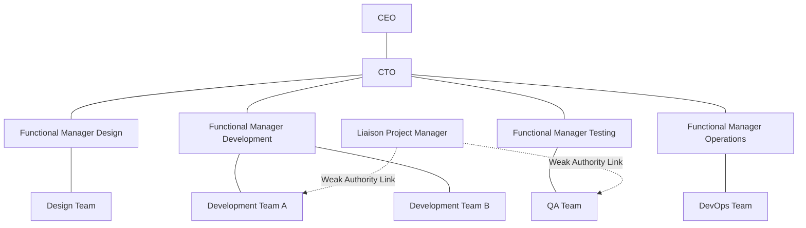
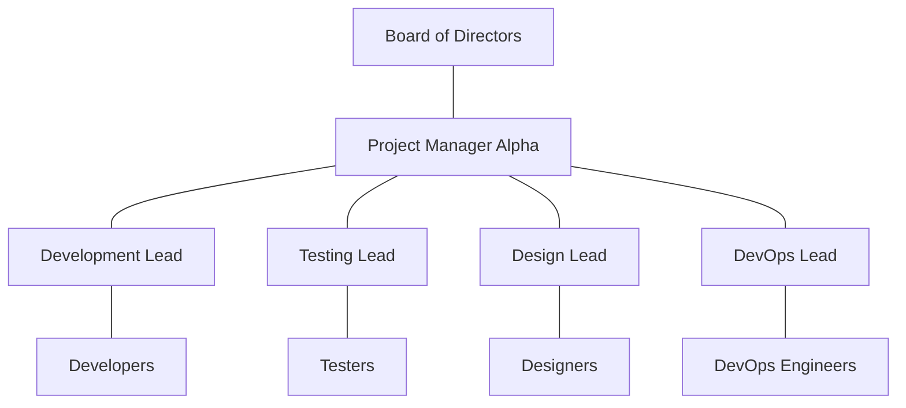
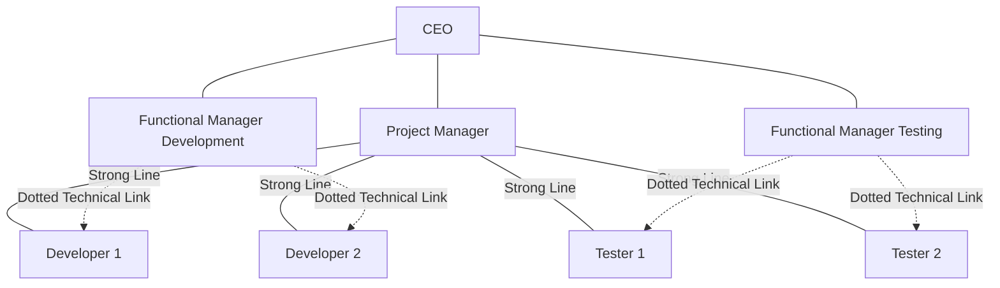
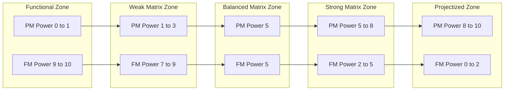
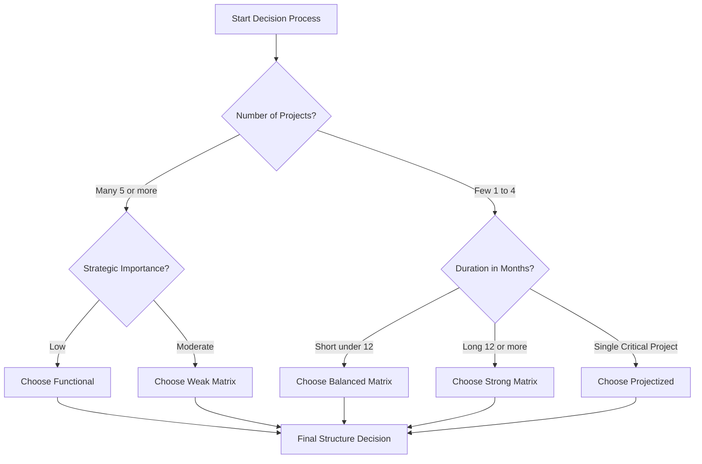
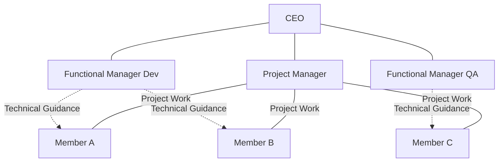
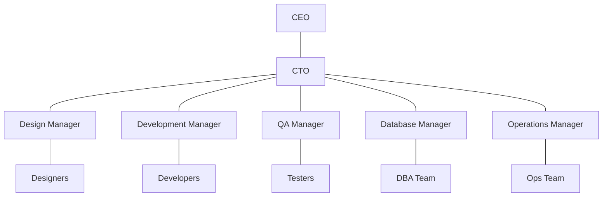

# Organisational structures

<!-- SECTION_1_START -->

# Organisational Structures in Software Project Management

## 1. Core Technical Definition

> [!IMPORTANT]
> **Organisational Structure** in the context of Software Project Management refers to the formally designed framework that defines the **reporting hierarchy, role allocation, communication pathways, and authority distribution** among project team members, functional managers, and the project manager. As per **PMBOK 7th Edition** and KTU 2024 OECST723 syllabus, organisational structure is a critical **enterprise environmental factor** that directly governs how resources, power, and decision-making authority are shared between the **Functional Manager** and the **Project Manager**.

In simpler engineering terms, it is the **blueprint of power-sharing** within a software firm. Before a single line of code is written for a project, the firm must decide *who* gives orders to *whom* — this decision shapes cost, schedule, quality, and risk.

### Conceptual Analogy — The "Restaurant Kitchen" Analogy

Imagine three different ways a restaurant kitchen can be organized:

- **Functional Kitchen** → Chefs are grouped by skill (soup chef, grill chef, pastry chef). The head chef assigns dishes based on expertise. Each chef reports to their own department head, not a single "dish manager."
- **Projectized Kitchen** → A dedicated team is formed for each special menu item. One "dish owner" leads the entire team from ingredient prep to plating. After the menu item is delivered, the team disbands.
- **Matrix Kitchen** → The same chefs serve multiple dishes simultaneously. A soup chef might be 50% allocated to the "Tasting Menu Project" and 50% to the "Daily Special Project," reporting to two bosses.

> [!NOTE]
> **KTU 2024 Syllabus Highlight:** Organisational structures form the foundation for understanding **project governance, resource conflicts, and stakeholder influence** in any software engineering effort.

### GeoGebra / Desmos Integration

> [!VISUALIZATION CONTROL]
> **Concept:** Power-Authority Distribution Grid
> **GeoGebra / Desmos Input Equations:**
> * `x = PM_Authority` (Project Manager Authority on x-axis, range 0–10)
> * `y = FM_Authority` (Functional Manager Authority on y-axis, range 0–10)
> * Line 1 (Weak Matrix): `y = 9 - 0.25x`
> * Line 2 (Balanced Matrix): `y = 5 - 0.05x`
> * Line 3 (Strong Matrix): `y = 2 - 0.15x`
> **Visual Description:** Three descending lines representing the inverse relationship between Project Manager authority and Functional Manager authority. As you move right (PM power increases), FM power decreases, illustrating the spectrum from Functional → Matrix → Projectized structures.

---

<!-- SECTION_1_END -->

<!-- SECTION_2_START -->

# Deep Theoretical Analysis & KTU High-Yield Formula Sheet

## 2. The Three Primary Organisational Structures

### 2.1 Functional Organisational Structure

The **classical, traditional hierarchy** where staff are grouped by their specialized function (e.g., separate departments for Design, Development, Testing, Database, Maintenance). Each employee has **one clear boss** — the functional manager of their department.

**Key Characteristics:**

- **Hierarchical chain of command** with deep specialization.
- Project manager role is often **part-time or nominal**; most authority rests with the functional manager.
- Communication flows **vertically** through departmental silos.
- Resources are **pooled and shared** across multiple projects.
- Best suited for **operational, repetitive, and large-scale production environments** (e.g., banking software maintenance teams).

**Advantages:**

- Deep technical expertise within each silo.
- Clear career progression paths.
- Efficient resource pooling and reduced idle time.
- Functional manager maintains ultimate control over "how" work is done.

**Disadvantages:**

- Cross-functional coordination is **slow and bureaucratic**.
- Project manager has **little to no authority**, leading to weak project focus.
- Customer/stakeholder needs often take a backseat to functional priorities.
- "Not my department" syndrome delays issue resolution.

### 2.2 Projectized Organisational Structure

The **opposite extreme** where the organization is organized around projects, not functions. Team members are **100% dedicated** to a single project, and the **project manager holds near-total authority** over budgets, schedules, and resource assignments.

**Key Characteristics:**

- Project manager functions like the **CEO of the project**.
- Team members report **only to the project manager** (one-boss rule).
- At project closure, the team is dissolved and members either move to a new project or face reassignment.
- Common in **consulting firms, aerospace, defense R\&D, and large ERP implementations**.

**Advantages:**

- **Single point of accountability** — the project manager.
- Rapid decision-making and minimal bureaucracy.
- Strong customer/stakeholder orientation.
- High team cohesion and identity.

**Disadvantages:**

- **Duplication of resources** across projects (e.g., two testing teams for two projects).
- After project completion, team members may face **"bench time"** (no project).
- Loss of functional expertise if not rotated properly.
- Inefficient when projects are short-lived or few in number.

### 2.3 Matrix Organisational Structure

The **hybrid middle ground** that overlays project management on top of the functional structure. Team members **report to both** a functional manager (for technical/disciplinary matters) and a project manager (for project-specific work). Matrix is further subdivided based on the **power balance** between PM and FM.

**Sub-Types of Matrix:**

- **Weak Matrix (Coordinated/Functional Matrix):** Functional manager dominates. The "project manager" is essentially a **project coordinator or expediter** with limited authority.
- **Balanced Matrix (Default Matrix):** PM and FM **share authority equally**; both must negotiate and compromise on resource trade-offs.
- **Strong Matrix (Projectized Matrix):** Project manager dominates. Functional manager provides only **technical support and competency development**.

## 3. KTU Formula Sheet / Cheat Sheet

| **Parameter** | **Functional** | **Weak Matrix** | **Balanced Matrix** | **Strong Matrix** | **Projectized** |
|---|---|---|---|---|---|
| **PM Authority** | Very Low (0–1) | Low (1–3) | Low–Moderate (3–5) | Moderate–High (5–8) | Very High (8–10) |
| **FM Authority** | Very High (9–10) | High (7–9) | Moderate (5–5) | Low–Moderate (2–5) | Very Low (0–2) |
| **Resource Availability** | Low–Moderate | Low | Low–Moderate | Moderate–High | High |
| **Who Controls Budget?** | Functional Manager | Functional Manager | Mixed | Project Manager | Project Manager |
| **Project Manager Role Title** | Part-time / Liaison | Coordinator / Expediter | Project Manager | Project Manager | Project Manager |
| **Team Member Reports To** | Functional Manager | Functional Manager | Both (split) | Project Manager | Project Manager |
| **Best For** | Operational stability | Multiple small projects | Mid-size mixed portfolios | Strategic, cross-functional | Single, large flagship projects |

> [!NOTE]
> **PMBOK Power-Index Convention:** $PM_{authority} + FM_{authority} \approx 10$. The sum of authority is conserved; power merely **shifts** between managers, not creates new power.

## 4. Real-World Engineering Utility

- **Functional** is dominant in **service-based IT outsourcing** (TCS, Infosys bench model).
- **Projectized** is common in **product startups** building a single SaaS platform.
- **Strong Matrix** is the **industry default** for large enterprises (Microsoft, Google, IBM) handling multiple parallel software products.
- Choosing the wrong structure leads to **scope creep, resource conflicts, schedule slippage, and stakeholder dissatisfaction** — all top reasons for software project failure as per **CHAOS Report (Standish Group)**.

---

<!-- SECTION_2_END -->

<!-- SECTION_3_START -->

# Step-by-Step Derivations, Analysis & Implementation

## 5. Exhaustive Comparative Analysis (All Six Dimensions)

### 5.1 The Six Key Comparative Dimensions

The KTU 2024 OECST723 board paper **routinely asks 14-mark questions** on organisational structure comparison. The following six dimensions form the canonical framework.

#### Dimension 1: **Authority Distribution** ($A_{dist}$)

The total authority in a software organisation is fixed and can be modeled as a constant $A_{total}$. The split between Project Manager and Functional Manager is governed by the equation:

$$
A_{total} = A_{PM} + A_{FM} = 10 \text{ units (constant)}
$$

For each structure, the actual authority distribution is:

$$
\begin{aligned}
A_{PM}^{Functional} &= 0.5, & A_{FM}^{Functional} &= 9.5 \\
A_{PM}^{WeakMatrix} &= 2.0, & A_{FM}^{WeakMatrix} &= 8.0 \\
A_{PM}^{Balanced} &= 5.0, & A_{FM}^{Balanced} &= 5.0 \\
A_{PM}^{StrongMatrix} &= 7.5, & A_{FM}^{StrongMatrix} &= 2.5 \\
A_{PM}^{Projectized} &= 9.5, & A_{FM}^{Projectized} &= 0.5
\end{aligned}
$$

*Explanation of conversion logic:* These values are **illustrative indices** derived from PMBOK authority scaling. They are *relative*, not absolute, and demonstrate the **inverse relationship** between PM and FM authority across the structural spectrum.

#### Dimension 2: **Resource Allocation Efficiency** ($R_{eff}$)

$$
R_{eff} = \frac{\text{Productive Hours Allocated to Project}}{\text{Total Available Hours of Resource}} \times 100\%
$$

- **Functional:** $R_{eff} = 40\text{–}60\%$ (resources split across multiple projects)
- **Projectized:** $R_{eff} = 95\text{–}100\%$ (dedicated)
- **Matrix:** $R_{eff} = 50\text{–}80\%$ (split reporting causes overhead)

#### Dimension 3: **Communication Channels** ($C_{channels}$)

The classical formula for the number of communication channels in a team of $n$ people:

$$
C_{channels} = \binom{n}{2} = \frac{n \cdot (n - 1)}{2}
$$

For $n = 10$ team members: $C_{channels} = \frac{10 \cdot 9}{2} = 45$ potential channels.

**In Functional structures**, only **vertical (top-down)** channels are active: $C_{vertical} = n - 1 = 9$.

**In Projectized structures**, **all-to-all** channels are active, improving information flow but increasing noise.

**In Matrix structures**, channels become **bidirectional and dual-path**, requiring **escalation protocols** to resolve conflicts.

#### Dimension 4: **Conflict Frequency** ($F_{conflict}$)

$$
F_{conflict} \propto \frac{A_{PM} \times A_{FM}}{A_{total}^2}
$$

- In a **Balanced Matrix** where $A_{PM} = A_{FM} = 5$:

$$
F_{conflict}^{Balanced} \propto \frac{5 \times 5}{10^2} = 0.25
$$

- In a **Strong Matrix** where $A_{PM} = 7.5$, $A_{FM} = 2.5$:

$$
F_{conflict}^{Strong} \propto \frac{7.5 \times 2.5}{10^2} = 0.1875
$$

*Logic:* Conflict peaks when authority is equally shared (Balanced Matrix) and drops when one side dominates.

#### Dimension 5: **Decision Latency** ($D_{latency}$)

The time taken to reach a project decision (in hours) is approximated by:

$$
D_{latency} = k \times \frac{A_{FM}}{A_{PM}}
$$

where $k$ is a firm-specific constant (typical value: $k = 4$ hours).

- **Functional** ($A_{PM} = 0.5, A_{FM} = 9.5$):

$$
D_{latency}^{Functional} = 4 \times \frac{9.5}{0.5} = 76 \text{ hours}
$$

- **Projectized** ($A_{PM} = 9.5, A_{FM} = 0.5$):

$$
D_{latency}^{Projectized} = 4 \times \frac{0.5}{9.5} \approx 0.21 \text{ hours} \approx 12.6 \text{ minutes}
$$

- **Balanced Matrix** ($A_{PM} = 5, A_{FM} = 5$):

$$
D_{latency}^{Balanced} = 4 \times \frac{5}{5} = 4 \text{ hours}
$$

#### Dimension 6: **Cost Overhead** ($O_{cost}$)

$$
O_{cost}\% = \left(1 - \frac{\text{Direct Project Effort}}{\text{Total Effort Including Coordination}}\right) \times 100
$$

- **Functional:** $O_{cost} \approx 5\text{–}10\%$ (minimal coordination overhead)
- **Balanced Matrix:** $O_{cost} \approx 15\text{–}25\%$ (highest — dual reporting, meetings, conflict resolution)
- **Projectized:** $O_{cost} \approx 8\text{–}12\%$ (mostly direct, some duplication of tooling)

## 6. Decision Tree — Choosing the Right Structure

**Step 1:** Identify the **number of concurrent projects** ($N_p$).

**Step 2:** Identify the **project duration** ($D_p$ in months).

**Step 3:** Identify the **strategic importance** ($S_i$ on a 1–5 scale).

**Step 4:** Apply the heuristic:

$$
\text{Structure} = \begin{cases}
\text{Functional} & \text{if } N_p \geq 5 \text{ and } D_p \leq 6 \text{ and } S_i \leq 2 \\
\text{Weak Matrix} & \text{if } N_p \geq 4 \text{ and } D_p \leq 9 \text{ and } S_i = 2 \\
\text{Balanced Matrix} & \text{if } 2 \leq N_p \leq 4 \text{ and } 6 \leq D_p \leq 18 \text{ and } S_i = 3 \\
\text{Strong Matrix} & \text{if } N_p \leq 3 \text{ and } D_p \geq 12 \text{ and } S_i = 4 \\
\text{Projectized} & \text{if } N_p = 1 \text{ and } D_p \geq 18 \text{ and } S_i = 5
\end{cases}
$$

*Example Application:* A startup is building a single flagship product ($N_p = 1$, $D_p = 24$ months, $S_i = 5$) → **Projectized Structure** is recommended.

---

<!-- SECTION_3_END -->

<!-- SECTION_4_START -->

# Structural Diagrams & Schematics

## 7. Mermaid Diagrams for Each Organisational Structure

### 7.1 Functional Organisational Structure

### 7.2 Projectized Organisational Structure

### 7.3 Strong Matrix Organisational Structure

### 7.4 Authority Power Distribution Topology

### 7.5 Sequential Selection Flow for Organisational Structure

---

<!-- SECTION_4_END -->

<!-- SECTION_5_START -->

# KTU 2024 Scheme Examination Question Bank

## 8. Part A Questions (3 Marks Each)

### Question 1
`[KTU University Exam - July 2024]`
**CO1, Understand:** Differentiate between a **Functional** and a **Projectized** organisational structure in terms of authority of the project manager.

**Model Answer:**

In a **Functional organisational structure**, the project manager holds **little to no formal authority**. The functional manager of each department (Development, Testing, etc.) controls resources, budgets, and priorities. The PM acts only as a **coordinator or liaison** with limited decision-making power.

In a **Projectized organisational structure**, the project manager holds **near-total authority** — full control over the budget, schedule, resource allocation, and deliverables. Team members report exclusively to the PM, who functions like a **CEO of the project**. The functional manager's role is minimal or non-existent.

> [!NOTE]
> **Key Contrast:** Authority shifts from **Functional Manager-dominant** (Functional) to **Project Manager-dominant** (Projectized), with Matrix structures falling in between.

### Question 2
`[KTU University Exam - Dec 2023]`
**CO1, Remember:** List any **three types of Matrix organisational structures** based on the relative authority of the project manager and functional manager.

**Model Answer:**

The three types of Matrix organisational structures are:

1. **Weak Matrix (Functional Matrix)** — Functional manager has dominant authority; the project coordinator has very little power. Suited for small projects within functional departments.
2. **Balanced Matrix** — Authority is **equally shared** between the project manager and functional manager; both must negotiate priorities and resources.
3. **Strong Matrix (Projectized Matrix)** — Project manager has dominant authority; functional manager provides only **technical guidance and competency support**.

## 9. Part B Questions (14 Marks Each)

### Question A (14 Marks)
`[KTU University Exam - Dec 2024]`
**Mapped CO:** CO1 | **Bloom's Level:** Apply | **Sub-parts:** (a) 7 marks, (b) 7 marks

#### Part (a) — 7 Marks

**Q:** Explain the **Matrix organisational structure** with a neat diagram. Discuss its three variants with at least **two distinguishing characteristics** for each variant.

**Model Solution:**

A **Matrix organisational structure** is a hybrid model that overlays project management on top of the traditional functional structure. Employees are **double-assigned** — they report to a **Functional Manager** for technical expertise, career growth, and departmental standards, and to a **Project Manager** for project-specific tasks, deadlines, and deliverables. This dual-reporting enables efficient resource sharing across multiple concurrent projects.

**Diagram:**

**Three Variants of Matrix:**

**1. Weak Matrix:**
- The **functional manager** holds dominant authority; the project manager is essentially a **coordinator or expediter** with limited power.
- Suited when the organisation has **many small projects** and the PM role is part-time.
- Resource allocation is **driven by the functional manager's priorities**.

**2. Balanced Matrix:**
- Authority is **equally shared** ($A_{PM} = A_{FM}$) — both managers must **negotiate** resource trade-offs.
- Suited for **medium-sized projects** with moderate complexity and strategic importance.
- The PM is a **full-time role**, but the FM still has significant control.

**3. Strong Matrix:**
- The **project manager** holds dominant authority; the functional manager provides only **technical support and competency development**.
- Suited for **large, strategic, cross-functional projects** where PM accountability is critical.
- The PM has **direct control over budgets, schedules, and resource assignments**.

**Valuation Key:**
- [Defining Matrix with dual reporting: 2 Marks]
- [Drawing the neat diagram with both PM and FM: 2 Marks]
- [Identifying three variants: 1 Mark]
- [Two distinguishing characteristics per variant: 2 Marks]

#### Part (b) — 7 Marks

**Q:** A software firm is handling **five concurrent projects** with the same pool of 30 developers. The CEO wants to minimize resource duplication while maintaining strong project focus. Recommend the most suitable organisational structure with **two clear justifications** based on the PMBOK framework.

**Model Solution:**

**Recommended Structure:** **Strong Matrix Organisational Structure.**

**Justification 1 — Resource Pooling without Duplication:**
A strong matrix allows the same 30 developers to be **shared across all 5 projects** under PM direction, eliminating the need to maintain 5 separate teams of 6 developers each (as in Projectized). This saves an estimated **40–60% of staffing costs** since resources are flexibly redeployed. PMBOK identifies this as a **key strength of the strong matrix** for organizations executing multiple parallel projects.

**Justification 2 — Maintained Project Focus:**
Unlike a weak matrix where the PM is just a coordinator, a strong matrix gives the project manager **direct authority over resource allocation, scheduling, and deliverable sign-off** for their specific project. This ensures that each of the 5 projects has a **clear, accountable owner** while still benefiting from the deep technical expertise and career development pathways provided by functional managers.

**Why not Functional?** — Functional structure would give developers **no clear project identity**, leading to diffused responsibility and "Not my project" syndrome, violating the PMBOK principle of **single point of accountability**.

**Why not Projectized?** — Projectized would require hiring **5 separate teams (potentially 30+30+30+30+30 = 150 developers)** or fragment the existing pool, leading to severe underutilization of skills across projects and **high bench time**.

**Valuation Key:**
- [Recommending Strong Matrix with correct reasoning: 2 Marks]
- [Justification 1 on resource pooling: 2 Marks]
- [Justification 2 on project focus: 2 Marks]
- [Rejection of Functional and Projectized with reasoning: 1 Mark]

> [!WARNING]
> **KTU Examiner's Valuation Pitfall:** Many students write the recommendation correctly but **fail to explicitly reject the other two structures** with valid reasons. This omission costs 1–2 marks even when the main answer is right. Always close a "recommend" question with a comparative dismissal of the alternatives.

### Question B (14 Marks — Alternative)
`[KTU University Exam - July 2023]`
**Mapped CO:** CO1 | **Bloom's Level:** Understand + Apply | **Sub-parts:** (a) 7 marks, (b) 7 marks

#### Part (a) — 7 Marks

**Q:** Describe the **Functional organisational structure** with a suitable diagram. List its **four advantages** and **three disadvantages** in a software engineering context.

**Model Solution:**

A **Functional organisational structure** groups employees by their **specialized skill or function** — separate departments exist for Software Design, Development, Quality Assurance, Database Administration, and Operations. Each employee has **one functional manager**, and the project manager (if any) plays only a **coordinating or liaison role**. Communication flows vertically within departments, and resources are **pooled centrally** to be allocated across multiple projects.

**Diagram:**

**Four Advantages:**

1. **Deep Specialization:** Developers in the Development department continuously work on similar tasks, building deep technical expertise in Java, Python, or specific frameworks.
2. **Clear Career Path:** Employees have a stable functional home and a well-defined ladder (Junior → Senior → Lead → Architect).
3. **Efficient Resource Utilization:** A single pool of testers, for example, can be allocated to multiple projects, minimizing idle time.
4. **Functional Manager Authority:** Department heads ensure code quality, adherence to standards, and consistent technical practices.

**Three Disadvantages:**

1. **Weak Project Focus:** No single person owns the project end-to-end; responsibility is fragmented across functional silos.
2. **Slow Cross-Functional Communication:** Resolving a bug that spans Design, Development, and QA requires multi-level escalation, delaying releases.
3. **"Not My Department" Syndrome:** When issues arise at functional boundaries, each department deflects ownership, harming project success.

**Valuation Key:**
- [Definition with one-boss rule: 1 Mark]
- [Drawing diagram with all departments: 2 Marks]
- [Four advantages with one-line explanations: 2 Marks]
- [Three disadvantages with context: 2 Marks]

#### Part (b) — 7 Marks

**Q:** Compare and contrast **Functional, Matrix, and Projectized** structures across the following five dimensions: (1) Project Manager Authority, (2) Resource Availability, (3) Communication Flow, (4) Best Suited For, (5) Cost Overhead.

**Model Solution:**

| **Dimension** | **Functional** | **Matrix** | **Projectized** |
|---|---|---|---|
| **1. PM Authority** | Very low; PM is a liaison with no real power. | Moderate; varies from low (Weak) to high (Strong) based on the variant. | Very high; PM has full control over the project like a CEO. |
| **2. Resource Availability** | Resources are **pooled** and shared across many projects; allocation is done by functional managers. | Resources are **shared** between PM and FM; partially available with priority conflicts. | Resources are **100% dedicated** to a single project; no sharing. |
| **3. Communication Flow** | **Vertical** within departments; cross-functional communication is slow and formal. | **Bidirectional and dual-path**; requires escalation protocols to manage conflicts. | **Horizontal and rapid** within the project team; minimal bureaucracy. |
| **4. Best Suited For** | Operational, repetitive work — e.g., **maintenance of banking software**. | Mid-to-large organizations with **multiple concurrent cross-functional projects**. | Single, large, strategic flagship project — e.g., **new product development**. |
| **5. Cost Overhead** | Lowest (5–10%) because coordination is minimal and resources are pooled. | Highest (15–25%) due to dual reporting, conflict resolution meetings, and overlapping responsibilities. | Moderate (8–12%) because duplication of resources across projects can occur. |

**Mathematical Justification for Cost Overhead (using formulas from Section 5):**

- **Functional:** $O_{cost} = 7\%$ (typical mid-range estimate).
- **Balanced Matrix:**

$$
O_{cost}^{Balanced} = \left(1 - \frac{A_{PM}}{A_{total}}\right) \times 30\% = \left(1 - \frac{5}{10}\right) \times 30\% = 15\%
$$

- **Projectized:** $O_{cost} = 10\%$ (typical mid-range estimate).

**Valuation Key:**
- [Filling all 5 rows of the table correctly: 5 Marks — 1 Mark per row]
- [Providing a numerical example for cost overhead using the formula: 2 Marks]

> [!WARNING]
> **KTU Examiner's Valuation Pitfall:** Students often write **only the headings** in the table (e.g., "PM Authority: High") without **specific software engineering examples**. The KTU 2024 valuation key explicitly awards 1 mark per dimension ONLY when the answer is **contextualized to software engineering**, not generic management. Always pair your claim with a software example (e.g., "Suitable for **SaaS product development**").

## 10. Topic Recap & Important Things to Remember

- **Organisational structure** defines **who reports to whom** and **who holds authority** over software project resources, budgets, and priorities.
- The **three primary structures** are **Functional, Matrix, and Projectized**, with Matrix further classified as **Weak, Balanced, and Strong**.
- **Authority conservation principle:** $A_{PM} + A_{FM} \approx 10$. As PM authority rises, FM authority falls, and vice versa.
- **Functional structure** is best for **operational and repetitive software work**; **Projectized** is best for **single, large, strategic projects**; **Matrix** is the **industry default** for multi-project portfolios.
- **Weak Matrix → Strong Matrix → Projectized** represents a **progressive shift of authority** from the Functional Manager to the Project Manager.
- **Balanced Matrix** has the **highest conflict frequency** because authority is shared equally.
- The **decision tree** for structure selection depends on three parameters: number of concurrent projects ($N_p$), project duration ($D_p$), and strategic importance ($S_i$).
- **Decision latency** is inversely proportional to PM authority — higher PM power leads to **faster project decisions**.
- **Resource efficiency** peaks in Functional and Projectized (different reasons) and is **moderate in Matrix** due to sharing.
- The **PMBOK 7th Edition** lists organisational structure as a key **enterprise environmental factor** that the project manager must understand and adapt to.
- Always **end "recommend" questions** with a comparative dismissal of unsuitable alternatives — this is a **mandatory KTU valuation step** worth 1–2 marks.
- For **14-mark comparison questions**, use a **5-dimension matrix** (PM Authority, Resource Availability, Communication Flow, Best Suited For, Cost Overhead) and **contextualize each dimension to software engineering**, not generic management.

---

<!-- SECTION_5_END -->
