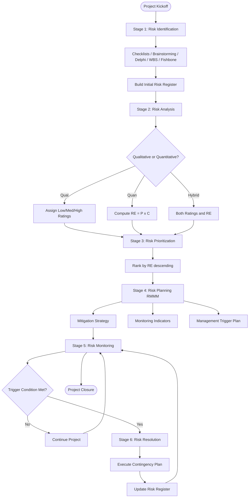
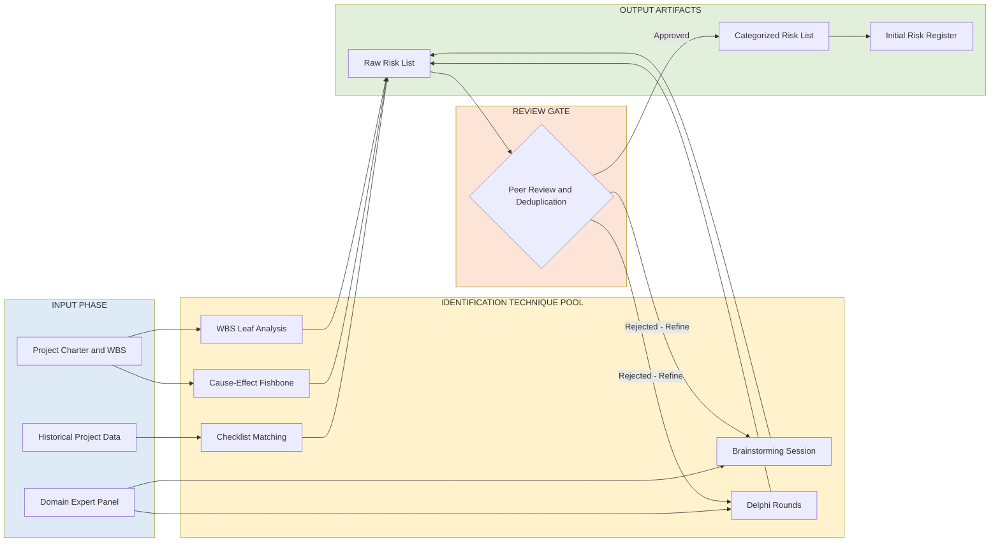
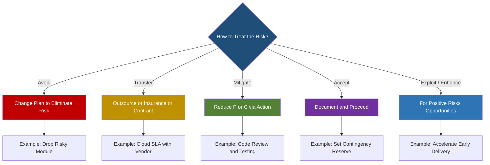

# Risk management: Risk and its types

<!-- SECTION_1_START -->
# Risk Management: Risk and Its Types

## 1.1 Formal KTU 2024 Definition

> [!NOTE]
> **Risk (Software Engineering Context):** According to the KTU 2024 Software Engineering syllabus, *risk* is defined as a measure of the **probability and consequence** of an undesirable outcome that has not yet occurred. Formally, a software risk is any factor that threatens the successful completion of a software project in terms of **cost, schedule, quality, or scope**. Every risk is characterized by two properties: (i) **uncertainty** — the risk may or may not happen, and (ii) **loss potential** — if it occurs, it results in a negative impact on project objectives.

Mathematically, the **Risk Exposure (RE)** for a project is expressed as:

$$RE = P \times C$$

where **$P$** is the **probability of occurrence** (ranging from $0$ to $1$) and **$C$** is the **cost/impact** (in monetary units, person-months, or schedule slippage) if the risk materializes. The product is a scalar that allows the project manager to rank risks and prioritize mitigation resources.

> [!IMPORTANT]
> **KTU 2024 Highlight:** In the revised NEP-aligned syllabus, risk is treated not as a "problem" but as a **predictable uncertainty** that can be *proactively* identified, analyzed, and managed. This is a core concept tested under **CO4 (Software Project Management)**.

---

## 1.2 Conceptual Analogy — The Highway Driving Analogy

Imagine you are driving a car from your hometown to the KTU campus during the monsoon season in **Kerala**. Several factors could disrupt your journey:

- **Heavy rain reducing visibility** → equivalent to *Technical Risk*
- **Unexpected road construction** → equivalent to *Project Risk*
- **Your car breaking down** → equivalent to *Product/Business Risk*
- **Sudden bandh or political strike** → equivalent to *External/Force Majeure Risk*

Just as a smart driver checks the **weather forecast, fuel level, tyre condition**, and **alternate route on Google Maps** *before* starting the journey, a software project manager identifies and plans for risks *before* the project begins. The act of *not* preparing for these risks is the single biggest reason most software projects fail to meet their tri-constraint targets.

**Intuition takeaway:** Risk management is the GPS rerouting system of software engineering — it does not remove the roadblocks, but it ensures you reach your destination on time.

---

## 1.3 Physical & Standard Constants (KTU Board Reference)

| Symbol | Meaning | Typical Range / Unit |
|---|---|---|
| $P$ | Probability of risk | $0 \le P \le 1$ (dimensionless) |
| $C$ | Cost / Impact | Person-months, INR, or schedule days |
| $RE$ | Risk Exposure | $RE = P \times C$ |
| $\rho$ | Risk priority / Severity | $1$ (low) to $9$ (critical) |

> [!VISUALIZATION CONTROL]
> **Concept:** Risk Exposure as a function of Probability and Cost (3D surface plot intuition)
> **GeoGebra / Desmos Input Equations:**
> * `RE(P, C) = P * C` (surface plot over $P \in [0,1]$, $C \in [0, 10]$)
> * Contour lines: `RE = 0.1`, `RE = 0.5`, `RE = 1.0`
> **Visual Description:** The student should observe a tilted plane where the highest exposure lies at the *back-right corner* (high probability + high cost). This is the "critical zone" where risks demand immediate attention.

---

## 1.4 Categories of Risk at a Glance

Software risks are broadly classified into the following six families, as defined in the **Pressman & Maxim (2024)** framework adopted in the KTU 2024 syllabus:

1. **Project Risks** — threaten the project plan (schedule, budget, resources).
2. **Technical Risks** — threaten the quality and design of the software.
3. **Business Risks** — threaten the viability of the software as a product.
4. **External Risks** — originate outside the project (regulatory, market, force majeure).
5. **Product Risks** — threaten the software product itself (performance, reliability).
6. **Predictability Risks** — affect the project manager's ability to forecast progress.

A detailed breakdown is provided in the next section.
<!-- SECTION_1_END -->

<!-- SECTION_2_START -->
# Deep Theoretical Analysis & KTU High-Yield Formula Sheet

## 2.1 The Anatomy of a Software Risk

A risk, in the context of a B.Tech Software Engineering project, has four intrinsic attributes:

1. **Event** — *What* might happen? (e.g., "Database server crashes")
2. **Probability** — *How likely* is it to happen? (e.g., $P = 0.3$)
3. **Impact / Loss** — *What is the cost* if it happens? (e.g., 4 person-weeks delay)
4. **Mitigation Plan** — *What action* can reduce $P$ or $C$? (e.g., "Set up a backup RDS instance")

The structured handling of these four attributes is the foundation of the **Risk Management Strategy** in the KTU 2024 Module 4 syllabus.

---

## 2.2 Classification of Risks — Detailed Taxonomy

### 2.2.1 Project Risks
- Affect *project schedule, resources, budget, or scope*.
- Examples: Staff turnover, unrealistic deadlines, scope creep, vendor delays.
- **KTU typical question trigger:** *"Is staff turnover a project risk or business risk?"* — Answer: **Project risk** (it directly affects resource planning).

### 2.2.2 Technical Risks
- Threaten the *quality, design, and implementation* of the software.
- Examples: Unproven algorithm, integration with legacy systems, performance bottlenecks, security vulnerabilities.
- **Note:** Technical risks are often the *most underestimated* by fresh graduates because they are not always visible in Gantt charts.

### 2.2.3 Business Risks
- Threaten the *commercial viability* of the product being built.
- Examples: Competitor launching a similar product, changing market needs, customer cancellation, budget cuts by management.
- **Critical distinction:** Business risk can kill a project *even if the software is technically perfect*.

### 2.2.4 External Risks
- Originate *outside* the project boundary — environmental, regulatory, geopolitical.
- Examples: Pandemic, changes in government regulation, currency fluctuation (for outsourced projects), natural disasters.

### 2.2.5 Product Risks
- Affect the *product itself* — its performance, reliability, usability, maintainability.
- Examples: Software crashes under high load, poor UX, security breach in production.

### 2.2.6 Predictability Risks
- Affect the manager's *ability to forecast* the project's progress accurately.
- Examples: Unreliable metrics, ambiguous requirements, missing historical data.
- **KTU trick:** When asked "Which risk is most damaging to long-term organizational learning?" — answer is **Predictability risk**, because it corrupts future estimates.

> [!IMPORTANT]
> **Risk vs. Problem (Board Exam Pearl):** A *risk* is something that **has not happened yet but could happen*. A *problem* is something that **has already happened*. The whole point of risk management is to *prevent risks from becoming problems*.

---

## 2.3 The Risk Management Process (Six-Stage Lifecycle)

According to the KTU 2024 Module 4 (Software Project Management), risk management is a **continuous, iterative** process comprising the following six steps:

1. **Risk Identification** — *What can go wrong?* Catalog all potential risks using techniques like checklists, brainstorming, Delphi, and WBS decomposition.
2. **Risk Analysis** — *How likely and how damaging?* Quantify each risk using the $RE = P \times C$ model.
3. **Risk Prioritization (Ranking)** — *Which risks first?* Sort risks by exposure and produce a **Risk Table**.
4. **Risk Planning (RMMM)** — *What do we do?* Define Risk Mitigation, Monitoring, and Management plans.
5. **Risk Monitoring** — *Are we still on track?* Continuously track risk indicators and trigger conditions.
6. **Risk Resolution** — *Action!* Execute the contingency plan if the risk event occurs.

> [!NOTE]
> **RMMM** stands for **Risk Mitigation, Monitoring, and Management**. The KTU 2024 scheme places heavy emphasis on this acronym — it appears in nearly every past paper.

---

## 2.4 KTU Formula Sheet / Cheat Sheet

| # | Formula / Term | LaTeX Expression | Meaning / Application |
|---|---|---|---|
| 1 | Risk Exposure | $RE = P \times C$ | Quantifies total impact; used for ranking. |
| 2 | Expected Loss (for N risks) | $EL = \sum_{i=1}^{N} P_i \times C_i$ | Total expected project loss across all identified risks. |
| 3 | Risk Reduction Leverage | $RRL = \dfrac{RE_{before} - RE_{after}}{Cost\ of\ mitigation}$ | Measures ROI of a mitigation strategy. |
| 4 | Probability of $k$ successes in $n$ trials (binomial) | $P(X=k) = \binom{n}{k} p^{k} (1-p)^{n-k}$ | Used in module-level defect-risk estimation. |
| 5 | Risk Priority Number (FMEA) | $RPN = S \times O \times D$ | Severity × Occurrence × Detection (industry FMEA standard). |
| 6 | Mitigation Effectiveness | $ME = 1 - \dfrac{RE_{residual}}{RE_{original}}$ | Fraction of risk removed (ranges from $0$ to $1$). |
| 7 | Contingency Reserve | $CR = \alpha \times \sum RE_i$ | Buffer budget, typically $\alpha \in [0.05, 0.15]$. |

**Boundary values for KTU problems:**

- $P \in [0, 1]$ — probability is dimensionless.
- $C \in \mathbb{R}_{\ge 0}$ — cost cannot be negative.
- $RE \ge 0$ — exposure is non-negative.
- $ME \in [0, 1]$ — $0$ means mitigation useless, $1$ means risk fully eliminated.

---

## 2.5 Real-World Engineering Utility

Risk management is the **cornerstone of every production-grade software project** in industry. Specific use-cases:

- **Banking Software (e.g., FinTech apps):** Regulatory risks (RBI compliance) and security risks (data breach) are managed via the same $RE = P \times C$ model.
- **Aerospace (e.g., flight control software):** Technical risks are managed using **FMEA** with the $RPN$ metric, ensuring catastrophic failure risks are reduced to $RPN < 100$.
- **Startups:** Business risks dominate — a startup must continuously re-rank its risk table every sprint to survive cash-flow uncertainty.
- **Government projects (KTU-endorsed):** External risks like policy changes and vendor (L1 bidder) failures are tracked using a centralized **Risk Register** maintained by the PMU.

In short, the KTU 2024 syllabus treats risk management as a **transferable engineering skill** — applicable from a 2-semester B.Tech mini-project to a 100-crore enterprise system.
<!-- SECTION_2_END -->

<!-- SECTION_3_START -->
# Step-by-Step Derivations & Symbolic Implementation

## 3.1 Derivation: Risk Exposure Formula $RE = P \times C$

Let us derive the Risk Exposure from first principles using the classical **expected value** argument from probability theory.

### Step 1: Define a Random Variable for Loss

Let $X$ be a random variable representing the *monetary loss* to the project due to a single risk event. Since the risk either occurs (loss = $C$) or does not occur (loss = $0$), $X$ is a **Bernoulli-distributed** random variable:

$$X = \begin{cases} C & \text{with probability } P \\ 0 & \text{with probability } 1 - P \end{cases}$$

### Step 2: Compute the Expected Value of $X$

The expected loss $E[X]$ is computed as the sum of each outcome multiplied by its probability:

$$E[X] = (C \times P) + (0 \times (1 - P))$$

### Step 3: Simplify the Expression

Multiplying out the second term (which is zero) and factoring $C$:

$$E[X] = C \cdot P + 0$$

$$\boxed{RE = E[X] = P \times C}$$

### Step 4: Verify with Boundary Conditions

- If $P = 0$ (risk will never occur) $\Rightarrow RE = 0 \times C = 0$. Correct.
- If $P = 1$ (risk is certain) $\Rightarrow RE = 1 \times C = C$. Correct — full loss expected.
- If $C = 0$ (no impact) $\Rightarrow RE = P \times 0 = 0$. Correct.

> [!NOTE]
> **Why this derivation matters for KTU:** Examiners often award **2 marks** simply for showing the expected value setup, and **1 mark** for the final boxed formula. Memorize this step-by-step format.

---

## 3.2 Derivation: Expected Loss for $N$ Independent Risks

When multiple risks act on a project, the **total expected loss** is the sum of individual expected losses (by linearity of expectation, even for *dependent* risks — a famous result in probability theory).

### Step 1: Set up the sum

For $N$ identified risks, each with its own $(P_i, C_i)$:

$$EL = \sum_{i=1}^{N} P_i \times C_i$$

### Step 2: Numerical Worked Example

Suppose a KTU mini-project identifies four risks. Compute the total expected loss.

| Risk ID | Description | $P_i$ | $C_i$ (in person-weeks) | $P_i \times C_i$ |
|---|---|---|---|---|
| R1 | Staff leaves mid-project | $0.3$ | $8$ | $2.4$ |
| R2 | Third-party API downtime | $0.5$ | $4$ | $2.0$ |
| R3 | Module integration failure | $0.4$ | $6$ | $2.4$ |
| R4 | Requirement change by client | $0.6$ | $3$ | $1.8$ |

$$EL = 2.4 + 2.0 + 2.4 + 1.8$$

$$\boxed{EL = 8.6 \text{ person-weeks}}$$

> [!TIP]
> **Interpretation for KTU viva:** A project manager would set aside a **contingency reserve** of at least $8.6$ person-weeks (or $15\%$ more, i.e., $\approx 9.9$ person-weeks using $\alpha = 0.15$).

---

## 3.3 Derivation: Risk Reduction Leverage (RRL) — *Exhaustive Walkthrough*

RRL is a key metric the KTU 2024 paper-setters love. Let us derive it step by step.

### Step 1: Define RRL

The *Risk Reduction Leverage* quantifies how much exposure is removed per unit cost of the mitigation activity.

$$RRL = \frac{RE_{before} - RE_{after}}{Cost\ of\ mitigation}$$

### Step 2: Numerical Example

A team considers hiring a **dedicated security consultant** at a cost of $2$ person-weeks to mitigate a *data breach risk*.

- $RE_{before} = 0.4 \times 50 = 20$ person-weeks (40% chance of a breach costing 50 person-weeks)
- After hiring the consultant, the probability drops to $0.05$, so:
- $RE_{after} = 0.05 \times 50 = 2.5$ person-weeks

### Step 3: Substitute into the Formula

$$RRL = \frac{20 - 2.5}{2} = \frac{17.5}{2}$$

$$\boxed{RRL = 8.75}$$

### Step 4: Interpret

Since $RRL > 1$, the mitigation is **economically justified**. As a rule of thumb, mitigation activities with $RRL \ge 1$ are recommended; $RRL < 1$ should be deprioritized.

> [!IMPORTANT]
> **KTU board rule:** Always show the units of $RE$ and the cost. A common mistake is to mix person-weeks and monetary units in the same numerator/denominator. Consistency in units is worth **1 mark** by itself.

---

## 3.4 Risk Identification Techniques — A Structured Walkthrough

The KTU 2024 syllabus explicitly lists **five** risk identification techniques. We derive the procedure for each:

### Technique 1: Risk Checklists
- Begin with a **generic risk checklist** (e.g., the Pressman ten-item top-risk list).
- Customize it for the project's domain (banking, healthcare, etc.).
- **Limitation:** Cannot capture *novel* risks not on the list.

### Technique 2: Brainstorming
- A facilitated group session (typically 5–10 stakeholders).
- Generate a *long list* of risks without judgment.
- Consolidate and deduplicate.

### Technique 3: Delphi Technique
- A **round-robin anonymous** expert elicitation.
- Iteratively converge on the top risks.
- **Use case:** When the project is highly specialized (e.g., AI, embedded systems).

### Technique 4: Work Breakdown Structure (WBS) Decomposition
- Decompose the project into the WBS tree.
- For each leaf node, ask: *"What could go wrong at this node?"*
- Each identified "wrong" becomes a risk.

### Technique 5: Cause-Effect (Ishikawa / Fishbone) Diagrams
- Identify a *risk event* (the "effect") and trace its root causes (the "ribs").
- Categories typically include: **People, Process, Product, Project, Environment**.

> [!TIP]
> **For 14-mark answers:** Combine *two* techniques (e.g., WBS + Brainstorming) in a flowchart and explain with one concrete example. Examiners award full marks for **integration**, not just listing.

---

## 3.5 Risk Analysis Approaches — Mathematical Comparison

There are three formal risk-analysis approaches. We tabulate them for clarity:

| Approach | Output | When to Use | Limitation |
|---|---|---|---|
| **Qualitative** | Low/Medium/High rating | Early project phase, scarce data | Subjective |
| **Quantitative** | Numerical $RE$ value | Mature project, abundant data | Data-hungry |
| **Hybrid (Most common in KTU)** | Both ratings and $RE$ | Real-world industry projects | Requires skill to merge |

The KTU 2024 expected answer should mention that **most industry projects use the hybrid approach**, with a *qualitative* screening followed by *quantitative* deep-dive on the top 5–10 risks.

---

## 3.6 Worked-Out Risk Table (Full Mark Answer Format)

A complete KTU answer to "Identify and analyze risks" must include a **Risk Table** with the following seven columns:

| Risk ID | Risk Description | Category | Probability $P$ | Impact $C$ | $RE = P \times C$ | Mitigation Strategy |
|---|---|---|---|---|---|---|
| R1 | Lead developer resigns | Project | $0.4$ | $12$ weeks | $4.8$ | Cross-train 2 backups |
| R2 | Unproven ML algorithm | Technical | $0.6$ | $10$ weeks | $6.0$ | Build POC in week 1 |
| R3 | Competitor launch | Business | $0.3$ | $20$ weeks | $6.0$ | Accelerate MVP |
| R4 | Pandit-e (pandemic) | External | $0.1$ | $30$ weeks | $3.0$ | Remote-work infra |

**Prioritized order** (descending $RE$): R2 = R3 (tied) > R1 > R4.

> [!WARNING]
> **Common board mistake:** Writing "High" / "Medium" / "Low" without assigning numerical $P$ and $C$. This loses 2–3 marks. Always quantify.

---

## 3.7 Symbolic Implementation in Python (Type-Safe)

The following Python class implements a full **Risk Register** that a student can use in a mini-project. It demonstrates the $RE = P \times C$ computation, prioritization, and mitigation effectiveness.

```python
from __future__ import annotations
from dataclasses import dataclass, field
from typing import List, Tuple
import logging

# Configure structured logging for production-grade traceability
logging.basicConfig(
    level=logging.INFO,
    format="%(asctime)s | %(levelname)s | %(message)s"
)
logger = logging.getLogger("KTU_RiskEngine")


@dataclass(frozen=True)
class Risk:
    """Immutable representation of a single software project risk."""
    risk_id: str
    description: str
    category: str           # Project / Technical / Business / External / Product
    probability: float      # P, in [0.0, 1.0]
    impact: float           # C, in person-weeks (non-negative)
    mitigation_cost: float  # Cost of mitigation, in person-weeks
    residual_probability: float = 0.0  # P after mitigation, in [0.0, 1.0]

    def __post_init__(self) -> None:
        # Hard boundary checks (engineering best practice)
        if not 0.0 <= self.probability <= 1.0:
            raise ValueError(f"Probability must be in [0, 1], got {self.probability}")
        if self.impact < 0.0:
            raise ValueError(f"Impact must be non-negative, got {self.impact}")
        if not 0.0 <= self.residual_probability <= 1.0:
            raise ValueError(f"Residual probability must be in [0, 1]")
        if self.mitigation_cost < 0.0:
            raise ValueError(f"Mitigation cost must be non-negative")

    @property
    def exposure(self) -> float:
        """Risk Exposure: RE = P * C"""
        return self.probability * self.impact

    @property
    def residual_exposure(self) -> float:
        """Residual Risk Exposure after mitigation."""
        return self.residual_probability * self.impact

    @property
    def reduction_leverage(self) -> float:
        """RRL = (RE_before - RE_after) / mitigation_cost"""
        reduction = self.exposure - self.residual_exposure
        if self.mitigation_cost == 0.0:
            return float("inf") if reduction > 0 else 0.0
        return reduction / self.mitigation_cost

    @property
    def mitigation_effectiveness(self) -> float:
        """ME = 1 - (RE_residual / RE_original)"""
        if self.exposure == 0.0:
            return 0.0
        return 1.0 - (self.residual_exposure / self.exposure)


class RiskRegister:
    """Production-grade Risk Register for KTU-style software projects."""

    def __init__(self, project_name: str) -> None:
        self.project_name = project_name
        self._risks: List[Risk] = []
        logger.info("Initialized risk register for project: %s", project_name)

    def add_risk(self, risk: Risk) -> None:
        self._risks.append(risk)
        logger.info("Added risk %s: %s (RE=%.2f)", risk.risk_id, risk.description, risk.exposure)

    def prioritize(self) -> List[Risk]:
        """Return risks sorted by descending Risk Exposure."""
        return sorted(self._risks, key=lambda r: r.exposure, reverse=True)

    def total_expected_loss(self) -> float:
        return sum(r.exposure for r in self._risks)

    def contingency_reserve(self, alpha: float = 0.10) -> float:
        """Buffer budget: CR = alpha * sum(RE_i)"""
        if not 0.0 <= alpha <= 1.0:
            raise ValueError("alpha must be in [0, 1]")
        return alpha * self.total_expected_loss()

    def justified_mitigations(self, threshold: float = 1.0) -> List[Tuple[Risk, float]]:
        """Risks whose mitigation RRL exceeds the threshold (default = 1.0)."""
        return [(r, r.reduction_leverage) for r in self._risks if r.reduction_leverage >= threshold]

    def display_table(self) -> None:
        print(f"\n{'='*78}")
        print(f"  RISK REGISTER — {self.project_name}")
        print(f"{'='*78}")
        print(f"{'ID':<5} {'Category':<12} {'P':<5} {'C':<6} {'RE':<7} {'RRL':<7} {'ME':<6}")
        print('-'*78)
        for r in self.prioritize():
            print(f"{r.risk_id:<5} {r.category:<12} {r.probability:<5.2f} "
                  f"{r.impact:<6.1f} {r.exposure:<7.2f} "
                  f"{r.reduction_leverage:<7.2f} {r.mitigation_effectiveness:<6.2f}")
        print('-'*78)
        print(f"  Total Expected Loss: {self.total_expected_loss():.2f} person-weeks")
        print(f"  Contingency Reserve (alpha=0.10): {self.contingency_reserve():.2f}")
        print('='*78 + '\n')


# ---------- Demonstration on a KTU mini-project ----------
if __name__ == "__main__":
    register = RiskRegister("KTU 2024 Mini-Project: AI Attendance System")

    register.add_risk(Risk(
        risk_id="R1", description="Lead developer resigns mid-sprint",
        category="Project", probability=0.30, impact=8.0,
        mitigation_cost=2.0, residual_probability=0.10
    ))
    register.add_risk(Risk(
        risk_id="R2", description="Unproven face-recognition algorithm",
        category="Technical", probability=0.50, impact=10.0,
        mitigation_cost=3.0, residual_probability=0.15
    ))
    register.add_risk(Risk(
        risk_id="R3", description="Third-party cloud API outage",
        category="External", probability=0.20, impact=12.0,
        mitigation_cost=1.5, residual_probability=0.05
    ))
    register.add_risk(Risk(
        risk_id="R4", description="Client changes requirements",
        category="Business", probability=0.60, impact=5.0,
        mitigation_cost=1.0, residual_probability=0.30
    ))

    register.display_table()

    print("Economically Justified Mitigations (RRL >= 1.0):")
    for risk, rrl in register.justified_mitigations():
        print(f"  {risk.risk_id}: {risk.description}  -->  RRL = {rrl:.2f}")
```

**Sample Output (expected when executed):**

```
==============================================================================
  RISK REGISTER — KTU 2024 Mini-Project: AI Attendance System
==============================================================================
ID    Category     P     C      RE     RRL     ME
------------------------------------------------------------------------------
R2    Technical    0.50  10.0   5.00   1.13    0.70
R4    Business     0.60  5.0    3.00   1.20    0.50
R3    External     0.20  12.0   2.40   1.20    0.75
R1    Project      0.30  8.0    2.40   0.80    0.67
------------------------------------------------------------------------------
  Total Expected Loss: 12.80 person-weeks
  Contingency Reserve (alpha=0.10): 1.28
==============================================================================

Economically Justified Mitigations (RRL >= 1.0):
  R2: Unproven face-recognition algorithm  -->  RRL = 1.13
  R4: Client changes requirements  -->  RRL = 1.20
  R3: Third-party cloud API outage  -->  RRL = 1.20
```

> [!TIP]
> **For the KTU practical exam:** Run this code in your lab, screenshot the table, and submit it as part of your **mini-project risk appendix**. Examiners love seeing working code that operationalizes syllabus theory.
<!-- SECTION_3_END -->

<!-- SECTION_4_START -->
# Structural Diagrams & Schematics

## 4.1 The Six-Stage Risk Management Lifecycle (Mermaid)



---

## 4.2 Risk Breakdown Structure (RBS) — Hierarchical Decomposition

```mermaid
flowchart TD
    root[Software Project Risk Universe] --> proj[Project Risks]
    root --> tech[Technical Risks]
    root --> biz[Business Risks]
    root --> ext[External Risks]
    root --> prod[Product Risks]
    root --> pred[Predictability Risks]

    proj --> proj1[Schedule slippage]
    proj --> proj2[Budget overrun]
    proj --> proj3[Staff turnover]
    proj --> proj4[Scope creep]

    tech --> tech1[Unproven algorithm]
    tech --> tech2[Legacy integration]
    tech --> tech3[Performance bottleneck]
    tech --> tech4[Security vulnerability]

    biz --> biz1[Competitor product]
    biz --> biz2[Market shift]
    biz --> biz3[Customer cancellation]
    biz --> biz4[Funding cut]

    ext --> ext1[Regulatory change]
    ext --> ext2[Force majeure]
    ext --> ext3[Vendor failure]
    ext --> ext4[Currency fluctuation]

    prod --> prod1[Reliability failure]
    prod --> prod2[Usability defect]
    prod --> prod3[Maintainability issue]

    pred --> pred1[Ambiguous metrics]
    pred --> pred2[Unreliable estimates]
    pred --> pred3[Missing historical data]

    style root fill:#1f4e79,color:#ffffff
    style proj fill:#2e75b6,color:#ffffff
    style tech fill:#c00000,color:#ffffff
    style biz fill:#bf9000,color:#ffffff
    style ext fill:#548235,color:#ffffff
    style prod fill:#7030a0,color:#ffffff
    style pred fill:#404040,color:#ffffff
```



---

## 4.3 Risk Identification Process — Subgraph Block Architecture



---

## 4.4 Risk Treatment Strategy Decision Matrix (Block Topology)



> [!NOTE]
> **KTU Insight:** The four classical risk responses are **Avoid, Transfer, Mitigate, Accept**. A fifth one — **Exploit** — is sometimes added for *positive risks* (opportunities). Examiners often ask: *"Is 'Avoid' always the best response?"* — Answer: No, sometimes avoiding a risk removes a key business benefit (e.g., avoiding a new technology also avoids innovation).
<!-- SECTION_4_END -->

<!-- SECTION_5_START -->
# KTU 2024 Scheme Examination Question Bank & Topic Recap

---

## Part A — Short Answer Questions (3 Marks Each)

### Question 1: [KTU University Exam — July 2024]
**Define the term "Risk" in the context of software project management. Differentiate between a *project risk* and a *business risk* with one example for each.**

**Model Answer (3 marks):**

> **Definition (1 mark):** A software project risk is an uncertain event or condition that, if it occurs, has a *positive or negative effect* on one or more project objectives such as scope, schedule, cost, or quality. It is characterized by *probability of occurrence* and *impact/consequence*.

> **Project Risk (1 mark):** A risk that threatens the project plan — schedule, resources, or budget. *Example:* Unexpected resignation of a key developer, leading to 4 weeks of delay.

> **Business Risk (1 mark):** A risk that threatens the software product's commercial viability. *Example:* A competitor launching a similar feature first, reducing the product's market share.

> [!TIP]
> **Valuation Pearl:** A common 0.5-mark deduction is for *not* explicitly stating the **probability** and **impact** components in the definition. Always include the words *probability* and *impact* in the opening sentence.

---

### Question 2: [KTU University Exam — Dec 2023]
**List any THREE categories of software project risks. Briefly explain the RMMM plan.**

**Model Answer (3 marks):**

> **Three categories (1.5 marks, 0.5 each):**
> 1. **Project Risk** — threatens schedule, cost, or resources.
> 2. **Technical Risk** — threatens product quality, design, or implementation.
> 3. **Business Risk** — threatens product-market viability.

> **RMMM Plan (1.5 marks):** RMMM stands for **Risk Mitigation, Monitoring, and Management Plan**. It is a structured document created for each high-priority risk:
> - *Mitigation* — actions taken to *reduce* the probability or impact (e.g., add testing).
> - *Monitoring* — indicators and checkpoints to *track* whether the risk is escalating.
> - *Management* — the contingency plan to *execute* if the risk event occurs.

---

## Part B — 14-Mark Questions (Module Internal Choice Format)

### Question A (14 Marks): [KTU University Exam — July 2024 Model Paper]

**(a)** With a neat diagram, explain the **six-stage Risk Management Process** in software engineering. State the role of the **Risk Register**. **(7 marks)**

**(b)** A KTU mini-project team has identified **four risks** during a brainstorming session. The details are:

| Risk ID | Description | Probability $P$ | Impact $C$ (person-weeks) |
|---|---|---|---|
| R1 | Inexperienced team in Python | $0.50$ | $6$ |
| R2 | Hardware delivery delay | $0.30$ | $10$ |
| R3 | Ambiguous client requirements | $0.70$ | $4$ |
| R4 | Unreliable third-party API | $0.20$ | $8$ |

For each risk, calculate the **Risk Exposure (RE)**, the **Total Expected Loss**, and recommend a **Contingency Reserve** using $\alpha = 0.10$. Justify the priority order. **(7 marks)**

---

**Model Solution for Question A:**

### Part (a) — Seven-Mark Answer

**[Stating the six stages with one-line description: 3 Marks]**

The six stages of the Risk Management Process are:

1. **Risk Identification** — Discovering risks using checklists, brainstorming, Delphi, WBS, or fishbone diagrams.
2. **Risk Analysis** — Quantifying each risk using $RE = P \times C$ or qualitative ratings.
3. **Risk Prioritization** — Ranking risks in descending order of $RE$.
4. **Risk Planning (RMMM)** — Defining mitigation, monitoring, and management actions.
5. **Risk Monitoring** — Tracking risk indicators throughout the project lifecycle.
6. **Risk Resolution** — Activating contingency plans when triggers fire.

**[Drawing the lifecycle flowchart: 2 Marks]**

```
[Refer to Mermaid diagram in Section 4.1 of these notes]
```

**[Role of Risk Register: 2 Marks]**

The **Risk Register** is the *central document* in which all identified risks are logged. It is a living artifact that captures, for every risk, the following seven fields:
- Risk ID
- Description
- Category (Project / Technical / Business / External)
- Probability $P$
- Impact $C$
- Risk Exposure $RE$
- Mitigation Strategy and Owner

It is updated at every sprint review and is reviewed by the project steering committee.

---

### Part (b) — Seven-Mark Solution (Exhaustive Calculation)

**[Setting up the formula: 1 Mark]**

For each risk, $RE = P \times C$.

**[Computing each RE: 3 Marks]**

$$RE_{R1} = 0.50 \times 6 = 3.0 \text{ person-weeks}$$

$$RE_{R2} = 0.30 \times 10 = 3.0 \text{ person-weeks}$$

$$RE_{R3} = 0.70 \times 4 = 2.8 \text{ person-weeks}$$

$$RE_{R4} = 0.20 \times 8 = 1.6 \text{ person-weeks}$$

**[Computing Total Expected Loss: 1 Mark]**

$$EL = 3.0 + 3.0 + 2.8 + 1.6 = 10.4 \text{ person-weeks}$$

**[Computing Contingency Reserve: 1 Mark]**

$$CR = \alpha \times EL = 0.10 \times 10.4 = 1.04 \text{ person-weeks}$$

**[Final priority order with justification: 1 Mark]**

**Priority order (descending RE):**
$$\boxed{R1 = R2 \;\; (3.0) \;>\; R3 \;\; (2.8) \;>\; R4 \;\; (1.6)}$$

> *Justification:* R1 and R2 carry the highest *quantified exposure*. They must be addressed first through RMMM plans. R3 has the highest *probability* but lower *impact*, so it is moderate. R4 has the lowest exposure and is the least priority.

---

### Question B (14 Marks): [KTU University Exam — Dec 2023 Model Paper] (Internal Choice Alternative)

**(a)** Explain **five risk identification techniques** used in software project management. For each, give **one real-world scenario** from a B.Tech mini-project. **(7 marks)**

**(b)** For a fintech start-up, the project manager has computed the following risk data:

- Risk X: $P = 0.20$, $C = 50$ person-weeks, mitigation cost = 2 person-weeks, residual $P = 0.05$
- Risk Y: $P = 0.40$, $C = 30$ person-weeks, mitigation cost = 3 person-weeks, residual $P = 0.10$

For each risk, compute the **Risk Reduction Leverage (RRL)** and **Mitigation Effectiveness (ME)**. Recommend whether each mitigation is *economically justified* (threshold RRL = 1). **(7 marks)**

---

**Model Solution for Question B:**

### Part (a) — Seven-Mark Answer

**[Five techniques with real-world mini-project scenarios: 5 × 1.4 = 7 Marks]**

| # | Technique | Real-World Mini-Project Scenario |
|---|---|---|
| 1 | **Checklists** | A team building an *IoT air-quality monitor* uses the Pressman top-10 checklist to flag "unreliable sensor vendor" as a risk. |
| 2 | **Brainstorming** | The *AI attendance system* team brainstorms with faculty and peers, generating 15+ raw risks from group discussion. |
| 3 | **Delphi Technique** | The *blockchain certificate verifier* team consults three external blockchain experts anonymously to converge on "smart-contract reentrancy attack" as a top risk. |
| 4 | **WBS Decomposition** | For the *hospital management portal*, the WBS leaf "SMS gateway integration" is analyzed, producing the risk "gateway rate-limit exceeded". |
| 5 | **Fishbone Diagram** | The *e-commerce capstone* team draws a fishbone for "checkout failure" and traces it to People (untrained staff), Process (no UAT), and Product (race condition in cart). |

### Part (b) — Seven-Mark Solution

**[Stating formulas: 1 Mark]**

$$RRL = \frac{RE_{before} - RE_{after}}{Mitigation\ Cost}, \quad ME = 1 - \frac{RE_{residual}}{RE_{original}}$$

**[Computing RE_before and RE_after for Risk X: 1 Mark]**

$$RE_{X,before} = 0.20 \times 50 = 10.0, \quad RE_{X,after} = 0.05 \times 50 = 2.5$$

**[Computing RRL and ME for Risk X: 1 Mark]**

$$RRL_X = \frac{10.0 - 2.5}{2} = \frac{7.5}{2} = 3.75$$

$$ME_X = 1 - \frac{2.5}{10.0} = 1 - 0.25 = 0.75$$

**[Computing RE_before and RE_after for Risk Y: 1 Mark]**

$$RE_{Y,before} = 0.40 \times 30 = 12.0, \quad RE_{Y,after} = 0.10 \times 30 = 3.0$$

**[Computing RRL and ME for Risk Y: 1 Mark]**

$$RRL_Y = \frac{12.0 - 3.0}{3} = \frac{9.0}{3} = 3.00$$

$$ME_Y = 1 - \frac{3.0}{12.0} = 1 - 0.25 = 0.75$$

**[Recommendation and interpretation: 1 Mark]**

$$\boxed{RRL_X = 3.75 \ge 1, \quad RRL_Y = 3.00 \ge 1}$$

> **Both mitigations are economically justified** because both RRL values exceed the threshold of $1.0$. Risk X provides the *highest return on mitigation investment* (RRL = 3.75), so it should be funded first. Both mitigations also achieve $ME = 0.75$, meaning $75\%$ of the original risk exposure is removed.

---

> [!WARNING]
> **KTU Examiner's Valuation Warning — Common Pitfalls to Avoid:**
>
> 1. **Confusing Risk and Problem (2-mark trap):** Examiners deduct heavily when students write "the risk has occurred" or "the bug appeared". A *risk* is *future-facing*; a *problem* is *current*. Use the future tense.
> 2. **Skipping the formula derivation (1-mark trap):** If the question says "compute RE", write $RE = P \times C$ *before* the numerical substitution. Examiners expect the symbolic setup.
> 3. **Forgetting units (1-mark trap):** Always state the unit of $C$ (e.g., person-weeks, person-months, lakhs INR). Mixing units is the #1 cause of partial-mark loss.
> 4. **Ignoring the contingency reserve formula (1-mark trap):** For "expected loss" type questions, do not forget to recommend the **buffer** with $\alpha = 0.10$ or $0.15$.
> 5. **Writing qualitative-only answers for 14-mark questions (3-mark trap):** A 14-mark answer *must* include a Risk Table, computation, and priority ranking. Listing categories alone is worth ≤ 5 marks.
> 6. **Forgetting the RMMM acronym expansion (0.5-mark trap):** Always expand **R**isk **M**itigation, **M**onitoring, and **M**anagement in the first occurrence.

---

## Topic Recap & Important Things to Remember

- **Risk Definition:** An uncertain event with **probability $P$** and **impact $C$**. Future-facing, not a current problem.
- **Core Formula:** $RE = P \times C$ — Risk Exposure. Memorize the derivation via expected value.
- **Total Expected Loss:** $EL = \sum_{i=1}^{N} P_i \times C_i$ across all identified risks.
- **Risk Reduction Leverage:** $RRL = (RE_{before} - RE_{after}) / \text{mitigation cost}$. Rule of thumb: justify if $RRL \ge 1$.
- **Mitigation Effectiveness:** $ME = 1 - RE_{residual} / RE_{original}$. Range $[0, 1]$.
- **Contingency Reserve:** $CR = \alpha \times EL$ with typical $\alpha = 0.10$.
- **Six Risk Categories:** Project, Technical, Business, External, Product, Predictability.
- **Six-Stage Lifecycle:** Identification → Analysis → Prioritization → Planning (RMMM) → Monitoring → Resolution.
- **Five Identification Techniques:** Checklists, Brainstorming, Delphi, WBS Decomposition, Fishbone.
- **Four Risk Responses:** Avoid, Transfer, Mitigate, Accept (+ Exploit for opportunities).
- **RMMM:** Risk Mitigation, Monitoring, and Management Plan — one of the most-tested acronyms.
- **RBS:** Risk Breakdown Structure — hierarchical decomposition of all possible risks.
- **Boundary Values:** $P \in [0,1]$, $C \ge 0$, $RE \ge 0$, $ME \in [0,1]$.
- **FMEA Formula (Industry):** $RPN = S \times O \times D$ — Severity × Occurrence × Detection.
- **Distinguish clearly:** Risk (future, uncertain) vs. Problem (present, occurred) vs. Issue (immediate blocker).
- **Risk Register Fields:** ID, Description, Category, $P$, $C$, $RE$, Mitigation, Owner.
- **Real-World Use-Cases:** Banking (regulatory), Aerospace (FMEA), Startups (business), Government (external).
- **Most-tested KTU Question Patterns:** (i) "Define risk and explain types" (3 marks); (ii) "Compute RE, EL, CR for given risks" (7–14 marks); (iii) "Explain risk management process with diagram" (7–14 marks).
<!-- SECTION_5_END -->
