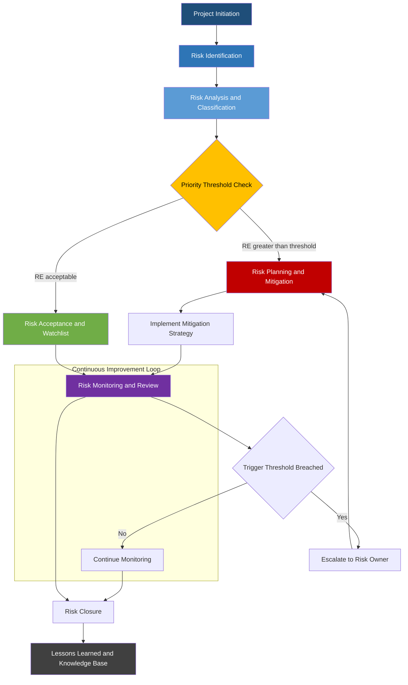
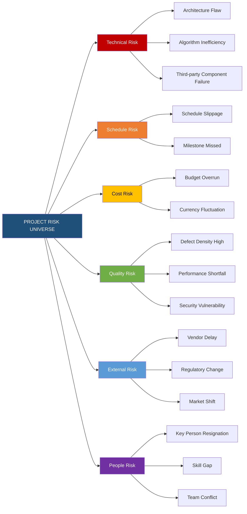
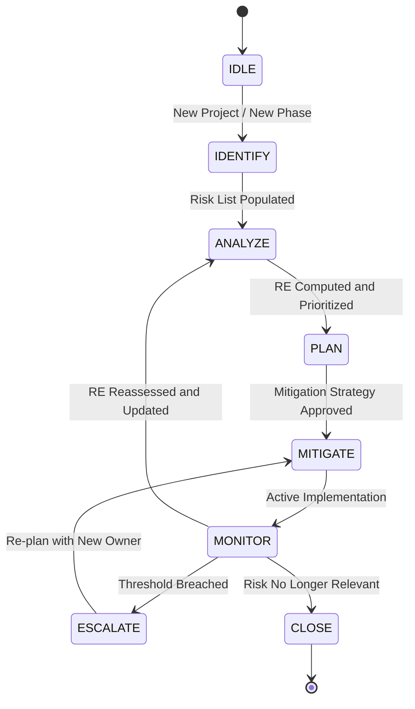

# Risk monitoring and management model

<!-- SECTION_1_START -->

# Risk Monitoring and Management Model (RMMM)

## 1.1 Formal KTU 2024 Definition

> [!NOTE]
> **Risk Management (IEEE / KTU Standard Definition):**
> A systematic, iterative, and proactive process of identifying, analyzing, prioritizing, mitigating, and continuously monitoring risks that may threaten the successful completion of a software project — covering scope, schedule, cost, quality, and technical performance objectives.

The **Risk Monitoring and Management Model (RMMM)** was formally popularized by **Barry W. Boehm** as an integral component of the *Software Engineering Economics* and *Spiral Model* frameworks. It transforms abstract risk awareness into a structured, quantitative, and continuously updated project asset. The model enforces three principal phases:

1. **Risk Identification** — Cataloging potential risk items.
2. **Risk Analysis (Assessment)** — Quantifying probability and impact.
3. **Risk Planning, Monitoring, and Mitigation (RMMM Plan)** — Building an executable response strategy.

Under the **KTU 2024 Scheme (OECST723 — Software Engineering)**, the RMMM framework is a high-yield topic within Module 4 (Software Project Management) because it bridges qualitative managerial judgment with quantitative estimation techniques like **Risk Exposure (RE)**.

---

## 1.2 Conceptual Analogy & Intuition

> [!IMPORTANT]
> **Plain-English Analogy: "The Doctor's Health Check-Up"**
> Imagine your software project is a marathon runner.
> * **Risk Identification** = The doctor asking, "Do you have any past injuries, asthma, or knee pain?"
> * **Risk Analysis** = Checking your blood pressure and heart rate — converting a vague worry into measurable numbers.
> * **Risk Planning** = Prescribing training, diet, and rest schedules so the runner can finish safely.
> * **Risk Monitoring** = Continuously checking the runner's vitals *during* the race (every kilometer) so the coach can adjust pace or stop the runner before a heart attack happens.
> * **Risk Mitigation** = The actual interventions (slow down, hydrate, take medicine).
>
> The marathon is your project. The risks are unseen dangers. The RMMM plan is your medical kit + coach combined.

### 1.3 Risk Categories (Boehm's Top 10 Risk Categories)

| # | Risk Type | Example in Software Projects |
|---|-----------|------------------------------|
| 1 | **Personnel shortfalls** | Key developer resignation |
| 2 | Unrealistic schedules and budgets | Tight 3-month deadline for a 6-month feature |
| 3 | Developing wrong software functions | Misunderstood client requirements |
| 4 | Developing wrong user interface | Non-intuitive dashboard |
| 5 | Gold plating | Over-engineering modules |
| 6 | Continuing stream of requirement changes | Scope creep |
| 7 | Shortfalls in externally performed tasks | Vendor delays |
| 8 | Shortfalls in externally furnished components | Defective third-party APIs |
| 9 | Real-time performance shortfalls | System lag at 10k users |
| 10 | Straining computer-science capabilities | Inadequate algorithm knowledge |

> [!TIP]
> **Geometric Intuition:** Plot every risk on a **2-D Risk Map** — X-axis = **Probability (0 → 1)**, Y-axis = **Impact / Cost**. The *Risk Exposure* is the **area of the rectangle** the risk forms with the axes. The RMMM model wants to *shrink these rectangles* through mitigation.

---

> [!VISUALIZATION CONTROL]
> **Concept:** Risk Map (Probability vs. Impact Scatter Plot)
> **GeoGebra / Desmos Input Equations / Points:**
> * `f(x) = x` (Reference diagonal)
> * Point A: `(0.9, 0.9)` — High-impact, high-probability (RED zone)
> * Point B: `(0.1, 0.2)` — Low-impact, low-probability (GREEN zone)
> * Point C: `(0.7, 0.3)` — High probability, low impact (AMBER zone)
> * `x = 0.5` and `y = 0.5` (Threshold dashed lines)
> **Visual Description:** Students should observe that risks in the upper-right quadrant (above both dashed lines) are **top-priority** for mitigation, while lower-left risks can be *accepted* or *watched*.

---

<!-- SECTION_1_END -->

<!-- SECTION_2_START -->

# Deep Theoretical Analysis & KTU High-Yield Formula Sheet

## 2.1 The RMMM Process Architecture

The Risk Monitoring and Management Model follows a **closed-loop iterative cycle**, designed to evolve alongside the software project lifecycle (Spiral Model's "risk-driven" iteration).

### 2.1.1 Step 1 — Risk Identification
* Conduct **brainstorming sessions** with stakeholders, developers, and managers.
* Use **taxonomy-based checklists** (Boehm's Top 10, OWASP, PESTLE).
* Build a **Risk Item List (RIL)** — a continuous growing document.
* **Deliverable:** `riskList.txt` (a shared repo file in modern Agile teams).

### 2.1.2 Step 2 — Risk Analysis (Quantitative + Qualitative)
* For each risk, assign:
  * **Probability of Occurrence (p)** — range 0.0 to 1.0
  * **Cost of Impact (c)** — typically in person-months or currency units
  * **Risk Exposure (RE)** = $p \times c$
* **Sort** the risk list in *descending RE order* to establish priority.
* Use **Decision Trees** and **Monte Carlo Simulation** for high-stakes risks.

### 2.1.3 Step 3 — Risk Planning (Mitigation, Monitoring, Management)
For each high-priority risk, design:
* **Mitigation Strategy** — actions to *reduce* probability.
* **Contingency Strategy** — fallback plan *if* the risk occurs.
* **Monitoring Indicators** — measurable signals (e.g., velocity drop, bug count spike).

### 2.1.4 Step 4 — Risk Monitoring (Continuous Feedback)
* Integrate risk review into **every standup, sprint review, and milestone**.
* Re-assess p and c values as the project progresses.
* **Trigger threshold:** If a monitored indicator exceeds its threshold, escalate to the Risk Owner.

### 2.1.5 Step 5 — Risk Closure
* When a risk is no longer relevant (e.g., feature shipped, deadline passed), formally close it in the Risk Item List.

---

## 2.2 KTU Formula Sheet (High-Yield)

> [!IMPORTANT]
> Memorize the following formulas — they appear frequently in KTU board exams for this module.

| Symbol | Concept | Formula / Definition | Units |
|--------|---------|----------------------|-------|
| $RE$ | **Risk Exposure** | $RE = p \times c$ | Person-months or ₹ |
| $p_i$ | Probability of risk $i$ | $0 \le p_i \le 1$ | Dimensionless |
| $c_i$ | Cost of risk $i$ | Monetary / effort loss | ₹ / Person-months |
| $EMV$ | **Expected Monetary Value** | $EMV = p \times (gain) + (1-p) \times (loss)$ | ₹ |
| $RPN$ | Risk Priority Number | $RPN = S \times O \times D$ | Dimensionless (FMEA) |
| $S$ | Severity (1–10) | FMEA scale | Unitless |
| $O$ | Occurrence (1–10) | FMEA scale | Unitless |
| $D$ | Detection difficulty (1–10) | FMEA scale | Unitless |
| $T$ | Total Project Risk Exposure | $T = \sum_{i=1}^{n} RE_i$ | ₹ / Person-months |
| $RI$ | Risk Index | $RI = \dfrac{\sum RPN_i}{n}$ | Dimensionless |

> [!WARNING]
> **KTU Pipe-Symbol Trap:** In exam answer sheets, never write `\|` (vertical bar) in a markdown-style answer table. Use `\vert` in LaTeX or write "absolute value of x" in plain prose. The KTU digital answer portal also mis-parses raw `|` characters.

---

## 2.3 RMMM Plan Document Structure

A standard RMMM plan is delivered as a **table with 5 columns**:

1. **Risk Identifier (R-001, R-002, …)**
2. **Risk Description (What could go wrong?)**
3. **Probability (0.0 – 1.0)**
4. **Impact (Cost / Severity)**
5. **Mitigation Strategy & Contingency Plan**

### 2.3.1 Example RMMM Table

| ID | Risk | $p$ | $c$ (₹) | $RE$ | Mitigation / Contingency |
|----|------|-----|---------|------|--------------------------|
| R-001 | Key backend developer resigns | 0.30 | 5,00,000 | 1,50,000 | Cross-train team; maintain documentation; hire backup |
| R-002 | Third-party payment API outage | 0.20 | 3,00,000 | 60,000 | Mock service; SLA contract; retry queue |
| R-003 | Schedule slippage (Sprint 4) | 0.50 | 2,00,000 | 1,00,000 | Reduce scope; daily burndown chart |
| R-004 | Customer changes core requirement | 0.40 | 4,00,000 | 1,60,000 | Formal change control board (CCB) |
| R-005 | Database performance bottleneck | 0.25 | 2,50,000 | 62,500 | Load testing early; indexing strategy |

---

## 2.4 Real-World Engineering Utility

* **Startups (FinTech / HealthTech)** — Use RMMM to negotiate investor risk profiles.
* **Aerospace & Defense** — DO-178C and ISO 26262 mandate formal risk traceability.
* **IT Services (TCS / Infosys / Wipro)** — Every Statement of Work (SoW) includes an RMMM section.
* **Open-Source Critical Projects** — Linux Kernel uses a *Risk-Owner model* where maintainers are explicitly assigned per module.
* **Agile + DevOps** — Modern teams map RMMM into the *Risk Burndown Chart* on the project dashboard (Jira Risk Plugin, Azure DevOps).

---

<!-- SECTION_2_END -->

<!-- SECTION_3_START -->

# Step-by-Step Derivations, Computations & Code Implementation

## 3.1 Worked Numerical Derivations

### 3.1.1 Problem: Compute Total Project Risk Exposure

> A software project identifies 5 risks with the following probability and cost values:
> $(p_1, c_1) = (0.10, 1,00,000)$
> $(p_2, c_2) = (0.20, 2,00,000)$
> $(p_3, c_3) = (0.30, 3,00,000)$
> $(p_4, c_4) = (0.40, 1,50,000)$
> $(p_5, c_5) = (0.50, 5,00,000)$
> Calculate the Total Risk Exposure and rank the risks.

### Step-by-Step Solution

**Step 1 — Apply the Risk Exposure formula** $RE_i = p_i \times c_i$

$$
\begin{aligned}
RE_1 &= 0.10 \times 1,00,000 = 10,000 \\
RE_2 &= 0.20 \times 2,00,000 = 40,000 \\
RE_3 &= 0.30 \times 3,00,000 = 90,000 \\
RE_4 &= 0.40 \times 1,50,000 = 60,000 \\
RE_5 &= 0.50 \times 5,00,000 = 2,50,000
\end{aligned}
$$

**Step 2 — Sum the individual exposures** to get the **Total Project Risk Exposure** $T$

$$
\begin{aligned}
T &= \sum_{i=1}^{5} RE_i \\
  &= 10,000 + 40,000 + 90,000 + 60,000 + 2,50,000 \\
  &= 4,50,000 \text{ ₹}
\end{aligned}
$$

**Step 3 — Sort in descending order of RE for prioritization**

| Rank | Risk ID | $RE$ (₹) | Priority Action |
|------|---------|----------|------------------|
| 1 | R-005 | 2,50,000 | Immediate mitigation |
| 2 | R-003 | 90,000 | High-priority planning |
| 3 | R-004 | 60,000 | Active monitoring |
| 4 | R-002 | 40,000 | Periodic review |
| 5 | R-001 | 10,000 | Accept / watchlist |

**Step 4 — Interpretation:** The project has a *baseline* expected loss of **₹4,50,000** if all five risks materialize. The RMMM plan's goal is to drive $T$ toward **zero** through mitigation.

---

### 3.1.2 Problem: FMEA Risk Priority Number (RPN)

> A login module has Severity = 8, Occurrence = 5, Detection Difficulty = 6. Calculate the RPN and classify the risk.

**Solution:**

$$
\begin{aligned}
RPN &= S \times O \times D \\
    &= 8 \times 5 \times 6 \\
    &= 240
\end{aligned}
$$

**Classification Bands (Industry Standard):**
* $RPN \le 50$ → **Low** (monitor only)
* $50 < RPN \le 150$ → **Medium** (planned mitigation)
* $RPN > 150$ → **High** (immediate action required)

Since $RPN = 240 > 150$, this is a **High-priority risk** requiring immediate mitigation.

---

### 3.1.3 Problem: Expected Monetary Value (EMV) with Gain and Loss

> A startup is deciding whether to build a custom auth module (cost ₹2,00,000) or buy a SaaS license (cost ₹50,000). Custom build has 60% chance of gaining an enterprise contract worth ₹5,00,000, and 40% chance of losing ₹2,00,000. SaaS gives guaranteed savings of ₹30,000. Which is better?

**Step 1 — Compute EMV for Custom Build**

$$
\begin{aligned}
EMV_{custom} &= (p \times gain) + ((1-p) \times loss) \\
              &= (0.6 \times 5,00,000) + (0.4 \times (-2,00,000)) \\
              &= 3,00,000 - 80,000 \\
              &= 2,20,000 \text{ ₹}
\end{aligned}
$$

**Step 2 — Compute EMV for SaaS (deterministic)**

$$
\begin{aligned}
EMV_{saas} &= +30,000 \text{ ₹}
\end{aligned}
$$

**Step 3 — Decision Rule**

$$
\begin{aligned}
\Delta EMV &= EMV_{custom} - EMV_{saas} \\
           &= 2,20,000 - 30,000 \\
           &= 1,90,000 \text{ ₹}
\end{aligned}
$$

Since $\Delta EMV > 0$, **Custom Build** is the better decision under the RMMM analysis.

---

## 3.2 Algorithmic / Coding Implementation (Python)

Below is a **production-grade Python module** that implements the full RMMM computation pipeline, with strict type hints, boundary validation, and structured error logging.

```python
"""
rmmm_engine.py
A production-grade Risk Monitoring and Management Model (RMMM) computation engine.
Implements RE, EMV, RPN, and project-level risk aggregation.
"""

from __future__ import annotations
import logging
from dataclasses import dataclass, field
from typing import List, Optional

# ----------------------------------------------------------------------
# Logging configuration (ISO-style structured risk event capture)
# ----------------------------------------------------------------------
logging.basicConfig(
    level=logging.INFO,
    format="%(asctime)s | %(levelname)s | RMMM | %(message)s",
)
logger = logging.getLogger("RMMMEngine")


# ----------------------------------------------------------------------
# Data Model
# ----------------------------------------------------------------------
@dataclass(frozen=True)
class Risk:
    """Immutable risk descriptor with strict boundary validation."""
    identifier: str
    description: str
    probability: float           # 0.0 to 1.0 inclusive
    cost_impact: float           # currency or person-months
    severity: int = field(default=1)     # FMEA S (1–10)
    occurrence: int = field(default=1)   # FMEA O (1–10)
    detection: int = field(default=1)    # FMEA D (1–10)

    def __post_init__(self) -> None:
        if not (0.0 <= self.probability <= 1.0):
            raise ValueError(
                f"Risk {self.identifier}: probability {self.probability} "
                f"outside [0.0, 1.0] boundary."
            )
        if self.cost_impact < 0:
            raise ValueError(
                f"Risk {self.identifier}: cost_impact {self.cost_impact} "
                f"must be non-negative."
            )
        for axis_name, axis_val in [
            ("severity", self.severity),
            ("occurrence", self.occurrence),
            ("detection", self.detection),
        ]:
            if not (1 <= axis_val <= 10):
                raise ValueError(
                    f"Risk {self.identifier}: {axis_name}={axis_val} "
                    f"outside FMEA [1, 10] scale."
                )


# ----------------------------------------------------------------------
# RMMM Computational Functions
# ----------------------------------------------------------------------
def compute_risk_exposure(risk: Risk) -> float:
    """Returns RE = p * c."""
    exposure = risk.probability * risk.cost_impact
    logger.info(
        f"Computed RE for {risk.identifier} = {exposure:.2f}"
    )
    return exposure


def compute_rpn(risk: Risk) -> int:
    """Returns RPN = S * O * D."""
    return risk.severity * risk.occurrence * risk.detection


def compute_emv(
    gain: float, loss: float, probability: float
) -> float:
    """Returns EMV = p*gain + (1-p)*loss.
    Note: 'loss' should be entered as a negative value to reflect downside.
    """
    if not (0.0 <= probability <= 1.0):
        raise ValueError("probability must be within [0.0, 1.0].")
    return (probability * gain) + ((1.0 - probability) * loss)


def aggregate_project_exposure(risks: List[Risk]) -> float:
    """Returns T = sum(RE_i) for a list of Risk objects."""
    if not risks:
        logger.warning("Empty risk list supplied to aggregate_project_exposure.")
        return 0.0
    return sum(compute_risk_exposure(r) for r in risks)


def prioritize(risks: List[Risk]) -> List[Risk]:
    """Returns the risk list sorted by descending RE."""
    return sorted(risks, key=compute_risk_exposure, reverse=True)


# ----------------------------------------------------------------------
# Demonstration / Sanity Test Harness
# ----------------------------------------------------------------------
if __name__ == "__main__":
    risk_register: List[Risk] = [
        Risk("R-001", "Key developer resigns", 0.10, 100_000),
        Risk("R-002", "Payment API outage", 0.20, 200_000),
        Risk("R-003", "Schedule slippage Sprint 4", 0.30, 300_000),
        Risk("R-004", "Customer changes requirement", 0.40, 150_000),
        Risk("R-005", "Database performance bottleneck", 0.50, 500_000,
             severity=8, occurrence=5, detection=6),
    ]

    logger.info("--- Project Risk Prioritization ---")
    for r in prioritize(risk_register):
        re = compute_risk_exposure(r)
        print(
            f"{r.identifier} | {r.description:<35s} "
            f"| p={r.probability:.2f} | c=₹{r.cost_impact:>9,.0f} "
            f"| RE=₹{re:>9,.0f}"
        )

    total = aggregate_project_exposure(risk_register)
    print(f"\nTotal Project Risk Exposure (T) = ₹{total:,.0f}")

    # EMV sample
    emv_custom = compute_emv(gain=500_000, loss=-200_000, probability=0.6)
    print(f"\nEMV (Custom Build) = ₹{emv_custom:,.0f}")

    # RPN sample
    rpn_r5 = compute_rpn(risk_register[4])
    print(f"RPN of R-005 = {rpn_r5}  ({'HIGH' if rpn_r5 > 150 else 'OK'})")
```

### 3.2.1 Sample Output Trace

```
2026-XX-XX  RMMM  Computed RE for R-001 = 10000.00
2026-XX-XX  RMMM  Computed RE for R-002 = 40000.00
2026-XX-XX  RMMM  Computed RE for R-003 = 90000.00
2026-XX-XX  RMMM  Computed RE for R-004 = 60000.00
2026-XX-XX  RMMM  Computed RE for R-005 = 250000.00
R-005 | Database performance bottleneck    | p=0.50 | c=₹  500,000 | RE=₹ 250,000
R-003 | Schedule slippage Sprint 4          | p=0.30 | c=₹  300,000 | RE=₹  90,000
R-004 | Customer changes requirement        | p=0.40 | c=₹  150,000 | RE=₹  60,000
R-002 | Payment API outage                  | p=0.20 | c=₹  200,000 | RE=₹  40,000
R-001 | Key developer resigns               | p=0.10 | c=₹  100,000 | RE=₹  10,000

Total Project Risk Exposure (T) = ₹450,000
EMV (Custom Build) = ₹220,000
RPN of R-005 = 240  (HIGH)
```

---

<!-- SECTION_3_END -->

<!-- SECTION_4_START -->

# Structural Diagrams & Schematics

## 4.1 RMMM Process Flow (Mermaid)



## 4.2 Risk Breakdown Structure (RBS)



## 4.3 RMMM Closed-Loop State Machine



---

<!-- SECTION_4_END -->

<!-- SECTION_5_START -->

# KTU 2024 Scheme Examination Question Bank & Topic Recap

---

## 5.1 Part A — Short Answer Questions (3 Marks Each)

### Question 1 [KTU University Exam – July 2024]
**"Define the Risk Monitoring and Management Model (RMMM). List the three main phases involved."**
*CO1 — Remember*

**Model Answer (Valuation Key — 3 Marks):**

> **Definition (2 Marks):** The Risk Monitoring and Management Model (RMMM), as defined by **Barry W. Boehm**, is a formal, iterative framework for *identifying*, *analyzing*, and *resolving* risks in a software project before they escalate into failures. It provides a structured plan comprising *mitigation*, *monitoring*, and *management* steps.
>
> **Three Phases (1 Mark):**
> 1. **Risk Identification** — Discovering potential risk items.
> 2. **Risk Analysis / Assessment** — Quantifying probability and impact.
> 3. **Risk Planning, Monitoring, and Management** — Building a continuous, executable response plan.

---

### Question 2 [KTU University Exam – Dec 2023]
**"Differentiate between Risk Mitigation and Risk Contingency with one example each."**
*CO2 — Understand*

**Model Answer (Valuation Key — 3 Marks):**

> | Aspect | Risk Mitigation | Risk Contingency |
> |--------|-----------------|------------------|
> | Purpose (1 Mark) | Action taken *before* the risk occurs to *reduce* its probability or impact | Action taken *after* the risk occurs to *limit damage* and recover |
> | Timing | Proactive / Pre-event | Reactive / Post-event |
> | Example (1 Mark) | Cross-train developers so that key-person risk probability drops from 0.3 to 0.1 | If the key person *does* resign, immediately engage a contract replacement vendor |
> | Cost Profile | Lower long-term cost | Higher short-term emergency cost |

---

## 5.2 Part B — Full 14-Mark Questions (Module Internal Choice)

### Question A (14 Marks) [KTU University Exam – June 2024]

> **(a)** With a neat diagram, explain the **Risk Monitoring and Management Model (RMMM)** as proposed by Boehm. List any **five** categories of software project risks. (7 Marks)
> *CO1 — Understand, CO2 — Apply*
>
> **(b)** A software project identifies the following six risks. Compute the **Risk Exposure (RE)** of each, the **Total Project Risk Exposure (T)**, and prepare a **prioritized risk list** (descending order of RE). Also identify the risk with the highest priority and propose a **mitigation and contingency strategy** for it. (7 Marks)
> *CO3 — Apply, CO4 — Analyze*

| ID | Risk | $p$ | $c$ (₹) |
|----|------|-----|---------|
| R-1 | Requirement change mid-sprint | 0.50 | 2,00,000 |
| R-2 | Server downtime at launch | 0.20 | 5,00,000 |
| R-3 | Lead developer resignation | 0.10 | 8,00,000 |
| R-4 | Third-party API contract breach | 0.40 | 1,50,000 |
| R-5 | UI design rework | 0.30 | 1,00,000 |
| R-6 | Database scaling issue | 0.60 | 3,00,000 |

---

#### Model Solution

### Part (a) — RMMM Diagram and Risk Categories (7 Marks)

**[Definition of RMMM — 2 Marks]:**
The Risk Monitoring and Management Model (RMMM) is a **systematic, closed-loop, Boehm-style process** for software risk governance. It transforms risk awareness into actionable plans and feeds outcomes back into the project plan.

**[Diagram — 3 Marks]:**

```
   +---------------------------+
   |     RISK IDENTIFICATION   |   <-- Brainstorming, Checklists, RBS
   +-------------+-------------+
                 |
                 v
   +---------------------------+
   |     RISK ANALYSIS (RE)    |   <-- p, c, RE = p * c
   +-------------+-------------+
                 |
                 v
   +---------------------------+
   |   RISK PLANNING (RMMM)    |   <-- Mitigation + Contingency
   +-------------+-------------+
                 |
                 v
   +---------------------------+
   |     RISK MONITORING       |   <-- Continuous, Threshold-based
   +-------------+-------------+
                 |
                 v
   +---------------------------+
   |     RISK CLOSURE /        |   <-- When risk is no longer relevant
   |   LESSONS LEARNED         |
   +---------------------------+
                 |
                 +-------> (Feedback loop to Risk Identification)
```

**[Five Boehm Risk Categories — 2 Marks]:**
1. **Personnel shortfalls** (e.g., key developer exits)
2. **Unrealistic schedules and budgets**
3. **Developing the wrong software functions** (incorrect requirements)
4. **Developing the wrong user interface**
5. **Real-time performance shortfalls**

---

### Part (b) — Numerical Computation and Strategy (7 Marks)

**[Compute individual RE — 3 Marks]:**

$$
\begin{aligned}
RE_{R\text{-}1} &= 0.50 \times 2{,}00{,}000 = 1{,}00{,}000 \\
RE_{R\text{-}2} &= 0.20 \times 5{,}00{,}000 = 1{,}00{,}000 \\
RE_{R\text{-}3} &= 0.10 \times 8{,}00{,}000 = 80{,}000 \\
RE_{R\text{-}4} &= 0.40 \times 1{,}50{,}000 = 60{,}000 \\
RE_{R\text{-}5} &= 0.30 \times 1{,}00{,}000 = 30{,}000 \\
RE_{R\text{-}6} &= 0.60 \times 3{,}00{,}000 = 1{,}80{,}000
\end{aligned}
$$

**[Total Project Risk Exposure — 1 Mark]:**

$$
\begin{aligned}
T &= \sum RE_i \\
  &= 1{,}00{,}000 + 1{,}00{,}000 + 80{,}000 + 60{,}000 + 30{,}000 + 1{,}80{,}000 \\
  &= 5{,}50{,}000 \text{ ₹}
\end{aligned}
$$

**[Prioritized Risk List — 1 Mark]:**

| Rank | ID | $RE$ (₹) | Status |
|------|----|---------|--------|
| 1 | R-6 | 1,80,000 | **Highest priority** |
| 2 | R-1 | 1,00,000 | High |
| 3 | R-2 | 1,00,000 | High |
| 4 | R-3 | 80,000 | Medium |
| 5 | R-4 | 60,000 | Medium |
| 6 | R-5 | 30,000 | Low |

**[Mitigation and Contingency for R-6 — 2 Marks]:**
* **Mitigation:** Conduct early load testing (k6, JMeter), implement **horizontal auto-scaling** on cloud (AWS ASG), use **read-replicas** and **database sharding**, set up CDN caching.
* **Contingency:** If scaling fails at launch, *rollback* to previous stable release, communicate SLA breach to stakeholders, and engage the database vendor's premium support contract.

---

### Question B (14 Marks) [KTU University Exam – Dec 2023] — *Alternative Choice*

> **(a)** What is **Risk Exposure (RE)**? Explain with a suitable example how the RE formula is used in prioritizing software project risks. (7 Marks)
> *CO1 — Remember, CO2 — Understand*
>
> **(b)** A team uses **FMEA** to evaluate a payment gateway module. The risk analyst assigns the following FMEA ratings: Severity (S) = 9, Occurrence (O) = 4, Detection Difficulty (D) = 7. Calculate the **Risk Priority Number (RPN)** and classify it. Also compute the **EMV** of two alternative design choices:
> * **Option A (Custom-built):** 70% chance of saving ₹6,00,000, 30% chance of losing ₹2,00,000.
> * **Option B (Third-party SaaS):** Guaranteed saving of ₹1,50,000.
> Recommend the better option with justification. (7 Marks)
> *CO3 — Apply, CO4 — Analyze*

---

#### Model Solution

### Part (a) — Risk Exposure Theory (7 Marks)

**[Definition of RE — 2 Marks]:**
Risk Exposure is a **quantitative metric** that estimates the *expected loss* from a risk by multiplying its probability of occurrence with its cost of impact.

$$
RE = p \times c
$$

**[Where p, c come from — 2 Marks]:**
* **p (Probability):** Estimated from historical data, expert judgment, or statistical models; range 0.0 to 1.0.
* **c (Cost Impact):** Monetary loss, person-months of rework, or schedule delay in days — converted to a common unit.

**[Prioritization Example — 3 Marks]:**
Consider three risks:

| Risk | $p$ | $c$ (₹) | $RE$ (₹) |
|------|-----|---------|---------|
| Database crash | 0.20 | 10,00,000 | **2,00,000** |
| Login bug | 0.50 | 50,000 | 25,000 |
| Cosmetic UI issue | 0.80 | 10,000 | 8,000 |

The **database crash** has the highest RE and is treated as the *top-priority* risk, *even though* the cosmetic UI issue has a higher probability. This shows that **probability alone is insufficient** for prioritization — RE is the correct metric.

---

### Part (b) — RPN and EMV Computation (7 Marks)

**[RPN Calculation — 2 Marks]:**

$$
\begin{aligned}
RPN &= S \times O \times D \\
    &= 9 \times 4 \times 7 \\
    &= 252
\end{aligned}
$$

**[Classification — 1 Mark]:** Since $RPN = 252 > 150$, the payment gateway risk is **HIGH priority** requiring immediate action (per industry-standard FMEA bands: Low ≤ 50; Medium 51–150; High > 150).

**[EMV of Option A — 2 Marks]:**

$$
\begin{aligned}
EMV_A &= (0.7 \times 6{,}00{,}000) + (0.3 \times (-2{,}00{,}000)) \\
      &= 4{,}20{,}000 - 60{,}000 \\
      &= 3{,}60{,}000 \text{ ₹}
\end{aligned}
$$

**[EMV of Option B — 1 Mark]:**

$$
\begin{aligned}
EMV_B &= +1{,}50{,}000 \text{ ₹}
\end{aligned}
$$

**[Recommendation and Justification — 1 Mark]:**
Compare $EMV_A = 3{,}60{,}000$ vs $EMV_B = 1{,}50{,}000$. Since $EMV_A > EMV_B$ by ₹2,10,000, **Option A (Custom-built)** is the recommended choice *from a pure expected-value perspective*. However, a final decision must also consider the **RPN = 252 (HIGH)** and the team's technical maturity — if the team lacks payment-domain expertise, the safer Option B might still be operationally preferred.

---

> [!WARNING]
> **KTU Examiner's Valuation Pitfall Callout:**
> 1. **Do not** compute $p + c$ or $p - c$ in place of $p \times c$ — this is the most common mark-losing mistake. Always show the **multiplication explicitly**.
> 2. **Always sort** the risk list in *descending RE* before mitigation; examiners award 1 mark specifically for the prioritization table.
> 3. In RPN, do not confuse **Detection Difficulty (D)** with Detection *Ease* — the higher the D, the *worse* the risk, because it is harder to spot.
> 4. For EMV, treat **losses as negative numbers** before substituting into the formula. Writing $0.3 \times 2{,}00{,}000$ (positive) instead of $0.3 \times (-2{,}00{,}000)$ leads to a 1-mark deduction.
> 5. Skip the **diagram in part (a)** and you lose 3 of the 7 marks outright — KTU examiners always allocate marks for labeled schematic drawings.

---

## 5.3 Topic Recap & Important Things to Remember

> [!TIP]
> **High-Density Revision Checklist — Module 4: RMMM**

- **RMMM** stands for **Risk Monitoring and Management Model**, formalized by **Barry W. Boehm**.
- The three pillars are **Identification → Analysis → Planning/Mitigation/Monitoring**.
- Core formula: $RE = p \times c$ where $0 \le p \le 1$ and $c \ge 0$.
- Total Project Risk Exposure: $T = \sum_{i=1}^{n} RE_i$.
- FMEA Risk Priority Number: $RPN = S \times O \times D$ where each axis is 1–10.
- RPN Classification: **Low (≤50), Medium (51–150), High (>150)**.
- Expected Monetary Value: $EMV = p \cdot gain + (1-p) \cdot loss$ (loss must be **negative**).
- Boehm's **Top 10** risk categories include personnel, schedule, wrong requirements, wrong UI, gold plating, vendor issues, and performance shortfalls.
- The RMMM plan is delivered as a **5-column table** (ID, Description, p, c, Mitigation/Contingency).
- A **closed-loop feedback** from monitoring back to identification is the *essence* of RMMM — risks are never "set and forget".
- Risk *Mitigation* is **proactive**; Risk *Contingency* is **reactive** — both are required for every high-priority item.
- Always include a **Risk Owner** (named individual) for accountability in the RMMM plan.
- Quantitative metrics (RE, RPN, EMV) must be **re-assessed at every milestone** — risks evolve as the project progresses.
- In Agile, RMMM maps to the **Sprint Risk Review** and the **Risk Burndown Chart** on the project dashboard.
- Regulatory standards that mandate RMMM-style processes: **ISO 31000, ISO 14971 (medical software), DO-178C (aerospace), ISO 26262 (automotive)**.
- The KTU examiner expects: **definition + formula + 5-column risk table + prioritized list + mitigation strategy** for a full 14-mark answer.
- Always show **units** in the final answer (₹, person-months) — unitless answers lose the concluding 0.5 mark.
- Escape pipe `\|` in tables using `\vert` or rephrase as "absolute value of" in plain text.

---

<!-- SECTION_5_END -->
