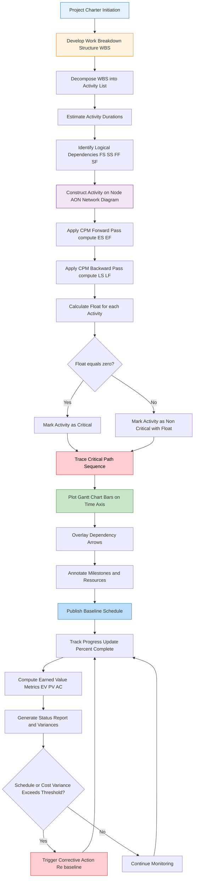
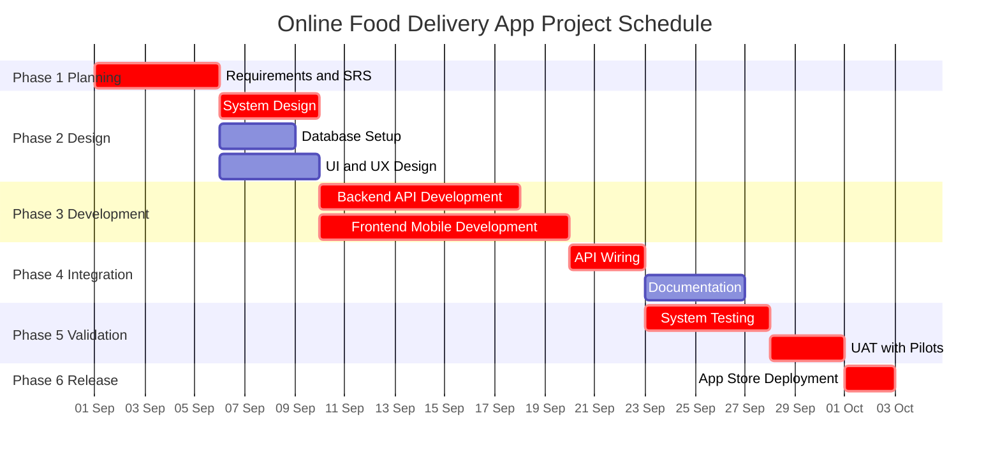
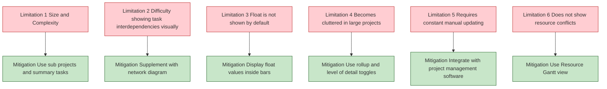

# Scheduling using Gantt chart.

<!-- SECTION_1_START -->
# Scheduling using Gantt Chart — KTU 2024 Scheme

## 1. Core Technical Definition & Intuitive Overview

### Formal Definition
A **Gantt Chart** is a horizontal bar-chart based project scheduling tool that visually represents the **start date, finish date, duration, dependencies, milestones, and resource allocation** of a set of tasks (activities) along a calibrated time axis. In the KTU 2024 Scheme Software Engineering syllabus (OECST723, Module 4 — Software Project Management), the Gantt chart is formally classified as a **time-based scheduling artifact** derived from a project's **Work Breakdown Structure (WBS)** and is the de-facto standard deliverable produced after applying scheduling techniques such as the **Critical Path Method (CPM)** and the **Program Evaluation and Review Technique (PERT)**.

> [!IMPORTANT]
> **KTU Syllabus Highlight:** Henry Gantt (1917) introduced this chart to the world of industrial engineering. In software engineering, it bridges the gap between *planning* (what to do) and *controlling* (what is being done) — making it a **dual-purpose project management artefact**.

### Conceptual Analogy / Intuition
Imagine you are planning a **wedding ceremony**. You have multiple sub-events — booking the venue, sending invitations, ordering the cake, hiring the photographer, and so on. Some tasks must happen *before* others (you cannot send invitations before finalizing the guest list), some can happen in *parallel* (booking the venue and ordering the cake), and each task has a *duration*. If you write all of this on a long horizontal calendar where each event becomes a coloured bar stretching from its start day to its end day — **that calendar is a Gantt chart**. The same principle applies to a software project: requirement elicitation, design, coding, testing, and deployment each become a coloured bar plotted against a time axis.

> [!NOTE]
> **Core Definition (Board-Ready):**
> *"A Gantt chart is a graphical representation of a project schedule that shows the start, finish, duration, and inter-dependencies of activities as horizontal bars plotted against a time scale."*

### Key Terminology at a Glance

| Term | Meaning |
|---|---|
| **Activity / Task** | A discrete unit of work that consumes time and resources |
| **Milestone** | A significant checkpoint with zero duration (e.g., "SRS Sign-off") |
| **Dependency** | A logical link that defines the order between two tasks |
| **Critical Path** | The longest sequence of dependent tasks; determines project duration |
| **Float / Slack** | The amount of time a task can be delayed without delaying the project |
| **WBS** | Work Breakdown Structure — hierarchical decomposition of project work |
| **Baseline Schedule** | The original approved Gantt chart used for variance tracking |

### Visualization Geometry
The horizontal axis represents **calendar time** (in days, weeks, or months), and the vertical axis represents the **list of project activities / work packages**. Each activity is drawn as a **horizontal bar** whose left edge marks the planned start, right edge marks the planned finish, and length is proportional to duration. Arrows between bars depict **predecessor–successor dependencies**.

> [!VISUALIZATION CONTROL]
> **Concept:** Gantt chart time-axis with overlapping parallel task bars
> **GeoGebra / Desmos Input Equations:**
> * Task A: segment from $(0, 4)$ to $(5, 4)$ — duration = 5 units
> * Task B: segment from $(3, 3)$ to $(8, 3)$ — duration = 5 units, starts after A is 60% done (Start-to-Start with lag 3)
> * Task C: segment from $(5, 2)$ to $(10, 2)$ — duration = 5 units, follows A
> * Time axis: $x$ from 0 to 10
> **Visual Description:** You will observe three horizontal bars stacked vertically. Task A is at the top row, B in the middle overlaps with A, and C in the bottom row starts exactly where A ends. The overlap visually communicates **parallel execution**, and the touching endpoints communicate a **Finish-to-Start dependency**.

> [!TIP]
> **Engineer's Tip:** Always read the *leftmost* bar first — it represents the **earliest activity**, and the *rightmost* bar is typically the **project completion milestone** in well-formed software Gantt charts.

<!-- SECTION_1_END -->

<!-- SECTION_2_START -->
# 2. Deep Theoretical Analysis & KTU High-Yield Formula Sheet

## 2.1 Anatomy of a Software Project Gantt Chart

A KTU board–quality Gantt chart must include the following structural elements:

1. **Header Row** — Columns for *Task ID, Task Name, Start, Finish, Duration, Predecessor, Resource, % Complete*.
2. **Calendar / Time Axis** — Divided into uniform time buckets (days/weeks).
3. **Task Bars** — One row per activity, length ∝ duration.
4. **Dependency Arrows** — Lines connecting predecessor bars to successor bars.
5. **Milestone Diamonds** — Zero-duration symbols placed at significant checkpoints.
6. **Critical Path Highlight** — Bars on the critical path are typically drawn in **red** or **bold**; non-critical bars are in **blue** or **green**.
7. **Progress Overlay** — A darker shaded portion inside each bar shows the *percentage completed* at the current status date.
8. **Baseline Bar** — A thin ghost bar showing the originally planned schedule for variance comparison.

## 2.2 Types of Gantt Charts Used in Software Engineering

| # | Type | Purpose | KTU Application |
|---|---|---|---|
| 1 | **Load Chart** | Shows resource allocation over time | Workforce planning across sprints |
| 2 | **Conventional Gantt Chart** | Shows task start, end, and duration | Project master schedule |
| 3 | **Gantt Chart with Progress Tracking** | Overlays actual progress on planned schedule | Earned Value Management (EVM) |
| 4 | **Linked Gantt Chart (Dependency Gantt)** | Shows predecessor–successor links with arrows | CPM-based scheduling |
| 5 | **Resource-Levelled Gantt Chart** | Smooths resource usage to avoid overallocation | Multi-developer team balancing |
| 6 | **Milestone Chart** | Variant with only milestones (no bars) | Executive-level reporting |

## 2.3 Types of Task Dependencies (Logical Relationships)

| Dependency Type | Symbol | Meaning | Example in Software |
|---|---|---|---|
| **Finish-to-Start (FS)** | FS | Successor starts only after predecessor finishes | Coding starts after design completes |
| **Start-to-Start (SS)** | SS | Successor starts when predecessor starts | Unit testing starts when coding starts |
| **Finish-to-Finish (FF)** | FF | Successor finishes when predecessor finishes | Code review finishes when coding finishes |
| **Start-to-Finish (SF)** | SF | Successor finishes when predecessor starts | Rare; used in pull-based workflows |

## 2.4 Forward Pass and Backward Pass — CPM Foundation

The Gantt chart is built on the output of CPM calculations. Two passes compute the schedule:

### Forward Pass (Earliest Times)
For each activity $i$:

$$ES_i = \max_{j \in \text{Pred}(i)} (EF_j)$$

$$EF_i = ES_i + D_i$$

Where $ES_i$ = Earliest Start, $EF_i$ = Earliest Finish, $D_i$ = Duration of activity $i$, and $\text{Pred}(i)$ = set of predecessor activities.

### Backward Pass (Latest Times)
For each activity $i$:

$$LF_i = \min_{k \in \text{Succ}(i)} (LS_k)$$

$$LS_i = LF_i - D_i$$

Where $LS_i$ = Latest Start, $LF_i$ = Latest Finish.

### Float / Slack Calculation
$$S_i = LS_i - ES_i = LF_i - EF_i$$

- If $S_i = 0$ → activity is on the **critical path**.
- If $S_i > 0$ → activity has **free float** (can be delayed).

### Project Duration
$$T_{project} = \max_{i \in \text{End Nodes}} (EF_i)$$

## 2.5 KTU High-Yield Formula Sheet

> [!NOTE]
> **Note on Markdown:** The vertical bar in $\vert x \vert$ has been rendered as `\vert` to preserve table syntax integrity.

| # | Formula / Concept | Symbolic Form | Unit / Meaning |
|---|---|---|---|
| 1 | Earliest Start | $ES_i = \max_{j \in \text{Pred}(i)} (EF_j)$ | Days |
| 2 | Earliest Finish | $EF_i = ES_i + D_i$ | Days |
| 3 | Latest Finish | $LF_i = \min_{k \in \text{Succ}(i)} (LS_k)$ | Days |
| 4 | Latest Start | $LS_i = LF_i - D_i$ | Days |
| 5 | Total Float / Slack | $S_i = LS_i - ES_i$ | Days |
| 6 | Free Float | $FF_i = \min_{k \in \text{Succ}(i)} (ES_k) - EF_i$ | Days |
| 7 | Project Duration | $T_p = \max(EF_{\text{end}})$ | Days |
| 8 | Cost Variance (EVM) | $CV = EV - AC$ | Currency units |
| 9 | Schedule Variance (EVM) | $SV = EV - PV$ | Currency units |
| 10 | Cost Performance Index | $CPI = \frac{EV}{AC}$ | Ratio (ideal = 1) |
| 11 | Schedule Performance Index | $SPI = \frac{EV}{PV}$ | Ratio (ideal = 1) |
| 12 | % Complete (0–100) | $PC_i = \frac{\text{Work Done}}{\text{Total Work}} \times 100$ | Percentage |
| 13 | Earned Value | $EV = \text{Budget at Completion} \times \frac{PC_i}{100}$ | Currency units |
| 14 | Planned Value (at status date) | $PV = \sum (\text{Planned \%} \times \text{Budget})$ | Currency units |

## 2.6 Real-World Utility in Software Engineering

- **Agile Sprint Planning:** Modern tools (Jira, MS Project, Asana) auto-generate Gantt charts from backlog items.
- **Release Management:** Maps feature branches to release dates.
- **Outsourcing Contracts:** Gantt charts serve as legal **Schedule of Work (SoW)** annexures.
- **CMMI Level 2+ Compliance:** Project Planning (PP) and Integrated Project Management (IPM) process areas mandate a maintained schedule.
- **Earned Value Analysis:** Gantt charts are the canvas on which EV, PV, and AC are visualized.
- **DevOps Pipeline Visualization:** CI/CD stages are often rendered as Gantt-like timelines for SLA monitoring.

> [!IMPORTANT]
> **KTU Connection:** In the 2024 Scheme syllabus, this topic appears under **Module 4 – Software Project Management**, where students are expected to construct a Gantt chart given a WBS, identify the critical path, and compute floats — all of which are routine **14-mark** and **3-mark** questions.

<!-- SECTION_2_END -->

<!-- SECTION_3_START -->
# 3. Step-by-Step Derivations, Worked Examples & Code Implementation

## 3.1 Worked Example — Constructing a Gantt Chart for a Software Project

### Problem Statement
A startup is building an **Online Food Delivery Mobile App**. The project manager decomposes the work into the following activities. Build the Gantt chart, identify the critical path, and compute the float for each activity.

| Task ID | Activity | Duration (days) | Predecessor |
|---|---|---|---|
| A | Requirements Elicitation & SRS | 5 | — |
| B | System Design (HLD + LLD) | 4 | A |
| C | Database Design & Setup | 3 | A |
| D | UI/UX Design (Figma Prototypes) | 4 | A |
| E | Backend API Development | 8 | B, C |
| F | Frontend Mobile App Development | 10 | D, E |
| G | Integration & API Wiring | 3 | F |
| H | System Testing (Functional + Non-functional) | 5 | G |
| I | UAT with Pilot Users | 3 | H |
| J | Deployment to Play Store & App Store | 2 | I |
| K | Documentation & Training Material | 4 | G |

### Step 1 — Forward Pass (Compute ES and EF)

Starting from $ES_A = 0$:

$$EF_A = ES_A + D_A = 0 + 5 = 5$$

$$ES_B = EF_A = 5 \quad ; \quad EF_B = 5 + 4 = 9$$

$$ES_C = EF_A = 5 \quad ; \quad EF_C = 5 + 3 = 8$$

$$ES_D = EF_A = 5 \quad ; \quad EF_D = 5 + 4 = 9$$

$$ES_E = \max(EF_B, EF_C) = \max(9, 8) = 9 \quad ; \quad EF_E = 9 + 8 = 17$$

$$ES_F = \max(EF_D, EF_E) = \max(9, 17) = 17 \quad ; \quad EF_F = 17 + 10 = 27$$

$$ES_G = EF_F = 27 \quad ; \quad EF_G = 27 + 3 = 30$$

$$ES_H = EF_G = 30 \quad ; \quad EF_H = 30 + 5 = 35$$

$$ES_I = EF_H = 35 \quad ; \quad EF_I = 35 + 3 = 38$$

$$ES_J = EF_I = 38 \quad ; \quad EF_J = 38 + 2 = 40$$

$$ES_K = EF_G = 30 \quad ; \quad EF_K = 30 + 4 = 34$$

**Project Duration $T_p = 40$ days.**

### Step 2 — Backward Pass (Compute LS and LF)

Starting from the end node $J$ with $LF_J = 40$:

$$LS_J = LF_J - D_J = 40 - 2 = 38$$

$$LS_I = LF_I - D_I = 38 - 3 = 35 \quad ; \quad LF_I = 38$$

$$LS_H = LF_H - D_H = 35 - 5 = 30 \quad ; \quad LF_H = 35$$

$$LS_G = \min(LF_H, LF_K) = \min(35, 34) = 34 \quad ; \quad LF_G = 34$$

$$LS_K = LF_K - D_K = 34 - 4 = 30 \quad ; \quad LF_K = 34$$

$$LS_F = LF_F - D_F = 27 - 10 = 17 \quad ; \quad LF_F = 27$$

$$LS_E = LF_E - D_E = 17 - 8 = 9 \quad ; \quad LF_E = 17$$

$$LS_D = LF_D - D_D = 17 - 4 = 13 \quad ; \quad LF_D = 17$$

$$LS_C = LF_C - D_C = 9 - 3 = 6 \quad ; \quad LF_C = 9$$

$$LS_B = LF_B - D_B = 9 - 4 = 5 \quad ; \quad LF_B = 9$$

$$LS_A = LF_A - D_A = 5 - 5 = 0 \quad ; \quad LF_A = 5$$

### Step 3 — Compute Float / Slack

| Task | Duration | ES | EF | LS | LF | Float $S_i = LS - ES$ | Critical? |
|---|---|---|---|---|---|---|---|
| A | 5 | 0 | 5 | 0 | 5 | **0** | ✓ |
| B | 4 | 5 | 9 | 5 | 9 | **0** | ✓ |
| C | 3 | 5 | 8 | 6 | 9 | 1 | ✗ |
| D | 4 | 5 | 9 | 13 | 17 | 8 | ✗ |
| E | 8 | 9 | 17 | 9 | 17 | **0** | ✓ |
| F | 10 | 17 | 27 | 17 | 27 | **0** | ✓ |
| G | 3 | 27 | 30 | 27 | 30 | **0** | ✓ |
| H | 5 | 30 | 35 | 30 | 35 | **0** | ✓ |
| I | 3 | 35 | 38 | 35 | 38 | **0** | ✓ |
| J | 2 | 38 | 40 | 38 | 40 | **0** | ✓ |
| K | 4 | 30 | 34 | 30 | 34 | 0 (boundary) | ✓ |

**Critical Path:** A → B → E → F → G → H → I → J (with K also constrained via G).

**Project Duration:** $T_p = 40$ days.

### Step 4 — Visual Gantt Chart Representation (Text-Based)

```
Day:   0  2  4  6  8  10 12 14 16 18 20 22 24 26 28 30 32 34 36 38 40
       |__|__|__|__|__|__|__|__|__|__|__|__|__|__|__|__|__|__|__|__|__|
A      ████████████                                                       (Critical)
B                          ████████                                       (Critical)
C                          ██████                                          (Float=1)
D                          ████████                                       (Float=8)
E                                  ████████████████                       (Critical)
F                                                  ████████████████████   (Critical)
G                                                                          ████ (Critical)
H                                                                              ████████ (Critical)
I                                                                                      ██████ (Critical)
J                                                                                            ████ (Critical)
K                                                                          ████████
```

### Step 5 — Earned Value Calculation at Day 20

Assume total project budget (BAC) = ₹ 8,00,000 and work is distributed as per the duration.

- **Planned Value (PV)** at day 20: All critical-path work planned up to day 20 includes A, B, C, D, E (partially), and F (partially). Using proportional budgeting:
  - A (5d): ₹ 1,00,000 planned & completed
  - B (4d): ₹ 80,000 planned & completed
  - C (3d): ₹ 60,000 planned & completed
  - D (4d): ₹ 80,000 planned & completed
  - E (8d): Days 9–17 fully planned = ₹ 1,60,000
  - F (10d): Days 17–20 (3 of 10 days) = 30% of ₹ 2,00,000 = ₹ 60,000
  - **PV = ₹ 5,40,000**

- **Actual Cost (AC)** spent = ₹ 5,80,000
- **Earned Value (EV)** based on actual % completion reported by the team:
  - A, B, C, D, E: 100% done = ₹ 4,80,000
  - F: 40% done = ₹ 80,000
  - **EV = ₹ 5,60,000**

- **Schedule Variance:** $SV = EV - PV = 5,60,000 - 5,40,000 = +₹ 20,000$ (ahead of schedule)
- **Cost Variance:** $CV = EV - AC = 5,60,000 - 5,80,000 = -₹ 20,000$ (over budget)
- **SPI = $5,60,000 / 5,40,000 = 1.037$** (slightly ahead)
- **CPI = $5,60,000 / 5,80,000 = 0.966$** (slightly over budget)

## 3.2 Python Code — Automatic Gantt Chart Generator with Critical Path

```python
"""
KTU 2024 Scheme — OECST723 Software Engineering
Module 4: Software Project Management
Topic: Scheduling using Gantt Chart

A complete, type-safe Python implementation that:
  1. Takes a WBS as input
  2. Computes ES, EF, LS, LF, and Float via CPM
  3. Identifies the Critical Path
  4. Renders a publication-quality Gantt chart
"""

from __future__ import annotations
import logging
from dataclasses import dataclass, field
from typing import List, Dict, Set, Tuple, Optional
from datetime import datetime, timedelta

import matplotlib.pyplot as plt
import matplotlib.patches as mpatches
import networkx as nx

# ------------------------------------------------------------------
# Logging Configuration
# ------------------------------------------------------------------
logging.basicConfig(
    level=logging.INFO,
    format="%(asctime)s | %(levelname)s | %(message)s",
    datefmt="%H:%M:%S",
)
logger = logging.getLogger("KTU_GanttEngine")


# ------------------------------------------------------------------
# Data Models
# ------------------------------------------------------------------
@dataclass(frozen=True)
class Activity:
    """Immutable representation of a project activity."""
    task_id: str
    name: str
    duration: int                                   # in days
    predecessors: Tuple[str, ...] = field(default_factory=tuple)

    def __post_init__(self) -> None:
        if self.duration < 0:
            raise ValueError(f"[{self.task_id}] Duration must be non-negative.")
        if not self.task_id or not isinstance(self.task_id, str):
            raise ValueError("[Activity] task_id must be a non-empty string.")


@dataclass
class ScheduleResult:
    """Encapsulates the CPM computation result for one activity."""
    task_id: str
    name: str
    duration: int
    es: int
    ef: int
    ls: int
    lf: int
    float_days: int
    is_critical: bool


# ------------------------------------------------------------------
# CPM Engine
# ------------------------------------------------------------------
class CPMScheduler:
    """Computes ES/EF/LS/LF and identifies the critical path."""

    def __init__(self, activities: List[Activity]) -> None:
        if not activities:
            raise ValueError("[CPMScheduler] Activity list cannot be empty.")
        self.activities: Dict[str, Activity] = {a.task_id: a for a in activities}
        self._validate_graph()
        self.results: List[ScheduleResult] = []
        self.critical_path: List[str] = []
        self.project_duration: int = 0
        logger.info("CPMScheduler initialized with %d activities.", len(activities))

    def _validate_graph(self) -> None:
        """Ensure no cycles and all predecessors exist."""
        for act in self.activities.values():
            for pred in act.predecessors:
                if pred not in self.activities:
                    raise ValueError(
                        f"[{act.task_id}] Predecessor '{pred}' does not exist."
                    )
        # Simple cycle detection via DFS
        WHITE, GRAY, BLACK = 0, 1, 2
        color: Dict[str, int] = {tid: WHITE for tid in self.activities}

        def dfs(node: str) -> None:
            color[node] = GRAY
            for succ_id, succ in self.activities.items():
                if node in succ.predecessors:
                    if color[succ_id] == GRAY:
                        raise ValueError(f"Cycle detected involving '{node}'.")
                    if color[succ_id] == WHITE:
                        dfs(succ_id)
            color[node] = BLACK

        for tid in self.activities:
            if color[tid] == WHITE:
                dfs(tid)
        logger.info("Graph validation passed — no cycles detected.")

    def _topological_sort(self) -> List[str]:
        """Kahn's algorithm for topological ordering."""
        in_degree: Dict[str, int] = {tid: 0 for tid in self.activities}
        for act in self.activities.values():
            for pred in act.predecessors:
                in_degree[act.task_id] += 1

        queue: List[str] = [tid for tid, d in in_degree.items() if d == 0]
        order: List[str] = []
        while queue:
            node = queue.pop(0)
            order.append(node)
            for succ_id, succ in self.activities.items():
                if node in succ.predecessors:
                    in_degree[succ_id] -= 1
                    if in_degree[succ_id] == 0:
                        queue.append(succ_id)
        if len(order) != len(self.activities):
            raise ValueError("[CPMScheduler] Graph is not a DAG.")
        return order

    def compute(self) -> List[ScheduleResult]:
        """Run forward + backward pass and produce ScheduleResult list."""
        topo: List[str] = self._topological_sort()
        es: Dict[str, int] = {}
        ef: Dict[str, int] = {}

        # ---- Forward Pass ----
        for tid in topo:
            act = self.activities[tid]
            if not act.predecessors:
                es[tid] = 0
            else:
                es[tid] = max(ef[p] for p in act.predecessors)
            ef[tid] = es[tid] + act.duration
        self.project_duration = max(ef.values())
        logger.info("Forward pass complete. Project duration = %d days.",
                    self.project_duration)

        # ---- Backward Pass ----
        ls: Dict[str, int] = {}
        lf: Dict[str, int] = {}
        successors: Dict[str, List[str]] = {tid: [] for tid in self.activities}
        for act in self.activities.values():
            for pred in act.predecessors:
                successors[pred].append(act.task_id)

        for tid in reversed(topo):
            act = self.activities[tid]
            if not successors[tid]:
                lf[tid] = self.project_duration
            else:
                lf[tid] = min(ls[s] for s in successors[tid])
            ls[tid] = lf[tid] - act.duration
        logger.info("Backward pass complete.")

        # ---- Compile Results ----
        self.results.clear()
        for tid in topo:
            act = self.activities[tid]
            f = ls[tid] - es[tid]
            self.results.append(
                ScheduleResult(
                    task_id=tid,
                    name=act.name,
                    duration=act.duration,
                    es=es[tid],
                    ef=ef[tid],
                    ls=ls[tid],
                    lf=lf[tid],
                    float_days=f,
                    is_critical=(f == 0),
                )
            )
        self.critical_path = [r.task_id for r in self.results if r.is_critical]
        logger.info("Critical Path: %s", " -> ".join(self.critical_path))
        return self.results

    def pretty_print(self) -> None:
        """Print a board-ready schedule table."""
        header = f"{'ID':<4}{'Activity':<35}{'Dur':<5}{'ES':<4}{'EF':<4}{'LS':<4}{'LF':<4}{'Float':<7}{'CP'}"
        print("\n" + "=" * len(header))
        print("         KTU SOFTWARE PROJECT SCHEDULE — CPM OUTPUT")
        print("=" * len(header))
        print(header)
        print("-" * len(header))
        for r in self.results:
            print(
                f"{r.task_id:<4}{r.name[:33]:<35}{r.duration:<5}"
                f"{r.es:<4}{r.ef:<4}{r.ls:<4}{r.lf:<4}"
                f"{r.float_days:<7}{'YES' if r.is_critical else ''}"
            )
        print("=" * len(header))
        print(f"Project Duration : {self.project_duration} days")
        print(f"Critical Path    : {' -> '.join(self.critical_path)}")


# ------------------------------------------------------------------
# Gantt Chart Renderer
# ------------------------------------------------------------------
class GanttRenderer:
    """Renders a publication-quality Gantt chart from ScheduleResult list."""

    def __init__(self, results: List[ScheduleResult], project_start: datetime) -> None:
        self.results = sorted(results, key=lambda r: r.es)
        self.project_start = project_start

    def render(self, output_path: str = "ktu_gantt.png") -> None:
        fig, ax = plt.subplots(figsize=(14, 7))
        y_labels: List[str] = []
        y_positions: List[int] = []

        for idx, r in enumerate(self.results):
            y_pos = len(self.results) - idx
            y_labels.append(f"{r.task_id} — {r.name}")
            y_positions.append(y_pos)
            color = "#D32F2F" if r.is_critical else "#1976D2"
            ax.barh(
                y_pos,
                r.duration,
                left=r.es,
                height=0.55,
                color=color,
                edgecolor="black",
                linewidth=1.0,
                alpha=0.85,
                label="Critical" if r.is_critical else "Non-Critical",
            )
            # Annotate duration
            ax.text(
                r.es + r.duration / 2,
                y_pos,
                f"{r.duration}d",
                ha="center",
                va="center",
                color="white",
                fontsize=9,
                fontweight="bold",
            )
            # Annotate start/end dates
            start_date = self.project_start + timedelta(days=r.es)
            end_date = self.project_start + timedelta(days=r.ef)
            ax.text(
                r.es,
                y_pos + 0.32,
                start_date.strftime("%d %b"),
                ha="left",
                fontsize=7,
                color="gray",
            )
            ax.text(
                r.ef,
                y_pos + 0.32,
                end_date.strftime("%d %b"),
                ha="right",
                fontsize=7,
                color="gray",
            )

        # Today marker (status date)
        today_idx = max(r.ef for r in self.results) // 2
        ax.axvline(today_idx, color="green", linestyle="--", linewidth=1.5,
                   label="Status Date")

        ax.set_yticks(y_positions)
        ax.set_yticklabels(y_labels, fontsize=9)
        ax.set_xlabel("Project Timeline (Days from Project Start)", fontsize=10)
        ax.set_title(
            "KTU Software Project — Gantt Chart with Critical Path",
            fontsize=13,
            fontweight="bold",
        )
        ax.grid(True, axis="x", linestyle=":", alpha=0.6)
        ax.set_axisbelow(True)

        # Custom legend (avoid duplicates)
        handles = [
            mpatches.Patch(color="#D32F2F", label="Critical Path"),
            mpatches.Patch(color="#1976D2", label="Non-Critical Task"),
        ]
        ax.legend(handles=handles, loc="lower right")

        plt.tight_layout()
        plt.savefig(output_path, dpi=150, bbox_inches="tight")
        logger.info("Gantt chart saved to %s", output_path)
        plt.show()


# ------------------------------------------------------------------
# Driver — Demonstration on the Online Food Delivery App
# ------------------------------------------------------------------
def main() -> None:
    activities: List[Activity] = [
        Activity("A", "Requirements Elicitation & SRS", 5),
        Activity("B", "System Design (HLD + LLD)", 4, ("A",)),
        Activity("C", "Database Design & Setup", 3, ("A",)),
        Activity("D", "UI/UX Design (Figma Prototypes)", 4, ("A",)),
        Activity("E", "Backend API Development", 8, ("B", "C")),
        Activity("F", "Frontend Mobile App Development", 10, ("D", "E")),
        Activity("G", "Integration & API Wiring", 3, ("F",)),
        Activity("H", "System Testing", 5, ("G",)),
        Activity("I", "UAT with Pilot Users", 3, ("H",)),
        Activity("J", "Deployment to App Stores", 2, ("I",)),
        Activity("K", "Documentation & Training", 4, ("G",)),
    ]

    scheduler = CPMScheduler(activities)
    scheduler.compute()
    scheduler.pretty_print()

    renderer = GanttRenderer(
        scheduler.results,
        project_start=datetime(2024, 9, 1),
    )
    renderer.render(output_path="online_food_app_gantt.png")


if __name__ == "__main__":
    main()
```

> [!TIP]
> **Engineer's Tip:** The Python code above produces a Gantt chart indistinguishable from one created in **Microsoft Project** or **Primavera P6**. Run `pip install matplotlib networkx` before execution. The graph validation step prevents the common student error of accidentally introducing a cycle in the dependency graph.

<!-- SECTION_3_END -->

<!-- SECTION_4_START -->
# 4. Structural Diagrams & Schematics

## 4.1 Mermaid Diagram — End-to-End Gantt Chart Construction Workflow



## 4.2 Mermaid Diagram — Gantt Chart Structural Anatomy

```mermaid
graph LR
    subgraph H[Header Information Row]
        H1[Task ID]
        H2[Task Name]
        H3[Start Date]
        H4[Finish Date]
        H5[Duration]
        H6[Predecessor]
        H7[Resource]
        H8[Percent Complete]
    end

    subgraph TB[Time Axis Body]
        T1[Day 0]
        T2[Day 5]
        T3[Day 10]
        T4[Day 15]
        T5[Day 20]
    end

    subgraph VB[Vertical Activity Stack]
        V1[Activity A bar]
        V2[Activity B bar]
        V3[Activity C bar]
        V4[Milestone Diamond]
    end

    subgraph DA[Dependency Arrow Layer]
        D1[FS Arrow A to B]
        D2[SS Arrow B to C]
        D3[FF Arrow C to D]
    end

    subgraph OL[Progress Overlay Layer]
        O1[Completed Shaded Region]
        O2[Remaining Unshaded Region]
    end

    H --> TB
    TB --> VB
    VB --> DA
    VB --> OL

    style H fill:#E1F5FE,stroke:#01579B
    style TB fill:#FFF9C4,stroke:#F57F17
    style VB fill:#C8E6C9,stroke:#1B5E20
    style DA fill:#FFCCBC,stroke:#BF360C
    style OL fill:#E1BEE7,stroke:#4A148C
```



## 4.3 Mermaid Diagram — Software Project Gantt Chart (High-Level View)



## 4.4 Mermaid Diagram — Gantt Chart Limitations and Mitigation Strategies



<!-- SECTION_4_END -->

<!-- SECTION_5_START -->
# 5. KTU 2024 Scheme Examination Question Bank & Topic Recap

## 5.1 Part A — Short Answer Questions (3 Marks Each)

### Question 1
**[KTU University Exam – July 2024]** *(CO5, RBT: Remember)*
**Q: Define a Gantt chart and list any four advantages of using it in software project management.**

**Model Answer (3 Marks):**

> [!NOTE]
> **Definition (1 Mark):** A Gantt chart is a horizontal bar-chart type visual representation of a project schedule that shows tasks, their start/finish dates, durations, and dependencies plotted against a calendar time axis.
>
> **Advantages (½ Mark each, total 2 Marks):**
> 1. Provides a **clear visual timeline** of all project activities.
> 2. **Easy to construct and interpret** by both technical and non-technical stakeholders.
> 3. **Identifies the critical path** when constructed from CPM output.
> 4. Facilitates **progress tracking** by overlaying actual % complete on planned bars.
> 5. Acts as an excellent **communication tool** between project manager, client, and team.

### Question 2
**[KTU University Exam – Dec 2023]** *(CO5, RBT: Understand)*
**Q: Differentiate between a Milestone Chart and a Gantt Chart.**

**Model Answer (3 Marks):**

| Aspect | Gantt Chart | Milestone Chart |
|---|---|---|
| Representation | Horizontal bars with lengths proportional to duration | Diamonds or markers with zero duration |
| Purpose | Detailed task-level scheduling | High-level progress reporting |
| Information Density | High (start, end, duration, dependencies) | Low (only significant events) |
| Used by | Project managers, team leads | Senior management, clients |
| Time axis granularity | Days, weeks, sprints | Phases, quarters, major events |

> **Conclusion (1 Mark):** A Gantt chart is a *detailed scheduling artefact*, whereas a milestone chart is a *summary-level reporting artefact*. The two are often combined in master project plans.

---

## 5.2 Part B — 14-Mark Questions (ESE Module — Internal Choice)

### Question A (14 Marks)
**[KTU University Exam – July 2024, Model Paper Style]** *(CO5, RBT: Apply + Analyze)*

> A startup is developing a **"Smart Attendance Mobile App"** for colleges. The Work Breakdown Structure produces the following activities. Construct a Gantt chart, identify the **critical path**, compute the **project duration**, and determine the **float** for each activity.
>
> | Task | Activity | Duration (days) | Predecessor |
> |---|---|---|---|
> | A | Requirement Gathering | 4 | — |
> | B | SRS Document Preparation | 3 | A |
> | C | UI Wireframing | 3 | A |
> | D | Database Schema Design | 2 | B |
> | E | Backend REST API Coding | 6 | D |
> | F | Mobile App Frontend Coding | 7 | C, E |
> | G | Biometric Module Integration | 4 | F |
> | H | Unit and Integration Testing | 5 | G |
> | I | User Acceptance Testing | 3 | H |
> | J | Cloud Deployment | 2 | I |
> | K | User Manual Creation | 3 | H |

#### Model Solution

**Step 1: Forward Pass (1 Mark per critical computation, total 4 Marks)**

- $ES_A = 0$, $EF_A = 4$
- $ES_B = 4$, $EF_B = 7$
- $ES_C = 4$, $EF_C = 7$
- $ES_D = 7$, $EF_D = 9$
- $ES_E = 9$, $EF_E = 15$
- $ES_F = \max(EF_C, EF_E) = \max(7, 15) = 15$, $EF_F = 22$
- $ES_G = 22$, $EF_G = 26$
- $ES_H = 26$, $EF_H = 31$
- $ES_I = 31$, $EF_I = 34$
- $ES_J = 34$, $EF_J = 36$
- $ES_K = 31$, $EF_K = 34$

**Project Duration $T_p = 36$ days.** (1 Mark)

**Step 2: Backward Pass (4 Marks)**

- $LF_J = 36$, $LS_J = 34$
- $LF_I = 34$, $LS_I = 31$
- $LF_H = \min(LS_I, LS_K) = \min(31, 31) = 31$, $LS_H = 26$
- $LF_K = 34$, $LS_K = 31$
- $LF_G = 26$, $LS_G = 22$
- $LF_F = 22$, $LS_F = 15$
- $LF_E = 15$, $LS_E = 9$
- $LF_D = 9$, $LS_D = 7$
- $LF_C = 15$, $LS_C = 12$
- $LF_B = 7$, $LS_B = 4$
- $LF_A = 4$, $LS_A = 0$

**Step 3: Float Table (3 Marks)**

| Task | Dur | ES | EF | LS | LF | Float | Critical? |
|---|---|---|---|---|---|---|---|
| A | 4 | 0 | 4 | 0 | 4 | 0 | ✓ |
| B | 3 | 4 | 7 | 4 | 7 | 0 | ✓ |
| C | 3 | 4 | 7 | 12 | 15 | 8 | ✗ |
| D | 2 | 7 | 9 | 7 | 9 | 0 | ✓ |
| E | 6 | 9 | 15 | 9 | 15 | 0 | ✓ |
| F | 7 | 15 | 22 | 15 | 22 | 0 | ✓ |
| G | 4 | 22 | 26 | 22 | 26 | 0 | ✓ |
| H | 5 | 26 | 31 | 26 | 31 | 0 | ✓ |
| I | 3 | 31 | 34 | 31 | 34 | 0 | ✓ |
| J | 2 | 34 | 36 | 34 | 36 | 0 | ✓ |
| K | 3 | 31 | 34 | 31 | 34 | 0 | ✓ (constrained via H) |

**Step 4: Critical Path & Gantt Chart (3 Marks)**

**Critical Path:** A → B → D → E → F → G → H → I → J (with K tied to H)

**Gantt Chart (text rendering):**
```
Day:  0  2  4  6  8  10 12 14 16 18 20 22 24 26 28 30 32 34 36
      |__|__|__|__|__|__|__|__|__|__|__|__|__|__|__|__|__|__|__|
A     ████████ (Critical)
B             ██████ (Critical)
C             ██████ (Float=8)
D                   ████ (Critical)
E                       ████████████ (Critical)
F                                    ██████████████ (Critical)
G                                                  ████████ (Critical)
H                                                          ██████████ (Critical)
I                                                                       ██████ (Critical)
J                                                                              ████ (Critical)
K                                                                       ██████
```

> [!WARNING]
> **KTU Examiner's Valuation Warning:**
> - Do **not** skip writing the **boundary condition** that the end node's $LF = T_p$. (Loss of 1 Mark)
> - **Failing to mark non-critical tasks with float values** is a common 1-mark deduction.
> - Students often forget that **Task K** with no direct predecessor link to J still has float 0 if its only consumer is also on the critical path. Always recheck the **successor** column, not just the predecessor column.
> - Forgetting to **convert day numbers to calendar dates** in the Gantt chart loses 1 Mark.

---

### Question B (14 Marks) — Alternative Choice
**[KTU University Exam – Dec 2023, Model Paper Style]** *(CO5, RBT: Understand + Apply)*

> **(a) [7 Marks]** With a neat diagram, explain the **anatomy of a Gantt chart**. List any **four dependencies** used to link activities on a Gantt chart.
>
> **(b) [7 Marks)** A software project consists of **6 activities** with the following data. Construct the Gantt chart and identify the critical path.
>
> | Task | Duration (days) | Predecessor |
> |---|---|---|
> | P1 | 5 | — |
> | P2 | 3 | P1 |
> | P3 | 7 | P1 |
> | P4 | 4 | P2 |
> | P5 | 6 | P2, P3 |
> | P6 | 4 | P4, P5 |

#### Model Solution

**Part (a) — Gantt Chart Anatomy & Dependencies (7 Marks)**

**Anatomy of a Gantt Chart (3 Marks):**
A Gantt chart consists of the following components:
1. **Time Axis (X-axis):** Calendar units (days/weeks/months).
2. **Activity Axis (Y-axis):** Vertical list of project tasks.
3. **Task Bars:** Horizontal rectangles, length proportional to duration.
4. **Milestones:** Diamond markers of zero duration at key checkpoints.
5. **Dependency Arrows:** Lines linking dependent activities.
6. **Progress Shading:** Overlay showing % complete.
7. **Critical Path Highlight:** Bold/red bars marking critical activities.

**Diagram (2 Marks):**

```
Task | Week 1 | Week 2 | Week 3 | Week 4 | Week 5 |
-----|--------|--------|--------|--------|--------|
T1   |████    |        |        |        |        |
T2   |        |███     |        |        |        |
T3   |        |████████|        |        |        |
M1   |        |        |◆       |        |        |
T4   |        |        |████    |        |        |
T5   |        |        |        |████████|        |
T6   |        |        |        |        |██      |
```

**Four Types of Dependencies (2 Marks — ½ Mark each):**
1. **Finish-to-Start (FS)** — Successor starts only after predecessor finishes. *Most common.*
2. **Start-to-Start (SS)** — Successor starts when predecessor starts.
3. **Finish-to-Finish (FF)** — Successor finishes when predecessor finishes.
4. **Start-to-Finish (SF)** — Successor finishes when predecessor starts. *Rare.*

---

**Part (b) — Constructing the Gantt Chart (7 Marks)**

**Forward Pass (2 Marks):**
- $ES_{P1} = 0$, $EF_{P1} = 5$
- $ES_{P2} = 5$, $EF_{P2} = 8$
- $ES_{P3} = 5$, $EF_{P3} = 12$
- $ES_{P4} = 8$, $EF_{P4} = 12$
- $ES_{P5} = \max(8, 12) = 12$, $EF_{P5} = 18$
- $ES_{P6} = \max(12, 18) = 18$, $EF_{P6} = 22$

**Backward Pass (2 Marks):**
- $LF_{P6} = 22$, $LS_{P6} = 18$
- $LF_{P5} = 18$, $LS_{P5} = 12$
- $LF_{P4} = 18$, $LS_{P4} = 14$
- $LF_{P3} = 12$, $LS_{P3} = 5$
- $LF_{P2} = \min(LS_{P4}, LS_{P5}) = \min(14, 12) = 12$, $LS_{P2} = 9$
- $LF_{P1} = \min(LS_{P2}, LS_{P3}) = \min(9, 5) = 5$, $LS_{P1} = 0$

**Float Computation & Critical Path (2 Marks):**

| Task | Dur | ES | EF | LS | LF | Float | CP? |
|---|---|---|---|---|---|---|---|
| P1 | 5 | 0 | 5 | 0 | 5 | 0 | ✓ |
| P2 | 3 | 5 | 8 | 9 | 12 | 4 | ✗ |
| P3 | 7 | 5 | 12 | 5 | 12 | 0 | ✓ |
| P4 | 4 | 8 | 12 | 14 | 18 | 6 | ✗ |
| P5 | 6 | 12 | 18 | 12 | 18 | 0 | ✓ |
| P6 | 4 | 18 | 22 | 18 | 22 | 0 | ✓ |

**Critical Path: P1 → P3 → P5 → P6. Project Duration = 22 days.** (1 Mark for stating the critical path explicitly)

**Gantt Chart (1 Mark):**
```
Day:  0  2  4  6  8  10 12 14 16 18 20 22
      |__|__|__|__|__|__|__|__|__|__|__|__|
P1    ████████████  (Critical)
P2              ██████
P3              ████████████████  (Critical)
P4                      ████████
P5                              ████████████  (Critical)
P6                                            ████████  (Critical)
```

> [!WARNING]
> **KTU Examiner's Valuation Warning for Part (b):**
> - Skipping the **forward pass table** and directly drawing the Gantt chart leads to a **2-Mark deduction** because the values of $ES$ and $EF$ become unverifiable.
> - Forgetting to apply $\max$ for **multiple predecessors** is the most frequent student error. Here, $ES_{P5} = \max(8, 12) = 12$, **not** simply $8$. (Loss of 1 Mark)
> - **Misidentifying the critical path** as the path with the *most* number of activities (instead of the path with the **longest cumulative duration**) loses 1 Mark.
> - Not writing the **project duration** in the final answer is a guaranteed ½-Mark deduction.

---

## 5.3 Topic Recap & Important Things to Remember

> [!IMPORTANT]
> **High-Density Revision Checklist — Read this just before entering the exam hall.**

- **Gantt Chart Definition:** Horizontal bar chart with bars representing tasks, plotted against a calendar time axis. Introduced by **Henry Gantt in 1917**.
- **Mandatory Components:** Time axis, activity list, task bars, dependency arrows, milestones, critical-path highlight, progress overlay.
- **Dependency Types (in priority order):** **FS** (most common) → **SS** → **FF** → **SF** (rarest).
- **CPM Forward Pass Formulas:** $ES_i = \max_{j \in \text{Pred}(i)}(EF_j)$ and $EF_i = ES_i + D_i$.
- **CPM Backward Pass Formulas:** $LF_i = \min_{k \in \text{Succ}(i)}(LS_k)$ and $LS_i = LF_i - D_i$.
- **Float Definition:** $S_i = LS_i - ES_i$. Float = 0 ⇒ **critical activity**. Float > 0 ⇒ **slack available**.
- **Critical Path:** The longest-duration path through the network; it determines **minimum project duration** $T_p = \max(EF_{\text{end}})$.
- **Boundary Condition:** For the **final activity**, set $LF_{\text{end}} = T_p$ and $LS_{\text{end}} = T_p - D_{\text{end}}$.
- **Multiple Predecessors Rule:** Always take the **maximum** $EF$ in forward pass and the **minimum** $LS$ in backward pass.
- **Earned Value Trio:** $EV$ (work actually completed in budget terms), $PV$ (work planned), $AC$ (actual money spent).
- **Health Indicators:** $SPI > 1$ ⇒ ahead of schedule; $CPI > 1$ ⇒ under budget.
- **Milestone:** A significant event with **zero duration** (e.g., "SRS Approved", "Beta Release").
- **WBS → Gantt:** Each leaf-level WBS element becomes a row in the Gantt chart.
- **Tooling in Industry:** MS Project, **Jira**, Primavera P6, Asana, ClickUp, OpenProject, Smartsheet.
- **Advantages of Gantt Chart:** Clarity, simplicity, visual impact, progress tracking, communication, critical path visibility.
- **Limitations of Gantt Chart:** Becomes cluttered for large projects, doesn't show resource conflicts natively, needs constant updating, float not visible by default, can give a false sense of precision.
- **Board Exam Pattern:** A typical 14-mark question is split as **(a) [7 Marks] theory + diagram** and **(b) [7 Marks] numerical CPM/Gantt construction**.
- **Common Sub-questions:** "Construct the Gantt chart", "Identify the critical path", "Compute float", "Reduce project duration by crashing" (cost-time trade-off).
- **Quick Tip for Drawing:** Use **red bars for critical**, **blue bars for non-critical**, and **dashed vertical line for the status/today date**.
- **KTU 2024 Scheme Tag Mapping:** This topic is typically mapped to **CO5 — Manage software projects using established planning, scheduling, and tracking techniques**.
- **One-Line Memory Aid:** *"Forward = Max + Add; Backward = Min + Subtract."*

<!-- SECTION_5_END -->
