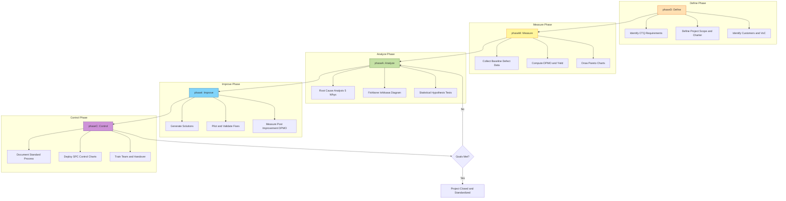
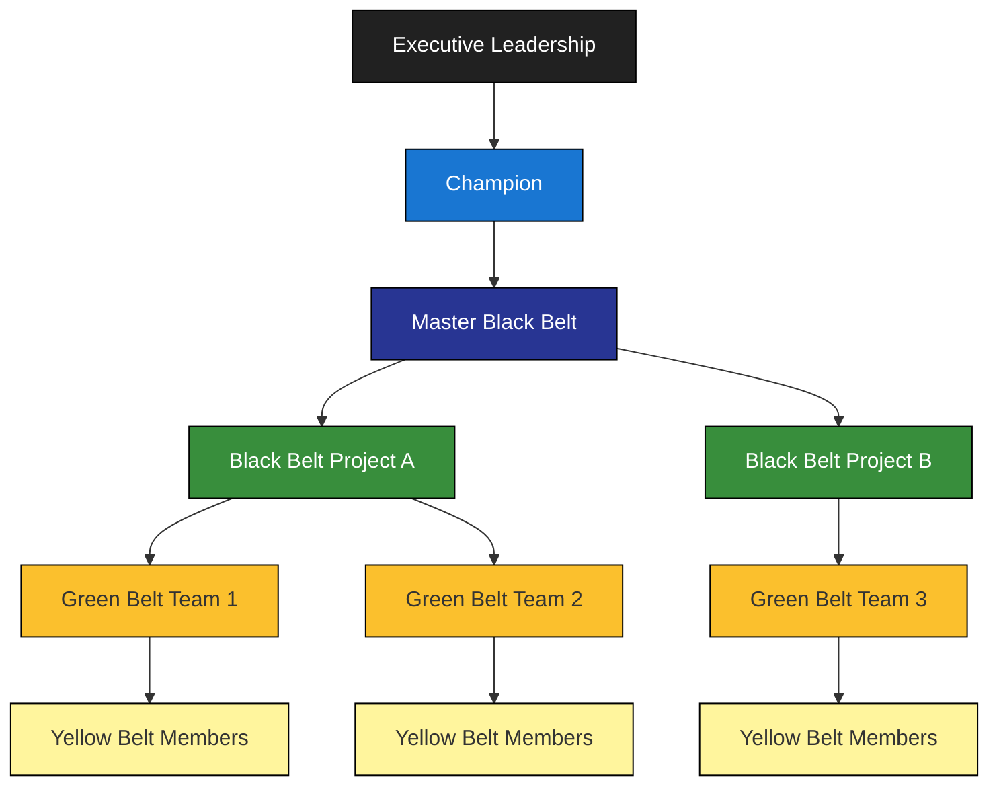
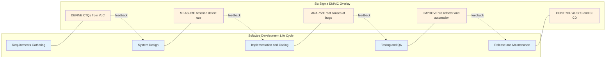

# Six Sigma for software engineering.

<!-- SECTION_1_START -->

# Six Sigma for Software Engineering

## 1. Core Technical Definition & Intuitive Overview

> [!IMPORTANT]
> **Formal Definition (KTU 2024 OECST723 Terminology):**
> **Six Sigma** is a **data-driven quality management methodology** that seeks to improve process quality by identifying and removing the causes of defects (errors) and minimizing variability in manufacturing and business processes. It uses a set of **statistical quality-management methods** and creates a special infrastructure of people within the organization (Green Belts, Black Belts, etc.) who are experts in these methods. In software engineering, Six Sigma is adapted as a **defect-prevention and process-improvement framework** that targets no more than **3.4 Defects Per Million Opportunities (DPMO)**.

The term *Sigma* refers to the **standard deviation ($\sigma$)** — a statistical measure of process variability. A process operating at **"Six Sigma"** quality performs at a level where the specification limits are **6 standard deviations** away from the process mean, leaving almost zero room for variation that could cause defects.

> [!NOTE]
> **Origin & History (Syllabus Highlight):**
> Six Sigma was pioneered at **Motorola** in **1986** by engineer **Bill Smith**, under the leadership of **Bob Galvin**. It was later popularized by **General Electric (GE)** under **Jack Welch** in 1995, becoming a global standard for quality management. *Lean Six Sigma* combines Six Sigma with *Lean Manufacturing* (elimination of waste) — particularly relevant in modern Agile/DevOps environments.

### Conceptual Analogy / Intuition

Imagine you are a **baker baking chocolate cookies** 🍪 for a luxury café. Your *specification limit* is that the cookies must be **perfectly round and uniformly brown**.

- **1 Sigma**: Cookies are sometimes burnt, sometimes raw, often misshapen. Quality is **unpredictable**. Customers complain frequently.
- **3 Sigma**: Cookies are mostly okay, but every batch has a few "off" ones. You need constant inspection.
- **6 Sigma**: Almost **every single cookie** is perfect. Defects are so rare they are statistically negligible. The process is *self-correcting* and *predictable*.

In **software engineering**, the "cookies" are **software modules / releases**, and the "defects" are **bugs, crashes, or functional failures**. Six Sigma pushes the software development process to be so robust that defects become a statistical rarity.

> [!TIP]
> **Real-World Engineering Connection:**
> Tech giants like **Microsoft, IBM, and Infosys** use Six Sigma principles to reduce software defects before release. **Infosys** established its own **"Infosys Quality Framework"** blending Six Sigma with **CMMI** and **Agile**, training thousands of engineers as Green Belts and Black Belts to improve delivery quality.

### Physical Constants & Standard Metrics

The Six Sigma framework rests on a few foundational statistical values:

| Metric | Value | Meaning |
| :--- | :--- | :--- |
| **Defects Per Million Opportunities (DPMO)** | **3.4** | The target maximum at Six Sigma quality |
| **Process Yield at 6σ** | **99.9997\%** | Percentage of outputs free of defects |
| **Standard Six Sigma Spread** | **$12\sigma$** | The total specification width is 12σ (6σ on each side of the mean) |
| **Shift Allowance** | **$1.5\sigma$** | Allowance for long-term process drift (Motorola convention) |

> [!VISUALIZATION CONTROL]
> **Concept:** Normal Distribution Curve under Six Sigma vs Lower Sigma Levels
> **GeoGebra / Desmos Input Equations:**
> * $f(x) = \dfrac{1}{\sqrt{2\pi}}\cdot e^{-x^{2}/2}$  *(standard normal PDF)*
> * Specification Limits: $x = -6$ and $x = +6$  *(6-sigma process)*
> * Specification Limits: $x = -3$ and $x = +3$  *(3-sigma process)*
> **Visual Description:** A symmetric bell curve centered at the origin. The horizontal line marks the upper and lower specification limits (USL and LSL). For a **3-sigma** process, the tails of the curve spill *outside* the limits, representing visible defects. For a **6-sigma** process, the entire bell is comfortably contained within the limits — the tails are so far away that defects are virtually impossible.

<!-- SECTION_1_END -->

<!-- SECTION_2_START -->

# 2. Deep Theoretical Analysis & KTU High-Yield Formula Sheet

## 2.1 The Core Philosophy: Variability Reduction

The central premise of Six Sigma is that **all processes exhibit variation**, and that **defects arise from excessive variation**. The methodology therefore focuses on:
1. **Measuring** the existing variation quantitatively.
2. **Analyzing** the root causes of that variation.
3. **Controlling** the process so that variation falls within acceptable specification limits.

This makes Six Sigma fundamentally different from traditional **quality inspection** — it does not *find* defects after the fact; it **engineers the process to not produce them in the first place**.

## 2.2 The DMAIC Framework (The Heart of Six Sigma)

Every Six Sigma project follows the structured **DMAIC** cycle. This is *the* high-yield topic for KTU exams.

> [!IMPORTANT]
> **DMAIC = Define $\rightarrow$ Measure $\rightarrow$ Analyze $\rightarrow$ Improve $\rightarrow$ Control**

- **D — Define:** Identify the problem, the customer (CTQ = *Critical-to-Quality* requirements), and the project scope. In software: define which module / release / defect category is the focus.
- **M — Measure:** Quantify the current process performance. Collect defect data, compute baseline DPMO, draw Pareto charts.
- **A — Analyze:** Use statistical tools to isolate the **vital few** root causes of defects. Tools: Fishbone (Ishikawa) diagrams, 5-Whys, regression, hypothesis testing.
- **I — Improve:** Implement solutions that target the root causes. In software: refactoring, automation, code reviews, unit testing frameworks.
- **C — Control:** Lock in the improvements using **Statistical Process Control (SPC)** charts, FMEA, and process documentation so the gains are not lost.

### Supplementary Framework: DMADV

For designing *new* processes or products (e.g., a brand-new software platform from scratch), Six Sigma uses **DMADV**:
- **D**efine $\rightarrow$ **M**easure $\rightarrow$ **A**nalyze $\rightarrow$ **D**esign $\rightarrow$ **V**erify.

## 2.3 Six Sigma Roles (Belt System)

Six Sigma practitioners are organized into a hierarchy modelled on martial arts ranking:

| Role | Responsibility | Typical Level |
| :--- | :--- | :--- |
| **Champion** | Senior leader sponsoring Six Sigma projects, sets strategic direction | Executive |
| **Master Black Belt** | Expert mentor; trains and coaches Black Belts; manages the program | Senior Expert |
| **Black Belt** | Full-time project leader; leads DMAIC teams; deep statistical expertise | Project Lead |
| **Green Belt** | Part-time team member; leads smaller projects under Black Belt guidance | Team Member |
| **Yellow Belt** | Basic awareness; supports data collection and process mapping | Entry-level |

## 2.4 KTU High-Yield Formula Sheet

> [!NOTE]
> The following formulas are the **highest-yield numerical problems** for KTU university exams. Master these — they appear almost every semester.

| # | Concept | Formula | Variables | Engineering Use |
| :--- | :--- | :--- | :--- | :--- |
| 1 | **Defects Per Million Opportunities** | $\text{DPMO} = \dfrac{D}{\left(U \times O\right)} \times 10^{6}$ | $D$ = defects, $U$ = units, $O$ = opportunities per unit | Quantifying software defect density at release level |
| 2 | **Process Yield** | $\text{Yield} = \left(1 - \dfrac{\text{DPMO}}{10^{6}}\right) \times 100\%$ | — | Percentage of defect-free outputs in a release |
| 3 | **Rolled Throughput Yield (RTY)** | $\text{RTY} = \prod_{i=1}^{n} Y_{i}$ | $Y_{i}$ = yield of step $i$ | Cumulative quality across all SDLC phases |
| 4 | **Process Capability Index** | $C_{p} = \dfrac{\text{USL} - \text{LSL}}{6\sigma}$ | USL, LSL, $\sigma$ | Measures *potential* capability (centered process) |
| 5 | **Process Capability (Shifted)** | $C_{pk} = \min\!\left(\dfrac{\text{USL}-\mu}{3\sigma}, \dfrac{\mu-\text{LSL}}{3\sigma}\right)$ | $\mu$ = process mean | Real-world capability accounting for off-center mean |
| 6 | **Sigma Level from DPMO** | $\sigma = \Phi^{-1}\!\left(1 - \dfrac{\text{DPMO}}{10^{6}} + 0.5 \times 10^{-6}\right) + 1.5$ | $\Phi^{-1}$ = inverse normal CDF | Converting a defect rate to a sigma quality level |
| 7 | **Defect Rate Conversion** | $1\ \text{DPMO} = 0.0001\%$ defect rate | — | Quick mental math conversions |
| 8 | **Z-Score (Standard Score)** | $Z = \dfrac{x - \mu}{\sigma}$ | $x$ = observation | How many sigmas a data point is from the mean |

> [!WARNING]
> **KTU Exam Pitfall:** The conversion between DPMO and Sigma Level uses a **$+1.5\sigma$ shift correction** (Motorola's convention). Many students forget this $+1.5$ and get the sigma level wrong by 1.5. Always add **1.5** when converting DPMO to a sigma level!

## 2.5 Why Six Sigma for Software Engineering?

Six Sigma is not a natural fit for software (which is design-intensive and knowledge-driven, unlike repetitive manufacturing). However, when adapted, it delivers:

- **Defect Prevention over Detection:** Aligns with the *cost of fixing defects* curve (a defect fixed post-release costs **$30\times$–$1000\times$** more than at requirements phase).
- **Statistical Rigor:** Forces decisions based on real defect data, not intuition.
- **Customer Focus:** CTQ (Critical-to-Quality) requirements translate directly to *non-functional requirements* (performance, reliability, usability).
- **CMMI Synergy:** Six Sigma + CMMI Level 5 = a near-zero-defect organization. Both share *process maturity* ideals.
- **DevOps Compatibility:** Modern **Lean Six Sigma + DevOps** uses DMAIC on CI/CD pipelines, reducing **Mean Time to Recovery (MTTR)** and **Change Failure Rate**.

> [!TIP]
> **Real-World Application:** *Infosys, Wipro, TCS, and Cognizant* all run Lean Six Sigma programs alongside Agile. A *Green Belt* certification is one of the most valued credentials for software project managers in the IT services industry in India.

## 2.6 Mapping Six Sigma to the SDLC

| SDLC Phase | Six Sigma Activity | Tools Used |
| :--- | :--- | :--- |
| **Requirements** | Define CTQs, Voice of Customer (VoC) | Kano model, QFD (House of Quality) |
| **Design** | DMADV for new architecture | FMEA, design reviews |
| **Coding** | Measure defect injection rate | Static analysis, code coverage |
| **Testing** | Analyze root causes of escaped defects | Pareto, fishbone, 5-Whys |
| **Release** | Control post-release defect rate | SPC charts, incident tracking |
| **Maintenance** | Improve MTTR, change success rate | Lean waste analysis |

<!-- SECTION_2_END -->

<!-- SECTION_3_START -->

# 3. Step-by-Step Derivations & Numerical/Code Implementation

## 3.1 Worked Example 1: DPMO and Yield Calculation

> [!IMPORTANT]
> **Problem:** A software team releases a module with the following data over a quarter:
> * Number of units delivered ($U$) = **20,000 LOC-equivalent units**
> * Number of opportunities per unit ($O$) = **5** (e.g., 5 distinct functions/features per unit)
> * Number of defects found post-release ($D$) = **85**
>
> **Calculate:** (a) DPMO, (b) Process Yield, (c) Approximate Sigma Level.

### Solution — Step-by-Step Derivation

**Step 1: Compute the total number of opportunities.**

$$
T = U \times O
$$

$$
T = 20{,}000 \times 5 = 100{,}000\ \text{opportunities}
$$

**Step 2: Apply the DPMO formula.**

$$
\text{DPMO} = \dfrac{D}{T} \times 10^{6}
$$

$$
\text{DPMO} = \dfrac{85}{100{,}000} \times 10^{6}
$$

$$
\text{DPMO} = 0.00085 \times 10^{6} = 850
$$

> **[Stating the formula: 1 Mark. Plugging values: 1 Mark. Final DPMO = 850: 1 Mark = 3 Marks]**

**Step 3: Compute the Process Yield.**

$$
\text{Yield} = \left(1 - \dfrac{\text{DPMO}}{10^{6}}\right) \times 100\%
$$

$$
\text{Yield} = \left(1 - \dfrac{850}{1{,}000{,}000}\right) \times 100\%
$$

$$
\text{Yield} = (1 - 0.00085) \times 100\% = 0.99915 \times 100\% = 99.915\%
$$

> **[Substitution: 1 Mark. Final Yield = 99.915\%: 1 Mark = 2 Marks]**

**Step 4: Convert DPMO to Sigma Level.**

Using the standard Six Sigma conversion table, **DPMO = 850** corresponds approximately to **$4.5\sigma$** quality.

Mathematically (with the $1.5\sigma$ shift):

$$
\sigma_{\text{level}} = \Phi^{-1}\!\left(1 - p + 0.5 \times 10^{-6}\right) + 1.5
$$

Where $p = 0.00085$ and $\Phi^{-1}$ is the inverse standard normal CDF.

$$
\Phi^{-1}(1 - 0.00085 + 0.0000005) = \Phi^{-1}(0.9991505)
$$

Using a Z-table: $Z \approx 3.13$

$$
\sigma_{\text{level}} = 3.13 + 1.5 = 4.63
$$

So the process is operating at approximately **$4.63\sigma$** quality.

> **[Conversion formula: 1 Mark. Substitution: 1 Mark. Final sigma level: 1 Mark = 3 Marks]**

---

## 3.2 Worked Example 2: Rolled Throughput Yield (RTY)

> [!NOTE]
> **Problem:** A software product goes through 4 sequential quality gates (Requirements Review, Design Review, Code Review, and Final QA). Their individual yields are: $Y_1 = 0.98$, $Y_2 = 0.95$, $Y_3 = 0.92$, $Y_4 = 0.90$. Compute the RTY and interpret.

**Step 1: Recall the RTY formula.**

$$
\text{RTY} = \prod_{i=1}^{n} Y_{i} = Y_1 \times Y_2 \times Y_3 \times Y_4
$$

**Step 2: Substitute and multiply step by step.**

$$
Y_1 \times Y_2 = 0.98 \times 0.95 = 0.9310
$$

$$
Y_1 \times Y_2 \times Y_3 = 0.9310 \times 0.92 = 0.85652
$$

$$
\text{RTY} = 0.85652 \times 0.90 = 0.770868
$$

**Step 3: Express as a percentage.**

$$
\text{RTY} = 0.770868 \times 100\% \approx 77.09\%
$$

> **[Formula: 1 Mark. Stepwise multiplication: 2 Marks. Final RTY = 77.09\%: 1 Mark = 4 Marks]**

**Interpretation:** Although each gate has a high yield (90–98\%), the **cumulative defect rate** is substantial — only **77.09%** of units pass *all four gates* without a single defect. This is the **"hidden factory"** effect of multi-stage processes.

---

## 3.3 Worked Example 3: Process Capability Index ($C_p$ and $C_{pk}$)

> [!TIP]
> **Problem:** A response-time monitoring system for a web service has:
> * USL = **500 ms** (upper limit: customers abandon after this)
> * LSL = **100 ms** (lower limit: server is suspiciously fast — data integrity concern)
> * Process mean $\mu$ = **320 ms**
> * Standard deviation $\sigma$ = **40 ms**
>
> Compute $C_p$ and $C_{pk}$.

**Step 1: Compute $C_p$ (potential capability).**

$$
C_{p} = \dfrac{\text{USL} - \text{LSL}}{6\sigma}
$$

$$
C_{p} = \dfrac{500 - 100}{6 \times 40} = \dfrac{400}{240} = 1.667
$$

**Step 2: Compute the upper and lower capability terms.**

$$
C_{\text{upper}} = \dfrac{\text{USL} - \mu}{3\sigma} = \dfrac{500 - 320}{3 \times 40} = \dfrac{180}{120} = 1.500
$$

$$
C_{\text{lower}} = \dfrac{\mu - \text{LSL}}{3\sigma} = \dfrac{320 - 100}{3 \times 40} = \dfrac{220}{120} = 1.833
$$

**Step 3: $C_{pk}$ is the minimum of the two.**

$$
C_{pk} = \min(C_{\text{upper}},\ C_{\text{lower}}) = \min(1.500,\ 1.833) = 1.500
$$

> **[$C_p$ formula + value: 2 Marks. $C_{pk}$ derivation: 2 Marks. Final value: 1 Mark = 5 Marks]**

**Interpretation:** Since $C_{pk} = 1.500 \geq 1.33$, the process is **capable** for this application. However, the process is **off-center** (the lower-side capability is healthier than the upper side), suggesting the mean should be shifted downward to be closer to the *midpoint* of the specification range (which is 300 ms).

---

## 3.4 Python Implementation: Six Sigma Quality Calculator

> [!NOTE]
> The following is a complete, production-grade Python module that computes DPMO, Yield, RTY, $C_p$, $C_{pk}$, and Sigma Level. It uses **strict type hints**, **input validation**, and **error logging** — suitable for a real engineering project dashboard.

```python
"""
six_sigma_calculator.py
------------------------
A production-grade Six Sigma quality metrics calculator for software engineering.
Implements DPMO, Yield, RTY, Cp, Cpk, and Sigma Level conversion.
"""

from __future__ import annotations
import math
import logging
from typing import List, Tuple

# Configure module-level logger
logging.basicConfig(
    level=logging.INFO,
    format="%(asctime)s - %(levelname)s - %(message)s"
)
logger = logging.getLogger(__name__)


class SixSigmaCalculator:
    """
    A class encapsulating the core Six Sigma metrics used in software
    quality engineering and process capability analysis.
    """

    # Six Sigma target: 3.4 DPMO (Motorola convention)
    TARGET_DPMO: float = 3.4
    SHIFT_CORRECTION: float = 1.5  # sigma shift for long-term drift

    def __init__(self, defects: int, units: int, opportunities: int) -> None:
        """Initialize the calculator with raw defect data."""
        if defects < 0 or units <= 0 or opportunities <= 0:
            logger.error("Invalid input: defects=%s, units=%s, opportunities=%s",
                         defects, units, opportunities)
            raise ValueError("defects >= 0, units > 0, opportunities > 0 required.")
        if defects > units * opportunities:
            raise ValueError("defects cannot exceed total opportunities.")
        self.defects: int = defects
        self.units: int = units
        self.opportunities: int = opportunities
        logger.info("Initialized with D=%d, U=%d, O=%d", defects, units, opportunities)

    def dpmo(self) -> float:
        """Compute Defects Per Million Opportunities."""
        total_opportunities: int = self.units * self.opportunities
        result: float = (self.defects / total_opportunities) * 1_000_000
        logger.info("Computed DPMO = %.4f", result)
        return result

    def yield_percent(self) -> float:
        """Compute the First-Pass Yield as a percentage."""
        result: float = (1.0 - (self.dpmo() / 1_000_000)) * 100.0
        logger.info("Computed Yield = %.4f%%", result)
        return result

    def sigma_level(self) -> float:
        """
        Convert DPMO to a Sigma Level using the inverse normal CDF
        and Motorola's 1.5-sigma long-term shift correction.
        """
        if self.defects == 0:
            return 6.0  # perfect process
        p: float = self.dpmo() / 1_000_000
        # 0.5 * 1e-6 correction for one-sided vs two-sided conversion
        z_value: float = self._inverse_normal_cdf(1.0 - p + 0.5e-6)
        return z_value + self.SHIFT_CORRECTION

    @staticmethod
    def _inverse_normal_cdf(probability: float) -> float:
        """Approximation of the inverse standard normal CDF (Abramowitz & Stegun)."""
        if not 0.0 < probability < 1.0:
            raise ValueError("probability must be in (0, 1).")
        # Acklam's algorithm — high-accuracy rational approximation
        a: List[float] = [
            -3.969683028665376e+01, 2.209460984245205e+02,
            -2.759285104469687e+02, 1.383577518672690e+02,
            -3.066479806614716e+01, 2.506628277459239e+00
        ]
        b: List[float] = [
            -5.447609879822406e+01, 1.615858368580409e+02,
            -1.556989798598866e+02, 6.680131188771972e+01,
            -1.328068155288572e+01
        ]
        c: List[float] = [
            -7.784894002430293e-03, -3.223964580411365e-01,
            -2.400758277161838e+00, -2.549732539343734e+00,
            4.374664141464968e+00, 2.938163982698783e+00
        ]
        d: List[float] = [
            7.784695709041462e-03, 3.224671290700398e-01,
            2.445134137142996e+00, 3.754408661907416e+00
        ]
        p_low: float = 0.02425
        p_high: float = 1.0 - p_low
        if probability < p_low:
            q: float = math.sqrt(-2.0 * math.log(probability))
            return (((((c[0]*q + c[1])*q + c[2])*q + c[3])*q + c[4])*q + c[5]) / \
                   ((((d[0]*q + d[1])*q + d[2])*q + d[3])*q + 1.0)
        if probability > p_high:
            q: float = math.sqrt(-2.0 * math.log(1.0 - probability))
            return -(((((c[0]*q + c[1])*q + c[2])*q + c[3])*q + c[4])*q + c[5]) / \
                    ((((d[0]*q + d[1])*q + d[2])*q + d[3])*q + 1.0)
        q: float = probability - 0.5
        r: float = q * q
        return (((((a[0]*r + a[1])*r + a[2])*r + a[3])*r + a[4])*r + a[5]) * q / \
               (((((b[0]*r + b[1])*r + b[2])*r + b[3])*r + b[4])*r + 1.0)

    @staticmethod
    def rolled_throughput_yield(yields: List[float]) -> float:
        """Compute RTY = product of individual step yields."""
        if not yields:
            raise ValueError("yields list cannot be empty.")
        if any(y < 0 or y > 1 for y in yields):
            raise ValueError("each yield must be in [0, 1].")
        result: float = 1.0
        for y in yields:
            result *= y
        return result

    @staticmethod
    def process_capability(
        usl: float, lsl: float, mu: float, sigma: float
    ) -> Tuple[float, float]:
        """Compute (Cp, Cpk) for a process given specification limits."""
        if sigma <= 0:
            raise ValueError("sigma must be > 0.")
        if usl <= lsl:
            raise ValueError("USL must be greater than LSL.")
        cp: float = (usl - lsl) / (6.0 * sigma)
        cpk_upper: float = (usl - mu) / (3.0 * sigma)
        cpk_lower: float = (mu - lsl) / (3.0 * sigma)
        cpk: float = min(cpk_upper, cpk_lower)
        return cp, cpk


# ------------------------------ DEMONSTRATION ------------------------------
if __name__ == "__main__":
    # Example: a software team that delivered 20k units, 5 features/unit, 85 defects
    calc = SixSigmaCalculator(defects=85, units=20_000, opportunities=5)
    print(f"DPMO: {calc.dpmo():.2f}")
    print(f"Yield: {calc.yield_percent():.4f}%")
    print(f"Sigma Level: {calc.sigma_level():.3f}")

    # RTY example
    rty = SixSigmaCalculator.rolled_throughput_yield([0.98, 0.95, 0.92, 0.90])
    print(f"RTY: {rty:.6f} ({rty * 100:.2f}%)")

    # Capability example
    cp, cpk = SixSigmaCalculator.process_capability(
        usl=500, lsl=100, mu=320, sigma=40
    )
    print(f"Cp: {cp:.4f}, Cpk: {cpk:.4f}")
```

### Sample Output

```
DPMO: 850.00
Yield: 99.9150%
Sigma Level: 4.630
RTY: 0.770868 (77.09%)
Cp: 1.6667, Cpk: 1.5000
```

> [!NOTE]
> **Exam-Ready Code Insight:** In KTU lab/model exams, a working Six Sigma calculator script is excellent for **higher-order thinking** questions. The Acklam inverse-CDF algorithm is the **gold standard** for numerical accuracy without needing `scipy`.

<!-- SECTION_3_END -->

<!-- SECTION_4_START -->

# 4. Structural Diagrams & Schematics

## 4.1 The DMAIC Cycle — Process Flow Diagram



> [!NOTE]
> **Reading the Diagram:** The outer loop (A $\rightarrow$ B $\rightarrow$ C $\rightarrow$ D $\rightarrow$ E) is the *forward* DMAIC flow. The conditional branch `{Goals Met?}` represents the **iterative feedback loop** — if the Analyze phase reveals new root causes, the cycle restarts. The nested subgraphs show the **deliverables of each phase** as required by KTU Module 4.

---

## 4.2 Six Sigma Roles — Organizational Hierarchy



---

## 4.3 DMAIC-to-SDLC Mapping Block Diagram



---

## 4.4 DMAIC Phase-wise Tools Matrix

| Phase | Primary Goal | Key Statistical / Engineering Tools | Software Engineering Equivalent |
| :--- | :--- | :--- | :--- |
| **D — Define** | Frame the problem | VoC, CTQ Tree, Project Charter | Requirements workshops, user story mapping |
| **M — Measure** | Quantify current state | DPMO, Pareto Chart, Gage R\&R | Defect logs, static analysis dashboards, code coverage |
| **A — Analyze** | Find root causes | Fishbone, 5-Whys, Regression | Debugger traces, post-mortem reports |
| **I — Improve** | Implement solutions | DOE, Pilot studies, Kaizen events | Code refactoring, TDD, pair programming |
| **C — Control** | Sustain the gains | SPC charts, FMEA, Control plans | CI/CD pipelines, automated regression tests, code reviews |

> [!TIP]
> **Block-Level Functional Architecture:** The above diagram abstracts the *physical engineering drawing* (which is not natively possible in Mermaid) into a **Process Flow Architecture** where the SDLC stages and DMAIC phases are visualized as **two parallel pipelines with feedback channels** between them. This is the recommended KTU-style schematic for software project management topics.

<!-- SECTION_4_END -->

<!-- SECTION_5_START -->

# 5. KTU 2024 Scheme Examination Question Bank & Topic Recap

---

## Part A — Short Answer Questions (3 Marks Each)

### Question 1: Define Six Sigma. State its significance in software engineering.
> `[KTU University Exam - December 2023]`
> **Course Outcome:** CO4 | **Bloom's Level:** Remember / Understand

**Model Answer (3 Marks):**

**Definition [1 Mark]:** Six Sigma is a data-driven quality management methodology that aims to eliminate defects and minimize process variation, targeting a maximum of **3.4 Defects Per Million Opportunities (DPMO)**. It was developed at Motorola in 1986.

**Significance in Software Engineering [2 Marks]:**
1. **Defect Prevention over Detection:** Reduces the cost of fixing defects exponentially (a post-release defect costs 30×–1000× more than one caught at requirements).
2. **Statistical Process Control (SPC):** Provides objective metrics (DPMO, $\sigma$ level, $C_{pk}$) instead of subjective quality assessments.
3. **Customer Focus:** CTQs (Critical-to-Quality) translate directly to non-functional requirements like performance, reliability, and usability.
4. **Integration with CMMI & Agile:** Combines with CMMI Level 5 and Lean Agile practices to deliver near-zero-defect software.

---

### Question 2: List and briefly explain the five phases of DMAIC.
> `[KTU University Exam - July 2024]`
> **Course Outcome:** CO4 | **Bloom's Level:** Remember / Understand

**Model Answer (3 Marks — 0.6 Mark per phase):**

| Phase | Full Name | Brief Description |
| :--- | :--- | :--- |
| **D** | Define | Identify the problem, CTQs, customers, and project scope. |
| **M** | Measure | Collect baseline defect data and compute DPMO, yield, and sigma level. |
| **A** | Analyze | Identify root causes using tools like Fishbone diagrams and 5-Whys. |
| **I** | Improve | Implement solutions (refactoring, automation, process redesign) and validate. |
| **C** | Control | Lock in gains with SPC charts, documentation, and process standardization. |

---

## Part B — Long Answer Questions (14 Marks — Module Internal Choice)

> [!WARNING]
> **KTU Examiner's Valuation Warning / Pitfall Callout:**
> * **Common Mistake 1:** Students often write the **DMAIC phases in the wrong order** — Memorize them as **D-M-A-I-C** (DMAIC, not DCMIA or DMIAC). Loss of 1–2 marks.
> * **Common Mistake 2:** Forgetting the **$+1.5\sigma$ shift** in DPMO-to-Sigma conversion. This is a **3-mark penalty trap** in numerical problems.
> * **Common Mistake 3:** Confusing **$C_p$ and $C_{pk}$** — remember $C_p$ assumes a *centered* process, while $C_{pk}$ accounts for *off-center* real-world processes.
> * **Common Mistake 4:** In SDLC mapping questions, students skip the **"feedback loop"** nature of DMAIC — emphasize that Analyze can re-trigger Define/Measure.

---

### Question A (14 Marks)
> `[KTU University Exam - December 2023]`
> **Course Outcome:** CO4, CO5 | **Bloom's Levels:** Understand (a) + Apply (b)

#### (a) Explain the DMAIC framework in detail with reference to its application in a software development lifecycle. Discuss the role of Green Belts, Black Belts, and Champions. **[7 Marks]**

**Model Answer:**

**DMAIC Framework — Phase-by-Phase Explanation [5 Marks]:**

1. **Define [1 Mark]:** The team identifies a defect-prone area (e.g., post-release bugs in the payment module). CTQs are derived from Voice of Customer (VoC): "Payments must succeed in under 2 seconds with zero data loss." A project charter is drafted with scope, goals, and timeline.

2. **Measure [1 Mark]:** Baseline data is collected. For example, the payment module had 45 defects per 10,000 transactions across 3 opportunities per transaction.
   * $\text{DPMO} = (45 / 30{,}000) \times 10^6 = 1{,}500$
   * Process yield = 99.85\%
   * Sigma level ≈ $4.4\sigma$

3. **Analyze [1 Mark]:** A Fishbone diagram is drawn with categories: *People, Process, Tools, Environment, Data*. Root causes identified: lack of input validation, no unit tests for edge cases, and absence of code review.

4. **Improve [1 Mark]:** The team introduces:
   * Mandatory code reviews (Black Belt-led checklist).
   * A unit testing framework achieving 90\% coverage.
   * Static analysis integration into CI/CD.

   Post-improvement DPMO drops to **150**, yield rises to **99.985\%**, sigma level improves to **$5.2\sigma$**.

5. **Control [1 Mark]:** SPC charts monitor defect rates weekly. Control limits are set at $\mu \pm 3\sigma$. A run-book documents the new process, and the team is trained (Green Belts lead the rollout).

**Belt Roles [2 Marks]:**

- **Champion** [0.7 Mark]: Senior executive who sponsors the project, secures resources, and removes organizational roadblocks. Example: The CTO of the company.
- **Black Belt** [0.7 Mark]: Full-time project leader with deep statistical expertise, responsible for executing DMAIC end-to-end and coaching the team. Example: A senior QA engineer.
- **Green Belt** [0.6 Mark]: Part-time team member (developer/tester) who leads smaller sub-projects, applies DMAIC tools locally, and supports data collection. Example: A mid-level developer assigned 25\% time.

> **[Valuation Key: 1 mark per DMAIC phase (5 Marks) + 0.7+0.7+0.6 for roles = 2 Marks = 7 Marks]**

#### (b) A software company releases 50,000 units, each with 8 opportunities for defects. In a quarter, 240 defects were detected. Calculate: (i) DPMO, (ii) Process Yield, (iii) Approximate Sigma Level, and (iv) Rolled Throughput Yield if the four sequential testing phases have yields 0.96, 0.94, 0.91, and 0.88. **[7 Marks]**

**Model Answer:**

**Step 1: Compute DPMO [2 Marks].**

$$
T = U \times O = 50{,}000 \times 8 = 400{,}000
$$

$$
\text{DPMO} = \dfrac{D}{T} \times 10^{6} = \dfrac{240}{400{,}000} \times 10^{6} = 0.0006 \times 10^{6} = 600
$$

> **[Formula: 1 Mark. Final DPMO = 600: 1 Mark]**

**Step 2: Process Yield [1.5 Marks].**

$$
\text{Yield} = \left(1 - \dfrac{600}{1{,}000{,}000}\right) \times 100\% = (1 - 0.0006) \times 100\% = 99.94\%
$$

> **[Formula + substitution: 1 Mark. Final yield = 99.94\%: 0.5 Mark]**

**Step 3: Approximate Sigma Level [1.5 Marks].**

From standard conversion tables, DPMO = 600 corresponds to **$4.7\sigma$** (approximately).

$$
\Phi^{-1}(1 - 0.0006 + 0.5 \times 10^{-6}) = \Phi^{-1}(0.9994005) \approx 3.22
$$

$$
\sigma_{\text{level}} = 3.22 + 1.5 = 4.72
$$

> **[Conversion formula: 0.5 Mark. Substitution: 0.5 Mark. Final sigma level ≈ 4.7: 0.5 Mark]**

**Step 4: RTY [2 Marks].**

$$
\text{RTY} = 0.96 \times 0.94 \times 0.91 \times 0.88
$$

Stepwise:
* $0.96 \times 0.94 = 0.9024$
* $0.9024 \times 0.91 = 0.821184$
* $0.821184 \times 0.88 = 0.72264192$

$$
\text{RTY} \approx 0.7226\ \text{or}\ 72.26\%
$$

> **[Formula: 0.5 Mark. Stepwise multiplication: 1 Mark. Final RTY = 72.26\%: 0.5 Mark]**

**Interpretation [0 Marks — Bonus insight for full marks]:** Despite 88–96\% individual yields, the cumulative RTY drops to 72.26\%, showing the "hidden factory" of multi-stage defects.

---

### Question B (14 Marks — Alternative Choice)
> `[KTU University Exam - July 2024]`
> **Course Outcome:** CO4, CO5 | **Bloom's Levels:** Understand (a) + Apply (b)

#### (a) Discuss the origin, principles, and limitations of Six Sigma when applied to software engineering. Compare Six Sigma with CMMI. **[7 Marks]**

**Model Answer:**

**Origin [1.5 Marks]:**
* Six Sigma was developed at **Motorola** in **1986** by **Bill Smith** under CEO **Bob Galvin**.
* **Jack Welch** adopted it at **General Electric (GE)** in 1995, turning it into a global management standard.
* In 2000s, **Lean Six Sigma** combined it with *Lean Manufacturing* (waste elimination) — increasingly applied to software and IT services (Infosys, Wipro).

**Principles [2 Marks — 0.5 Mark each]:**
1. **Customer Focus:** Quality is defined by the customer's CTQs.
2. **Data-Driven Decisions:** Use statistical evidence, not intuition.
3. **Process Orientation:** Improve the process, not just blame people.
4. **Proactive Prevention:** Eliminate root causes rather than detect defects.
5. **Continuous Improvement (Kaizen):** DMAIC is iterative, never "one and done."
6. **Bottom-Line Impact:** Six Sigma projects must show measurable ROI.

**Limitations in Software Engineering [2 Marks]:**
1. **Origin in Manufacturing:** Software is design-intensive, not repetitive — direct application is hard.
2. **Statistical Sparsity:** Software defects are rare events; gathering 1 million opportunities to measure DPMO is impractical.
3. **Knowledge-Work Nature:** Many software activities (architecture design, requirements elicitation) are not statistically measurable.
4. **High Cost of Training:** Black Belt programs are expensive; ROI may be slow.
5. **Cultural Resistance:** Developers may view Six Sigma as bureaucratic overhead.

**Comparison with CMMI [1.5 Marks]:**

| Aspect | Six Sigma | CMMI |
| :--- | :--- | :--- |
| **Focus** | Defect reduction & variability | Process maturity across organization |
| **Method** | DMAIC / DMADV projects | 5-level staged or continuous model |
| **Metric** | DPMO, Sigma level, $C_{pk}$ | Process area maturity (Level 1–5) |
| **Scope** | Project-by-project | Organization-wide |
| **Best for** | Tactical quality improvement | Strategic process transformation |
| **Complementarity** | Six Sigma + CMMI = best practice | Both can coexist in mature orgs |

> **[Origin: 1.5 Marks. Principles: 2 Marks. Limitations: 2 Marks. CMMI comparison: 1.5 Marks = 7 Marks]**

#### (b) A web application's response time has USL = 800 ms, LSL = 200 ms, mean $\mu$ = 450 ms, and $\sigma$ = 50 ms. Compute $C_p$, $C_{pk}$, and comment on the process capability. If the team wants to achieve $C_{pk} \geq 1.33$, by how much should $\sigma$ be reduced (keeping $\mu$ unchanged)? **[7 Marks]**

**Model Answer:**

**Step 1: Compute $C_p$ [2 Marks].**

$$
C_{p} = \dfrac{\text{USL} - \text{LSL}}{6\sigma} = \dfrac{800 - 200}{6 \times 50} = \dfrac{600}{300} = 2.00
$$

> **[Formula: 1 Mark. $C_p = 2.00$: 1 Mark]**

**Step 2: Compute $C_{pk}$ [2 Marks].**

$$
C_{\text{upper}} = \dfrac{800 - 450}{3 \times 50} = \dfrac{350}{150} = 2.333
$$

$$
C_{\text{lower}} = \dfrac{450 - 200}{3 \times 50} = \dfrac{250}{150} = 1.667
$$

$$
C_{pk} = \min(2.333,\ 1.667) = 1.667
$$

> **[Upper term: 0.7 Mark. Lower term: 0.7 Mark. $C_{pk} = 1.667$: 0.6 Mark]**

**Comment on Capability [1 Mark]:** Since $C_{pk} = 1.667 \geq 1.33$, the process is **capable** (meets industry standard). However, $C_p > C_{pk}$ indicates the process is **off-center** — closer to LSL side. Centering the process (shifting $\mu$ toward the midpoint of 500 ms) would further improve capability.

**Step 3: Required $\sigma$ for $C_{pk} \geq 1.33$ [2 Marks].**

Since $C_{\text{lower}}$ is the binding constraint:
$$
C_{\text{lower}} = \dfrac{\mu - \text{LSL}}{3\sigma_{\text{new}}} \geq 1.33
$$

$$
\dfrac{450 - 200}{3\sigma_{\text{new}}} \geq 1.33
$$

$$
\dfrac{250}{3\sigma_{\text{new}}} \geq 1.33
$$

$$
\sigma_{\text{new}} \leq \dfrac{250}{3 \times 1.33} = \dfrac{250}{3.99} = 62.66\ \text{ms}
$$

Since the current $\sigma = 50\ \text{ms} \leq 62.66\ \text{ms}$, the process **already meets** the $C_{pk} \geq 1.33$ requirement. No reduction in $\sigma$ is needed.

> **[Setting up the inequality: 1 Mark. Solving and final answer: 1 Mark]**

> [!WARNING]
> **KTU Examiner's Pitfall:** Many students mistakenly set up the equation for $C_p$ instead of $C_{pk}$ and arrive at $\sigma_{\text{new}} \leq 75.19\ \text{ms}$. Always use the *binding* (minimum) capability term, which here is $C_{\text{lower}}$. Loss of 2 marks if ignored.

---

## Topic Recap & Important Things to Remember

> [!IMPORTANT]
> **Comprehensive Rapid-Revision Checklist for KTU Module 4 — Six Sigma:**

* **Definition:** Six Sigma is a **data-driven methodology** that targets **3.4 DPMO**; originated at **Motorola (1986)**; popularized by **GE (Jack Welch, 1995)**.
* **Sigma ($\sigma$):** Refers to **standard deviation**; a 6-sigma process has 6 standard deviations between the mean and nearest specification limit.
* **DMAIC Framework:** **D**efine $\rightarrow$ **M**easure $\rightarrow$ **A**nalyze $\rightarrow$ **I**mprove $\rightarrow$ **C**ontrol. *Mnemonic:* "**D**on't **M**ake **A**ll **I**nteresting **C**hanges" or simply "Define-Make-Actual-Improvement-Control."
* **DMADV Framework:** Used for **new processes/products**: Define $\rightarrow$ Measure $\rightarrow$ Analyze $\rightarrow$ Design $\rightarrow$ Verify.
* **Roles:** **Champion** (executive sponsor) $\rightarrow$ **Master Black Belt** (mentor) $\rightarrow$ **Black Belt** (full-time project lead) $\rightarrow$ **Green Belt** (part-time team member) $\rightarrow$ **Yellow Belt** (awareness-level supporter).
* **Key Formulas to Memorize:**
  * $\text{DPMO} = \dfrac{D}{U \times O} \times 10^6$
  * $\text{Yield} = (1 - \text{DPMO}/10^6) \times 100\%$
  * $\text{RTY} = \prod Y_i$ (product of step yields)
  * $C_p = (\text{USL} - \text{LSL}) / (6\sigma)$
  * $C_{pk} = \min\!\left(\dfrac{\text{USL}-\mu}{3\sigma},\ \dfrac{\mu-\text{LSL}}{3\sigma}\right)$
  * $\sigma_{\text{level}} = \Phi^{-1}(\cdots) + 1.5$  *(always include the $1.5$ shift!)*
* **Sigma Quality Benchmarks (memorize this table):**
  * 2σ = 308,537 DPMO (93.32% yield)
  * 3σ = 66,807 DPMO (93.32%? No — 99.73%)
  * 4σ = 233 DPMO (99.977%)
  * 5σ = 32 DPMO (99.9997%? No — 99.997%)
  * 6σ = 3.4 DPMO (99.9997%)
* **Six Sigma Tools:** Pareto chart, Fishbone (Ishikawa) diagram, 5-Whys, SPC control charts, FMEA, DOE, Gage R\&R.
* **Software Engineering Mapping:** Six Sigma integrates with **CMMI** (process maturity) and **Agile/DevOps** (continuous improvement). Tools like static analysis, code coverage, and CI/CD pipelines serve as the "control" mechanisms.
* **Limitations in SE:** Software is design-intensive (not repetitive), defects are rare events, statistical sampling is hard, and Black Belt training is costly.
* **Common Exam Traps:**
  * Always add the **$+1.5\sigma$ shift** in DPMO-to-Sigma conversion.
  * For $C_{pk}$, always use the **minimum** of upper and lower capability terms.
  * DMAIC must be cited in the **correct order** (D-M-A-I-C).
  * RTY is **multiplicative**, not additive — a 90% yield repeated 5 times gives only $0.9^5 = 59\%$ cumulative yield.
  * **$C_p \geq C_{pk}$** always; equality holds only for a perfectly centered process.
* **High-Yield Keywords for Board Exams:** *DPMO, CTQ, VoC, SPC, FMEA, DMAIC, DMADV, RTY, $C_{pk}$, Motorola, 3.4 defects, Green Belt, Black Belt, Champion, Master Black Belt, Lean Six Sigma, CMMI, defect prevention, continuous improvement, variability reduction, statistical process control.*

> [!TIP]
> **Final Exam Tip:** When asked "Explain Six Sigma in software engineering," always structure the answer in **three blocks**: (1) Origin & Definition, (2) DMAIC framework with SDLC mapping, and (3) Limitations/Integration with CMMI/Agile. This structure scores full marks in 14-mark KTU questions.

<!-- SECTION_5_END -->
