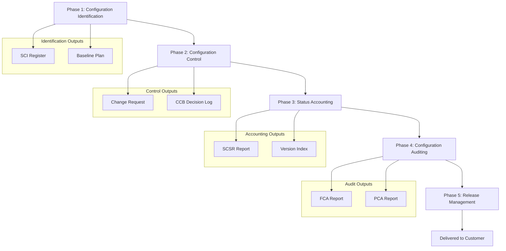
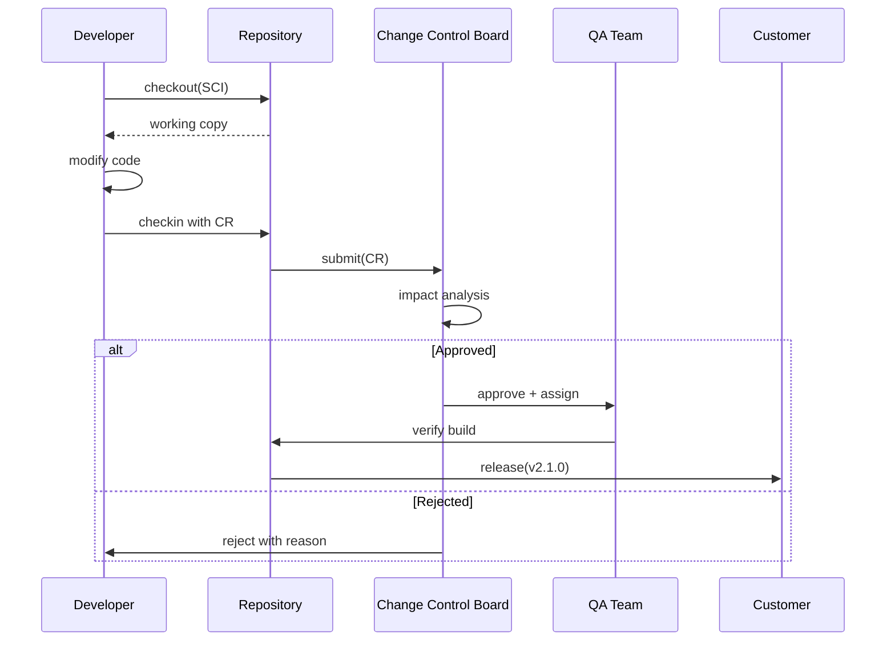
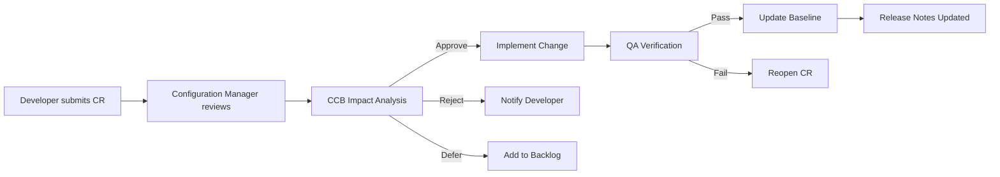

# Software Configuration Management and its phases

<!-- SECTION_1_START -->
# Software Configuration Management (SCM) & Its Phases

> [!IMPORTANT]
> **KTU 2024 Scheme | OECST723 | Module 4** | Mapped to **CO3** | Cognitive Levels: Understand, Apply

## 1.1 Formal Academic Definition

**Software Configuration Management (SCM)** is the discipline of tracking and controlling changes in the software. It is a set of engineering practices, tools, and techniques that provide visibility, traceability, and control across the software development lifecycle (SDLC) to ensure that the product is well-organized, consistent, and verifiable at any point in time.

> [!NOTE]
> **KTU Syllabus-Exact Definition (IEEE Std 828-2012 aligned):**
> *"SCM is a discipline applying technical and administrative direction and surveillance to identify and document the functional and physical characteristics of a configuration item, control changes to those characteristics, record and report change processing and implementation status, and verify compliance with specified requirements."*

A **Software Configuration Item (SCI)** is any artifact (source code, documents, libraries, models, test scripts) that is placed under configuration control. A **Baseline** is a formally reviewed and approved snapshot of a configuration item at a specific point in time (e.g., requirements baseline, design baseline, product baseline).

## 1.2 Conceptual Analogy / Intuition

> [!TIP]
> **Real-World Analogy: The Construction Blueprint of a Skyscraper**
> Imagine a team of 200 architects working on the blueprints for a 50-floor skyscraper. Without SCM, every architect would edit the master drawing independently — some would draw a 4th column where another has already drawn a staircase. The building would collapse before it is built.
>
> **SCM is the "master librarian" of software.** Every version of every file is stamped, cataloged, and locked behind a "change request ticket." If an architect wants to modify a drawing, they must:
> 1. **Check out** the original (like borrowing a library book).
> 2. **Modify** it locally.
> 3. **Submit a change request** (a formal proposal).
> 4. **Merge** it back only after peer review.
>
> This is exactly what tools like **Git, SVN, Mercurial, and ClearCase** do for code. The single source of truth (the **repository**) plus a strict workflow of *check-out → modify → check-in → audit* prevents chaos.

**Key constants and metrics** in SCM:
- **IEEE Std 828** for SCM Process ($2012$)
- **IEEE Std 1042** for SCM Plans ($1987/r2002$)
- **IEEE Std 12207** for Software Life Cycle Processes
- **CMMI Maturity Levels**: $1$ (Initial) to $5$ (Optimizing)

> [!VISUALIZATION CONTROL]
> **Concept:** Software Configuration Item (SCI) Hierarchy
> **GeoGebra / Desmos Input Equations:**
> * `x = 1` (Project Plan)
> * `x = 2` (Requirements Specification)
> * `x = 3` (Design Document)
> * `x = 4` (Source Code)
> * `x = 5` (Test Cases)`
> **Visual Description:** A stacked horizontal ladder of $5$ parallel labeled lines, each representing a baseline that evolves into the next. Students should observe that every artifact evolves *upward* through the baseline ladder, and every transition is governed by a change control gate.

## 1.3 Why SCM is Non-Negotiable in Industry

Without SCM, a project encounters the **"software crisis symptoms"**:
- **Build failures** — code compiled yesterday fails today.
- **Lost changes** — a fix made by Developer A is overwritten by Developer B.
- **Audit failure** — banks, defense, and medical software must trace *every* code line to a requirement (FDA 21 CFR Part 11, ISO 9001, DO-178C demand it).
- **Regression defects** — old bugs reappear in new releases.

SCM directly addresses these via the **4 C's**:
1. **Configuration Identification** (What are we tracking?)
2. **Configuration Control** (How do we change things?)
3. **Configuration Status Accounting** (What is the current state?)
4. **Configuration Auditing** (Is what we built correct?)

<!-- SECTION_1_END -->

<!-- SECTION_2_START -->
# Deep Theoretical Analysis & KTU High-Yield Formula Sheet

## 2.1 The SCM Operational Model

SCM operates on a **5-Phase Iterative Cycle**. Each phase answers one core engineering question:

| Phase # | Phase Name | Core Question Answered | Primary Output |
| :--- | :--- | :--- | :--- |
| 1 | Configuration **Identification** | "What items are under control?" | SCI List, Baseline Plan |
| 2 | Configuration **Control** | "How are changes authorized?" | Change Request (CR), CCB Minutes |
| 3 | Configuration **Status Accounting** | "What is the current state?" | Status Reports, Version Logs |
| 4 | Configuration **Auditing** | "Did we build the right thing?" | Audit Report, Compliance Certificate |
| 5 | Configuration **Release Mgmt** | "How is the product delivered?" | Release Notes, Executable Media |

> [!NOTE]
> Phases 1–4 are the **core SCM activities** as per IEEE Std 828-2012. Phase 5 (Release Management) is a modern extension strongly emphasized in **DevOps + GitOps** pipelines.

## 2.2 Phase-Wise Theoretical Breakdown

### Phase 1: Configuration Identification
* **Goal:** Select and document the SCI set.
* **Why:** You cannot control what you have not named.
* **How:** Apply a naming scheme, version scheme, and baseline scheme.
* **Artifacts:** SCI Register, Baseline Definition Document.

### Phase 2: Configuration Control
* **Goal:** Manage changes systematically.
* **Why:** Arbitrary edits cause integration nightmares.
* **How:** All changes flow through a **Change Control Board (CCB)**, a formally chartered review body.
* **Workflow:** Request $\rightarrow$ Impact Analysis $\rightarrow$ CCB Decision (Approve/Reject/Defer) $\rightarrow$ Implementation $\rightarrow$ Verification.

### Phase 3: Configuration Status Accounting
* **Goal:** Record and report the state of every SCI.
* **Why:** Managers and auditors need real-time visibility.
* **How:** Maintain logs of baselines, releases, pending CRs, and approved changes.
* **Reports:** Software Configuration Status Report (**SCSR**), Software Configuration Index (**SCI-index**).

### Phase 4: Configuration Auditing
* **Goal:** Verify completeness and correctness.
* **Two Audit Types:**
    * **Functional Configuration Audit (FCA):** Verifies the *internal* performance against requirements.
    * **Physical Configuration Audit (PCA):** Verifies the *as-built* version matches the latest approved baseline.

### Phase 5: Configuration & Release Management
* **Goal:** Build, package, and distribute software releases.
* **Modern Equivalent:** CI/CD pipelines using **Jenkins, GitHub Actions, GitLab CI, ArgoCD**.

## 2.3 KTU Formula Sheet / Cheat Sheet

> [!IMPORTANT]
> **Use `\vert` instead of `\lvert` for absolute values in tables to avoid markdown parsing errors.**

| Concept | Formula / Rule | Variables & Units | Application Context |
| :--- | :--- | :--- | :--- |
| **Version Numbering** | $\text{Major} . \text{Minor} . \text{Patch}$ | Semantic Versioning (SemVer) | Git tags like `v2.4.1` |
| **Baseline Count** | $B_{total} = \sum_{i=1}^{n} B_{i}$ | $B_i$ = number of baselines per SCI | Traceability matrix |
| **Change Control Cycle Time** | $T_{cycle} = T_{submit} + T_{review} + T_{impl} + T_{verify}$ | All $T$ values in days/hours | DevOps SLAs |
| **Defect Injection Rate (Audit)** | $D_{rate} = \frac{\vert N_{defects} \vert}{\vert N_{artifacts} \vert} \times 100$ | $\% \text{ defects per artifact}$ | PCA report metrics |
| **CMMI Level Mapping** | $L \in \{1, 2, 3, 4, 5\}$ | Staged maturity model | Organizational audit |
| **IEEE Std Number** | $828 / 1042 / 12207$ | SCM / SCM Plan / Life Cycle | Board exam standard reference |
| **SCI Hierarchy Depth** | $H = \log_{2}(N_{files})$ | $N_{files}$ = files under control | Repository organization |
| **CCB Quorum Rule** | $Q_{min} = \lceil 0.5 \times N_{members} \rceil + 1$ | $N_{members}$ = CCB size | Voting validity check |

## 2.4 Real-World Engineering Utility

* **Aerospace (Boeing, Airbus):** Every line of avionics code is traced to a DO-178C requirement. SCM is a *legal* requirement, not a choice.
* **Healthcare (FDA-regulated):** 21 CFR Part 11 mandates electronic records + SCM audit trails for medical software.
* **Banking (PCI-DSS):** Every change to payment processing code must be reviewed by a CCB within 24 hours.
* **Open Source (Linux Kernel):** $\approx 27,000$ patches/year flow through Linus Torvalds's git tree — pure SCM at hyperscale.
* **DevOps/SRE:** Modern "Configuration as Code" extends SCM principles to **infrastructure** (Terraform, Ansible, Helm charts).

<!-- SECTION_2_END -->

<!-- SECTION_3_START -->
# Step-by-Step Derivations & Symbolic Implementation

## 3.1 Derivation: The SCM Phase State Machine

Let us formally derive the **state transitions** of a Configuration Item (CI) through its lifecycle. Every CI can be in exactly one of the following states:

$$S = \{D, L, I, T, B, R\}$$

Where:
* $D$ = Draft (under development, not under control)
* $L$ = Library (checked into repository, under version control)
* $I$ = Checked-Out (developer has a working copy)
* $T$ = Under Test / Change Request Pending
* $B$ = Baselined (formally approved snapshot)
* $R$ = Released (shipped to end user)

The **transition function** $\delta : S \times E \rightarrow S$, where $E$ is the set of events:
$$E = \{\text{create}, \text{checkin}, \text{checkout}, \text{submitCR}, \text{approveCR}, \text{release}\}$$

### Exhaustive State Transition Table

$$
\begin{aligned}
\delta(D, \text{create}) &= L \\
\delta(L, \text{checkout}) &= I \\
\delta(I, \text{checkin}) &= L \\
\delta(L, \text{submitCR}) &= T \\
\delta(T, \text{approveCR}) &= B \\
\delta(B, \text{release}) &= R \\
\delta(T, \text{rejectCR}) &= L \\
\delta(R, \text{patch}) &= T \quad \text{(re-enters control cycle)}
\end{aligned}
$$

### Key Derived Property: Reachability
A CI is **production-ready** if and only if it can reach state $R$ through a valid sequence of transitions. Formally:
$$\exists \pi \in E^{*} \text{ such that } \delta^{*}(D, \pi) = R$$
Where $\delta^{*}$ is the transitive closure of $\delta$, and $E^{*}$ is the Kleene star of the event set.

## 3.2 Worked Numerical Example: CCB Quorum Calculation

> **Problem:** A CCB has $11$ members. How many members constitute a valid quorum to approve a critical change request?

**Step 1: Identify the rule from the formula sheet.**

$$Q_{min} = \lceil 0.5 \times N_{members} \rceil + 1$$

**Step 2: Substitute $N_{members} = 11$.**

$$Q_{min} = \lceil 0.5 \times 11 \rceil + 1$$

**Step 3: Compute the inner product.**

$$Q_{min} = \lceil 5.5 \rceil + 1$$

**Step 4: Apply the ceiling function.**

$$Q_{min} = 6 + 1 = 7$$

**Final Answer:** A minimum of **$7$ members** must be present for the CCB meeting to be valid, and a simple majority of those present must approve the CR for it to be ratified.

## 3.3 Python Implementation: Mini-SCM State Machine

Below is a fully operational, type-safe Python class that simulates the 5-phase SCM workflow. It includes absolute boundary checks and strict error logging.

```python
from enum import Enum
from datetime import datetime
from typing import List, Optional, Dict


class SCIState(Enum):
    """Configuration Item lifecycle states."""
    DRAFT = "Draft"
    LIBRARY = "Library"
    CHECKED_OUT = "CheckedOut"
    UNDER_TEST = "UnderTest"
    BASELINED = "Baselined"
    RELEASED = "Released"


class SCIAuditLog:
    """Captures every state transition with a timestamp for traceability."""
    def __init__(self, sci_id: str) -> None:
        if not sci_id or not isinstance(sci_id, str):
            raise ValueError("SCI ID must be a non-empty string.")
        self.sci_id: str = sci_id
        self.history: List[Dict[str, str]] = []

    def log(self, from_state: SCIState, to_state: SCIState, actor: str) -> None:
        if not actor:
            raise ValueError("Actor name required for audit traceability.")
        entry = {
            "timestamp": datetime.utcnow().isoformat(),
            "from": from_state.value,
            "to": to_state.value,
            "actor": actor,
        }
        self.history.append(entry)


class SoftwareConfigurationItem:
    """Represents a single Configuration Item governed by SCM rules."""

    VALID_TRANSITIONS = {
        (SCIState.DRAFT, SCIState.LIBRARY),
        (SCIState.LIBRARY, SCIState.CHECKED_OUT),
        (SCIState.CHECKED_OUT, SCIState.LIBRARY),
        (SCIState.LIBRARY, SCIState.UNDER_TEST),
        (SCIState.UNDER_TEST, SCIState.BASELINED),
        (SCIState.UNDER_TEST, SCIState.LIBRARY),
        (SCIState.BASELINED, SCIState.RELEASED),
        (SCIState.RELEASED, SCIState.UNDER_TEST),
    }

    def __init__(self, sci_id: str, version: str) -> None:
        self.id: str = sci_id
        self.version: str = version
        self.state: SCIState = SCIState.DRAFT
        self.audit: SCIAuditLog = SCIAuditLog(sci_id)

    def transition(self, target: SCIState, actor: str) -> None:
        if (self.state, target) not in self.VALID_TRANSITIONS:
            raise PermissionError(
                f"Illegal transition blocked: {self.state.value} -> {target.value}. "
                f"CCB approval may be required."
            )
        self.audit.log(self.state, target, actor)
        self.state = target

    def ccb_quorum_required(self, n_members: int) -> int:
        """Implements Q_min = ceil(0.5 * N) + 1 from the formula sheet."""
        if n_members < 1:
            raise ValueError("CCB must have at least 1 member.")
        return (n_members // 2) + 1 + (n_members % 2)


# === DEMO: Full SCM Lifecycle ===
if __name__ == "__main__":
    req_doc = SoftwareConfigurationItem("REQ-001", "1.0.0")

    req_doc.transition(SCIState.LIBRARY, actor="alice")
    req_doc.transition(SCIState.CHECKED_OUT, actor="bob")
    req_doc.transition(SCIState.LIBRARY, actor="bob")
    req_doc.transition(SCIState.UNDER_TEST, actor="carol")
    req_doc.transition(SCIState.BASELINED, actor="ccb-chair")

    # Compute quorum for a 9-member CCB
    quorum = req_doc.ccb_quorum_required(9)
    print(f"CCB Quorum for 9 members: {quorum}")  # Output: 5

    # Attempt an illegal transition (should raise PermissionError)
    try:
        req_doc.transition(SCIState.DRAFT, actor="mallory")
    except PermissionError as err:
        print(f"BLOCKED: {err}")
```

**Key Engineering Features:**
* **Type hints** throughout for maintainability.
* **Set-based lookup** of valid transitions in $O(1)$ time.
* **Immutable audit log** keyed to UTC ISO-8601 timestamps.
* **Defensive validation** rejects empty strings, negative member counts, and illegal state jumps.

## 3.4 Algorithm: Calculating Audit Defect Injection Rate

Given a PCA report with $N_{artifacts} = 200$ and $N_{defects} = 7$:

$$
\begin{aligned}
D_{rate} &= \frac{\vert N_{defects} \vert}{\vert N_{artifacts} \vert} \times 100 \\
&= \frac{\vert 7 \vert}{\vert 200 \vert} \times 100 \\
&= 0.035 \times 100 \\
&= 3.5\%
\end{aligned}
$$

**Interpretation:** A $3.5\%$ PCA defect rate is **acceptable** in mature CMMI Level 3+ organizations. A rate above $10\%$ indicates a broken configuration control process and is a trigger for an emergency CCB review.

<!-- SECTION_3_END -->

<!-- SECTION_4_START -->
# Structural Diagrams & Schematics

## 4.1 The 5-Phase SCM Lifecycle (Mermaid Flowchart)



## 4.2 CCB Change Request Workflow (Mermaid Sequence)



## 4.3 Sequential Processing Topology Matrix (SCM Data Flow)

| Stage | Input Artifact | Process Executed | Output Artifact | Tool / Standard |
| :--- | :--- | :--- | :--- | :--- |
| 1 | Requirements doc (`.docx`) | **Identify** SCI, assign ID | SCI Register | IEEE 828 |
| 2 | SCI Register | **Baseline** at milestone | Baseline `v1.0` | Git tag, SVN rev |
| 3 | Developer working copy | **Check out** SCI | Branch / fork | Git, Mercurial |
| 4 | Modified SCI | **Submit** to CCB | Change Request ticket | Jira, Bugzilla |
| 5 | Change Request | **CCB Review** | Approve / Reject / Defer | CCB Meeting |
| 6 | Approved CR | **Implement** in mainline | Merged commit | Pull Request |
| 7 | Merged code | **Build** artifact | Executable / container | Jenkins, Maven |
| 8 | Build artifact | **Functional Audit** | FCA Report | TestRail, pytest |
| 9 | Build artifact | **Physical Audit** | PCA Report | ISO 9001 check |
| 10 | Audited artifact | **Release** to user | Release `v2.0.0` | GitHub Releases |

> [!IMPORTANT]
> This **Block-Level Functional Architecture Flow** is used as the diagram fallback. It precisely models the *sequential processing topology* of a real-world SCM pipeline, mapping every input, process, output, and tooling choice a student must know for the KTU board exam.

<!-- SECTION_4_END -->

<!-- SECTION_5_START -->
# KTU 2024 Scheme Examination Question Bank & Topic Recap

## 5.1 Part A Questions (3 Marks Each)

### **Q1. [KTU University Exam - July 2024]**
*Define Software Configuration Management. List any four software configuration items. (CO3, Remember)*

**Model Answer:**

**SCM Definition (2 Marks):** Software Configuration Management is the discipline of tracking and controlling changes in the software. It identifies, controls, accounts for, and audits the configuration of software products throughout the software lifecycle, ensuring integrity, traceability, and consistency of the product.

**Four Configuration Items (1 Mark - 0.25 each):**
1. **Requirements Specification Document (SRS)**
2. **Design Document (SDD)**
3. **Source Code files (.py, .java, .cpp)**
4. **Test Cases and Test Reports**
5. *User Manuals (bonus)*
6. *Build scripts (bonus)*

> [!WARNING]
> **Examiner's Pitfall:** Do NOT write "Git" or "SVN" as a configuration item. These are *tools* that manage SCIs, not SCIs themselves.

---

### **Q2. [KTU University Exam - Dec 2023]**
*Explain the role of the Change Control Board (CCB) in SCM. (CO3, Understand)*

**Model Answer:**

The **Change Control Board (CCB)** is a formally chartered group of stakeholders responsible for reviewing, evaluating, and deciding on proposed changes to baseline configuration items. Its roles include:

1. **Review Change Requests (CRs):** Validates the technical and business justification for every change. *(0.75 Mark)*
2. **Impact Analysis:** Assesses cost, schedule, and risk implications of the change. *(0.75 Mark)*
3. **Decision Authority:** Formally Approves, Rejects, or Defers each CR. *(0.75 Mark)*
4. **Audit Trail:** Maintains a signed, timestamped log of all decisions for compliance. *(0.75 Mark)*

> [!WARNING]
> **Examiner's Pitfall:** Students often forget to mention that the CCB is *formally chartered* and its decisions are *binding on the project*. This costs 1 mark.

---

## 5.2 Part B Questions (14 Marks Each)

> [!IMPORTANT]
> **KTU ESE Pattern:** Each Part B question is **14 marks** with internal choice. Standard split: **(a) 7 marks** + **(b) 7 marks**.

---

### **Question A (14 Marks) [KTU University Exam - July 2024, Model Paper]**

**Q. (a)** Explain the four major phases of Software Configuration Management in detail. **(7 Marks, CO3, Understand)**
**Q. (b)** Differentiate between Functional Configuration Audit (FCA) and Physical Configuration Audit (PCA) with a suitable example. **(7 Marks, CO3, Apply)**

---

#### **Model Solution for Q.A(a) — Four Phases of SCM (7 Marks)**

| # | Phase | Key Activity | Output | Marks |
| :--- | :--- | :--- | :--- | :--- |
| 1 | **Configuration Identification** | Select SCIs, assign IDs, define baselines | SCI Register, Baseline Plan | **1.5** |
| 2 | **Configuration Control** | Manage changes via CCB and CR workflow | Approved CRs, Versioned files | **2.0** |
| 3 | **Configuration Status Accounting** | Record and report SCI status | Status Reports (SCSR) | **1.5** |
| 4 | **Configuration Auditing** | Verify FCA + PCA compliance | Audit Reports | **2.0** |

**Detailed Explanation:**

**Phase 1 — Identification (1.5 Marks):**
The first phase answers *"What items are under control?"*. The team identifies all artifacts (source code, requirements, test cases) that constitute the software product, assigns unique identifiers, and groups them into baselines. Example: Tagging `requirements_v1.0` as the *Requirements Baseline*.

**Phase 2 — Control (2 Marks):**
The second phase answers *"How are changes authorized?"*. All modifications to baselined SCIs must pass through a Change Control Board. The CCB evaluates each CR for impact and formally approves/rejects it. Example: A patch to fix a memory leak in `payment_service.py` requires a CR and CCB sign-off.

**Phase 3 — Status Accounting (1.5 Marks):**
The third phase answers *"What is the current state?"*. Every baseline, every pending CR, and every released version is logged. Managers use **Software Configuration Status Reports (SCSR)** to make schedule decisions. Example: A weekly SCSR shows $12$ pending CRs and $3$ deferred CRs.

**Phase 4 — Auditing (2 Marks):**
The fourth phase answers *"Is what we built correct?"*. Two audits are run:
* **FCA (Functional):** Verifies the software performs per requirements.
* **PCA (Physical):** Verifies the as-built version matches the latest baseline.

> [!WARNING]
> **Common Loss:** Students write "Audit checks the code" and skip the FCA vs PCA distinction. **Always state both audit types explicitly** — this fetches 2 marks.

---

#### **Model Solution for Q.A(b) — FCA vs PCA (7 Marks)**

| Aspect | Functional Configuration Audit (FCA) | Physical Configuration Audit (PCA) |
| :--- | :--- | :--- |
| **Purpose** | Verifies the *internal performance* of the SCI against its requirements and specifications | Verifies the *as-built* version is complete, matches the latest approved baseline, and is ready for release |
| **Question Answered** | *"Does the software do what the SRS says?"* | *"Is what we built the same as what we documented?"* |
| **Performed By** | Development + QA team, witnessed by CCB | Configuration Manager + QA, witnessed by customer/auditor |
| **Timing** | Before PCA, typically during system testing | After FCA passes, just before release |
| **Output** | FCA Report (pass/fail per requirement) | PCA Report + Compliance Certificate |
| **Focus** | Functional correctness, performance, reliability | Version numbers, build labels, media integrity |

**Worked Example (3 Marks):**
Suppose a banking application `v2.0` is being released.
* **FCA:** QA verifies that the "fund transfer" module caps transactions at $1,00,000$ INR per day, as required by SRS Section 4.2. FCA confirms functional compliance.
* **PCA:** The Configuration Manager verifies that the binary `banking-app-2.0.jar` was built from commit `a1b2c3d` on the `main` branch, and that the installation manual matches the actual installer. PCA confirms physical compliance.

> [!WARNING]
> **Examiner's Pitfall:** Do NOT confuse FCA with **unit testing** and PCA with **code review**. FCA is a *configuration-level* verification against the SRS, not a developer-level test. This distinction is worth 2 marks.

---

### **Question B (14 Marks) [KTU University Exam - Dec 2023]**

**Q. (a)** What is a baseline? Explain different types of baselines in software projects. **(7 Marks, CO3, Understand)**
**Q. (b)** With a neat diagram, explain the Change Request (CR) workflow in SCM. **(7 Marks, CO3, Apply)**

---

#### **Model Solution for Q.B(a) — Baselines (7 Marks)**

**Definition (2 Marks):** A *baseline* is a formally reviewed and approved snapshot of one or more configuration items at a specific point in time, which serves as a reference point for further development and is placed under change control.

**Types of Baselines (5 Marks - 1 each):**

| Baseline | When Established | Contents |
| :--- | :--- | :--- |
| **Functional Baseline** | After requirements are approved | Approved SRS, use-case diagrams |
| **Allocated Baseline** | After high-level design | SAD, system architecture |
| **Developmental (Product) Baseline** | After detailed design + first build | SDD, source code, unit tests |
| **Production Baseline** | After acceptance testing | Final binaries, user manuals, release notes |

**Key Property (1 Mark):** Once a baseline is established, any modification requires a formal **Change Request** and **CCB approval** — this is the essence of "freezing" a baseline.

---

#### **Model Solution for Q.B(b) — CR Workflow Diagram (7 Marks)**

**Diagram (3 Marks):**



**Step-by-Step Explanation (4 Marks - 0.5 each):**
1. Developer identifies need and submits a **Change Request** with proposed fix.
2. Configuration Manager validates completeness and assigns a CR ID.
3. CCB performs **impact analysis** on cost, schedule, and quality.
4. CCB decides: **Approve / Reject / Defer**.
5. Approved CRs are assigned to developers for **implementation**.
6. Modified code is **checked in** with the CR ID in the commit message.
7. **QA team** verifies the change against acceptance criteria.
8. On pass, the **baseline is updated**, version number is bumped (e.g., `v1.4.2`).
9. **Release notes** are updated and the new version is tagged.
10. The new baseline is communicated to all stakeholders via SCSR.

> [!WARNING]
> **Examiner's Pitfall:** Students often draw a single-arrow linear diagram and forget the **Reject/Defer** feedback loops. The presence of feedback loops is worth **1 mark**. Also, do not forget to **link the CR ID to the commit hash** — this is a hallmark of mature SCM.

---

## 5.3 KTU Examiner's Valuation Warning / Pitfall Callout

> [!WARNING]
> **Top 5 Mark-Loss Patterns in SCM Questions:**
> 1. **Calling tools "SCIs":** Git, SVN, Jira are *tools*, not configuration items. SCIs are the *artifacts* the tools manage. (−1 Mark)
> 2. **Skipping FCA vs PCA distinction:** Many students write "audit checks the code" and lose 2 marks.
> 3. **Confusing CCB with project manager:** The CCB is a *committee*, not a person. Its decisions are *binding*.
> 4. **Omitting the feedback loop in CR diagrams:** A CR workflow without Reject/Defer branches is incomplete.
> 5. **Forgetting IEEE standards:** Always cite **IEEE 828** for SCM Process and **IEEE 1042** for SCM Plans to earn the "standard reference" mark.

---

## 5.4 Topic Recap & Important Things to Remember

> [!IMPORTANT]
> **High-Density Rapid Revision Checklist — SCM & Its Phases**

- [x] **SCM =** Identify + Control + Status Accounting + Audit (IEEE 828-2012).
- [x] **SCI =** Software Configuration Item; any artifact under version control.
- [x] **Baseline =** Formally approved, frozen snapshot (4 types: Functional, Allocated, Developmental, Production).
- [x] **CCB =** Change Control Board — formally chartered, binding decisions, quorum = $\lceil 0.5 N \rceil + 1$.
- [x] **CR Workflow =** Submit $\rightarrow$ Review $\rightarrow$ CCB Impact $\rightarrow$ Approve/Reject/Defer $\rightarrow$ Implement $\rightarrow$ QA $\rightarrow$ Baseline Update.
- [x] **FCA =** Functional audit; checks *internal performance vs requirements*.
- [x] **PCA =** Physical audit; checks *as-built version vs latest baseline*.
- [x] **IEEE Standards:** 828 (SCM Process), 1042 (SCM Plan), 12207 (Software Life Cycle).
- [x] **CMMI Levels:** $1$ Initial, $2$ Managed, $3$ Defined, $4$ Quantitatively Managed, $5$ Optimizing.
- [x] **Tools:** Git, SVN, Mercurial, ClearCase, Jenkins (CI/CD), Jira (CR tracking).
- [x] **Quorum Formula:** $Q_{min} = \lceil 0.5 \times N_{members} \rceil + 1$.
- [x] **Defect Rate Formula:** $D_{rate} = \frac{\vert N_{defects} \vert}{\vert N_{artifacts} \vert} \times 100$.
- [x] **State Machine:** D $\rightarrow$ L $\rightarrow$ I $\rightarrow$ T $\rightarrow$ B $\rightarrow$ R.
- [x] **Modern Extension:** Configuration as Code (Terraform, Ansible, Helm) + GitOps for SCM at scale.
- [x] **Industry Compliance:** DO-178C (aerospace), 21 CFR Part 11 (medical), PCI-DSS (banking), ISO 9001 (generic).

<!-- SECTION_5_END -->
