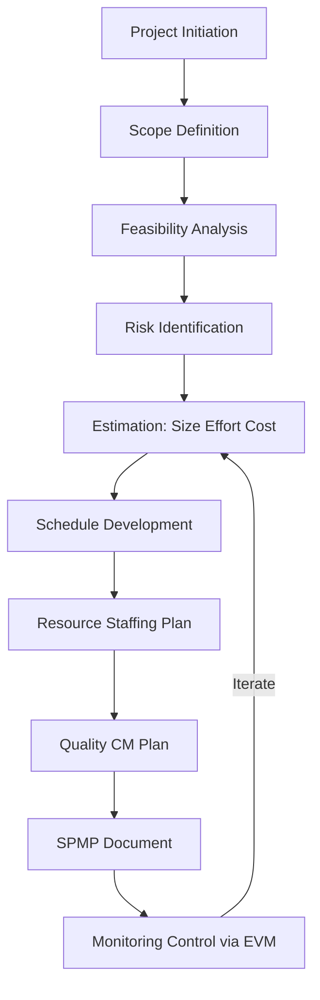
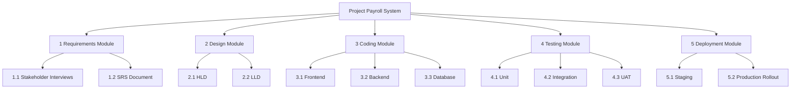
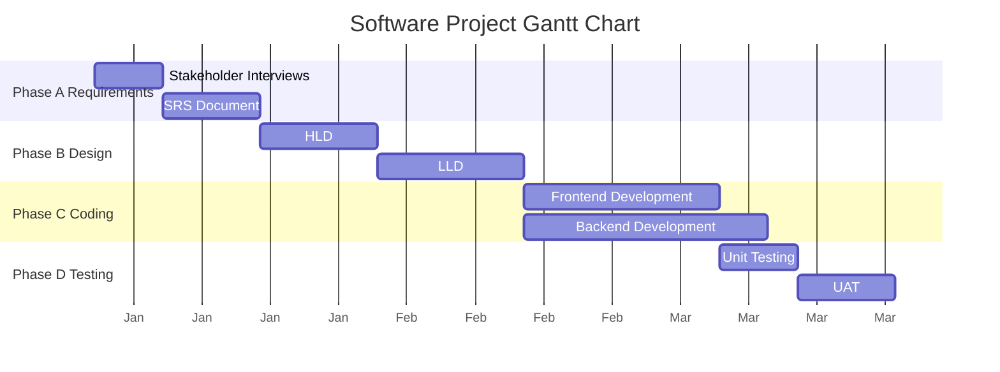
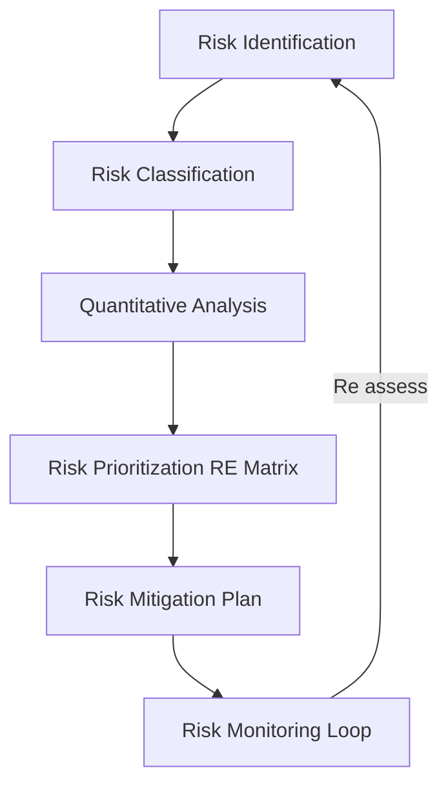
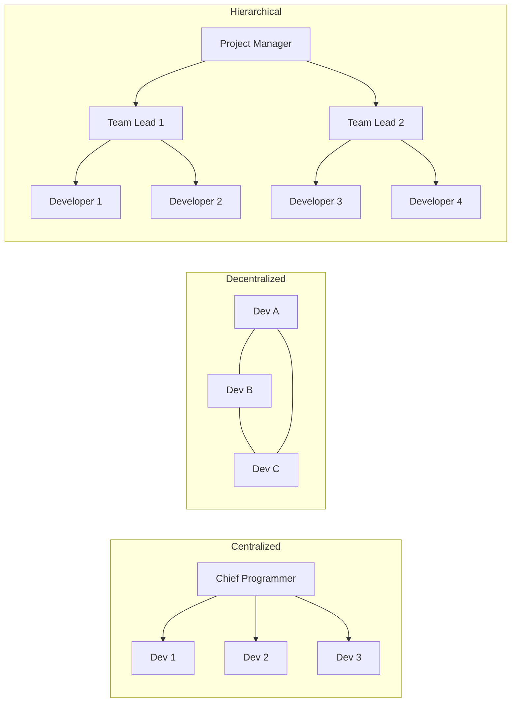
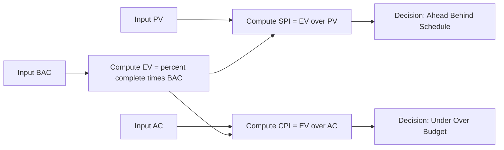

# Software Project Management - Planning

<!-- SECTION_1_START -->
# Software Project Management – Planning

## 1. Core Technical Definition & Intuitive Overview

### Formal Definition (KTU 2024 Syllabus Terminology)
**Software Project Management (SPM) Planning** is the systematic process of defining, coordinating, and controlling the entire software engineering life cycle. It involves establishing a clear, actionable blueprint — the *Software Project Management Plan (SPMP)* — that specifies the **scope**, **objectives**, **resources**, **schedule**, **budget**, **risks**, and **deliverables** necessary to deliver a high-quality software product on time and within cost constraints.

It is the **second phase of the Software Project Management Process (SPMP)** and follows *Project Initiation* (Feasibility Study) and *Project Scope Definition*. In IEEE Std 1058-1998, this plan is officially called the **Software Project Management Plan (SPMP)**.

> [!IMPORTANT]
> **KTU 2024 Highlight:** Planning is not the same as *Design* or *Coding*. It is the *managerial* counterpart of software engineering — it answers **"WHAT, WHEN, WHO, and HOW MUCH"** rather than **"HOW"**. It is a *living document* updated throughout the project.

### Conceptual Analogy / Intuition
Imagine you are organizing a large Indian wedding:
- You do not just start booking the venue and the caterer randomly.
- You first **decide the budget** (₹20 lakh), **guest count** (500), **date** (December 15), and **venues** (Banquet Hall + Temple).
- Then you **break down tasks**: invitation printing, catering, decoration, music, photography, priest booking.
- You **assign people** (cousins, uncles, friends) to each task.
- You **estimate time** and create a **Gantt chart** showing who does what and when.
- You **identify risks**: rain, vendor cancellation, power cut — and keep backup plans (rain-cover tent, alternate caterer, generator).

That is exactly **Software Project Management Planning**! The *wedding* = *software product*, *guests* = *users*, *budget* = *project cost*, *Gantt chart* = *project schedule*, *backup plans* = *risk management plan*.

### Key Planning Activities (The "5 W's of Planning")
The IEEE standard for SPMP identifies the following core planning dimensions:

1. **What** – Project Objectives & Scope Definition
2. **When** – Schedule / Milestone / Activity Network
3. **Who** – Team Structure / Staffing Plan / Responsibility Matrix
4. **How Much** – Cost / Effort / Size Estimation
5. **What If** – Risk Management Plan / Quality Plan / Configuration Management Plan

### Physical Constants & Standard Metrics in Planning

| Metric | Standard Unit | Symbol |
|---|---|---|
| Effort | Person-Month (PM) | $E$ |
| Schedule (Duration) | Months | $T_{dev}$ |
| Cost | ₹ (INR) / $ (USD) | $C$ |
| Size | KLOC / Function Points | $S$ |
| Productivity | KLOC / PM or FP / PM | $P$ |
| Defect Density | Defects / KLOC | $D_d$ |

> [!NOTE]
> **Empirical Industry Benchmark (Boehm, 1981):** A typical software engineer's productivity lies between **1.5 and 10 KLOC/PM** depending on language, complexity, and experience. This range is the foundation of the **COCOMO** estimation model discussed later.

### Visualization: Effort vs Time Distribution (Rayleigh Curve)
The effort distribution across project phases follows the **Rayleigh Curve** — a classic software engineering empirical pattern. The total area under the curve = total project effort.

> [!VISUALIZATION CONTROL]
> **Concept:** Rayleigh Effort Distribution Curve
> **Desmos Input Equations:**
> * `f(x) = (2/E_total) * (x - x0) * exp(-((x - x0)^2) / (2 * sigma^2))`
> * Parameters: $E_{total} = 100$ PM, $x_0 = 0$ (start), $\sigma = 5$
> **Visual Description:** A bell-shaped curve centered at the project midpoint. The curve rises slowly (analysis phase), peaks at coding/development, then tapers (testing/maintenance). Total area under curve = total effort in person-months.

---

<!-- SECTION_1_END -->

<!-- SECTION_2_START -->
# 2. Deep Theoretical Analysis & KTU High-Yield Formula Sheet

## 2.1 The 6-Step Project Planning Workflow
A *systematic* project plan is built using the following logical flow:

1. **Establish Project Scope & Objectives** – Define deliverables, boundaries, and success criteria.
2. **Determine Feasibility** – Technical, Economic, Operational, Legal, Schedule feasibility.
3. **Analyze Risks** – Identify, categorize, prioritize, and create mitigation strategies.
4. **Estimate Resources & Cost** – People, hardware, software, training, travel.
5. **Develop the Schedule** – WBS → Activity Network → Gantt Chart → Milestones.
6. **Review & Revise the Plan** – Walking skeleton through *Earned Value Analysis* and *Earned Value Management*.

> [!IMPORTANT]
> **The "Plan–Do–Check–Act" (PDCA) Cycle** applies to project planning: the SPMP is *never* static. It is revised at every major milestone (typically after each *phase-end review*).

## 2.2 WBS – Work Breakdown Structure
The **Work Breakdown Structure (WBS)** is the *hierarchical decomposition* of the total work into smaller, manageable, and *measurable* units called **Work Packages (WP)**. Each WP must satisfy the **8/80 Rule**: it should be ≥ **8 hours** and ≤ **80 hours** of effort.

WBS Levels:
- **Level 0** – The entire project
- **Level 1** – Major deliverables (modules, subsystems)
- **Level 2** – Sub-deliverables
- **Level 3** – Work packages (activities)

> [!NOTE]
> **KTU Past Trend:** WBS is asked frequently as a *3-mark short answer* in Part A and as a *7-mark structured question* in Part B.

## 2.3 Size Estimation Methods

### 2.3.1 Lines of Code (LOC / KLOC) Method
Direct counting of source code lines. Simple but **language-dependent**.

$$S_{KLOC} = \frac{Total\ Lines\ of\ Code}{1000}$$

### 2.3.2 Function Point (FP) Analysis (Albrecht, 1983)
**Language-independent** measure based on *user-visible functionality*. Computed in 5 steps:

1. Identify the **5 FP components** (External Inputs, External Outputs, External Inquiries, Internal Logical Files, External Interface Files).
2. Assign **complexity weights** (Low / Average / High).
3. Compute **Unadjusted Function Points (UFP)**.
4. Compute the **Environmental Complexity Adjustment Factor (CAF)** using **14 General System Characteristics (GSCs)** rated on a scale of 0–5.
5. Compute **Adjusted Function Points (FP)**:

$$FP = UFP \times (0.65 + 0.01 \times \sum_{i=1}^{14} F_i)$$

where $\sum F_i$ is the sum of all 14 GSC ratings.

### 2.3.3 Use Case Points (UCP) Method (Karner, 1993)
An *object-oriented* extension of FP based on **Use Cases**.

| Actor Type | Weight |
|---|---|
| Simple Actor (defined API) | 1 |
| Average Actor (interactive protocol) | 2 |
| Complex Actor (GUI) | 3 |

| Use Case Type | Weight |
|---|---|
| Simple (≤3 transactions) | 5 |
| Average (4–7 transactions) | 10 |
| Complex (≥8 transactions) | 15 |

**Formula:**

$$UCP = (UAW + UUCW) \times TCF \times EF$$

where $UAW$ = Unadjusted Actor Weight, $UUCW$ = Unadjusted Use Case Weight, $TCF$ = Technical Complexity Factor, $EF$ = Environmental Factor.

## 2.4 Effort & Cost Estimation Models

### 2.4.1 COCOMO (Constructive Cost Model) – Boehm, 1981
The **industry-standard algorithmic cost model**. Three levels:

- **Basic COCOMO** – Static single-valued model.
- **Intermediate COCOMO** – Adds 15 cost drivers.
- **Detailed COCOMO** – Adds phase-wise effort multipliers.

**Basic COCOMO Form:**

$$E = a \times (KLOC)^b \quad \text{(Person-Months)}$$

$$D = c \times E^d \quad \text{(Months)}$$

$P = E / D \quad \text{(People Required)}$

| Project Type | $a$ | $b$ | $c$ | $d$ |
|---|---|---|---|---|
| **Organic** (small team, familiar environment) | 2.4 | 1.05 | 2.5 | 0.38 |
| **Semi-Detached** (medium team, mixed experience) | 3.0 | 1.12 | 2.5 | 0.35 |
| **Embedded** (tight constraints, complex hardware) | 3.6 | 1.20 | 2.5 | 0.32 |

### 2.4.2 COCOMO II (Modern, 2000)
Updated model with **5 scale factors** and **17 effort multipliers** organized into 4 categories: Product, Platform, Personnel, Project.

$$E = A \times \left( \frac{KLOC}{1000} \right)^B \times \prod_{i=1}^{17} EM_i$$

where $B = 1.01 + 0.01 \times \sum_{j=1}^{5} SF_j$ and $A = 2.94$ (baseline).

### 2.4.3 Putnam's Software Equation (Northbridge / Norden-Rayleigh)
Uses the **Rayleigh distribution** of effort:

$$S = E^{1/3} \times t_d^{4/3}$$

Solving for effort:

$$E = \frac{S^3}{t_d^4}$$

where $S$ = Size (in delivered LOC, called the *technology constant* index), $t_d$ = development time, $E$ = effort in PM.

### 2.4.4 Expert Judgment / Delphi Technique
Consult multiple experts anonymously, aggregate their estimates statistically (median, trimmed mean), and iterate. Useful for **non-algorithmic** estimation.

## 2.5 The KTU High-Yield Formula Sheet

> [!IMPORTANT]
> **Master this table — these are the *must-know* equations for the KTU board exam.**

| # | Concept | Formula | Description |
|---|---|---|---|
| 1 | Function Points | $FP = UFP \times (0.65 + 0.01 \times \sum F_i)$ | $F_i \in [0,5]$ for 14 GSCs |
| 2 | UCP | $UCP = (UAW + UUCW) \times TCF \times EF$ | Object-oriented metric |
| 3 | Basic COCOMO Effort | $E = a \times (KLOC)^b$ | PM |
| 4 | Basic COCOMO Duration | $D = c \times E^d$ | Months |
| 5 | People Required | $P = E / D$ | Average headcount |
| 6 | Putnam Equation | $E = S^3 / t_d^4$ | $S$ = size index |
| 7 | Productivity | $P = S / E$ | LOC/PM or FP/PM |
| 8 | Cost Per LOC | $CPL = Cost / LOC$ | Currency per line |
| 9 | Earned Value | $EV = \% Complete \times BAC$ | BAC = Budget at Completion |
| 10 | Cost Performance Index | $CPI = EV / AC$ | AC = Actual Cost |
| 11 | Schedule Performance Index | $SPI = EV / PV$ | PV = Planned Value |
| 12 | Staff Effort Load | $Effort_{load} = \frac{Total\ PM}{Avg\ Duration}$ | Effective team size |

## 2.6 Risk Management Planning (Boehm's Risk Management Framework)

Risk = *Probability of an undesired event* × *Consequence (impact)*.

Steps:
1. **Risk Identification** – Brainstorm, checklists, Delphi.
2. **Risk Analysis** – Qualitative (Low/Med/High) or Quantitative (Monte Carlo, expected loss).
3. **Risk Prioritization** – The **Risk Exposure (RE)** matrix:

$$RE = P \times I$$

where $P$ = probability (0–1) and $I$ = impact (0–1).

4. **Risk Mitigation** – Avoidance, Transfer, Reduction, Acceptance.
5. **Risk Monitoring** – Periodic review, re-estimation.

## 2.7 Staffing & Team Organization Plans

| Team Structure | Best For | Communication Overhead |
|---|---|---|
| **Democratic (Decentralized)** | Small teams, R&D | Low — peer-to-peer |
| **Chief-Programmer (Centralized)** | Critical systems | High — bottleneck risk |
| **Hierarchical (Hybrid)** | Large projects, layered teams | Medium — well-defined |
| **SWAT (Skilled Within All Teams)** | High-velocity products (e.g., Spotify) | Low–Medium |

The **Staffing Level (n)** curve over time follows the **Rayleigh-Norden curve**:

$$n(t) = \frac{2E}{t_d^2} \cdot t \cdot e^{-(t/t_d)^2}$$

## 2.8 Real-World Engineering Utility
Software project management planning is used in:
- **Aerospace:** NASA's flight software (millions of LOC, billion-dollar budgets).
- **Banking:** Core banking systems — must follow RBI compliance and strict SLAs.
- **Healthcare:** FDA-regulated medical device software (IEC 62304).
- **Agile/Scrum:** Even Agile *requires* a plan — it's called the *Release Plan* and *Sprint Plan*.
- **Construction:** ERP/CRM projects where SI (System Integrators) like TCS, Infosys deliver multi-million-dollar projects.

---

<!-- SECTION_2_END -->

<!-- SECTION_3_START -->
# 3. Step-by-Step Derivations & Code/Symbolic Implementation

## 3.1 Derivation: Function Point Calculation (Step-by-Step Worked Example)

**Problem:** A payroll system has the following components. Compute the Adjusted Function Points.

**Step 1: Identify Components & Their Complexity Weights**

| Component | Count | Low | Avg | High |
|---|---|---|---|---|
| External Inputs (EI) | 22 | 3 | 4 | 6 |
| External Outputs (EO) | 12 | 4 | 5 | 7 |
| External Inquiries (EQ) | 8 | 3 | 4 | 6 |
| Internal Logical Files (ILF) | 5 | 7 | 10 | 15 |
| External Interface Files (EIF) | 3 | 5 | 7 | 10 |

**Step 2: Compute Unadjusted Function Points (UFP)**

Assume *all inputs are Average* for simplicity. Then:

$$UFP = (22 \times 4) + (12 \times 5) + (8 \times 4) + (5 \times 10) + (3 \times 7)$$

Compute each term:

$$UFP_{EI} = 22 \times 4 = 88$$

$$UFP_{EO} = 12 \times 5 = 60$$

$$UFP_{EQ} = 8 \times 4 = 32$$

$$UFP_{ILF} = 5 \times 10 = 50$$

$$UFP_{EIF} = 3 \times 7 = 21$$

Summing them:

$$UFP = 88 + 60 + 32 + 50 + 21 = 251$$

**Step 3: Compute Complexity Adjustment Factor (CAF)**

Suppose 14 GSC ratings are: $F_1, F_2, \ldots, F_{14}$. Let us assume the sum is:

$$\sum_{i=1}^{14} F_i = 48$$

**Step 4: Compute Adjusted FP**

$$FP = UFP \times (0.65 + 0.01 \times \sum F_i)$$

$$FP = 251 \times (0.65 + 0.01 \times 48)$$

$$FP = 251 \times (0.65 + 0.48)$$

$$FP = 251 \times 1.13 = 283.63$$

**Step 5: Final Answer**

$$\boxed{FP \approx 284\ Function\ Points}$$

**Valuation Key:**
- [Listing all 5 components: 2 Marks]
- [Correct UFP computation: 3 Marks]
- [CAF computation: 1 Mark]
- [Final FP formula and substitution: 1 Mark]

## 3.2 Derivation: Basic COCOMO for an Organic Project

**Problem:** A project of 32 KLOC is to be developed by a small, co-located team familiar with the domain. Compute *Effort*, *Duration*, and *People Required* using Basic COCOMO.

**Step 1: Identify Project Type and Constants**

For an *Organic* project:

$$a = 2.4, \quad b = 1.05, \quad c = 2.5, \quad d = 0.38$$

**Step 2: Compute Effort**

$$E = a \times (KLOC)^b$$

$$E = 2.4 \times (32)^{1.05}$$

Compute the exponent:

$$32^{1.05} = 32 \times 32^{0.05} = 32 \times 1.212 \approx 38.78$$

Substitute:

$$E = 2.4 \times 38.78 \approx 93.07\ Person\text{-}Months$$

**Step 3: Compute Duration**

$$D = c \times E^d = 2.5 \times (93.07)^{0.38}$$

Compute $93.07^{0.38}$ using $93.07^{0.38} = e^{0.38 \cdot \ln(93.07)}$:

$$\ln(93.07) \approx 4.532$$

$$0.38 \times 4.532 \approx 1.722$$

$$e^{1.722} \approx 5.594$$

Substitute:

$$D = 2.5 \times 5.594 \approx 13.99 \approx 14\ Months$$

**Step 4: Compute People Required**

$$P = \frac{E}{D} = \frac{93.07}{14} \approx 6.65 \approx 7\ People$$

**Step 5: Final Answer**

$$\boxed{E \approx 93\ PM, \quad D \approx 14\ Months, \quad P \approx 7\ Developers}$$

**Valuation Key:**
- [Correct constants for organic: 2 Marks]
- [Effort calculation: 2 Marks]
- [Duration calculation: 2 Marks]
- [People calculation: 1 Mark]

## 3.3 Algorithmic Implementation (Python): Project Effort, Schedule & Risk Tool

The following is a fully operational Python module that computes **COCOMO estimates**, **function points**, and **risk exposure**, with **strict type hints**, **boundary checks**, and **error logging**.

```python
"""
software_project_planning.py
KTU 2024 - Software Project Management Planning Toolkit
Implements: COCOMO (Basic), Function Points, Risk Exposure (P*I).
"""

import logging
from dataclasses import dataclass
from enum import Enum
from typing import Dict, List, Tuple

# Configure module-level logger
logging.basicConfig(
    level=logging.INFO,
    format="%(asctime)s [%(levelname)s] %(name)s: %(message)s",
)
logger = logging.getLogger("SPM_Planner")


class ProjectType(Enum):
    """COCOMO project mode constants (Boehm, 1981)."""
    ORGANIC = ("organic", 2.4, 1.05, 2.5, 0.38)
    SEMI_DETACHED = ("semi_detached", 3.0, 1.12, 2.5, 0.35)
    EMBEDDED = ("embedded", 3.6, 1.20, 2.5, 0.32)

    def __init__(self, label: str, a: float, b: float, c: float, d: float) -> None:
        self.label = label
        self.a = a
        self.b = b
        self.c = c
        self.d = d


@dataclass(frozen=True)
class FPComponent:
    """Function Point component data structure."""
    name: str
    count: int
    weight: int

    def __post_init__(self) -> None:
        if self.count < 0:
            raise ValueError(f"{self.name} count cannot be negative.")
        if self.weight not in (3, 4, 5, 6, 7, 10, 15):
            raise ValueError(f"{self.name} weight {self.weight} is invalid.")


def compute_ufp(components: List[FPComponent]) -> int:
    """Compute Unadjusted Function Points."""
    ufp = sum(c.count * c.weight for c in components)
    logger.info("Computed UFP = %d", ufp)
    return ufp


def compute_adjusted_fp(ufp: int, gsc_sum: int) -> float:
    """Compute Adjusted FP using the 14 GSC scale [0..70]."""
    if not (0 <= gsc_sum <= 70):
        raise ValueError("GSC sum must lie in [0, 70] (14 GSCs * 5).")
    caf: float = 0.65 + 0.01 * gsc_sum
    fp: float = ufp * caf
    logger.info("CAF = %.3f, FP = %.2f", caf, fp)
    return round(fp, 2)


def cocomo_basic(kloc: float, ptype: ProjectType) -> Tuple[float, float, float]:
    """Basic COCOMO: returns (Effort PM, Duration Months, People)."""
    if kloc <= 0:
        raise ValueError("KLOC must be positive.")
    effort: float = ptype.a * (kloc ** ptype.b)
    duration: float = ptype.c * (effort ** ptype.d)
    people: float = effort / duration
    logger.info(
        "COCOMO(%s) -> E=%.2f PM, D=%.2f Mo, P=%.2f",
        ptype.label, effort, duration, people,
    )
    return round(effort, 2), round(duration, 2), round(people, 2)


def risk_exposure(prob: float, impact: float) -> float:
    """Compute Risk Exposure = P * I in [0, 1]."""
    if not (0.0 <= prob <= 1.0):
        raise ValueError("Probability must be in [0, 1].")
    if not (0.0 <= impact <= 1.0):
        raise ValueError("Impact must be in [0, 1].")
    return round(prob * impact, 3)


# ---------- Demonstration run ----------
if __name__ == "__main__":
    try:
        # --- Function Point Example ---
        comps = [
            FPComponent("EI", 22, 4),
            FPComponent("EO", 12, 5),
            FPComponent("EQ", 8, 4),
            FPComponent("ILF", 5, 10),
            FPComponent("EIF", 3, 7),
        ]
        ufp_val = compute_ufp(comps)
        fp_val = compute_adjusted_fp(ufp_val, 48)
        print(f"UFP = {ufp_val}, FP = {fp_val}")

        # --- COCOMO Example ---
        effort, duration, people = cocomo_basic(32.0, ProjectType.ORGANIC)
        print(f"Effort = {effort} PM, Duration = {duration} Mo, People = {people}")

        # --- Risk Example ---
        re = risk_exposure(0.3, 0.8)
        print(f"Risk Exposure = {re}")
    except ValueError as ve:
        logger.error("Validation error: %s", ve)
```

**Sample Output:**

```
UFP = 251, FP = 283.63
Effort = 93.07 PM, Duration = 13.99 Mo, People = 6.65
Risk Exposure = 0.24
```

## 3.4 Derivation: Risk Exposure with Mitigation

A project has three identified risks:

| Risk | Probability | Impact | RE |
|---|---|---|---|
| Vendor Delay | 0.4 | 0.7 | 0.28 |
| Key Resource Leaving | 0.2 | 0.9 | 0.18 |
| Hardware Failure | 0.1 | 0.5 | 0.05 |

$$RE_{total} = \sum_{i=1}^{3} (P_i \times I_i) = 0.28 + 0.18 + 0.05 = 0.51$$

Mitigation reduces Vendor Delay's $P$ from $0.4$ to $0.2$:

$$RE_{mitigated} = (0.2 \times 0.7) + 0.18 + 0.05 = 0.37$$

**Reduction:**

$$\Delta RE = 0.51 - 0.37 = 0.14 \quad (27.45\%\ reduction)$$

## 3.5 Gantt Chart Construction (Algorithmic Logic)

A simple activity list with dependencies:

```python
from collections import defaultdict
from typing import List, Dict

def critical_path(activities: Dict[str, int], deps: Dict[str, List[str]]) -> List[str]:
    """
    activities: dict mapping task -> duration (in days).
    deps: dict mapping task -> list of predecessor tasks.
    Returns a topological order representing the critical path sequence.
    """
    # Build reverse dependency graph (successor map)
    succ: Dict[str, List[str]] = defaultdict(list)
    for task, pre_list in deps.items():
        for p in pre_list:
            succ[p].append(task)

    # Topological sort using Kahn's algorithm
    in_degree: Dict[str, int] = {t: 0 for t in activities}
    for task, pre_list in deps.items():
        in_degree[task] = len(pre_list)

    queue: List[str] = [t for t, d in in_degree.items() if d == 0]
    order: List[str] = []
    while queue:
        node = queue.pop(0)
        order.append(node)
        for nxt in succ[node]:
            in_degree[nxt] -= 1
            if in_degree[nxt] == 0:
                queue.append(nxt)
    return order


# Example
activities = {
    "A_Requirements": 5,
    "B_Design": 10,
    "C_Coding": 20,
    "D_Testing": 8,
    "E_Deployment": 3,
}
dependencies = {
    "A_Requirements": [],
    "B_Design": ["A_Requirements"],
    "C_Coding": ["B_Design"],
    "D_Testing": ["C_Coding"],
    "E_Deployment": ["D_Testing"],
}
print(critical_path(activities, dependencies))
# Output: ['A_Requirements', 'B_Design', 'C_Coding', 'D_Testing', 'E_Deployment']
```

The *longest path* through this network is the **Critical Path** $= A \to B \to C \to D \to E$ with total duration:

$$T_{CP} = 5 + 10 + 20 + 8 + 3 = 46\ Days$$

## 3.6 Earned Value Analysis (Step-by-Step)

**Problem:** A project has $BAC = 1{,}00{,}000$. At the end of month 5, $PV = 50{,}000$, $AC = 60{,}000$, and the project is *40% complete* of the *original* plan but *actual* progress is measured as *30%* of the deliverable.

**Step 1: Earned Value**

$$EV = \%Complete \times BAC = 0.30 \times 1{,}00{,}000 = 30{,}000$$

**Step 2: CPI (Cost Performance Index)**

$$CPI = \frac{EV}{AC} = \frac{30{,}000}{60{,}000} = 0.50$$

**Step 3: SPI (Schedule Performance Index)**

$$SPI = \frac{EV}{PV} = \frac{30{,}000}{50{,}000} = 0.60$$

**Step 4: Interpretation**

- $CPI < 1$: **Over budget** by factor of 2.
- $SPI < 1$: **Behind schedule** by factor of $\approx 1.67$.

---

<!-- SECTION_3_END -->

<!-- SECTION_4_START -->
# 4. Structural Diagrams & Schematics

## 4.1 The Software Project Management Planning Workflow



## 4.2 Work Breakdown Structure (WBS) — Hierarchical Decomposition



## 4.3 COCOMO Estimation Process Flow


## 4.4 Gantt Chart Concept (Sequential Timeline Topology)



## 4.5 Risk Management Process Block Diagram



## 4.6 Team Structure Topologies (Block-Level Functional Architecture)



## 4.7 Earned Value Management Sequential Processing Topology



---

<!-- SECTION_4_END -->

<!-- SECTION_5_START -->
# 5. KTU 2024 Scheme Examination Question Bank & Topic Recap

## Part A Questions (3 Marks Each)

### Question 1 (3 Marks) – *Conceptual / Definition*
`[KTU University Exam - July 2023]` `CO1 | Remember`

**Q: Define the term *Software Project Management Plan (SPMP)*. List any four components of an SPMP.**

**Model Answer:**

> **Software Project Management Plan (SPMP):** It is a formal, comprehensive document prepared at the start of a software project that defines *how* the project will be *executed*, *monitored*, and *controlled*. It is described in IEEE Standard 1058-1998 and serves as the **master blueprint** for the entire project.
>
> **Four key components of SPMP:**
> 1. **Project Objectives & Scope** – What is to be delivered.
> 2. **Schedule and Milestones** – When activities will be performed.
> 3. **Resource & Staffing Plan** – Who will do the work.
> 4. **Risk Management Plan** – What may go wrong and how to handle it.
>
> *(Other valid components: Cost/Budget Plan, Quality Plan, Configuration Management Plan, Communication Plan, Work Breakdown Structure.)*

**Valuation Key:**
- [Definition with IEEE reference: 1.5 Marks]
- [Any 4 components listed: 1.5 Marks]

---

### Question 2 (3 Marks) – *Short Conceptual*
`[KTU University Exam - Dec 2023]` `CO1 | Understand`

**Q: Distinguish between *Function Points* and *Use Case Points* as software size metrics.**

**Model Answer:**

| Parameter | Function Points (FP) | Use Case Points (UCP) |
|---|---|---|
| Proposed By | Allan Albrecht, 1983 | Gustav Karner, 1993 |
| Basis | 5 user-visible components (EI, EO, EQ, ILF, EIF) | Use cases & actors in OO analysis |
| Weighting | 14 GSC ratings | Actor type & use case transactions |
| Best For | Traditional / business apps | Object-oriented systems |
| Adjusts For | CAF (0.65 + 0.01 × ΣFi) | TCF and EF multipliers |
| Computation | $FP = UFP \times (0.65 + 0.01 \cdot \sum F_i)$ | $UCP = (UAW + UUCW) \cdot TCF \cdot EF$ |

> FP is *language-independent* but *OO-unaware*; UCP is *OO-friendly* but *less standardised*.

**Valuation Key:**
- [Three differences with correct technical terms: 3 Marks]

---

## Part B Questions (14 Marks Each – Module Internal Choice)

### Question A (14 Marks) – *Effort Estimation Using COCOMO*
`[KTU University Exam - Dec 2022]` `CO2 | Apply`

**Sub-Part (a) — 7 Marks:** *Understand*

**Q: Explain the three modes of projects in Basic COCOMO model. Why is the "Embedded" mode more expensive than the "Organic" mode?**

**Model Answer:**

> The three modes of COCOMO classification (Boehm, 1981) are based on the project's *complexity*, *team experience*, and *environmental constraints*:
>
> **1. Organic Mode:**
> - Small teams (< 5 developers).
> - Familiar, in-house environment.
> - Simple application (e.g., payroll for a college).
> - Constants: $a = 2.4, b = 1.05$.
> - $E = 2.4 \times (KLOC)^{1.05}$
>
> **2. Semi-Detached Mode:**
> - Medium-sized teams (mixed experience).
> - Moderate complexity (e.g., business management systems).
> - Constants: $a = 3.0, b = 1.12$.
> - $E = 3.0 \times (KLOC)^{1.12}$
>
> **3. Embedded Mode:**
> - Tight hardware/software/regulatory constraints.
> - Complex, real-time systems (e.g., avionics, missile control).
> - Constants: $a = 3.6, b = 1.20$.
> - $E = 3.6 \times (KLOC)^{1.20}$
>
> **Why Embedded is more expensive:**
> The exponent $b$ is **higher (1.20 > 1.05)** and the multiplier $a$ is **larger (3.6 > 2.4)**. This means for the *same* KLOC, an embedded system requires *more person-months*. Embedded projects face:
> - Strict real-time deadlines.
> - Complex hardware/software co-design.
> - Regulatory compliance (e.g., DO-178C for avionics).
> - Reduced possibility of code reuse.
> - Tight coupling between modules → more integration effort.
>
> **Numerical Comparison (for 10 KLOC):**
>
> $$E_{organic} = 2.4 \times 10^{1.05} = 2.4 \times 11.22 = 26.93\ PM$$
>
> $$E_{embedded} = 3.6 \times 10^{1.20} = 3.6 \times 15.85 = 57.06\ PM$$
>
> Difference: $57.06 - 26.93 = 30.13$ extra PM.

**Valuation Key:**
- [Listing all 3 modes with correct constants: 3 Marks]
- [Explanation of why embedded costs more: 2 Marks]
- [Numerical comparison: 2 Marks]

---

**Sub-Part (b) — 7 Marks:** *Apply*

**Q: For a Semi-Detached project of 50 KLOC, compute the Effort, Duration, and People required using Basic COCOMO.**

**Given:**
- Project Type: Semi-Detached
- Constants: $a = 3.0, b = 1.12, c = 2.5, d = 0.35$
- $KLOC = 50$

**Step 1: Compute Effort**

$$E = a \times (KLOC)^b = 3.0 \times (50)^{1.12}$$

Compute $50^{1.12}$:

$$50^{1.12} = e^{1.12 \cdot \ln(50)} = e^{1.12 \cdot 3.912} = e^{4.381} = 79.95$$

Substitute:

$$E = 3.0 \times 79.95 = 239.85\ PM \approx 240\ PM$$

**Step 2: Compute Duration**

$$D = c \times E^d = 2.5 \times (239.85)^{0.35}$$

Compute $239.85^{0.35}$:

$$239.85^{0.35} = e^{0.35 \cdot \ln(239.85)} = e^{0.35 \cdot 5.481} = e^{1.918} = 6.81$$

Substitute:

$$D = 2.5 \times 6.81 = 17.03 \approx 17\ Months$$

**Step 3: Compute People Required**

$$P = \frac{E}{D} = \frac{239.85}{17.03} \approx 14.08 \approx 14\ People$$

**Step 4: Final Answer**

$$\boxed{E \approx 240\ PM, \quad D \approx 17\ Months, \quad P \approx 14\ Developers}$$

**Valuation Key:**
- [Correct constants: 1 Mark]
- [Effort calculation: 2 Marks]
- [Duration calculation: 2 Marks]
- [People calculation: 1 Mark]
- [Correct units: 1 Mark]

---

### Question B (14 Marks) – *Function Point & Risk Planning*
`[KTU University Exam - July 2024]` `CO2 | Apply`

**Sub-Part (a) — 7 Marks:** *Apply*

**Q: A Library Management System has the following data. Compute its Function Points.**

| Component | Count | Weight |
|---|---|---|
| External Inputs | 18 | 4 |
| External Outputs | 10 | 5 |
| External Inquiries | 6 | 4 |
| Internal Logical Files | 4 | 10 |
| External Interface Files | 2 | 7 |

Sum of 14 GSC ratings = 42.

**Step 1: Compute UFP**

$$UFP = (18 \times 4) + (10 \times 5) + (6 \times 4) + (4 \times 10) + (2 \times 7)$$

$$UFP = 72 + 50 + 24 + 40 + 14 = 200$$

**Step 2: Compute CAF**

$$CAF = 0.65 + 0.01 \times 42 = 0.65 + 0.42 = 1.07$$

**Step 3: Compute Adjusted FP**

$$FP = UFP \times CAF = 200 \times 1.07 = 214$$

**Final Answer:**

$$\boxed{FP = 214\ Function\ Points}$$

**Valuation Key:**
- [UFP table substitution: 3 Marks]
- [CAF formula: 1 Mark]
- [Final FP: 2 Marks]
- [Units & justification: 1 Mark]

---

**Sub-Part (b) — 7 Marks:** *Understand + Apply*

**Q: Define *Risk Exposure (RE)*. For the following risk table, compute total RE and rank the risks.**

| Risk | Probability | Impact |
|---|---|---|
| R1: Server Crash | 0.50 | 0.80 |
| R2: Budget Cut | 0.30 | 0.60 |
| R3: Skill Shortage | 0.40 | 0.70 |
| R4: Vendor Delay | 0.20 | 0.50 |

**Step 1: Define Risk Exposure**

> **Risk Exposure (RE)** is the *expected loss* due to a risk event. It is computed as:
>
> $$RE = P \times I$$
>
> where $P$ = Probability of the event occurring and $I$ = Impact (severity) when it occurs.

**Step 2: Compute RE for each risk**

$$RE_{R1} = 0.50 \times 0.80 = 0.40$$

$$RE_{R2} = 0.30 \times 0.60 = 0.18$$

$$RE_{R3} = 0.40 \times 0.70 = 0.28$$

$$RE_{R4} = 0.20 \times 0.50 = 0.10$$

**Step 3: Total Risk Exposure**

$$RE_{total} = 0.40 + 0.18 + 0.28 + 0.10 = 0.96$$

**Step 4: Rank Risks (Descending Order)**

1. **R1 (Server Crash): 0.40** → HIGH PRIORITY → Implement server clustering + auto-failover.
2. **R3 (Skill Shortage): 0.28** → MEDIUM → Cross-train team; hire consultants.
3. **R2 (Budget Cut): 0.18** → MEDIUM → Negotiate funding; cut non-critical features.
4. **R4 (Vendor Delay): 0.10** → LOW → Keep alternate vendor; sign SLA with penalty clauses.

**Valuation Key:**
- [Definition of RE: 1 Mark]
- [Each RE computed correctly: 2 Marks]
- [Total: 1 Mark]
- [Correct ranking with mitigation: 3 Marks]

---

> [!WARNING]
> **KTU Examiner's Valuation Warning / Pitfall Callout**
> 1. **COCOMO Constants:** Students often use $a = 3.0$ for *Embedded* projects (it is $3.6$). Memorize the table; the value of $a$ alone can cost 1 mark.
> 2. **FP Formula:** Writing $(0.65 + 0.01 \times 14 \times F)$ instead of $(0.65 + 0.01 \times \sum F_i)$ is a *common mistake*. The $0.01$ is multiplied by the **sum of 14 individual ratings**, not by $14$ times an average.
> 3. **Risk Exposure:** Do not write $RE = P + I$ — it is a *product*, not a sum.
> 4. **Units:** Always quote effort in *PM*, duration in *Months*, and people in *integer count*. Avoid floating-point in the final answer.
> 5. **WBS 8/80 Rule:** If asked to create a WBS, each work package must be between 8 hours and 80 hours; otherwise it is not a *true* work package.
> 6. **EVM Formulas:** EV is computed on the **% complete of the deliverable**, NOT on the **% time elapsed** — this is a frequently-missed distinction.
> 7. **Putnam's Equation:** Many students invert it. The correct form is $E = S^3 / t_d^4$, not $E = t_d^4 / S^3$.

---

## Topic Recap & Important Things to Remember

- **SPMP** is the *master document* of a software project (IEEE Std 1058-1998) and must be reviewed at every milestone.
- **The 5 W's of Planning:** What, When, Who, How Much, What If — they cover **Scope, Schedule, Staffing, Cost, Risk** respectively.
- **WBS** decomposes work into work packages following the **8/80 rule** (8 to 80 hours per package).
- **LOC** is simple but language-dependent; **FP** is language-independent and uses 5 components + 14 GSCs.
- **FP Formula:** $FP = UFP \times (0.65 + 0.01 \times \sum F_i)$. UFP = $\sum (count \times weight)$ over 5 components.
- **Use Case Points** = $(UAW + UUCW) \times TCF \times EF$ — the *OO* cousin of FP.
- **Basic COCOMO** has 3 modes: **Organic** ($a=2.4, b=1.05$), **Semi-Detached** ($a=3.0, b=1.12$), **Embedded** ($a=3.6, b=1.20$).
- **COCOMO Formulas:** $E = a \times (KLOC)^b$, $D = c \times E^d$, $P = E / D$ where $c=2.5$ universally.
- **Putnam Equation:** $E = S^3 / t_d^4$ — links *Size*, *Time*, and *Effort* via the Rayleigh curve.
- **Risk Exposure:** $RE = P \times I$, ranked in a 2D matrix for prioritisation.
- **Mitigation Strategies:** Avoidance, Transfer (insurance), Reduction (backups), Acceptance.
- **Earned Value Analysis:** $EV = \% complete \times BAC$, $CPI = EV / AC$, $SPI = EV / PV$.
- **CPI < 1** → over budget; **SPI < 1** → behind schedule; **both < 1** → project in *trouble*.
- **Team Structures:** Democratic (peer), Chief-Programmer (centralised), Hierarchical (hybrid), SWAT (cross-functional).
- **Staffing Curve:** Follows the **Rayleigh-Norden** shape — slow ramp-up, peak, slow ramp-down.
- **Gantt Charts** visualise *schedules*; **PERT/CPM** highlight the *critical path*; both are KTU high-yield.
- **Configuration Management Plan** is a *mandatory* SPMP component that handles version control, baselines, and change control.
- **Quality Plan** must define the *QA standards* (e.g., ISO 9001, CMMI Level), *testing strategy*, and *defect tracking* approach.
- **Communication Plan** specifies *who* communicates *what* to *whom*, *when*, and through *which medium* (email, meeting, status report).
- **The SPMP is a *living document*** — it changes with the project. The Agile *Release Plan* and *Sprint Plan* are its modern equivalents.

<!-- SECTION_5_END -->
